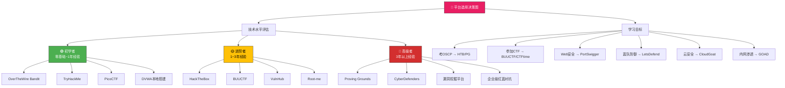

## 一、平台选择策略

面对市面上数十个网络安全实战平台，初学者常常陷入"选择困难症"——每个平台都声称自己最好，但时间和精力有限，不可能全部体验。本节从**技术水平、学习目标、平台特性、成本预算**四个维度，建立一套科学的平台选择框架，帮助读者在最短时间内找到最适合自己的训练路径。

### 1.1 选择框架总览

平台选择本质上是一个多维决策问题。以下决策图从技术水平和学习目标两条主线展开：



选择时需要回答以下核心问题：

| 决策维度 | 关键问题 | 影响因素 |
|---------|---------|---------|
| 技术水平 | 我现在能独立完成什么级别的人物？ | 决定入门平台难度区间 |
| 学习目标 | 我是考证、比赛、就业还是兴趣？ | 决定平台内容侧重点 |
| 时间预算 | 每周能投入多少小时？ | 决定平台数量和训练节奏 |
| 经济预算 | 能否接受付费平台？ | 部分优质平台需要订阅 |
| 学习偏好 | 喜欢看教程还是直接动手？ | 决定交互式vs文档式平台 |

---

### 1.2 按技术水平选择

不同技术水平的选手对平台的需求截然不同。选错难度会产生两种极端后果：太简单导致无聊放弃，太难导致挫败放弃。以下是分级详细指南。

#### 1.2.1 初学者路径（零基础 ~ 1年经验）

**适用人群**：刚接触网络安全的学生、转行从业者、CTF爱好者入门阶段。

| 平台 | 核心定位 | 优势 | 劣势 | 建议投入时间 |
|------|---------|------|------|------------|
| **OverTheWire Bandit** | Linux命令行基础 | 零门槛、24个关卡渐进式设计、纯命令行锻炼基础功 | 仅覆盖Linux基础，不涉及安全攻防 | 2~3周 |
| **TryHackMe** | 系统化安全入门 | 交互式房间(Room)设计、内置虚拟机、大量图解教程、社区活跃 | 高级内容需付费订阅(月$14) | 3~6个月 |
| **PicoCTF** | CTF入门竞赛 | 卡内基梅隆大学出品、每年更新赛题、题目趣味性强 | 每年仅3~4个月开放新赛题 | 每次赛期集中投入 |
| **DVWA** | Web漏洞单点练习 | 本地部署、可调难度、覆盖OWASP Top 10 | 仅Web方向、环境较老 | 持续作为辅助工具 |
| **CyberStart** | 安全竞赛启蒙 | 适合中学生、游戏化设计、无门槛 | 面向美国学生、国内访问受限 | 竞赛周期内 |

**初学者推荐学习路线**：

```text
阶段1（第1~3周）：OverTheWire Bandit
  → 掌握Linux文件操作、权限管理、网络基础命令
  → 目标：独立完成Bandit 0~20关

阶段2（第1~3月）：TryHackMe Pre-Security + Complete Beginner
  → 系统学习Web基础、网络协议、Linux安全
  → 目标：完成两个路径的所有Room

阶段3（第3~6月）：TryHackMe SOC Level 1 或 Cyber Security 101
  → 深入Web安全、基础渗透测试
  → 目标：掌握Burp Suite、Nmap、SQLMap等核心工具

贯穿全程：DVWA本地练习
  → 每学完一个漏洞类型，到DVWA验证
  → 从Low到High逐级挑战
```

**关键建议**：初学者阶段最重要的是**建立信心和习惯**，不要急于挑战高难度靶机。TryHackMe的交互式设计特别适合零基础用户，因为它在每个步骤都提供引导，不会让你卡在某个环境配置问题上浪费半天时间。

#### 1.2.2 进阶者路径（1~3年经验）

**适用人群**：已完成基础入门、有一定CTF或渗透测试经验、准备向专业化方向发展的选手。

| 平台 | 核心定位 | 优势 | 劣势 | 建议投入时间 |
|------|---------|------|------|------------|
| **HackTheBox** | 中高级渗透测试 | 靶机质量极高、更新频繁、活跃社区、退休机器可反复练习 | 需要一定基础才能上手、Easy难度也不简单 | 6~12个月持续 |
| **BUUCTF** | CTF赛题复现 | 国内最大CTF题库、涵盖各方向、支持中文、每日更新 | 题目质量参差不齐、部分老题环境不完整 | 持续刷题 |
| **VulnHub** | 本地渗透靶机 | 完全免费、VMware/VirtualBox直接导入、离线使用 | 靶机较老、部分有已知bug、需要自行搭建网络环境 | 按需下载练习 |
| **Root-me** | 多方向综合训练 | 覆盖Web/密码/取证/逆向等多方向、法语社区底蕴深厚 | 界面不够友好、部分题目说明不够清晰 | 按兴趣方向选择 |
| **VulnLab** | 靶机+内网渗透 | 靶机设计贴近实战、内网渗透链完整、有官方WriteUp | 需要VPN连接、付费($10/月) | 3~6个月 |

**进阶者核心突破点**：

```text
渗透测试能力提升：
  HackTheBox Easy（10台）→ Medium（10台）→ Hard（5台）
  每台机器独立完成，写完整WriteUp
  重点练习：信息收集→漏洞发现→提权→横向移动的完整链

CTF竞赛能力提升：
  BUUCTF按方向刷题：Web / Pwn / Reverse / Crypto
  每周参加1~2场CTFtime上列出的线上赛
  建立个人题库笔记，记录解题思路和工具用法

漏洞复现能力提升：
  VulnHub下载经典靶机（Kioptrix系列、Metasploitable系列）
  对照CVE编号复现真实漏洞
  练习从零搭建攻击环境的能力
```

**关键建议**：进阶阶段要开始**写WriteUp**（解题报告）。这不仅是记录学习过程，更是锻炼技术表达能力——这在求职面试和安全社区中都是核心竞争力。HackTheBox每台机器完成后，建议写一份包含以下要素的WriteUp：目标信息、攻击面分析、漏洞利用过程、提权方法、总结与反思。

#### 1.2.3 高级者路径（3年以上经验）

**适用人群**：有丰富渗透测试或CTF经验、准备OSCP认证、从事安全研究或红蓝对抗的专业人员。

| 平台 | 核心定位 | 优势 | 劣势 | 建议投入时间 |
|------|---------|------|------|------------|
| **Proving Grounds** | OSCP备考专用 | 与OSCP考试环境高度相似、有Practice和Hard两个难度池 | 付费($19/月)、题目风格偏考试导向 | OSCP备考期2~3月 |
| **CyberDefenders** | 蓝队取证分析 | 蓝队领域标杆、真实案件改编、涵盖内存/磁盘/网络取证 | 偏蓝队方向、红队选手可能不适应 | 按需深入 |
| **HackerOne/Bugcrowd** | 真实漏洞挖掘 | 真实企业资产、有赏金激励、锻炼实战漏洞挖掘能力 | 需要合法授权、竞争激烈、法律风险 | 持续参与 |
| **PentesterLab** | Web渗透深入 | 代码审计导向、Ruby on Rails/PHP源码分析 | 付费($20/月)、内容偏Web后端 | 1~3个月专项 |
| **Offensive Security Labs** | 官方OSCP环境 | OffSec出品、与考试直接挂钩、包含VPN环境 | 价格较高($799+)、仅备考使用 | 考试前1~2月 |

**高级者进阶方向**：

```text
方向A：OSCP认证路线
  Proving Grounds Practice（30台Easy+Medium）→ 通过率自测>90%
  → 购买Offensive Security Lab Access
  → 2周集中备考 → 参加考试

方向B：安全研究路线
  HackerOne/Bugcrowd公开项目
  → 漏洞挖掘→提交→修复→复盘
  → 积累CVE编号和赏金记录

方向C：蓝队防御路线
  CyberDefenders全系列完成
  → LetsDefend SOC分析师路径
  → 建立完整的数字取证和事件响应能力

方向D：红队对抗路线
  GOAD（Game of Active Directory）
  → 完整AD域环境攻防
  → DetectionLab搭建企业级靶场
  → 模拟APT攻击链
```

**关键建议**：高级阶段需要**选择专精方向**并深入。试图面面俱到反而会样样稀松。建议根据职业规划选择一个主攻方向（渗透测试/安全研究/蓝队防御/红蓝对抗），将70%的时间投入主攻方向，30%的时间保持其他方向的基本能力。

---

### 1.3 按学习目标选择

除了技术水平，**学习目标**是另一个关键决策因素。不同目标对平台的要求差异很大：

| 学习目标 | 推荐平台 | 核心特点 | 预期收益 | 建议周期 |
|---------|---------|---------|---------|---------|
| **考取OSCP** | HackTheBox + Proving Grounds | HTB练能力，PG练考试 | OSCP证书（全球认可度最高的渗透测试认证） | 6~12个月准备 |
| **CTF竞赛** | BUUCTF + CTFtime + 本地环境 | BUUCTF刷题库，CTFtime追赛事 | 竞赛排名、团队合作经验、技术广度 | 持续投入 |
| **Web安全专精** | PortSwigger Academy + SQLi-labs + Vulhub | PortSwigger系统教学，后两者专项练习 | Burp Suite熟练使用、OWASP Top 10全覆盖 | 3~6个月 |
| **蓝队防御** | LetsDefend + CyberDefenders | SOC工作流模拟、真实案件分析 | SIEM/SOAR操作能力、取证分析技能 | 6~12个月 |
| **内网渗透** | GOAD + DetectionLab + TryHackMe AD模块 | 完整AD域环境、真实企业网络拓扑 | Active Directory攻防能力 | 3~6个月 |
| **云安全** | CloudGoat + AWSGoat + PwnFunction | AWS/Azure/GCP漏洞模拟 | 云原生安全配置、IAM攻防 | 2~4个月 |
| **逆向工程** | CrackMes + Reverse Engineering for Beginners | 从简单crackme到复杂恶意软件分析 | PE/ELF分析、反混淆、调试能力 | 3~6个月 |
| **密码学** | CryptoHack + Cryptopals | 从经典密码到现代密码学挑战 | 密码分析和实现能力 | 2~4个月 |

#### 各目标详细指南

**OSCP备考路线**：

OSCP（Offensive Security Certified Professional）是渗透测试领域认可度最高的认证之一，其考试环境要求考生在24小时内独立完成4台机器的渗透。备考平台选择至关重要：

```text
推荐路线：
  第1阶段（Month 1~2）：HackTheBox
    - 完成20台Easy + 10台Medium难度机器
    - 目标：建立渗透测试方法论和工具使用能力
    - 重点：信息收集（nmap/gobuster）、Web漏洞（SQLi/RCE）、Linux提权

  第2阶段（Month 2~4）：Proving Grounds Practice
    - 完成30台Practice难度 + 15台Hard难度机器
    - 目标：适应与考试一致的环境和难度
    - 重点：Active Directory攻击、多步提权、横向移动

  第3阶段（Month 4~5）：Offensive Security Labs
    - 购买Official Kali Linux + Course Material
    - 完成所有课程练习和Lab机器
    - 目标：完全适应OffSec的出题风格

  第4阶段（Month 5~6）：模拟考试
    - 在Proving Grounds进行3次以上完整模拟考试
    - 每次严格计时4小时（实际考试机器通常比PG简单）
    - 目标：模拟考试通过率 > 80%
```

**CTF竞赛路线**：

CTF（Capture The Flag）竞赛是安全圈最活跃的技术交流形式。主流比赛包括：Jeopardy（解题模式，最常见）、Attack-Defense（攻防对抗）、King of the Hill（抢旗模式）。

```text
CTF入门路线：
  第1阶段：PicoCTF（学生群体）或 TryHackMe CTF路径
    - 了解CTF题目类型：Web/Crypto/Pwn/Reverse/Stego/Misc
    - 完成50道以上各方向基础题

  第2阶段：BUUCTF + 攻防世界(XCTF)
    - 按方向集中刷题：每方向至少30道
    - 建立个人题库笔记（含解题思路、工具用法、踩坑记录）

  第3阶段：CTFtime赛事参与
    - 注册CTFtime账号，关注各大比赛日历
    - 每周至少参加1场线上赛
    - 加入CTF战队或找固定队友

  第4阶段：专项深入
    - 根据竞赛表现选择1~2个主攻方向
    - 研究经典题目和writeup（如CTF Wiki、GitHub writeup仓库）
    - 参加线下赛（如强网杯、网鼎杯、HITCON等）
```

---

### 1.4 平台深度对比

以下从多个维度对主流平台进行横向对比，帮助读者做出更精确的选择：

#### 综合评分对比

| 平台 | 难度范围 | 价格 | 内容质量 | 社区活跃度 | 中文支持 | 新手友好度 | 实战相关度 |
|------|---------|------|---------|-----------|---------|-----------|-----------|
| **TryHackMe** | 入门~中级 | 免费/$14月 | ⭐⭐⭐⭐ | ⭐⭐⭐⭐⭐ | ⭐⭐⭐ | ⭐⭐⭐⭐⭐ | ⭐⭐⭐⭐ |
| **HackTheBox** | 中级~高级 | 免费/$14月 | ⭐⭐⭐⭐⭐ | ⭐⭐⭐⭐⭐ | ⭐⭐⭐ | ⭐⭐ | ⭐⭐⭐⭐⭐ |
| **BUUCTF** | 入门~高级 | 免费 | ⭐⭐⭐ | ⭐⭐⭐⭐ | ⭐⭐⭐⭐⭐ | ⭐⭐⭐ | ⭐⭐⭐ |
| **Proving Grounds** | 中级~高级 | $19/月 | ⭐⭐⭐⭐⭐ | ⭐⭐⭐ | ⭐ | ⭐⭐ | ⭐⭐⭐⭐⭐ |
| **PortSwigger** | 入门~高级 | 免费 | ⭐⭐⭐⭐⭐ | ⭐⭐⭐⭐ | ⭐ | ⭐⭐⭐⭐ | ⭐⭐⭐⭐⭐ |
| **CyberDefenders** | 中级~高级 | 免费/$14月 | ⭐⭐⭐⭐⭐ | ⭐⭐⭐ | ⭐ | ⭐⭐⭐ | ⭐⭐⭐⭐⭐ |
| **LetsDefend** | 入门~中级 | 免费/$10月 | ⭐⭐⭐⭐ | ⭐⭐⭐⭐ | ⭐⭐ | ⭐⭐⭐⭐ | ⭐⭐⭐⭐ |
| **VulnHub** | 中级~高级 | 免费 | ⭐⭐⭐ | ⭐⭐ | ⭐ | ⭐⭐ | ⭐⭐⭐⭐ |
| **PicoCTF** | 入门~中级 | 免费 | ⭐⭐⭐⭐ | ⭐⭐⭐⭐ | ⭐⭐ | ⭐⭐⭐⭐ | ⭐⭐⭐ |
| **Root-me** | 中级~高级 | 免费 | ⭐⭐⭐⭐ | ⭐⭐⭐ | ⭐ | ⭐⭐⭐ | ⭐⭐⭐⭐ |

#### 交互体验对比

| 平台 | 浏览器内虚拟机 | 本地VPN靶机 | 题目引导 | WriteUp参考 | 进度追踪 |
|------|-------------|------------|---------|------------|---------|
| TryHackMe | ✅ 内置 | ✅ OpenVPN | 步骤级引导 | 社区WriteUp | 完整学习路径 |
| HackTheBox | ✅ Playground | ✅ OpenVPN | 无引导 | 社区WriteUp | 成就系统 |
| BUUCTF | ✅ 内置 | ❌ | 无引导 | 社区WriteUp | 分数排名 |
| Proving Grounds | ❌ | ✅ OpenVPN | 无引导 | 官方+社区 | 分数排名 |
| PortSwigger | ✅ Lab环境 | ❌ | 步骤级引导 | 官方解答 | 实验进度 |
| CyberDefenders | ❌ | ✅ 下载 | 无引导 | 社区WriteUp | 完成率统计 |

---

### 1.5 平台组合使用策略

单一平台无法覆盖网络安全的全部技能领域。以下是针对不同职业方向的组合策略：

#### 攻防全栈组合

```text
推荐组合：HackTheBox（红队渗透）+ LetsDefend（蓝队防御）+ CyberDefenders（取证分析）

时间分配：
  HTB（60%）：每周完成1~2台机器，重点练习提权和横向移动
  LetsDefend（25%）：每周完成2~3个Alert Investigation
  CyberDefenders（15%）：每月完成1~2个完整案例

协同效应：
  HTB学到的攻击技术 → 在LetsDefend中从防御视角理解
  CyberDefenders的取证案例 → 反向验证HTB中的攻击痕迹
  三个平台的知识形成"攻击→防御→分析"的闭环
```

#### CTF竞赛组合

```text
推荐组合：BUUCTF（日常刷题）+ CTFtime（赛事追踪）+ 本地工具环境

时间分配：
  BUUCTF（40%）：每日1~2题，维持手感
  CTFtime赛事（40%）：每周1~2场比赛
  本地环境（20%）：Pwn环境用Docker、逆向用Ghidra

工具链：
  Web方向：Burp Suite + SQLMap + dirsearch
  Pwn方向：pwntools + GDB + ROPgadget
  Crypto方向：SageMath + CyberChef + hashlib
  Reverse方向：IDA Pro/Ghidra + x64dbg + dnSpy
```

#### Web安全专精组合

```text
推荐组合：PortSwigger Academy（系统学习）+ Vulhub（漏洞复现）+ DVWA（基础练习）

时间分配：
  PortSwigger（50%）：按Academy课程顺序完成所有Lab
  Vulhub（30%）：每周复现1~2个CVE的真实漏洞环境
  DVWA（20%）：作为日常快速练习环境

学习路线：
  阶段1：PortSwigger Web Security Academy基础课程（~30个Lab）
  阶段2：Vulhub搭建常见漏洞环境（Struts2/Spring/ThinkPHP等）
  阶段3：DVWA逐难度挑战 + 自己编写Exploit
  阶段4：PortSwigger高级课程 + Bugcrowd/HackerOne公开项目
```

#### 内网渗透组合

```text
推荐组合：GOAD（AD域攻防）+ DetectionLab（企业环境）+ TryHackMe AD模块

时间分配：
  TryHackMe AD模块（30%）：作为入门，理解AD基础概念和常见攻击
  GOAD（50%）：核心训练，完成多域多林环境的完整攻击链
  DetectionLab（20%）：搭建自己的企业环境，练习隐蔽攻击

核心技能清单：
  □ Kerberoasting / AS-REP Roasting
  □ Pass-the-Hash / Pass-the-Ticket
  □ DCSync / Golden Ticket / Silver Ticket
  □ LLMNR/NBT-NS投毒
  □ GPO滥用
  □ Certificate Services攻击（ADCS）
  □ LDAP注入
```

---

### 1.6 常见误区与纠正

在平台选择和使用过程中，新手常犯以下错误：

| 误区 | 错误做法 | 正确做法 |
|------|---------|---------|
| **贪多求全** | 同时注册5+平台，每个浅尝辄止 | 选择1~2个核心平台深入，其余按需使用 |
| **难度跳跃** | 刚入门就挑战HackTheBox Medium | 严格按照初学者→进阶→高级的路径递进 |
| **只做不写** | 做完题目不记录、不写WriteUp | 每道题都记录解题思路，积累个人知识库 |
| **依赖WriteUp** | 卡住就立刻看答案 | 独立思考至少2小时再参考WriteUp |
| **忽视基础** | 跳过Linux基础直接学渗透 | OverTheWire Bandit等基础平台不可跳过 |
| **免费执着** | 只用免费平台，拒绝一切付费内容 | 优质付费平台的ROI远高于免费平台 |
| **孤立学习** | 从不参与社区讨论和战队活动 | 加入Discord/论坛社区，参与CTF战队 |
| **重数量轻质量** | 追求完成机器数量 | 每台机器都要彻底理解，能独立复现 |

**关于WriteUp的正确使用方法**：

```text
正确流程：
  1. 独立尝试（至少2小时，记录所有尝试过的方法）
  2. 查看提示（如果平台提供提示系统）
  3. 阅读WriteUp（只看自己卡住的步骤，不要全文照抄）
  4. 独立复现（关闭WriteUp，从头完整做一遍）
  5. 撰写自己的WriteUp（用自己的话和方法重新组织）
  6. 总结收获（这台机器教会了我什么新技巧？）
```

---

### 1.7 免费资源最大化策略

并非所有人都有能力负担付费平台。以下是免费资源的最大化利用方案：

| 平台/资源 | 免费内容范围 | 限制 | 替代方案 |
|----------|------------|------|---------|
| TryHackMe | 约30%的Room免费 | 高级路径和部分Room需订阅 | 利用免费Room打好基础 |
| HackTheBox | 每月2台免费Easy | 仅Easy难度、数量受限 | 退休机器完全免费 |
| PortSwigger | 全部Lab免费 | 无 | 无需替代 |
| BUUCTF | 全部免费 | 无 | 无需替代 |
| VulnHub | 全部免费 | 需自行搭建环境 | 无需替代 |
| PicoCTF | 赛期完全免费 | 仅赛期可用 | CTFtime上的其他免费赛 |
| LetsDefend | 部分Alert免费 | 完整SOC路径需订阅 | CyberDefenders免费案例 |
| PentesterLab | 每周1个免费练习 | 付费内容较多 | PortSwigger作为Web替代 |

**零成本学习路线推荐**：

```text
第1~2月：OverTheWire Bandit + DVWA本地 + TryHackMe免费Room
第3~4月：BUUCTF刷题 + CTFtime线上赛
第5~6月：HackTheBox退休机器 + PortSwigger全免费Lab
第7~12月：VulnHub靶机 + CyberDefenders免费案例 + Root-me
```

---

### 1.8 本节小结

平台选择不是一劳永逸的决策，而是随着技术成长不断调整的动态过程。核心原则是：

1. **先定位后选择**：明确自己当前的技术水平和短期目标，再匹配平台
2. **深入优于广度**：1~2个平台用透，比5个平台各做几题效果好得多
3. **组合优于单一**：红蓝兼修、理论与实战并重，才能建立完整能力体系
4. **输出倒逼输入**：WriteUp和技术博客是最好的学习加速器
5. **社区是隐性资源**：Discord频道、GitHub仓库、论坛讨论中的信息密度远超平台本身

下一节将深入介绍各主流平台的具体使用方法和通关技巧。
