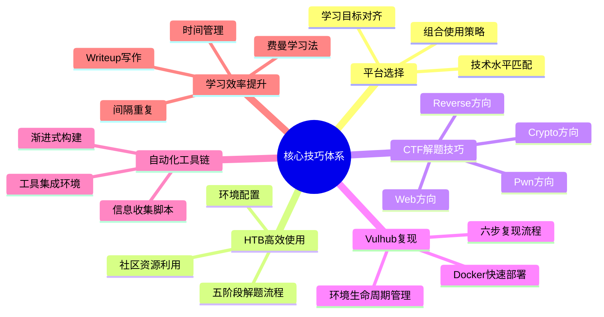
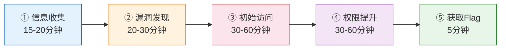
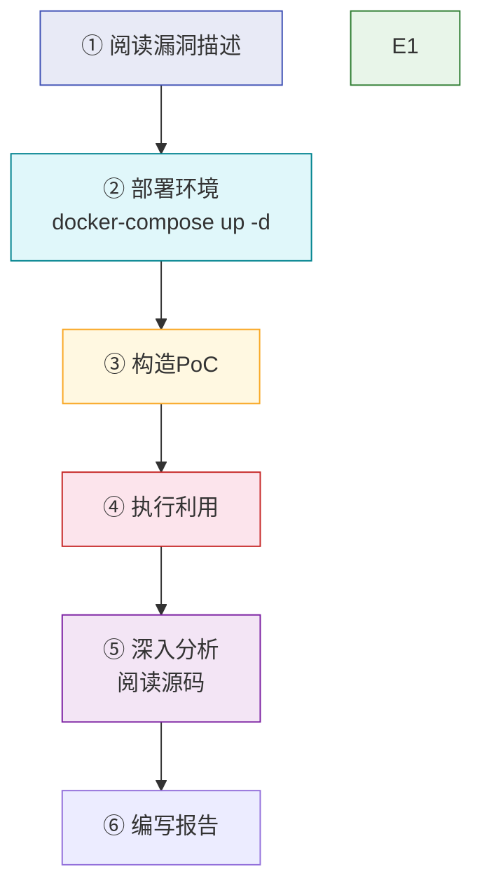
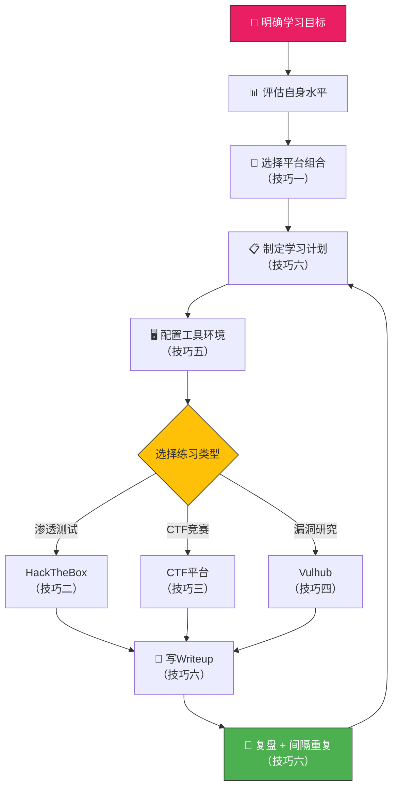

## 七、本节小结

> **本节定位**：核心技巧部分涵盖了平台选择策略、HackTheBox高效使用、CTF解题核心技巧、Vulhub漏洞复现、自动化工具链构建、学习效率提升六大模块。本小结将这些技巧整合为可直接执行的方法论框架，帮助读者建立从"知道"到"做到"的桥梁。

### 7.1 核心技巧全景回顾

以下思维导图展示了本节六大技巧模块的知识脉络与内在逻辑关系：



### 7.2 六大技巧模块精要提炼

#### 技巧一：平台选择——选对赛道比努力更重要

平台选择是整个实战学习的起点。选错了平台，轻则效率低下，重则因难度不匹配而丧失学习动力。

**核心决策矩阵：**

| 决策维度 | 初学者（0-6个月） | 进阶者（6-12个月） | 高级者（12个月+） |
|---------|-------------------|-------------------|------------------|
| 首选平台 | TryHackMe、OverTheWire | HackTheBox、BUUCTF | Proving Grounds、漏洞挖掘平台 |
| 次选平台 | PicoCTF、DVWA | VulnHub、Root-me | CyberDefenders、企业级红蓝对抗 |
| 核心目标 | 建立基础、培养习惯 | 体系化提升、方向选择 | 专业深耕、实战输出 |
| 每日投入 | 1-2小时 | 2-3小时 | 3-4小时 |
| 验收标准 | 完成50+基础挑战 | HTB获得10+台机器 | 提交有效CVE或漏洞赏金 |

**三种推荐组合方案：**

1. **攻防兼备组合**：HackTheBox（红队渗透）+ LetsDefend（蓝队防御）+ CyberDefenders（数字取证）—— 适合希望全面发展的安全工程师
2. **CTF竞赛组合**：BUUCTF（日常刷题）+ CTFtime（赛事信息）+ 本地工具环境 —— 适合以CTF竞赛为目标的学习者
3. **Web安全组合**：PortSwigger Academy（系统学习）+ Vulhub（漏洞复现）+ DVWA（练习）—— 适合专攻Web安全方向

**关键原则**：不要"一个平台吃到底"，也不要"五个平台齐头并进"。最优策略是"2+1+1"——2个核心平台做主线、1个复现环境做补充、1个实践出口做输出。

---

#### 技巧二：HackTheBox高效使用——标准化流程是效率的基石

HackTheBox是全球最知名的渗透测试靶场之一。高效使用的关键在于建立**标准化的解题流程**，而非依赖临场发挥。

**五阶段标准解题流程：**



**各阶段核心命令速查：**

| 阶段 | 核心命令 | 关键产出 |
|------|---------|---------|
| 信息收集 | `nmap -sC -sV -p- -T4 target_ip` | 开放端口、服务版本 |
| 目录枚举 | `gobuster dir -u http://target -w wordlist.txt` | 隐藏路径、敏感文件 |
| 漏洞搜索 | `searchsploit apache 2.4.49` | 已知CVE列表 |
| 提权检查 | `./linpeas.sh`、`find / -perm -4000` | SUID文件、可利用配置 |
| Flag获取 | `cat /home/*/user.txt`、`cat /root/root.txt` | User Flag + Root Flag |

**黄金30分钟原则**：遇到卡点时，先独立思考至少30分钟。30分钟后仍无进展，可以查阅HTB的官方提示系统（Hint），但只获取下一步方向，不要直接看完整writeup。

---

#### 技巧三：CTF解题——四大方向的核心武器库

CTF竞赛涵盖多个技术方向，每个方向都有独特的解题思路和工具链。

**四大方向技术武器库：**

| 方向 | 核心工具 | 关键技能 | 典型题型 |
|------|---------|---------|---------|
| Web | Burp Suite、SQLMap、dirsearch | SQL注入、XSS、文件上传、SSRF | 代码审计、逻辑漏洞利用 |
| Crypto | CyberChef、RsaCtfTool、SageMath | RSA攻击、哈希碰撞、编码分析 | 已知加密方案的弱点利用 |
| Reverse | IDA Pro、Ghidra、x64dbg | 反汇编分析、动态调试、算法还原 | ELF/PE逆向、Android逆向 |
| Pwn | pwntools、ROPgadget、one_gadget | 缓冲区溢出、ROP链构造、堆利用 | 栈溢出、格式化字符串漏洞 |

**CTF解题通用策略：**

1. **先观察再动手**：运行程序、查看提示、分析文件类型，不要一上来就写exploit
2. **优先做拿手方向**：比赛时间有限，先确保拿到自己擅长方向的分数
3. **时间分配原则**：每道题设置最大时间上限（如30分钟），超时果断跳过
4. **善用工具但不依赖工具**：SQLMap能跑出结果，但也要能手工构造注入Payload

---

#### 技巧四：Vulhub漏洞复现——理解漏洞本质的最佳途径

Vulhub提供了基于真实CVE的预构建Docker环境，让学习者专注于理解漏洞原理，而非浪费时间在环境搭建上。

**标准六步复现流程：**



**环境管理命令速查：**

```bash
# 启动环境
docker-compose up -d

# 停止环境（保留数据）
docker-compose down

# 停止环境并清理所有数据（完全重置）
docker-compose down -v

# 查看运行日志（调试用）
docker-compose logs -f

# 进入容器调试
docker exec -it container_id /bin/bash

# 查看容器端口映射
docker-compose ps
```

**每次复现的必做产出：**
- 漏洞原理的源码级分析（至少500字）
- 利用步骤的详细记录（含所有命令和截图）
- PoC/Exp脚本（自己能写或修改）
- 修复方案（官方补丁 + 临时防护措施）

---

#### 技巧五：自动化工具链——用工具放大人的能力

手动执行重复性操作是低效的。构建自动化工具链，让机器处理机械性工作，人专注于分析和决策。

**渐进式工具链构建路线：**

| 阶段 | 时间 | 工具集 | 重点能力 |
|------|------|--------|---------|
| 初期 | 0-3个月 | Nmap、Gobuster、Nikto、Burp Suite | 基础扫描、手动测试 |
| 中期 | 3-6个月 | AutoRecon、Metasploit、BloodHound | 自动化扫描、漏洞利用 |
| 高级 | 6个月+ | Nuclei、自定义脚本、CI/CD集成 | 定制化工具开发 |

**自动化信息收集脚本模板：**

```bash
#!/bin/bash
# auto-recon.sh — 自动化信息收集脚本
# 用法: ./auto-recon.sh <target_ip>

TARGET=$1
OUTPUT_DIR="recon_$(date +%Y%m%d)_$TARGET"
mkdir -p "$OUTPUT_DIR"

echo "[*] Starting reconnaissance against $TARGET"

# 第一步：全端口扫描
echo "[1/4] Running full port scan..."
nmap -sC -sV -p- -T4 "$TARGET" -oN "$OUTPUT_DIR/nmap_full.txt" 2>/dev/null

# 第二步：Web目录枚举
echo "[2/4] Running directory enumeration..."
gobuster dir -u "http://$TARGET" \
    -w /usr/share/wordlists/dirb/common.txt \
    -o "$OUTPUT_DIR/gobuster.txt" \
    -t 20 2>/dev/null

# 第三步：子域名枚举
echo "[3/4] Running subdomain enumeration..."
subfinder -d "$TARGET" -o "$OUTPUT_DIR/subdomains.txt" 2>/dev/null

# 第四步：服务指纹识别
echo "[4/4] Running service fingerprinting..."
whatweb "http://$TARGET" > "$OUTPUT_DIR/whatweb.txt" 2>/dev/null

echo "[*] Scan complete. Results saved in $OUTPUT_DIR/"
echo "[*] Quick summary:"
echo "    - Open ports: $(grep -c "open" "$OUTPUT_DIR/nmap_full.txt" 2>/dev/null || echo 0)"
echo "    - Directories found: $(wc -l < "$OUTPUT_DIR/gobuster.txt" 2>/dev/null || echo 0)"
echo "    - Subdomains found: $(wc -l < "$OUTPUT_DIR/subdomains.txt" 2>/dev/null || echo 0)"
```

**关键原则**：自动化不是一次性搭建完所有工具。先用好基础工具（Nmap + Gobuster），等这些工具的输出你能完全看懂后，再逐步引入更高级的自动化工具。

---

#### 技巧六：学习效率提升——让每一小时的学习产出最大化

安全学习是长期过程，效率决定了你能走多远。

**四种高效学习方法：**

| 方法 | 核心原理 | 具体操作 | 适用场景 |
|------|---------|---------|---------|
| 费曼学习法 | 教是最好的学 | 用简单语言向别人解释概念，发现盲点后回去重学 | 理解原理时 |
| 间隔重复 | 对抗遗忘曲线 | 用Anki制作知识卡片，按1小时/1天/7天/30天的周期复习 | 记忆命令、端口号、Payload时 |
| Writeup写作 | 输出倒逼输入 | 每完成一个挑战写一篇writeup，即使已有参考答案 | 每次挑战结束后 |
| 番茄工作法 | 保持专注度 | 25分钟专注解题 + 5分钟休息，遇到卡点超过30分钟看提示 | 每日学习时 |

**时间管理黄金法则：**

- **每日目标**：设定2-3个具体的学习目标（如"完成HTB一台Easy靶机"、"复现CVE-2021-22986"）
- **卡点处理**：独立思考30分钟无进展 → 查阅提示（非完整writeup） → 15分钟仍无进展 → 查看writeup关键步骤
- **复盘周期**：每周日做一次复盘，总结本周学到的新知识点、遇到的卡点、下周的学习重点
- **节奏把控**：连续学习25天后休息2天进行复盘，利用睡眠巩固记忆

### 7.3 核心技巧的组合应用框架

六大技巧不是孤立的，而是一个有机整体。以下框架展示了如何将它们组合应用：



**实际应用示例——以"3个月掌握Web安全基础"为目标：**

| 月份 | 技巧应用 | 具体行动 | 产出物 |
|------|---------|---------|--------|
| 第1个月 | 技巧一+六 | 选择THM+PortSwigger组合，制定每日2小时学习计划 | 学习计划表、知识卡片库 |
| 第1个月 | 技巧五 | 搭建基础工具环境（Nmap、Burp Suite、SQLMap） | 工具使用Cheatsheet |
| 第2个月 | 技巧二+三 | 在THM完成Web安全路径，在PortSwigger完成基础Lab | 15+篇Writeup |
| 第2个月 | 技巧四 | 在Vulhub上复现5个Web类CVE | 漏洞分析报告 |
| 第3个月 | 技巧三+六 | 在BUUCTF上完成20道Web题，每题写Writeup | CTF题解集 |
| 第3个月 | 技巧六 | 间隔重复回顾前2个月的笔记，查漏补缺 | 更新后的知识库 |

### 7.4 从技巧到能力的转化清单

掌握技巧和形成能力是两回事。以下清单用于检验你是否真正将技巧内化为能力：

**入门级检验（完成60%即为合格）：**

- [ ] 能根据自身水平说出3个适合的平台及选择理由
- [ ] 能在20分钟内完成一次完整的Nmap全端口扫描并解读结果
- [ ] 能在DVWA上独立完成SQL注入（Union查询）的完整利用
- [ ] 能用Docker在本地部署一个Vulhub漏洞环境
- [ ] 能写一个简单的自动化信息收集脚本
- [ ] 能用费曼学习法向别人解释"什么是SQL注入"

**进阶级检验（完成60%即为合格）：**

- [ ] 能在2小时内独立完成一台HTB Easy靶机
- [ ] 能在CTF中独立解决Web/Crypto/Reverse/Pwn中的至少一个方向
- [ ] 能独立复现3个以上CVE漏洞并写出源码级分析
- [ ] 能构建包含5个以上工具的自动化工作流
- [ ] 拥有20篇以上结构化的Writeup
- [ ] 能用间隔重复系统管理100+张知识卡片

**高级检验（完成60%即为合格）：**

- [ ] 能在4小时内完成一台HTB Medium靶机
- [ ] 能在Vulhub上独立复现复杂CVE（如反序列化链构造）
- [ ] 能编写自定义的自动化漏洞扫描工具
- [ ] 能在漏洞赏金平台提交有效漏洞
- [ ] 能撰写专业的渗透测试报告（含风险评估和修复建议）
- [ ] 能指导初学者建立自己的学习路径

### 7.5 常见执行误区与纠正

即便掌握了所有技巧，在实际执行中仍容易踩坑。以下是高频出现的执行误区：

| 误区 | 表现 | 根因 | 纠正方法 |
|------|------|------|---------|
| 工具先行 | 先安装一堆工具，再找题目做 | 把"准备"误当成"进展" | 先选1道题，只装必要的工具 |
| Writeup成瘾 | 每道题都看writeup，感觉"看懂了"就过 | 把"被动知识"误当成"主动能力" | 执行"三次独立尝试"规则 |
| 平台跳槽 | 一周换一个平台，每个都浅尝辄止 | 缺乏耐心，追求新鲜感 | 强制自己在1个平台完成50题再换 |
| 只做不写 | 做完题目不记录，下次遇到同样的还是不会 | 认为写笔记浪费时间 | 每道题至少记录"题目→漏洞→Payload→收获" |
| 忽视蓝队 | 只会攻击不会防御，能力结构失衡 | 认为"防守不酷" | 每月完成1个LetsDefend或CyberDefend任务 |
| 死记硬背 | 死记命令和Payload，不理解原理 | 短期速成心态 | 每条命令都要问"为什么这样写" |

### 7.6 本节核心要点速记卡

为了便于快速回顾，以下是本节所有技巧的精炼速记：

```text
┌─────────────────────────────────────────────────────────┐
│               核心技巧速记卡                              │
├─────────────────────────────────────────────────────────┤
│                                                         │
│  【平台选择】2+1+1组合：2核心+1复现+1输出               │
│  【HTB流程】信息收集→漏洞发现→初始访问→提权→Flag        │
│  【CTF策略】先做拿手方向，每题30分钟上限                  │
│  【Vulhub复现】读描述→部署→构造PoC→利用→源码分析→报告   │
│  【自动化】渐进构建：基础工具→集成环境→定制脚本          │
│  【效率提升】费曼+间隔重复+Writeup+番茄工作法            │
│                                                         │
│  【黄金法则】                                            │
│  · 卡点独立思考30分钟再看提示                            │
│  · 每天固定时间段学习，保持节奏                          │
│  · 每周复盘一次，查漏补缺                               │
│  · 写Writeup是最好的学习方式                             │
│  · 安全学习是马拉松，不是百米冲刺                        │
│                                                         │
└─────────────────────────────────────────────────────────┘
```

### 7.7 进阶方向指引

本节覆盖的六大技巧是"术"的层面——即具体怎么做。在接下来的两个章节中，我们将进入更深的层次：

- **第八章（高级CTF解题技巧）**：在掌握基础解题技巧后，深入反序列化利用、SSTI攻击、Padding Oracle、堆利用、内核提权等高级技术。这是从"能解题"到"能解难题"的跨越。
- **第九章（系统化学习路径规划）**：从方法论层面规划从零基础到专业水平的完整学习路径，包含24个月的学习计划、各阶段里程碑、能力评估矩阵。这是从"碎片化学习"到"体系化成长"的跃迁。

> **核心观点**：技巧是武器，方法论是兵法。只有武器没有兵法，你会在战场上迷失方向；只有兵法没有武器，你只能纸上谈兵。本节给你的六大技巧就是六把武器，接下来的高级技巧和路径规划将教你如何在实战中运用它们——道法术器贯通，方为正道。
