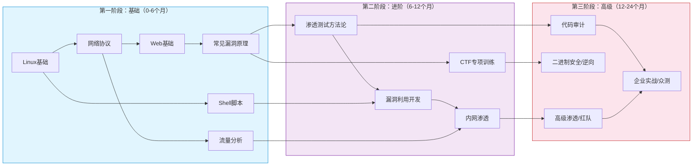
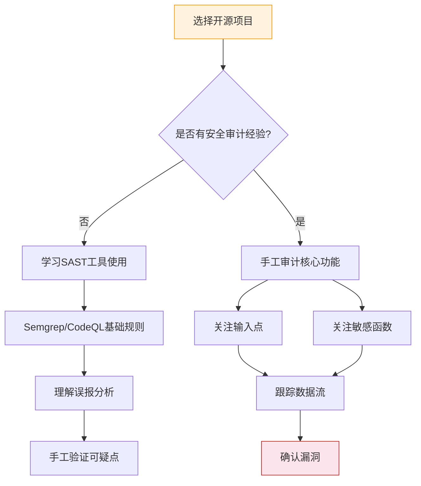

## 九、系统化学习路径规划

> **核心观点**：网络安全学习不是知识的堆砌，而是一条需要精心规划的攀登路线。没有系统化的路径，90%的学习者会在3个月内因方向迷失而放弃。本章为你提供一条经过验证的、从零基础到专业水平的完整学习路径——它不是一个僵化的课表，而是一套可以**根据你的背景、目标和节奏动态调整**的弹性框架。

---

### 9.1 为什么需要系统化学习路径

#### 9.1.1 自学的三大陷阱

网络安全领域的信息浩如烟海——仅 Exploit-DB 就收录了超过 50,000 个漏洞，CVE 数据库每年新增 20,000+ 漏洞记录。初学者面对的不仅是"学什么"的问题，更是"不学什么"的抉择。

**陷阱一：收藏即学会**

| 维度 | 详情 |
|------|------|
| 症状 | 无休止地收藏教程、课程、工具列表，但从不系统使用 |
| 数据 | Baymard Institute 研究发现，69% 的书签从未被再次打开；国内安全学习社群调研显示，82% 的成员收藏超过 200 篇教程，实际消化率不足 5% |
| 心理机制 | 收藏行为激活大脑奖赏回路，产生"我已经在学了"的虚假满足感，这在心理学中被称为**替代性成就**（Vicarious Achievement） |
| 后果 | 信息过载导致行动瘫痪——越收藏越焦虑，越焦虑越不想开始 |
| 纠正 | 采用**"72小时规则"**：收藏的任何资源，72小时内必须阅读/实践，否则删除。每周清理收藏夹，只保留本周要用的3-5个资源 |

**陷阱二：跳级心态**

| 维度 | 详情 |
|------|------|
| 症状 | 跳过基础直接尝试高级漏洞（如未学Web基础直接看内网渗透；未学C语言直接搞二进制） |
| 心理机制 | 社交媒体上"零基础30天拿到OSCP"的帖子制造了不切实际的期望 |
| 后果 | 连续受挫 → 自信心崩塌 → 怀疑自己不适合 → 放弃 |
| 类比 | 没学会走路就想跑百米跨栏——不是不可能，而是大概率受伤 |
| 纠正 | 严格遵循**"前置技能检查清单"**：进入每个新模块前，确认已掌握该模块要求的前置知识（本章各阶段均附有检查清单） |

**陷阱三：工具依赖症**

| 维度 | 详情 |
|------|------|
| 症状 | 只会用 Metasploit 一键利用、SQLMap 自动注入，不懂原理 |
| 数据 | SANS 调查显示，68% 的安全面试会考察底层原理而非工具熟练度；红队岗位面试中，85% 的技术问题需要解释"为什么"而非"怎么做" |
| 后果 | 换个环境就寸步难行；面试一问就倒；无法应对自定义场景（目标做了WAF/自研系统时工具失效） |
| 纠正 | 遵循**"三遍法"**：第一遍用工具跑通流程；第二遍手动复现每个步骤；第三遍阅读工具源码理解实现原理 |

#### 9.1.2 系统化路径的底层逻辑

有效的学习路径遵循**布鲁姆教育目标分类学**（Bloom's Taxonomy）的六层认知阶梯。这套认知模型由美国教育心理学家 Benjamin Bloom 于1956年提出，2001年经 Anderson & Krathwohl 修订为"认知过程维度"，被全球教育领域广泛采用：

| 层级 | 认知层次 | 安全领域对应 | 具体示例 | 验证方式 |
|------|----------|-------------|---------|---------|
| 1 | 记忆（Remember） | 记住漏洞类型、端口号、命令 | 记住 3306 是 MySQL 端口、8080 是 Tomcat | 能在30秒内默写常见端口和服务 |
| 2 | 理解（Understand） | 解释攻击原理、协议机制 | 解释 SQL 注入为什么能绕过认证 | 能用自己的话向非技术人员讲清楚 |
| 3 | 应用（Apply） | 在靶机上复现攻击 | 对 DVWA 执行 SQL 注入 | 能独立完成，不看教程 |
| 4 | 分析（Analyze） | 拆解漏洞代码、推理攻击链 | 分析一句话木马的工作原理，拆解多步攻击链 | 能画出完整的攻击流程图 |
| 5 | 评价（Evaluate） | 比较不同攻击方式的优劣 | 判断何时用布尔盲注而非时间盲注 | 能写出技术方案对比分析 |
| 6 | 创造（Create） | 发现 0-day、编写工具 | 编写自动化漏洞扫描脚本 | 能产出原创安全工具或发现未知漏洞 |

**核心原则**：每个新知识点都按这六层走完，才能形成真正的能力。跳过前两层是盲目操作，卡在第一层是死记硬背。

> **实践建议**：每学完一个知识点，用"六层检查法"自测——如果卡在某一层，说明该知识点还没学透，需要回到那一层重新巩固。例如：你能用 SQLMap 注入（第3层），但说不清 `UNION SELECT` 的原理（第2层），那就暂停推进，先补原理。

#### 9.1.3 不同背景的路径适配

系统化路径不是一刀切。你的起点决定了前6个月的重点分配：

| 背景类型 | 优势领域 | 需补强的短板 | 路径调整建议 |
|----------|---------|-------------|-------------|
| 计算机科班（CS学位） | 编程基础扎实、数据结构/算法熟悉 | 安全攻防实操经验、漏洞利用直觉 | 可压缩编程基础（1个月→2周），加速进入Web安全实战 |
| 运维/DevOps背景 | Linux/网络熟练、系统管理经验丰富 | Web漏洞原理、代码审计能力 | 跳过Linux基础（1周适应即可），重点投入Web安全和渗透方法论 |
| 前端/后端开发者 | Web技术栈熟悉、有编程思维 | 网络协议底层、系统安全、攻防思维 | 可并行学习Web安全+网络基础，利用编程优势快速上手漏洞利用脚本 |
| 完全零基础（非IT行业） | 无认知定式，学习路径更纯粹 | 所有基础知识需要从零构建 | 严格按基础→进阶→高级路线走，不跳级，预留额外2-4个月基础期 |
| 数学/物理背景 | 逻辑推理能力强、对算法有直觉 | 编程实现能力、系统实操经验 | 加速密码学/逆向方向，但需补编程和系统基础 |

**路径适配原则**：不是所有阶段都需要相同时间，而是**所有能力维度都需要达到对应层级**。评估自己的起点，跳过已掌握的内容，但不要跳过需要验证的部分。

---

### 9.2 网络安全知识体系全景图

以下是网络安全24个月学习路径的知识依赖关系图，展示了各技能模块的先后顺序和横向关联：



#### 各阶段核心能力矩阵

| 能力维度 | 基础阶段目标（0-6月） | 进阶阶段目标（6-12月） | 高级阶段目标（12-24月） |
|----------|----------------------|----------------------|------------------------|
| Linux 操作 | 熟练使用命令行、权限管理、文件系统导航 | Shell 脚本编写、服务配置与调优、cron 定时任务 | 定制内核模块、systemd 服务开发、自动化部署 |
| 网络知识 | OSI模型、TCP/IP、HTTP/HTTPS、DNS | Wireshark 深度分析、流量特征识别、协议攻击 | 网络协议逆向、自定义协议分析、隧道技术 |
| Web 安全 | OWASP Top 10 理解+复现 | 复杂漏洞链利用、WAF绕过、业务逻辑漏洞 | 0-day 发现、CMS 审计、API安全测试 |
| 工具使用 | Nmap、Burp Suite、dirsearch 基础 | Metasploit、SQLMap 进阶、BloodHound | C2 框架、自定义工具开发、武器化 |
| 编程能力 | Python 基础语法、简单脚本 | Python 利用脚本编写、正则表达式 | C/汇编、Shellcode 编写、工具框架开发 |
| 认知层次 | Bloom 1-2层（记忆+理解） | Bloom 3-4层（应用+分析） | Bloom 5-6层（评价+创造） |

---

### 9.3 基础阶段——初学者路径（0-6个月）

#### 9.3.1 阶段定位与目标

**目标读者**：零基础或仅有少量计算机知识的学习者

**阶段目标**：
- 掌握 Linux 命令行操作，能够独立搭建实验环境
- 理解网络协议基础，能进行基本的流量分析
- 熟悉 OWASP Top 10 漏洞原理，能在靶机上复现
- 建立学习笔记体系，培养持续学习的习惯
- 掌握基础 Python 编程，能写简单的安全工具

**验收标准（全部达成才能进入进阶阶段）**：
- ✅ 能不依赖教程在 30 分钟内搭建 LAMP/LEMP 环境
- ✅ 能用 Nmap 完成端口扫描并解读结果（不只是运行命令，而是理解每个参数的含义和输出中每个字段的意义）
- ✅ 能在 DVWA 上独立完成 SQL 注入、XSS、文件包含三个漏洞的利用
- ✅ 能用 Python 写一个简单的端口扫描器（支持多线程）
- ✅ 能用 Wireshark 抓取并分析 HTTP 请求/响应
- ✅ 建立了至少有 20 篇笔记的个人知识库

#### 9.3.2 按周分解的学习计划

| 周次 | 学习主题 | 推荐平台/资源 | 每日投入 | 里程碑 | 产出物 |
|------|---------|--------------|---------|--------|--------|
| 1-2 | Linux 命令行基础 | OverTheWire Bandit（1-20关） | 2h | 完成 Bandit，熟练 30+ Linux 命令 | 命令速查表 + 每关解题笔记 |
| 3-4 | 网络协议基础 | TryHackMe Pre Security 路径 | 2h | 理解 HTTP/DNS/TCP 协议细节 | OSI/TCP-IP 层级思维导图 |
| 5-8 | Web 入门 + 漏洞原理 | TryHackMe Complete Beginner | 2-3h | 完成路径，理解核心漏洞概念 | 每种漏洞的原理笔记（≥500字） |
| 9-10 | OWASP Top 10 实践 | PortSwigger Academy（基础篇） | 2h | 独立完成所有 Lab | SQL 注入完整流程笔记 |
| 11-12 | 漏洞复现综合 | DVWA + upload-labs | 2-3h | 在本地完成 20+ 漏洞练习 | 至少 5 篇漏洞复现 Writeup |
| 13-14 | Python 安全编程基础 | 《Python黑帽子》前4章 + 实操 | 2h | 能写端口扫描器和简单爬虫 | 端口扫描器代码 + 使用文档 |
| 15-16 | 漏洞复现进阶 | Vulhub 环境 + CVE 复现 | 2-3h | 独立复现 5+ 个 CVE | 5 篇 CVE 复现报告 |
| 17-24 | 综合实战 + 查漏补缺 | DVWA 高难度 + TryHackMe 高级房间 | 2-3h | 形成完整的知识体系 | 个人安全知识库 v1.0 |

> **学习节奏建议**：每周至少安排 5 天学习，连续学 25 天后休息 2 天进行复盘。间隔休息能让大脑通过睡眠巩固记忆——神经科学研究表明，记忆巩固主要发生在 REM 睡眠阶段。斯坦福大学Andrew Huberman实验室的研究证实，睡眠期间海马体到新皮层的记忆转移效率比清醒时高40%。

#### 9.3.3 各平台深度解析

**OverTheWire Bandit**（2周）
- 定位：Linux 命令实战入门，全球最受欢迎的命令行游戏化学习平台
- 核心价值：在游戏中学习，每关解决一个具体问题，从易到难平滑过渡
- 学习方法：
  1. 不看答案独立通关，每关记录用到的命令和原理
  2. 如果卡住超过 30 分钟，查阅提示（不是答案）再尝试
  3. 通关后复盘：整理所有用到的 Linux 命令，分类归纳（文件操作/文本处理/网络/权限）
- 进阶要求：通关后尝试用 Bash 脚本自动化过关过程（编写 `auto_bandit.sh`）

**TryHackMe Complete Beginner**（8周）
- 定位：系统化的安全入门课程，提供浏览器内虚拟机
- 核心价值：从理论到实操的完整链路，内置靶机环境，无需本地搭建
- 学习方法：
  1. 跟随课程进度，每学完一个模块在 DVWA 上额外练习巩固
  2. 遇到卡顿先独立思考 30 分钟，然后查阅官方文档而非直接看 walkthrough
  3. 每完成一个房间，在笔记中记录：目标 → 思路 → 工具 → 命令 → 结论
- 注意事项：免费版有部分房间限制，Pro版（$14/月）解锁全量内容，建议先用免费内容验证学习兴趣

**PortSwigger Academy**（4周）
- 定位：Web 安全界的"百科全书"，由 Burp Suite 开发商出品
- 核心价值：官方出品的权威教材，涵盖所有 Web 漏洞类型，Lab 设计精良
- 学习方法：
  1. 按模块学习，每类漏洞：读官方文档 → 理解原理 → 完成所有 Lab → 自己写 Payload
  2. 推荐顺序：SQL 注入 → XSS → CSRF → SSRF → 文件上传 → XXE → 反序列化 → 路径穿越 → 认证漏洞
  3. 每个 Lab 至少用两种方法完成（如 SQL 注入用联合查询法和报错法各做一遍）
- 特别价值：完成所有 Lab 可获得 PortSwigger 认证，这是简历上的加分项

**DVWA + upload-labs**（2周）
- 定位：本地靶场，用于漏洞单点突破训练
- 核心价值：可以看源码理解漏洞本质，不受外部网络限制，可反复练习
- 搭建方式：
  ```bash
  # DVWA
  docker run --rm -it -p 80:80 vulnerables/web-dvwa
  
  # upload-labs
  docker run --rm -it -p 8080:80 c0ny1/upload-labs
  ```
- 练习方法：
  1. 分别在 Low/Medium/High 三个难度级别完成所有漏洞
  2. 每个难度级别的防护机制不同——理解为什么 Low 能过而 Medium 不能过
  3. 源码审计：读 PHP 源码，理解每层防护的原理和绕过方式

#### 9.3.4 每日学习时间分配方案

针对有全职工作/学业的读者，推荐**2小时黄金学习模式**：

```text
┌─────────────────────────────────────────┐
│         每日2小时学习时间分配            │
├─────────────────────────────────────────┤
│  前10分钟 │ 复习昨日笔记 + Anki卡片      │
│  后50分钟 │ 平台课程/靶机练习（主力）    │
│  中10分钟 │ 休息 + 拉伸 + 梳理思路       │
│  后40分钟 │ 实操练习 + 记笔记            │
│  末10分钟 │ 写学后总结 + 明天的任务列表  │
└─────────────────────────────────────────┘
```

**全职学习者 6小时强化模式**：

```text
┌─────────────────────────────────────────┐
│         每日6小时学习时间分配            │
├─────────────────────────────────────────┤
│  09:00-09:30  │ 复习+规划               │
│  09:30-12:00  │ 理论学习（课程/文档）    │
│  12:00-13:30  │ 午餐+午休               │
│  13:30-16:00  │ 实操练习（靶机/CVE）    │
│  16:00-16:15  │ 休息                    │
│  16:15-17:30  │ Writeup+笔记整理        │
│  17:30-18:00  │ 当日复盘+明日规划       │
└─────────────────────────────────────────┘
```

**周末加强模式**（周末额外 3 小时）：
- 第1小时：完整复现本周学过的 1 个漏洞（不看任何参考）
- 第2小时：阅读 2-3 篇相关漏洞的高质量 writeup
- 第3小时：撰写自己的 writeup 并整理笔记，更新知识库索引

#### 9.3.5 基础阶段常见误区

| 误区 | 表现 | 危害 | 纠正方法 |
|------|------|------|---------|
| 依赖图形界面 | 不愿用命令行，遇到问题就放弃 | 安全领域 90% 的工具和场景都是命令行驱动的 | 强制自己一周内只用终端操作，从 `ls`、`cd`、`grep` 开始 |
| 死记命令 | 不理解参数含义，只会照着抄 | 换个场景就不知道该用什么参数 | 每个命令至少 `man` 一次，理解各参数作用；尝试不看文档复述常用参数 |
| 贪多求全 | 同时学 5 个平台，每个都浅尝辄止 | 每个都学了一点，每个都不深入 | 聚焦一个平台完成后再切换。推荐顺序：Bandit → THM → PortSwigger → DVWA |
| 忽视笔记 | 学完就忘，同一问题反复搜索 | 知识无法积累，永远在重复学习 | 建立个人知识库（如 Obsidian），每学必记。遵循"三句话原则"：每条笔记至少用自己的话写三句话总结 |
| 跳过原理 | 只追求"做出来"，不关心"为什么" | 知其然不知其所以然，无法举一反三 | 每个漏洞复现后，用费曼技巧向自己解释原理 |
| 过度依赖AI | 遇到问题直接问AI，不独立思考 | 思维能力得不到锻炼，形成依赖 | 遇到问题先独立思考30分钟，实在解决不了再查资料/问AI |

---

### 9.4 进阶阶段——能力提升路径（6-12个月）

#### 9.4.1 阶段定位

**目标**：从"能复现"到"能独立发现和利用"

**前置检查（进入本阶段前请确认）**：
- [ ] 能熟练使用 Nmap、Burp Suite、Wireshark
- [ ] 理解 OWASP Top 10 中每种漏洞的原理
- [ ] 能独立在 DVWA 上完成所有漏洞利用
- [ ] 能用 Python 编写简单的脚本
- [ ] 建立了基本的学习笔记体系

**阶段目标**：
- 掌握完整渗透测试方法论（PTES/OWASP Testing Guide）
- 能够独立完成 HackTheBox Easy/Medium 级别靶机
- 具备 CTF 基础题目的解题能力
- 深入理解漏洞原理，能用 Python 编写利用脚本
- 能在 Vulhub 上独立复现真实 CVE

**验收标准**：
- ✅ 能在 2 小时内完成 1 台 HTB Easy 靶机
- ✅ 能编写自定义 SQL 注入脚本（非 SQLMap）
- ✅ 能在 Vulhub 上独立复现至少 10 个 CVE
- ✅ 能在 CTF 中独立解决 50% 以上的 Web 题目
- ✅ 能按照 PTES 流程完成一次完整的渗透测试（靶机或模拟环境）

#### 9.4.2 核心学习模块

**模块一：渗透测试方法论（持续贯穿）**

渗透测试方法论是从"零散技能"到"体系化能力"的桥梁。没有方法论，你的每一次渗透都是随机尝试；有了方法论，你能系统地覆盖所有攻击面。

推荐学习以下框架之一：

**PTES**（Penetration Testing Execution Standard）—— 业界最常用的7阶段标准流程：

| 阶段 | 核心任务 | 关键工具/技术 | 输出物 |
|------|---------|--------------|--------|
| 1. 前期交互 | 明确测试范围、规则、目标 | 需求文档、法律授权 | 调试授权书、测试计划 |
| 2. 情报收集 | OSINT + 被动/主动信息收集 | Maltego、theHarvester、Shodan、子域名枚举 | 目标资产清单 |
| 3. 威胁建模 | 识别高价值目标和潜在攻击路径 | 攻击树分析、资产优先级排序 | 威胁模型文档 |
| 4. 漏洞分析 | 扫描 + 手动验证 | Nessus、Nmap脚本引擎、Burp Suite | 漏洞清单（含严重等级） |
| 5. 漏洞利用 | 利用已发现漏洞获取访问权限 | Metasploit、自定义Exploit、社会工程 | 初始访问凭证 |
| 6. 后渗透 | 横向移动、权限提升、数据收集 | BloodHound、Mimikatz、PsExec、隧道技术 | 完整攻击链文档 |
| 7. 报告撰写 | 整理发现、提出修复建议 | 漏洞报告模板、CVSS评分 | 专业渗透测试报告 |

- **OWASP Testing Guide v5**：91 个测试用例覆盖 Web 全栈，更偏向 Web 安全审计

> **实战要求**：每次做靶机时，**强制自己按方法论流程走**，而不是凭感觉乱试。记录每一步用到的工具和命令。即使某些阶段在靶机上不适用（如"前期交互"），也要写出"本阶段不适用，原因是……"——这培养了你的方法论意识。

**模块二：HackTheBox 靶机训练（持续）**

HackTheBox 是全球最大的在线靶机平台，拥有 600+ 靶机，是锻炼真实渗透能力的最佳训练场。

| 阶段 | 靶机类型 | 建议数量 | 目标时间 | 学习重点 |
|------|---------|---------|---------|---------|
| 入门期 | HTB Easy（Linux） | 20台 | 3-4小时/台 | 信息收集、Web漏洞利用、基础提权 |
| 巩固期 | HTB Easy（Windows） | 10台 | 3-4小时/台 | Windows环境适应、SMB/RDP服务利用 |
| 提升期 | HTB Medium（Linux） | 15台 | 4-6小时/台 | 复杂漏洞链、自定义漏洞利用、横向移动 |
| 挑战期 | HTB Medium（Windows） | 10台 | 6-8小时/台 | AD渗透、域渗透基础、多步攻击链 |

**关键方法论：IKEA（独立思考法）**

```text
I - Identify（识别）    → Nmap全端口扫描，识别开放服务和版本
K - Know  （了解）      → 搜索该服务的已知漏洞（Searchsploit/Google/CVE）
E - Exploit（利用）     → 尝试已知攻击手法，或基于服务特性构造攻击
A - Analyze（分析）     → 分析失败原因，调整策略，循环迭代
```

> **核心规则**：每次至少独立思考 **1小时** 后才看 writeup。看 writeup 时只查关键卡点——找到卡住的那一行就停下，自己继续往后做。让 writeup 手把手带你走完整个过程是最大的学习陷阱。

**IKEA 方法的进阶用法**：
- 记录每次 IKEA 循环的迭代次数和耗时，追踪自己的解题效率提升
- 对于超过3小时的靶机，强制停止，看 writeup 学习思路，记录"卡点原因分析"
- 建立个人"卡点数据库"：记录每次卡住的原因、解决方法、耗时——这是最有价值的学习资产

**模块三：Vulhub 漏洞复现（每周1-2个）**

Vulhub 的价值在于**基于真实 CVE 的预构建环境**，让你专注于理解漏洞本身而非环境搭建。

推荐漏洞复现清单（按照学习难度递增）：

| 序号 | CVE 编号 | 漏洞名称 | 难度 | 学习重点 |
|------|---------|---------|------|---------|
| 1 | CVE-2017-12615 | Tomcat PUT 任意文件写入 | ★☆☆ | HTTP方法滥用、文件上传绕过 |
| 2 | CVE-2017-10271 | WebLogic XMLDecoder 反序列化 | ★★☆ | Java反序列化原理、XML解析器安全 |
| 3 | CVE-2018-7600 | Drupal Drupalgeddon2 RCE | ★★☆ | 框架级漏洞影响、表单API滥用 |
| 4 | CVE-2019-0193 | Solr 远程命令执行 | ★★☆ | JMX接口安全、Velocity模板注入 |
| 5 | CVE-2020-14756 | WebLogic T3 反序列化 | ★★★ | T3协议、IIOP协议、Java反序列化链 |
| 6 | CVE-2021-22986 | F5 BIG-IP iControl RCE | ★★★ | 企业设备漏洞、REST API安全 |
| 7 | CVE-2022-22965 | Spring4Shell RCE | ★★★ | Spring框架机制、ClassLoader利用 |
| 8 | CVE-2023-46604 | Apache ActiveMQ RCE | ★★★ | 消息队列安全、RMI利用 |

**每复现一个漏洞，必须产出以下交付物**：
- 漏洞原理的源码级分析（至少 500 字的原理说明）
- 利用步骤的详细记录（含所有命令和截图）
- Poc/Exp 脚本（自己能写或修改现有脚本）
- 修复方案（官方补丁/临时防护措施/WAF规则）
- **一句话总结**：用一句话向同事解释这个漏洞的本质

**模块四：CTF 专项训练**

CTF 是检验和提升安全技能的**最佳竞技场**——它提供了限时、有目标、有对抗的学习环境。

**推荐平台与路径**：

| 平台 | 定位 | 难度范围 | 推荐用途 |
|------|------|---------|---------|
| BUUCTF | 国内最大的CTF题库 | 入门-高级 | 基础题目练习，Web方向50题起步 |
| BugKu | 中文CTF入门平台 | 入门-中级 | 中文题目，适合国内CTF入门 |
| CTFhub | 按技术分类训练 | 入门-中级 | 专项技能训练（SQLi/XSS/SSRF等） |
| HackTheBox | 靶机+CTF混合 | 中级-极限 | 综合实战能力提升 |
| PicoCTF | 卡内基梅隆大学出品 | 入门-中级 | 教育导向，适合系统学习 |

**CTF 学习策略**：
- 每类题型（SQLi、XSS、SSRF、RCE、文件上传、反序列化、密码学、逆向）至少完成 10 题
- 建立自己的 **CTF Toolkit**：收集常用的 payload、编码/解码脚本、自动化工具
- 加入 CTF 战队或找 2-3 个学习伙伴，定期组队刷题
- 赛后复盘：每场比赛结束后，对未解出的题目做详细复盘报告
- **写题解**：即使题目简单，也练习写标准化的 Writeup——这是面试时最好的作品集

#### 9.4.3 Writeup 撰写指南

写 writeup 是**最强的学习方式**——它迫使你把隐性的知识显性化。认知心理学中的"生成效应"（Generation Effect）表明，主动生成的内容比被动接收的内容记忆深度高2-3倍。

**标准 writeup 模板**：

```markdown
# [靶机名/题目名] Writeup

## 基本信息
- 靶机/平台：HackTheBox / Vulhub / CTFhub
- 难度：Easy / Medium / Hard
- 涉及技术：SQL 注入、权限提升、端口转发等
- 完成时间：X小时
- IP地址：XXX.XXX.XXX.XXX

## 信息收集
### Nmap 扫描
```bash
nmap -sC -sV -p- <target_ip>
```text
- 扫描结果摘要
- 识别出的服务与版本
- 发现的敏感信息/异常端口

## 漏洞分析与利用
### 漏洞类型：[具体类型]
### 发现过程
- 在 [URL/端口] 处发现 [漏洞类型]
- 判断依据：[具体的请求/响应特征]

### 利用步骤
1. 确认注入：`id=1' AND 1=1--+`
2. 判断字段数：`id=1' ORDER BY 3--+`
3. 获取数据库名：`id=1' UNION SELECT 1,database(),3--+`
4. ...

### 关键命令/脚本
[列出所有关键命令和自定义脚本]

## 权限提升
### 枚举发现
- 发现 SUID 文件：[文件名及权限]
- 发现可利用的 cron job
- 发现敏感配置文件

### 提权过程
[详细步骤]

## 总结与反思
### 学到了什么新技巧
1. ...

### 卡住的关键点是什么
- 卡点：[具体描述]
- 原因分析：[为什么卡住]
- 解决方法：[如何解决]

### 如果重来一次会如何优化
1. 时间分配优化：...
2. 工具选择优化：...
3. 思路调整：...
```

**Writeup 质量检查清单**：
- [ ] 陌生人能按你的 writeup 复现整个过程吗？
- [ ] 每个步骤都有命令和输出截图吗？
- [ ] 包含了失败的尝试和原因分析吗？
- [ ] 总结部分有具体的收获和反思吗？
- [ ] 整理了相关知识点的链接和参考资料吗？

---

### 9.5 高级阶段——专业水平路径（12-24个月）

#### 9.5.1 阶段定位

**目标**：具备专业安全工程师的实战能力，能够发现真实世界的安全漏洞

**前置检查（进入本阶段前请确认）**：
- [ ] 能在 2 小时内完成 HTB Easy 靶机
- [ ] 至少完成 50 个 HTB 靶机（Easy + Medium）
- [ ] 能编写自定义 Python 利用脚本
- [ ] 理解内网渗透的基本概念
- [ ] 至少写过 20 篇 Writeup

**阶段目标**：
- 独立完成 HTB Hard/Insane 级别靶机
- 具备代码审计能力，能发现真实开源项目中的漏洞
- 参与漏洞众测（Bug Bounty）并获得实际收益
- 攻防兼备：理解蓝队防御思路
- 能撰写专业级渗透测试报告

**验收标准**：
- ✅ 能在 4 小时内完成 HTB Medium 靶机，8 小时内完成 HTB Hard 靶机
- ✅ 能在 HackerOne/Bugcrowd 平台上提交有效漏洞
- ✅ 能够解读常见 Web 框架（Spring/ThinkPHP/Laravel）的源码并发现安全问题
- ✅ 能够撰写专业级的渗透测试报告（含风险评估和修复建议）
- ✅ 至少获得 1 个安全认证（OSCP/eWPT/CRTO等）

#### 9.5.2 核心学习模块

**模块一：高级渗透测试**

| 练习平台 | 难度 | 目标 | 推荐数量 | 费用参考 |
|---------|------|-----|---------|---------|
| HTB Hard | 专业级 | 掌握复杂的漏洞利用链 | 20+ | $14/月（VIP） |
| HTB Insane | 极限级 | 挑战极限渗透技巧 | 10+ | 同上 |
| Proving Grounds Practice | OSCP 级 | 模拟真实渗透考试 | 30+ | $19/月 |
| PentesterLab PRO | 企业级 | 企业环境渗透 | 20+ | $20/月 |
| VulnHub（离线靶机） | 中级-高级 | 离线环境练习 | 10+ | 免费 |

**模块二：企业级环境渗透要点**

从单台靶机到企业内网渗透，核心能力的跃迁在于：从利用单点漏洞到构建多步攻击链。

**1. 内网渗透**

| 技术类别 | 核心工具 | 学习重点 |
|---------|---------|---------|
| 内网信息收集 | BloodHound、ADExplorer、SharpHound | AD拓扑可视化、攻击路径自动发现 |
| 横向移动 | PsExec、WMI、WinRM、Pass-the-Hash | 不同移动方式的适用场景和检测特征 |
| 域权限提升 | Kerberoasting、AS-REP Roasting、Unconstrained Delegation | AD认证协议的安全弱点 |
| 票据攻击 | Golden Ticket、Silver Ticket、Diamond Ticket | Kerberos协议的深入理解和利用 |
| 隧道技术 | Chisel、ligolo-ng、ssh隧道、DNS隧道 | 内网穿透、流量转发、绕过网络隔离 |

**2. 绕过技术**

| 绕过目标 | 核心技术 | 实战要点 |
|---------|---------|---------|
| AV/EDR 绕过 | Shellcode 编码、进程注入、AMSI 绕过 | 理解杀毒引擎检测原理（特征码/行为检测/沙箱） |
| WAF 绕过 | 编码变换、分块传输、协议层绕过 | 了解主流 WAF（Cloudflare/AWS WAF/阿里云WAF）的检测逻辑 |
| 应用白名单绕过 | LOLBins、DLL 劫持、PowerShell 绕过 | 利用系统合法程序执行恶意代码 |
| 日志清理 | 清除 Event Log、修改时间戳、日志注入 | **注意：仅限授权渗透测试使用** |

**3. C2 框架使用**

| 框架 | 特点 | 适用场景 |
|------|------|---------|
| Cobalt Strike | 商业级，功能全面，生态丰富 | 企业红队、付费用户首选 |
| Sliver | 开源免费，Go语言编写 | 个人学习、预算有限的团队 |
| Havoc | 开源，现代化UI，支持多种Shellcode | 中小团队红队 |
| Mythic | 开源，模块化架构 | 自定义需求强的高级用户 |

**学习路线建议**：先学 Cobalt Strike（市场占有率最高），再了解 Sliver/Havoc（开源替代方案），最后根据需求选择。

**模块三：漏洞众测实战**

Bug Bounty 是检验真实能力的最佳途径——你面对的是真实的生产环境、真实的防御措施、真实的竞争对手。

**入门步骤**：
1. 注册 HackerOne / Bugcrowd / 补天平台 / 漏洞盒子
2. 选择 Scope：从"高奖金、竞争小"的冷门项目开始
3. 阅读 30+ 篇公开的 Bug Bounty Reports，学习他人发现漏洞的思路和报告写法
4. 使用 Burp Suite 自动化扫描 + 手动验证
5. 从小项目积累经验和信誉，逐步挑战大型项目

**众测方法论：5步法**

```text
① 选定目标 → ② 信息收集 → ③ 探索攻击面 → ④ 漏洞验证 → ⑤ 报告提交
     ↓            ↓             ↓              ↓             ↓
  选择scope   子域名扫描    参数fuzz      拦截请求取证    高质量报告
  分析规则    目录爆破     端点分析      POC构建      严格避免重复
  研究历史    JS分析      业务逻辑     影响评估      及时沟通
```

**高质量漏洞报告模板要素**：
- 清晰的标题（含漏洞类型+影响，如："SSRF via PDF generator allows access to internal metadata"）
- 复现步骤（Step by Step，含截图或视频）
- POC 代码或请求报文（HTTP请求/响应全文）
- 影响评估（CVSS 评分 + 业务影响描述，如："攻击者可读取AWS元数据，获取IAM临时凭证"）
- 修复建议（让开发能直接执行的方案，如："在PDF生成服务中禁止请求内网地址段10.0.0.0/8和169.254.169.254"）

**众测收益预期管理**：
- 前3个月：学习为主，可能只有1-3个有效提交，奖金很少
- 3-6个月：逐步找到感觉，每月可提交5-10个有效漏洞
- 6-12个月：稳定产出，部分人月收入可达数千至数万元
- 注意：不要把众测当作主要收入来源，它是学习和提升的副产品

**模块四：代码审计能力培养**

代码审计是从"利用已知漏洞"到"发现未知漏洞"的关键跨越。



**代码审计的核心方法论**：

| 步骤 | 操作 | 工具/技巧 |
|------|------|----------|
| 1. 确定审计范围 | 识别核心功能模块、路由入口、API端点 | 项目文档、目录结构分析 |
| 2. 数据流追踪 | 从用户输入到敏感操作的完整数据流 | grep/search源码、IDE的"Find Usages" |
| 3. 关键函数审查 | 审查SQL执行、文件操作、命令执行、序列化等函数 | SQL: `query/exec/execute`; 文件: `open/read/write`; 命令: `system/exec/popen` |
| 4. 权限检查验证 | 审查认证、授权、会话管理逻辑 | 检查中间件、过滤器、权限注解 |
| 5. 配置文件审查 | 数据库凭证、调试开关、CORS配置 | `.env`、`config.yaml`、`web.config` |

**推荐练习项目（从小到大）**：
1. **小型**（1-2天）：DVWA 源码审计（熟悉常见漏洞的 PHP 代码形态）
2. **中型**（1-2周）：RailsGoat / WebGoat（完整应用的审计，含已知漏洞供验证）
3. **大型**（2-4周）：WordPress 插件审计（真实环境、真实漏洞、有奖金激励）
4. **实战**：参与开源项目的安全审计（如 Google VRP、Microsoft MSRC）

**代码审计常用 Semgrep 规则示例**：
```yaml
# SQL注入检测规则
- id: python-sql-injection
  pattern: |
    $QUERY = "..." + $INPUT + "..."
    $DB.execute($QUERY)
  message: "Potential SQL injection via string concatenation"

# 命令注入检测规则
- id: python-command-injection
  pattern: |
    os.system("..." + $INPUT)
  message: "Potential command injection via os.system"
```

#### 9.5.3 能力评估矩阵

定期用下表自评能力水平（1-5分，5为最高）：

| 能力项 | 6个月目标 | 12个月目标 | 24个月目标 | 评估方法 |
|--------|----------|-----------|-----------|---------|
| Linux操作 | 4 | 5 | 5 | 无提示完成Bandit全部关卡 |
| Web漏洞利用 | 3 | 4 | 5 | 独立复现OWASP Top 10 + 10个CVE |
| 内网渗透 | 1 | 2 | 4 | 完成5台内网靶机 + AD渗透 |
| 代码审计 | 1 | 3 | 4 | 发现3个开源项目的真实漏洞 |
| 逆向分析 | 1 | 2 | 3 | 完成10道PicoCTF逆向题 |
| 工具开发 | 2 | 3 | 4 | 开源1个安全工具/Gist被收藏 |
| 报告写作 | 2 | 3 | 4 | 众测平台获得3个有效漏洞确认 |
| 漏洞挖掘 | 1 | 2 | 4 | 众测平台获得奖金 |

> **评估方法**：每月做一次自我评估，对照 HTB 靶机的实际完成情况校准分数。分数不必追求全部满分——找到自己的优势方向深耕。短板达到"够用"即可（3分），优势方向追求卓越（5分）。

---

### 9.6 学习效率方法论

#### 9.6.1 费曼学习法在安全学习中的应用

理查德·费曼的"学习四步法"是检验知识掌握程度的黄金标准：

**四步法变体**：
1. **选概念**：选择一个安全概念（如"SSRF 攻击原理"）
2. **教别人**：假装给一个初级开发者讲解，必须用最简单的语言，避免术语
3. **找漏洞**：讲解过程中发现自己解释不清楚的地方——这些就是你的知识盲点
4. **回炉**：重新查阅资料，补齐盲点，重复步骤2

> **判断标准**：如果你不能用 3 句话让一个 Linux 管理员理解 SQL 注入的本质，说明你自己也没完全搞懂。费曼的原话是："如果你不能把一个概念教给大一新生，那你并没有真正理解它。"

**费曼法在安全学习中的实践方式**：
- 写技术博客：每学完一个主题，写一篇"面向非安全人员的解释文章"
- 组织学习小组分享：每月做一次技术分享（15-20分钟）
- 录制教学视频：用OBS录制自己讲解漏洞原理的过程，回看时检查表达是否清晰

#### 9.6.2 刻意练习 vs 重复劳动

心理学家Anders Ericsson提出的"刻意练习"理论指出：**有目的的练习**与**漫无目的的重复**之间存在本质区别。

| 特征 | 重复劳动（低效） | 刻意练习（高效） |
|------|-----------------|----------------|
| 练习内容 | 做同样的事情，停留在舒适区 | 挑战能力边界，每次略超出当前水平 |
| 反馈机制 | 无反馈或延迟反馈 | 即时反馈（writeup对照/CTF评分/靶机flag） |
| 难度选择 | 舒适区内反复，感觉很"顺" | 略高于当前水平，感觉"有点难但能做到" |
| 专注程度 | 机械执行，可以边聊天边做 | 高度专注，全神贯注 |
| 典型表现 | 每天跑一样的扫描器 | 尝试不同的绕过技术、构造新的Payload |
| 学习效率 | 100小时=1小时的水平提升 | 100小时=50小时的水平提升 |

**刻意练习在安全学习中的具体应用**：
- 每次做靶机时，给自己加一个**额外的限制**（如"本台靶机不允许使用 SQLMap"或"必须用纯手工方式利用"）
- 每次解题后，问自己"还有没有另一种解法？"并尝试实现
- 定期做"回顾测试"：一个月前不会的题目，现在能独立完成吗？
- 设定具体的短期目标（如"本周掌握 SSRF 的5种绕过方式"）而非模糊的"学好SSRF"

#### 9.6.3 知识管理：从笔记到知识库

**推荐工具**：Obsidian（本地化、Markdown、图谱视图、插件生态丰富）

**为什么选 Obsidian**：
- 数据本地存储，不受云服务影响
- 双向链接（`[[ ]]`语法）构建知识图谱
- 丰富的插件：Templater模板、Dataview数据查询、Excalidraw画图
- 支持 Git 版本控制，可追溯笔记修改历史

**笔记系统四象限**：

```text
┌─────────────────────────────────────┐
│      临时笔记           │   永久笔记     │
│  （快速捕捉）          │ （整理固化）   │
├─────────────────────────────────────┤
│  - 解题过程中的发现    │ - 漏洞原理总结  │
│  - 突然想到的思路      │ - 工具使用手册  │
│  - 看到的payload       │ - Wiki 式知识库 │
├─────────────────────────────────────┤
│      项目笔记           │   索引笔记     │
│  （单次任务）          │ （导航目录）   │
├─────────────────────────────────────┤
│  - 某台靶机writeup     │ - 标签系统      │
│  - 某次CTF复盘         │ - MOC（内容地图）│
│  - 某个平台的学习日志  │ - 学习路径规划  │
└─────────────────────────────────────┘
```

**每周复盘清单**：
- [ ] 本周学了多少新概念？（3-5个为健康值）
- [ ] 笔记是否已整理归档？临时笔记是否已转化为永久笔记？
- [ ] 是否写了至少 1 篇 writeup？
- [ ] 是否有卡住的知识点需要进一步学习？
- [ ] 下周的学习重点是什么？是否需要调整学习计划？
- [ ] 本周有没有"教别人"的机会？（费曼法实践）

#### 9.6.4 利用间隔重复对抗遗忘

**Ebbinghaus 遗忘曲线**告诉我们：学完 24 小时后，如果不复习，会遗忘约 74% 的内容。但通过科学的间隔复习，可以把长期记忆保持率提升到 90% 以上。

**复习策略（基于遗忘曲线优化）**：

| 复习时机 | 距离首次学习 | 遗忘率（不复习） | 复习时长 | 复习方式 |
|---------|-------------|----------------|---------|---------|
| 第1次复习 | 1 小时后 | 约 56% | 5-10分钟 | 快速浏览笔记要点 |
| 第2次复习 | 24 小时后 | 约 74% | 10-15分钟 | 回忆+笔记对照 |
| 第3次复习 | 7 天后 | 约 77% | 15-20分钟 | 做相关练习题/复现 |
| 第4次复习 | 30 天后 | 约 79% | 20-30分钟 | 教别人/写博客 |

**工具推荐**：
- **Anki**：Spaced Repetition 卡片系统，用于记忆命令、端口号、payload、漏洞特征
- 自制知识卡片模板：
  - 正面："SQL 注入中检测列数的命令"
  - 背面："' ORDER BY N--+（N=1,2,3... 直到报错）"
  - 正面："Kerberoasting 攻击的前置条件"
  - 背面："域内任意账户，目标账户设置了SPN且使用弱密码"

**Anki 在安全学习中的高效用法**：
- 每天早晚各花 5 分钟复习 Anki 卡片（利用碎片时间）
- 卡片类型多样化：命令卡片、概念卡片、场景卡片（"看到X特征→可能是Y漏洞"）
- 每周新增 10-20 张卡片（从本周学习内容中提取），保持复习量稳定

#### 9.6.5 平台期突破策略

在持续学习 6-12 个月后，几乎每个人都会遇到**平台期**——感觉学了很久但没有明显进步，做靶机的效率停滞不前。

**平台期的识别信号**：
- 同一难度级别的靶机完成时间不再缩短
- 遇到新服务/新技术时感到迷茫和焦虑
- 对学习失去新鲜感，开始怀疑方向是否正确
- 看别人的 writeup 觉得"我也能想到"，但自己做时就是卡住

**突破策略**：

| 策略 | 具体做法 | 原理 |
|------|---------|------|
| 换方向学习 | Web方向卡住时，试试逆向/密码学/OSINT | 交叉学习激活不同脑区，回到原方向时往往有新视角 |
| 教别人 | 加入社群解答新人问题，写技术博客 | 费曼法+检索式学习，教的过程会暴露知识盲点 |
| 降低难度 | 回头做简单的题，找"心流"状态 | 在舒适区边缘重新建立信心和节奏 |
| 提高难度 | 直接挑战Hard/Insane靶机 | 强制大脑进入高强度模式，倒逼能力提升 |
| 换工具 | 一直用Burp Suite试试换ZAP或手工 | 新工具有新视角，可能发现之前忽略的攻击面 |
| 组队学习 | 找2-3个水平相近的人组学习小组 | 社交压力+集体智慧+分工协作 |

> **关键心态**：平台期不是退步，是能力正在内化的信号。就像竹子在前4年只长3厘米，但第5年以每天30厘米的速度疯长——前4年的"平台期"是在地下扎根。

---

### 9.7 方向分化：找到你的主攻领域

24 个月后，你应该根据兴趣、市场需求和能力特长确定主攻方向。以下四个方向不是互斥的——大多数资深安全专家都至少有2-3个方向的交叉能力。

#### 方向一：Web 安全工程师

**适合人群**：喜欢 Web 技术，对 HTTP/前端/后端有浓厚兴趣，逻辑思维强

**核心技术栈**：
- 深入：OWASP Top 10 + API 安全 + 微服务安全 + 云安全
- 编程：Python（自动化）+ JavaScript/TypeScript（前端安全）+ PHP/Java（代码审计）
- 框架：Spring/ThinkPHP/Laravel/Struts 安全审计
- 认证：OSWE（Web-300）/ eWPTX / PortSwigger认证

**日常技能矩阵**：

| 技能领域 | 具体能力 |
|---------|---------|
| 漏洞挖掘 | 业务逻辑漏洞、API越权、反序列化、二次注入 |
| 工具链 | Burp Suite Pro + 自定义插件 + SQLMap + 自研脚本 |
| 代码审计 | PHP/Java/Python 源码审计、SAST 工具定制 |
| WAF 绕过 | 编码绕过、分块传输、协议层绕过 |

**职业发展路径**：
```text
初级Web安全工程师 → 中级安全工程师 → 高级安全工程师 → 安全架构师/安全顾问
(1-2年)            (2-4年)           (4-6年)          (6年+)
薪资参考(国内)：    10-15K             15-25K            25-40K            40K+
```

#### 方向二：红队/渗透测试工程师

**适合人群**：喜欢攻防对抗，享受突破限制的快感，心理素质强

**核心技术栈**：
- 深入：内网渗透 + 域渗透 + 社会工程学 + 物理渗透
- 编程：Python（工具开发）+ C#（.NET环境利用）+ PowerShell（AD渗透）
- C2：Cobalt Strike / Sliver / Havoc
- 认证：OSCP（PWK-200）/ CRTO / PNPT

**日常技能矩阵**：

| 技能领域 | 具体能力 |
|---------|---------|
| 信息收集 | OSINT、子域名枚举、端口扫描、服务识别 |
| 漏洞利用 | Web漏洞利用、服务漏洞利用、社会工程 |
| 后渗透 | 权限提升、横向移动、持久化、数据渗出 |
| 报告撰写 | 渗透测试报告、风险评估、修复建议 |

**职业发展路径**：
```text
初级渗透测试工程师 → 中级渗透测试工程师 → 高级红队工程师 → 红队负责人/安全总监
(1-2年)              (2-4年)              (4-6年)           (6年+)
薪资参考(国内)：      12-18K               18-30K            30-50K           50K+
```

#### 方向三：二进制安全/逆向工程师

**适合人群**：对底层原理着迷，喜欢逆向思维，数学/逻辑能力强

**核心技术栈**：
- 深入：汇编语言（x86/x64/ARM）+ 操作系统原理 + 编译器原理
- 工具：IDA Pro / Ghidra / x64dbg / GDB / Binary Ninja
- 领域：漏洞利用开发（Exploit Dev）+ 恶意软件分析 + 漏洞挖掘（Fuzzing）
- 认证：OSED（EXP-301）/ GREM / OSCE3

**日常技能矩阵**：

| 技能领域 | 具体能力 |
|---------|---------|
| 逆向分析 | 静态分析（IDA/Ghidra）+ 动态调试（x64dbg） |
| 漏洞挖掘 | Fuzzing（AFL/libFuzzer）、崩溃分析、根因定位 |
| 漏洞利用 | 栈溢出、堆溢出、格式化字符串、UAF利用 |
| 恶意软件 | 样本分析、脱壳、反混淆、IOC提取 |

**职业发展路径**：
```text
初级逆向工程师 → 中级漏洞研究员 → 高级Exploit开发者 → 安全研究员/漏洞猎人
(1-2年)          (2-4年)           (4-6年)             (6年+)
薪资参考(国内)：  15-22K            22-35K             35-60K           60K+
```

#### 方向四：安全运维/蓝队工程师

**适合人群**：喜欢防守，善于分析和监控，注重细节，系统思维强

**核心技术栈**：
- 深入：SIEM/IDS/IPS + 威胁情报 + 应急响应 + 安全合规
- 工具：Splunk / ELK / Wazuh / Suricata / Sigma Rules
- 领域：安全运营（SOC）+ 风险评估 + 安全架构设计
- 认证：Security+ / CISSP / GCIA / CySA+

**日常技能矩阵**：

| 技能领域 | 具体能力 |
|---------|---------|
| 威胁检测 | 日志分析、异常行为检测、威胁狩猎 |
| 应急响应 | 事件调查、恶意软件分析、取证分析 |
| 安全架构 | 网络分段、零信任架构、安全基线 |
| 合规审计 | 等保2.0、ISO 27001、GDPR |

**职业发展路径**：
```text
初级安全运维 → 中级安全工程师 → 高级安全架构师 → 安全总监/CISO
(1-2年)        (2-4年)          (4-6年)           (6年+)
薪资参考(国内)：10-15K           15-25K            25-40K           40K+
```

#### 方向选择决策框架

| 决策因素 | Web安全 | 红队/渗透 | 二进制/逆向 | 蓝队/SOC |
|---------|---------|----------|------------|---------|
| 入门难度 | ★★☆ | ★★★ | ★★★★ | ★★☆ |
| 市场需求 | 非常大 | 大 | 中等 | 非常大 |
| 薪资天花板 | 高 | 非常高 | 非常高 | 高 |
| 远程工作机会 | 多 | 中等 | 多 | 中等 |
| 持续学习压力 | 中等 | 高 | 非常高 | 中等 |
| 对编程要求 | 高 | 中高 | 非常高 | 中等 |
| 推荐认证 | OSWE/eWPT | OSCP/CRTO | OSED/GREM | CISSP/CySA+ |

> **建议**：不要在初期就急于选择方向。前12个月应该广泛涉猎，了解每个方向的特点。第12-18个月开始有侧重地深入。第18个月后基本确定主攻方向。方向可以随时调整——安全领域的技能是高度可迁移的。

---

### 9.8 作品集构建：你的安全能力名片

在求职或接项目时，**作品集比证书更有说服力**。以下是你应该在24个月内积累的作品资产：

#### 作品集构成

| 作品类型 | 数量目标 | 质量要求 | 展示平台 |
|---------|---------|---------|---------|
| Writeup | 30+ 篇 | 每篇含完整流程+原理分析+反思 | 博客/GitHub Pages |
| CVE 复现报告 | 15+ 篇 | 源码级分析+利用脚本+修复建议 | 技术博客/先知社区 |
| 安全工具 | 3+ 个 | 有README/文档/使用示例 | GitHub（开源） |
| CTF 成绩 | 参加 5+ 场 | 排名进入前 30% | CTFtime.org |
| 漏洞报告 | 5+ 个有效提交 | 高质量报告格式 | HackerOne/Bugcrowd/补天 |
| 技术博客 | 20+ 篇 | 原创深度文章 | 个人博客/先知社区/FreeBuf |

#### GitHub 个人主页建议

```text
kyle-derrick
├── README.md          # 个人简介 + 技能标签 + 作品集链接
├── security-tools/    # 自研安全工具仓库
│   ├── port-scanner/  # 端口扫描器
│   ├── sql-fuzzer/    # SQL模糊测试工具
│   └── ...
├── writeups/          # Writeup 合集
│   ├── htb/           # HackTheBox
│   ├── ctf/           # CTF比赛
│   └── cve/           # CVE复现
└── notes/             # 学习笔记（可选公开）
```

---

### 9.9 学习资源生态

#### 必读书籍（按学习阶段排序）

| 阶段 | 书名 | 作者 | 推荐理由 | 阅读方式 |
|------|------|------|---------|---------|
| 基础 | 《Web安全深度剖析》 | 张炳帅 | 中文最系统的 Web 安全入门 | 通读+实操 |
| 基础 | 《白帽子讲Web安全》 | 吴翰清 | 阿里安全专家的实战总结 | 通读+实操 |
| 进阶 | 《Web应用安全权威指南》 | OWASP | 官方指南，体系完整 | 作为参考手册 |
| 进阶 | 《渗透测试实践指南》 | Georgia Weidman | 极其实践导向的渗透测试教程 | 通读+靶机配合 |
| 进阶 | 《SQL注入攻击与防御》 | Justin Clarke | SQL 注入领域最全面的参考书 | 精读核心章节 |
| 高级 | 《网络安全渗透测试》 | 徐焱 | OSCP 备考中文参考书 | 备考配合使用 |
| 高级 | 《0day安全：软件漏洞分析技术》 | 王清 | 二进制漏洞利用的经典教材 | 精读+GDB实操 |
| 高级 | 《红队渗透测试技术》 | 李华峰 | 红队方法论的系统总结 | 方法论参考 |
| 通用 | 《The Web Application Hacker's Handbook》 | Stuttard & Pinto | Web安全领域的"圣经" | 全书精读 |
| 通用 | 《Hacking: The Art of Exploitation》 | Jon Erickson | 漏洞利用开发的经典 | 精读+代码实操 |

#### 技术社区与信息源

| 类型 | 名称 | 网址 | 用途 | 更新频率 |
|------|------|------|------|---------|
| 技术博客 | 先知社区 | xianzhi.aliyun.com | 高质量的中文安全技术文章 | 每日更新 |
| 技术博客 | FreeBuf | freebuf.com | 安全资讯 + 技术教程 | 每日更新 |
| 文库 | 安全客 | anquanke.com | CTF writeup + 漏洞分析 | 每日更新 |
| 新闻 | The Hacker News | thehackernews.com | 全球安全资讯 | 每日更新 |
| 论文 | arXiv Cryptography | arxiv.org | 前沿安全研究论文 | 每周 |
| 论坛 | 52PoJie | 52pojie.cn | 逆向与破解社区 | 活跃 |
| 国际社区 | Reddit r/netsec | reddit.com/r/netsec | 国际安全社区讨论 | 活跃 |
| 国际社区 | HackerOne Hacktivity | hackerone.com/hacktivity | 真实漏洞披露报告 | 持续更新 |
| GitHub | Awesome Security | github.com/sbilly/awesome-security | 安全资源汇总 | 社区维护 |
| 播客 | Darknet Diaries | darknetdiaries.com | 安全事件故事 | 每周 |

#### YouTube 频道推荐

| 频道 | 风格 | 适合阶段 | 内容特色 |
|------|------|---------|---------|
| **IppSec** | 深度分析 | 进阶-高级 | HTB 靶机 walkthrough 的天花板，每期 1-2 小时深度分析 |
| **The Cyber Mentor** | 实战教学 | 基础-进阶 | 实战导向的渗透测试教学，TCM Security 创始人 |
| **John Hammond** | 生动有趣 | 基础-进阶 | CTF 向 + 恶意软件分析，风格生动有趣 |
| **PwnFunction** | 原理动画 | 基础 | Web 安全原理动画讲解，5-10 分钟短小精悍 |
| **LiveOverflow** | 深度技术 | 进阶-高级 | 漏洞利用开发深度解析，适合进阶阶段 |
| **STÖK** | 众测实战 | 进阶-高级 | Bug Bounty 实战，展示真实漏洞挖掘过程 |
| **InsiderPhD** | 众测入门 | 进阶 | Bug Bounty 入门指南，适合初学者 |

---

### 9.10 常见误区终极清单

| 编号 | 误区 | 症状 | 危害 | 解决方案 |
|------|------|------|------|---------|
| 1 | **收集癖** | 收藏 100+ 教程从不看 | 虚假充实感，实际零进步 | 采用"72小时规则"：收藏的资源72小时内必须使用，否则删除 |
| 2 | **轻视基础** | 跳过 TCP 直接学缓冲区溢出 | 学了也白学，补基础更痛苦 | 按 9.2 节路线图一步步走，完成前置检查清单再进阶 |
| 3 | **重攻轻防** | 只学攻击不学防御 | 漏洞理解浮于表面，无法全面评估风险 | 每学一个攻击先理解防御机制，蓝队技能是红队的镜像 |
| 4 | **独行侠** | 只自己学，不交流不分享 | 盲点一直盲，成长天花板低 | 加入安全社群，每周至少讨论1次；写博客/做分享 |
| 5 | **完美主义** | 非要"完全准备好"再开始 | 永远开始不了 | 遵循 70% 原则：理解 70% 就动手实践，边做边学 |
| 6 | **英文恐惧** | 抵触英文文档和工具 | 信息源砍掉 80% 以上，错过最优质资源 | 安装沉浸式翻译插件，从英文writeup开始适应 |
| 7 | **证书迷信** | 认为考到证书就代表能力 | 纸上谈兵，实战一碰就碎 | 先实战再考证，用证书检验而非替代能力 |
| 8 | **工具洁癖** | 非要找到"最好的"工具才开始 | 在工具选择上浪费大量时间 | 先用最流行的工具跑通流程，有了判断力再选择 |
| 9 | **孤立学习** | 不关注行业动态和趋势 | 技能与市场需求脱节 | 每周花30分钟浏览安全资讯，了解新漏洞和新技术 |
| 10 | **急于求成** | 期望3个月就能拿高薪 | 不切实际的期望导致频繁受挫 | 安全是长期赛道，24个月达到专业水平是合理预期 |

---

### 9.11 长期动力维持：从坚持到热爱

学习安全是一场24个月以上的马拉松。如何在漫长的学习过程中保持动力，是比技术能力更关键的问题。

#### 动力维持的四个支柱

**1. 即时正反馈**
- 每完成一个靶机，奖励自己（一杯奶茶、一集综艺）
- 在社交媒体分享学习成果，获得认可
- 加入社群，帮助新人解答问题（教是最好的学）

**2. 可视化进度**
- 制作学习进度看板（用 GitHub Projects 或 Trello）
- 每月统计：完成了几个靶机、写了几篇 writeup、学了几个新概念
- 年度复盘：对比一年前的自己，看到明确的成长

**3. 社交驱动**
- 找 2-3 个学习伙伴，每周分享进度
- 加入 CTF 战队，团队目标比个人目标更有约束力
- 参加安全会议（线下/线上），感受行业氛围

**4. 目标锚定**
- 写下学习安全的"为什么"（职业转型/兴趣驱动/收入提升）
- 把大目标拆解为月目标、周目标、日目标
- 每次想放弃时，回顾自己的初衷

> **核心信念**：不是因为有动力才坚持，而是因为坚持了才有动力。动力是行动的产物，不是行动的前提。当你不想学的时候，打开一个简单的靶机做起来——行动本身会产生动力。

---

### 9.12 行动启动清单

如果你读到此处还不确定该怎么做，请从今天开始执行以下动作：

**今日行动**（30分钟内完成）：
- [ ] 打开 OverTheWire Bandit，完成第 0 关
- [ ] 创建一个 Obsidian 笔记本，写下今天的学习笔记
- [ ] 在本地安装 Docker，拉取 DVWA 镜像：`docker pull vulnerables/web-dvwa`
- [ ] 注册 HackTheBox 和 TryHackMe 账号

**本周行动**：
- [ ] 完成 Bandit 第 0-5 关
- [ ] 阅读一篇安全博客（推荐先知社区 xianzhi.aliyun.com）
- [ ] 加入一个安全交流群或社区（推荐先知社区/FreeBuf/Telegram安全群）
- [ ] 安装 Burp Suite Community Edition
- [ ] 写第 1 篇学习笔记

**本月行动**：
- [ ] 完成 Bandit 全部关卡（约 34 关）
- [ ] 开始 TryHackMe Complete Beginner 路径
- [ ] 在 DVWA 上完成 SQL 注入、XSS、文件包含三个漏洞的练习
- [ ] 学习 Python 基础（推荐：《Python Crash Course》前 10 章）
- [ ] 整理第一个月的学习笔记，建立 Obsidian 知识库索引

**三个月里程碑**：
- [ ] 完成 Bandit + THM Complete Beginner + PortSwigger 基础 Lab
- [ ] 在 DVWA 上完成所有漏洞（Low/Medium/High）
- [ ] 能用 Python 写端口扫描器
- [ ] 建立 20+ 篇笔记的个人知识库
- [ ] 准备进入进阶阶段

**六个月里程碑**：
- [ ] 开始 HackTheBox Easy 靶机训练
- [ ] 完成 5+ 个 Vulhub CVE 复现
- [ ] 参加第一场 CTF 比赛
- [ ] 写 10+ 篇 Writeup
- [ ] 完成能力评估矩阵的首次自评

---

> **最后的建议**：网络安全是一场马拉松，不是百米冲刺。保持每天 2 小时的稳定输入，比一周突击 14 小时效果好 10 倍。**建立系统，而非依赖意志力。**系统包括：固定的学习时间、标准化的笔记流程、定期的复盘机制、可量化的进度追踪。当系统运转起来后，你不需要每天"决定"是否学习——系统会自动把你带到学习桌前。
