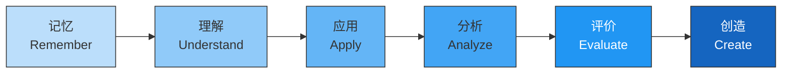
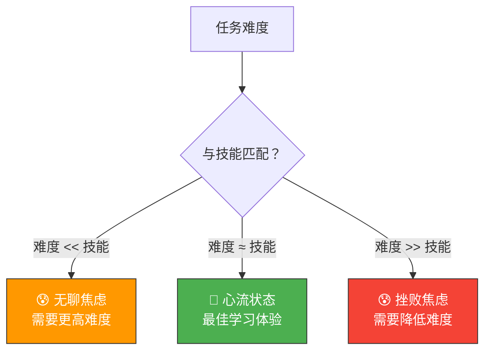
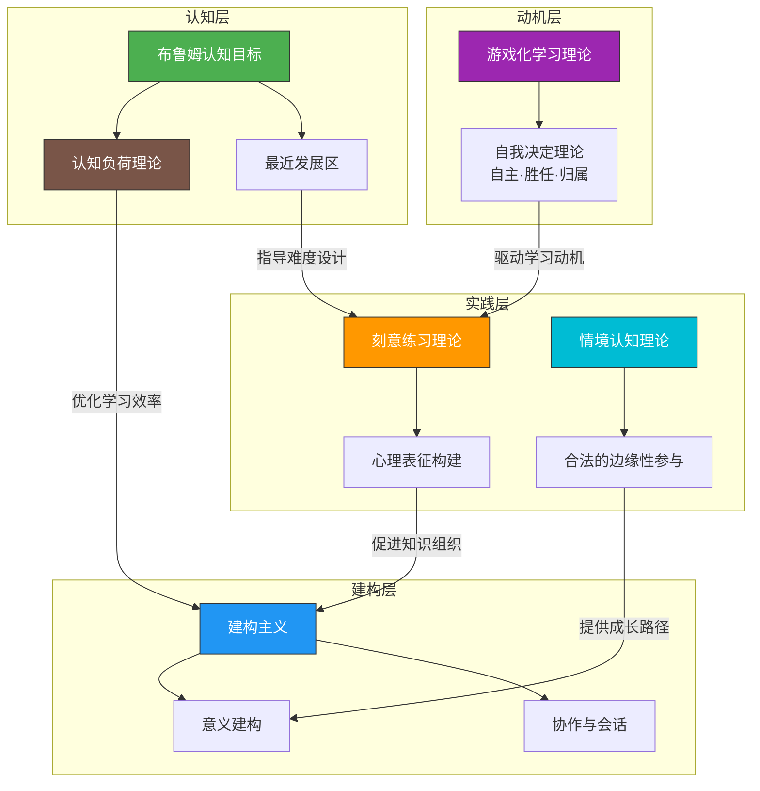

## 一、实战平台的教育理论基础

网络安全实战平台并非随意搭建的靶场集合，其背后有一整套教育心理学和学习科学理论作为支撑。理解这些理论，不仅能帮助学习者选择适合自己的平台和学习路径，更能帮助平台设计者构建科学、高效的训练体系。本节将从六大核心理论出发，深入剖析实战平台的设计逻辑与教育价值。

```mermaid
graph TD
    A["📚 实战平台教育理论体系"] --> B["建构主义学习理论"]
    A --> C["布鲁姆认知目标分类"]
    A --> D["刻意练习理论"]
    A --> E["游戏化学习理论"]
    A --> F["情境认知理论"]
    A --> G["认知负荷理论"]

    B --> B1["情境"]
    B --> B2["协作"]
    B --> B3["会话"]
    B --> B4["意义建构"]

    C --> C1["记忆"]
    C --> C2["理解"]
    C --> C3["应用"]
    C --> C4["分析"]
    C --> C5["评价"]
    C --> C6["创造"]

    D --> D1["明确目标"]
    D --> D2["即时反馈"]
    D --> D3["适当挑战"]
    D --> D4["心理表征"]

    E --> E1["积分系统"]
    E --> E2["排行榜"]
    E --> E3["成就徽章"]
    E --> E4["难度递进"]

    F --> F1["学徒制隐喻"]
    F --> F2["真实任务嵌入"]

    G --> G1["内在认知负荷"]
    G --> G2["外在认知负荷"]
    G --> G3["关联认知负荷"]

    style A fill:#E91E63,stroke:#333,color:#fff
    style B fill:#2196F3,stroke:#333,color:#fff
    style C fill:#4CAF50,stroke:#333,color:#fff
    style D fill:#FF9800,stroke:#333,color:#fff
    style E fill:#9C27B0,stroke:#333,color:#fff
    style F fill:#00BCD4,stroke:#333,color:#fff
    style G fill:#795548,stroke:#333,color:#fff
```

### 1.1 建构主义学习理论

#### 理论核心

建构主义（Constructivism）学习理论源于皮亚杰（Jean Piaget）的认知发展理论和维果茨基（Lev Vygotsky）的社会建构主义。其核心主张是：**知识不是被动接收的，而是学习者在已有经验基础上主动建构的**。学习是一个积极的意义建构过程，而非简单的信息传递过程。

建构主义提出了四个核心要素：

| 要素 | 含义 | 实战平台体现 |
|:---|:---|:---|
| **情境** | 学习应在真实或接近真实的情境中发生 | 提供仿真的企业网络环境、真实漏洞靶场 |
| **协作** | 学习者之间通过协作促进知识建构 | 团队CTF竞赛、协作渗透测试平台 |
| **会话** | 学习者通过对话和交流深化理解 | Writeup分享社区、在线讨论区、复盘会议 |
| **意义建构** | 学习的最终目标是建构对知识的意义理解 | 完成挑战后的原理总结、知识图谱构建 |

#### 传统教学的困境

在传统安全教育模式中，教师在课堂上讲授漏洞原理和攻击方法，学生被动听讲、做笔记、背定义。这种"填鸭式"教学存在三个根本缺陷：

1. **知识惰性问题**（Whitehead, 1929）：学生虽然记住了概念，但无法在实际场景中调用这些知识。知道"SQL注入是通过在输入中插入SQL语句来操控数据库"，但面对真实Web应用时无从下手。

2. **情境缺失问题**：课本中的漏洞描述高度抽象，缺少真实环境中的复杂性和不确定性。真实的渗透测试中，WAF规则、网络拓扑、权限配置等因素交织在一起，远非一个简单的代码片段所能涵盖。

3. **动机衰减问题**：缺乏即时反馈和成就感，学习者容易失去动力。传统作业的反馈周期通常是一周甚至更长，而实际安全技能的习得需要高频次的"尝试—反馈—修正"循环。

#### 实战平台的建构主义实践

实战平台通过以下设计完美回应了建构主义的四大要素：

**真实情境构建**：以HackTheBox为例，每个靶机都模拟真实的企业网络环境——从Apache/Nginx的配置细节、Linux/Windows的系统特性、到数据库的权限控制，构建了一个完整的攻防情境。TryHackMe的"Complete Beginner"路径更是将学习者置于一个模拟的企业内网中，从信息收集到提权，每一步都需要学习者根据环境线索做出判断。

**协作学习机制**：CTF竞赛天然就是协作学习的载体。以DEF CON CTF为例，团队成员需要分工合作——有人负责逆向工程、有人负责Web渗透、有人负责密码学破解。这种协作模式完美体现了维果茨基所说的"社会性互动促进认知发展"。

**会话与反思**：Writeup（解题报告）是安全社区最重要的知识共享形式。一个优秀的Writeup不仅记录解题步骤，更包含思路分析、踩坑记录和原理讲解。HackTheBox的社区Writeup功能、CTFtime上的赛后Writeup汇总，都是"会话"要素的具体体现。

**意义建构的闭环**：学习者在完成一道CTF题目后，不仅获得了flag（结果），更需要理解整个攻击链的逻辑（过程）——为什么这个漏洞存在？为什么会这样利用？防御方应该如何修复？这种从"知道怎么做"到"理解为什么"的跃升，就是意义建构的过程。

### 1.2 布鲁姆认知目标分类

#### 理论框架

布鲁姆认知目标分类（Bloom's Taxonomy）由美国教育心理学家本杰明·布鲁姆于1956年提出，后经安德森（Anderson）和克拉斯沃尔（Krathwohl）于2001年修订。该分类将认知过程从低到高分为六个层次：

#### 与网络安全实战的映射

布鲁姆分类的六个层次与网络安全学习形成了精确的对应关系，而不同类型的实战平台恰好覆盖了不同的认知层次：

| 认知层次 | 能力描述 | 安全技能对应 | 典型平台/场景 |
|:---|:---|:---|:---|
| **记忆** | 识别和回忆信息 | 记住常见漏洞名称、工具命令、协议端口 | OverTheWire Bandit（Linux基础命令） |
| **理解** | 解释信息的含义 | 理解缓冲区溢出原理、SQL注入机制 | TryHackMe的"Learning"模块 |
| **应用** | 将知识用于新情境 | 在靶场中使用SQLMap进行注入、用Metasploit获取shell | DVWA、bWAPP的漏洞利用 |
| **分析** | 将信息分解为组成部分 | 分析复杂网络拓扑中的攻击路径、拆解恶意样本 | HackTheBox的Hard/Insane难度靶机 |
| **评价** | 基于标准做出判断 | 评估不同攻击方案的成功率和隐蔽性、审查代码安全性 | 渗透测试报告撰写、Code Review |
| **创造** | 产生新的解决方案 | 发现0day漏洞、编写自定义exploit、设计防御架构 | Bug Bounty、CVE挖掘、红队工具开发 |

#### 阶层跃升的关键

大多数学习者停留在"记忆"和"理解"层次——知道工具怎么用、了解漏洞是什么，但无法独立分析和创造。布鲁姆分类给我们的启示是：

1. **低阶目标可以通过自学达成**：记忆和理解层面的内容，通过阅读文档、观看教程即可完成。这也是为什么很多免费的CTF入门课程能够有效——它们专注于低阶目标。

2. **高阶目标需要刻意训练**：分析、评价和创造需要在复杂情境中反复练习。这正是HackTheBox的Insane难度靶机、PentesterLab的高级挑战所训练的能力。

3. **评估应该对应认知层次**：有效的学习评估不应只考察"记住了什么"，而应考察"能做什么"。实战平台的评估方式——完成挑战、提交flag——天然就是高阶认知目标的评估。

### 1.3 刻意练习理论

#### 理论背景

刻意练习（Deliberate Practice）理论由心理学家安德斯·埃里克森（K. Anders Ericsson）在对各领域专家的长期研究基础上提出。埃里克森发现，真正区分专家与普通从业者的，不是天赋，也不是简单的工作经验积累，而是**有目的、有反馈、有挑战的持续练习**。

埃里克森在1993年的研究中指出，即使是世界级的国际象棋大师，其水平的提升也主要来自刻意练习而非一般性对弈。这一结论对网络安全技能的培养同样适用——**10年的安全从业经验不等于10年的刻意练习**。一个每天重复执行自动化扫描脚本的安全工程师，其技能增长可能远不如一个每天花2小时在HackTheBox上挑战高难度靶机的初级分析师。

#### 四大核心条件

刻意练习理论的核心观点是：有效的技能提升需要满足四个条件。实战平台的设计恰好为这四个条件提供了支撑：

| 条件 | 理论含义 | 实战平台实现 | 具体案例 |
|:---|:---|:---|:---|
| **明确目标** | 练习必须有清晰的、可衡量的目标 | 每道题都有明确的flag或权限目标 | "获取root权限并读取/flag.txt" |
| **即时反馈** | 练习者必须能迅速知道自己的表现 | 提交flag后立即验证，错误时给出提示 | CTF平台的实时验证系统 |
| **适当挑战** | 难度应略高于当前水平（最近发展区） | 多级难度题目，自适应推荐 | HackTheBox的Easy→Medium→Hard→Insane分级 |
| **心理表征** | 专家拥有丰富的、结构化的知识组织方式 | Writeup学习、知识图谱构建、方法论总结 | 从单个exploit到攻击方法论的升华 |

#### 最近发展区与难度设计

维果茨基的"最近发展区"（Zone of Proximal Development, ZPD）理论与刻意练习的"适当挑战"高度契合。ZPD指的是学习者独立解决问题的实际发展水平与在指导下解决问题的潜在发展水平之间的差距。

优秀的实战平台通过以下方式将学习者保持在ZPD内：

- **自适应难度推荐**：根据学习者的历史表现推荐适合的题目。例如，TryHackMe的"Recommended"功能会根据你已完成的房间推荐下一个挑战。
- **渐进式引导**：先给出基础提示（如漏洞类型），再逐步减少提示，直到学习者独立完成。PentesterLab的"Learning"模式就是这种设计。
- **分支学习路径**：根据学习者在某个领域的熟练程度，推荐进阶或补充内容。这避免了"太简单而无聊"或"太难而放弃"的两极分化。

#### 心理表征的构建

埃里克森特别强调"心理表征"（Mental Representation）在专家能力中的核心作用。心理表征是指专家在长期练习中形成的、对领域知识的结构化组织方式。以渗透测试专家为例，他们的心理表征可能包括：

- **攻击路径图谱**：看到一个Web应用，能自动联想到可能的攻击面——认证绕过、SQL注入、文件上传、SSRF等，并根据环境线索快速缩小范围。
- **漏洞模式识别**：看到一段代码，能迅速识别出潜在的安全问题，就像经验丰富的棋手看到棋盘就能判断局势一样。
- **工具组合策略**：不是孤立地使用Nmap、Burp Suite、SQLMap等工具，而是根据目标特征组合使用，形成高效的攻击链。

实战平台中，Writeup的撰写过程就是构建心理表征的重要环节——将零散的解题步骤组织成系统的攻击方法论。

### 1.4 游戏化学习理论

#### 理论基础

游戏化（Gamification）是将游戏设计元素和游戏机制应用于非游戏情境的方法，目的是提升参与度、动机和学习效果。游戏化学习理论的学术基础来自德西（Deci）和瑞安（Ryan）的**自我决定理论**（Self-Determination Theory, SDT），该理论认为人类有三种基本心理需求：

| 基本需求 | 含义 | 游戏化对应机制 |
|:---|:---|:---|
| **自主性**（Autonomy） | 对自己行为的控制感 | 自由选择挑战题目、自主决定学习路径 |
| **胜任感**（Competence） | 对自己能力的信心 | 积分增长、排行榜排名提升、难度递进 |
| **归属感**（Relatedness） | 与他人建立联系 | 团队竞赛、社区交流、合作攻关 |

#### CTF平台的游戏化设计分析

CTF竞赛和实战平台是游戏化学习的典范应用。以下是对主流平台游戏化设计的系统分析：

**积分与排名系统**

积分系统是CTF平台最基础的游戏化机制。以CTFtime平台为例，各赛事的积分系统通常遵循Elo评分算法的变体：

- 初始积分：通常为1000分
- 赛后排名：根据答题数量、难度权重和答题速度综合计算
- 年度积分：由多次比赛成绩加权平均得到

HackTheBox的用户积分系统则更为复杂，综合考虑了：

| 积分类型 | 获取方式 | 设计意图 |
|:---|:---|:---|
| 系统积分 | 完成靶机挑战 | 奖励核心技能 |
| Labs积分 | 完成专项实验室 | 奖励深度学习 |
| 赛事积分 | 参与平台比赛 | 鼓励竞赛参与 |
| 社区积分 | 撰写Writeup、回答问题 | 促进知识共享 |

**难度递进与心流体验**

心理学家米哈里·契克森米哈赖（Mihaly Csikszentmihalyi）提出的**心流理论**（Flow Theory）指出，当任务难度与个人技能水平匹配时，人会进入一种高度专注和享受的状态。CTF平台的难度分级设计正是为了让学习者持续处于"心流通道"中：

**成就与徽章系统**

HackTheBox的成就系统设计颇具启发性。平台为不同能力维度设计了独立的徽章体系：

- **方向徽章**：Web、Crypto、Reverse、Pwn、Misc等方向的完成度
- **难度徽章**：Easy到Insane的各级别突破记录
- **速度徽章**：在限定时间内快速解题的能力
- **社区徽章**：参与社区贡献的活跃度

这种多维度的成就系统避免了单一积分排名的"马太效应"——排名靠前的选手总是占据前列，后来者缺乏动力。多维徽章让每个学习者都能在某个维度上找到自己的成长空间。

**叙事与沉浸感**

部分平台引入了叙事元素来增强沉浸感。HackTheBox的靶机故事线（如"Diplomat"、"OpenSource"等）为每个挑战赋予了背景故事，让学习者不仅仅是"解一道题"，而是"扮演一名渗透测试工程师完成客户委托"。TryHackMe的"Gameling"路径更是将整个学习过程设计成了一个冒险游戏——学习者从新手村出发，逐步解锁新的区域和能力。

#### 游戏化的边界与反思

游戏化并非万能药。过度的游戏化可能带来"过度辩护效应"（Overjustification Effect）——学习者为了积分而刷题，而非为了技能提升而学习。有效的游戏化设计应遵循以下原则：

1. **内在动机优先**：游戏化机制应服务于学习目标，而非替代学习动机。积分和排名是手段，不是目的。
2. **避免过度竞争**：排行榜虽然能激发动力，但过度强调排名可能导致焦虑和作弊。优秀的平台通常同时提供合作型和竞争型活动。
3. **重视长期成长**：短期的积分刺激不如长期的技能成长反馈有效。HackTheBox的"Level"系统（从0到无限的等级提升）就是一种关注长期成长的设计。

### 1.5 情境认知理论

#### 理论框架

情境认知理论（Situated Cognition Theory）由莱夫（Lave）和温格（Wenger）在1991年提出，核心观点是**知识是情境化的，学习本质上是参与社会实践的过程**。该理论提出的"合法的边缘性参与"（Legitimate Peripheral Participation）概念，对理解实战平台的学习机制有重要启示。

#### 从边缘到中心的参与路径

莱夫和温格认为，新手在实践社区中的学习是一个从"边缘参与者"逐步成长为"核心参与者"的过程。在网络安全领域，这一路径清晰可见：

| 参与阶段 | 安全学习者特征 | 实战平台角色 |
|:---|:---|:---|
| **边缘参与者** | 刚入门，跟随教程操作，不理解原理 | OverTheWire、PicoCTF等入门平台 |
| **半熟练参与者** | 能独立完成中等难度挑战，开始形成方法论 | TryHackMe、HackTheBox Easy/Medium |
| **熟练参与者** | 能处理复杂场景，开始指导他人 | HackTheBox Hard/Insane、CTF竞赛 |
| **核心参与者** | 能发现新漏洞、开发新工具、定义行业标准 | 0day挖掘、安全研究、红队工具开发 |

#### 学徒制模式的现代映射

情境认知理论的"学徒制"隐喻在安全领域有深厚的传统。早期的安全学习者往往通过"师傅带徒弟"的方式——跟着经验丰富的渗透测试工程师做项目——来习得技能。实战平台在某种程度上是对学徒制的数字化重构：

- **观察（Observation）**：通过Writeup和视频教程观察专家的解题过程
- **指导下的实践（Guided Practice）**：在靶场中按照提示逐步完成挑战
- **独立实践（Independent Practice）**：独立面对无提示的真实挑战
- **反思与分享（Reflection & Sharing）**：撰写Writeup，参与社区讨论

这种模式使得原本需要数年"学徒期"才能积累的经验，可以在更短时间内系统化地习得。

### 1.6 认知负荷理论

#### 理论核心

认知负荷理论（Cognitive Load Theory）由澳大利亚教育心理学家约翰·斯威勒（John Sweller）于1988年提出。该理论认为，人的工作记忆容量有限（通常为7±2个组块），学习效率取决于学习材料对工作记忆造成的认知负荷。

认知负荷分为三种类型：

| 负荷类型 | 定义 | 实战平台中的表现 |
|:---|:---|:---|
| **内在认知负荷** | 学习材料本身的复杂性 | 漏洞原理的复杂程度、多步攻击链的逻辑深度 |
| **外在认知负荷** | 学习材料呈现方式造成的额外负担 | 平台界面的易用性、文档的质量、环境配置的复杂度 |
| **关联认知负荷** | 学习者主动加工知识所付出的努力 | 分析攻击路径、构建心理模型、总结方法论 |

#### 实战平台对认知负荷的管理

优秀的实战平台通过精心设计来优化认知负荷分配：

**降低外在认知负荷**：

- 一键部署靶机环境，避免学习者在环境搭建上浪费认知资源（如TryHackMe的"Start Machine"按钮）
- 清晰的界面设计和导航结构，减少"在哪里找到题目"的搜索成本
- 提供充足的文档和提示，降低理解任务要求的认知负担

**优化内在认知负荷**：

- 渐进式难度设计，避免一次性引入过多新概念
- 将复杂的攻击链分解为可管理的小步骤
- 先学习基础工具用法（降低内在负荷），再进入复杂场景

**增加关联认知负荷**：

- 要求学习者撰写Writeup，促进知识的主动加工
- 设计需要综合多种技能的复合型挑战
- 提供反思和总结的机会，帮助学习者将新知识整合到已有的知识结构中

### 1.7 理论整合：构建完整的实战学习模型

六大理论并非孤立存在，而是相互补充、共同构建了一个完整的实战学习模型：

这个模型揭示了实战平台设计的内在逻辑：

1. **游戏化**解决的是"为什么学"的问题——通过满足自主性、胜任感和归属感的需求，激发学习动机。
2. **布鲁姆分类和认知负荷理论**解决的是"学什么"和"怎么高效学"的问题——确保学习内容与认知层次匹配，同时优化认知资源分配。
3. **刻意练习和情境认知理论**解决的是"怎么练"的问题——通过有目的的挑战和真实情境，促进技能从边缘参与到核心能力的转变。
4. **建构主义**解决的是"如何真正理解"的问题——通过协作、会话和意义建构，将碎片化的操作步骤升华为系统的安全知识体系。

### 1.8 理论对实战平台选择的指导

理解这些理论后，学习者可以更有针对性地选择适合自己的平台：

| 学习目标 | 推荐理论指导 | 推荐平台 |
|:---|:---|:---|
| 零基础入门 | 建构主义（情境）+ 认知负荷（降低外在负荷） | TryHackMe、PicoCTF |
| 系统提升技能 | 布鲁姆分类（逐层递进）+ 刻意练习 | HackTheBox、PentesterLab |
| 竞赛型训练 | 游戏化（竞争）+ 情境认知（社区参与） | CTFtime赛事、247CTF |
| 职业能力提升 | 情境认知（学徒制）+ 建构主义（意义建构） | HTB Pro Labs、Offensive Security Labs |
| 安全研究与创新 | 布鲁姆（创造层）+ 刻意练习（心理表征） | 漏洞赏金平台、CVE挖掘 |

---

**本节要点回顾**：

实战平台的教育理论基础涵盖了建构主义、布鲁姆认知目标分类、刻意练习理论、游戏化学习理论、情境认知理论和认知负荷理论六大核心框架。这些理论共同解释了为什么"动手实践"在安全技能培养中如此重要，也为平台设计和学习路径规划提供了科学依据。理解这些理论，能帮助学习者从"盲目刷题"转向"有策略地成长"，从"知道怎么做"升华为"理解为什么这样做"。
