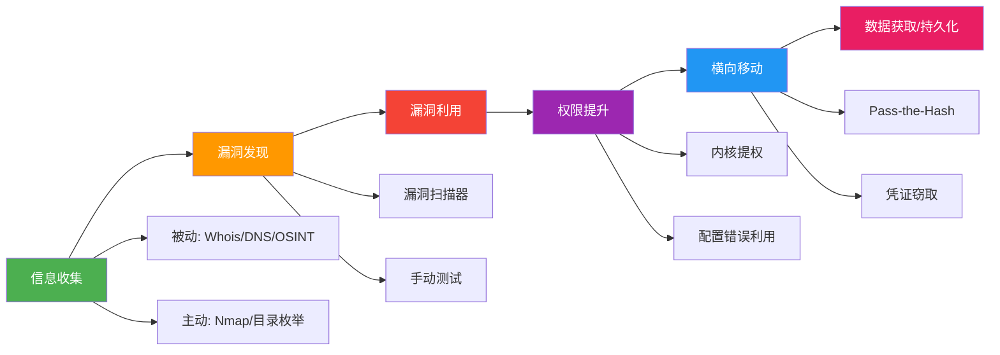
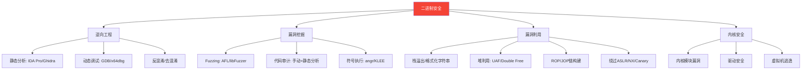
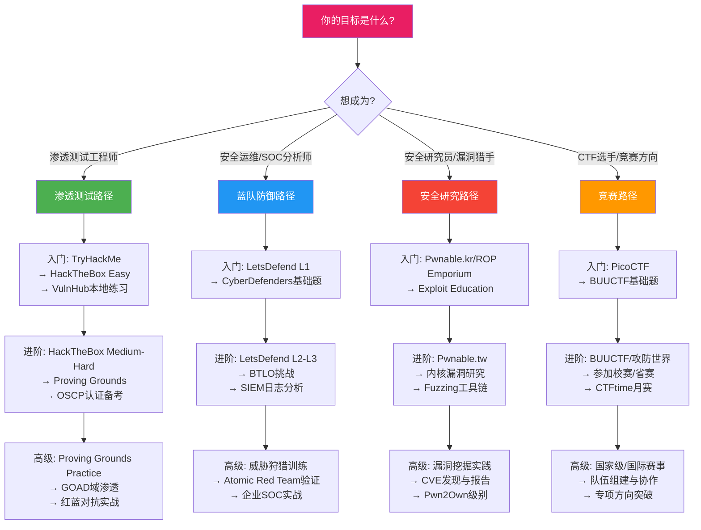

## 二、实战平台的分类体系

网络安全实战平台并非铁板一块——不同平台在设计理念、训练模式、技术覆盖和适用人群上差异巨大。建立清晰的分类体系，是高效选择和使用平台的前提。本节从五个核心维度对当前主流平台进行系统化分类，并提供交叉分析框架，帮助读者根据自身需求精准匹配。

### 2.0 分类维度总览

```mermaid
graph TD
    A["🎮 实战平台分类体系"] --> B["按训练模式"]
    A --> C["按技术方向"]
    A --> D["按难度等级"]
    A --> E["按交付方式"]
    A --> F["按社区与生态"]

    B --> B1["🏴 CTF竞赛平台"]
    B --> B2["🎯 渗透测试靶场"]
    B --> B3["🔄 漏洞复现环境"]
    B --> B4["⚔️ 红蓝对抗平台"]
    B --> B5["🛡️ 蓝队防御训练"]

    C --> C1["🌐 Web安全类"]
    C --> C2["💻 二进制安全类"]
    C --> C3["☁️ 云安全类"]
    C --> C4["📡 IoT/工控安全类"]
    C --> C5["🔐 密码学类"]
    C --> C6["🕵️ 取证与溯源类"]

    D --> D1["🟢 入门级"]
    D --> D2["🟡 中级"]
    D --> D3["🔴 高级"]
    D --> D4["⚫ 专家级"]

    E --> E1["在线平台"]
    E --> E2["本地部署"]
    E --> E3["混合模式"]

    F --> F1["社区驱动型"]
    F --> F2["商业运营型"]
    F --> F3["学术研究型"]

    style A fill:#E91E63,stroke:#333,color:#fff
    style B fill:#4CAF50,stroke:#333,color:#fff
    style C fill:#2196F3,stroke:#333,color:#fff
    style D fill:#FF9800,stroke:#333,color:#fff
    style E fill:#9C27B0,stroke:#333,color:#fff
    style F fill:#00BCD4,stroke:#333,color:#fff
```



### 2.1 按训练模式分类

训练模式是区分实战平台最核心的维度，它直接决定了平台的使用方式和训练效果。不同训练模式对应不同的学习阶段和能力培养目标。

#### 2.1.1 CTF竞赛平台

CTF（Capture The Flag，夺旗赛）是网络安全领域最流行的竞技形式。参赛者在规定时间内解决各类安全挑战题目，从目标系统中提取隐藏的flag字符串并提交得分。

**核心特点：**
- **限时竞技**：模拟高压环境下的快速决策能力
- **多方向覆盖**：单个平台通常涵盖Web、密码学、逆向、Pwn、杂项等多个方向
- **积分排名**：通过全球或区域性排行榜激发竞争动力
- **Writeup文化**：赛后分享解题报告，形成丰富的学习资源

**CTF竞赛的常见赛制：**

| 赛制 | 特点 | 适用场景 | 代表赛事 |
|------|------|----------|----------|
| Jeopardy（解题模式） | 静态题目，按难度分值，独立解题 | 入门到中级，覆盖面广 | DEFCON CTF资格赛、各类校赛 |
| Attack-Defense（攻防模式） | 实时对抗，保护己方服务+攻击对手 | 高级实战，需要攻防兼备 | DEFCON CTF决赛、HITB |
| King of the Hill（抢占模式） | 抢夺并维持对目标的控制权 | 实时渗透，压力测试 | PlaidCTF部分赛制 |
| Online Jeopardy | 线上解题，不限时或长周期 | 日常练习，自主学习 | CTFtime日历赛、BUUCTF |

**CTF题目的六大方向详解：**

| 方向 | 核心技能 | 典型挑战 | 入门工具链 |
|------|----------|----------|-----------|
| Web安全 | SQL注入、XSS、CSRF、SSRF、反序列化、文件上传 | 从注入点发现到getshell的完整利用链 | Burp Suite + SQLMap +dirsearch |
| 密码学（Crypto） | 数论、代数、编码理论、算法分析 | 分析加密实现缺陷、还原密钥 | Python + SageMath + CyberChef |
| 逆向工程（Reverse） | 二进制分析、指令集理解、反混淆 | 理解程序逻辑，提取flag或注册算法 | Ghidra + IDA Pro + radare2 |
| 二进制漏洞利用（Pwn） | 内存破坏、ROP链构建、内核利用 | 利用栈/堆漏洞获取远程shell | pwntools + gdb-pwndbg + one_gadget |
| 杂项（Misc） | 隐写术、流量分析、编码转换、OSINT | 从图片/流量/日志中提取隐藏信息 | Steghide + Wireshark + CyberChef |
| 取证分析（Forensics） | 磁盘/内存取证、日志分析、事件响应 | 从数字证据中还原攻击过程 | Volatility + Autopsy + ftkimager |

**CTF竞赛平台的典型代表：**

- **CTFtime**（ctftime.org）：全球CTF赛事聚合平台，不提供题目但汇聚了几乎所有重要赛事信息，是参赛者的必看日历
- **BUUCTF**（buuoj.cn）：国内最大的CTF题库平台，收录了数千道国内外CTF赛题，适合刷题提升
- **攻防世界**（adworld.xctf.org.cn）：浙大主导的综合平台，兼顾训练和赛事
- **NSSCTF**（nssctf.cn）：专注高校CTF赛事，题目质量高
- **CTFHub**（ctfhub.com）：提供分技能树的系统化学习路径

#### 2.1.2 渗透测试靶场

渗透测试靶场模拟了真实的企业网络环境，包含多个相互关联的目标系统。学习者扮演攻击者角色，运用渗透测试方法论（如PTES、OSSTMM）完成对目标系统的完整入侵。

**与CTF的本质区别：**

| 对比维度 | CTF竞赛平台 | 渗透测试靶场 |
|----------|-------------|-------------|
| 核心目标 | 在最短时间内拿到flag | 完成完整的渗透测试流程 |
| 题目关系 | 题目之间通常独立 | 目标系统之间存在关联 |
| 技能侧重 | 特定漏洞的深入利用 | 综合渗透能力（信息收集→后渗透） |
| 时间压力 | 严格限时 | 相对宽松，重在完整性 |
| 真实度 | 题目设计感强 | 追求真实企业环境还原 |
| 输出要求 | 提交flag即可 | 需要完整的渗透测试报告 |

**渗透测试靶场强调的完整攻击链：**



**代表性平台及特点：**

- **HackTheBox**：全球最大的渗透测试靶场平台，拥有数百台活跃靶机。分为Easy/Medium/Hard/Insane四个难度等级，支持挑战模式（限时48小时）和实验模式（无限时）。每月发布新靶机，涵盖Windows/Linux/Docker等多种环境。VIP会员可解锁退役靶机。
- **TryHackMe**：以学习路径（Room）为核心的引导式平台，特别适合初学者。提供"Complete Beginner"、"Jr Penetration Tester"、"Offensive Pentesting"等结构化学习路径，每个Room都配有详细教程。
- **VulnHub**：提供可下载的虚拟机镜像（OVA/VDI），学习者在本地VirtualBox/VMware中搭建。优点是完全离线可用、自由度高；缺点是需要自行搭建网络环境。
- **Proving Grounds**：OffSec（OSCP认证机构）官方出品，靶机风格与OSCP考试高度一致，是备考OSCP的最佳选择。
- **PentesterLab**：以Web渗透为核心的靶场，提供从基础到高级的系统化练习，强调代码审计能力。

#### 2.1.3 漏洞复现环境

漏洞复现平台专注于提供特定CVE漏洞的快速复现环境。学习者可以亲手操作真实漏洞的利用过程，深入理解漏洞原理。

**技术实现基础：**

现代漏洞复现平台普遍基于Docker容器技术，典型架构如下：

- **Vulhub**：基于docker-compose的一键部署方案，社区维护了200+个漏洞环境。使用方式极为简单：
  ```bash
  # 以Spring4Shell漏洞复现为例
  git clone https://github.com/vulhub/vulhub.git
  cd vulhub/spring/CVE-2022-22965
  docker-compose up -d
  # 环境启动后访问 http://target:8080 即可复现
  ```
- **Vulfocus**：国产漏洞集成平台，基于Web界面管理，支持在线一键启动漏洞环境，自动分配端口，降低使用门槛
- **Vulhub-Plus**：Vulhub的增强版，增加了更多国内常见系统（如用友、金蝶、通达OA）的漏洞环境
- **Hacksys Extreme Vulnerable Driver (HEVD)**：专注于Windows内核漏洞复现，提供驱动级别的漏洞练习环境

**漏洞复现的三重价值：**

1. **原理理解**：通过亲手操作漏洞利用链，理解漏洞从触发到利用的完整过程，而非停留在CVE描述的文字层面
2. **防御验证**：在复现环境中测试WAF规则、IDS检测策略、补丁修复方案的实际效果
3. **研究基础**：为漏洞挖掘研究提供参照——理解已知漏洞的模式，是发现新漏洞的起点

**按漏洞类型分布：**

| 漏洞类型 | 典型CVE示例 | 复现平台 | 难度 |
|----------|-------------|----------|------|
| Web应用框架漏洞 | Spring4Shell (CVE-2022-22965) | Vulhub | 中 |
| 服务器远程代码执行 | Log4Shell (CVE-2021-44228) | Vulhub/Vulfocus | 低 |
| 操作系统内核漏洞 | Dirty Pipe (CVE-2022-0847) | 本地Docker复现 | 中 |
| 数据库漏洞 | Redis未授权访问 | Vulhub | 低 |
| 中间件漏洞 | Apache Struts2系列 | Vulhub | 中-高 |
| 容器逃逸 | CVE-2019-5736 (runc) | 专用Docker环境 | 高 |

#### 2.1.4 红蓝对抗平台

红蓝对抗平台模拟真实的企业网络安全攻防演练场景。这种模式最接近实际工作中的安全评估场景。

**三方角色定义：**

- **红队（Red Team）**：攻击方，模拟高级持续性威胁（APT），目标是突破防线、获取核心资产控制权
- **蓝队（Blue Team）**：防御方，负责安全监控、事件检测、应急响应和溯源分析
- **紫队（Purple Team）**：协调方（或红蓝融合模式），强调攻防协作，攻击者实时向防御团队反馈检测盲点

**与渗透测试靶场的区别：**

渗透测试靶场是"单人vs机器"的模式，而红蓝对抗平台引入了"人vs人"的动态博弈。防御方会主动监控、告警、封禁，攻击方必须在隐蔽性和效率之间做出权衡。

**代表性平台与场景：**

- **Attack Range（Splunk）**：基于Terraform构建的企业级攻防模拟环境，内置日志收集和检测规则验证
- **Atomic Red Team**：MITRE ATT&CK框架的原子化测试用例库，蓝队可用其验证检测覆盖率
- **CALDERA（MITRE）**：自动化红队模拟平台，可配置攻击剧本并自动执行
- **Infection Monkey**：开源的攻防模拟工具，专注于验证网络内横向移动的检测能力

#### 2.1.5 蓝队防御训练平台

蓝队训练平台是近年来快速发展的新类别，专注于培养安全运营中心（SOC）分析师的监控、分析和响应能力。

**核心训练内容：**
- **日志分析**：从海量日志中识别攻击痕迹和异常行为
- **事件响应**：按照IR流程处理安全事件，控制影响范围
- **威胁狩猎**：主动搜索网络中的威胁，而非被动等待告警
- **取证溯源**：还原攻击链，确定攻击者身份和入侵路径

**代表性平台：**

- **LetsDefend**：最成熟的蓝队训练平台，提供模拟SOC环境，包含告警分诊、调查、处置的完整工作流。用户扮演L1/L2/L3分析师角色处理真实告警
- **CyberDefenders**：以数字取证和蓝队挑战为核心，提供磁盘取证、内存分析、网络流量分析、恶意软件分析等专项训练
- **Blue Team Labs Online (BTLO)**：提供免费的蓝队挑战题目，涵盖日志分析、逆向、OSINT等多个方向

### 2.2 按技术方向分类

技术方向分类帮助学习者根据自身兴趣和职业规划选择专攻领域。以下是当前主流的技术方向及对应平台。

#### 2.2.1 Web安全类

Web安全是受众最广、入门门槛相对较低的方向，也是大多数安全从业者的起点。

**覆盖的漏洞类型：** OWASP Top 10是核心——SQL注入、XSS、CSRF、SSRF、文件上传、反序列化、访问控制失效、安全配置错误、组件漏洞、日志和监控不足。

**代表性平台对比：**

| 平台 | 技术栈 | 特点 | 难度 | 推荐场景 |
|------|--------|------|------|----------|
| DVWA | PHP | 四个安全等级可调，可看源码 | 入门 | Web安全入门练习 |
| WebGoat | Java | 课程化设计，配详细教程 | 入门-中级 | 系统化Web安全学习 |
| Pikachu | PHP | 国产，中文界面，漏洞类型全 | 入门-中级 | 中文用户入门 |
| SQLi-labs | PHP | 专注SQL注入，75+关卡 | 入门-中级 | SQL注入专项突破 |
| Upload-labs | PHP | 专注文件上传绕过，20关 | 入门-中级 | 文件上传技巧训练 |
| PortSwigger Academy | 多语言 | 官方BP团队出品，系统化课程 | 中-高级 | Web安全职业化训练 |
| bWAPP | PHP | 100+漏洞，涵盖OWASP Top 10 | 入门-中级 | 漏洞广度覆盖 |

#### 2.2.2 二进制安全类

二进制安全是技术门槛最高的方向之一，需要扎实的计算机底层知识（汇编语言、操作系统原理、编译原理）。

**技能树：**



**代表性平台对比：**

| 平台 | 核心内容 | 难度 | 特色 |
|------|----------|------|------|
| pwnable.kr | Linux二进制利用 | 入门-中级 | 韩国团队维护，题目经典 |
| pwnable.tw | 高质量Pwn题 | 中-高级 | 与台湾HITB赛事关联 |
| Exploit Education | 分阶段学习二进制漏洞 | 入门-高级 | Protostar→Phoenix渐进式设计 |
| ROP Emporium | 专注ROP链构建 | 中级 | 极佳的ROP入门路径 |
| w3challs | 综合二进制挑战 | 中-高级 | 含内核利用和反逆向 |
| ringzer0 CTF | 大量Reverse/Pwn题 | 中-高级 | 题目数量多 |

#### 2.2.3 云安全类

随着企业IT基础设施全面上云，云安全成为增长最快的安全方向。云安全训练平台模拟了AWS、Azure、GCP等主流云平台的环境。

**云安全核心攻击面：**

| 攻击面 | 典型场景 | 训练平台 |
|--------|----------|----------|
| IAM配置错误 | 过度宽松的IAM策略、凭证泄露 | CloudGoat/AWSGoat |
| 存储桶泄露 | S3 Bucket公开访问 | Sadcloud |
| Serverless安全 | Lambda函数漏洞利用 | LambdaGoat |
| 容器安全 | Kubernetes集群逃逸 | k8s-goat |
| 基础设施即代码 | Terraform配置缺陷 | TerraGoat |
| 云网络 | VPC配置错误导致的横向移动 | CloudGoat |

**代表性平台详解：**

- **CloudGoat**（Rhino Security Labs）：AWS环境的CTF风格靶场，通过terraform自动部署包含安全问题的云环境。涵盖IAM提权、SSRF到元数据、Lambda后门等场景
- **AWSGoat**：专注于AWS安全的漏洞环境，模拟OWASP云安全Top 10
- **TerraGoat**：故意包含配置缺陷的Terraform项目，用于学习IaC安全审计
- **Sadcloud**：NCC Group出品，专注AWS和Azure的不安全配置
- **Kubernetes Goat**：专门针对K8s集群的安全训练环境，涵盖容器逃逸、RBAC绕过等场景

#### 2.2.4 IoT/工控安全类

物联网和工业控制系统的安全日益受到关注，这类平台提供嵌入式设备和工控协议的模拟环境。

**IoT安全攻击链：**

1. **固件提取与分析**：从设备中提取固件镜像，进行静态分析
2. **固件修改**：注入后门或修改启动逻辑
3. **通信协议分析**：分析设备与云端/本地的通信协议
4. **硬件接口利用**：通过UART、JTAG、SPI等接口获取设备控制权
5. **无线安全**：分析Zigbee、Bluetooth、WiFi等无线协议的漏洞

**代表性平台：**

- **IoTGoat**（OWASP）：基于路由器固件的IoT安全练习环境
- **DVRF**（Damn Vulnerable Router Firmware）：基于MIPS架构的路由器漏洞训练
- **GRFICSv2**：工业控制仿真环境，模拟SCADA/ICS系统的安全问题
- **firmware-analysis-toolkit**：自动化固件分析工具包，配合QEMU模拟运行固件

#### 2.2.5 密码学类

密码学方向结合了数学理论与工程实践，是CTF竞赛中的经典方向。

**学习路径：** 古典密码（凯撒/维吉尼亚/Playfair）→ 现代密码（AES/RSA/ECC）→ 密码分析（侧信道/ Padding Oracle）→ 前沿领域（后量子密码/同态加密）

**常用工具：**
- **CyberChef**：在线编码/加密转换瑞士军刀
- **RsaCtfTool**：RSA攻击工具集，自动检测并利用常见RSA弱点
- **hashcat/john the ripper**：高性能哈希破解工具
- **SageMath**：数学计算环境，处理复杂密码学运算
- **z3-solver**：约束求解器，用于逆向加密算法

#### 2.2.6 取证与溯源类

数字取证和威胁溯源是蓝队核心技能，也是安全事件响应的基础能力。

**取证分析子领域：**

| 子领域 | 内容 | 工具 |
|--------|------|------|
| 磁盘取证 | 文件恢复、时间线分析、注册表分析 | Autopsy、FTK Imager、X-Ways |
| 内存取证 | 进程分析、网络连接、密码提取 | Volatility、Rekall |
| 网络取证 | PCAP分析、协议还原、攻击检测 | Wireshark、NetworkMiner、Zeek |
| 恶意软件分析 | 静态/动态分析、沙箱检测 | IDA Pro、Cuckoo Sandbox、Floss |
| 日志分析 | SIEM告警分析、攻击链还原 | ELK Stack、Splunk |

### 2.3 按难度等级分类

难度分级帮助学习者在正确的阶段选择合适的挑战，避免"太简单导致无聊"或"太难导致放弃"。

#### 2.3.1 入门级（Beginner）

**目标用户：** 零基础或有少量安全知识的初学者
**典型特征：**
- 提供详细的步骤引导和提示系统
- 每道题配有配套教程或视频讲解
- 环境配置简单，通常一键启动
- 社区活跃，Writeup丰富

**代表平台：**

- **TryHackMe**：最推荐的入门平台。每个Room都像一堂课，从"什么是SQL注入"讲到如何实际利用，手把手教学。完成"Complete Beginner"和"Jr Penetration Tester"路径后，具备了中级水平的基础能力
- **OverTheWire（Bandit系列）**：通过SSH连接的关卡式学习，从最基础的Linux命令开始（ls、cat、grep），逐步过渡到文件权限、网络知识。共35关，是学习Linux命令行的最佳途径之一
- **PicoCTF**：CMU面向中学生开发的CTF平台，题目设计友好，涵盖Web、密码学、逆向、杂项等方向，适合作为CTF入门
- **Cisco Networking Academy Cybersecurity**：思科官方的网络安全基础课程，理论与实操结合

#### 2.3.2 中级（Intermediate）

**目标用户：** 完成入门阶段、具备基本漏洞知识的学习者
**典型特征：**
- 不提供逐步引导，需要独立思考
- 题目涉及多个漏洞的组合利用
- 需要一定的工具使用经验
- 开始要求独立的信息收集能力

**代表平台：**

- **HackTheBox**：从Easy级别开始是中级学习的最佳起点。Medium级别开始出现需要创意的漏洞利用方式，Hard级别则涉及复杂的多步骤攻击链
- **BUUCTF**：国内最大的CTF题库，题目来源覆盖国内外各大CTF赛事，是刷题提升的主力平台
- **攻防世界（XCTF）**：综合训练平台，分为基础区和高手区
- **Root-me**：法国平台，覆盖面广，包含Web、Pwn、Crypto等多个方向的系统化挑战

#### 2.3.3 高级（Advanced）

**目标用户：** 有丰富实战经验的安全工程师和渗透测试人员
**典型特征：**
- 高度仿真的企业环境
- 需要综合运用多种技术
- 没有明显提示，需要自主探索攻击路径
- 涉及内网渗透、域环境攻击等复杂场景

**代表平台：**

- **Proving Grounds**：OffSec官方靶机，风格与OSCP考试高度一致。Practice模式适合备考，选择题+实操的模式也适合自主练习
- **CyberDefenders**：专注于蓝队高级技能，磁盘取证、内存分析、恶意软件逆向等
- **GOAD**（Game of Active Directory）：模拟多域的Active Directory环境，练习域渗透和横向移动
- **DetectionLab**：自动化部署的检测和日志环境，验证SIEM和检测规则的有效性

#### 2.3.4 专家级（Expert）

**目标用户：** 安全研究员、漏洞猎手、红队成员
**典型特征：**
- 涉及0day挖掘、内核利用、沙箱逃逸等尖端技术
- 没有固定解法，需要创新思维
- 可能需要开发自定义工具或exploit
- 通常与安全社区的顶级赛事或研究项目相关

**代表平台：**

- **DEFCON CTF**：全球最高水平的CTF赛事，决赛仅邀请资格赛优胜队伍
- **Pwn2Own**：商业化的漏洞挖掘竞赛，涉及浏览器、虚拟机、手机等目标
- **Google CTF / Project Zero Blog**：Google安全团队的挑战和研究分享
- **内核CTF（Kernel CTF）**：Google维护的Linux内核漏洞赏金项目

### 2.4 按交付方式分类

交付方式决定了平台的技术门槛、使用便利性和适用场景。

#### 2.4.1 在线平台（SaaS模式）

**特点：** 无需本地配置，浏览器直接使用。平台托管所有靶机环境，用户通过VPN或网页终端连接。

| 优势 | 劣势 |
|------|------|
| 零配置，开箱即用 | 依赖网络连接 |
| 自动维护和更新 | 可能存在排队等待 |
| 多人同时在线 | 无法自定义环境 |
| 内置Writeup和社区 | 数据受平台控制 |

**代表：** HackTheBox、TryHackMe、BUUCTF、PortSwigger Academy

#### 2.4.2 本地部署模式

**特点：** 将靶机环境部署在本地机器上，完全离线可控。

| 优势 | 劣势 |
|------|------|
| 完全离线可用 | 需要本地硬件资源 |
| 可自由修改环境 | 需要自行维护和更新 |
| 无网络延迟 | 环境搭建有一定门槛 |
| 数据完全自主 | 无法与在线社区即时交互 |

**代表：** VulnHub（虚拟机镜像）、Vulhub（docker-compose）、DVWA本地搭建

**本地部署的典型硬件需求：**

| 靶机规模 | 最低内存 | 推荐CPU | 存储空间 |
|----------|----------|---------|----------|
| 单台靶机 | 4GB | 2核 | 20GB |
| 3-5台靶机 | 8GB | 4核 | 50GB |
| 完整内网环境 | 16GB+ | 8核 | 100GB+ |
| K8s/云安全靶场 | 32GB+ | 16核 | 200GB+ |

#### 2.4.3 混合模式

部分平台提供线上+线下的混合使用方式：
- **HackTheBox**：线上靶机 + 可下载的退休靶机（VIP）
- **Proving Grounds**：在线练习 + 可导出的虚拟机
- **Vulfocus**：在线平台 + 支持本地Docker部署

### 2.5 按社区与生态分类

平台的社区活跃度和生态系统直接影响学习体验和资源获取效率。

#### 2.5.1 社区驱动型

由安全社区自发维护，以开源项目或志愿者贡献为主。

**特征：** 免费或低成本、内容由社区贡献、更新依赖维护者热情、生态分散但活跃
**代表：** Vulhub、CTFtime、OverTheWire、RingZer0

#### 2.5.2 商业运营型

由安全公司运营，提供付费服务。

**特征：** 专业维护、稳定更新、完善的技术支持、付费会员制度
**代表：** HackTheBox（VIP）、TryHackMe（Premium）、Proving Grounds、PortSwigger Academy

#### 2.5.3 学术研究型

由高校或研究机构维护，服务于安全教育和学术研究。

**特征：** 与课程体系结合、题目设计严谨、可能与学位教育挂钩
**代表：** PicoCTF（CMU）、Cyber ranges（各大高校）、NIST NICE Challenge

### 2.6 分类维度交叉分析

单一维度的分类只能提供片面信息。将多个维度交叉使用，才能全面评估一个平台是否适合自己的需求。

**交叉分类矩阵——主流平台定位：**

| 平台 | 训练模式 | 技术方向 | 难度 | 交付方式 | 社区类型 |
|------|----------|----------|------|----------|----------|
| TryHackMe | 渗透靶场+课程 | Web为主 | 入门-中级 | 在线 | 商业 |
| HackTheBox | 渗透靶场 | 全方向 | 中-高级 | 在线+本地 | 商业 |
| BUUCTF | CTF竞赛 | 全方向 | 中-高级 | 在线 | 商业 |
| Vulhub | 漏洞复现 | Web/中间件 | 中-高级 | 本地 | 社区 |
| LetsDefend | 蓝队防御 | 取证/监控 | 入门-高级 | 在线 | 商业 |
| CyberDefenders | 蓝队+CTF | 取证/溯源 | 中-高级 | 在线 | 社区 |
| PortSwigger | 课程+靶场 | Web安全 | 中-高级 | 在线 | 商业 |
| CloudGoat | 漏洞复现 | 云安全 | 中-高级 | 本地 | 学术 |

**基于职业目标的平台选择决策树：**



### 2.7 分类体系的实际应用

理解分类体系的最终目的是指导实践。以下是将分类知识转化为行动的三个步骤：

**步骤一：自我评估**

在选择平台前，先明确三个核心参数：
1. **当前水平**：你能在不看Writeup的情况下独立完成哪些难度的挑战？
2. **学习目标**：你想成为渗透测试工程师、安全研究员、CTF选手还是安全运维？
3. **可用时间和资源**：你有多少时间练习？是否有足够配置的本地机器？

**步骤二：平台匹配**

根据评估结果，在分类体系中定位：
- 初学者 + 渗透测试方向 → TryHackMe（入门）→ HackTheBox（进阶）
- 中级 + 蓝队方向 → LetsDefend（SOC训练）→ CyberDefenders（取证）
- 高级 + 研究方向 → 漏洞复现（Vulhub）→ 内核/二进制平台
- CTF竞赛方向 → BUUCTF刷题 → CTFtime参赛

**步骤三：组合使用**

单一平台无法覆盖所有技能需求。推荐的组合策略：

| 目标 | 推荐组合 | 理由 |
|------|----------|------|
| 全栈渗透测试 | HTB + Vulhub + LetsDefend | 攻防兼备，覆盖红蓝两端 |
| CTF竞赛突围 | BUUCTF刷题 + CTFtime参赛 + 本地工具环境 | 题库+赛事+工具链三位一体 |
| Web安全专精 | PortSwigger + SQLi-labs + DVWA | 系统学习+专项突破+基础巩固 |
| OSCP备考 | Proving Grounds + HTB + 考试手册 | 靶机风格与考试一致 |
| 云安全入门 | CloudGoat + AWSGoat + K8s Goat | 覆盖IAM/存储/容器三大攻击面 |

本节提供的分类框架不是一成不变的——随着安全技术的发展和新平台的涌现，分类体系也在持续演进。读者应保持对新平台的关注，定期调整自己的训练方案。
