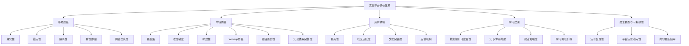
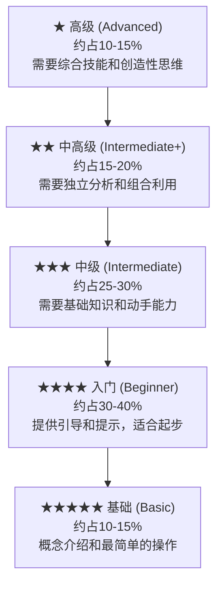

## 三、实战平台的评价标准

面对市面上数以百计的网络安全实战平台，如何从中甄别出真正有价值的学习资源？一个优质的实战平台不仅能加速技能成长，更能塑造正确的安全思维；而一个劣质的平台则可能让学习者养成错误的习惯，甚至在关键时刻形成认知盲区。本节将从环境质量、内容质量、用户体验、学习效果、商业模型与可持续性五大维度，建立一套系统化的实战平台评价框架，帮助读者在选择平台时做出有据可依的决策。

### 3.1 评价框架总览

在深入各维度之前，先用一张结构图展示评价体系的全貌：



每个维度下又细分为若干可量化的子指标。下面逐一展开分析。

### 3.2 环境质量

环境质量是实战平台的根基。一个漏洞靶场如果环境本身就不稳定或过于理想化，那么学习者获得的经验将难以迁移到真实场景中。环境质量的评估涵盖以下五个关键子指标。

#### 3.2.1 真实性

**核心问题**：平台环境是否模拟了真实的技术场景？使用的是否是真实的技术栈、配置和拓扑？

真实性的评估需要从多个层面考察：

| 评估层面 | 高真实性表现 | 低真实性表现 |
|---------|------------|------------|
| **技术栈** | 使用真实版本的Apache/Nginx/MySQL，配置参数与生产环境一致 | 使用过度简化的模拟器，缺少真实的中间件和数据库 |
| **网络拓扑** | 多层网络结构（DMZ、内网、管理层），含防火墙和ACL规则 | 单一平面网络，所有服务直接可达 |
| **漏洞实现** | 漏洞来源于真实CVE，复现逻辑与官方描述一致 | 人为构造的简化漏洞，缺少真实利用链 |
| **操作系统** | 真实的Ubuntu/CentOS/Windows Server，含正常运行的系统服务 | 最小化安装，仅有漏洞相关服务 |
| **数据** | 模拟真实业务数据，含用户表、订单、文件等 | 空数据库或随意填充的测试数据 |

以HackTheBox为例，其靶机环境通常基于真实的企业应用架构搭建，包含完整的Linux/Windows系统、Web应用、数据库、内部服务等，学习者需要像真实渗透测试一样经历完整的信息收集、漏洞发现和利用过程。相比之下，一些简单的CTF题目可能只暴露一个特定的漏洞端口，缺少完整的系统环境支撑。

**评估方法**：
- 检查靶机是否运行完整的操作系统（`uname -a` / `systeminfo`）
- 观察是否存在与渗透无关的正常服务（SSH、DNS、NTP等）
- 评估网络结构是否包含多层隔离
- 检查漏洞是否基于真实CVE编号

#### 3.2.2 稳定性

**核心问题**：平台环境是否稳定可靠？故障频率和恢复速度如何？

稳定性直接影响学习体验的连续性。一个频繁宕机或响应缓慢的平台会打断学习者的心流状态，降低练习效率。稳定性应从以下维度评估：

**服务可用性**：
- **正常运行时间（Uptime）**：优质平台应达到99.5%以上的可用性
- **故障恢复时间（MTTR）**：从故障发生到恢复正常的时间，优秀平台应在30分钟以内
- **故障频率**：每月故障次数，超过3次属于不可接受的水平

**响应性能**：
- **页面加载时间**：首屏加载应在3秒以内
- **靶机启动时间**：在线靶机从点击启动到可连接的时间，容器化平台应在30秒以内
- **操作响应延迟**：提交flag、切换题目等操作的响应时间应在1秒以内

**资源稳定性**：
- 靶机在使用过程中是否出现OOM（内存溢出）或磁盘满的情况
- 长时间运行的靶机是否会自动重启或断连
- 高峰期（CTF比赛期间）是否出现明显的性能下降

**评估方法**：
- 在不同时段（工作日、周末、深夜）测试平台响应速度
- 查看社区反馈中关于稳定性的投诉频率
- 在CTF比赛期间观察平台表现（比赛是对平台稳定性的终极考验）

#### 3.2.3 隔离性

**核心问题**：不同用户之间的环境是否完全隔离？是否可能发生互相干扰？

隔离性既是安全要求，也是公平性保障。在共享靶场环境中，如果用户A的攻击行为影响到了用户B的靶机，不仅破坏了学习体验，还可能引发严重的安全事件。

**隔离的三个层次**：

1. **计算隔离**：每个用户的靶机运行在独立的容器或虚拟机中，一个用户的操作不会影响另一个用户的环境。容器化平台通过namespace和cgroup实现进程和资源隔离，虚拟化平台通过Hypervisor实现硬件级别的隔离。

2. **网络隔离**：用户之间的网络流量互不可见，无法嗅探其他用户的攻击流量。通过VLAN划分或虚拟网络实现用户间的网络层隔离。

3. **数据隔离**：用户的flag提交记录、解题进度、笔记等个人数据相互独立，不会泄露给其他用户。

**隔离失败的典型后果**：
- 一个用户重启了靶机，导致正在解题的另一个用户丢失进度
- 一个用户获取了root权限后修改了系统配置，导致后续用户无法正常使用
- 共享的数据库被恶意用户清空，影响所有用户的解题体验

**评估方法**：
- 测试在多用户同时使用时是否出现干扰现象
- 检查平台是否为每个用户创建独立的容器/虚拟机实例
- 尝试访问其他用户的靶机，验证网络隔离的有效性

#### 3.2.4 弹性伸缩

**核心问题**：平台能否根据用户需求动态调整资源分配？

在CTF比赛或大规模培训期间，平台可能面临瞬间涌入大量用户的场景。弹性伸缩能力决定了平台能否在高负载下保持稳定运行。

**优秀的弹性伸缩表现**：
- 资源分配采用按需模式，用户启动靶机时才分配资源，停止后立即回收
- 高峰期自动扩容，低谷期自动缩容，避免资源浪费
- 容器编排系统（如Kubernetes）能自动处理节点故障，将受影响的容器重新调度到健康节点

**缺乏弹性伸缩的平台表现**：
- 高峰期靶机启动时间显著增加，甚至无法启动
- 用户排队等待时间过长（超过5分钟属于较差体验）
- 资源分配固定，即使空闲也不释放，造成浪费

#### 3.2.5 网络仿真度

**核心问题**：平台的网络环境是否足够接近真实场景？

网络仿真度是衡量平台实战价值的关键指标。真实的渗透测试中，攻击者面对的不是直接可达的服务端口，而是经过防火墙过滤、NAT转换、VPN隧道等多层网络设备的复杂环境。

**高网络仿真度平台的特征**：
- 模拟多层网络架构（DMZ区、办公区、核心区、运维区）
- 包含防火墙规则、ACL策略，需要进行绕过或利用
- 模拟内网环境，需要横向移动才能访问核心资产
- 包含IDS/IPS等安全设备，检测并阻断常见攻击模式
- 提供VPN接入点，模拟远程渗透场景

**典型代表**：HackTheBox的部分高级靶机和GOAD（Game of Active Directory）提供了接近真实企业网络的仿真环境，包含AD域控制器、成员服务器、防火墙等完整的网络基础设施。

### 3.3 内容质量

内容质量决定了平台的学习价值上限。一个环境再稳定的平台，如果题目设计低劣、知识覆盖不全，也无法帮助学习者有效提升技能。

#### 3.3.1 覆盖面

**核心问题**：平台的题目是否涵盖了主流的安全技术和漏洞类型？

安全技术领域极其广泛，从Web应用安全到移动安全，从二进制漏洞利用到云安全，一个优秀的平台应当尽可能覆盖主流的安全方向。

**评估覆盖面的参考矩阵**：

| 安全方向 | 关键技术点 | 覆盖深度要求 |
|---------|-----------|------------|
| Web安全 | SQL注入、XSS、CSRF、SSRF、文件上传、反序列化、XXE、RCE | 每类漏洞至少有3道以上不同难度的题目 |
| 二进制安全 | 栈溢出、堆溢出、格式化字符串、ROP、堆利用 | 涵盖32位和64位，覆盖glibc各版本 |
| 密码学 | 古典密码、RSA/AES/DES攻击、哈希碰撞、侧信道 | 从基础替换密码到高级数学攻击 |
| 逆向工程 | x86/ARM/MIPS指令集、脱壳、反调试、协议逆向 | 覆盖主流架构和混淆技术 |
| 网络安全 | 协议分析、流量嗅探、中间人攻击、DNS隧道 | 包含加密流量分析 |
| 移动安全 | Android逆向、iOS安全、移动API安全 | 覆盖两大主流平台 |
| 云安全 | AWS/Azure/GCP安全配置、容器逃逸、K8s安全 | 覆盖主流云厂商 |
| 内网渗透 | AD域渗透、横向移动、权限维持、隧道技术 | 模拟真实企业域环境 |
| 蓝队防御 | 日志分析、威胁狩猎、应急响应、取证分析 | 覆盖SOC工作流 |

**覆盖面的常见问题**：
- **方向偏科**：某些平台仅侧重Web安全，对二进制、密码学等方向覆盖不足
- **广而不深**：每个方向都有题目但都停留在入门级别，缺少高级挑战
- **重攻轻防**：只提供攻击训练，缺少防御和检测类内容

#### 3.3.2 难度梯度

**核心问题**：平台是否有从入门到精通的合理难度分布？

难度梯度的设计直接影响平台的适用人群范围和学习路径的完整性。

**理想的难度分布应呈金字塔形**：



**难度梯度评估要点**：

1. **过渡平滑性**：相邻难度级别之间的跨度是否合理？如果从"简单"直接跳到"困难"，中间缺少过渡，学习者容易产生挫败感。理想的梯度应该是每一级都比上一级多一个挑战要素——比如入门级只考SQL注入，中级需要组合SQL注入和文件上传，高级则需要在多层防御环境下完成完整的攻击链。

2. **难度标注准确性**：平台标注的难度是否与实际一致？一些平台的"简单"题目实际需要中高级技能，而"困难"题目反而比"中等"更容易，这种不一致会严重误导学习者的精力分配。

3. **难度分布合理性**：检查平台的题目数量是否在各难度级别间合理分布。过于集中在某一难度级别的平台不适合对应层级以外的学习者。

4. **动态难度调整**：部分平台根据用户的解题表现自动推荐合适难度的题目，这种个性化适配能力是难度梯度设计的高级形态。

**评估方法**：
- 抽样检查各难度级别的题目数量，计算分布比例
- 尝试跨难度级别的题目，感受实际跨度
- 对比不同用户对同一题目的难度评价

#### 3.3.3 时效性

**核心问题**：平台内容是否跟上最新的安全技术和威胁趋势？

网络安全是一个快速迭代的领域。每年都有数千个新CVE被披露，新的攻击技术层出不穷。一个停留在五年前内容的平台，其训练价值将大打折扣。

**时效性的评估维度**：

| 评估要素 | 优秀标准 | 及格标准 | 不及格标准 |
|---------|---------|---------|-----------|
| **CVE覆盖** | 近1-2年的高危CVE均有复现环境 | 近1年的主要CVE有覆盖 | 仅包含3年前的老旧CVE |
| **技术趋势** | 包含云安全、AI安全、供应链安全等新兴方向 | 包含容器安全、微服务安全等近年热点 | 仅覆盖传统Web和网络攻击 |
| **框架版本** | 使用最新稳定版框架（如Spring Boot 3.x、Vue 3） | 使用前一个大版本 | 使用已停止维护的版本 |
| **防御技术** | 包含EDR、XDR、零信任等新型防御技术训练 | 包含SIEM和IDS配置 | 仅涉及传统防火墙 |
| **更新频率** | 每月新增题目和环境 | 每季度更新一次 | 超过半年无更新 |

**时效性不足的典型表现**：
- 题目中使用的漏洞版本在现实中已不存在
- 工具推荐列表包含已停止维护的项目
- 学习路径未涵盖近年来安全领域的重要变化（如容器安全、云原生安全）

#### 3.3.4 Writeup质量

**核心问题**：平台提供的官方或社区解题报告是否详细、准确、有教学价值？

Writeup是学习过程中的关键辅助资源。高质量的Writeup不仅展示解题步骤，更重要的是传达解题思路和分析方法。

**Writeup质量的分级标准**：

- **S级Writeup**：包含完整的解题思路分析（为什么选择这个攻击向量）、详细的步骤说明（每一步操作的目的和原理）、相关知识点的扩展（链接到漏洞原理和防御方法）、多种解法对比（如果有替代方案的话）

- **A级Writeup**：包含完整的解题步骤和必要的原理解释，但缺少解题思路的分析和多种解法的对比

- **B级Writeup**：步骤完整但缺乏原理解释，读者需要自行查阅资料理解每一步的原因

- **C级Writeup**：只有命令列表，缺少解释和分析，类似于"copy-paste"型解题记录

**不同平台Writeup生态对比**：

| 平台 | Writeup来源 | 质量特点 |
|------|-----------|---------|
| HackTheBox | 社区为主（IppSec视频、论坛帖子） | 质量参差不齐，但顶级Writeup极具教学价值 |
| TryHackMe | 官方+社区 | 官方Writeup质量较高，适合初学者 |
| PortSwigger Academy | 官方详细Writeup | 每个lab都有详尽的官方教程，教学价值极高 |
| BUUCTF | 社区Writeup | 部分题目有优质Writeup，部分题目缺少详细解析 |
| Vulhub | GitHub官方文档 | 漏洞复现文档详尽，包含环境搭建和利用步骤 |

#### 3.3.5 题目原创性

**核心问题**：平台题目是否具有原创设计，还是简单搬运其他平台的内容？

原创性直接关系到学习体验的独特性和题目的新鲜感。

**原创性不足的表现**：
- 题目与已公开的CTF赛题高度雷同，仅更换了表面元素
- 靶机环境直接使用开源项目未做修改，解题方法在网上随处可见
- 缺少原创的漏洞设计和攻击链，全部依赖已公开的漏洞

**高原创性平台的特征**：
- 自主设计的靶机环境和漏洞场景
- 独特的攻击链组合，不是简单复现已知漏洞
- 定期举办原创CTF赛事，推动社区创新

#### 3.3.6 知识体系完整度

**核心问题**：平台是否提供了系统化的学习路径，而非零散的题目集合？

零散的题目只能训练点状技能，而系统化的知识体系才能帮助学习者构建完整的能力框架。

**知识体系完整度的评估标准**：

- **学习路径设计**：是否有从基础到进阶的推荐学习顺序？
- **知识图谱**：是否清晰展示了各技术方向之间的关联？
- **前置知识标注**：每道题目是否标注了所需的前置技能？
- **能力模型**：是否定义了各阶段应达到的能力水平？

TryHackMe在这一维度上表现突出，其学习路径（Learning Paths）将零散的房间（Rooms）组织为结构化的课程，如"Complete Beginner"、"Pre Security"、"Jr Penetration Tester"等，每个路径都有明确的学习目标和进度追踪。

### 3.4 用户体验

用户体验虽然不直接决定平台的学习价值，但会显著影响学习者的持续参与意愿和效率。

#### 3.4.1 易用性

**核心问题**：平台界面是否友好？操作流程是否直观便捷？

**易用性的具体考察点**：

1. **注册与入门流程**：从注册账号到完成第一道题的时间。优秀的平台（如TryHackMe）可以在10分钟内引导新用户完成第一个挑战。

2. **界面设计**：
   - 信息架构是否清晰？用户能否快速找到想做的题目？
   - 搜索和筛选功能是否好用？能否按方向、难度、状态筛选题目？
   - 靶机启动、连接、重置等操作是否一键完成？

3. **在线IDE/终端**：部分平台（如PortSwigger Academy、TryHackMe）提供浏览器内嵌的终端环境，用户无需配置VPN即可开始练习。这种设计极大降低了入门门槛。

4. **移动端适配**：在移动设备上是否可以浏览题目、查看Writeup？虽然实际操作需要PC端，但移动端的阅读体验影响碎片化学习的效率。

**易用性对比**：

| 平台 | 注册难度 | 界面评价 | 在线终端 | 移动端体验 |
|------|---------|---------|---------|-----------|
| TryHackMe | 极简（邮箱注册即用） | 直观清晰 | ✅ 浏览器内置 | 良好 |
| HackTheBox | 需要注册+VPN配置 | 简洁但信息密度高 | ✅ Pwnbox | 一般 |
| PortSwigger | 邮箱注册 | 专业简洁 | ✅ 浏览器内置 | 良好 |
| BUUCTF | 极简 | 功能导向 | ❌ 需本地环境 | 基本 |
| Vulhub | 需本地搭建 | GitHub文档 | ❌ 纯本地 | N/A |

#### 3.4.2 社区活跃度

**核心问题**：是否有活跃的用户社区和及时的技术支持？

社区是平台生态的重要组成部分。活跃的社区不仅提供解题帮助，更是知识交流和人脉拓展的平台。

**社区活跃度的量化指标**：

- **论坛/Discord在线人数**：HackTheBox的Discord社区同时在线人数常年维持在数千人级别
- **日均帖子/讨论数**：每天新增的帖子和回复数量
- **Writeup产出频率**：社区成员自发产出Writeup的频率
- **问答响应时间**：新手提问后获得有效回复的平均时间
- **赛事参与度**：平台举办的CTF赛事的参赛人数和团队数量

**社区质量的质化评估**：

- 社区氛围是否友善包容？是否有过度的"鄙视链"文化？
- 管理团队是否积极回应用户反馈？
- 是否有资深安全从业者参与社区讨论？
- 新手问题是否能得到耐心解答，而非被简单地"RTFM"（Read The F**king Manual）？

#### 3.4.3 文档完善度

**核心问题**：是否有完善的使用文档、学习资料和知识库？

文档质量直接影响学习者的自学效率。

**完善的文档体系应包含**：

- **新手指南**：从注册到完成第一道题的完整教程
- **环境配置指南**：VPN配置、工具安装、网络设置等
- **题目描述规范**：每道题有清晰的目标说明、提示和难度标注
- **知识库/百科**：对涉及的安全概念进行解释的知识库
- **API文档**：对于提供API接口的平台，是否有详细的接口说明
- **更新日志**：平台更新和新题目的发布记录

#### 3.4.4 反馈机制

**核心问题**：平台是否提供了有效的学习反馈？

反馈是学习过程中不可或缺的环节。缺乏反馈的学习就像在黑暗中摸索，效率极低。

**不同类型的反馈及其价值**：

| 反馈类型 | 实现方式 | 学习价值 |
|---------|---------|---------|
| **即时反馈** | 提交flag后立即告知正确/错误 | 确认当前步骤是否正确 |
| **进度反馈** | 显示已完成和未完成的题目数量 | 了解学习进度 |
| **能力反馈** | 积分、排名、技能雷达图 | 评估当前水平 |
| **诊断反馈** | 解题后分析薄弱环节 | 指导后续学习方向 |
| **对比反馈** | 与其他用户的解法对比 | 发现更优的解决方案 |

TryHackMe在这方面做得较好，提供积分系统、排名、成就徽章和进度追踪；HackTheBox则通过系统积分（System Own）和用户积分排名来激励学习者。

### 3.5 学习效果

学习效果是评价实战平台的终极指标——无论环境多稳定、内容多丰富，如果不能有效提升学习者的安全技能，平台的价值就大打折扣。

#### 3.5.1 技能提升可度量性

**核心问题**：使用平台后，安全技能是否有可量化的提升？

**技能提升的度量方法**：

1. **平台内度量**：
   - 解题成功率的变化趋势
   - 完成挑战的平均时间缩短
   - 积分和排名的提升
   - 可挑战的难度级别逐步提升

2. **平台外度量**：
   - 在不同平台间的技能迁移（在A平台训练后，在B平台的表现是否提升）
   - CTF比赛成绩的提升
   - 实际安全项目中的表现改善
   - 安全认证考试的通过率（如OSCP、CEH等）

3. **技能雷达图对比**：
   在开始使用平台之前和使用一段时间之后，分别评估自己在各安全方向上的能力水平，通过雷达图的变化直观展示技能提升情况。

```mermaid
radar
    title 技能提升对比
    axis Web安全, 密码学, 逆向工程, 二进制安全, 网络安全, 蓝队防御
    "使用前" : [3, 1, 2, 1, 2, 1]
    "使用后" : [7, 4, 5, 3, 6, 4]
```

#### 3.5.2 知识体系构建

**核心问题**：平台是否帮助学习者构建完整的安全知识体系，而非仅训练孤立的技能点？

**知识体系构建的评估标准**：

- **纵向深度**：是否能从一个技术点深入到原理层面？比如从SQL注入深入到数据库引擎的查询优化器，再到WAF的检测机制
- **横向广度**：是否引导学习者了解相关领域？比如在学习Web安全时，是否涉及网络协议、操作系统、密码学等相关知识
- **关联整合**：是否帮助学习者理解不同技术之间的关联？比如SQL注入与SSRF的组合利用、二进制漏洞与Web应用的联动攻击

**构建知识体系的有效方式**：
- 平台提供分层递进的学习路径
- 题目之间有知识关联，形成完整的攻击链
- 提供知识图谱，展示技术方向之间的依赖关系
- 定期总结和复盘机制

#### 3.5.3 就业关联度

**核心问题**：平台的技能训练是否与实际工作岗位需求匹配？

对于以就业为导向的学习者，平台内容与实际工作场景的匹配度至关重要。

**不同安全岗位的技能需求与平台匹配**：

| 安全岗位 | 核心技能需求 | 匹配度高的平台 |
|---------|------------|--------------|
| **渗透测试工程师** | 渗透测试方法论、漏洞利用、报告撰写 | HackTheBox、Proving Grounds、OSCP备考平台 |
| **安全运维工程师** | 安全配置加固、日志分析、应急响应 | LetsDefend、TryHackMe蓝队路径 |
| **SOC分析师** | 威胁检测、日志分析、事件调查 | LetsDefend、CyberDefenders |
| **安全研究员** | 漏洞挖掘、PoC开发、0day分析 | 漏洞赏金平台、CVE复现环境 |
| **红队操作员** | 高级持久渗透、社工、C2框架 | HackTheBox高级靶机、红蓝对抗平台 |
| **云安全工程师** | 云配置审计、容器安全、IAM策略 | CloudGoat、AWSGoat |

**就业关联度不足的表现**：
- 训练内容与实际工作场景脱节
- 缺少报告撰写和沟通技能的训练
- 仅关注技术操作，忽略方法论和流程
- 缺少合规性相关的训练内容

#### 3.5.4 学习路径引导

**核心问题**：平台是否为不同水平和目标的学习者提供了个性化的学习路径？

**优秀的学习路径设计特征**：

1. **入口分流**：根据用户的技术水平和学习目标，推荐不同的起始路径
2. **渐进式引导**：从概念介绍到动手操作，从简单场景到复杂环境，每一步都有清晰的指引
3. **里程碑设置**：在关键节点设置检查点，让用户了解自己的进步
4. **弹性调整**：允许用户根据实际表现调整学习路径，而不是强制线性推进
5. **目标对齐**：将学习路径与具体的职业目标关联（如"通过OSCP认证"、"成为Web安全专家"）

### 3.6 商业模型与可持续性

平台的商业模型直接影响其长期运营能力和内容更新动力。一个无法持续盈利的平台终将停止维护，学习者投入的时间和精力也将付诸东流。

#### 3.6.1 定价合理性

**核心问题**：平台的收费模式是否合理？是否提供足够价值？

**主流平台的定价模式对比**：

| 平台 | 免费内容 | 付费内容 | 价格区间 | 性价比评价 |
|------|---------|---------|---------|-----------|
| TryHackMe | 大量免费房间 | 部分高级房间和学习路径 | $14/月 | 极高，免费内容已足够入门 |
| HackTheBox | 部分退休靶机 | 在线靶机、Pwnbox | $14/月 | 高，但部分功能仅限付费 |
| PortSwigger | 所有Lab免费 | 付费证书 | 免费为主 | 极高，几乎完全免费 |
| BUUCTF | 所有题目免费 | N/A | 免费 | 高，完全免费 |
| Proving Grounds | N/A | 全部付费 | $19/月 | 中等，主要用于OSCP备考 |

**定价合理性评估要点**：
- 免费内容是否足够支撑入门阶段的学习？
- 付费内容是否提供了免费替代品无法比拟的价值？
- 是否提供学生折扣或团队优惠？
- 是否有退款保障？

#### 3.6.2 平台运营稳定性

**核心问题**：平台背后是否有可靠的团队和资金支持？能否长期运营？

**运营稳定性的评估信号**：
- 平台运营历史：已稳定运营3年以上的平台更值得信赖
- 背后团队：是否有知名安全公司或社区组织支持
- 更新频率：定期更新说明平台仍在积极运营
- 用户规模：大量活跃用户说明平台的商业模型可持续
- 融资情况：获得风险投资的平台通常有更强的发展动力

**运营不稳定的预警信号**：
- 超过3个月无内容更新
- 客服/技术支持响应变慢
- 社区讨论区活跃度骤降
- 付费用户反映退款困难

#### 3.6.3 内容更新频率

**核心问题**：平台是否持续产出新的高质量内容？

内容更新频率反映了平台团队的投入程度和对学习者需求的响应速度。

**内容更新的三个层次**：

1. **被动更新**：仅在用户反馈问题时修复，不主动添加新内容
2. **定期更新**：按固定周期（每月/每季度）发布新题目和靶机
3. **主动迭代**：根据安全行业趋势和用户需求变化，主动调整和优化内容方向

### 3.7 综合评价模型

将上述五个维度整合为一个综合评价模型，帮助读者系统化地评估任何实战平台。

**综合评分框架**：

| 维度 | 权重 | 评分项（每项1-5分） |
|------|------|-------------------|
| **环境质量** | 25% | 真实性、稳定性、隔离性、弹性伸缩、网络仿真度 |
| **内容质量** | 30% | 覆盖面、难度梯度、时效性、Writeup质量、原创性、知识体系 |
| **用户体验** | 15% | 易用性、社区活跃度、文档完善度、反馈机制 |
| **学习效果** | 20% | 技能提升可度量性、知识体系构建、就业关联度、学习路径引导 |
| **可持续性** | 10% | 定价合理性、运营稳定性、内容更新频率 |

**使用方法**：
1. 根据个人需求调整各维度权重（如以就业为导向可提高"学习效果"权重）
2. 对每个子指标进行1-5分评分
3. 加权计算总分
4. 横向对比多个平台的总分和各维度得分

**推荐的平台选择策略**：

```text
初学者（零基础至入门）：
  首选 TryHackMe（引导性强、免费内容多）
  辅助 PicoCTF（CTF入门）、OverTheWire（Linux基础）

中级学习者（有基础操作能力）：
  首选 HackTheBox（渗透测试深度训练）
  辅助 BUUCTF（CTF刷题）、PortSwigger Academy（Web安全精修）

高级学习者（准备职业发展）：
  首选 Proving Grounds（OSCP备考）+ CyberDefenders（蓝队方向）
  辅助 CloudGoat（云安全）、GOAD（AD域渗透）

专业从业者（持续提升）：
  根据专业方向选择深度训练平台
  关注CVE复现环境和漏洞赏金平台
```

### 3.8 本节小结

评价一个实战平台不能只看单一维度，而应从环境质量、内容质量、用户体验、学习效果、可持续性五个维度进行综合评估。其中，内容质量和学习效果是最核心的两个维度——它们直接决定了学习者能否从平台中获得真正的技能提升。

环境质量是基础保障，决定了训练体验的下限；用户体验是效率催化剂，影响学习的持续性；可持续性是长期价值的保证，确保平台能伴随学习者的成长持续提供价值。

在选择平台时，建议读者根据自身的技术水平、学习目标和时间预算，参考本节的评价框架进行系统化的对比分析。没有完美的平台，只有最适合当前阶段的平台。随着技能的提升，应适时调整平台组合，保持在"最近发展区"内训练，避免在过于简单或过于困难的环境中浪费时间。

下一节将介绍实战平台的技术架构，从技术实现的角度帮助读者理解不同平台的设计理念和技术选型。
