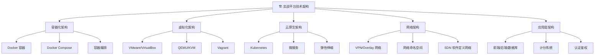
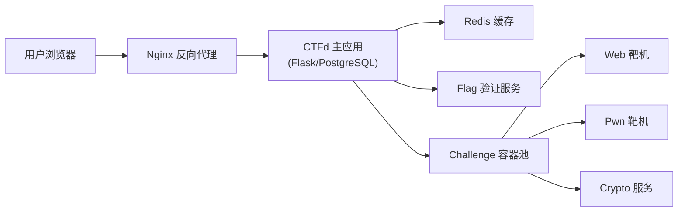
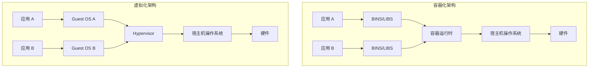
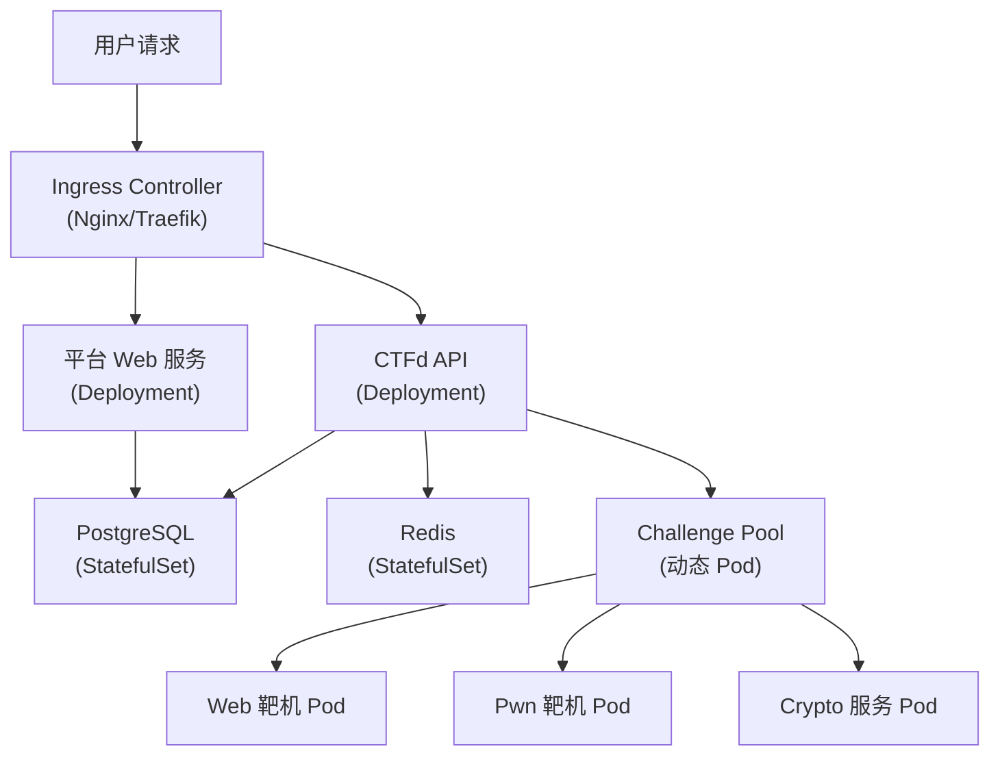
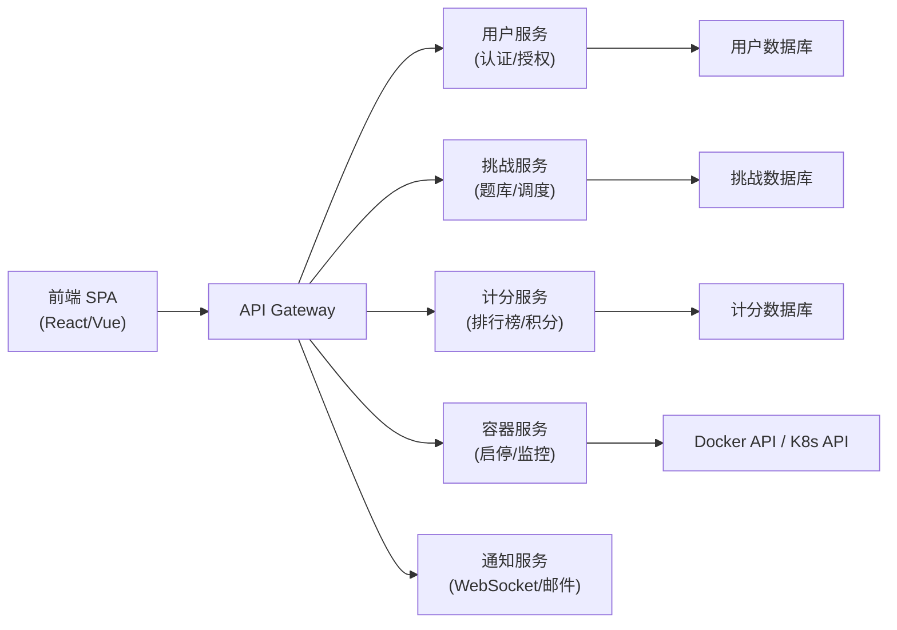
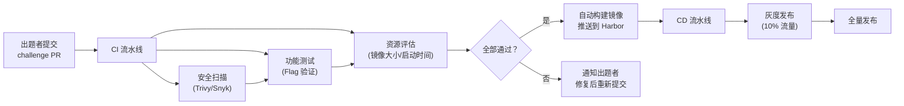
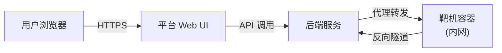
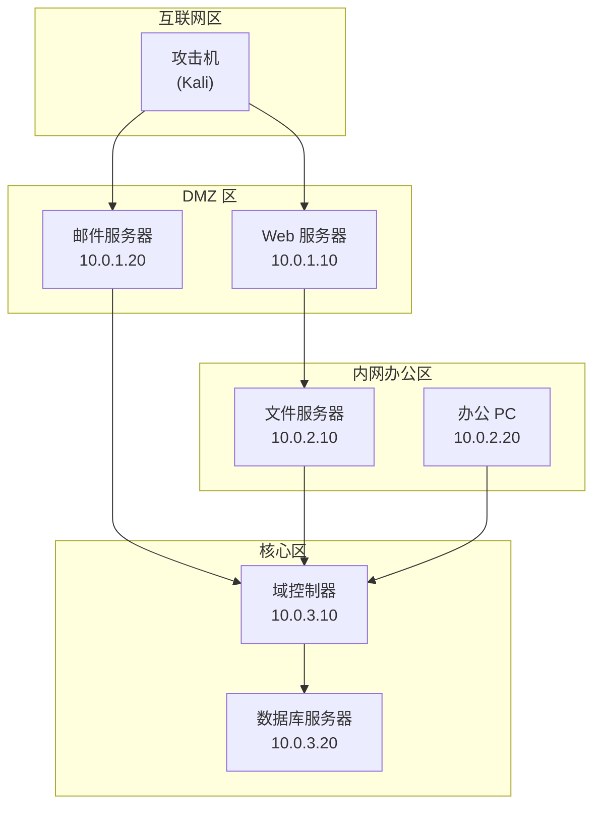

## 四、实战平台的技术架构

理解实战平台的技术架构，不仅有助于学习者选择合适的平台，更能帮助有志于构建自身靶场环境的团队做出合理的技术决策。本节从容器化、虚拟化、云原生、网络架构、应用架构五个维度，系统剖析现代实战平台的底层技术栈。



---

### 4.1 容器化架构

#### 4.1.1 为什么容器化成为主流

现代实战平台普遍采用 Docker 等容器技术部署靶机环境，这不是偶然的技术选择，而是由 CTF 和渗透测试靶场的特殊需求决定的：

| 需求 | 容器化方案 | 传统方案的局限 |
|------|-----------|--------------|
| 快速部署 | 秒级启动容器 | VM 启动需数十秒到分钟 |
| 环境隔离 | 每用户独立容器实例 | 共享环境易互相干扰 |
| 环境一致 | 镜像分发保证一致性 | "在我机器上能跑"问题 |
| 一键重置 | 销毁容器重建即可 | VM 需快照恢复或重装 |
| 资源效率 | 共享宿主机内核，资源开销小 | 每个 VM 独占一份 OS |
| 并发承载 | 单机可运行数十到上百容器 | VM 受限于硬件虚拟化能力 |

Docker 通过 Linux 内核的 **Namespace**（实现资源视图隔离）和 **Cgroup**（实现资源配额限制）两大机制，在不虚拟化硬件的前提下实现了轻量级的进程隔离。这意味着一台配备 64GB 内存的服务器可以同时运行 50-100 个容器化的靶机环境，而同等硬件条件下运行虚拟机可能只能承载 10-15 个。

#### 4.1.2 靶机容器化的典型实现

以 Vulhub 漏洞复现平台为例，其 Docker 化的 CVE 漏洞环境结构如下：

```bash
# 目录结构
vulhub/
├── spring/CVE-2022-22965/   # Spring4Shell 漏洞
│   ├── docker-compose.yml    # 编排文件
│   ├── Dockerfile            # 镜像构建文件
│   ├── web.xml               # 漏洞应用配置
│   └── app/                  # 有漏洞的应用代码
├── struts2/s2-045/
│   ├── docker-compose.yml
│   └── Dockerfile
└── ...
```

对应的 `docker-compose.yml` 示例：

```yaml
version: '3'
services:
  web:
    build: ./
    ports:
      - "8080:8080"     # 映射到宿主机端口
    mem_limit: 512m      # 限制内存 512MB
    cpus: 0.5            # 限制 CPU 使用率 50%
    restart: unless-stopped
```

关键设计要点：

- **资源限制**：通过 `mem_limit` 和 `cpus` 防止单个靶机耗尽宿主机资源，确保多用户并发时的稳定性
- **端口映射**：每个容器映射不同端口，避免端口冲突（如 8080、8081、8082...）
- **网络隔离**：同一 `docker-compose.yml` 内的服务默认在同一网络，不同靶机之间默认隔离
- **持久化控制**：通常不挂载 volume，容器销毁即恢复初始状态

#### 4.1.3 CTFd 等竞赛平台的容器化架构

以开源 CTF 平台 CTFd 为例，其容器化部署架构如下：



CTFd 的 Challenge 插件支持多种后端：

- **静态 Flag**：Flag 直接嵌入题目描述或文件中，无需容器
- **动态 Flag**：Flag 在容器启动时随机生成并注入，每次启动不同，防止选手间共享答案
- **远程连接**：靶机运行在独立服务器或集群中，CTFd 仅负责调度和计分

```python
# CTFd 插件中动态 Flag 注入的伪代码逻辑
def create_container(challenge):
    # 生成唯一 Flag
    flag = f"flag{{{uuid.uuid4()}}}"
    # 启动容器并注入环境变量
    container = docker.run(
        image=challenge.image,
        environment={"FLAG": flag},
        ports={80: random_port()}
    )
    # 存储 Flag 与容器的映射关系
    db.store_flag(challenge_id, flag, container.id)
    return container
```

#### 4.1.4 容器化架构的安全考量

容器化并非没有安全风险。在实战平台场景中，需要特别关注以下安全边界：

| 风险类型 | 具体威胁 | 防御措施 |
|---------|---------|---------|
| 容器逃逸 | 用户在靶机内利用内核漏洞逃逸到宿主机 | 及时更新宿主机内核；禁用 `--privileged` 模式 |
| 资源耗尽 | 恶意用户运行 fork bomb 耗尽系统资源 | 设置 cgroup 限制（CPU、内存、PID 数量） |
| 网络穿透 | 容器间不应互通，但配置不当可能导致横向访问 | 使用 Docker 自定义网络，严格控制网络策略 |
| 镜像安全 | 靶机镜像本身可能被篡改或包含后门 | 使用可信基础镜像，定期扫描漏洞 |
| 数据残留 | 用户的攻击工具或敏感数据残留在容器中 | 使用临时文件系统（`--tmpfs`），容器销毁后数据清除 |

```bash
# 安全加固的容器启动示例
docker run \
  --rm \                          # 容器退出后自动删除
  --read-only \                   # 只读文件系统
  --tmpfs /tmp:size=100m \        # /tmp 为临时挂载，限制大小
  --cpus=0.5 \                    # CPU 限制
  --memory=256m \                 # 内存限制
  --pids-limit=50 \               # 进程数限制（防 fork bomb）
  --network=challenge_net \       # 自定义网络
  --security-opt=no-new-privileges \  # 禁止提权
  -p 8080:80 \
  challenge_image:latest
```

---

### 4.2 虚拟化架构

#### 4.2.1 虚拟化与容器化的本质区别

虽然容器化因其轻量高效成为主流，但在某些特定场景下，虚拟化（VM）仍然不可替代。理解两者的本质区别是技术选型的基础：



| 对比维度 | 容器（Docker） | 虚拟机（VM） |
|---------|--------------|-------------|
| 隔离级别 | 进程级（共享内核） | 硬件级（独立内核） |
| 启动时间 | 秒级 | 分钟级 |
| 资源开销 | 极小（MB 级） | 较大（GB 级） |
| 系统要求 | 需要 Linux 内核 | 可运行任意 OS |
| 安全边界 | 内核共享，攻击面较大 | 完全隔离，攻击面极小 |
| 典型场景 | Web 靶机、漏洞环境 | 内核漏洞、操作系统级靶机 |

#### 4.2.2 各虚拟化技术在平台中的应用

**VMware / VirtualBox**

VMware ESXi 和 VirtualBox 是渗透测试靶场中最常见的虚拟化选择：

- **VulnHub**：所有靶机以 `.vbox` / `.vmx` 格式发布，用户下载后在本地虚拟化软件中导入，获得与发布者完全一致的环境
- **HackTheBox**：早期靶机使用 OVF 格式分发，后来转向在线容器化；Proving Grounds 仍提供 VM 静态靶机
- **本地实验室**：安全研究者常在 VMware Workstation / VirtualBox 中搭建多机靶场（如 Metasploitable + Windows 靶机 + Kali 攻击机），模拟完整渗透测试网络

VirtualBox 的优势在于免费开源，适合个人学习者；VMware 的优势在于性能更优、快照功能更强大，适合企业级部署。

**QEMU/KVM**

QEMU/KVM 是服务器端虚拟化的主力方案，被大量云平台和在线靶场采用：

- **KVM（Kernel-based Virtual Machine）**：直接集成在 Linux 内核中，性能接近裸机
- **QEMU**：用户态模拟器，可以模拟多种硬件架构（x86、ARM、MIPS 等），特别适合 IoT 和工控安全靶场

对于需要模拟不同 CPU 架构的场景（如 ARM 设备固件漏洞复现），QEMU 是唯一可行的选择。例如：

```bash
# 使用 QEMU 模拟 ARM 架构运行 IoT 固件
qemu-system-arm \
  -M virt \
  -kernel zImage \
  -dtb device-tree.dtb \
  -drive file=rootfs.ext4,if=virtio \
  -append "root=/dev/vda console=ttyAMA0" \
  -nographic \
  -net nic -net user,hostfwd=tcp::8080-:80
```

**Vagrant**

Vagrant 是自动化虚拟机管理工具，解决了 VM 创建、配置、销毁的标准化问题：

```ruby
# Vagrantfile 示例：自动化创建靶机环境
Vagrant.configure("2") do |config|
  config.vm.define "victim" do |victim|
    victim.vm.box = "ubuntu/focal64"
    victim.vm.network "private_network", ip: "192.168.56.10"
    victim.vm.provision "shell", path: "setup_vuln.sh"
    victim.vm.provider "virtualbox" do |vb|
      vb.memory = "1024"
      vb.cpus = 2
    end
  end
  
  config.vm.define "attacker" do |attacker|
    attacker.vm.box = "kalilinux/rolling"
    attacker.vm.network "private_network", ip: "192.168.56.20"
  end
end
```

```bash
# 一键启动整个靶场环境
vagrant up

# 一键销毁所有环境
vagrant destroy -f

# 一键恢复到初始状态
vagrant provision
```

Vagrant 在高校安全实验室和企业内部培训中应用广泛，因为其 `Vagrantfile` 可以版本控制，确保所有学员获得完全相同的环境。

#### 4.2.3 混合架构：容器 + VM 的协同

许多成熟的平台采用容器与虚拟机混合架构，根据挑战类型选择最合适的技术：

| 挑战类型 | 推荐技术 | 原因 |
|---------|---------|------|
| Web 漏洞（SQL 注入、XSS 等） | Docker 容器 | 轻量、快速、易于重建 |
| 内核漏洞利用（提权类） | QEMU/KVM 虚拟机 | 需要完整内核，容器共享宿主内核无法模拟 |
| 多机网络拓扑（内网渗透） | Vagrant + VirtualBox | 需要多台 VM 组成子网 |
| 二进制逆向/漏洞利用 | Docker 容器 | 运行时依赖简单，容器即可满足 |
| IoT/工控固件 | QEMU 模拟 | 需要模拟不同硬件架构 |
| 操作系统级（蓝队取证） | 虚拟机 | 需要完整的磁盘镜像和文件系统 |

---

### 4.3 云原生架构

#### 4.3.1 Kubernetes 与容器编排

当平台用户规模达到数千到数万级别时，单台服务器上的 Docker 已无法满足需求。Kubernetes（K8s）成为大型在线平台的核心基础设施。



Kubernetes 在平台中的核心作用：

- **动态调度**：当用户点击"开始挑战"时，K8s 动态创建靶机 Pod；用户放弃或超时后，自动回收 Pod 释放资源
- **水平伸缩**：高峰时段（如 CTF 比赛期间）自动增加副本数，低谷时段缩减以节省成本
- **自愈能力**：Pod 崩溃或节点故障时，K8s 自动在健康节点上重建 Pod
- **滚动更新**：靶机镜像更新时，无需停机即可逐步替换旧版本

```yaml
# K8s Deployment 示例：动态靶机池
apiVersion: apps/v1
kind: Deployment
metadata:
  name: challenge-web-001
spec:
  replicas: 10          # 默认运行 10 个实例
  selector:
    matchLabels:
      challenge: web-001
  template:
    metadata:
      labels:
        challenge: web-001
    spec:
      containers:
      - name: web-challenge
        image: platform/challenge-web-001:v2.1
        resources:
          requests:
            cpu: "250m"        # 请求 0.25 核 CPU
            memory: "128Mi"    # 请求 128MB 内存
          limits:
            cpu: "500m"        # 最多使用 0.5 核
            memory: "256Mi"    # 最多使用 256MB
        ports:
        - containerPort: 80
        env:
        - name: FLAG
          valueFrom:
            secretKeyRef:
              name: challenge-secrets
              key: web-001-flag
```

#### 4.3.2 微服务拆分

大型平台的后端通常采用微服务架构，将不同职责拆分为独立服务：



各服务的职责划分：

| 服务 | 职责 | 技术栈示例 |
|------|------|-----------|
| 用户服务 | 注册、登录、JWT Token 管理、权限控制 | Flask/Django + PostgreSQL |
| 挑战服务 | 题目管理、难度分级、Writeup 管理 | FastAPI + MongoDB |
| 计分服务 | 动态计分、排行榜、积分统计 | Go + Redis |
| 容器服务 | 靶机启停、状态监控、资源调度 | Go/Python + Docker API |
| 通知服务 | 实时排名推送、新题通知 | Node.js + WebSocket |
| 附件服务 | 题目文件、Writeup 文档的 CDN 分发 | MinIO/S3 + CloudFront |

微服务架构的优势在于独立部署和扩展：计分服务在比赛中承受高并发，可以单独扩容而不影响其他服务；容器服务需要与 Docker/K8s 交互，可以独立升级运维。

#### 4.3.3 CI/CD 与靶机自动化

成熟的平台通过 CI/CD 流水线实现靶机的自动化构建、测试和部署：



关键流程说明：

- **安全扫描**：自动检测靶机镜像中是否存在非预期的漏洞（即不应暴露给选手的漏洞），以及是否包含敏感信息（API Key、真实密码等）
- **功能测试**：自动验证 Flag 的可获取性，确保选手能够通过预期路径完成挑战
- **资源评估**：检查镜像大小（建议 < 1GB）、启动时间（建议 < 30s）、内存占用是否在合理范围内
- **灰度发布**：先将新靶机开放给少量用户测试，确认无问题后全量开放

---

### 4.4 网络架构

网络架构是实战平台中最容易被忽视但至关重要的部分。错误的网络设计可能导致靶机互相暴露、选手网络冲突、甚至安全事故。

#### 4.4.1 用户接入层

**VPN 接入**

以 HackTheBox 为代表，用户通过 OpenVPN 接入平台内网：

```bash
# 用户视角的接入流程
# 1. 下载平台提供的 .ovpn 配置文件
sudo openvpn lab_linux.ovpn

# 2. 验证连通性
ping 10.10.x.x           # 分配的靶机 IP
traceroute 10.10.x.x     # 确认路由正常

# 3. 开始渗透测试
nmap -sC -sV 10.10.x.x
```

VPN 接入的优势：用户获得一个全局路由的虚拟 IP，可以像访问局域网一样直接访问靶机，无需端口转发。但缺点是配置复杂，部分网络环境（如公司防火墙）会阻止 VPN 连接。

**WebSocket / HTTP 直连**

以 CTFd、picoCTF 为代表，用户通过浏览器直接访问平台 Web 界面：



这种模式下，靶机不直接暴露到公网，而是通过平台后端做反向代理，安全性更高。

#### 4.4.2 靶机隔离层

每个靶机容器需要独立的网络命名空间，确保：

- **用户间隔离**：用户 A 不能访问用户 B 的靶机
- **靶机间隔离**：除非设计为多机联动，否则不同靶机之间不应互通
- **出站控制**：限制靶机的出站流量，防止被用作跳板攻击外部系统

```bash
# Docker 网络隔离配置
# 创建独立网络
docker network create --driver bridge \
  --subnet 172.20.0.0/16 \
  challenge_net

# 每个用户容器接入独立网络
docker run --network user_alice_net ...
docker run --network user_bob_net ...

# 用户容器可通过代理访问靶机，但不能直接访问其他用户的容器
```

#### 4.4.3 网络拓扑模拟

部分平台需要模拟复杂的企业内网拓扑（如多子网、DMZ、域环境），这时需要更精细的网络设计：



实现这种多层网络拓扑的技术方案：

- **Docker Compose 多网络**：使用多个自定义网络模拟不同子网段，通过容器充当路由器/防火墙
- **GNS3/EVE-NG**：专业网络仿真平台，支持模拟 Cisco、Juniper 等真实网络设备
- **GOAD（Game of Active Directory）**：专门用于 AD 域环境渗透的自动化部署工具，使用 Vagrant + VirtualBox 创建包含多台 Windows Server 和 AD 域控的完整环境

```yaml
# GOAD 多网络拓扑的 Vagrant 配置片段
Vagrant.configure("2") do |config|
  # 域控制器 - 连接所有网络
  config.vm.define "dc01" do |dc|
    dc.vm.network "private_network", ip: "10.0.1.10"   # DMZ
    dc.vm.network "private_network", ip: "10.0.2.10"   # 办公区
    dc.vm.network "private_network", ip: "10.0.3.10"   # 核心区
  end
  
  # Web 服务器 - 仅连接 DMZ 和办公区
  config.vm.define "web01" do |web|
    web.vm.network "private_network", ip: "10.0.1.20"
    web.vm.network "private_network", ip: "10.0.2.20"
  end
end
```

---

### 4.5 应用层架构

#### 4.5.1 前端架构

现代实战平台的前端通常采用单页应用（SPA）框架：

| 平台 | 前端技术 | 特点 |
|------|---------|------|
| CTFd | Jinja2 模板 + jQuery | 轻量、插件生态丰富 |
| HackTheBox | React | 现代化 UI、实时交互 |
| TryHackMe | React + TypeScript | 引导式学习路径、进度追踪 |
| PicoCTF | React | 简洁竞赛界面、即时反馈 |

前端的核心功能模块：

- **题目列表**：按方向、难度、状态分类展示，支持搜索和筛选
- **在线解题**：内置终端（WebTerminal）或引导外部连接
- **排行榜**：实时更新的积分排名，支持多种计分规则
- **社区模块**：Writeup 展示、讨论区、队伍协作

#### 4.5.2 后端架构

后端是平台的"大脑"，核心职责包括：

**用户管理**：注册、登录、OAuth 集成（GitHub/Google 登录）、团队管理、角色权限（管理员/出题者/选手）

**题库管理**：题目的 CRUD、分类标签、难度评估、Flag 管理（静态/动态/分布式 Flag）

**容器调度**：与 Docker API / Kubernetes API 交互，实现靶机的按需创建、自动回收、资源监控

**计分引擎**：

```python
# 动态计分算法示例（类 CTFtime 计分模型）
def dynamic_score(challenge, solve_count, total_teams, time_limit):
    """
    动态计分：解出人数越多，题目分值越低
    - 初始分值：challenge.max_points（如 500 分）
    - 最低分值：challenge.min_points（如 100 分）
    - 解出比例越高，分值越接近最低分
    """
    solve_ratio = solve_count / total_teams
    # Sigmoid 衰减曲线
    score_range = challenge.max_points - challenge.min_points
    decay = math.exp(-3 * solve_ratio)  # 衰减系数
    score = challenge.min_points + score_range * decay
    return round(score)
```

#### 4.5.3 数据库设计

实战平台的数据库通常需要存储以下核心数据：

| 数据类型 | 存储方案 | 典型数据 |
|---------|---------|---------|
| 用户/团队 | PostgreSQL/MySQL | 用户信息、权限、团队归属 |
| 题目/Flag | PostgreSQL + Redis | 题目内容、Flag 映射、分类标签 |
| 提交记录 | PostgreSQL | 提交时间、Flag 值、正误判断 |
| 排行榜 | Redis Sorted Set | 实时排名、积分变化 |
| 容器状态 | Redis + 数据库 | 容器 ID、过期时间、资源占用 |
| 操作日志 | Elasticsearch | 登录记录、操作审计、异常检测 |

Redis 在平台中的关键作用：

```python
# Redis 实现实时排行榜
import redis

r = redis.Redis()

# 用户提交正确后更新积分
def update_score(team_id, points):
    r.zincrby("leaderboard", points, team_id)

# 获取 Top 10 排行榜
def get_top10():
    return r.zrevrange("leaderboard", 0, 9, withscores=True)

# 获取特定用户的排名
def get_rank(team_id):
    rank = r.zrevrank("leaderboard", team_id)
    return rank + 1 if rank is not None else None
```

#### 4.5.4 认证与鉴权

实战平台需要多层安全防护，防止作弊和未授权访问：

| 安全机制 | 实现方式 | 防护目标 |
|---------|---------|---------|
| 身份认证 | JWT Token + Refresh Token | 防止未登录访问 |
| 速率限制 | Redis 令牌桶 / 滑动窗口 | 防止暴力枚举 Flag |
| Flag 验证 | 服务端比对 + 提交频率限制 | 防止 Flag 暴力猜测 |
| 流量监控 | 请求特征分析 | 检测自动化脚本和 CTF Bot |
| 行为审计 | 操作日志记录 | 赛后审查异常行为 |

```python
# 速率限制实现示例
import time, redis

r = redis.Redis()
RATE_LIMIT = 10  # 每分钟最多 10 次提交

def check_rate_limit(user_id, challenge_id):
    key = f"rate:{user_id}:{challenge_id}"
    current = r.get(key)
    if current and int(current) >= RATE_LIMIT:
        return False  # 触发速率限制
    pipe = r.pipeline()
    pipe.incr(key)
    pipe.expire(key, 60)  # 60 秒过期
    pipe.execute()
    return True
```

---

### 4.6 架构选型决策指南

对于不同规模和目标的平台建设，技术选型应遵循以下决策框架：

| 平台规模 | 推荐架构 | 技术栈 | 预期并发 |
|---------|---------|--------|---------|
| 个人/教学 | 单机 Docker Compose | CTFd + Docker | 10-50 人 |
| 小型团队 | 单机 + 反向代理 | CTFd + Nginx + PostgreSQL | 50-200 人 |
| 中型平台 | 容器编排 | K8s + 微服务 | 200-2000 人 |
| 大型平台 | 云原生 + 多区域 | K8s + 服务网格 + 多活 | 2000+ 人 |

**从零搭建个人靶场的推荐技术栈：**

```bash
# 1. 安装 Docker 和 Docker Compose
curl -fsSL https://get.docker.com | sh
sudo usermod -aG docker $USER

# 2. 部署 CTFd
git clone https://github.com/CTFd/CTFd.git
cd CTFd
docker-compose up -d

# 3. 部署常见漏洞靶场
git clone https://github.com/vulhub/vulhub.git
cd vulhub/struts2/s2-045
docker-compose up -d
# 访问 http://localhost:8080

# 4. 部署 Web 安全靶场
docker run --rm -d -p 8080:80 vulnerables/web-dvwa
# 默认用户: admin / 密码: password
```

理解平台的技术架构，能够帮助学习者更好地利用平台特性提升学习效率，也能为有志于安全平台建设的团队提供清晰的技术蓝图。在后续章节中，我们将基于这些架构知识，深入分析各主流平台的具体实现差异。
