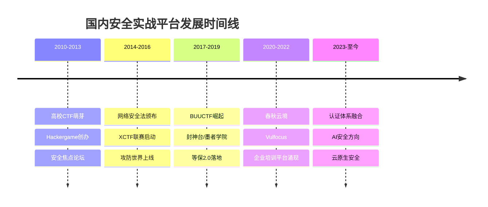
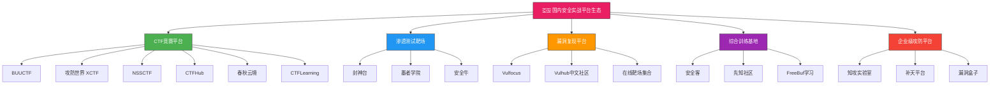
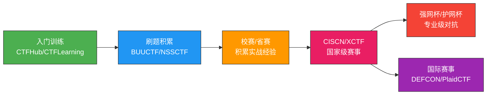
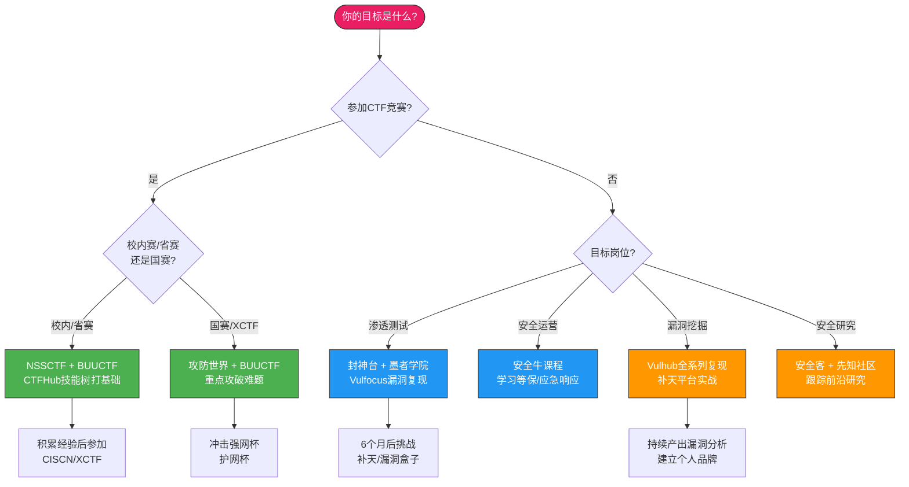

## 五、国内实战平台生态

### 5.1 国内安全实战平台的发展脉络

中国网络安全实战平台的发展经历了三个阶段，每一个阶段都与国家政策、行业需求和技术演进紧密相关。

**第一阶段：萌芽期（2010—2015年）**。这一时期，国内安全训练主要依赖翻译搬运国外资源。少数先驱者开始搭建本土化靶场，如早期的 Hackergame（中国科学技术大学主办）和各类高校 CTF 赛事。平台形态单一，多为简单的 Web 漏洞靶场，缺乏系统化的学习路径设计。

**第二阶段：爆发期（2016—2020年）**。2016 年《网络安全法》颁布后，网络安全人才培养被提升至国家战略高度。教育部设立"网络空间安全"一级学科，公安部推动等保 2.0 标准落地，催生了大量安全培训需求。BUUCTF、NSSCTF、CTFHub、封神台、墨者学院等一批平台在此期间集中涌现。同时，国内 CTF 赛事生态日趋成熟——强网杯、网鼎杯、XCTF 联赛等高规格赛事相继创办，形成了"以赛促学"的良性循环。

**第三阶段：深化期（2021年至今）**。平台从"有题可做"向"系统化育人"转型。代表性变化包括：春秋云境推出企业级实战靶场、知攻实验室瞄准企业安全团队培训、Vulfocus 将漏洞复现与在线靶场融合。同时，平台开始重视认证体系——部分平台与 CISP（注册信息安全专业人员）、CISP-PTE（注册渗透测试工程师）等国内认证挂钩，增强了训练结果的行业认可度。

### 5.2 国内平台生态全景

国内安全实战平台按功能定位可分为五大类别，各有侧重，共同构成完整的安全人才培养生态。

### 5.3 CTF竞赛平台

CTF（Capture The Flag）竞赛是国内外安全圈最成熟的竞技形式。国内 CTF 生态独具特色——高校赛事密集、政府主导的大型赛事影响力强、商业平台题库丰富。

#### 5.3.1 BUUCTF

**平台定位**：国内题库量最大的在线 CTF 刷题平台，堪称"CTF界的LeetCode"。

**核心优势**：
- **题库规模**：收录 1500+ 道国内外 CTF 赛题，覆盖 Web、Crypto、Reverse、Pwn、Misc 五大方向，且持续更新
- **在线靶机**：大部分题目提供 Docker 化的在线环境，一键启动，零配置成本
- **题目溯源**：每道题标注了出处（哪场比赛、哪个年份），便于按赛事针对性训练
- **社区 Writeup**：讨论区汇集大量解题报告，质量参差但数量充足

**使用策略**：
- 初学者从 Web 方向 Easy 难度入手，每类刷 20 题建立基础手感
- 中级选手按比赛分类刷题（如强网杯、网鼎杯专题），适应赛事风格
- 高阶选手重点攻克 Crypto 和 Reverse 方向，这两个方向国内题目质量较高

**局限性**：
- 部分老旧题目环境不稳定（依赖过时的 Docker 镜像）
- 缺乏系统化学习路径，更适合作为补充刷题平台而非主力学习工具
- Web 方向题目以 PHP 为主，Java/Python/Node.js 覆盖不足

#### 5.3.2 攻防世界（XCTF/ADWorld）

**平台定位**：浙江大学网络空间安全学院主导的综合安全训练平台，与 XCTF 联赛深度绑定。

**核心优势**：
- **赛题回放**：XCTF 联赛（强网杯、网鼎杯、CISCN 等）的题目会在赛后上线，是接触国内顶级赛事真题的唯一渠道
- **高质量题目**：依托高校科研力量，题目设计严谨，部分题目涉及前沿安全研究
- **新手区**：设有独立的新手训练区，提供引导式入门内容
- **XCTF 积分赛**：与国际 CTF 赛事对接，优秀选手可获得参加国际赛的机会

**使用策略**：
- 新手区 50+ 题全部完成后，转战正式题目区
- 重点关注"热点漏洞复现"类题目，这类题目紧跟安全热点，实战价值最高
- 参加平台定期举办的 XCTF 赛事，积累竞赛经验

**局限性**：
- 部分题目难度跨度大，缺乏平滑的难度过渡
- 在线环境稳定性一般，高峰时段偶有排队

#### 5.3.3 NSSCTF

**平台定位**：专注于高校 CTF 赛事题目的聚合平台，是高校安全社团和选手的必备工具。

**核心优势**：
- **高校赛事全覆盖**：收录了全国各大高校 CTF 赛事（CISCN 省赛/国赛、各校校赛）的题目
- **比赛复现**：支持在线复现历史赛事环境，可模拟真实比赛体验
- **Writeup 汇集**：赛后 Writeup 收集及时，是学习国内高校赛事解题思路的最佳资源
- **战队系统**：支持组建战队，便于高校社团组织训练和参赛

**使用策略**：
- 按目标赛事筛选题目（如备战 CISCN 就刷 CISCN 历年真题）
- 关注平台上发布的高校校赛信息，积极报名参加
- 利用战队功能组织社团训练，定期举办内部赛

#### 5.3.4 CTFHub

**平台定位**：以"技能树"概念设计的引导式 CTF 学习平台，强调系统化知识构建。

**核心优势**：
- **技能树系统**：将 CTF 知识分解为 Web、杂项、密码学、逆向、Pwn 五大技能树，每个技能树下有细分知识点，形成从基础到进阶的完整学习路径
- **分步引导**：每个技能点配有基础教学 + 实战练习，先讲原理再做题
- **难度标记**：题目标注难度等级（新手/入门/简单/中等/困难），便于选择合适挑战

**使用策略**：
- 按照技能树顺序逐一攻克，不要跳级
- 每完成一个技能点，回顾该知识点的所有变体，确保理解透彻
- 将技能树作为自测工具——哪些节点长期未解锁就是薄弱环节

**局限性**：
- 免费额度有限，部分高级技能点需要付费解锁
- 题目数量不如 BUUCTF 丰富，更适合入门和查漏补缺

#### 5.3.5 春秋云境

**平台定位**：知名春秋网安学院出品的商业级 CTF/渗透测试平台，定位中高级用户。

**核心优势**：
- **高质量靶机**：靶机设计贴近真实企业环境，技术栈多样（Java Spring、PHP、Python Flask 等）
- **综合性强**：不仅有 CTF 题目，还提供渗透测试靶场和漏洞复现环境
- **企业级场景**：部分靶机模拟了真实企业内网拓扑，包含域控、数据库、中间件等多层架构

**使用策略**：
- 适合有一定基础后作为进阶训练平台
- 重点关注企业级场景靶机，这类训练直接对接实际工作需求

#### 5.3.6 CTFLearning

**平台定位**：面向 CTF 新手的入门级学习平台，强调"零基础友好"。

**核心优势**：
- **新手引导**：题目配有详细的提示和解题步骤，不会让新手无从下手
- **Writeup 完整**：几乎每道题都有官方 Writeup，学习闭环完整
- **知识覆盖**：从最基础的编码转换到中等难度的 Web 漏洞均有涉及

**使用策略**：
- 作为 CTF 的第一个平台，完成全部入门题目后转入 BUUCTF 或 CTFHub

#### 5.3.7 国内CTF平台对比

| 平台 | 题目数量 | 难度范围 | 核心特色 | 免费/付费 | 最适合人群 |
|------|---------|---------|---------|----------|-----------|
| **BUUCTF** | 1500+ | 入门—高 | 题库最大，赛题回放 | 免费 | 各水平段刷题 |
| **攻防世界** | 500+ | 中—高 | XCTF赛题，高校背景 | 免费 | 中高级竞赛选手 |
| **NSSCTF** | 800+ | 中—高 | 高校赛事聚合 | 免费 | 高校CTF社团 |
| **CTFHub** | 300+ | 入门—中 | 技能树引导 | 免费/付费 | 系统学习者 |
| **春秋云境** | 200+ | 中—高 | 企业级靶机 | 付费 | 进阶选手 |
| **CTFLearning** | 200+ | 入门 | 新手友好，Writeup完整 | 免费 | 零基础入门 |

### 5.4 渗透测试靶场

与 CTF 平台的"单点突破"模式不同，渗透测试靶场强调完整的攻击链——从信息收集到最终获取 root 权限。国内靶场平台在本土化方面有独特优势。

#### 5.4.1 封神台

**平台定位**：国内知名度最高的渗透测试在线靶场，由先知社区团队维护。

**核心优势**：
- **靶机类型丰富**：提供 Web 应用、Linux 服务器、Windows 域环境等多种靶机
- **难度分级明确**：分为入门、初级、中级、高级、大师五个等级，每个等级有多台靶机
- **中文环境**：全中文界面和提示，对英语基础薄弱的用户非常友好
- **在线操作**：支持浏览器内直接操作，无需本地搭建复杂环境

**靶机分类**：
- **Web 应用靶机**：模拟常见的 Web 漏洞场景（SQL 注入、文件上传、反序列化等）
- **系统渗透靶机**：模拟 Linux/Windows 服务器渗透，包含提权、横向移动等环节
- **内网渗透靶机**：模拟多层内网拓扑，需要通过跳板机逐步渗透到核心区域
- **综合靶机**：融合多种技术的复合型靶机，考验综合能力

**使用策略**：
- 从入门级 Web 靶机开始，逐步提升到系统渗透和内网渗透
- 每台靶机完成后记录攻击路径和关键发现，形成个人渗透笔记
- 关注平台更新的新型靶机，及时跟进新技术栈

**局限性**：
- 部分靶机更新较慢，技术栈偏向传统（PHP/MySQL 为主）
- 社区活跃度不如 HackTheBox，Writeup 资源相对较少

#### 5.4.2 墨者学院

**平台定位**：提供多方向安全靶场训练的综合性平台，覆盖 Web 安全、内网安全、移动安全等方向。

**核心优势**：
- **方向覆盖广**：Web 安全靶场、内网渗透靶场、Android 逆向靶场、代码审计靶场一应俱全
- **靶场设计**：每个靶场都有明确的学习目标和通关条件，部分靶场包含多关卡递进设计
- **环境稳定**：Docker 化部署，环境重置方便，稳定性较好
- **课程配套**：部分靶场配套有视频教程，适合边看边练

**重点靶场**：
- **Web 安全系列**：从 SQL 注入基础到高级绕过，覆盖 OWASP Top 10 主要漏洞类型
- **内网渗透系列**：模拟企业内网环境，包含域控制器、文件服务器、数据库服务器等
- **代码审计系列**：提供 PHP/Java 源码，训练从源码层面发现安全漏洞的能力
- **Java 反序列化系列**：专门针对 Java 反序列化漏洞的靶场，覆盖 Commons Collections、Fastjson 等热门组件

**使用策略**：
- 根据自身弱项选择对应方向的靶场集中训练
- 代码审计靶场是提升内功的最佳选择，建议有基础后优先练习
- 内网渗透靶场需要耐心，建议分多次完成，不要急于求成

#### 5.4.3 安全牛

**平台定位**：综合性安全学习平台，整合了课程、靶场、认证培训等功能。

**核心优势**：
- **内容体系化**：将安全知识分为多个模块（渗透测试、安全运维、安全开发等），每个模块有对应的课程和实验
- **企业培训**：提供面向企业安全团队的定制化培训方案
- **认证对接**：培训内容与 CISP、CISP-PTE 等国内安全认证对标

**使用策略**：
- 如果目标是考取 CISP 系列认证，安全牛的培训课程是较好的备考资源
- 靶场部分作为课程的实践补充使用

#### 5.4.4 国内渗透测试靶场对比

| 平台 | 靶机数量 | 技术方向 | 特色 | 价格 | 难度范围 |
|------|---------|---------|------|------|---------|
| **封神台** | 100+ | Web/系统/内网 | 中文友好，难度分级 | 免费/付费 | 入门—大师 |
| **墨者学院** | 80+ | Web/内网/逆向/代码审计 | 方向全面，配套教程 | 免费/付费 | 入门—高级 |
| **安全牛** | 50+ | 综合 | 认证培训，企业定制 | 付费 | 入门—高级 |

### 5.5 漏洞复现平台

漏洞复现平台专注于提供已知 CVE 漏洞的可运行环境，帮助安全研究者理解漏洞原理、验证利用方法。与通用靶场不同，漏洞复现平台强调的是**单点漏洞的深度理解**而非完整渗透流程。

#### 5.5.1 Vulfocus

**平台定位**：国内首个开源的漏洞集成平台，融合了在线靶场和漏洞复现两大功能。

**核心优势**：
- **漏洞集成**：整合了 Vulhub、VulApps 等多个漏洞环境，提供统一的在线访问入口
- **在线使用**：无需本地部署 Docker，直接在浏览器中启动漏洞环境，使用门槛极低
- **中文文档**：每个漏洞配有中文说明文档，解释漏洞背景、影响范围、利用方法
- **持续更新**：紧跟最新 CVE 漏洞，新漏洞通常在披露后数天内上线

**使用策略**：
- 将 Vulfocus 作为漏洞复现的第一站，快速验证和理解新漏洞
- 结合漏洞复现结果，深入阅读漏洞分析报告和补丁代码
- 按技术栈分类复现（如 Spring 全系列、Struts2 全系列），建立系统化的漏洞认知

**部署方式**：
- **在线使用**：访问 Vulfocus 官网直接使用（推荐初学者）
- **本地部署**：支持 Docker 一键部署，适合需要大量复现的研究场景
- **团队部署**：支持多用户并发，适合安全团队内部培训

#### 5.5.2 Vulhub 中文社区

**平台定位**：Vulhub（全球最大的 Docker 化漏洞复现环境集合）的中文使用社区和教程聚合。

**核心优势**：
- **资源丰富**：Vulhub 本身提供 400+ 漏洞环境，涵盖 Web 中间件、数据库、大数据组件、容器安全等
- **Docker 一键部署**：使用 docker-compose 一条命令即可启动漏洞环境
- **文档详尽**：每个漏洞环境配有英文原文档，中文社区补充翻译和解读
- **紧跟前沿**：新 CVE 漏洞的复现环境通常在漏洞披露后 1-3 天内上线

**覆盖的技术栈**：

| 类别 | 代表组件 | 典型漏洞 |
|------|---------|---------|
| Web 框架 | Spring Boot, Struts2, ThinkPHP | RCE、反序列化、SpEL 注入 |
| 中间件 | Apache Tomcat, Nginx, WebLogic | 文件包含、弱口令、反序列化 |
| 数据库 | Redis, MySQL, Elasticsearch | 未授权访问、代码执行 |
| 容器/编排 | Docker, Kubernetes, ZooKeeper | 容器逃逸、API 未授权 |
| 大数据 | Hadoop, Spark, Hive | 未授权访问、命令注入 |
| 消息队列 | ActiveMQ, RabbitMQ, Kafka | 反序列化、未授权访问 |
| CMS | WordPress, Drupal, Joomla | 插件漏洞、权限绕过 |

**使用策略**：
- 优先复现与自身工作技术栈相关的漏洞（如做 Java 开发就复现 Spring/Struts2/Tomcat 全系列）
- 每个漏洞复现后，阅读官方补丁 diff，理解修复方案
- 尝试修改 exploit 脚本以适应不同场景，提升灵活运用能力
- 建立个人漏洞复现笔记，记录环境搭建过程和利用技巧

#### 5.5.3 国内漏洞复现平台对比

| 平台 | 漏洞数量 | 使用方式 | 特色 | 价格 |
|------|---------|---------|------|------|
| **Vulfocus** | 200+ | 在线/本地部署 | 中文友好，统一入口 | 免费 |
| **Vulhub** | 400+ | 本地Docker部署 | 覆盖最全，社区活跃 | 免费 |
| **VulApps** | 100+ | 本地Docker部署 | 早期漏洞环境集合 | 免费 |

### 5.6 综合训练与安全研究平台

除了专门的 CTF 和靶场平台，国内还有若干综合性平台提供安全资讯、漏洞情报、技术文章和学习资源，构成了安全从业者的知识获取生态。

#### 5.6.1 安全客（Anquanke）

**平台定位**：360 集团旗下的安全媒体和知识平台，兼具资讯传播和安全教育功能。

**核心价值**：
- **漏洞情报**：第一时间跟踪和解读国内外重大安全漏洞，提供漏洞分析报告
- **安全研究**：汇集安全研究员的深度技术文章，涵盖攻防技术、恶意软件分析、威胁情报等
- **学习资源**：提供安全课程和在线实验，部分课程与实战平台打通
- **活动信息**：聚合国内外安全会议（补天白帽大会、KCon 等）和赛事信息

**适合场景**：作为日常安全资讯获取渠道，跟踪安全热点，补充实战训练之外的知识视野。

#### 5.6.2 先知社区（Xianzhicommunity）

**平台定位**：阿里云旗下的安全技术社区，聚焦于漏洞研究和安全攻防技术分享。

**核心价值**：
- **高质量 Writeup**：社区汇集了大量高质量的漏洞分析和渗透测试报告
- **漏洞悬赏**：与补天漏洞响应平台联动，提供漏洞提交和奖励机制
- **技术深度**：文章技术深度普遍较高，适合有一定基础的安全研究者

**适合场景**：深入学习特定漏洞类型的利用技术，获取高水平安全研究者的解题思路。

#### 5.6.3 FreeBuf

**平台定位**：国内最大的安全媒体平台之一，覆盖安全资讯、技术文章、工具推荐等多个维度。

**核心价值**：
- **覆盖面广**：从入门科普到高级研究，内容层次丰富
- **工具评测**：对安全工具进行测评和推荐，帮助学习者选择合适的工具链
- **行业洞察**：提供安全行业报告和趋势分析

### 5.7 企业级攻防与漏洞响应平台

这类平台连接了学习者和真实企业安全需求，是从"训练"走向"实战"的关键桥梁。

#### 5.7.1 知攻实验室

**平台定位**：面向企业安全团队的实战化训练平台，强调"贴近实战"。

**核心优势**：
- **企业级场景**：靶场环境模拟真实企业网络架构，包含 DMZ 区、办公区、核心区等多层网络
- **红蓝对抗**：支持多人协同的红蓝对抗演练，红队攻击、蓝队防御同时进行
- **能力评估**：提供安全能力测评服务，帮助企业了解团队的真实技术水平
- **定制化方案**：可根据企业具体技术栈定制靶场环境

**适合场景**：企业安全团队的内训和演练，安全服务能力的评估和提升。

#### 5.7.2 补天平台（Butian）

**平台定位**：国内最大的漏洞响应平台（SRC），连接白帽黑客和企业。

**核心机制**：
- **漏洞提交**：白帽黑客发现企业系统漏洞后，通过补天平台提交，经审核后由企业发放奖金
- **企业入驻**：数百家企业（包括阿里、腾讯、百度、京东等大厂）在补天平台发布漏洞收集计划
- **排行榜和等级**：根据漏洞提交数量和质量，白帽黑客获得等级评定，高等级黑客优先获取测试权限

**与训练的关联**：
- 补天平台是"从训练到实战"的终极目标之一——在真实企业环境中发现漏洞并获得合法奖励
- 建议在实战平台训练 6 个月以上，积累足够经验后再参与漏洞响应
- 参与补天漏洞赏金计划时务必遵守平台规则和项目范围（Scope），避免越界测试

#### 5.7.3 漏洞盒子（Vulfbox）

**平台定位**：与补天类似的漏洞响应平台，覆盖更多中小企业。

**核心特点**：
- 企业覆盖面广，部分中小企业的 SRC 仅在漏洞盒子上发布
- 白帽社区活跃，技术交流氛围较好
- 提供安全众测服务，白帽黑客可参与企业授权的安全测试

#### 5.7.4 企业级攻防平台对比

| 平台 | 定位 | 核心功能 | 适合角色 | 价格 |
|------|------|---------|---------|------|
| **知攻实验室** | 企业安全培训 | 红蓝对抗，能力评估 | 企业安全团队 | 付费 |
| **补天平台** | 漏洞响应(SRC) | 漏洞提交与奖励 | 白帽黑客 | 免费 |
| **漏洞盒子** | 漏洞响应+众测 | 漏洞提交，安全众测 | 白帽黑客 | 免费 |

### 5.8 国内平台与国际平台的差异对比

理解国内平台与国际平台的差异，有助于学习者制定更合理的训练策略。

| 维度 | 国内平台 | 国际平台 |
|------|---------|---------|
| **语言环境** | 全中文界面和文档 | 英文为主，对英语能力有要求 |
| **技术栈偏向** | PHP/Java 为主（国内 Web 开发主流） | 多语言覆盖更均衡 |
| **CTF 风格** | 题目偏重 Web 和 Misc，Crypto 难度高 | Pwn 和 Reverse 资源更丰富 |
| **认证体系** | 对标 CISP/CISP-PTE 等国内认证 | 对标 OSCP/CEH 等国际认证 |
| **社区活跃度** | 部分平台社区较弱 | HackTheBox、CTFtime 社区极活跃 |
| **靶机质量** | 部分平台靶机更新慢、质量参差 | HTB/THM 靶机质量稳定且持续更新 |
| **法律合规** | 符合国内法规，训练环境合法 | 同样合法，但法规框架不同 |
| **价格** | 多数免费或低价 | 部分平台价格较高（$14-50/月） |
| **漏洞复现** | Vulhub/Vulfocus 资源丰富 | 相对缺乏专门的复现平台 |
| **企业对接** | 补天/漏洞盒子直接对接国内企业 SRC | HackerOne/Bugcrowd 对接全球企业 |

**训练策略建议**：

- **纯国内路线**：适合目标为国内企业安全岗位的学习者。CTFHub 技能树 → BUUCTF 刷题 → 封神台/墨者靶场 → Vulfocus 漏洞复现 → 补天实战。优势是全中文环境，与国内认证体系对接。
- **纯国际路线**：适合目标为外企、远程工作或国际认证的学习者。TryHackMe → HackTheBox → PortSwigger → Vulhub → Proving Grounds。优势是社区资源丰富，技术覆盖更全面。
- **混合路线（推荐）**：国内平台打基础（中文环境降低入门门槛），国际平台提质量（HackTheBox 社区的 Writeup 质量全球领先），最终根据职业目标选择主攻方向。

### 5.9 国内平台的特殊生态：竞赛与人才培养

国内安全平台生态有一个显著特色——与政府主导的网络安全人才培养体系深度融合。

#### 5.9.1 重要赛事体系

| 赛事 | 主办方 | 级别 | 特点 |
|------|--------|------|------|
| **CISCN 全国大学生信息安全竞赛** | 教育部 | 国家级 | 高校安全竞赛最高平台，分创新实践能力赛和作品赛 |
| **强网杯** | 网信办 | 国家级 | 面向专业安全团队，题目难度极高 |
| **网鼎杯** | 公安部 | 国家级 | 以实战为导向，模拟真实攻防场景 |
| **XCTF 联赛** | XCTF 委员会 | 国际级 | 选拔优秀战队参加国际 CTF 赛事 |
| **"护网杯"** | 公安部 | 国家级 | 大规模实网攻防演习，红蓝对抗实战 |
| **各省赛/校赛** | 各省厅/高校 | 省级/校级 | 入门级竞赛，积累经验的最佳渠道 |

#### 5.9.2 竞赛与平台的关系

#### 5.9.3 竞赛对职业发展的价值

- **简历加分**：CISCN 国赛获奖、强网杯参与经历是国内安全岗位面试的重要加分项
- **技能认证**：竞赛成绩可替代部分安全认证的实践考核要求
- **人才选拔**：护网杯等大型演练是国家级网络安全人才选拔的重要渠道
- **行业人脉**：参加高水平赛事是结识行业专家和同行的最佳途径

### 5.10 常见误区与纠正

**误区一：只用国内平台就够了。**

纠正：国内平台在中文环境和本土化方面有优势，但 HackTheBox 和 PortSwigger 的内容质量和社区活跃度明显领先。建议至少使用一个国际平台作为补充，特别是 Web 安全方向（PortSwigger 的课程质量是全球标杆）。

**误区二：平台越多越好，每个都注册。**

纠正：分散精力是学习的大敌。选择 2-3 个核心平台深入使用，远好于在 10 个平台上浅尝辄止。推荐组合：CTFHub（入门）+ BUUCTF（刷题）+ 封神台/墨者（靶场）。

**误区三：只刷 CTF 不做靶场。**

纠正：CTF 训练的是"解题"能力，靶场训练的是"渗透"能力，两者互补但不可替代。CTF 题目通常聚焦单一漏洞点，而真实渗透需要完整的信息收集→漏洞发现→利用→提权→横向移动流程。建议 CTF 和靶场训练时间按 4:6 分配。

**误区四：看到 Writeup 就抄，不独立思考。**

纠正：Writeup 的正确用法是"独立尝试 30 分钟以上仍无思路时"才查看，且只看思路不看完整步骤。抄 Writeup 的学习效果接近于零。建议查看 Writeup 后，关闭文档重新从零复现一遍。

**误区五：忽视漏洞复现平台的价值。**

纠正：Vulhub/Vulfocus 提供的真实 CVE 复现环境是最接近实际安全工作的训练材料。特别是从事安全运维或应急响应工作的学习者，漏洞复现训练的优先级应该高于 CTF 刷题。

### 5.11 国内平台选择决策指南

根据学习目标、当前水平和职业方向，以下是推荐的平台选择路径：

### 5.12 进阶：构建个人训练体系

单纯依赖平台的公开资源是不够的，高阶学习者需要构建自己的训练体系。

**第一步：搭建本地靶场环境**。使用 Docker + Vulhub 在本地搭建漏洞复现环境，按技术栈分类管理。推荐配置：4 核 CPU、16GB 内存、100GB SSD，可同时运行 5-10 个漏洞环境。

**第二步：建立知识管理系统**。使用 Obsidian 或 Notion 搭建个人安全知识库，按"漏洞类型→技术原理→利用方法→防御方案"的结构组织内容。每完成一次训练，将关键发现记录到知识库中。

**第三步：定期复盘和自测**。每月回顾当月训练内容，识别薄弱环节；每季度进行一次自测（限时完成一组综合靶机），量化技能成长。

**第四步：参与开源和社区贡献**。将个人的 Writeup、工具脚本、漏洞分析发布到 GitHub 和社区平台，既帮助他人也建立个人技术品牌。优秀的技术分享可能带来工作机会和行业认可。

**第五步：从训练走向实战**。在积累足够经验后（建议至少完成 50 台靶机 + 200 道 CTF 题），参与补天/漏洞盒子的漏洞赏金计划，在合法授权的真实环境中检验和提升技能。
