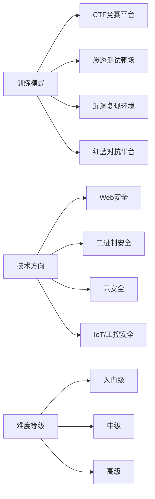
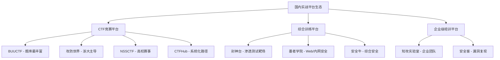
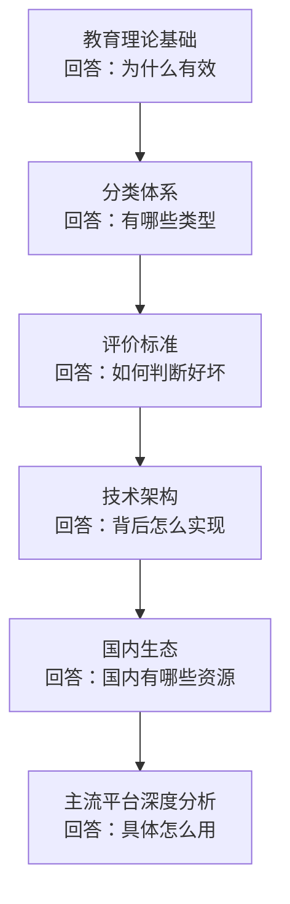

## 六、本节小结

实战平台是网络安全人才培养从"知识传授"走向"能力养成"的关键基础设施。本节从教育理论、分类体系、评价标准、技术架构和国内生态五个维度，构建了理解实战平台的完整认知框架。以下是各部分的核心要点提炼与相互关系梳理。

### 6.1 核心知识点回顾

#### 教育理论基础：实战平台为什么有效

实战平台之所以能有效提升安全技能，根植于四大教育理论的支撑：

| 理论 | 核心机制 | 在实战平台中的体现 |
|------|----------|-------------------|
| 建构主义学习理论 | 知识由学习者主动建构，而非被动接收 | 提供真实漏洞情境，学习者在操作中自主发现和理解安全原理 |
| 布鲁姆认知目标分类 | 认知能力分六层递进：记忆→理解→应用→分析→评价→创造 | 不同难度的挑战对应不同认知层次，从记忆工具用法到创造新攻击方法 |
| 刻意练习理论 | 有目标、有反馈、有挑战的持续练习才能形成专业技能 | 明确的flag目标、即时的提交反馈、梯度递增的难度设计 |
| 游戏化学习理论 | 游戏元素（积分、排行榜、徽章）提升参与度和持续性 | 积分排名、成就系统、连续打卡、难度递进的关卡设计 |

这四大理论并非孤立存在，而是相互协同：游戏化机制维持学习动力，刻意练习提供方法论指导，建构主义确保深度理解，布鲁姆分类则为平台设计者提供了内容难度的分层标尺。

#### 分类体系：平台不是铁板一块

实战平台按三个正交维度进行分类，理解这一体系是选择平台的前提：

需要特别注意的是，不同分类维度之间存在交叉组合。例如，HackTheBox既是一个渗透测试靶场（训练模式），又覆盖Web、二进制、云安全等多个方向（技术方向），同时包含Easy到Insane四个难度等级。选择平台时，应从三个维度综合考量：

- **训练模式维度**决定了学习体验：CTF侧重单点突破和限时解题能力，渗透测试靶场强调完整的攻击链思维，漏洞复现聚焦于特定漏洞的深度理解，红蓝对抗则是最接近真实工作的训练形式。
- **技术方向维度**决定了专业深度：Web安全是入门首选（覆盖面最广、资料最多），二进制安全门槛较高但人才稀缺，云安全和IoT安全是快速增长的新兴领域。
- **难度等级维度**决定了匹配程度：选择略高于当前水平的挑战，才能处于"最近发展区"内获得最大成长。

#### 评价标准：如何判断一个平台的好坏

平台质量评估应从四个维度展开：

**环境质量**是基础。真实性决定了训练价值——如果靶机环境与真实生产环境差距过大，训练成果难以迁移。稳定性影响学习节奏，频繁的环境故障会打断学习心流。隔离性则关系到公平性和安全性。

**内容质量**是核心。覆盖面决定了能否满足多样化需求，难度梯度决定了能否服务不同水平的学习者，时效性决定了能否跟上安全领域的快速变化，Writeup质量则是自主学习的重要支撑。

**用户体验**不可忽视。界面友好度影响入门门槛，社区活跃度决定了遇到困难时能否获得帮助，文档完善度则关系到能否系统化地学习。

**学习效果**是最终衡量标准。理想的情况是：使用平台后技能有可感知的提升，知识体系从碎片化走向结构化，训练内容与实际岗位需求（如渗透测试工程师、安全运维工程师）高度匹配。

#### 技术架构：平台背后的技术选型

现代实战平台的技术架构经历了从虚拟化到容器化再到云原生的演进：

| 架构类型 | 代表技术 | 优势 | 局限 | 适用场景 |
|----------|---------|------|------|---------|
| 容器化架构 | Docker、docker-compose | 秒级部署、资源隔离、环境一致、易于重置 | 隔离粒度较粗，不适合内核级漏洞复现 | 绝大多数Web安全和应用安全靶场 |
| 虚拟化架构 | VMware、VirtualBox、QEMU/KVM | 完整系统模拟、强隔离、支持内核级漏洞 | 部署慢、资源消耗大 | 需要完整网络拓扑或操作系统级漏洞的场景 |
| 云原生架构 | Kubernetes、微服务 | 弹性伸缩、高可用、多租户 | 架构复杂、运维成本高 | 大规模在线平台（如HackTheBox、TryHackMe） |

理解架构差异对学习者的实际意义在于：容器化环境（如Vulhub）可以轻松在本地复现，而云原生平台（如HackTheBox）的在线靶机则无法复制到本地。选择学习方式时，需要考虑自己能获取的计算资源和网络条件。

#### 国内生态：本土化资源地图

国内实战平台生态已形成较为完整的覆盖：

国内平台的核心优势在于：中文界面降低了语言门槛，题目设计贴合国内安全竞赛风格（如XCTF系列），社区交流更加便捷。但部分平台在内容深度和国际化程度上与海外平台仍有差距，建议国内外平台结合使用。

### 6.2 知识体系的内在逻辑

五个小节的内容并非简单的并列关系，而是构成了一个层层递进的认知框架：

- **教育理论**提供了理解平台价值的"元认知"——知道平台为什么有效，才能更好地利用它。
- **分类体系**提供了导航地图——知道有哪些类型，才能在海量平台中快速定位。
- **评价标准**提供了判断力——知道什么是好的，才能避免在低质量平台上浪费时间。
- **技术架构**提供了底层理解——知道平台怎么运行的，才能更好地利用其特性（如Vulhub的Docker部署、HackTheBox的在线靶机）。
- **国内生态**提供了本土化视角——知道国内有什么资源，才能制定切实可行的学习计划。

### 6.3 实战平台选择的决策框架

综合以上分析，可以提炼出一个实用的平台选择决策框架：

**第一步：明确学习目标**

| 目标 | 推荐平台类型 | 代表平台 |
|------|-------------|---------|
| 零基础入门 | 引导式学习平台 | TryHackMe、PicoCTF |
| CTF竞赛备赛 | CTF刷题平台 | BUUCTF、攻防世界 |
| 渗透测试技能 | 渗透测试靶场 | HackTheBox、Proving Grounds |
| 漏洞原理深度理解 | 漏洞复现环境 | Vulhub、VulnHub |
| 蓝队/防御技能 | 蓝队训练平台 | LetsDefend、CyberDefenders |
| Web安全专项 | Web安全靶场 | PortSwigger Academy、DVWA |
| 云安全方向 | 云安全靶场 | CloudGoat、AWSGoat |

**第二步：评估自身水平**

- **零基础**：从TryHackMe的"Complete Beginner"路径开始，不要急于挑战HackTheBox。
- **有基础**：在HackTheBox上从Easy难度开始，逐步挑战Medium和Hard。
- **进阶者**：在Proving Grounds上练习OSCP级靶机，或在CTF平台上挑战高难度题目。

**第三步：制定练习计划**

有效的练习计划应遵循以下原则：

1. **主次搭配**：选择1-2个主力平台深耕，辅以其他平台拓展广度。
2. **攻防兼备**：红队训练为主的同时，穿插蓝队训练（如LetsDefend），建立全面的安全视野。
3. **定期复盘**：每完成一批挑战，整理writeup，总结方法论，避免"刷题不总结"的低效循环。
4. **难度递进**：始终保持"跳一跳够得着"的难度区间，避免过易导致倦怠、过难导致挫败。

### 6.4 常见误区与纠正

在实战平台的使用中，存在几个普遍性的认知和行为误区：

| 误区 | 正确做法 | 为什么重要 |
|------|---------|-----------|
| 只用一个平台，追求全通关 | 多平台组合使用，取长补短 | 不同平台的训练侧重点不同，单一平台无法覆盖所有技能 |
| 大量刷题但不写Writeup | 每道题都写详细记录 | 不总结的刷题是"用战术勤奋掩盖战略懒惰" |
| 遇到困难直接看答案 | 先独立思考，查阅文档，实在卡住再参考Writeup | 自主解决问题的过程才是能力成长的关键环节 |
| 只练红队不练蓝队 | 红蓝结合训练 | 理解防御才能写出更好的攻击，全面的安全视野是高级岗位的必备素质 |
| 只在平台上练，不看源码 | 结合源码分析漏洞根因 | 平台操作是"术"，理解根因才是"道" |
| 忽视基础直接挑战高难度 | 先打好基础，再逐步进阶 | 基础不牢的高难度挑战只能带来挫败感，无法真正提升能力 |

### 6.5 从理论到实践的桥梁

理解了实战平台的理论框架后，接下来需要掌握的是：如何高效地利用这些平台进行学习。后续的内容将深入探讨：

- **平台选择策略**：根据个人情况和目标，制定最优的平台组合方案
- **核心技巧**：各类平台的高效使用方法和解题思路
- **自动化工具链**：构建个性化的安全测试工具集
- **学习路径规划**：从入门到精通的系统化成长路线
- **高级技巧**：面向专业安全人员的进阶方法

理论框架是"知"，平台实践是"行"。知行合一，方能在网络安全之路上持续精进。
