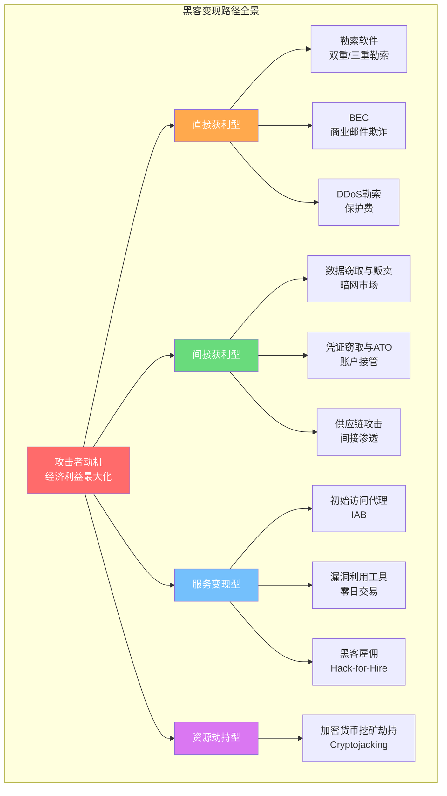

# 第30章 黑客搞钱路径

## 章节概览

### 为什么要研究黑客的"搞钱路径"？

在网络安全领域，"以攻促防"是提升防御能力的核心理念。要有效抵御网络攻击，安全从业者必须深入了解攻击者的动机、手段和经济模型。本章将系统剖析黑客利用技术能力牟利的各种路径，帮助防御者从攻击者视角理解威胁格局，从而构建更有针对性的安全防护体系。

理解黑客的"搞钱路径"并非教唆犯罪，而是安全防御的必修课。正如医学研究病毒需要了解其传播机制，网络安全防御也需要理解攻击者如何将技术能力转化为经济利益。只有掌握了攻击者的完整价值链，才能在关键环节实施有效的阻断和防御。

**一组触目惊心的数据，说明为什么这个话题刻不容缓：**

| 指标 | 数据 | 来源 |
|------|------|------|
| 全球网络犯罪年损失 | 约8万亿美元（2023年） | Cybersecurity Ventures |
| 勒索软件平均赎金 | 约150万美元（2023年） | Palo Alto Unit 42 |
| 勒索软件攻击频率 | 每11秒发生一次 | Cybersecurity Ventures |
| BEC全球累计损失 | 超500亿美元（2013-2022） | FBI IC3 |
| 暗网企业RDP访问价格 | $500 - $100,000 | Recorded Future |
| 犯罪即服务(CaaS)年增长率 | 超过30% | Chainalysis |

这些数字背后是一个高度产业化、分工明确、技术驱动的犯罪经济体系。本章将带你全面拆解这个体系的运作机制。

### 章节目标

通过本章学习，读者将能够：

1. **理解网络犯罪的经济模型**：掌握黑客将技术能力转化为经济收益的主要方式和价值链，理解"防御者困境"的根本原因
2. **识别主要变现路径**：能够区分勒索软件、数据贩卖、挖矿劫持、BEC欺诈、DDoS勒索等不同变现模式的运作机制和适用场景
3. **分析攻击者行为特征**：理解不同类型攻击者（国家APT、有组织犯罪、黑客活动家、内部威胁）的动机、目标选择标准和操作模式
4. **掌握犯罪即服务生态**：理解CaaS、RaaS、IAB等商业模式如何重塑网络犯罪格局
5. **构建防御思维**：基于对攻击者经济模型的理解，识别关键防御节点，设计有针对性的安全策略
6. **追踪资金流向**：了解加密货币在网络安全犯罪中的角色，以及区块链分析的基本方法

### 知识地图

本章的知识体系可以用以下框架来理解——攻击者的每一种变现方式，都对应着防御者需要守护的一道防线：



### 六大变现路径速览对比

在深入各章节之前，先建立全局视角。以下对比表帮助你快速理解六种核心变现路径的特征差异：

| 路径 | 技术门槛 | 收益上限 | 持续性 | 被发现风险 | 典型工具/框架 |
|------|---------|---------|--------|-----------|-------------|
| **勒索软件** | 中-高 | 极高（百万级） | 一次性 | 中 | LockBit, BlackCat, Cl0p |
| **数据贩卖** | 中 | 高（十万级） | 一次性 | 中-高 | RedLine, Raccoon Stealer |
| **BEC欺诈** | 低 | 高（百万级） | 一次性 | 低 | 社会工程学 |
| **挖矿劫持** | 低-中 | 低-中（数千/月） | 持续性 | 低 | Lemon Duck, Kinsing |
| **DDoS勒索** | 低 | 中（数万级） | 可重复 | 低 | 暗网DDoS服务 |
| **IAB访问贩卖** | 高 | 中-高（万级） | 一次性 | 低 | 各类初始访问技术 |

> **关键洞察**：技术门槛与收益并不总是正相关。BEC欺诈技术门槛最低，但FBI统计其累计损失超过500亿美元——远超勒索软件。这说明社会工程学在犯罪经济学中的权重被严重低估。

### 内容结构与阅读导航

本章共分为七个部分，从理论到实践，从认知到行动，循序渐进地展开对黑客变现路径的全面分析：

---

**第一部分：理论基础** `预计阅读：20分钟`

从经济学和犯罪学角度建立理解框架。本部分解决"为什么"的问题——为什么网络犯罪如此猖獗？为什么攻防成本严重不对称？

涵盖的核心概念包括：
- 网络犯罪经济学：成本收益分析、防御者困境
- 威胁行为者分类：从脚本小子到国家APT组织
- 犯罪即服务(CaaS)生态系统：初始访问代理、RaaS、暗网市场运作机制
- 加密货币在犯罪中的角色：为什么攻击者偏好BTC/XMR
- 攻击经济学量化：一次勒索攻击的成本与ROI

[→ 进入理论基础](理论基础/)

---

**第二部分：核心技巧** `预计阅读：35分钟`

详细解析当前主流的黑客变现技术手段。本部分解决"怎么做"的问题——攻击者的具体操作流程和工具链。

六大技术路径深度拆解：
- 勒索软件攻击链：从RaaS运营模式到加密策略、防御规避技术
- 数据窃取与贩卖：Infostealer生态、暗网数据定价机制
- 加密货币挖矿劫持：云环境、IoT设备、浏览器端挖矿
- 商业电子邮件欺诈(BEC)：CEO欺诈、供应商欺诈、律师欺诈
- 账户接管(ATO)与欺诈：凭证填充、Session劫持、MFA绕过
- DDoS勒索与保护费：在线赌博、金融网站是重灾区

[→ 进入核心技巧](核心技巧/)

---

**第三部分：实战案例** `预计阅读：40分钟`

通过7个标志性真实案例深入分析，展示不同变现路径的实际运作方式。每个案例包含攻击链还原、经济损失量化和防御启示。

| 案例 | 变现类型 | 关键数据 |
|------|---------|---------|
| WannaCry（2017） | 勒索软件 | 150+国家、30万台设备、40亿美元损失 |
| Colonial Pipeline（2021） | 勒索软件 | 440万美元赎金、美国东海岸燃油中断 |
| Magecart（2015至今） | 数据窃取 | 数十家零售商、数百万支付卡信息 |
| Lazarus Group | 金融攻击 | 朝鲜APT、孟加拉央行8100万美元 |
| Conti（2020-2022） | 勒索软件集团 | 内部泄露、结构化运营 |
| SolarWinds（2020） | 供应链攻击 | 18000+组织受影响 |
| MOVEit（2023） | 漏洞利用 | Cl0p利用零日、2600+组织 |

[→ 进入实战案例](实战案例/)

---

**第四部分：常见误区** `预计阅读：10分钟`

纠正对网络犯罪的7大认知偏差。本部分帮助安全管理者和决策者建立正确的威胁认知，避免因错误判断而导致防护不足。

核心误区包括：
- "黑客都是天才少年"——事实是产业化组织占主导
- "小企业不会被攻击"——事实上小企业是勒索软件的主要目标
- "支付赎金就能恢复数据"——事实上约20%支付赎金后仍无法恢复
- "安装杀毒软件就够了"——现代攻击远超传统杀毒的能力边界
- "我们有防火墙很安全"——攻击者早已掌握数十种绕过方法

[→ 进入常见误区](04-常见误区.md)

---

**第五部分：练习方法** `预计阅读：15分钟`

提供7种实践训练方案，帮助安全人员通过模拟环境、威胁情报分析、CTF竞赛等方式加深对攻击者变现路径的理解。所有练习均在合法授权环境下进行。

训练维度覆盖：
- 威胁情报分析：OSINT、暗网监控、IOC提取
- 红队模拟：攻击链复现、MITRE ATT&CK映射
- 蓝队防御：检测规则编写、事件响应演练
- 经济建模：攻击ROI计算、防御资源优化分配

[→ 进入练习方法](05-练习方法.md)

---

**第六部分：本章小结** `预计阅读：8分钟`

总结关键知识点，梳理防御要点，建立完整的知识框架。提供一张可直接用于团队培训的防御优先级矩阵。

[→ 进入本章小结](06-本章小结.md)

---

**第七部分：深度拓展** `预计阅读：20分钟`

为高级读者和安全架构师提供进阶内容，包括网络犯罪产业链的深层结构、前沿攻击趋势分析、防御策略的经济模型等。

[→ 进入深度拓展](07-深度拓展.md)

### 核心知识点全景图

以下是本章覆盖的全部关键概念，按知识领域分类：

| 知识领域 | 关键概念 | 对应章节 |
|---------|---------|---------|
| **犯罪经济模型** | CaaS、RaaS、犯罪生态系统、攻击成本与收益、防御者困境 | 理论基础 §1-§2 |
| **威胁行为者** | APT组织、有组织犯罪、黑客活动家、内部威胁、脚本小子 | 理论基础 §1 |
| **勒索软件** | 双重勒索、三重勒索、勒索软件生命周期、加密策略、BYOVD | 核心技巧 §1 |
| **数据变现** | 暗网市场、数据定价、PII/PHI/金融数据、Infostealer生态 | 核心技巧 §2 |
| **挖矿劫持** | 加密劫持(Cryptojacking)、资源窃取、云环境挖矿 | 核心技巧 §3 |
| **欺诈服务** | BEC、钓鱼即服务(PhaaS)、身份欺诈、账户接管(ATO) | 核心技巧 §4-§5 |
| **DDoS勒索** | 保护费模式、先攻后防、在线赌博行业 | 核心技巧 §6 |
| **加密货币** | 混币服务、隐私币、Peel Chain、区块链分析 | 理论基础 §4 |
| **防御策略** | 攻击面管理、零信任、威胁情报、关键防御节点 | 核心技巧 §7 |
| **实战案例** | WannaCry、Colonial Pipeline、Lazarus、SolarWinds、MOVEit | 实战案例 §1-§7 |

### 攻击者价值链全景

理解攻击者如何从"技术能力"到"真金白银"的完整转化链路，是本章的核心主线：

```text
技术能力储备
  │
  ├── 漏洞研究 ──→ 零日漏洞 ──→ 漏洞交易市场（$5K-$2M+）
  │
  ├── 渗透技能 ──→ 初始访问代理 ──→ 卖给勒索软件集团（$500-$100K）
  │
  ├── 恶意软件开发 ──→ RaaS/Infostealer ──→ 订阅收入/收益分成
  │
  ├── 社会工程学 ──→ BEC/钓鱼 ──→ 直接转账（$10K-$10M+）
  │
  └── 基础设施搭建 ──→ Bulletproof Hosting ──→ 犯罪基础设施服务
                                                  │
                                              数据/赎金/欺诈所得
                                                  │
                                              洗钱网络
                                                  │
                                              合法资金
```

### 适用读者

本章面向以下读者群体，不同背景的读者可以侧重不同部分：

| 读者角色 | 推荐重点 | 预计总用时 |
|---------|---------|-----------|
| **SOC分析师** | 核心技巧 + 实战案例 + 练习方法 | 2-3小时 |
| **威胁情报分析师** | 理论基础 + 实战案例 + 深度拓展 | 2-3小时 |
| **企业安全架构师** | 全部章节（重点关注防御策略） | 3-4小时 |
| **应急响应团队** | 实战案例 + 核心技巧（勒索软件部分） | 1.5-2小时 |
| **安全管理者/决策者** | 章节概览 + 常见误区 + 本章小结 | 30-40分钟 |
| **安全研究人员** | 全部章节 + 深度拓展 | 3-4小时 |

### 学习建议

**入门路径（安全新人）：**
1. 先读本概览建立全局认知，重点看"六大变现路径速览对比"表
2. 按顺序阅读理论基础，重点关注§1（经济学框架）和§2（CaaS生态）
3. 选择2-3个最感兴趣的变现路径深入阅读核心技巧
4. 通过实战案例加深感性认识
5. 用常见误区检验自己的认知是否到位

**进阶路径（有经验的安全从业者）：**
1. 快速浏览概览，直接跳到与工作相关的变现路径
2. 重点关注实战案例中的攻击链还原和防御启示
3. 完成练习方法中的实操训练
4. 阅读深度拓展，思考防御策略的经济模型优化

**管理路径（安全管理者/决策者）：**
1. 重点阅读：章节概览 → 常见误区 → 本章小结
2. 关注攻击ROI和防御资源分配的经济逻辑
3. 用核心知识点表和防御优先级矩阵向团队传达威胁认知
4. 参考实战案例中的损失数据，论证安全投入的必要性

**实用工具与框架：**
- [MITRE ATT&CK Framework](https://attack.mitre.org/) — 本章大量引用ATT&CK技术编号
- [FBI IC3 Report](https://www.ic3.gov/) — 年度互联网犯罪统计
- [Chainalysis Crypto Crime Report](https://www.chainalysis.com/) — 加密货币犯罪追踪
- [Ransomware Tracker](https://www.ransomlook.io/) — 勒索软件攻击实时监控
- [Recorded Future](https://www.recordedfuture.com/) — 暗网威胁情报

### 章节间关联

本章与书中其他章节存在紧密的知识关联：

| 关联章节 | 关联内容 | 阅读建议 |
|---------|---------|---------|
| **第1章 网络安全基础** | 攻击面、威胁模型、安全架构基础 | 先修知识 |
| **第X章 渗透测试** | 攻击技术的合法应用视角 | 建议先读 |
| **第X章 应急响应** | 勒索软件事件的响应流程 | 建议同步读 |
| **第X章 威胁情报** | 暗网监控、IOC分析、情报驱动防御 | 深入配合 |

> **免责声明**：本章内容仅供安全防御研究和学习使用。所描述的技术手段和方法仅用于帮助安全从业者理解威胁、构建防御。任何利用本章知识实施非法活动的行为都将面临法律严惩。在进行任何安全实验时，务必获得合法授权，在隔离环境中操作。

---

*建议从 [理论基础](理论基础/) 开始阅读 →*
