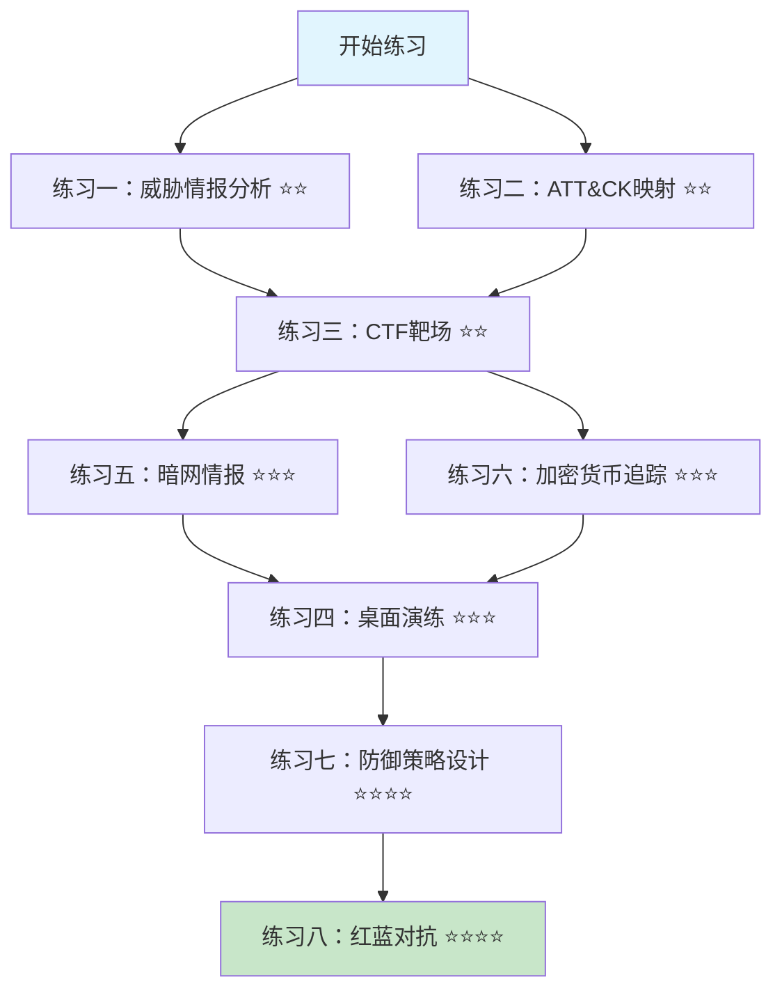

# 第30章 黑客搞钱路径 - 练习方法

## 概述

理解黑客变现路径不仅需要理论学习，更需要通过实践加深认知。本节提供系统化的练习方法，帮助安全从业者从防御者视角深入理解攻击者的经济模型和操作模式，从而提升实战防御能力。

### 练习体系设计原则

本章的练习体系遵循"知行合一"的教学理念，按照以下原则设计：

1. **分层递进**：从信息收集→技术分析→模拟攻防→策略设计，难度逐级递升
2. **理论与实践结合**：每个练习都附带理论背景，避免"知其然不知其所以然"
3. **可量化评估**：每个练习都有明确的完成标准和评估维度
4. **真实场景驱动**：练习素材来源于真实威胁情报和公开事件报告
5. **防御视角贯穿**：所有练习均以提升防御能力为最终目标，而非教授攻击技术

### 练习难度分级

| 难度 | 标记 | 适用人群 | 预计耗时 |
|------|------|---------|---------|
| ⭐ 入门 | 基础信息收集、模板填写 | 安全新人、非技术管理者 | 每项 1-2 小时 |
| ⭐⭐ 进阶 | 技术分析、工具使用 | 有 1-3 年经验的安全从业者 | 每项 3-5 小时 |
| ⭐⭐⭐ 高级 | 综合演练、策略设计 | 资深安全分析师、安全架构师 | 每项 5-10 小时 |
| ⭐⭐⭐⭐ 专家 | 红蓝对抗、威胁建模 | 安全团队负责人、CTO | 持续性实践 |

> **重要声明**：以下所有练习均在合法授权环境下进行。任何未经授权的网络攻击行为均属违法。练习环境应使用隔离的虚拟网络，避免影响真实系统。涉及暗网观察的练习仅限于使用公开情报源和合法工具，严禁参与任何非法交易。

---

## 练习一：威胁情报分析实践

**难度**：⭐⭐ 进阶 | **预计耗时**：4-6 小时 | **前置知识**：基础网络知识、情报分析概念

### 目标

培养从公开威胁情报中识别和分析攻击者变现路径的能力。威胁情报分析是理解黑客经济模型的第一步——通过观察已发生的安全事件，逆向还原攻击者的动机、收益和操作链条。

### 为什么重要

威胁情报分析能力直接决定了安全团队的"预见力"。根据 SANS 2024 年调查，拥有成熟威胁情报能力的组织平均将事件响应时间缩短 40%，将安全事件造成的财务损失降低 53%。更重要的是，通过分析攻击者的变现路径，安全团队可以在攻击链的关键节点部署针对性防御，而非盲目堆砌安全产品。

### 练习步骤

**1. 暗网情报收集（仅限公开来源）**

利用合法的威胁情报平台收集信息：

- **免费平台**（推荐初学者使用）：
  - **VirusTotal**：恶意样本分析和 IOC 查询，可查看文件的检测结果、行为分析和关联情报。免费账户每日查询次数有限，但对个人学习已足够。
  - **Abuse.ch**（abuse.ch）：提供 URLhaus（恶意 URL）、MalwareBazaar（恶意软件样本）、ThreatFox（IOC 共享）三个子平台，全部免费开放，数据更新频繁，是研究恶意软件生态的首选资源。
  - **Have I Been Pwned (HIBP)**：查询邮箱是否出现在已知数据泄露中，可了解不同类型数据泄露的规模和影响范围。
  - **AlienVault OTX (Open Threat Exchange)**：社区驱动的威胁情报平台，提供脉冲(Pulse)形式的威胁情报共享，可以订阅特定行业或威胁类型的更新。

- **企业级平台**（了解其能力边界）：
  - **Recorded Future**：整合暗网、社交媒体、技术指标的全源情报平台，擅长预测性威胁分析。
  - **Flashpoint**：深度暗网情报能力，覆盖论坛、市场、即时通讯等多个来源。
  - **Mandiant Advantage**：基于实战响应经验构建的威胁情报，侧重 APT 组织和高级威胁。

- **练习任务**：
  - 选择一个行业（推荐：医疗、金融或制造业），收集近 6 个月内至少 5 个公开的数据泄露事件
  - 记录每个事件的关键信息：攻击方式、泄露数据类型、受影响规模、攻击者的已知变现手段
  - 分析泄露数据在暗网市场的定价模式（通过公开报道和威胁情报报告获取，切勿访问实际交易市场）
  - 绘制数据从泄露到变现的完整流转路径图，标注每个环节的关键参与者
  - 评估不同数据类型的市场价值差异：例如，一条完整的信用卡数据（含CVV）vs. 一个企业邮箱凭据 vs. 一份医疗记录，价格差异背后的供需逻辑

**评估标准**：能够独立完成一份结构化的行业威胁情报报告，包含至少 5 个事件的对比分析，且能归纳出 3 个以上的变现模式规律。

**2. 勒索软件生态分析**

深入研究 RaaS（勒索软件即服务）生态，理解攻击者如何通过"订阅制"模式实现规模化变现：

- **RaaS 运作机制解析**：
  - 理解"运营商-附属成员"模式的经济学：运营商开发和维护勒索软件，附属成员负责入侵和部署，双方按比例分成（通常运营商 20-30%，附属成员 70-80%）
  - 分析这种模式为何能降低攻击门槛：附属成员不需要具备恶意软件开发能力，运营商不需要亲自执行攻击
  - 追踪主要 RaaS 组织的演变：从 Maze（双重勒索先驱）到 Conti、LockBit、BlackCat/ALPHV 的兴衰轨迹

- **分析模板**：

```markdown
练习模板：勒索软件组织档案

组织名称：_______________
活跃时间：_______________
已知攻击数量：_______________（截至填写日期）

商业模式：
  RaaS模式：是/否
  运营商-附属分成比例：_______________
  附属成员招募方式：_______________（暗网论坛/Telegram/邀请制）
  平均赎金：_______________（USD等价）
  最高已知赎金：_______________

目标特征：
  主要目标行业：_______________
  目标地理区域：_______________
  目标企业规模：_______________（按员工数/营收划分）
  是否回避特定行业（如医疗）：_______________

技术特征：
  初始访问方式：
    - 鱼叉式钓鱼：是/否（占比估计：___%）
    - VPN/远程桌面漏洞利用：是/否（占比估计：___%）
    - 购买初始访问权(IAB)：是/否（占比估计：___%）
    - 供应链攻击：是/否
  加密算法：_______________
  是否具备跨平台能力（Windows/Linux/VMware）：_______________
  域控制器利用方式：_______________

勒索策略：
  双重勒索：是/否（数据泄露站点URL：_______________）
  三重勒索（含DDoS）：是/否
  四重勒索（含通知客户/合作伙伴）：是/否
  赎金支付期限：_______________
  赎金减免策略（如延迟加价/限时折扣）：_______________

组织关系：
  关联组织/分裂来源：_______________
  是否与其他犯罪集团有合作关系：_______________
  品牌重塑历史（更名记录）：_______________

执法行动：
  已知执法打击：_______________
  关键基础设施（服务器/钱包）查封记录：_______________
  核心成员逮捕/起诉情况：_______________

防御启示：
  该组织最常见的攻击入口是：_______________
  防御优先级最高的安全措施：_______________
  该组织的可预测行为模式：_______________（可用于检测）
```

- **实操步骤**：
  1. 选择 2-3 个近期活跃的 RaaS 组织（推荐：LockBit 3.0、BlackCat/ALPHV、Cl0p、Play）
  2. 通过公开来源（新闻报道、安全公司博客、CISA Advisory）收集信息填写上述模板
  3. 对比不同组织的商业模式差异，分析其竞争优势和弱点
  4. 思考：如果这些组织停止运营，市场是否会出现替代者？为什么？

**3. 每周威胁报告练习**

养成持续跟踪威胁情报的习惯，这是安全从业者的"基本功"：

- **数据来源**：每周选择一份公开的安全事件报告（来源推荐见下方）
- **分析框架**：

```markdown
周报分析模板

报告来源：_______________
事件日期：_______________
事件标题：_______________

一、攻击者画像
  已知/推测的威胁组织：_______________
  攻击动机：经济利益/间谍/破坏/混合
  攻击能力等级：初级/中级/高级/国家级

二、攻击链还原
  初始访问：_______________
  执行方式：_______________
  持久化手段：_______________
  权限提升：_______________
  横向移动：_______________
  数据窃取/破坏：_______________
  变现/影响：_______________

三、变现路径分析
  主要变现方式：_______________
  预估攻击者收益：_______________
  攻击成本估算：_______________
  ROI评估：_______________

四、防御节点识别
  可检测的最早阶段：_______________
  推荐检测规则（Sigma/YARA）：_______________
  可部署的缓解措施：_______________
  零成本防御建议：_______________

五、经验教训
  被忽视的安全基线：_______________
  可复用的防御模式：_______________
```

- **推荐情报来源**（按更新频率排列）：
  - **每日更新**：CISA Alerts、BleepingComputer、The Hacker News、SecurityWeek
  - **每周更新**：Recorded Future Intel Weekly、Unit 42 Threat Brief
  - **每月/季度**：Verizon DBIR、IBM X-Force Threat Intelligence Index、CrowdStrike Global Threat Report、Mandiant M-Trends
  - **中文来源**：FreeBuf、安全客、奇安信威胁情报中心、微步在线

---

## 练习二：MITRE ATT&CK 映射练习

**难度**：⭐⭐ 进阶 | **预计耗时**：3-5 小时 | **前置知识**：ATT&CK 框架基础概念

### 目标

将攻击者变现路径映射到 MITRE ATT&CK 框架，建立系统化的理解。ATT&CK 框架是当前最广泛使用的攻击战术和技术知识库，掌握其映射方法是理解攻击链的关键技能。

### 为什么重要

ATT&CK 映射不是"填表格"的形式主义——它强迫你用结构化的视角审视攻击全过程，发现被忽略的检测盲区。根据 MITRE 自己的研究，基于 ATT&CK 的防御覆盖率评估可以帮助组织发现平均 35% 的检测空白。对于变现路径研究而言，ATT&CK 映射能清晰地揭示：攻击者在哪些阶段投入了最多的资源（对应其最关键的获利环节），防御者应该在哪个节点投入最多防御资源。

### 练习步骤

**1. 选择一个真实攻击案例**

推荐案例（按复杂度递增）：

| 案例名称 | 复杂度 | 变现方式 | 推荐理由 |
|---------|--------|---------|---------|
| WannaCry (2017) | ⭐⭐ | 勒索软件 | 攻击链清晰，公开信息丰富 |
| Colonial Pipeline (2021) | ⭐⭐⭐ | 勒索软件 | 涉及 DarkSide RaaS 生态，影响基础设施安全政策 |
| Kaseya VSA 攻击 (2021) | ⭐⭐⭐ | 勒索软件 | 供应链攻击 + RaaS 的经典组合 |
| SolarWinds (2020) | ⭐⭐⭐⭐ | 间谍/潜在经济利益 | 超长驻留期，多层隐藏，国家级技术水平 |
| Magecart 集团 (2015-至今) | ⭐⭐⭐ | 数据窃取/卡片盗刷 | 持续性经济犯罪，供应链攻击变体 |

**2. 完成 ATT&CK 映射**

使用 MITRE ATT&CK Navigator（mitre-attack.github.io/attack-navigator/）进行可视化映射，或使用以下结构化模板：

```markdown
事件名称：_______________
威胁组织：_______________
变现目标：_______________
攻击持续时间：_______________

映射表：

| 阶段 | ATT&CK ID | 技术名称 | 实际操作描述 | 检测可能性 |
|------|-----------|---------|-------------|-----------|
| 侦察 | T1589 | 搜索受害者组织信息 | _______________ | 低 |
| 资源开发 | T1583.006 | 获取Web服务 | _______________ | 低 |
| 初始访问 | T1566.001 | 钓鱼附件 | _______________ | 中 |
| 执行 | T1059.001 | PowerShell | _______________ | 高 |
| 持久化 | T1547.001 | 注册表自启动 | _______________ | 中 |
| 权限提升 | T1068 | 漏洞利用提权 | _______________ | 中 |
| 防御规避 | T1070.001 | 清除事件日志 | _______________ | 高 |
| 凭证访问 | T1003.001 | LSASS内存转储 | _______________ | 高 |
| 发现 | T1087.002 | 域账户枚举 | _______________ | 低 |
| 横向移动 | T1021.002 | SMB/Windows管理共享 | _______________ | 中 |
| 收集 | T1005 | 本地系统数据收集 | _______________ | 中 |
| 命令与控制 | T1071.001 | Web协议C2 | _______________ | 中 |
| 数据渗出 | T1041 | C2通道外传 | _______________ | 中 |
| 影响 | T1486.001 | 数据加密影响 | _______________ | 高 |

变现阶段详细分析：
  数据窃取技术：_______________
  数据外传通道：_______________
  资金转移方式：_______________
  洗钱路径：_______________
  赎金要求和支付方式：_______________
```

**3. 防御映射与覆盖率评估**

针对每个映射到的 ATT&CK 技术，完成以下分析：

```markdown
技术ID：_______________
技术名称：_______________

检测数据源：
  - 日志类型：_______________
  - 网络流量特征：_______________
  - 端点遥测数据：_______________
  - 云平台日志：_______________

推荐检测规则：
  - Sigma规则：_______________（链接或规则ID）
  - YARA规则：_______________（如适用）
  - Snort/Suricata规则：_______________（如适用）
  - 自定义查询（Splunk/ELK/KQL）：_______________

缓解措施：
  - 技术控制：_______________
  - 管理控制：_______________
  - 操作控制：_______________

当前覆盖率评估：
  - 我们已有的检测能力：_______________
  - 检测盲区：_______________
  - 优先补充项：_______________
```

**4. ATT&CK 覆盖率可视化**

使用 ATT&CK Navigator 创建热力图，标注：
- **红色**：攻击者使用但当前无检测能力的技术
- **黄色**：有基本检测但不够精确的技术（误报率高）
- **绿色**：有成熟检测和响应能力的技术

最终目标：将红色区域转化为黄色或绿色，重点关注攻击者在变现阶段使用的技术（因为这些是防御的"最后一道关卡"）。

---

## 练习三：CTF 与靶场实战

**难度**：⭐⭐ 进阶 | **预计耗时**：持续性实践 | **前置知识**：基础 Linux 命令、网络协议

### 目标

通过 CTF（夺旗赛）竞赛和靶场平台提升实战技能，特别是与经济动机攻击相关的场景。CTF 和靶场练习是将理论知识转化为操作能力的最有效途径——在安全的环境中亲手复现攻击链的每个环节。

### 为什么重要

CTF 和靶场的核心价值不在于"解题"，而在于理解攻击的每一步背后的原理。当你亲手完成一次从初始入侵到数据窃取的完整模拟后，你对防御优先级的理解会远超纯理论学习。根据 SANS 研究，动手实践环节的知识留存率（75%）远超纯讲座学习（5%）。

### 推荐平台（按学习路径排列）

**初学者入门**：

| 平台 | 特色 | 推荐路径 | 费用 |
|------|------|---------|------|
| **TryHackMe** | 引导式学习路径，理论+实操结合 | Complete Beginner → Pre-Security → Jr Penetration Tester | 免费房间 + $14/月订阅 |
| **PicoCTF** | 面向初学者的 CTF，由 CMU 开发 | 每年春季竞赛 + 永久练习平台 | 完全免费 |
| **CyberDefenders** | 蓝队/防御分析专项 | 从低难度场景开始，逐步提升 | 免费 |

**中级进阶**：

| 平台 | 特色 | 推荐场景 | 费用 |
|------|------|---------|------|
| **Hack The Box** | 真实环境渗透测试挑战 | Pro Labs（Dante、Offshore）模拟完整企业网络 | 免费有限内容 + $14/月 |
| **VulnHub** | 可下载虚拟机靶场，离线练习 | 下载后用 VirtualBox/VMware 部署 | 完全免费 |
| **PortSwigger Web Security Academy** | Web 安全专项，Burp Suite 官方出品 | 从 SSRF 到反序列化，覆盖 OWASP Top 10 | 完全免费 |

**高级挑战**：

| 平台 | 特色 | 推荐场景 | 费用 |
|------|------|---------|------|
| **PentesterLab** | 高质量渗透测试练习 | 企业级漏洞利用和权限提升 | $19.99/月 |
| **CTFtime** | 全球 CTF 赛事聚合平台 | 参加真实竞赛，体验团队协作 | 取决于具体赛事 |
| **RangeForce** | 企业安全团队培训 | 蓝队防御场景，含 SOC 分析 | 企业订阅 |

### 具体练习场景

**场景一：勒索软件分析挑战** ⭐⭐

- **准备工作**：配置隔离的分析环境（推荐使用 VirtualBox 快照功能，分析前先创建快照，分析后一键恢复）
- **样本获取**：从 MalwareBazaar（bazaar.abuse.ch）等合法来源获取勒索软件样本
- **分析步骤**：
  1. 使用 ANY.RUN 或 Hybrid Analysis 在线沙箱进行初步行为分析
  2. 在本地隔离环境中使用 PEview/PEStudio 查看 PE 文件结构
  3. 使用 x64dbg 或 Ghidra 分析加密函数和 C2 通信逻辑
  4. 提取勒索信中的钱包地址、联系方式等关键信息
  5. 尝试寻找加密弱点（例如使用硬编码密钥、弱随机数生成器）
  6. 分析 C2 通信协议：识别 C2 服务器地址、通信加密方式、数据传输格式

**场景二：Web 应用数据窃取模拟** ⭐⭐

- **SQL 注入练习**：使用 SQLi-labs（GitHub 可下载）练习 UNION 注入、布尔盲注、时间盲注
- **XSS 攻击练习**：使用 Google XSS Game（xss-game.appspot.com）练习反射型、存储型、DOM 型 XSS
- **认证绕过练习**：在 DVWA 或 bWAPP 中练习暴力破解、会话固定、JWT 攻击
- **目标**：理解攻击者如何从"一个 Web 漏洞"发展到"完整数据窃取"的路径

**场景三：钓鱼邮件分析与检测** ⭐

- **样本来源**：PhishTank（phishtank.org）、OpenPhish、APWG eCrime 数据集
- **分析维度**：
  - 邮件头分析：SPF/DKIM/DMARC 验证结果、发件人 IP 追踪
  - 链接分析：URL 编码技巧、域名混淆（punycode、子域名欺骗、同形异义字攻击）
  - 附件分析：宏文档、HTA 文件、ISO/IMG 挂载等投递方式
  - 社会工程技巧：紧迫感制造、权威伪装、熟悉感利用
- **产出**：提取 IOC（域名、IP、文件哈希），编写 Snort/Sigma 检测规则

**场景四：内存取证与恶意软件分析** ⭐⭐⭐

- **工具准备**：Volatility 3（内存取证框架）、YARA（模式匹配工具）、Cuckoo Sandbox（自动化分析）
- **练习步骤**：
  1. 使用 Volatility 分析内存转储文件，识别可疑进程
  2. 提取进程内存中的恶意代码和网络连接信息
  3. 使用 YARA 规则匹配已知恶意软件特征
  4. 分析进程注入、进程镂空等高级规避技术
  5. 还原攻击者的操作历史和数据窃取痕迹

---

## 练习四：安全事件桌面演练

**难度**：⭐⭐⭐ 高级 | **预计耗时**：2-3 小时/场景 | **前置知识**：安全运营基础、事件响应流程

### 目标

通过模拟场景演练，提升对经济动机攻击的应急响应能力。桌面演练（Tabletop Exercise）是成本最低但效果显著的应急响应训练方式——不需要真实攻击环境，仅通过讨论和决策就能暴露团队在流程、沟通和判断方面的薄弱环节。

### 为什么重要

根据 IBM 2024 Data Breach Report，拥有经过演练的事件响应计划的组织平均将数据泄露成本降低 $232,000。桌面演练的核心价值在于：在没有真实压力的环境下暴露决策盲区，让团队在"安全的失败"中建立肌肉记忆。许多组织在真实事件中犯的错误（如仓促支付赎金、未及时通知监管机构），完全可以通过桌面演练提前发现和纠正。

### 场景一：勒索软件事件

```markdown
━━━━━━━━━━━━━━━━━━━━━━━━━━━━━━━━━━━━━━
场景名称：制造企业勒索软件事件
难度：⭐⭐⭐
角色：SOC 分析师 / 安全经理 / CISO
━━━━━━━━━━━━━━━━━━━━━━━━━━━━━━━━━━━━━━

背景：
你的公司（中型制造企业，500人，年产值3亿元）在周一早上发现以下情况：
- 多个部门报告无法访问文件服务器上的文件，文件扩展名被改为 .locked
- 文件服务器上发现勒索信，要求在72小时内支付50比特币（约200万美元）
- 安全团队发现域控制器上的安全日志已被清除，时间戳指向上周六凌晨2点
- IT部门确认上周五有员工收到过一封来自"IT支持"的邮件，附件名为
  "VPN配置更新指南.pdf"（实际为包含恶意宏的文档）
- 备份服务器的部分备份文件也被加密，但离线磁带备份未受影响
- 法务部门提醒：公司处理的客户数据中包含欧盟客户信息，受GDPR管辖

讨论要点：
1. [15分钟] 确认攻击范围
   - 如何快速评估受影响的系统和数据范围？
   - 需要收集哪些日志和证据？
   - 如何在不影响证据的情况下隔离受感染系统？
   - 域控制器日志被清除后，还有哪些替代日志源？

2. [10分钟] 赎金决策
   - 是否应该支付赎金？列出支持和反对的理由各3条
   - 如果不支付，数据恢复的可行方案有哪些？
   - 如果支付，如何降低"付了钱对方不给解密密钥"的风险？
   - 法律角度：支付赎金是否可能违反制裁法规（OFAC）？

3. [15分钟] 沟通与通报
   - 内部沟通：如何通知管理层？需要准备哪些信息？
   - 客户通知：是否需要通知客户？时限要求？
   - 监管通报：GDPR要求在72小时内通知监管机构，如何执行？
   - 执法机构：是否联系FBI/本地执法？如何联系？
   - 媒体应对：如何防止负面舆情？

4. [10分钟] 恢复策略
   - 基于离线磁带备份的恢复方案和时间估算
   - 恢复过程中的安全加固措施（防止二次感染）
   - 恢复后的持续监控方案

5. [5分钟] 根因分析与改进
   - 初始入侵的根本原因是什么？
   - 哪些安全措施本可以阻止这次攻击？
   - 改进计划的优先级排序和时间表
```

### 场景二：BEC 商业邮件欺诈事件

```markdown
━━━━━━━━━━━━━━━━━━━━━━━━━━━━━━━━━━━━━━
场景名称：CFO级BEC欺诈事件
难度：⭐⭐
角色：财务人员 / IT安全 / 法务 / 高管
━━━━━━━━━━━━━━━━━━━━━━━━━━━━━━━━━━━━━━

背景：
财务部门副总裁（CFO）报告：
- 上周五下午5:30（临近下班），收到一封来自CEO的邮件
- 邮件内容："我正在开会，需要紧急处理一笔供应商尾款。请将$250,000转到以下新账户。这是一个新供应商，详细信息下周补齐。"
- 邮件地址显示为 CEO@company.com（实际是 CEO@companny.com，多了一个'n'）
- 财务副总裁在5分钟内完成了转账（公司大额转账审批阈值为$300,000）
- 今天早上与CEO当面确认时发现邮件并非其发出
- IT部门检查发现 CEO 的公开信息（LinkedIn、公司官网）可以拼出正确的邮箱地址格式
- 银行反馈：资金已到达接收账户并被迅速转出

讨论要点：
1. [10分钟] 资金追回
   - 银行转账是否可以撤回？时间窗口是多少？
   - 需要联系哪些机构（银行、反欺诈部门、执法）？
   - 跨境转账的追回难度和可行策略？
   - 保险理赔：网络安全保险是否覆盖 BEC 损失？

2. [10分钟] 攻击溯源
   - 如何确认攻击者是否已入侵公司邮箱系统？
   - 需要检查哪些邮件规则和转发规则？
   - 攻击者可能通过什么渠道获取了CEO的邮件格式和行程信息？
   - 是否需要对CEO的个人设备进行安全检查？

3. [15分钟] 技术和流程改进
   - 大额转账审批流程应如何改进？
   - 邮件安全技术措施：SPF/DKIM/DMARC 配置、外部邮件标记
   - 员工安全意识培训的重点内容
   - 供应商信息变更的标准验证流程

4. [5分钟] 内部通报与问责
   - 如何通报此事而不破坏团队信任？
   - 是否需要对财务副总裁进行处分？
   - 如何防止类似事件再次发生？
```

### 场景三：数据泄露勒索

```markdown
━━━━━━━━━━━━━━━━━━━━━━━━━━━━━━━━━━━━━━
场景名称：客户数据泄露勒索威胁
难度：⭐⭐⭐
角色：安全团队 / 法务 / 公关 / 高管
━━━━━━━━━━━━━━━━━━━━━━━━━━━━━━━━━━━━━━

背景：
安全团队收到匿名邮件（通过公司公开的安全联系邮箱）：
- 对方声称已窃取公司客户数据库（约100万条记录，含姓名、邮箱、
  手机号、部分用户的支付信息）
- 附带了50条数据样本，经验证为真实数据
- 要求在72小时内支付100比特币（约400万美元），否则将：
  1. 在暗网论坛公开全部数据
  2. 向媒体泄露数据泄露事件
  3. 向竞争对手出售数据
- 对方提供了一个暗网泄露页面的预览链接（确实包含公司logo和部分数据）
- 公司是一家面向消费者的电商平台，去年刚完成B轮融资（$5000万）

讨论要点：
1. [15分钟] 真实性验证与范围评估
   - 如何确认泄露数据的真实性和完整性？（对方可能只拿到了部分数据）
   - 如何定位数据泄露的技术路径？
   - 100万条记录是否包含GDPR定义的"个人数据"？哪些？
   - 泄露是否涉及支付信息（PCI DSS合规）？
   - 受影响客户的地域分布对法律义务有何影响？

2. [10分钟] 法律与合规
   - GDPR要求：何时通知监管机构？何时通知受影响的个人？
   - 中国《个人信息保护法》：通知时限和方式要求？
   - 美国各州数据泄露通知法的差异（如CCPA、SHIELD Act）
   - 不同司法管辖区的罚款上限是多少？

3. [15分钟] 战略决策
   - 是否与攻击者谈判？如果谈判，策略是什么？
   - 如果选择不支付，如何应对数据公开？
   - 如何在不打草惊蛇的情况下修复安全漏洞？
   - 公关策略：主动披露 vs. 被动应对的利弊分析
   - 投资人关系：是否需要通知投资人？如何管理？

4. [10分钟] 长期改进
   - 数据分类分级制度的建立
   - 数据加密和访问控制的加强
   - 暗网监控机制的建立
   - 安全事件响应预案的完善
```

### 场景四：供应链攻击事件（专家级）

```markdown
━━━━━━━━━━━━━━━━━━━━━━━━━━━━━━━━━━━━━━
场景名称：软件供应链攻击事件
难度：⭐⭐⭐⭐
角色：安全团队 / 开发团队 / DevOps / 法务 / 高管
━━━━━━━━━━━━━━━━━━━━━━━━━━━━━━━━━━━━━━

背景：
周一早上，安全团队在例行威胁狩猎中发现异常：
- 公司使用的某开源组件（npm/PyPI包）在最近一次更新中被植入后门
- 该组件被公司3个核心产品使用，影响所有客户部署
- 后门代码可以窃取环境变量中的API密钥和数据库凭据
- 代码提交者的GitHub账户已存在3年，贡献历史真实，但最近一次提交异常
- 经初步分析，后门至少已存在2周，期间可能有客户数据被窃取
- 安全研究机构已公开披露该漏洞，预计媒体将在24小时内跟进报道

讨论要点：
1. [15分钟] 危机评估
   - 如何确定受影响的产品版本和客户范围？
   - 如何判断是否有客户数据已被窃取？
   - 环境变量中的哪些凭据可能已泄露？影响范围多大？
   - 是否需要紧急轮换所有API密钥和数据库凭据？

2. [15分钟] 技术响应
   - 如何在不停机的情况下移除后门？
   - 如何验证修复版本的安全性？
   - 客户侧需要采取哪些紧急措施？
   - 如何加强软件供应链安全（SBOM、签名验证、依赖审计）？

3. [15分钟] 沟通与法律
   - 是否需要通知所有客户？通知内容和方式？
   - 开源社区协作：如何与上游维护者配合？
   - 如何向媒体和公众解释事件？（避免恐慌同时保持透明）
   - 如果客户因此遭受损失，公司的法律责任？
   - 保险索赔是否适用？

4. [10分钟] 制度建设
   - 软件物料清单(SBOM)制度的建立
   - 自动化依赖漏洞扫描（Dependabot/Snyk）的部署
   - 代码签名和构建验证流程
   - 供应商安全评估框架
```

### 演练流程

| 阶段 | 时长 | 内容 | 产出 |
|------|------|------|------|
| 准备阶段 | 15分钟 | 阅读场景材料，了解背景，分配角色 | 每位参与者确认角色和职责 |
| 信息注入 | 5分钟 | 主持人模拟时间推进，注入新信息和变量 | 实时态势感知 |
| 小组讨论 | 30-45分钟 | 按讨论要点逐项讨论，记录决策和理由 | 决策记录文档 |
| 方案展示 | 20-30分钟 | 各组展示应对方案，接受质询 | 方案对比表 |
| 专家点评 | 15-20分钟 | 安全专家/外部顾问点评，分享最佳实践 | 改进建议清单 |
| 总结改进 | 10-15分钟 | 记录改进措施和行动计划，分配责任人 | 行动计划文档 |

---

## 练习五：暗网情报实验室

**难度**：⭐⭐⭐ 高级 | **预计耗时**：5-8 小时 | **前置知识**：Tor 网络基础、威胁情报概念、OSINT 基础

### 目标

合法地了解暗网市场的运作机制和情报收集方法。暗网研究是威胁情报分析的重要组成部分——理解犯罪市场如何运作，才能更好地预测和防御基于这些市场的攻击。

### 安全与法律须知

**必须遵守的底线**：
- 仅使用公开可访问的合法资源和工具
- **绝不参与任何交易**（买卖数据、购买工具、雇佣服务）
- 不下载或存储非法内容（恶意软件样本除外，需在隔离环境中操作）
- 使用专业化的浏览环境（虚拟机 + Tor），避免影响个人设备安全
- 记录所有操作日志，以备合规审查

### 练习环境设置

**基础环境搭建**：

```bash
# 推荐使用专用虚拟机（Kali Linux 或专用分析环境）

# 1. 安装 Tor 浏览器
# 从 https://www.torproject.org/ 下载官方版本

# 2. 配置专业化的 Tor 环境
# 在虚拟机中设置：
# - 禁用 JavaScript（about:config → javascript.enabled = false）
# - 禁用浏览器插件
# - 设置安全等级为 "Safest"
# - 使用 Tails OS 作为高安全需求场景的操作系统

# 3. 网络隔离
# 确保分析虚拟机与宿主机网络隔离
# 建议使用 NAT 网络或仅主机模式
```

### 合法暗网研究资源

| 资源 | 类型 | 用途 | 访问方式 |
|------|------|------|---------|
| **Ahmia.fi** | 暗网搜索引擎 | 发现和索引 .onion 站点 | 明网可访问 |
| **ProPublica 暗网版** | 新闻媒体 | 了解 Tor 的合法用途 | 明网+暗网 |
| **SecureDrop** | 举报人平台 | 理解匿名通信机制 | 各新闻机构部署 |
| **Tor Metrics** | 数据统计 | Tor 网络使用统计和趋势 | 明网可访问 |
| **OnionScan** | 分析工具 | 扫描 .onion 站点的安全配置 | 开源工具 |
| **DarkOwl / Recorded Future** | 商业情报 | 专业暗网监控（企业级） | 商业订阅 |

### 练习任务

**任务一：暗网市场结构研究** ⭐⭐

通过公开的学术论文、安全报告和新闻报道，研究暗网市场的运作机制：

- **市场类型分类**：综合市场（如历史上的 Silk Road、AlphaBay）vs. 专项市场（卡片市场、凭证市场、漏洞市场）
- **信任机制**：评级系统、托管服务（escrow）、争议解决流程
- **定价逻辑**：数据类型 vs. 价格的关系（为什么一张信用卡卖$5-30而一个企业VPN凭证卖$500-5000？）
- **运营模式**：市场管理员的收入来源（交易佣金 2-10%、广告位、VIP 推荐）

**任务二：威胁情报收集与 IOC 提取** ⭐⭐⭐

使用合法工具收集针对特定行业的威胁情报：

```markdown
情报收集任务模板

目标行业：_______________
监控时间：_______________ 至 _______________

情报来源列表：
  1. 公开威胁报告：_______________
  2. 安全博客/论坛：_______________
  3. 暗网情报平台（合法）：_______________
  4. 社交媒体监控：_______________

收集到的 IOC：
  IP地址：
    - _______________
  域名：
    - _______________
  文件哈希（SHA256）：
    - _______________
  邮件地址：
    - _______________
  URL：
    - _______________

IOC 关联分析：
  这些 IOC 是否指向同一个威胁组织？
  这些 IOC 是否与已知的变现路径相关？
  推荐的检测规则：_______________
```

**任务三：暗网情报分析报告撰写** ⭐⭐⭐

基于收集到的情报，撰写一份结构化的分析报告：

```markdown
━━━━━━━━━━━━━━━━━━━━━━━━━━━━━━
暗网威胁情报分析报告
━━━━━━━━━━━━━━━━━━━━━━━━━━━━━━

报告编号：CTI-_______________
报告日期：_______________
分析师：_______________
密级：_______________
有效期：_______________

一、执行摘要
  [3-5句话概括核心发现、影响评估和紧急建议]

二、情报来源与可信度评估
  情报来源：
    - 来源1：_______________（可信度：高/中/低）
    - 来源2：_______________（可信度：高/中/低）
  情报类型：战略/战术/运营/技术
  可信度综合评估：_______________
  分析置信度：_______________%

三、威胁详情
  3.1 威胁类型
    - 攻击类型：_______________
    - 目标行业/地区：_______________
    - 攻击者画像：_______________

  3.2 技术细节
    - 攻击向量：_______________
    - 使用工具/漏洞：_______________
    - IOC 列表：_______________

  3.3 变现路径分析
    - 数据类型和价值估算：_______________
    - 交易渠道：_______________
    - 洗钱方式：_______________

四、影响评估
  潜在影响范围：_______________
  业务影响等级：紧急/高/中/低
  受影响资产/系统：_______________

五、防御建议
  5.1 紧急措施（24小时内）
    - _______________
  5.2 短期措施（1周内）
    - _______________
  5.3 长期措施（1-3个月）
    - _______________

六、附录
  IOC 详细列表
  相关威胁报告链接
  检测规则（Sigma/YARA/Snort）
```

---

## 练习六：加密货币追踪基础

**难度**：⭐⭐⭐ 高级 | **预计耗时**：5-8 小时 | **前置知识**：加密货币基础概念、区块链原理

### 目标

了解加密货币的基本原理和资金追踪方法。加密货币追踪是打击网络犯罪的关键技能——几乎所有经济动机的网络犯罪都涉及加密货币支付和洗钱。掌握追踪方法不仅有助于事后调查，也能帮助安全团队识别和阻断犯罪资金链。

### 核心知识框架

**加密货币在犯罪中的角色**：

| 功能 | 说明 | 犯罪利用方式 |
|------|------|-------------|
| 支付工具 | 点对点电子现金 | 勒索赎金、购买暗网商品 |
| 匿名层 | 隐私币/混币器 | 隐藏资金来源和去向 |
| 资金存储 | 硬件钱包/离线存储 | 资产保值和转移 |
| 洗钱通道 | 交易所/OTC/DeFi | 将犯罪收益"洗净"为合法资金 |

### 练习步骤

**1. 区块链浏览器实操** ⭐⭐

掌握至少两种主流区块链浏览器的使用：

- **Bitcoin 链**：
  - Blockchain.com Explorer：最直观的浏览器，适合初学者
  - Blockstream.info：提供更详细的技术信息，支持闪电网络
  - 操作任务：搜索已知犯罪相关的比特币地址（如 FBI 公布的地址），分析交易结构

- **Ethereum 链**：
  - Etherscan.io：以太坊生态的标准浏览器，支持代币追踪
  - 操作任务：追踪一个已知钓鱼合约的资金流向，理解代币转移路径

- **关键概念实操**：
  - 理解 UTXO 模型（Bitcoin）vs. 账户模型（Ethereum）的追踪差异
  - 识别"找零地址"和"真实接收地址"的区别
  - 识别交易中的输入/输出结构，理解资金汇聚和分散

**2. 交易图谱分析** ⭐⭐⭐

使用专业工具进行资金流向可视化分析：

```markdown
工具对比：

| 工具 | 类型 | 适用场景 | 费用 |
|------|------|---------|------|
| OXT.me | 在线工具 | 快速查看比特币交易结构 | 免费 |
| BlockSci | 开源库 | 批量分析区块链数据 | 免费 |
| Chainalysis Reactor | 企业级 | 全面的链上分析和关联 | 商业授权 |
| Elliptic Navigator | 企业级 | 合规和风险评估 | 商业授权 |
| CipherTrace | 企业级 | 调查和合规 | 商业授权 |

免费/开源替代方案：
- blockchain-etl（BigQuery公共数据集查询）
- bitcoin-etl（命令行工具）
- Bitcoin Graph Explorer（BGE）
```

**练习任务**：

1. 选择一个已知的犯罪相关比特币地址（如 WannaCry 收款地址：`13am4Wuz5B7qK7s3LHh4vPnZ84T1cP9nHx`）
2. 使用区块链浏览器追踪其资金流向
3. 识别可能的混币/分散操作模式：
   - **拆分特征**：大额转入后快速拆分为多笔小额转出
   - **混币特征**：资金经过多层中转后汇聚到新地址
   - **交易所充值**：资金转入已知交易所的热钱包地址
4. 使用时间分析：交易时间模式是否暗示自动化脚本操作
5. 绘制资金流向图，标注关键节点和可疑操作

**3. 分析报告撰写** ⭐⭐⭐

```markdown
━━━━━━━━━━━━━━━━━━━━━━━━━━━━━━
加密货币追踪分析报告
━━━━━━━━━━━━━━━━━━━━━━━━━━━━━━

调查编号：_______________
调查日期：_______________
分析师：_______________
案件来源：_______________

一、目标信息
  目标地址：_______________
  区块链类型：Bitcoin / Ethereum / Other
  地址标签（已知归属）：_______________
  首次交易日期：_______________
  截至分析日的总交易量：_______________ BTC/ETH
  当前余额：_______________

二、资金来源分析
  来源地址总数：_______________
  最大单笔转入：_______________（来源：_______________）
  来源地址聚类分析：
    - 明确归属于已知实体的地址数：_______________
    - 可疑来源标记：_______________
  来源模式判断：
    □ 直接来自受害者
    □ 经过混币器
    □ 来自交易所
    □ 跨链桥接
    □ 其他：_______________

三、资金去向分析
  去向地址总数：_______________
  关键去向路径：
    路径1：_______________ → _______________（金额/占比）
    路径2：_______________ → _______________（金额/占比）
    路径3：_______________ → _______________（金额/占比）
  是否涉及混币服务：_______________
  是否转入已知交易所：_______________（交易所名称：_______________）
  是否使用跨链桥接：_______________（桥接协议：_______________）
  是否转入隐私币链：_______________

四、时间模式分析
  活跃时间段：_______________
  是否存在规律性操作模式：_______________
  最后活跃时间：_______________
  判断：□ 自动化操作 □ 手动操作 □ 混合

五、关联分析
  与已知威胁组织的关联：_______________
  与其他案件的关联：_______________
  链上身份解析结果：_______________（如 ENS 域名、交易所 KYC 标签）

六、结论与建议
  资金流转模式总结：_______________
  可追踪性评级：高 / 中 / 低
  推荐后续调查方向：_______________
  可能的资产冻结建议：_______________
```

---

## 练习七：防御策略设计

**难度**：⭐⭐⭐⭐ 专家 | **预计耗时**：8-10 小时 | **前置知识**：安全架构设计、风险管理框架

### 目标

基于对攻击者变现路径的全面理解，设计针对性的、可量化的防御策略。这是最高阶的练习——从"理解攻击"上升到"设计防御"，需要综合运用前六个练习积累的知识。

### 练习方法

**1. 攻击树建模** ⭐⭐⭐

选择一种变现路径（推荐从勒索软件开始），构建完整的攻击树：

```text
目标：通过勒索软件获取赎金
│
├── 1. 初始入侵
│   ├── 1.1 钓鱼邮件
│   │   ├── 1.1.1 恶意附件（宏文档/HTA/ISO）
│   │   └── 1.1.2 恶意链接（水坑攻击/重定向）
│   ├── 1.2 漏洞利用
│   │   ├── 1.2.1 VPN设备漏洞（Fortinet/Citrix/Pulse Secure）
│   │   ├── 1.2.2 Exchange漏洞（ProxyLogon/ProxyShell）
│   │   ├── 1.2.3 Web应用漏洞（SQL注入/RCE/反序列化）
│   │   └── 1.2.4 供应链漏洞（第三方软件/更新机制）
│   ├── 1.3 购买初始访问权
│   │   ├── 1.3.1 暗网IAB市场（$500-$10,000/企业）
│   │   └── 1.3.2 被黑论坛/Telegram群
│   └── 1.4 RDP暴力破解
│       └── 1.4.1 互联网暴露的RDP服务
│
├── 2. 立足点巩固
│   ├── 2.1 后门部署（Web Shell/自定义C2/合法工具滥用）
│   ├── 2.2 凭证窃取（Mimikatz/LSASS转储/Kerberoasting）
│   └── 2.3 防御规避（进程注入/文件加密/日志清除）
│
├── 3. 权限提升与横向移动
│   ├── 3.1 本地提权（内核漏洞/UAC绕过/服务配置错误）
│   ├── 3.2 域渗透（Kerberoasting/DCSync/Golden Ticket）
│   ├── 3.3 横向移动（PsExec/WMI/SMB/Pass-the-Hash）
│   └── 3.4 管理员账户接管（域管理员/云管理控制台）
│
├── 4. 数据窃取（双重勒索准备）
│   ├── 4.1 敏感数据识别（Active Directory扫描/文件服务器搜索）
│   ├── 4.2 数据压缩和加密（7-Zip/AES加密）
│   └── 4.3 数据外传（HTTPS/C2通道/云存储/物理设备）
│
├── 5. 勒索部署
│   ├── 5.1 域控制器控制（组策略/GPO部署勒索软件）
│   ├── 5.2 备份破坏（删除卷影副本/加密备份文件）
│   ├── 5.3 勒索软件分发（横向推送/计划任务/服务安装）
│   └── 5.4 加密执行（批量加密文件/MBR锁定/虚拟机加密）
│
└── 6. 赎金收取
    ├── 6.1 勒索信投放（桌面/打印/网站公告）
    ├── 6.2 通信渠道（Tor站点/Email/Tox）
    ├── 6.3 支付方式（BTC/XMR/Litecoin/稳定币）
    └── 6.4 解密服务（密钥交付/解密工具分发）
```

**2. 防御措施映射** ⭐⭐⭐

为攻击树的每个关键节点设计防御措施，建立"攻防对照表"：

| 攻击阶段 | 攻击节点 | 防御措施 | 检测能力 | 实施优先级 | 成本估算 | ROI评级 |
|---------|---------|---------|---------|-----------|---------|--------|
| 初始入侵 | 钓鱼附件 | 邮件安全网关+沙箱分析+宏策略 | 中 | 高 | 中 | 高 |
| 初始入侵 | VPN漏洞 | 资产清点+及时补丁+MFA | 高 | 紧急 | 低 | 极高 |
| 初始入侵 | RDP暴露 | VPN替代+端口限制+账户锁定 | 高 | 高 | 低 | 极高 |
| 立足点 | 后门部署 | EDR+应用白名单+JIT访问 | 中 | 高 | 中 | 高 |
| 权限提升 | 凭证窃取 | PAM+LSA保护+Cred Guard | 高 | 高 | 高 | 高 |
| 横向移动 | 域渗透 | 网络分段+监控Dcsync+最小权限 | 中 | 中 | 高 | 中 |
| 数据窃取 | 数据外传 | DLP+网络监控+TLS检测 | 中 | 中 | 中 | 中 |
| 勒索部署 | 加密执行 | EDR+文件完整性监控+蜜罐 | 高 | 高 | 中 | 高 |
| 勒索部署 | 备份破坏 | 离线/不可变备份+备份隔离 | - | 紧急 | 中 | 极高 |

**3. ROI 分析与投资优先级** ⭐⭐⭐⭐

使用量化方法确定防御投资优先级：

```text
防御措施 ROI = (预期减少的损失 × 发生概率) / 防御成本

计算框架：

场景参数（根据行业基准调整）：
- 平均赎金支付额：$_______________
- 平均事件响应和恢复成本：$_______________
- 年均遭遇勒索攻击概率：_______%
- 业务中断每日损失：$_______________

示例计算：

措施A：实施多因素认证（MFA）
  实施成本：$50,000（一次性） + $10,000/年（维护）
  预期有效性：阻止 80% 凭证相关入侵
  年化预期收益：$500,000 × 80% × 20% = $80,000
  年化 ROI = ($80,000 - $10,000) / $60,000 = 116%
  回收期：8.6个月

措施B：部署EDR解决方案
  实施成本：$200,000（年订阅+部署） 
  预期有效性：缩短检测时间60%，降低加密成功率70%
  年化预期收益：
    - 避免加密损失：$2,000,000 × 70% = $1,400,000
    - 缩短中断时间：3天 × $50,000 × 60% = $90,000
    - 综合收益（考虑概率）：($1,400,000 + $90,000) × 20% = $298,000
  年化 ROI = $298,000 / $200,000 = 149%
  回收期：8.1个月

措施C：实施不可变备份
  实施成本：$150,000（年存储+部署）
  预期有效性：确保100%数据恢复能力
  年化预期收益：
    - 完全避免数据损失：$2,000,000 × 20% = $400,000
    - 减少赎金支付需求：$2,000,000 × 95% × 20% = $380,000
  年化 ROI = ($400,000 + $380,000) / $150,000 = 520%
  回收期：2.3个月
```

**4. 防御策略文档化** ⭐⭐⭐

将分析结果整合为一份可执行的防御策略文档：

```markdown
━━━━━━━━━━━━━━━━━━━━━━━━━━━━━━
勒索软件防御策略文档
━━━━━━━━━━━━━━━━━━━━━━━━━━━━━━

一、策略概述
  防御目标：_______________
  适用范围：_______________
  风险接受水平：_______________
  更新周期：_______________

二、技术防御措施
  2.1 预防层（Prevent）
    - 措施列表及责任人：_______________
    - 实施时间表：_______________

  2.2 检测层（Detect）
    - 检测规则清单：_______________
    - 告警分级和响应流程：_______________

  2.3 响应层（Respond）
    - 事件响应流程：_______________
    - 自动化响应剧本（SOAR）：_______________

  2.4 恢复层（Recover）
    - 备份策略：_______________
    - 恢复演练计划：_______________

三、管理措施
  - 安全意识培训计划
  - 供应商安全管理
  - 合规要求清单

四、度量指标
  - MTTR（平均恢复时间）目标：______ 小时
  - MTTD（平均检测时间）目标：______ 小时
  - 防御覆盖率目标：______%
  - 年度演练频率：______ 次

五、预算与ROI
  总预算：$_______________
  预期年化收益：$_______________
  综合 ROI：_______%
```

---

## 练习八：红蓝对抗演练

**难度**：⭐⭐⭐⭐ 专家 | **预计耗时**：持续性实践 | **前置知识**：渗透测试基础、安全运营流程

### 目标

通过组织内部红蓝对抗演练，在实战中验证和提升团队对经济动机攻击的攻防能力。这是最高难度的综合练习——要求参与者同时具备攻击理解和防御设计的能力。

### 为什么重要

红蓝对抗是将"理解攻击者变现路径"转化为"有效防御"的终极检验。根据 MITRE 的实践报告，定期红蓝对抗的组织在真实事件中的响应速度比未演练的组织快 3-5 倍。

### 演练框架

**红队（攻击方）任务**：

```markdown
红队演练任务书

演练目标：模拟勒索软件攻击的完整攻击链
时间窗口：_______________
攻击范围：_______________（限定IP段/系统/数据）
禁止行为：_______________（如禁止影响生产环境/禁止社会工程特定人员）

任务清单：
  □ 初始入侵（从以下方式中选择至少一种）：
    □ 鱼叉式钓鱼
    □ 漏洞利用
    □ 社会工程
    □ 购买模拟初始访问

  □ 权限提升和横向移动
    □ 目标：获取域管理员权限
    □ 记录每一步操作和使用的工具

  □ 数据窃取模拟
    □ 目标：标记/窃取指定的模拟敏感数据
    □ 记录数据外传通道和方法

  □ 勒索模拟
    □ 不实际加密文件，而是标记目标文件
    □ 记录如果执行加密会使用的分发方式

  □ 变现路径分析
    □ 评估从攻击中获取的数据/访问权的经济价值
    □ 提出防御改进建议

输出要求：
  - 完整的攻击日志（时间戳+操作+结果）
  - 使用的工具和技术清单
  - ATT&CK 映射表
  - 发现的安全弱点清单（按风险等级排序）
  - 防御改进建议（至少5条具体措施）
```

**蓝队（防御方）任务**：

```markdown
蓝队演练任务书

演练目标：在限定时间内检测、响应和遏制红队攻击
持续时间：_______________
防御范围：_______________

任务清单：
  □ 检测能力验证
    □ 能否发现红队的初始入侵？
    □ 检测延迟时间（从入侵到发现）：______ 小时
    □ 使用了哪些检测手段？

  □ 事件响应
    □ 发现攻击后的响应流程是否正确执行？
    □ 遏制措施是否有效？
    □ 证据保全是否完整？

  □ 取证分析
    □ 能否还原完整的攻击链？
    □ 能否定位所有受影响的系统？

  □ 变现路径理解
    □ 能否评估攻击者的可能变现方式？
    □ 能否识别防御的关键节点？

输出要求：
  - 事件响应时间线
  - 检测能力评估报告
  - 发现的防御盲区清单
  - 改进计划和优先级
```

---

## 练习进度跟踪

### 推荐练习路径



### 个人能力评估矩阵

完成每个练习后，使用以下矩阵评估自己的能力提升：

| 能力维度 | 初始水平 | 练习后水平 | 目标水平 |
|---------|---------|-----------|---------|
| 威胁情报收集与分析 | __/5 | __/5 | 4/5 |
| ATT&CK 框架应用 | __/5 | __/5 | 4/5 |
| 恶意软件分析能力 | __/5 | __/5 | 3/5 |
| 加密货币追踪能力 | __/5 | __/5 | 3/5 |
| 事件响应决策能力 | __/5 | __/5 | 4/5 |
| 防御策略设计能力 | __/5 | __/5 | 4/5 |
| 攻防对抗实战能力 | __/5 | __/5 | 3/5 |

### 每周练习计划模板

```markdown
本周练习计划（第___周）

本周目标：_______________

周一：理论学习（1小时）
  阅读主题：_______________
  笔记要点：_______________

周二-周三：动手实操（各2小时）
  使用平台：_______________
  完成挑战：_______________

周四：情报分析（1.5小时）
  分析报告主题：_______________
  关键发现：_______________

周五：复盘总结（1小时）
  本周收获：_______________
  遇到的困难：_______________
  下周计划：_______________
```

---

## 持续学习资源

### 推荐阅读

**威胁情报与犯罪分析**：
- **年度报告**：Verizon DBIR（数据泄露调查报告）、IBM X-Force Threat Intelligence Index、CrowdStrike Global Threat Report、Mandiant M-Trends
- **专题报告**： Recorded Future Annual Report、Chainalysis Crypto Crime Report、Sophos State of Ransomware
- **书籍**：《Countdown to Zero Day》（Stuxnet 纪实）、《Sandworm》（俄罗斯网络战纪实）、《The Lazarus Heist》（朝鲜黑客经济）、《Cyber Fraud》（网络欺诈机制）

**技术深度**：
- 《Practical Malware Analysis》（恶意软件分析实战）
- 《The Art of Deception》（社会工程学经典）
- 《Network Security Assessment》（网络安全评估方法论）

### 播客与视频

| 名称 | 类型 | 语言 | 推荐理由 |
|------|------|------|---------|
| Darknet Diaries | 播客 | 英语 | 最佳网络安全故事播客，真实案例深度还原 |
| Malicious Life | 播客 | 英语 | 网络安全历史和技术分析 |
| Risky Business | 播客 | 英语 | 专业安全新闻和技术讨论 |
| Smashing Security | 播客 | 英语 | 轻松但专业的安全新闻周报 |
| 看雪学院 | 视频/文章 | 中文 | 逆向工程和漏洞分析深度内容 |
| 404实验室 | 视频 | 中文 | 中国安全社区的技术分享 |

### 社区参与

| 社区 | 类型 | 参与方式 | 适合人群 |
|------|------|---------|---------|
| OWASP 本地分会 | 线下聚会 | 参加月度会议和研讨会 | Web安全爱好者 |
| DEF CON Groups | 线下/线上 | 参加本地DCG活动 | 各级别安全从业者 |
| BSides 会议 | 安全会议 | 参会/演讲/志愿者 | 中高级安全从业者 |
| Reddit r/netsec | 在线社区 | 讨论/分享/提问 | 各级别 |
| FreeBuf/安全客 | 中文社区 | 阅读/投稿/讨论 | 中文用户 |
| Twitter/X 安全圈 | 在线社区 | 关注/互动/分享 | 各级别 |

### 认证路径

与本章内容相关的专业认证，按推荐优先级排列：

| 认证 | 颁发机构 | 侧重点 | 适合角色 | 难度 |
|------|---------|--------|---------|------|
| **GIAC CTI** | SANS/GIAC | 威胁情报分析 | 威胁分析师 | ⭐⭐⭐ |
| **GIAC GREM** | SANS/GIAC | 恶意软件逆向工程 | 恶意软件分析师 | ⭐⭐⭐⭐ |
| **OSCP** | OffSec | 渗透测试实战 | 红队/渗透测试 | ⭐⭐⭐⭐ |
| **CEH** | EC-Council | 伦理黑客基础 | 安全新人 | ⭐⭐ |
| **GCIH** | SANS/GIAC | 事件响应 | 蓝队/SOC | ⭐⭐⭐ |
| **GCFA** | SANS/GIAC | 数字取证和事件响应 | 取证分析师 | ⭐⭐⭐⭐ |

> **建议**：认证只是能力的证明而非目的。优先选择与你当前工作角色最相关的认证，将认证学习过程中的知识直接应用到日常工作中。认证的价值在于系统化学习路径，而不仅仅是证书本身。

---

*下一节：[本章小结](06-本章小结.md)*
