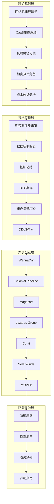
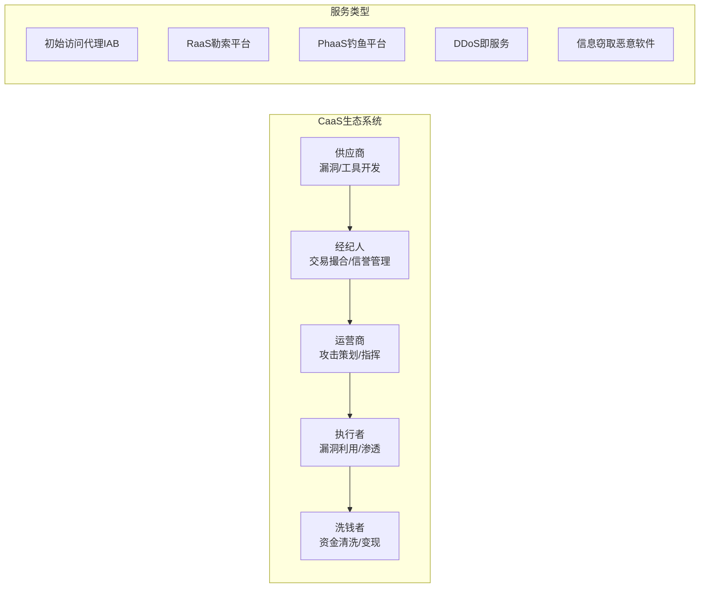

# 第30章 黑客搞钱路径 - 本章小结

## 本章知识全景图

在进入具体回顾之前，先从全局视角理解本章构建的知识体系。本章围绕一个核心命题展开：**理解攻击者的经济动机，是构建有效防御的前提**。全章从理论基础出发，经过核心技术解析和真实案例验证，最终收敛为可操作的防御框架和检查清单。



---

## 一、核心知识点回顾

### 1.1 网络犯罪的经济学本质

本章从经济学视角建立了理解网络犯罪的基础框架。网络犯罪并非随机的破坏行为，而是一种高度理性化的经济活动。攻击者在每一次行动中都在进行隐式的成本-收益计算：

| 维度 | 攻击者视角 | 防御者视角 |
|------|-----------|-----------|
| **启动成本** | CaaS平台大幅降低（月费$100起） | 安全体系建设投入持续增加 |
| **边际成本** | 每新增一个受害者的成本极低 | 每新增一个威胁的检测成本线性增长 |
| **收益上限** | 单次勒索可达数千万美元 | 单次事件损失可达数十亿美元 |
| **风险概率** | 被捕率不足1%（暗网操作） | 被攻击概率超过90%（大型组织） |
| **时间窗口** | 攻击自动化，可7×24运行 | 响应团队受限于工作时间和人力 |

理解这种不对称性是本章的第一个关键认知。防御者需要从攻击者的经济决策模型出发，找到那些能够显著提高攻击成本、降低攻击回报率的关键节点。

**核心结论：** 网络犯罪经济学的核心不是技术，而是激励结构。防御的本质是改变攻击者的激励结构——让攻击变得不值得。

### 1.2 犯罪即服务（CaaS）生态体系

现代网络犯罪已经形成了一个高度专业化的服务生态系统，其分工精细程度堪比合法的软件产业：



**关键洞察：** 在CaaS模式下，攻击的技术门槛已经大幅降低。一个没有编程能力的人，只需在暗网论坛支付$200-500，就可以获得完整的钓鱼即服务（PhaaS）平台，包括预构建的钓鱼页面、邮件模板、凭证收集后端和自动化分发工具。这意味着防御者面对的不再是少数精英黑客，而是数量庞大、动机各异的"脚本小子+专业工具"组合。

### 1.3 变现路径的完整图谱

本章系统梳理了黑客将技术能力转化为经济收益的六大路径，每条路径都有独特的价值链和运营模式：

| 变现路径 | 技术门槛 | 收益规模 | 被捕风险 | 运营复杂度 | 典型攻击周期 |
|---------|---------|---------|---------|-----------|------------|
| 勒索软件 | 中高 | 极高（$100万-$5000万） | 中 | 高 | 2-8周 |
| 数据窃取贩卖 | 中 | 高（$10万-$1000万） | 中低 | 中 | 4-12周 |
| 挖矿劫持 | 低 | 低（$500-$50000/月） | 低 | 低 | 持续运营 |
| BEC欺诈 | 低 | 极高（$10万-$5亿） | 中 | 中 | 数天-数周 |
| 账户接管ATO | 中 | 高（视账户价值） | 中低 | 中 | 数小时-数周 |
| DDoS勒索 | 低 | 中（$5000-$500000） | 低 | 低 | 即时威胁 |

**横向对比要点：**

- **勒索软件**是当前利润最高的变现路径，但运营复杂度也最高，需要完善的基础设施（C2服务器、加密引擎、谈判平台、洗钱通道）
- **BEC欺诈**的技术门槛最低但单次收益可能最高，因为其利用的是社会工程学而非技术漏洞
- **挖矿劫持**虽然单体收益低，但胜在稳定且难以被发现，适合"细水长流"型攻击者
- **数据贩卖**的价值取决于数据质量——金融数据（信用卡/银行账户）> 医疗数据（PHI）> 身份数据（PII）

### 1.4 技术手段深度解析

在核心技术部分，本章深入分析了攻击者使用的关键技术及其演变趋势：

| 变现路径 | 核心技术 | 当前主流手法 | 演变趋势 |
|---------|---------|------------|---------|
| 勒索软件 | RaaS平台、双重/三重勒索、BYOVD | LockBit 3.0、ALPHV/BlackCat、Cl0p | 从加密转向纯数据窃取勒索；勒索金额谈判专业化 |
| 数据贩卖 | 信息窃取恶意软件、API攻击、数据库注入 | RedLine、Raccoon Stealer、恶意广告投递 | AI增强的数据分类和定价；实时数据流交易 |
| 挖矿劫持 | 容器逃逸、云凭证窃取、无文件攻击 | Kubernetes RBAC滥用、AWS IAM角色劫持 | 从终端转向云原生环境；无服务器架构劫持 |
| BEC | 深度伪造语音/视频、AI生成邮件、邮箱规则劫持 | 精准冒充CEO/CFO、供应商欺诈 | AI生成内容质量大幅提升；多模态钓鱼 |
| 账户接管 | 凭证填充、MFA绕过、会话劫持 | Adversary-in-the-Middle（AitM）攻击 | Token窃取替代密码窃取；OAuth滥用 |
| DDoS | 多向量攻击、放大反射、应用层攻击 | HTTP/2快速重置、DNS水刑攻击 | 混合攻击（DDoS掩护渗透）；Ransom DDoS |

**技术演进的三个核心趋势：**

1. **从技术漏洞到信任滥用**：攻击者越来越倾向于利用合法服务和信任关系（如SolarWinds、MOVEit），而非纯粹的技术漏洞
2. **从单点攻击到供应链打击**：一次供应链入侵可以影响成千上万下游组织，投入产出比远超单点攻击
3. **从手动操作到自动化运营**：CaaS平台使攻击高度自动化，一个操作者可以同时管理数十个受害目标

### 1.5 真实案例的关键教训

七个标志性案例为本章提供了实证基础，每个案例都揭示了防御体系的特定弱点：

| 案例 | 年份 | 攻击类型 | 核心教训 | 防御启示 |
|------|------|---------|---------|---------|
| WannaCry | 2017 | 勒索软件 | 即使"业余"攻击也能造成全球灾难 | 补丁管理是最低成本的防御投入 |
| Colonial Pipeline | 2021 | 勒索软件 | 一个泄露密码可瘫痪国家级基础设施 | MFA + 网络分段是基线要求 |
| Magecart | 2015至今 | 数据窃取 | 供应链中一个被入侵的JS脚本可窃取百万卡号 | 第三方代码监控（CSP/SRI）不可或缺 |
| Lazarus Group | 2016至今 | 金融攻击 | 国家级黑客将网络犯罪作为战略资源 | 金融行业需建立针对性威胁情报 |
| Conti | 2020-2022 | 勒索软件 | 犯罪组织"重组而非消失" | 依法拒绝支付赎金可瓦解犯罪经济 |
| SolarWinds | 2020 | 供应链 | 软件供应链信任是最根本的安全挑战 | SBOM + 运行时行为监控 |
| MOVEit | 2023 | 零日利用 | 零日漏洞+数据窃取成为主流模式 | WAF规则+文件传输替代方案 |

**深层洞察：** 这七个案例跨越了从2015年到2023年的八年时间窗口，清晰地展示了攻击范式的演变——从WannaCry的"无差别勒索"到SolarWinds的"精准供应链打击"，再到MOVEit的"零日漏洞+数据窃取"。防御者需要认识到，威胁格局在持续进化，静态的防御策略无法应对动态的威胁。

### 1.6 八大认知误区纠正

对网络犯罪的认知偏差会直接影响防御决策的有效性。本章纠正的八个误区具有代表性：

| 误区 | 现实 | 认知偏差类型 | 防御影响 |
|------|------|------------|---------|
| ❌ "黑客都是天才少年" | 现代网络犯罪高度产业化和分工化 | 刻板印象 | 低估威胁的组织化程度 |
| ❌ "小企业不会被攻击" | 中小企业是勒索软件的首选目标（防御薄弱+支付意愿） | 幸存者偏差 | 忽视基础安全投入 |
| ❌ "支付赎金就能恢复数据" | 约20%支付赎金后无法恢复数据 | 控制幻觉 | 助长犯罪经济循环 |
| ❌ "防病毒软件就够了" | 需要纵深防御策略覆盖多个攻击面 | 技术简化主义 | 防御体系存在大量盲区 |
| ❌ "网络安全是IT部门的事" | 安全是全员责任（社会工程学利用人性弱点） | 责任分散 | 安全文化缺失 |
| ❌ "我们有备份，不怕勒索" | 双重勒索使备份失效；备份本身也可能被加密 | 过度自信 | 恢复能力虚假安全感 |
| ❌ "暗网是法外之地" | 执法能力持续增强（Operation Trojan Shield等） | 神秘化 | 错估对手的脆弱性 |
| ❌ "AI彻底改变安全格局" | AI是工具增强而非范式革命 | 技术决定论 | 过度依赖AI，忽视基础安全 |

---

## 二、防御核心原则体系

基于对攻击者变现路径的深入理解，本章提炼出五条防御核心原则，构成一个完整的防御哲学体系：

### 原则一：经济动机驱动防御（Economics-Driven Defense）

**核心思想：** 防御策略应基于攻击者的经济动机设计，而非基于技术特征。

**具体实施方法：**

1. **资产识别与分级**
   - 建立数据资产清单，按敏感度分级（公开/内部/机密/绝密）
   - 识别业务关键流程和单点故障
   - 评估每类资产对攻击者的经济价值

2. **变现环节阻断**
   - 在数据离开组织边界前建立DLP检查点
   - 加密静态和传输中的高价值数据
   - 监控异常数据外传行为（大文件上传、DNS隧道、ICMP隧道）

3. **攻击成本提升**
   - 增加攻击者的横向移动难度（网络微分段）
   - 提高凭证窃取的难度（硬件密钥、条件访问策略）
   - 缩短攻击者的操作时间窗口（自动化响应）

### 原则二：纵深防御（Defense in Depth）

**核心思想：** 不依赖任何单一安全措施，构建多层互补的防御体系。

```text
┌─────────────────────────────────────────────┐
│                第1层：治理与策略               │
│  安全策略 · 合规框架 · 风险评估 · 安全文化     │
├─────────────────────────────────────────────┤
│                第2层：物理安全                 │
│  访问控制 · 监控摄像 · 环境控制 · 清洁桌面     │
├─────────────────────────────────────────────┤
│                第3层：网络安全                 │
│  防火墙 · IDS/IPS · 网络分段 · VPN · 零信任   │
├─────────────────────────────────────────────┤
│                第4层：主机安全                 │
│  EDR · 补丁管理 · 配置加固 · 应用白名单        │
├─────────────────────────────────────────────┤
│                第5层：应用安全                 │
│  WAF · 代码审计 · SAST/DAST · API安全         │
├─────────────────────────────────────────────┤
│                第6层：数据安全                 │
│  加密 · DLP · 访问控制 · 备份 · 数据分类       │
├─────────────────────────────────────────────┤
│                第7层：人员安全                 │
│  安全意识培训 · 社会工程测试 · 安全报告文化     │
└─────────────────────────────────────────────┘
```

**关键实施要点：** 每一层都应具备独立的预防、检测和响应能力。当某一层被突破时，下一层应能发现异常并触发响应。

### 原则三：假设已被入侵（Assume Breach）

**核心思想：** 以攻击者已在内部为前提设计防御，从"城堡护城河"模式转向"零信任"模式。

**具体实施框架：**

- **身份验证**：所有访问请求必须经过身份验证，无论来源（内网或外网）
- **设备信任**：设备必须满足安全基线才能接入（健康检查、证书验证）
- **最小权限**：每个用户/服务仅获得完成工作所需的最低权限
- **持续验证**：访问权限基于实时风险评估动态调整（上下文感知）
- **横向移动检测**：部署蜜罐和诱饵账户，监控异常的内部访问模式

### 原则四：威胁情报驱动（Threat Intelligence-Driven）

**核心思想：** 利用威胁情报指导防御决策，而非凭直觉配置安全措施。

**威胁情报应用框架：**

| 情报层级 | 内容 | 应用场景 | 更新频率 |
|---------|------|---------|---------|
| 战略情报 | 行业威胁趋势、地缘政治风险 | 安全预算分配、战略规划 | 季度/年度 |
| 战术情报 | TTP（战术、技术、程序） | 安全架构设计、控制措施选择 | 月度 |
| 操作情报 | 具体攻击活动、IOC（失陷指标） | 安全设备规则更新、监控策略 | 每日 |
| 技术情报 | 恶意软件样本、漏洞利用代码 | EDR签名更新、补丁优先级 | 实时 |

### 原则五：人是最关键因素（People-First Security）

**核心思想：** 技术措施需要配合人员能力，社会工程学是最常见的攻击入口。

**人员安全能力建设：**

1. **全员安全意识培训**
   - 频率：至少每季度一次（高风险行业每月一次）
   - 形式：模拟钓鱼演练 + 在线课程 + 案例分析
   - 考核：钓鱼演练点击率应低于5%（行业基准）

2. **专业安全团队建设**
   - SOC团队：7×24安全监控和事件响应
   - 红队/蓝队：攻防对抗演练
   - 威胁情报分析师：持续追踪威胁演变

3. **安全报告文化**
   - 建立无惩罚的事件报告机制
   - 奖励主动报告安全事件的员工
   - 定期分享安全事件案例和经验教训

---

## 三、防御检查清单

基于本章内容，建议组织按优先级对照检查以下防御措施。标注为 [P0] 的为最高优先级，应立即实施；[P1] 为高优先级，应在30天内完成；[P2] 为推荐实施项。

### 基础防护层（所有组织必须）

- [P0] **多因素认证（MFA）**：所有远程访问和特权账户强制启用MFA，优先选择硬件密钥（FIDO2/WebAuthn）而非短信验证码
- [P0] **补丁管理**：建立漏洞扫描和补丁推送机制，高危漏洞72小时内修复，中危漏洞2周内修复
- [P0] **备份策略**：实施3-2-1备份策略（3份副本、2种介质、1份异地），每月测试恢复流程
- [P0] **邮件安全**：部署邮件安全网关，配置SPF/DKIM/DMARC，启用反钓鱼和反恶意附件检测
- [P1] **安全意识培训**：每季度开展全员培训，每月进行模拟钓鱼演练
- [P1] **端点防护**：部署EDR（端点检测与响应）替代传统防病毒软件
- [P1] **网络分段**：生产环境与办公网络隔离，数据库服务器禁止直接互联网访问

### 进阶防护层（中大型组织推荐）

- [P1] **特权访问管理（PAM）**：实施特权账户密码轮换、会话录制和审批流程
- [P1] **数据防泄漏（DLP）**：在邮件、USB、云存储等出口部署DLP策略
- [P1] **SIEM/SOAR**：部署安全信息和事件管理平台，建立自动化响应剧本
- [P1] **渗透测试**：每年至少两次外部渗透测试，一次内部渗透测试
- [P2] **供应链安全**：建立软件物料清单（SBOM），评估关键供应商的安全状况
- [P2] **暗网监控**：订阅暗网监控服务，追踪品牌和数据泄露信息
- [P2] **事件响应计划**：制定IRP并每半年演练一次，明确角色分工和沟通流程
- [P2] **网络安全保险**：评估并购买适当的网络安全保险，覆盖勒索赎金和业务中断

### 高级防护层（高价值目标组织）

- [P1] **威胁情报订阅**：订阅商业或开源威胁情报服务，建立IOC自动分发机制
- [P1] **零信任架构**：实施零信任网络访问（ZTNA），替代传统VPN
- [P2] **应用白名单**：在关键系统上部署应用控制策略，仅允许已签名的应用运行
- [P2] **不可变备份**：采用对象锁定（Object Lock）或气隙（Air Gap）技术保护备份数据
- [P2] **威胁狩猎**：建立主动威胁狩猎能力，基于假设驱动的调查而非被动告警响应
- [P2] **SOAR自动化**：构建安全编排和自动化响应平台，将MTTR从小时级缩短到分钟级
- [P2] **加密货币监控**：如组织处理加密货币支付，部署区块链分析工具监控资金流向

**检查清单使用指南：** 建议每季度对照此清单进行一次全面评估，记录改进进度。优先处理P0级项目，逐步推进P1和P2级项目。评估结果应向管理层汇报，作为安全预算和资源分配的决策依据。

---

## 四、未来趋势深度展望

### 趋势一：AI驱动的攻防博弈升级

AI正在重塑网络攻防的格局，但其影响远比"AI将彻底改变安全"的简单叙事复杂得多：

**攻击端的AI应用：**
- **深度伪造（Deepfake）**：AI生成的语音和视频伪造将使BEC欺诈更加难以识别。到2025年，基于AI的语音克隆技术可以在几秒钟内复制任何人的声音，准确率超过95%
- **自动化漏洞发现**：AI辅助的模糊测试和代码审计将加速漏洞发现速度。预计AI驱动的漏洞发现将在未来3-5年内将0-day漏洞的发现速度提高3-5倍
- **自适应钓鱼**：AI可以根据目标的社交媒体画像生成高度个性化的钓鱼内容，点击率比传统钓鱼邮件高3-5倍

**防御端的AI应用：**
- **异常检测增强**：UEBA（用户和实体行为分析）结合AI可以更准确地识别内部威胁和账户接管
- **自动化响应**：AI驱动的SOAR平台可以将事件响应时间从小时级缩短到分钟级
- **威胁预测**：基于机器学习的威胁预测模型可以帮助安全团队提前部署防御

**关键判断：** AI不会创造全新的攻击类别，而是放大现有攻击的效率和规模。防御者需要将AI视为攻防工具箱中的新增武器，而非颠覆性的范式转变。

### 趋势二：数据窃取勒索超越加密勒索

这一趋势已经非常明确——勒索软件的商业模式正在从"加密受害者文件→索要赎金"转向"窃取受害者数据→以公开数据威胁索要赎金"：

**驱动因素：**
- 备份技术的进步使加密勒索的成功率下降
- GDPR等数据保护法规使数据泄露的合规成本大幅上升
- "仅窃取不加密"模式的运营成本更低、法律风险更小

**防御对策：**
- DLP策略需要覆盖所有数据出口（包括加密通道和DNS隧道）
- 数据分类和标记需要更加精细
- 不可变备份的重要性进一步提升

### 趋势三：关键基础设施成为地缘政治武器

关键基础设施（能源、水利、交通、医疗）正在成为国家级黑客组织和勒索软件团伙的重点目标：

- **攻击价值极高**：能源管网或医院系统的单次攻击可能造成数十亿美元损失
- **支付意愿极强**：关键基础设施运营者面临巨大的社会和政治压力支付赎金
- **地缘政治杠杆**：攻击关键基础设施可以作为地缘政治谈判的筹码

**防御启示：** 关键基础设施运营者需要与政府情报机构建立信息共享机制，实施超出行业标准的防御措施，并建立跨部门的联合应急响应能力。

### 趋势四：供应链攻击的系统性风险

供应链攻击正在从偶发事件演变为系统性风险：

- **软件供应链**：SolarWinds、MOVEit、Log4Shell等事件表明，广泛使用的软件组件是高价值攻击目标
- **SaaS平台**：一次对SaaS平台的入侵可以同时影响成千上万租户
- **硬件供应链**：芯片和硬件组件的供应链完整性面临日益严峻的挑战

**防御建议：** 组织需要建立软件物料清单（SBOM），实施运行时应用自保护（RASP），并对关键供应商进行定期安全评估。

### 趋势五：加密货币追踪与反追踪的技术竞赛

执法机构与犯罪分子在加密货币追踪领域的技术竞赛正在加剧：

- **追踪能力增强**：Chainalysis、Elliptic等公司的区块链分析工具已经帮助执法机构追回了数十亿美元的犯罪资金
- **混币服务监管**：Tornado Cash等混币服务面临越来越多的法律压力
- **隐私币挑战**：门罗币等隐私币仍然是资金追踪的主要障碍

**行业影响：** 加密货币的匿名性正在被逐步削弱，但完全追踪仍然困难。防御者应关注组织的加密货币支付政策，建立相关的监控和报告机制。

---

## 五、行动指南：从知识到实践

学完本章后，建议按以下路径将知识转化为行动：

### 立即行动（今天就可以做）

1. **验证MFA覆盖范围**：检查组织内所有远程访问和特权账户是否已启用MFA
2. **测试备份恢复**：随机选择一份备份，测试完整恢复流程，记录恢复时间
3. **发送模拟钓鱼邮件**：使用内部工具或第三方服务发送一次钓鱼演练，统计点击率

### 短期行动（30天内完成）

1. **完成资产清单**：梳理组织的数据资产，按敏感度分级
2. **审查补丁状态**：扫描所有系统，确认高危漏洞补丁已应用
3. **制定事件响应预案**：至少覆盖勒索软件、数据泄露、BEC欺诈三种场景

### 中期行动（90天内完成）

1. **部署EDR**：在所有终端部署端点检测与响应工具
2. **建立威胁情报流程**：订阅至少一个威胁情报源，建立IOC分发机制
3. **开展首次红蓝对抗**：模拟真实攻击场景，验证防御体系的有效性

### 长期行动（持续改进）

1. **安全度量体系**：建立MTTD、MTTR、钓鱼演练成功率等关键安全指标
2. **安全文化建设**：将安全意识融入组织文化，而非仅作为合规要求
3. **持续跟踪威胁演变**：定期更新对攻击者变现路径的理解，调整防御策略

---

## 六、本章核心金句

> **"了解敌人是为了更好地防御，而非学习如何成为敌人。"** —— 攻击者研究的伦理边界

> **"网络犯罪是一个经济学问题，而不仅仅是技术问题。"** —— 防御策略的起点

> **"防御者不必在每个环节都赢，但攻击者必须在每个环节都赢。"** —— 纵深防御的逻辑基础

> **"对攻击者而言，没有永恒的朋友，只有永恒的利益。"** —— 理解CaaS生态的关键

> **"最好的防御不是更厚的城墙，而是让攻击变得不值得。"** —— 经济动机驱动防御的精髓

---

## 七、延伸阅读与资源

### 权威报告
- **MITRE ATT&CK for Enterprise**：https://attack.mitre.org/ — 攻击者TTP的标准化知识库
- **CISA Ransomware Guide**：https://www.cisa.gov/stopransomware — 美国国土安全部勒索软件防御指南
- **FBI Internet Crime Report**：https://www.ic3.gov/ — 年度网络犯罪统计报告
- **Chainalysis Crypto Crime Report**：https://www.chainalysis.com/ — 加密货币犯罪追踪年度报告
- **ENISA Threat Landscape**：https://www.enisa.europa.eu/ — 欧盟网络威胁态势报告

### 学习资源
- **SANS FOR508**：高级事件响应、威胁狩猎和数字取证课程
- **MITRE D3FEND**：防御技术知识图谱（https://d3fend.mitre.org/）
- **NIST Cybersecurity Framework 2.0**：网络安全框架（https://www.nist.gov/cyberframework）
- **OWASP Top 10**：Web应用安全风险清单（https://owasp.org/www-project-top-ten/）

### 实践平台
- **Hack The Box**：渗透测试和红队练习平台
- **TryHackMe**：从入门到进阶的网络安全学习路径
- **LetsDefend**：蓝队SOC分析实战平台
- **CyberDefenders**：威胁狩猎和事件响应CTF平台

---

*本章完。返回 [章节目录](00-章节概览.md)*
