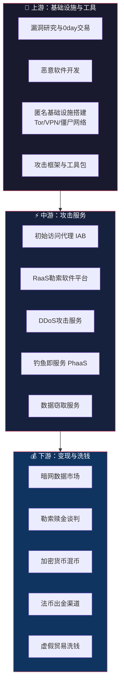
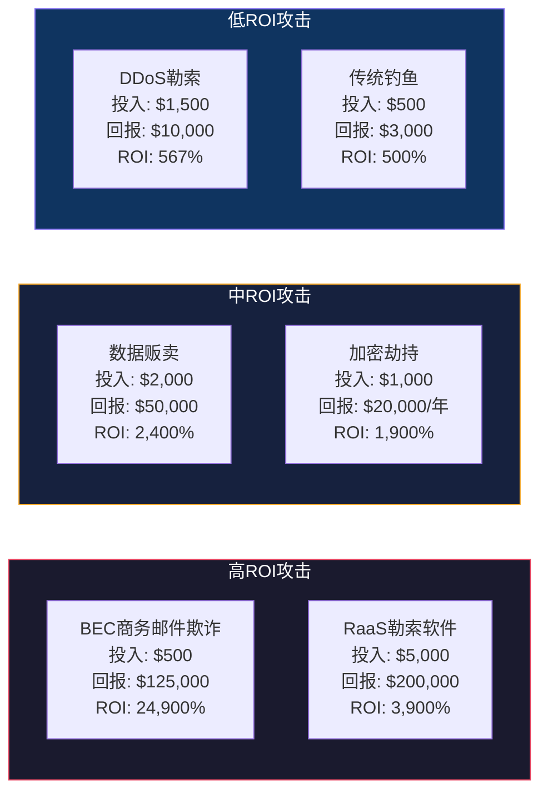
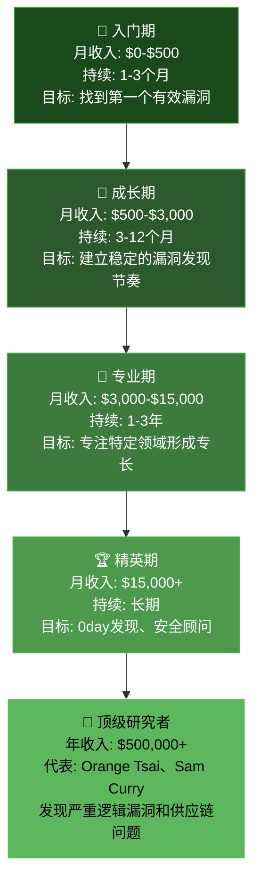
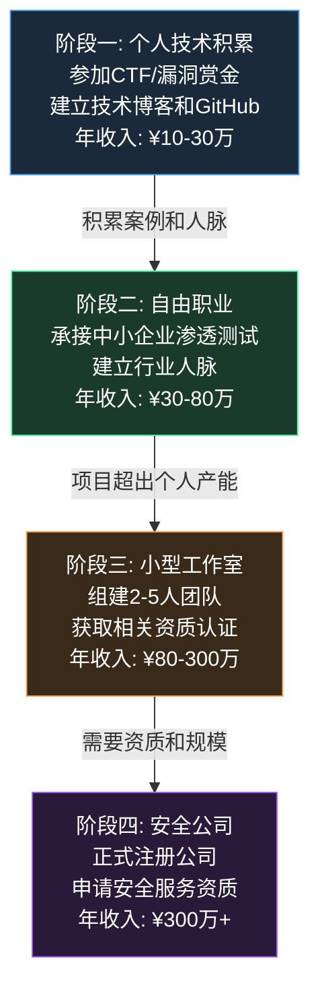
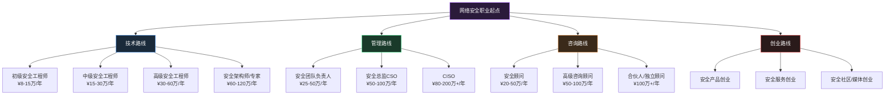

# 第30章 黑客搞钱路径 - 深度拓展

> 本节在前面各节的基础上，从产业经济学、职业路径、前沿趋势三个维度进行深度拓展。既帮助防御者建立更完整的威胁图景，也为安全从业者提供合法变现的实操指南。

---

## 一、网络犯罪产业经济学深度解析

### 1.1 产业链全景图

网络犯罪已从早期的个体行为演变为高度分工的全球化产业。理解其产业链结构，是防御者识别关键阻断点的前提。

**上游：基础设施与工具供应**

这一层的核心是降低攻击的技术门槛。关键角色包括：

| 角色 | 功能 | 典型收入模式 | 代表案例 |
|------|------|------------|---------|
| 漏洞猎人 | 发现并出售0day/1day漏洞 | 漏洞赏金或暗网交易 | Zerodium最高支付250万美元收购iOS零点击漏洞 |
| 恶意软件开发者 | 开发信息窃取器、远控、打包器 | 订阅制或一次性销售 | Raccoon Stealer月费约200美元 |
| 基础设施运营商 | 提供C2服务器、Bulletproof托管 | 按月收费 | 俄罗斯Bulletproof托管月费500-5000美元 |
| 工具打包者 | 将恶意软件免杀处理后分发 | 按次收费 | 每次免杀处理50-500美元 |

**中游：攻击服务层**

这是产业链中最活跃的部分，犯罪即服务（CaaS）模式使得攻击门槛大幅降低：

- **初始访问代理（IAB）**：入侵企业网络后将访问权出售给下游犯罪分子。根据IBM X-Force报告，IAB在暗网上的售价通常为企业规模的1000-10000美元，Fortune 500企业的初始访问权可高达10万美元
- **RaaS平台**：勒索软件即服务，开发者提供平台，"加盟商"负责实际攻击，通常按赎金的70/30或80/20分成
- **PhaaS平台**：钓鱼即服务，提供现成的钓鱼页面、邮件模板和凭证收割后端，如EvilGnome、Greatness等

**下游：变现与洗钱**

这是犯罪收益最终转化为可用资金的环节，也是执法机构重点打击的方向：

- **加密货币混币**：Tornado Cash被制裁后，混币服务转向跨链桥和去中心化方案
- **法币出金**：通过虚假贸易、加密货币ATM、地下钱庄等渠道将加密货币转化为法币
- **虚假贸易洗钱**：利用跨境电商虚假交易，将犯罪资金混入正常贸易流水

### 1.2 攻击者的成本-收益分析

理解攻击者的经济决策模型，有助于防御者找到最具性价比的防护策略。

**攻击成本构成：**

| 成本类型 | 具体内容 | 典型金额范围 |
|---------|---------|------------|
| 工具采购 | 恶意软件租用、漏洞利用购买 | $200-$50,000/月 |
| 基础设施 | C2服务器、匿名网络、域名 | $50-$5,000/月 |
| 时间投入 | 侦察、入侵、横向移动 | 数天到数月 |
| 技能成本 | 学习曲线、社区贡献 | 机会成本 |
| 风险溢价 | 被捕概率 × 法律后果 | 因地区而异 |

**不同攻击类型的ROI对比：**

> **防御启示**：BEC和勒索软件是攻击者ROI最高的攻击类型，这意味着攻击者有最强的经济动机持续投入这两类攻击。防御者应将资源优先投入到邮件安全（反BEC）和备份恢复（反勒索）上。

### 1.3 数据定价体系

暗网上的数据交易已形成相对成熟的定价体系，了解这些定价逻辑有助于企业评估自身数据资产的风险敞口。

**各类数据的暗网市场参考价格：**

| 数据类型 | 单条价格 | 批量价格(万条) | 影响因素 |
|---------|---------|--------------|---------|
| 信用卡信息(CVV) | $5-$30 | $2,000-$5,000 | 有效期、额度、发卡行 |
| 美国银行账户登录 | $20-$65 | $5,000-$15,000 | 账户余额、银行类型 |
| 社交媒体账户 | $2-$25 | $500-$3,000 | 粉丝数、账户年龄 |
| 企业VPN凭证 | $5-$50 | $2,000-$10,000 | 企业规模、访问权限 |
| 医疗记录(PHI) | $25-$1000 | $10,000-$50,000 | 完整性、地区法规 |
| 身份证/护照扫描件 | $15-$60 | $3,000-$12,000 | 国家、真实性 |
| 企业数据库访问权 | 协商制 | 协商制 | 数据规模、商业价值 |

> **重要提醒**：以上数据仅供防御者评估风险使用。任何参与数据买卖的行为都是严重犯罪，将面临《刑法》第253条之一（侵犯公民个人信息罪）的严厉处罚，最高可判处七年有期徒刑。

---

## 二、安全从业者合法变现路径

### 2.1 漏洞赏金：从零到年入百万的路径

漏洞赏金（Bug Bounty）是安全研究者将技能合法变现最直接的途径。根据HackerOne的2024年度报告，全球白帽黑客已累计获得超过3亿美元的赏金。

**主要漏洞赏金平台对比：**

| 平台 | 成立时间 | 累计赏金 | 特色 | 适合人群 |
|------|---------|---------|------|---------|
| HackerOne | 2012 | $3亿+ | 最大平台，企业级客户多 | 中高级研究者 |
| Bugcrowd | 2012 | $1.5亿+ | 澳洲背景，游戏化排名 | 各级别研究者 |
| Intigriti | 2016 | $1000万+ | 欧洲市场，社区活跃 | 欧洲研究者 |
| 漏洞盒子 | 2015 | - | 国内最大，中文环境 | 国内研究者 |
| 补天 | 2014 | - | 奇安信旗下，政府/企业项目多 | 国内研究者 |
| CNVD/CNNVD | - | - | 国家级平台，漏洞收录 | 专业机构 |

**漏洞赏金的收入阶梯：**

**提升赏金收入的实操策略：**

1. **选择高价值目标**：金融、医疗、云服务商的赏金通常更高，单个漏洞可达$10,000-$100,000+
2. **专精一个方向**：深度专精（如API安全、移动端安全）比广撒网更有效。Orange Tsai专注Web安全逻辑漏洞，年收入超过$100万
3. **关注业务逻辑漏洞**：技术性漏洞（XSS、SQLi）赏金通常$500-$3,000，而业务逻辑漏洞（权限绕过、支付逻辑）赏金可达$10,000-$100,000
4. **参与私有项目**：建立良好信誉后，可申请加入高赏金的私有项目
5. **编写高质量报告**：清晰的报告格式、完整的PoC、明确的影响说明可显著提高接受率

### 2.2 渗透测试服务商业化

#### 定价体系与商业模型

渗透测试服务的定价受多种因素影响，以下是详细的价格参考：

| 测试类型 | 报价范围(美元) | 周期 | 交付物 |
|---------|-------------|------|--------|
| Web应用渗透测试 | $5,000-$50,000 | 1-4周 | 漏洞报告+修复建议 |
| 内网渗透测试 | $15,000-$100,000 | 2-6周 | 完整攻击路径+修复方案 |
| 红队评估 | $50,000-$500,000 | 1-3月 | 全面攻击模拟+防御评估 |
| 社会工程学测试 | $5,000-$50,000 | 2-4周 | 钓鱼模拟报告+培训建议 |
| 移动应用安全测试 | $8,000-$40,000 | 1-3周 | 客户端+服务端漏洞报告 |
| API安全测试 | $6,000-$30,000 | 1-3周 | API漏洞报告+加固建议 |

**四种主流定价模式对比：**

| 模式 | 优势 | 劣势 | 适用场景 |
|------|------|------|---------|
| 固定价格 | 客户预算可控，项目范围明确 | 范围变更风险，利润波动 | 标准化测试、中小企业 |
| 时间材料(T&M) | 灵活适应范围变化 | 预算不可预测，客户顾虑 | 复杂项目、红队评估 |
| 价值定价 | 基于风险降低的价值 | 难以量化，需要信任 | 高端咨询、战略评估 |
| 订阅制 | 稳定收入流，长期客户关系 | 需要持续交付价值 | 中大型企业持续安全服务 |

#### 自由职业者到公司的成长路径

**中国市场关键资质：**

- **等保测评资质**：网络安全等级保护测评机构资质，从事等保测评的必备条件
- **CMA/CNAS认证**：检验检测机构资质认定，提升公信力
- **国家信息安全漏洞库入库**：向CNVD/CNNVD提交漏洞，建立行业影响力
- **ISO 27001认证**：信息安全管理体系认证，是大客户采购的基本门槛

### 2.3 安全知识变现

#### 技术写作变现矩阵

| 变现方式 | 收入预期 | 门槛 | 周期 | 代表平台 |
|---------|---------|------|------|---------|
| 个人博客(广告) | ¥500-5,000/月 | 低 | 长期积累 | 自建站、知乎专栏 |
| 技术社区投稿 | ¥500-3,000/篇 | 中 | 单篇结算 | FreeBuf、安全客、看雪 |
| 技术书籍出版 | ¥5-20万/本 | 高 | 6-18个月 | 人民邮电、电子工业出版社 |
| 在线课程 | ¥1,000-50,000/月 | 中高 | 持续更新 | 极客时间、B站、看雪学院 |
| 企业内训 | ¥5,000-30,000/天 | 高 | 按项目 | 直接对接企业 |

**构建知识变现体系的实操步骤：**

1. **选题定位**：选择一个垂直方向（如Web安全、逆向工程、云安全），避免泛泛而谈
2. **内容积累**：每周输出1-2篇技术文章，形成系列内容（如"从零搭建XX安全测试环境"）
3. **平台选择**：国内优先FreeBuf、安全客、先知社区获得曝光；国际可选Medium、HackerNoon
4. **课程开发**：将系列文章整合为系统课程，制作视频教程
5. **持续运营**：定期更新内容，回应读者问题，建立个人品牌

#### 安全咨询顾问

安全咨询是高端知识变现途径，需要深厚的行业积累：

- **安全策略咨询**：为组织制定安全战略和路线图，日费¥5,000-20,000
- **合规咨询**：帮助组织满足GDPR、等保、PCI DSS等合规要求，项目费¥50,000-500,000
- **安全架构设计**：为新系统和项目提供安全架构方案，项目费¥30,000-200,000
- **应急响应咨询**：在安全事件中提供紧急支援，日费¥10,000-50,000

---

## 三、安全创业生态深度分析

### 3.1 全球安全市场格局

全球网络安全市场规模预计到2028年将超过4000亿美元，年复合增长率约12-15%。以下是中国安全市场的细分赛道分析：

| 赛道 | 市场规模(中国) | 增长率 | 竞争格局 | 代表企业 |
|------|-------------|--------|---------|---------|
| 云安全 | ¥150亿+ | 25%+ | 巨头+新锐 | 阿里云安全、腾讯安全、云启资本系 |
| 数据安全 | ¥100亿+ | 30%+ | 高度碎片化 | 美创科技、天空卫士、昂楷科技 |
| 零信任 | ¥50亿+ | 35%+ | 快速增长 | 竹云、派拉软件、云深互联 |
| 工控安全 | ¥40亿+ | 20%+ | 专业壁垒高 | 威努特、天地和兴、长扬科技 |
| 安全运营(SOC) | ¥80亿+ | 18%+ | 平台化趋势 | 奇安信、深信服、安恒信息 |
| 身份安全 | ¥60亿+ | 22%+ | 新兴赛道 | 竹云、Authing、派拉软件 |

### 3.2 创业路径选择

**安全创业的三种典型路径：**

**路径一：产品型创业**

从一个具体的安全痛点出发，开发标准化产品：

- **优势**：可规模化、边际成本低、易于融资
- **劣势**：产品开发周期长、需要持续研发投入、竞争激烈
- **适合人群**：有深厚技术背景的工程师/架构师
- **典型案例**：长亭科技从WAF产品起步，后拓展到全栈安全

**路径二：服务型创业**

以专业服务（渗透测试、安全咨询、应急响应）为核心：

- **优势**：启动成本低、现金流快、客户粘性高
- **劣势**：人力密集、难以规模化、依赖核心人员
- **适合人群**：有丰富实战经验和行业人脉的资深安全专家
- **典型发展**：2-3人工作室 → 20-50人安全公司 → 服务+产品双轮驱动

**路径三：平台型创业**

构建安全领域的平台或基础设施：

- **优势**：网络效应强、壁垒高、估值高
- **劣势**：需要大量资本、技术复杂度高、市场教育成本大
- **适合人群**：有技术+商业双重背景的连续创业者
- **典型案例**：漏洞盒子（漏洞赏金平台）、FreeBuf（安全媒体平台）

### 3.3 融资与资本运作

安全创业的融资路径通常为：

| 阶段 | 估值范围 | 融资额 | 关键指标 | 典型投资方 |
|------|---------|--------|---------|----------|
| 种子轮 | ¥500万-3000万 | ¥100万-500万 | 团队+方向 | 个人天使、安全行业前辈 |
| 天使轮 | ¥3000万-1亿 | ¥500万-3000万 | MVP+首批客户 | 行业基金、产业资本 |
| Pre-A | ¥1亿-3亿 | ¥3000万-1亿 | 产品验证+营收 | 知名VC |
| A轮 | ¥3亿-10亿 | ¥5000万-3亿 | 营收增长+客户验证 | 一线VC |
| B轮及以后 | ¥10亿+ | ¥1亿+ | 规模化增长 | PE、产业资本 |

---

## 四、行业前沿趋势与应对

### 4.1 AI时代的攻防博弈

大语言模型（LLM）和生成式AI正在重塑网络安全攻防格局：

**AI增强的攻击手段：**

| 攻击类型 | AI应用 | 威胁等级 | 防御建议 |
|---------|--------|---------|---------|
| 钓鱼攻击 | AI生成高度个性化钓鱼邮件，语法完美、语境自然 | ⭐⭐⭐⭐⭐ | 基于行为的邮件检测、安全意识培训 |
| 深度伪造 | AI生成逼真的语音和视频，用于BEC和身份欺诈 | ⭐⭐⭐⭐⭐ | 建立内部验证协议、多因素确认 |
| 漏洞挖掘 | AI辅助代码审计、自动化漏洞发现 | ⭐⭐⭐⭐ | 加速补丁管理、攻击面管理 |
| 恶意代码 | AI辅助生成变异恶意软件、绕过检测 | ⭐⭐⭐⭐ | 行为分析、沙箱检测 |
| 自动化攻击 | AI编排复杂的多步攻击链 | ⭐⭐⭐ | 零信任架构、持续监控 |

**AI赋能的防御升级：**

- **异常行为检测**：基于AI的UEBA（用户实体行为分析）可识别传统规则无法发现的异常
- **自动化响应**：SOAR平台结合AI可将事件响应时间从数小时缩短到数分钟
- **威胁情报分析**：AI可自动处理海量威胁数据，提取可操作的情报
- **代码安全审计**：AI辅助的SAST/DAST工具可大幅提升漏洞发现效率

### 4.2 新兴威胁趋势

**趋势一：勒索软件的"不加密"转向**

越来越多的勒索软件团伙放弃加密，仅靠数据窃取和威胁公开进行勒索。这种模式的优势在于：
- 无需维护复杂的加密基础设施
- 不触发基于加密行为的检测
- 数据泄露威胁对企业的威慑力往往更大（涉及监管罚款和声誉损失）

**趋势二：供应链攻击常态化**

- 攻击者将目标从直接入侵转向入侵软件供应商或开源依赖
- 一次供应链攻击可影响数万甚至数十万下游组织
- 典型案例：SolarWinds、Codecov、MOVEit、XZ Utils后门

**趋势三：移动端攻击升温**

- 移动恶意软件激增，尤其是针对Android平台的银行木马
- iOS侧载和企业证书滥用成为新攻击面
- 移动支付场景的欺诈风险上升

**趋势四：云原生安全挑战**

- 容器和Kubernetes环境的配置错误和漏洞利用
- 云凭证窃取成为横向移动的主要手段
- 多云和混合云环境的安全管理复杂度激增

### 4.3 监管环境变化

全球数据安全和网络安全监管持续收紧：

| 法规/标准 | 地区 | 生效时间 | 关键要求 |
|----------|------|---------|---------|
| 《数据安全法》 | 中国 | 2021.9 | 数据分级分类、安全评估 |
| 《个人信息保护法》 | 中国 | 2021.11 | 个人信息处理规则、跨境传输 |
| GDPR | 欧盟 | 2018.5 | 数据保护、隐私权、72小时通报 |
| 《网络安全法》 | 中国 | 2017.6 | 等级保护、关键基础设施保护 |
| SEC网络安全规则 | 美国 | 2023.12 | 上市公司4天内披露重大安全事件 |
| DORA | 欧盟 | 2025.1 | 金融行业数字运营韧性 |

对安全从业者的影响：
- 合规需求驱动安全服务市场持续扩大
- 数据安全和隐私保护成为新的增长点
- 安全事件的法律后果加重，企业安全投入意愿增强

---

## 五、职业发展路线图

### 5.1 安全职业全景图

### 5.2 高价值认证路径

认证虽然不是唯一的能力证明，但在职业发展中仍具有重要参考价值：

| 认证 | 难度 | 费用 | 适合方向 | 含金量 |
|------|------|------|---------|-------|
| OSCP | ⭐⭐⭐⭐ | $1,649 | 渗透测试 | 极高，实战导向 |
| CISSP | ⭐⭐⭐ | $749 | 安全管理 | 行业金标准 |
| CEH | ⭐⭐⭐ | $1,199 | 通用安全 | 广泛认可 |
| CISP | ⭐⭐⭐ | ¥9,800 | 国内市场 | 国内政策导向 |
| AWS/Azure安全专项 | ⭐⭐⭐ | $300 | 云安全 | 云平台认可 |
| GXPN (渗透专家) | ⭐⭐⭐⭐⭐ | $2,499 | 高级渗透 | 顶级技术认证 |

### 5.3 持续学习策略

安全行业技术更新极快，持续学习是保持竞争力的关键：

- **每周**：阅读1-2篇安全研究报告（如Mandiant、CrowdStrike、奇安信的年度报告）
- **每月**：完成1个CTF挑战或漏洞赏金项目，保持实战手感
- **每季**：参加1次安全会议（如ISC、KCon、补天白帽大会），建立行业人脉
- **每年**：考取或更新1个安全认证，学习1项新技术方向

---

## 六、实践建议与资源汇总

### 6.1 入门者行动清单

如果你刚进入安全领域，建议按以下顺序行动：

1. **搭建学习环境**：安装Kali Linux，搭建DVWA/WebGoat等靶场
2. **学习基础技能**：网络协议、Linux基础、编程（Python优先）
3. **参加CTF**：从BUUCTF、攻防世界等国内平台开始
4. **注册漏洞赏金平台**：先在漏洞盒子上练习，积累第一个有效漏洞
5. **输出学习笔记**：在FreeBuf/安全客发表技术文章，建立个人品牌
6. **参加安全社区**：加入本地安全社群，参与线下交流活动

### 6.2 推荐学习资源

**核心书籍：**

| 书名 | 作者 | 方向 | 推荐理由 |
|------|------|------|---------|
| 《黑客大曝光》(第9版) | Stuart McClure等 | 综合安全 | 网络安全经典教材，涵盖面广 |
| 《渗透测试实战第三版》 | Georgia Weidman | 渗透测试 | 适合入门，实操性强 |
| 《Web安全攻防》 | 徐焱 | Web安全 | 中文原创，案例丰富 |
| 《白帽子讲Web安全》 | 吴翰清 | Web安全 | 阿里安全创始人经典之作 |
| 《逆向工程核心原理》 | 韩路 | 逆向工程 | 逆向领域权威参考 |

**在线平台：**

| 平台 | 类型 | 网址 | 特色 |
|------|------|------|------|
| HackerOne | 漏洞赏金 | https://hackerone.com | 全球最大漏洞赏金平台 |
| Bugcrowd | 漏洞赏金 | https://bugcrowd.com | 游戏化排名系统 |
| 漏洞盒子 | 漏洞赏金 | https://vulbox.com | 国内最大白帽社区 |
| 看雪学院 | 安全培训 | https://kanxue.com | 高质量安全课程 |
| i春秋 | 安全培训 | https://ichunqiu.com | 在线实验环境 |
| Hack The Box | 靶场练习 | https://hackthebox.com | 高质量渗透测试靶场 |
| TryHackMe | 靶场练习 | https://tryhackme.com | 适合入门的引导式学习 |
| OverTheWire | 靶场练习 | https://overthewire.org | 经典Linux/安全练习 |

**核心工具：**

| 工具 | 用途 | 类型 | 推荐指数 |
|------|------|------|---------|
| Burp Suite | Web安全测试 | 商业/社区版 | ⭐⭐⭐⭐⭐ |
| Nmap | 网络扫描 | 开源 | ⭐⭐⭐⭐⭐ |
| Metasploit | 渗透测试框架 | 开源/商业 | ⭐⭐⭐⭐⭐ |
| SQLMap | SQL注入检测 | 开源 | ⭐⭐⭐⭐ |
| Wireshark | 网络流量分析 | 开源 | ⭐⭐⭐⭐⭐ |
| Kali Linux | 渗透测试系统 | 开源 | ⭐⭐⭐⭐⭐ |
| Cobalt Strike | 红队工具 | 商业 | ⭐⭐⭐⭐ |
| Nessus | 漏洞扫描 | 商业/免费版 | ⭐⭐⭐⭐ |

### 6.3 思考题与讨论

**思考题：**

1. **合法变现路径选择**：根据自身技术栈和职业目标，设计一份3年安全技能变现计划。第一步应该做什么？如何从$0到$500/月的漏洞赏金收入？
2. **攻防经济学**：假设你是一家500人企业的CISO，预算有限。根据攻击者的成本-收益模型，你会优先投资哪些安全措施？请用具体数据论证。
3. **AI时代的安全角色**：随着AI工具越来越多地承担安全检测和响应任务，人类安全专家的核心价值将如何变化？哪些能力是AI无法替代的？
4. **伦理决策**：你在漏洞赏金项目中发现了一个影响数百万用户的严重漏洞。在提交报告后，厂商拒绝修复并声称"不在范围内"。你会怎么做？有哪些合法渠道可以推动问题解决？
5. **市场定位**：如果你计划创办一家安全服务公司，在中国市场，你会选择哪个细分赛道？请从市场规模、增长率、竞争格局、技术壁垒四个维度分析。

**讨论问题：**

1. **灰色地带的界定**：安全研究与攻击行为之间的界限在哪里？"未经授权的测试"在什么条件下可以被视为合法的安全研究？
2. **漏洞披露争议**：CVE协调披露机制是否合理？在厂商响应迟缓的情况下，研究者是否有权公开漏洞？如何平衡公众安全和商业利益？
3. **安全人才流失**：安全人才从防御方向攻击方向流动的现象如何解决？企业和行业应该采取哪些措施留住人才？
4. **中小企业安全困境**：中小企业缺乏安全预算和专业人才，如何以最低成本实现基本安全防护？托管安全服务（MSSP）是否是可行的解决方案？

---

> **本章总结**：网络安全领域的合法变现路径丰富多样，从漏洞赏金、渗透测试服务到安全创业，每条路径都为有技能的安全从业者提供了可观的收入潜力。关键在于：选择适合自己能力和发展阶段的路径，持续投入学习和实践，建立专业声誉和行业人脉，同时始终坚守法律和道德底线。记住，最好的"搞钱路径"是让自己的安全技能为社会创造真正的价值。
