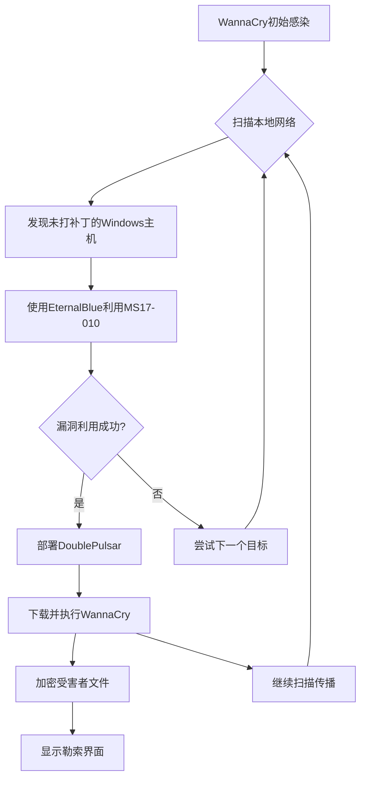

# 案例一：WannaCry勒索软件事件（2017年）

## 一、案例概述

2017年5月12日，全球网络安全史上最具标志性的勒索软件攻击之一——WannaCry（又名WannaCrypt、WanaCrypt0r）在全球范围内爆发。这场攻击在短短三天内感染了超过150个国家的23万台计算机，波及医疗、政府、金融、电信、制造业等几乎所有关键行业。它是勒索软件从"个人勒索工具"演变为"国家级网络武器"的分水岭事件，也是网络安全史上第一次真正意义上的"全球同步沦陷"。

WannaCry的特殊之处在于，它并非传统意义上由犯罪团伙精心策划的定向攻击，而是将美国国家安全局（NSA）泄露的漏洞利用工具与勒索软件恶意载荷意外结合，形成了一种"武器级"的蠕虫式勒索软件。这一事件深刻揭示了国家网络武器外泄的灾难性后果，以及全球范围内Windows系统补丁管理长期缺失的系统性风险。

### 核心数据一览

| 指标 | 数据 |
|------|------|
| 爆发日期 | 2017年5月12日 |
| 感染国家 | 150+ |
| 感染设备数 | 230,000+ |
| 受影响行业 | 医疗、政府、金融、电信、制造、教育 |
| 勒索金额 | 300-600美元（约0.5-1.5 BTC） |
| 实际收款 | 约14万美元（不到1000笔支付） |
| 主要漏洞 | MS17-010（EternalBlue） |
| 归因对象 | 朝鲜Lazarus Group |
| 遏制方式 | Kill Switch域名注册 |

## 二、时间线全景

WannaCry事件的发展可以划分为五个关键阶段，每个阶段都蕴含着值得深入分析的安全教训。

```mermaid
timeline
    title WannaCry事件时间线
    
    2017年4月14日 : Shadow Brokers组织
                   在Pastebin发布
                   "EternalBlue"等NSA工具
    2017年5月12日 : WannaCry首次出现
                   于乌克兰ISP网络
                   08:44 UTC首次检测
    2017年5月12日 : 数小时内蔓延至
                   全球150+国家
                   英国NHS首当其冲
    2017年5月13日 : 安全研究员Marcus
                   Hutchins注册Kill Switch
                   域名，传播骤停
    2017年5月15日 : 英国NHS宣布
                   恢复运营
                   全球应急响应结束
    2017年5月22日 : WannaCry 2.0出现
                   修复了Kill Switch缺陷
                   但传播力大幅减弱
```

### 阶段一：武器泄露（2017年4月）

2017年4月14日，一个自称"Shadow Brokers"（影子经纪人）的组织在Pastebin网站上公开了大量据称属于美国国家安全局（NSA）的网络攻击工具。这些工具包括EternalBlue、EternalChampion、EternalRomance、EternalSynergy、EternalRocks和DoublePulsar等。其中，EternalBlue是针对Windows SMBv1协议（MS17-010漏洞）的远程代码执行漏洞利用工具，而DoublePulsar是一个轻量级后门程序，能够在受感染系统上建立持久化访问通道。

Shadow Brokers的声明指出，这些工具是NSA用于"全球网络监控和攻击"的武器库的一部分。这一泄露事件本身就是一个巨大的安全事件——它意味着国家级攻击工具已经流入公共领域，任何人都可以下载、研究和利用。

### 阶段二：首次爆发（2017年5月12日）

5月12日上午，乌克兰的一家ISP（互联网服务提供商）首先检测到异常网络流量。随后，全球安全社区发现一种新型勒索软件正在以惊人的速度传播。与以往需要钓鱼邮件或社会工程手段才能感染的勒索软件不同，WannaCry能够自主在网络中横向传播——这正是它被称为"蠕虫式勒索软件"的原因。

爆发后的第一个小时内，感染就蔓延到了英国、俄罗斯、印度、土耳其、台湾等地。到当天傍晚，全球已有超过10万台计算机被感染。

### 阶段三：全球沦陷（5月12-13日）

5月13日，WannaCry的攻击达到顶峰。英国国家医疗服务体系（NHS）成为最引人注目的受害者——超过40家医院受到影响，数百台电脑被加密，数千个手术和预约被迫取消。西班牙电信公司Telefónica的20万台员工电脑被感染，中国三大运营商（中国移动、中国联通、中国电信）的ATM系统大面积瘫痪，俄罗斯内务部、法国标致雪铁龙汽车公司、德国邮政DHL等机构也未能幸免。

### 阶段四：意外遏制（5月13日）

就在全球安全社区束手无策之际，英国安全研究员Marcus Hutchins（网名MalwareTech）在进行逆向分析时发现了一个意外的"自毁开关"。WannaCry的代码中包含一个硬编码的域名检查逻辑：如果程序启动时能成功解析域名 `iuqerfsodp9ifjaposdfjhgosurijfaewrwergwea.com`，它就会立即终止运行。这个域名在代码中从未被实际访问过，因此WannaCry一直正常运行。

Hutchins花费10.71美元注册了这个域名，并将其指向自己的虚拟机。一旦域名解析成功，所有正在尝试启动的WannaCry实例都会因为解析到该域名而自我终止。这个被称为"Kill Switch"的机制在数小时内使全球新增感染数量急剧下降，成为网络安全史上著名的"10美元拯救世界"事件。

### 阶段五：后续与WannaCry 2.0（5月15日后）

5月15日，英国NHS宣布恢复运营。但攻击者显然意识到了Kill Switch的缺陷。5月22日，一个名为WannaCry 2.0（或称WannaCrypt2）的变种出现，修复了Kill Switch漏洞，并增加了新的加密算法。然而，由于全球安全社区已经高度警觉，各大厂商紧急发布了补丁和防护方案，WannaCry 2.0的传播规模远不及原始版本。

## 三、技术深度分析

### 3.1 MS17-010漏洞与EternalBlue

WannaCry的核心攻击能力完全依赖于Windows SMBv1协议中的一个远程代码执行漏洞，即MS17-010。理解这个漏洞是理解整个攻击链的关键。

#### SMB协议基础

SMB（Server Message Block）是微软开发的网络文件共享协议，允许计算机之间共享文件、打印机等资源。SMBv1发布于1983年，是Windows网络功能的基础。然而，由于其设计年代久远，SMBv1存在大量安全缺陷，微软在2014年就已建议禁用该协议。

#### MS17-010漏洞原理

MS17-010漏洞存在于Windows Server服务（srv.sys）中，具体影响Windows 2000到Windows 10的所有版本。漏洞的根本原因在于SMBv1协议在处理某些特定格式的SMB_COM_WRITE_ANDX请求时，存在缓冲区溢出问题。

攻击者可以构造一个恶意的SMB请求包，该请求包包含一个超出预期长度的数据段。当srv.sys处理这个请求时，它会尝试将恶意数据复制到堆缓冲区中，但由于缺乏正确的边界检查，攻击者可以覆盖相邻的内存区域。通过精心构造的payload，攻击者可以实现任意代码执行——在目标系统上以SYSTEM权限运行任意命令。

#### EternalBlue利用流程

NSA的EternalBlue工具将MS17-010的利用过程自动化，其攻击流程如下：

```text
1. 扫描目标IP地址的445端口（SMB服务端口）
2. 发送SMB negotiate协议请求，确认目标系统版本
3. 根据目标系统版本，选择对应的漏洞利用payload
4. 发送恶意的SMB_COM_WRITE_ANDX请求，触发缓冲区溢出
5. 通过堆喷射技术，在目标内存中写入shellcode
6. 执行shellcode，获得SYSTEM权限的远程代码执行
7. 加载并执行DoublePulsar后门
```

EternalBlue的精妙之处在于，它不仅能够利用MS17-010漏洞，还能够绕过Windows的ASLR（地址空间布局随机化）和DEP（数据执行保护）等安全机制。这意味着即使是打了部分补丁但仍有残余漏洞的系统，也可能被成功利用。

### 3.2 DoublePulsar后门

DoublePulsar是NSA开发的另一个工具，在WannaCry攻击链中扮演着"桥梁"角色。它的主要功能是：

- **隐蔽性**：DoublePulsar不创建任何文件，完全在内存中运行
- **持久化**：通过劫持LSASS（Local Security Authority Subsystem Service）进程中的SMB处理例程，实现持久化驻留
- **多载荷支持**：可以加载和执行多种不同的恶意载荷（payload）

在WannaCry的攻击链中，EternalBlue首先利用MS17-010漏洞获得远程代码执行权限，然后部署DoublePulsar后门。DoublePulsar确认系统可被利用后，再下载并执行WannaCry勒索软件本体。

### 3.3 WannaCry蠕虫传播机制

WannaCry的传播机制是理解其全球爆发速度的关键。与传统勒索软件不同，WannaCry具备自主传播能力，其传播流程如下：



WannaCry内置了多个扫描器模块，包括：

1. **端口扫描器**：扫描局域网和互联网上的445端口（SMB服务）
2. **RDP扫描器**：扫描3389端口（远程桌面协议），用于暴力破解
3. **SMB漏洞利用模块**：针对MS17-010的利用代码
4. **P2P通信模块**：用于协调加密密钥和勒索信息

这种多模块、多协议的扫描和传播策略，使得WannaCry能够在多种网络环境下快速扩散。

### 3.4 Kill Switch机制详解

Kill Switch是WannaCry代码中的一个意外设计缺陷，也是它被迅速遏制的关键原因。

在WannaCry的源代码中，存在如下逻辑（伪代码）：

```python
def check_kill_switch():
    domain = "iuqerfsodp9ifjaposdfjhgosurijfaewrwergwea.com"
    try:
        socket.gethostbyname(domain)
        # 如果域名可解析，程序退出
        exit(0)
    except:
        # 域名不可解析，继续执行勒索逻辑
        pass
```

这个机制的原始设计意图可能是用于测试——攻击者可以在自己的测试环境中注册该域名，让测试版本提前退出，而不影响正式版本的运行。然而，攻击者显然忘记在发布正式版之前移除或修改这段代码。

Marcus Hutchins发现这个缺陷后，注册了该域名，使得全球所有尚未感染的计算机在尝试运行WannaCry时都会因为域名解析成功而自我终止。这是一个典型的"攻击者代码审查不严谨"导致攻击失败的案例。

### 3.5 加密算法与勒索界面

WannaCry使用RSA-2048和AES-128双重加密对受害者文件进行加密：

- **AES-128**：用于加密文件内容（对称加密，速度快）
- **RSA-2048**：用于加密AES密钥（非对称加密，确保密钥安全）

每个受害者的AES密钥都是随机生成的，并通过RSA-2048公钥加密后存储在本地。由于RSA私钥只存在于攻击者的服务器上，受害者无法自行解密文件。

勒索界面以蓝色背景显示，包含以下信息：
- 警告信息（多语言版本）
- 比特币支付地址（三个硬编码地址）
- 受害者唯一ID
- 倒计时提示（48小时内支付，否则密钥将被删除）

## 四、攻击链全景分析

WannaCry的完整攻击链可以概括为以下六个阶段：

| 阶段 | 名称 | 技术手段 | 目标 |
|------|------|----------|------|
| 1 | 武器获取 | 利用NSA泄露的EternalBlue工具 | 获得远程代码执行能力 |
| 2 | 初始投递 | 通过钓鱼邮件或漏洞利用感染首批主机 | 建立初始感染点 |
| 3 | 横向传播 | 蠕虫式扫描+MS17-010利用+DoublePulsar | 在网络中自主扩散 |
| 4 | 载荷执行 | 下载并运行WannaCry勒索软件 | 在目标系统上执行加密 |
| 5 | 加密勒索 | RSA+AES双重加密+勒索界面 | 迫使受害者支付赎金 |
| 6 | 资金变现 | 比特币支付+混币服务 | 将赎金转换为可用资金 |

### 攻击链中的关键弱点

WannaCry攻击链的成功依赖于一个极其脆弱的假设：**目标系统没有安装MS17-010补丁**。微软早在2017年3月14日就发布了该漏洞的补丁（KB4012598），距离WannaCry爆发已有整整两个月。然而，全球仍有大量系统未安装此补丁。

这一事实揭示了网络安全中的一个根本性问题：**技术防御的最后一环永远是人的行为**。即使补丁已经发布，如果组织缺乏有效的补丁管理流程，再先进的安全技术也无法发挥作用。

## 五、经济分析

### 5.1 成本结构

WannaCry攻击的经济成本极低，这是它能够在短时间内造成巨大影响的重要原因：

| 成本项 | 估算金额 | 说明 |
|--------|----------|------|
| 漏洞利用工具 | 0美元 | 使用NSA泄露的免费工具 |
| 基础设施 | <1000美元 | 基本的服务器和域名 |
| 开发成本 | 极低 | 基于现有工具组合，非从零开发 |
| 推广成本 | 0美元 | 蠕虫式传播，无需主动推广 |
| **总成本** | **<1000美元** | 相对于传统犯罪，成本几乎可以忽略 |

### 5.2 收益分析

WannaCry的实际收益远低于其造成的破坏规模：

| 收益项 | 数据 |
|--------|------|
| 勒索金额要求 | 300-600美元/台 |
| 实际支付率 | <1%（不到1000笔支付） |
| 总收款 | 约14万美元 |
| 投资回报率 | 约140倍（以1000美元成本计） |

虽然14万美元相对于攻击规模来说不算多，但考虑到极低的攻击成本，投资回报率仍然惊人。然而，这一数据也揭示了一个重要教训：**大规模蠕虫式勒索的变现效率并不高**。攻击者花费大量精力开发的传播能力，最终只带来了微薄的回报。

### 5.3 与其他勒索软件的对比

| 指标 | WannaCry | Colonial Pipeline | Conti |
|------|----------|-------------------|-------|
| 攻击方式 | 蠕虫式广撒网 | 定向攻击 | 定向攻击 |
| 感染规模 | 23万台 | 1家企业 | 数百企业 |
| 单次收益 | 300-600美元 | 440万美元 | 100万-300万美元 |
| 总收益 | 约14万美元 | 约440万美元 | 约2.5亿美元 |
| 攻击成本 | <1000美元 | 较高 | 中等 |
| 核心策略 | 量取胜 | 质取胜 | 质取胜 |

这一对比清晰地展示了网络犯罪经济模型的两个极端：**WannaCry代表"广撒网"策略，Colonial Pipeline和Conti代表"精准打击"策略**。从经济角度看，精准打击策略的收益远高于广撒网策略，这也是为什么后来的勒索软件攻击越来越趋向于定向攻击的原因。

## 六、影响与后果

### 6.1 具体受影响机构

WannaCry的攻击范围极其广泛，以下是部分重点受影响机构：

| 机构 | 国家 | 影响描述 |
|------|------|----------|
| 英国NHS | 英国 | 40家医院受影响，数千手术取消 |
| Telefónica | 西班牙 | 20万台员工电脑被感染 |
| 中国移动 | 中国 | ATM系统大面积瘫痪 |
| 中国联通 | 中国 | ATM系统大面积瘫痪 |
| 中国电信 | 中国 | ATM系统大面积瘫痪 |
| 俄罗斯内务部 | 俄罗斯 | 内部系统被加密 |
| 法国标致雪铁龙 | 法国 | 生产系统受影响 |
| 德国邮政DHL | 德国 | 物流系统中断 |
| 乌克兰多家企业 | 乌克兰 | 首批感染地区 |

### 6.2 经济损失估算

WannaCry造成的全球经济损失估计在**40亿至100亿美元**之间。这一数字包括：

- **直接损失**：系统修复、数据恢复、业务中断
- **间接损失**：生产力下降、客户流失、声誉损害
- **社会成本**：医疗服务中断导致的人员伤亡风险

英国NHS的单项损失就估计超过**7000万英镑**，其中包括系统重建、业务中断和额外的安保投入。

### 6.3 社会影响

WannaCry的社会影响远超其经济影响：

1. **公众信任危机**：英国NHS事件导致公众对医疗系统网络安全能力的严重质疑
2. **政策推动**：事件直接推动了全球范围内对关键基础设施网络安全的立法和监管
3. **行业觉醒**：大量企业开始重新审视自身的网络安全策略，特别是补丁管理流程
4. **技术淘汰**：SMBv1协议在事件后加速被淘汰，微软在后续Windows版本中默认禁用了该协议

## 七、归因分析

### 7.1 官方归因

美国、英国、澳大利亚等国政府正式将WannaCry攻击归因于朝鲜的**Lazarus Group**（又称Hidden Cobra、HIDDEN COBRA）。这一归因基于以下证据：

1. **资金追踪**：通过区块链分析工具（如Chainalysis），追踪到WannaCry的比特币收款地址与已知的Lazarus Group钱包地址存在关联
2. **技术指纹**：WannaCry使用的NSA工具与Lazarus Group在其他攻击中使用的手法高度一致
3. **动机分析**：朝鲜长期面临国际制裁，外汇收入受限，网络犯罪成为其获取外汇的重要手段

### 7.2 国家支持网络犯罪的模式

WannaCry是"国家支持网络犯罪"模式的典型案例。在这种模式下：

- **国家提供技术能力**：NSA级别的漏洞利用工具
- **犯罪组织执行攻击**：Lazarus Group负责实际攻击操作
- **收益用于国家目的**：获取外汇以规避国际制裁

这一模式在近年来变得越来越普遍，朝鲜、伊朗、俄罗斯等国都被指控利用网络犯罪获取资金。WannaCry事件是这一模式首次在全球范围内造成如此大规模影响的标志性事件。

### 7.3 归因的复杂性

值得注意的是，网络攻击的归因从来不是绝对确定的。虽然多国政府将WannaCry归因于Lazarus Group，但仍有少数安全研究人员提出了不同观点。归因的困难在于：

1. **工具可转移性**：NSA工具被泄露后，任何人都可以使用
2. **代码可修改性**：攻击者可以修改代码以隐藏真实来源
3. **代理攻击**：国家可能通过第三方组织执行攻击以制造距离

尽管如此，综合技术证据、资金追踪和动机分析，Lazarus Group的归因仍然是目前最被广泛接受的结论。

## 八、防御启示与经验教训

### 8.1 补丁管理是第一道防线

WannaCry事件最核心的教训是：**补丁管理是网络安全的基础**。微软在攻击爆发前两个月就发布了MS17-010的补丁，但仍有大量系统未安装。这一事实暴露了全球范围内补丁管理的系统性缺陷。

有效的补丁管理策略应包括：

1. **建立补丁清单**：定期跟踪所有系统和软件的补丁状态
2. **自动化部署**：使用WSUS、SCCM等工具实现补丁的自动化分发和安装
3. **紧急响应机制**：对于高危漏洞，建立快速响应和部署流程
4. **例外管理**：对于无法及时打补丁的系统，采取网络隔离等补偿措施

### 8.2 网络分段与最小权限

WannaCry的快速传播也暴露了网络架构的问题。许多组织的网络是"扁平"的——一旦一台计算机被感染，攻击者可以轻易地访问网络中的其他系统。

有效的网络防御应包括：

1. **网络分段**：将网络划分为多个隔离的区域，限制横向移动
2. **最小权限原则**：用户和系统只拥有完成其任务所需的最小权限
3. **入站规则限制**：默认阻止所有入站连接，只开放必要的端口和服务
4. **SMBv1禁用**：在所有系统中禁用SMBv1协议，使用更安全的SMBv3

### 8.3 备份与灾难恢复

勒索软件攻击的最终目的是迫使受害者支付赎金以恢复数据。如果组织有可靠的备份和灾难恢复计划，勒索软件就失去了威慑力。

有效的备份策略应包括：

1. **3-2-1备份原则**：至少3份副本，2种不同介质，1份离线存储
2. **定期测试**：定期验证备份的完整性和可恢复性
3. **离线备份**：确保至少有一份备份完全离线，防止被勒索软件加密
4. **快速恢复能力**：在遭受攻击后，能够快速从备份中恢复业务

### 8.4 威胁情报与态势感知

WannaCry事件中，Marcus Hutchins通过逆向分析发现了Kill Switch，这一行为体现了威胁情报和态势感知的重要性。

组织应建立以下能力：

1. **威胁情报订阅**：订阅可靠的威胁情报服务，及时了解新兴威胁
2. **安全监控**：部署SIEM（安全信息与事件管理）系统，实时监控网络异常
3. **应急响应计划**：制定详细的应急响应计划，并定期进行演练
4. **安全社区参与**：积极参与安全社区，分享和获取威胁情报

### 8.5 常见误区与纠正

| 误区 | 纠正 |
|------|------|
| "我们规模小，不会被攻击" | WannaCry攻击了所有规模的组织，包括小型企业 |
| "我们有杀毒软件就够了" | 杀毒软件无法阻止0day漏洞利用，需要多层防御 |
| "打补丁会影响业务稳定性" | 不打补丁的风险远大于打补丁的风险 |
| "勒索软件只针对大企业" | WannaCry证明了勒索软件对所有人的威胁 |
| "支付赎金就能解决问题" | 支付赎金不能保证数据恢复，且会助长犯罪 |

## 九、案例总结

WannaCry勒索软件事件是网络安全史上的一个里程碑。它不仅仅是一次技术攻击，更是一次对全球网络安全体系的全面压力测试。事件揭示了以下核心问题：

1. **国家网络武器的外泄风险**：NSA工具的泄露表明，即使是国家级的攻击工具，也可能流入公共领域并被恶意利用
2. **全球补丁管理的系统性缺陷**：两个月未打补丁的系统规模之大，反映了全球网络安全管理的普遍不足
3. **关键基础设施的脆弱性**：医疗、金融、电信等关键行业的网络安全水平仍然堪忧
4. **勒索软件经济模型的演变**：从"精准打击"到"广撒网"，再到"精准打击"的回归，反映了网络犯罪经济模型的动态演变

对于网络安全从业者而言，WannaCry事件的核心启示是：**防御的基础永远是基本功**——补丁管理、网络分段、备份恢复、威胁监控。这些看似简单的基础措施，恰恰是抵御最复杂攻击的最有效手段。

对于"黑客搞钱路径"这一主题而言，WannaCry也提供了一个反面教材：虽然攻击成本极低，但大规模蠕虫式勒索的变现效率并不高。真正高收益的网络犯罪，往往是那些精心策划、定向攻击、深度潜伏的"精准打击"。这一经济规律，也是理解现代网络犯罪生态的关键。

---

> **延伸阅读**：关于EternalBlue漏洞的技术细节，可参考微软安全公告MS17-010（https://msrc.microsoft.com/update-guide/vulnerability/MS17-010）；关于Lazarus Group的更多分析，可参考FireEye《A Detailed Look at the Lazarus Group》报告。