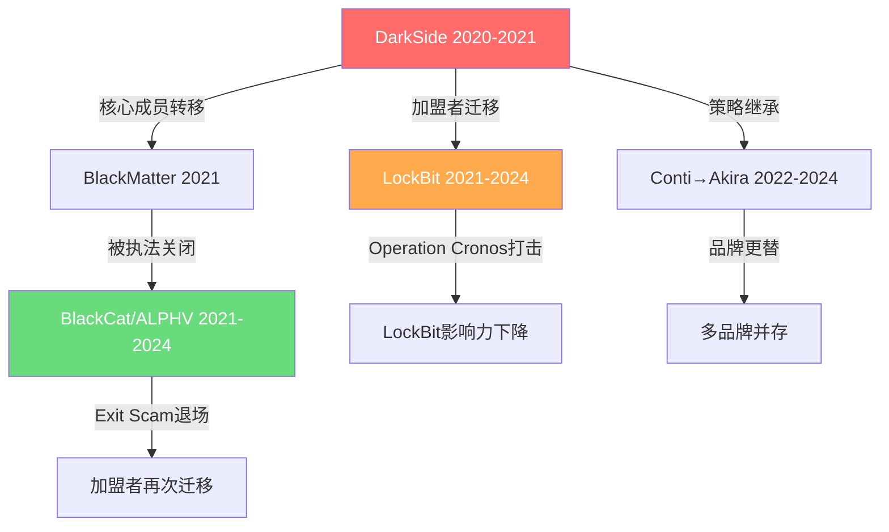
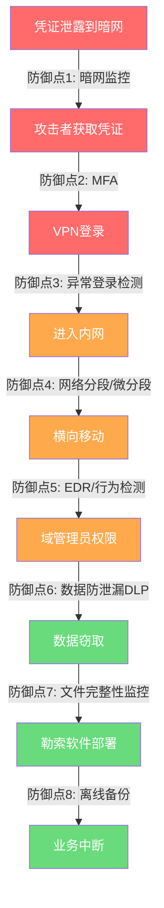

## 案例二：Colonial Pipeline勒索攻击（2021年）

### 案例概述

2021年5月7日，美国最大的燃油管道运营商Colonial Pipeline遭受DarkSide勒索软件攻击，导致美国东海岸约45%的燃油供应中断近一周。这次事件不仅是一次网络安全事故，更是一次动摇国家基础设施信心的危机——加油站排起长队、多州宣布紧急状态、航空燃油告急、汽油价格飙升至七年最高点。

这是有史以来关键基础设施遭受勒索攻击影响范围最广、社会冲击最深的案例之一，也是第一次让普通美国民众切身感受到"黑客能让你加不到油"的现实威胁。它彻底改变了全球对网络安全的认知——从"IT问题"升级为"国家安全问题"。

### 背景知识

#### Colonial Pipeline的基础设施地位

Colonial Pipeline运营着美国东海岸最重要的燃油输送管道系统：

| 指标 | 数据 |
|------|------|
| 管道长度 | 约8,850公里（5,500英里） |
| 起止点 | 德克萨斯州休斯顿 → 新泽西州林登 |
| 途经州份 | 12个州 + 华盛顿特区 |
| 运输能力 | 日均250万桶汽油、柴油、航空燃油 |
| 服务覆盖 | 美国东海岸约45%的燃油需求 |
| 上下游依赖 | 服务5,000万+终端用户 |
| 运营模式 | 仅负责管道输送，不生产石油；下游分销商、加油站、机场均依赖其运输 |

这家公司的运营中断意味着从佐治亚到纽约的整个东海岸燃油供应链被拦腰截断。这正是勒索者选中它的原因——越是不能停的系统，越愿意付钱恢复。

**关键理解：Colonial Pipeline的"管道-终端"模式意味着它是一个单点故障。** 美国东海岸没有等量的替代运输方式——铁路和公路的运力加起来不到管道的5%。这使得管道一旦停运，没有任何临时方案可以弥补缺口。

#### DarkSide勒索组织

DarkSide是一个以"专业化"著称的勒索软件即服务（RaaS，Ransomware-as-a-Service）运营组织，2020年8月首次出现在公众视野中。

**组织特征：**

- **运营模式**：RaaS——DarkSide开发并维护勒索软件，招募"加盟者"（affiliates）负责实际渗透和部署。赎金按比例分成，通常运营方拿20-25%，加盟者拿75-80%。这种模式让DarkSide无需亲自执行任何攻击就能持续获利，同时极大地扩展了攻击覆盖面。
- **目标选择**：明确声明不攻击医院、学校、政府和非营利组织，专注于大型营利性企业——并非出于道德，而是因为这些组织付得起高额赎金，且攻击它们引发的公众同情度最低。这种"精明"的目标筛选本身就是一个成熟的商业决策。
- **"企业化"运营**：拥有专门的新闻网站（DLSALT6kv2en42tmxstyvb6k4qgbvxc365c2isdc4ggtnhtg5e6xmxid.onion）用于公布被拒付赎金的受害者数据，有客服系统与受害者沟通，甚至提供"漏洞报告"——声称渗透目标网络后会告知其安全弱点。其宣传材料中甚至使用了"公司简介"式的PPT，包含使命宣言和运营理念。
- **技术背景**：核心成员被认为来自俄语区（前苏联国家），DarkSide本身基于REvil/Sodinokibi等前辈勒索软件的代码库演进，采用RSA+AES混合加密算法，几乎不可能暴力破解。
- **品牌演化**：DarkSide并非凭空出现，它是RaaS生态中的一个节点。在其之前有REvil、Maze、Ryuk；在其之后有LockBit、BlackCat/ALPHV、Cl0p。安全研究者普遍认为DarkSide的核心成员与后续多个组织存在技术传承关系。

#### 2021年的勒索软件威胁态势

理解这次事件需要放回到当时的大背景中：

- **2020-2021年是勒索软件的"黄金年代"**：赎金金额从数万美元飙升到数千万美元。2020年全球勒索软件赎金支付总额约为3.12亿美元（Chainalysis数据），2021年这一数字攀升至约6.02亿美元
- **COVID-19疫情推动远程办公**：VPN和远程桌面暴露面急剧扩大。据Gartner统计，2020年企业VPN使用量增长了约200%，但安全配置和监控能力并未同步提升
- **暗网凭证交易市场成熟**：泄露的VPN/邮箱账户可以以几美元的价格批量购买。Genesis Market等"反检测"市场允许购买已验证的浏览器指纹+凭证组合，大幅降低入侵门槛
- **加密货币为赎金支付提供匿名通道**：比特币和门罗币的广泛使用使得赎金收取变得相对"安全"
- **美国关键基础设施网络安全防御严重滞后**：大量关键基础设施运营商的IT安全预算不足、安全团队薄弱、遗留系统大量存在

### 攻击时间线

以下是经过公开报告、国会听证会证词和安全公司分析后重建的完整时间线：

```mermaid
timeline
    title Colonial Pipeline攻击完整时间线
    section 前期准备
        2021年4月 : 暗网凭证市场出现Colonial Pipeline员工VPN账户泄露凭证
    section 入侵与渗透
        5月6日 : 攻击者使用泄露凭证通过VPN接入内网
        5月6-7日 : 内网侦察、横向移动、权限提升
        5月7日 凌晨 : 窃取约100GB数据并部署DarkSide勒索软件
    section 危机爆发
        5月7日 05:30 : IT团队发现勒索信和系统加密
        5月7日 上午 : Colonial Pipeline决定关闭整条管道运营
        5月7日 晚间 : 支付75比特币赎金（约$4.4M）
    section 响应与恢复
        5月8日 : 多个联邦机构介入协调
        5月9日 : 管道仍处于关闭状态，东海岸开始恐慌性购油
        5月10日 : 宣布进入紧急状态的州数量增加
        5月12日 : 管道开始逐步恢复运营
        5月13日 : FBI公开确认DarkSide为攻击来源
    section 追回赎金
        6月7日 : FBI宣布成功追回约63.7比特币（约$2.3M）
```

**关键数据：从入侵到加密仅有约2天。** 这意味着防御方几乎没有时间在早期阶段发现和响应攻击。这也凸显了预防（而非检测和响应）在勒索软件防御中的核心地位。

### 攻击路径深度分析

#### 第一阶段：初始入侵——一个泄露的VPN账户

整个灾难的起点令人难以置信地简单：**一个旧的VPN账户**。

**技术细节：**

Colonial Pipeline使用Palo Alto Networks的Pulse Secure VPN设备供员工远程访问企业网络。Pulse Secure VPN（现更名为Ivanti Connect Secure）在2019-2021年间多次被曝出高危漏洞：

| CVE编号 | 漏洞描述 | CVSS评分 | 影响 |
|---------|---------|---------|------|
| CVE-2019-11510 | 任意文件读取漏洞 | 10.0（满分） | 可直接读取所有用户凭证 |
| CVE-2020-8218 | 认证绕过漏洞 | 7.5 | 无需有效凭证即可访问 |
| CVE-2021-22893 | 0day认证绕过漏洞 | 10.0（满分） | 被多个APT组织利用 |

虽然Colonial Pipeline被入侵并非直接因为这些漏洞（而是因为凭证泄露+无MFA），但Pulse Secure VPN长期存在的安全问题说明该平台的整体安全态势堪忧。

**关键问题分解：**

1. **账户来源**：该VPN账户属于一名前员工，已离职但账户未被禁用。这是身份与访问管理（IAM）中最基础也最常被忽视的问题——员工离职后，其系统账户必须立即清理。Colonial Pipeline后来承认，他们在员工离职流程中存在系统性的身份管理缺陷。
2. **密码泄露**：该账户的密码此前已在某次数据泄露事件中被公开（可能来自LinkedIn或其他平台的撞库泄露，也可能是该员工在其他网站使用了相同密码）。攻击者从暗网凭证交易市场以极低成本获得了这个密码——具体成本可能仅几美元。
3. **无多因素认证（MFA）**：这是最关键的失误。该VPN服务未启用MFA。即使密码泄露，如果启用了MFA，攻击者仍然无法登录。但因为没有MFA这道额外防线，泄露的用户名+密码就足以通过VPN进入企业内网。
4. **无异常登录检测**：来自异常IP地址或异常时间的VPN登录没有触发任何安全告警。安全团队对VPN登录行为缺乏监控和基线分析。
5. **无VPN安全加固**：未实施VPN设备的定期补丁管理，也未配置IP白名单限制VPN访问来源。

```text
攻击入口示意：

暗网凭证市场                    Colonial Pipeline VPN
┌──────────────┐               ┌──────────────────────┐
│ 员工凭证     │  ──────→     │ Pulse Secure VPN     │
│ 用户名:xxx   │  直接登录    │ ✗ 无MFA              │
│ 密码:xxx     │              │ ✗ 无异常登录检测      │
│ 来源:数据泄露 │              │ ✗ 离职账户未禁用      │
└──────────────┘              └──────────────────────┘
```

**教训延伸**：这不是一个"高级"漏洞，而是安全基线的全面失败。根据Verizon《2021数据泄露调查报告》（DBIR），81%的数据泄露涉及被盗或弱密码凭证。一个几美分的泄露凭证，加上一个未启用MFA的VPN，就能瘫痪一个年产值数十亿美元的基础设施。

**关于MFA的补充说明：** MFA并非万能防御。常见的MFA绕过技术包括：

| MFA类型 | 常见绕过方式 | 本案例中是否适用 |
|---------|------------|----------------|
| SMS验证码 | SIM Swap攻击（社工运营商） | 理论上可能，但需额外攻击步骤 |
| TOTP（Google Authenticator等） | 实时钓鱼代理（EvilProxy等） | 需要用户在钓鱼页面交互 |
| 推送通知 | 疲劳攻击（反复发送推送直到用户误点"同意"） | 2022年Uber事件证明可行 |
| 硬件安全密钥（YubiKey） | 几乎无法远程绕过 | 当前最强MFA方案 |

**结论：** 即使使用SMS MFA，攻击难度也会大幅增加。硬件安全密钥是最理想的方案。但在2021年的Colonial Pipeline案例中，连最基本的SMS MFA都没有启用。

#### 第二阶段：内网侦察与横向移动

一旦进入内网，攻击者展现了高度专业的渗透能力。

**侦察阶段（Reconnaissance）：**

攻击者进入内网后首先进行全面侦察，时间约为数小时至一天：

- **网络拓扑扫描**：使用内网扫描工具（如Advanced IP Scanner、SoftPerfect Network Scanner）绘制网络拓扑图
- **域信息收集**：通过LDAP查询、AD（Active Directory）枚举获取域控制器、用户组、计算机列表等信息
- **关键系统识别**：定位财务系统、备份服务器、域控制器、文件服务器等高价值目标
- **安全工具识别**：检查目标环境部署了哪些终端防护（EDR）、SIEM等安全产品，以规避检测
- **网络共享枚举**：扫描共享文件夹，寻找包含敏感信息的文档（如网络拓扑图、管理员密码文档、IT运维手册）

**横向移动（Lateral Movement）：**

攻击者使用一系列标准的渗透测试技术在内网中移动：

| 技术 | 工具/方法 | 目的 | 检测难度 |
|------|----------|------|---------|
| Pass-the-Hash | Mimikatz, Impacket | 利用窃取的哈希值进行身份认证 | 中等（需启用NTLM审计） |
| 远程代码执行 | PsExec, WMI, PowerShell Remoting | 在远程主机上执行命令 | 低-中（Sysmon可检测） |
| 凭证收集 | Mimikatz, SAM数据库提取 | 从内存或文件中提取更多凭证 | 中等（需EDR监控LSASS进程） |
| 权限提升 | Kerberoasting, Token模拟 | 获取域管理员权限 | 高（行为特征不明显） |
| Kerberos攻击 | AS-REP Roasting, Golden Ticket | 利用AD认证机制弱点 | 高（需日志分析） |

**权限提升到域管理员：**

攻击者最终获取了域管理员（Domain Admin）权限，这意味着他们可以：

- 访问域内所有计算机和服务器
- 修改任何用户的密码
- 部署软件到任何已加入域的机器
- 读取、修改或删除域内的任何数据
- 禁用安全产品和日志记录
- 创建新的隐藏管理员账户用于持久化

**关键认识：** 从VPN入口到域管理员权限，攻击者需要跨越的"跳跃数"取决于网络分段和AD安全配置。如果VPN用户被限制在隔离的DMZ区域，横向移动的难度将呈指数级增加。

#### 第三阶段：数据窃取（Double Extortion）

在部署勒索软件之前，DarkSide执行了"双重勒索"策略——先窃取数据，再加密系统。

**窃取规模**：约100GB数据被外传到DarkSide控制的服务器。

**为什么要在加密前窃取数据？** 这是2020-2021年勒索软件演化的核心策略转变：

1. **即使受害者有备份可以恢复，仍然面临数据泄露威胁**
2. 攻击者威胁公开敏感数据（商业机密、合同、财务信息、员工个人数据）
3. 这使得"不付赎金直接恢复"的策略失效，因为数据泄露的法律后果和声誉损失可能比赎金更高
4. 根据IBM《2021数据泄露成本报告》，数据泄露的平均成本为424万美元，其中涉及大量个人数据泄露的成本更高

**数据外传技术：**

- 使用Rclone、MEGAsync等合法云同步工具将数据上传——这些工具本身就是合法软件，不会被大多数安全产品标记为恶意
- 通过加密通道（HTTPS）传输以规避DLP（数据防泄漏）检测
- 选择凌晨时段执行，降低被发现的概率
- 数据量控制在合理范围内，避免触发流量异常告警

**双重勒索的经济逻辑：**

```text
传统勒索：加密 → 不付钱就删数据（但有备份可恢复）
                    → 受害者可以硬扛

双重勒索：窃取数据 → 加密 → 不付钱就公开数据（备份无法解决数据泄露）
                    → 受害者被迫支付
```

这使得勒索成功率大幅提升。据统计，2021年约有46%的受害者选择了支付赎金（Ponemon Institute数据），其中双重勒索是最重要的驱动因素之一。

#### 第四阶段：勒索软件部署

**部署时间**：2021年5月7日凌晨（美东时间约05:00）

DarkSide勒索软件的部署特征：

- **加密算法**：RSA-1024 + AES-256混合加密，每个文件使用唯一的AES密钥，AES密钥再用RSA公钥加密。在没有私钥的情况下，暴力破解在计算上不可行。RSA-1024虽然在密码学界被认为强度不够（当前推荐使用RSA-2048以上），但用于加密文件密钥绰绰有余——关键是RSA-1024的解密需要私钥，而私钥只有攻击者持有。
- **加密速度优化**：勒索软件支持多线程并行加密，可以在短时间内加密大量文件。DarkSide的加密器会根据CPU核心数动态调整线程数，以最大化加密速度。
- **文件目标**：加密文档、数据库、图片、虚拟机磁盘文件等高价值文件类型，跳过系统运行必需的文件（保证系统能启动以显示勒索信）。文件扩展名过滤列表通常包括：`.docx`, `.xlsx`, `.pdf`, `.jpg`, `.vmdk`, `.sql`, `.bak` 等。
- **卷影副本删除**：执行 `vssadmin delete shadows /all /quiet` 删除Windows卷影副本，使系统自带的"以前的版本"恢复功能失效
- **勒索信**：在每个加密目录下放置勒索信文件，包含暗网支付链接和联系方式
- **反分析措施**：检测虚拟机环境和沙箱，如果发现运行在分析环境中则不执行加密

**勒索信核心内容：**

- 声明已窃取100GB数据
- 提供暗网网站链接用于验证（攻击者会在其网站上公布部分数据作为证明）
- 要求75比特币赎金（当时约440万美元）
- 设定支付截止日期，逾期不付则公开全部数据
- 提供"技术支持"联系方式（暗网聊天窗口）
- 提供解密工具的"试用版"——允许解密少量文件以证明工具有效

### 决策与响应

#### Colonial Pipeline的应对决策

**关闭管道运营的决定**

发现攻击后，Colonial Pipeline CEO Joseph Blount做出的一个关键决定是——**主动关闭整条管道**。

这个决定的原因：

1. **IT/OT网络不隔离**：Colonial Pipeline的IT网络（办公系统、调度系统、计费系统）与OT网络（管道控制系统的工业控制系统/SCADA）之间没有足够的隔离。虽然DarkSide加密的是IT系统而非OT系统，但公司无法确认OT系统是否也已受到威胁。在工业控制环境中，"不确定就停下来"是唯一安全的选择——管道泄漏或压力失控的后果可能比断供更严重。
2. **运营安全考虑**：如果计费系统、调度系统被加密，公司无法准确追踪管道中燃油的位置、流量和客户交付信息，强行运营可能导致安全事故。
3. **信心缺失**：在无法确认OT系统完整性的前提下，继续运营意味着承担不可控的风险。

**赎金支付决定**

2021年5月7日晚间，Colonial Pipeline在FBI知情的情况下支付了75比特币赎金。

值得注意的是：

- CEO Joseph Blount后来在国会听证会上表示，支付赎金是他在不确定形势下做出的"正确决定"，因为他当时的首要责任是尽快恢复管道运营
- FBI的官方立场是不鼓励支付赎金（因为这会激励更多攻击），但也承认这是受害者的自主决定
- 支付赎金后，DarkSide提供了解密工具，但该工具的解密速度极慢——Colonial Pipeline最终主要依靠自己的备份进行恢复，而非攻击者的解密工具
- 支付赎金并未立即恢复运营——从支付赎金（5月7日晚间）到管道逐步恢复（5月12日）仍有约5天的延迟

**关于赎金支付的经济学分析：**

| 选项 | 优势 | 劣势 |
|------|------|------|
| 支付赎金 | 理论上可获得解密工具；可能缩短恢复时间 | 激励更多攻击；赎金可能无法追回；解密工具可能不可靠 |
| 不支付 | 不助长犯罪；保存资金用于恢复 | 恢复时间可能更长；数据可能被公开 |
| Colonial的选择 | 支付但主要靠备份恢复；FBI追回85%赎金 | 实际上支付赎金的"收益"有限 |

#### 联邦政府响应

这次事件触发了美国联邦政府最高级别的响应：

| 时间 | 响应机构 | 行动 |
|------|---------|------|
| 5月8日 | CISA（网络安全和基础设施安全局） | 发布紧急警报，协调技术响应 |
| 5月8日 | FBI | 启动调查，追踪攻击者 |
| 5月9日 | 白宫 | 成立跨部门应急协调小组 |
| 5月10日 | DOT联邦汽车运输安全管理局 | 发布紧急运输豁免令，允许公路运输燃油 |
| 5月10日 | 多个州政府 | 宣布进入紧急状态，解除燃油运输限制 |
| 5月12日 | 拜登总统 | 签署《改善国家网络安全行政命令》 |

#### 经济冲击与社会影响

管道停运期间的经济和社会影响远超一般人的想象：

- **汽油价格飙升**：美国全国平均汽油价格在一周内从每加仑$2.88攀升至$3.04，为2014年以来最高水平。东海岸部分地区涨幅更甚，个别州突破$3.50
- **恐慌性购油**：东海岸加油站出现排队数小时的现象，部分地区加油站燃油耗尽。据GasBuddy数据，5月12日全美约65%的加油站报告燃油短缺
- **航空业受波及**：亚特兰大哈茨菲尔德-杰克逊国际机场等主要枢纽机场面临航空燃油短缺威胁，多家航空公司开始调整航线以避免燃油不足
- **联邦紧急响应**：运输部发布紧急豁免令，允许燃油卡车跨州运输以部分弥补管道缺口。12个州+华盛顿特区先后宣布进入紧急状态
- **心理影响**：这次事件首次让美国公众意识到，网络攻击可以导致日常生活中的"基础设施停摆"，其社会心理影响远超一般的数据泄露事件

**经济成本估算：** 据多方分析，Colonial Pipeline事件造成的总经济损失（包括直接损失、供应链中断、紧急响应费用、股价下跌等）估计在数十亿美元级别。而Colonial Pipeline自身在网络安全重建方面的投入也在事件后大幅增加。

### 赎金追踪与追回

#### FBI的技术追踪

FBI追回赎金的过程是本案中技术含量最高的部分之一。

**追踪技术路径：**


**关键技术细节：**

1. **区块链透明性**：比特币虽然被广泛认为是"匿名"的，但实际上是"伪匿名"的——所有交易都公开记录在区块链上，可以被追踪。FBI和Chainalysis等区块链分析公司使用专门的工具，通过图分析、聚类分析和模式匹配来追踪资金流向。每一笔比特币交易的输入地址、输出地址、金额和时间戳都永久记录在链上。

2. **资金流向分析**：DarkSide将75比特币拆分并转入多个中间地址，试图通过"混币"（mixing）和多次转账来混淆资金来源。但每一笔链上交易都留下不可篡改的记录。区块链分析公司可以通过启发式算法（如共同输入启发式、找零地址检测）将多个地址关联到同一实体。

3. **关键突破——服务器访问**：FBI通过情报手段获得了DarkSide用于存储比特币的服务器的访问权限。具体如何获得这一权限，FBI至今未完全公开（有报道称是通过国际合作或网络情报行动获取了服务器的私钥）。这一步是整个追回行动的关键——即使你能在链上追踪资金，没有私钥就无法转移比特币。

4. **法律授权**：基于调查证据，FBI获得了法院的搜查令，从服务器中提取了比特币私钥，从而能够将存储在该地址上的约63.7比特币转出。

5. **追回金额**：63.7比特币（约230万美元），占总赎金的约85%。剩余约11.3比特币已在此之前被转移到其他地址，未能追回。

**这次追回的意义：**

- 这是美国联邦政府首次成功追回勒索软件赎金的重大案例
- 打破了"加密货币不可追踪"的神话
- 向勒索软件运营者发出了一个信号——即使支付了赎金，执法机构也可能追回
- 加密货币交易所的KYC（了解你的客户）合规要求在追踪中发挥了关键作用
- 证明了比特币的"伪匿名"特性使其在面对国家级执法能力时并不"安全"

**比特币追踪的技术限制：** 如果DarkSide使用门罗币（Monero）收取赎金，追踪难度将大幅增加。门罗币使用环签名、隐匿地址和机密交易（RingCT）等技术，使得交易金额、发送方和接收方都难以追踪。这也是为什么2021年后越来越多的勒索软件组织开始接受门罗币。但门罗币流动性较低，大额变现仍需通过交易所，这为执法提供了有限的追踪机会。

### DarkSide的终结与RaaS生态演化

#### DarkSide的瓦解

Colonial Pipeline事件的严重性远远超出了DarkSide的预期。这次攻击引发了前所未有的执法关注和政治压力：

- **基础设施下线**：2021年5月14日，DarkSide宣布关闭运营，声称其服务器被执法机构扣押，暗网支付网站和数据泄露网站均被下线。其Tor站点显示了一条简短的消息，宣布因"基础设施被扣押"而停止运营。
- **资金冻结**：多个加密货币交易所和钱包服务商在执法机构要求下冻结了与DarkSide相关的账户。据估计，被冻结的与DarkSide相关的加密货币总额超过数百万美元。
- **加盟者恐慌**：由于资金冻结和执法压力，DarkSide的加盟者纷纷逃离，部分转向REvil、LockBit等其他RaaS平台。这也暴露了RaaS模式的一个脆弱点——加盟者没有忠诚度，一旦平台出现问题，他们会立即转移到下一个"雇主"。
- **国际执法合作**：美国与欧洲多国（特别是德国和荷兰）加强了针对RaaS基础设施的联合打击行动。

**但DarkSide的"死亡"并不意味着威胁消失：**

核心成员很可能以其他品牌名重新出现。勒索软件组织就像割韭菜——一茬倒下，一茬又起。

#### RaaS生态的演化路径

DarkSide事件后，RaaS生态经历了快速的演化和洗牌：



**各组织特征对比：**

| 组织 | 活跃期 | 赎金要求范围 | 特征 | 最终状态 |
|------|--------|-------------|------|---------|
| DarkSide | 2020.8-2021.5 | $200K-$2M | "企业化"运营，声称不攻击关键基础设施 | 被执法关闭 |
| REvil/Sodinokibi | 2019-2021 | $250K-$700K | 高调运营，曾攻击Kaseya供应链 | 被执法关闭 |
| LockBit | 2020-2024 | $100K-$50M+ | 最高产的RaaS，加盟者网络庞大 | 2024年Operation Cronos重创 |
| BlackCat/ALPHV | 2021-2024 | $100K-$15M | 用Rust编写，跨平台（Windows/Linux） | 2024年Exit Scam退场 |
| Cl0p | 2019-present | $500K-$20M | 喜欢利用0day漏洞的供应链攻击 | 仍活跃 |

**RaaS模式的核心演化趋势：**

1. **加密技术升级**：从RSA+AES → 更多使用Rust/Go重写以提升性能和跨平台能力
2. **数据窃取成为标配**：双重勒索已不够，三重勒索（加密+数据泄露+DDoS）甚至四重勒索（加入通知受害者客户/合作伙伴）开始出现
3. **目标选择更精准**：利用0day漏洞和供应链攻击，追求高价值单次攻击
4. **规避执法意识增强**：使用更复杂的资金转移方式（多层跳转、DeFi混币）、分散服务器基础设施
5. **加盟者市场成熟**：出现"加盟者评级"机制，信誉好的加盟者获得更多资源和支持

### 政策与行业影响

#### 直接政策推动

Colonial Pipeline事件直接催生了一系列美国网络安全政策：

| 政策/措施 | 时间 | 核心内容 |
|-----------|------|---------|
| 《改善国家网络安全行政命令》 | 2021年5月12日 | 强制联邦供应商安全基线、建立网络安全审查委员会、推动零信任架构、加强信息共享 |
| TSA安全指令（管道） | 2021年5-7月 | 要求管道运营商报告网络安全事件、制定应急响应计划、任命网络安全协调员 |
| TSA安全指令（铁路/航空） | 2021年下半年 | 将网络安全要求扩展到其他交通基础设施 |
| 强制事件报告立法 | 2022年3月 | 关键基础设施运营商必须在72小时内报告重大网络安全事件 |
| 国家网络安全战略 | 2023年3月 | 提出"制造安全"原则、转移安全责任到供应商、构建网络弹性 |
| SEC网络安全披露规则 | 2023年7月 | 上市公司须在4个工作日内披露重大网络安全事件 |

#### 行业变革

1. **MFA普及加速**：事件后，大量企业紧急为远程访问服务部署MFA，VPN厂商也默认将MFA作为推荐配置。Gartner预测到2025年，60%以上的企业将使用零信任网络访问（ZTNA）替代传统VPN
2. **IT/OT隔离意识**：关键基础设施运营商开始重新审视IT网络与OT网络的隔离策略，单向数据二极管（Data Diode）等物理隔离方案的需求大幅增长
3. **零信任架构推进**：从"默认信任内网"转向"永不信任，持续验证"。NIST SP 800-207零信任架构指南的采用率显著提升
4. **备份策略升级**：3-2-1备份原则（3份副本、2种介质、1份离线/异地）成为行业标准，不可变备份（Immutable Backup）成为新要求
5. **勒索软件保险**：网络安全保险费率大幅上涨（2021年平均涨幅25-50%），部分保险公司开始排除勒索软件相关条款，或要求投保方满足特定安全基线（如必须部署MFA）
6. **供应链安全关注**：SolarWinds和Colonial Pipeline双重事件推动了软件供应链安全的立法和标准制定

### 技术防御复盘

#### 如果当时有更好的防御，攻击能被阻止在哪个环节？



图例：红色 = 此案中被突破的防线，橙色 = 部分缺失，绿色 = 可通过备份恢复

**任何一个环节的防御到位都可能阻止或显著减轻攻击后果：**

**防御点1——暗网凭证监控：** 定期扫描暗网和凭证泄露数据库，一旦发现企业员工凭证被泄露，立即强制重置密码并排查。成本低，效果好。推荐工具：SpyCloud, Recorded Future Identity Intelligence, Have I Been Pwned Enterprise API。实施建议：至少每周扫描一次，对高权限账户（管理员、VPN用户）每日扫描。

**防御点2——MFA：** 这是整个事件的"致命漏洞"。如果VPN启用了MFA（如TOTP、硬件安全密钥、推送通知），即使密码泄露，攻击者也无法登录。MFA的部署成本低（主流VPN产品均原生支持），但防护效果极高。优先级建议：P0级别——立即部署，无需评估。

**防御点3——异常登录检测：** 从未见过的IP地址、异常登录时间、非典型的登录地理位置——这些都可以通过SIEM规则或UEBA（用户与实体行为分析）系统检测。建议配置：VPN登录失败3次后锁定账户、非工作时间登录触发告警、新IP地址首次登录需二次验证。

**防御点4——网络分段：** 将VPN远程访问区域与核心业务系统、域控制器、备份服务器隔离，限制VPN用户的网络访问范围。在工业控制环境中，建议使用单向数据二极管实现IT/OT网络的物理隔离。

**防御点5——EDR/行为检测：** 现代终端检测与响应（EDR）产品能够检测Mimikatz、PsExec等横向移动工具的行为特征。推荐产品：CrowdStrike Falcon, Microsoft Defender for Endpoint, SentinelOne。关键配置：启用LSASS保护（防止凭证提取）、监控PowerShell异常执行、检测内网扫描行为。

**防御点6——DLP：** 数据防泄漏系统可以检测异常大量数据的外传行为。对于关键基础设施，建议监控所有外传流量（尤其是HTTPS上传到云存储的流量），并对异常数据量设置自动告警和阻断。

**防御点7——文件完整性监控：** 检测大规模文件修改（加密操作会触发大量文件修改）。推荐工具：OSSEC, Tripwire, Wazuh。关键配置：监控关键目录的文件修改速率，当单位时间内修改文件数超过阈值时触发告警。

**防御点8——离线备份：** 即使所有其他防御都失败，一份不连网的离线备份（如磁带备份、Air-gapped备份服务器）可以保证数据不会被加密销毁。关键要求：定期验证恢复能力（至少每季度一次完整的恢复演练），备份的完整性校验，RTO（恢复时间目标）和RPO（恢复点目标）的明确定义。

### 关键教训总结

#### 1. 安全基线决定成败

这次事件的核心教训极其简单：**一个泄露的密码 + 一个没有MFA的VPN = 一次国家级危机**。

安全基线不是可选项。对于任何面向互联网的服务（VPN、邮箱、远程桌面、云管理平台），MFA是必须的底线，不是"最好有"的附加功能。

#### 2. 不要假设"我们不会被选中"

DarkSide是一个经济驱动的犯罪组织。它的目标选择逻辑很简单：谁最不能承受停机、谁最可能付钱，就攻击谁。关键基础设施运营商因其"不可停机"的特性，是勒索攻击的首选目标。

#### 3. IT/OT隔离不是可选项

如果Colonial Pipeline的IT网络与OT网络有严格的隔离（如单向数据二极管、独立的安全域），那么IT系统被加密不会影响OT系统，公司不必关闭整条管道。在工业控制环境中，IT/OT隔离应该被视为和消防安全同等重要的基础设施要求。

#### 4. 备份策略必须假设最坏情况

如果备份服务器与生产网络相连，勒索软件同样会加密备份。离线备份（Air-gapped Backup）是最后的防线，必须定期验证恢复能力（不是"有备份"就够了，而是"能用备份恢复"才算数）。

#### 5. 人员管理是安全管理的一部分

离职员工账户未清理——这个看似"行政"问题实则是严重的安全漏洞。Identity Governance（身份治理）应该覆盖员工的完整生命周期：入职→在职→离职，每个阶段都有对应的身份管理流程。

#### 6. 赎金支付不是解决方案

Colonial Pipeline支付了440万美元赎金，但主要依靠自身备份恢复，而非DarkSide提供的解密工具（解密速度太慢）。FBI追回了约85%的赎金，但这是特例而非常态——根据Chainalysis数据，2021年全球勒索赎金支付约6.02亿美元，其中仅极小部分被追回。

支付赎金还面临另一个风险：向勒索者支付资金在某些司法管辖区可能触犯法律（如美国财政部OFAC制裁名单上的组织），且会鼓励更多的勒索攻击。2021年9月，美国财政部OFAC正式警告，向被制裁的勒索软件组织支付赎金的企业可能面临法律后果。

### 对攻防双方的启示

#### 对防御者

| 优先级 | 行动 | 投入 | 效果 |
|--------|------|------|------|
| P0 | 全面部署MFA | 低 | 极高（可直接阻止本案攻击） |
| P0 | 离线/不可变备份 | 中 | 极高（最后防线） |
| P1 | 暗网凭证监控 | 低-中 | 高（提前预警） |
| P1 | 网络分段/零信任 | 中-高 | 高（限制横向移动） |
| P1 | 身份生命周期管理 | 低 | 高（消除僵尸账户） |
| P2 | EDR部署与监控 | 中 | 高（检测横向移动） |
| P2 | 异常行为检测（UEBA） | 中 | 中-高（发现异常模式） |
| P3 | 数据防泄漏（DLP） | 中-高 | 中（检测数据外传） |

#### 对攻击者（从红队/威胁情报视角理解）

本案展示了现代勒索软件攻击的标准"剧本"（Playbook），这个模式在2021-2026年间被无数次复用：

1. **初始访问**：泄露凭证（购买）→ 未加固的远程访问服务（VPN/RDP）
2. **驻留**：Cobalt Strike等合法渗透工具（不易被杀毒软件标记）
3. **提升权限**：域控制器攻击（Pass-the-Hash、Kerberoasting、Zerologon等）
4. **横向移动**：利用域管理员权限在内网自由移动
5. **数据窃取**：在加密前外传数据（双重勒索）
6. **部署勒索**：批量部署加密，删除备份（卷影副本）
7. **勒索谈判**：暗网沟通，公布部分数据施压

理解攻击者的"剧本"是防御的前提——你不需要成为攻击者，但你需要知道他们的流程，才能在每个环节部署对应的防御措施。

### 地缘政治维度

Colonial Pipeline事件不仅是技术事件，也是地缘政治事件：

- **俄罗斯关联**：DarkSide核心成员被广泛认为位于俄罗斯或前苏联国家。俄罗斯政府长期以来对针对西方国家的网络犯罪持默许态度，只要这些犯罪组织不攻击俄罗斯境内目标
- **外交压力**：事件后，拜登政府向俄罗斯政府施压，要求其打击境内的勒索软件运营者。2021年6月，拜登与普京会晤时将勒索软件列为双边议题
- **俄罗斯的回应**：俄罗斯否认与DarkSide有关联，但此后确实逮捕了部分REvil成员（2022年1月），不过这些行动被广泛认为是外交姿态而非真正的执法决心
- **持续困境**：RaaS组织继续在俄语区运营，美国和欧洲的执法能力受到国家边界的严重限制。这一困境至今未得到根本解决

### 事件后续

- **Colonial Pipeline**：事件后大幅增加了网络安全投入，聘请了新的CISO（首席信息安全官），部署了零信任架构，并进行了全面的安全基础设施升级。公司还与CISA建立了直接的信息共享渠道。
- **Joseph Blount**（CEO）：在国会作证时表示承担全部责任，但强调支付赎金是"对国家正确的决定"。他在2021年底辞去了CEO职务。
- **DarkSide**：虽然名义上"关闭"，但安全研究者普遍认为其核心成员以其他品牌名继续运营。勒索软件即服务的商业模式并未因单个组织的关闭而消亡。
- **行业影响**：此事件成为网络安全培训和案例研究中的经典案例，被广泛用于论证MFA重要性、关键基础设施保护、以及勒索软件防御策略。其影响力远超同期的其他安全事件，是推动美国网络安全政策变革的最重要催化剂。

### 思考题

1. 如果Colonial Pipeline当时启用了MFA但使用的是SMS验证码，攻击者是否仍有可能突破？（提示：考虑SIM Swap攻击和SS7协议漏洞。SIM Swap攻击通过社工电信运营商将受害者手机号转移到攻击者控制的SIM卡上，成功率在暗网服务中可达60-80%。SS7协议漏洞则允许攻击者在不接触SIM卡的情况下拦截SMS验证码。）
2. FBI追回赎金依赖于区块链的透明性。如果DarkSide使用门罗币（Monero）而非比特币收取赎金，追踪难度会如何变化？（提示：门罗币使用环签名、隐匿地址和RingCT，交易金额、发送方和接收方都不可见。但门罗币流动性较低，大额变现仍需通过中心化交易所。）
3. Colonial Pipeline主动关闭管道的决定是否过度？在"安全"与"运营连续性"之间，你认为决策框架应该是什么？（提示：考虑OT环境的特殊性——管道泄漏或压力失控可能导致人员伤亡和环境灾难，其后果远超断供。）
4. 从经济学角度分析：为什么勒索软件攻击在2020-2021年间爆发式增长？哪些因素改变了"攻击者的成本-收益比"？（提示：考虑远程办公扩大攻击面、加密货币降低收款风险、RaaS降低技术门槛、双重勒索提高成功率等因素。）
5. DarkSide声称不攻击"关键基础设施"，但它攻击了Colonial Pipeline——这是世界上最大的关键基础设施之一。这说明了什么？（提示：勒索软件组织的"声明"不等于其行为准则，其目标选择本质上是经济驱动的。）
6. 本案例中，Colonial Pipeline从入侵到发现用了约2天，从发现到关闭管道用了不到12小时，但恢复却用了5天以上。这种不对称的"攻击快、恢复慢"模式意味着防御策略应该侧重哪个阶段？

***
