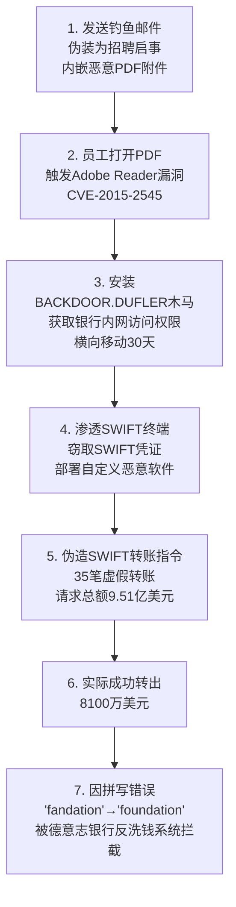
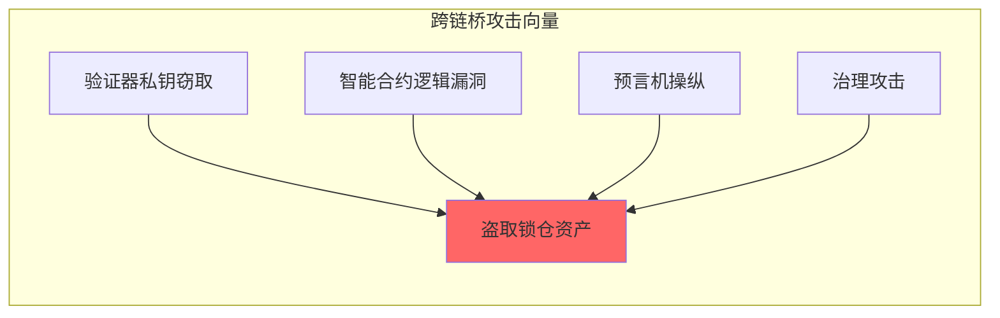
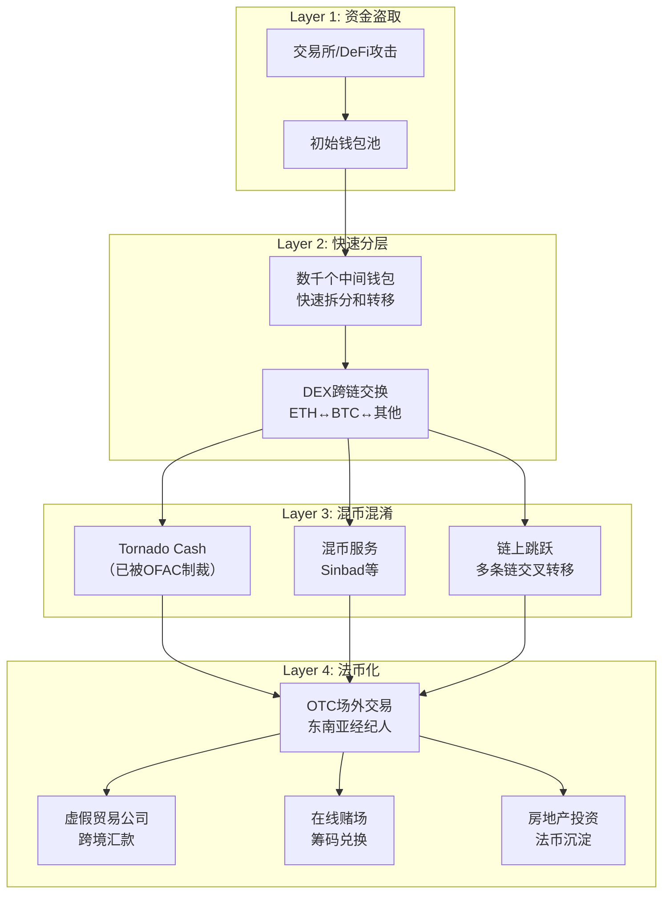

## 案例四：Lazarus Group的金融机构攻击（2016-2023年）

### 案例概览

| 维度 | 详情 |
|------|------|
| 组织名称 | Lazarus Group（又称 HIDDEN COBRA、ZINC、APT38、Bluenoroff） |
| 归属国家 | 朝鲜（DPRK） |
| 活跃时间 | 2009年至今 |
| 攻击动机 | 国家资助的经济掠夺，为朝鲜核武器和导弹计划筹集资金 |
| 估算盗取总额 | 2017-2024年间超过30亿美元加密货币 |
| 主要目标 | SWIFT银行系统、加密货币交易所、DeFi协议、跨链桥 |
| 制裁状态 | 被美国OFAC、联合国、欧盟等多个实体列入制裁名单 |

---

### 一、组织背景：全球最危险的金融黑客

#### 1.1 组织起源与演变

Lazarus Group最早可追溯至2009年的"和平卫士"（Operation Aurora）攻击，当时主要执行以情报窃取和破坏为目的的网络间谍活动。随着朝鲜面临越来越严厉的国际经济制裁，该组织的战略重心发生了根本性转变——从网络间谍转向网络金融犯罪。

2014年后，Lazarus Group进行了组织架构重组，分化为三个主要分支：

| 分支 | 代号 | 主要职责 |
|------|------|---------|
| 联合渗透部队 | Lazarus Group（狭义） | 侦察、初始入侵、社会工程 |
| 金融犯罪单位 | APT38 / Bluenoroff | SWIFT攻击、银行系统入侵、加密货币盗窃 |
| 信息战部队 | Bureau 121（部分人员） | 破坏性攻击（如WannaCry） |

其中，APT38是直接负责金融犯罪的单位。该单位大约有1,700名成员，每年为朝鲜政权贡献约10亿美元的非法收入，约占朝鲜年度GDP的近10%。

#### 1.2 攻击动机的经济学分析

理解Lazarus Group的攻击行为，必须从朝鲜的经济困境入手：

- **国际制裁**：联合国安理会自2006年起对朝鲜实施多轮制裁，特别是2017年的第2375号和第2397号决议，几乎切断了朝鲜所有合法的国际贸易渠道
- **武器资金需求**：朝鲜每年维持核武器和弹道导弹计划的估计费用为10-30亿美元
- **加密货币市场的特殊性**：去中心化加密货币天然适合制裁规避——传统金融体系中，跨境资金流动受到严格的合规审查（KYC/AML），但加密货币的匿名性和跨链特性为Lazarus Group提供了前所未有的洗钱通道
- **高回报、低风险**：网络犯罪的成功率远高于其他筹资方式，且由于朝鲜拥有主权国家的庇护，攻击者几乎不会面临刑事追诉风险

---

### 二、代表性攻击事件全景

#### 2.1 孟加拉国央行SWIFT攻击（2016年2月）

这是Lazarus Group金融攻击的标志性事件，也是历史上最大规模的银行盗窃未遂案之一。

**攻击链条还原：**

**关键数据：**

- 攻击者向纽约联储发送了35笔虚假转账指令
- 30笔被拦截（因格式错误或合规问题），5笔成功发出
- 成功转出的5笔中：3000万美元流向菲律宾RCBC银行的一个空壳账户，101万美元流向斯里兰卡Shakthi银行
- 菲律宾RCBC银行随后将资金投入赌场洗钱，最终仅追回约1500万美元
- 孟加拉国央行至今仅追回约1,700万美元，其余约6,300万美元仍然下落不明

**攻击中使用的恶意软件家族：**

| 恶意软件 | 功能 |
|----------|------|
| NEON、NESTEGG、DTRACK | 初始渗透、侦察、凭证窃取 |
| DYEPACK | SWIFT消息篡改、伪造转账指令 |
| DYEPACK变种 | 修改SWIFT Alliance Access软件的数据库记录，删除转账痕迹 |

这揭示了Lazarus Group的核心战术：不仅入侵系统，还修改系统日志来掩盖犯罪痕迹。攻击者在SWIFT终端上部署了定制恶意软件，该软件能够实时拦截并修改SWIFT Alliance Access软件的查询响应，使得银行管理员在事后调查时看不到任何异常交易记录。

#### 2.2 多国银行连续攻击（2016-2018年）

孟加拉国央行事件并非孤立行为。Lazarus Group在同一时期对全球多家金融机构发起了类似攻击：

| 时间 | 目标 | 试图盗取金额 | 结果 |
|------|------|-------------|------|
| 2015年12月 | 越南先锋商业银行（PVcomBank） | 1亿美元 | 失败——SWIFT请求被拒绝 |
| 2016年2月 | 孟加拉国央行 | 9.51亿美元 | 部分成功（8100万美元） |
| 2017年10月 | 台湾远东国际商业银行 | 6000万美元 | 部分成功（1300万美元） |
| 2018年 | 智利银行Redbanc | 未公开 | 失败——入侵过程中被发现 |

这些攻击使用了高度相似的技术栈——同一类SWIFT恶意软件变种、相同的社会工程手法、以及几乎一模一样的攻击流程。这表明Lazarus Group将SWIFT攻击实现了一定程度的"工业化"——并非每次都是从零开发，而是基于已有框架进行迭代优化。

#### 2.3 加密货币交易所攻击（2017-2023年）

随着加密货币市场的爆发式增长，Lazarus Group迅速将攻击重心转移到加密货币领域。加密货币对攻击者的优势在于：

- **不可逆交易**：区块链交易一旦确认无法撤销，不像银行转账可以冻结和回滚
- **匿名性**：虽然区块链是公开的，但通过混币器和跨链跳转可以有效混淆资金流向
- **监管薄弱**：许多加密货币交易所缺乏传统金融机构级别的安全措施
- **高流动性**：大型DeFi协议和跨链桥往往锁仓数十亿美元

**重大攻击事件时间线：**

| 年份 | 目标 | 盗取金额 | 攻击手法 |
|------|------|---------|---------|
| 2017年12月 | Youbit（韩国交易所） | 1700万美元 | 服务器入侵 |
| 2018年9月 | 一家未公开的韩国交易所 | 6000万美元 | 社会工程+供应链攻击 |
| 2020年 | DeFi项目 | 多起共数亿美元 | 智能合约漏洞利用 |
| 2022年3月 | Ronin Network（Axie Infinity） | 6.25亿美元 | 高级社会工程+私钥窃取 |
| 2022年6月 | Harmony Horizon Bridge | 1亿美元 | 多重签名机制漏洞 |
| 2023年6月 | Atomic Wallet | 1亿美元 | 应用程序漏洞 |
| 2023年9月 | Stake.com | 4100万美元 | 私钥管理漏洞 |
| 2024年1月 | PlayDapp | 2.9亿美元 | 智能合约升级权限漏洞 |

其中，Ronin Network事件是加密货币史上最大规模的单笔盗窃：

**Ronin Network攻击还原：**

攻击者首先通过LinkedIn联系了一名Ronin Network工程师，以"顶级科技公司"的名义发送了一份虚假的招聘邀请。工程师下载了这份伪装为招聘信息的PDF文档，触发了系统中的恶意代码。攻击者在数月内持续渗透，最终窃取了5个验证节点中的4个私钥（包括通过社会工程入侵的Axie DAO节点），从而控制了Ronin Bridge的多签名验证机制，盗走了17.36万枚ETH和2,550万枚USDC，总计约6.25亿美元。

#### 2.4 跨链桥攻击的系统性模式

跨链桥是DeFi生态中最脆弱的环节之一，Lazarus Group对其进行了系统性的研究和攻击：

跨链桥之所以成为首选目标，是因为它们通常锁定了大量资金（数十亿美元级别），同时其安全架构面临"去中心化三难困境"——在安全性、去中心化和效率之间难以兼顾。攻击者只需攻破相对较少的验证节点即可控制整个桥的资金流动。

---

### 三、技术战术深度剖析

#### 3.1 初始访问策略

Lazarus Group的初始访问策略呈现出高度的针对性和创造性：

**社会工程学攻击（主要手段）：**

1. **虚假招聘信息**（最高频）：通过LinkedIn联系目标企业的IT和安全人员，发送带有恶意附件的"职位描述"或"技术评估"。2023年Check Point的研究报告指出，Lazarus Group运营了大量虚假LinkedIn个人资料，涵盖前端工程师、区块链开发者、安全研究员等多种角色
2. **虚假会议邀请**：冒充行业会议或技术研讨会，通过Zoom、Teams等平台的漏洞投放恶意载荷
3. **供应链攻击**：入侵开发者工具链（如npm包、PyPI包），在合法软件中植入后门。2023年针对加密货币开发者的3CX供应链攻击事件中，Lazarus Group通过伪造的npm包植入了信息窃取木马
4. **水坑攻击**：入侵目标频繁访问的技术论坛和行业网站，植入浏览器漏洞利用代码

**技术利用：**

| 技术 | 具体漏洞 | 影响范围 |
|------|---------|---------|
| 0-day | Adobe Reader (CVE-2015-2545) | 孟加拉国央行 |
| Chrome零日 | CVE-2022-0609 | 加密货币公司员工 |
| 3CX供应链 | 恶意DLL注入 | 加密货币行业 |
| npm供应链 | 伪造npm包 | Web3开发者 |

#### 3.2 横向移动与持久化

进入内网后，Lazarus Group采用以下技术栈实现持久化和横向移动：

- **定制后门**：MATA框架（跨平台恶意软件套件，支持Windows、Linux、macOS）、DTrack后门、Valefor信息窃取器
- **合法工具滥用**：Cobalt Strike、AnyDesk、TeamViewer等商业远程工具被武器化使用
- **凭证窃取**：通过lsass内存转储、Kerberoasting等技术获取域管理员凭证
- **跳板基础设施**：使用被入侵的合法服务器和商业VPS服务作为C2基础设施，避免触发异常流量告警

#### 3.3 智能合约漏洞利用

针对DeFi协议，Lazarus Group展现了深度的区块链技术理解：

**常见攻击模式：**

1. **私钥窃取**：通过社会工程获取开发者或管理员的私钥，直接控制合约升级权限
2. **逻辑漏洞利用**：利用智能合约中的重入攻击（reentrancy）、整数溢出等经典漏洞
3. **预言机操纵**：通过闪电贷（flash loan）操纵价格预言机，制造异常价格波动
4. **时间锁绕过**：利用治理机制中的时间锁漏洞，在锁定期内完成恶意操作

#### 3.4 恶意软件武器库

Lazarus Group维护着一个庞大且持续演进的恶意软件武器库：

| 类别 | 名称 | 用途 |
|------|------|------|
| 初始渗透 | BLINDINGCAN (DRATZIAR) | 远程访问木马 |
| 信息窃取 | VIVACIOUS GOLF | 凭证和浏览器数据窃取 |
| 横向移动 | MATA (跨平台) | 内网渗透和持久化 |
| SWIFT攻击 | DYEPACK | 转账指令篡改 |
| 加密货币 | TraderTraitor | 针对交易所员工的社交工程 |
| C2通信 | BLINDINGCAN变种 | 加密C2通信 |
| 破坏性 | HOPLIGHT | 数据破坏和勒索 |

---

### 四、洗钱网络：全球最复杂的加密货币洗钱体系

#### 4.1 洗钱架构全景

Lazarus Group建立了一套多层级、多路径的洗钱网络，被安全研究机构Chainalysis称为"迄今所见最复杂的加密货币洗钱体系"：

#### 4.2 Tornado Cash的关键角色

Tornado Cash是以太坊上的一个去中心化混币协议，能够打破区块链上的交易可追溯性。用户将资金存入Tornado Cash的智能合约池，经过一定时间后从另一个地址提取等额资金（扣除手续费），外部观察者无法将存入和提取操作关联起来。

Lazarus Group是Tornado Cash的重度用户。根据Chainalysis的数据，2022年被盗资金中约65%的清洗路径涉及Tornado Cash。2022年8月，美国OFAC将Tornado Cash列入SDN制裁名单，但该协议的去中心化特性使其难以完全关停——即使开发者被逮捕，智能合约仍在链上持续运行。

**替代洗钱方案：** Tornado Cash被制裁后，Lazarus Group转向了以下替代路径：
- **Sinbad**：另一个混币服务，后被执法机构查封
- **跨链桥混币**：利用去中心化跨链桥在不同区块链间转移资金，增加追踪难度
- **TRON链USDT**：利用TRON网络的低手续费和高吞吐量进行大规模USDT转移

#### 4.3 资金最终流向

被盗资金经过多层清洗后，最终回流到朝鲜的方式包括：

- **虚假贸易公司**：通过在东南亚（特别是中国、马来西亚、老挝）设立的壳公司进行虚假进出口贸易
- **赌场洗钱**：在菲律宾、柬埔寨等国的线上赌场通过购买和赎回筹码实现洗钱
- **矿场投资**：利用被盗的加密货币购买或运营加密货币矿场，将非法资金转化为"合法"的挖矿收入
- **房地产**：在东南亚和中东地区购买商业地产和住宅

---

### 五、防御启示与最佳实践

#### 5.1 对金融机构的防御建议

**SWIFT系统安全：**

1. **网络隔离**：SWIFT终端必须部署在独立的、隔离的网络段中，与企业内网严格分离
2. **双重确认机制**：所有大额转账必须通过独立的、第二方通道进行人工确认
3. **日志完整性**：部署独立的日志管理系统，确保SWIFT操作日志不可被篡改
4. **异常检测**：部署基于机器学习的交易行为分析系统，检测非正常时段、异常金额的转账请求

**加密货币项目安全：**

| 防护层 | 具体措施 |
|--------|---------|
| 密钥管理 | 使用硬件安全模块（HSM）或多签钱包存储私钥；避免单点故障 |
| 智能合约审计 | 上线前经过至少2家独立安全公司的审计；建立漏洞赏金计划 |
| 多重签名 | DeFi协议要求至少4/7或5/9的多重签名才能执行大额操作 |
| 时间锁 | 合约升级和关键操作设置48小时以上的延迟时间锁 |
| 监控告警 | 部署链上监控系统（如Forta、OpenZeppelin Defender），实时检测异常交易 |
| 员工安全 | 定期安全意识培训，禁止在工作设备上安装未授权软件 |

#### 5.2 对个人开发者和用户的建议

1. **警惕社交工程**：不打开来源不明的LinkedIn消息、邮件附件和文件
2. **隔离工作环境**：开发私钥管理和签名的机器必须是专用的，不进行日常浏览
3. **验证来源**：下载npm包、依赖库前验证发布者身份和包的完整性
4. **硬件钱包**：大额加密资产使用硬件钱包存储，不存放在交易所
5. **多因素认证**：所有加密货币账户启用硬件安全密钥（如YubiKey）的MFA

#### 5.3 威胁情报共享

Lazarus Group的攻击具有高度的可检测性——他们会在不同攻击中重用基础设施、恶意软件代码和战术模式。因此，跨行业、跨国界的威胁情报共享至关重要：

- **恶意软件指标（IoC）**：及时共享Lazarus Group使用的C2域名、IP地址、恶意文件哈希
- **战术模式（TTPs）**：记录并共享攻击者的行为模式，帮助其他机构提前预警
- **链上分析数据**：加密货币行业应共享被盗资金的地址标签和交易追踪数据

---

### 六、Lazarus Group攻击模式的深层分析

#### 6.1 组织能力评估

与传统的网络犯罪组织相比，Lazarus Group具有独特的竞争优势：

| 维度 | Lazarus Group | 传统犯罪组织 |
|------|--------------|-------------|
| 资金支持 | 国家级资源 | 依赖犯罪收入 |
| 人才规模 | 1700+名专业人员 | 通常数十人 |
| 风险承受 | 主权国家庇护 | 面临执法打击 |
| 目标选择 | 长期战略规划 | 机会主义 |
| 攻击持久性 | 可持续数月至数年 | 通常数天至数周 |
| 技术研发投入 | 持续开发定制工具 | 主要依赖现成工具 |

#### 6.2 攻击的工业化特征

Lazarus Group的金融攻击已展现出"工业化"特征：

1. **标准化攻击框架**：同一套攻击模板（侦察→社会工程→初始渗透→横向移动→目标达成→洗钱）被反复应用于不同目标
2. **内部知识库**：安全研究人员在分析中发现，Lazarus Group内部维护着针对不同区块链、不同DeFi协议的技术文档
3. **流水线式运营**：攻击链的各个环节（信息收集、钓鱼制作、漏洞开发、洗钱转移）由不同的子团队并行执行

#### 6.3 未来威胁趋势

基于Lazarus Group近年的行为模式，以下趋势值得关注：

1. **AI增强的社会工程**：利用大语言模型生成更逼真的钓鱼内容和虚假身份，降低社会工程攻击的成本和被识别风险
2. **跨链DeFi攻击**：随着跨链协议和桥接技术的成熟，攻击面将持续扩大
3. **新型加密资产**：Lazarus Group可能转向攻击NFT市场、GameFi协议等新兴加密资产类别
4. **Web3身份攻击**：针对DAO治理投票、去中心化身份验证（DID）等新型Web3基础设施的攻击
5. **传统金融回归**：在加密货币行业加强监管后，Lazarus Group可能重新加强针对传统银行SWIFT系统的攻击

---

### 七、本案例的关键教训

1. **攻击者的资源和动机是最关键的风险变量**：Lazarus Group之所以成为最危险的金融威胁，不仅因为技术能力，更因为背后有国家级的资源支持和持续的筹资压力
2. **社会工程仍然是最有效的攻击入口**：无论技术防御多先进，一个被说服的内部人员就能绕过所有技术壁垒
3. **金融安全是一个系统工程**：从端点防护到网络隔离，从密钥管理到交易监控，任何单一环节的薄弱都可能导致整体防线崩溃
4. **链上资金追踪是可能的，但极其困难**：区块链的透明性为追踪提供了便利，但混币器和跨链跳转大大增加了追踪难度
5. **防御需要行业协作**：面对Lazarus Group这样的国家级威胁，任何单一组织都无法独自应对，需要情报共享、联合防御和跨国执法协作
