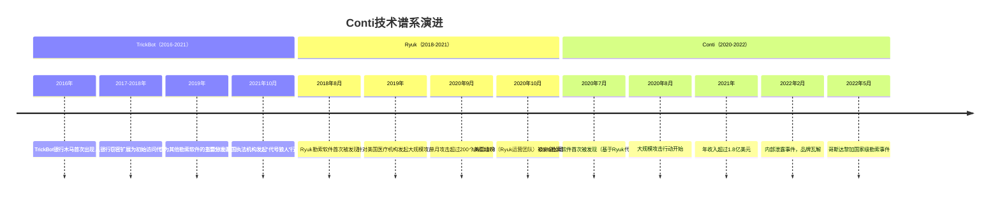
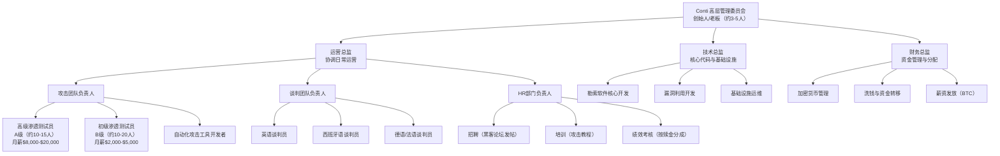
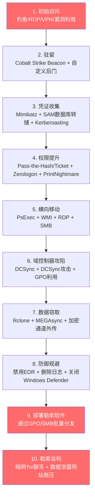
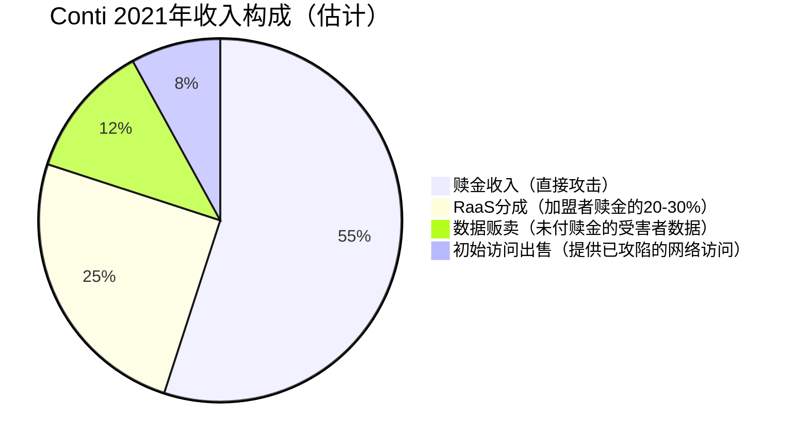
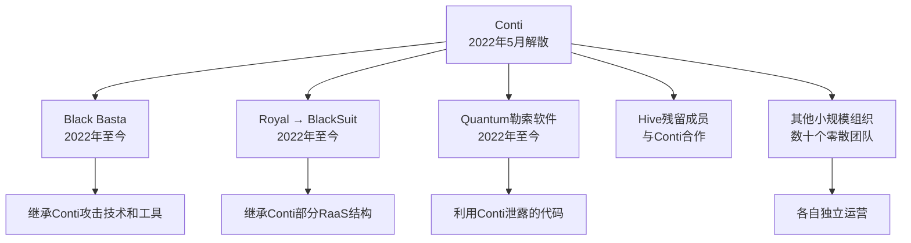

## 案例五：Conti勒索软件集团（2020-2022年）

### 案例概述

Conti是2020-2022年间全球最活跃、最具组织性、收入最高的勒索软件犯罪集团之一。与传统印象中"独狼黑客"不同，Conti的运营模式高度企业化——拥有完整的管理层级、HR招聘体系、研发团队、攻击团队、谈判团队和财务部门，其组织结构堪比一家中型科技公司。

在不到三年的活跃期内，Conti通过勒索软件攻击、双重勒索和数据贩卖累计获取超过**1.5亿美元**赎金，攻击了包括医疗、教育、政府、制造、能源在内的几乎所有关键行业。2022年2月，一名乌克兰籍内部成员出于对Conti公开支持俄罗斯入侵乌克兰的愤怒，泄露了超过**60,000条内部聊天记录和源代码**，为安全研究社区提供了前所未有的了解勒索软件组织内部运作的机会，也直接导致了Conti品牌的瓦解。

这是研究"犯罪即服务"（Crime-as-a-Service）商业模式、勒索软件组织社会工程学、以及网络犯罪集团治理结构的最佳案例。

### 前身与演进：从TrickBot到Ryuk再到Conti

要理解Conti，必须追溯其技术谱系——它并非凭空出现，而是在一条清晰的恶意软件演进链上迭代而来。

#### 演进时间线



#### 三者的传承关系

| 项目 | TrickBot | Ryuk | Conti |
|------|----------|------|-------|
| **类型** | 银行木马/初始访问代理 | 勒索软件 | 勒索软件（Ryuk v3） |
| **活跃期** | 2016-2021 | 2018-2021 | 2020-2022 |
| **核心功能** | 凭证窃取、横向移动、模块化后门 | 目标定向加密 | 目标定向加密+双重勒索 |
| **传播方式** | 钓鱼邮件、漏洞利用、RDP暴力破解 | 通过TrickBot/Emonic/Bazar后门部署 | 通过TrickBot/Bazar/社会工程+外部VPN |
| **加密算法** | N/A | RSA-4096 + AES-256 | RSA-4096 + AES-256（改进版） |
| **运营模式** | 犯罪即服务 | 定向攻击（无RaaS） | RaaS+内部团队混合 |
| **赎金规模** | N/A | $100K-$12.5M | $200K-$25M+ |

Conti的代码库直接继承自Ryuk，安全研究者通过代码比对发现两者有**约80%的代码相似度**。Ryuk使用TrickBot作为初始入侵通道，而Conti在TrickBot的基础上进一步发展，采用了更自主的入侵策略，不再完全依赖TrickBot的分发网络。

### 组织架构：勒索软件界的"500强企业"

Conti泄露的内部聊天记录揭示了一个令人震惊的事实——这个犯罪集团的组织结构之复杂、分工之精细，远超外界想象。

#### 完整组织结构图



#### 基于泄露数据的组织细节

| 维度 | 具体信息 |
|------|----------|
| **总人数** | 估计100-200人（含核心成员与外包） |
| **核心管理层** | 约10-15人，均为俄语区人员 |
| **攻击团队** | 20-35名渗透测试员，分A/B两级 |
| **谈判团队** | 多语种配置，至少英语/西班牙语/德语 |
| **开发团队** | 约10-15名高级开发者 |
| **工作语言** | 俄语为主，部分英语沟通 |
| **办公工具** | Jabber XMPP即时通信、内部论坛 |
| **薪资结构** | 基本工资+赎金分成（攻击者拿30-40%，平台拿60-70%） |
| **绩效体系** | 月度KPI考核，未达标者降级或淘汰 |

#### 攻击者等级制度

泄露聊天记录显示，Conti内部对渗透测试员有明确的分级体系：

| 等级 | 能力要求 | 月薪范围 | 分成比例 | 典型任务 |
|------|----------|----------|----------|----------|
| **A级（高级）** | 独立完成从初始入侵到域管理员的完整攻击链 | $8,000-$20,000 | 赎金的30-40% | 大型企业、关键基础设施 |
| **B级（初级）** | 需要指导或依赖预配置工具 | $2,000-$5,000 | 赎金的20-25% | 中小企业、简单目标 |
| **实习生** | 学习阶段，执行辅助任务 | $500-$1,500 | 无或极低 | 信息收集、漏洞扫描 |

这种分级制度意味着Conti不仅是一个犯罪组织，更是一个**人才培养和管理体系**——他们投资于培训、知识管理和能力评估。

### 攻击技术栈与TTPs

Conti的攻击能力在勒索软件组织中属于顶尖水平。以下基于泄露数据和安全研究分析其完整攻击链。

#### 初始访问（Initial Access）

Conti采用多种初始访问方式，与大多数依赖单一入口的勒索软件组织形成鲜明对比：

| 初始访问方式 | 占比（估计） | 技术细节 |
|-------------|-------------|----------|
| **钓鱼邮件+恶意附件** | 35-40% | 使用Emotet/TrickBot/BazarLoader作为载荷，伪装为发票、HR文件、快递通知 |
| **RDP暴力破解** | 20-25% | 使用内部开发的RDP爆破工具，目标为暴露在互联网上的RDP服务 |
| **VPN凭证利用** | 15-20% | 购买暗网泄露的VPN凭证（Pulse Secure、Fortinet、Citrix） |
| **漏洞利用** | 10-15% | 利用Microsoft Exchange ProxyLogon/ProxyShell、FortiOS、SonicWall漏洞 |
| **社会工程** | 5-10% | 冒充IT支持远程指导员工安装"安全更新"实为后门 |

#### 完整攻击链（Kill Chain）



#### 核心工具链

泄露数据揭示了Conti使用的完整工具链，这些工具既有商业渗透测试产品，也有内部开发的定制工具：

**商业/开源渗透工具：**
- **Cobalt Strike**：主力C2框架，使用大量自定义配置和Loader以规避检测
- **Mimikatz**：凭证提取（LSASS内存、SAM数据库、Kerberos票据）
- **BloodHound**：Active Directory攻击路径分析
- **PsExec/WMI**：远程命令执行
- **Rclone**：数据外传（伪装为合法云同步工具）
- **Process Hacker**：进程管理和EDR检测

**内部开发工具（泄露后被安全社区分析）：**
- **Conti Loader**：定制化的Cobalt Strike Loader，使用多种混淆技术
- **Active Directory利用工具集**：自动化域控制器攻击
- **RDP暴力破解器**：针对暴露RDP的高速爆破工具
- **网络扫描器**：内网资产自动发现和分类
- **勒索软件部署器**：通过GPO、SMB或WMI批量分发加密器

#### 加密技术

Conti的加密实现经过多代演进，是勒索软件领域技术含量最高的之一：

| 特征 | 技术细节 |
|------|----------|
| **加密算法** | RSA-4096 + AES-256-CBC 混合加密 |
| **密钥管理** | 每个文件生成唯一AES密钥，用RSA公钥加密AES密钥 |
| **加密速度** | 支持多线程并行加密，1GB文件约15-30秒 |
| **文件选择** | 加密文档、数据库、虚拟机磁盘等高价值文件；跳过系统文件（保证勒索信可显示） |
| **安全擦除** | 加密完成后安全擦除原始文件（多次覆写后删除） |
| **反恢复** | 删除Windows卷影副本（vssadmin delete shadows） |
| **反分析** | 检测虚拟机环境、调试器、特定安全产品进程，条件触发后退出 |
| **配置选项** | 可通过参数配置跳过特定目录、文件类型，支持域控制器和备份服务器优先加密 |

2021年下半年，Conti引入了**"3层加密"**选项（triple encryption）——对已被其他勒索软件加密的文件再次加密，这意味着即使受害者与其他勒索组织谈判后获得了部分解密，Conti的加密仍然有效。

### 重大攻击事件

#### 哥斯达黎加国家级勒索（2022年4-5月）

这是Conti最具破坏性的攻击之一，也是历史上第一次勒索软件攻击直接导致一个主权国家进入紧急状态。

**攻击时间线：**

| 日期 | 事件 |
|------|------|
| 2022年4月 | Conti入侵哥斯达黎加财政部（Ministerio de Hacienda）系统 |
| 2022年4月18日 | 哥斯达黎加政府首次公开确认遭受勒索软件攻击 |
| 2022年4月29日 | Conti将赎金从$10M提高到$20M，并威胁72小时内公开被盗数据 |
| 2022年5月1日 | Conti宣布入侵哥斯达黎加社保局（CCSS）系统 |
| 2022年5月7日 | 哥斯达黎加总统宣布全国紧急状态 |
| 2022年5月19日 | Conti将赎金提高到$30M（总计） |
| 2022年5月23日 | 部分政府服务开始逐步恢复 |
| 2022年5月底 | Conti正式解散，品牌废弃 |

**影响范围：**
- **财政部瘫痪**：海关系统、税务系统、国库管理系统全部宕机，进出口贸易停滞
- **社保局中断**：超过300万公民的社保记录无法访问，医疗保险支付暂停
- **教育系统受损**：学校网络关闭，远程教学中断
- **经济损失**：估计超过**1亿美元**，远超Conti索要的赎金
- **政治影响**：新当选的总统Rodrigo Chaves将此事件作为就职演说的核心议题

**关键教训：** Conti对哥斯达黎加的攻击证明了一个危险趋势——勒索软件组织已经不再回避攻击主权国家政府。当一个组织敢公开勒索一个国家并导致其进入紧急状态时，传统的网络安全范式需要被彻底重新审视。

#### 爱尔兰HSE医疗系统攻击（2021年5月）

| 指标 | 数据 |
|------|------|
| 受攻击机构 | 爱尔兰健康服务执行局（HSE），管理全国公共医疗 |
| 攻击日期 | 2021年5月14日 |
| 影响范围 | 全爱尔兰公共医疗系统，70+医院，500+诊所 |
| 业务中断 | 6周以上，部分系统恢复耗时4个月 |
| 数据泄露 | 约80GB，含患者个人数据和医疗记录 |
| 赎金要求 | $20M（HSE拒绝支付） |
| 恢复方式 | 完全依赖自身备份和人工流程 |

这次攻击的特殊之处在于：Conti在攻击后**主动提供了解密密钥**——安全研究者认为这是因为攻击医疗系统引发了Conti内部的道德争议（泄露聊天记录显示部分成员对攻击医院持反对态度），但这一说法仍有争议。

#### 其他重大攻击

| 受害者 | 行业 | 赎金（估计） | 影响 |
|--------|------|-------------|------|
| **Costa Rica政府** | 政府 | $30M（最终未付） | 全国紧急状态 |
| **Accenture** | 咨询 | $50M | 数据泄露，部分客户受影响 |
| **Bangkok Airways** | 航空 | 未公开 | 乘客数据泄露 |
| **Konica Minolta** | 制造 | 未公开 | 美国分部系统加密 |
| **Multiple US hospitals** | 医疗 | $100K-$500K | 部分医院手术取消 |
| **New Zealand Parliament** | 政府 | 未公开 | 部分系统加密 |

### 财务模型深度分析

#### 收入结构

基于泄露数据和安全研究，Conti的年收入结构如下：



**具体数字：**
- 2021年总收入估计：**$180M-$210M**
- 月均收入：**$15M-$17.5M**
- 最高单笔赎金：$25M（未公开具体受害者）
- 平均赎金：$1.2M-$2M
- RaaS加盟者数量：估计20-50个活跃加盟者

#### 成本结构

| 成本项 | 月均支出（估计） | 占收入比 |
|--------|-----------------|----------|
| **核心员工薪资** | $300K-$500K | 2-3% |
| **攻击者分成** | $2M-$4M | 15-25% |
| **基础设施维护** | $50K-$100K | <1% |
| **初始访问购买** | $100K-$300K | 1-2% |
| **洗钱费用** | 15-25%（通过混币器/交易所） | 15-25% |
| **工具开发** | $50K-$150K | <1% |
| **管理开销** | $100K-$200K | 1% |
| **总运营成本** | 约$3M-$5M/月 | 25-35% |
| **净利润** | 约$10M-$12M/月 | 65-75% |

#### 洗钱与资金转移

Conti的洗钱操作是其运营中技术含量最高的环节之一：

**资金转移路径：**
1. 受害者支付BTC到Conti控制的地址
2. 通过自动化脚本将BTC分散到多个中间钱包
3. 使用混币服务（Wasabi Wallet CoinJoin、Tornado Cash等）混淆资金来源
4. 部分BTC通过中心化交易所（使用虚假KYC身份）兑换为USDT
5. 最终以BTC/USDT/现金形式分配给管理层和攻击者

**泄露数据中的财务记录显示：**
- Conti使用多层钱包架构，资金在到达最终接收者之前经过5-8次转移
- 洗钱费用率约15-25%，是运营成本中最大的单项
- 部分资金通过格鲁吉亚和亚美尼亚的地下银行网络进行法币兑换
- 高管通过多个离岸公司进行"合法化"投资

### 内部泄露：犯罪帝国的崩塌

#### 泄露事件始末

2022年2月25日，Conti在其暗网博客上发布了一条简短声明，公开支持俄罗斯对乌克兰的军事行动。这条声明引发了灾难性的内部后果：

| 时间 | 事件 |
|------|------|
| 2022年2月25日 | Conti在Tor网站发布支持俄罗斯入侵乌克兰的声明 |
| 2022年2月27日 | 一名乌克兰籍管理员开始通过Twitter账号@ContiLeaks泄露内部聊天记录 |
| 2022年2月27-28日 | 第一批泄露数据：约60,000条内部Jabber聊天记录 |
| 2022年3月1日 | 第二批泄露：Conti源代码（约56MB） |
| 2022年3月-10月 | 后续多批数据持续泄露，总计超过170,000条消息 |
| 2022年5月 | Conti正式解散品牌，成员分散 |

#### 泄露内容分析

泄露的数据为安全研究社区提供了前所未有的情报价值：

**1. 聊天记录（约170,000条）**
- 内部沟通的完整记录，涵盖攻击讨论、薪资谈判、技术问题解决
- 高管之间的权力斗争和利益分配纠纷
- 部分成员对攻击目标选择的道德争议
- 对执法行动的应对策略讨论

**2. 源代码**
- Conti勒索软件的完整代码库
- 自定义Cobalt Strike配置和Loader
- 内部开发的攻击工具集
- 自动化攻击框架

**3. 运营文档**
- 攻击战术手册和最佳实践
- 新员工培训材料
- 目标评估和优先级排序标准
- 财务记录和薪资分配表

#### 关键情报发现

安全研究社区通过分析泄露数据得出的重要结论：

| 发现 | 意义 |
|------|------|
| Conti与TrickBot开发者有直接合作关系 | 勒索软件生态不是孤立的，而是高度互联的 |
| 部分成员认为攻击医院"太过分" | 即使是犯罪组织内部也有道德边界 |
| 攻击者使用Jira和Confluence管理攻击任务 | 企业协作工具被犯罪组织同样使用 |
| 薪资按月以BTC支付，有完整的HR记录 | 犯罪组织的"人力资源管理"已高度制度化 |
| Conti高管曾讨论过"转型"为更"合法"的业务 | 部分成员渴望退出或转型 |
| 部分成员同时也是其他勒索软件组织的成员 | 人员流动性高，组织边界模糊 |

### Conti的遗产：从品牌消亡到组织重生

#### 成员重组路径

Conti品牌在2022年5月正式解散后，其成员并未消失，而是以多种方式重组：



| 继承组织 | 活跃期 | 与Conti的关系 | 特征 |
|----------|--------|--------------|------|
| **Black Basta** | 2022年至今 | 核心成员直接继承 | 继承Conti技术栈，采用双重勒索 |
| **Royal** | 2022-2023 | Conti分支，后改名BlackSuit | 初期专注美国医疗和教育 |
| **Quantum** | 2022-2023 | 利用Conti泄露代码 | 快速加密，专注快速勒索 |
| **Akira** | 2023年至今 | 部分Conti成员加入 | 针对VPN漏洞的初始访问 |
| **Play** | 2022年至今 | 与Conti技术有重叠 | 利用FortiOS和Exchange漏洞 |

这种"品牌消亡但组织重生"的模式是勒索软件生态的常态——执法行动可以摧毁一个品牌，但难以根除整个团队。这类似于犯罪组织的"改名换姓"——人还在，工具还在，技术还在，只是换了个名字继续运营。

#### Conti泄露的深远影响

泄露数据对整个网络安全防御体系产生了深远影响：

**1. 防御者情报优势**
- 安全厂商利用泄露的TTPs更新检测规则
- MITRE ATT&CK框架增加了Conti相关的战术、技术和过程条目
- 各国CISA/NCSC发布专门基于Conti TTPs的防御指南

**2. 攻击者成本上升**
- Conti使用的工具和技术被广泛检测，降低了其有效性
- 部分成员因泄露暴露身份而被执法机构追踪
- 新组建的继承组织需要重新开发工具以规避已公开的检测规则

**3. 学术研究价值**
- 泄露的聊天记录成为网络犯罪社会学研究的一手资料
- 为理解犯罪组织决策过程、内部冲突和文化提供了独特视角
- 多篇学术论文基于泄露数据进行了深入分析

### 防御启示与安全建议

#### 针对Conti TTPs的防御要点

基于Conti的攻击模式，以下防御措施可以显著降低被类似组织攻击的风险：

| 攻击阶段 | Conti常用手段 | 对应防御措施 | 优先级 |
|----------|--------------|-------------|--------|
| 初始访问 | 钓鱼+恶意附件 | 邮件安全网关+沙箱检测+用户安全意识培训 | P0 |
| 初始访问 | RDP暴力破解 | 限制RDP暴露+MFA+账户锁定策略 | P0 |
| 初始访问 | VPN凭证利用 | 暗网凭证监控+MFA+VPN加固 | P0 |
| 驻留 | Cobalt Strike Beacon | EDR行为检测+网络流量分析+内存保护 | P1 |
| 凭证收集 | Mimikatz | Credential Guard+LSASS保护+特权访问管理 | P1 |
| 横向移动 | Pass-the-Hash | 网络分段+特权访问工作站（PAW） | P1 |
| 权限提升 | 域控制器攻击 | 定期审计AD配置+监控DCSync攻击 | P0 |
| 数据窃取 | Rclone外传 | DLP+网络出口监控+异常数据量检测 | P2 |
| 部署勒索 | GPO批量分发 | GPO变更监控+备份隔离 | P0 |

#### 红队视角：Conti的"剧本"复盘

理解Conti的攻击"剧本"是构建有效防御的前提：

```text
Conti标准攻击剧本（基于泄露数据重建）：

Phase 1 - 访问获取（1-3天）
├── 目标选择：通过Shodan/Censys筛选暴露面
├── 凭证获取：暗网购买或钓鱼获取
├── 初始入侵：VPN/RDP登录或钓鱼载荷执行
└── 建立C2：Cobalt Strike Beacon部署

Phase 2 - 侦察与提权（2-7天）
├── 内网扫描：网络拓扑、域结构、关键资产
├── 凭证收集：Mimikatz、SAM转储、Kerberoasting
├── 权限提升：从普通用户到Domain Admin
└── 防御规避：禁用EDR、清除日志

Phase 3 - 横向移动与数据窃取（3-10天）
├── 域控制器攻陷：DCSync、GPO利用
├── 备份服务器定位与破坏
├── 数据分类与窃取：Rclone外传到云存储
└── 拍摄屏幕截图作为谈判证据

Phase 4 - 部署与谈判（1-2天）
├── 批量部署勒索软件：GPO/SMB分发
├── 删除备份：卷影副本、备份文件
├── 发送勒索信：暗网Tor网站
└── 谈判窗口：7-14天
```

#### 关键防御原则

**1. 假设已被入侵（Assume Breach）**
Conti的攻击链平均持续1-3周。在这段时间内，如果防御者有足够的检测能力，完全可以在勒索软件部署前发现并阻止攻击。关键在于持续监控而非依赖单点防御。

**2. 保护域控制器**
Conti的攻击核心是攻陷域控制器。如果域控制器安全得到保障（定期审计、特权访问管理、监控异常访问），攻击者的横向移动将受到严重限制。

**3. 备份是最后防线**
Conti会专门定位和破坏备份系统。备份必须满足3-2-1原则：3份副本、2种介质、1份离线/不可变。云备份应启用对象锁定（Object Lock）以防止被恶意删除。

**4. 勒索谈判策略**
如果不幸被攻击，与勒索者谈判时应：
- 立即聘请专业的危机响应公司（如Mandiant、CrowdStrike）
- 不要急于支付——大多数勒索组织会通过谈判降低赎金
- 评估备份恢复能力——如果备份完整，可能不需要支付
- 注意法律合规——部分赎金支付可能违反OFAC制裁规定

### 思考题

1. Conti内部有成员反对攻击医院，这说明犯罪组织内部的"道德底线"在哪里？这种内部矛盾是否可以被执法机构利用来瓦解组织？
2. Conti成员在解散后迅速重组为Black Basta等新组织，这暴露了当前"以品牌为中心"的执法策略的什么局限性？
3. 哥斯达黎加政府拒绝支付赎金并宣布紧急状态的决定是否正确？从国家安全角度，勒索软件攻击是否应被视为"网络战争"行为？
4. Conti泄露的聊天记录显示攻击者使用Jira和Confluence管理攻击任务——如果企业协作工具被犯罪组织同样使用，这对安全监控提出了什么新挑战？
5. 从经济学角度分析：Conti的净利润率高达65-75%，这意味着什么？为什么传统执法手段难以降低勒索软件的"投资回报率"？

***
