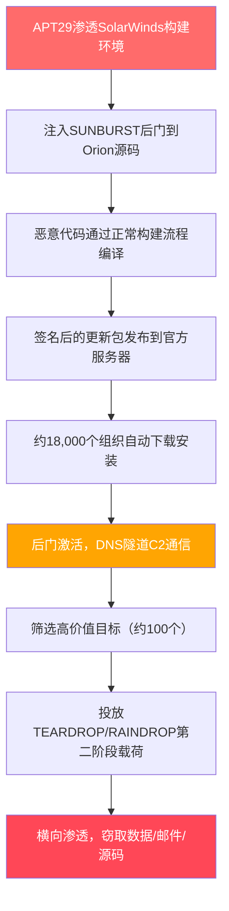
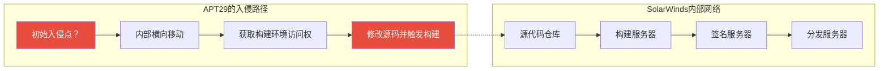
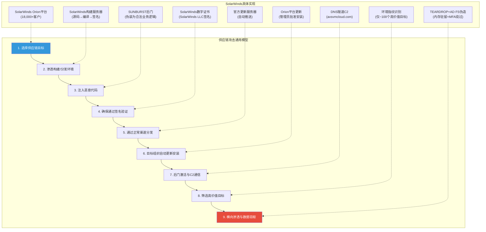
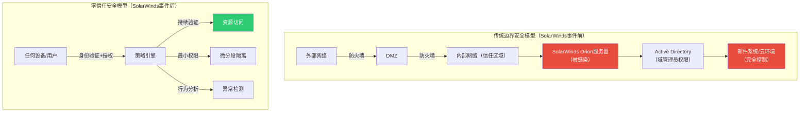
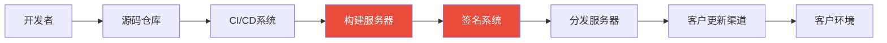

## 案例六：SolarWinds供应链攻击（2020年）

### 概述：史上最大规模供应链攻击

2020年12月，美国网络安全公司FireEye（现Mandiant）披露了一起针对SolarWinds Orion平台的供应链攻击事件。攻击者（被归因为俄罗斯对外情报局SVR下属的APT29，又称Cozy Bear）将恶意后门代码嵌入SolarWinds的软件更新包中，通过合法软件分发渠道传播，最终影响了约18,000个组织——其中包括美国财政部、国务院、国土安全部、能源部等核心政府部门，以及FireEye、微软、英特尔等科技巨头。

这起事件被称为**"网络安全领域的911"**，它彻底改变了全球对软件供应链安全的认知，直接推动了美国行政令14028的签署和软件物料清单（SBOM）标准的确立。



### 攻击时间线：一场精心策划的14个月行动

| 时间 | 事件 | 关键细节 |
|------|------|----------|
| 2019年10月 | APT29首次渗透SolarWinds构建环境 | 攻击者可能通过SAML令牌伪造或密码喷洒入侵 |
| 2019年底 | 修改Orion平台源码，注入SUNBURST后门 | 修改了SolarWinds.Orion.Core.BusinessLayer.dll |
| 2020年2月 | 首个包含后门的Orion版本发布（2019.4 HF 5） | 后门代码伪装为合法的SolarWinds业务逻辑 |
| 2020年3月 | 恶意更新包大规模分发 | 受影响版本：2019.4 HF 5 至 2020.2.1 |
| 2020年3月-6月 | 后门进入休眠期，等待激活 | 设计了14天的延迟激活机制，规避沙箱检测 |
| 2020年6月 | 开始筛选高价值目标 | 仅约100个组织被升级到第二阶段攻击 |
| 2020年9月 | 攻击者移除后门代码 | 在FireEye发现前删除痕迹，但已来不及 |
| 2020年12月8日 | FireEye发现自家Red Team工具被盗 | 通过异常的多因素认证活动发现入侵 |
| 2020年12月13日 | FireEye公开披露事件 | 同步通知CISA和FBI |
| 2020年12月13日 | CISA发布紧急指令21-01 | 要求所有联邦机构立即断开或停用SolarWinds产品 |
| 2020年12月31日 | SolarWinds确认约18,000个组织下载了受影响版本 | 实际被深度攻击的目标约100个 |
| 2021年1月 | 微软确认源代码被访问 | 攻击者查看了部分Azure和Exchange源码 |
| 2021年5月 | 美国对俄实施制裁 | 以SolarWinds攻击为由制裁俄罗斯实体和个人 |

### 攻击技术深度剖析

#### 第一阶段：构建环境渗透（Build System Compromise）

攻击者并未直接攻击SolarWinds的客户，而是**反向入侵了SolarWinds自身的软件构建系统**。这是供应链攻击中最精妙的手法——不是破坏交付链的某一环，而是从源头注入恶意代码。



**关键手法：**

- **构建环境即攻击面**：攻击者意识到，与其攻击数万个分散的目标，不如攻击一个集中的构建服务器。这相当于"在自来水厂投毒"而非"逐户下毒"
- **合法签名的恶意代码**：由于恶意代码在SolarWinds自己的构建服务器上编译并签名，生成的更新包具有完全合法的数字签名，所有安全验证（证书链、签名完整性）都会通过
- **源码级伪装**：SUNBURST后门代码被精心设计，伪装成SolarWinds Orion平台的正常业务逻辑，代码风格与原有代码一致，通过了SolarWinds内部的代码审查

**攻击者如何进入构建环境？** 根据多个安全公司的分析报告，可能的初始入侵路径包括：

1. **密码喷洒攻击**：利用泄露的凭证对SolarWinds的VPN或邮件系统进行密码喷洒
2. **SAML令牌伪造**：如果攻击者已经获取了Active Directory Federation Services (AD FS)的令牌签名密钥，可以伪造任意用户的认证令牌
3. **鱼叉式钓鱼**：针对SolarWinds员工的定向钓鱼邮件

#### 第二阶段：SUNBURST后门——精密的间谍工具

SUNBURST后门是整个攻击的核心，其设计之精巧堪称恶意软件工程的"教科书"。

**核心特性：**

| 特性 | 实现方式 | 目的 |
|------|----------|------|
| 休眠机制 | 安装后等待14天才激活 | 规避沙箱自动化分析（沙箱通常只运行几分钟） |
| 环境指纹识别 | 检查进程名、域名、用户信息、安全工具 | 仅在目标环境中运行，避免在安全研究人员的分析环境中暴露 |
| DNS隧道通信 | 通过DNS TXT记录进行C2通信 | 绕过防火墙对HTTP/HTTPS出站流量的限制 |
| 域生成算法（DGA） | 使用受害者域名作为种子生成C2域名 | 每个受害者的C2域名都不同，难以批量封堵 |
| 数据编码 | DNS查询中使用Base32编码传输数据 | 将窃取的数据伪装成正常的DNS流量 |
| 域前置（Domain Fronting） | 利用合法CDN服务隐藏C2流量 | C2流量看起来像访问微软Azure等合法服务 |
| 无文件执行 | 第二阶段载荷直接在内存中执行 | 不写入磁盘，规避基于文件的检测 |

**SUNBURST后门的通信流程：**

```text
受害者主机                              C2服务器（伪装为SolarWinds更新服务）
    |                                              |
    |-- DNS查询: [编码数据].avsvmcloud.com -------->|
    |   (TXT记录查询)                              |
    |                                              |
    |<-------- DNS响应: CNAME记录 ------------------|
    |   (包含下一步指令)                            |
    |                                              |
    |-- DNS查询: [窃取的数据].avsvmcloud.com ------>|
    |                                              |
    |<-------- DNS响应: 新的C2地址 -----------------|
```

**DGA域名示例**（基于真实IOC）：

```text
avsvmcloud.com          # 根域名
digitalcollege.org      # 关联域名
freescanonline.com      # 关联域名
deftsecurity.com        # 关联域名
the-documents.com       # 关联域名
```

这些域名在攻击期间被注册并托管在与SolarWinds基础设施相同的IP地址上，使得基于IP的检测也极为困难。

#### 第三阶段：后渗透——精准筛选与深度渗透

从约18,000个被感染的组织中，攻击者仅选择了约100个进行深度渗透。这种"大海捞针、重点突破"的策略体现了国家级APT的典型特征。

**筛选逻辑：**

```python
# 攻击者的筛选逻辑（伪代码，基于逆向分析）
def should_escalate(victim_info):
    """判断是否值得进行第二阶段攻击"""
    # 排除条件：沙箱环境、安全研究人员、低价值目标
    if is_sandbox(victim_info):
        return False
    if is_security_researcher(victim_info):
        return False
    if is_test_domain(victim_info):
        return False

    # 高价值目标特征
    high_value_indicators = [
        victim_info.domain in GOVERNMENT_DOMAINS,    # .gov域名
        victim_info.domain in DEFENSE_CONTRACTORS,    # 国防承包商
        victim_info.domain in TECH_GIANTS,            # 大型科技公司
        victim_info.org_type == "INTELLIGENCE",       # 情报机构
        victim_info.employee_count > 10000,           # 大型企业
    ]

    return any(high_value_indicators)
```

**第二阶段载荷：**

- **TEARDROP**：内存驻留型加载器，从SUNBURST的C2通信中接收加密的Payload并直接在内存中执行，不产生任何磁盘文件
- **RAINDROP**：TEARDROP的变体，用于不同受害者的后续攻击
- **Cobalt Strike Beacon**：商业渗透测试工具，被攻击者非法获取后用于横向渗透

**横向渗透技术：**

| 技术 | 具体手法 | 绕过的防御 |
|------|----------|------------|
| 凭证窃取 | Mimikatz提取内存中的NTLM哈希 | 本地管理员权限保护 |
| Kerberoasting | 请求服务票据并离线破解 | Kerberos认证机制 |
| AD FS令牌伪造 | 使用窃取的令牌签名密钥伪造SAML令牌 | 多因素认证（MFA） |
| 信任关系利用 | 通过已渗透的云环境访问关联的本地环境 | 网络边界隔离 |
| 委托攻击 | 利用Kerberos委派机制横向移动 | Active Directory安全配置 |

**值得注意的是AD FS令牌伪造技术**——这是一种极为高级的绕过多因素认证的方法。攻击者获取了AD FS服务器上的令牌签名密钥后，可以伪造任意用户的SAML令牌，这意味着即使启用了MFA，攻击者也能通过伪造的SAML令牌访问目标的云端资源（Azure AD、Microsoft 365等）。这一技术在后续的Microsoft Exchange Server攻击中被反复使用。

### 变现路径分析

虽然SolarWinds攻击被归因为国家级间谍活动，但其变现逻辑对理解黑客经济具有重要参考价值。

#### 直接变现路径

**1. 情报价值（国家战略层面）**

- **外交通信窃取**：获取美国国务院与其他国家的外交电报，了解美国的谈判底牌和外交策略。这类情报的价值难以用金钱衡量，但对地缘政治博弈至关重要
- **军事机密**：通过渗透国防部相关网络，获取武器系统研发信息、军事部署计划等
- **情报行动暴露**：可能识别出CIA在海外的情报行动和线人网络，造成不可逆的情报损失
- **经济间谍**：从科技公司窃取半导体、人工智能、量子计算等前沿技术的研发资料

**2. 知识产权窃取（经济价值估算）**

- 微软Azure和Exchange部分源码被访问——这些代码的商业价值以数十亿美元计
- 通过渗透科技公司获取的芯片设计、AI模型训练数据等具有直接商业价值
- 保守估计，窃取的知识产权总价值可能达**数十亿至数百亿美元**

**3. 暗网出售（犯罪组织视角）**

如果类似攻击被犯罪组织（而非国家APT）实施，变现路径将更为直接：

```text
窃取的凭证 ──────> 暗网出售 ──────> $50-$10,000/账户
窃取的源码 ──────> 竞争对手购买 ──> $100万-$5000万
窃取的邮件 ──────> 敲诈勒索 ──────> $10万-$1000万/组织
网络访问权限 ────> 初始访问代理 ──> $1000-$10万/组织
内部网络拓扑 ────> 勒索软件团伙 ──> $50万-$5000万/目标
```

#### 间接变现路径

**1. 初始访问即服务（Initial Access as a Service）**

SolarWinds攻击展示了"供应链植入→批量感染→精准筛选→出售访问"的完整链条。在暗网犯罪生态中，初始访问代理（Initial Access Broker, IAB）专门从事这一环节：

- 通过供应链攻击获取的企业VPN/远程桌面访问权限，在暗网售价$500-$50,000不等
- 带有域管理员权限的访问权限可售至$100,000+
- 政府机构和大型企业的访问权限属于"顶级商品"

**2. 情报交易与地缘政治筹码**

- 获取的外交和军事情报可与盟国交换其他情报资源
- 针对特定企业的深度渗透权限可在地缘政治冲突中作为"网络武器"储备
- 了解防御技术用于改进己方攻击工具链

**3. 攻击技术复用**

SolarWinds攻击中展示的多种技术（AD FS令牌伪造、DNS隧道、构建环境渗透）成为后续攻击的"教科书"：

- 2021年Microsoft Exchange Server攻击（ProxyLogon/ProxyShell）中复用了AD FS令牌伪造技术
- Codecov供应链攻击（2021年）采用了类似的构建环境污染手法
- 3CX供应链攻击（2023年）同样利用了软件更新机制

### 供应链攻击的完整攻击链模型



### 检测与防御：从SolarWinds事件中学到什么

#### 事后检测手段

**1. IOC检测（入侵指标）**

```bash
# 检查DNS查询日志中的可疑域名
grep -E "avsvmcloud\.com|freescanonline\.com|deftsecurity\.com|thegoldenasterisk\.com|deupertaisans\.com" /var/log/dns.log

# 检查是否存在SUNBURST后门的特征文件
find / -name "SolarWinds.Orion.Core.BusinessLayer.dll" -exec md5sum {} \;

# 已知恶意哈希值（部分）
# SHA256: b91ce2fa4105420647d07f4f312a5824e27e22b6099efc7b4980663971568a39

# 检查计划任务中的可疑条目
schtasks /query /fo LIST /v | grep -i "updater"
```

**2. 网络流量分析**

```python
"""
SolarWinds SUNBURST C2通信特征检测（简化版）
基于CISA和FireEye发布的技术指标
"""

SUSPICIOUS_DOMAINS = [
    "avsvmcloud.com",
    "freescanonline.com", 
    "deftsecurity.com",
    "thegoldenasterisk.com",
    "deupertaisans.com",
    "databasequerysamclusions.com",
]

def detect_sunburst_dns(dns_query_log):
    """检测SUNBURST的DNS C2通信特征"""
    alerts = []
    for entry in dns_query_log:
        # 特征1: 子域名异常长（编码数据）
        if len(entry.subdomain) > 20:
            # Base32编码的C2数据通常超过20字符
            alerts.append(f"长子域名查询: {entry.full_query}")
        
        # 特征2: 查询已知恶意域名
        if any(domain in entry.domain for domain in SUSPICIOUS_DOMAINS):
            alerts.append(f"已知恶意域名: {entry.full_query}")
        
        # 特征3: 高频DNS TXT查询（数据外泄特征）
        if entry.query_type == "TXT" and entry.frequency > 10:
            alerts.append(f"异常高频TXT查询: {entry.domain}")
    
    return alerts
```

**3. 行为分析（EDR检测要点）**

| 检测维度 | 正常Orion行为 | SUNBURST异常行为 |
|----------|--------------|-----------------|
| DNS查询频率 | 偶尔查询更新服务器 | 高频、规律性DNS查询 |
| 进程行为 | Orion服务正常运行 | SolarWinds.Orion.Core.BusinessLayer.dll异常加载 |
| 网络连接 | 连接SolarWinds官方服务器 | 连接非SolarWinds的avsvmcloud.com等域名 |
| 文件操作 | 正常日志写入 | 无文件写入（内存驻留型） |
| 进程链 | 正常的SolarWinds服务进程链 | svchost.exe异常子进程 |

#### 预防性防御架构

**1. 软件供应链安全**

```yaml
# 软件供应链安全检查清单（基于NIST SSDF和EO 14028）
supply_chain_security:
  source_code:
    - "启用代码签名和提交签名验证"
    - "实施分支保护和代码审查强制"
    - "使用SLSA（Supply-chain Levels for Software Artifacts）框架"
    - "维护软件物料清单（SBOM）"
  
  build_system:
    - "构建环境与开发环境物理隔离"
    - "构建过程可重现（Reproducible Builds）"
    - "构建日志完整记录并审计"
    - "密钥和签名证书使用HSM硬件保护"
    - "实施构建系统的零信任访问控制"
  
  distribution:
    - "更新包强制代码签名验证"
    - "实施更新内容的哈希校验和完整性验证"
    - "更新服务器使用独立的网络分段"
    - "监控更新包的异常行为"
  
  runtime:
    - "应用白名单策略（AppLocker/WDAC）"
    - "网络出口流量审计"
    - "DNS查询日志分析"
    - "实施零信任网络架构"
```

**2. 零信任架构实施**

SolarWinds事件暴露了传统"边界信任"模型的根本缺陷——一旦攻击者通过合法渠道（如软件更新）进入内部网络，边界防御形同虚设。



**3. 关键防御措施对照表**

| 防御层 | SolarWinds事件前缺失 | SolarWinds事件后应部署 |
|--------|---------------------|----------------------|
| 身份认证 | 基域管理员权限不受限 | 条件访问+持续风险评估 |
| 网络 | 内部网络无微分段 | 零信任微分段+微隔离 |
| 终端 | 无应用白名单 | WDAC/AppLocker强制执行 |
| DNS | 无DNS查询审计 | DNS日志分析+DNS-over-HTTPS监控 |
| 云 | SAML令牌无异常检测 | 令牌签名密钥轮换+异常SAML登录检测 |
| 供应链 | 无SBOM要求 | SBOM强制+SLSA合规+代码签名验证 |
| 监控 | SIEM规则不足 | 增加供应链攻击专项检测规则 |

### 行业影响与后续发展

#### 直接影响

| 维度 | 具体影响 |
|------|----------|
| 国家安全 | 美国多个核心政府部门机密可能泄露 |
| 商业损失 | SolarWinds股价暴跌约40%，市值蒸发数十亿美元 |
| 信任危机 | 企业对第三方软件更新的信任度急剧下降 |
| 法律后果 | SolarWinds面临股东集体诉讼和SEC调查 |
| 人事变动 | SolarWinds CEO Tim Brown被替换 |
| 保险行业 | 网络安全保险保费大幅上涨，承保范围收紧 |

#### 推动的政策与标准

**1. 美国行政令14028（Improving the Nation's Cybersecurity, 2021年5月）**

- 要求所有销售给联邦政府的软件必须提供SBOM
- 建立软件供应链安全框架（基于NIST SSDF）
- 强制实施零信任架构
- 要求关键基础设施运营商报告网络安全事件

**2. 软件物料清单（SBOM）标准化**

```json
{
  "sbom_format": "SPDX",
  "sbom_version": "2.3",
  "name": "SolarWinds.Orion.Core.BusinessLayer",
  "spdx_version": "SPDX-2.3",
  "packages": [
    {
      "name": "SolarWinds.Orion.Core.BusinessLayer",
      "version": "2020.2.1",
      "supplier": "SolarWinds LLC",
      "checksums": [
        {
          "algorithm": "SHA256",
          "checksumValue": "b91ce2fa4105420647d07f4f312a5824e27e22b6099efc7b4980663971568a39"
        }
      ],
      "externalRefs": [
        {
          "referenceType": "purl",
          "referenceLocator": "pkg:maven/com.solarwinds/orion-core@2020.2.1"
        }
      ]
    }
  ]
}
```

**3. SLSA（Supply-chain Levels for Software Artifacts）框架**

```text
Level 0: 无保证 — 无构建过程记录
Level 1: 构建过程有文档 — 构建脚本和输出有版本控制
Level 2: 使用托管构建服务 — 构建在可信的CI/CD平台上执行
Level 3: 构建平台防篡改 — 构建过程不可被单人修改
Level 4: 可重现构建 — 任何人都能从源码重现相同的构建产物
```

### 典型误区与纠正

| 误区 | 纠正 |
|------|------|
| "我们不用SolarWinds，不受影响" | 供应链攻击是通用威胁，任何软件供应商都可能是目标。Codecov、Kaseya、3CX、 MOVEit等事件证明了这一点 |
| "只要安装了杀毒软件就安全" | SUNBURST后门使用合法签名，通过正常更新渠道分发，传统杀毒软件无法检测 |
| "我们是小公司，不会被攻击" | 约18,000个组织下载了恶意更新，攻击者仅选择了约100个深度渗透——小型组织虽未被深度攻击，但已成为攻击者的"跳板" |
| "防火墙能保护我们" | DNS隧道通信可以绕过大多数防火墙规则，因为DNS（端口53）几乎总是被允许出站的 |
| "禁用自动更新就好" | 手动更新不解决根本问题——你无法判断更新包是否被篡改。需要的是验证机制，不是禁用更新 |
| "这是国家级攻击，普通黑客做不到" | 构建环境污染的技术门槛并不高，关键是找到进入构建环境的方法。2021年Codecov通过一个被篡改的Bash脚本就实现了类似效果 |

### 攻击经济学分析

SolarWinds攻击揭示了供应链攻击极高的"投入产出比"：

```text
攻击投入：
  - 初始入侵：可能仅需几万元的渗透成本
  - 开发SUNBURST后门：估计数月的人力成本
  - 维护C2基础设施：每年几万元的服务器和域名费用
  - 总投入：估计数百万元人民币

攻击收益：
  - 18,000个组织的初始访问权限
  - 约100个高价值目标的深度控制
  - 数十亿美元的潜在情报和知识产权价值
  - 地缘政治博弈中的战略优势

ROI：难以估量，但可能是网络安全史上最高的投入产出比
```

这种极高的ROI解释了为什么供应链攻击正在成为APT组织和高级犯罪集团的首选攻击方式——与其逐一攻破目标，不如在供应链的上游"投毒"，让目标自己"送货上门"。

### 从SolarWinds看供应链攻击的演进

SolarWinds事件后，供应链攻击并未减少，反而愈演愈烈：

| 时间 | 事件 | 攻击手法 | 与SolarWinds的关联 |
|------|------|----------|-------------------|
| 2020年12月 | SolarWinds/SUNBURST | 构建环境污染 | 首次大规模曝光 |
| 2021年4月 | Codecov Bash Uploader | 篡改CI/CD脚本 | 针对开发者的供应链攻击 |
| 2021年7月 | Kaseya VSA | 软件更新植入勒索软件 | MSP/MSSP供应链攻击 |
| 2022年3月 | Spring4Shell | 开源框架漏洞 | 开源供应链风险 |
| 2023年3月 | 3CX桌面客户端 | 源码仓库被入侵 | 与Lazarus组织关联 |
| 2023年5月 | MOVEit Transfer | 软件零日漏洞利用 | 文件传输软件供应链 |
| 2024年3月 | XZ Utils后门 | 长期社工+代码注入 | 开源维护者投毒 |

这一趋势清楚地表明：**供应链攻击不是一次性的突发事件，而是一种持续演化的攻击范式**。

### 实操建议：组织如何防护

#### 立即可执行的措施（Quick Wins）

1. **审计软件资产**：建立所有第三方软件的清单，包括版本号、供应商、更新渠道
2. **启用DNS日志**：部署DNS查询日志收集和分析能力，这是检测SUNBURST类攻击的最低成本手段
3. **验证更新完整性**：对关键软件的更新包实施额外的哈希校验和签名验证
4. **限制构建环境访问**：对CI/CD系统实施最小权限原则和网络隔离
5. **部署EDR**：确保所有终端部署了具有行为检测能力的EDR解决方案

#### 中期建设（3-6个月）

1. **建立SBOM管理流程**：要求所有软件供应商提供SBOM，并定期审查依赖关系
2. **实施零信任架构**：从身份验证开始，逐步推进网络微分段和微隔离
3. **构建供应链安全评估能力**：建立对供应商安全实践的评估和审计机制
4. **红蓝对抗演练**：模拟供应链攻击场景，验证现有防御的有效性

#### 长期战略（6-12个月）

1. **采纳SLSA框架**：逐步提升软件构建的安全等级，最终达到Level 3+
2. **参与行业威胁情报共享**：加入ISAC（信息共享与分析中心）获取最新的供应链攻击情报
3. **建立软件供应链安全治理**：将供应链安全纳入企业整体风险管理框架
4. **投资可重现构建**：确保关键软件的构建过程可审计、可重现

### 深度思考：供应链信任的根本困境

SolarWinds事件揭示了一个根本性的安全困境：**现代软件开发依赖的信任链太长，而任何一环的失守都可能导致整个链条的崩溃。**



在SolarWinds事件中，攻击者只需要渗透构建服务器（D）这一个环节，就能让恶意代码获得合法签名（E），通过正常分发渠道（F/G）传播到所有客户（H）。**信任传递的链条上，最薄弱的一环决定了整体安全性。**

这也是为什么"零信任"理念在SolarWinds事件后获得了前所未有的关注——它从根本上否定了"因为你在网络内部，所以你是可信的"这一假设，要求对每一次访问、每一个请求、每一个更新包都进行独立的验证。

### 关键启示

1. **供应链是新的攻击面**：软件供应链与物理供应链一样，任何一个环节的失守都可能产生连锁反应。攻击者正在从"攻击目标"转向"攻击目标的供应商"
2. **合法≠安全**：合法的数字签名、正常的更新渠道、官方的分发服务器——这些都不能保证软件的安全性。安全验证不能依赖单一维度
3. **检测能力决定响应速度**：FireEye之所以能发现攻击，是因为他们有完善的日志记录和异常检测能力。大多数受害者在FireEye披露前完全不知情
4. **纵深防御不是口号**：从构建环境隔离、代码签名验证、网络流量分析到终端行为检测，每一层防御都有其不可替代的价值
5. **安全投入的ROI是正的**：SolarWinds事件中，FireEye因为有完善的安全基础设施而率先发现了攻击，避免了更大的损失。而SolarWinds自身的声誉和股价损失则远超任何安全投入

***

> **延伸阅读**：CISA Emergency Directive 21-01（SolarWinds事件应急指令）、FireEye/SUNBURST技术分析报告、NIST SSDF（Secure Software Development Framework）、SLSA框架文档、美国行政令14028全文。
