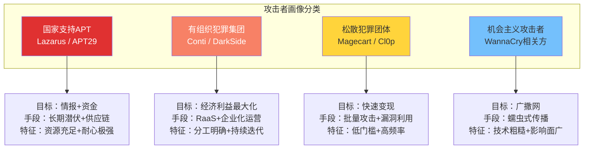
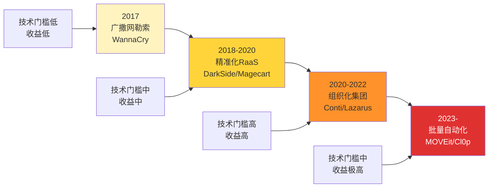
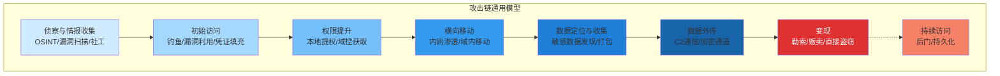
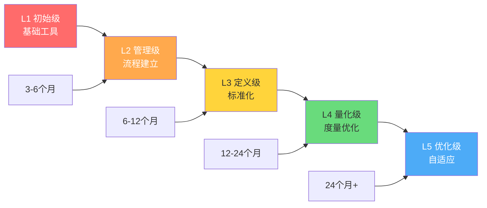
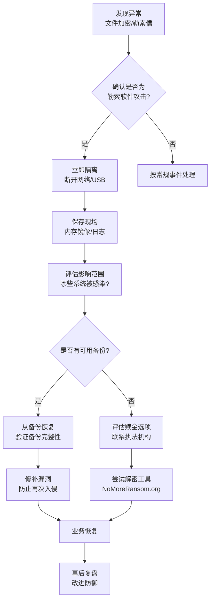

# 案例总结与防御建议

## 引言：从七个案例到一套防御体系

本章前面的七个案例——WannaCry、Colonial Pipeline、Magecart、Lazarus Group、Conti、SolarWinds、MOVEit——看似各自独立，实则构成了一幅完整的网络犯罪全景图。它们分别代表了勒索软件、关键基础设施攻击、网页窃取、金融盗窃、有组织犯罪集团、供应链攻击和漏洞批量利用七种核心变现路径。

但真正有价值的不只是记住每个案例的细节，而是从这些案例中提炼出**跨案例的共性规律**，并将这些规律转化为**可执行的防御策略**。本章的目标正是如此：将七个案例的教训浓缩为一张防御地图，帮助读者在面对任何网络威胁时，都能快速定位关键防御节点，构建纵深防御体系。

> **核心命题**：攻击者的手段在变，但攻击链的本质不变。理解不变的部分，才能在变化中守住防线。

---

## 一、七大案例全景回顾

在展开分析之前，先以一张总览表快速回顾七个案例的核心要素：

| 案例 | 年份 | 攻击类型 | 攻击者 | 直接损失 | 影响规模 | 核心变现路径 |
|------|------|---------|--------|---------|---------|------------|
| WannaCry | 2017 | 蠕虫式勒索 | 疑似朝鲜 | ~$14万（赎金） | 150+国家、30万+设备 | 大规模加密勒索 |
| Colonial Pipeline | 2021 | RaaS勒索 | DarkSide | $440万赎金 | 美国东海岸45%燃油供应中断 | 高价值目标勒索 |
| Magecart | 2015-至今 | 网页窃取 | 多团体 | 数百万卡数据 | 数万个电商网站 | 支付数据暗网贩卖 |
| Lazarus Group | 2016-2023 | 金融攻击 | 朝鲜APT38 | $30亿+（累计） | 多国金融机构、交易所 | 直接资金盗窃+加密货币 |
| Conti | 2020-2022 | 勒索集团 | 俄系组织 | $180M+（年收入） | 全球数千家企业 | RaaS规模化运营 |
| SolarWinds | 2020 | 供应链攻击 | 俄APT29 | 难以量化 | 18000+组织、美政府部门 | 情报窃取+间接变现 |
| MOVEit | 2023 | 漏洞利用 | Cl0p | $75M-$100M | 2500+组织、6700万+记录 | 批量数据勒索 |

**关键数据洞察**：

- **损失差异巨大**：WannaCry实际赎金仅$14万，而Lazarus Group累计获利超$30亿——这说明攻击者的"搞钱路径"决定了收益上限，而非技术复杂度。
- **影响规模与直接收益不成正比**：WannaCry影响30万台设备但赎金收入低，Conti影响数千家企业但年收入$180M——组织化程度和变现策略才是关键。
- **攻击者类型多样化**：从国家APT（Lazarus、APT29）到犯罪集团（Conti、DarkSide）再到松散团体（Magecart），动机和手段各异，但防御者需要应对的是同一套攻击链。

---

## 二、跨案例共性分析

### 2.1 攻击者画像的四种典型模式

从七个案例中可以归纳出四类攻击者画像，每类对应不同的防御策略：



| 维度 | 国家APT | 有组织犯罪 | 松散团体 | 机会主义 |
|------|---------|-----------|---------|---------|
| 资金实力 | 极高（国家资助） | 高（持续收入） | 中（项目制） | 低 |
| 技术能力 | 顶尖（零日+定制） | 高（专业团队） | 中（现成工具） | 低（公开漏洞） |
| 攻击周期 | 月-年级 | 周-月级 | 天-周级 | 小时级 |
| 目标选择 | 精准（政府+关键基础设施） | 精准（高价值企业） | 批量（无差别） | 广撒网 |
| 代表案例 | SolarWinds / Lazarus | Conti / Colonial Pipeline | Magecart / MOVEit | WannaCry |

**防御启示**：不同攻击者需要不同的防御策略。对国家APT需要零信任+供应链安全+威胁情报驱动；对有组织犯罪需要备份+EDR+事件响应；对松散团体需要漏洞管理+基础防护；对机会主义需要补丁管理+网络分段。

### 2.2 变现路径的演变趋势

七个案例横跨2017-2023年，清晰地展示了网络犯罪变现路径的演变轨迹：

**第一阶段（2017-2018）：广撒网式勒索**
- 代表：WannaCry
- 特征：利用公开漏洞，蠕虫式传播，低赎金高覆盖
- 问题：实际变现效率低（30万台设备仅收$14万赎金）

**第二阶段（2018-2020）：精准化+专业化**
- 代表：Colonial Pipeline、Magecart
- 特征：目标选择更精准，RaaS模式成熟，社会工程学融入
- 创新：DarkSide的"企业化"运营，Magecart的供应链攻击路径

**第三阶段（2020-2022）：组织化+规模化**
- 代表：Conti、Lazarus
- 特征：HR部门、开发团队、谈判团队一应俱全；加密货币成为主要洗钱渠道
- 创新：双重勒索（加密+数据泄露威胁），APT的金融化转型

**第四阶段（2023-至今）：批量自动化+无差别攻击**
- 代表：MOVEit
- 特征：利用单一漏洞批量攻击，不加密仅窃取，快速收割
- 创新：Cl0p的"零日批量利用"模式，ROI极高



**趋势总结**：从"广撒网低收益"到"精准化高收益"，再到"组织化规模收益"，最终到"批量自动化超高收益"。攻击者越来越聪明，也越来越"工业化"。

### 2.3 目标选择的底层逻辑

攻击者选择目标时遵循一个核心公式：

> **目标价值 = 数据/资产价值 × 业务中断敏感度 × 防御薄弱程度 × 支付意愿**

| 目标类型 | 数据价值 | 中断敏感度 | 防御薄弱度 | 支付意愿 | 典型攻击者 |
|---------|---------|-----------|-----------|---------|----------|
| 关键基础设施 | 中 | 极高 | 中 | 高 | RaaS（DarkSide） |
| 金融机构 | 极高 | 高 | 中-高 | 高 | APT（Lazarus） |
| 电商/零售 | 高 | 中 | 低-中 | 中 | Magecart |
| 大型企业 | 高 | 中 | 中 | 高 | Conti |
| 中小企业 | 低 | 中 | 高 | 低-中 | WannaCry |
| 政府机构 | 极高 | 低 | 中 | 低 | APT29 |

**关键洞察**：Colonial Pipeline之所以被DarkSide选中，不是因为它的技术防御最弱，而是因为它的"业务中断敏感度"极高——燃油管道停了，整个东海岸都会受影响，企业被迫支付赎金的概率最大。这就是攻击者"搞钱路径"的核心：**找到那个不能停的系统，然后让它停**。

### 2.4 攻击链的共性阶段

尽管七个案例的攻击手法各异，但所有攻击链都遵循一个基本框架：



**每个阶段对应的防御措施**：

| 攻击阶段 | 关键防御措施 | 对应案例教训 |
|---------|------------|------------|
| 侦察 | 攻击面管理、数字足迹最小化 | SolarWinds：第三方依赖管理 |
| 初始访问 | MFA、漏洞管理、邮件安全网关 | Colonial Pipeline：VPN凭据泄露 |
| 权限提升 | 最小权限、补丁管理 | WannaCry：SMBv1未修补 |
| 横向移动 | 网络分段、EDR、零信任 | Conti：域控被攻陷后全网沦陷 |
| 数据收集 | DLP、数据分类分级、加密 | Magecart：支付数据未加密传输 |
| 数据外传 | 网络监控、异常流量检测 | MOVEit：SQL注入外传未检测 |
| 变现 | 备份策略、事件响应、赎金谈判 | Colonial Pipeline：$440万赎金 |
| 持续访问 | 威胁狩猎、行为分析 | Lazarus：长期潜伏未被发现 |

---

## 三、分层防御体系设计

基于七个案例的教训，防御者需要构建一个**五层纵深防御体系**，每一层都有明确的职责和关键控制措施。

### 3.1 第一层：边界防御（Perimeter Defense）

边界防御是传统安全的第一道防线，虽然不能单独依赖，但仍然是攻击链中成本最低的阻断点。

**关键控制措施：**

| 控制项 | 具体措施 | 优先级 | 对应案例 |
|-------|---------|-------|---------|
| 漏洞管理 | 建立漏洞扫描+补丁管理流程，关键漏洞72小时内修补 | P0 | WannaCry（MS17-010） |
| MFA强制 | 所有远程访问、特权账户强制MFA | P0 | Colonial Pipeline（VPN凭据） |
| 邮件安全网关 | 反钓鱼、附件沙箱、URL重写 | P0 | 所有案例（钓鱼是主要入口） |
| 网络分段 | 生产网/办公网/DMZ隔离，关键系统独立网段 | P1 | Conti（横向移动） |
| Web应用防火墙 | WAF规则+自定义规则，防SQL注入/XSS | P1 | Magecart / MOVEit |

**实战配置示例（邮件安全网关规则）：**

```yaml
# 反钓鱼规则示例（基于ClamAV/SpamAssassin）
rules:
  - name: "CEO Fraud Detection"
    pattern: "urgent|immediately|wire transfer|change bank|legal matter"
    threshold: 3
    action: quarantine
  - name: "Suspicious Attachment"
    pattern: "\.scr$|\.js$|\.vbs$|\.bat$|\.ps1$"
    action: block
  - name: "External Email Warning"
    condition: "sender_domain not in internal_domains"
    action: add_header "WARNING: External Email"
```

### 3.2 第二层：端点防御（Endpoint Defense）

端点是攻击者进入内网后的落脚点，也是勒索软件加密、数据窃取的主要发生地。

**关键控制措施：**

| 控制项 | 具体措施 | 优先级 | 说明 |
|-------|---------|-------|------|
| EDR部署 | 全端点部署EDR（Microsoft Defender for Endpoint / CrowdStrike / SentinelOne） | P0 | 检测异常进程、文件加密行为、C2通信 |
| 应用白名单 | 关键服务器实施应用白名单（AppLocker / WDAC） | P1 | 防止未知程序执行 |
| 防勒索软件 | 启用Windows Defender防勒索功能（受控文件夹访问） | P1 | 阻止勒索软件加密用户文件 |
| 特权账户管理 | PAM解决方案，临时提权，会话录制 | P0 | 防止凭据泄露导致域控沦陷 |
| 终端隔离 | 检测感染后自动隔离端点 | P1 | 阻止横向移动 |

**EDR检测规则示例（YARA规则）：**

```yara
rule Ransomware_File_Encryption_Behavior {
    meta:
        description = "Detect ransomware file encryption behavior"
        author = "Security Team"
        date = "2024-01-01"
    strings:
        $s1 = "YOUR FILES HAVE BEEN ENCRYPTED"
        $s2 = "pay bitcoin"
        $s3 = "ransom"
        $s4 = "decrypt"
    condition:
        2 of them and uint16(0) == 0x5A4D
}
```

### 3.3 第三层：网络防御（Network Defense）

网络层防御的核心是**可见性**和**分段**——让攻击者的横向移动变得困难，让异常流量变得可见。

**关键控制措施：**

| 控制项 | 具体措施 | 优先级 | 说明 |
|-------|---------|-------|------|
| 网络分段 | 按业务/安全等级划分VLAN，ACL控制跨网段访问 | P0 | 限制横向移动范围 |
| 流量监控 | NetFlow/sFlow分析，异常流量告警 | P1 | 检测数据外传、C2通信 |
| 东西向流量检测 | 部署IDS/IPS，监控内网横向移动 | P1 | 检测SMB/RDP异常连接 |
| DNS安全 | DNS日志记录、DNS-over-HTTPS监控、恶意域名拦截 | P1 | 检测C2通信、数据外传 |
| 零信任网络 | 微分段、持续验证、最小权限网络访问 | P2 | 长期目标，逐步推进 |

**网络分段参考架构：**

```text
┌─────────────────────────────────────────────────┐
│                  互联网                          │
└──────────────────┬──────────────────────────────┘
                   │
            ┌──────▼──────┐
            │   DMZ区     │  ← Web服务器、邮件服务器
            │  (WAF+IPS)  │
            └──────┬──────┘
                   │
        ┌──────────┼──────────┐
        │          │          │
   ┌────▼────┐ ┌──▼───┐ ┌────▼────┐
   │ 办公网  │ │ 管理 │ │ 生产网  │  ← 核心业务系统
   │(VLAN10) │ │(VLAN) │ │(VLAN30) │
   └─────────┘ └──────┘ └─────────┘
        │          │          │
   ┌────▼──────────▼──────────▼────┐
   │      核心交换 + NAC            │  ← 网络准入控制
   └───────────────────────────────┘
```

### 3.4 第四层：数据防御（Data Defense）

数据是攻击者的最终目标——无论是勒索加密、窃取贩卖还是直接盗窃，保护数据就是保护企业的核心资产。

**关键控制措施：**

| 控制项 | 具体措施 | 优先级 | 说明 |
|-------|---------|-------|------|
| 数据分类分级 | 识别敏感数据（PII/PHI/金融/知识产权），按级别标记 | P0 | 不知道保护什么，就无法保护 |
| 数据加密 | 静态加密（AES-256）、传输加密（TLS 1.3）、密钥管理 | P0 | 即使数据被窃取也无法使用 |
| DLP策略 | 数据防泄漏，监控敏感数据外传 | P1 | 检测邮件/USB/网络外传 |
| 备份策略 | 3-2-1原则：3份副本、2种介质、1份离线 | P0 | 勒索软件攻击的最后防线 |
| 令牌化 | 支付卡数据令牌化（PCI DSS要求） | P1 | Magecart案例的教训 |

**3-2-1备份策略详解：**

| 要素 | 说明 | 实施建议 |
|------|------|---------|
| **3份副本** | 原始数据 + 2份备份 | 本地备份 + 异地备份 |
| **2种介质** | 不同存储介质 | 磁盘 + 磁带/云存储 |
| **1份离线** | 至少一份离线/不可变备份 | 离线磁带、WORM云存储、不可变快照 |

**备份验证检查清单：**

```markdown
- [ ] 备份是否定期执行（每日增量/每周全量）？
- [ ] 备份是否定期恢复测试（每季度至少一次）？
- [ ] 离线备份是否物理隔离（不联网）？
- [ ] 备份是否加密（防止备份数据被窃取）？
- [ ] 备份保留策略是否合理（至少保留30天）？
- [ ] 备份系统是否独立于生产网络（防止勒索软件加密备份）？
```

### 3.5 第五层：检测与响应（Detection & Response）

当防御被突破后，检测和响应能力决定了损失的大小。这是安全体系中最容易被忽视、但最重要的环节。

**关键控制措施：**

| 控制项 | 具体措施 | 优先级 | 说明 |
|-------|---------|-------|------|
| SIEM部署 | 集中日志收集、关联分析、告警 | P0 | 所有安全事件的统一视图 |
| SOAR编排 | 自动化响应（隔离、阻断、通知） | P1 | 缩短响应时间，减少人为错误 |
| 威胁狩猎 | 主动搜索隐藏威胁，不依赖告警 | P1 | 发现APT等长期潜伏威胁 |
| 事件响应计划 | 预定义的IR流程，定期演练 | P0 | Colonial Pipeline的教训：没有计划=混乱 |
| 数字取证 | 日志保留、取证工具、链式保全 | P1 | 事后溯源和法律诉讼需要 |

**事件响应时间线参考：**

```mermaid
gantt
    title 勒索软件事件响应时间线
    dateFormat X
    axisFormat %H:%M

    section 检测阶段
    异常告警              :a1, 0, 15m
    告警确认              :a2, after a1, 15m

    section 遏制阶段
    隔离受影响系统        :b1, after a2, 30m
    断开网络连接          :b2, after a2, 15m
    保存现场证据          :b3, after b1, 30m

    section 根除阶段
    漏洞修补              :c1, after b3, 2h
    凭据重置              :c2, after b3, 1h
    恶意软件清除          :c3, after c1, 2h

    section 恢复阶段
    数据恢复              :d1, after c3, 4h
    系统重建              :d2, after c3, 4h
    业务恢复              :d3, after d1, 2h

    section 总结阶段
    事后复盘              :e1, after d3, 1d
    改进措施              :e2, after e1, 3d
```



---

## 四、按威胁类型的专项防御建议

### 4.1 勒索软件防御（对应：WannaCry、Colonial Pipeline、Conti）

勒索软件是七个案例中最常见的攻击类型，也是中小企业面临的最大威胁。

**核心防御策略：**

1. **备份是王道**：没有备份的企业，在勒索软件面前没有谈判筹码。3-2-1备份策略是最低要求，推荐升级为3-2-1-1（增加一份不可变备份）。

2. **补丁管理不能拖**：WannaCry利用的MS17-010漏洞在攻击爆发前2个月就已发布补丁。建立自动化补丁管理流程，关键漏洞72小时内完成修补。

3. **MFA不能省**：Colonial Pipeline的入侵入口是一个VPN账户的凭据泄露。如果启用了MFA，攻击者即使获取了密码也无法登录。

4. **网络分段是底线**：Conti攻击中，攻击者从一台被入侵的端点横向移动到了域控制器，然后控制了整个网络。如果实施了网络分段，攻击范围会被限制在单个网段内。

5. **不要支付赎金**：FBI、CISA等机构明确建议不要支付赎金。支付赎金不仅不能保证数据恢复（约20%的支付者仍无法恢复），还会助长犯罪经济。

**勒索软件防御检查清单：**

```markdown
技术控制：
- [ ] 全端点EDR部署
- [ ] 3-2-1备份策略（含离线/不可变备份）
- [ ] 关键漏洞72小时修补SLA
- [ ] 所有远程访问MFA
- [ ] 网络分段（生产/办公/管理隔离）
- [ ] 邮件安全网关（反钓鱼+附件沙箱）
- [ ] 应用白名单（关键服务器）

管理控制：
- [ ] 事件响应计划（含勒索软件专项）
- [ ] 每季度备份恢复演练
- [ ] 员工安全意识培训（含钓鱼模拟）
- [ ] 第三方供应商安全评估
- [ ] 网络安全保险（作为最后防线）
```

### 4.2 数据窃取防御（对应：Magecart、MOVEit）

数据窃取的核心是**在数据离开企业边界之前发现并阻止它**。

**核心防御策略：**

1. **令牌化替代加密存储**：Magecart案例中，窃取的是明文信用卡数据。如果实施了PCI DSS要求的令牌化，攻击者即使注入窃取脚本也拿不到有用数据。

2. **内容安全策略（CSP）**：Magecart攻击依赖注入恶意JavaScript。实施严格的CSP可以阻止未授权的脚本执行。

3. **子资源完整性（SRI）**：对第三方JavaScript资源使用SRI哈希校验，防止供应链篡改。

4. **Web应用安全测试**：MOVEit的SQL注入漏洞（CVE-2023-34362）可以通过常规的渗透测试发现。建立定期渗透测试和代码审计流程。

5. **数据外传监控**：部署DLP和网络流量分析，检测异常的大规模数据外传。

**CSP策略示例：**

```http
Content-Security-Policy: 
    default-src 'self';
    script-src 'self' 'nonce-{random}' https://trusted-cdn.example.com;
    style-src 'self' 'unsafe-inline';
    img-src 'self' data: https:;
    connect-src 'self' https://api.example.com;
    frame-ancestors 'none';
    base-uri 'self';
    form-action 'self';
```

### 4.3 供应链攻击防御（对应：SolarWinds、Magecart供应链路径）

供应链攻击是"攻其必救"——通过攻击一个可信的第三方，间接渗透到无数下游客户。

**核心防御策略：**

1. **软件物料清单（SBOM）**：了解你的软件依赖了哪些组件，才能知道哪些漏洞会影响你。要求供应商提供SBOM。

2. **软件更新完整性验证**：SolarWinds攻击的核心是恶意代码被注入软件更新包。实施代码签名验证和更新完整性检查。

3. **最小化第三方依赖**：每增加一个第三方组件，就增加一个潜在的攻击面。定期审查和清理不必要的第三方依赖。

4. **供应商安全评估**：对关键供应商进行安全评估，包括其安全实践、漏洞管理流程、事件响应能力。

5. **零信任架构**：即使第三方软件被植入后门，零信任架构也能限制其影响范围。

**供应链安全评估框架：**

| 评估维度 | 关键问题 | 权重 |
|---------|---------|------|
| 安全实践 | 是否有正式的漏洞管理流程？是否定期渗透测试？ | 25% |
| 事件响应 | 是否有事件响应计划？是否定期演练？ | 20% |
| 人员安全 | 是否进行背景调查？是否有安全培训？ | 15% |
| 基础设施 | 是否使用安全的基础设施？是否有监控？ | 15% |
| 合规认证 | 是否有SOC 2 / ISO 27001等认证？ | 15% |
| 透明度 | 是否愿意分享安全信息？是否有安全公告流程？ | 10% |

### 4.4 金融攻击防御（对应：Lazarus Group）

Lazarus Group的攻击展示了国家APT组织如何将网络攻击转化为巨额经济收益。

**核心防御策略：**

1. **交易监控与异常检测**：对大额转账、异常交易模式进行实时监控。孟加拉国央行攻击中，如果有一个简单的金额阈值告警，$8100万可能就不会被转出。

2. **多重签名与审批流程**：关键金融操作需要多人审批，防止单点突破。

3. **SWIFT安全加固**：SWIFT系统有专门的安全框架（CSF），金融机构应全面遵循。

4. **加密货币安全**：如果涉及加密货币，使用冷存储、多重签名钱包，监控链上异常交易。

5. **员工安全意识**：Lazarus多次通过社会工程学入侵银行员工。定期安全意识培训和钓鱼模拟是关键。

---

## 五、防御成熟度模型

防御不是一蹴而就的，需要根据企业实际情况分阶段推进。以下是一个五级的防御成熟度模型：

| 级别 | 名称 | 特征 | 关键能力 | 对应案例防御能力 |
|------|------|------|---------|----------------|
| **L1** | 初始级 | 被动防御，依赖基础工具 | 杀毒软件、防火墙、基础补丁 | 无法防御任何案例中的攻击 |
| **L2** | 管理级 | 有基础流程，但执行不一致 | 漏洞扫描、备份、事件响应计划 | 可能防御WannaCry（如果补丁及时） |
| **L3** | 定义级 | 流程标准化，有文档和培训 | MFA、EDR、网络分段、DLP | 可防御大部分案例中的攻击 |
| **L4** | 量化级 | 可度量、可优化，有KPI | SIEM、SOAR、威胁情报、定期演练 | 可快速检测并响应所有案例 |
| **L5** | 优化级 | 持续改进，自适应防御 | AI驱动检测、自动化响应、威胁狩猎 | 可预防大多数攻击，快速恢复 |

**各阶段推进建议：**



**中小企业（50人以下）推荐路径**：L1 → L2 → L3（聚焦MFA、备份、EDR、漏洞管理）

**中型企业（50-500人）推荐路径**：L2 → L3 → L4（增加SIEM、网络分段、DLP、事件响应演练）

**大型企业（500人以上）推荐路径**：L3 → L4 → L5（增加SOAR、威胁情报、威胁狩猎、零信任）

---

## 六、应急响应与恢复

当攻击已经发生时，响应速度和质量决定了损失的大小。以下是基于七个案例教训的应急响应框架。

### 6.1 勒索软件事件响应流程



### 6.2 关键决策点

| 决策点 | 考虑因素 | 建议 |
|-------|---------|------|
| 是否支付赎金 | 数据恢复可能性、法律风险、助长犯罪 | 不建议支付，联系执法机构 |
| 是否公开披露 | 法律要求、客户信任、监管合规 | 按GDPR/CCPA等法规要求及时披露 |
| 是否关闭业务 | 安全与业务的平衡 | 优先安全，最小化影响范围 |
| 是否聘请第三方 | 内部能力、时间压力、专业需求 | 建议聘请专业IR团队 |

### 6.3 恢复优先级

| 优先级 | 系统类型 | 恢复时间目标 | 说明 |
|-------|---------|------------|------|
| P0 | 核心业务系统 | 4小时 | 直接影响收入和客户 |
| P1 | 关键支撑系统 | 8小时 | 间接影响业务 |
| P2 | 一般办公系统 | 24小时 | 影响效率但不影响收入 |
| P3 | 非关键系统 | 72小时 | 可延后恢复 |

---

## 七、未来威胁展望

基于七个案例的演变趋势，未来网络犯罪可能出现以下发展方向：

### 7.1 AI驱动的攻击

- **AI生成钓鱼邮件**：更加个性化、更难识别
- **AI自动化漏洞挖掘**：加速零日漏洞的发现和利用
- **AI驱动的社会工程学**：深度伪造音频/视频用于CEO欺诈

### 7.2 云环境攻击

- **云配置错误**：S3泄露、IAM权限过度
- **云原生攻击**：容器逃逸、Kubernetes权限提升
- **云供应链攻击**：CI/CD管道被植入恶意代码

### 7.3 物联网与OT攻击

- **IoT僵尸网络**：更大规模的DDoS攻击
- **工业控制系统攻击**：类似Colonial Pipeline但更广泛
- **智能家居/车联网**：个人数据和安全的新战场

### 7.4 量子计算威胁

- **后量子密码学**：当前加密算法可能被量子计算机破解
- **现在窃取，以后解密**：攻击者现在窃取加密数据，等量子计算机成熟后解密

---

## 八、总结：从案例到行动

七个案例，七种攻击，但只有一个核心教训：**攻击者比你想象的更聪明、更有组织、更有耐心**。从WannaCry的"广撒网"到MOVEit的"批量收割"，攻击者的手段在不断进化，但防御者的基本防线始终不变。

**记住这十条铁律：**

1. **备份是最后防线**——3-2-1原则，离线不可变
2. **MFA是最低成本的高回报投资**——阻止99.9%的账户接管
3. **补丁管理不能拖**——关键漏洞72小时内修补
4. **网络分段限制损失**——不要让一台被入侵的机器拖垮整个网络
5. **最小权限原则**——每个账户只给必要的权限
6. **员工是安全链条中最弱的一环**——持续培训+钓鱼模拟
7. **监控和日志是事后溯源的唯一依据**——完整记录+长期保留
8. **事件响应计划要提前写好**——不要等到攻击来了才开始想怎么办
9. **供应链安全不可忽视**——你的安全取决于最弱的第三方
10. **安全是持续的过程，不是一次性的项目**——威胁在变，防御也要跟着变

**最后，用一个公式总结防御的本质：**

> **防御效果 = 检测能力 × 响应速度 × 恢复能力**

检测能力决定了你多久能发现攻击，响应速度决定了攻击能扩散多远，恢复能力决定了损失能有多大。七个案例中，Colonial Pipeline的教训最为深刻——他们最终支付了$440万赎金，不是因为检测不到，而是因为响应和恢复能力不足。

从今天开始，从你的组织中最薄弱的那一层开始加固。安全不是一场可以赢的比赛，而是一场不能输的防御战。

---

*下一节：[常见误区](../04-常见误区.md)*