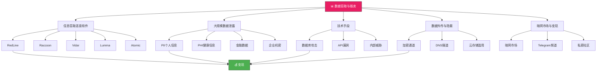

## 2. 数据窃取与贩卖技术

数据是数字时代最值钱的"硬通货"。在暗网黑产生态中，数据窃取与贩卖构成了整个犯罪产业链的中枢环节——上游提供窃取工具和技术，下游提供账户接管、金融欺诈、商业间谍等变现场景。理解这一环节，是掌握黑客搞钱路径的核心前提。



### 2.1 信息窃取恶意软件（Infostealers）

信息窃取恶意软件（Infostealer）是数据贩卖链条的技术基石。它们以"即插即用"的方式在受害者设备上自动运行，无需攻击者手动操作，即可将高价值数据打包外传。

#### 2.1.1 工作原理与窃取目标

Infostealer 的核心逻辑分为三个阶段：**静默部署 → 自动采集 → 加密外传**。

**部署阶段**：通过钓鱼邮件附件、恶意广告（Malvertising）、软件捆绑、虚假下载页面等渠道进入目标设备。部署后通常会在注册表、计划任务或启动项中建立持久化机制，确保设备重启后仍可运行。

**采集阶段**：Infostealer 会遍历目标设备上的关键数据源，包括：

| 数据类型 | 具体目标 | 价值等级 |
|---------|---------|---------|
| 浏览器凭证 | Chrome/Firefox/Edge 保存的登录名、密码、Cookie、自动填充数据 | ★★★★★ |
| 加密货币资产 | 钱包文件（.dat、.json）、助记词、私钥、交易历史 | ★★★★★ |
| 即时通讯数据 | Telegram、Discord、Skype 的聊天记录、联系人列表、Token | ★★★★ |
| 系统信息 | 主机名、IP 地址、已安装软件列表、VPN 配置、远程桌面凭证 | ★★★ |
| 剪贴板数据 | 复制的密码、加密货币地址、敏感文本 | ★★★ |
| 截图与录屏 | 桌面截图、屏幕录制片段（部分高级 Infostealer 支持） | ★★★ |

**外传阶段**：采集到的数据通过加密通道（通常是 HTTPS 或自定义加密协议）发送至攻击者控制的 C2（命令与控制）服务器。数据会被打包成所谓的"日志"（Logs），包含受害者的 IP 地址、地理位置、设备指纹、浏览器 Cookie 等完整画像。

#### 2.1.2 主流 Infostealer 全景分析

| 名称 | 开发语言 | 主要特征 | 暗网价格（月） | 首次出现 |
|------|---------|---------|--------------|---------|
| **RedLine** | C++ | 功能全面，支持 20+ 浏览器和钱包，社区活跃度高，占据市场主导地位 | $100-$200 | 2020 |
| **Raccoon** | C++ | 最早采用 MaaS（Malware-as-a-Service）模式，提供 C2 面板和日志管理 | $200/月 或 $120/周 | 2019 |
| **Vidar** | C++ | 持续更新，反分析能力强，支持多种反沙箱检测技术 | $130-$300 | 2019 |
| **Lumma** | Rust | 新兴威胁，采用 Rust 编写提升性能和稳定性，支持模块化扩展 | $250-$1000 | 2022 |
| **Atomic** | Swift | 专门针对 macOS 平台，可窃取 Safari 密码、1Password 数据 | $1000 | 2022 |
| **Anubis** | C++ | 轻量级，主要针对浏览器和钱包，价格较低 | $60-$100 | 2021 |
| **Meduza** | C++ | 功能与 RedLine 相似，部分开发者认为两者存在代码同源关系 | $100-$150 | 2021 |

> **关键洞察**：Infostealer 市场已进入"军备竞赛"阶段。攻击者之间的竞争推动了功能升级——从最初的简单密码窃取，发展到现在的多平台支持、反沙箱、反调试、模块化和定制化 C2 面板。Lumma 采用 Rust 编写是一个标志性事件，表明攻击者开始追求更高的代码质量和执行效率。

#### 2.1.3 数据流转与变现路径

```text
信息窃取恶意软件感染受害者设备
    ↓
自动采集目标数据（浏览器、钱包、通讯应用等）
    ↓
数据通过加密通道外传至 C2 服务器
    ↓
数据被打包为"日志"（Logs），包含完整受害者画像
    ↓
在暗网市场（如 BreachForums、RaidForums）或 Telegram 频道发布
    ↓
买家竞拍或按固定价格购买
    ↓
买家利用数据进行：
├── 账户接管（ATO）：利用 Cookie 直接登录账户，绕过 2FA
├── 金融欺诈：利用信用卡信息或银行凭证进行盗刷
├── 撞库攻击：利用用户名+密码组合尝试登录其他平台
├── 商业间谍：获取企业敏感信息用于竞争
└── 进一步网络入侵：以受害者设备为跳板攻击内网
```

**Cookie 劫持的特殊价值**：Cookie 是 Infostealer 采集数据中价值最高的资产之一。与密码不同，Cookie 可以直接模拟用户会话，绕过密码验证和双因素认证（2FA）。攻击者只需将窃取到的 Cookie 注入自己的浏览器，即可直接以受害者身份登录账户，整个过程无需知道密码。

### 2.2 大规模数据泄露变现

当攻击者成功入侵企业或组织的数据库，窃取到海量数据后，变现策略远比个人数据窃取复杂得多。大规模数据泄露的变现涉及数据分类、定价策略、销售渠道选择等多个维度的决策。

#### 2.2.1 数据分类与定价体系

数据在黑市上的价值取决于其**新鲜度**（是否已被公开）、**完整性**（字段是否齐全）、**规模**（记录数量）和**稀缺性**（是否独家获取）。

| 数据类型 | 典型内容 | 单价范围 | 价值驱动因素 |
|---------|---------|---------|------------|
| **PII（个人身份信息）** | 姓名+身份证号+地址+电话 | $0.5-$20/条 | 国家差异巨大（美国>$中国>$欧洲），含 SSN 的价格翻倍 |
| **PHI（受保护健康信息）** | 病历、诊断记录、保险信息、基因数据 | $1-$1000/条 | 含基因数据或精神健康记录的价格可达$1000+ |
| **信用卡磁条数据** | 卡号+有效期+CVC+持卡人姓名 | $20-$80/条 | 含 CVV 的完整数据比仅卡号贵 3-5 倍 |
| **银行凭证** | 网银账号+密码+安全问题 | $50-$500/条 | 账户余额越高价格越高，含 2FA 凭证的价格翻倍 |
| **登录凭证** | 邮箱+密码组合 | $0.01-$1/条 | 含已验证活跃账户的价格更高，批量价格递减 |
| **企业机密** | 源代码、商业计划、客户数据库、专利文件 | $10K-$1M+ | 定价差异巨大，取决于商业价值 |
| **政府数据** | 公民数据库、军事信息、外交文件 | $50K-$10M+ | 国家级数据泄露通常涉及政治勒索 |

> **定价规律**：数据价格遵循"边际递减"原则。前 1 万条数据可能每条$1，但第 10 万条可能只需$0.1。攻击者通常采用"阶梯定价"策略——小批量高价、大批量低价，以最大化总收益。

#### 2.2.2 数据清洗与增值处理

原始泄露数据往往包含大量冗余、重复或无效记录。专业的数据贩卖者会进行"数据清洗"以提升售价：

1. **去重**：移除重复记录，确保每条数据唯一
2. **验证**：通过 API 或自动化脚本验证邮箱是否活跃、电话是否有效
3. **分类**：按国家、行业、数据完整度等维度分组定价
4. **富化**：将不同来源的数据关联匹配，构建完整的个人画像（例如将邮箱泄露与社交媒体数据结合）
5. **格式化**：将数据整理为买家可直接使用的格式（CSV、JSON、数据库 dump）

经过清洗和富化的数据，售价通常比原始数据高出 2-10 倍。

#### 2.2.3 出售方式与策略

| 出售方式 | 描述 | 适用场景 | 收益特点 |
|---------|------|---------|---------|
| **独占出售** | 以高价将数据卖给单一买家，签署独家协议 | 高价值企业数据、政府数据 | 单次收益最高，$10K-$1M+ |
| **独家权销售** | 限时独家（如 30 天），到期后公开销售 | 中等价值数据 | 兼顾独家溢价和后续收益 |
| **批量批发** | 大批量低价出售，薄利多销 | 海量低价值数据（如邮箱+密码） | 总量大但单价低，$0.01-$1/条 |
| **拍卖模式** | 在暗网市场公开拍卖，价高者得 | 稀有或高价值数据 | 可能获得意外高价，也可能流拍 |
| **免费泄露** | 公开部分数据以建立信誉或施压 | 勒索场景、政治目的 | 不直接获利，但可换取赎金或影响力 |
| **订阅模式** | 按月/年订阅访问数据库，持续收费 | 持续更新的数据源 | 稳定现金流，但需持续维护 |

#### 2.2.4 真实案例：数据泄露的规模与影响

- **Equifax（2017）**：1.47 亿人的 PII 数据泄露，包括 SSN、出生日期、地址。暗网数据被多次转售，最终 Equifax 支付 7 亿美元和解金。
- **Facebook（2019）**：5.33 亿用户数据泄露，包括全名、电话号码、邮箱、城市。数据在暗网以$0.1/条的价格批量出售。
- **T-Mobile（2021）**：3700 万客户数据泄露，包括 SSN、驾照号。攻击者最初要求 300 万美元赎金，未获支付后公开了部分数据。
- **Change Healthcare（2023）**：美国最大医疗数据平台之一被勒索软件攻击，涉及 1 亿患者的 PHI 数据。该事件导致美国医疗系统大面积瘫痪，凸显了 PHI 数据的极高价值。

### 2.3 数据窃取的技术手段

数据窃取的技术手段是攻击者获取数据的"武器库"。掌握这些手段的原理，有助于理解攻击路径并制定防御策略。

#### 2.3.1 数据库攻击

数据库是数据窃取的核心目标。攻击者通过以下手段获取数据库访问权限：

**SQL 注入（SQL Injection）**

SQL 注入是数据库攻击中最经典、最有效的手段。当应用程序未对用户输入进行适当过滤，攻击者可以将恶意 SQL 代码注入查询语句，从而绕过身份验证、读取任意数据、甚至修改数据库结构。

```sql
-- 经典 SQL 注入示例
-- 原始查询：SELECT * FROM users WHERE username = '$input'
-- 攻击者输入：admin' OR '1'='1
-- 实际执行：SELECT * FROM users WHERE username = 'admin' OR '1'='1'
-- 结果：返回所有用户记录

-- UNION 注入获取其他表数据
-- 攻击者输入：' UNION SELECT username, password FROM admin_users--
-- 实际执行：SELECT * FROM users WHERE username = '' UNION SELECT username, password FROM admin_users--
```

**盲注（Blind SQL Injection）**

当应用程序不直接返回查询结果时，攻击者通过布尔条件或时间延迟来推断数据内容：

```sql
-- 布尔盲注：通过页面响应差异判断条件真假
' AND SUBSTRING(password, 1, 1) = 'a'--

-- 时间盲注：通过响应延迟判断条件真假
' AND IF(SUBSTRING(password, 1, 1) = 'a', SLEEP(5), 0)--
```

**数据库配置缺陷**

- **默认密码**：MySQL 的 root 用户默认无密码，MongoDB 默认无认证
- **未授权访问**：数据库端口（3306/5432/27017）直接暴露在公网
- **弱密码策略**：使用"admin/admin"、"root/123456"等弱密码组合
- **过度权限**：数据库用户拥有不必要的 DROP、GRANT 等高危权限

**备份文件暴露**

云存储桶（AWS S3、Azure Blob、阿里云 OSS）配置错误导致备份文件公开访问是近年来最常见的数据泄露原因之一：

```text
# 常见暴露的备份文件类型
- database_backup_20240601.sql.gz
- customers_dump_20240601.csv
- full_backup_20240601.tar.gz
- mysql_dump_20240601.sql
```

#### 2.3.2 API 安全漏洞

API 是现代应用的核心接口，也是数据窃取的重要突破口。

**不安全的直接对象引用（IDOR）**

当 API 使用可预测的 ID（如自增数字）且未验证用户权限时，攻击者可以通过修改 ID 参数访问其他用户的数据：

```http
# 正常请求：获取自己的订单
GET /api/v1/orders/12345 HTTP/1.1
Authorization: Bearer user_token

# IDOR 攻击：尝试获取其他用户的订单
GET /api/v1/orders/12346 HTTP/1.1
Authorization: Bearer user_token
```

**批量数据抓取（BOLA - Broken Object Level Authorization）**

当 API 缺少速率限制和分页控制时，攻击者可以编写脚本批量抓取所有数据：

```python
# 批量抓取示例（攻击者视角）
import requests

base_url = "https://target.com/api/v1/users/"
headers = {"Authorization": "Bearer stolen_token"}

for i in range(1, 100000):
    response = requests.get(f"{base_url}{i}", headers=headers)
    if response.status_code == 200:
        save_data(response.json())
```

**API 密钥泄露**

API 密钥泄露是数据窃取的"捷径"。常见泄露途径包括：

- 前端代码中硬编码 API 密钥（GitHub 仓库、CDN 缓存）
- 配置文件未加密提交到版本控制
- 日志文件中记录敏感信息
- 移动端应用被反编译提取密钥

#### 2.3.3 内部威胁

内部威胁往往是最难防范的数据窃取途径，因为攻击者拥有合法的访问权限。

**员工滥用权限**

拥有数据库管理员（DBA）权限的员工可以直接导出全量数据。2020 年，一名前 Facebook 工程师利用其访问权限下载了 5.33 亿用户的个人信息，并在暗网出售。

**离职员工数据带走**

员工离职前通过 U 盘、云盘、个人邮箱等方式拷贝敏感数据。企业通常缺乏有效的数据防泄漏（DLP）机制来检测和阻止这种行为。

**收买内部人员**

攻击者通过金钱、威胁或情感操控收买内部人员，获取数据库访问凭证或敏感信息。这种方式成本较低但风险较高，因为被收买的员工可能反水或留下证据。

### 2.4 数据外传与隐蔽技术

窃取到数据后，如何安全、隐蔽地将数据传出目标网络是攻击链的关键环节。

#### 2.4.1 加密通道

攻击者使用 HTTPS、TLS 等标准加密协议与 C2 服务器通信，使数据流量在常规网络监控中"隐身"：

```text
受害者设备 → HTTPS (443端口) → 攻击者控制的代理服务器 → C2 服务器
```

由于 HTTPS 是互联网的标准协议，大多数企业防火墙不会阻止 443 端口的出站流量，这为数据外传提供了天然掩护。

#### 2.4.2 DNS 隧道

DNS 隧道是一种高级隐蔽技术，利用 DNS 协议的特性将数据隐藏在 DNS 查询和响应中：

```text
# 正常 DNS 查询
www.example.com → DNS服务器 → 返回IP地址

# DNS 隧道（数据隐藏在子域名中）
dGhpcyBpcyBhIHNlY3JldCBtZXNzYWdl.evil.com → DNS服务器 → 返回编码后的数据
```

DNS 隧道可以绕过大多数防火墙和入侵检测系统（IDS），因为 DNS 流量（53 端口）通常不会被深度检测。

#### 2.4.3 云存储滥用

攻击者利用云存储服务（Google Drive、Dropbox、OneDrive）作为数据中转站：

1. 将窃取的数据上传到云存储
2. 通过云存储的分享链接将数据传递给同伙
3. 利用云存储的合法流量掩盖数据传输

这种方式的优势是云存储的流量不会被企业防火墙拦截，且数据在云端有备份，即使本地设备被销毁，数据仍然安全。

#### 2.4.4 分片与延迟外传

为了避免触发异常流量检测，高级攻击者会采用分片和延迟策略：

- **分片**：将大数据集拆分成小片段，分多次传输
- **延迟**：在正常工作时间（如上午 9-11 点）外传数据，模拟正常业务流量
- **伪装**：将数据流量伪装成正常的业务应用流量（如伪装成 Google Analytics 或 Office 365 流量）

### 2.5 暗网市场与变现生态

数据窃取后的变现环节是整个链条的最终目标。暗网市场、Telegram 频道和私密社区构成了数据贩卖的三大渠道。

#### 2.5.1 暗网市场生态

暗网市场是数据贩卖的主要平台，具有以下特征：

| 市场名称 | 类型 | 主要商品 | 支付方式 | 活跃状态 |
|---------|------|---------|---------|---------|
| **BreachForums** | 论坛+市场 | 数据泄露、凭证、工具 | 加密货币 | 活跃 |
| **RaidForums** | 论坛+市场 | 数据泄露、信用卡数据 | 加密货币 | 已关闭（2022） |
| **XSS** | 论坛+市场 | 数据泄露、信用卡数据 | 加密货币 | 活跃 |
| **DarkMatter** | 论坛 | 数据泄露讨论、情报 | 加密货币 | 活跃 |

**交易流程**：

1. **发布**：卖家在论坛发布数据样本（前 100-1000 条），展示数据质量
2. **验证**：买家购买小样本验证数据真实性和完整性
3. **谈判**：双方就价格、数量、交付方式达成一致
4. **支付**：买家通过加密货币（通常是比特币或门罗币）支付
5. **交付**：卖家通过加密网盘或私人链接交付完整数据
6. **评价**：交易完成后双方互评，建立信誉体系

#### 2.5.2 Telegram 频道

Telegram 因其强加密和匿名特性，已成为数据贩卖的第二大渠道：

- **公开频道**：发布数据样本和价格信息，吸引买家
- **私密群组**：实际交易在私密群组中进行
- **Bot 交易**：自动化 Bot 处理订单和交付，减少人工干预

Telegram 频道的优势是门槛低、传播快，但数据质量参差不齐，诈骗风险较高。

#### 2.5.3 私密社区与定制交易

高价值数据（如企业机密、政府数据）通常不在公开市场交易，而是通过私密社区或一对一谈判完成：

- **邀请制社区**：仅限经过验证的买家和卖家加入
- **中间人模式**：由可信的第三方中介撮合交易
- **定制服务**：根据买家需求定制数据内容（如特定行业的客户数据）

### 2.6 常见误区与纠正

| 误区 | 纠正 |
|------|------|
| "数据越多越值钱" | 数据质量比数量更重要。1000 条已验证的活跃账户数据比 100 万条垃圾数据更有价值 |
| "暗网市场是唯一的变现渠道" | Telegram、私密社区、直接联系买家都是重要的变现渠道 |
| "窃取数据就能赚钱" | 从窃取到变现涉及多个环节，包括数据清洗、验证、定价、销售等，每个环节都有风险 |
| "加密就能完全隐藏" | 加密可以隐藏数据内容，但流量模式、元数据、时间特征等仍可能被分析 |
| "内部威胁无法防范" | 通过最小权限原则、行为监控、离职审计等手段可以有效降低内部威胁风险 |

### 2.7 防御者视角：关键防护节点

理解攻击者的手段，是为了更好地防御。以下是数据防泄漏的关键节点：

1. **终端防护**：部署 EDR（终端检测与响应）系统，检测 Infostealer 的行为特征
2. **网络监控**：监控异常出站流量，特别是非标准端口的加密流量
3. **数据库安全**：实施最小权限原则、定期审计、敏感数据加密存储
4. **API 安全**：实施严格的身份验证和授权、速率限制、输入验证
5. **内部管控**：实施最小权限、行为监控、离职审计、数据防泄漏（DLP）
6. **安全意识培训**：定期培训员工识别钓鱼邮件、社会工程学攻击

### 本章小结

数据窃取与贩卖技术构成了网络犯罪产业链的核心环节。从 Infostealer 的自动化采集，到大规模数据泄露的分类变现，再到暗网市场的交易生态，整个链条呈现出高度的专业化、产业化特征。理解这一链条的每一个环节，不仅是防御者的必修课，也是理解现代网络犯罪生态的关键。

数据在数字时代的价值只增不减，而围绕数据的攻防博弈也将持续升级。攻击者不断开发新的窃取技术和隐蔽手段，防御者则通过更先进的检测技术和防护策略进行应对。这场永不停歇的猫鼠游戏，正是网络安全领域的核心主题。