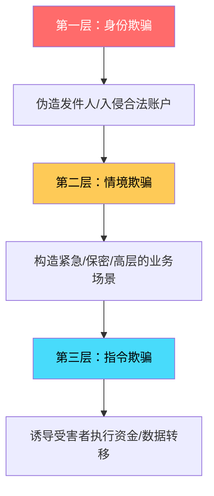
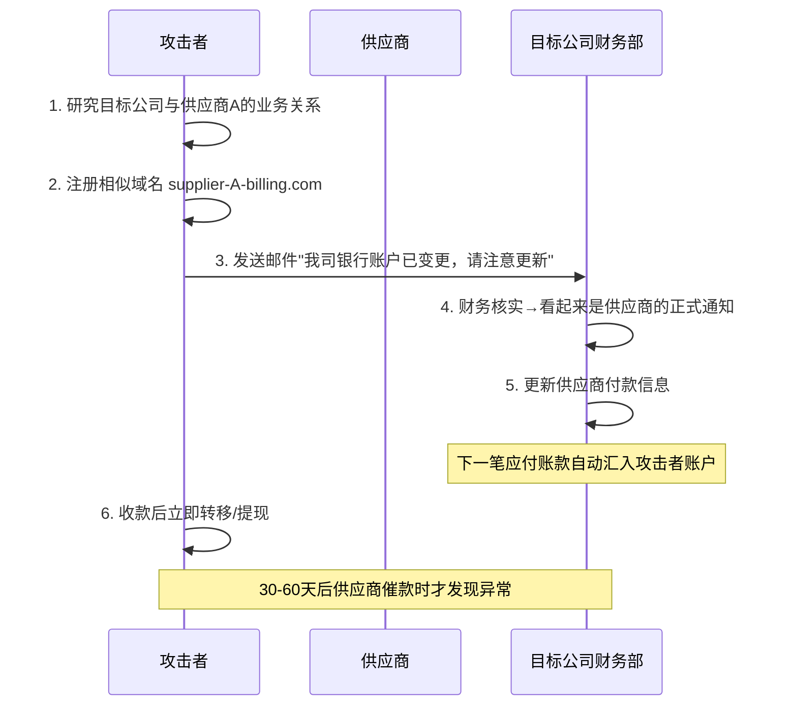

# 4. 商业电子邮件欺诈（BEC）

## 4.1 概述：为什么BEC是网络犯罪界的"印钞机"

商业电子邮件欺诈（Business Email Compromise，简称BEC）是当今网络犯罪领域中**投资回报率最高的攻击形式之一**。与需要复杂技术栈的勒索软件或需大规模感染的数据窃取不同，BEC的核心武器是社会工程学——它不攻击系统漏洞，而是攻击人性弱点。

### 4.1.1 损失规模：用数据说话

根据FBI互联网犯罪投诉中心（IC3）的年度报告，BEC的经济损失呈现持续攀升趋势：

| 年份 | 投诉数量 | 调整后损失（美元） | 占网络犯罪总损失比例 |
|------|----------|--------------------|--------------------|
| 2020 | 19,369起 | 18.7亿 | 约43% |
| 2021 | 19,954起 | 24亿 | 约35% |
| 2022 | 21,832起 | 27亿 | 约31% |
| 2023 | 21,489起 | 29亿+ | 约27% |
| 2024 | 33,000+起（预估） | 31亿+（预估） | 持续为最大单一类别 |

**关键数据解读：**

- **每起BEC攻击的平均损失约为12.5万美元**，远高于其他类型的网络诈骗（勒索软件平均约2万美元，钓鱼攻击平均约1.5万美元）
- FBI估计实际损失可能是报告数字的**3-5倍**——大量企业因声誉顾虑选择不报案
- BEC受害者中，**小型企业占63%**——它们往往没有专职安全团队和标准化付款流程
- 国际转账追回率极低：**仅约5-15%**的资金能够追回（24小时内启动追回流程的情况下）
- 单笔最大BEC损失记录：2016年某科技公司因CEO欺诈损失**1.17亿美元**

### 4.1.2 BEC的攻击原理：三层欺骗模型

BEC攻击之所以屡试不爽，是因为它构建了**三层欺骗结构**：



**第一层——身份欺骗**：让受害者相信邮件来自可信任的发件人（老板、供应商、律师、HR）。攻击者通过伪造发件人地址、入侵合法邮箱、或利用显示名欺骗来建立虚假身份。

**第二层——情境欺骗**：营造一个需要立即行动的"真实"业务场景。常见场景包括：紧急收购、保密项目、供应商账户变更、税务审计、法律和解等。这些场景的共同特点是——它们天然合理且不方便公开讨论。

**第三层——指令欺骗**：给出看似合理但实际违法的操作指令。通常是资金转移、数据发送、账户信息更新等。指令被精心设计为"在正常业务流程中也会出现"的样子，降低受害者的警觉性。

三层叠加，受害者往往在发现异常之前就已经完成了转账。

### 4.1.3 BEC vs 其他网络攻击：为什么它是"性价比之王"

| 攻击类型 | 技术门槛 | 单次投入 | 平均收益 | 复用性 | 被检测概率 |
|----------|----------|----------|----------|--------|-----------|
| 勒索软件 | 高 | $5K-50K | $2-50万 | 低（加密/反分析） | 中-高 |
| 数据窃取 | 中-高 | $2K-20K | $1-10万 | 中 | 中 |
| 钓鱼攻击 | 低 | $100-1K | $0.5-2万 | 高 | 低-中 |
| **BEC** | **极低** | **$50-500** | **5-125万** | **极高** | **极低** |
| 加密货币劫持 | 中 | $1K-10K | $1-5万 | 中 | 低 |

BEC之所以成为网络犯罪界的"印钞机"，核心原因有三：

1. **零技术门槛**：不需要编写恶意代码、不需要漏洞利用、不需要搭建基础设施——只需要一封精心构造的邮件
2. **超高ROI**：投入$50注册一个相似域名，可能换来$50万以上的收益，ROI高达10万倍
3. **极难检测**：没有恶意附件、没有恶意链接、没有恶意代码——传统的邮件安全网关几乎无法识别

---

## 4.2 BEC攻击类型详解（五种基本款与变种）

### 4.2.1 CEO欺诈（假冒高管类）

这是BEC中最经典也最广为人知的类型。攻击者冒充公司CEO、创始人或其他高管，向财务负责人（CFO/财务总监/出纳）发送紧急转账指令。

**典型剧本：**

> **发件人：** CEO张总 <zhang.zong@company.com（实际是zhang.zong@cornpany.com）>
> **收件人：** 财务总监王经理
> **主题：** 【紧急/保密】重大收购项目资金安排
>
> 王经理：
>
> 我正在参加一个非常重要的并购谈判，现在需要你立即完成一笔保密转账，金额为$847,500。这笔款项是收购诚意金的一部分，竞争对手也在竞价，所以我们必须在今天下午3点前完成支付。
>
> 我在会议中不方便通话（请注意：这是关键话术——制造无法验证的障碍），所有沟通通过邮件进行。以下是收款账户信息：
> 银行：XXX银行
> 账号：XXXXXX
> 收款人：XXX公司
>
> 收到请立即处理，完成后回复确认。

**为什么这种手法屡试不爽？**

| 因素 | 解释 | 心理学原理 |
|------|------|-----------|
| 权力压迫 | 来自最高层的指令，下级不敢质疑 | 权威偏差（Milgram实验：65%的人会服从权威的错误指令） |
| 时间紧迫 | "今天下午3点前"制造高压环境 | 稀缺性原理（Cialdini：稀缺的事物被赋予更高价值） |
| 保密理由 | "收购项目"天然需要保密，禁止与其他同事确认 | 信息不对称操控 |
| 沟通阻断 | "在会议中不方便通话"阻止电话验证 | 预判性阻断（提前封堵受害者的验证路径） |
| 金额合理 | 对大型企业而言$84万并非异常业务金额 | 锚定效应（金额在日常业务范围内不会触发警报） |

**真实案例：**

- **FACC案（2016年，奥地利）**：航空部件制造商FACC被CEO欺诈攻击，损失达**4200万欧元**。攻击者冒充CEO向财务部发送转账指令，要求向多个海外账户付款。公司CEO和CFO均因此事件被解雇，公司股价暴跌。
- **Unaoil案（2017年，澳大利亚）**：犯罪团伙通过BEC手段窃取了某能源公司约**1800万美元**的合同保证金，利用伪造的高管邮件和相似域名实施欺诈。
- **Facebook/Google案（2013-2015年）**：一名立陶宛诈骗犯通过BEC骗取了Facebook和Google共计**1.21亿美元**。他创建了伪装成富士康的虚假域名，向两家公司的财务部门发送发票，骗取了近两年的反复付款——直到一次异常审查才被发现。
- **某中国外贸企业案（2020年）**：深圳某电子外贸企业被冒充德国供应商的BEC攻击，损失**87万美元**（约合人民币600万元）。攻击者在供应商邮箱被入侵后潜伏了三个月，观察了真实的付款流程后才下手。

### 4.2.2 供应商欺诈（发票重定向类）

攻击者冒充与目标公司有业务往来的供应商，通知"收款账户已变更"，将未来的付款重定向到攻击者控制的账户。

**攻击流程：**



**此类攻击的关键技巧：**

- **时机选择**：攻击者会研究供应商的发票周期和付款节点，选在季度末或财年末等繁忙时段下手——此时财务部门工作量最大，核查最容易疏忽
- **信息增量**：邮件中会包含真实的采购订单号、发票金额、合同编号等信息（通常来自前期渗透或泄露数据），增强可信度
- **域名欺骗**：使用与真实供应商域名仅差一两个字符的相似域名（如 supply-chain.com 改为 supp1y-chain.com，其中"1"替换"l"）
- **渐进式信任**：部分攻击者先发一封"正式通知"（不涉及具体金额），等对方确认后，再发带有银行账户信息的正式变更函——分两步降低受害者的警觉

**进阶变种——三方合谋式：**

部分攻击者同时冒充供应商和目标公司，进行双向欺骗：
1. 冒充供应商发变更通知给目标公司
2. 同时冒充目标公司回复"已更新，请确认"
3. 当双方都"确认"后，欺诈更难被发现

**真实数据：** 根据Agari（现HelpSystems）的调查，供应商欺诈占BEC攻击总量的约**14%**，但单笔损失金额通常高于CEO欺诈——因为涉及的是周期性付款的持续性重定向，往往在30-60天后才被发现，累计损失可达数十万美元。

### 4.2.3 律师欺诈（法务紧急类）

攻击者冒充律师、法务顾问或律所合伙人，以"法律保密"为由要求紧急转账。这类攻击利用了**律师-客户保密特权**作为天然的验证屏障——正常流程下律师也不应透露案件细节给第三方。

**典型剧本特征：**

- **专业术语**：邮件中大量使用法律术语（"根据NDA条款"、"本次settlement协议"、"根据attorney-client privilege"）
- **保密强化**：反复强调"受法律保密保护"、"不得与任何第三方讨论"
- **时间压力**：以"法院截止日期"、"和解窗口期"等制造紧迫感
- **金额合理**：通常在公司法律费用的正常范围内
- **身份背书**：附上伪造的律师名片、律所抬头纸、甚至伪造的法院文件

**警示信号：** 真实的律师事务所通常会通过正式信函发送账单，且会有多个联系人。如果一个"律师"只通过邮件沟通且不允许与其他人确认，是典型的红旗信号。

**真实案例：** 2019年，香港某律所被冒充发起BEC攻击，针对多家国际企业发送"紧急和解付款"邮件，总损失超过**2500万美元**。攻击者使用了与真实律所高度相似的域名和邮件签名。

### 4.2.4 数据窃取型（W-2/HR欺诈）

攻击目标不是资金，而是**员工的个人身份信息（PII）**。攻击者冒充公司高管（通常是CEO），向HR部门发送请求，要求提供所有员工的W-2税务表或其他敏感信息。

**典型剧本：**

> **主题：** 紧急：年度税务审计所需员工数据
>
> 由于我们正在进行年度内部税务合规审计，我需要所有员工（2023-2024年度）的W-2表格副本和社保号末四位。请整理成加密PDF发给我。
>
> 项目时间紧迫，请今天内完成。

**为什么HR容易上当？**

| 心理因素 | 具体表现 |
|----------|----------|
| 工作惯性 | 获取员工信息是HR的日常工作内容之一 |
| 权威服从 | 来自"CEO"的请求不会显得异常 |
| 风险低估 | 没有直接的金钱转移（感觉"风险较低"） |
| 伪装防护 | 攻击者会用"加密发送"来伪装安全意识 |
| 群体盲区 | HR通常不被认为是攻击目标，安全意识培训较少覆盖HR |

**后果严重性：** 一旦员工W-2信息泄露，攻击者可利用这些信息进行税务欺诈（以员工名义提交虚假退税申报）、身份盗窃、信用卡申请等。一次成功的W-2 BEC攻击可能影响数百甚至上千名员工，后续的衍生诈骗成本难以估量。

**真实案例：** 2016年，Snapchat一名新员工在接到伪装成CEO的电话和邮件后，将所有员工的工资信息发送给攻击者。虽然没有直接资金损失，但全体员工面临身份被盗风险，公司被迫为每位员工提供一年的信用监控服务。

### 4.2.5 账户接管型（Account Takeover）

这是BEC中技术含量最高但成功率也最高的变种。攻击者不是"假装"某人，而是**真的控制了该人的邮箱账户**。

**实现路径：**

1. **凭证窃取**：通过钓鱼邮件、键盘记录器、数据泄露库获得目标邮箱密码
2. **会话劫持**：窃取邮箱的登录会话Token（Cookie），绕过密码验证
3. **OAuth授权**：诱导用户授权恶意的第三方应用访问邮箱
4. **密码重置链**：利用弱安全问题或未绑定MFA的账户进行密码重置

**账户接管后的操作：**

| 阶段 | 操作 | 目的 | 持续时间 |
|------|------|------|---------|
| 潜伏期 | 设置邮件转发规则（自动转发到攻击者邮箱） | 持续监控业务对话 | 1-4周 |
| 观察期 | 阅读收件箱/发件箱历史邮件 | 了解业务关系、资金流向、沟通风格 | 2-6周 |
| 时机选择 | 等待或创造合适的业务场景 | 最大化成功率 | 1-3个月 |
| 行动期 | 从合法账户直接发送欺诈邮件 | 绕开所有身份验证 | 1-24小时 |
| 善后期 | 删除已发送邮件和收件箱中的相关对话 | 延缓被发现的时间 | 持续进行 |

**关键防守漏洞：** 许多企业的安全策略只检查入站邮件（外部→内部），对内部邮件（内部→内部）的信任度极高。当欺诈邮件来自CEO的真实邮箱时，所有邮件安全网关都会放行。

**真实案例：** 2022年，某跨国企业被发现CEO邮箱已被入侵长达**4个月**。攻击者在此期间监控了数十笔正常业务交易后，选择了一笔85万美元的供应商付款进行篡改——仅修改了银行账号中的两位数字。直到供应商未收到款项进行追踪时才被发现。

---

## 4.3 BEC攻击的社会工程学深度剖析

### 4.3.1 信息收集（OSINT阶段）

成功的BEC攻击不靠运气，靠**情报准备**。攻击者在扣动扳机前已经做了大量功课：

**公开途径收集的信息：**

| 信息来源 | 收集内容 | 用途 |
|----------|----------|------|
| LinkedIn | 组织架构、职位、工作关系 | 确定目标人选的层级关系 |
| 公司官网 | 管理层姓名、照片、简历 | 伪造发件人身份 |
| 招股书/年报 | 供应商名单、财务数据 | 选择供应商欺诈目标 |
| 新闻稿 | 重大业务事件、人事变动 | 制造真实业务场景 |
| SEC文件 | 高管签字样式、沟通风格 | 模仿签名和措辞 |
| GitHub | 员工邮箱、内部项目信息 | 邮箱探测和上下文收集 |
| 企业社交媒体 | 业务动态、合作公告 | 构建可信的业务背景 |
| 行业展会/会议 | 谁在什么场合见过谁 | 利用"我上次在XX会见过你"建立信任 |

**非公开途径：**

- **前期钓鱼**：向目标公司员工发送钓鱼邮件，收集邮箱账户凭证
- **暗网数据**：从已泄露的数据集中获取员工邮箱、密码、电话号码
- **电话前置调查**：以"市场调研"、"供应商评估"等名义致电目标公司，套取内部信息
- **物理渗透**：伪装成快递员、维修人员进入目标公司办公区域，观察内部运作流程
- **社交媒体渗透**：添加目标公司员工作为好友，通过长期互动获取内部信息

### 4.3.2 权威服从心理的武器化

BEC攻击之所以高效，是因为它精确触发了组织中根深蒂固的行为模式：

**权威偏差（Authority Bias）：**
- 来自"CEO"的指令天然具有不可质疑性
- 财务人员被训练为"执行指令"而非"质疑指令"
- 攻击者利用"保密"理由进一步压制质疑意愿
- **心理学基础**：Stanley Milgram的服从实验表明，65%的人会服从权威人物的错误指令，即使违背自己的判断

**紧急偏差（Urgency Bias）：**
- 人类在压力下会回归到"执行模式"而非"验证模式"
- "截止日期"激活了避害心理（害怕失去机会/造成损失）
- 攻击者通过压缩时间窗口来阻止受害者的理性思考
- **神经科学解释**：紧急状态会激活杏仁核（情绪脑），抑制前额叶皮层（理性脑）的功能

**承诺一致性（Commitment Consistency）：**
- 财务人员一旦开始执行转账流程，就倾向于完成它
- 即使中途产生怀疑，也会用"已经开始了"来合理化继续操作
- 攻击者利用分步指令（先准备，再审核，最后确认）逐步加深受害者的投入
- **心理学基础**：Robert Cialdini的承诺与一致性原则——人倾向于保持与先前行为一致的立场

**社会认同（Social Proof）：**
- 攻击者在邮件中暗示"其他部门/同事已经确认"
- "法务部门已经审核过这个方案"让财务人员觉得无需再次核查

### 4.3.3 邮件伪装技术大全

攻击者使用的邮件伪装技术从低到高分为多个层次：

**第一层：显示名欺骗**
- 设置邮件显示名为"CEO张总"，但实际邮箱地址完全不同
- 移动端尤其危险——许多手机邮件客户端只显示发件人姓名，不显示完整地址
- **检测方法**：在电脑端查看完整的邮件头信息，检查实际发件人地址

**第二层：相似域名欺骗**
- 使用视觉上接近的域名：cornpany.com（rn→m）、c0mpany.com（o→0）
- 使用域名变体：company-billing.com、company.co（混淆.com和.co）
- 使用子域名欺骗：company.com.attacker.com（长域名后真正的一级域名是attacker.com）
- **变体手法**：
  - 同形异义词攻击（Homograph Attack）：使用西里尔字母"а"（U+0430）替代拉丁字母"a"
  - Unicode域名：利用国际化域名（IDN）注册视觉相似的域名
  - 子域名混淆：pay.company.com.attacker.com（看起来像company.com的子域名）

**第三层：合法域名+邮箱伪造**
- 利用配置不当的邮件服务器（开放中继、SPF/DKIM/DMARC缺失）
- 直接伪造From: 头为 ceo@company.com
- 部分接收服务器放行此类邮件（SPF检查宽松时）
- **2023年数据**：全球仍有约30%的企业域名未配置DMARC（Valimail报告），这为伪造提供了可乘之机

**第四层：入侵合法账户**
- 最高级形式——直接控制目标邮箱
- 100%通过邮件身份验证（因为发件人和发件服务器都是合法的）
- 还能同时监控后续对话，随时介入引导
- **检测难度**：最高——所有技术验证（SPF/DKIM/DMARC）全部通过

### 4.3.4 邮件头伪造实操分析

对于安全研究人员，理解邮件头是检测BEC的关键技能。以下是真实的邮件头分析示例：

```text
From: CEO张总 <zhang.zong@company.com>
To: finance@target.com
Subject: 紧急付款
Received: from mail.attacker-server.net (mail.attacker-server.net [185.xx.xx.12])
    by mx.target.com with ESMTP id xxxxxx
    for <finance@target.com>; Mon, 26 Jun 2026 09:15:32 +0800
SPF: softfail (mail.attacker-server.net: domain of zhang.zong@company.com does not designate 185.xx.xx.12 as permitted sender)
DKIM: none
DMARC: fail (company.com) header.from=company.com
```

**分析要点：**
1. **Received头**：显示邮件实际来自 mail.attacker-server.net（IP: 185.xx.xx.12），而非company.com的合法邮件服务器
2. **SPF结果**：softfail——攻击者的IP不在company.com的SPF授权列表中，但接收方服务器未拒绝（仅标记为可疑）
3. **DKIM结果**：none——邮件没有有效的DKIM签名
4. **DMARC结果**：fail——SPF和DKIM均未通过验证，但接收方的DMARC策略可能是p=none（仅监控，不拒绝）

**关键教训：** 即使存在上述明显的伪造迹象，如果接收方的邮件安全策略不够严格（DMARC策略为p=none），这封伪造邮件仍然会被投递到收件人邮箱。

---

## 4.4 技术增强型BEC（下一代攻击）

传统BEC主要依靠手动操作和基本邮件伪造，而**现代BEC已全面升级**，整合了多项前沿技术。

### 4.4.1 AI生成邮件（大语言模型的应用）

**ChatGPT之前的BEC邮件特征：**
- 语法错误、用词不自然
- 篇幅短、缺乏细节
- 文化语境（如俚语、行业术语）使用不当
- 容易被邮件安全规则的"语言异常"检测发现
- 中国本土化特征：繁简混用、标点符号异常（英文标点与中文标点混用）

**AI生成的BEC邮件特征：**
- 语言流畅自然，无明显语法错误
- 可生成任意长度的"有说服力的文本"
- 能模仿特定人员的写作风格（通过上传其历史邮件做少样本学习）
- 可自动适配不同文化背景的语言习惯
- 能生成多个版本进行A/B测试
- 可根据受害者的反应动态调整邮件内容（对话式AI）

**攻击者实操流程：**

```text
1. 从目标邮箱/公开来源收集高管的历史邮件样本（5-20封）
2. 将样本输入LLM（GPT-4/Claude/本地模型），并提示：
   "请分析以下邮件样本的写作风格特征：句式结构、用词习惯、
   标点使用偏好、常用表达、邮件格式习惯"
3. 生成欺诈邮件草稿：
   "请用上述风格写一封主题为'紧急收购项目资金安排'的邮件，
   语气紧迫但专业，符合中国商务邮件习惯"
4. 迭代优化：根据反馈调整措辞
5. 添加符合目标文化的细节（节假日、行业术语、内部缩写）
6. 最终版本发送
```

**AI降低的门槛：** 以前需要母语者或高水平翻译才能写出自然的跨语言欺诈邮件，现在AI可以在任意语言中生成高质量内容——这使得BEC攻击可以轻松跨国界实施。

### 4.4.2 深度伪造语音/视频（Deepfake）

这是BEC领域最令人不安的进化方向——攻击者不仅伪造文字，还伪造声音和影像。

**语音克隆（Deepfake Audio）：**

| 技术参数 | 详细说明 |
|----------|----------|
| 所需素材 | 3-30秒的目标人物语音样本（可从公开演讲、采访、内部会议录音获取） |
| 主要工具 | ElevenLabs（商业级）、Resemble AI、开源项目（Coqui TTS、So-VITS-SVC、OpenVoice） |
| 克隆质量 | 经过良好训练的语音克隆在电话中几乎无法与真人区分 |
| 成本 | 商业API：$0.1-1/分钟；本地部署：仅需GPU时间 |
| 资料获取 | LinkedIn演讲视频、公司发布会、播客访谈、内部会议录像 |

**结合场景——语音验证绕过：**

> CFO收到CEO的邮件指令后，按照公司流程拨打CEO电话核实。
>
> 电话接通：
> "喂，张总，我收到您的邮件说要转移84万美元到新账户..."
> （电话那头传来CEO标志性的声音）
> "对，那个项目很紧急，你尽快处理。我在谈判中不方便多说。"
>
> CFO完全相信了——他亲自打了CEO的电话，听到了CEO的声音。
>
> 他不知道的是：攻击者通过以下方式之一实现了语音伪造：
> - **实时语音克隆**：使用AI模型实时将攻击者的声音转换为目标人物的声音
> - **预录制片段**：从目标人物的公开演讲中提取相关片段进行拼接
> - **SIM卡交换**：通过SIM Swap劫持目标人物的手机号，使来电显示为CEO的号码

**深度伪造视频（Deepfake Video）：**

| 技术参数 | 详细说明 |
|----------|----------|
| 所需素材 | 1-3分钟的目标人物正面视频 |
| 当前费用 | $500-2000/分钟（专业制作），价格正在快速下降 |
| 适用场景 | 录制"视频指令"发送给财务团队，或冒充CEO在视频会议中短暂露面 |
| 2024年进展 | 开源工具（如Deep-Live-Cam）已能实现实时视频换脸 |
| 未来趋势 | 预计2-3年内，视频伪造成本将降至$50/分钟以下 |

### 4.4.3 自动化狩猎平台

高级BEC攻击者不再手动发送每封邮件，而是**配置自动化平台**进行大规模精准打击：

| 功能模块 | 具体能力 |
|----------|----------|
| 目标收集器 | 自动抓取LinkedIn、公司官网、新闻稿中的目标信息 |
| 画像生成器 | 基于OSINT数据自动生成目标公司的组织架构和业务关系图 |
| 邮件生成器 | 基于LLM模板自动撰写个性化欺诈邮件 |
| 发送引擎 | 通过配置好的代理/中继批量发送（规避IP信誉检测） |
| 回复路由器 | 自动回复受害者的追问，维持对话热度 |
| 收款管理 | 自动检查收款状态，触发资金快速转移 |
| 多语言适配 | 根据目标公司所在地区自动切换语言和文化语境 |

**此类平台能在一天内向数百个目标公司发送高度定制的BEC邮件**，并自动跟进回复，大幅提高了攻击者的产出效率。

### 4.4.4 中间人攻击（MITM型BEC）

攻击者入侵邮箱后不立即行动，而是**潜伏观察**，等待"自然的付款窗口"出现：

**典型场景：**

1. 攻击者入侵了供应商A的邮箱
2. 供应商A的销售正在和目标公司B讨论一笔$50万的合同
3. 攻击者监控着A和B的所有邮件往来
4. 当双方确定付款细节（金额、时间、账户）后
5. 攻击者在B发出"请发送最终发票"的瞬间
6. 拦截该邮件，修改供应商A的回复，将收款账户替换为攻击者账户
7. 双方的后续邮件往来都被攻击者监控和修改

**这是最难检测的BEC形式，因为：**
- 所有邮件来自合法账户
- 付款场景是"真实"的（不是凭空制造）
- 修改仅涉及账户信息一个字段
- 受害者核对所有其他信息（联系人、合同号、产品）都正常

### 4.4.5 跨平台BEC攻击

现代BEC攻击已不局限于电子邮件，攻击者开始利用多种通信渠道构建复合攻击：

| 攻击渠道 | 手法 | 检测难度 |
|----------|------|---------|
| 电子邮件 + 即时通讯 | 邮件发指令，微信/Teams发确认 | 极高 |
| 邮件 + 视频会议 | 视频中Deepfake露面确认 | 极高 |
| 邮件 + 电话 | 语音克隆电话验证 | 高 |
| 即时通讯平台 | 直接在微信/Teams中冒充高管 | 高 |
| 社交媒体 | 通过LinkedIn/微信朋友圈建立信任后实施 | 中-高 |

---

## 4.5 BEC防御体系（多层次纵深防御）

抵御BEC不能靠单一方案，必须建立**技术+流程+人员**三层防御体系。

### 4.5.1 技术防护层

**邮件身份验证三件套（必经检查）：**

| 协议 | 作用 | 配置要点 |
|------|------|----------|
| SPF | 指定哪些服务器可以代表你的域名发邮件 | 精确列出所有合法发件IP，避免+include过多 |
| DKIM | 用数字签名验证邮件是否被篡改 | 定期轮换签名密钥（建议90天） |
| DMARC | 定义SPF/DKIM失败时的处理策略 | 从监控(p=none)逐步过渡到拒绝(p=reject) |

**三项技术中，DMARC最为关键。** 根据Valimail的数据，2023年全球仍有约30%的企业域名未配置DMARC，其中大部分为中小企业——这正是攻击者的首选目标。

**DMARC配置进阶建议：**

```text
# 第一阶段：监控（1-3个月）
v=DMARC1; p=none; rua=mailto:dmarc-reports@yourdomain.com

# 第二阶段：隔离（3-6个月，确认无误后）
v=DMARC1; p=quarantine; pct=100; rua=mailto:dmarc-reports@yourdomain.com

# 第三阶段：拒绝（6个月后，全面实施）
v=DMARC1; p=reject; sp=reject; rua=mailto:dmarc-reports@yourdomain.com
```

**高级邮件安全网关（SESG）：**

- **异常检测**：分析发件人行为模式（通常这个时间/地点不会发邮件）
- **语言分析**：检测邮件内容中的异常措辞、紧迫性诱导、业务请求偏移
- **链接分析**：实时扫描邮件中的链接，检测重定向链和恶意域名
- **附件沙箱**：在隔离环境中打开邮件附件，检测恶意行为
- **发件人画像**：建立每个发件人的历史行为基线，检测偏离

**内部邮件行为监控：**

- 检测异常的邮件转发规则（特别是自动转发到外部地址）
- 监控异常的登录行为（异地登录、新设备登录、非工作时间登录）
- 标记"CEO/CFO"等高危账户的异常操作（高危账户二次验证）
- 定期审计邮箱的自动回复和转发规则

**推荐防御工具清单：**

| 工具类型 | 推荐方案 | 适用场景 |
|----------|----------|----------|
| 邮件安全网关 | Proofpoint、Mimecast、Microsoft Defender for Office 365 | 中大型企业 |
| DMARC管理平台 | Valimail、Agari、dmarcian | 所有企业 |
| UEBA平台 | Exabeam、Securonix | 检测账户异常行为 |
| 威胁情报 | Recorded Future、Mandiant | 了解最新BEC攻击手法 |
| 开发者工具 | checkdmarc（Python库） | 自动化DMARC审计 |

### 4.5.2 流程防护层

**双人审批制度（最有效的BEC防线）：**

> **核心规则：** 任何涉及资金转移的操作，必须经过两个独立的人员审批。
>
> - 第一人：发起付款申请（财务助理/会计）
> - 第二人：审批并授权（财务经理/CFO）
> - 额外验证：超过$X金额需要第三个审批（CEO/董事会）

**关键流程规定：**

1. **禁止仅凭邮件指令进行付款转移**——所有资金操作必须通过既定审批系统（ERP/银行平台）
2. **付款账户变更必须电话回拨验证**——使用存储在系统中的原始联系电话，而不是邮件中提供的号码
3. **回拨验证采用"已知号码"原则**——不使用邮件中提到的电话，不使用通话记录中的号码（攻击者可篡改来电显示），而是使用公司通讯录或银行预留的原始号码
4. **设置冷静期**：大额转账至少等待24小时后才执行（给发现异常留出时间窗口）
5. **异常标识**：对非常规时间（非工作时间、假期）、非常规目的地（新账户、海外账户）的付款自动标记为高风险
6. **付款金额阈值**：设置分级审批——$1K以下单人审批，$1K-10K双人审批，$10K以上三人审批+电话确认

**"出站验证"流程（Out-of-Band Verification）：**

```text
┌─────────────────────────────────────────────────────────┐
│                  付款变更验证流程                          │
├─────────────────────────────────────────────────────────┤
│                                                         │
│  收到"更改收款账户"的邮件请求                              │
│         ↓                                                │
│  步骤1：在系统内标记该请求为"异常"                          │
│         ↓                                                │
│  步骤2：从公司通讯录中找到供应商的原始联系人                  │
│         ↓                                                │
│  步骤3：拨打通讯录中的号码（不是邮件里的号码）                │
│         ↓                                                │
│  步骤4：通过面对面或电话（非邮件）确认变更请求                │
│         ↓                                                │
│  步骤5：只有双人确认后才能更新系统                          │
│         ↓                                                │
│  步骤6：更新后发送确认通知到双方邮箱（变更记录存档）          │
│                                                         │
└─────────────────────────────────────────────────────────┘
```

### 4.5.3 人员培训层

**针对BEC的专项培训内容：**

**识别红旗信号（Red Flags）：**

| 红旗信号 | 具体表现 | 应对措施 |
|----------|----------|----------|
| 紧迫性 | "立即"、"紧急"、"今天必须"、"截止时间" | 暂停执行，独立验证 |
| 保密性 | "不要告诉任何人"、"机密项目"、"仅你我知道" | 正常保密不等于禁止验证 |
| 非常规请求 | 平时不直接联系财务的高管突然发付款指令 | 电话回拨确认 |
| 账户变更 | 供应商突然要求更改收款账户（尤其是海外账户） | 必须出站验证 |
| 沟通阻断 | "在飞机上"、"在会议中"、"没有信号" | 无法通话本身就是信号 |
| 情感操纵 | "全靠你了"、"这关系到公司"、"不要让公司失望" | 情感压力不等于操作依据 |
| 域名异常 | 发件人域名有细微差异（多一个字母、少一个点） | 仔细检查发件人地址 |

**"停下来想一想"训练：**

培训员工在遇到涉及资金/敏感信息的邮件时，执行以下三步：

```text
RULE-4 BEC防护法：

R - Recognize（识别）：邮件中有没有红旗信号？
U - Verify（验证）：通过独立渠道（电话/当面/系统）验证请求
L - Learn（归档）：确认异常后，报告IT部门并归档作为培训案例
E - Educate（教育）：在团队内共享该案例，提升整体防御意识
```

**攻防演练（模拟BEC攻击）：**

- 定期由内部安全团队或聘请第三方进行BEC模拟攻击
- 覆盖不同类型的BEC场景（CEO欺诈、供应商欺诈、律师欺诈）
- 追踪每次演练的点击率/回复率，识别高风险部门和个人
- 对"上当"的员工进行有针对性的再培训（非惩罚性质）
- 演练结果作为企业安全文化建设的重要KPI
- 建议频率：每季度一次BEC模拟攻击，每年一次全公司安全意识评估

### 4.5.4 小企业与个人防护

小企业（员工<50人）由于缺乏专职安全团队和标准化流程，是BEC攻击的首选目标。以下是针对小企业的简化防护方案：

**最低成本防护（年费<$500）：**

1. **启用DMARC**：在域名注册商处配置基本的DMARC记录（免费）
2. **启用MFA**：为所有邮箱账户启用多因素认证（免费/低成本）
3. **建立付款确认流程**：制定简单规则——任何超过$1000的付款必须电话确认
4. **员工培训**：每年至少一次BEC识别培训（可使用免费的CISA培训资源）
5. **供应商账户变更协议**：与所有供应商签订协议，明确"账户变更必须双方电话确认"

---

## 4.6 应急响应：当BEC攻击已经发生

即使有最好的防御，BEC攻击仍可能突破防线。**黄金救援时间是转账后的24-72小时**——超过这个窗口，资金追回概率急剧下降。

### 4.6.1 立即响应流程（0-2小时）

```text
第一优先级：联系银行

1. 立即致电汇出银行的反欺诈部门
   → 要求：紧急止付（Stop Payment）/ 召回（Recall）/ 撤销（Reverse）
   → 提供：交易编号、金额、收款账户、交易时间
   
2. 同时致电收款银行的反欺诈部门
   → 要求：冻结/锁死收款账户
   → 注意：国际转账需要速度更快——不同国家的法律框架不同

3. 如果涉及国际转账，联系FBI IC3
   → 提交BEC投诉（ic3.gov）
   → FBI可通过国际执法合作渠道联系收款方所在国的执法机构
   → 对于$10万以上的案件，FBI会优先启动"资产追回"流程

4. 中国境内BEC
   → 立即拨打110报警
   → 联系反诈中心（96110）申请紧急止付
   → 联系开户银行的反欺诈部门
```

**资金追回成功率与时间的关系：**

| 响应时间 | 资金追回概率 | 说明 |
|----------|-------------|------|
| 0-24小时 | 40-60% | 银行可启动止付/冻结程序 |
| 24-72小时 | 15-30% | 资金可能已被转移 |
| 3-7天 | 5-15% | 资金通常已被多层转移或提现 |
| 7天以上 | <5% | 几乎不可能追回 |

### 4.6.2 调查与取证（2-24小时）

| 取证项目 | 具体操作 | 目的 |
|----------|----------|------|
| 邮件头分析 | 提取完整的邮件头（SMTP路径、IP地址、时间戳） | 追踪攻击来源 |
| 账户审计 | 检查被入侵邮箱的登录历史、已设置规则、已发送邮件 | 评估入侵范围 |
| 关联分析 | 检查攻击者是否联系了其他员工/客户/供应商 | 评估影响范围 |
| 日志导出 | 保存所有相关日志（邮件服务器、防火墙、终端） | 证据保全 |
| 银行记录 | 获取完整的转账记录和收款方信息 | 资金追踪 |

**邮件头提取命令（供IT团队参考）：**

```bash
# 从邮件文件中提取完整头信息
cat suspicious_email.eml | grep -E "^Received:|^From:|^To:|^Subject:|^Date:|^Message-ID:|^DKIM-Signature:|^SPF:|^Authentication-Results:"

# 追踪邮件路径
cat suspicious_email.eml | grep "^Received:" | head -10

# 检查邮件认证结果
cat suspicious_email.eml | grep -i "authentication-results"
```

**使用Python进行邮件头分析：**

```python
import email
from email import policy
from email.parser import BytesParser

# 解析.eml文件
with open('suspicious_email.eml', 'rb') as f:
    msg = BytesParser(policy=policy.default).parse(f)

# 提取关键信息
print(f"From: {msg['From']}")
print(f"Return-Path: {msg['Return-Path']}")
print(f"Received: {msg.get_all('Received')}")
print(f"SPF: {msg.get('Authentication-Results', '')}")

# 分析Received头链（从最后一跳到第一跳）
received_headers = msg.get_all('Received', [])
for i, header in enumerate(received_headers):
    print(f"\n--- Hop {i+1} ---")
    print(header)
```

### 4.6.3 通知与善后

- **内部通知**：向全员发布安全公告，告知BEC攻击模式（不点名具体上当人员），提醒全员警惕
- **外部通知**：
  - 如果涉及客户数据泄露，按法规要求通知受影响客户
  - 如果涉及供应商账户欺诈，通知相关供应商协助调查
  - 如果涉及员工数据泄露（W-2欺诈），为受影响员工提供信用监控服务
  - 如果涉及国际转账，通知收款方国家的执法机构
- **流程改进**：事件后72小时内完成根因分析，更新相关防御措施
- **保险理赔**：如果公司购买了网络安全保险，立即联系保险公司启动理赔程序（大多数BEC保单要求72小时内报案）

---

## 4.7 法律法规与合规视角

### 4.7.1 中国法律框架

在中国，BEC攻击涉及多项法律：

| 法律 | 相关条款 | 适用范围 | 量刑参考 |
|------|----------|----------|----------|
| 《刑法》第266条 | 诈骗罪 | BEC攻击者刑事责任 | 数额巨大：3-10年有期徒刑 |
| 《刑法》第285条 | 非法获取计算机信息系统数据罪 | 账户入侵行为 | 情节严重：3-7年有期徒刑 |
| 《刑法》第253条 | 侵犯公民个人信息罪 | W-2类数据窃取 | 情节严重：3-7年有期徒刑 |
| 《网络安全法》 | 数据保护义务 | 受害企业的报告义务 | 未报告可处罚款 |
| 《个人信息保护法》 | 个人信息泄露通知义务 | W-2类BEC的数据泄露通报 | 72小时内须通知 |
| 《反电信网络诈骗法》（2022年） | 电信网络诈骗综合防治 | 跨境BEC攻击 | 强化了跨境追诉机制 |

**实践指导：**
- 受害企业应在**72小时内**向公安机关报案，并同步通知行业主管部门
- 涉及个人信息泄露的，应根据《个人信息保护法》第57条通知受影响个人
- 跨境BEC案件可通过国际刑警组织（INTERPOL）的渠道请求协助
- 企业可通过"国家反诈中心"APP举报可疑邮件和电话

### 4.7.2 美国监管要求

- **SEC披露要求**：上市公司必须在Form 8-K中披露重大网络安全事件（包括BEC造成的重大损失），2023年SEC新规要求在发现事件后4个工作日内披露
- **FBI IC3报告**：所有BEC攻击建议向FBI报备（非强制，但影响追回成功率）
- **州级数据泄露通知**：W-2信息泄露触发各州的数据泄露通知法要求
- **FBI Recovery Asset Team（RAT）**：FBI成立了专门的资产追回团队，对BEC案件中的银行转账可在72小时内发起紧急冻结请求——但前提是受害者必须及时报案
- **FinCEN报告**：金融机构有义务向FinCEN报告可疑的BEC相关交易

### 4.7.3 国际合作机制

BEC攻击往往是跨境犯罪，国际合作对于资金追回至关重要：

| 机制 | 参与方 | 适用场景 |
|------|--------|---------|
| FBI IC3 | 美国FBI | 针对美国企业的BEC案件 |
| INTERPOL | 国际刑警组织 | 跨国BEC案件协作 |
| Egmont Group | 全球金融情报机构网络 | 涉及洗钱的BEC案件 |
| MLAT（刑事司法协助条约） | 双边条约缔约国 | 跨境证据调取和嫌疑人引渡 |
| 中国反诈中心 | 公安部 | 中国境内BEC案件 |

---

## 4.8 BEC攻击的未来趋势

对BEC攻击者而言，技术和工具只会越来越好用：

| 趋势 | 影响 | 时间线 | 防御应对 |
|------|------|--------|---------|
| AI邮件完美化 | 语法和风格检测将彻底失效 | 已发生 | 转向行为分析和流程验证 |
| 实时语音克隆 | 电话验证防线被突破 | 已发生 | 多因素验证，不依赖单一通道 |
| 视频会议深度伪造 | 视频验证也靠不住 | 正在发生 | 建立内部暗号/安全问题机制 |
| 超个性化攻击（Hyper-Personalization） | 每封欺诈邮件都基于目标画像实时生成 | 1-2年内 | 强化员工培训和模拟演练 |
| BEC即服务（BEC-as-a-Service） | 技术门槛降到脚本小子也能玩 | 已出现 | 提升整体安全意识 |
| 供应链级BEC | 同时冒充供应链中的多个环节 | 正在发展 | 供应链安全审计 |
| 多模态攻击 | 邮件+语音+视频+即时消息联合攻击 | 1-3年内 | 跨渠道验证协议 |
| 量子计算威胁 | 未来可能破解邮件签名加密 | 5-10年 | 跟进后量子密码学标准 |

### 4.8.1 AI军备竞赛：攻防两端的博弈

**攻击端的AI进化：**
- LLM可以生成符合任何文化背景、行业特点的欺诈邮件
- 实时对话式AI可以持续与受害者沟通，动态调整策略
- 多模态AI可以同时生成文本、语音、视频内容
- AI可以自动分析受害者的回复，判断是否即将上钩

**防御端的AI进化：**
- 邮件安全网关开始使用AI检测"意图异常"（即使邮件语法完美，但意图可疑）
- 用户行为分析（UEBA）系统可以检测"这个时间/这个金额/这个收款方"的异常
- AI辅助的DMARC分析可以自动识别钓鱼域名
- 实时深度伪造检测技术正在发展（如检测AI生成语音的微小特征）

### 4.8.2 中国市场特殊趋势

- **微信/钉钉BEC**：攻击者开始在企业即时通讯平台上冒充高管，因为这些平台的安全防护通常弱于邮件
- **跨境电商BEC**：针对跨境电商卖家，冒充平台客服或买家实施欺诈
- **加密货币洗钱**：BEC骗取的资金通过加密货币快速转移，增加追回难度
- **AI语音诈骗电话**：结合AI语音克隆的电话诈骗在中国已有大量案例（如2023年某香港跨国公司被骗2亿港元的AI视频会议诈骗案）

---

## 4.9 小结：对攻击者的终极理解

BEC的本质不是技术漏洞，而是**信任的货币化**。攻击者不破解你的防火墙，他们破解你的业务流程和人性弱点。

防御BEC的核心原则可以归结为一句话：

> **信任不可替代验证。** 任何涉及资金或敏感信息的请求，无论来自谁、无论多紧急、无论理由多充分，都必须通过独立渠道验证。

将这个原则制度化、流程化、工具化，是抵御BEC最有效的方式。

**给不同角色的最终建议：**

| 角色 | 核心行动 |
|------|---------|
| 企业管理层 | 建立双人审批制度，设立付款冷静期，投资邮件安全基础设施 |
| 财务人员 | 任何资金操作必须出站验证（非邮件通道），永远不要仅凭邮件执行转账 |
| IT安全团队 | 配置SPF/DKIM/DMARC三件套（从监控到拒绝），部署邮件安全网关 |
| HR部门 | 敏感员工数据请求必须电话确认，建立数据分级制度 |
| 所有员工 | 看到紧急/保密/高层请求时，先停下来，通过独立渠道验证 |

---

> **进阶阅读：**
> - FBI IC3年度互联网犯罪报告：www.ic3.gov
> - 美国CISA BEC防护指南：www.cisa.gov/stopransomware/business-email-compromise
> - 《社会工程学：人类弱点的艺术》（Christopher Hadnagy著）
> - OWASP邮件安全最佳实践
> - 中国国家反诈中心：www.12321.cn
> - Valimail DMARC报告：www.valimail.com
> - 《商业电子邮件欺诈：调查与防御》（Siddharth Srinivasan著）
