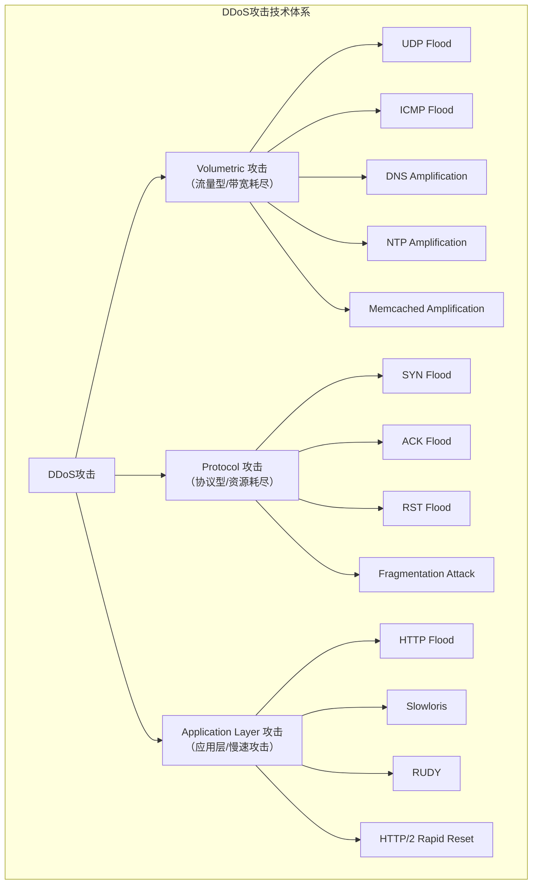
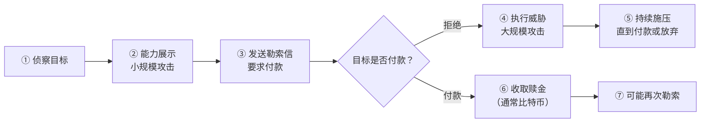
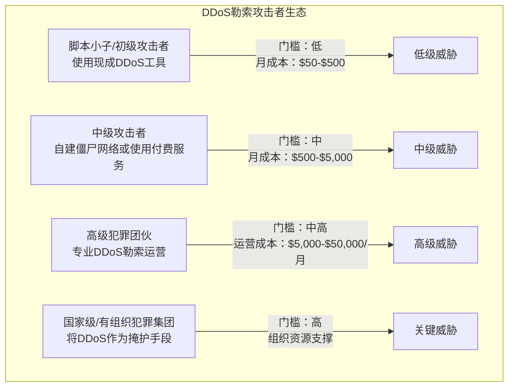
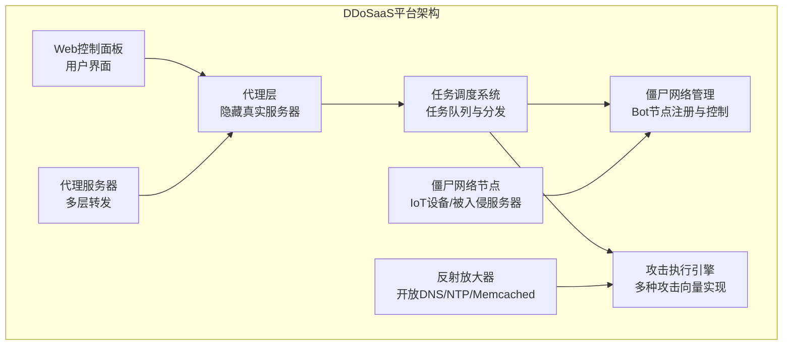
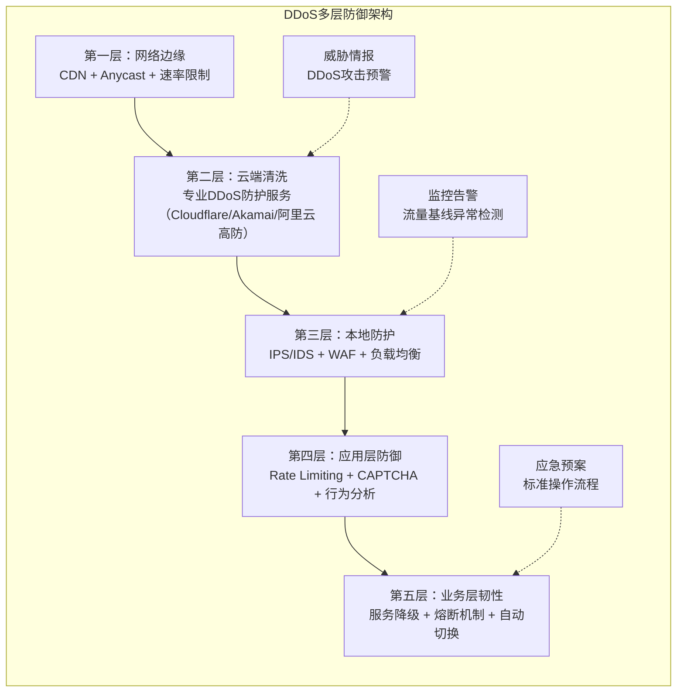

## 6. DDoS勒索与保护费

DDoS（Distributed Denial of Service，分布式拒绝服务）攻击是最古老、最直接的网络攻击手段之一，而DDoS勒索则是攻击者利用这一手段牟利的典型模式。与勒索软件需要复杂的入侵和加密流程不同，DDoS勒索的攻击门槛更低、威慑力更直观——"让目标网站无法访问"本身就是一个可见的、可证明的威胁。

根据 Cloudflare《2024年DDoS威胁报告》，全球DDoS攻击次数在2024年同比增长超过50%，其中勒索型DDoS（Extortion DDoS，简称Extortion）攻击占比约15%，且呈持续增长趋势。Akamai《2024年互联网安全报告》显示，约40%的DDoS攻击背后附带勒索意图。这类攻击的受害者集中在在线赌博、金融服务、游戏服务器、SaaS服务提供商、流媒体平台等高可用性要求的行业——业务每中断一分钟都意味着真金白银的损失。

本节将系统剖析DDoS勒索的完整生态，从攻击技术原理到商业模式，从真实案例到防御策略，帮助安全从业者全面理解这一威胁。

### 6.1 DDoS攻击技术分类

要理解DDoS勒索，首先需要掌握DDoS攻击本身的技术体系。DDoS攻击按攻击目标的网络层次分为三大类：



#### 6.1.1 流量型攻击（Volumetric Attacks）

流量型攻击的核心目标是耗尽目标的网络带宽。攻击者通过向目标发送海量数据包，使合法用户无法获得足够的带宽来访问服务。

**常见技术手段：**

| 攻击类型 | 原理 | 放大倍数 | 典型攻击规模 |
|----------|------|----------|-------------|
| UDP Flood | 向目标发送大量UDP数据包 | 1:1 | 100Gbps-1Tbps |
| ICMP Flood | 向目标发送大量ICMP Echo请求 | 1:1 | 50-500Gbps |
| DNS Amplification | 向开放DNS解析器发送伪造源IP的查询请求，响应数据重定向至目标 | 28-54倍 | 300Gbps+ |
| NTP Amplification | 利用NTP monlist命令的放大效应 | 556.9倍 | 1Tbps+ |
| Memcached Amplification | 利用未认证的Memcached服务器的UDP响应放大 | 10,000-51,000倍 | 2.3Tbps（记录最大值） |
| SSDP Amplification | 利用UPnP协议的SSDP服务放大 | 30.8倍 | 100Gbps+ |

**放大攻击的原理：** 放大攻击是DDoS中最高效的技术之一。以DNS放大攻击为例：

```text
1. 攻击者向全球数万个开放DNS解析器发送查询请求
2. 请求包很小（约60字节），但伪造源IP为目标地址
3. DNS解析器将响应（约3000字节）发送到目标
4. 放大倍数：3000/60 ≈ 50倍
5. 攻击者用1Gbps的带宽，可产生50Gbps的攻击流量
```

2018年GitHub遭遇的Memcached放大攻击达到了1.35Tbps，是当时有记录的最大规模DDoS攻击。攻击者仅使用了约110,000个Memcached反射器，就产生了远超目标带宽的攻击流量。

#### 6.1.2 协议型攻击（Protocol Attacks）

协议型攻击不以带宽耗尽为目标，而是消耗目标服务器或中间网络设备（如防火墙、负载均衡器）的连接表和状态资源。

**SYN Flood攻击原理：**

```text
正常TCP三次握手：
  客户端 → SYN → 服务器（服务器分配资源，进入SYN-RECEIVED状态）
  客户端 ← SYN-ACK ← 服务器
  客户端 → ACK → 服务器（连接建立，资源释放）

SYN Flood攻击：
  攻击者 → SYN → 服务器（服务器分配资源）
  攻击者 → SYN → 服务器（又分配资源）
  攻击者 → SYN → 服务器（继续分配）
  ... 数百万个半开连接 ...
  → 服务器连接表耗尽，无法接受新连接
```

**SYN Cookie防御机制：** 现代操作系统普遍支持SYN Cookie，即在收到SYN时不立即分配资源，而是在SYN-ACK中编码连接信息。只有收到合法的ACK后才分配资源。这使得单纯的SYN Flood攻击效果大打折扣，攻击者转向更复杂的协议攻击手段。

#### 6.1.3 应用层攻击（Application Layer Attacks）

应用层攻击是最隐蔽、最难防御的DDoS类型。攻击者模拟合法用户的HTTP请求，每个请求看起来都是正常的，但大量请求的累积效应会导致服务器资源耗尽。

**Slowloris攻击：**

```text
Slowloris的核心原理：
1. 攻击者向目标建立大量HTTP连接
2. 每个连接发送不完整的HTTP请求头部
3. 不断发送额外的头部行，但始终不发送请求结束标志
4. 服务器为每个"未完成"的请求保持连接等待
5. 当所有可用连接槽被占满，正常请求无法建立连接

关键参数：
- 每15秒向每个连接发送一个新头部行（防止超时断开）
- 同时维持数百到数千个这样的"慢速"连接
- 仅需极低的带宽（几十Kbps即可）
```

**HTTP/2 Rapid Reset（CVE-2023-44487）：** 2023年10月，Google披露了一种利用HTTP/2协议缺陷的新攻击手法。攻击者在极短时间内发送大量请求并立即重置，利用服务器处理RST_STREAM帧的开销来耗尽资源。Google自身遭受了3.98亿次/秒请求的攻击，Cloudflare报告了该攻击影响了多家大型互联网服务。

**应用层攻击的关键特征：**

| 特征 | 说明 | 防御难度 |
|------|------|----------|
| 低速率即可 | 仅需几十到几百Mbps即可瘫痪大型网站 | 高（无法简单限速） |
| 模拟正常请求 | User-Agent、Header、行为模式与正常用户一致 | 极高 |
| 针对最脆弱环节 | 通常瞄准数据库查询、搜索、API等计算密集型接口 | 高 |
| 智能化演进 | 新一代攻击使用无头浏览器，完整执行JavaScript | 极高 |

### 6.2 DDoS勒索的商业模式

DDoS勒索已经从早期的个体黑客行为演变为一种成熟的犯罪商业模式，具有清晰的分工和定价体系。

#### 6.2.1 勒索流程



**典型的DDoS勒索邮件内容（真实案例改编）：**

```text
Subject: URGENT - DDoS Attack Warning

Your infrastructure will be subjected to a DDoS attack if you do not
comply with the following instructions.

We have tested your defenses and identified critical vulnerabilities.
Your website will be taken offline for a minimum of 24 hours unless
you agree to pay a one-time protection fee of 2 Bitcoin (≈$60,000).

Payment address: bc1q[redacted]

If payment is not received within 72 hours, we will commence a
full-scale attack. We will also target your secondary and backup
infrastructure.

This is not a bluff. See attached proof of our capability [link to
attack log].

- The Anonymous Collective (this is not affiliated with Anonymous)
```

**勒索邮件的典型特征：**
- 使用匿名邮箱（ProtonMail、Tutanota）或伪造发件人地址
- 语气强硬、充满紧迫感
- 附带"能力证明"——通常是小规模攻击的日志或截图
- 要求使用加密货币支付（比特币或门罗币）
- 给出明确的付款期限（通常48-72小时）
- 声称"这不是匿名组织（Anonymous）"（实际与Anonymous无关）

#### 6.2.2 勒索分层策略

成熟的DDoS勒索团伙采用分层定价策略，根据目标的规模和行业定制勒索金额：

| 目标类型 | 月营收规模 | 典型勒索金额 | 讨价还价空间 |
|----------|-----------|-------------|-------------|
| 小型游戏服务器 | <$10万/月 | $500-$2,000 | 50-80% |
| 中型在线赌博平台 | $10万-$100万/月 | $5,000-$50,000 | 30-60% |
| 大型电商平台 | >$100万/月 | $50,000-$500,000 | 20-40% |
| 金融服务机构 | 不定 | $100,000-$1,000,000+ | 较少 |
| 流媒体/SaaS平台 | 不定 | $10,000-$200,000 | 30-50% |

**关键洞察：** 攻击者会根据目标的行业和规模调整勒索金额。过高的金额可能导致目标直接报警或寻求专业防御服务；过低的金额则无法覆盖攻击成本。最优策略是设定一个"目标虽心疼但能接受"的金额——通常是目标日收入的1-3倍。

#### 6.2.3 攻击者类型分类

DDoS勒索的执行者可以分为几个层次：



### 6.3 DDoS-as-a-Service（Booter/Stresser服务）

DDoS-as-a-Service（简称DDoSaaS）是DDoS勒索生态中最关键的基础设施层。它将DDoS攻击能力商品化、服务化，使得即使不具备技术能力的人也能发起大规模DDoS攻击。

#### 6.3.1 服务模式

DDoSaaS服务通常提供以下商业模式：

| 服务模式 | 价格范围 | 特点 |
|----------|----------|------|
| **按次付费** | $10-$500/次 | 适合一次性攻击，无长期承诺 |
| **按小时计费** | $10-$300/小时 | 灵活，按攻击时长付费 |
| **日租套餐** | $50-$1,000/天 | 包含一定时长的攻击额度 |
| **月度订阅** | $100-$10,000+/月 | 最常见模式，包含基础攻击额度和高级功能 |
| **终身套餐** | $500-$50,000 | 吸引资金充裕的买家，通常为诈骗 |

**高级功能加价项：**

- **高级攻击向量**：HTTP/2 Rapid Reset、缓存破坏型攻击等新奇技术可额外收费
- **专属僵尸网络**：独享某个僵尸网络的全部带宽，价格显著高于共享模式
- **持续性攻击模式**：支持对目标进行长时间、不间断的攻击
- **IP隐藏服务**：内置多层代理和VPN，隐藏攻击者真实IP
- **技术支持**：提供"客服"协助定制攻击参数

#### 6.3.2 技术架构

一个成熟的DDoSaaS平台通常包含以下技术组件：



**Web控制面板：** 现代DDoSaaS平台提供类似SaaS产品的用户体验：

- 仪表盘显示当前可用的僵尸网络节点数量和总带宽
- 目标输入框，支持IP地址、域名、CIDR范围
- 攻击类型选择下拉菜单（UDP Flood、SYN Flood、HTTP Flood等）
- 攻击时长选择（秒、分钟、小时）
- 实时攻击状态显示（当前流量、目标响应状态）
- 历史攻击记录和统计

```text
┌──────────────────────────────────────────────┐
│  [DDoSaaS Control Panel]                     │
│                                              │
│  Available Resources:                        │
│  ├─ Bot Network: 42,381 nodes               │
│  ├─ Total Bandwidth: 847 Gbps               │
│  └─ Active Attacks: 0/5 concurrent          │
│                                              │
│  Target: [________________] IP/Domain        │
│  Attack Type: [UDP Flood     ▼]              │
│  Duration:   [300 seconds   ▼]               │
│                                              │
│  [▶ START ATTACK]                            │
│                                              │
│  Active Sessions:                            │
│  ┌─────────┬──────────┬──────────┬─────┐    │
│  │ Target  │ Type     │ Duration │ PPS │    │
│  ├─────────┼──────────┼──────────┼─────┤    │
│  │ (none)  │          │          │     │    │
│  └─────────┴──────────┴──────────┴─────┘    │
└──────────────────────────────────────────────┘
```

#### 6.3.3 僵尸网络生态

DDoSaaS服务的核心资源是僵尸网络（Botnet）。僵尸网络的组建和管理本身就是一个独立的犯罪产业：

**僵尸网络组建方式：**

| 组建方式 | 说明 | 僵尸网络规模 |
|----------|------|-------------|
| IoT设备感染 | 利用默认密码和未修复漏洞感染路由器、摄像头、DVR | 数万至数百万节点 |
| 恶意软件传播 | 通过蠕虫式传播感染Windows/Linux服务器 | 数千至数万节点 |
| 初始访问代理 | 购买已入侵的服务器访问权限 | 数百至数千节点 |
| 租用云实例 | 使用窃取的信用卡/云账号开设大量VPS | 数百节点 |

**著名僵尸网络家族：**

| 僵尸网络 | 活跃时期 | 峰值节点数 | 峰值带宽 | 主要特点 |
|----------|---------|-----------|---------|----------|
| Mirai | 2016至今 | 60万+ | 1Tbps | 开源、IoT设备感染、至今仍有变种 |
| Mēris | 2021 | 25万+ | 3.4Tbps | 利用Yandex服务的HTTP pipelining |
| Cicada3301 | 2023 | 10万+ | 1Tbps | Linux服务器感染，与勒索软件合作 |
| Freestyler | 2024 | 8万+ | 6Tbps | 专为DDoSaaS设计，混合协议攻击 |

### 6.4 DDoS勒索的目标行业分析

#### 6.4.1 在线赌博行业

在线赌博网站是DDoS勒索的首要目标。原因包括：

- **极高可用性要求**：在线赌博24/7运营，任何停机都意味着直接收入损失
- **竞争激烈的黑灰产环境**：竞争对手可能利用DDoS作为商业武器
- **支付处理复杂**：赌博网站通常使用离岸支付处理器，抗风险能力差
- **执法关注度低**：由于行业本身的法律灰色地带，受害者往往不愿报警

**典型损失模型：**

```text
假设：中型在线赌博平台，日营收约 $50,000
停机成本：$50,000/天 ÷ 24小时 ≈ $2,083/小时

DDoS勒索场景：
├─ 攻击者要求赎金：$10,000/月
├─ 未付款后果：持续攻击 48 小时
├─ 潜在损失：$2,083 × 48 = $99,984
├─ 支付赎金的"划算"比：$10,000 vs $99,984
└─ 但付款后可能被再次勒索（概率约60-70%）
```

#### 6.4.2 游戏行业

游戏服务器是DDoS勒索的第二大受害者群体。攻击者不仅为了勒索，也常利用DDoS进行商业竞争（DDoS竞争对手以吸引玩家）或打击报复（玩家因被封禁而发起攻击）。

#### 6.4.3 金融服务

金融机构面临的DDoS勒索往往金额更大、手段更专业。2012-2013年间，Operation Ababil行动中，伊朗黑客组织对美国主要银行（Bank of America、JPMorgan Chase、Wells Fargo等）发起了持续数月的DDoS攻击，造成数十亿美元损失。这虽然不是典型的"保护费"勒索，但展示了DDoS在金融领域的破坏力。

#### 6.4.4 SaaS/云服务

SaaS提供商因"一人受攻击，所有客户受影响"的特性，成为高价值目标。攻击者只需瘫痪SaaS平台的API或管理控制台，即可影响成百上千的下游企业客户。

### 6.5 DDoS勒索的经济学分析

#### 6.5.1 攻击者成本收益模型

```text
DDoS勒索攻击者月度成本估算：
├─ 僵尸网络租赁/维护：$1,000-$10,000
├─ DDoSaaS平台订阅：$200-$2,000
├─ 匿名化基础设施（VPN/代理）：$100-$500
├─ 域名和基础设施：$50-$200
├─ 勒索邮件投递（SMTP服务）：$20-$100
└─ 总月度运营成本：$1,370-$12,800

月度收益估算：
├─ 目标数量：5-50个
├─ 付款率：10%-30%（取决于目标行业）
├─ 平均赎金：$5,000-$50,000
├─ 月度预期收入：$2,500-$750,000
└─ ROI（投资回报率）：2x-58x
```

**关键洞察：** DDoS勒索的ROI虽然不如勒索软件（后者一次成功攻击可获利数十万到数百万美元），但胜在"低风险、可重复、低技术门槛"。勒索软件需要入侵目标系统、避开EDR检测、加密数据，每一步都有被发现的风险；而DDoS攻击几乎无法被追踪到攻击者真实身份。

#### 6.5.2 防御者成本分析

防御DDoS攻击的成本远高于攻击者：

| 防御措施 | 月度成本 | 效果 |
|----------|----------|------|
| 云DDoS防护（Cloudflare/Akamai） | $200-$50,000+ | 有效抵御大多数攻击 |
| 自建清洗中心 | $500,000+/年 | 完全控制，但成本极高 |
| 高防IP服务 | $1,000-$10,000/月 | 适合特定高价值业务 |
| CDN+速率限制 | $100-$5,000/月 | 基础防护，无法应对大规模攻击 |
| ISP级别过滤 | $500-$5,000/月 | 上游过滤，但对应用层无效 |

**防御者困境：** 攻击者每次发起DDoS攻击的边际成本接近零（使用已有僵尸网络），但防御者的防护成本是固定的、持续的。这意味着只要攻击者坚持，防御者始终处于经济劣势——这正是DDoS勒索能够持续存在的根本原因。

### 6.6 真实案例分析

#### 案例一：Proton Mail DDoS勒索事件（2015）

**背景：** Proton Mail是瑞士的加密邮件服务商，以隐私保护著称。

**攻击过程：**
1. 攻击者要求Proton Mail支付BTC赎金
2. 遭到拒绝后，攻击者对Proton Mail及其上游网络发起大规模DDoS攻击
3. 攻击规模达到40Gbps，不仅影响Proton Mail，还波及同网段的其他服务
4. Proton Mail的ISP无法有效过滤攻击流量

**结果与教训：**
- Proton Mail拒绝支付赎金
- 公开事件经过，获得公众和媒体支持
- 引入Cloudflare等第三方DDoS防护服务
- 事后Proton Mail建立了多层DDoS防护架构，包括Anycast网络和多ISP冗余

#### 案例二：GitHub遭受Memcached放大攻击（2018）

**背景：** GitHub是全球最大的代码托管平台。

**攻击过程：**
1. 2018年2月28日，GitHub遭受峰值1.35Tbps的DDoS攻击
2. 攻击手法：Memcached UDP反射放大攻击
3. 攻击者利用约110,000个暴露在互联网上的Memcached服务器
4. 放大倍数约51,000倍——攻击者发送约200Mbps的请求流量，产生1.35Tbps的攻击流量

**防御措施：**
- GitHub启用了Akamai Prolexic DDoS防护
- 攻击在约20分钟内被完全缓解
- 事后GitHub配合安全研究人员推动Memcached服务器的互联网暴露修复

**关键教训：** 即使是技术能力极强的平台也可能遭受大规模DDoS攻击。防御的关键在于：预置的DDoS防护方案（而非事后部署）、多层防护架构、以及上游ISP的合作。

#### 案例三：持续性DDoS勒索攻击某游戏公司（2023）

**背景：** 某东南亚在线游戏公司在发布新游戏后遭遇DDoS勒索。

**攻击时间线：**

| 时间 | 事件 | 影响 |
|------|------|------|
| 第1天 | 收到勒索邮件，要求支付$5,000 | 无影响 |
| 第2天 | 遭受小规模DDoS测试攻击（约5Gbps） | 轻微延迟 |
| 第3天 | 大规模攻击（约200Gbps），新游戏服务器瘫痪 | 约12万玩家无法登录，日损失约$30,000 |
| 第4天 | 攻击持续，目标扩展到官网和登录服务器 | 整个游戏生态系统瘫痪 |
| 第5天 | 公司紧急启用云DDoS防护，攻击被缓解 | 服务部分恢复 |
| 第6-7天 | 攻击者变换攻击向量（HTTP Flood） | 新防护策略被部分突破 |
| 第8天 | 公司提升防护等级，攻击者放弃 | 服务完全恢复 |

**总结损失：**
- 直接经济损失：约$150,000（停机期间的收入损失）
- 应急响应成本：约$50,000（安全团队加班、外部专家咨询）
- DDoS防护升级成本：约$8,000/月（永久性支出）
- 品牌声誉损失：难以量化（玩家流失、负面评论）
- 总计损失：远超攻击者要求的$5,000赎金

### 6.7 防御策略与最佳实践

#### 6.7.1 防御架构设计



#### 6.7.2 关键防御措施详解

**1. 基础设施冗余：**

```text
冗余架构设计要点：
├─ 多ISP接入：至少两个不同的ISP，确保单点故障不影响服务
├─ Anycast网络：将同一IP地址广播到多个地理位置
│   ├─ 优点：自动将攻击流量分散到最近的清洗节点
│   └─ 适用：CDN服务商、大型互联网公司
├─ 地理分布的服务器集群：
│   ├─ 至少两个可用区（AZ）
│   ├─ 数据库主从复制
│   └─ 自动故障转移
└─ 弹性扩展能力：
    ├─ 自动伸缩组（ASG）
    ├─ 流量突发时自动扩容
    └─ 攻击结束后自动缩容
```

**2. 流量清洗策略：**

| 防护层级 | 技术手段 | 检测目标 | 响应方式 |
|----------|---------|---------|---------|
| 网络层 | 黑洞路由、BGP FlowSpec | 大流量攻击（>100Gbps） | 丢弃/重定向 |
| 传输层 | SYN Cookie、连接限制 | SYN Flood、ACK Flood | 限速、丢弃 |
| 应用层 | WAF规则、速率限制 | HTTP Flood、Slowloris | 拦截、验证码 |
| 行为层 | AI/ML行为分析 | 智能化、低速率攻击 | 隔离、挑战 |

**3. 应对勒索的决策框架：**

面对DDoS勒索时，安全团队应按照以下框架进行决策：

```text
勒索应对决策树：
│
├─ 评估勒索邮件可信度
│   ├─ 是否附带能力证明？（查看攻击日志/截图）
│   ├─ 金额是否在攻击者典型范围内？
│   └─ 是否来自已知DDoS勒索团伙？
│
├─ 评估自身防御能力
│   ├─ 是否已有DDoS防护方案？
│   ├─ 防护方案能否应对声称的攻击规模？
│   └─ 是否有应急响应团队和预案？
│
├─ 评估业务影响
│   ├─ 停机一小时的损失是多少？
│   ├─ 支付赎金后是否可能被再次勒索？（概率~60-70%）
│   └─ 公开事件对品牌的影响？
│
├─ 决策选项
│   ├─ 选项A：拒绝支付 + 加强防御
│   │   ├─ 适用条件：已有基础防护能力，业务可承受短期中断
│   │   └─ 风险：可能遭受持续攻击
│   ├─ 选项B：支付赎金 + 私下防御升级
│   │   ├─ 适用条件：完全没有防护能力，且停机损失极大
│   │   └─ 风险：可能被再次勒索，且构成共犯风险
│   ├─ 选项C：表面配合 + 暗中部署防御
│   │   ├─ 适用条件：需要时间部署防护方案
│   │   └─ 操作：假意拖延付款，同时紧急部署DDoS防护
│   └─ 选项D：报警 + 公开事件
│       ├─ 适用条件：攻击规模大，有执法支持
│       └─ 效果：可能获得执法部门和ISP协助
│
└─ 通用建议
    ├─ 不要与攻击者讨价还价（会暴露防御水平）
    ├─ 保留所有通信记录作为证据
    ├─ 无论选择哪个选项，都应同时加强防护
    └─ 考虑购买网络安全保险
```

**4. 预防性安全措施清单：**

- **立即行动（24小时内）：**
  - 确保所有服务器系统补丁更新到最新
  - 修改所有IoT设备和网络设备的默认密码
  - 关闭不必要的UDP端口和反射放大服务（NTP、DNS、Memcached）
  - 实施BCP38/BCP84（源地址验证）

- **短期措施（1-2周）：**
  - 部署云DDoS防护服务（推荐Cloudflare Pro或更高版本）
  - 配置CDN和Anycast
  - 建立流量基线，设置异常告警阈值
  - 制定DDoS应急响应预案

- **长期措施（1-3个月）：**
  - 实施网络分段和零信任架构
  - 部署AI/ML驱动的行为分析系统
  - 建立多ISP冗余和自动故障转移
  - 定期进行DDoS攻防演练

### 6.8 DDoS勒索的法律与伦理

#### 6.8.1 法律后果

DDoS攻击在全球主要法律体系中均属于严重犯罪行为：

| 法律体系 | 相关法律 | 最高刑罚 |
|----------|---------|---------|
| 美国 | Computer Fraud and Abuse Act (CFAA) | 10年以下监禁 |
| 欧盟 | Directive on Attacks Against Information Systems | 最高2年监禁（部分国家更高） |
| 中国 | 《刑法》第285条/286条 | 3-7年监禁 |
| 英国 | Computer Misuse Act 1990 | 10年监禁 |

**执法案例：** 2019年，美国司法部起诉了两名DDoS-for-hire服务运营者，罪名包括计算机欺诈和共谋罪。他们运营的网站提供了DDoS攻击服务，被用于攻击数千个目标。其中一人被判处13个月监禁。

#### 6.8.2 支付赎金的法律风险

在某些司法管辖区，向DDoS勒索者支付赎金可能带来法律风险：
- 可能被视为资助犯罪活动
- 如果攻击者被认定为恐怖组织，支付行为可能违反反恐法律
- 支付行为可能无法在后续诉讼中作为追偿依据

#### 6.8.3 保险与合规

网络安全保险通常覆盖DDoS攻击造成的业务中断损失，但需要满足以下条件：
- 事前已部署合理的安全防护措施
- 攻击发生后及时通知保险公司
- 配合保险公司指定的第三方调查

### 6.9 前沿趋势与未来展望

#### 6.9.1 AI驱动的DDoS攻击

2024年以来，AI技术在DDoS攻击中的应用越来越广泛：

- **智能流量生成**：AI模型生成与正常用户行为完全一致的请求模式，传统的基于特征的检测方法失效
- **自适应攻击**：攻击程序实时分析防御措施的变化，自动调整攻击策略
- **AI辅助勒索**：利用大语言模型生成更专业、更有说服力的勒索邮件

#### 6.9.2 攻击规模持续增长

随着5G和IoT设备的普及，可被利用的反射放大器数量持续增加，DDoS攻击的峰值带宽也在不断刷新记录。预计在2025-2026年间，Tbps级攻击将变得更加常见。

#### 6.9.3 混合型勒索趋势

DDoS勒索越来越多地与其他攻击手段组合使用：

```text
混合勒索模式：
├─ DDoS + 数据窃取（双重勒索）
│   ├─ 先DDoS攻击证明能力
│   ├─ 同时窃取敏感数据
│   └─ 威胁公开数据 + 持续DDoS
├─ DDoS + Ransomware（勒索软件）
│   ├─ DDoS作为勒索软件部署的掩护
│   └─ 在安全团队忙于应对DDoS时植入勒索软件
├─ DDoS + 内部威胁
│   └─ 利用DDoS吸引注意力，掩护内部数据窃取
└─ DDoS + 品牌声誉攻击
    ├─ DDoS的同时在社交媒体散布负面信息
    └─ 在线赌博行业尤为常见
```

### 6.10 常见误区与纠正

| 误区 | 事实 | 正确认知 |
|------|------|---------|
| "小网站不会被DDoS勒索" | 攻击者使用自动化工具批量扫描，任何暴露在互联网上的服务都是潜在目标 | 小网站因防护薄弱反而更容易成为目标 |
| "支付一次赎金就安全了" | 约60-70%的受害者在付款后会被再次勒索 | 支付赎金只会让自己成为"优质客户" |
| "我们有带宽，不怕DDoS" | 现代DDoS攻击轻松达到Tbps级，远超单一企业的带宽承受能力 | 带宽冗余不是DDoS防护 |
| "DDoS防护=买个CDN" | CDN主要解决加速和缓存问题，对应用层DDoS攻击效果有限 | 需要专业的DDoS清洗服务 |
| "收到勒索邮件一定是骗子" | 约30%的勒索邮件伴随着实际攻击 | 应认真评估，不轻视也不恐慌 |
| "报警没用" | 虽然追踪困难，但执法部门对DDoS勒索案件的侦破率正在提高 | 报警仍然应该作为标准流程的一部分 |

### 6.11 本节总结

DDoS勒索作为一种低门槛、可重复、难追踪的网络犯罪模式，已成为网络安全领域不可忽视的威胁。防御DDoS勒索需要从技术和经济两个维度思考：

**技术维度：** 建立多层防御架构，包括CDN/Anycast、云端清洗、本地WAF和应用层防护。没有银弹式的解决方案，只有层层叠加的纵深防御。

**经济维度：** 理解攻击者的ROI模型——DDoS勒索的本质是一场经济博弈。防御者的策略应该是提高攻击成本（让攻击者无法获利），同时降低自身损失（通过冗余和快速恢复能力）。

**决策维度：** 面对DDoS勒索，最核心的原则是"永远不要支付赎金"。虽然在极端情况下（完全没有防护能力、业务面临生死存亡），支付赎金可能是无奈之举，但这绝不是正确的长期策略。正确的做法是投资于防御能力，让攻击者的ROI趋近于零。

> **下一节：** [防御者应关注的关键节点](07-7防御者应关注的关键节点.md)——综合前面所有变现路径的分析，提炼出防御者需要重点关注的关键环节。
