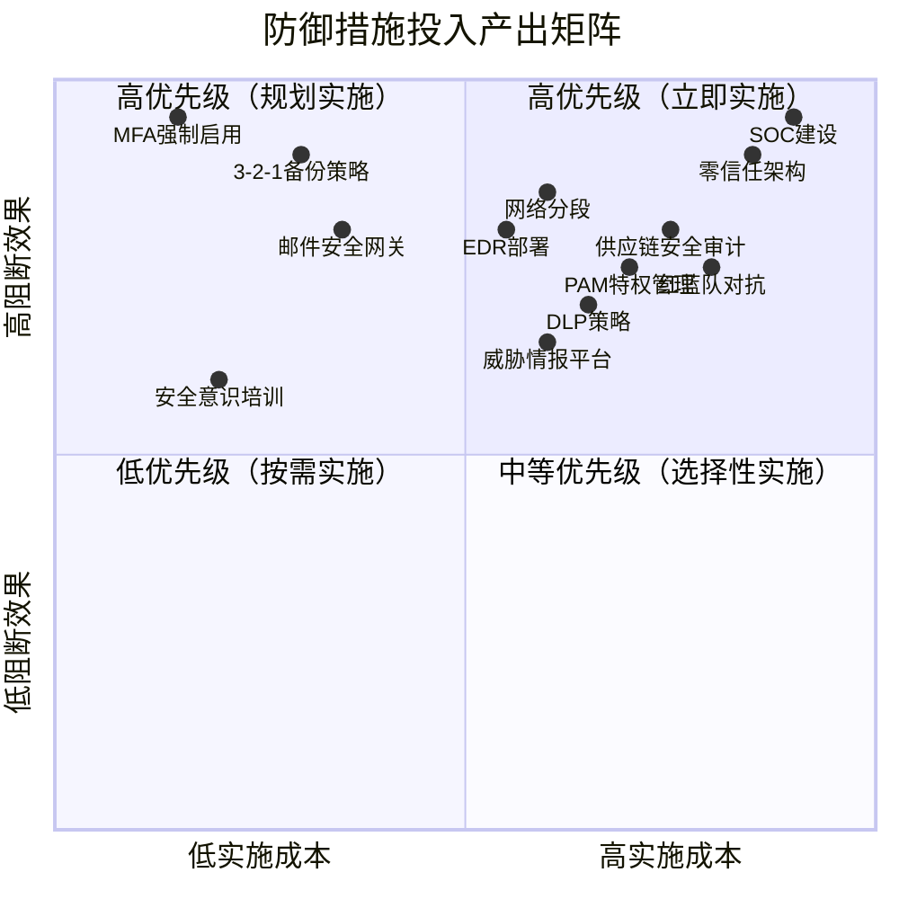
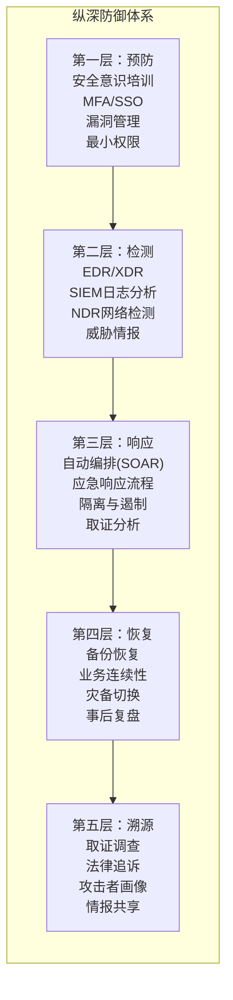

## 7. 防御者应关注的关键节点

理解攻击者的变现技巧不是目的，而是手段。防御者真正需要做的，是将这些攻击知识转化为可执行的防御策略。本节将系统梳理从攻击链各阶段到防御体系构建的完整映射，帮助安全团队在有限资源下最大化防御效果。

### 7.1 攻击链阶段与防御映射

攻击者的每一次变现行为，都遵循一条可预测的攻击链。防御的核心逻辑是：**在攻击链的每个阶段设置检测点和阻断点，即使无法阻止初始入侵，也能在后续阶段拦截，防止攻击者达成变现目标**。

以下是攻击链六个阶段的防御映射：

| 攻击阶段 | 攻击者行为 | 关键防御措施 | 检测手段 |
|---------|-----------|-------------|---------|
| **侦察与投递** | 钓鱼邮件、漏洞扫描、社工攻击 | 邮件安全网关(SEG)、域名监控、安全意识培训 | 钓鱼邮件分析、异常登录告警 |
| **初始入侵** | 漏洞利用、凭证窃取、供应链投毒 | 漏洞及时修补、MFA强制启用、供应商准入审计 | EDR行为检测、异常进程创建 |
| **立足与提权** | 后门部署、权限提升、横向移动 | 网络分段、最小权限原则、特权访问管理(PAM) | AD审计日志、异常特权操作 |
| **数据窃取与部署** | 敏感数据识别、大批量外传 | DLP策略、数据加密、出站流量异常检测 | NetFlow分析、云存储监控 |
| **勒索/变现执行** | 加密文件、BEC转账、挖矿部署 | 备份策略(3-2-1原则)、端点防护、进程白名单 | 文件完整性监控、CPU异常告警 |
| **资金转移与洗钱** | 加密货币转移、混币、OTC交易 | 交易监控、区块链分析、供应链金融监控 | 异常付款审批、加密钱包黑名单 |

### 7.2 基于MITRE ATT&CK的防御节点映射

MITRE ATT&CK框架将攻击者的技术行为标准化为可编号的技术点。以下是本章涉及的六种变现路径对应的关键ATT&CK技术及其防御映射：

#### 勒索软件防御节点（对应§1）

| ATT&CK技术 | 攻击者行为 | 防御策略 | 优先级 |
|------------|-----------|---------|-------|
| T1566 - 钓鱼投递 | 钓鱼邮件投递恶意附件/链接 | 邮件安全网关+沙箱分析 | P0 |
| T1190 - 利用公开应用 | VPN/防火墙漏洞利用 | 资产盘点+漏洞扫描+及时补丁 | P0 |
| T1486 - 数据加密影响 | 文件系统加密 | 备份3-2-1+卷影副本保护 | P0 |
| T1027 - 混淆文件或信息 | 恶意代码混淆 | EDR行为检测+签名更新 | P1 |
| T1489 - 服务停止 | 停用安全服务/备份服务 | 服务监控+关键进程保护 | P0 |
| T1078 - 有效账户 | 利用窃取的凭证横向移动 | MFA+特权账户监控+PAM | P0 |

#### 数据窃取防御节点（对应§2）

| ATT&CK技术 | 攻击者行为 | 防御策略 | 优先级 |
|------------|-----------|---------|-------|
| T1005 - 本地系统数据收集 | 扫描和收集本地敏感文件 | 文件分类标记+DLP端点代理 | P1 |
| T1039 - 网络共享数据 | 从共享驱动器收集数据 | SMB审计+异常访问告警 | P1 |
| T1041 - 通过C2外传 | 通过C2通道外传数据 | 出站流量深度检测(DPI) | P0 |
| T1567 - 通过Web服务外传 | 利用合法云服务外传数据 | CASB云访问安全代理 | P0 |
| T1048 - 通过替代协议外传 | DNS隧道/ICMP隧道外传 | DNS查询异常检测+协议合规 | P1 |

#### 加密货币挖矿劫持防御节点（对应§3）

| ATT&CK技术 | 攻击者行为 | 防御策略 | 优先级 |
|------------|-----------|---------|-------|
| T1059 - 命令和脚本解释器 | PowerShell/脚本投递挖矿程序 | 脚本执行审计+AMSI集成 | P1 |
| T1496 - 资源劫持 | 利用CPU/GPU资源挖矿 | CPU基线监控+异常使用告警 | P0 |
| T1140 - 反混淆/解码文件 | 解码和执行编码的挖矿载荷 | 内存扫描+行为检测 | P1 |

#### BEC欺诈防御节点（对应§4）

| ATT&CK技术 | 攻击者行为 | 防御策略 | 优先级 |
|------------|-----------|---------|-------|
| T1566.001 - 附件钓鱼 | 伪装CEO/供应商邮件 | 邮件发件人验证(DMARC/DKIM/SPF) | P0 |
| T1534 - 内部鱼叉式钓鱼 | 冒充内部人员发起转账 | 转账双人复核+大额付款人工确认 | P0 |
| T1078 - 有效账户 | 使用窃取的邮箱账户 | MFA+异常邮件行为检测 | P0 |

#### 账户接管防御节点（对应§5）

| ATT&CK技术 | 攻击者行为 | 防御策略 | 优先级 |
|------------|-----------|---------|-------|
| T1110 - 暴力破解 | 密码喷射/凭证填充 | 密码策略+登录锁定+异常检测 | P0 |
| T1110.004 - 凭证填充 | 用暗网泄露凭证尝试登录 | 密码泄露监控(如Have I Been Pwned) | P0 |
| T1539 - 窃取Web会话Cookie | 窃取Session Token | 短有效期Token+IP绑定+设备指纹 | P1 |
| T1556 - 修改认证过程 | 注入认证后门 | MFA+会话绑定+认证日志审计 | P0 |

#### DDoS勒索防御节点（对应§6）

| ATT&CK技术 | 攻击者行为 | 防御策略 | 优先级 |
|------------|-----------|---------|-------|
| T1498 - 网络拒绝服务 | 大规模流量攻击 | CDN+DDoS防护服务(Cloudflare/AWS Shield) | P0 |
| T1499 - 端点拒绝服务 | 应用层CC攻击 | WAF规则+限流+行为分析 | P1 |
| T1583.006 - 获取基础设施 | 租用僵尸网络 | 威胁情报联动+IP黑名单 | P2 |

### 7.3 防御优先级矩阵

面对有限的安全预算和人力资源，防御者需要一份清晰的优先级指南。以下矩阵按照"对变现行为的阻断效果"和"实施成本"两个维度对防御措施进行分类：

**高优先级（立即实施，成本低效果好）：**

- **多因素认证(MFA)**：阻断99%以上的凭证滥用攻击，实施成本极低。NIST数据显示，启用MFA后账户被接管的概率降低99.9%。对所有远程访问（VPN、RDP、Web应用）强制启用MFA，是投入产出比最高的安全措施。
- **3-2-1备份策略**：至少3份备份、2种存储介质、1份离线备份。这是抵御勒索软件的最后一道防线。关键要求：离线备份必须无法被攻击者从网络上访问，定期测试恢复流程。
- **邮件安全网关(SEG)**：部署具备沙箱分析能力的邮件安全网关，自动检测钓鱼邮件、恶意附件和恶意链接。配合DMARC/DKIM/SPF三重验证，可以阻断大部分BEC攻击。

**中等优先级（规划实施，效果显著但成本较高）：**

- **网络分段**：将关键资产（域控制器、数据库、备份服务器）隔离在独立网络区域，即使攻击者入侵也无法自由横向移动。这是限制勒索软件传播范围的关键措施。
- **EDR/XDR部署**：端点检测与响应工具可以在攻击者执行恶意操作时实时检测和阻断，覆盖进程创建、文件修改、网络连接等多个维度。
- **DLP数据防泄漏**：针对企业最敏感的数据类型（客户PII、知识产权、财务数据）制定DLP策略，阻止数据外传。

### 7.4 各变现路径的专项防御方案

除了通用的攻击链防御，每种变现路径都有其独特的攻击模式，需要针对性的防御策略。

#### 勒索软件专项防御

勒索软件攻击的成功依赖于攻击者在加密前完成数据窃取和权限控制。防御的关键节点：

**备份体系（抵御勒索的核心）：**
- 3-2-1策略的具体执行：3份数据副本、2种不同介质（如磁盘+磁带）、1份异地/离线备份
- 备份频率：根据RTO要求，至少每日增量备份+每周全量备份
- 备份验证：每月至少执行一次完整的备份恢复演练
- 卷影副本保护：禁止普通用户删除卷影副本，配置定期快照
- 备份服务器隔离：备份服务器使用独立凭据，不在域控制器的管理范围内

**勒索软件传播阻断：**
- 端口管控：默认禁止SMB(445)、RDP(3389)的横向访问
- 端点防护：部署具备勒索软件行为检测能力的EDR
- 进程白名单：关键服务器实施应用白名单策略
- GPO保护：加固组策略对象，防止攻击者通过GPO批量部署

**应急响应预案：**
- 制定勒索软件专项应急预案，明确各角色职责
- 隔离流程：发现感染后立即网络隔离受影响设备，防止横向扩散
- 评估流程：确认加密范围、数据泄露范围、攻击入口
- 沟通流程：法务、公关、监管报告（如涉及个人数据）
- 决策框架：是否支付赎金的评估标准（数据恢复可能性、是否有备份、是否涉及敏感数据泄露）

#### 数据窃取专项防御

数据窃取攻击的特征是"安静地拿走数据"，防御重点在于数据访问行为监控和外传检测：

**数据分类分级：**
- 明确标记各类数据的敏感等级（公开、内部、机密、绝密）
- 对机密级以上数据实施加密存储和访问审计
- 数据库审计：记录所有对敏感数据表的查询操作

**DLP策略部署：**
- 终端DLP：监控USB拷贝、屏幕截图、文件上传等行为
- 网络DLP：检查外发邮件、即时通讯、文件传输中的敏感内容
- 云DLP：监控云存储服务（OneDrive、Google Drive、AWS S3）的共享行为

**异常外传检测：**
- 基线建模：建立正常数据传输量的基线，异常放大触发告警
- 协议分析：检测DNS隧道、ICMP隧道等隐蔽外传通道
- 加密流量监控：对异常加密流量进行SSL/TLS解密检查

#### 加密货币挖矿劫持专项防御

挖矿劫持的特征是"资源消耗"，防御重点在于CPU/GPU异常使用监控：

- **CPU基线监控**：建立服务器和终端的CPU使用基线，持续监控偏差
- **进程审计**：白名单进程运行，未知进程自动告警
- **容器安全**：Kubernetes环境中配置资源限制(resource limits)，防止单个容器耗尽集群资源
- **云环境防护**：云平台配置实例类型限制、API密钥轮转、元数据服务保护(IMDSv2)

#### BEC欺诈专项防御

BEC攻击不依赖技术漏洞，而是利用人的弱点。防御重点在于流程管控：

- **付款审批流程**：单笔超过一定金额的转账必须双人复核，变更收款账户需电话确认
- **邮件安全策略**：部署DMARC策略至"拒绝(deny)"模式，拦截伪造发件人邮件
- **域名监控**：监控与企业域名相似的新注册域名（typosquatting检测）
- **安全意识培训**：定期开展钓鱼模拟测试，对点击率高的人员加强培训

#### 账户接管专项防御

ATO攻击的核心是凭证。防御重点在于凭证安全：

- **密码策略**：强制使用12位以上复杂密码，禁止密码重复使用
- **MFA全覆盖**：对所有面向互联网的应用强制启用MFA（优先选择TOTP或硬件密钥，避免SMS验证码）
- **凭证泄露监控**：接入Have I Been Pwned等泄露数据库API，自动检测员工邮箱是否出现在已知泄露中
- **会话管理**：设置合理的会话超时，检测会话固定(Session Fixation)攻击
- **异常登录检测**：结合地理位置、设备指纹、时间特征等多维度检测异常登录

#### DDoS勒索专项防御

DDoS攻击的防御依赖于带宽和基础设施能力：

- **CDN+DDoS防护**：部署Cloudflare、AWS Shield、阿里云DDoS防护等服务
- **带宽预留**：确保网络带宽能够承受预估的攻击流量
- **WAF规则**：配置Web应用防火墙规则，过滤CC攻击流量
- **业务连续性**：准备应急预案，包括静态页面切换、服务降级方案

### 7.5 构建纵深防御体系

单一的安全措施无法抵御所有威胁。防御者需要构建一个"纵深防御"(Defense in Depth)体系，确保即使某一层防御被突破，后续层级仍然有效：

**第一层：预防**
- 安全意识培训：定期培训+钓鱼模拟测试，降低人为风险
- 身份认证：MFA全覆盖、SSO统一管理、特权访问管理(PAM)
- 漏洞管理：资产盘点→漏洞扫描→优先级排序→补丁部署→验证
- 最小权限：基于角色的访问控制(RBAC)，按需授权

**第二层：检测**
- EDR/XDR：端点行为检测，覆盖进程、文件、注册表、网络
- SIEM：集中日志分析，关联多源事件，触发告警规则
- NDR：网络流量异常检测，识别C2通信、数据外传
- 威胁情报：整合IOC（Indicator of Compromise），主动匹配已知攻击特征

**第三层：响应**
- SOAR：安全编排与自动化响应，缩短MTTR（平均响应时间）
- 应急响应流程：预定义的操作手册(Runbook)，减少人为判断延迟
- 隔离与遏制：网络隔离、账户锁定、服务降级
- 取证分析：内存取证、磁盘镜像、日志保全

**第四层：恢复**
- 备份恢复：验证备份完整性，按优先级恢复关键业务
- 业务连续性计划(BCP)：预定义恢复时间目标(RTO)和恢复点目标(RPO)
- 灾备切换：同城/异地灾备中心的切换流程
- 事后复盘：每次安全事件后的根因分析和流程改进

**第五层：溯源**
- 取证调查：攻击路径还原、恶意样本分析
- 法律追诉：与执法机构合作，保全电子证据
- 攻击者画像：关联分析、归属判断
- 情报共享：通过ISAC/ISAO共享威胁情报，提升行业整体防御

### 7.6 安全投入的经济模型

理解攻击者的ROI（投资回报率）有助于防御者合理分配安全预算。核心原则是：**让攻击者的ROI降到足够低，使其不再选择你作为目标**。

**安全预算分配建议：**

| 防御领域 | 建议占比 | 关键产出 | ROI衡量指标 |
|---------|---------|---------|-----------|
| 身份安全(MFA/PAM) | 20-25% | 凭证泄露防御 | 凭证相关事件数↓ |
| 端点安全(EDR/XDR) | 20-25% | 恶意行为检测与阻断 | 检测率/MTTR |
| 网络安全(FW/NDR) | 15-20% | 边界防御与流量检测 | 异常流量检出率 |
| 数据安全(DLP/加密) | 10-15% | 数据泄露防护 | 数据泄露事件数↓ |
| 应急响应 | 10-15% | 事件响应能力 | MTTR/恢复成功率 |
| 安全意识与培训 | 5-10% | 人为风险降低 | 钓鱼点击率↓ |

**防御成本 vs 潜在损失的量化分析：**

以一次典型的勒索软件攻击为例：
- 潜在损失：平均赎金150万美元 + 业务中断损失（通常为赎金的5-10倍）+ 声誉损失 + 监管罚款 ≈ 500-2000万美元
- 年度防御投入：以1000人规模企业为例，合理的安全预算约为年度IT预算的8-12%（约50-150万美元/年）
- 关键结论：年度安全投入远低于一次成功的勒索软件攻击损失

这种量化分析有助于安全负责人向管理层论证安全投入的必要性。

### 7.7 常见防御误区

在构建防御体系时，安全团队常犯以下错误：

| 误区 | 纠正方法 |
|------|---------|
| "安装了杀毒软件就够了" | 现代攻击使用无文件、内存驻留、合法工具(LotL)等技术，传统杀毒几乎无效。需要部署具备行为检测能力的EDR |
| "我们有防火墙很安全" | 防火墙只防网络边界攻击。BEC、钓鱼、内部威胁都不经过网络边界。需要纵深防御 |
| "买了安全产品就安全了" | 安全产品需要正确配置和持续运维。购买≠部署≠有效运行。很多企业的安全设备在"默认配置"下运行 |
| "我们太小不是目标" | 勒索软件使用自动化工具批量扫描，不在乎企业大小。事实上50%以上的勒索软件受害者是中小企业 |
| "备份了就不用怕勒索" | 攻击者会在加密前优先删除/加密备份。备份必须离线且定期测试恢复 |
| "安全是IT部门的事" | 安全是全员责任。安全意识培训、数据分类、异常报告都需要全员参与 |

### 7.8 实操清单：防御者今日可执行的10件事

以下是一份具体的、可立即执行的防御清单，安全团队可据此制定改进计划：

| 序号 | 行动项 | 优先级 | 预计耗时 | 阻断的变现路径 |
|------|-------|-------|---------|--------------|
| 1 | 全面启用MFA（特别是远程访问） | P0 | 1-2天 | ATO、勒索软件、BEC |
| 2 | 验证备份策略（3-2-1）并测试恢复 | P0 | 3-5天 | 勒索软件 |
| 3 | 部署或更新邮件安全网关 | P0 | 2-3天 | BEC、勒索软件投递 |
| 4 | 审查并关闭不必要的RDP/VPN暴露 | P0 | 1-2天 | ATO、勒索软件 |
| 5 | 启用DMARC到"拒绝"模式 | P0 | 1天 | BEC、钓鱼 |
| 6 | 建立CPU/网络使用基线 | P1 | 3-5天 | 加密货币挖矿劫持 |
| 7 | 制定勒索软件应急预案 | P1 | 1周 | 勒索软件 |
| 8 | 部署EDR到所有端点 | P1 | 1-2周 | 所有路径 |
| 9 | 开展全员安全意识培训 | P1 | 持续 | BEC、钓鱼、数据泄露 |
| 10 | 建立漏洞扫描和补丁管理流程 | P1 | 2-4周 | 初始入侵、勒索软件 |

### 7.9 本节小结

防御者应关注的关键节点，本质上是攻击者变现链条上的"断链点"。本节的核心要点：

1. **攻击链思维**：防御不是单一措施，而是覆盖攻击全链路的纵深体系。每突破一层，下一层仍在。
2. **优先级驱动**：资源有限时，优先实施"低成本高阻断"措施——MFA和备份是投入产出比最高的两项。
3. **针对性防御**：不同变现路径有不同的攻击模式，需要专项防御策略而非一刀切。
4. **持续运营**：安全不是一次性的项目，而是持续的运营过程——检测、响应、改进的循环。
5. **经济视角**：用攻击者ROI的思维方式来评估防御投入，让安全投入可量化、可论证。

> **关键洞察**：防御者的最大优势在于——他们知道攻击者想要什么。攻击者的每一种变现路径都留下可检测的痕迹。防御者的任务不是阻止所有攻击（这不可能），而是让攻击者在达成变现目标之前被检测和阻断。

***

*下一节：[实战案例](../实战案例/01-案例一WannaCry勒索软件事件2017年.md)*
