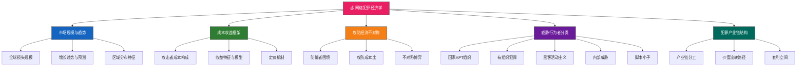
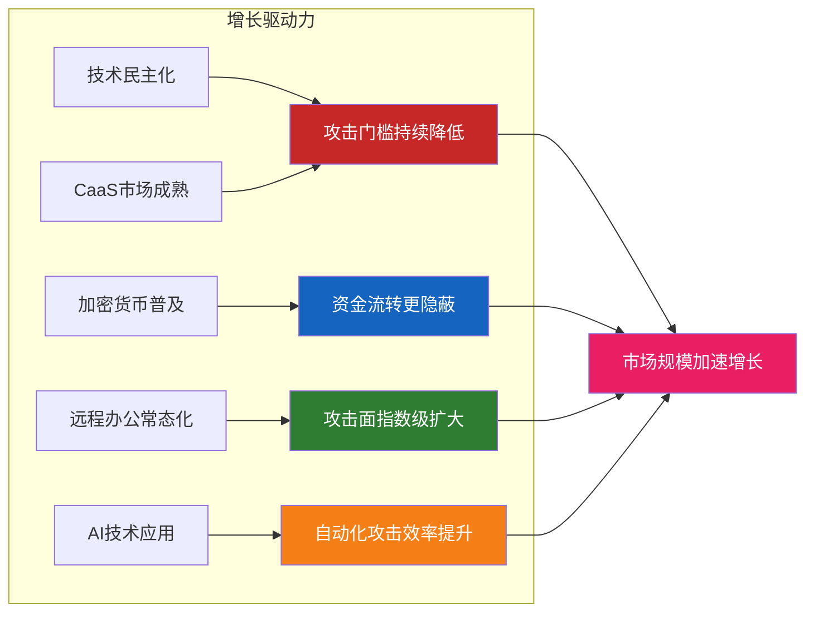
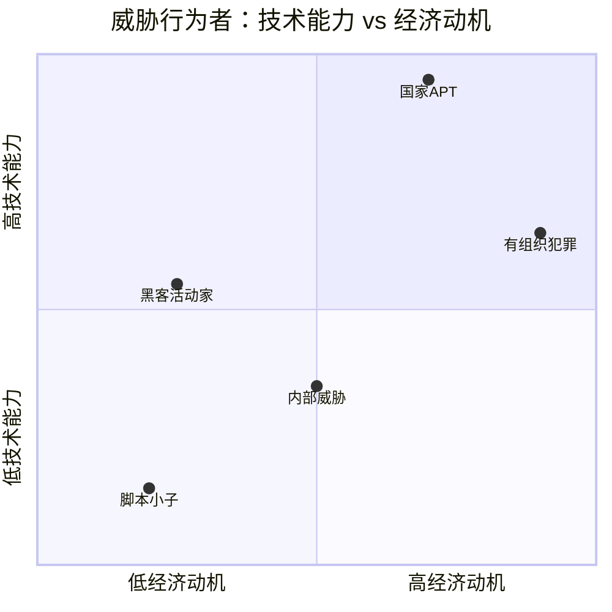

## 1. 网络犯罪经济学概览

### 全景导图



---

### 1.1 网络犯罪的全球市场规模

在深入讨论经济学框架之前，有必要先用数据勾勒网络犯罪的宏观规模——这组数字直接决定了为什么"理解黑客搞钱路径"是网络安全从业者的必修课。

#### 1.1.1 触目惊心的数字

根据 Cybersecurity Ventures、FBI IC3、Chainalysis 等权威机构的年度报告，网络犯罪的经济规模已达到令人震惊的水平：

| 指标 | 数据 | 来源/年份 |
|------|------|----------|
| 全球网络犯罪年损失 | 约 **9.5万亿美元**（2024年） | Cybersecurity Ventures |
| 2025年预测损失 | 约 **10.5万亿美元** | Cybersecurity Ventures |
| 勒索软件平均赎金 | **150万美元**（2023年） | Palo Alto Unit 42 |
| 勒索软件攻击频率 | 每 **11秒**一次 | Cybersecurity Ventures |
| BEC全球累计损失 | 超 **500亿美元**（2013-2022） | FBI IC3 |
| 暗网RDP访问价格 | **$500 - $100,000** | Recorded Future |
| CaaS年增长率 | 超过 **30%** | Chainalysis |
| 网络犯罪全球GDP占比 | 约 **1% - 1.5%** | 估算值 |

如果将网络犯罪视为一个"国家"，其"GDP"将排名全球第三，仅次于美国和中国。这意味着网络犯罪已不再是零散的个体行为，而是一个具有完整产业链、供需关系、市场竞争机制的**平行经济体**。

#### 1.1.2 增长趋势分析

网络犯罪的规模增长并非线性，而是呈现出**加速增长**的态势：



**三大结构性驱动因素：**

1. **攻击门槛持续降低**：CaaS平台让一个毫无技术背景的人只需支付几百美元就能发起勒索攻击。"犯罪工业化"的逻辑与正规SaaS完全一致——工具链标准化、服务模块化、按需付费。

2. **加密货币的双刃剑效应**：加密货币既为受害者提供了支付赎金的便捷渠道，也为攻击者提供了相对隐蔽的资金流转手段。2023年，Chainalysis 报告追踪到的加密货币犯罪交易额超过 **240亿美元**（仅被追踪到的部分）。

3. **数字化转型的副产品**：企业加速数字化、云计算普及、IoT设备爆发式增长，每一项技术进步在带来商业价值的同时，也创造了新的攻击面。全球联网设备数量预计到 2030 年将超过 **290亿台**。

#### 1.1.3 区域分布特征

网络犯罪的攻击来源和受害分布呈现明显的地域特征：

| 地区 | 主要角色 | 典型活动 | 经济动因 |
|------|---------|---------|---------|
| **东欧（俄罗斯、乌克兰）** | 攻击输出 | 勒索软件、银行木马、IAB | 经济制裁下的替代收入、相对宽松的执法环境 |
| **朝鲜** | 国家级犯罪 | 加密货币交易所攻击、SWIFT欺诈 | 国家外汇获取（约占其外汇收入的10%） |
| **西非（尼日利亚）** | BEC欺诈 | 419骗局、BEC、浪漫诈骗 | 经济发展差距、低犯罪成本 |
| **中国** | 数据贩卖、供应链攻击 | 企业间谍、数据窃取、APT | 经济间谍、商业利益 |
| **北美** | 主要受害区 | 勒索软件重灾区、BEC目标 | 数字化程度高、企业支付能力强 |

> **关键洞察**：网络犯罪的地理分布遵循经济学基本规律——攻击者倾向于从**高收入/低风险**的地区发起攻击，而目标选择则偏好**高价值/低防御**的地区。这种"套利行为"是理解全球网络犯罪格局的核心逻辑。

---

### 1.2 犯罪的经济理性：成本-收益分析框架

从经济学视角来看，网络犯罪是一种典型的**理性行为**。攻击者在决策过程中会进行成本-收益分析（Cost-Benefit Analysis），选择风险最低、回报最高的行动路径。理解这一经济理性框架，是分析黑客变现路径的基础。

#### 1.2.1 攻击者成本构成

网络犯罪的成本结构与合法商业有相似之处，但存在关键差异：

| 成本类别 | 具体内容 | 成本范围 | 占比趋势 |
|---------|---------|---------|---------|
| **技术成本** | 漏洞利用工具、恶意软件、C2基础设施（服务器、域名、VPN、CDN） | $100 - $50,000/月 | ↓ 持续下降 |
| **时间成本** | 技术学习、目标侦察、攻击实施、后渗透维持 | 数小时到数月 | ↓ 自动化降低 |
| **机会成本** | 合法就业的薪资替代（高级攻击者机会成本更高） | 视个人能力 | ↑ 高端人才稀缺 |
| **风险成本** | 被执法抓获的法律后果：刑事处罚、资产没收、监禁 | 难以量化 | ↑ 执法力度加大 |
| **洗钱成本** | 将非法所得转化为合法资金的费用 | 资金总额的 5%-25% | ↑ 合规要求提高 |
| **声誉/信任成本** | 在犯罪社区中建立信誉的时间和投入 | 数月到数年 | → 稳定 |

**一个完整勒索攻击的典型成本结构（以中型RaaS为例）：**

```text
总投入估算（月度）：
├── RaaS订阅费（含赎金谈判支持）    $800 - $2,000
├── Bulletproof Hosting             $200 - $500
├── VPN/代理服务                    $50 - $200
├── 恶意软件/加载器                 $100 - $1,000
├── 域名/SSL证书                    $20 - $100
├── 初始访问代理（如外购）           $1,000 - $100,000
├── 洗钱费用（赎金的10-20%）        变动
└── 时间投入（含学习和侦察）         数百小时
```

**关键趋势：犯罪成本的结构性下降。** 随着CaaS市场的成熟，攻击者的边际成本正在急剧降低。2015年，发起一次定制化的勒索攻击可能需要数万美元的前期投入；到2024年，通过RaaS平台，一个技术人员几百美元就能完成全套部署。这种"成本民主化"是网络犯罪规模爆发的根本经济驱动力。

#### 1.2.2 收益特征与模型

网络犯罪的收益模型具有四个显著特征，使其对潜在犯罪者具有极强的吸引力：

**（1）极高的投资回报率（ROI）**

| 变现方式 | 典型投入 | 典型收益 | ROI倍数 |
|---------|---------|---------|--------|
| 勒索软件（针对中型企业） | $5,000-$50,000 | $100,000-$10,000,000 | 20x-200x |
| BEC欺诈（单次成功） | $500-$5,000 | $50,000-$5,000,000 | 100x-1000x |
| 数据贩卖（企业数据库） | $2,000-$20,000 | $50,000-$500,000 | 25x-25x |
| IAB访问贩卖 | $1,000-$10,000 | $5,000-$100,000 | 5x-10x |
| 加密货币挖矿劫持 | $500-$2,000 | $1,000-$10,000/月 | 2x-5x（持续） |

> **防御者视角**：这个ROI对比解释了一个令人不安的现实——攻击者只需 **5%** 的成功率就能实现盈利。而防御者必须达到接近 **100%** 的防御成功率才能避免损失。这种不对称性是"防御者困境"的经济根源。

**（2）高杠杆率与规模化效应**

一次成功的勒索攻击可以带来数百万美元收益，而攻击成本可能仅数千美元。更关键的是，RaaS模式允许攻击者通过招募"加盟者"（Affiliates）实现规模化运营——运营商负责开发和维护勒索软件、提供基础设施和技术支持，加盟者负责实际入侵。收益分成通常为 70:30（加盟者:运营商）或 80:20。

**（3）边际成本趋近于零**

同一套攻击工具和方法论可以反复使用。一旦攻击者开发或获取了一套有效的攻击链（攻击载荷+投递方式+持久化机制），后续每次攻击的边际成本几乎为零。这与软件行业的商业模式完全一致——一次开发、无限复制、边际成本趋零。

**（4）全球化的无国界市场**

互联网的无国界特性使攻击者可以触达全球目标，而执法的司法管辖权却受限于国界。这种"攻击全球化 vs 执法本地化"的结构性矛盾，为攻击者创造了巨大的地理套利空间。

#### 1.2.3 防御者困境：不对称博弈

网络安全领域最核心的经济学概念之一是**防御者困境（Defender's Dilemma）**，其本质是攻防双方在信息、成本和收益上的结构性不对称：

| 维度 | 攻击者 | 防御者 |
|------|--------|--------|
| **信息** | 选择攻击时机、方式、目标 | 被动等待，需覆盖所有攻击面 |
| **成本** | 只需攻破一点（5%成功率即可盈利） | 必须守住所有点（100%防御才算成功） |
| **收益** | 单次成功即可获得高回报 | 成功防御=避免损失（无直接收益） |
| **灵活性** | 可自由选择目标和时间 | 必须7×24小时持续防御 |
| **创新** | 攻击技术持续迭代 | 防御需跟进所有新攻击手法 |
| **归因** | 可利用匿名网络隐藏身份 | 需要确定攻击者才能有效反击 |

**一个数学化的比喻**：

假设一家企业有 100 个潜在攻击入口点（实际上大型企业可能有数千个）：
- **攻击者**只需找到 1 个突破口，成功率 1% 就已经有利可图
- **防御者**必须守住所有 100 个点，任何一个失守都可能导致整个防线崩溃

这种 1:100 的攻防比（实际上是 1:N，N可以是数千）是防御者困境的数学本质。它解释了为什么即使是最安全的企业也无法完全杜绝入侵——这不是安全团队"不够努力"，而是经济学规律决定的结构性劣势。

---

### 1.3 威胁行为者分类：动机驱动的经济决策

威胁行为者的分类不仅基于技术能力，更重要的是基于其**经济动机**和**行为模式**。不同类型的攻击者在成本承受能力、收益期望、风险偏好上存在本质差异，这些差异直接影响了他们的变现路径选择。

#### 1.3.1 五大威胁行为者类型



**（1）国家级APT组织**

- **动机**：情报收集、地缘政治利益、经济间谍、国家经济获益
- **代表**：Lazarus Group（朝鲜）、APT28/Fancy Bear（俄罗斯）、APT41（中国）、Equation Group（美国NSA关联）
- **资源水平**：国家级预算支持，团队规模可达数百人，研发能力堪比商业软件公司
- **技术特征**：零日漏洞利用、供应链攻击、多层持久化、反取证技术、鱼叉式钓鱼
- **变现方式**：直接为国家获取经济利益。朝鲜是最典型案例——据联合国报告，朝鲜通过网络犯罪（加密货币交易所攻击、SWIFT欺诈）获取的外汇约占其国家外汇收入的 **10%**。2022年，Lazarus Group从Ronin Network窃取了约 **6.2亿美元** 的加密货币
- **经济逻辑**：攻击成本由国家承担（机会成本极低），收益归国家。这使得国家级攻击者的ROI近乎无限

**（2）有组织犯罪集团**

- **动机**：纯粹的经济利益最大化
- **代表**：REvil、Conti、LockBit、DarkSide、BlackCat/ALPHV、Cl0p
- **组织特征**：高度组织化运营，类似合法企业的管理层级。Conti泄露的内部文件显示其有CEO、CTO、HR、财务等完整架构
- **技术特征**：使用成熟的RaaS平台、专业的谈判团队、标准化的攻击流程
- **变现方式**：勒索软件、数据贩卖、欺诈服务、DDoS勒索
- **经济逻辑**：追求利润最大化。年收入可达数千万至数亿美元。Conti在2021年的年收入估计超过 **1.8亿美元**

**（3）黑客活动主义者（Hacktivists）**

- **动机**：政治/意识形态驱动，通常不以经济利益为主要目标
- **代表**：Anonymous、LulzSec、Lazarus（部分行动）、亲俄/亲乌黑客组织
- **行为特征**：间歇性行动、重视公开宣传和政治影响力、通常选择高知名度目标
- **变现方式**：通常不直接以经济利益为主，但可能接受捐赠、进行众筹，或利用活动影响力间接获利
- **经济逻辑**：追求"注意力经济"——通过攻击获得的媒体曝光和政治影响力就是其"收益"。近年来部分黑客活动主义者也开始转向经济利益驱动

**（4）内部威胁（Insider Threats）**

- **动机**：经济利益、报复、不满、被外部势力策反
- **特征**：拥有合法访问权限，了解内部安全机制，是最难检测的威胁类型之一
- **技术门槛**：通常不需要高级技术能力，但利用合法权限可造成极大损害
- **变现方式**：数据窃取出售、协助外部攻击者突破防线、知识产权窃取
- **经济逻辑**：内部威胁的独特之处在于其**极低的攻击成本**——攻击者无需入侵就已经在"城内"。Verizon DBIR报告持续显示，内部威胁在数据泄露事件中的占比约 **15%-25%**

**（5）脚本小子（Script Kiddies）**

- **动机**：炫耀、好奇、恶作剧、寻求刺激
- **技术特征**：依赖现成工具和教程，技术能力有限
- **变现方式**：低层次欺诈、DDoS勒索（小额）、利用已知漏洞的低级攻击
- **经济逻辑**：投入极低（多数工具免费），期望收益也较低。部分脚本小子会进化为更专业的攻击者

#### 1.3.2 攻击者经济决策模型

不同类型的攻击者在选择变现路径时，遵循不同的经济决策逻辑：

| 决策因素 | 脚本小子 | 有组织犯罪 | 国家APT |
|---------|---------|-----------|---------|
| **风险承受力** | 低（怕被抓） | 中（有洗钱和规避能力） | 极低风险（国家庇护） |
| **时间偏好** | 短期（即时满足） | 中期（可持续运营） | 长期（战略目标） |
| **技术投入意愿** | 极低 | 中等（愿意投资工具和人才） | 极高（持续研发） |
| **目标选择** | 随机或高知名度 | 按ROI排序（高价值目标） | 战略价值目标 |
| **变现优先级** | 低额快速收益 | 高额可持续收益 | 战略/情报价值优先 |
| **竞争考量** | 几乎不考虑 | 竞争对手分析 | 地缘政治博弈 |

---

### 1.4 犯罪产业链的经济结构

网络犯罪之所以难以根除，根本原因在于它已发展为一条**高度分工、自组织、具有韧性的产业链**。理解这条产业链的经济结构，是理解所有变现路径的基础。

#### 1.4.1 产业链全景

```text
┌──────────────────────────────────────────────────────────────────────┐
│                     网络犯罪产业链全景图                               │
├──────────────────────────────────────────────────────────────────────┤
│                                                                      │
│  [上游]                 [中游]                  [下游]               │
│  基础设施层             攻击执行层               变现层               │
│                                                                      │
│  ┌─────────────┐     ┌─────────────┐       ┌─────────────┐         │
│  │ 漏洞研究    │     │ 初始访问    │       │ 赎金/数据   │         │
│  │ 工具开发    │────→│ 横向移动    │──────→│ 资金转移    │         │
│  │ 基础设施    │     │ 数据窃取    │       │ 洗钱网络    │         │
│  └─────────────┘     └─────────────┘       └─────────────┘         │
│       │                    │                      │                  │
│       ▼                    ▼                      ▼                  │
│  ┌─────────────┐     ┌─────────────┐       ┌─────────────┐         │
│  │ 零日交易    │     │ 勒索软件部署│       │ 混币服务    │         │
│  │ Exploit Kit │     │ 数据加密    │       │ 交易所清洗  │         │
│  │ CaaS/RaaS   │     │ 持久化维持  │       │ DeFi桥接    │         │
│  └─────────────┘     └─────────────┘       └─────────────┘         │
│                                                                      │
│  支撑服务层（贯穿全链）                                              │
│  ┌──────────────────────────────────────────────────────────────┐   │
│  │ Bulletproof Hosting │ 暗网市场 │ 信誉系统 │ 托管/仲裁       │   │
│  │ VPN/代理服务        │ 论坛/社区 │ 洗钱教程 │ 法律咨询（灰色）│   │
│  └──────────────────────────────────────────────────────────────┘   │
└──────────────────────────────────────────────────────────────────────┘
```

#### 1.4.2 产业链的经济特征

**（1）专业化分工带来的效率提升**

与合法产业的分工逻辑完全一致：当每个参与者只专注于自己最擅长的环节时，整体效率大幅提升。一个完整的勒索攻击可能涉及以下分工：

| 角色 | 职能 | 典型分成 | 类比合法职位 |
|------|------|---------|------------|
| 初始访问代理 | 入侵目标网络，获取初始立足点 | $500-$100,000（一次性） | 侦察兵/情报员 |
| RaaS运营商 | 开发维护勒索软件，提供谈判支持 | 赎金的20%-30% | 软件开发商 |
| 加盟者（Affiliate） | 利用IAB提供的访问，执行完整攻击链 | 赎金的70%-80% | 项目经理/执行者 |
| 洗钱者（Mixer） | 将加密货币赃款清洗为合法资金 | 涉案金额的10%-25% | 财务/资金管理 |
| 基础设施提供商 | 提供服务器、域名、CDN等 | 服务费 | IT基础设施 |

**（2）市场的自组织与竞争均衡**

暗网市场呈现典型的**自组织特征**——没有中央管理机构，却能自发形成稳定的交易规则、信誉体系和价格机制。这与诺贝尔经济学奖得主奥斯特罗姆（Elinor Ostrom）的公共池塘资源理论高度吻合：

- **信誉系统**解决了信息不对称问题：买家无法在交易前验证产品/服务质量，但可以通过卖家的历史评价做出判断
- **托管机制**降低了交易风险：第三方托管确保卖家交付后才能收到付款
- **竞争压力**驱动价格趋近于均衡：高定价卖家被低价竞争者淘汰，低质量卖家被信誉系统惩罚

**（3）产业链的韧性与去中心化**

网络犯罪产业链具有极强的**抗打击韧性**。原因包括：

- **去中心化结构**：没有"总部"可以被摧毁，每次执法打击只影响部分节点
- **快速重组能力**：一个市场被关闭，新的市场迅速填补空缺（Silk Road → AlphaBay → Hydra → 新兴市场）
- **地理分布**：参与者遍布全球，利用司法管辖权差异
- **技术替代性**：一种工具被封禁，替代工具迅速出现

#### 1.4.3 产业链中的套利空间

产业链的每一个环节都存在经济套利空间，这些套利空间正是驱动犯罪经济运转的"利润引擎"：

| 套利类型 | 描述 | 典型案例 |
|---------|------|---------|
| **地理套利** | 利用不同国家的执法力度差异 | 东欧犯罪集团攻击北美企业 |
| **信息套利** | 利用攻防信息不对称 | 零日漏洞在被修补前的窗口期 |
| **时间套利** | 利用漏洞披露到补丁部署的时间差 | 从CVE发布到企业打补丁平均需要 **60-90天** |
| **信誉套利** | 利用高信誉卖家身份溢价销售 | 暗网市场上的品牌效应 |
| **技术套利** | 利用防御技术的滞后性 | 新型绕过技术 vs 成熟检测规则 |

---

### 1.5 网络犯罪与传统犯罪的经济学对比

将网络犯罪与传统犯罪进行经济学对比，有助于理解其独特的吸引力和治理挑战：

| 对比维度 | 传统犯罪（如抢劫） | 网络犯罪 |
|---------|-------------------|---------|
| **攻击范围** | 受地理限制，受害者数量有限 | 全球范围，可同时攻击数千目标 |
| **物理风险** | 高（面对面接触，人身安全风险） | 极低（远程操作，几乎无物理接触） |
| **执法风险** | 高（现场证据、目击者） | 低（匿名网络、跨境管辖困难） |
| **规模化潜力** | 低（受限于人力和物理空间） | 极高（自动化攻击，边际成本趋零） |
| **证据留存** | 高（物理痕迹、DNA等） | 低（数字痕迹可擦除，加密通信） |
| **起步成本** | 低（抢劫只需一把武器） | 中等（需要技术能力，但CaaS降低门槛） |
| **受害者感知** | 即时（当场发现） | 滞后（平均 **204天** 才发现入侵） |

> **关键洞察**：网络犯罪之所以呈现爆发式增长，根本原因不是"坏人变多了"，而是经济学规律在数字空间中创造了**更有利的犯罪条件**——更低的物理风险、更广的攻击范围、更强的规模化潜力、更弱的执法约束。这就像互联网为合法商业创造了指数级增长机会一样，它也为犯罪创造了类似的"杠杆效应"。

---

### 1.6 理解这些概念对防御的意义

本节讨论的所有经济学概念，最终都要服务于一个目标：**更有效的防御**。以下是关键经济学洞察对应的防御启示：

| 经济学洞察 | 防御启示 | 具体措施 |
|-----------|---------|---------|
| 攻击者追求高ROI | 降低目标ROI（增加攻击成本） | 部署蜜罐、提高检测率、缩短响应时间 |
| CaaS降低门槛 | 扩大防御面（不仅是高级威胁） | 基础安全卫生、补丁管理、员工培训 |
| 攻防成本不对称 | 在关键节点集中资源 | 零信任架构、特权访问管理、数据加密 |
| 产业链高度分工 | 打击产业链薄弱环节 | 威胁情报共享、跨行业协作、执法合作 |
| 洗钱是必经环节 | 监控资金流（最脆弱的环节） | 加密货币追踪、可疑交易报告、金融情报 |
| 零日漏洞是高价值资产 | 缩短漏洞响应窗口 | VDP漏洞披露计划、虚拟补丁、攻击面管理 |
| 地理套利普遍存在 | 国际协作消除安全港 | 跨境执法、引渡协议、国际合作框架 |

> **记住**：防御不是要"消除所有威胁"（这在经济学上是不可能的），而是要**让攻击者的ROI低于其投入成本**，使其"无利可图"。当防御成本超过攻击者的预期收益时，攻击者就会转向其他目标——这正是"安全经济学"的核心逻辑。

---

### 本节要点总结

1. **网络犯罪已形成万亿级规模的平行经济体**，如果视为一个国家，其"GDP"全球排名第三。理解这一规模是理解所有变现路径的前提。

2. **攻击者是理性的经济行为者**，其决策遵循成本-收益分析。攻击者的ROI通常在 5x-200x，而防御者必须实现接近100%的防御成功率。

3. **防御者困境是结构性的**，不是能力问题。攻防在信息、成本、收益、灵活性上的不对称是经济学规律决定的，防御策略的设计必须承认并利用这一点。

4. **五种威胁行为者有不同的经济动机和决策逻辑**，理解这些差异有助于预测和防范不同类型的安全威胁。

5. **网络犯罪产业链具有高度专业化分工和自组织特征**，其韧性来源于去中心化结构和快速重组能力。打击犯罪需要理解整条产业链，而不仅是单个攻击者。

6. **经济套利空间是犯罪产业运转的驱动力**，地理、信息、时间、信誉、技术各维度的套利行为为攻击者创造了持续的利润来源。

> **下一节**：在理解了宏观经济学框架后，我们将深入探讨[犯罪即服务（CaaS）生态系统](02-2犯罪即服务CaaS生态系统.md)——这一商业模式如何重塑了整个网络犯罪格局，使得攻击门槛降低到前所未有的水平。
