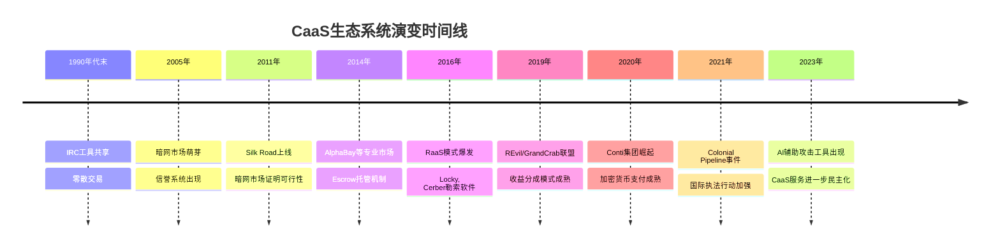
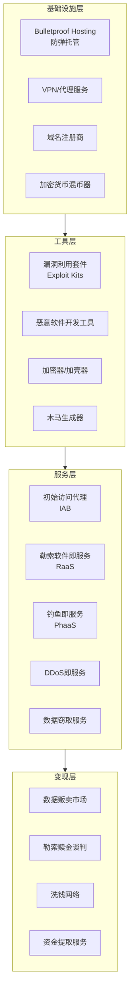
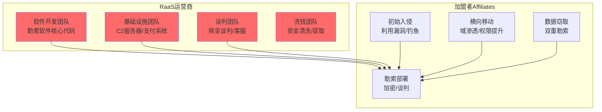
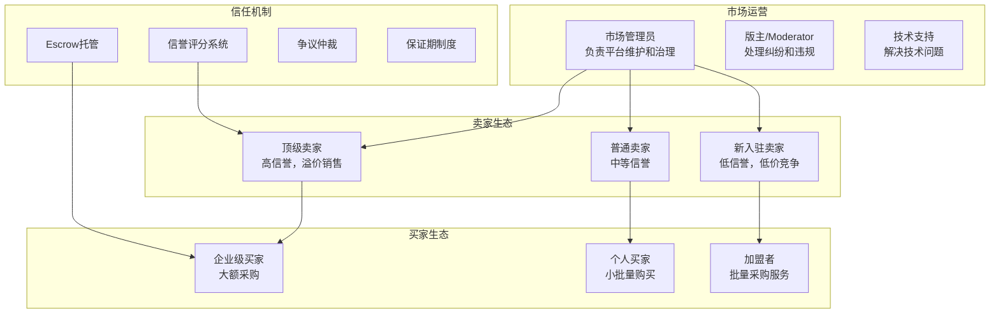
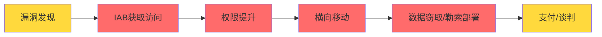

## 2. 犯罪即服务（CaaS）生态系统

### 2.1 CaaS的概念与本质

犯罪即服务（Crime as a Service，简称CaaS）是网络犯罪领域最具颠覆性的商业模式创新。它的核心思想与合法的SaaS（软件即服务）如出一辙：将复杂的技术能力封装为标准化服务，以订阅或按需付费的方式提供给不具备相应技术能力的消费者。

**CaaS的本质特征：**

| 特征 | 传统网络犯罪 | CaaS模式 |
|------|------------|----------|
| 技术门槛 | 需要全面的编程和安全知识 | 仅需基本操作能力，甚至图形界面操作 |
| 角色分工 | 一人完成攻击全流程 | 高度专业化分工，各司其职 |
| 规模效应 | 受限于个人能力 | 可并行处理大量目标 |
| 收入模式 | 单次攻击的直接收益 | 持续性订阅收入 + 分成模式 |
| 运营成本 | 主要是时间投入 | 需要基础设施和营销投入 |
| 进入壁垒 | 高（需要多年技术积累） | 低（购买服务即可发起攻击） |

CaaS将网络犯罪从"手工作坊"推向了"工业化生产"。一个不懂编程的诈骗犯，通过购买CaaS服务，可以发起与顶级黑客同等威力的攻击。这种"民主化"效应极大地扩大了网络犯罪的参与群体，据估计，CaaS的出现使潜在攻击者的数量增长了10-100倍。

### 2.2 历史演变：从IRC到暗网帝国

CaaS的发展并非一蹴而就，而是经历了多个阶段的演化，每个阶段都伴随着技术进步和商业模式的创新。

#### 第一阶段：萌芽期（1990年代末-2005年）

早期的网络犯罪工具主要通过IRC（Internet Relay Chat）频道传播。这一时期的特征是：

- **工具共享为主**：黑客之间主要以免费或互惠方式分享工具，尚未形成成熟的商业交易模式
- **技术水平参差不齐**：买家和卖家的技术水平差异巨大，欺诈频发
- **声誉机制缺失**：缺乏可靠的信誉系统，交易风险高
- **代表性事件**：2000年"Mafiaboy"攻击事件，15岁少年使用从网上购买的DDoS工具瘫痪了多个主要网站

#### 第二阶段：平台化期（2005-2013年）

随着暗网技术的成熟，犯罪服务开始向平台化方向发展：

- **Silk Road（2011年）**：虽然以毒品交易闻名，但它证明了暗网市场的可行性，为后续犯罪服务平台奠定了基础
- **AlphaBay（2014年）**：专门针对网络犯罪工具和服务的暗网市场，提供信用卡数据、恶意软件、零日漏洞等交易
- **信誉系统出现**：引入类似eBay的评分机制，有效降低了交易中的信任问题
- **Escrow（第三方托管）**：买卖双方资金由平台暂管，确认交易完成后才释放，大幅减少了欺诈

#### 第三阶段：生态成熟期（2013年至今）

现代CaaS生态系统已高度专业化，形成了完整的产业链：

- **专业化分工明确**：每个环节都有专门的服务提供商，从漏洞发现到最终变现，形成完整闭环
- **联盟模式兴起**：RaaS等模式引入"加盟"机制，类似于特许经营
- **服务标准化**：提供SLA（服务等级协议）、技术支持、更新维护等企业级服务
- **跨平台协作**：Telegram群组、暗网论坛、加密通讯多渠道并行运营

### 2.3 CaaS生态系统全景图

现代CaaS生态系统是一个高度复杂且相互依存的网络，每个参与者都在其中扮演特定角色。以下是完整的生态系统架构：

### 2.4 核心角色深度剖析

#### 2.4.1 初始访问代理（Initial Access Brokers, IABs）

初始访问代理是CaaS生态中的"门卫"，他们专门负责突破目标组织的第一道防线，然后将访问权限出售给下游攻击者。

**IAB的运作模式：**

1. **侦察阶段**：使用Shodan、Censys等工具扫描互联网暴露面，寻找存在已知漏洞的系统
2. **突破阶段**：利用VPN漏洞、RDP弱口令、已知CVE等获取初始访问
3. **验证阶段**：确认访问权限的有效性和价值（域管理员权限、数据访问范围等）
4. **定价阶段**：根据目标特征评估价格
5. **销售阶段**：在暗网论坛或Telegram频道发布"库存"

**定价因素详解：**

| 因素 | 影响 | 示例 |
|------|------|------|
| 企业规模 | 年收入越高，价格越高 | Fortune 500企业 vs 小型企业 |
| 行业属性 | 金融、医疗等行业溢价明显 | 医疗数据单价远高于零售数据 |
| 访问级别 | 域管理员权限 > 普通用户权限 | Domain Admin可横向移动到整个AD域 |
| 持久性 | 有后门的访问更值钱 | 部署了Webshell的访问比一次性RDP更贵 |
| 地理位置 | 欧美企业普遍比亚非企业更贵 | 美国企业平均价格最高 |
| 独家性 | 独家访问 vs 已被多个买家使用 | 独家访问溢价30%-50% |

**价格范围参考：**

- 小型企业RDP访问：$200 - $1,000
- 中型企业域管理员权限：$5,000 - $25,000
- 大型企业/金融机构访问：$50,000 - $150,000
- 关键基础设施访问：$100,000 - $500,000+

#### 2.4.2 勒索软件即服务（RaaS）

RaaS是CaaS生态中最成熟、利润最高的细分领域。它将勒索软件攻击转化为了一种可规模化的"加盟"商业模式。

**RaaS的组织架构：**

**主要RaaS平台及收益分成：**

| RaaS平台 | 运营商分成 | 加盟者分成 | 活跃时期 | 特点 |
|----------|----------|----------|---------|------|
| REvil/Sodinokibi | 20%-30% | 70%-80% | 2019-2022 | 高度专业化，有附属计划 |
| Conti | 20% | 80% | 2020-2022 | 类似企业组织，有工资制度 |
| DarkSide | 25% | 75% | 2020-2021 | 针对大型企业，有PR团队 |
| LockBit | 20%-30% | 70%-80% | 2019至今 | 最活跃的RaaS之一 |
| BlackCat/ALPHV | 20% | 80% | 2021至今 | Rust编写，跨平台 |
| Cl0p | 20% | 80% | 2019至今 | 专注供应链攻击 |

**RaaS的双重勒索模式：**

现代RaaS已从单纯的"加密数据勒索"演变为"双重勒索"甚至"三重勒索"：

1. **第一重——数据加密**：加密受害者文件系统，要求支付赎金恢复
2. **第二重——数据泄露威胁**：声称已窃取敏感数据，不支付赎金就公开
3. **第三重——DDoS攻击**：对拒绝支付的受害者发起DDoS攻击，进一步施压
4. **第四重——联系受害者客户/合作伙伴**：直接联系受害者的商业伙伴或客户，告知数据泄露

#### 2.4.3 钓鱼即服务（PhaaS）

PhaaS为攻击者提供完整的钓鱼攻击基础设施，包括钓鱼页面模板、邮件发送服务、凭证收集和管理面板。

**PhaaS服务的典型组件：**

- **钓鱼页面模板库**：包含主流企业（Microsoft 365、Google Workspace、银行等）的高仿登录页面
- **邮件投递服务**：绕过SPF/DKIM/DMARC等邮件安全机制的发送基础设施
- **凭证管理面板**：实时查看收集到的凭证，支持导出和自动化处理
- **反检测机制**：钓鱼页面使用IP白名单、CAPTCHA验证、浏览器指纹检测等技术规避安全扫描
- **自动化钓鱼工具包**：如Greatness、EvilGinx2、Modlishka等中间人钓鱼框架

**知名PhaaS平台：**

| 平台名称 | 活跃时期 | 主要目标 | 技术特点 |
|----------|---------|---------|---------|
| EvilGinx2 | 2017至今 | 企业SSO/MFA | 中间人攻击，可绕过部分MFA |
| Greatness | 2022至今 | Microsoft 365 | 自动化MFA绕过 |
| Greatness | 2022至今 | Microsoft 365 | 一键部署，图形界面 |
| Caffeine | 2022至今 | Microsoft 365 | 订阅制，$299/月 |
| 16Shop | 2018至今 | PayPal/Apple | 模板化钓鱼页面 |

#### 2.4.4 DDoS即服务（Booter/Stresser）

DDoS即服务（通常称为Booter或Stresser）是CaaS中最容易获取的服务之一，技术门槛极低。

**DDoS服务的定价模型：**

| 攻击类型 | 持续时间 | 价格范围 | 攻击能力 |
|---------|---------|---------|---------|
| UDP Flood | 300秒 | $10-$50 | 10-100 Gbps |
| HTTP Flood | 300秒 | $20-$80 | 10K-500K RPS |
| SYN Flood | 300秒 | $15-$60 | 10-50 Gbps |
| DNS放大 | 300秒 | $10-$40 | 50-200 Gbps |
| 复合攻击 | 按月订阅 | $100-$500/月 | 多向量混合攻击 |

**DDoS服务的运作模式：**

1. **僵尸网络租赁**：攻击者租用由被感染设备组成的僵尸网络（IoT设备、服务器、PC等）
2. **反射放大攻击**：利用DNS、NTP、Memcached等协议的反射放大特性，以小博大
3. **云资源滥用**：利用被入侵的云账户发起攻击，借力云平台的高带宽
4. **CDN绕过技术**：针对Cloudflare、Akamai等CDN防护的专门绕过方法

#### 2.4.5 恶意软件即服务（MaaS）

MaaS涵盖各类恶意软件的开发、分发和维护服务：

- **信息窃取器（Infostealers）**：如Raccoon Stealer、RedLine、Vidar，专门窃取浏览器凭证、加密货币钱包、文件等
- **银行木马**：如Emotet、TrickBot、QakBot，专注于银行凭证窃取和金融欺诈
- **远程访问木马（RAT）**：如Cobalt Strike（虽然是商业红队工具，但在黑市广泛流通）、AsyncRAT、NjRAT
- **加载器/投放器（Loaders）**：如BazarLoader、IcedID、QakBot，负责将后续恶意软件投递到目标系统

**MaaS定价参考：**

| 恶意软件类型 | 月租费用 | 一次性购买 | 典型目标 |
|------------|---------|----------|---------|
| 信息窃取器 | $100-$300/月 | $500-$2,000 | 个人用户凭证 |
| Cobalt Strike许可证 | $500-$2,000/月 | N/A | 企业网络渗透 |
| RAT（如AsyncRAT） | $50-$200/月 | $200-$800 | 远程控制 |
| 加载器服务 | 按感染计费 | $0.5-$5/感染 | 投递后续载荷 |
| 加密器/混淆器 | $50-$200/月 | $300-$1,000 | 绕过杀毒软件 |

### 2.5 暗网市场经济学

暗网市场是CaaS生态的核心交易平台，其运作机制与合法电商平台有惊人的相似性，但又具有独特的网络犯罪特征。

#### 2.5.1 市场结构与治理

**典型的暗网市场架构：**

**市场治理机制：**

- **入驻审核**：部分市场要求新卖家提供样品或通过验证
- **信誉评分**：基于交易完成率、产品质量、响应速度等多维度评分
- **保证期制度**：卖家需提供7-30天的"产品保证期"，在此期间出现问题可退款
- **纠纷仲裁**：市场管理员或版主充当仲裁者，处理买卖双方的争议
- **违规处罚**：发布虚假信息、销售劣质产品等行为会被扣除信誉分甚至封号

#### 2.5.2 市场经济学分析

**供需动态：**

暗网市场的商品价格受供需关系影响，但与合法市场有显著差异：

- **供给端**：受技术能力和法律风险约束，优质恶意软件和服务的供给相对有限
- **需求端**：CaaS降低了进入门槛，需求持续增长
- **价格弹性**：高信誉卖家的产品价格弹性低（买家愿意为可靠性支付溢价），新卖家必须以低价吸引客户

**主要商品类别及价格参考（仅供防御研究分析）：**

| 商品类型 | 价格范围 | 影响因素 | 市场趋势 |
|---------|---------|---------|---------|
| 企业RDP访问 | $500 - $100,000 | 企业规模、行业、访问级别 | 需求持续增长 |
| 信用卡数据（含CVV） | $5 - $110 | 卡类型、余额、发卡国 | 价格逐年下降 |
| 银行账户凭证 | $50 - $500 | 账户余额、银行类型 | 需求稳定 |
| 完整身份信息（Fullz） | $1 - $65 | SSN、出生日期、地址完整性 | 价格因数据泄露而下降 |
| DDoS攻击服务 | $10 - $10,000/月 | 攻击规模、持续时间 | 低端市场饱和 |
| 钓鱼套件 | $50 - $1,000 | 模板质量、反检测能力 | 向订阅制转变 |
| 零日漏洞 | $5,000 - $2,000,000+ | 影响范围、利用难度、目标平台 | 顶级漏洞价格持续攀升 |
| 企业网络访问（IAB） | $1,000 - $500,000 | 企业规模、访问级别、持久性 | 高端市场增长最快 |
| RaaS加盟资格 | 免费-$10,000 | 平台信誉、分成比例 | 竞争加剧，准入门槛降低 |
| AI生成钓鱼内容 | $50-$500 | 定制化程度 | 新兴市场，快速增长 |

#### 2.5.3 支付与资金流转

**加密货币的核心作用：**

加密货币是CaaS生态系统的金融基础设施，其匿名性和跨境特性使其成为犯罪资金流转的首选：

- **比特币（BTC）**：仍是最常用的支付方式，但因其区块链透明性，越来越多的交易转向隐私币
- **门罗币（XMR）**：因其隐私特性（环签名、隐秘地址），已成为暗网市场的首选支付方式
- **USDT/USDC**：稳定币因其价值稳定性，在大额交易中越来越受欢迎
- **混币服务**：Tornado Cash、ChipMixer等服务帮助混淆资金来源

**洗钱的典型流程：**

1. **Placement（放置）**：犯罪收益首次进入金融系统（购买加密货币、存入影子银行等）
2. **Layering（分层）**：通过多层转账、混币服务、跨链操作混淆资金来源
3. **Integration（整合）**：将"清洗"后的资金重新投入合法经济（购买房产、投资企业等）

### 2.6 技术基础设施

CaaS生态系统的运转依赖于一系列关键基础设施，这些基础设施本身的运营也是CaaS的重要组成部分。

#### 2.6.1 防弹托管（Bulletproof Hosting）

防弹托管服务商提供不会轻易关闭恶意内容的服务器托管服务：

- **运营模式**：通常注册在执法薄弱的司法管辖区，对客户内容采取"睁一只眼闭一只眼"的态度
- **服务内容**：域名注册、SSL证书、DDoS防护、匿名支付支持
- **价格**：通常是正常托管的3-10倍溢价
- **风险**：服务商可能在执法压力下突然关闭，导致客户基础设施瘫痪
- **典型地区**：部分中东欧国家、东南亚国家、非洲部分地区

#### 2.6.2 通信基础设施

CaaS参与者使用多层通信基础设施来协调活动：

- **Tor网络**：提供匿名访问暗网市场的通道
- **加密Telegram频道**：已成为暗网论坛的重要补充，甚至在某些方面取代了传统暗网市场
- **Tox/Signal**：点对点加密通讯，用于一对一敏感交流
- **去中心化论坛**：如BreachForums的多次重建，展示去中心化社区的韧性

#### 2.6.3 自动化工具链

成熟的CaaS操作依赖大量自动化工具：

- **C2框架**：Cobalt Strike、Sliver、Havoc等命令与控制框架
- **自动化漏洞利用**：Metasploit、Nuclei、自定义漏洞利用脚本
- **凭证填充工具**：Snipr、OpenBullet等自动化凭证验证工具
- **横向移动工具**：BloodHound、Rubeus、Mimikatz等AD渗透工具链

### 2.7 CaaS生态系统的经济学分析

#### 2.7.1 成本结构

CaaS运营的成本结构与合法SaaS企业有相似之处：

| 成本类别 | 占比 | 具体内容 |
|---------|------|---------|
| 研发成本 | 20%-40% | 恶意软件开发、漏洞利用研究、新功能开发 |
| 基础设施 | 15%-25% | 服务器、域名、VPN、防弹托管 |
| 营销获客 | 10%-20% | 暗网广告、论坛推广、联盟计划 |
| 运营维护 | 10%-15% | 客服、技术支持、系统维护 |
| 洗钱成本 | 10%-30% | 混币服务、代理网络、资金提取费用 |
| 风险成本 | 5%-15% | 法律风险储备、应急资金 |

#### 2.7.2 利润率分析

CaaS各环节的利润率差异显著：

- **顶级RaaS运营商**：毛利率60%-80%，扣除洗钱成本后净利润率约30%-50%
- **初始访问代理**：毛利率70%-90%，但获取高质量访问的成本较高
- **DDoS服务提供商**：毛利率50%-70%，竞争激烈压低利润
- **数据贩卖**：毛利率80%-95%，几乎无边际成本（数据可重复出售）
- **洗钱服务**：抽成15%-40%，风险与收益成正比

#### 2.7.3 规模经济与网络效应

CaaS生态系统展现出显著的规模经济效应：

- **边际成本递减**：恶意软件一旦开发完成，复制和分发的边际成本几乎为零
- **网络效应**：更多加盟者加入RaaS → 更多受害者 → 更高收入 → 吸引更多加盟者
- **品牌效应**：高信誉的CaaS平台可以收取溢价，形成良性循环
- **数据飞轮**：窃取的数据越多 → 可出售的数据产品越丰富 → 收入越高

### 2.8 真实案例分析

#### 案例一：Conti勒索软件集团——"企业化"运营的典型

Conti（2020-2022）是CaaS"企业化"运营的最典型案例：

- **组织规模**：约300-400名成员，按角色划分为开发组、渗透组、谈判组、洗钱组
- **薪酬制度**：成员领取固定月薪 + 攻击成功后的绩效奖金
- **内部管理**：使用企业级项目管理工具，有严格的汇报层级
- **年收入估计**：约$150M-$180M（2021年巅峰期）
- **最终结局**：因乌克兰成员泄露内部聊天记录（ContiLeaks），加上国际执法压力，于2022年解散并重组

#### 案例二：LockBit——RaaS加盟模式的极致

LockBit是当前最活跃的RaaS平台之一，其加盟模式极具代表性：

- **加盟门槛低**：几乎任何人都可以申请成为加盟者，仅需通过基本审核
- **分成灵活**：根据加盟者的攻击成果和信誉，提供20%-40%的不同分成比例
- **攻击规模**：截至2024年，已攻击超过2,000个组织
- **营销策略**：建立专门的"新闻网站"发布受害者信息，施加舆论压力
- **技术优势**：使用Rust和Go编写，支持Windows/Linux/macOS跨平台加密

#### 案例三：DarkSide——RaaS的"企业社会责任"闹剧

DarkSide（2020-2021）的案例展示了CaaS生态的"PR"维度：

- **品牌化运营**：发布正式的品牌介绍和"商业道德准则"
- **意外事件**：2021年5月攻击Colonial Pipeline，导致美国东海岸燃料供应中断
- **公关危机**：事件引发巨大舆论压力，DarkSide被迫发表声明称"不涉及政治"
- **最终结局**：支付通道被冻结，被迫关闭，部分成员被执法机构逮捕

### 2.9 CaaS对防御者的启示

理解CaaS生态系统对防御者至关重要，因为CaaS的运作模式直接决定了防御策略的优先级。

#### 2.9.1 攻击链的关键节点

**防御优先级建议：**

| 防御层级 | 对抗的CaaS环节 | 具体措施 | 投入产出比 |
|---------|---------------|---------|----------|
| 资产暴露面管理 | IAB侦察 | 减少不必要的互联网暴露，定期资产盘点 | ★★★★★ |
| 身份安全 | IAB突破 | MFA强制执行、特权账户管理、PAM解决方案 | ★★★★★ |
| 网络分段 | 横向移动 | 微分段、零信任架构、网络流量监控 | ★★★★☆ |
| 端点防护 | 恶意软件部署 | EDR/XDR部署、应用白名单、补丁管理 | ★★★★☆ |
| 数据保护 | 数据窃取 | DLP、加密、数据分类分级 | ★★★☆☆ |
| 邮件安全 | PhaaS钓鱼 | 邮件网关、SPF/DKIM/DMARC、安全意识培训 | ★★★★★ |
| 备份策略 | RaaS勒索 | 3-2-1备份策略、离线备份、定期恢复演练 | ★★★★★ |

#### 2.9.2 情报驱动的防御

- **暗网监控**：持续监控暗网市场和论坛中关于本组织的讨论和数据出售信息
- **IOC收集**：从CaaS运营中提取的指标（IP、域名、哈希）用于更新检测规则
- **威胁建模**：基于CaaS生态的能力评估，调整威胁模型和防御优先级
- **行业信息共享**：通过ISAC/ISAO等组织共享CaaS相关威胁情报

### 2.10 趋势与演变

CaaS生态系统仍在快速演变，以下是值得关注的趋势：

**1. AI增强攻击**
- GPT等大语言模型被用于生成更逼真的钓鱼邮件和社工内容
- AI辅助漏洞挖掘和利用代码生成
- 自动化攻击编排，减少人工干预

**2. 供应链攻击CaaS化**
- 供应链攻击工具和服务开始以CaaS模式提供
- npm/PyPI等包管理器的恶意包投递服务
- 软件更新机制劫持工具

**3. 云原生攻击服务**
- 针对AWS/Azure/GCP的CaaS服务出现
- 云凭证窃取和利用工具
- 云配置错误自动化利用

**4. 跨平台融合**
- CaaS参与者之间的协作更加紧密
- 数据在多个市场和平台之间流动
- 攻击链条的各环节趋向标准化和模块化

**5. 执法压力下的适应**
- 加密货币追踪技术进步迫使洗钱服务创新
- 市域市场关闭后快速向Telegram和去中心化平台迁移
- "Ransomware-as-a-Service"的"加盟"模式为运营商提供法律隔离

### 2.11 常见认知误区

| 误区 | 事实 |
|------|------|
| "CaaS只影响大企业" | CaaS服务价格覆盖全价位，中小企业和个人同样是主要目标 |
| "购买CaaS服务就能轻松赚钱" | 竞争极其激烈，且面临巨大的法律风险 |
| "暗网交易完全匿名" | 加密货币追踪技术日趋成熟，大量犯罪分子最终被追踪到 |
| "CaaS只是技术问题" | CaaS本质上是商业模式创新，需要从经济学和组织行为学角度理解 |
| "执法机构无法打击CaaS" | 国际执法合作日趋加强，多个大型CaaS组织已被摧毁 |

### 2.12 本节小结

犯罪即服务（CaaS）生态系统是理解当代网络犯罪经济的关键框架。它通过专业化分工、标准化服务和规模化运营，将网络犯罪从少数精英黑客的专利转变为大众化的"产业"。理解CaaS生态系统的运作机制、经济模型和技术基础，对于构建有效的防御策略至关重要。

**核心要点回顾：**

1. CaaS将网络犯罪的技术门槛降低了一个数量级，极大地扩大了潜在攻击者群体
2. 生态系统高度专业化，从初始访问到最终变现，每个环节都有专门的服务提供商
3. 暗网市场通过信誉系统、Escrow托管和纠纷仲裁机制建立了有效的交易信任
4. 加密货币是CaaS生态的金融基础设施，但其匿名性正在被执法技术削弱
5. 防御者需要从CaaS生态的角度理解攻击链，优先保护关键节点（暴露面管理、身份安全、备份策略）
6. CaaS仍在快速演变，AI增强、供应链CaaS化和云原生攻击是值得关注的趋势
