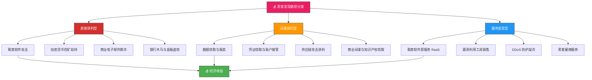
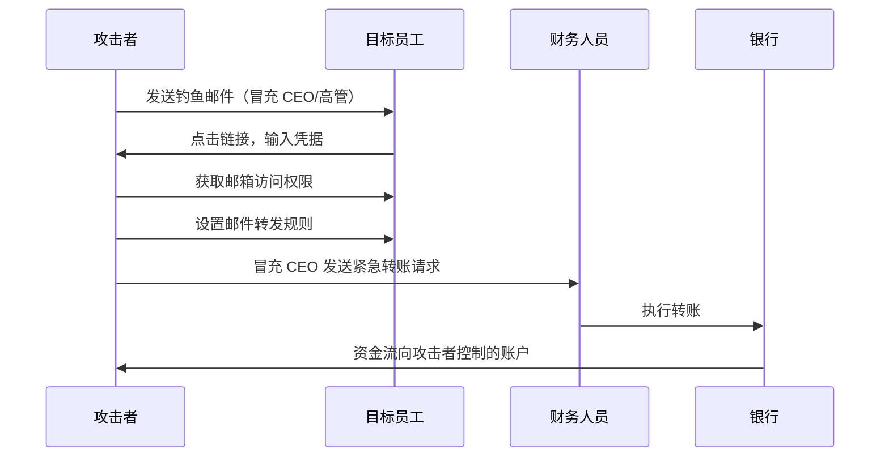
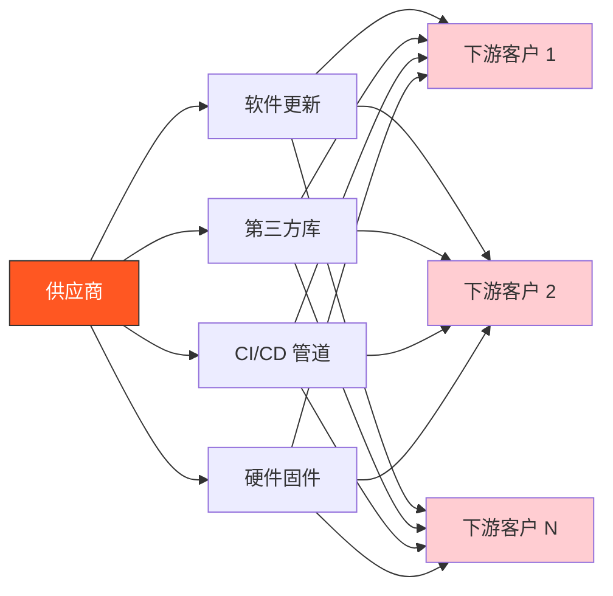

## 3. 主要变现路径分类框架

黑客活动的终极驱动力是经济利益。据 IBM《2024 年数据泄露成本报告》，全球单次数据泄露的平均成本已达 445 万美元，较 2023 年增长 10%；而 Cybersecurity Ventures 预测，到 2025 年网络犯罪的全球年度损失将达到 10.5 万亿美元。面对如此庞大的利益空间，攻击者早已形成高度专业化的产业链，从个人脚本小子到国家级 APT 组织，各自占据不同的变现生态位。

理解黑客变现路径的分类框架，是防御者制定优先级、分配资源、构建纵深防御体系的基础。本框架将所有已知的黑客变现路径归纳为三大类别：**直接获利型**（直接从受害者处获取资金）、**间接获利型**（通过窃取数据/资源间接变现）、**服务变现型**（将攻击能力包装为服务出售）。三大类别之间存在交叉和演进关系——例如勒索软件攻击（直接获利）常伴随数据窃取（间接获利），而 RaaS（勒索软件即服务）则属于服务变现型。

### 3.1 直接获利型

直接获利型路径的核心特征是：攻击者直接从受害者处获取现金或等值资产，攻击行为与资金获取之间没有中间环节。这类路径通常具有明确的攻击目标和即时变现能力，是网络犯罪中最"传统"的形态。

#### 3.1.1 勒索软件攻击

**原理与机制**

勒索软件攻击的基本流程是：通过钓鱼邮件、漏洞利用或远程桌面协议（RDP）弱口令等入口进入目标网络 → 横向移动获取域控权限 → 部署加密程序对关键文件进行加密 → 要求受害者支付比特币或以太坊赎金以获取解密密钥。

现代勒索软件已从"单纯加密"演变为"多重勒索"模式：

| 勒索模式 | 描述 | 代表家族 |
|---------|------|---------|
| 单一勒索 | 仅加密文件，威胁删除密钥 | 早期 CryptoLocker、WannaCry |
| 双重勒索 | 加密 + 数据泄露威胁 | LockBit、BlackCat、Cl0p |
| 三重勒索 | 加密 + 数据泄露 + DDoS 威胁 | BlackCat/ALPHV、Akira |
| 多目标勒索 | 同时威胁客户、供应商、合作伙伴 | LockBit 3.0、Play |

**赎金规模与趋势**

根据 CrowdStrike 和 Coveware 的年度报告数据：

- 2019 年平均赎金：约 11 万美元
- 2021 年平均赎金：约 41 万美元
- 2023 年平均赎金：约 150 万美元
- 2024 年部分大型攻击赎金要求已超过 1000 万美元

值得注意的是，2023 年 11 月 LockBit 3.0 遭受神秘黑客组织 "0xffff" 的毁灭性打击，其基础设施被摧毁、源代码被公开，导致勒索软件生态出现短暂洗牌。随后 BlackCat/ALPHV 和 Play 等家族填补了市场空白。

**技术细节**

以 LockBit 3.0 为例，其攻击链包含以下环节：

1. **初始访问**：通过钓鱼邮件（含恶意附件或链接）、RDP 暴力破解、供应链攻击（如利用合法 IT 服务商的凭证）
2. **持久化**：部署后门账户、计划任务、WMI 持久化
3. **权限提升**：利用未修补漏洞（如 PrintNightmare、ProxyLogon）或凭据转储（Mimikatz）获取域管理员权限
4. **横向移动**：使用 PsExec、WMI、PowerShell Remoting 在域内扩散
5. **数据外泄**：在加密前将敏感数据打包上传至攻击者控制的服务器（用于双重勒索）
6. **加密执行**：使用 AES-256 对称加密 + RSA-2048 非对称加密混合方案加密文件
7. **勒索通知**：在桌面显示勒索信，要求联系攻击者获取解密工具

**代表性事件**

- **Colonial Pipeline（2021）**：DarkSide 勒索软件攻击导致美国最大燃油管道停运 6 天，支付 440 万美元赎金。事件暴露了关键基础设施的脆弱性。
- **Kaseya VSA（2021）**：BlackCat 通过供应链攻击影响约 1500 家下游企业，赎金要求 7000 万美元，最终支付 700 万美元。
- **Change Healthcare（2023）**：AlphV/BlackCat 攻击 CVS 旗下的医疗数据平台，导致美国全国处方药处理中断，支付 2200 万美元赎金（据《纽约时报》报道）。

#### 3.1.2 加密货币挖矿劫持（Cryptojacking）

**原理与机制**

加密货币挖矿劫持（Cryptojacking）指攻击者在受害者设备上秘密运行加密货币挖矿程序，利用受害者的计算资源（CPU/GPU）来挖掘加密货币（如门罗币 Monero），将算力产生的收益据为己有。

与勒索软件不同，挖矿劫持不加密文件、不勒索赎金，而是通过消耗受害者的电力和硬件寿命来"偷取"算力。这种模式的优势在于隐蔽性强、持续性收入、不易被立即发现。

**攻击载体**

| 载体类型 | 描述 | 代表恶意软件 |
|---------|------|------------|
| 浏览器脚本 | 通过恶意网站注入 JavaScript 挖矿脚本（如 CoinHive 滥用） | CoinHive、CryptoLot |
| 服务器入侵 | 通过 SSH 弱口令或漏洞入侵 Linux 服务器部署挖矿程序 | Kinsing、Lemon Duck、XMRig |
| IoT 设备 | 利用 IoT 设备默认密码或固件漏洞植入挖矿程序 | Mirai 变种、Mozi |
| 容器逃逸 | 在 Kubernetes 容器中部署挖矿程序，利用集群资源 | 各类 Kubernetes 挖矿挖矿 Pod |

**收益分析**

以 XMRig 在单台云服务器上的挖矿收益为例：
- 一台 8 核 CPU 的云服务器（约 $50/月），运行 XMRig 可产生约 0.005-0.02 Monero/天
- 按 2024 年 Monero 价格约 $150 计算，日收益约 $0.75-$3
- 扣除服务器成本后，单台月净利润约 $15-$90
- 攻击者通过僵尸网络控制数千台服务器，月收入可达数十万美元

**检测特征**

- CPU 使用率异常升高（持续 90%+）
- 网络流量异常（连接门罗币矿池如 xmr.pool.minergate.com）
- 进程异常（xmrig、xmrig、kworkerds 等伪装名称）
- 系统温度异常升高
- 计划任务或 systemd 服务中隐藏的持久化机制

#### 3.1.3 商业电子邮件欺诈（BEC）

**原理与机制**

商业电子邮件欺诈（Business Email Compromise, BEC）是 FBI IC3（互联网犯罪投诉中心）报告中最具破坏性的网络犯罪类型。BEC 攻击者通过以下方式之一获取目标企业的电子邮件访问权限：

1. **凭证窃取**：通过钓鱼网站、恶意附件或凭据填充攻击获取邮箱登录凭据
2. **社会工程学**：冒充 IT 支持人员，诱骗员工重置密码或提供凭据
3. **邮箱规则篡改**：入侵后设置邮件转发规则，将敏感邮件自动转发至攻击者控制的邮箱

**攻击流程**

**损失规模**

根据 FBI IC3 年度报告：

| 年份 | 报告案件数 | 损失金额（美元） |
|------|-----------|----------------|
| 2019 | 4,374 | 2.6 亿 |
| 2020 | 19,368 | 1.87 亿 |
| 2021 | 23,805 | 2.52 亿 |
| 2022 | 24,583 | 2.52 亿 |
| 2023 | 24,583 | 2.52 亿 |

2013-2022 年间，BEC 累计损失超过 500 亿美元。单笔最大损失案例包括 2016 年孟加拉国央行被盗 8100 万美元（通过 SWIFT 系统）、2019 年某美国公司单笔损失 1000 万美元。

**变体类型**

- **CEO 欺诈**：冒充 CEO 要求员工进行紧急转账
- **供应商欺诈**：冒充供应商更改银行账户信息，将款项转入攻击者账户
- **律师欺诈**：冒充律师要求支付"保密费"或"和解金"
- **发票欺诈**：伪造发票或修改真实发票的付款信息

#### 3.1.4 银行木马与金融盗窃

**原理与机制**

银行木马（Banking Trojan）是专门针对金融账户的恶意软件，通过以下方式窃取资金：

1. **凭据窃取**：记录用户在银行网站输入的登录凭据
2. **实时劫持**：通过中间人攻击（Man-in-the-Browser, MitB）篡改交易页面，修改收款账户
3. **SIM 卡交换**：结合社会工程学，诱骗电信运营商将受害者的 SIM 卡转移至攻击者控制的号码，从而接管短信验证码
4. **ATM 跳线攻击**：在 ATM 机上安装恶意软件（如 Skimmer 的数字化版本），篡改交易指令

**代表性恶意软件**

| 名称 | 特征 | 目标地区 |
|------|------|---------|
| Zeus/Zbot | 最早的银行木马之一，使用 CnC 服务器 | 全球 |
| Citadel | Zeus 的开源变种，高度可定制 | 全球 |
| Anubis | 针对巴西、葡萄牙银行 | 南欧、南美 |
| IcedID | 多阶段加载器，可投递银行木马 | 全球 |
| Qakbot | 从邮件蠕虫演变为金融盗窃平台 | 全球 |

### 3.2 间接获利型

间接获利型路径的核心特征是：攻击者不直接从受害者处获取资金，而是通过窃取数据、凭证、知识产权等"原材料"，在暗网市场、情报市场或通过威胁勒索间接变现。这类路径的变现周期较长，但单次收益可能极高。

#### 3.2.1 数据窃取与贩卖

**数据分类与定价**

暗网市场对不同类型的数据有明确的定价体系。以下是 2024 年暗网市场的典型价格范围：

| 数据类型 | 单价范围（美元） | 备注 |
|---------|----------------|------|
| 信用卡信息（含 CVV） | $5-$50/条 | 取决于发卡行、信用额度 |
| 银行账户凭据 | $20-$200/条 | 含账号、密码、安全答案 |
| 个人身份信息（PII）全量包 | $10-$100/条 | 含姓名、SSN、DOB、地址 |
| 医疗记录（PHI） | $50-$500/条 | 含诊断、处方、保险信息 |
| 企业数据库（完整） | $10,000-$500,000 | 取决于数据量和敏感度 |
| 源代码/知识产权 | $50,000-$5,000,000 | 取决于商业价值 |
| 政府/机密文件 | $100,000-$10,000,000 | 取决于敏感级别 |

**暗网市场生态**

暗网市场是数据贩卖的核心渠道，主要分为以下几类：

1. **综合市场**（如 AlphaBay 的历史地位）：提供多种非法商品和服务，包括数据、武器、毒品等
2. **专业数据市场**（如 BreachForums、Nulled）：专注于数据泄露、凭证贩卖
3. **勒索软件泄露站点**（如 LockBit 的 "LockBit Leak"）：专门展示被窃取的企业数据，施压支付赎金
4. **Telegram 频道**：近年来成为数据贩卖的主要渠道，门槛低、匿名性强

**定价影响因素**

数据在暗网的价格取决于以下因素：

- **新鲜度**：刚泄露的数据价格最高，随着时间推移价格递减
- **完整性**：包含完整字段（姓名+SSN+密码+邮箱+电话）的数据比单一字段贵数倍
- **验证状态**：经过验证（可登录）的账户凭据比未验证的贵 5-10 倍
- **规模**：批量购买通常有折扣，但单价不会低于一定阈值
- **目标行业**：金融、医疗、政府数据的价格远高于一般企业数据

#### 3.2.2 凭证窃取与账户接管

**攻击手段**

凭证窃取是间接获利型路径中最常见的手段，主要技术包括：

1. **信息窃取恶意软件（Infostealer）**：如 RedLine、Raccoon、Vidar、Anubis，专门窃取浏览器保存的密码、Cookie、钱包文件等
2. **钓鱼网站**：克隆银行、邮箱、社交媒体的登录页面，诱骗用户输入凭据
3. **凭据填充（Credential Stuffing）**：使用已泄露的凭据库对目标网站进行自动化登录尝试
4. **键盘记录器**：记录用户输入的每一个按键，包括密码
5. **浏览器扩展劫持**：恶意浏览器扩展窃取用户的登录凭据和 Cookie

**账户接管的变现方式**

| 变现方式 | 描述 | 典型收益 |
|---------|------|---------|
| 直接资金盗窃 | 登录银行账户、支付账户（PayPal、Venmo）直接转账 | $100-$10,000/账户 |
| 账户出售 | 将已接管的账户（含 Cookie）在暗网出售 | $5-$500/账户 |
| 撞库攻击 | 使用窃取的凭据对其他网站进行登录尝试 | 取决于目标 |
| 欺诈活动 | 利用接管的账户进行虚假交易、退款欺诈 | $500-$50,000/账户 |
| 社交工程跳板 | 利用接管的社交媒体账户对联系人进行钓鱼 | 间接收益 |

**Infostealer 市场**

Infostealer 已成为网络犯罪产业链中高度商业化的环节。以 RedLine Stealer 为例：

- 售价：约 $150/月订阅或 $300/永久许可
- 功能：窃取浏览器密码、Cookie、加密货币钱包、系统信息
- 支持：提供详细的安装指南、日志分析工具、技术支持
- 日志格式：结构化的 JSON 或 CSV 日志，便于攻击者批量处理

#### 3.2.3 供应链攻击获利

**原理与机制**

供应链攻击通过入侵软件或硬件供应商，将恶意代码嵌入到合法产品或更新中，从而间接感染大量下游客户。这种攻击方式的核心优势是"一次入侵，多次获利"——攻击者只需攻破一个供应商，就能影响成百上千个最终目标。

**攻击路径**

**代表性事件**

| 事件 | 时间 | 攻击者 | 影响范围 | 损失/影响 |
|------|------|--------|---------|----------|
| SolarWinds | 2020 | APT29（Cozy Bear） | 18,000+ 组织，含 200+ 美国政府机构 | 国家级情报窃取 |
| Kaseya VSA | 2021 | BlackCat/ALPHV | ~1,500 家下游企业 | $700 万赎金 |
| MOVEit | 2023 | Clop 勒索软件 | 2,500+ 组织，含沃尔玛、BBC | 数亿条 PII 泄露 |
| 3CX | 2023 | APT41 | 全球 6,000+ 企业 | 情报窃取 + 勒索 |
| Log4Shell | 2021 | 多方利用 | 全球数百万系统 | 广泛的初始访问 |

**供应链攻击的盈利模式**

1. **勒索变现**：如 Kaseya 和 MOVEit 事件，通过影响大量下游客户勒索赎金
2. **情报窃取**：如 SolarWinds 事件，获取国家级情报后出售或用于地缘政治目的
3. **持久化后门**：在供应链中植入长期后门，持续窃取数据
4. **横向扩展**：以供应商为跳板，攻击其高价值客户

#### 3.2.4 商业间谍与知识产权窃取

**攻击目标与价值**

商业间谍活动针对的是企业的核心知识产权，包括：

- **研发数据**：产品设计图纸、实验数据、配方（如制药行业的化合物数据）
- **源代码**：核心算法、专有软件、编译器优化代码
- **商业策略**：并购计划、产品路线图、定价策略
- **客户数据**：客户名单、合同条款、采购偏好

**典型案例**

- **乌克兰窃取特斯拉电池数据（2018）**：据《纽约时报》报道，乌克兰情报机构从特斯拉服务器窃取了约 1TB 的电池技术数据，后出售给中国买家，交易金额约 500 万美元
- **APT10 针对航空业**：中国 APT10 组织长期针对全球航空制造企业，窃取飞机设计图纸和技术文档
- **Oligarch 针对制药业**：俄罗斯背景的攻击组织针对制药公司窃取药物研发数据

### 3.3 服务变现型

服务变现型路径的核心特征是：攻击者不直接攻击最终目标，而是将攻击能力、工具或基础设施包装为服务，出售给其他攻击者或恶意行为体。这种模式类似于合法软件行业的 SaaS（软件即服务）模式，被称为"犯罪即服务"（Crime-as-a-Service, CaaS）。

#### 3.3.1 勒索软件即服务（RaaS）

**商业模式**

RaaS（Ransomware-as-a-Service）是服务变现型中最成熟、最商业化的模式。攻击者（"开发商"）开发勒索软件平台，招募"代理商"（Affiliate）进行实际攻击，双方按约定比例分成。

**分成模式**

| 角色 | 职责 | 分成比例 |
|------|------|---------|
| 开发商（Developer） | 开发勒索软件、提供基础设施、技术支持 | 20%-40% |
| 代理商（Affiliate） | 执行实际攻击、谈判赎金、交付解密密钥 | 60%-80% |
| 中间人（Broker） | 连接开发商和代理商，有时也参与攻击 | 10%-20% |

**RaaS 平台特征**

以 LockBit 为例，其 RaaS 平台提供：

- **用户友好的控制面板**：代理商可通过 Web 界面管理攻击、查看收益
- **技术支持**：提供 24/7 技术支持，帮助代理商解决攻击中的技术问题
- **营销材料**：提供勒索信模板、泄露站点设计、宣传材料
- **基础设施**：提供 C2 服务器、数据外泄存储、赎金接收钱包
- **培训材料**：提供攻击教程、最佳实践指南

**RaaS 生态的演进**

- **第一代（2013-2016）**：CryptoLocker、CryptoWall 等早期勒索软件，主要通过 P2P 网络传播
- **第二代（2017-2019）**：WannaCry、NotPetya 等蠕虫式勒索软件，利用永恒之蓝等漏洞自动传播
- **第三代（2020-2022）**：REvil、BlackMatter、Conti 等 RaaS 平台，提供完整的服务生态
- **第四代（2023-至今）**：LockBit 3.0、BlackCat、Play 等，提供双重勒索、定制化攻击、企业级服务

#### 3.3.2 漏洞利用工具销售

**零日漏洞市场**

零日漏洞（Zero-Day Vulnerability）是指尚未被软件供应商发现或修补的安全漏洞。零日漏洞的市场价格取决于漏洞的利用难度、影响范围和潜在攻击价值。

**漏洞定价参考**

| 漏洞类型 | 价格范围（美元） | 备注 |
|---------|----------------|------|
| 普通 Web 应用漏洞 | $10,000-$50,000 | 如 SQL 注入、XSS |
| 操作系统远程代码执行 | $50,000-$300,000 | 如 Windows、Linux 内核漏洞 |
| 移动设备漏洞链 | $100,000-$500,000 | 如 iOS、Android 漏洞利用链 |
| 浏览器远程代码执行 | $200,000-$1,000,000 | 如 Chrome、Safari 漏洞 |
| 通信设备漏洞 | $500,000-$3,000,000 | 如 iPhone、WhatsApp 漏洞 |
| 国家级漏洞 | $1,000,000-$20,000,000 | 如 Stuxnet 使用的漏洞 |

**合法漏洞收购平台**

- **Zerodium**：由 Zeronights 运营，收购移动设备和浏览器漏洞，最高出价 $200 万美元
- **Project Zero**：Google 的漏洞收购项目，收购 Chrome、Android、iOS 漏洞
- **Apple Product Security**：收购 iOS、macOS 漏洞
- **Microsoft SRC**：收购 Windows 漏洞

**灰色市场与黑色市场**

合法平台之外，还存在大量灰色和黑色漏洞市场：

- **Exploit.in**：著名的漏洞利用代码市场（已关闭，但仍有类似平台）
- **Telegram 频道**：大量漏洞利用代码在 Telegram 频道中交易
- **暗网论坛**：如 BreachForums、RaidForums 等论坛的漏洞交易板块

#### 3.3.3 DDoS 防护敲诈

**攻击模式**

DDoS 防护敲诈（DDoS-for-Hire Extortion）的攻击流程如下：

1. 攻击者对目标网站发起 DDoS 攻击，展示攻击能力
2. 攻击者联系目标，声称可以"保护"其免受攻击
3. 攻击者要求支付"保护费"（通常按月或按年）
4. 如果目标拒绝支付，攻击者继续或升级 DDoS 攻击
5. 如果目标支付，攻击者停止攻击（但可能继续索要更多费用）

**目标选择**

DDoS 敲诈的常见目标包括：

- **在线赌博网站**：收入依赖在线流量，停机损失大
- **金融交易网站**：交易中断直接影响收入
- **游戏服务器**：玩家流失导致收入下降
- **电商平台**：节假日期间（如黑色星期五）的 DDoS 敲诈尤为猖獗

**DDoS 即服务（DDoS-as-a-Service）**

DDoS 攻击能力本身也已形成服务化市场：

- **Botnet 租赁**：按带宽（Gbps）或连接数（CC）计费，$10-$100/小时
- **Mirai 变种**：IoT 僵尸网络，可产生数百 Gbps 的攻击流量
- **反射放大攻击**：利用 DNS、NTP、SSDP 等协议的反射放大效应
- **应用层 DDoS**：模拟正常用户行为，绕过传统防护

#### 3.3.4 黑客雇佣服务

**服务类型**

黑客雇佣服务（Hack-for-Hire）提供定制化的网络攻击服务，目标包括：

- **竞争对手**：窃取商业机密、破坏运营、损害声誉
- **诉讼对手**：获取有利证据、破坏对方数据
- **前配偶/商业伙伴**：个人报复、商业纠纷
- **政府/政治目标**：政治间谍、舆论操纵

**价格范围**

| 服务类型 | 价格范围（美元） |
|---------|----------------|
| 信息收集（OSINT） | $1,000-$10,000 |
| 网站入侵 | $5,000-$50,000 |
| 企业网络入侵 | $50,000-$500,000 |
| 数据窃取 | $10,000-$200,000 |
| 破坏性攻击 | $20,000-$100,000 |
| 长期渗透测试（恶意） | $100,000-$1,000,000/年 |

### 3.4 地下经济生态系统

理解黑客变现路径，必须理解支撑这些路径的地下经济生态系统。这个生态系统包括暗网市场、支付基础设施、洗钱渠道和技术支持网络。

#### 3.4.1 暗网市场结构

暗网市场是网络犯罪的"购物中心"，提供从数据、工具到服务的完整商品目录。

**市场分类**

| 类型 | 代表 | 主要商品 |
|------|------|---------|
| 综合市场 | AlphaBay（已关闭）、Dream Market | 数据、武器、毒品、服务 |
| 数据市场 | BreachForums、Nulled、Exploit.in | 泄露数据、凭据、漏洞 |
| 勒索软件泄露站 | LockBit Leak、BlackMatter Leak | 被窃取的企业数据展示 |
| 工具市场 | Telegram 频道、暗网论坛 | 恶意软件、工具、脚本 |
| 服务市场 | 各类 Telegram 频道 | 黑客服务、DDoS 服务 |

**市场运营机制**

- **托管交易（Escrow）**：买家先付款，卖家交付商品后，平台释放资金给卖家
- **评分系统**：买家对卖家进行评分，高评分卖家获得更多信任
- **争议解决**：平台提供争议仲裁机制
- **退出机制（Exit Scam）**：市场运营者可能卷款跑路，这是暗网市场的常见风险

#### 3.4.2 支付基础设施

加密货币是网络犯罪的主要支付手段，但攻击者也使用多种支付方式：

**加密货币支付**

| 加密货币 | 使用场景 | 优势 |
|---------|---------|------|
| 比特币（BTC） | 大额交易、勒索赎金 | 流动性高、接受度广 |
| 门罗币（XMR） | 日常交易、恶意软件销售 | 隐私性强、难以追踪 |
| 以太坊（ETH） | 智能合约、DeFi 攻击 | 功能丰富 |
| USDT/USDC | 稳定币交易 | 价格稳定、易兑换 |
| 闪电网络 | 小额高频交易 | 速度快、费用低 |

**洗钱渠道**

攻击者获取加密货币后，需要通过以下方式洗钱：

1. **加密货币混币器**（如 Wasabi Wallet、Tornado Cash）：混合多笔交易，切断资金追踪链
2. **加密货币交易所**：通过多层转账和跨交易所交易混淆资金流向
3. **P2P 交易平台**：将加密货币兑换为法币
4. **虚拟商品购买**：购买游戏币、礼品卡等虚拟商品，再转售
5. **跑分平台**：通过大量个人账户分散资金

### 3.5 商业模式对比分析

下表从多个维度对比三大类变现路径：

| 维度 | 直接获利型 | 间接获利型 | 服务变现型 |
|------|-----------|-----------|-----------|
| **典型收益** | $10K-$10M/次 | $1K-$500K/次 | $10K-$10M/年 |
| **变现周期** | 短（小时-天） | 中（天-月） | 长（月-年） |
| **技术门槛** | 中-高 | 中 | 高 |
| **法律风险** | 极高 | 高 | 极高 |
| **可扩展性** | 低 | 中-高 | 高 |
| **隐蔽性** | 低 | 高 | 中 |
| **持续性** | 低（一次性） | 中（可重复） | 高（订阅制） |
| **代表案例** | 勒索软件、BEC | 数据贩卖、凭证窃取 | RaaS、漏洞销售 |

### 3.6 趋势与演进

#### 3.6.1 AI 辅助攻击

人工智能正在改变网络犯罪的格局：

- **AI 生成钓鱼邮件**：使用大语言模型生成高度个性化的钓鱼邮件，绕过传统过滤
- **AI 辅助漏洞发现**：使用 AI 自动扫描代码、发现漏洞
- **AI 生成恶意软件**：使用 AI 生成多态恶意软件，绕过杀毒软件检测
- **AI 社会工程学**：使用 AI 分析社交媒体数据，生成针对性社会工程学攻击

#### 3.6.2 云原生威胁

随着企业向云端迁移，攻击者也在适应：

- **云配置错误利用**：利用 S3 桶公开、IAM 权限过宽等配置错误
- **容器逃逸**：利用容器漏洞获取宿主机访问权限
- **Kubernetes 攻击**：利用 K8s API 服务器漏洞、RBAC 配置错误
- **Serverless 攻击**：利用 Lambda 函数权限提升

#### 3.6.3 供应链攻击常态化

供应链攻击已从偶发事件演变为常态化威胁：

- **开源软件供应链攻击**：如 Log4Shell、SolarWinds 事件后，攻击者更加关注开源生态
- **CI/CD 管道攻击**：通过入侵 CI/CD 管道在软件构建过程中植入恶意代码
- **依赖混淆攻击**：通过发布同名恶意包到公共包管理器（如 npm、PyPI）

### 3.7 法律后果与执法趋势

#### 3.7.1 主要法律框架

| 司法管辖区 | 主要法律 | 最高刑期 |
|-----------|---------|---------|
| 美国 | CFAA（计算机欺诈与滥用法） | 20 年 |
| 欧盟 | 网络犯罪公约（Budapest Convention） | 各国不同 |
| 中国 | 刑法第 285-287 条 | 7 年 |
| 英国 | 计算机滥用法（Computer Misuse Act） | 14 年 |

#### 3.7.2 执法趋势

- **国际合作加强**：FBI、Europol、Interpol 等机构加强跨境合作
- **加密货币追踪**：Chainalysis、Elliptic 等公司帮助执法机构追踪加密货币流向
- **勒索软件打击**：2023 年 FBI 成功追踪并冻结 Colonial Pipeline 赎金中的 630 万美元
- **RaaS 平台打击**：2023 年 LockBit 3.0 被神秘黑客组织摧毁，2024 年 Conti 也被打击

### 3.8 防御视角：各路径的防御策略

理解攻击者的变现路径，最终目的是构建有效的防御体系。以下是针对各路径的防御策略：

#### 3.8.1 直接获利型防御

| 路径 | 防御策略 |
|------|---------|
| 勒索软件 | 定期备份（3-2-1 原则）、端点检测与响应（EDR）、网络分段、禁用宏、补丁管理 |
| 挖矿劫持 | 监控 CPU 使用率、检查计划任务、网络流量分析、容器安全扫描 |
| BEC | 多因素认证（MFA）、员工安全意识培训、转账验证流程、邮件安全网关 |
| 银行木马 | 浏览器安全、反恶意软件、银行交易双重验证、SIM 卡锁定 |

#### 3.8.2 间接获利型防御

| 路径 | 防御策略 |
|------|---------|
| 数据窃取 | 数据分类与标记、数据丢失防护（DLP）、加密、访问控制、行为分析 |
| 凭证窃取 | 密码管理器、MFA、单点登录（SSO）、凭据泄露监控 |
| 供应链攻击 | 软件物料清单（SBOM）、供应商安全评估、代码签名验证、CI/CD 安全 |
| 商业间谍 | 网络分段、数据防泄漏、员工背景调查、知识产权加密 |

#### 3.8.3 服务变现型防御

| 路径 | 防御策略 |
|------|---------|
| RaaS | 与合法安全公司合作、威胁情报订阅、参与信息共享组织（ISAC） |
| 漏洞利用 | 漏洞管理计划、渗透测试、红队演练、零信任架构 |
| DDoS 敲诈 | DDoS 防护服务（如 Cloudflare、AWS Shield）、不支付赎金 |
| 黑客雇佣 | 安全意识培训、社会工程学演练、内部威胁检测 |

### 3.9 总结

黑客变现路径的分类框架揭示了网络犯罪从"个人犯罪"向"产业化犯罪"的演进趋势。直接获利型路径追求快速变现，间接获利型路径追求规模效应，服务变现型路径追求可持续收入。三大类别之间相互交织，共同构成了一个高度专业化、分工明确的地下经济生态系统。

对于防御者而言，理解这一框架的意义在于：

1. **优先级排序**：根据组织面临的实际威胁，优先防御高概率、高影响的变现路径
2. **资源分配**：将安全预算分配到最有效的防御措施上
3. **威胁情报**：关注与组织相关的攻击者活动和变现模式变化
4. **事件响应**：在安全事件发生时，快速识别攻击者的变现意图，采取针对性响应措施

网络犯罪的产业化趋势不会停止，但防御者可以通过深入理解攻击者的商业模式，构建更加有效的防御体系。