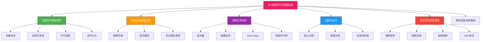
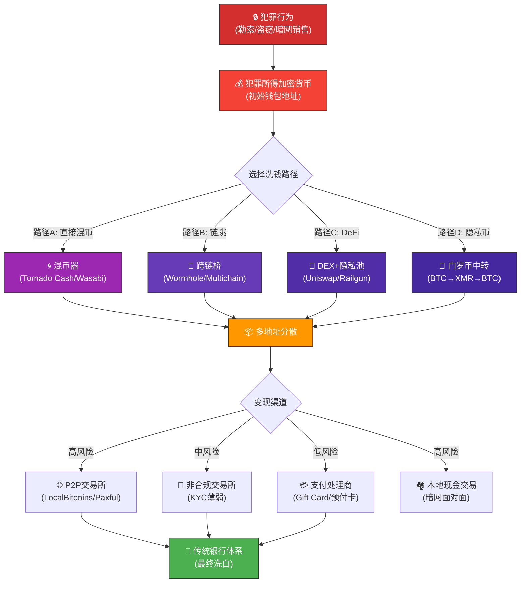

## 4. 加密货币与网络犯罪



### 4.1 加密货币基础特性与犯罪吸引力

加密货币已成为网络犯罪资金流转的核心基础设施。要理解其在犯罪生态中的角色，需要从密码学、经济学和监管环境三个维度分析其特性。

#### 4.1.1 伪匿名性：透明账本上的身份隐匿

加密货币最核心的特性是伪匿名性（Pseudonymity）。以比特币为例，每笔交易都记录在公开的区块链上，包括发送地址、接收地址、金额和时间戳。然而，地址本身并不直接对应真实身份——它是一串由公钥哈希生成的随机字符，如 `bc1qxy2kgdygjrsqtzq2n0yrf2493p83kkfjhx0wlh`。

**伪匿名性的技术原理：**

| 层级 | 机制 | 匿名程度 |
|------|------|----------|
| 地址生成 | SHA-256 + RIPEMD-160 哈希公钥 | 高（无法反推私钥） |
| 交易签名 | 椭圆曲线数字签名（ECDSA） | 高（证明所有权但不暴露身份） |
| 链上可见性 | 所有交易公开可查 | 低（交易图谱可分析） |
| KYC交易所 | 实名认证绑定地址 | 零（直接关联真实身份） |

**关键局限：** 伪匿名性≠匿名性。一旦地址通过任何渠道（交易所KYC、IP地址、时间关联）与真实身份绑定，该地址的所有历史交易和未来交易都可追溯。Chainalysis 2024年报告显示，比特币交易中约 85% 的资金流最终可通过链上分析追溯到至少一个已知实体（交易所、混币器或已标记地址）。

#### 4.1.2 全球可及性与跨境流动性

加密货币打破了传统金融体系的跨境壁垒。传统国际电汇需要通过 SWIFT 网络，涉及多个中间银行，耗时 2-5 个工作日，且每笔都可能被拦截或冻结。相比之下：

- **速度：** 比特币确认约10分钟/笔，门罗币约2分钟/笔，USDT-TRC20约1分钟/笔
- **成本：** 跨境转账费用固定（取决于网络拥堵程度），不受金额影响，通常远低于银行电汇的3%-5%
- **无中介：** 点对点直接传输，无需银行审批或反洗钱筛查
- **24/7运行：** 不受银行营业时间或节假日限制

这使得犯罪资金可以在几分钟内从一个国家转移到另一个国家，且不需要任何金融中介的批准。Chainalysis 2023年报告指出，跨链加密货币犯罪资金中，约60%涉及两个或更多国家。

#### 4.1.3 不可逆性与交易终局性

传统银行体系中，受害者可以通过 chargeback（拒付）机制追回欺诈资金。加密货币交易一旦获得足够区块确认（通常6个区块≈1小时），交易即具有终局性，无法撤销。这一特性：

- **对攻击者：** 降低了收款风险——收款后无需担心资金被追回
- **对受害者：** 极大增加了追回难度——必须通过法律途径追查持有者
- **对犯罪生态：** 降低了交易摩擦，使得陌生人之间的犯罪协作更容易

#### 4.1.4 去中心化与抗审查性

去中心化是加密货币对抗监管的结构性优势。没有中央银行或政府可以单方面冻结比特币网络中的地址（除非控制超过51%的算力）。虽然监管机构可以通过交易所（中心化入口）实施冻结，但链上资产本身不受单点控制。

**抗审查能力对比：**

| 金融工具 | 冻结难度 | 跨境限制 | 监管覆盖 |
|----------|----------|----------|----------|
| 银行账户 | 极低（法院令） | SWIFT合规 | 完全覆盖 |
| PayPal/支付宝 | 低（平台政策） | 受限 | 高度覆盖 |
| 比特币 | 高（需网络控制） | 无 | 部分覆盖 |
| 门罗币 | 极高（隐私保护） | 无 | 有限覆盖 |
| USDT（TRC20） | 中（发行方可冻结） | 低 | 部分覆盖 |

**USDT的特殊性：** 值得注意的是，USDT（Tether）虽然运行在去中心化区块链上，但发行方 Tether 公司保有冻结地址的权力。截至2024年，Tether 已冻结超过 10 亿美元涉及犯罪的 USDT 地址。这意味着稳定币并非完全去中心化，其抗审查性取决于发行方的政策。

### 4.2 犯罪生态中的加密货币基础设施

加密货币犯罪并非孤立行为，它依赖一套完整的基础设施生态。

#### 4.2.1 犯罪者使用的加密货币类型

不同加密货币因其特性差异，被用于不同类型的犯罪：

**比特币（BTC）——犯罪中的"通用货币"：**

比特币是网络犯罪中使用最广泛的加密货币，占犯罪相关加密交易总量的约60-70%。其优势在于流动性最高——几乎所有交易所都支持BTC交易，且有最大的场外交易市场。但比特币的区块链分析技术最成熟，追踪成功率也最高。

**门罗币（XMR）——隐私之王：**

门罗币采用环签名（Ring Signatures）、隐秘地址（Stealth Addresses）和环机密交易（RingCT）三重隐私保护：

- **环签名：** 将真实交易签名与多个虚假签名混合，使外部观察者无法确定哪个签名是真实的
- **隐秘地址：** 每笔交易生成一次性接收地址，即使知道某人的主地址，也无法关联其所有交易
- **环机密交易：** 隐藏交易金额，使分析者无法通过金额匹配追踪资金流

门罗币是暗网市场和隐私敏感型犯罪的首选。2020年，FBI 宣布成功追踪门罗币交易，但仅限于特定条件（如用户错误暴露了隐私信息），并未破解其密码学保护。

**USDT/USDC——犯罪中的"数字美元"：**

稳定币因其价格稳定（锚定1美元）和高流动性，成为犯罪资金的存储和转移工具。USDT-TRC20（基于波场网络）因转账费用极低（约1美元）和速度快，成为亚太地区犯罪的热门选择。

**以太坊（ETH）——DeFi攻击的工具：**

以太坊及其智能合约生态催生了新型犯罪——DeFi协议攻击。攻击者通过智能合约漏洞窃取资金，2022-2023年 DeFi 攻击造成的损失超过 50 亿美元。

#### 4.2.2 暗网市场与加密货币

暗网市场（Darknet Markets）是加密货币犯罪生态的重要组成部分。这些市场运行在 Tor 网络上，使用加密货币作为唯一支付方式。

**典型暗网市场运作模式：**

1. **注册：** 通过 Tor 浏览器访问 .onion 地址
2. **充值：** 向市场托管地址存入 BTC/XMR
3. **交易：** 使用平台内钱包进行买卖
4. **提现：** 将余额提取到外部地址

**托管机制：** 大多数暗网市场采用托管支付（Escrow）——买家付款后资金由平台暂存，确认收货后才释放给卖家。这一机制降低了交易风险，但也意味着平台运营者可以随时卷款跑路（Exit Scam）。

**主要暗网市场历史变迁：**

| 时期 | 代表性市场 | 月交易额 | 命运 |
|------|-----------|----------|------|
| 2011-2013 | Silk Road | $1.2亿/月 | 创始人被捕，关闭 |
| 2014-2017 | AlphaBay, Hansa | $3亿/月 | 联合执法行动关闭 |
| 2017-2020 | Empire Market | $2亿/月 | Exit Scam跑路 |
| 2020-2022 | Hydra | $15亿/月 | 德国警方关闭 |
| 2022-至今 | OMG!等俄罗斯市场 | $5000万/月 | 持续运营中 |

#### 4.2.3 混币服务与隐私工具

混币服务（Mixers/Tumblers）是加密货币反追踪的核心工具，其工作原理是将多笔交易混合后再分发，切断发送者与接收者的关联。

**混币类型：**

| 类型 | 代表 | 原理 | 隐私强度 | 成本 |
|------|------|------|----------|------|
| 中心化混币 | BestMixer（已关闭） | 第三方接管资金后重新分发 | 中（信任第三方） | 1-3% |
| CoinJoin | Wasabi Wallet, JoinMarket | 多用户合并交易 | 高（密码学保证） | 0.1-0.5% |
| 智能合约混币 | Tornado Cash | 智能合约池混合 | 极高（零知识证明） | 固定Gas费 |
| 原子交换 | 跨链DEX | 不同链间原子交换 | 高（无中介） | 网络费+滑点 |

**Tornado Cash 的特殊地位：** Tornado Cash 是基于以太坊智能合约的去中心化混币协议，使用 zk-SNARK（零知识简洁非交互式知识论证）技术。用户将 ETH 存入合约池，等待一段时间后从池中提取等量 ETH 到新地址。由于零知识证明的存在，存款和取款之间没有链上关联。2022年8月，美国 OFAC 将 Tornado Cash 列入制裁名单，但其智能合约仍在以太坊上运行——因为智能合约一旦部署就无法被任何人关闭（除非私钥持有者，而 Tornado Cash 的合约已放弃所有权）。

### 4.3 洗钱技术体系深度解析

加密货币洗钱（Money Laundering）是将犯罪所得转化为"干净"资产的过程，通常分为三个阶段：放置（Placement）、分层（Layering）和整合（Integration）。

#### 4.3.1 核心洗钱技术详解

**混币器（Mixer/Tumbler）洗钱：**

混币器是最直接的反追踪手段。用户将犯罪所得的加密货币发送到混币服务地址，经过混合后从多个新地址接收等量（扣除手续费）的加密货币。

技术流程：
1. 攻击者将 10 BTC 发送到混币器地址 A
2. 混币器从资金池中分配 10 BTC，来自不同的来源地址
3. 分批（如 0.5 BTC/笔）从多个不同地址发送到攻击者的新地址
4. 中间经过 5-20 层跳转

效果：资金流向图谱从直接的 A→B 变成复杂的网状结构，大幅增加追踪成本。但混币器并非完美——执法机构可以通过时间关联和金额分析缩小范围。

**链跳（Chain Hopping）洗钱：**

链跳是指在不同区块链之间转换加密货币，利用跨链桥或去中心化交易所（DEX）实现。例如：

1. 在以太坊上接收被盗的 ETH
2. 通过跨链桥转到 BNB Chain 上的 BNB
3. 再通过另一个跨链桥转到 Avalanche 上的 AVAX
4. 最后在不同链上的 DEX 兑换为目标资产

每经过一次链跳，追踪难度成倍增加——不同区块链之间没有统一的分析工具，且跨链桥的交易映射信息通常不公开。

**Peel Chain（剥皮链）洗钱：**

Peel Chain 是一种通过大量小额交易逐步转移资金的技术，核心思想是将大额资金"剥"成小额，每笔交易只转移总资金的一小部分。

典型 Peel Chain 结构：
- 初始地址持有 100 BTC
- 第1笔：转 0.01 BTC 到地址 A1，余额 99.99 BTC 转到地址 B1
- 第2笔：转 0.02 BTC 到地址 A2，余额 99.97 BTC 转到地址 B2
- ...持续数千笔交易
- 最终目标地址分散持有小额资金

Peel Chain 的优势在于每笔交易金额极小，不易触发交易所的风控阈值，且最终分散到大量地址后，每个地址的金额都低于报告门槛。

**DeFi 协议洗钱：**

去中心化金融（DeFi）协议提供了一套无需 KYC 的金融工具链：

1. **去中心化交易所（DEX）：** 如 Uniswap、SushiSwap，无需注册即可交易
2. **跨链桥：** 如 Wormhole、Multichain，实现不同链间的资产转移
3. **借贷协议：** 如 Aave、Compound，将加密资产作为抵押品借出新资产
4. **隐私池：** 如 Railgun，将资产混入隐私池后提取到新地址

这些协议组合使用，可以实现完全去中心化的洗钱流程，不依赖任何中心化服务。

**NFT 洗钱：**

NFT（非同质化代币）洗钱通过自买自卖制造虚假交易记录：

1. 攻击者创建一个 NFT（成本接近零）
2. 用犯罪所得资金（通过新地址）高价购买该 NFT
3. 卖方地址收到"合法"销售收入
4. 通过合法交易平台出售 NFT

这种方式将非法资金转化为"艺术品销售收入"，且 NFT 交易不受传统金融监管。美国 FinCEN 在2022年已将价值超过 3000 美元的 NFT 交易纳入反洗钱监管范围。

#### 4.3.2 洗钱技术效果对比

| 技术 | 隐私强度 | 成本 | 速度 | 技术门槛 | 被追踪风险 |
|------|----------|------|------|----------|------------|
| 混币器 | ★★★★☆ | 1-3% | 快 | 低 | 中 |
| 链跳 | ★★★★★ | 0.5-2% | 中 | 中 | 低 |
| Peel Chain | ★★★☆☆ | Gas费 | 慢 | 高 | 中-高 |
| DeFi协议 | ★★★★★ | Gas费+滑点 | 中 | 高 | 低 |
| NFT洗钱 | ★★★☆☆ | 平台费+Gas | 快 | 低 | 中-高 |
| 隐私币中转 | ★★★★★ | 兑换差价 | 快 | 低 | 低 |

### 4.4 执法追踪技术与案例

#### 4.4.1 链上分析工具

执法机构和区块链分析公司开发了一套成熟的追踪工具链：

**Chainalysis Reactor：**

Chainalysis 是全球最大的区块链分析公司，其 Reactor 工具被 60 多个国家的执法机构使用。其核心能力包括：

- **交易图谱可视化：** 将区块链交易转化为可交互的网络图，标注已知实体（交易所、混币器、暗网市场等）
- **聚类算法：** 通过交易模式分析，将属于同一实体的多个地址聚类
- **风险评分：** 对每个地址计算风险评分，基于其交互过的已标记实体
- **资金流追踪：** 追踪资金从犯罪源头到最终变现地址的完整路径

**Elliptic：**

Elliptic 提供类似的链上分析能力，其特色是 Transaction Screening API，可实时筛查交易是否涉及高风险地址。被多家银行和支付平台集成用于合规筛查。

**Crystal Blockchain：**

由 Chainalysis 前员工创立，专注于 CIS（独联体）地区和隐私币分析，在追踪门罗币交易方面有独特能力。

#### 4.4.2 追踪技术原理

**聚类分析（Cluster Analysis）：**

聚类分析是将属于同一实体的多个比特币地址归类的技术。常用方法包括：

- **共同输入启发式（Common Input Heuristic）：** 如果多个地址出现在同一笔交易的输入中，则它们很可能属于同一实体（因为需要私钥签名）
- **找零地址启发式（Change Address Heuristic）：** 通过分析交易输出结构，识别找零地址，将其与发送者关联
- **时间关联分析：** 相邻时间内出现的交易，如果模式相似，可能属于同一实体

**地址归属（Address Attribution）：**

将链上地址与现实世界实体关联的过程。方法包括：

- 交易所 KYC 数据（法律途径获取）
- 公开信息（论坛、社交媒体中的地址披露）
- 交易模式匹配（与已知模式对比）
- IP 地址关联（通过全节点监听）

#### 4.4.3 里程碑案例

**Colonial Pipeline 勒索事件（2021年）：**

Colonial Pipeline 是美国最大的燃油管道运营商。2021年5月遭受 DarkSide 勒索软件攻击，支付了 75 BTC（约 440 万美元）赎金。FBI 通过以下步骤追回了大部分赎金：

1. 追踪赎金从 Colonial 的钱包地址流出的路径
2. 发现赎金被转移到 DarkSide 控制的钱包集群
3. 通过与交易所合作获取相关账户的 KYC 信息
4. 申请法院令冻结并扣押相关比特币

这一案例展示了即使使用比特币支付赎金，如果资金流向中心化交易所，追踪仍然可行。

**Bitfinex 赃款追回（2022年）：**

2016年，加密货币交易所 Bitfinex 遭受黑客攻击，约 120,000 BTC（当时价值约 7200 万美元）被盗。2022年，美国 DOJ 拦截了约 94,000 BTC（价值约 36 亿美元），逮捕了夫妻二人 Ilya Lichtenstein 和 Heather Morgan。追回过程揭示：

- 黑客使用了多层复杂的洗钱技术（Peel Chain + 混币器 + 假身份）
- 但最终在将部分资金存入合规交易所时暴露
- 部分比特币因时间锁（Timelock）机制被锁定
- 2024年 Tether 冻结了另外约 5800 万 USDT 作为调查相关

**Hydra 暗网市场关闭（2022年）：**

德国联邦刑事警察局（BKA）关闭了全球最大的暗网市场 Hydra，查封了其服务器并获取了所有交易数据。Hydra 的月交易额达 15 亿美元，主要以比特币和门罗币计价。关闭后，约 2500 万欧元的加密货币被扣押。

### 4.5 加密货币犯罪类型详解

#### 4.5.1 勒索软件与加密货币

勒索软件是加密货币犯罪中规模最大、影响最广的类型。攻击者加密受害者的数据，要求以加密货币支付赎金。

**勒索支付的演变：**

| 时期 | 典型赎金 | 支付货币 | 特点 |
|------|----------|----------|------|
| 2013-2016 | 0.5-2 BTC | BTC为主 | 个人目标 |
| 2017-2019 | 5-50 BTC | BTC | 企业目标增加 |
| 2020-2022 | 50-500 BTC | BTC + XMR | RaaS模式爆发 |
| 2022-至今 | 100-1000+ BTC | BTC + USDT + XMR | 多币种支付 |

**RaaS（勒索软件即服务）的资金流转：**

RaaS 平台将勒索所得在运营商、附属机构和洗钱网络之间分配。典型分配比例：
- 运营商（RaaS平台）：20-30%
- 附属机构（实际攻击者）：60-70%
- 洗钱费用：5-15%

#### 4.5.2 加密劫持（Cryptojacking）

加密劫持是指未经他人同意，利用其计算资源挖掘加密货币。攻击者通常通过以下方式部署挖矿脚本：

- **浏览器内挖矿：** 在网页中嵌入 Coinhive 等 JavaScript 挖矿脚本，利用访问者的 CPU 挖门罗币（XMR）
- **云服务劫持：** 利用云服务的配置错误，创建挖矿实例
- **供应链攻击：** 在合法软件更新中植入挖矿代码

加密劫持的特点是单次获利极低（每人每天约 $0.01-0.05），但通过规模化可获取可观收入。Coinhive 在2017-2019年间高峰期每天产生约 $250,000 的门罗币。

#### 4.5.3 DeFi 协议攻击

DeFi 协议攻击是2020年以来增长最快的加密货币犯罪类型。常见攻击手法包括：

**闪电贷攻击（Flash Loan Attack）：**

闪电贷允许用户无需抵押即可借出大量资金（条件是在同一笔交易内归还）。攻击者利用这一特性：
1. 借入大量资产
2. 通过大量交易操纵价格预言机（Oracle）
3. 在被操纵的价格下从协议中获利
4. 归还借款，保留利润

**典型闪电贷攻击流程：**

```solidity
// 简化示意（非真实攻击代码）
function attack() external {
    // 1. 从 Aave 借入大量 DAI
    uint amount = aave.flashLoan(1000000 * 1e18);
    
    // 2. 用借入的资金操纵 DEX 上的价格
    dex.swap(DAI, TOKEN_A, amount);
    
    // 3. 在被操纵的价格下从借贷协议中借出更多资产
    uint profit = lendingProtocol.borrow(TOKEN_B, 500000 * 1e18);
    
    // 4. 将利润转出，归还闪电贷
    aave.repay(amount);
}
```

**智能合约漏洞利用：**

常见的智能合约漏洞包括：
- **重入攻击（Reentrancy）：** The DAO 事件（2016年）损失 360万 ETH
- **访问控制缺陷：** 管理员函数未正确保护
- **整数溢出：** Solidity <0.8.0 版本的整数溢出漏洞
- **逻辑错误：** 价格计算、奖励分配等业务逻辑错误

#### 4.5.4 交易所安全事件

加密货币交易所是攻击者的高价值目标。历史上主要的交易所被盗事件：

| 交易所 | 年份 | 损失 | 攻击手法 |
|--------|------|------|----------|
| Mt. Gox | 2014 | 850,000 BTC | 内部漏洞利用 |
| Bitfinex | 2016 | 120,000 BTC | API密钥泄露 |
| Coincheck | 2018 | 5.3亿 NEM | 热钱包管理不善 |
| Binance | 2019 | 7,000 BTC | API+2FA漏洞 |
| Poly Network | 2021 | 6.1亿美元 | 跨链合约漏洞 |
| Ronin Network | 2022 | 6.25亿 USDC+ETH | 私钥管理漏洞 |

### 4.6 典型资金流转路径



**路径A：直接混币路径**

这是最简单的洗钱路径，适用于小额资金。犯罪者将资金发送到混币服务，经过 3-5 层混合后提取到新地址。整个过程可在 1-2 小时内完成。但混币器已成为执法重点监控目标——Tornado Cash 被制裁后，使用混币器的地址会被标记为高风险，后续变现难度增加。

**路径B：链跳路径**

链跳路径适用于大额资金，利用不同区块链之间的分析壁垒。犯罪者在以太坊上接收资金，通过跨链桥转到 BSC，再转到 Avalanche，最后在各链的 DEX 上兑换为目标资产。这条路径的追踪难度与跨链桥数量成正比，但手续费和滑点损失也相应增加。

**路径C：DeFi 协议路径**

DeFi 路径是目前最隐蔽的洗钱方式。犯罪者通过 Railgun 等隐私协议将资金混入池中，然后从新地址提取。由于使用了零知识证明，链上无法将存入和提取关联起来。2023年，North Korean APT 组织 Lazarus Group 就利用这种方式洗白了约 6 亿美元的被盗加密资产。

**路径D：隐私币中转路径**

先将 BTC 兑换为门罗币（XMR），再将 XMR 兑换回 BTC。由于门罗币的隐私保护，两笔兑换之间没有链上关联。这条路径的缺点是每次兑换都会产生 0.5-2% 的价差损失，且大额兑换可能引起交易所注意。

### 4.7 监管框架与合规

#### 4.7.1 主要监管框架

**FATF Travel Rule（旅行规则）：**

金融行动特别工作组（FATF）要求虚拟资产服务提供商（VASP）在转账时传递发送者和接收者信息，类似于传统银行的汇款信息要求。截至2024年，已有 50+ 个国家/地区实施了旅行规则。

**各国监管态度：**

| 国家/地区 | 监管态度 | 关键法规 | 执行力度 |
|-----------|----------|----------|----------|
| 美国 | 严格 | FinCEN + SEC + CFTC | 高（多机构联合执法） |
| 欧盟 | 严格 | MiCA（2024年生效） | 高（统一框架） |
| 中国 | 禁止 | 全面禁止加密货币交易 | 极高 |
| 日本 | 友好 | PSP法+交易所牌照 | 中 |
| 新加坡 | 中性 | PSA法+MAS牌照 | 中 |
| 阿联酋 | 友好 | VARA框架 | 低-中 |
| 俄罗斯 | 灰色 | 禁止支付但允许挖矿 | 低 |

#### 4.7.2 合规交易所的角色

合规交易所在打击加密货币犯罪中扮演双重角色：

**作为执法工具：**
- 强制 KYC/AML：所有用户必须实名认证
- 交易监控：实时筛查可疑交易
- 信息共享：配合执法机构提供用户信息
- 资产冻结：按法院令冻结相关账户

**作为薄弱环节：**
- KYC 可被绕过（使用虚假身份或购买已验证账户）
- 跨境管辖权争议
- 新兴交易所合规标准参差不齐
- P2P 交易难以监控

### 4.8 常见误区与纠正

**误区1：加密货币完全匿名，无法追踪。**

事实：比特币和大多数加密货币是伪匿名的，而非匿名的。区块链分析技术已高度成熟，Chainalysis 等工具的追踪成功率超过 70%。即使是使用混币器的资金，如果在混币前后的某个环节与已知地址关联，仍可能被追溯。真正的匿名性仅限于门罗币等隐私币，且其匿名性也非绝对。

**误区2：只要使用 VPN/Tor 就无法追踪加密货币交易。**

事实：VPN 和 Tor 只保护网络层的 IP 地址隐藏，不影响链上交易的可分析性。如果攻击者的加密货币地址通过任何其他方式（交易所 KYC、同一设备上的其他操作、时间关联）暴露，IP 隐藏无法阻止链上追踪。执法机构通常通过交易所 KYC 数据获取身份，而非 IP 地址。

**误区3：混币器可以彻底切断资金追踪。**

事实：混币器增加了追踪难度，但并非不可破解。执法机构可以通过以下方式绕过混币：
- 时间关联分析（混币前后的交易时间模式）
- 金额分析（混入和取出的金额关联）
- 交易所数据（混币器输入输出地址的交易所记录）
- 暗网渗透（对混币器运营者进行执法行动）

**误区4：使用多个交易所可以分散追踪。**

事实：多个交易所意味着多份 KYC 数据，反而增加了暴露面。一旦其中任何一家交易所配合执法提供数据，所有关联地址都可能被暴露。更好的做法（从犯罪者视角）是使用去中心化协议，但这会增加操作复杂度和Gas费用。

**误区5：犯罪金额太小，执法机构不会追查。**

事实：虽然单笔小额犯罪确实可能被忽略，但执法机构越来越关注模式化小额犯罪（如加密劫持、小规模勒索）。此外，链上分析工具是自动化的——无论金额大小，涉及已标记地址的交易都会被记录和分析。这些小额记录可能在未来成为大案的关键线索。

### 4.9 技术演进与未来趋势

**零知识证明（ZKP）的普及：** zk-SNARK 和 zk-STARK 技术正在从实验走向主流。除了 Tornado Cash，越来越多的 DeFi 协议集成 ZKP 以增强隐私。未来，基于 ZKP 的隐私协议可能使链上追踪变得更加困难。

**跨链隐私协议：** 新一代跨链桥不仅实现资产跨链，还集成了隐私保护功能，使得链跳+隐私保护一次完成。

**AI 驱动的链上分析：** 机器学习正在被应用于区块链分析，用于识别更复杂的洗钱模式和异常交易行为。这将提升追踪效率，但也促使犯罪者开发更复杂的反分析技术。

**央行数字货币（CBDC）的对抗：** 全球主要央行正在研发 CBDC，如中国的数字人民币（e-CNY）。CBDC 采用中心化架构，所有交易可被央行追踪，理论上比现金更不匿名。CBDC 的普及可能进一步压缩犯罪者使用加密货币的空间，但也可能推动犯罪生态向更隐私的技术迁移。

### 4.10 小结

加密货币在网络犯罪中扮演了不可替代的角色——它提供了传统金融体系无法匹敌的跨境流动性、抗审查性和速度。然而，"加密货币无法追踪"是一个危险的误解。执法机构的链上分析能力正在快速提升，合规交易所的合作日趋紧密，国际执法协作框架也在不断完善。对于防御者而言，理解加密货币犯罪的资金流转模式是构建有效防御策略的基础；对于整个行业而言，隐私保护与监管合规之间的平衡将是持续博弈的核心议题。
