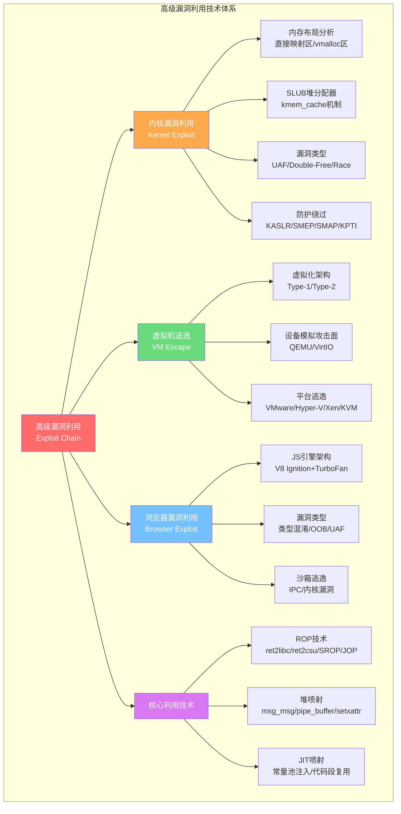

# 第31章 高级漏洞利用技术 — 章节概览

## 章节概览

### 为什么这一章是全书的"珠穆朗玛峰"？

当你突破了用户态程序的防线——栈溢出、堆利用、ROP链已经信手拈来——真正的挑战才刚刚开始。操作系统内核、虚拟化层（Hypervisor）和浏览器引擎，这三大组件构成了现代计算平台最核心的防线。一旦被攻破，攻击者将获得系统最高权限或突破原本不可逾越的安全边界。

本章聚焦于三大高级漏洞利用领域：

| 领域 | 攻击目标 | 获取权限 | 典型场景 |
|------|---------|---------|---------|
| **内核漏洞利用** | Linux/Windows内核 | Ring 0（最高特权） | 本地提权、沙箱逃逸 |
| **虚拟机逃逸** | Hypervisor/QEMU/VMware | 宿主机控制权 | 云环境横向移动、多租户突破 |
| **浏览器漏洞利用** | V8/SpiderMonkey引擎 | 沙箱内代码执行 | 远程零点击攻击、用户数据窃取 |

高级漏洞利用之所以"高级"，不仅因为目标组件的复杂度极高，更因为现代系统已部署了层层防护机制。攻击者必须将多种基础技术组合运用，通过信息泄露绕过地址随机化、通过ROP绕过代码执行保护、通过堆喷射稳定控制内存布局，才能完成一次完整的**高级漏洞利用链（Exploit Chain）**。

> **一组数据说明为什么这个话题刻不容缓：**
>
> | 指标 | 数据 | 来源 |
> |------|------|------|
> | Chrome V8每年发现的严重漏洞 | 20-50个 | Google Project Zero |
> | VMware/Hyper-V逃逸漏洞（2020-2024） | 15+个CVE | NVD |
> | 内核提权漏洞年均发现数量 | 100+个 | Linux内核安全邮件列表 |
> | Chrome完整0day利用链报价 | 50万-250万美元 | Zerodium |
> | 内核0day利用链报价 | 100万-150万美元 | Zerodium |
> | Linux内核漏洞修复平均响应时间 | 72天（高危） | Google OSS-Fuzz |

这些数字背后是一个残酷的现实：**攻防成本严重不对称**。防御者需要堵住所有漏洞，攻击者只需找到一个。理解这些技术的原理和组合方式，是成为顶级安全研究员的必经之路，也是构建纵深防御体系的前提。

### 知识地图

本章的知识体系可以用以下框架来理解——三大攻击领域对应三套独立但交叉的技术栈：



### 三大领域全景对比

在深入各节之前，先建立全局视角。以下对比表帮助你快速理解三大核心领域的特征差异：

| 维度 | 内核漏洞利用 | 虚拟机逃逸 | 浏览器漏洞利用 |
|------|------------|-----------|--------------|
| **攻击面复杂度** | 高（数百万行C代码） | 极高（设备模拟+虚拟化逻辑） | 极高（JS引擎+沙箱+IPC） |
| **利用稳定性** | 中（多核竞争、中断干扰） | 中-高（设备状态可控） | 低（GC、JIT重编译时序） |
| **防护机制** | KASLR/SMEP/SMAP/KPTI/CFI | IOMMU/VT-d/SMMU | 沙箱/Site Isolation/W^X |
| **提权路径** | commit_creds + 返回用户态 | 读写宿主机内存 | 渲染器RCE → 沙箱逃逸 → 主进程 |
| **学习门槛** | 需要x86汇编+内核源码阅读 | 需要虚拟化架构+设备协议 | 需要JS引擎内部机制+编译原理 |
| **CTF训练资源** | 丰富（pwnable.kr/CISCN） | 较少（需自建QEMU环境） | 极少（需浏览器源码级理解） |
| **实战价值** | 本地提权必备 | 云环境横向移动 | 远程零点击攻击（价值最高） |

> **关键洞察**：技术门槛与实战价值并不总是正相关。浏览器漏洞利用虽然学习门槛最高，但一条完整的Chrome 0day利用链在黑市报价高达250万美元——远超内核提权漏洞。这是因为浏览器漏洞可以实现远程零点击攻击，攻击者无需任何用户交互即可控制目标设备。

### 章节结构与阅读导航

本章共分为八个部分，从理论到实践，从认知到行动，循序渐进地展开对高级漏洞利用技术的全面分析：

---

**第一部分：理论基础** `预计阅读：40分钟`

系统讲解三大高级漏洞利用领域的理论知识。这是后续所有实操内容的地基——不理解内核内存布局，就无法设计可靠的堆喷射；不理解SLUB分配器，就无法构造稳定的UAF利用。

涵盖的核心概念：
- Linux内核内存布局（内核空间、直接映射区、vmalloc区、模块映射区域）
- SLUB堆分配器机制（kmem_cache、per-cpu缓存、freelist指针链）
- 常见内核漏洞类型（栈溢出、UAF、Double-Free、Race Condition、整数溢出、空指针解引用）
- 内核安全防护机制（KASLR、SMEP、SMAP、KPTI、Stack Canary、CFI）及绕过方法
- 虚拟化架构（Type-1/Type-2 Hypervisor）、QEMU设备模拟漏洞、virtio设备漏洞
- VMware/Hyper-V/Xen/KVM等主流虚拟化平台的逃逸技术
- 浏览器安全架构（多进程、沙箱隔离）、JavaScript引擎架构（V8/SpiderMonkey）
- JIT编译器漏洞、对象模型与类型混淆

[→ 进入理论基础](理论基础/)

---

**第二部分：核心技巧** `预计阅读：35分钟`

聚焦高级漏洞利用中最关键的实战技术。本部分解决"怎么用"的问题——每种技术的原理、构造方法和最佳实践。

三大核心技术深度拆解：
- **ROP技术**：ROP链构造、ret2libc/ret2csu、SROP（Sigreturn-Oriented Programming）、JOP（Jump-Oriented Programming）、内核ROP的特殊性（swapgs+iretq返回用户态）
- **堆喷射**：用户态堆喷射（JavaScript堆喷射、DOM堆喷射）、内核态堆喷射（msg_msg、pipe_buffer、setxattr等）、堆布局稳定化方法
- **JIT喷射**：利用JIT编译器将攻击者控制的数据编译为可执行代码，绕过DEP/NX保护，W^X防御下的变体技术

[→ 进入核心技巧](核心技巧/)

---

**第三部分：实战案例** `预计阅读：45分钟`

通过6个标志性真实CVE案例的深入分析，展示高级漏洞利用技术的实际应用。每个案例都从漏洞发现、原理分析、利用开发到最终效果进行完整剖析。

| 案例 | 领域 | CVE编号 | 漏洞类型 | 关键技术 |
|------|------|---------|---------|---------|
| Dirty COW | 内核 | CVE-2016-5195 | 竞争条件 | 内核页表竞争、COW绕过 |
| eBPF漏洞 | 内核 | CVE-2021-3490 | 越界读写 | eBPF验证器绕过 |
| QEMU逃逸 | 虚拟机 | CVE-2020-14364 | 数组越界 | USB控制器模拟漏洞 |
| Venom漏洞 | 虚拟机 | CVE-2015-3456 | 缓冲区溢出 | 虚拟软盘设备 |
| Chrome V8 | 浏览器 | CVE-2021-30554 | 类型混淆 | V8 TurboFan优化器 |
| Firefox UAF | 浏览器 | CVE-2022-26485 | Use-After-Free | SpiderMonkey GC逻辑 |

[→ 进入实战案例](实战案例/)

---

**第四部分：常见误区** `预计阅读：20分钟`

纠正高级漏洞利用学习过程中的8个常见认知偏差和技术误区。每个误区都配有"错误认知→为什么会产生→真实情况→正确理解"的完整纠正链条，附带真实案例和代码示例。

核心误区包括：
- "内核漏洞利用等同于直接获取Root Shell"——事实上是数百次Kernel Panic的系统工程
- "堆喷射是暴力方法，不够优雅"——事实上是工程化的标准做法
- "KASLR一旦被绕过就形同虚设"——事实上它是纵深防御的重要一环
- "虚拟机逃逸只存在于老旧软件中"——事实上是持续演进的高价值威胁
- "浏览器漏洞利用已经不可能了"——事实上每年仍有数十个严重漏洞被发现
- "ROP链越长越厉害"——事实上最小化和可靠性才是核心目标

[→ 进入常见误区](04-常见误区.md)

---

**第五部分：练习方法** `预计阅读：15分钟`

提供一套系统化的高级漏洞利用学习路径和练习资源。从内核CTF题目到QEMU逃逸环境搭建，从浏览器Fuzzing入门到完整的利用链开发。

训练维度覆盖：
- 内核漏洞利用：pwnable.kr、pwnable.tw、CISCN kernel题目
- 虚拟机逃逸：QEMU环境搭建、设备漏洞复现
- 浏览器Fuzzing：V8/Centipede、Browser Fuzzing入门
- 综合训练：Pwn2Own、Google CTF高级题目

[→ 进入练习方法](05-练习方法.md)

---

**第六部分：本章小结** `预计阅读：10分钟`

总结核心知识点，梳理技术要点，建立完整的知识框架。提供学习建议和进阶方向。

[→ 进入本章小结](06-本章小结.md)

---

**第七部分：深度拓展** `预计阅读：25分钟`

为高级读者和安全架构师提供进阶内容，包括漏洞利用理论基础（CWE分类、内存破坏原理）、高级利用技术演化、Web高级注入技术、硬件漏洞利用（Spectre/Meltdown/Rowhammer）、AI辅助漏洞利用、云环境漏洞利用、推荐学习资源等。

[→ 进入深度拓展](07-深度拓展.md)

---

### 核心知识点全景图

以下是本章覆盖的全部关键概念，按知识领域分类：

| 知识领域 | 关键概念 | 对应章节 |
|---------|---------|---------|
| **内核内存模型** | 直接映射区、vmalloc区、内核代码段、模块映射区 | 理论基础 §31.1 |
| **SLUB分配器** | kmem_cache、per-cpu slab、freelist、对象大小类（kmalloc-64/96/128…） | 理论基础 §31.1 |
| **内核漏洞类型** | 栈溢出、UAF、Double-Free、Race Condition、整数溢出、空指针解引用 | 理论基础 §31.1 |
| **内核防护机制** | KASLR、SMEP、SMAP、KPTI、Stack Canary、kCFI、Shadow Stack | 理论基础 §31.1 |
| **虚拟化架构** | Type-1/Type-2 Hypervisor、VM Exit、EPT/NPT、virtio框架 | 理论基础 §31.2 |
| **虚拟化攻击面** | 设备模拟（e1000/virtio）、共享内存（IVSHMEM）、Guest Agent、超级调用 | 理论基础 §31.2 |
| **浏览器安全架构** | 多进程隔离、沙箱（seccomp-bpf）、Site Isolation、Mojo IPC | 理论基础 §31.3 |
| **JS引擎机制** | V8 Ignition/TurboFan、Hidden Class、Map/Elements Store、GC（Orinoco） | 理论基础 §31.3 |
| **ROP技术** | ret2libc、ret2csu、SROP、JOP、内核ROP（swapgs+iretq） | 核心技巧 §31.4 |
| **堆喷射** | msg_msg、pipe_buffer、setxattr、sk_buff、sendmsg、io_uring | 核心技巧 §31.5 |
| **JIT喷射** | 常量池注入、代码段复用、W^X绕过、JIT编译器漏洞利用 | 核心技巧 §31.6 |
| **内核提权** | commit_creds(prepare_kernel_cred(0))、modprobe_path覆写、cred结构覆写 | 实战案例 §31.7 |
| **VM逃逸平台** | QEMU设备模拟、VMware HGFS/Backdoor、Hyper-V VMBus、Xen Hypercall | 实战案例 §31.8 |
| **浏览器利用链** | 渲染器RCE → 沙箱逃逸 → 浏览器主进程 → 内核提权 | 实战案例 §31.9 |

### 攻击者视角：高级漏洞利用的完整攻击链

理解攻击者如何将多种技术组合成完整的利用链，是本章的核心主线：

```text
漏洞发现与分析
  │
  ├── 信息泄露（绕过KASLR/ASLR）
  │     ├── 内核：/proc/kallsyms、dmesg泄露、page fault侧信道
  │     ├── VM：设备寄存器信息泄露、共享内存未初始化
  │     └── 浏览器：JS引擎越界读、GC信息泄露
  │
  ├── 原语构造（获得读/写能力）
  │     ├── 内核：UAF/Duplicate-Free → 任意地址读写
  │     ├── VM：设备缓冲区溢出 → 宿主机内存读写
  │     └── 浏览器：类型混淆/OOB → 堆任意读写
  │
  ├── 利用技术组合
  │     ├── ROP链（绕过DEP/NX，执行任意代码）
  │     ├── 堆喷射（稳定控制内存布局）
  │     ├── JIT喷射（绕过W^X保护）
  │     └── 多次尝试（提高可靠性）
  │
  └── 最终目标
        ├── 内核：提权 → root shell
        ├── VM：逃逸 → 宿主机控制
        └── 浏览器：沙箱逃逸 → 持久化控制
```

### 学习目标

通过本章的学习，读者应能够：

1. **理解Linux内核漏洞利用的基本原理**：掌握内核内存布局、SLUB分配器机制、常见漏洞类型（UAF、栈溢出、竞争条件）和防护机制（KASLR、SMEP/SMAP、KPTI）的绕过方法
2. **掌握虚拟机逃逸的攻击面分析**：理解Type-1/Type-2虚拟化架构的攻击面差异，掌握QEMU设备模拟漏洞和主流平台（VMware/Hyper-V/Xen/KVM）的逃逸技术
3. **了解浏览器漏洞利用的基本架构**：理解V8引擎的Ignition/TurboFan架构、JS对象模型（Hidden Class/Map）、常见漏洞类型（类型混淆、UAF）和多层沙箱的突破方法
4. **熟练运用ROP、堆喷射、JIT喷射等高级利用技术**：能够独立构造内核ROP链（含返回用户态），选择合适的堆喷射原语（msg_msg/pipe_buffer/setxattr），理解JIT喷射的原理和局限
5. **能够分析真实CVE案例的漏洞原理和利用方法**：通过Dirty COW、eBPF漏洞、QEMU逃逸、Chrome V8等案例，建立从漏洞发现到完整利用链开发的实战能力
6. **具备搭建高级漏洞利用练习环境的能力**：能够配置QEMU+GDB内核调试环境、搭建虚拟机逃逸实验、配置浏览器Fuzzing环境

### 前置知识

学习本章需要以下基础知识。**缺少任何一项都会导致后续内容难以理解**：

| 前置知识 | 具体要求 | 对应章节 | 缺失后果 |
|---------|---------|---------|---------|
| C/C++语言 | 指针运算、内存管理（malloc/free）、结构体、函数指针、内联汇编 | 第09章 | 无法理解内存破坏和ROP链构造 |
| x86/x64汇编 | 寄存器（rax/rsp/rip等）、指令集、调用约定（System V AMD64 ABI）、栈帧结构 | 第10章 | 无法阅读gadget、无法构造ROP链 |
| 操作系统原理 | 进程管理、虚拟内存、系统调用机制、中断处理 | 第06章 | 无法理解内核内存布局和利用流程 |
| 二进制安全PWN基础 | 栈溢出、堆利用（fastbin/tcache）、基本ROP、GDB调试 | 第16章 | 本章是第16章的进阶，跳过基础无法学习 |
| Linux调试工具 | GDB（pwndbg/GEF插件）、strace、ltrace、readelf、objdump | 第06章 | 无法进行漏洞分析和利用开发 |
| JavaScript基础 | 对象模型、原型链、JIT概念（浏览器漏洞利用部分） | — | 无法理解V8引擎漏洞和JIT喷射 |

> **建议**：如果你在二进制安全PWN（第16章）中还未熟练掌握基础ROP和堆利用，建议先巩固第16章内容再进入本章。本章的ROP技术、堆喷射等内容是第16章知识的自然延伸和深化。

### 适用读者

本章面向以下读者群体，不同背景的读者可以侧重不同部分：

| 读者角色 | 推荐重点 | 预计总用时 |
|---------|---------|-----------|
| **安全研究员/漏洞猎手** | 全部章节（重点关注理论基础+核心技巧+实战案例） | 3-4小时 |
| **内核安全工程师** | 理论基础§31.1 + 核心技巧 + 内核案例 + 常见误区 | 2-3小时 |
| **云安全工程师** | 虚拟机逃逸部分（理论基础§31.2 + 核心技巧 + VM案例） | 1.5-2小时 |
| **浏览器安全研究员** | 浏览器部分（理论基础§31.3 + 核心技巧 + 浏览器案例） | 2-3小时 |
| **红队渗透测试员** | 核心技巧（ROP/堆喷射） + 实战案例 + 练习方法 | 2-2.5小时 |
| **安全架构师/防御方** | 章节概览 + 理论基础（重点看防护机制） + 常见误区 | 1-1.5小时 |
| **CTF竞赛选手** | 核心技巧 + 实战案例 + 练习方法 | 2-3小时 |

### 学习建议

**入门路径（有PWN基础的安全从业者）：**
1. 先读本概览建立全局认知，重点看"三大领域全景对比"表
2. 按顺序阅读理论基础，重点关注§31.1（内核漏洞利用）——这是后续所有内容的基础
3. 学习核心技巧中的ROP技术，先掌握用户态ROP再进入内核ROP
4. 通过实战案例中的Dirty COW理解完整的内核利用流程
5. 用常见误区检验自己的认知是否到位

**进阶路径（有内核/PWN经验的安全研究员）：**
1. 快速浏览概览，直接跳到与研究方向相关的领域
2. 重点关注理论基础§31.2（虚拟机逃逸）或§31.3（浏览器漏洞利用）
3. 深入核心技巧中的堆喷射和JIT喷射技术
4. 完成实战案例中的CVE复现（建议从QEMU逃逸案例开始）
5. 阅读深度拓展，关注硬件漏洞和AI辅助利用

**研究路径（高级安全架构师）：**
1. 重点阅读：章节概览 → 理论基础（防护机制部分） → 常见误区 → 本章小结
2. 关注KASLR/SMEP/SMAP/CFI等防护机制的设计原理和绕过方法
3. 用核心知识点表构建防御优先级矩阵
4. 参考实战案例中的攻击链，评估组织的防御覆盖度

### 实用工具与框架

本章涉及的核心工具：

| 工具 | 用途 | 链接 |
|------|------|------|
| **GDB + pwndbg/GEF** | 内核/用户态调试 | https://github.com/pwndbg/pwndbg |
| **ROPgadget** | Gadget搜索与ROP链构造 | https://github.com/JonathanSalwan/ROPgadget |
| **one_gadget** | libc中一键gadget查找 | https://github.com/david942j/one_gadget |
| **pwntools** | Python漏洞利用开发框架 | https://github.com/Gallopsled/pwntools |
| **QEMU** | 虚拟机逃逸实验环境 | https://www.qemu.org/ |
| **Centipede** | Google浏览器Fuzzing引擎 | https://github.com/google/centipede |
| **V8** | Chrome JS引擎源码（学习用） | https://v8.dev/ |
| **Syzkaller** | 内核Fuzzing工具 | https://github.com/google/syzkaller |
| **IDA Pro/Ghidra** | 反汇编与逆向分析 | https://ghidra-sre.org/ |

### 章节间关联

本章与书中其他章节存在紧密的知识关联：

| 关联章节 | 关联内容 | 阅读建议 |
|---------|---------|---------|
| **第06章 操作系统基础-Linux** | 内存管理、进程管理、系统调用 | 先修知识，必须先读 |
| **第10章 编程语言-JS/Assembly** | x86汇编、JavaScript基础 | 先修知识，至少了解 |
| **第16章 二进制安全PWN** | 栈溢出、堆利用、基础ROP | **直接前置**，跳过则无法学习本章 |
| **第17章 逆向工程** | 逆向分析方法、IDA/Ghidra使用 | 建议先读，有助于理解漏洞代码 |
| **第22章 IoT安全** | 固件安全、嵌入式漏洞利用 | 可与本章并行学习 |
| **第32章 代码审计与安全开发** | 从防御视角理解漏洞成因 | 建议同步读，形成攻防闭环 |

> **免责声明**：本章内容仅供安全防御研究和学习使用。所描述的漏洞利用技术仅用于帮助安全从业者理解威胁、评估风险、构建防御。任何利用本章知识实施非法活动的行为都将面临法律严惩。在进行任何安全实验时，务必在合法授权的隔离环境中操作，遵守相关法律法规和职业道德准则。

---

*建议从 [理论基础](理论基础/) 开始阅读 →*
