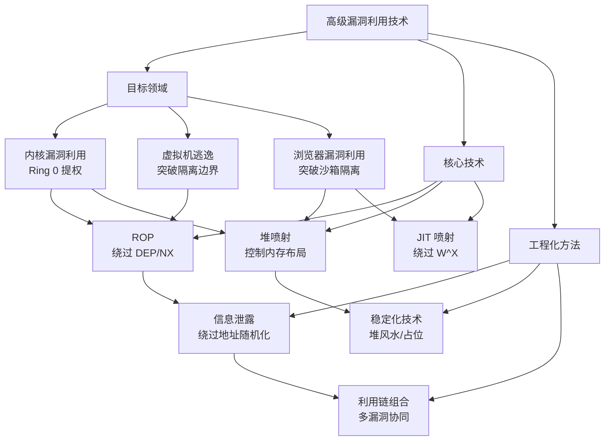
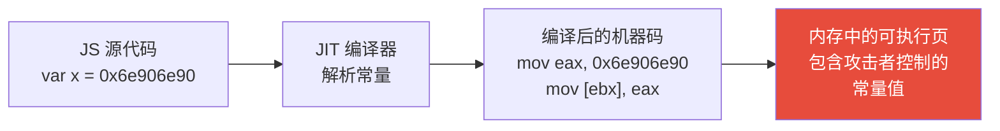
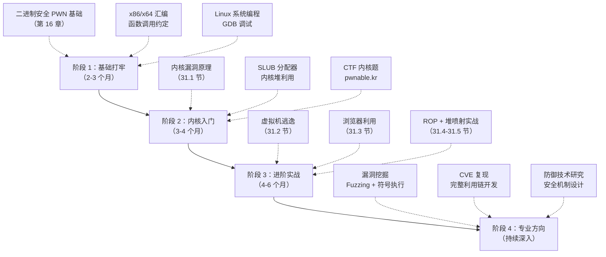

# 第31章 高级漏洞利用技术 — 本章小结

## 一、全局知识架构

本章构建了高级漏洞利用的完整知识体系，覆盖三大目标领域（内核、虚拟机、浏览器）和三大核心技术（ROP、堆喷射、JIT喷射）。以下思维导图展示了各知识节点之间的逻辑关系：



三大目标领域的共性在于：都需要先突破地址随机化（信息泄露），再绕过执行保护（ROP/喷射），最后构造完整的利用链。区别仅在于具体保护机制和目标架构不同。

## 二、核心知识点回顾

### 2.1 内核漏洞利用

内核是操作系统最核心的组件，运行在 CPU 的最高特权级（Ring 0）。一旦内核漏洞利用成功，攻击者将获得系统最高权限。

**内核内存布局要点：**

| 内存区域 | 地址范围 | 大小 | 利用价值 |
|----------|----------|------|----------|
| 直接映射区 (Direct Mapping) | 0xffff888000000000 ~ 0xffffc87fffffffff | 64 TB | 物理页直接映射，KASLR 基址所在 |
| vmalloc 区域 | 0xffffc90000000000 ~ 0xffffe8ffffffffff | 64 TB | 模块和动态分配区域 |
| 内核代码段 (.text) | 0xffffffff80000000 ~ 0xffffffff9fffffff | 512 MB | 包含内核核心代码和 gadget |
| 模块映射区域 | 0xffffffffa0000000 ~ 0xffffffffffffffff | 1.5 GB | 可加载内核模块代码 |

**内核漏洞类型矩阵：**

| 漏洞类型 | 成因 | 典型利用方式 | 利用难度 |
|----------|------|-------------|----------|
| 栈溢出 (Stack Overflow) | 缓冲区边界检查缺失 | 覆盖返回地址，构造 ROP 链 | ★★☆☆☆ |
| 堆溢出 (Heap Overflow) | 堆对象操作越界 | 覆盖相邻对象的函数指针或元数据 | ★★★☆☆ |
| Use-After-Free | 对象释放后仍被引用 | 重新分配控制已释放对象的内存 | ★★★☆☆ |
| Double-Free | 同一对象被释放两次 | 破坏 SLUB 空闲链表，伪造 freelist | ★★★★☆ |
| 竞争条件 (Race Condition) | 并发操作的时序窗口 | TOCTOU 提权（如 Dirty COW） | ★★★★☆ |
| 整数溢出 | 长度计算溢出导致分配不足 | 缓冲区溢出或越界写 | ★★★☆☆ |

**内核安全防护机制与绕过方法：**

| 防护机制 | 原理 | 绕过方法 | 绕过难度 |
|----------|------|----------|----------|
| KASLR | 内核加载地址随机化 | 信息泄露（/proc/kallsyms、perf_event） | ★★☆☆☆ |
| SMEP | 禁止内核执行用户态代码 | ROP 到内核空间 gadget、修改 CR4 寄存器 | ★★★☆☆ |
| SMAP | 禁止内核访问用户态数据 | ROP 修改 CR4 寄存器、copy_from_user 原语 | ★★★☆☆ |
| KPTI | 内核/用户态页表隔离 | 特权指令跳板（swapgs+iretq） | ★★★★☆ |
| Stack Canary | 栈返回地址保护 | 信息泄露获取 canary 值 | ★★☆☆☆ |
| kCFI/IBT | 控制流完整性 | 利用合法间接跳转目标、JOP 变体 | ★★★★★ |

### 2.2 虚拟机逃逸

虚拟机逃逸是云计算环境中最严重的安全威胁——一旦成功，攻击者将突破虚拟化隔离，控制整台物理服务器及其上运行的所有虚拟机。

**虚拟化平台攻击面对比：**

| 平台 | 类型 | 主要攻击面 | 经典 CVE |
|------|------|-----------|---------|
| QEMU | Type-2 | 设备模拟代码（e1000、virtio、USB 控制器） | CVE-2020-14364、CVE-2015-5745 |
| VMware | Type-1/2 | HGFS、Backdoor 接口、SVGA 设备 | CVE-2017-4901、CVE-2016-7461 |
| Hyper-V | Type-1 | VMBus 通信机制、GPADL 处理 | CVE-2021-28476 |
| Xen | Type-1 | 超级调用接口（内存操作、授权表） | XSA-7、XSA-212 |
| KVM | Type-1 | VM Exit 处理、vhost 后端 | CVE-2019-6488 |

**QEMU 攻击面详解：**

QEMU 的设备模拟代码是虚拟机逃逸的首选目标，主要原因有三点：

1. **代码复杂度极高**：QEMU 模拟了数百种硬件设备，每种设备都有独立的数据处理逻辑，代码审计覆盖面广
2. **输入来源多样**：Guest 可以通过 MMIO/PIO/DMA 多种途径向虚拟设备发送数据，每种输入路径都是潜在的攻击面
3. **共享内存机制**：virtio 等半虚拟化设备通过共享内存与 Guest 交互，内存边界验证是关键薄弱环节

**virtio 设备漏洞利用要点：**

virtio 使用描述符环（vring）在 Guest 和 Host 之间传递数据。描述符形成链表结构，攻击者可以构造以下异常情况：

- 超长描述符链：绕过链表长度限制，触发缓冲区溢出
- 循环描述符链：制造无限循环，耗尽 Host 资源或触发逻辑漏洞
- 越界描述符索引：访问 vring 之外的内存区域
- 未初始化描述符：利用未清零的内存获取信息泄露

### 2.3 浏览器漏洞利用

浏览器是现代软件中最复杂的应用程序之一，单 Chrome 浏览器的代码量就超过 3500 万行。其多进程架构和沙箱隔离使得漏洞利用难度极高。

**浏览器利用链的三阶段模型：**


每个阶段都需要不同的漏洞和利用技术：

| 阶段 | 目标 | 常用漏洞类型 | 典型利用技术 |
|------|------|-------------|-------------|
| 阶段 1 | 渲染器中的代码执行 | 类型混淆、UAF、OOB 读写 | V8 对象伪造、fakeobj + addrof 原语 |
| 阶段 2 | 突破沙箱隔离 | 内核漏洞（如 Binder UAF） | 内核提权 + 进程迁移 |
| 阶段 3 | 控制浏览器主进程 | IPC 消息注入 | Mojo 接口滥用、Mojojs 绑定 |

**V8 引擎漏洞利用核心概念：**

V8 的对象模型是理解浏览器漏洞利用的关键。每个 JavaScript 对象内部包含一个 Map 指针（指向隐藏类 Hidden Class），描述了对象的结构信息。类型混淆漏洞的本质就是让引擎使用错误的 Map 来解释一个对象，从而实现越界读写。

经典的 V8 利用原语组合：

```text
fakeobj(addr)  → 在指定地址伪造一个对象（任意地址变为 JS 对象引用）
addrof(obj)    → 获取一个对象的真实内存地址（泄露对象地址）
结合两者      → 实现任意地址读写（Arbitrary Read/Write）
```

### 2.4 ROP 技术

ROP 是绕过 DEP/NX 保护的核心技术，适用于所有三大目标领域。

**内核 ROP 与用户态 ROP 的关键区别：**

| 对比维度 | 用户态 ROP | 内核 ROP |
|----------|-----------|---------|
| 返回用户态 | 函数正常返回 | 需要 swapgs + iretq 指令 |
| Gadget 来源 | 用户态二进制（libc、程序本身） | 内核代码段（vmlinux）、内核模块 |
| 栈切换 | 无需特殊处理 | 需要保存/恢复 cs、ss、rsp、rflags |
| 保护绕过 | 绕过栈 canary | 绕过 KASLR + SMEP/SMAP + KPTI |

**经典内核提权 ROP 链：**

```text
Step 1: 泄露内核基址 → 绕过 KASLR
Step 2: 调用 commit_creds(prepare_kernel_cred(0)) → 提权为 root
Step 3: 保存用户态寄存器（cs/ss/rsp/rflags）
Step 4: 执行 swapgs → 切换到用户态 GS 段基址
Step 5: 执行 iretq → 返回用户态
Step 6: 调用 execve("/bin/sh") → 获得 root shell
```

**ROP 变体技术对比：**

| 变体 | 原理 | 优势 | 劣势 |
|------|------|------|------|
| 经典 ROP | 以 ret 结尾的 gadget 链 | 工具成熟、gadget 丰富 | 依赖 ret 指令 |
| SROP | 利用 sigreturn 系统调用 | 一条 gadget 控制所有寄存器 | 依赖内核支持 sigreturn |
| JOP | 以 jmp/jne 等跳转指令结尾 | 不依赖 ret，绕过 Shadow Stack | gadget 较少 |
| COP | 以 call 指令结尾 | 可调用任意函数 | gadget 选择受限 |

### 2.5 堆喷射技术

堆喷射是将攻击者控制的数据精确填充到目标内存区域的技术，是高级漏洞利用中不可或缺的工程化方法。

**用户态与内核态堆喷射对比：**

| 特性 | 用户态堆喷射 | 内核态堆喷射 |
|------|-------------|-------------|
| 主要手段 | JavaScript 字符串/数组、DOM 对象 | msg_msg、pipe_buffer、setxattr |
| 目标 | 浏览器 V8 堆/进程堆 | SLUB 分配器的 kmem_cache |
| 可控性 | 极高（JS 字符串内容完全可控） | 高（msg_msg 可控性最好） |
| 常用大小 | 64KB（字符串喷射） | 根据目标 kmem_cache 大小选择 |
| 稳定性 | 需要 NOP Sled 或确定性跳转 | 需要对齐 SLUB 对象大小 |

**内核堆喷射原语详解：**

| 原语 | 对象大小 | 控制内容 | 适用场景 |
|------|---------|---------|----------|
| msg_msg | 48B + payload | 完全控制 payload | 最灵活的喷射手段 |
| pipe_buffer | 40B | 控制 page 指针和偏移 | 配合 pipe_write 原语 |
| setxattr | 自定义 | 完全控制 | 大对象喷射（如 CVE-2016-5195） |
| sk_buff | 可变 | 网络数据 | 网络相关漏洞 |
| send_msg | 可变 | 消息内容 | 替代 msg_msg 的方案 |

**堆喷射的工程化要点：**

1. **确定性 > 随机性**：不要依赖概率，要确保每次喷射都能命中目标位置
2. **大小匹配**：喷射对象的大小必须与目标 SLUB cache 的 object_size 对齐
3. **填充密度**：喷射数量要足够填满目标区域前的所有空闲槽位
4. **清理策略**：喷射前清理堆碎片，减少随机因素（如使用堆风水技术）

### 2.6 JIT 喷射技术

JIT 喷射利用 JIT 编译器将攻击者控制的常量数据嵌入编译后的机器码中，从而绕过 DEP/NX 保护。

**JIT 喷射的原理：**



当 JIT 编译器将 JavaScript 中的数值常量直接嵌入生成的机器码指令中时，这些常量就变成了可执行代码的一部分。如果多个常量在内存中相邻排列，它们的字节序列可能形成有效的 shellcode 指令（即 NOP Sled）。

**JIT 喷射的防御与对抗：**

| 防御措施 | 原理 | 对抗方法 |
|----------|------|----------|
| W^X (Write XOR Execute) | 内存页不能同时可写和可执行 | 在 JIT 喷射窗口期执行（编译时可写，执行时可读） |
| 常量池分离 | 将常量数据和代码分离到不同页 | 利用内存布局预测使常量页与代码页相邻 |
| ROP 导入表 | 强制通过 ROP 导入表进行间接调用 | 利用合法的 ROP 导入地址 |

**JIT 喷射的现代演进：**

现代浏览器引擎已经部署了多重防御，纯 JIT 喷射的成功率大幅下降。但在特定条件下（如浏览器扩展、老版本浏览器），JIT 喷射仍然是有效的利用技术。变体技术包括：

- **Type Confusion + JIT**：先通过类型混淆获得任意读写，再利用 JIT 编译器的代码缓存实现代码执行
- **WASM JIT 喷射**：WebAssembly 的 JIT 编译器可能引入新的攻击面
- **JIT 编译器漏洞**：直接利用 JIT 编译器自身的 bug（如 TurboFan 的优化错误）而非依赖常量嵌入

## 三、跨领域知识体系

高级漏洞利用需要同时掌握多个领域的知识，以下是各领域的核心要求：

| 知识领域 | 核心内容 | 在本章中的应用 |
|----------|---------|---------------|
| 操作系统 | 内存管理、进程调度、系统调用 | 内核内存布局、SLUB 分配器、KPTI |
| CPU 架构 | 寄存器、指令集、特权级、分页机制 | SMEP/SMAP 原理、iretq 返回、CR4 修改 |
| 编译原理 | 优化编译、内联展开、死代码消除 | JIT 编译器漏洞、类型推断错误 |
| 虚拟化技术 | VM Exit、设备模拟、内存虚拟化 | 虚拟机逃逸攻击面分析 |
| 浏览器架构 | 多进程模型、沙箱隔离、IPC 机制 | 浏览器利用链三阶段 |
| 密码学/协议 | 证书验证、TLS、认证协议 | 部分沙箱逃逸场景 |

## 四、技术要点提炼

经过本章的学习，以下五个技术要点是理解高级漏洞利用的基石：

**1. 信息泄露是所有高级利用的前提**

几乎每一次成功的高级漏洞利用都从信息泄露开始。没有地址信息，攻击者无法定位 gadget、无法构造 ROP 链、无法预测目标内存位置。常见的泄露来源包括：

- `/proc/kallsyms`（内核符号地址）
- dmesg 日志（内核地址泄露）
- perf_event 缓冲区溢出（内核地址泄露）
- eBPF 验证器绕过（信息泄露原语）
- 浏览器中的 `addrof()` / `fakeobj()` 原语

**2. 可靠性高于一切**

在 CTF 竞赛中，一个 10% 成功率的漏洞利用可能就足够拿到 flag。但在真实的安全研究中，一个可靠的利用远胜于一个精巧但脆弱的利用。可靠性的工程化手段包括：

- 堆风水（Heap Feng Shui）：精确控制堆布局
- 多次重试机制：利用失败时能优雅地重试
- 进程隔离：利用失败时不会影响主系统
- 信号处理：捕获 SIGSEGV 等信号，防止系统崩溃

**3. 理解防御机制才能有效绕过**

本章介绍的每一种利用技术，都是针对特定防御机制的绕过方法。不理解 KASLR，就无法理解信息泄露为什么重要；不理解 SMEP/SMAP，就无法理解为什么需要 ROP 而不是直接执行用户态代码。防御与攻击是一枚硬币的两面。

**4. 工程化思维是将理论转化为实际利用的关键**

堆喷射、多次尝试、错误处理、堆风水等工程化技术，是将理论上的漏洞利用转化为实际可用的 exploit 的关键步骤。一个理论可行的漏洞利用，如果没有工程化处理，往往在实际环境中无法可靠触发。

**5. 跨领域知识是突破复杂系统的钥匙**

高级漏洞利用的目标系统（内核、虚拟机、浏览器）都是极其复杂的软件。单独掌握某一个领域的知识往往不够——你需要同时理解操作系统、CPU 架构、编译器、虚拟化等多个领域，才能找到系统边界处的薄弱环节。

## 五、常见误区纠正

在学习高级漏洞利用的过程中，以下误区需要特别警惕：

| 误区 | 纠正 |
|------|------|
| "内核保护机制太强了，不可能绕过" | 每种保护都有绕过方法，关键是理解其原理和局限性。KASLR 的熵只有 256 种可能，SMEP 只是 CR4 的一个 bit |
| "堆利用是纯运气，不可靠" | 现代堆利用技术（堆风水、确定性喷射）已经非常成熟，成功率可以达到 90% 以上 |
| "信息泄露不重要，直接利用就行" | 信息泄露是几乎一切高级利用的前提，忽略它等于放弃利用 |
| "ROP 只能在用户态用" | 内核 ROP 同样强大且必要，内核 ROP 通过 swapgs+iretq 返回用户态 |
| "JIT 喷射已经被完全防御了" | JIT 喷射的变体（类型混淆+JIT、WASM JIT）仍在演进，新的攻击面不断出现 |
| "高级漏洞利用只能靠天赋" | 高级漏洞利用是可以通过系统学习和大量实践掌握的技能，虽然学习曲线陡峭但有清晰的路径 |

## 六、学习路径建议

高级漏洞利用是安全研究的"珠穆朗玛峰"，学习曲线极为陡峭。以下是从入门到精通的推荐路径：

### 6.1 分阶段学习路线



### 6.2 各阶段详细建议

**阶段 1：基础打牢（建议 2-3 个月）**

- 先完成第 16 章"二进制安全 PWN"中的基础栈溢出和堆利用
- 掌握 x86/x64 汇编语言基础，理解函数调用约定（System V AMD64 ABI）
- 熟练使用 GDB（配合 pwndbg/gef 插件）和 strace 调试
- 练习平台：pwnable.kr、ROP Emporium、Hack The Box

**阶段 2：内核入门（建议 3-4 个月）**

- 理解内核内存布局和 SLUB 分配器的工作原理
- 学习内核栈溢出和 UAF 的利用方法
- 搭建内核漏洞练习环境（使用 QEMU 启动自编译内核）
- 练习平台：pwnable.kr（kernel 部分）、CISCN 内核题、kernelCTF

**阶段 3：进阶实战（建议 4-6 个月）**

- 学习虚拟机逃逸技术，重点研究 QEMU 设备模拟代码
- 学习浏览器漏洞利用，理解 V8 引擎的对象模型和优化管线
- 掌握内核 ROP 链构造和堆喷射技术
- 复现真实 CVE 漏洞（参考 03-实战案例 节）

**阶段 4：专业方向（持续深入）**

根据个人兴趣选择一个方向深入：
- 漏洞挖掘方向：AFL/libFuzzer/Syzkaller Fuzzing、Angr/KLEE 符号执行
- 移动安全方向：Android/iOS 内核利用、ARM 架构特有的利用技术
- 固件安全方向：UEFI/BIOS 漏洞利用、嵌入式设备固件分析
- 安全自动化方向：AI/ML 辅助漏洞发现和利用生成

### 6.3 推荐练习资源

| 资源 | 类型 | 难度 | 适用阶段 |
|------|------|------|----------|
| pwnable.kr | 在线靶场 | 入门-进阶 | 阶段 1-2 |
| ROP Emporium | 在线靶场 | 入门-进阶 | 阶段 1-2 |
| kernelCTF | 真实内核漏洞 | 进阶-专家 | 阶段 3-4 |
| HackerOne/Bugcrowd | 漏洞赏金 | 进阶-专家 | 阶段 3-4 |
| QEMU 源码审计 | 源码分析 | 进阶 | 阶段 3 |
| V8 Commit History | 引擎变更 | 进阶-专家 | 阶段 3-4 |
| Google Project Zero Blog | 安全研究 | 进阶-专家 | 全阶段 |
| Phrack Magazine | 安全论文 | 专家 | 全阶段 |

## 七、进阶方向

掌握本章内容后，可以在以下方向深入发展：

### 7.1 漏洞挖掘

漏洞挖掘是漏洞利用的上游，掌握挖掘技术可以从源头发现新的攻击面。

- **Fuzzing 技术**：AFL/AFL++（覆盖引导变异）、libFuzzer（进程内 fuzzing）、Syzkaller（内核 fuzzing）。Fuzzing 的核心是设计高质量的种子文件和覆盖率反馈机制
- **符号执行**：KLEE（基于 LLVM）、Angr（多架构支持）。符号执行可以探索程序的所有可能路径，但面临路径爆炸问题
- **静态分析**：CodeQL（语义代码分析）、Semgrep（模式匹配）。适合大规模代码审计

### 7.2 移动端漏洞利用

移动设备的安全模型与桌面系统有显著差异，需要额外掌握 ARM 架构的特殊机制。

- **Android 内核利用**：与 Linux 内核类似，但需关注 SELinux、seccomp-bpf、Android 沙箱等额外防护。Android 内核版本更新较慢，旧漏洞可能仍然可用
- **iOS 内核利用**：XNU 内核与 Linux 差异较大，需掌握 KTRR/PPL（只读内存保护）、AMCC（Apple Memory Corruption Containment）等 Apple 特有机制
- **ARM 架构特性**：PXN（Privileged Execute-Never）、PAN（Privileged Access-Never）对应 x86 的 SMEP/SMAP；ARM64 的 PAC（Pointer Authentication）是 CFI 的硬件实现

### 7.3 固件安全

固件是设备最底层的软件，固件漏洞利用可以绕过操作系统层面的所有防护。

- **UEFI/BIOS 漏洞**：Secure Boot 绕过、DXE 驱动漏洞、SMM 提权。UEFI 固件更新机制不完善，漏洞修复周期长
- **嵌入式设备**：路由器、IoT 设备的固件提取（JTAG、UART、SPI Flash）和逆向分析。嵌入式设备通常缺乏 ASLR、NX 等基本保护
- **基带处理器**：手机基带处理器的漏洞利用可以实现无需用户交互的远程攻击（如 Baseband Exploit）

### 7.4 漏洞利用链开发

真实世界的攻击往往需要组合多个漏洞形成完整的利用链（Exploit Chain）。

- **Chrome 完整利用链**：渲染器 RCE → 沙箱逃逸 → 主进程控制，每一步都可能需要不同的漏洞
- **iOS 零点击攻击**：通过 iMessage 等服务的解析漏洞实现远程代码执行，无需用户交互（如 NSO Group 的 Pegasus）
- **供应链攻击**：通过污染构建环境或依赖库，在软件中植入后门

### 7.5 防御技术研究

深入理解利用技术是设计有效防御的前提。

- **CFI（控制流完整性）**：防止 ROP/JOP 攻击，分为前向完整性和后向完整性
- **内存安全语言**：Rust 等语言在编译时消除内存安全漏洞，Linux 内核已开始引入 Rust
- **硬件辅助安全**：Intel CET（Shadow Stack + IBT）、ARM PAC（Pointer Authentication）、ARM MTE（Memory Tagging）
- **漏洞利用缓解**：Linux 的 lockdown 安全模块、seccomp-bpf 系统调用过滤

### 7.6 安全自动化

AI/ML 技术正在改变安全研究的范式。

- **AI 辅助 Fuzzing**：利用机器学习模型引导种子变异方向，提高漏洞发现效率
- **LLM 辅助漏洞分析**：使用大语言模型辅助代码审计和漏洞模式识别
- **自动化利用生成**：基于强化学习自动生成漏洞利用代码（尚处于研究阶段）
- **二进制分析自动化**：使用 AI 加速二进制逆向工程和漏洞模式匹配

## 八、本章核心术语表

| 术语 | 英文 | 定义 |
|------|------|------|
| KASLR | Kernel Address Space Layout Randomization | 内核地址空间布局随机化 |
| SMEP | Supervisor Mode Execution Prevention | 管理员模式执行保护（禁止内核执行用户态代码） |
| SMAP | Supervisor Mode Access Prevention | 管理员模式访问保护（禁止内核访问用户态数据） |
| KPTI | Kernel Page Table Isolation | 内核页表隔离（针对 Meltdown 的缓解） |
| CFI | Control Flow Integrity | 控制流完整性保护 |
| ROP | Return-Oriented Programming | 返回导向编程 |
| SROP | Sigreturn-Oriented Programming | 信号返回导向编程 |
| JOP | Jump-Oriented Programming | 跳转导向编程 |
| SLUB | Single List Unified Buffer | Linux 内核的堆分配器 |
| UAF | Use-After-Free | 释放后使用漏洞 |
| VMBus | Virtual Machine Bus | Hyper-V 的 Guest-Host 通信机制 |
| GPADL | Guest Physical Address Descriptor List | Hyper-V 的物理地址描述符列表 |
| Hypercall | Hypervisor Call | 虚拟机向 Hypervisor 发起的特权调用 |
| VM Exit | Virtual Machine Exit | CPU 从 Guest 模式退出到 Host 模式的事件 |
| JIT | Just-In-Time Compilation | 即时编译 |
| W^X | Write XOR Execute | 内存页不可同时可写和可执行 |
| DEP | Data Execution Prevention | 数据执行保护（NX bit） |

***

> **本章回顾完毕。** 高级漏洞利用技术是安全攻防的终极战场，需要持续学习和大量实践。建议读者从基础阶段开始，循序渐进，切勿急于求成。每一次成功的利用背后，都是对目标系统深入理解的积累。
