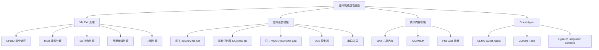
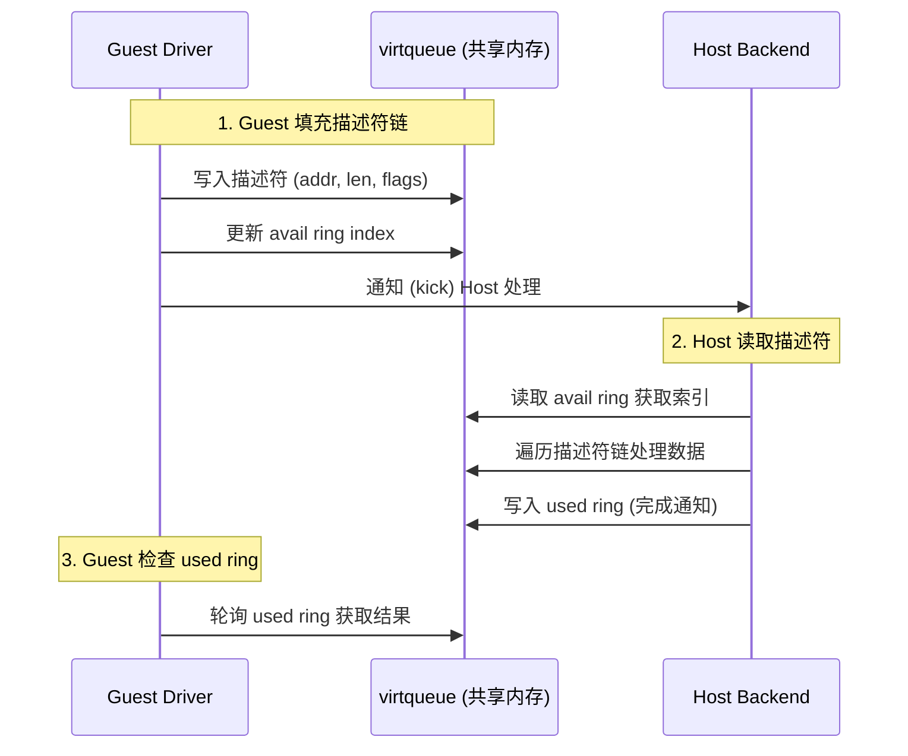
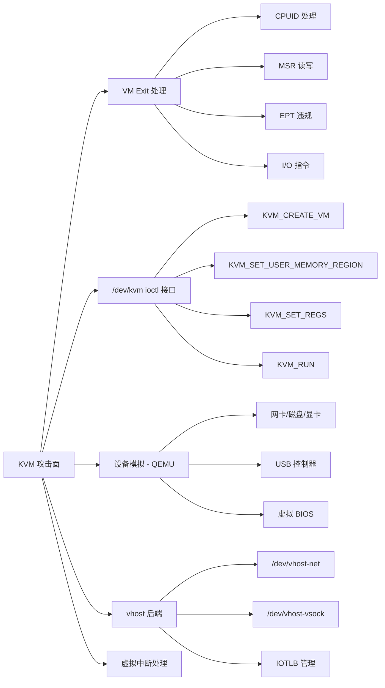
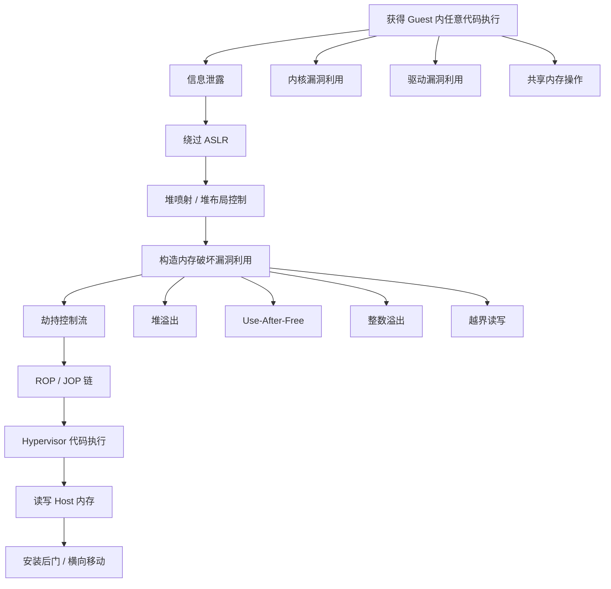

# 31.2 虚拟机逃逸

## 31.2.1 虚拟机逃逸概述

虚拟机逃逸（VM Escape）是指攻击者从虚拟机（Guest）内部突破虚拟化层的隔离边界，获得宿主机（Host）或 Hypervisor 的控制权限。在云计算环境中，虚拟化是多租户隔离的基石——一台物理服务器上可能运行着数百个来自不同客户的虚拟机。虚拟机逃逸打破了这一核心安全假设，意味着攻击者可以从一个低权限的租户环境直接控制底层基础设施，甚至横向移动到其他租户的虚拟机中。在 Pwn2Own 等国际顶级安全竞赛中，虚拟机逃逸一直是最高级别的挑战项目，成功完成的选手通常获得 10 万至 25 万美元的奖金。

### 虚拟化技术架构

理解虚拟机逃逸，首先需要理解虚拟化的分层架构：

```text
┌──────────────────────────────────────────────┐
│            应用层 (Guest Applications)         │
├──────────────────────────────────────────────┤
│          Guest OS Kernel (Ring 3/0)           │
├──────────────────────────────────────────────┤
│       虚拟硬件 (vCPU, vNIC, vDisk, vGPU)      │
├──────────────────────────────────────────────┤
│       Hypervisor / VMM (Ring -1 / Ring 0)     │
├──────────────────────────────────────────────┤
│            宿主机硬件 (CPU, RAM, NIC)          │
└──────────────────────────────────────────────┘
```

在这个架构中，Hypervisor 负责将物理硬件资源抽象化并分配给各个虚拟机。每个虚拟机认为自己独占一台物理机，但实际上 Hypervisor 在底层进行着复杂的资源调度和隔离。攻击面就存在于这些交互层之间。

### Hypervisor 类型与攻击面差异

Hypervisor 分为两大类型，它们的攻击面有着本质区别：

| 特性 | Type 1（裸金属） | Type 2（宿主型） |
|------|-----------------|-----------------|
| 代表产品 | VMware ESXi, Xen, KVM, Hyper-V | VirtualBox, VMware Workstation, QEMU |
| 运行位置 | 直接运行在硬件上 | 运行在宿主 OS 之上 |
| 隔离层级 | 硬件级隔离，Guest → Hypervisor → 硬件 | 多了一层宿主 OS，Guest → Hypervisor → 宿主 OS → 硬件 |
| 典型场景 | 云数据中心、企业服务器 | 安全研究、开发测试、个人使用 |
| 逃逸难度 | 较高，需要突破硬件虚拟化边界 | 较低，可通过宿主 OS 驱动漏洞间接攻击 |
| 管理攻击面 | vCenter API、XenAPI、libvirt | 宿主 OS 文件系统、进程注入、驱动漏洞 |

### 虚拟机逃逸的通用攻击面

无论哪种 Hypervisor，虚拟机逃逸的攻击面都可以归纳为以下四类：



**VM Exit 处理**是最核心的攻击面。当 Guest 中执行特权指令（如 CPUID、RDMSR、IN/OUT）或遇到异常（如 EPT 违规）时，CPU 会从 Guest 模式退出到 Host 模式，由 Hypervisor 进行处理。每一种 VM Exit 都有独立的处理函数，而这些函数中的漏洞可能允许 Guest 绕过隔离。

**虚拟设备模拟**是攻击面最大的区域。Hypervisor 需要模拟数百种硬件设备，每种设备的寄存器读写、DMA 传输、中断处理都是潜在的漏洞点。QEMU 作为最流行的开源虚拟化软件，其设备模拟代码是安全研究的主要目标。

**共享内存机制**提供了 Guest 和 Host 之间的高效数据传输通道，但同时也为内存破坏漏洞打开了大门。virtio、IVSHMEM 等共享内存区域如果缺乏严格的边界检查，可能导致越界读写。

**Guest Agent** 是运行在虚拟机内部的辅助程序，负责与 Hypervisor 通信以执行快照、文件传输等操作。如果 Agent 的通信协议存在漏洞，攻击者可以通过 Agent 作为跳板攻击 Hypervisor。

---

## 31.2.2 QEMU 设备模拟漏洞

QEMU 是最常用的开源虚拟化软件，广泛应用于 KVM 环境、云平台和安全研究实验室。其设备模拟代码是虚拟机逃逸的主要攻击面。理解 QEMU 的设备模拟架构是掌握虚拟机逃逸的关键第一步。

### QEMU 设备模型核心概念

QEMU 使用软件模拟的方式为虚拟机提供硬件设备。其核心架构基于以下概念：

- **DeviceState**：设备基类，所有模拟设备都继承自此类，包含设备状态和方法
- **MemoryRegion**：内存区域，定义设备的寄存器映射和 RAM 空间
- **AddressSpace**：地址空间，管理虚拟机的物理地址到 MemoryRegion 的映射
- **MemoryListener**：内存访问回调，在地址空间变化时通知设备

设备按总线类型分为：
1. **ISA 设备**：传统 PC 设备（如定时器、串口），直接映射到固定 I/O 端口
2. **PCI 设备**：现代总线设备（如网卡、磁盘控制器），通过 BAR（Base Address Register）映射
3. **MMIO 设备**：内存映射 I/O，通过物理地址访问
4. **virtio 设备**：半虚拟化设备，通过共享内存和环形缓冲区通信

### e1000 网卡模拟器漏洞

e1000 是 Intel 的千兆以太网控制器，QEMU 对其模拟的代码非常复杂，也是被研究和攻破最多的设备之一。e1000 模拟器中的典型漏洞类型包括：

| 漏洞类型 | 成因 | 利用方式 | 典型 CVE |
|---------|------|---------|---------|
| 缓冲区溢出 | 数据包处理中长度检查不严 | 伪造超长数据包覆盖堆元数据 | CVE-2008-0069 |
| 整数溢出 | DMA 操作中 length 计算溢出 | 使安全检查失效后写入任意数据 | — |
| Use-After-Free | 描述符环处理中的生命周期管理错误 | 先释放再重新分配，利用旧指针 | CVE-2015-5165 |
| 信息泄露 | 未初始化内存读取 | 读取 QEMU 进程堆内存获取地址信息 | CVE-2015-5165 |

以下是 e1000 TX（发送）路径中的一个整数溢出漏洞模型：

```c
/*
 * e1000 TX 描述符结构
 * QEMU 处理 TX 描述符时，需要计算缓冲区总大小
 */
#include <stdio.h>
#include <stdint.h>

/* e1000 寄存器定义 */
#define E1000_TDBAL    0x03800  /* TX Descriptor Base Address Low */
#define E1000_TDBAH    0x03804  /* TX Descriptor Base Address High */
#define E1000_TDLEN    0x03808  /* TX Descriptor Length */
#define E1000_TDH      0x03810  /* TX Descriptor Head */
#define E1000_TDT      0x03818  /* TX Descriptor Tail */

/* TX 描述符结构 */
struct e1000_tx_desc {
    uint64_t buffer_addr;
    union {
        uint32_t data;
        struct {
            uint16_t length;   /* 数据缓冲区长度 */
            uint8_t cso;       /* 校验和偏移 */
            uint8_t cmd;       /* 描述符控制 */
        } flags;
    } lower;
    union {
        uint32_t data;
        struct {
            uint8_t status;    /* 描述符状态 */
            uint8_t css;       /* 校验和起始 */
            uint16_t special;  /* 特殊字段 */
        } fields;
    } upper;
};

/*
 * 漏洞模型：整数溢出导致堆溢出
 *
 * 原始有漏洞的代码（简化版）：
 *   uint32_t total_size = dev->offset + length;
 *   if (total_size > dev->size) return -1;
 *   dma_memory_read(addr, dev->buffer + dev->offset, length);
 *
 * 当 dev->offset + length 发生 32 位整数溢出时：
 *   total_size 可能远小于 dev->size，绕过检查
 *   但实际写入的 length 字节会超出缓冲区边界
 */

typedef struct {
    uint8_t *buffer;
    uint32_t size;
    uint32_t offset;
} VulnerableDevice;

int vulnerable_dma_transfer(VulnerableDevice *dev,
                            uint64_t addr, uint32_t length) {
    /* 安全版本：使用减法而非加法进行溢出检查 */
    if (length > dev->size || dev->offset > dev->size - length) {
        printf("[-] DMA overflow: offset=%u + length=%u > size=%u\n",
               dev->offset, length, dev->size);
        return -1;
    }
    printf("[*] DMA safe: addr=0x%lx, length=%u\n", addr, length);
    return 0;
}
```

### CVE-2015-5165：e1000 信息泄露漏洞深度分析

CVE-2015-5165 是 QEMU e1000 RTL8139 模拟器中的一个经典信息泄露漏洞。攻击者可以从 Guest 内部读取 QEMU 进程的堆内存，泄露 ASLR 随机化后的地址信息，为后续的代码执行利用奠定基础。

**漏洞原理**：RTL8139 的 TSO（TCP Segmentation Offload）处理代码中，当接收到特定构造的数据包时，接收缓冲区的长度计算存在缺陷。攻击者可以设置一个较大的 `csum_start` 值，使得校验和计算操作读取缓冲区之外的内存。

**利用步骤**：
1. 在 Guest 中构造特殊的网络数据包，设置异常的 `csum_start` 值
2. 触发 QEMU 的 RTL8139 接收处理代码
3. 校验和计算操作读取堆上的相邻数据
4. 通过网络将泄露的数据发送到攻击者控制的外部地址
5. 分析泄露的内存内容，定位关键函数指针和堆地址
6. 结合其他漏洞（如堆溢出）实现代码执行

### MMIO 越界读取

MMIO（Memory-Mapped I/O）是设备寄存器映射到物理地址空间的机制。当 Guest 读取设备寄存器时，Hypervisor 需要将物理地址转换到对应的设备 MemoryRegion，然后执行回调函数。如果地址转换过程中的边界检查不完整，攻击者可以读取到预期 MemoryRegion 之外的内存数据：

```c
int vulnerable_mmio_read(VulnerableDevice *dev, uint32_t addr) {
    /* 漏洞：如果 offset >= dev->size，越界读取相邻堆内存 */
    uint32_t offset = addr - 0x1000;  /* 假设基地址为 0x1000 */

    if (offset >= dev->size) {
        /* 漏洞行为：仍然返回一个值而非报错 */
        /* 在真实漏洞中，这会泄露相邻内存的内容 */
        return 0xDEADBEEF;
    }
    return *(uint32_t *)(dev->buffer + offset);
}
```

---

## 31.2.3 virtio 设备漏洞利用

virtio 是半虚拟化 I/O 框架，通过共享内存和环形缓冲区（vring）实现高效的 Guest-Host 数据传输。由于 virtio 在云环境中广泛使用（KVM/QEMU 默认网络和磁盘设备），其安全性至关重要。

### virtio 架构与数据流



### 描述符链漏洞

virtio 的核心数据结构是描述符环（vring），它由描述符（desc）、可用环（avail ring）和已用环（used ring）三部分组成。每个描述符指向一块 Guest 物理内存，并通过 `next` 字段形成链表。

```c
#include <stdint.h>
#include <linux/virtio.h>
#include <linux/virtio_ring.h>

/* virtqueue 描述符结构 */
struct vring_desc {
    uint64_t addr;    /* Guest 物理地址 */
    uint32_t len;     /* 缓冲区长度 */
    uint16_t flags;   /* 标志位 (VRING_DESC_F_NEXT, F_WRITE, F_INDIRECT) */
    uint16_t next;    /* 下一个描述符索引 */
};
```

描述符链的常见漏洞模式：

| 漏洞模式 | 原理 | 影响 |
|---------|------|------|
| 循环引用 | 描述符链形成环形（A→B→C→A），Host 遍历时无限循环 | Hypervisor DoS |
| 链长溢出 | next 索引超出描述符表范围 | 越界读写 |
| 重复引用 | 同一描述符被多个链引用，导致引用计数错误 | UAF 或双重释放 |
| 间接描述符绕过 | 通过 VRING_DESC_F_INDIRECT 标志指向的描述符表缺乏验证 | 越界访问 |

```c
/* 恶意描述符链构造示例 */
int exploit_virtio_descriptor_chain(struct virtqueue *vq) {
    #define DESC_COUNT 16
    struct vring_desc malicious_descs[DESC_COUNT];

    /* 创建循环引用：0→1→2→...→15→0→... */
    for (int i = 0; i < DESC_COUNT; i++) {
        malicious_descs[i].addr = 0x1000 * (i + 1);
        malicious_descs[i].len = 256;
        malicious_descs[i].flags = VRING_DESC_F_NEXT;
        malicious_descs[i].next = (i + 1) % DESC_COUNT;  /* 循环！ */
    }

    printf("[*] Circular descriptor chain created: 0->1->...->15->0\n");
    /* 在真实漏洞中，QEMU 遍历此链会陷入无限循环 */
    return 0;
}
```

### virtio-net 多缓冲区漏洞

virtio-net 支持多缓冲区接收（MRxbufs），一个网络数据包可以跨越多个缓冲区。`num_buffers` 字段表示数据包占用的缓冲区数量。

当 `num_buffers` 值被恶意设置为 0 或超出实际可用的缓冲区数量时，Hypervisor 在计算缓冲区总长度时可能出现错误，导致后续的内存操作越界。利用此类漏洞，攻击者可以：
- 在堆上创建精心布局的数据
- 通过 `num_buffers` 计算错误触发越界写入
- 覆盖 QEMU 进程的函数指针或虚表指针
- 最终劫持控制流执行 shellcode

### vhost 后端攻击面

vhost 是 virtio 的内核后端实现（如 vhost-net、vhost-vsock），它在 Linux 内核中运行以提升性能。攻击面包括：

- **vhost 消息处理**：通过 `/dev/vhost-net` 设备文件发送的控制消息
- **IOTLB（I/O Translation Lookaside Buffer）管理**：管理 Guest 物理地址到内核虚拟地址的映射，如果映射验证不当，攻击者可能将用户空间地址映射到内核地址空间
- **VRing 参数验证**：Host 需要验证 Guest 提供的 VRing 大小、对齐等参数，不正确的验证可能导致内核内存损坏

---

## 31.2.4 VMware 逃逸技术

VMware 是商业虚拟化领域最广泛使用的产品，其攻击面覆盖 Workstation（Type 2）、ESXi（Type 1）和 Fusion（macOS 版）。VMware 虚拟机逃逸在 Pwn2Own 竞赛中是常规项目。

### VMware 攻击面概览

VMware 提供了多种 Guest-Host 通信机制，每一种都是潜在的逃逸路径：

| 攻击面 | 机制 | 漏洞历史 | 风险等级 |
|--------|------|---------|---------|
| HGFS | Host-Guest 文件系统共享 | 多个目录遍历漏洞（CVE-2012-1672 等） | 高 |
| Backdoor 接口 | IN/OUT 指令（端口 0x5658） | 漏洞较少但功能强大 | 中 |
| SVGA 设备 | 虚拟显卡 FIFO 命令处理 | CVE-2017-4901 越界读写 | 高 |
| USB 控制器 | USB 设备模拟 | CVE-2016-7461 堆溢出 | 高 |
| Drag-and-Drop | Guest-Host 拖放协议 | 协议处理漏洞 | 中 |
| Copy-Paste | 剪贴板共享 | 数据类型处理漏洞 | 中 |
| VMXNET3 | 虚拟网络设备 | CVE-2014-8711 缓冲区溢出 | 高 |

### VMware Backdoor 接口

VMware Backdoor 是一个特殊的 Guest-Hypervisor 通信通道，通过 x86 的 I/O 端口实现。Guest 中的代码可以通过 `IN` 指令向端口 0x5658 发送命令，Hypervisor 会处理这些命令并返回结果。

```text
Backdoor 调用约定：
  EAX = 0x564D5868 ('VMXh' magic)
  ECX = 命令号
  EDX = 0x5658 (端口号)
  EBX/ESI/EDI = 参数

常用命令：
  0x0A = 获取 VMware 版本信息
  0x0C = 获取主机名
  0x28 = 获取 vmware.log 路径
  0x564D5868 = VMX 操作
```

Backdoor 接口本身是 VMware 的设计功能（用于 Guest Tools 与 Hypervisor 通信），但其暴露了大量信息查询功能，可被用于指纹识别和漏洞研究。

### SVGA 设备漏洞分析

SVGA（Super Video Graphics Array）是 VMware 的虚拟显卡设备，功能远比标准 VGA 复杂。SVGA 设备通过 FIFO 命令队列接收来自 Guest 的图形操作命令，其中最危险的是 `SVGA_CMD_ESCAPE`（命令号 33）——该命令允许 Guest 向 Host 发送自定义的扩展命令。

```python
import struct

class SVGADeviceExploit:
    """SVGA 设备漏洞利用分析"""

    SVGA_CMD_ESCAPE = 33  # 漏洞利用关键命令

    def build_malicious_escape_cmd(self):
        """
        构造恶意 SVGA Escape 命令

        SVGA Escape 命令格式：
        - 命令 ID (uint32)
        - 命令大小 (uint32)
        - 命令数据 (variable)

        漏洞：如果 cmd_size 为 0xFFFFFFFF，后续的内存拷贝
        会因为整数溢出导致堆溢出
        """
        cmd_id = self.SVGA_CMD_ESCAPE
        cmd_size = 0xFFFFFFFF  # 触发整数溢出

        payload = struct.pack('<II', cmd_id, cmd_size)
        payload += b'A' * 64  # 溢出数据
        return payload
```

### VMware CVE 历史与趋势

| CVE | 描述 | 影响版本 | 漏洞类型 | 组件 |
|-----|------|---------|---------|------|
| CVE-2017-4901 | SVGA 设备越界读写 | Workstation ≤ 12.5.2 | 堆溢出 | SVGA |
| CVE-2016-7461 | USB 控制器堆溢出 | Workstation ≤ 12.5.0 | 堆溢出 | USB |
| CVE-2014-8711 | VMXNET3 缓冲区溢出 | Workstation ≤ 10.0.4 | 堆溢出 | VMXNET3 |
| CVE-2012-1672 | HGFS 目录遍历 | Workstation ≤ 8.0.2 | 路径遍历 | HGFS |
| CVE-2017-4902 | SVGA 3D 命令越界写 | Workstation ≤ 12.5.2 | 堆溢出 | SVGA 3D |
| CVE-2015-2340 | VMCI 堆溢出 | Workstation ≤ 11.0 | 堆溢出 | VMCI |

从 CVE 历史可以看出，虚拟设备模拟（尤其是 SVGA、USB、网卡）是 VMware 逃逸的主要漏洞来源。近年来随着 VMware 加强安全审计，直接的内存破坏漏洞逐渐减少，但逻辑漏洞和竞态条件漏洞仍然存在。

---

## 31.2.5 Hyper-V 逃逸技术

Hyper-V 是 Microsoft 的 Type 1 Hypervisor，广泛应用于 Windows Server、Azure 云和 Windows 10/11 的 WSL2（Windows Subsystem for Linux 2）。Hyper-V 的攻击面与 QEMU/KVM 有显著不同，主要集中在 VMBus 通信机制和合成设备。

### VMBus 通信架构

VMBus 是 Hyper-V 的核心 Guest-Host 通信机制，它使用共享内存和环形缓冲区在虚拟机和 Hypervisor 之间传递消息。VMBus 的消息类型包括：

| 消息类型 | 编号 | 用途 | 安全风险 |
|---------|------|------|---------|
| OFFERCHANNEL | 1 | Hypervisor 提供通道给 Guest | 通道标识符验证 |
| GPADL_HEADER | 8 | 建立 Guest-Host 共享内存 | **关键攻击面**：页帧号验证 |
| GPADL_BODY | 9 | GPADL 大数据传输 | 消息拼接验证 |
| OPENCHANNEL | 5 | Guest 打开通道 | 通道权限验证 |
| INITIATE_CONTACT | 14 | 建立初始连接 | 版本协商、协议降级 |

### GPADL 漏洞利用

GPADL（Guest Physical Address Descriptor List）用于在 Guest 和 Host 之间建立共享内存映射。Guest 通过 GPADL 消息向 Host 提供一组物理页帧号（PFN），Host 将这些页面映射到 Hypervisor 的地址空间。

```c
#include <stdint.h>
#include <string.h>

/* VMBus GPADL 消息结构 */
typedef struct {
    uint32_t gpadl_handle;    /* GPADL 句柄 */
    uint32_t range_buflen;    /* range 数据长度 */
    uint32_t rangecount;      /* range 数量 */
    struct {
        uint32_t byte_count;
        uint32_t byte_offset;
        uint64_t pfn_array[1]; /* 可变长度的页帧号数组 */
    } range[1];
} vmbus_gpadl_header;

/*
 * CVE-2021-28476 分析：
 * Hyper-V VMBus 存在越界内存映射漏洞
 * 通过发送特殊的 GPADL 消息，Guest 可以映射 Host 内存
 *
 * 漏洞利用流程：
 * 1. 构造恶意 rangecount（超大值）
 * 2. Host 在计算映射大小时发生整数溢出
 * 3. 实际映射的页面超出预期范围
 * 4. Guest 可以读写 Hypervisor 的内存空间
 */
int exploit_gpadl_vulnerability() {
    vmbus_gpadl_header gpadl;
    memset(&gpadl, 0, sizeof(gpadl));

    gpadl.header.msg_type = 0x08;  /* VMBUS_MSG_GPADL_HEADER */
    gpadl.gpadl_handle = 0x1000;

    /* 恶意 rangecount：可能触发整数溢出 */
    gpadl.rangecount = 0x40000000;

    /* 构造恶意 PFN */
    gpadl.range[0].byte_count = 0x1000;
    gpadl.range[0].byte_offset = 0;
    gpadl.range[0].pfn_array[0] = 0xDEADBEEF;  /* 指向 Hypervisor 内存 */

    printf("[*] Crafted malicious GPADL: rangecount=%u\n", gpadl.rangecount);
    return 0;
}
```

### Hyper-V Socket（AF_HYPERV）攻击面

Hyper-V Socket 是一种不需要传统网络栈的 Guest-Host 通信方式，通过 AF_HYPERV 地址族创建的 Socket 进行数据传输。Linux 内核从 4.14 版本开始支持 AF_HYPERV，使得 Linux 虚拟机可以与 Windows Host 之间通过 Socket 通信。

潜在的漏洞点包括：Socket 选项处理中的缓冲区溢出、连接认证绕过、数据传输中的长度检查缺陷等。

---

## 31.2.6 Xen 逃逸技术

Xen 是一个开源的 Type 1 Hypervisor，广泛用于云计算平台（如 AWS 早期使用 Xen，Citrix XenServer）。Xen 的安全模型基于 Domain 概念：Dom0（特权域）负责管理，DomU（非特权域）是用户虚拟机。

### Xen 超级调用（Hypercall）

Xen 的 Guest 通过超级调用（Hypercall）与 Hypervisor 交互，类似于 Linux 的系统调用。Xen 定义了 30 余种超级调用，涵盖内存管理、中断控制、调度等方面。

| 超级调用 | 编号 | 用途 | 安全风险 |
|---------|------|------|---------|
| HYPERVISOR_memory_op | 12 | 内存操作（分配/释放/映射） | XSA-212：内存操作漏洞 |
| HYPERVISOR_grant_table_op | 20 | 授权表操作（Domain 间内存共享） | XSA-123：引用计数错误 |
| HYPERVISOR_event_channel_op | 17 | 事件通道管理 | 中断注入漏洞 |
| HYPERVISOR_hvm_op | 32 | HVM 操作 | 设备参数注入 |
| HYPERVISOR_multicall | 13 | 多调用批量执行 | XSA-7：SysRET 漏洞 |

### Grant Table 漏洞利用

Grant Table（授权表）是 Xen 实现 Domain 间内存共享的机制。一个 Domain 可以将其物理页面"授权"给另一个 Domain 访问，访问权限通过授权引用（Grant Reference）控制。

Grant Table 的常见漏洞模式：

1. **引用计数错误**：多次映射同一授权引用，导致引用计数溢出。当引用计数归零后页面被释放，但仍有其他 Domain 持有该页面的映射，形成 UAF 场景。

2. **映射权限提升**：将只读映射绕过为读写映射。攻击者可以通过构造特殊的 GNTTABOP_map_grant_ref 操作，修改映射权限标志。

3. **取消映射竞态**：并发执行 map 和 unmap 操作时，如果缺乏适当的锁保护，可能导致 use-after-free。攻击者可以先发起 unmap 请求，在页面释放后、引用清除前的窗口内重新映射该页面。

### XSA 安全公告历史

| XSA 编号 | CVE | 描述 | 影响 |
|---------|-----|------|------|
| XSA-7 | CVE-2012-0217 | Intel SYSRET 指令漏洞 | Guest 获得 Ring 0 权限 |
| XSA-25 | CVE-2012-4535 | Guest 物理页表处理漏洞 | 信息泄露 |
| XSA-123 | CVE-2015-7835 | x86 64 位 NULL 段检查绕过 | 权限提升 |
| XSA-212 | CVE-2017-10911 | PoD 超级调用内存操作漏洞 | 信息泄露，可能的权限提升 |

### HVM 设备模拟漏洞

Xen 的 HVM（Hardware Virtual Machine）模式使用 QEMU 作为设备模拟后端。攻击面包括：
- **qemu-xen-traditional** 和 **qemu-xen**：不同版本的 QEMU 设备模型
- **ROMBIOS/SeaBIOS**：虚拟 BIOS 固件，处理启动过程中的硬件初始化
- **ACPI 表处理**：操作系统与硬件之间的电源管理接口
- **虚拟中断控制器**：APIC、IOAPIC 等虚拟中断管理

---

## 31.2.7 KVM 逃逸技术

KVM（Kernel-based Virtual Machine）是 Linux 内核的虚拟化模块，将 Linux 变成一个 Type 1 Hypervisor。KVM 本身只提供 CPU 和内存虚拟化，设备模拟依赖用户态组件（通常是 QEMU）。

### KVM 攻击面分析



### VM Exit 处理漏洞

当 Guest 执行特权指令或遇到特定条件时，CPU 会触发 VM Exit，控制权从 Guest 转移到 KVM 的处理函数。每一类 VM Exit 都有独立的处理逻辑，其中的漏洞可能导致 KVM 或宿主机内核被攻破：

1. **CPUID 处理**：Guest 执行 CPUID 指令时触发 VM Exit。KVM 需要正确验证 CPUID leaf 编号并返回适当的信息。CVE-2014-3646 就是 CPUID leaf 处理中的漏洞。

2. **MSR 读写**：Model Specific Register 是 CPU 的配置寄存器。KVM 需要验证 MSR 编号的合法性并限制 Guest 可访问的 MSR 范围。不正确的验证可能导致信息泄露或配置篡改。

3. **EPT（Extended Page Table）违规**：EPT 是 Intel 的嵌套页表机制，用于实现 Guest 物理地址到 Host 物理地址的转换。当 Guest 访问的物理地址没有对应的 EPT 映射时，触发 EPT Violation VM Exit。CVE-2010-0291 就是 EPT 处理中的漏洞，允许 Guest 通过精心构造的页面错误获得 Host 内存访问。

4. **虚拟中断注入**：中断窗口（Interrupt Window）处理和中断优先级管理中的竞态条件可能导致 DoS 或权限提升。

### /dev/kvm ioctl 接口漏洞

KVM 通过 `/dev/kvm` 设备文件暴露 ioctl 接口供用户态程序（如 QEMU）使用。关键的 ioctl 包括：

```c
#include <linux/kvm.h>

/* KVM ioctl 漏洞分析 */
int exploit_kvm_ioctl() {
    printf("=== KVM ioctl Attack Surface ===\n\n");

    /* KVM_SET_USER_MEMORY_REGION 漏洞示例 */
    struct kvm_userspace_memory_region mem_region = {
        .slot = 0,
        .flags = 0,
        .guest_phys_addr = 0,
        /* 超大的 memory_size 可能导致 guest_phys_addr + memory_size 溢出 */
        .memory_size = 0xFFFFFFFFFFFFF000,
        .userspace_addr = 0x10000000,
    };

    /*
     * 漏洞：如果 guest_phys_addr + memory_size 发生溢出，
     * KVM 可能映射超出预期的物理地址范围，
     * 允许 Guest 访问 Host 内存
     */

    printf("Malicious memory region:\n");
    printf("  guest_phys_addr: 0x%llx\n", mem_region.guest_phys_addr);
    printf("  memory_size:     0x%llx\n", mem_region.memory_size);
    return 0;
}
```

除了 KVM_SET_USER_MEMORY_REGION，其他高风险 ioctl 还包括：
- **KVM_CREATE_IRQCHIP**：创建虚拟中断控制器，参数验证不当可能导致中断风暴
- **KVM_CREATE_PIT2**：创建可编程间隔定时器，计时器频率计算中的整数溢出
- **KVM_SET_LAPIC / KVM_SET_REGS**：设置虚拟 APIC 和寄存器状态，如果验证不完整可能允许特权操作

---

## 31.2.8 虚拟机逃逸利用技术汇总

本节总结虚拟机逃逸中常见的利用技术模式，这些技术跨越不同的 Hypervisor 实现，具有通用性。

### 逃逸利用的一般流程



### 关键利用技术

**1. 堆喷射（Heap Spraying）**

在虚拟化环境中，堆喷射的目标是将 Hypervisor 进程的堆填充为可控的数据。常见方法包括：
- 反复分配和释放虚拟设备（如网卡、磁盘）
- 通过 virtio 描述符请求大量缓冲区
- 利用 SVGA FIFO 命令分配 GPU 缓冲区
- 在 VMware 中通过 HGFS 创建大量文件操作

**2. ROP / JOP 链构造**

由于 Hypervisor 通常开启了 DEP（数据执行保护），攻击者需要通过 ROP（Return-Oriented Programming）或 JOP（Jump-Oriented Programming）来执行代码。在 Hypervisor 中构造 ROP 链的挑战在于：
- Hypervisor 进程通常有 ASLR 保护，需要先泄露基地址
- 需要寻找 Hypervisor 进程或其依赖库中可用的 gadget
- 部分 Hypervisor（如 KVM）运行在内核态，ROP 链的目标是内核函数

**3. 信息泄露**

信息泄露是虚拟机逃逸利用的关键前置步骤。常见泄露目标：
- QEMU 进程的堆地址（用于堆布局控制）
- 库函数地址（用于构造 ROP 链）
- 内核函数地址（KVM 环境下）
- 栈地址（用于栈溢出利用）

泄露手段：
- 利用 MMIO 越界读取泄露相邻堆数据
- 利用 virtio 描述符的越界读获取未初始化内存
- 利用共享内存中的残留数据推断地址布局

**4. 竞态条件利用**

虚拟化环境中存在大量并发操作（多 vCPU、DMA 传输、中断处理），这为竞态条件利用提供了丰富的攻击窗口：
- 双重释放（Double Free）：在多线程环境下竞争释放同一内存块
- TOCTOU（Time-of-Check Time-of-Use）：在检查和使用之间修改共享状态
- 虚拟中断竞争：通过快速触发和取消中断来制造不一致状态

---

## 31.2.9 虚拟机逃逸防护与检测

### 防御策略

虚拟机逃逸的防御需要从多个层面入手：

**1. 攻击面最小化**

这是最有效且最容易实施的防御措施。减少虚拟机中不必要的设备和功能，可以直接消除潜在的攻击路径：

| 功能 | 风险 | 建议操作 |
|------|------|---------|
| USB 设备直通 | 高 - USB 设备模拟有多个已知漏洞 | 禁用，除非绝对必要 |
| 共享文件夹 (HGFS) | 高 - 多个目录遍历漏洞 | 禁用 Guest-Host 文件共享 |
| 剪贴板共享 | 中 - 数据类型处理漏洞 | 禁用双向剪贴板共享 |
| 拖放功能 | 中 - 协议处理漏洞 | 禁用拖放功能 |
| 嵌套虚拟化 | 中 - 增加攻击面 | 除非需要，否则禁用 |
| 网络混杂模式 | 中 - 可能嗅探其他虚拟机流量 | 禁用，使用隔离虚拟网络 |
| e1000 网卡 | 中 - 多个已知漏洞 | 改用 virtio-net |
| 传统设备（AC97、SB16等）| 中 - 代码审计不充分 | 改用现代 virtio 设备 |

**2. 及时更新 Hypervisor**

虚拟化软件的漏洞补丁发布后，应尽快应用更新。关键资源：
- QEMU 安全公告：https://www.qemu.org/blog/ 或 CVE 数据库
- VMware 安全通告：VMware Security Advisories (VMSA)
- Xen 安全公告：https://xenbits.xen.org/xsa/
- Linux 内核 KVM 补丁：关注 stable 内核发布

**3. 强制访问控制**

在 Hypervisor 层面部署强制访问控制策略：
- 限制 QEMU 进程的文件系统访问范围
- 使用 seccomp-bpf 限制 QEMU 可调用的系统调用
- 配置 AppArmor 或 SELinux 策略约束 QEMU 的行为
- 在 KVM 环境中使用 virtiofs 替代 9p 共享文件系统

**4. 网络隔离与微分段**

- 为每个虚拟机配置独立的 VLAN 或 VxLAN
- 使用 Open vSwitch（OVS）或 Linux Bridge 进行流量隔离
- 部署分布式防火墙规则限制虚拟机间的横向流量
- 对 Guest 到 Host 的管理流量进行审计和告警

### 逃逸检测

**1. 内核完整性监控**

监控 Hypervisor 和宿主机内核的代码完整性：
- **IMA（Integrity Measurement Architecture）**：测量内核模块和用户态程序的完整性
- **DM-Verity**：验证磁盘分区的完整性
- **AIDE（Advanced Intrusion Detection Environment）**：文件完整性检查工具

**2. 进程行为监控**

使用运行时安全工具监控 Hypervisor 进程的异常行为：

```yaml
# Falco 规则示例：VM 逃逸检测

- rule: Unexpected Hypervisor Process
  desc: 检测意外的 Hypervisor 进程创建
  condition: >
    spawned_process and container and
    proc.name in (qemu-system-x86_64, kvm, vmware-vmx) and
    proc.pname != libvirtd
  output: >
    Unexpected hypervisor process spawned
    (user=%user.name command=%proc.cmdline parent=%proc.pname)
  priority: WARNING

- rule: VM Memory Access Anomaly
  desc: 检测异常的 VM 内存访问
  condition: >
    open_read and
    fd.name startswith /dev/kvm and
    not proc.name in (qemu-system-x86_64, kvm)
  output: >
    Direct KVM device access detected
    (user=%user.name command=%proc.cmdline file=%fd.name)
  priority: CRITICAL

- rule: Hypervisor Syscall Anomaly
  desc: 检测 Hypervisor 进程的异常系统调用
  condition: >
    spawned_process and
    proc.name in (qemu-system-x86_64, kvm) and
    evt.type in (ptrace, process_vm_readv, process_vm_writev)
  output: >
    Hypervisor process made unusual syscall
    (user=%user.name command=%proc.cmdline syscall=%evt.type)
  priority: CRITICAL
```

**3. 审计日志配置**

通过 auditd 配置关键文件和系统调用的审计规则：

```bash
# 监控 KVM 设备访问
-w /dev/kvm -p rwxa -k kvm_access
-w /dev/vhost-net -p rwxa -k vhost_access
-w /dev/vhost-vsock -p rwxa -k vhost_access

# 监控 QEMU 进程行为
-a always,exit -F arch=b64 -S execve -F comm=qemu-system-x86_64 -k qemu_exec
-a always,exit -F arch=b64 -S ptrace -F comm=qemu-system-x86_64 -k qemu_ptrace
-a always,exit -F arch=b64 -S mmap -F comm=qemu-system-x86_64 -k qemu_mmap
-a always,exit -F arch=b64 -S mprotect -F comm=qemu-system-x86_64 -k qemu_mprotect
```

---

## 31.2.10 实战案例：CVE-2020-14364 QEMU USB 缓冲区溢出

CVE-2020-14364 是 QEMU USB 设备模拟中的一个堆缓冲区溢出漏洞，影响 QEMU 2.0 至 5.0.0 版本。这个漏洞完整展示了虚拟机逃逸利用的典型流程。

### 漏洞背景

- **漏洞组件**：`hw/usb/core.c` 中的 `usb_handle_packet` 函数
- **漏洞类型**：堆缓冲区溢出
- **CVSS 评分**：5.0（Medium）
- **影响版本**：QEMU 2.0 至 5.0.0

### 漏洞根因分析

QEMU 在处理 USB 控制传输（Control Transfer）时，`usb_handle_packet` 函数需要根据 USB setup 包中的 `wLength` 字段确定数据传输长度。在存在漏洞的版本中，该函数对 `wLength` 的验证存在缺陷——当 Guest 发送一个 `wLength` 值大于内部缓冲区大小的 USB 请求时，后续的数据拷贝操作会超出缓冲区边界。

```python
import struct

class CVE2020_14364:
    """CVE-2020-14364: QEMU USB 缓冲区溢出漏洞分析"""

    USB_DIR_IN = 0x80
    USB_TYPE_STANDARD = 0x00
    USB_RECIP_DEVICE = 0
    USB_REQ_GET_DESCRIPTOR = 6

    def craft_malicious_packet(self):
        """构造恶意 USB 数据包"""
        print("=== CVE-2020-14364 PoC ===\n")

        # 构造畸形的控制传输
        # 关键：wLength 设置为 0xFFFF，远超内部缓冲区大小
        setup_malicious = struct.pack('<BBHHH',
            self.USB_DIR_IN | self.USB_TYPE_STANDARD | self.USB_RECIP_DEVICE,
            self.USB_REQ_GET_DESCRIPTOR,
            0x0100,   # 设备描述符
            0,        # index
            0xFFFF,   # wLength: 超大值，触发溢出
        )

        bmRequestType = setup_malicious[0]
        bRequest = setup_malicious[1]
        wLength = struct.unpack('<H', setup_malicious[6:8])[0]

        print(f"[1] Malicious GET_DESCRIPTOR request:")
        print(f"    bmRequestType: 0x{bmRequestType:02x}")
        print(f"    bRequest:      0x{bRequest:02x}")
        print(f"    wLength:       {wLength} (OVERFLOW!)")

        return setup_malicious

    def exploit_technique(self):
        """利用技术分析"""
        print("\n=== Exploitation Technique ===\n")

        steps = [
            ("堆喷射准备",
             "在 QEMU 堆上分配大量 USB 请求结构，通过反复创建和销毁 USB 设备来布局堆"),
            ("触发溢出",
             "发送 wLength=0xFFFF 的 USB GET_DESCRIPTOR 请求，超出 4096 字节的内部缓冲区"),
            ("劫持控制流",
             "溢出数据覆盖相邻堆块中的函数指针或虚表指针，重定向到攻击者控制的地址"),
            ("Shellcode 执行",
             "通过 ROP 链调用 system() 或 execve()，在 Host 上启动反向 shell"),
        ]

        for i, (title, desc) in enumerate(steps, 1):
            print(f"  {i}. {title}:")
            print(f"     {desc}\n")

        print("绕过缓解措施:")
        mitigations = {
            "ASLR": "信息泄露（如越界读取）获取堆地址，或堆喷射使目标地址可控",
            "DEP": "ROP 链绕过不可执行内存保护",
            "PIE": "暴力破解或通过信息泄露获取基地址",
            "Stack Canary": "使用堆溢出而非栈溢出，或泄露 canary 值",
        }
        for mitigation, bypass in mitigations.items():
            print(f"  - {mitigation}: {bypass}")

if __name__ == '__main__':
    poc = CVE2020_14364()
    poc.craft_malicious_packet()
    poc.exploit_technique()
```

### 利用条件与修复

**利用条件**：
1. Guest 需要能够向 QEMU 的 USB 控制器发送自定义数据包
2. 需要知道 QEMU 进程的堆布局（通过信息泄露或堆喷射控制）
3. 需要绕过 ASLR 和 DEP 保护

**修复方案**：在 `usb_handle_packet` 函数中增加 `wLength` 的边界检查，确保其不超过 USB_MAX_SETUP_SIZE（4096 字节）。如果 `wLength` 超出限制，则拒绝该请求而非继续处理。

---

## 31.2.11 虚拟机逃逸研究方法论

对于安全研究人员而言，系统化的虚拟机逃逸研究方法论比单个漏洞的利用技术更为重要。

### 研究工具链

| 工具类别 | 工具名称 | 用途 |
|---------|---------|------|
| 调试器 | GDB + QEMU monitor | QEMU 进程和 Guest 内核调试 |
| 调试器 | WinDbg | VMware/Hyper-V 宿主机调试 |
| 二进制分析 | IDA Pro / Ghidra | QEMU 和 Hypervisor 静态分析 |
| 动态分析 | AFL / LibFuzzer | QEMU 设备模拟代码模糊测试 |
| 动态分析 | QEMU TCG 插件 | 指令级追踪和内存访问监控 |
| 内存分析 | Valgrind / ASan | QEMU 进程的内存错误检测 |
| 网络嗅探 | Wireshark + vhost-net | virtio 和 vhost 通信分析 |

### 模糊测试方法

对 QEMU 设备进行模糊测试是发现虚拟机逃逸漏洞的高效方法。主要思路：

1. **设备状态模糊测试**：随机修改设备寄存器的值，观察 QEMU 是否崩溃
2. **DMA 模糊测试**：随机修改 Guest 提供给设备的 DMA 缓冲区内容
3. **virtio 描述符模糊测试**：随机修改描述符的 addr、len、flags、next 字段
4. **命令流模糊测试**：对 SVGA FIFO、virtio 命令队列进行随机输入

有效的模糊测试需要理解目标设备的状态机，确保输入能够到达深层的处理逻辑而非在早期校验中被拒绝。

---

## 31.2.12 小结

虚拟机逃逸是云计算环境中最严重的安全威胁之一，它打破了虚拟化的核心安全假设——隔离性。本节从多个维度全面介绍了虚拟机逃逸的技术体系：

| 维度 | 内容 |
|------|------|
| 基础架构 | 虚拟化分层模型、Hypervisor 类型（Type 1/2）、通用攻击面 |
| QEMU | 设备模拟架构、e1000/virtio 漏洞、MMIO 越界 |
| VMware | SVGA/USB/VMXNET3 逃逸、HGFS/Backdoor 攻击面 |
| Hyper-V | VMBus 通信、GPADL 漏洞、AF_HYPERV 攻击面 |
| Xen | 超级调用、Grant Table 漏洞、HVM 设备模拟 |
| KVM | /dev/kvm ioctl、VM Exit 处理、vhost 后端 |
| 利用技术 | 堆喷射、ROP 链、信息泄露、竞态条件 |
| 防御检测 | 攻击面最小化、及时更新、Falco/auditd 检测规则 |
| 研究方法 | 调试工具链、模糊测试方法 |

虚拟机逃逸防御的核心原则是：**最小化攻击面**（移除不必要的设备和功能）、**及时更新 Hypervisor**（修补已知漏洞）、**部署运行时监控**（检测异常行为）。在云环境中，这三个原则需要结合租户隔离策略、网络微分段和基础设施即代码的安全实践来综合实施。
