## 31.1 内核漏洞利用

```mermaid
graph TD
    A["🛡️ 内核漏洞利用技术全景"]

    A --> B["漏洞类型"]
    A --> C["利用技术"]
    A --> D["安全防护"]
    A --> E["调试分析"]
    A --> F["经典案例"]

    B --> B1["栈溢出 Stack Overflow"]
    B --> B2["堆溢出 Heap Overflow"]
    B --> B3["Use-After-Free"]
    B --> B4["竞争条件 Race Condition"]
    B --> B5["整数溢出 Integer Overflow"]
    B --> B6["空指针解引用"]
    B --> B7["类型混淆 Type Confusion"]
    B --> B8["信息泄露 Info Leak"]

    C --> C1["ROP/JOP 链构造"]
    C --> C2["堆喷射 Heap Spray"]
    C --> C3["ret2usr"]
    C --> C4["modprobe_path 覆写"]
    C --> C5["msg_msg 原语"]
    C --> C6["pipe_buffer 原语"]
    C --> C7["eBPF JIT 喷射"]

    D --> D1["KASLR 地址随机化"]
    D --> D2["SMEP/SMAP 执行保护"]
    D --> D3["Stack Canary 金丝雀"]
    D --> D4["kCFI 控制流完整性"]
    D --> D5["KPTI 页表隔离"]
    D --> D6["PAN/PXN ARM"]

    E --> E1["KGDB 调试"]
    E --> E2["crash 工具"]
    E --> E3["pwndbg 内核模式"]
    E --> E4["QEMU + GDB"]

    C1 --> G["🔓 Ring 0 Root 权限"]
    C4 --> G
    C7 --> G

    style A fill:#E91E63,stroke:#333,color:#fff
    style B fill:#FF5722,stroke:#333,color:#fff
    style C fill:#4CAF50,stroke:#333,color:#fff
    style D fill:#2196F3,stroke:#333,color:#fff
    style E fill:#9C27B0,stroke:#333,color:#fff
    style F fill:#FF9800,stroke:#333,color:#fff
```



### 31.1.1 内核漏洞利用概述

#### 为什么内核漏洞利用是攻防最高级别

操作系统内核运行在 CPU 最高特权级（x86 的 Ring 0 / ARM 的 EL1），拥有对整个系统的完全控制权：所有物理内存、所有 I/O 设备、所有进程的地址空间、所有硬件资源。当攻击者在内核中获得代码执行能力时，其权限等同于操作系统本身——这远超用户态 root 权限的范畴，因为即便是 root 也受制于 SELinux、命名空间、cgroup 等内核强制访问控制（MAC）机制，而内核级代码执行可以绕过所有这些限制。

内核漏洞利用之所以困难且高风险，源于以下特征：

| 特征 | 用户态漏洞利用 | 内核漏洞利用 |
|------|--------------|-------------|
| 崩溃代价 | 进程被杀，系统不受影响 | Kernel Panic / BSOD，整机宕机 |
| ASLR 熵值 | 28-32 bits（用户栈/堆） | 较低，KASLR 偏移通常仅 256 种可能 |
| 防护机制 | NX、Canary、RELRO | NX、Canary + SMEP + SMAP + KPTI + kCFI |
| 调试便利性 | GDB attach 即可 | 需要 KGDB/QEMU 双机调试或 kdump |
| 利用原语获取 | malloc/free 可控性强 | kmalloc/kfree 受 SLUB 约束，可控性弱 |
| 成功标准 | 获得 shell 或任意文件读写 | 获取 Ring 0 代码执行 + 提权到 root |

#### 内核攻击面全景

内核暴露给用户态的攻击面远比多数人想象的广阔：

**系统调用（syscall）**：Linux 内核提供约 450 个系统调用（x86_64），每个 syscall 的参数解析、权限校验、内存操作都是潜在的漏洞入口。历史上经典的漏洞如 `sendmsg` 的 `mcopy_from_user` 缺陷（CVE-2017-1000112）、`recvmmsg` 的信息泄露等都源于此。

**/proc 与 /sys 伪文件系统**：内核通过 procfs 和 sysfs 向用户态暴露大量内核数据结构的可读写接口。例如 `/proc/self/maps`、`/proc/sys/kernel/core_pattern`、`/sys/kernel/slab/*` 等，每个节点的 read/write handler 都是一个独立的攻击面。

**ioctl 设备驱动**：字符设备、块设备通过 ioctl 接口提供设备特定的控制操作。驱动代码质量参差不齐（尤其是闭源厂商驱动），是内核漏洞的高发区。GPU 驱动（NVIDIA/AMD）、USB 驱动、蓝牙驱动、Wi-Fi 驱动等都曾产出大量 CVE。

**网络协议栈**：从 socket 层到 TCP/IP 协议栈的每一层都可能存在问题。经典的 CVE-2017-8890（`inet_csk_clone_lock` double-free）和 CVE-2019-11477（SACK Panic）都发生在网络子系统。

**eBPF 子系统**：eBPF 允许用户态加载和执行内核态字节码，其验证器（verifier）是极其复杂的状态机分析器。近年成为内核漏洞的热点区域，CVE-2021-3490（eBPF ALU32 bounds tracking 绕过）、CVE-2023-2163 等都利用了验证器缺陷。

**io_uring**：Linux 5.1 引入的异步 I/O 框架，由三个共享内存环形缓冲区（SQ/CQ/Buffer Ring）和一组内核线程组成。因其复杂的异步状态管理和不断增长的代码量（已超过 5 万行），io_uring 已成为新的漏洞高发区。

**文件系统**：ext4、btrfs、xfs 等文件系统驱动中也存在大量漏洞。尤其是 btrfs 的 snapshot 和 subvolume 管理逻辑复杂，历史 CVE 数量显著。

### 31.1.2 Linux 内核内存布局

理解内存布局是内核漏洞利用的基础。攻击者需要知道"在哪里写"、"写什么"、"跳转到哪里"。

#### x86_64 虚拟地址空间布局

```text
Linux x86_64 内核虚拟地址空间（4-level paging，Canonical Address）

┌─────────────────────────────────────────────────────────────────┐
│ 0xffff800000000000 - 0xffff87ffffffffff    128 TB    未使用空洞  │
├─────────────────────────────────────────────────────────────────┤
│ 0xffff888000000000 - 0xffffc87fffffffff    64 TB    直接映射区   │
│   物理内存 1:1 映射（线性映射），所有物理内存可通过此区域访问      │
│   内核全局变量、SLAB/SLUB 缓存、页表均位于此区域                  │
│   该区域中部分页面设置了 NX 位，禁止代码执行                      │
├─────────────────────────────────────────────────────────────────┤
│ 0xffffc90000000000 - 0xffffe8ffffffffff    64 TB    vmalloc 区域 │
│   vmalloc() 分配的内存、内核模块加载地址                          │
│   每次 vmalloc 会建立新的页表映射                                │
├─────────────────────────────────────────────────────────────────┤
│ 0xffffea0000000000 - 0xffffeaffffffffff    64 TB    vmemmap 区域 │
│   struct page 数组的持久映射（SPARSEMEM_VMEMMAP 模式下）          │
├─────────────────────────────────────────────────────────────────┤
│ 0xffffffff80000000 - 0xffffffff9fffffff    512 MB   内核代码段    │
│   vmlinux 的 .text 段，从物理地址 0x1000000 开始映射             │
│   KASLR 在此范围内随机化偏移（2MB 对齐）                          │
├─────────────────────────────────────────────────────────────────┤
│ 0xffffffffa0000000 - 0xffffffffffffffff    1.5 GB   模块映射区域  │
│   loadable kernel modules 加载地址                               │
│   每个模块加载时 KASLR 在此范围内随机偏移                         │
└─────────────────────────────────────────────────────────────────┘

用户态地址空间（低 128 TB）：
┌─────────────────────────────────────────────────────────────────┐
│ 0x0000000000000000 - 0x00007fffffffffff    128 TB   用户空间     │
│   每个进程独立的页表映射                                         │
│   代码段、数据段、堆、mmap 区域、栈                              │
└─────────────────────────────────────────────────────────────────┘
```

#### 关键地址的获取方法

```c
/*
 * 内核关键地址获取方法集合
 * 编译运行需要 root 权限或特定内核配置
 */
#include <stdio.h>
#include <stdlib.h>
#include <string.h>
#include <fcntl.h>
#include <unistd.h>

/* 方法1：通过 /proc/kallsyms 获取内核符号地址
 * 前提条件：kptr_restrict=0（默认通常为1，需 echo 0 > /proc/sys/kernel/kptr_restrict）
 */
void get_symbols_via_kallsyms() {
    FILE *fp;
    char line[512];
    unsigned long addr;
    char type[16], name[256];

    fp = fopen("/proc/kallsyms", "r");
    if (!fp) {
        perror("fopen /proc/kallsyms");
        return;
    }

    printf("[*] Key Kernel Symbols:\n");
    printf("  %-20s %s\n", "Address", "Symbol");
    printf("  %-20s %s\n", "--------", "------");

    while (fgets(line, sizeof(line), fp)) {
        if (sscanf(line, "%lx %s %s", &addr, type, name) == 3) {
            /* 只输出关键符号 */
            if (strstr(name, "commit_creds") ||
                strstr(name, "prepare_kernel_cred") ||
                strstr(name, "sys_call_table") ||
                strstr(name, "modprobe_path") ||
                strstr(name, "printk") ||
                strstr(name, "panic")) {
                printf("  0x%016lx  %s\n", addr, name);
            }
        }
    }
    fclose(fp);
}

/* 方法2：通过 /proc/iomem 获取物理内存布局 */
void get_physical_memory_layout() {
    FILE *fp;
    char line[256];

    fp = fopen("/proc/iomem", "r");
    if (!fp) {
        perror("fopen /proc/iomem");
        return;
    }

    printf("\n[*] Physical Memory Map:\n");
    while (fgets(line, sizeof(line), fp)) {
        printf("  %s", line);
    }
    fclose(fp);
}

/* 方法3：从 vmlinux（调试符号版本）获取绝对地址
 * 命令行替代：nm vmlinux | grep commit_creds
 * 或：readelf -s vmlinux | grep commit_creds
 */
void show_vmlinux_method() {
    printf("\n[*] 从 vmlinux 获取符号地址的方法:\n");
    printf("  $ nm vmlinux | grep commit_creds\n");
    printf("  $ readelf -s vmlinux | grep 'commit_creds'\n");
    printf("  $ sudo cat /proc/kallsyms | grep commit_creds\n");
}

int main() {
    printf("=== 内核地址信息收集工具 ===\n\n");
    get_symbols_via_kallsyms();
    get_physical_memory_layout();
    show_vmlinux_method();
    return 0;
}
```

#### 地址空间布局对利用的影响

理解内存布局的核心价值在于三个层面：

1. **直接映射区的可预测性**：直接映射区的物理地址到虚拟地址的转换公式为 `virt = phys + PAGE_OFFSET`，其中 `PAGE_OFFSET` 为固定值（通常 `0xffff888000000000`）。这意味着如果攻击者知道某个物理地址（如 slab 对象的物理页），就能计算出其虚拟地址，从而绕过 KASLR 对特定地址区域的保护。

2. **vmalloc 区域的可预测性**：内核模块总是加载在模块映射区域（`0xffffffffa0000000` 起始），KASLR 的随机化范围有限。配合 `/proc/modules` 可以精确获取已加载模块的基地址。

3. **信息泄露的重要性**：由于 KASLR 的存在，获取任意一个内核地址就能通过已知偏移推导出其他所有地址。这就是为什么"信息泄露"往往不是独立的漏洞类型，而是内核利用链中的关键一环。

### 31.1.3 内核堆管理器 — SLAB/SLUB

Linux 内核使用 SLUB（Unqueued SLAB）分配器管理内核堆内存，它是 SLAB 分配器的简化替代方案（自 2.6.22 起成为默认分配器）。SLUB 是内核漏洞利用中最重要的内存管理组件——绝大多数内核 UAF、堆溢出、类型混淆漏洞都与 SLUB 的分配/释放行为密切相关。

#### SLUB 核心数据结构

```c
/*
 * SLUB 分配器核心数据结构（简化版）
 * 源码位置：mm/slub.c, include/linux/slub_def.h
 */

/* 每个 CPU 的本地缓存 —— 快速分配路径 */
struct kmem_cache_cpu {
    union {
        struct {
            void **freelist;    /* 空闲对象链表头 */
            unsigned long tid;  /* 事务 ID（用于 cmpxchg 无锁操作）*/
        };
    };
    struct slab *slab;          /* 当前正在使用的 slab 页 */
};

/* 单个 slab 页 —— 包含多个同类型对象 */
struct slab {
    unsigned long __page_flags;
    struct kmem_cache *slab_cache; /* 所属的 kmem_cache */
    union {
        struct {
            void *freelist;         /* 空闲对象链表 */
            union {
                unsigned long counters;
                struct {
                    unsigned inuse:16;      /* 已使用对象数 */
                    unsigned objects:15;    /* 对象总数 */
                    unsigned frozen:1;      /* 是否被 CPU 持有 */
                };
            };
        };
    };
    struct slab *next;  /* slab 链表（不同层级） */
    /* ... 其他字段 ... */
};

/* 缓存描述符 —— 定义一类对象的分配策略 */
struct kmem_cache {
    struct kmem_cache_cpu __percpu *cpu_slab;  /* 每 CPU 缓存（快速路径）*/
    slab_flags_t flags;                         /* 缓存标志 */
    unsigned long min_partial;                  /* partial 链表最小 slab 数 */
    unsigned int size;                          /* 对象总大小（含元数据，含对齐）*/
    unsigned int object_size;                   /* 用户请求的对象大小 */
    struct reciprocal_value reciprocal_size;    /* 除法优化：size 的倒数 */
    unsigned int offset;                        /* 空闲指针在对象中的偏移 */
    struct kmem_cache_order_objects oo;          /* 最优配置：阶数 + 对象数 */
    struct kmem_cache_order_objects min;         /* 最小配置 */
    gfp_t allocflags;                           /* 页分配标志 */
    int refcount;                               /* 引用计数（销毁时减为 0）*/
    void (*ctor)(void *);                       /* 对象构造函数 */
    unsigned int inuse;                         /* 使用中字段的偏移 */
    unsigned int align;                         /* 内存对齐要求 */
    const char *name;                           /* 缓存名称（如 "kmalloc-96"）*/
    struct list_head list;                      /* 全局缓存链表节点 */
    /* ... 更多字段 ... */
};
```

#### SLUB 分配与释放流程

理解 SLUB 的分配和释放路径对于构造可靠的漏洞利用至关重要：

```text
                    kmalloc(size, GFP_KERNEL) 分配路径
                    ================================

                    用户调用 kmalloc(size)
                           │
                           ▼
                  ┌────────────────────┐
                  │ 计算 kmalloc cache  │
                  │ 按 size 向上取整到   │
                  │ 对应的 2^n 对齐缓存  │
                  └────────┬───────────┘
                           │
                    优先级：kmalloc-8, 16, 32, 64, 96, 128, 192,
                            256, 512, 1024, 2048, 4096, 8192
                           │
                           ▼
              ┌─────────────────────────┐     失败
              │ 快速路径：per-CPU freelist│────────────►
              │ cmpxchg_double 取对象    │     慢速路径
              └─────────────────────────┘
                           │ 成功
                           ▼
                     返回对象地址


                    kfree(addr) 释放路径
                    ====================

                    用户调用 kfree(addr)
                           │
                           ▼
              ┌─────────────────────────┐
              │ 确定所属 kmem_cache      │
              │ 通过 addr 所在页的       │
              │ page->slab_cache 获取   │
              └────────┬───────────┘
                       │
                       ▼
              ┌─────────────────────────┐     slab 已满
              │ 快速路径：放入 per-CPU   │────────────►
              │ freelist 链表头          │
              └─────────────────────────┘
                       │
                       ▼
              ┌─────────────────────────┐
              │ 若 per-CPU slab 变空    │
              │ 移入 node 的 partial    │
              │ 链表                    │
              └─────────────────────────┘
```

#### SLUB 空闲对象元数据

SLUB 在每个空闲对象中嵌入一个指向前一个空闲对象的指针（freelist pointer），形成一个单向链表。这是理解堆漏洞利用的关键：

```text
SLUB 空闲对象内部布局（offset 字段指向的位置）：

  ┌──────────────────────────────────────────────────┐
  │ 对象内容区 (object_size bytes)                     │
  ├──────────────────────────────────────────────────┤
  │  ← freelist pointer (8 bytes, offset 处)          │
  │    指向上一个空闲对象的地址（虚拟地址）              │
  ├──────────────────────────────────────────────────┤
  │ 填充对齐 (padding)                                │
  └──────────────────────────────────────────────────┘
  总大小 = size（含对齐，kmem_cache.size 字段）

  当对象处于空闲状态时：
  freelist 指向当前空闲对象 → [freelist ptr] → 上一个空闲对象 → ...

  当对象被分配时：
  kmalloc 返回对象内容区的起始地址
  freelist pointer 区域被当作对象数据的一部分（可被用户写入）
```

这个设计意味着：当对象被分配后，freelist pointer 位置的内存可被用户控制数据覆盖。如果能精确构造一个假的 freelist pointer，就能在对象被 kfree 后劫持空闲链表，使下一次 kmalloc 返回攻击者指定的任意内核地址。

#### 常见内核堆喷射原语

堆喷射（Heap Spray）是在内核中可靠地将特定数据分配到特定地址的技术。不同的原语有不同的大小限制、可控性和可靠性：

| 原语 | 可分配大小 | 数据可控性 | 可靠性 | 实现方式 | 适用场景 |
|------|-----------|-----------|--------|---------|---------|
| `msg_msg` | 48B ~ PAGE_SIZE | 高（整条消息内容可控） | 高 | `msgget()` + `msgsnd()` | 最通用的堆喷射方式，适合各种大小 |
| `msgsnd` + `msgsnd` (msg_queue) | 48B ~ 8KB | 高 | 高 | 连续发送消息到同一队列 | 需要连续多块相同大小内存 |
| `pipe_buffer` | 40B（struct 本身） | 中（页面内容部分可控） | 中 | `pipe()` + `write()` | 需要精确控制页面内容时 |
| `setxattr` | 可变（最大 64KB） | 高（属性值完全可控） | 高 | `setxattr()` | 需要大块可控内核内存 |
| `sk_buff` | 可变 | 高（socket buffer 数据完全可控） | 中 | `socket()` + `send()` | 网络子系统漏洞利用 |
| `sendmsg` (cmsg) | 可变 | 高 | 中高 | `sendmsg()` + 辅助数据 | 消息边界可控性好 |
| `seq_buf` | 可变 | 中 | 中 | `seq_printf()` | /proc 读取场景 |
| `user_key_payload` | 可变（≤ 32KB） | 高 | 高 | `add_key()` 系统调用 | 轻量级堆喷射 |
| `bpf_map` | 可变 | 高 | 中 | `bpf()` 系统调用 | 需要大块内存（BPF maps） |
| `sendpage` | 可变 | 中 | 中 | `send()` + MSG_SENDPAGE | 跨设备的页面发送 |

**msg_msg 原语详解**（最常用）：

```c
#include <sys/ipc.h>
#include <sys/msg.h>
#include <string.h>
#include <stdio.h>
#include <unistd.h>

/* msg_msg 结构体布局（内核中）：
 * struct msg_msg {
 *     struct list_head m_list;    // 16 bytes
 *     long m_type;                // 8 bytes
 *     struct msg_msgseg *m_next;  // 8 bytes
 *     size_t m_ts;                // 8 bytes  ← 消息体长度
 *     struct msg_sender *m_security;
 *     void *m_data;               // 8 bytes  ← 指向消息体
 * };
 * 总大小：约 48 bytes
 */

/* 创建消息队列并发送可控大小的消息 */
int create_msg_queue() {
    int msqid = msgget(IPC_PRIVATE, IPC_CREAT | 0666);
    if (msqid < 0) {
        perror("msgget");
        return -1;
    }
    return msqid;
}

/*
 * 发送消息到指定队列
 * msg_size：消息体大小（决定内核分配多大的 kmalloc 缓存）
 * msg：消息内容（完全可控）
 *
 * 内核分配路径：
 * 1. alloc_msg(size) 调用 kmalloc(sizeof(msg_msg) + size)
 * 2. 消息体紧跟 msg_msg 结构之后
 * 3. 实际分配大小按 kmalloc 系列对齐（如 256, 512, 1024...）
 */
int send_msg(int msqid, const void *data, size_t msg_size, long msg_type) {
    struct {
        long mtype;
        char mtext[0];  /* 柔性数组 */
    } *msgp;

    /* 分配发送缓冲区 */
    size_t alloc_size = sizeof(long) + msg_size;
    msgp = malloc(alloc_size);
    if (!msgp) return -1;

    msgp->mtype = msg_type;
    memcpy(msgp->mtext, data, msg_size);

    int ret = msgsnd(msqid, msgp, msg_size, 0);
    free(msgp);
    return ret;
}

/* 接收消息（用于释放/读取堆上的数据） */
int recv_msg(int msqid, void *buf, size_t buf_size, long msg_type) {
    return msgrcv(msqid, buf, buf_size, msg_type, IPC_NOWAIT);
}

int main() {
    int msqid = create_msg_queue();
    if (msqid < 0) return 1;

    printf("[*] Message queue created: %d\n", msqid);

    /* 发送一条大小为 256 字节的消息
     * 内核将分配 kmalloc-256 缓存中的一个对象
     * 消息内容完全由攻击者控制 */
    char payload[256];
    memset(payload, 'A', sizeof(payload));
    memcpy(payload, "\x41\x41\x41\x41", 4);  /* 可放置伪造指针 */

    if (send_msg(msqid, payload, sizeof(payload), 1) == 0) {
        printf("[+] Message sent (256 bytes) → kmalloc-256\n");
    }

    /* 删除消息以释放内核内存（触发 kfree） */
    if (recv_msg(msqid, payload, sizeof(payload), 1) > 0) {
        printf("[+] Message received → memory freed back to SLUB\n");
    }

    return 0;
}
```

### 31.1.4 内核漏洞类型详解

#### 栈溢出（Stack Overflow）

内核栈溢出发生在内核态函数调用的栈帧中。与用户态不同，内核栈非常小（通常 8KB 或 16KB，取决于 `THREAD_SIZE`），且紧邻另一个内核栈或 `thread_info` 结构体。这使得溢出可能覆盖 `thread_info` 中的 `addr_limit`（在旧内核中控制用户态地址范围检查）或 `preempt_count`（影响调度和中断处理）。

```text
内核栈布局（高地址 → 低地址增长）：

  高地址
  ┌─────────────────────────────────────┐
  │ struct thread_info                   │ ← 某些架构上紧跟栈顶
  ├─────────────────────────────────────┤
  │ ...                                 │
  │ 函数栈帧 N（内核代码调用链最底层）    │
  ├─────────────────────────────────────┤
  │ 函数栈帧 2                          │
  ├─────────────────────────────────────┤
  │ 函数栈帧 1（当前活跃栈帧）           │
  ├─────────────────────────────────────┤
  │ ...                                 │
  │ Stack Canary (金丝雀值)             │ ← 栈保护
  ├─────────────────────────────────────┤
  │ 返回地址 (return address)            │ ← 攻击目标
  ├─────────────────────────────────────┤
  │ 保存的 RBP                          │
  ├─────────────────────────────────────┤
  │ 局部变量                             │ ← 溢出起点
  └─────────────────────────────────────┘
  低地址（栈底）
```

内核栈溢出的利用难点：
- Stack Canary 保护：需要先泄露 Canary 值或利用信息泄露漏洞绕过
- SMEP 限制：返回地址不能指向用户态代码（需 ROP）
- 线程栈大小有限：溢出空间可能不足以构造复杂的 ROP 链

#### Use-After-Free（释放后使用）

UAF 是当前内核漏洞利用中最常见的类型。当内核代码在 `kfree(obj)` 后仍然持有 `obj` 的引用并对其进行读写操作时，就产生了 UAF 漏洞。攻击者可以：

```text
UAF 利用流程：

时间线：
  T1: 触发漏洞，使内核 kfree(target_obj)
  T2: 通过堆喷射在 target_obj 原位置分配新的伪造对象
  T3: 内核通过旧引用访问 "target_obj"（实际已被攻击者控制）
  T4: 利用伪造对象的内容劫持内核控制流或读取内核敏感信息

关键条件：
  - 需要精确控制 UAF 对象被释放后到被重新分配之间的"窗口"
  - SLUB 默认行为：被释放的对象会放入 per-CPU freelist，下次
    相同大小的 kmalloc 会立即分配该对象
  - 通过大量填充（堆喷射）可确保释放的对象被重新分配到受控数据

缓解难度：
  - CONFIG_SLAB_FREELIST_RANDOM：随机化空闲链表顺序
  - CONFIG_SLAB_FREELIST_HARDENED：对空闲指针进行完整性校验
  - CONFIG_RANDOM_KMALLOC_CACHES：为每种大小创建多个随机化的缓存
```

#### 竞争条件（Race Condition）

竞争条件发生在多个执行上下文（进程、中断、软中断）并发访问共享资源而缺乏适当同步时。内核中特别危险的竞争条件通常涉及以下场景：

- **TOCTOU（Time-of-Check to Time-of-Use）**：检查权限后、执行操作前，对象状态已被另一个线程修改
- **双重释放**：两个线程同时判断某个引用计数为 1，都执行释放操作
- **原子性违反**：复合操作（如"读-改-写"）被中断打断，导致中间状态被其他线程观察到

典型例子：`io_uring` 的提交队列（SQ）处理中，多个 `io_uring` 操作可以并发执行，如果内核对共享状态的访问缺乏锁保护，就可能产生竞争条件。

#### 整数溢出（Integer Overflow）

整数溢出通常出现在内核计算缓冲区大小或分配请求时：

```c
/* 危险模式1：乘法溢出 → 分配过小的缓冲区 */
size_t total = count * sizeof(struct item);  // 32位下 count=0x40000001 时溢出为 0x40
void *buf = kmalloc(total, GFP_KERNEL);      // 分配 64 字节
/* 实际需要 0x40000001 * sizeof(struct item) 的空间 → 堆溢出 */

/* 危险模式2：加法溢出 */
size_t needed = header_size + user_controlled_size;  // 加法溢出
if (needed < MAX_SIZE) {  // 检查被绕过
    buf = kmalloc(needed, GFP_KERNEL);
}

/* 危险模式3：符号扩展 */
int user_len = syscall_get_arg(...);  // 用户传入的长度，int 类型
if (user_len > 0) {  // 正数检查通过
    /* 但如果 user_len = -1，作为 size_t 传入 kmalloc 时
     * 会被符号扩展为 0xFFFFFFFFFFFFFFFF → kmalloc 失败或分配巨大缓冲区 */
    kmalloc(user_len, GFP_KERNEL);
}
```

#### 信息泄露（Information Leak）

信息泄露本身不是一种"可执行"的漏洞，但它是几乎所有内核利用链的前置条件。泄露的目标信息包括：

| 泄露目标 | 用途 | 常见泄露途径 |
|---------|------|-------------|
| 内核基地址 | 绕过 KASLR | `/proc/kallsyms`、dmesg、perf_event |
| Stack Canary | 绕过栈保护 | 栈上的未初始化变量读取 |
| 内核堆地址 | 计算堆偏移、构造伪造对象 | `/proc/slabinfo`、SLUB 调试信息 |
| 模块基地址 | 跳转到模块代码 | `/proc/modules` |
| 函数指针 | 劫持控制流 | 从内核对象中读取 |
| 物理地址 | 直接映射区定位 | `/proc/iomem`、ioperm |

### 31.1.5 内核安全防护机制与绕过

现代 Linux 内核部署了多层纵深防御机制，每增加一层都显著提高利用难度：

```text
┌─────────────────────────────────────────────────────────────────┐
│                    内核安全防护层次模型                             │
├─────────────────────────────────────────────────────────────────┤
│ 第1层：地址随机化 (ASLR for Kernel)                              │
│   KASLR ── 内核代码段随机偏移（2MB 对齐，~256 种可能）            │
│   模块随机化 ── 内核模块加载地址随机化                             │
│   绕过：信息泄露（/proc/kallsyms、perf_event、eBPF）             │
│   偏移量 = 2MB * random(0..255) → 暴力枚举也可行                 │
├─────────────────────────────────────────────────────────────────┤
│ 第2层：执行保护                                                   │
│   SMEP ── 内核不能执行用户态页面（CR4.PE bit 20）                 │
│   SMAP ── 内核不能访问用户态页面（CR4 bit 21，需显式 stac/clac）  │
│   PXN ── ARM 的特权态执行禁止                                    │
│   PAN ── ARM 的特权态访问禁止                                    │
│   绕过：ROP 到内核空间 gadget，或修改 CR4 寄存器清除保护位          │
├─────────────────────────────────────────────────────────────────┤
│ 第3层：栈保护                                                    │
│   Stack Canary ── 返回地址前的随机值，函数返回前校验               │
│   Shadow Stack (CET) ── Intel CET 硬件影子栈，独立存储返回地址     │
│   绕过：泄露 Canary 值，或利用不检查 Canary 的内核路径             │
├─────────────────────────────────────────────────────────────────┤
│ 第4层：控制流完整性 (CFI)                                         │
│   kCFI ── 内核级 CFI，间接调用前检查目标函数签名                    │
│   IBT ── Intel Indirect Branch Tracking，硬件级别的前向 CFI       │
│   绕过：寻找签名匹配的合法目标函数作为跳转终点                       │
├─────────────────────────────────────────────────────────────────┤
│ 第5层：页表隔离                                                   │
│   KPTI ── 内核/用户态页表分离（应对 Meltdown）                     │
│   影响：系统调用返回路径需要切换页表，增加性能开销                    │
│   绕过：利用内核态路径完成所有操作，避免切换回用户态                 │
├─────────────────────────────────────────────────────────────────┤
│ 第6层：沙箱与权限限制                                             │
│   SELinux/AppArmor ── 强制访问控制                                 │
│   Seccomp ── 系统调用过滤                                         │
│   namespace/cgroup ── 资源隔离                                     │
│   绕过：一旦获得内核代码执行，所有这些限制均可被绕过                  │
└─────────────────────────────────────────────────────────────────┘
```

#### KASLR 绕过技术详解

**方法一：/proc/kallsyms 信息泄露**

```bash
# 默认配置下 kptr_restrict=1，非 root 用户看到的地址全为 0
cat /proc/kallsyms | head
# 0000000000000000 T startup_64
# 0000000000000000 T _text

# root 用户或 kptr_restrict=0 时可看到真实地址
sudo sh -c 'echo 0 > /proc/sys/kernel/kptr_restrict'
cat /proc/kallsyms | grep commit_creds
# ffffffff810a76c0 T commit_creds
```

**方法二：perf_event 信息泄露**

```c
/*
 * CVE-2015-8543 / perf_event_open 经典 KASLR 绕过
 * 原理：perf_event 的输出缓冲区中包含内核地址信息
 * 通过 perf_event_open() 创建事件，读取其输出缓冲区获取地址
 *
 * 已在 4.4+ 内核中修复（perf_event_open 不再允许 unprivileged 访问）
 * 但类似的 "内核地址在用户态可读路径中泄漏" 的模式不断重现
 */
#include <linux/perf_event.h>
#include <sys/ioctl.h>

/* 演示概念，非完整利用代码 */
void perf_leak_demo() {
    struct perf_event_attr attr = {
        .type = PERF_TYPE_HARDWARE,
        .size = sizeof(attr),
        .config = PERF_COUNT_HW_CPU_CYCLES,
        .sample_type = PERF_SAMPLE_IP,      /* 采样指令指针（内核地址）*/
        .sample_period = 1,
        .precise_ip = 1,
    };

    int fd = perf_event_open(&attr, 0, -1, -1, 0);
    if (fd > 0) {
        /* 读取 mmap 的输出页，可获取内核地址 */
        /* ... */
        close(fd);
    }
}
```

**方法三：暴力破解 KASLR**

```c
/*
 * KASLR 暴力破解可行性分析
 *
 * KASLR 偏移在 2MB 边界上对齐（PAGE_SIZE = 4KB，但 KASLR 以 2MB 为单位随机化）
 * 代码段大小约 512MB → 可能的偏移位置：512MB / 2MB = 256 种
 *
 * 每次尝试：
 *   1. 构造一个 ROP 链，跳转到猜测的内核地址
 *   2. 如果成功 → 系统继续运行（利用成功）
 *   3. 如果失败 → Kernel Panic（系统重启）
 *
 * 统计期望：
 *   平均尝试 128 次可成功
 *   每次尝试 + 重启 ≈ 30 秒（快速启动的嵌入式设备）
 *   总时间 ≈ 128 * 30s = 64 分钟
 *
 * 限制因素：
 *   - 需要持久化利用（利用后保持系统运行）或快速重启机制
 *   - 某些系统有启动次数限制或需要用户交互
 *   - KASLR 的随机化熵对暴力破解来说较低
 *
 * 实际案例：2019 年 Google Project Zero 的研究证实 KASLR
 * 暴力破解在实际场景中是可行的
 */
```

#### SMEP/SMAP 绕过技术详解

**方法一：CR4 寄存器修改**

```text
绕过 SMEP/SMAP 的经典 ROP 链构造思路：

Step 1: 信息泄露 → 获取内核基地址
Step 2: 在内核 .rodata / .text 段中搜索 gadget
Step 3: 构造 ROP 链修改 CR4 寄存器

关键 gadget：
  pop rcx; ret     → 控制 CR4 写入值
  mov cr4, rcx; ret → 执行 CR4 修改
  或：
  pop rdi; ret     → 设置 CR4 值（先存到栈上）
  <mov cr4, rdi 的 gadget 地址>

CR4 位清除：
  原始 CR4: 0x0000000001f0dfbf
  清除 bit 20 (SMEP): AND ~0x100000 → 0x0000000000f0d fbff...不对
  
  正确做法：读取原始 CR4，清除对应位，写回
  pop rax; ret          ← 获取 CR4 当前值
  mov rax, cr4; ret
  pop rcx; ret
  and al, 0xef;  (清除 bit 20)   ← 或直接 XOR
  mov cr4, rax; ret
```

**方法二：ret2usr 利用内核模块中的用户态映射**

在某些配置下（如没有完全禁用所有执行路径），可以利用内核模块区域的代码执行。但更现代的绕过方式是通过 ROP 链中连续执行内核空间 gadget，避免任何用户态代码执行。

### 31.1.6 内核调试与漏洞分析工具

#### 调试环境搭建

```bash
#!/bin/bash
# 内核漏洞研究调试环境搭建脚本

# ==========================================
# 方案一：QEMU + GDB（最推荐的内核调试方式）
# ==========================================

# 1. 获取内核源码和编译调试版本
sudo apt-get install build-essential libncurses-dev bison flex libssl-dev libelf-dev
wget https://cdn.kernel.org/pub/linux/kernel/v6.x/linux-6.1.tar.xz
tar xf linux-6.1.tar.xz && cd linux-6.1

# 2. 配置内核（开启调试符号和必要选项）
cat > .config << 'EOF'
CONFIG_KERNEL_GZIP=y
CONFIG_DEBUG_INFO=y
CONFIG_DEBUG_INFO_DWARF_TOOLCHAIN_DEFAULT=y
CONFIG_GDB_SCRIPTS=y
CONFIG_FRAME_POINTER=y
CONFIG_KGDB=y
CONFIG_KGDB_SERIAL_CONSOLE=y
CONFIG_MAGIC_SYSRQ=y
CONFIG_STRICT_DEVMEM=n
CONFIG_SECURITY_SELINUX=n
CONFIG_SECURITY_APPARMOR=n
CONFIG_SECURITY_YAMA=n
CONFIG_DEFAULT_SECURITY_DAC=y
EOF
make olddefconfig
make -j$(nproc)

# 3. 创建调试用根文件系统
mkdir -p initramfs/bin initramfs/sbin initramfs/etc
cat > initramfs/init << 'INITEOF'
#!/bin/sh
mount -t proc none /proc
mount -t sysfs none /sys
mount -t devtmpfs none /dev
mount -t tmpfs none /tmp

# 添加调试工具
echo "Root filesystem ready for debugging"
echo 0 > /proc/sys/kernel/kptr_restrict  # 允许读取内核地址
echo 1 > /proc/sys/kernel/sysrq          # 启用 SysRq
exec /bin/sh
INITEOF
chmod +x initramfs/init

# 使用 BusyBox 创建最小根文件系统（需要预编译的 busybox）
wget https://busybox.net/downloads/binaries/1.35.0-x86_64-linux-musl/busybox
cp busybox initramfs/bin/
for cmd in sh ls cat echo mount mkdir sleep; do
    ln -s /bin/busybox initramfs/$cmd
done
(cd initramfs && find . | cpio -o -H newc | gzip) > initramfs.cpio.gz

# 4. 启动 QEMU 调试
qemu-system-x86_64 \
    -kernel arch/x86/boot/bzImage \
    -initrd initramfs.cpio.gz \
    -append "console=ttyS0 nokaslr" \
    -nographic \
    -s -S \
    -monitor unix:/tmp/qemu-monitor.sock,server,nowait

# 5. 在另一个终端启动 GDB 连接
gdb vmlinux -ex "target remote :1234" -ex "add-auto-load-safe-path scripts/gdb/vmlinux-gdb.py"
```

#### 常用调试命令

| 工具 | 用途 | 关键命令/操作 |
|------|------|-------------|
| **GDB + QEMU** | 源码级内核调试 | `target remote :1234`, `break *0xffffffff81xxxxxx`, `info registers`, `x/16gx $rsp` |
| **pwndbg** | GDB 增强（支持内核） | `vmmap` 查看页表, `kbase` 获取内核基地址, `kstack` 显示内核栈 |
| **crash** | 崩溃转储分析 | `crash vmlinux /var/crash/vmcore`, `bt` 堆栈回溯, `dis` 反汇编, `struct` 查看结构体 |
| **kdump/kexec** | 线上崩溃转储 | `kdumpctl start`, 崩溃后分析 `/var/crash/` 下的 vmcore |
| **kgdb** | 双机调试 | 通过串口连接目标机，支持断点、单步、内存检查 |
| **ftrace** | 内核函数追踪 | `echo function > /sys/kernel/debug/tracing/current_tracer` |
| **eBPF/bpftrace** | 运行时内核追踪 | `bpftrace -e 'kprobe:do_sys_open { printf("%s\n", arg1); }'` |
| **/proc/slabinfo** | SLUB 缓存状态 | `cat /proc/slabinfo` 查看各缓存的 active_objs 和 num_objs |
| **slub_debug** | SLUB 调试选项 | 内核启动参数 `slub_debug=FZPU` 检测 UAF、双重释放等 |

#### SLUB 调试功能

```bash
# 在内核启动参数中添加 slub_debug 选项：
# slub_debug=FZPU
#   F = Sanity checks（一致性检查）
#   Z = Red zoning（溢出检测，在对象前后添加红区标记）
#   P = Poisoning（中毒检测，释放后用 0x6b 填充，检测 use-after-free）
#   U = User tracking（记录分配/释放的调用栈）

# 使用 F trace 记录 SLUB 操作：
echo 1 > /sys/kernel/debug/slab/kmalloc-256/trace
cat /sys/kernel/debug/slab/kmalloc-256/trace

# 检测结果示例：
# ====================================================================
# INFO: Allocated in msg_msg构造+0x1c/0x40 age=5 cpu=1 pid=1234
# INFO: Freed in recv_msg+0x52/0x80 age=3 cpu=1 pid=1234
# INFO: Object at ffff888003a50000 belongs to slab kmalloc-256
```

### 31.1.7 经典内核漏洞案例分析

#### CVE-2016-5195：Dirty COW（脏牛）

**漏洞本质**：Linux 内核的 COW（Copy-on-Write）实现中存在竞争条件。当多个线程同时对 `/proc/self/mem` 进行写操作和 COW 触发时，写操作可能绕过只读页表映射，直接修改内核只读的物理页面。

**影响范围**：Linux 2.6.22 至 4.8.3（2016 年 10 月修复）

**利用流程**：
1. 创建一个私有只读映射（`MAP_PRIVATE | PROT_READ`）
2. 启动一个线程对 `/proc/self/mem` 进行 `write()`（触发 COW）
3. 另一个线程调用 ` madvise(MADV_DONTNEED)` 丢弃 COW 页
4. 竞争成功时，写操作直接作用于原只读页面
5. 重复利用此原语可以修改 `/etc/passwd` 或直接覆盖内核代码

**修复方案**：内核在 `follow_page_pte()` 中增加了 `FOLL_COW` 标志，确保 COW 完成后才允许写入。

#### CVE-2022-0847：Dirty Pipe（脏管道）

**漏洞本质**：Linux 5.8 引入的 `pipe_buffer` 机制中，`pipe_buf` 的 `flags` 字段缺少 `PIPE_BUF_FLAG_CAN_MERGE` 的正确检查。当 `pipe_buffer` 被初始化为可合并（mergeable）状态后，即使页面已被标记为只读，`splice()` 操作仍可以修改页面内容。

**影响范围**：Linux 5.8 至 5.16.11、5.15.25、5.10.102（2022 年 3 月修复）

**利用流程**：
1. 创建管道，用 `fill_pipe_info()` 填充管道缓冲区
2. 通过 `splice(fd, &off, pipefd[1], NULL, PAGE_SIZE, SPLICE_F_MOVE)` 将数据拼接到管道
3. 管道缓冲区中出现 `PIPE_BUF_FLAG_CAN_MERGE` 标志
4. 通过 `write()` 写入管道，直接修改只读文件的页面缓存

**修复方案**：在 `pipe_buf` 初始化和合并检查中增加了 `PIPE_BUF_FLAG_CAN_MERGE` 的验证。

#### CVE-2021-3156：Baron Samedit（sudo 提权）

**漏洞本质**：Sudo 1.8.2 至 1.9.5p1 中的堆溢出漏洞。当用户使用反斜杠转义 sudoers 文件中的特殊字符时，`sudo` 的 `set_user_path()` 函数会在处理缓冲区时产生堆溢出。

**影响范围**：几乎所有 Linux 发行版默认安装的 Sudo 版本

**修复方案**：重新实现了 sudoers 文件解析逻辑，确保缓冲区大小计算正确。

#### CVE-2023-35829：rkvdec UAF

**漏洞本质**：Linux 内核视频解码驱动 `rkvdec` 中的 Use-After-Free 漏洞。在 `rkvdec_run()` 中，如果 `rkvdec_vb2_start_streaming()` 失败，已经分配的 DMA 缓冲区不会被正确释放，导致后续的 `vb2_streamon` 触发 UAF。

**利用思路**：
1. 打开视频解码设备 `/dev/video0`
2. 触发 `rkvdec_run()` 失败路径，获得一个悬空指针
3. 通过堆喷射在释放的内存上放置伪造的 `vb2_queue` 结构
4. 下一次 `ioctl` 操作会使用伪造的结构体，获得内核任意读写

### 31.1.8 现代内核攻击面

#### eBPF 子系统漏洞

eBPF 验证器是内核中最复杂的安全组件之一，负责确保用户提交的 BPF 程序不会执行危险操作（如无界循环、非法内存访问、越界数组访问等）。但验证器本身可能存在缺陷：

- **值追踪漏洞**：验证器对寄存器值范围的追踪可能存在绕过（如 CVE-2021-3490，ALU32 符号扩展问题）
- **JIT 编译器漏洞**：BPF JIT 编译器可能生成不安全的机器码
- **辅助函数漏洞**：BPF 辅助函数（helper functions）的实现可能存在漏洞

eBPF 漏洞的利用价值极高：验证过的 BPF 程序可以在内核中执行任意逻辑（虽然受限于验证器的策略），而验证器的绕过可以赋予攻击者几乎无限的内核执行能力。

#### io_uring 攻击面

io_uring 的三大组件各自构成独立的攻击面：

- **SQ（Submission Queue）**：用户提交的 I/O 请求，内核逐条处理
- **CQ（Completion Queue）**：内核返回的完成事件
- **Fixed Files / Registered Buffers**：预注册的文件描述符和缓冲区

io_uring 漏洞的典型模式：异步操作的生命周期管理错误（UAF）、竞态条件、整数溢出导致的缓冲区大小计算错误。

#### Android 内核利用的特殊性

Android 设备的内核利用与标准 Linux 有显著差异：

| 差异点 | 标准 Linux | Android |
|--------|-----------|---------|
| 内核版本 | 通常较新 | 通常落后 1-3 年 |
| 防护机制 | SELinux 可选 | SELinux enforcing（强制模式） |
| seccomp | 通常不限制 | 限制约 300 个系统调用 |
| PAN/PXN | 可选 | ARM 设备强制开启 |
| 用户态限制 | root 几乎无限制 | root 仍受 SELinux 限制 |
| 厂商驱动 | 较少 | 大量闭源驱动，代码质量不可审计 |

### 31.1.9 实验环境搭建

#### 快速搭建内核漏洞研究环境

```bash
#!/bin/bash
# 一键搭建内核漏洞研究 QEMU 环境

set -e

WORKDIR="$HOME/kernel-exploit-lab"
mkdir -p "$WORKDIR" && cd "$WORKDIR"

# ---- Step 1: 获取目标内核 ----
# 推荐使用 Ubuntu 20.04 / 22.04 的内核（文档最全，漏洞最多）
apt-get download linux-image-$(uname -r) 2>/dev/null || \
wget -q "https://kernel.ubuntu.com/mainline/v5.15/amd64/linux-image-5.15.0-051500-generic_5.15.0-051500.202110312340_amd64.deb"

# ---- Step 2: 构建最小 initramfs ----
# 使用 Alpine Linux 的 musl busybox
wget -q "https://dl-cdn.alpinelinux.org/alpine/v3.18/releases/x86_64/alpine-minirootfs-3.18.0-x86_64.tar.gz"
mkdir -p rootfs && tar xf alpine-minirootfs-*.tar.gz -C rootfs

# 配置 init 脚本
cat > rootfs/init << 'EOF'
#!/bin/sh
mount -t proc none /proc
mount -t sysfs none /sys
mount -t devtmpfs none /dev
mount -t tmpfs none /tmp

echo 0 > /proc/sys/kernel/kptr_restrict
echo 1 > /proc/sys/kernel/sysrq
echo 0 > /proc/sys/kernel/yama/ptrace_scope

# 安装调试工具
apk add --no-cache gcc musl-dev linux-headers gdb strace

echo "=== Kernel Exploit Lab Ready ==="
echo "内核版本: $(uname -r)"
echo "可用漏洞模块位于 /exploits/ 挂载目录"
exec /bin/sh
EOF
chmod +x rootfs/init

# ---- Step 3: 打包 initramfs ----
(cd rootfs && find . -print0 | cpio --null -o --format=newc 2>/dev/null | gzip -9) > initramfs.gz

# ---- Step 4: 启动 QEMU ----
echo "[*] 启动 QEMU 调试环境..."
echo "[*] GDB 连接: gdb -ex 'target remote :1234' vmlinux"

qemu-system-x86_64 \
    -m 2G \
    -smp 2 \
    -kernel /boot/vmlinuz-$(uname -r) \
    -initrd initramfs.gz \
    -append "console=ttyS0 nokaslr root=/dev/ram rw" \
    -nographic \
    -s -S \
    -virtfs local,path=$WORKDIR/shared,mount_tag=shared,security_model=mapped

# 共享目录在客户机中挂载：
# mount -t 9p -o trans=virtio shared /exploits
```

#### 漏洞利用开发的典型工作流

```text
内核漏洞利用开发工作流：

Phase 1: 漏洞理解与触发
  ├── 阅读漏洞公告和补丁（patch diff 分析）
  ├── 在目标内核上编译并测试 PoC（概念验证）
  ├── 使用 strace/ftrace 追踪系统调用路径
  └── 确认漏洞触发条件和崩溃点

Phase 2: 原语获取
  ├── 分析漏洞可提供的操作原语：
  │   ├── 任意内核地址读？
  │   ├── 任意内核地址写？
  │   ├── 信息泄露？
  │   └── 控制流劫持？
  ├── 确定使用的信息泄露方法（绕过 KASLR）
  └── 确定使用的目标函数（commit_creds(prepare_kernel_cred(0))）

Phase 3: 利用链构造
  ├── 选择绕过防护机制的策略（ROP/CR4 修改等）
  ├── 使用 ropper/ROPgadget 搜索内核 gadget
  ├── 构造 ROP 链或控制流劫持 payload
  └── 在 QEMU 环境中测试（使用 nokaslr 先验证逻辑）

Phase 4: 稳定性与通用性
  ├── 引入 KASLR 随机化（不使用 nokaslr 参数）
  ├── 测试多核环境下的稳定性（竞争条件相关漏洞）
  ├── 添加降级和重试机制
  └── 在不同内核版本上验证兼容性

Phase 5: 代码清理与文档
  ├── 清理调试输出
  ├── 添加错误处理
  ├── 编写 README 和利用说明
  └── 确保利用过程不会造成永久性系统损坏
```

### 31.1.10 常见误区与纠正

| 常见误区 | 纠正 |
|---------|------|
| "内核漏洞利用就是缓冲区溢出" | 内核漏洞类型多样，UAF、竞争条件、类型混淆等远比栈溢出常见且实用 |
| "绕过 SMEP 只能用 ROP" | 还可以通过修改 CR4 寄存器、利用内核模块区域、或利用信息泄露配合 ret2module 等多种方式 |
| "KASLR 不重要，可以暴力破解" | 暴力破解需要系统快速重启能力，对生产环境不现实；且多层防护下暴力破解只是第一步 |
| "eBPF 验证器是安全的" | 验证器是极其复杂的程序，历史证明其持续产生新的绕过方式 |
| "SLUB 堆利用需要精确控制" | 实际上 SLUB 的 per-CPU freelist 机制使得相同大小的分配释放高度可预测 |
| "内核漏洞利用一定会系统崩溃" | 成熟的利用代码会设置自定义 panic handler 或在利用前备份关键数据 |
| "root 权限等于完全控制" | Android 等平台上，即使 root 也受 SELinux 限制，必须先提权到内核态才能真正"完全控制" |
| "内核漏洞只影响 Linux" | Windows、macOS、Android 内核同样存在大量漏洞，但利用技术各有不同 |
