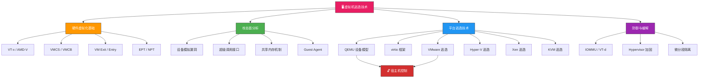

## 31.2 虚拟机逃逸



### 31.2.1 虚拟机逃逸概述

虚拟机逃逸（VM Escape）是指攻击者从虚拟机（Guest）内部突破虚拟化层（Hypervisor）的隔离边界，获得宿主机（Host）或 Hypervisor 本身的访问权限。这是云计算环境中最严重的安全威胁之一，因为它打破了虚拟化的核心安全假设——**隔离性**。

**为什么虚拟机逃逸如此危险？**

在云服务模型中，数十甚至上百台虚拟机共享同一台物理服务器。一旦攻击者成功逃逸，影响范围远超单台虚拟机：

| 影响维度 | 具体后果 | 严重程度 |
|---------|---------|---------|
| **数据窃取** | 跨租户读取其他 VM 的内存内容、磁盘数据 | 🔴 极高 |
| **权限提升** | 从受限的 Guest 用户提升到 Host 的 root 权限 | 🔴 极高 |
| **横向移动** | 以 Host 为跳板攻击同一物理服务器上的其他 VM | 🔴 极高 |
| **持久化** | 在 Hypervisor 层植入后门，所有新创建的 VM 均受影响 | 🔴 极高 |
| **供应链攻击** | 篡改 VM 镜像模板，影响后续所有使用该模板的实例 | 🟠 高 |
| **合规违规** | 违反 PCI-DSS、HIPAA 等数据隔离合规要求 | 🟠 高 |

**历史上的标志性事件：**

- **2008年** — 首次公开的 VMware 虚拟机逃逸（Travis Ormandy 在 Black Hat 展示）
- **2015年** — VENOM 漏洞（CVE-2015-3456）影响几乎所有 QEMU 虚拟化平台，CVSS 评分 7.5
- **2017年** — 多个 VMware ESXi 逃逸漏洞被武器化，Zerodium 报价 150 万美元
- **2020年** — QEMU USB 控制器溢出（CVE-2020-14364）展示了半虚拟化设备的攻击面
- **2021年** — Hyper-V VMBus 漏洞（CVE-2021-28476）可导致宿主机蓝屏或代码执行
- **2022-2024年** — Pwn2Own 比赛中 VMware Workstation 和 Hyper-V 逃逸连续多年成为最高奖金项目

### 31.2.2 硬件辅助虚拟化基础

要理解虚拟机逃逸，首先需要理解现代硬件辅助虚拟化的底层机制。这不是可选的背景知识——几乎所有 VM 逃逸漏洞都与这些底层机制直接相关。

**CPU 特权级别与 VMX 操作模式：**

```text
传统 x86 权限模型（4 个 Ring）：

    Ring 0 ── 内核（最高特权）
    Ring 1 ── （极少使用）
    Ring 2 ── （极少使用）
    Ring 3 ── 用户态（最低特权）

虚拟化后的权限模型（VMX）：

    ┌──────────────────────────────────┐
    │         Host（Ring 0）            │ ← Hypervisor 运行在 VMX root
    │   ┌──────────────────────────┐   │
    │   │      Guest（Ring 0）      │   │ ← Guest OS 运行在 VMX non-root
    │   │   ┌──────────────────┐   │   │
    │   │   │  Guest（Ring 3）  │   │   │ ← Guest 用户态程序
    │   │   └──────────────────┘   │   │
    │   └──────────────────────────┘   │
    └──────────────────────────────────┘
```

Intel VT-x 和 AMD AMD-V 是两种主要的硬件辅助虚拟化技术。它们的核心思想相同：增加一个 **VMX root / non-root** 操作模式，让 Hypervisor 运行在 VMX root（真正的 Ring 0），而 Guest OS 虽然自认为运行在 Ring 0，实际上运行在 VMX non-root 模式下，其特权操作会被硬件自动拦截。

**VMCS（Virtual Machine Control Structure）：**

VMCS 是 Intel VT-x 的核心数据结构，每个 vCPU 对应一个 VMCS。它存储了 Guest 和 Host 的状态信息，以及控制 VM Exit/Entry 行为的配置：

```text
VMCS 布局（64 位模式）：

┌─────────────────────────────────────────────┐
│  Guest-State Area（Guest 状态区）              │
│  - Guest CS/SS/DS/ES/FS/GS 段寄存器          │
│  - Guest CR0/CR3/CR4 控制寄存器               │
│  - Guest RSP/RIP 栈指针和指令指针             │
│  - Guest RFLAGS 标志寄存器                    │
├─────────────────────────────────────────────┤
│  Host-State Area（Host 状态区）               │
│  - Host CS/SS/DS 等段寄存器                   │
│  - Host CR0/CR3/CR4                           │
│  - Host RSP/RIP                               │
├─────────────────────────────────────────────┤
│  VM-Execution Control Fields（执行控制）       │
│  - Pin-based controls（中断窗口、NMI）         │
│  - Processor-based controls（I/O位图、MSR位图）│
│  - Exception bitmap（异常拦截）                │
│  - EPT pointer（嵌套页表指针）                 │
├─────────────────────────────────────────────┤
│  VM-Exit Control Fields（退出控制）            │
│  - Exit reasons                               │
│  - Exit qualification（退出原因详情）          │
├─────────────────────────────────────────────┤
│  VM-Entry Control Fields（进入控制）           │
│  - Entry interruption-info                     │
└─────────────────────────────────────────────┘
```

AMD-V 使用类似的 **VMCB（Virtual Machine Control Block）**，功能等价但字段布局不同。

**VM Exit 与 VM Entry：**

VM Exit 是 Guest 切换到 Host（Hypervisor）的机制。当 Guest 执行某些特权操作时，CPU 自动触发 VM Exit，控制权交给 Hypervisor 处理：

| VM Exit 原因 | 触发条件 | 攻击意义 |
|-------------|---------|---------|
| `EXIT_REASON_IO_INSTRUCTION` | Guest 执行 I/O 端口指令（IN/OUT） | 设备模拟的入口点，最常见的攻击面 |
| `EXIT_REASON_MSR_ACCESS` | Guest 读写 MSR 寄存器 | 可泄露 Host 地址（如 SYSENTER_ESP） |
| `EXIT_REASON_CPUID` | Guest 执行 CPUID 指令 | Hypervisor 隐藏信息可能泄露 |
| `EXIT_REASON_EPT_VIOLATION` | Guest 访问 EPT 未映射或权限不匹配的内存 | 共享内存、MMIO 区域的入口 |
| `EXIT_REASON_CR_ACCESS` | Guest 修改 CR0/CR3/CR4 寄存器 | 控制虚拟化行为的切换 |
| `EXIT_REASON_HLT` | Guest 执行 HLT 指令 | CPU 空闲状态，低风险 |
| `EXIT_REASON_XSETBV` | Guest 设置 XCR0 控制 AVX/SSE 状态 | 需要验证 |

**VM 逃逸的核心洞察：** 每一次 VM Exit 都意味着 Hypervisor 需要解析 Guest 传入的参数并做出响应。如果 Hypervisor 对参数的验证不严格——比如没有检查长度、没有验证范围、或者存在整数溢出——攻击者就可以通过精心构造的参数触发漏洞，从 VMX non-root 的"伪 Ring 0"突破到真正的 VMX root Ring 0。

### 31.2.3 内存虚拟化与 EPT/NPT

内存虚拟化是虚拟化平台中最复杂的子系统之一，也是漏洞的高发区。

**影子页表（Shadow Page Table）时代：**

早期的虚拟化没有硬件支持内存虚拟化，Hypervisor 需要维护一套"影子页表"来拦截 Guest 的所有页表操作。这种方式效率低且实现复杂。

**硬件辅助的嵌套页表：**

现代 CPU 提供了 **EPT（Extended Page Table，Intel）** 或 **NPT（Nested Page Table，AMD）**，允许硬件自动完成两层地址转换：

```text
Guest 虚拟地址 → Guest 页表 → Guest 物理地址 → EPT/NPT → Host 物理地址

    Guest 进程
    访问 VA 0x400000
        │
        ▼
    Guest 页表（Guest OS 维护）
    GPA 0x12000000
        │
        ▼
    EPT/NPT（Hypervisor 维护）
    HPA 0x1a300000
```

EPT 违规（EPT Violation）是 VM Exit 的重要原因之一。当 Guest 访问的 Guest 物理地址在 EPT 中没有映射、或者权限不匹配（如写入只读页面），CPU 触发 EPT Violation，将控制权交给 Hypervisor 处理缺页异常。这个机制经常被用于：

- **共享内存区域**：virtio 设备的共享内存通过 EPT 映射到 Guest 地址空间
- **MMIO（Memory-Mapped I/O）**：设备寄存器通过 EPT 映射为特殊的 MMIO 页面，访问这些页面触发 EPT Violation → VM Exit → Hypervisor 模拟设备寄存器读写
- **写时复制（COW）**：KVM 利用 EPT 的写保护实现高效的 COW

**EPT 相关的攻击面：**

| 攻击向量 | 描述 | 风险等级 |
|---------|------|---------|
| EPT 配置错误 | Hypervisor 错误配置 EPT 权限位 | 🔴 高 |
| EPT 内存映射越界 | 通过设备 DMA 写入超出分配范围的内存 | 🔴 高 |
| 共享内存竞争 | Guest 和 Host 之间的共享内存存在 TOCTOU 竞争条件 | 🟠 中 |
| MMIO 模拟漏洞 | EPT Violation 处理代码中的整数溢出或越界 | 🔴 高 |

### 31.2.4 攻击面分析

虚拟机逃逸的攻击面可以从虚拟化栈的每一层来理解：

```text
┌─────────────────────────────────────────────────────┐
│                 攻击面全景图                          │
├─────────────────────────────────────────────────────┤
│                                                     │
│  ┌─────────────────────────────────────────────┐    │
│  │ 第1层：Guest → Hypervisor 接口               │    │
│  │  · VM Exit 处理（I/O、MSR、CPUID、EPT）     │    │
│  │  · 超级调用接口（Hypercall）                 │    │
│  │  · /dev/kvm ioctl 接口                      │    │
│  └─────────────────────────────────────────────┘    │
│                      ↓                               │
│  ┌─────────────────────────────────────────────┐    │
│  │ 第2层：设备模拟层                             │    │
│  │  · PCI 设备模拟（e1000、virtio）             │    │
│  │  · USB 设备模拟                               │    │
│  │  · 显示设备模拟（VGA、SVGA、virtio-gpu）     │    │
│  │  · 存储设备模拟（IDE、AHCI、virtio-blk）     │    │
│  │  · 传统设备（FDC、LPT、串口）                │    │
│  └─────────────────────────────────────────────┘    │
│                      ↓                               │
│  ┌─────────────────────────────────────────────┐    │
│  │ 第3层：半虚拟化与通信层                       │    │
│  │  · virtio 框架（vring、virtqueue）           │    │
│  │  · 共享内存（IVSHMEM、vhost-user）           │    │
│  │  · Guest Agent（qemu-ga、VMware Tools）      │    │
│  │  · VMBus（Hyper-V）                          │    │
│  └─────────────────────────────────────────────┘    │
│                      ↓                               │
│  ┌─────────────────────────────────────────────┐    │
│  │ 第4层：后端与宿主机交互                       │    │
│  │  · vhost 内核模块（/dev/vhost-net）          │    │
│  │  · 用户态后端（dpdk、spdk）                  │    │
│  │  · 文件系统共享（9pfs、virtiofs）            │    │
│  └─────────────────────────────────────────────┘    │
│                                                     │
└─────────────────────────────────────────────────────┘
```

| 攻击面 | 描述 | 控制方式 | 典型漏洞类型 |
|--------|------|---------|-------------|
| **VM Exit 处理** | CPU 从 Guest 退出到 Host 的处理逻辑 | Guest 发送 I/O 指令、MSR 读写、触发 EPT 违规 | 整数溢出、缓冲区溢出、逻辑缺陷 |
| **虚拟设备模拟** | Hypervisor 模拟的硬件设备（NIC、USB、GPU、磁盘） | Guest 通过 MMIO/PIO 访问设备寄存器 | 缓冲区溢出、越界读写、UAF |
| **virtio 框架** | 半虚拟化 I/O 框架（vring 共享内存队列） | Guest 操控描述符环（Descriptor Ring） | 链表遍历漏洞、描述符越界、Double-Free |
| **共享内存机制** | VM 与 Host 之间的高效数据传输通道 | Guest 直接读写共享内存区域 | 竞争条件、TOCTOU、未初始化内存 |
| **Guest Agent** | 运行在 Guest 中的辅助程序 | Guest 触发 Agent 执行特定操作 | 命令注入、缓冲区溢出、权限提升 |
| **超级调用接口** | Guest 向 Hypervisor 发起的特权调用 | Guest 执行特定指令触发 Hypercall | 参数验证不当、类型混淆 |
| **vhost 后端** | 内核态的 virtio 后端处理模块 | Guest 的 I/O 请求由内核模块处理 | 内核级漏洞（提权→逃逸） |
| **快照/迁移** | VM 快照保存/恢复和热迁移 | 触发特殊操作序列 | 状态恢复不一致、资源泄漏 |

### 31.2.5 QEMU 设备模型与攻击面

QEMU 是最广泛使用的开源虚拟化软件，KVM 的用户态组件就是 QEMU。理解 QEMU 的设备模型架构是理解虚拟机逃逸的第一步。

**QEMU 架构概览：**

```text
┌─────────────────────────────────────────────────┐
│                 QEMU 进程架构                    │
├─────────────────────────────────────────────────┤
│                                                 │
│  ┌───────────────┐    ┌───────────────────┐    │
│  │  CPU 线程      │    │  I/O 线程          │    │
│  │  (TCG/KVM)    │    │  (事件循环)        │    │
│  └───────┬───────┘    └────────┬──────────┘    │
│          │                      │                │
│          ▼                      ▼                │
│  ┌───────────────┐    ┌───────────────────┐    │
│  │  vCPU 虚拟化   │    │  设备模型树       │    │
│  │  VMCS/VMCB    │    │  (QOM 对象模型)   │    │
│  └───────────────┘    └───────────────────┘    │
│                                │                │
│          ┌─────────────────────┼──────────┐    │
│          ▼                     ▼          ▼    │
│  ┌─────────────┐  ┌──────────────┐ ┌───────┐  │
│  │  PCI 总线    │  │  ISA 总线     │ │virtio │  │
│  │  设备模型    │  │  设备模型     │ │设备   │  │
│  └─────────────┘  └──────────────┘ └───────┘  │
│                                                 │
│  ┌─────────────────────────────────────────┐   │
│  │  Memory Region 树（地址空间映射）         │   │
│  │  - RAM region (Guest 内存)               │   │
│  │  - MMIO region (设备寄存器)              │   │
│  │  - PIO region (I/O 端口)                │   │
│  └─────────────────────────────────────────┘   │
│                                                 │
│  ┌─────────────────────────────────────────┐   │
│  │  宿主机交互层                            │   │
│  │  - KVM /dev/kvm（CPU 虚拟化）           │   │
│  │  - 文件 I/O（磁盘镜像）                  │   │
│  │  - 网络后端（socket/TAP/macvtap）        │   │
│  │  - USB 后端（USB 重定向）                │   │
│  └─────────────────────────────────────────┘   │
└─────────────────────────────────────────────────┘
```

**QOM（QEMU Object Model）：**

QEMU 使用自定义的对象模型 QOM 来管理所有设备实例。每个设备都是一个 QOM 对象，具有类型层次结构、属性（properties）和方法（methods）。QOM 的基类是 `Object`，设备类继承自 `DeviceState`：

```c
/*
 * QOM 类型层次示例
 *
 * Object
 *   └── DeviceState                    // 所有设备的基类
 *         ├── PCIDevice                // PCI 设备基类
 *         │     ├── PCIDevice          // 具体 PCI 设备
 *         │     │     ├── E1000State   // e1000 网卡
 *         │     │     ├── UHCIState    // USB UHCI 控制器
 *         │     │     └── VGAState     // VGA 显卡
 *         │     └── ...
 *         ├── SysBusDevice             // 系统总线设备基类
 *         │     ├── PlatformBusDevice
 *         │     └── ...
 *         └── VirtioDevice             // virtio 设备基类
 *               ├── VirtIONetState     // virtio-net 网卡
 *               ├── VirtIOBlockState   // virtio-blk 块设备
 *               └── VirtIOGPUsate      // virtio-gpu 图形设备
 */
```

**设备寄存器的内存映射机制：**

QEMU 使用 `MemoryRegion` 来管理地址空间。当 Guest 访问设备寄存器时，EPT 将对应地址映射为 MMIO 页面，触发 EPT Violation → VM Exit。QEMU 的设备模型通过注册 `MemoryRegionOps` 回调函数来处理这些访问：

```c
/*
 * 设备 MMIO 读写回调（以 virtio 设备为例）
 *
 * 当 Guest 读/写设备寄存器时，QEMU 调用这些回调函数。
 * 漏洞通常出现在这些回调函数的实现中——如果对 Guest 提供的
 * 偏移量、长度或索引没有做充分的边界检查。
 */

// 常见的漏洞模式：
static uint64_t device_mmio_read(void *opaque, hwaddr addr, unsigned size) {
    DeviceState *dev = opaque;
    uint32_t reg = addr >> 2;  // 漏洞点：如果 addr 未对齐？

    switch (reg) {
        case REG_STATUS:
            return dev->status;
        case REG_DATA:
            // 漏洞点：如果 reg 超出数组范围？
            return dev->buffer[reg];  // 越界读
        default:
            return 0;
    }
}

static void device_mmio_write(void *opaque, hwaddr addr, uint64_t val, unsigned size) {
    DeviceState *dev = opaque;
    uint32_t reg = addr >> 2;
    uint32_t offset = addr & 0x3;

    // 漏洞点：整数溢出导致越界写
    uint32_t target = reg + offset;
    dev->buffer[target] = (uint8_t)val;  // 溢出！
}
```

**QEMU 中常见的设备类型与对应攻击面：**

| 设备类别 | 具体设备 | 攻击向量 | 代表 CVE |
|---------|---------|---------|---------|
| **存储设备** | IDE、AHCI、NVMe、FDC | DMA 缓冲区溢出、命令描述符越界 | CVE-2015-3456（VENOM）、CVE-2020-14364 |
| **网络设备** | e1000、rtl8139、vmxnet3 | 数据包描述符处理、环形缓冲区越界 | CVE-2012-6075 |
| **USB 设备** | UHCI、EHCI、xHCI、USB 重定向 | 控制传输 wLength 溢出、等时传输 | CVE-2020-14364 |
| **显示设备** | VGA、Bochs VGA、virtio-gpu | SVGA 命令处理、帧缓冲区越界 | CVE-2017-4901 |
| **音频设备** | AC97、Intel HDA、ES1370 | DMA 缓冲区溢出 | — |
| **传统设备** | LPT、串口、FDC | 简单但仍有内存安全问题 | CVE-2015-3456 |
| **virtio 设备** | virtio-net、virtio-blk、virtio-gpu | 描述符链处理、vring 管理 | 多个 |

### 31.2.6 virtio 设备漏洞利用

virtio 是虚拟化环境中最重要的半虚拟化 I/O 框架。与全模拟设备不同，virtio 通过共享内存和轻量级通知机制实现高效的数据传输。理解 virtio 的内部机制对于理解现代 VM 逃逸至关重要。

**virtio 核心架构：**

```text
Guest                                          Host (QEMU)
┌──────────────┐                         ┌──────────────────┐
│  Guest Driver │                        │  QEMU 设备模型   │
│  (virtio-net) │                        │  (virtio-net)    │
└──────┬───────┘                         └────────┬─────────┘
       │                                          │
       ▼                                          ▼
┌──────────────────────────────────────────────────────┐
│                  virtio 共享内存区域                    │
│                                                      │
│  ┌──────────────────────────────────────────────┐   │
│  │              vring 结构                       │   │
│  │                                              │   │
│  │  ┌──────────────┐  ┌────────────┐           │   │
│  │  │ Descriptor   │  │ Available  │           │   │
│  │  │ Table        │  │ Ring       │           │   │
│  │  │ (描述符表)    │  │ (可用环)    │           │   │
│  │  │ 每项16字节    │  │ 每项2字节   │           │   │
│  │  │ ·addr(8B)    │  │ ·flags(2B) │           │   │
│  │  │ ·len(4B)     │  │ ·idx(2B)   │           │   │
│  │  │ ·flags(2B)   │  │ ·ring[n]   │           │   │
│  │  │ ·next(2B)    │  └────────────┘           │   │
│  │  └──────────────┘  ┌────────────┐           │   │
│  │                    │  Used Ring  │           │   │
│  │                    │ (已用环)     │           │   │
│  │                    │ 每项8字节    │           │   │
│  │                    │ ·idx(2B)    │           │   │
│  │                    │ ·elem(6B)   │           │   │
│  │                    └────────────┘           │   │
│  └──────────────────────────────────────────────┘   │
│                                                      │
└──────────────────────────────────────────────────────┘
       │                                          │
       │  Guest 写入 Available Ring               │
       │  → 通知 Host（kick）                     │
       │                                          │
       │  Host 处理后写入 Used Ring                │
       │  → 通知 Guest（interrupt）               │
       ▼                                          ▼
   Guest 处理完成              Host 处理 I/O 请求
```

**virtio 描述符链机制：**

virtio 使用描述符（Descriptor）链来组织数据缓冲区。每个描述符 16 字节，通过 `next` 字段形成链表：

```c
/*
 * virtio 描述符结构（16 字节）
 *
 * struct vring_desc {
 *     __le64 addr;   // Guest 物理地址（8 字节）
 *     __le32 len;    // 缓冲区长度（4 字节）
 *     __le16 flags;  // 标志位（2 字节）
 *     __le16 next;   // 下一个描述符索引（2 字节）
 * };
 *
 * flags 字段含义：
 *   VRING_DESC_F_NEXT     (0x01) - 链接到下一个描述符
 *   VRING_DESC_F_WRITE    (0x02) - 设备写入缓冲区（设备→Guest）
 *   VRING_DESC_F_INDIRECT (0x04) - 间接描述符表
 */

// 描述符链遍历代码（Host 侧）
struct vring_desc *descs = ...;  // 描述符表
uint16_t head = avail_ring[idx]; // 获取链头索引

uint16_t current = head;
while (descs[current].flags & VRING_DESC_F_NEXT) {
    // 漏洞点 1：如果 Guest 构造了循环链表，这里会无限循环
    // 漏洞点 2：如果 next 索引超出描述符表范围，会越界访问
    // 漏洞点 3：如果 len 字段被恶意设置，可能导致缓冲区溢出
    process_buffer(descs[current].addr, descs[current].len);
    current = descs[current].next;
}
```

**virtio 逃逸的典型攻击路径：**

1. **描述符链循环攻击**：构造 next 字段形成环形链表，导致 Host 侧遍历代码无限循环或栈溢出
2. **描述符索引越界**：将 next 设为超出描述符表大小的值，触发越界读写
3. **间接描述符表攻击**：利用 `VRING_DESC_F_INDIRECT` 标志，指向一个伪造的间接描述符表
4. **队列大小混淆**：利用 `vring.num`（队列大小）与实际描述符表大小不一致的差异
5. **notification suppression 绕过**：绕过 `vring.avail.flags` 中的 notification suppression 位，触发意外的中断处理

**代码示例 — 描述符链越界：**

```c
/*
 * virtio 描述符链越界利用原理
 *
 * 假设描述符表有 256 项（索引 0-255），
 * 但 Host 侧的索引检查不严格：
 */

// 漏洞代码（简化）
void handle_virtio_request(VirtQueue *vq) {
    uint16_t head = vq->avail->ring[vq->last_avail_idx % vq->num];

    // 漏洞：仅检查 head < num，但没检查链中每个 next < num
    if (head >= vq->num) return;

    // 遍历描述符链
    struct vring_desc *desc = &vq->desc[head];
    while (desc->flags & VRING_DESC_F_NEXT) {
        desc = &vq->desc[desc->next];  // next 可能越界！
        // 如果 next = 0xFFFF，会读取描述符表之后的内存
        // 如果后续内存包含攻击者控制的数据，可劫持控制流
        process_data(desc->addr, desc->len);
    }
}

// 正确的实现应该：
void handle_virtio_request_safe(VirtQueue *vq) {
    uint16_t head = vq->avail->ring[vq->last_avail_idx % vq->num];
    if (head >= vq->num) return;

    uint16_t idx = head;
    int max_chain = vq->num;  // 防止循环，链长度不超过描述符数量
    while (max_chain-- > 0) {
        if (idx >= vq->num) return;  // 索引范围检查
        struct vring_desc *desc = &vq->desc[idx];
        process_data(desc->addr, desc->len);
        if (!(desc->flags & VRING_DESC_F_NEXT)) break;
        idx = desc->next;
    }
}
```

### 31.2.7 主流虚拟化平台逃逸技术

不同虚拟化平台的架构差异导致其攻击面和逃逸技术各不相同。以下分别分析四大主流平台的关键攻击面和逃逸技术。

**VMware 逃逸：**

VMware 是企业虚拟化市场的领导者，其 Workstation 和 ESXi 产品线的攻击面最为丰富：

| 攻击面 | 技术细节 | 代表 CVE |
|--------|---------|---------|
| **Backdoor 接口** | VMware 定义的特殊 I/O 端口（0x5658），Guest 通过 IN/OUT 指令与 Host 通信。包含 HGFS、拖拽、复制粘贴、VMCI 等功能 | CVE-2017-4901（SVGA） |
| **HGFS** | Host-Guest File System，提供 Host 和 Guest 之间的文件共享。处理 Guest 侧的 HGFS 请求时存在缓冲区溢出 | CVE-2017-4901 |
| **SVGA 设备** | 虚拟显卡设备，处理 3D 加速命令。命令参数验证不当导致越界读写 | CVE-2017-4901 |
| **VMCI** | Virtual Machine Communication Interface，VM 之间以及 VM 与 Host 之间的通信通道 | CVE-2020-3947 |
| **vDGA/vGPU** | 虚拟 GPU 直通，通过 PCI 设备模拟 | CVE-2023-20858 |
| **Drag-and-Drop** | 拖拽协议处理中的缓冲区溢出 | CVE-2018-6983 |

**VMware 逃逸的典型攻击链：**

```text
Guest 恶意程序
  │
  ├── 1. 信息泄露（绕过 ASLR）
  │     └── 通过 Backdoor 接口查询进程信息
  │         或利用 SVGA 设备寄存器泄露 Host 地址
  │
  ├── 2. 漏洞触发（获得读写原语）
  │     ├── HGFS 路径缓冲区溢出
  │     ├── SVGA 命令参数越界
  │     └── VMCI 消息处理 UAF
  │
  ├── 3. 控制流劫持
  │     └── 覆盖 VM 进程中的函数指针/vtable
  │         跳转到 ROP 链
  │
  └── 4. 宿主机代码执行
        └── 在 VMware VMX 进程中执行 shellcode
            获得 Host 的用户态权限
            进一步提升到 Host root
```

**Hyper-V 逃逸：**

Microsoft Hyper-V 采用 Type-1 架构，Hypervisor 直接运行在硬件上，安全性理论上高于 Type-2：

| 攻击面 | 技术细节 | 代表 CVE |
|--------|---------|---------|
| **VMBus** | Guest 和 Host 之间的高速通信通道，基于共享内存和环形缓冲区。GPADL 处理中的整数溢出是最常见的漏洞类型 | CVE-2021-28476 |
| **合成设备驱动** | 鼠标、键盘、网卡、存储等合成设备的内核态驱动 | CVE-2021-28467 |
| **Hyper-V Socket** | AF_HYPERV 套接字，提供 Guest 和 Host 之间的直接网络通信 | CVE-2020-0878 |
| **集成服务** | Hyper-V Integration Services（心跳、时间同步、数据交换） | CVE-2021-28445 |
| **虚拟 PCI** | vPCI 设备模拟中的 DMA 处理 | CVE-2022-21907 |

**Hyper-V VMBus 攻击模型：**

```text
Guest                          Host (Hyper-V)
┌──────────────┐              ┌──────────────────┐
│  VMBus 驱动  │              │  VMBus 管理器    │
└──────┬───────┘              └────────┬─────────┘
       │                               │
       │  GPADL_HEADER                 │
       │  (rangecount=N)               │
       │  ──────────────►              │
       │                               │ 分配 N * sizeof(PFN) 字节
       │  GPADL_BODY                   │
       │  (PFN 数据)                   │
       │  ──────────────►              │ 映射到 Guest 地址空间
       │                               │
       │  ⚠️ 如果 N 很大导致整数溢出    │
       │  分配的内存 < N * sizeof(PFN) │
       │  Guest 的 PFN 数据溢出到      │
       │  分配缓冲区之外               │
       │                               │
```

**Xen 逃逸：**

Xen 作为最早的开源虚拟化平台之一，其超级调用（Hypercall）接口是最主要的攻击面：

| 攻击面 | 技术细节 | 代表安全通告 |
|--------|---------|-------------|
| **超级调用** | `HYPERVISOR_memory_op`（内存管理）、`HYPERVISOR_grant_table_op`（授权表）、`HYPERVISOR_domctl`（域控制） | XSA-212（PoD 内存操作漏洞） |
| **授权表** | Grant Table 允许 Guest 和 Host 之间安全共享内存。引用计数处理不当可能导致 UAF | XSA-7（Intel SYSRET） |
| **Xen Store** | Guest 和 Xen 之间的键值存储通信通道 | XSA-165 |
| **PV 驱动** | 半虚拟化驱动中的漏洞 | XSA-105 |
| **Intel 特定漏洞** | 利用 Intel CPU 特性（如 SYSRET、TSX）的漏洞 | XSA-7、XSA-221 |

**KVM 逃逸：**

KVM 本身只是一个 Linux 内核模块，设备模拟依赖 QEMU。因此 KVM 逃逸主要通过以下路径：

| 攻击面 | 技术细节 | 说明 |
|--------|---------|------|
| **/dev/kvm ioctl** | `KVM_CREATE_VM`、`KVM_SET_USER_MEMORY_REGION` 等 ioctl 接口 | 参数验证不当可能导致内核内存损坏 |
| **VM Exit 处理** | KVM 内核态的 VM Exit 处理代码（CPUID、MSR、EPT） | 需要触发特定的 VM Exit 条件 |
| **vhost 后端** | `/dev/vhost-net`、`/dev/vhost-scsi` 等内核模块 | 直接在内核态处理 virtio 请求，漏洞影响极大 |
| **设备模拟（通过 QEMU）** | 与 31.2.5 节相同的所有 QEMU 设备模拟攻击面 | KVM 逃逸的主要路径 |
| **嵌套虚拟化** | `KVM_SET_NESTED_STATE` | 状态恢复中的漏洞 |

**KVM 逃逸的关键特征：** 由于 KVM 的设备模拟在用户态 QEMU 进程中完成，大多数 KVM 逃逸实际上是 QEMU 逃逸——利用 QEMU 进程中的漏洞获得 Host 用户态代码执行，然后通过内核提权获得 root 权限。

### 31.2.8 VM 逃逸利用方法论

一套系统化的 VM 逃逸利用方法论，按照攻击阶段分解：

```text
┌─────────────────────────────────────────────────────────┐
│                VM 逃逸利用方法论                          │
├─────────────────────────────────────────────────────────┤
│                                                         │
│  阶段 1：环境侦察                                       │
│  ┌─────────────────────────────────────────────────┐   │
│  │  · 识别 Hypervisor 类型和版本                    │   │
│  │  · 枚举可用的虚拟设备                            │   │
│  │  · 确定 I/O 端口和 MMIO 地址范围                 │   │
│  │  · 测试 Guest Agent 的可用性                     │   │
│  │  · 检查共享内存区域的存在                        │   │
│  └─────────────────────────────────────────────────┘   │
│           │                                             │
│           ▼                                             │
│  阶段 2：漏洞识别与分析                                  │
│  ┌─────────────────────────────────────────────────┐   │
│  │  · Fuzzing 目标设备（使用 AFL/libFuzzer）       │   │
│  │  · 静态分析 QEMU/VMware 源码或二进制            │   │
│  │  · 重点关注边界检查、整数运算、内存释放          │   │
│  │  · 验证漏洞的可利用性（信息泄露 + 写入原语）    │   │
│  └─────────────────────────────────────────────────┘   │
│           │                                             │
│           ▼                                             │
│  阶段 3：利用原语构造                                    │
│  ┌─────────────────────────────────────────────────┐   │
│  │  · 信息泄露：绕过 ASLR（获取 Hypervisor 地址）  │   │
│  │  · 读写原语：通过漏洞获得任意内存读写能力        │   │
│  │  · 控制流劫持：覆盖函数指针/vtable/返回地址      │   │
│  └─────────────────────────────────────────────────┘   │
│           │                                             │
│           ▼                                             │
│  阶段 4：代码执行与逃逸                                  │
│  ┌─────────────────────────────────────────────────┐   │
│  │  · 构造 ROP 链绕过 NX/DEP                       │   │
│  │  · 在 Hypervisor 进程中执行代码                  │   │
│  │  · 建立到 Host 的反向连接                        │   │
│  │  · 或在 Host 上写入持久化后门                    │   │
│  └─────────────────────────────────────────────────┘   │
│           │                                             │
│           ▼                                             │
│  阶段 5：后渗透（可选）                                  │
│  ┌─────────────────────────────────────────────────┐   │
│  │  · 读取其他 VM 的内存/磁盘数据                   │   │
│  │  · 以 Host 为跳板横向移动到其他 VM               │   │
│  │  · 植入 Hypervisor 级别的持久化后门              │   │
│  └─────────────────────────────────────────────────┘   │
│                                                         │
└─────────────────────────────────────────────────────────┘
```

**VM 逃逸的特殊挑战与应对：**

| 挑战 | 原因 | 应对方法 |
|------|------|---------|
| **ASLR** | Hypervisor 进程地址空间随机化 | 利用设备寄存器/共享内存泄露基地址，或暴力搜索（KASLR 在 256 种可能偏移内） |
| **NX/DEP** | Hypervisor 进程的代码页不可执行 | 使用 ROP 链执行代码，或利用 JIT 区域（如 VMware V8 引擎） |
| **有限溢出** | 许多漏洞只能溢出很少的字节 | 选择性覆盖关键数据（如 GOT 项、vtable 指针、返回地址的低位字节） |
| **错误恢复** | 硬件状态和设备状态可能被破坏 | 仔细管理设备状态，确保触发漏洞后仍能正常通信 |
| **多线程** | Hypervisor 是多线程的，设备状态可能被并发修改 | 使用单线程触发路径，或利用竞争条件 |
| **代码完整性** | 较新的 Hypervisor 可能启用了 CFI | 使用非间接调用的 gadget，或寻找 CFI 保护不完整的路径 |

### 31.2.9 防御机制与缓解措施

虚拟化平台的防御体系是多层次的纵深防御：

```text
┌─────────────────────────────────────────────────────┐
│                 VM 逃逸防御体系                       │
├─────────────────────────────────────────────────────┤
│                                                     │
│  第1层：硬件隔离                                      │
│  · IOMMU / VT-d / SMMU — 阻止 Guest 的 DMA 攻击     │
│  · Intel TME / AMD SME — 内存加密                    │
│  · Intel TXT — 可信执行环境                           │
├─────────────────────────────────────────────────────┤
│  第2层：Hypervisor 加固                               │
│  · 最小化设备模型 — 禁用不必要的虚拟设备              │
│  · 代码审计与形式化验证                               │
│  · 严格输入验证（所有 Guest→Host 的数据）            │
├─────────────────────────────────────────────────────┤
│  第3层：运行时保护                                    │
│  · 进程隔离 — QEMU 进程的 seccomp-bpf 限制           │
│  · 地址随机化 — ASLR 保护                            │
│  · 代码完整性 — CFI / BTI 保护                       │
│  · 内存保护 — W^X / NX                              │
├─────────────────────────────────────────────────────┤
│  第4层：监控与检测                                    │
│  · VM 行为异常检测                                    │
│  · 内存完整性校验                                     │
│  · VM Exit 频率监控                                   │
│  · 设备访问模式分析                                   │
├─────────────────────────────────────────────────────┤
│  第5层：架构级防御                                    │
│  · 微分段（Micro-segmentation）— 限制 VM 间通信      │
│  · 机密计算（Confidential Computing）— 硬件级内存加密│
│  · 无服务器/容器化 — 减少 Hypervisor 攻击面          │
└─────────────────────────────────────────────────────┘
```

**IOMMU（VT-d/SMMU）的重要性：**

IOMMU 是防御 VM 逃逸的关键硬件机制。它为 DMA 传输提供地址转换和权限控制，防止恶意 Guest 通过 DMA 直接读写 Host 物理内存：

```text
无 IOMMU 时的 DMA 攻击：

  Guest DMA 控制器
      │
      │  DMA 读写请求（带有 GPA 地址）
      │
      ▼
  物理内存控制器
      │
      ▼
  直接访问 Host 物理内存 ← 🔴 攻击者可读写任意 Host 内存

有 IOMMU 时的 DMA 攻击：

  Guest DMA 控制器
      │
      │  DMA 读写请求
      │
      ▼
  IOMMU（VT-d）    ← 🔵 将 GPA 映射到仅属于该 VM 的 HPA
      │                 恶意地址会被拒绝
      ▼
  物理内存控制器
      │
      ▼
  仅允许映射范围内的 Host 物理内存
```

**最佳实践 — 减少 VM 逃逸风险：**

1. **最小化虚拟设备**：只启用业务必需的设备。例如，如果不需要图形界面，禁用 VGA、virtio-gpu 和 USB 控制器
2. **及时更新虚拟化软件**：QEMU、VMware、Hyper-V 的安全补丁发布后应尽快部署
3. **启用 IOMMU**：在 BIOS 中启用 VT-d/AMD-Vi，并在 Hypervisor 配置中启用 IOMMU
4. **限制 Guest 特权**：避免以 root 权限运行 Guest 进程，限制不必要的 I/O 访问
5. **网络隔离**：使用微分段策略限制 VM 之间的通信
6. **监控异常**：监控 VM Exit 频率异常升高、设备访问模式异常等信号
7. **使用安全启动**：启用 Secure Boot 确保 Hypervisor 二进制完整性

### 31.2.10 虚拟化安全的未来趋势

虚拟化安全技术正在多个方向快速演进：

**机密计算（Confidential Computing）：**

传统的虚拟化安全依赖软件隔离，但 Hypervisor 本身拥有对 Guest 内存的完全访问权限。机密计算通过硬件加密技术解决了这个信任问题：

- **Intel TDX（Trust Domain Extensions）**：将整个 VM 作为一个受保护的信任域，即使 Hypervisor 也无法读取其内存
- **AMD SEV-SNP（Secure Encrypted Virtualization - Secure Nested Paging）**：在 VM 级别提供内存加密和完整性保护
- **ARM CCA（Confidential Compute Architecture）**：为 ARM 平台提供类似功能

**无 Hypervisor 虚拟化（Unikernel / Library OS）：**

通过将应用和最小化的操作系统库编译成单一镜像，完全消除传统 Hypervisor 和 Guest OS 的攻击面。

**eBPF 在虚拟化安全中的应用：**

eBPF 可以在 Hypervisor 层面实现高效的安全策略执行和行为监控，成为新一代虚拟化安全工具的基础。

**AI 辅助漏洞发现：**

随着大语言模型和 AI 代码分析工具的进步，QEMU 等大型开源项目的漏洞发现效率正在显著提升。模糊测试（Fuzzing）结合 AI 的方向引导，使得发现深层逻辑漏洞成为可能。

### 31.2.11 常见误区与纠正

| 误区 | 纠正 |
|------|------|
| "虚拟机逃逸只存在于老旧软件中" | 现代虚拟化平台每年仍有严重漏洞被发现。2020-2024 年间，VMware、Hyper-V、QEMU 均有高危逃逸漏洞披露 |
| "Type-1 Hypervisor 比 Type-2 安全" | 理论上 Type-1 攻击面更小，但 Hyper-V（Type-1）的 VMBus 攻击面同样很大。安全性取决于具体实现质量 |
| "只要不共享文件夹就不会被逃逸" | 共享文件夹（HGFS/virtiofs）只是攻击面之一。virtio 设备、虚拟 GPU、USB 控制器等都是潜在的逃逸路径 |
| "KVM 和 QEMU 是同一个东西" | KVM 是内核模块，提供 CPU 虚拟化；QEMU 是用户态进程，提供设备模拟。KVM 逃逸通常通过 QEMU 漏洞实现 |
| "虚拟机逃逸需要 root 权限" | Guest 中的普通用户即可触发大多数虚拟设备漏洞，因为设备寄存器的 MMIO 映射通常对所有 Guest 用户态进程可见 |
| "关掉网络就安全了" | 设备模拟的攻击面包括 USB、GPU、音频等非网络设备。VENOM 漏洞仅通过软驱控制器即可逃逸 |

### 31.2.12 关键知识点总结

| 知识领域 | 核心概念 | 要点 |
|---------|---------|------|
| **硬件虚拟化** | VMCS/VMCB、VM Exit/Entry | 每次 VM Exit 都是潜在的攻击入口 |
| **内存虚拟化** | EPT/NPT、影子页表 | EPT 配置错误或处理漏洞可导致内存越界 |
| **设备模拟** | MemoryRegion、MMIO、PIO | 设备寄存器处理是 VM 逃逸的最常见攻击面 |
| **virtio 框架** | 描述符链、vring、virtqueue | 描述符链处理不当是核心漏洞类型 |
| **QEMU 设备模型** | QOM、设备类型层次 | 理解设备模型才能定位和分析漏洞 |
| **平台差异** | VMware/Hyper-V/Xen/KVM | 每个平台的架构差异导致不同的攻击面和防御重点 |
| **利用方法论** | 侦察→漏洞分析→原语构造→代码执行 | 信息泄露是逃逸的必要前提 |
| **防御体系** | IOMMU+最小化+监控+机密计算 | 纵深防御是唯一可行的防御策略 |

> **下一步学习建议**：理论部分建立的概念框架将在 §31.8（虚拟机逃逸案例）中通过 CVE-2015-3456（VENOM）和 CVE-2020-14364（QEMU USB 溢出）两个真实案例进行实战验证。建议在阅读案例前回顾本节的 virtio 描述符链机制和 QEMU 设备模型架构，这些知识将帮助你理解漏洞的成因和利用细节。

---
