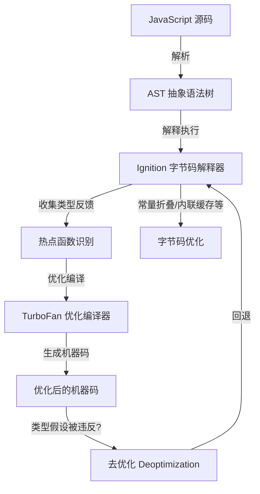
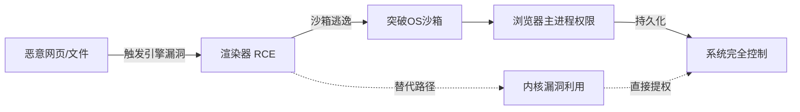

## 31.3 浏览器漏洞利用

浏览器是现代互联网用户最常使用的软件，也是攻击面最大、复杂度最高的软件之一。Chrome 单个代码库超过 3500 万行代码，V8 引擎本身就有超过 60 万行 C++ 代码。如此庞大的代码量加上与操作系统深度集成的特性，使得浏览器成为高价值漏洞利用的首要目标。本节系统讲解浏览器漏洞利用的完整知识体系——从架构原理到利用技术，从漏洞类型到实战案例。

---

### 31.3.1 浏览器安全架构

现代浏览器采用多进程架构，将不同功能模块隔离在独立进程中，形成纵深防御体系。以 Chromium 系浏览器（Chrome、Edge、Brave）为例：

```text
浏览器安全架构（Chromium多进程模型）：

┌──────────────────────────────────────────────────────────┐
│                   浏览器主进程 (Browser Process)           │
│  ┌──────────┐ ┌──────────┐ ┌──────────┐ ┌─────────────┐ │
│  │ 网络栈    │ │ 存储管理  │ │ UI渲染    │ │ 特权操作     │ │
│  │ (Net)    │ │ (Quota)  │ │ (Views)  │ │ (IPC调度)   │ │
│  └──────────┘ └──────────┘ └──────────┘ └─────────────┘ │
│  权限等级：最高（可访问所有系统资源）                         │
├──────────────────────────────────────────────────────────┤
│                    GPU进程 (GPU Process)                   │
│  - 图形渲染加速    - WebGL处理    - 视频解码                │
│  权限等级：中等（受沙箱限制，无文件系统访问）                  │
├──────────────────────────────────────────────────────────┤
│                 渲染器进程 (Renderer Process) — 每个站点独立  │
│  ┌─────────────────────────────────────────────────────┐ │
│  │  JavaScript引擎 (V8 / SpiderMonkey / JavaScriptCore)│ │
│  │  ┌──────────┐  ┌────────────────┐  ┌────────────┐  │ │
│  │  │ 解释器    │  │ JIT编译器       │  │ 垃圾回收器  │  │ │
│  │  │ (Ignition)│  │ (TurboFan)     │  │ (Orinoco)  │  │ │
│  │  └──────────┘  └────────────────┘  └────────────┘  │ │
│  ├─────────────────────────────────────────────────────┤ │
│  │  Blink渲染引擎 / DOM引擎 / CSS引擎 / 布局引擎        │ │
│  ├─────────────────────────────────────────────────────┤ │
│  │  图形合成 (Skia / ANGLE)    沙箱 (seccomp-bpf)      │ │
│  └─────────────────────────────────────────────────────┘ │
│  权限等级：最低（受严格沙箱限制）                             │
├──────────────────────────────────────────────────────────┤
│                  网络进程 (Network Process)                │
│  - DNS解析    - TLS处理    - HTTP协议栈                    │
│  权限等级：中等（独立沙箱，仅限网络操作）                      │
├──────────────────────────────────────────────────────────┤
│                  工具进程 (Utility Process)                │
│  - PDF解析    - 音视频编解码    - 数据存储                   │
│  权限等级：各自独立沙箱                                     │
└──────────────────────────────────────────────────────────┘
```

**进程间通信（IPC）机制：**

进程间通过 Mojo IPC 框架通信。Mojo 是 Chromium 自研的 IPC 系统，取代了早期的 Chrome IPC。每个进程间通道有独立的权限控制，渲染器进程只能与受限的 Broker 接口通信来请求系统资源。IPC 通道本身也是攻击面——Mojo 消息的反序列化漏洞可直接导致浏览器主进程被攻破。

**站点隔离（Site Isolation）：**

Chrome 67 引入的站点隔离机制将不同域名的页面放在不同渲染器进程中，从根本上缓解了 Spectre 类侧信道攻击。每个渲染器进程最多只能访问自己域名的数据，即使恶意脚本通过侧信道泄露信息，也无法跨进程读取敏感数据。

---

### 31.3.2 JavaScript 引擎架构与攻击面

JavaScript 引擎是浏览器中最复杂、漏洞密度最高的组件。以 V8（Chrome/Edge 使用）为例进行深入分析。

#### 31.3.2.1 V8 编译管线



**执行流程详解：**

1. **解析阶段**：JavaScript 源码经过词法分析和语法分析，生成抽象语法树（AST）。V8 采用懒解析（Lazy Parsing），只在函数被调用时才完整解析其内容。

2. **Ignition 解释执行**：AST 被编译为紧凑的字节码（bytecode），由 Ignition 解释器逐条执行。字节码体积仅为 AST 的 25%-50%，节省内存。Ignition 为每个操作维护内联缓存（Inline Cache, IC），记录函数参数的实际类型。

3. **热点识别与优化编译**：当一个函数被调用次数超过阈值（默认约 10 次），且收集到足够多的类型反馈后，V8 将其标记为热点函数，交给 TurboFan 进行优化编译。

4. **TurboFan 优化**：基于 Sea-of-Nodes 中间表示（IR），执行常量传播、逃逸分析、冗余消除、类型特化等优化，生成高效的机器码。关键假设——基于类型反馈的类型推断。

5. **去优化（Deoptimization）**：如果运行时类型假设被违反（例如传入了不同类型的参数），V8 必须放弃优化代码，回退到 Ignition 字节码。去优化机制的安全性至关重要——许多 JIT 漏洞源于去优化路径中的不一致状态。

#### 31.3.2.2 V8 对象模型

```text
V8 对象内存布局：

JSObject:
+------------------+
| Map 指针          |  --> 指向 Hidden Class，描述对象结构和类型
+------------------+
| Properties 指针   |  --> 指向外部属性存储（按添加顺序）
+------------------+
| Elements 指针     |  --> 指向数组元素存储（Smi/Holey/Packed）
+------------------+
| In-object 字段    |  --> 直接内联存储的属性值（快速访问）
+------------------+

Hidden Class (Map) 链：
对象添加属性时，Map 指针沿 Transition 链移动
Object {} → +.a → Object{a} → +.b → Object{a,b}
每一步 Transition 创建新的 Map，描述当前属性集合
```

**Hidden Class 是理解类型混淆漏洞的关键。** V8 通过 Map 指针判断对象类型。如果攻击者能让引擎使用错误的 Map 来解释对象布局，就能实现类型混淆——将一个类型的对象当作另一个类型来读写，导致任意内存访问。

#### 31.3.2.3 其他浏览器引擎对比

| 特性 | V8 (Chrome/Edge) | SpiderMonkey (Firefox) | JavaScriptCore (Safari) |
|------|-------------------|------------------------|--------------------------|
| 解释器 | Ignition | BytecodeInterpreter | LLInt |
| 优化编译器 | TurboFan | WarpMonkey | DFG + FTL |
| 垃圾回收 | Orinoco (分代式) | Nursery + Tenured | Copied / Mark-Sweep |
| JIT策略 | 热点函数优化 | 基线→离子→Warp | 三级JIT (LLInt→DFG→FTL) |
| 漏洞模式 | 类型混淆、OOB | 类型混淆、OOB | 类型混淆、OOB |
| 近年重大漏洞 | CVE-2021-21224等 | CVE-2019-11707等 | CVE-2021-30858等 |

Firefox 的 WarpMonkey 在 Fx83 后取代了 baseline→Ion 两层编译，简化了优化管线但引入了新的攻击面。Safari 的 JSC 使用三层层级编译（LLInt→DFG→FTL），层级间的状态转换是漏洞高发区。

---

### 31.3.3 常见浏览器漏洞类型

#### 31.3.3.1 类型混淆（Type Confusion）

类型混淆是浏览器引擎中最常见、危害最大的漏洞类型。其本质是：引擎对某个对象使用了错误的类型解释，导致对对象内部字段的读写偏移与实际布局不匹配。

**漏洞原理：**

```text
正常情况：
  对象A（Array类型）的 Map 描述：offset+0 = length, offset+8 = elements_ptr
  引擎按此布局正确读取

类型混淆情况：
  攻击者让对象A获得对象B（String类型）的 Map
  引擎按 String 布局解释 Array 对象
  offset+0 被当作 String::length
  实际上读取的是 Array 的 Map 指针
  → 获得一个受控的"长度"值，实现越界读写
```

**真实案例——CVE-2021-21224：**

这是 V8 引擎中的一个类型混淆漏洞，影响 Chrome 90 之前版本。漏洞出在 TurboFan 编译器对 `Math.floor()` 返回值的类型推断上：

```javascript
// 漏洞触发代码（简化版）
function foo(a) {
    // TurboFan 推断 Math.floor 的返回值为 Smi（小整数）
    // 但当参数为 NaN 时，返回值类型为 HeapNumber
    let x = Math.floor(a);
    // TurboFan 基于错误的类型推断优化后续代码
    // 将 HeapNumber 当作 Smi 处理
    // 导致类型混淆
    let arr = [1.1, 2.2, 3.3];  // Packed Double 数组
    arr[x] = {};  // 如果 x 是 Smi 则正常，如果是被混淆的值则触发OOB
    return arr;
}
```

该漏洞被 NSO Group 的 FORCEDENTRY 攻击利用，通过发送特制 PDF 文件在目标设备上实现零点击 RCE。Google 于 2021 年 9 月确认该漏洞在野外被积极利用。

**利用模式：**

类型混淆的标准利用链：

```text
类型混淆 → 伪造对象属性 → 任意地址读 (addrof) → 任意地址写 (fakeobj)
→ 劫持 JSObject 指针 → 获得任意代码执行
```

具体步骤：

1. **构造混淆对象**：利用类型混淆将一个对象的字段当作另一个类型的字段来读写
2. **实现 addrof 原语**：通过混淆读取任意地址的值（将目标地址作为对象引用读取）
3. **实现 fakeobj 原语**：通过混淆在指定地址创建一个假对象（将地址写入应存放引用的位置）
4. **伪造 JSObject**：在可控内存区域放置精心构造的 JSObject 布局
5. **劫持 vtable / 函数指针**：通过伪造的 JSObject 获得任意代码执行

#### 31.3.3.2 越界读写（Out-of-Bounds Read/Write）

越界读写通常发生在数组操作中，当边界检查被优化器错误消除或数组长度被篡改时发生。

**典型成因：**

- **边界检查消除（Bounds Check Elimination, BCE）错误**：TurboFan 的 BCE 优化阶段可能错误地移除数组访问前的边界检查。如果编译器证明"数组索引一定在合法范围内"，但实际上该证明有误，就会产生 OOB。

- **长度字段与实际缓冲区不匹配**：如果攻击者能将一个数组的 `.length` 字段修改为比实际分配的缓冲区更大的值，后续的数组访问就会越界。

**漏洞利用原语：**

```javascript
// 概念演示：利用OOB读写实现任意内存访问
let oob_array = [1.1, 2.2, 3.3];  // 普通数组
let victim_array = new Float64Array(100);  // 受害者数组

// 假设通过漏洞将 oob_array 的 length 改为 1000
// 则 oob_array[3] 实际上读取 victim_array 的 header
// oob_array[4] 开始读取 victim_array 的数据区

// 通过 OOB 读取 victim_array 内部指针 → addrof 原语
// 通过 OOB 写入 victim_array 数据区 → 任意写原语
```

**CVE-2019-5782** 是 Chrome 中的一个 OOB 写漏洞，存在于 Skia 图形库的 `SkPath` 处理中。攻击者通过构造恶意的 SVG 文件触发 OOB 写，可实现渲染器进程内的代码执行。该漏洞被用于 Windows 平台的针对性攻击。

#### 31.3.3.3 Use-After-Free（UAF）

UAF 是浏览器中仅次于类型混淆的高频漏洞类型。其本质是：对象被释放后，仍有指针指向已释放的内存区域。攻击者可以在释放后的空隙中分配新数据覆盖该区域，使旧指针指向攻击者控制的数据。

**浏览器中的 UAF 成因：**

- **DOM 引擎引用计数错误**：Blink 引擎使用引用计数管理 DOM 对象。如果在特定操作序列下引用计数未正确维护，对象可能在仍有引用时被释放。
- **JavaScript 与 C++ 对象生命周期不一致**：JS 引擎的垃圾回收与 Blink 引擎的对象释放机制不同步，导致 C++ 对象被释放后 JS 侧仍有引用。
- **并发操作竞态条件**：异步回调（Promise.then、setTimeout）中访问已被同步释放的对象。

**UAF 利用流程：**

```text
1. [释放]     触发漏洞释放目标对象 V
2. [空隙]     对象 V 的内存区域现在是"空闲"状态
3. [重占]     分配大小相同的新对象 C 占据同一内存区域
4. [覆盖]     向新对象 C 写入攻击者控制的数据
5. [触发]     使用旧指针访问被覆盖的区域
             → 旧指针现在指向攻击者控制的数据
             → 获得类型混淆或任意读写
```

**CVE-2021-30632** 是 Chrome V8 引擎中的一个 UAF 漏洞。攻击者通过特定的 JavaScript 代码触发 JavaScript 对象的释放，然后利用垃圾回收间隙重占内存，最终实现渲染器逃逸。

#### 31.3.3.4 整数溢出与缓冲区溢出

整数溢出在浏览器漏洞中相对少见但危害极大。通常发生在长度计算、索引运算等场景：

```javascript
// 概念演示：整数溢出导致缓冲区分配不足
function vulnerable_func(attacker_controlled_length) {
    // 攻击者控制 length 为 0xFFFFFFFF
    let size = attacker_controlled_length + 8;  // 整数溢出: size = 7
    let buffer = new ArrayBuffer(size);          // 分配 7 字节的 buffer
    let view = new Uint8Array(buffer);
    // 后续按 attacker_controlled_length 写入数据
    // 写入 0xFFFFFFFF 字节到 7 字节的 buffer → 堆溢出
    write_data(view, attacker_controlled_length);
}
```

在 C++ 层面的整数溢出更直接：

```c
// V8 引擎中的典型整数溢出场景（概念代码）
uint32_t length = user_controlled_value;
uint32_t byte_length = length * sizeof(double);  // 可能溢出
double* buffer = malloc(byte_length);              // 分配过小的缓冲区
for (uint32_t i = 0; i < length; i++) {
    buffer[i] = compute_value(i);  // 写入越界
}
```

**CVE-2020-6418** 是 V8 引擎中的一个整数溢出漏洞，存在于 `Array.prototype.flat()` 的实现中。攻击者传入超大数组参数导致长度计算溢出，进而触发堆溢出。该漏洞在野外被利用，Google 支付了 $10,000 赏金。

#### 31.3.3.5 内存损坏漏洞类型对比

| 漏洞类型 | 常见成因 | 利用难度 | 危害程度 | 近年趋势 |
|----------|----------|----------|----------|----------|
| 类型混淆 | JIT优化错误、Map状态不一致 | ★★★★ | 极高 | 仍然是V8第一大类漏洞 |
| 越界读写 | 边界检查消除错误、长度篡改 | ★★★☆ | 高 | 在JIT优化减少后有下降 |
| Use-After-Free | 引用计数错误、生命周期不一致 | ★★★☆ | 高 | Blink/UAF类漏洞持续高发 |
| 整数溢出 | 长度计算、索引运算溢出 | ★★★★ | 极高 | 较少见但利用价值极高 |
| 空指针解引用 | 未检查的空指针访问 | ★★☆☆ | 中 | 通常用于信息泄露 |
| 类型混淆(OOB结合) | JIT去优化路径不一致 | ★★★★★ | 极高 | 新型利用趋势 |

---

### 31.3.4 JIT 编译器漏洞深度分析

JIT 编译器是浏览器中攻击面最大的单一组件。V8 的 TurboFan、Firefox 的 WarpMonkey、JSC 的 DFG/FTL 都是漏洞高发区。

#### 31.3.4.1 JIT 漏洞的根本原因

JIT 编译器的核心假设是：**通过类型反馈收集的信息在优化后的代码中仍然成立。** 如果这个假设被打破，优化后的机器码就会在错误的类型假设下操作内存，产生内存安全问题。

```text
JIT 漏洞的根本原因模型：

        运行时类型反馈
            ↓
    ┌───────────────────┐
    │  TurboFan 优化假设 │
    │  "参数类型为 T"    │
    │  "数组长度为 N"    │
    │  "返回值是 Smi"   │
    └────────┬──────────┘
             ↓
    生成优化的机器码（基于假设）
             ↓
    运行时条件变化，假设不再成立
             ↓
    ┌───────────────────┐
    │ 机器码在错误假设下  │
    │ 操作内存           │
    │ → 类型混淆/OOB/UAF │
    └───────────────────┘
```

#### 31.3.4.2 边界检查消除（BCE）漏洞

边界检查消除是 TurboFan 优化器中最容易出错的部分之一。BCE 尝试证明某些数组访问不需要边界检查（因为索引一定在合法范围内），但在复杂控制流下可能做出错误判断。

**CVE-2019-13764 案例分析：**

```text
漏洞根因：TurboFan 在特定条件下错误消除了数组边界检查

触发路径：
1. 定义一个带类型注解的函数
2. 通过控制流使 TurboFan 生成的 JIT 代码中的 BCE 证明失效
3. 运行时数组索引越界但无边界检查保护
4. 越界读写相邻堆内存
```

#### 31.3.4.3 去优化（Deopt）路径漏洞

去优化是 V8 在类型假设失效时的恢复机制。去优化过程中需要将优化代码的寄存器状态恢复到解释器状态，这个状态转换过程可能引入漏洞：

- **去优化时机错误**：在不安全的时机触发去优化，可能导致使用已释放的栈帧
- **类型状态不一致**：去优化恢复的类型信息与实际对象状态不匹配
- **嵌套去优化**：在去优化处理过程中再次触发去优化，导致状态混乱

#### 31.3.4.4 JIT 禁用作为缓解措施

部分安全研究者提倡在高安全场景下禁用 JIT 编译：

| 对比项 | JIT 开启 | JIT 禁用（解释执行） |
|--------|----------|---------------------|
| 性能 | 10-100x 提升 | 基准性能 |
| 安全性 | 攻击面大（JIT漏洞占多数） | 攻击面显著缩小 |
| 适用场景 | 普通浏览 | 高安全环境、无头浏览器 |
| Chrome实现 | 默认 | --js-flags="--jitless" |

禁用 JIT 可以消除约 50% 的 V8 漏洞攻击面，但性能损失不可接受。Chrome 正在探索的折中方案是 **JIT hardening**——在保留 JIT 的同时增加安全检查（如指针压缩验证、更严格的类型断言）。

---

### 31.3.5 沙箱逃逸技术

现代浏览器的多进程架构和沙箱机制使漏洞利用必须经历多阶段攻击链。即使在渲染器中获得了代码执行，攻击者仍面临 OS 级沙箱的限制。

#### 31.3.5.1 攻击链全景



**三阶段攻击链：**

| 阶段 | 目标 | 技术手段 | 难度 |
|------|------|----------|------|
| 阶段一 | 渲染器RCE | JS引擎漏洞利用 | ★★★ |
| 阶段二 | 沙箱逃逸 | IPC漏洞/内核漏洞 | ★★★★★ |
| 阶段三 | 主进程/持久化 | IPC劫持/系统提权 | ★★★★ |

#### 31.3.5.2 Chrome 沙箱机制

Chrome 的渲染器进程运行在 OS 级沙箱中：

**Linux (seccomp-bpf)：**
- 渲染器进程只能调用约 30 个系统调用（总共约 300+）
- 禁止直接文件系统访问（通过 Broker 进程中转）
- 禁止网络操作
- 禁止进程创建

**Windows (Win32k lockdown)：**
- 禁止 Win32k 系统调用（GDI/USER 内核驱动）
- 大幅缩小内核攻击面
- 强制 Lowbox Token 运行

**macOS (App Sandbox + Seatbelt)：**
- 基于 profiles 的系统调用过滤
- 限制文件系统、网络、IPC 访问

#### 31.3.5.3 沙箱逃逸途径

**途径一：IPC 接口漏洞**

渲染器进程通过 Mojo 通道与浏览器主进程通信。Mojo 消息的反序列化是天然的攻击面。如果浏览器主进程在处理 Mojo 消息时存在漏洞（如缓冲区溢出、类型混淆），渲染器中的攻击者可以触发该漏洞来攻陷主进程。

```text
渲染器进程 ──Mojo消息──> 浏览器主进程（解析消息 → 漏洞触发 → 主进程RCE）
```

**途径二：操作系统内核漏洞**

渲染器进程中的漏洞可与内核漏洞链式利用。例如：
1. 利用渲染器漏洞读取内核地址空间（绕过 KASLR）
2. 通过受控的系统调用触发内核漏洞
3. 在内核中获得任意读写，提升权限

**途径三：图形驱动/硬件漏洞**

渲染器进程可调用 WebGL/WebGPU 接口与 GPU 驱动交互。GPU 驱动的漏洞可提供沙箱逃逸路径：
- GPU 驱动通常以高权限运行
- GPU 内存管理复杂，易出漏洞
- 驱动漏洞不需要经过常规系统调用过滤

**途径四：Broker 进程漏洞**

渲染器通过文件系统 Broker 请求操作系统资源。如果 Broker 的请求验证不严格，渲染器可以通过精心构造的 Broker 请求实现沙箱逃逸。

#### 31.3.5.4 实战案例——VUPEN 2014 Pwn2Own

2014 年 Pwn2Own 大赛中，VUPEN 团队展示了 Chrome 沙箱逃逸的完整利用链：

```text
攻击链：
1. Chrome 渲染器漏洞（PDF解析） → 渲染器进程 RCE
2. 利用沙箱内有限的系统调用收集信息
3. 结合内核漏洞（Win32k） → 突破沙箱
4. 获取系统完整控制权
总耗时：< 10 秒
奖金：$100,000（Chrome）+ $100,000（IE，同场）
```

---

### 31.3.6 浏览器漏洞利用的缓解机制与绕过

#### 31.3.6.1 内存安全缓解机制

| 缓解机制 | 作用 | 绕过方法 |
|----------|------|----------|
| ASLR (地址空间布局随机化) | 随机化内存布局，防止跳转到固定地址 | 信息泄露（OOB读取指针获取基地址） |
| DEP/NX (数据执行保护) | 禁止在数据区域执行代码 | ROP/JOP（代码复用攻击） |
| CFI (控制流完整性) | 验证间接调用的目标地址合法性 | 静态CFI可绕过（利用合法目标函数） |
| Stack Canary | 检测栈缓冲区溢出 | 绕过canary（信息泄露读取canary值） |
| Guard Pages | 栈/堆之间的保护页 | 整数溢出跳过guard page |
| Pointer Authentication (PAC) | ARM64指针签名 | 指针泄露+重签名（PACMAN攻击） |
| V8 Pointer Compression | 指针压缩降低信息熵 | 压缩后的指针仍有足够位可暴力猜测 |

#### 31.3.6.2 浏览器特有的缓解机制

**V8 特有的安全机制：**

- **Sandboxed Pointers（沙箱指针）**：V8 将堆指针编码为偏移量而非绝对地址，使攻击者即使获得写原语也难以直接写入任意地址
- **Pointer Compression**：将 64 位指针压缩为 32 位，但增加了基于压缩模式的混淆
- **Code Pointer Protection（CPC）**：JIT 生成的代码使用专门的内存区域存储，与数据区域分离（W^X 强制执行）
- **Concurrent Marking 安全检查**：并发标记过程中验证对象引用的有效性

**Chrome 整体防御：**

- **Blink RNG**：Blink 引擎使用可重入的 CSPRNG 生成随机数，不依赖系统随机源
- **Oilpan GC**：Blink 的垃圾回收器使用精确标记（非保守），减少误回收风险
- **Oilpan 隔离**：将 Blink 对象从 V8 堆中分离，减少 UAF 跨引擎传播

#### 31.3.6.3 漏洞利用的攻防演进

```text
攻防演进时间线：

2010s初：简单堆喷射 + 覆盖函数指针 → RCE
    ↓ 防御：ASLR, DEP, Stack Canary
2010s中：ROP链绕过DEP + 信息泄露绕过ASLR
    ↓ 防御：CFI, CFI强化
2010s末：JOP/JOPchain绕过CFI + JIT内存布局利用
    ↓ 防御：Sandboxed Pointers, Pointer Compression
2020s初：沙箱内全链利用（避免逃逸）+ WebAssembly利用
    ↓ 防御：Site Isolation, Win32k Lockdown
2020s中：侧信道攻击（Spectre） + GPU驱动利用
    ↓ 防御：Site Isolation加强, GPU沙箱
2020s末至今：全漏洞链自动化发现（fuzzing）+ AI辅助漏洞挖掘
```

---

### 31.3.7 浏览器漏洞挖掘工具链

#### 31.3.7.1 模糊测试（Fuzzing）

模糊测试是浏览器漏洞挖掘的主力方法。Chrome 和 Mozilla 都维护着庞大的 fuzzing 基础设施：

**AFL/AFL++：**

```bash
# AFL++ 模糊测试 V8 的配置示例
# 编译带覆盖率插桩的 V8
export AFL_USE_ASAN=1
cd v8/build
gn gen out/fuzz --args='is_debug=false is_component_build=true use_custom_libcxx=false'
ninja -C out/fuzz d8

# 运行模糊测试
afl-fuzz -i seeds/ -o output/ -x js.dict -- out/fuzz/d8 --allow-natives-syntax fuzz.js
```

**libFuzzer (Chrome OSS-Fuzz)：**

```cpp
// libFuzzer harness 示例：Fuzz V8 JS 执行
#include <stdint.h>
#include "v8.h"

extern "C" int LLVMFuzzerTestOneInput(const uint8_t* data, size_t size) {
    v8::Isolate::CreateParams create_params;
    create_params.array_buffer_allocator = v8::ArrayBuffer::Allocator::NewDefaultAllocator();
    v8::Isolate* isolate = v8::Isolate::New(create_params);
    {
        v8::HandleScope handle_scope(isolate);
        v8::Local<v8::Context> context = v8::Context::New(isolate);
        v8::Context::Scope context_scope(context);
        v8::Local<v8::String> source = v8::String::NewFromUtf8(
            isolate, (const char*)data, v8::NewStringType::kNormal, size).ToLocalChecked();
        v8::Local<v8::Script> script = v8::Script::Compile(context, source).ToLocalChecked();
        script->Run(context).FromMaybe(v8::Local<v8::Value>());
    }
    isolate->Dispose();
    return 0;
}
```

**专用浏览器 Fuzzer：**

| 工具 | 目标 | 特点 |
|------|------|------|
| Domato | HTML/CSS/DOM | Google维护，生成语法正确的HTML |
| Fuzzilli | JavaScriptCore | 基于变异的JS fuzzer，覆盖率引导 |
| jsfunfuzz | SpiderMonkey | Mozilla维护，基于语法的JS fuzzer |
| ClusterFuzz | Chrome全栈 | Google的大规模分布式fuzzing平台 |
| WenAdvancing | WebAssembly | 专门fuzz Wasm编译器 |

#### 31.3.7.2 漏洞分析工具

- **WinDbg / lldb**：内核级调试器，分析崩溃时的内存状态
- **AddressSanitizer (ASan)**：检测内存访问错误（OOB、UAF、double-free）
- **MemorySanitizer (MSan)**：检测未初始化内存的使用
- **Valgrind**：内存错误检测（性能开销大但检测全面）
- **GDB + GEF/pwndbg**：Linux 上的漏洞分析增强插件

#### 31.3.7.3 漏洞利用开发工具

- **pwntools**：Python 漏洞利用开发框架（payload构造、连接管理）
- **ROPgadget**：从二进制文件中搜索 ROP gadget
- **ropper**：ROP 链构造工具
- **angr**：符号执行框架，自动化漏洞利用生成
- **Keystone**：多架构汇编器，用于 shellcode 编写

---

### 31.3.8 浏览器漏洞利用实战分析

#### 31.3.8.1 完整利用链示例——Chrome 类型混淆到系统控制

以一个简化的完整利用链说明浏览器漏洞利用的全貌：

```text
阶段一：渲染器漏洞触发
─────────────────────────
1. 构造恶意网页，包含精心设计的 JavaScript
2. JS 代码利用 TurboFan 类型混淆漏洞
3. 获得 addrof（任意地址读）和 fakeobj（任意地址写）原语
4. 通过这两个原语构造任意读写能力

阶段二：获取稳定利用原语
─────────────────────────
5. 修改 V8 内部对象（如 Map）获得稳定的任意读写
6. 绕过 V8 的 Pointer Compression 保护
7. 泄露 heap 信息，定位关键对象

阶段三：构建代码执行
─────────────────────────
8. 篡改 JIT 代码页面的权限或内容
9. 将 shellcode 内联到 JIT 生成的机器码中
   或通过 ROP chain 调用 system() 等函数

阶段四：沙箱逃逸（目标浏览器主进程）
─────────────────────────
10. 利用 IPC 消息触发浏览器主进程中的漏洞
    或利用内核漏洞提升权限
11. 获取持久化访问能力
```

#### 31.3.8.2 真实漏洞利用链——FORCEDENTRY (CVE-2021-21224 + CVE-2021-30858)

2021 年 NSO Group 的 FORCEDENTRY 攻击利用了多个漏洞的组合：

```text
攻击链：
1. 向目标发送包含恶意 PDF 的 iMessage
   ↓
2. iOS 的 CoreGraphics 解析 PDF 时触发字体解析漏洞
   ↓
3. 获得 iOS App 沙箱内的代码执行
   ↓
4. 利用 CVE-2021-21224（V8 类型混淆）
   或 CVE-2021-30858（Safari WebKit 漏洞）
   ↓
5. 浏览器引擎内任意读写
   ↓
6. 结合内核漏洞绕过 PAC/沙箱
   ↓
7. 零点击完全控制目标设备

影响范围：iPhone 12 及之前型号
检测方式：Kaspersky 首次发现并报告
持续时间：至少持续数月
```

---

### 31.3.9 浏览器安全研究的未来方向

#### 31.3.9.1 新兴攻击面

- **WebAssembly（Wasm）**：Wasm 在浏览器内提供了近原生性能的执行环境，但其编译器和运行时也是新的攻击面。Wasm 的线性内存模型相对简单，但与 JS 引擎的交互区域可能产生漏洞。

- **WebGPU**：取代 WebGL 的新一代图形 API，GPU 计算能力更强，驱动交互更复杂，攻击面相应增大。

- **SharedArrayBuffer + Web Workers**：多线程 JS 引擎引入了新的并发安全问题，数据竞争可能产生安全漏洞。

- **Service Workers**：后台运行的 JS 脚本，具有持久化能力，可能成为持久化攻击的载体。

#### 31.3.9.2 防御技术演进

- **V8 Sandbox**：将 V8 堆封装在沙箱区域内，使堆溢出无法影响进程外的内存。这是 Chrome 当前最重大的安全项目之一。
- **MiraclePtr**：将所有原始指针替换为带元数据的安全引用，从根源上消除 UAF 漏洞。已在 Chrome 114 中默认启用。
- **Control Flow Integrity (CFI) 强化**：从粗粒度 CFI 向细粒度 CFI 演进，减少可利用的合法跳转目标。
- **Memory Tagging Extension (MTE)**：ARMv8.5 引入的硬件特性，为每个 16 字节内存块分配 4-bit 标签，运行时检测内存安全错误。

#### 31.3.9.3 AI 辅助漏洞挖掘

机器学习正在改变漏洞挖掘的方式：
- **代码变更自动审计**：基于 LLM 的代码审查可以在每次提交时检测潜在安全问题
- **Fuzzing 语料优化**：使用 ML 模型指导 fuzzing 的输入生成，提高代码覆盖率
- **漏洞模式识别**：训练模型识别已知漏洞模式在新代码中的变体
- **自动化利用生成**：结合符号执行和 ML 自动生成漏洞利用 payload

---

### 31.3.10 本节总结

浏览器漏洞利用是网络安全领域中技术门槛最高的方向之一，其核心要点如下：

| 维度 | 要点 |
|------|------|
| 攻击目标 | JS 引擎（V8/SpiderMonkey/JSC）是主要目标 |
| 主要漏洞类型 | 类型混淆、UAF、OOB 读写、整数溢出 |
| 攻击面 | JIT 编译器（类型推断/BCE）、DOM 引擎、IPC 接口 |
| 利用链 | 引擎漏洞 → 任意读写 → 沙箱逃逸 → 系统控制 |
| 防御纵深 | 进程隔离 + 沙箱 + ASLR/CFI + V8 特有保护 |
| 研究工具 | AFL++/libFuzzer + Domato + pwntools + 调试器 |
| 未来趋势 | V8 Sandbox、MiraclePtr、MTE、AI辅助审计 |

掌握浏览器漏洞利用需要深入理解编译器优化理论、操作系统内存管理和软件安全防护机制的交互。这是一项需要长期积累的研究方向，但也是理解现代软件安全最有价值的途径之一。
