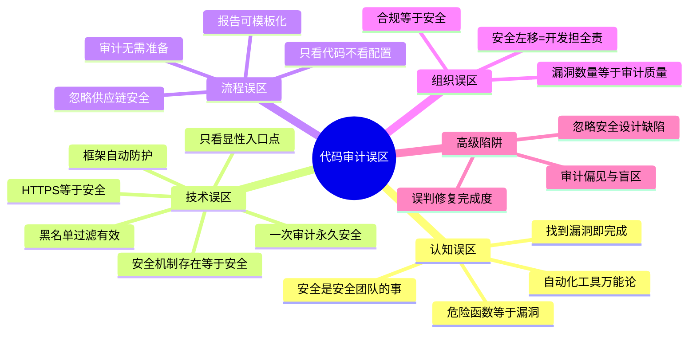
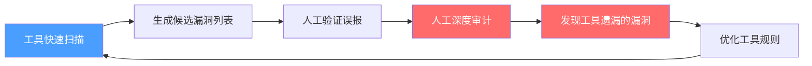
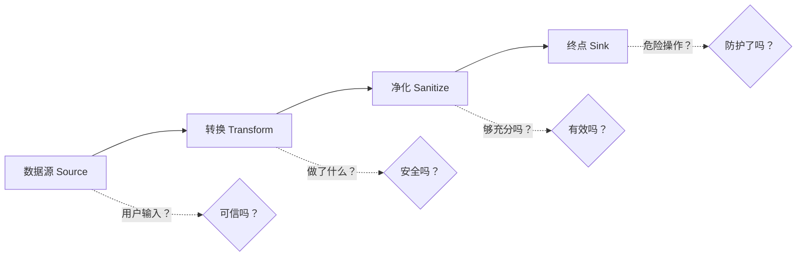
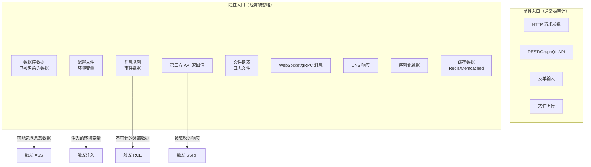
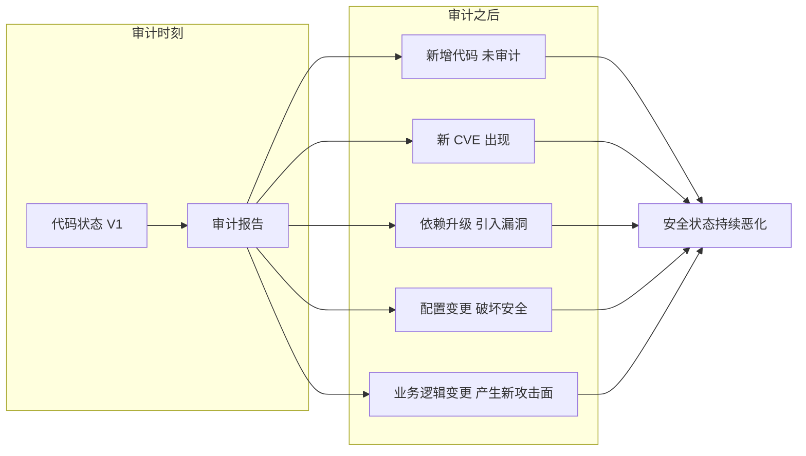
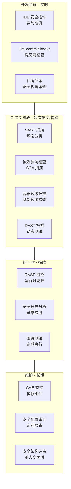
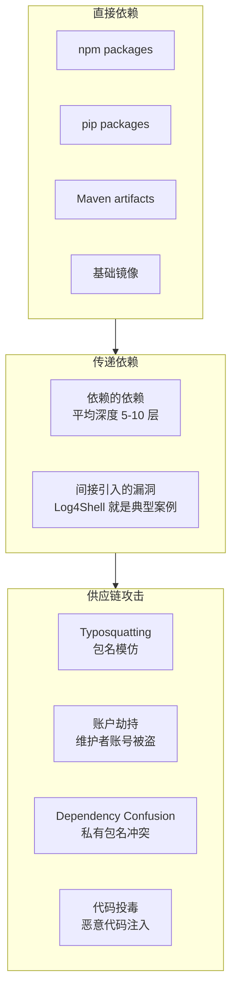
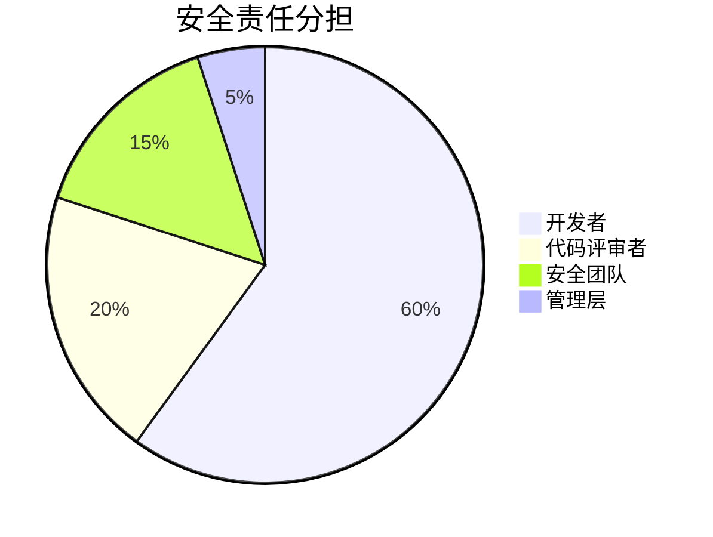
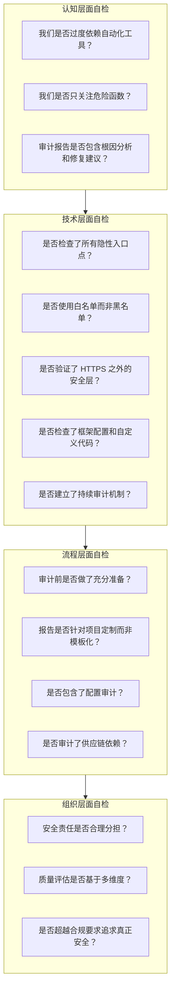
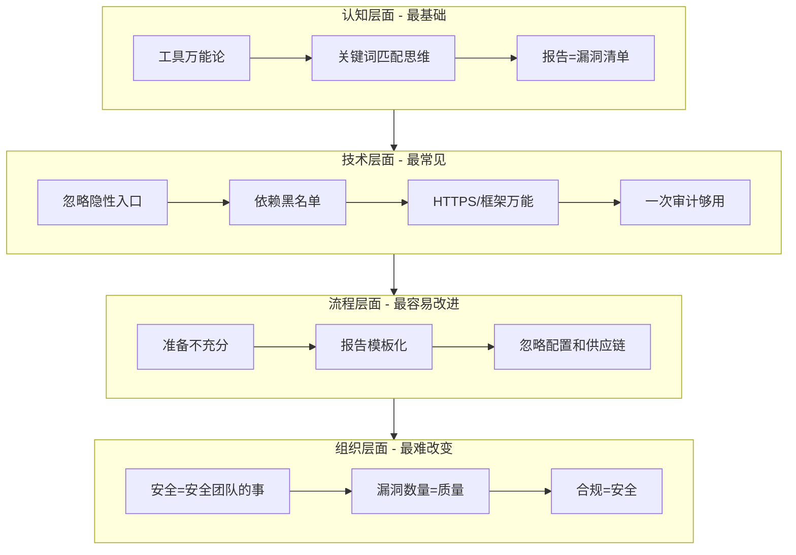

# 32.4 常见误区

代码审计中的误区不仅会导致漏洞遗漏，更会在团队中形成虚假的安全感——"我们做了审计"比"没做审计"更危险，因为它让人放松警惕。本节系统梳理代码审计中最常见的认知、技术、流程和组织层面的误区，分析每个误区的成因、危害和纠正方法，并通过真实案例说明为什么这些误区如此致命。



***

## 一、认知误区

认知误区是所有安全问题的根源——错误的认知导致错误的决策，错误的决策导致错误的流程，错误的流程导致真实的安全风险。纠变认知误区是提升审计质量的第一步。

### 1.1 "自动化工具可以替代人工审计"

这是代码审计中最普遍也最危险的误区。许多组织在采购了 SAST/DAST 工具后，认为"安全问题可以交给工具解决"，从而削减人工审计预算。

**误区成因分析**

| 成因 | 表现 | 真相 |
|------|------|------|
| 工具厂商营销话术 | "覆盖 OWASP Top 10"、"检测率 >95%" | 这些数字是在特定基准测试集上得出的，不代表真实项目 |
| 管理层成本考量 | "买工具比养安全团队便宜" | 工具只是辅助，不能替代专业人员的判断 |
| 开发团队的侥幸心理 | "有工具兜底，我可以不用关注安全" | 安全编码的责任不能外包给工具 |
| 量化指标的误导 | "我们扫描了100万行代码，发现500个问题" | 大量误报反而消耗团队精力，降低对真实漏洞的敏感度 |

**工具能力的客观数据**

| 指标 | SAST 工具表现 | 说明 |
|------|-------------|------|
| 误报率（False Positive） | 30%-70% | 行业平均约 50%，意味着一半的告警是无效的 |
| 漏报率（False Negative） | 50%-80% | 对逻辑漏洞的漏报率接近 100% |
| 已知模式匹配 | 优秀 | 对 strcpy/eval 等危险函数匹配准确率 >95% |
| 逻辑漏洞覆盖 | 极差 | 竞态条件、权限边界、业务逻辑缺陷几乎无法发现 |
| 跨函数数据流追踪 | 中等 | 可追踪简单数据流，复杂调用链容易丢失上下文 |

**工具擅长发现的漏洞类型**

- 已知危险函数调用（`strcpy`、`gets`、`eval`、`exec`）
- 简单的数据流漏洞（直接的 SQL 字符串拼接）
- 硬编码凭据和敏感信息（API Key、密码明文）
- 已知 CVE 模式的匹配（依赖组件版本比对）
- 不安全的加密算法使用（MD5、SHA1、DES）
- 缺少空指针检查、缓冲区未初始化

**工具无法发现的漏洞类型**

- 复杂的业务逻辑漏洞（竞态条件、TOCTOU、权限边界）
- 需要理解业务上下文的设计缺陷（批量赋值、IDOR）
- 多步骤攻击链中的组合漏洞（需要跨多个请求/接口的链式利用）
- 需要理解协议语义的深层漏洞（WebSocket 认证绕过、GraphQL 深度查询）
- 认证/授权体系的整体设计缺陷
- 第三方组件的配置安全问题

**真实案例：工具遗漏的高危漏洞**

2019 年 Capital One 数据泄露事件导致 1.06 亿用户数据外泄。漏洞根因是 WAF（Web 应用防火墙）的 SSRF 绕过 + IAM 权限配置错误。SAST 工具无法发现这类问题，因为它需要理解：(1) WAF 对 SSRF 的防护策略；(2) IAM 策略中的过度授权；(3) EC2 元数据服务的访问控制。这类需要理解基础设施配置和权限模型的漏洞，完全超出了 SAST 的能力范围。

2024 年 Polyfill.io 供应链事件更进一步说明了这一点：攻击者劫持了广泛使用的 JavaScript CDN Polyfill.io，向超过 10 万个网站注入恶意代码。没有任何 SAST 工具能检测这种运行时供应链攻击——它发生在代码交付之后，而非代码编写阶段。

**正确做法：人机协作模型**



具体工作流：

1. **工具预扫描**：使用 SAST 工具快速建立漏洞候选列表，标记高风险区域
2. **人工验证**：逐一验证工具发现的问题，过滤误报（通常可过滤 30%-50%）
3. **深度审计**：对关键模块进行人工审计，重点关注工具无法覆盖的逻辑漏洞
4. **规则优化**：根据审计结果优化工具规则和自定义检测逻辑
5. **迭代改进**：每次审计后更新工具配置，持续提高检测准确率

**工具选型建议**

| 场景 | 推荐工具类型 | 说明 |
|------|-------------|------|
| 开源项目 | Semgrep + Bandit | Semgrep 自定义规则灵活，Bandit 专注 Python 安全 |
| Java 企业应用 | Fortify / Checkmarx | 商业工具对 Java 生态支持最好 |
| 前端应用 | ESLint-security + Semgrep | JS/TS 生态的专用规则集 |
| 基础设施配置 | Checkov / tfsec | IaC（基础设施即代码）安全扫描 |
| 依赖安全 | Snyk / Dependabot | SCA（软件成分分析）专注供应链 |

### 1.2 "代码审计就是找危险函数"

初级审计人员最常见的误区是只关注危险函数调用（如 `eval`、`exec`、`system`），采用"关键词搜索"式的审计方法。这种方法会遗漏大量真正的安全问题。

**为什么关键词匹配不可靠**

```python
# 情况1：看似危险，实际安全（误报）
def safe_eval(expr: str):
    """eval 用在完全内部可控的常量映射上"""
    config_expr = {"max_size": "1024", "timeout": "30"}
    return eval(config_expr[expr])  # expr 来自内部枚举，用户不可控

# 情况2：看似安全，实际危险（漏报）
def process_data(data: dict):
    """没有使用任何'危险'函数，但存在水平越权"""
    user_id = data.get('user_id')
    order_id = data.get('order_id')
    # 未验证 order_id 是否属于当前用户
    order = db.query(f"SELECT * FROM orders WHERE id = {order_id}")
    return order

# 情况3：危险函数被包装，关键词搜索找不到（漏报）
def query(sql_template, **params):
    """ORM 底层封装，关键词搜索搜不到"""
    return db.execute(sql_template.format(**params))

def get_user(username):
    # 调用链：get_user → query → db.execute
    # 但关键词搜索只搜到了 query 函数，看不到 get_user 里的拼接
    return query("SELECT * FROM users WHERE name='{username}'")

# 情况4：危险操作通过间接方式触发
def build_command(user_input):
    """看似安全的字符串操作"""
    parts = ["echo", user_input.replace(";", "")]
    return " ".join(parts)  # 仍然可以注入：; rm -rf /

def run_script(command):
    """调用方看不到内部的危险操作"""
    os.system(command)  # 这里的 command 来自 build_command
```

**数据流分析才是核心方法**

审计必须追踪数据从源头到终点的完整路径：



审计检查四要素：

1. **Source（数据来源）**：数据是否用户可控？哪些输入点可以被攻击者控制？
2. **Transform（数据转换）**：数据经过了哪些处理？类型转换、编码、拼接等
3. **Sanitize（数据净化）**：数据是否经过充分验证和过滤？过滤是否可被绕过？
4. **Sink（危险终点）**：数据最终流向哪里？是否进入了危险操作（SQL、命令执行、文件操作等）

**审计思维转变：从"找函数"到"追数据流"**

| 旧思维 | 新思维 | 示例 |
|--------|--------|------|
| 搜索 `eval` 关键词 | 追踪 `user_input` 到 `eval` 的路径 | eval 的参数来源是否可控？ |
| 搜索 `exec` 关键词 | 分析命令字符串的构建过程 | 命令拼接是否经过安全处理？ |
| 搜索 SQL 关键字 | 从 HTTP 请求参数追到数据库查询 | 参数是否经过参数化处理？ |
| 搜索 `serialize` 关键词 | 分析序列化数据的来源和用途 | 反序列化对象的权限是否受控？ |

### 1.3 "找到了漏洞就完成了审计"

审计报告不等于漏洞清单。一份只列漏洞的报告，对团队的安全提升几乎没有帮助。

**不完整的审计报告**

```text
发现漏洞：
1. /api/users 存在 SQL 注入
2. /admin/config 存在 XSS
3. 密码使用 MD5 哈希
```

这种报告的问题：
- 没有说明漏洞的根因（为什么会出现这个漏洞？）
- 没有给出可操作的修复方案（怎么修？修到什么程度？）
- 没有分析系统性问题（是偶发还是模式性的？）
- 没有优先级排序（先修哪个？）
- 没有验证方法（怎么确认修好了？）

**完整的审计报告结构**

```text
审计报告
├── 1. 执行摘要（面向管理层）
│   ├── 审计范围、时间、方法论
│   ├── 整体风险评级（如：高/中/低）
│   ├── 关键发现摘要（3-5 条）
│   └── 紧急行动建议
│
├── 2. 架构安全评估
│   ├── 整体安全架构评价
│   ├── 信任边界分析
│   ├── 攻击面评估
│   └── 数据流安全分析
│
├── 3. 漏洞详情（按严重性排序）
│   └── 每个漏洞包含：
│       ├── 漏洞描述和影响范围
│       ├── 具体代码位置和上下文
│       ├── 漏洞利用方式（PoC）
│       ├── CVSS 评分和风险矩阵
│       ├── 根因分析（为什么会出这个问题？）
│       ├── 修复建议（含代码示例）
│       ├── 验证方法（怎么确认修好了？）
│       └── 类似问题排查建议（同类代码还有哪些？）
│
├── 4. 系统性安全改进建议
│   ├── 编码规范改进（哪些规范需要加强？）
│   ├── 架构安全优化（哪些设计需要调整？）
│   ├── 安全测试流程改进（测试覆盖哪些缺失？）
│   └── 安全培训建议（团队需要补哪些知识？）
│
└── 5. 附录
    ├── 工具扫描结果和配置
    ├── 审计检查清单和覆盖情况
    ├── 参考资料和标准
    └── 术语表
```

**报告质量对比示例**

| 维度 | 差的报告 | 好的报告 |
|------|---------|---------|
| 漏洞描述 | "存在 SQL 注入" | "在 `src/api/users.py` 第 45 行的 `search_users` 函数中，`keyword` 参数通过 f-string 直接拼接到 SQL 查询" |
| 影响分析 | "高危" | "攻击者可读取全部用户数据（约 50 万条记录），CVSS 8.6 (High)" |
| PoC | 无 | `GET /api/users/search?keyword=' UNION SELECT username,password FROM users--` |
| 修复建议 | "使用参数化查询" | "将 `f'SELECT ... WHERE name={keyword}'` 改为 `query.filter(User.name == bindparam('keyword'))`" |
| 验证方法 | 无 | "修复后发送 `keyword=' OR '1'='1`，应返回空结果或错误" |
| 根因分析 | 无 | "项目缺少 ORM 使用规范，30% 的查询仍使用字符串拼接" |

***

## 二、技术误区

技术误区直接导致审计中的盲区和误判。本节列出的技术误区涵盖了从输入处理到架构理解的各个层面，每个误区都经过了大量真实安全事件的验证。

### 2.1 "只看入口点就够了"

很多审计人员只关注 HTTP 接口和 API 端点等明显的入口点，忽略了大量非显性数据来源。

**入口点全景图**



**案例：数据库数据作为攻击源（存储型攻击链）**

```python
# 攻击路径：
# 1. 攻击者通过 SQL 注入在数据库中植入恶意 JavaScript
# 2. 普通用户访问页面时触发 XSS
# 3. 恶意脚本窃取用户的 session cookie

# 第一层：数据写入（入口可能在完全不同的接口）
def admin_update_bio(user_id, bio):
    # 管理员接口，未对 bio 内容做 HTML 转义
    db.execute("UPDATE users SET bio = ?", (bio,))

# 第二层：数据读取（触发点）
def public_profile(user_id):
    user = db.query("SELECT * FROM users WHERE id = ?", (user_id,))
    # 从数据库读取数据直接渲染到页面
    # bio 字段可能已被污染
    return render_template('profile.html', bio=user.bio)

# 第三层：模板渲染
# profile.html:
# <div class="bio">{{ bio }}</div>  ← 未转义，XSS 触发
```

**案例：消息队列数据作为攻击源**

```python
# 攻击路径：
# 1. 攻击者通过外部接口注入恶意消息到队列
# 2. 消费者进程读取消息并执行命令

# 生产者（正常业务）
def enqueue_report(report_data):
    """将报告数据放入消息队列"""
    queue.publish("reports", json.dumps(report_data))

# 消费者（安全问题）
def process_report(message):
    """处理报告——但消息来源不可信"""
    data = json.loads(message)
    # 攻击者可以向队列注入任意 JSON
    # data['template'] 可能是恶意值
    cmd = f"render --template {data['template']}"
    os.system(cmd)  # 命令注入！
```

审计启示：不仅要检查"用户输入 → 数据库"路径，还要检查"数据库 → 页面输出"路径。数据库中的每一份数据都应被视为潜在的不可信来源。消息队列、缓存、配置文件等同理——所有数据流经的节点都是潜在的攻击面。

### 2.2 "过滤了就安全了"

简单的黑名单过滤几乎总是可以被绕过。这是一个已被无数安全事件证实的铁律。

**SQL 注入过滤绕过全谱**

```python
def filter_sql(value):
    """典型的黑名单过滤——可被轻松绕过"""
    blacklist = ["'", '"', ";", "--", "/*"]
    for char in blacklist:
        if char in value:
            return ""
    return value

# 绕过方式汇总：
# 1. 编码绕过
#    URL编码：      %27 → '
#    Unicode编码：   ＇（全角单引号 U+FF07）
#    双重编码：     %2527 → %27 → '
#    数据库特有编码：CHAR(39) → '
#
# 2. 语法绕过
#    不使用引号的盲注：1 AND 1=1 → 1 AND 1=2
#    不使用分号的注入：利用 UNION、子查询等
#    MySQL特定：0x27（十六进制表示单引号）
#
# 3. 逻辑绕过
#    利用数据库隐式类型转换
#    利用空白符变体：%09(tab) %0a(LF) %0d(CR)
#    利用注释符替代：/*!50000UNION*/
```

**XSS 过滤绕过技术矩阵**

| 绕过技术 | 示例 | 说明 |
|---------|------|------|
| 标签替换 | `<svg onload=alert(1)>` | 不在黑名单中的标签 |
| 事件替换 | `<details open ontoggle=alert(1)>` | 不常见的事件处理器 |
| 大小写混合 | `<ScRiPt>alert(1)</ScRiPt>` | 简单的 `.lower()` 检查无效 |
| 嵌套标签 | `<scr<script>ipt>` | 删除 `<script>` 后形成新标签 |
| 编码绕过 | `&#97;lert(1)` | HTML 实体编码 |
| 协议绕过 | `<a href="data:text/html,...">` | data URI、vbscript 等 |
| CSS 表达式 | `<div style="width:expression(alert(1))">` | IE 特有的 CSS 表达式 |
| 字符编码 | `<a href="&#x6A;avascript:...">` | 十六进制 HTML 实体 |

**路径遍历过滤绕过**

```python
# 简单的 ".." 过滤
def filter_path(value):
    if ".." in value:
        return ""
    return value

# 绕过方式：
# ....// → 去除 ../ 后变成 ../
# %2e%2e%2f → URL 编码
# ..%00/ → 空字节截断（老版本 PHP/Java）
# ..;/ → Tomcat 特定绕过（CVE-2007-0450）
# ..%c0%af → IIS Unicode 编码绕过
# ....[大量./].... → 目录遍历（利用操作系统路径规范化）
```

**正确做法：白名单 + 编码 + 参数化**

```python
import re
from markupsafe import escape

# 原则1：白名单验证（只允许已知安全的输入）
def validate_username(username: str) -> str:
    """用户名：只允许字母、数字、下划线，3-20字符"""
    if not re.match(r'^[a-zA-Z0-9_]{3,20}$', username):
        raise ValidationError("用户名格式不正确")
    return username

def validate_integer(value, min_val=0, max_val=2**31-1) -> int:
    """整数：严格类型检查"""
    try:
        num = int(value)
        if not (min_val <= num <= max_val):
            raise ValueError("数值超出范围")
        return num
    except (ValueError, TypeError):
        raise ValidationError("无效的整数")

# 原则2：输出编码（根据输出上下文选择编码方式）
def render_user_content(content: str) -> str:
    """HTML 上下文输出编码"""
    return escape(content)  # 自动转义 <, >, &, ', "

def json_response(data: dict) -> str:
    """JSON 上下文：使用安全的 JSON 库"""
    return json.dumps(data, ensure_ascii=False)  # 自动处理特殊字符

# 原则3：参数化查询（永远不要拼接 SQL）
def search_users(keyword: str):
    """使用 ORM 参数化查询"""
    return User.query.filter(
        User.name.ilike(bindparam('keyword'))
    ).params(keyword=f'%{keyword}%')
```

**过滤策略对比**

| 策略 | 安全性 | 可维护性 | 适用场景 |
|------|--------|---------|---------|
| 黑名单过滤 | 极低 | 低（需不断更新） | 不推荐 |
| 白名单验证 | 高 | 高（规则稳定） | 输入验证首选 |
| 输出编码 | 高 | 高 | 所有输出点 |
| 参数化查询 | 极高 | 极高 | 所有数据库操作 |
| WAF 规则 | 中等 | 中等 | 纵深防御辅助层 |

### 2.3 "HTTPS 就是安全的"

HTTPS 只保护传输层安全（防止中间人窃听和篡改），完全不解决应用层安全问题。

**HTTPS 能防和不能防的威胁**

| 威胁类型 | HTTPS 能防？ | 说明 |
|---------|------------|------|
| 中间人窃听 | ✅ | 加密传输内容 |
| 中间人篡改 | ✅ | TLS 完整性校验 |
| SQL 注入 | ❌ | HTTPS 不保护数据库查询 |
| XSS | ❌ | HTTPS 不阻止恶意脚本执行 |
| CSRF | ❌ | HTTPS 不验证请求来源 |
| 业务逻辑漏洞 | ❌ | HTTPS 不影响应用逻辑 |
| 访问控制缺陷 | ❌ | HTTPS 不验证用户权限 |
| 暴力破解 | ❌ | HTTPS 不限制登录尝试 |
| 文件上传漏洞 | ❌ | HTTPS 不检查文件内容 |
| 服务端请求伪造 | ❌ | HTTPS 不限制出站请求 |

**完整安全方案的分层防护模型**

```python
def secure_api_endpoint(request):
    """每层防护解决不同的安全问题"""
    
    # 第1层：传输安全（HTTPS解决）
    # TLS 1.2+，证书校验，HSTS
    
    # 第2层：认证（HTTPS无法替代）
    user = authenticate(request)
    if not user:
        return Response(status=401)
    
    # 第3层：授权（HTTPS无法替代）
    if not authorize(user, request.path, request.method):
        return Response(status=403)
    
    # 第4层：输入验证（HTTPS无法替代）
    data = validate_input(request.data, schema=ENDPOINT_SCHEMA[request.path])
    
    # 第5层：CSRF保护（HTTPS无法替代）
    verify_csrf_token(request)
    
    # 第6层：业务逻辑处理（HTTPS无法替代）
    result = process_business_logic(data, user)
    
    # 第7层：安全响应头（HTTPS无法替代）
    response = make_response(result)
    response.headers.update({
        'X-Content-Type-Options': 'nosniff',
        'X-Frame-Options': 'DENY',
        'Content-Security-Policy': "default-src 'self'",
        'Strict-Transport-Security': 'max-age=31536000; includeSubDomains',
        'Referrer-Policy': 'strict-origin-when-cross-origin',
    })
    
    return response
```

**HTTPS 配置本身的常见陷阱**

即使启用了 HTTPS，配置不当也会削弱安全性：

| 问题 | 影响 | 修复 |
|------|------|------|
| 允许 TLS 1.0/1.1 | BEAST、POODLE 攻击 | 仅允许 TLS 1.2+ |
| 使用弱密码套件 | 可被暴力破解 | 仅允许 AEAD 密码套件 |
| 未启用 HSTS | 首次访问仍可被降级 | 设置 max-age ≥ 1 年 |
| 证书链不完整 | 客户端验证失败 | 配置完整的证书链 |
| 混合内容（HTTP + HTTPS） | 部分内容仍可被窃听 | 全站 HTTPS + CSP 升级 |

### 2.4 "框架自动防护就够了"

现代框架（Spring Security、Django、Rails）提供了大量安全防护，但框架的设计目标是防御常见攻击模式，而非替代安全设计。

**框架能防和不能防的漏洞**

```python
# ===== 框架能自动防护的 =====

# Django ORM：自动参数化查询，防 SQL 注入
User.objects.filter(username=username)  # ✅ 安全

# Django 模板：默认 HTML 转义，防 XSS
# {{ user_input }} → 自动转义为 &lt; &gt; 等  ✅ 安全

# Django CSRF Middleware：自动 CSRF 防护
#  → 自动生成和校验 token  ✅ 安全

# ===== 框架无法自动防护的 =====

# 1. 水平越权（IDOR）
def view_order(request, order_id):
    order = Order.objects.get(id=order_id)  # ORM 查询是安全的
    # 但未验证 order 是否属于当前用户！框架无法知道业务规则
    return render(request, 'order.html', {'order': order})

# 2. 竞态条件（TOCTOU）
def transfer_money(from_account, to_account, amount):
    balance = Account.objects.get(id=from_account).balance
    # 在检查余额和扣款之间，可能有并发请求也通过了余额检查
    # 框架的 ORM 操作是原子的，但业务逻辑检查不是
    if balance >= amount:
        Account.objects.filter(id=from_account).update(
            balance=F('balance') - amount)

# 3. 批量赋值（Mass Assignment）
def update_user(request, user_id):
    user = User.objects.get(id=user_id)
    # 框架没有自动过滤字段的机制（除非显式配置）
    for key, value in request.POST.items():
        setattr(user, key, value)  # 攻击者可设置 is_admin=True
    user.save()

# 4. 不安全的反序列化
def load_session(data):
    # 使用 pickle 反序列化不受信数据
    # 框架无法阻止开发者使用不安全的序列化方式
    return pickle.loads(data)

# 5. 业务逻辑缺陷
def apply_coupon(order, coupon_code):
    coupon = Coupon.objects.get(code=coupon_code)
    # 框架不知道优惠券是否只能用一次
    # 框架不知道优惠券是否适用于该商品类别
    # 这些都是业务规则，需要开发者自己实现
    order.apply_discount(coupon.discount)
```

**框架安全配置的常见遗漏**

即使使用了框架的安全功能，配置不当同样会导致安全问题：

| 配置项 | 常见错误 | 正确配置 |
|-------|---------|---------|
| CSRF 保护 | API 接口未启用 CSRF | 所有状态变更接口启用 |
| Session 安全 | Cookie 未设置 HttpOnly | `SESSION_COOKIE_HTTPONLY = True` |
| CORS | 设置为 `Allow: *` | 限制为已知域名列表 |
| DEBUG 模式 | 生产环境开启 DEBUG | `DEBUG = False` |
| SECRET_KEY | 使用默认或弱密钥 | 随机生成 50+ 字符密钥 |
| 数据库连接 | 使用 root/DBA 权限 | 最小权限原则 |

**框架安全功能覆盖矩阵**

| 安全领域 | Django | Spring Security | Rails | Express.js |
|---------|--------|----------------|-------|------------|
| SQL 注入防护 | ORM 自动参数化 | JPA/Hibernate 参数化 | ActiveRecord 参数化 | 需手动使用参数化 |
| XSS 防护 | 模板自动转义 | Thymeleaf 自动转义 | ERB 需手动 escape | 需使用 Helmet + 模板引擎 |
| CSRF 防护 | 中间件自动 | 需配置 | 令牌验证需手动启用 | 需使用 csurf 中间件 |
| 认证系统 | 内置 auth 模块 | 完整认证框架 | Devise gem | 需使用 Passport.js |
| 授权控制 | 内置权限系统 | 基于角色的访问控制 | Pundit/Cancancan | 需手动实现 |

### 2.5 "审计一次就够了"

代码审计不是一次性活动，而是一个持续的过程。一次性审计只能代表审计时刻的安全状态。

**一次性审计的局限**



**持续安全审计体系**



**审计频率建议**

| 审计类型 | 频率 | 触发条件 |
|---------|------|---------|
| IDE 实时检查 | 实时 | 每次代码保存 |
| Pre-commit 钩子 | 每次提交 | git commit |
| SAST 扫描 | 每次构建 | CI/CD pipeline |
| 依赖漏洞扫描 | 每日 | 定时任务 + 每次构建 |
| 完整人工审计 | 每季度 | 定期执行 |
| 渗透测试 | 每半年 | 定期 + 重大发布前 |
| 架构安全评审 | 按需 | 重大架构变更时 |

***

## 三、流程误区

流程误区看似影响不大，但会导致审计效率低下、报告质量差、遗漏关键风险。好的流程是高质量审计的基础。

### 3.1 "审计不需要准备"

大量审计项目失败的原因不是技术能力不足，而是准备工作不充分。审计员花了一半时间在"获取代码"和"搭建环境"上。

**审计准备检查清单**

```text
审计前准备
├── 信息收集
│   ├── [ ] 获取完整源代码（包括所有子模块和依赖）
│   ├── [ ] 获取架构设计文档和系统架构图
│   ├── [ ] 获取 API 文档和接口规范
│   ├── [ ] 了解技术栈、框架版本和语言版本
│   ├── [ ] 了解部署架构（单体/微服务/Serverless）
│   └── [ ] 获取历史安全事件和之前的审计报告
│
├── 范围界定
│   ├── [ ] 确定审计范围（哪些模块、哪些接口）
│   ├── [ ] 确定审计优先级（高风险模块优先）
│   ├── [ ] 确定审计方法（白盒/灰盒/黑盒）
│   ├── [ ] 确定时间安排和里程碑
│   └── [ ] 确定不在范围内的内容（第三方库/基础设施）
│
├── 环境搭建
│   ├── [ ] 搭建本地开发/测试环境
│   ├── [ ] 配置 SAST/DAST 工具
│   ├── [ ] 准备漏洞验证环境（非生产环境）
│   └── [ ] 准备数据脱敏方案（如需审计生产数据）
│
└── 沟通准备
    ├── [ ] 确认沟通机制（定期会议、即时通讯、邮件）
    ├── [ ] 确认报告格式和交付标准
    ├── [ ] 确认保密协议和法律合规要求
    ├── [ ] 确认漏洞通报流程（发现高危漏洞如何上报）
    └── [ ] 确认开发团队对接人（需要代码解释时联系谁）
```

**审计时间分配建议**

| 阶段 | 占比 | 常见错误 |
|------|------|---------|
| 准备阶段 | 15%-20% | 跳过或压缩，导致后续返工 |
| 信息收集与分析 | 10%-15% | 不了解业务逻辑就开始审代码 |
| 工具扫描 | 5%-10% | 过度依赖工具，忽略人工验证 |
| 人工审计 | 40%-50% | 核心阶段，不可压缩 |
| 报告编写 | 15%-20% | 报告质量直接决定审计价值 |
| 沟通与修复验证 | 5%-10% | 只报告不跟踪修复 |

### 3.2 "审计报告可以模板化"

审计报告有标准结构，但内容必须针对具体项目定制。模板化的报告无法反映项目的真实安全状况。

**好报告 vs 差报告的本质区别**

差的报告告诉读者"有什么问题"，好的报告告诉读者"为什么有问题"、"怎么修"以及"如何防止再犯"。

**差的报告示例：**

```text
发现漏洞：
1. SQL 注入 - 高危
2. XSS - 中危
3. 使用 MD5 - 低危
建议：修复上述漏洞。
```

**好的报告示例：**

```text
漏洞：SQL 注入
位置：src/api/users.py 第 45 行 search_users 函数
严重性：CVSS 8.6 (High)

问题描述：
keyword 参数通过 f-string 直接拼接到 SQL 查询中，
未使用参数化查询或 ORM 过滤。

漏洞代码：
  query = f"SELECT * FROM users WHERE name LIKE '%{keyword}%'"

攻击方式：
  GET /api/users/search?keyword=' UNION SELECT username,password FROM users--
  可读取全部用户数据（约 50 万条记录）

根因分析：
  项目缺少 ORM 使用规范，约 30% 的数据库查询仍使用字符串拼接。
  主要集中在 src/api/ 目录下的旧代码中。

修复方案：
  1. 立即修复：将上述代码改为参数化查询
     User.query.filter(User.name.ilike(bindparam('keyword')))
  2. 系统性修复：对 src/api/ 目录下的所有字符串拼接查询进行重构
  3. 预防措施：在 CI 中启用 bandit/flake8-bandit 规则，
     禁止 f-string 中包含 SQL 关键字

验证方法：
  修复后发送 GET /api/users/search?keyword=' OR '1'='1
  应返回空结果或错误，而非所有用户数据。
```

### 3.3 "只关注代码，忽略配置"

安全配置错误是 OWASP Top 10 中的独立类别（A05:2021 - Security Misconfiguration），但经常在代码审计中被忽略。

**配置安全审计清单**

```text
配置安全审计
├── Web 服务器配置
│   ├── [ ] 是否禁用目录列表
│   ├── [ ] 是否移除默认页面和管理后台路径
│   ├── [ ] 是否配置安全响应头（HSTS、CSP、X-Frame-Options）
│   ├── [ ] 是否限制请求体大小和超时时间
│   └── [ ] 是否禁用不必要的 HTTP 方法（TRACE、OPTIONS）
│
├── 数据库配置
│   ├── [ ] 是否使用最小权限应用账户（非 root/DBA）
│   ├── [ ] 是否禁用远程 root 登录
│   ├── [ ] 是否启用审计日志
│   ├── [ ] 是否加密存储敏感数据（密码、密钥、PII）
│   └── [ ] 是否限制数据库监听地址（绑定内网 IP）
│
├── 应用配置
│   ├── [ ] 是否关闭调试模式（DEBUG=False）
│   ├── [ ] 是否使用强随机密钥（SECRET_KEY）
│   ├── [ ] 是否配置正确的 CORS 策略
│   ├── [ ] 是否限制文件上传类型和大小
│   ├── [ ] 是否配置 Session 超时和安全属性
│   └── [ ] 是否移除测试用的默认账户和密码
│
├── 容器/云配置
│   ├── [ ] 是否使用非 root 用户运行容器
│   ├── [ ] 是否最小化基础镜像（去掉不必要的工具）
│   ├── [ ] 是否限制容器网络访问（网络策略）
│   ├── [ ] 是否正确管理密钥（不硬编码、使用 Secret Manager）
│   └── [ ] 是否设置了资源限制（CPU、内存、磁盘）
│
└── CI/CD 配置
    ├── [ ] 是否对 CI/CD 流水线访问做了最小权限控制
    ├── [ ] 是否在 CI 中集成了安全扫描步骤
    ├── [ ] 是否对部署密钥做了安全存储
    └── [ ] 是否禁止了 CI 环境中的特权操作
```

**真实的配置漏洞案例**

- **2017 年 Uber 数据泄露**：AWS S3 存储桶配置为公开访问，5700 万用户数据泄露
- **2019 年 Facebook 数据泄露**：Elasticsearch 服务器未设密码，2.67 亿用户数据暴露
- **2021 年 LinkedIn 数据泄露**：API 未做速率限制，7 亿用户数据被爬取
- **2023 年 Toyota**：云环境配置错误，296 万车主信息泄露长达 10 年

这些都不是代码漏洞，而是配置问题——代码审计如果不审配置，就会遗漏这些高危风险。

### 3.4 "只看应用代码，忽略供应链"

现代应用 80%-90% 的代码来自第三方依赖。只审计自己写的代码而忽略供应链安全，等于只审计了冰山一角。

**供应链安全风险全景**



**供应链安全审计要点**

```python
# 1. 依赖清单审计
# 查看所有直接和传递依赖
# npm: npm ls --all
# pip: pip-audit / safety check
# maven: mvn dependency:tree

# 2. 许可证合规检查
# 确保没有引入不兼容的许可证（GPL、AGPL等）
# npm: license-checker
# pip: pip-licenses

# 3. 依赖锁定
# 确保使用 lock 文件锁定依赖版本
# package-lock.json / poetry.lock / Pipfile.lock
# 避免 ^ 或 ~ 版本范围导致的意外升级

# 4. 依赖更新策略
# 定期更新依赖（每月至少一次）
# 使用 Dependabot / Renovate 自动创建更新 PR
# 更新前必须运行测试套件

# 5. 私有依赖保护
# 使用 scope/package namespace 防止 Dependency Confusion
# npm: @company/package
# pip: 私有 PyPI 源配置
```

**真实供应链攻击案例**

| 事件 | 年份 | 攻击方式 | 影响 |
|------|------|---------|------|
| event-stream | 2018 | 维护者转让恶意接管 | 窃取 Copay 钱包私钥 |
| ua-parser-js | 2021 | 账户劫持注入挖矿代码 | 800万周下载量受影响 |
| Log4Shell | 2021 | 框架漏洞影响所有依赖者 | CVSS 10.0，全球影响 |
| colors.js/faker.js | 2022 | 维护者主动投毒 | 无限循环导致项目崩溃 |
| node-ipc | 2023 | 维护者注入政治代码 | 破坏特定地区用户文件 |
| Polyfill.io | 2024 | CDN 域名劫持 | 10万+网站注入恶意脚本 |

***

## 四、组织误区

组织误区是最难改变但影响最深远的。它们根植于组织文化、激励机制和权力结构中，需要管理层的持续推动才能扭转。

### 4.1 "安全是安全团队的事"

将安全责任完全推给安全团队，是组织层面最严重的误区。安全团队无法审查每一行代码——在一个有 100 名开发者的团队中，安全团队通常只有 2-5 人。

**安全责任分担模型**



| 角色 | 安全职责 | 占比 |
|------|---------|------|
| 开发者 | 安全编码、单元测试中的安全用例、代码自审 | 60% |
| 代码评审者 | PR 中的安全审查、安全模式识别 | 20% |
| 安全团队 | 架构评审、渗透测试、安全工具管理、安全培训 | 15% |
| 管理层 | 安全预算、安全文化、安全优先级决策 | 5% |

**推动安全左移的实践**

1. **安全冠军计划**：在每个开发团队中培养 1-2 名"安全冠军"，接受额外的安全培训，负责团队内的安全知识传播
2. **安全编码规范**：建立并维护团队的安全编码规范，定期更新
3. **安全代码评审**：将安全检查纳入代码评审流程的必检项
4. **安全培训**：定期为开发团队提供安全培训，内容针对项目实际使用的技术栈
5. **安全门禁**：在 CI/CD 流水线中设置安全检查门禁，不通过则无法合并

### 4.2 "漏洞数量等于审计质量"

用发现的漏洞数量来衡量审计质量，会导致审计员倾向于报告低风险问题而忽略深层的架构缺陷。

**正确的质量评估维度**

| 评估维度 | 说明 | 权重 |
|---------|------|------|
| 覆盖率 | 审计了多少代码、多少模块？ | 25% |
| 深度 | 是否发现了深层逻辑漏洞和架构缺陷？ | 30% |
| 可操作性 | 报告中的修复建议是否具体、可执行？ | 25% |
| 误报率 | 报告的问题中有多少是真实的？ | 10% |
| 时效性 | 审计报告是否及时交付？ | 10% |

**错误的KPI及其后果**

| 错误KPI | 导致的扭曲行为 |
|---------|---------------|
| "发现漏洞数" | 审计员倾向于报告大量低风险问题来凑数 |
| "代码扫描行数" | 只扫描容易的模块，回避复杂的业务逻辑 |
| "修复率" | 开发团队只修复容易的问题，忽略深层缺陷 |
| "审计耗时" | 压缩审计时间，牺牲审计质量 |

### 4.3 "合规等于安全"

通过合规审计（如 PCI DSS、等保测评）不等于系统是安全的。合规检查的是"最低标准"，而真正的安全需要超越合规。

**合规 vs 安全**

| 合规要求 | 安全现实 |
|---------|---------|
| 使用加密传输（TLS） | 但不检查是否使用了安全的 TLS 版本和密码套件 |
| 密码长度 ≥ 8 位 | 但不检查是否实施了密码强度策略和泄露密码检查 |
| 有访问控制机制 | 但不检查访问控制是否完整覆盖了所有接口 |
| 有日志记录 | 但不检查日志是否包含安全事件、是否有异常检测 |
| 通过漏洞扫描 | 但不检查扫描工具的配置和覆盖范围 |
| 有安全策略文档 | 但不检查策略是否被实际执行 |

**真实案例：合规但不安全**

2020 年 SolarWinds 供应链攻击中，SolarWinds 通过了 SOC 2 Type II、ISO 27001 等多项合规认证，但其构建环境被攻击者渗透，导致 Orion 平台被植入后门代码。这说明合规审计检查的是流程和文档，而非代码层面的真实安全性。

***

## 五、高级误区与深层陷阱

高级误区往往隐藏在看似合理的安全实践背后，需要深入的安全理解才能识别。这些陷阱在初级和中级审计人员中尤为常见。

### 5.1 "安全机制存在就等于安全"

许多开发者认为"我已经加了鉴权/加密/校验"就安全了，但安全机制的实现质量决定了它是否真正有效。

**"存在但无效"的安全机制示例**

```python
# 1. JWT 验证存在但实现有缺陷
def verify_jwt(token):
    # 接受 none 算法（CVE-2015-9235）
    # 没有验证 issuer 和 audience
    # 没有检查过期时间
    return jwt.decode(token, algorithms=["HS256", "none"])

# 2. 速率限制存在但可绕过
def login(request):
    # 基于 IP 的速率限制
    # 但攻击者可以通过 X-Forwarded-For 绕过
    ip = request.headers.get('X-Forwarded-For', request.remote_addr)
    if rate_limit_exceeded(ip):
        return "Too many requests"
    # ...

# 3. 权限检查存在但不完整
def admin_api(request):
    if not request.user.is_admin:
        return 403
    # 但没有检查资源级别的权限
    # 管理员 A 可以访问管理员 B 租户的数据
    data = get_data(request.GET['tenant_id'])
    return data

# 4. 输入校验存在但校验点不对
def upload_avatar(request):
    # 在前端校验了文件类型
    # 但后端只检查了 Content-Type，没有检查文件实际内容
    if request.content_type not in ['image/jpeg', 'image/png']:
        return 400
    # 攻击者可以发送 Content-Type: image/jpeg 的 .php 文件
    save_file(request.body)
```

**安全机制有效性检查矩阵**

| 安全机制 | 常见缺陷 | 有效实现要点 |
|---------|---------|-------------|
| JWT 认证 | 接受 none 算法、不验证签名 | 指定算法白名单、验证 issuer/audience、检查过期 |
| 速率限制 | 基于可伪造的 IP | 使用服务端真实 IP、多维度限流（IP+用户+接口） |
| 权限检查 | 只检查角色不检查资源 | 实现 ABAC/RBAC + 资源级权限 |
| 输入校验 | 只检查 Content-Type | 检查文件魔数（Magic Bytes）、深度解析内容 |
| 加密存储 | 使用 ECB 模式、固定 IV | 使用 AES-GCM、随机 IV、密钥轮换 |
| 会话管理 | Session ID 可预测、不过期 | 使用安全随机数、设置合理过期时间 |

### 5.2 "审计只看安全漏洞，忽略安全设计缺陷"

审计不应只关注具体的代码漏洞（如 SQL 注入、XSS），还应评估整体安全架构设计。

**常见的安全设计缺陷**

| 设计缺陷 | 说明 | 风险等级 | 示例 |
|---------|------|---------|------|
| 缺乏最小权限原则 | 每个服务/用户拥有超出所需的权限 | 高 | 数据库账户使用 DBA 权限连接应用 |
| 无纵深防御 | 单点防护失败即全线崩溃 | 高 | 只依赖前端校验，后端无任何防护 |
| 缺乏安全默认值 | 新功能默认开放而非默认关闭 | 中 | 新创建的 API 默认公开访问 |
| 缺乏审计追踪 | 关键操作无日志记录 | 高 | 用户删除操作无日志，无法追溯 |
| 密钥管理混乱 | 密钥硬编码、无轮换机制 | 高 | 数据库密码写在代码中提交到 Git |
| 缺乏密钥分离 | 开发/测试/生产使用相同密钥 | 中 | 测试环境的 API Key 可用于生产 |
| 无故障安全机制 | 异常情况下的安全行为未定义 | 中 | 数据库连接失败时默认放行请求 |
| 缺乏安全编码标准 | 团队无统一的安全编码规范 | 高 | 不同开发者用不同方式处理用户输入 |

### 5.3 "审计偏见与盲区"

即使是经验丰富的审计人员也会受到认知偏见的影响，导致系统性地遗漏某些类型的漏洞。

**常见的审计偏见**

| 偏见类型 | 表现 | 后果 |
|---------|------|------|
| 确认偏见 | 只关注已知漏洞模式，忽略异常代码行为 | 遗漏新型攻击向量 |
| 锚定效应 | 第一个发现的问题影响后续判断 | 高估某类漏洞，低估其他类型 |
| 幸存者偏差 | 只审计存活的代码，忽略已删除但仍有残留的逻辑 | 遗漏遗留代码中的安全问题 |
| 功能偏见 | 对安全功能投入过多精力，对业务逻辑审计不足 | 业务逻辑漏洞被遗漏 |
| 工具依赖偏见 | 过度信任工具结果，减少人工分析 | 工具盲区成为审计盲区 |
| 新鲜感偏见 | 对新技术/框架过度关注，忽略旧系统的安全风险 | 遗留系统中的高危漏洞被忽略 |

**克服审计偏见的方法**

1. **多人交叉审计**：同一代码由不同审计人员分别审计，交叉验证结果
2. **检查清单驱动**：使用标准化检查清单，避免遗漏特定类别的漏洞
3. **盲审机制**：在不了解前次审计结果的情况下进行独立审计
4. **定期回顾**：分析过去审计遗漏的漏洞，识别系统性盲区
5. **外部审计**：定期引入外部审计团队，带来新的视角和方法论

### 5.4 "修复验证只是重新测试"

修复验证不仅是确认漏洞不再存在，更要确认修复本身没有引入新的安全问题。

**修复引入新漏洞的真实案例**

```python
# 原始漏洞：SQL 注入
def search_users(keyword):
    query = f"SELECT * FROM users WHERE name LIKE '%{keyword}%'"
    return db.execute(query)

# "修复"方案：使用字符串转义
def search_users(keyword):
    safe_keyword = keyword.replace("'", "''")  # 看似修复了注入
    query = f"SELECT * FROM users WHERE name LIKE '%{safe_keyword}%'"
    return db.execute(query)

# 问题：仍然不安全！
# 攻击者可以使用 \ 转义 ' 的替换：
# keyword = \' OR 1=1 --
# 替换后：\\' OR 1=1 --
# 这在某些数据库配置下仍然可以注入

# 正确的修复：
def search_users(keyword):
    return db.execute(
        "SELECT * FROM users WHERE name LIKE :keyword",
        {"keyword": f"%{keyword}%"}
    )
```

**修复验证检查清单**

```text
修复验证
├── [ ] 漏洞本身是否已修复（复现原始攻击路径，确认无法利用）
├── [ ] 修复是否引入新的安全问题（检查修复代码的安全性）
├── [ ] 修复是否影响正常功能（运行功能测试用例）
├── [ ] 修复的代码是否符合编码规范
├── [ ] 是否对同类问题进行了全面排查（全局搜索相同模式）
├── [ ] 是否更新了相关的安全规则（SAST 工具规则、CI 检查）
├── [ ] 是否更新了安全文档和编码规范
└── [ ] 是否记录了修复过程和经验教训
```

***

## 六、误区自检清单

以下是团队在进行代码审计时的自检清单，定期回顾可以有效避免常见误区。



**快速自测：你的审计实践处于哪个阶段？**

| 阶段 | 特征 | 对应误区 |
|------|------|---------|
| 初级（L1） | 只用工具扫描，报告只列漏洞 | 1.1, 1.2, 1.3 |
| 中级（L2） | 人工+工具结合，但忽略配置和供应链 | 2.1-2.5, 3.3, 3.4 |
| 高级（L3） | 全面审计，但缺乏持续机制 | 3.1, 3.2, 4.1 |
| 成熟（L4） | 持续审计+安全左移+组织文化 | 4.2, 4.3, 5.1-5.4 |

***

## 七、本节小结

代码审计中的误区可以归纳为四个层面：



**避免误区的核心原则**

1. **保持对工具的正确期望**：工具是助手不是替代品，人机结合才能达到最佳效果
2. **深入理解数据流**：不停留在表面的函数调用，追踪数据从 Source 到 Sink 的完整路径
3. **建立系统化流程**：从准备到执行到报告到跟踪，每个环节都有标准和检查点
4. **持续迭代改进**：审计不是一次性的，而是持续安全工程的一部分
5. **关注安全设计**：不仅找漏洞，更评估架构和设计的安全性
6. **培养安全文化**：安全是每个人的责任，不是某个团队的专利
7. **验证修复质量**：修复后重新审计，确认没有引入新问题
8. **克服认知偏见**：多人交叉审计、检查清单驱动、定期回顾

**误区纠正优先级**

| 优先级 | 误区类型 | 纠正难度 | 影响程度 | 建议行动 |
|--------|---------|---------|---------|---------|
| P0 | 工具万能论 | 低 | 极高 | 立即引入人工审计流程 |
| P0 | 只看危险函数 | 低 | 高 | 培训数据流分析方法 |
| P1 | 忽略供应链 | 中 | 高 | 部署 SCA 工具 + 依赖锁定 |
| P1 | 忽略配置审计 | 中 | 高 | 将配置检查纳入审计清单 |
| P2 | 安全责任集中 | 高 | 极高 | 建立安全冠军计划 |
| P2 | 合规即安全 | 高 | 高 | 设定超越合规的安全目标 |
| P3 | 审计偏见 | 高 | 中 | 多人交叉审计机制 |

审计的价值不在于发现多少漏洞，而在于帮助组织建立起持续改进的安全能力。每一个被纠正的误区，都是组织安全成熟度提升的一步。
