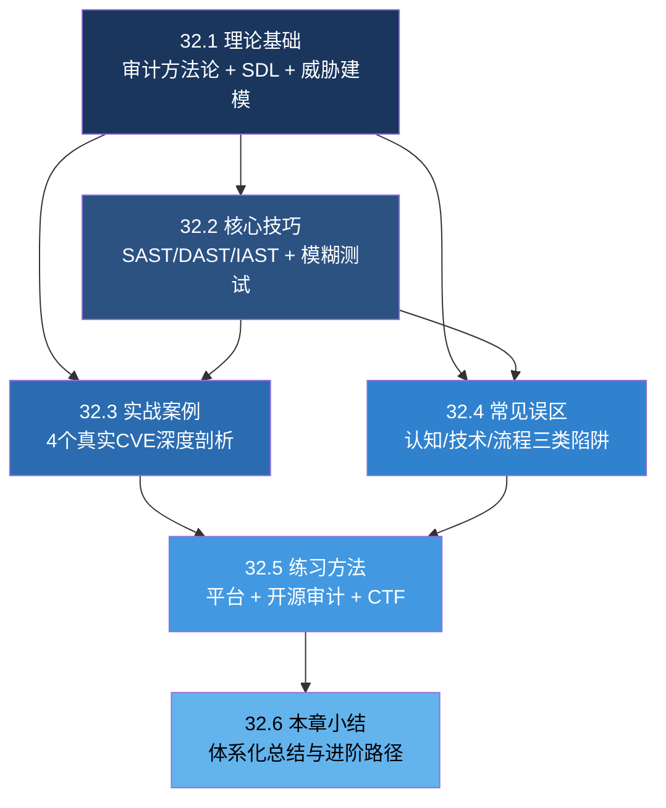
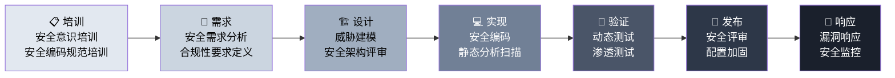
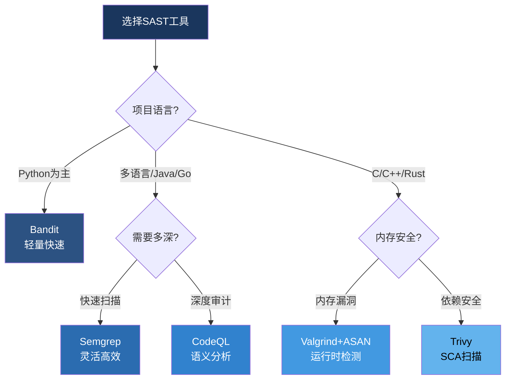
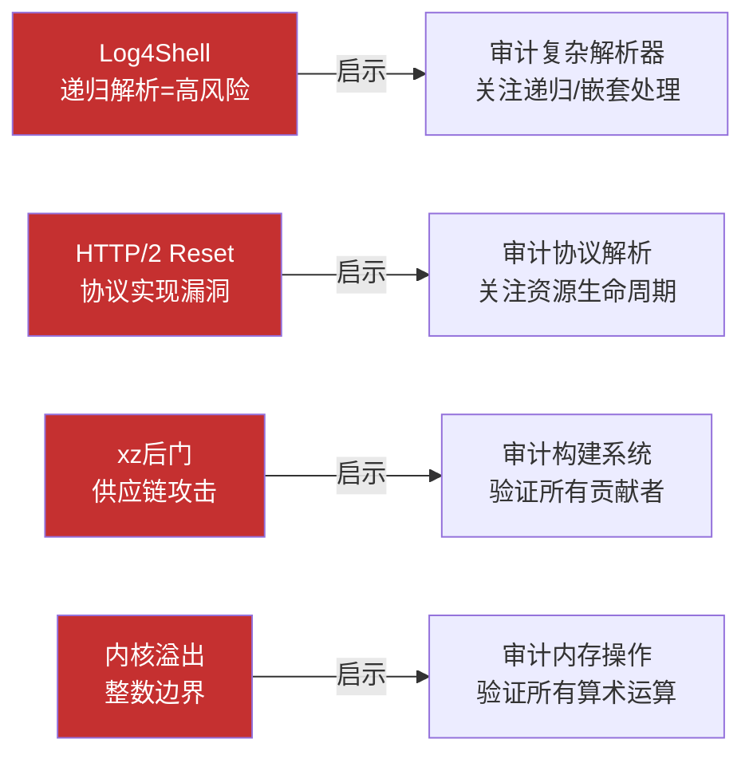
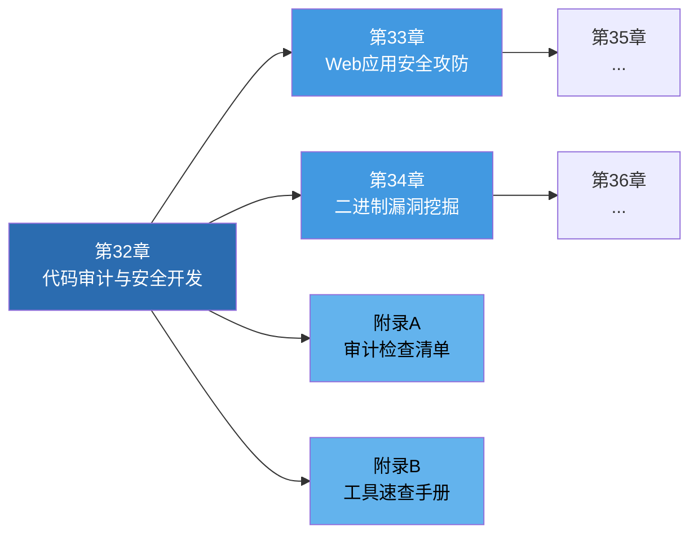

# 32.6 本章小结

## 知识体系全景图

本章围绕"代码审计与安全开发"构建了一套从理论到实战的完整知识体系。以下全景图展示了各节之间的逻辑关系和知识流向：



## 核心知识点回顾

### 一、理论基础（32.1）

#### 代码审计方法论

代码审计的本质是通过系统性审查源代码来发现安全漏洞的主动防御实践。掌握以下四种核心分析方法是入门的第一步：

| 方法 | 核心原理 | 适用场景 | 学习难度 |
|------|----------|----------|----------|
| **数据流分析** | 追踪从 Source（用户输入/外部数据）到 Sink（危险操作/敏感函数）的完整路径 | 注入类漏洞（SQL注入、命令注入、XSS） | ★★★☆☆ |
| **控制流分析** | 分析程序执行路径，关注条件分支、异常处理和并发竞态 | 逻辑漏洞、竞态条件、权限绕过 | ★★★★☆ |
| **自顶向下法** | 从系统架构 → 模块划分 → 函数实现，逐层递进 | 大型项目首次审计、架构级安全评估 | ★★☆☆☆ |
| **自底向上法** | 从危险函数（如 `eval()`、`system()`）出发逆向追踪调用链 | 专项漏洞审计、紧急安全排查 | ★★★☆☆ |

> **实践建议**：初学者建议从自底向上法入手，先掌握危险函数清单（如 OWASP 的危险函数列表），再逐步过渡到数据流分析。进阶后应将自顶向下法作为系统性审计的首选方法。

#### 安全开发生命周期（SDL）

SDL 将安全活动嵌入软件开发的每个阶段，核心理念是"安全左移"——越早发现漏洞，修复成本越低。IBM 的研究表明，在设计阶段发现的漏洞修复成本仅为发布后修复的 1/100。



**SDL 各阶段的核心安全活动**：

| 阶段 | 安全活动 | 产出物 | 负责角色 |
|------|----------|--------|----------|
| 培训 | 安全编码规范培训、威胁建模培训 | 培训记录、考核结果 | 安全团队 |
| 需求 | 安全需求收集、合规性分析、隐私影响评估 | 安全需求规格书 | 产品+安全 |
| 设计 | 威胁建模（STRIDE/PASTA）、安全架构评审 | 威胁模型文档、安全设计规范 | 架构+安全 |
| 实现 | 安全编码、代码审查、SAST扫描 | 审计报告、修复记录 | 开发+安全 |
| 验证 | DAST/IAST测试、渗透测试、模糊测试 | 漏洞报告、测试报告 | 测试+安全 |
| 发布 | 安全签核、配置审查、部署安全检查 | 发布安全评审表 | 安全团队 |
| 响应 | 漏洞响应流程、安全事件处理、根因分析 | 事件报告、改进措施 | 安全+运维 |

**DevSecOps 是 SDL 的现代化演进**。传统 SDL 偏重流程管控，DevSecOps 则将安全活动进一步自动化并深度集成到 CI/CD 流水线中：

- **代码提交阶段**：自动触发 SAST 扫描（Semgrep/CodeQL）
- **依赖安装阶段**：自动执行依赖漏洞检查（Trivy/Snyk）
- **构建阶段**：容器镜像安全扫描、IaC 安全检查
- **部署阶段**：动态安全测试、配置合规验证
- **运行时**：RASP（运行时应用自我保护）、WAF 规则更新

#### 威胁建模

威胁建模是安全设计阶段的核心活动，其价值在于：在代码编写之前就识别潜在的安全风险，从而以最低成本规避问题。

**四大核心方法对比**：

| 方法 | 核心思路 | 优势 | 局限 | 适用阶段 |
|------|----------|------|------|----------|
| **DFD + STRIDE** | 数据流图 + 威胁分类 | 结构化、覆盖面广 | 学习曲线陡峭 | 设计阶段 |
| **DREAD** | 风险量化评估 | 简单易用、便于排序 | 主观性强、不够精确 | 评估阶段 |
| **PASTA** | 以攻击者为中心的七步法 | 贴近实战、全面 | 耗时较长 | 全生命周期 |
| **Attack Tree** | 攻击路径树形建模 | 直观、可视化 | 可能遗漏非预期路径 | 特定资产保护 |

> **STRIDE 模型速记**：S-欺骗(Spoofing)、T-篡改(Tampering)、R-抵赖(Repudiation)、I-信息泄露(Information Disclosure)、D-拒绝服务(Denial of Service)、E-权限提升(Elevation of Privilege)。每个字母对应一类威胁，确保分析不遗漏。

---

### 二、核心技巧（32.2）

#### 静态应用安全测试（SAST）

SAST 在不运行代码的情况下分析源代码的安全性，是"安全左移"的核心技术支撑。

**主流 SAST 工具深度对比**：

| 工具 | 分析深度 | 语言支持 | 规则生态 | 集成难度 | 核心优势 |
|------|----------|----------|----------|----------|----------|
| **Semgrep** | 中等（模式匹配+污点追踪） | 20+语言 | 2000+社区规则 | 低（单文件即可运行） | 自定义规则编写简单，CI集成零配置 |
| **CodeQL** | 深度（语义分析+数据流） | 7+主流语言 | 2000+官方规则 | 中（需编译数据库） | 最强语义分析能力，适合复杂漏洞挖掘 |
| **Bandit** | 中等（AST分析） | Python | 内置规则集 | 极低（pip install即用） | Python项目首选，零配置上手 |
| **Trivy** | 依赖层（SCA） | 全语言 | NVD/OSV数据库 | 极低 | 供应链安全扫描利器 |
| **SonarQube** | 中等（模式+数据流） | 30+语言 | 4000+规则 | 中（需部署服务） | 代码质量+安全一体化平台 |

**SAST 工具选型决策树**：



#### 动态应用安全测试（DAST）与交互式AST（IAST）

| 测试方式 | 工作原理 | 优势 | 劣势 | 典型工具 |
|----------|----------|------|------|----------|
| **DAST** | 从外部发送恶意请求，观察响应 | 语言无关、模拟真实攻击 | 无法定位代码行、覆盖率依赖爬虫 | OWASP ZAP、Burp Suite |
| **IAST** | 在应用内部插桩，监控运行时数据流 | 精确定位代码行、低误报率 | 需要部署代理、有性能开销 | Contrast Security、Seeker |
| **RASP** | 运行时自我保护，实时阻断攻击 | 零延迟防御、无需修改代码 | 可能影响性能、需要规则维护 | OpenRASP、Contrast Protect |

#### 模糊测试（Fuzzing）

模糊测试是发现内存安全漏洞最有效的自动化技术。其核心价值在于：以极低的人工投入发现人工审计难以覆盖的边界条件和异常路径。

**主流 Fuzzer 对比与选择**：

| Fuzzer | 工作模式 | 目标类型 | 覆盖率引导 | 核心优势 |
|--------|----------|----------|------------|----------|
| **AFL/AFL++** | 进程外（fork-server） | 二进制/编译型语言 | 基于边覆盖 | 社区活跃、生态完善、支持比较器变异 |
| **libFuzzer** | 进程内（in-process） | 库函数/接口 | 基于边覆盖 | 速度极快（10K+exec/s）、LLVM原生集成 |
| **atheris** | 进程内 | Python代码 | 基于边覆盖 | Python原生、无需修改目标代码 |
| **Honggfuzz** | 混合模式 | 多架构二进制 | 多目标反馈 | 支持硬件反馈（Intel PT）、多架构 |
| **Jazzer** | 进程内 | Java/ JVM | 基于边覆盖 | Java生态首选、支持反射变异 |

**模糊测试关键实践要点**：

1. **语料库管理**：初始语料库的质量直接决定 fuzzer 效率。好的种子应覆盖正常输入的多样化格式，而非大量畸形数据
2. **持久化模式**：将目标程序改为循环接收输入（而非每次 fork 新进程），可将执行速度提升 10-100 倍
3. **覆盖率分析**：通过 `afl-showmap` 或 `-dump_coverage` 监控覆盖率增长趋势，当覆盖率停滞时调整变异策略
4. **崩溃去重与复现**：使用 fuzzer 的崩溃分类功能（如 AFL 的 `-C` 选项）去重，确保每个唯一崩溃都被记录和分析
5. **语料蒸馏**：定期从海量语料中提取最小可达覆盖集，减少存储和回放开销

---

### 三、实战案例（32.3）

本章通过四个真实 CVE 案例展示了代码审计的实战方法论，每个案例代表一类典型漏洞模式：

| 案例 | CVE编号 | 漏洞类型 | 核心教训 | 审计方法 |
|------|---------|----------|----------|----------|
| **Log4Shell** | CVE-2021-44228 | JNDI注入 | 框架级组件的安全影响呈指数级放大 | 数据流分析（递归解析追踪） |
| **HTTP/2 Rapid Reset** | CVE-2023-44487 | 资源耗尽DoS | 协议实现中的资源管理是关键薄弱点 | 控制流分析（资源生命周期） |
| **xz-utils后门** | CVE-2024-3094 | 供应链攻击 | 构建系统安全和贡献者信任验证不可或缺 | 构建流程审计（diff分析） |
| **Linux内核堆溢出** | CVE-2022-0185 | 内存安全 | 边界检查和累积大小验证是防御底线 | 内存操作审计（整数溢出追踪） |

**案例启示总结**：



---

### 四、常见误区（32.4）

代码审计中的误区可以归纳为三大类，每类都可能导致审计失败或产生虚假安全感：

#### 认知误区

| 误区 | 真相 | 数据支撑 |
|------|------|----------|
| "自动化工具可以替代人工审计" | 工具是辅助手段，人工判断不可替代 | 工具误报率30%-70%，漏报率50%-80%（NIST研究报告） |
| "只找危险函数就够了" | 必须追踪完整数据流才能确认可利用性 | 约40%的危险函数调用存在有效的输入验证或沙箱隔离 |
| "找到漏洞就完成审计" | 完整的审计报告包含漏洞详情、影响分析、修复建议和验证方法 | 无报告的审计结果无法被开发团队有效理解和执行 |

#### 技术误区

| 误区 | 真相 | 补充说明 |
|------|------|----------|
| "只看入口点就够了" | 数据库数据、配置文件、第三方返回值、反序列化数据都是攻击源 | 内部数据源（如数据库）一旦被其他漏洞污染，同样可作为注入点 |
| "做了过滤就安全" | 黑名单过滤几乎总是可以被绕过，应使用白名单验证 | 常见绕过：编码变换、大小写混淆、注释插入、Unicode特殊字符 |
| "用了HTTPS就安全" | HTTPS只保护传输层，不解决应用层安全问题 | SQL注入、XSS、CSRF等应用层漏洞与传输层加密无关 |

#### 流程误区

| 误区 | 真相 | 正确做法 |
|------|------|----------|
| "审计不需要准备" | 充分准备是审计成功的基础 | 预研阶段：了解架构、收集文档、配置环境、确定审计范围 |
| "报告可以模板化" | 内容必须针对具体项目定制 | 模板提供结构，但每个漏洞的描述、影响分析和修复建议必须是唯一的 |
| "审计一次就够" | 需要建立持续安全审计体系 | 代码变更触发增量审计 + 定期全量审计 + 发布前安全签核 |

---

### 五、练习方法（32.5）

**在线练习平台**：

| 平台 | 特色 | 难度范围 | 推荐场景 |
|------|------|----------|----------|
| **PortSwigger Academy** | 最系统的Web安全实验室，免费 | 入门→进阶 | 系统化学习Web漏洞原理与利用 |
| **WebGoat** | OWASP官方教学项目，有引导 | 入门→中级 | 理解OWASP Top 10各类漏洞 |
| **Juice Shop** | 现代化Web应用，CTF风格 | 入门→高级 | 自主探索和CTF式闯关练习 |
| **DVWA** | 经典PHP漏洞靶场，可调难度 | 入门→中级 | 快速上手Web渗透测试工具 |
| **OWASP WrongSecrets** | 专注密钥管理和安全配置 | 中级→高级 | 学习密钥泄露检测和安全配置 |

**开源项目审计练习路径**：

| 阶段 | 推荐项目 | 审计重点 | 预计耗时 |
|------|----------|----------|----------|
| 入门 | Flask-Security、Requests | 输入验证、认证逻辑 | 2-4周 |
| 进阶 | Express.js、jsonwebtoken | JWT验证、中间件安全 | 4-8周 |
| 高级 | OpenSSL、Nginx | 内存安全、协议实现 | 3-6个月 |

**CTF 竞赛平台**：

| 平台 | 语言 | 特色 | 适合阶段 |
|------|------|------|----------|
| PicoCTF | 英文 | 卡内基梅隆大学出品，教学导向 | 入门 |
| OverTheWire | 英文 | Linux命令行和安全基础 | 入门→中级 |
| CTFHub | 中文 | 题目分类清晰，技能树体系 | 入门→进阶 |
| BUUCTF | 中文 | 历年真题收录丰富 | 中级→高级 |
| 攻防世界 | 中文 | 新手区+进阶区+高手区 | 全阶段 |

**学习路线时间规划**：

| 阶段 | 时长 | 核心目标 | 关键里程碑 |
|------|------|----------|------------|
| 基础 | 1-3个月 | 掌握Web安全基础概念和工具使用 | 能独立完成DVWA全部关卡 |
| 进阶 | 3-6个月 | 掌握SAST工具使用，能分析简单CVE | 完成一个开源项目的审计报告 |
| 高级 | 6-12个月 | 能编写自定义审计规则，掌握模糊测试 | 在CTF中获得稳定排名 |
| 专家 | 12个月+ | 发现0day，参与安全研究 | 提交CVE，发表安全研究文章 |

---

## 关键实践清单

以下是完成本章学习后应当掌握的核心能力清单，可用于自我评估和持续改进：

```text
代码审计核心实践清单
├── 理论基础
│   ├── [ ] 理解数据流分析和控制流分析的区别与应用场景
│   ├── [ ] 能够为一个项目执行完整的STRIDE威胁建模
│   ├── [ ] 理解SDL各阶段的安全活动及其产出物
│   └── [ ] 能够区分SAST、DAST、IAST的适用场景
├── 工具技能
│   ├── [ ] 熟练使用至少一种SAST工具（Semgrep或CodeQL）
│   ├── [ ] 能够编写Semgrep自定义规则检测项目特定模式
│   ├── [ ] 能够使用AFL++或libFuzzer对目标程序进行模糊测试
│   ├── [ ] 能够使用Trivy扫描项目依赖漏洞
│   └── [ ] 能够使用OWASP ZAP进行基础的DAST扫描
├── 实战能力
│   ├── [ ] 完成至少一个开源项目的完整审计（含报告）
│   ├── [ ] 能够分析至少2个真实CVE并编写可复现的PoC
│   ├── [ ] 能够编写符合行业标准的代码审计报告
│   └── [ ] 建立个人代码审计检查清单（Checklist）
├── 流程规范
│   ├── [ ] 理解DevSecOps流水线中各安全工具的集成位置
│   ├── [ ] 能够设计一个适合团队的代码审计流程
│   └── [ ] 建立持续安全审计的机制（变更触发+定期审计）
└── 持续成长
    ├── [ ] 定期跟踪安全社区动态（CVE、安全会议、研究论文）
    ├── [ ] 在CTF竞赛中保持稳定的参与和排名
    └── [ ] 向开源项目贡献安全修复或审计报告
```

---

## 核心理念总结

> **代码审计的本质是在正确的时间、以正确的方式、检查正确的代码。** 不是所有代码都需要同等强度的审计——识别高风险模块（处理用户输入、认证授权、加密操作、外部接口）并集中资源，是最高效的审计策略。

> **安全开发的核心是"安全左移"——将安全活动尽可能前移到需求和设计阶段。** 在需求阶段发现一个安全缺陷的修复成本约 $10，在设计阶段约 $100，在编码阶段约 $1,000，在测试阶段约 $10,000，在生产环境则可能高达 $100,000 以上（NIST Cost of Poor Software Quality Report）。

> **工具是起点，不是终点。自动化工具负责效率，人工审计负责深度。** 最佳实践是建立"工具筛选 + 人工确认"的两层审计机制：工具负责大规模初筛，人工负责深度验证和复杂漏洞挖掘。

> **持续学习是保持竞争力的唯一途径——安全领域没有一劳永逸的解决方案。** 新的编程语言、框架、协议和攻击技术不断涌现，昨天的最佳实践可能是明天的安全隐患。保持对安全社区的关注，持续参与CTF和开源审计，是维持技能水平的最有效方式。

---

## 章节知识关联与进阶路径

本章内容与后续章节紧密关联，形成渐进式的知识体系：

| 后续章节 | 关联内容 | 进阶方向 |
|----------|----------|----------|
| **第33章：Web应用安全攻防** | 32.3中的Log4Shell和HTTP/2案例 | 从代码层面上升到Web架构层面的安全攻防 |
| **第34章：二进制漏洞挖掘与利用** | 32.2中的模糊测试和32.3中的内核溢出案例 | 从源码审计进阶到无源码的二进制审计 |
| **附录A：代码审计检查清单** | 32.5中的审计清单实践 | 完整的、可直接使用的检查清单模板 |
| **附录B：安全工具速查手册** | 32.2中所有工具的使用方法 | 工具配置和使用的快速参考指南 |



> **一句话总结**：代码审计是"找到问题"，安全开发是"避免问题"，两者结合才是完整的软件安全实践。掌握本章内容后，你已经具备了对任何项目进行系统性安全审计的基础能力——接下来需要的是在真实项目中持续实践和积累经验。
